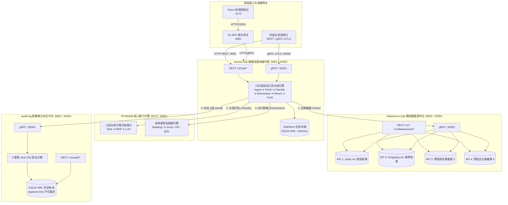

# 数盾 PrivShield (Data & Privacy Shield)

> **数联天下 · 数盾 (PrivShield)** —— 企业级数据隐私计算、多原语脱敏与三层动态分类分级治理中台 (Data Privacy & Security Governance Sidecar & Platform)，全面落地 **「三层四柱五御六类」数据安全与隐私治理架构**，提供 REST + gRPC 双协议高可用服务与政务级全链路流通调度中台。
>
> 🌐 **GitHub Repository**: [https://github.com/fengzhizi319/PrivShield-go](https://github.com/fengzhizi319/PrivShield-go)

---

## 一、 平台架构与多语言分层

PrivShield 采用纯 **Go 1.25+ 云原生 Monorepo 架构**，清晰解耦底层算力、业务编排中台与表现层接入：

```text
PrivShield/ (Repo Root)
├── services/                         # 【商业化生产微服务群】
│   ├── privacy-engine/               # Go 核心隐私计算与动态分类分级引擎 REST(:8079) + gRPC(:50051)
│   │   ├── cmd/                      # Agent 与 Gateway 启动入口
│   │   ├── internal/                 # 动态分类分级漏斗、网关反向代理、DICOM影像脱敏、可观测性
│   │   ├── sdk/                      # 纯 Go 隐私计算数学原语库 (Masking, DP, LDP, K-Ano, Medical, Budget)
│   │   ├── rules/                    # 敏感特征分类分级标准与规则库 (GB/T 37988, 医疗, 医保, 金融)
│   │   └── docs/ deploy/ scripts/    # 引擎专属自治交付资产与 Makefile
│   ├── service-hub/                  # 数据服务调度中枢 (:8082) - 唯一编排调度入口 (Ingest→Classify→Mask→Audit)
│   │   └── docs/ deploy/ scripts/    # 中枢专属自治交付资产与 Makefile
│   └── audit-log/                    # 脱敏审计与不可篡改存证微服务 (:8084)
│       └── docs/ deploy/ scripts/    # 审计专属自治交付资产与 Makefile
├── console/                          # 【测试与接入生态】
│   ├── engine-console/               # 引擎专属管理控制台 (专测 privacy-engine)
│   │   ├── bff-go/                   # Go gRPC/HTTPS API Gateway / BFF (:8081)
│   │   ├── web/                      # React 18 + TS + Vite 前端交互控制台 (:5173)
│   │   └── docs/ deploy/ scripts/    # 专属自治交付资产与 Makefile
│   ├── app-lz/                       # 数联调度之眼业务模拟器 (专测 service-hub 调度编排)
│   │   ├── bff-go/                   # 业务专有 BFF (:8085，所有数据请求统一走 service-hub)
│   │   ├── web/                      # 业务流水线控制台前端 (:5174)
│   │   └── docs/ deploy/ scripts/    # 专属自治交付资产与 Makefile
│   └── mock-datasource/              # 模拟多源异构数据源微服务 (:8083)
│       └── docs/ deploy/ scripts/    # 专属自治交付资产与 Makefile
├── pkg/                              # 【Go 全局共享基础库】连接池、中间件、安全防御、国密密码学、存储
├── proto/                            # 【Protobuf 契约定义】privacy.proto / servicehub.proto
├── deploy/                           # 【全栈集中运维套件】Docker Compose / Helm / K8s / Prometheus / Grafana
├── config/                           # 环境变量模板、Profile YAML、mTLS 白名单
├── data/                             # 样例数据集与测试数据
└── scripts/                          # 开发、测试、压测与生产自动化全栈运维工具链
```

---

## 二、 核心能力概览

### 1. 隐私保护计算原语 (Processing Primitives)

| 隐私原语 | REST 端点 | gRPC 接口 | 本地 SDK 方法 | 算法特性 |
|---|---|---|---|---|
| **数据脱敏** | `POST /v1/privacy/mask` | `Mask` | `PrivacyService.mask` | 字段语义识别、掩码掩盖、FPE 格式保留加密 |
| **整记录脱敏** | `POST /v1/privacy/mask_record` | `MaskRecord` | `PrivacyService.mask_record` | 批量字段并行处理、个性化 Profile 策略 |
| **HMAC 哈希** | `POST /v1/privacy/hash` | `Hash` | `PrivacyService.hash` | 盐值混淆、SHA-256 不可逆单向变换 |
| **差分隐私计数** | `POST /v1/privacy/dp/count` | `DPCount` | `PrivacyService.dp_count` | Laplace / Gaussian 机制、预算实时消耗 |
| **差分隐私求和** | `POST /v1/privacy/dp/sum` | `DPSum` | `PrivacyService.dp_sum` | 灵敏度截断、解析高斯极值保护 |
| **差分隐私均值** | `POST /v1/privacy/dp/mean` | `DPMean` | `PrivacyService.dp_mean` | 边界夹紧、噪声校准 |
| **本地差分隐私 LDP** | `POST /v1/privacy/ldp` | `LDP` | `PrivacyService.ldp` | 本地化随机响应、频数/直方图估计 |
| **K-匿名泛化** | `POST /v1/privacy/k_anonymize/record` | `KAnonymizeRecord` | `PrivacyService.k_anonymize_record` | Mondrian 多维区间划分、准标识符泛化 |
| **文件级隐私处理** | `POST /v1/file/process` | — | `PrivacyService.process_file` | CSV/Excel/JSON 自动识别、字段级脱敏 |
| **医疗数据流水线** | `POST /v1/medical/process` | — | `PrivacyService.process_medical` | DICOM/HL7/FHIR 解析、影像脱敏 |
| **参数推荐** | `POST /v1/profile/recommend` | — | `PrivacyService.recommend_profile` | 基于数据特征推荐脱敏策略 |
| **运维诊断** | `GET /v1/ops/diagnostics` | — | — | 运行时健康、依赖与配置快照 |
| **查询混淆注入** | `POST /v1/privacy/qol/obfuscate` | `ObfuscateQuery` | `PrivacyService.obfuscate_query` | 假查询注入、KL 散度混淆 |
| **隐私预算记账** | `GET /v1/privacy/budget` | `Health` | `PrivacyService.budget_remaining` | 内存/SQLite/Redis Lua 原子记账、滑动窗口重置 |

### 2. 动态数据分类分级三层漏斗 (Dynamic Classification Funnel)

引擎构建了 **“规则引擎 → 实体识别 → 认知仲裁”** 阶梯式识别架构：

1. **Layer-1：高性能声明式规则引擎**：毫秒级 YAML 规则匹配、正则表达式、关键词字典和校验和算子；
2. **Layer-2：轻量命名实体识别**：采用 ONNX / ModelScope NER，从无显式规则特征的文本中提取上下文实体；
3. **Layer-3：本地 LLM / VLM 仲裁**：对低置信度、歧义场景或医学影像执行语义仲裁；
4. **安全底座兜底**：高敏安全红线确保任何降级与仲裁都不低于法定最低保护等级。

### 3. 企业级数据流通中台微服务群 (Go Microservices)

PrivShield 采用 Go 语言构建企业级数据流通中台微服务群（位于 [`services/`](services/)），依托 Monorepo 工作区（[`go.work`](go.work)）与共享基础库（[`pkg/`](pkg/)），为政务与企业数据要素安全流通提供高并发、低延迟的流水线编排、数据源沙箱以及不可篡改审计存证：



#### 3.1 数据服务调度中枢 ([services/service-hub](services/service-hub))
* **核心职责**：企业数据流通链路的调度指挥中枢，对外提供标准 REST (`:8082`) 与高性能 gRPC (`:50052`) 双协议接入，串联国密专线接入、多源异构拉取、动态策略下发与存证回传。
* **6 阶段自动化调度流水线**：
  $$\text{① Ingest (接入)} \longrightarrow \text{② Fetch (取数)} \longrightarrow \text{③ Classify (分类)} \longrightarrow \text{④ Desensitize (脱敏)} \longrightarrow \text{⑤ Return (返回)} \longrightarrow \text{⑥ Audit (存证)}$$
  1. **接入 (`ingest`)**：校验请求凭据与策略参数，生成全局唯一 `task_id`，初始化任务状态机；
  2. **取数 (`fetch`)**：若未携带明文数据，自动联动 `datasource-mgr` 按数据源标识（如 `ds_yibao`）拉取样本或全量数据；
  3. **分类 (`classify`)**：自动请求 PrivShield Agent 三层分类漏斗（Rule ➔ NER ➔ LLM）判定数据敏感度级别（L1~L5）；
  4. **脱敏 (`desensitize`)**：自适应映射脱敏策略，调用底层算子执行字段动态打码、K-匿名泛化、差分隐私加噪或查询混淆；
  5. **返回 (`return`)**：完成脱敏结果结构化组装与治理耗时度量，校验格式后交付调用方；
  6. **存证 (`audit`)**：向 `audit-log` 微服务提交存证请求，将 8 要素哈希链与脱敏快照持久化，状态机闭环收敛。
* **敏感度等级与自适应脱敏映射矩阵**：
  * **L1（公开数据）** $\rightarrow$ 无脱敏直接流通 (`none`)
  * **L2（内部数据）** $\rightarrow$ 字段级动态打码 (`mask`)
  * **L3（敏感数据）** $\rightarrow$ K-匿名区间泛化 (`k_anon`)
  * **L4（机密数据）** $\rightarrow$ 差分隐私截断加噪 (`dp`)
  * **L5（绝密数据）** $\rightarrow$ 查询混淆与阻断防护 (`qol`)
* **高可用与容错恢复机制**：
  * **任务生命周期持久化**：支持纯内存（测试）与 SQLite WAL 读写分离（生产）双存储模式；
  * **启动崩溃恢复 (Crash Recovery)**：启动时自动扫描回收孤立任务（running 标记失败、pending 保留等待调度）；
  * **指数退避重试 (Backoff Retry)**：内置后台重试协程，对下游网络抖动或临时异常执行指数退避重试（带最大重试次数限制）；
  * **并发容量熔断**：基于信号量（Semaphore）实施硬性并发任务上限保护，过载快速响应 `503 Service Unavailable`；
  * **零信任 mTLS**：集成 `pkg/tlsutil`，强制 TLS 1.3 客户端证书双向认证与 SPKI 公钥固定。
* 📖 [设计文档](services/service-hub/docs/design.md) · [学习指南](services/service-hub/docs/learning-guide.md) · [可靠性能力](services/service-hub/docs/reliability.md)

#### 3.2 模拟数据源与资产管理微服务 ([console/mock-datasource](console/mock-datasource))
* **核心职责**：专为开发联调、沙箱演练与数据探查设计的轻量级仿真数据中台，对外提供 HTTPS REST (`:8083`) 与 gRPC (`:50053`) 双协议。
* **4 大内置独立模拟数据源体系**：
  * **API 1 医保数据源** (`GET /v1/yibao` / `GetYibaoData`)：就医结算明细，含身份证号、患者姓名、就医诊断、社保卡号、自费金额与统筹支付等高敏字段；
  * **API 2 康养数据源** (`GET /v1/kangyang` / `GetKangyangData`)：健康档案与体格指标，含老人编号、慢病史、体检血压、生活自理等级评估等；
  * **API 3 预留政务数据源 3** (`GET /v1/mock3` / `GetMockData3`)：政务跨部门协同与审批流水模拟；
  * **API 4 预留企业数据源 4** (`GET /v1/mock4` / `GetMockData4`)：财务税收与企业统计报表模拟。
* **纯无状态架构与沙箱安全**：
  * **无状态自愈**：无本地状态机与持久化队列，具备秒级热启动与水平扩缩容能力；
  * **数据源沙箱隔离 (LFI 防护)**：严格限制 CSV 文件白名单与基名校验，硬性限制单次最多加载 50,000 行，阻断任意目录穿越与系统文件逃逸；
  * **资产目录与元数据探查**：提供数据源 CRUD 目录、动态分页样本抽样（`/v1/datasources/:id/records`）、Schema 元数据探查（`/v1/datasources/:id/metadata`）与访问审计日志追踪。
* 📖 [设计文档](console/mock-datasource/docs/design.md) · [学习指南](console/mock-datasource/docs/learning-guide.md) · [可靠性能力](console/mock-datasource/docs/reliability.md)

#### 3.3 脱敏审计与不可篡改存证微服务 ([services/audit-log](services/audit-log))
* **核心职责**：国家数据安全法合规存证中枢，为数据流通全生命周期提供「可追溯、防篡改、抗抵赖」的司法级审计存证底座，暴露 REST (`:8084`) 与 gRPC (`:50054`)。
* **8 要素增强防篡改哈希存证引擎**：
  * 采用 SHA-256 密码学算法对 8 大治理核心要素进行链式签名：
    $$\text{IntegrityHash} = \text{SHA256}(\text{logID} \parallel \text{timestamp} \parallel \text{algorithm} \parallel \text{inputHash} \parallel \text{outputHash} \parallel \text{user} \parallel \text{securityLevel} \parallel \text{paramsJSON})$$
  * 任何微小数据或参数变更均会引发哈希雪崩效应，动态核验端点立即触发安全告警。
* **只增不改 (Append-Only) 与数据库完整性校验**：
  * 存储层严格遵循 Append-Only 规范，代码级杜绝 `UPDATE` 与 `DELETE` 接口；
  * 采用 SQLite WAL 读写分离引擎，启动自动执行 `PRAGMA integrity_check` 坏库阻断；
  * 提供在线动态存证核验（`POST /v1/audit/snapshots/verify`）以及独立离线校验脚本（`scripts/prod/verify_audit.sh`）。
* **SQL 级高性能合规报告与多维统计**：
  * 基于 SQLite 原生 SQL 聚合引擎（`GetStats` / `GenerateReport`）执行毫秒级多维统计（按算子、等级、时间段、用户），从架构上杜绝大数据集载入内存导致的 OOM 隐患。
* **业务合规存证 vs 基础设施运维日志 (Loki / ELK) 职责分离**：
  * **业务合规存证面**：由 `audit-log` 独立负责 8 要素哈希链存证与司法级抗抵赖；
  * **运维可观测面**：通过 Go `log/slog` 输出标准单行 JSON 日志至 stdout，由 Promtail / Vector 收集并投递给 Grafana Loki 进行 SRE 监控分析。
* 📖 [设计文档](services/audit-log/docs/design.md) · [学习指南](services/audit-log/docs/learning-guide.md) · [可靠性能力](services/audit-log/docs/reliability.md)

#### 3.4 全局共享基础库 ([pkg/](pkg/)) 与控制台 BFF ([console/bff-go](console/bff-go))
* **`pkg/grpcpool`**：高性能 gRPC 客户端连接池，支持连接保活、自动探活与负载轮询；
* **`pkg/middleware`**：统一 Gin 中间件链（API Key 鉴权、CORS、RequestID 链路追踪、IP 令牌桶限流、Slowloris 慢速防护、MaxBodySize 拦截）；
* **`pkg/tlsutil`**：零信任 TLS 1.3 双向证书校验与 SPKI 公钥固定工具库；
* **`pkg/config`**：统一配置加载与标准 Go `log/slog` 结构化日志组件；
* **`pkg/metrics`**：统一 Prometheus 指标收集器，一键挂载 `/metrics` 端点；
* **`console/bff-go`**：控制台 BFF 代理网关（`:8081`），集成 gRPC 自动重试策略（指数退避 1s$\rightarrow$8s）与优雅停机收敛。

### 4. 全栈多层次纵深防 DDoS 与安全基底 (Anti-DDoS & Security Shield)

- **协议级慢速攻击防护 (Anti-Slowloris)**：强制设置 `ReadHeaderTimeout: 5s`、`ReadTimeout: 30s` 与 `MaxHeaderBytes: 1MB`；
- **大包 DoS 拦截 (MaxBodySize)**：全微服务配置 32MB/64MB 请求体上限，超限使用 `http.MaxBytesReader` 快速返回 `413 Payload Too Large`；
- **IP 令牌桶防刷 (RateLimit)**：提供并发安全 `IPRateLimiter`（自动后台 GC 10 分钟闲置 IP 桶），超额响应 `429 Too Many Requests` 与 `Retry-After: 1`；
- **并发容量硬顶 (MaxConcurrent)**：信号量并发熔断保护协程池，过载快速响应 `503 Service Unavailable`；
- **数据源沙箱防护 (LFI Prevention)**：CSV 上传校验 `.csv` 白名单、提取 `BaseName` 并在指定目录沙箱内加载，硬性限制 50,000 行。

---

## 三、 快速开始 (Quick Start)

### 1. 本地原生开发与控制台启动

适合快速进行前端热更新调试、Python 算法原语演练或 Go BFF 网关联调。

```bash
# 1. 启动本地开发控制台三件套（【主力推荐】Python Agent :8079/:50051 + Go BFF :8081 + Vite 前端 :5173 HMR）
# 脚本会自动按序拉起 Agent 与 BFF，前端支持毫秒级热更新；--force 自动释放占用端口
bash ./scripts/dev/dev-bff-agent.sh
```

```bash
# 2. 启用 mTLS 双向认证模式启动控制台
bash ./scripts/dev/dev-bff-agent.sh --mtls
```

```bash
# 3. Windows PowerShell 环境运行
.\scripts\dev\dev-bff-agent.ps1
```

```bash
# 4. 一键优雅停止本地开发控制台服务群
bash ./scripts/dev/dev-stop.sh
```

```bash
# 5. 仅独立运行 Python 核心隐私计算引擎（REST :8079 + gRPC :50051）
python -m engine.server
```

### 2. 中台微服务群管理与协同

当需要调试 6 阶段调度流水线、数据源资产探查与审计存证功能时使用：

```bash
# 1. 仅启动 3 大 Go 中台微服务（service-hub :8082, datasource-mgr :8083, audit-log :8084）
# （前提：Python 核心 Agent 已在 :8079 独立运行）
bash ./scripts/dev/dev-start-new-modules.sh
```

```bash
# 2. 停止由上述脚本启动的 3 大微服务
bash ./scripts/dev/dev-stop-new-modules.sh
```

```bash
# 3. 【真实全量环境】一键按序启动 Agent + 3 大 Go 中台微服务（真实 E2E 联调推荐）
bash ./scripts/dev/e2e-start-all-services.sh
```

```bash
# 4. 停止真实全量 E2E 服务集
bash ./scripts/dev/e2e-stop-all-services.sh
```

```bash
# 5. 后台守护进程模式启动全量服务群（Agent + BFF + 3 大中台微服务，自动生成 PID 文件）
bash ./scripts/dev/start_all_services.sh --with-services
```

```bash
# 6. 停止全量后台服务群
bash ./scripts/dev/stop_all_services.sh
```

### 3. Docker 容器化联调与部署

通过 Docker Compose 一键拉起容器化集群，内置宿主机预编译优化，跳过慢速依赖拉取：

```bash
# 1. 【推荐 Docker 开发】启动控制台三件套容器（Agent + Go BFF :8081 + Web UI :5173）
bash ./scripts/dev/docker-start-bff-agent.sh
```

```bash
# 2. 跳过本地镜像重新构建直接启动
bash ./scripts/dev/docker-start-bff-agent.sh --no-build
```

```bash
# 3. 一键启动全栈容器集群（Agent + 3 大 Go 中台微服务 + Go BFF + Web UI）
bash ./scripts/dev/docker-start-all.sh
```

```bash
# 4. 联动启动本地 vLLM 大模型推理容器（需要 NVIDIA GPU 与 Container Toolkit）
bash ./scripts/dev/docker-start-all.sh --with-llm
```

```bash
# 5. 独立启动 Agent 容器（core 为轻量纯 CPU 镜像，ml 为含 PyTorch/Transformers 的重型镜像）
# 启动 core 镜像
bash ./scripts/dev/docker-start-agent.sh core    
```

```bash
# 启动 ml 镜像
bash ./scripts/dev/docker-start-agent.sh ml      
```

```bash
# 停止 Agent 容器
bash ./scripts/dev/docker-stop-agent.sh         
```

```bash
# 6. 独立启动/停止本地 vLLM 大模型容器 (:8000)
bash ./scripts/dev/docker-start-llm.sh
```

```bash
bash ./scripts/dev/docker-stop-llm.sh
```

```bash
# 7. 启动 Prometheus (:9090) + Grafana (:3000) 监控大屏
docker compose --profile monitoring up -d
```

```bash
# 8. 一键停止全部开发容器及虚拟网络
bash ./scripts/dev/docker-stop.sh
```

### 4. 自动化测试、基准压测与环境运维工具

```bash
# 1. 运行控制台全套 E2E 自动化测试（Mock Agent + Go BFF + Vite Web 自动化联测）
bash ./scripts/dev/run_console_e2e_tests.sh
```

```bash
# 2. 运行 3 大中台微服务全流程集成测试（接口连通性、流水线调度与审计存证）
bash ./scripts/dev/integration-test-new-modules.sh
```

```bash
# 3. 运行隐私保护原语（脱敏/DP/K-Anon）基准性能压测
bash ./scripts/dev/benchmark_performance.sh
```

```bash
# 4. 全微服务健康诊断探针巡检（检查 Agent、BFF 与 3 大中台服务存活性）
bash ./scripts/dev/health_check.sh
```

```bash
bash ./scripts/dev/health_check.sh --all
```

```bash
# 5. 检查各微服务 Prometheus /metrics 端点连通性
bash ./scripts/dev/check_metrics_endpoints.sh
```

```bash
# 6. 启动 / 停止 Prometheus 与 Grafana 本地监控栈
bash ./scripts/dev/start_monitoring.sh
```

```bash
bash ./scripts/dev/stop_monitoring.sh
```

```bash
# 7. 本地开发环境依赖巡检（检查 Python, Go, Node.js, pnpm 及端口占用）
bash ./scripts/dev/verify_console_environment.sh
```

```bash
# 8. 一键重新生成全套 mTLS 开发测试证书链（CA, Server, Client 证书与私钥）
bash ./scripts/dev/generate_all_test_certs.sh
```

```bash
# 9. 重置并清理开发阶段生成的 SQLite 隐私预算数据库
bash ./scripts/dev/clean_privacy_budget_db.sh
```

```bash
# 10. 启动轻量级 Python Mock Agent 桩服务（无 ML 依赖快速联调）
python scripts/dev/mock_agent_server.py
```

### 5. 本地开发与运维脚本全景速查表

| 分类 | 脚本文件 | 执行命令 / 支持参数 | 核心功能与使用场景 |
|---|---|---|---|
| **控制台开发** | `dev-bff-agent.sh`<br/>`dev-bff-agent.ps1` | `bash ./scripts/dev/dev-bff-agent.sh`<br/>`[--mtls] [--force]` | **【主力推荐】** 一键启动 Agent + Go BFF (:8081) + Vite 前端 (:5173 HMR)。 |
| **控制台开发** | `dev-stop.sh` | `bash ./scripts/dev/dev-stop.sh` | 优雅停止本地运行的 Agent、Go BFF 及 Vite 前端。 |
| **中台微服务** | `dev-start-new-modules.sh` | `bash ./scripts/dev/dev-start-new-modules.sh` | 启动 3 大 Go 中台微服务（service-hub, datasource-mgr, audit-log），需 Agent 先行运行。 |
| **中台微服务** | `dev-stop-new-modules.sh` | `bash ./scripts/dev/dev-stop-new-modules.sh` | 停止由 `dev-start-new-modules.sh` 启动的 3 大微服务。 |
| **中台微服务** | `e2e-start-all-services.sh` | `bash ./scripts/dev/e2e-start-all-services.sh` | **【真实环境】** 一键按序拉起 Agent + 3 大 Go 中台微服务。 |
| **中台微服务** | `e2e-stop-all-services.sh` | `bash ./scripts/dev/e2e-stop-all-services.sh` | 停止真实 E2E 环境的全量服务进程。 |
| **中台微服务** | `start_all_services.sh` | `bash ./scripts/dev/start_all_services.sh --with-services` | 后台守护进程模式启动全量服务群（记录 PID 文件）。 |
| **中台微服务** | `stop_all_services.sh` | `bash ./scripts/dev/stop_all_services.sh` | 停止由 `start_all_services.sh` 启动的全量开发服务群。 |
| **Docker 联调** | `docker-start-bff-agent.sh`<br/>`docker-start-bff-agent.ps1` | `bash ./scripts/dev/docker-start-bff-agent.sh`<br/>`[--no-build] [--build]` | **【Docker 开发】** 启动控制台三件套容器（Agent + BFF + Web）。 |
| **Docker 联调** | `docker-start-all.sh` | `bash ./scripts/dev/docker-start-all.sh`<br/>`[--with-llm] [--no-build]` | 启动全栈 Docker 容器集群（Agent + 3 中台微服务 + BFF + Web）。 |
| **Docker 联调** | `docker-start-agent.sh`<br/>`docker-start-agent.ps1` | `bash ./scripts/dev/docker-start-agent.sh [core\|ml]` | 独立启动 Agent 容器（支持 core 纯 CPU 或 ml 重型镜像）。 |
| **Docker 联调** | `docker-stop-agent.sh` | `bash ./scripts/dev/docker-stop-agent.sh` | 停止由 `docker-start-agent.sh` 启动的 Agent 容器。 |
| **Docker 联调** | `docker-start-llm.sh`<br/>`docker-stop-llm.sh` | `bash ./scripts/dev/docker-start-llm.sh`<br/>`bash ./scripts/dev/docker-stop-llm.sh` | 启动 / 停止独立的本地 vLLM 大模型推理容器 (:8000)。 |
| **Docker 联调** | `docker-stop.sh` | `bash ./scripts/dev/docker-stop.sh` | 一键停止并清理所有通过 Docker Compose 启动的开发容器及网络。 |
| **测试与基准** | `run_console_e2e_tests.sh` | `bash ./scripts/dev/run_console_e2e_tests.sh` | 自动化启动 Mock Agent + Go BFF + Vite 并运行全套 E2E 测试。 |
| **测试与基准** | `integration-test-new-modules.sh` | `bash ./scripts/dev/integration-test-new-modules.sh` | 执行 3 大 Go 中台微服务全流程集成测试与数据流校验。 |
| **测试与基准** | `benchmark_performance.sh` | `bash ./scripts/dev/benchmark_performance.sh` | 执行隐私脱敏、差分隐私加噪、K-Anonymity 等原语基准性能压测。 |
| **诊断与运维** | `health_check.sh` | `bash ./scripts/dev/health_check.sh [--all]` | 全微服务健康诊断巡检探针。 |
| **诊断与运维** | `check_metrics_endpoints.sh` | `bash ./scripts/dev/check_metrics_endpoints.sh` | 检查全量服务 `/metrics` Prometheus 指标暴露端点连通性。 |
| **诊断与运维** | `start_monitoring.sh`<br/>`stop_monitoring.sh` | `bash ./scripts/dev/start_monitoring.sh`<br/>`bash ./scripts/dev/stop_monitoring.sh` | 一键启动 / 停止 Prometheus (:9090) 与 Grafana (:3000) 监控大屏。 |
| **诊断与运维** | `verify_console_environment.sh` | `bash ./scripts/dev/verify_console_environment.sh` | 检查 Go, Python, Node.js, pnpm 等本地依赖环境与端口占用。 |
| **安全与数据** | `generate_all_test_certs.sh` | `bash ./scripts/dev/generate_all_test_certs.sh` | 一键生成全套 mTLS 开发测试证书链（CA、Server、Client）。 |
| **安全与数据** | `clean_privacy_budget_db.sh` | `bash ./scripts/dev/clean_privacy_budget_db.sh` | 重置并清理开发阶段生成的 SQLite 隐私预算消费数据库。 |
| **桩服务** | `mock_agent_server.py` | `python scripts/dev/mock_agent_server.py` | 轻量级 Python Mock Agent，用于无 ML 依赖环境下的快速前端/BFF 联调。 |

> 💡 **提示**：Windows PowerShell 环境可运行同名 `.ps1` 脚本（如 `dev-bff-agent.ps1`、`docker-start-bff-agent.ps1` 等）。关于生产部署脚本（`scripts/prod/`）、数据生成脚本（`scripts/data/`）及硬件加速脚本（`scripts/env/`）详见 [scripts/README.md](scripts/README.md)。

### 6. 全服务端口与职责速查表

| 服务模块 | 默认端口 | 运行形态 | 职责说明 |
|---|---|---|---|
| **Privacy Engine (REST)** | `8079` | Python / FastAPI | 核心隐私算法与动态分类分级 REST 接口 |
| **Privacy Engine (gRPC)** | `50051` | Python / gRPC | 核心隐私算法高性能 RPC 通信接口 |
| **Console Web UI** | `5173` | React 18 + Vite | 控制台可视化大屏与各功能交互调试页面 |
| **Console BFF (Go)** | `8081` | Go / Gin + gRPC | 控制台 BFF 聚合网关，连接池与协议分流 |
| **Service Hub** | `8082` / `50052` | Go / Gin + gRPC | 数据流通流水线 6 阶段调度中枢微服务 |
| **Datasource Mgr** | `8083` / `50053` | Go / Gin + gRPC | 模拟数据源与数据资产元数据探查微服务 |
| **Audit Log** | `8084` / `50054` | Go / Gin + gRPC | 8 要素脱敏审计快照与不可篡改存证微服务 |
| **vLLM (可选)** | `8000` | Python / vLLM | GPU 大模型/VLM 本地推理加速服务 |
| **Prometheus (可选)** | `9090` | Prometheus 容器 | 全微服务指标抓取与告警评估 |
| **Grafana (可选)** | `3000` | Grafana 容器 | 预置中台调度大盘与集群全景大屏 |

---

## 四、 自动化构建与测试

### 1. 运行多语言全量测试

```bash
# 运行 Go 基础库与全部 Go 微服务单测（含 Go BFF）
make test-go

# 运行 Python 核心算力引擎单测（420+ 个用例）
PYTHONPATH=. pytest tests/ -q

# 运行前端控制台 Vitest 单测（77 个用例）
cd console/web && corepack pnpm test -- --run

# 运行真实跨服务 E2E 全链路流水线测试
PRIVSHIELD_E2E=1 go test -v -run TestRealE2E ./services/service-hub/internal/handlers/
```

### 2. 容器镜像构建

```bash
# 构建 core 镜像（推荐，轻量算力镜像，不含 ML 大依赖）
make docker-core
```

```bash
# 构建 ml 镜像（含 Torch/Transformers/ModelScope 依赖）
make docker-ml
```

```bash
# 校验 Helm 语法与模板渲染
make helm-lint && make helm-template
```

### 3. 本地可编辑安装

```bash
pip install -e .
```

```bash
# 或安装完整开发依赖
pip install -e ".[dev,observability,docs]"
```

---

## 五、 生产安全与可观测性

### 1. 生产安全防护 (TLS/mTLS/Auth/RateLimit/DDoS)

所有安全特性默认开启平滑兼容，生产环境建议开启：

```bash
PRIVACY_TLS_ENABLED=true \
PRIVACY_TLS_CERT_FILE=deploy/tls/server.crt \
PRIVACY_TLS_KEY_FILE=deploy/tls/server.key \
PRIVACY_TLS_CA_FILE=deploy/tls/ca.crt \
PRIVACY_TLS_CLIENT_AUTH=require \
PRIVACY_AUTH_ENABLED=true \
PRIVACY_AUTH_INTERNAL_MTLS_ENABLED=true \
PRIVACY_AUTH_MTLS_WHITELIST_FILE=config/mtls-whitelist.yaml \
PRIVACY_RATE_LIMIT_ENABLED=true \
python -m engine.server
```

### 2. 生产可观测性 (Prometheus/Grafana/Tracing)

- **Prometheus 端点**：所有服务均暴露 `/metrics` 指标接口；
- **Grafana 预置大屏**：
  - [deploy/grafana/dashboard.json](deploy/grafana/dashboard.json)：PrivShield 集群全景与算力监控大屏；
  - [deploy/grafana/service-hub-dashboard.json](deploy/grafana/service-hub-dashboard.json)：数联数据服务调度中枢专属大屏。

### 3. 云原生 K8s 与 Helm 部署

```bash
# 生产 Helm 安装
helm install privshield ./deploy/helm/PrivShield \
  -f ./deploy/helm/PrivShield/values-production.yaml \
  --set security.tls.existingSecret=your-tls-secret \
  --set security.auth.apiKeysSecret=your-apikeys-secret
```

#### Service Hub Kubernetes 部署

`service-hub` 的独立 Kubernetes 模板采用单副本 + `ReadWriteOnce` SQLite PVC，Service 提供稳定的集群内 DNS。该模式不能通过增加副本数扩容；多副本调度需要先完成 PostgreSQL 与原子任务租约改造。

```bash
# 构建 service-hub 镜像（构建上下文必须为仓库根目录）
docker build -f services/service-hub/Dockerfile -t service-hub:latest .
```

```bash
# 部署 service-hub 的 Service、Deployment 和 SQLite PVC（单服务自包含清单）
kubectl apply -k services/service-hub/deploy/k8s/
```

详细的连接、任务租约、多副本迁移和网关启用边界见
[Service Hub Kubernetes 目标架构](docs/gateway_balancer/new_design.md)。

---

## 六、 完整文档导航 (Documentation Hub)

项目提供基于 **MkDocs + Material** 的离线与在线文档书：

```bash
# 本地热重载预览 (http://127.0.0.1:8000)
make docs-serve
```

```bash
# 静态站点全量构建 (site/)
make docs-build
```

### 核心架构与中台微服务文档
- **[系统架构与全景设计 (Architecture Design)](docs/architecture/architecture-design.md)**
- **[全平台目录架构重构方案 (Migration Design)](docs/archive/migration-design.md)**
- **[企业级中台微服务总览 (Services Overview)](services/README.md)**
- **[数据服务调度中枢文档 (Service Hub Docs)](services/service-hub/docs/design.md)**
- **[数据源与资产管理文档 (Datasource Manager Docs)](console/mock-datasource/docs/design.md)**
- **[脱敏审计与不可篡改存证文档 (Audit Log Docs)](services/audit-log/docs/design.md)**
- **[Go 全局共享基础库文档 (Pkg README)](pkg/README.md)**
- **[统一控制台与接入层手册 (Console README)](console/README.md)**

### 隐私原语与分类算法文档
- **[数据脱敏设计 (Masking Design)](docs/masking/design.md)**
- **[差分隐私机制 (Differential Privacy Design)](docs/dp/design.md)**
- **[K-匿名算法 (K-Anonymity Design)](docs/k_anonymity/design.md)**
- **[查询混淆注入 (Query Obfuscation Design)](docs/qol/design.md)**
- **[三层动态分类分级漏斗 (3-Layer Funnel Design)](docs/dynclassification/three_layer_funnel_design.md)**

### 生产治理、安全与部署文档
- **[生产安全规范与设计 (Production Security Design)](docs/production_security/design.md)**
- **[安全合规要求与审计修复表 (Security Requirements)](docs/production_security/security_requirements.md)**
- **[生产可观测性设计 (Observability Design)](docs/production_observability/design.md)**
- **[云原生多环境部署全景指南 (Deployment Guide)](deploy/README.md)**
- **[网关负载均衡与 P2C 调度 (Gateway Balancer)](docs/gateway_balancer/design.md)**
- **[Service Hub Kubernetes 目标架构](docs/gateway_balancer/new_design.md)**

---

## 开源许可证 (License)

本项目采用 Apache 2.0 开源许可证。