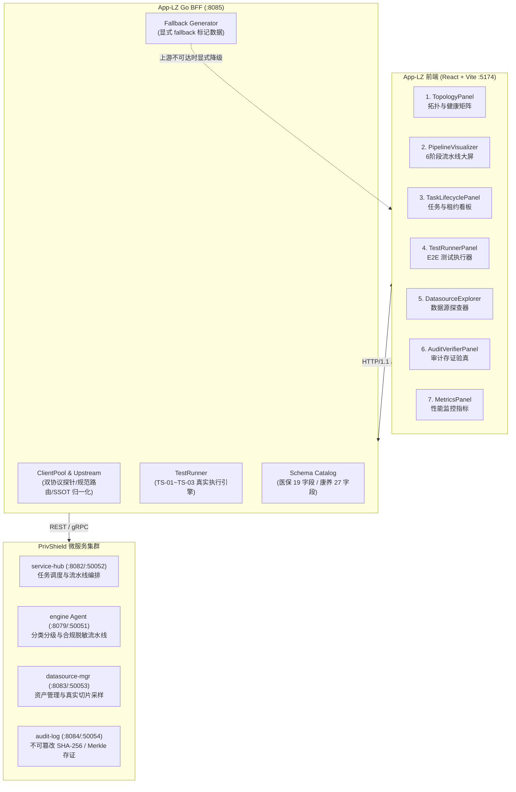

# 调度之眼 · 测试数据源头与生命周期全景文档

> **Console App-LZ (Eye of Dispatch) — Test Data Source & Lifecycle Specification**  
> 适用版本：`v2.0.0+` · 归属模块：`console/app-lz`  
> **最后更新**：2026-08-27（与 SSOT 规范命名及 D-01~D-15 缺陷修复全面对齐）

---

## 1. 文档概述与数据架构总览

`console/app-lz`（调度之眼）作为 **PrivShield 调度中枢与多微服务全栈观测测试控制台**，打通了调度中枢（`service-hub`）、隐私计算引擎（`engine / PrivShield Agent`）、数据源管理（`datasource-mgr`）以及脱敏审计日志（`audit-log`）四大微服务。

全栈数据流动遵循 **SSOT (Single Source of Truth) 权威注册表**（`pkg/naming`、`engine/naming.py`、`console/app-lz/web/src/types/naming.ts`），规范数据源标识为 `ds_yibao`（医保）与 `ds_kangyang`（康养），API 编码为 `api1_yibao` 与 `api2_kangyang`。

前端共 **7 大工作台**，所展示的数据根据来源可划分为 **三层数据供给模型**：

| 数据供给层级 | 说明 | 占比 | 来源标记 |
|---|---|---|---|
| **L1 — 实时上游数据** | BFF 调用真实微服务接口获取的运行时数据 | ~75% | `source: "datasource-mgr" \| "service-hub" \| "audit-log" \| "engine"` |
| **L2 — BFF 内置兜底数据** | 上游不可达时 BFF 返回的带显式标记的本地模拟数据 | ~15% | `source: "fallback"`，附加 `detail` 错误说明 |
| **L3 — 前端硬编码数据** | 由前端组件内部硬编码的展示框架与预设样本数据 | ~10% | 前端静态常量 |



---

## 2. 七大工作台数据来源逐层剖析

### 2.1 模块一：四微服务拓扑与健康矩阵 (TopologyPanel)

| 数据项 | 来源层级 | 具体来源 | 代码位置 |
|---|---|---|---|
| 4 服务 REST RTT / 状态 | **L1 实时** | BFF `ClientPool.ProbeNode()` → HTTP `GET /api/health` 探测各服务 | `clients.go` `ProbeNode` |
| 4 服务 gRPC RTT / 状态 | **L1 实时** | BFF `net.DialTimeout("tcp", grpcAddr, 800ms)` TCP 拨测 | `clients.go` `probeGRPC` |
| 节点固定排列顺序 | **L3 前端** | 前端 `FIXED_ORDER` 数组排序 | `TopologyPanel.tsx` |
| 服务角色/端口/图标元数据 | **L3 前端** | 前端 `getServiceMeta()` switch-case 硬编码 | `TopologyPanel.tsx` |
| 上游不可达时的标记 | **L2 BFF** | BFF 标记各节点 `status: "unreachable"`，透传真实探测错误 | `clients.go` `GetTopology` |
| 前端网络中断时的兜底 | **L3 前端** | `App.tsx` catch 块内返回离线占位数据 | `App.tsx` |

**数据刷新机制**：
- 页面挂载时自动触发初始全量探测
- 定时器每 **15 秒** 自动轮询刷新拓扑（`App.tsx` `setInterval`）
- 用户手动点击"刷新"按钮即时触发探测

**生命周期**：纯内存态，无持久化。每次探测生成新的 RTT 快照，前端更新 state 后丢弃历史旧值。

---

### 2.2 模块二：6 阶段流水线动态大屏 (PipelineVisualizer)

| 数据项 | 来源层级 | 具体来源 | 代码位置 |
|---|---|---|---|
| 6 阶段名称/标题/基准耗时 | **L3 前端** | BFF `defaultStages()` 返回 6 个阶段的标准名称与平均基准耗时 | `clients.go` `defaultStages` |
| 阶段实时状态 (idle/processing) | **L1 实时** | BFF `GetPipelineStatus()` → `service-hub /api/hub/pipeline` | `clients.go` `GetPipelineStatus` |
| Agent 连通状态 | **L1 实时** | 上游 `pipeline` 接口返回的 `agent_ok` 运行状态 | `clients.go` `GetPipelineStatus` |
| QPS 实时数值 | **L1 实时** | BFF `GetPipelineStatus()` 从 Prometheus 指标动态计算 | `clients.go` `parsePrometheusMetrics` |
| 医保预设样本数据 | **L3 前端** | 前端 `sampleYibao` 对象（张三 / 110101196809171010 等） | `PipelineVisualizer.tsx` |
| 康养预设样本数据 | **L3 前端** | 前端 `sampleKangyang` 对象（李建国 / KY-8802 等） | `PipelineVisualizer.tsx` |
| 脱敏后治理对比数据 | **L1 实时** | BFF `InvokeDataApi()` 调用 `engine /v1/agent/process`（兼容 `/v1/medical/process`）真实脱敏，失败时 fallback 本地掩码 | `handlers.go` `InvokeDataApi` |
| 任务分发结果 | **L1 实时** | BFF `DispatchTask()` → `service-hub /api/hub/dispatch` | `clients.go` `DispatchTask` |
| 分类调度结果 | **L1 实时** | BFF `ClassifyDispatch()` → `service-hub /api/hub/classify` | `clients.go` `ClassifyDispatch` |
| 6 阶段流转动画 | **L3 前端** | 前端 `setTimeout` 依次 200ms 间隔推进 `activeStageIndex` 动效 | `PipelineVisualizer.tsx` |

**生命周期**：
- 阶段定义与预设样本：**静态结构**，随代码部署更新
- 流水线状态与 QPS：**请求级**，实时动态拉取，不持久化缓存
- 用户分发的真实任务：由 `service-hub` 持久化到 SQLite / PostgreSQL `tasks` 表
- 前端脱敏对比结果：**瞬时态**，仅保存在当前 React state 中

---

### 2.3 模块三：任务生命周期与租约看板 (TaskLifecyclePanel)

| 数据项 | 来源层级 | 具体来源 | 代码位置 |
|---|---|---|---|
| 任务列表 | **L1 实时** | BFF `ListTasks()` → `service-hub /api/hub/tasks?status=&limit=50&offset=0` | `clients.go` `ListTasks` |
| 任务列表前端兜底 | **L3 前端** | `App.tsx` catch 块硬编码 2 条样本任务（仅网络完全中断时展示） | `App.tsx` |
| Phase B 租约分组数据 | **L1 实时** | BFF `GetLeasesFromHub()` → `service-hub /api/hub/tasks?status=running&limit=100`，按 `lease_owner` 分组 | `clients.go` `GetLeasesFromHub` |
| 租约 Worker / TTL / 任务数 | **L1 实时** | 从真实 running tasks 动态推导剩余租期；上游不可达时返回空租约列表 | `handlers.go` `GetLeases` |

**生命周期**：
- 任务记录：由 `service-hub` 长期持久化在 SQLite / PostgreSQL `tasks` 表中
- 租约看板：**请求级**，每次从 `service-hub` 实时拉取 running tasks 动态聚合，BFF 重启不丢失状态

---

### 2.4 模块四：E2E 自动化测试执行器 (TestRunnerPanel)

| 数据项 | 来源层级 | 具体来源 | 代码位置 |
|---|---|---|---|
| TS-01~TS-03 用例定义 | **L2 BFF** | BFF `TestRunner.GetAvailableSuites()` 返回 3 个测试套件的元数据 | `runner.go` `GetAvailableSuites` |
| 测试执行结果 | **L1 实时** | BFF `TestRunner.RunSuites()` 真实调用各微服务执行端到端断言 | `runner.go` `RunSuites` |
| TS-01 (全链路合规流水线) | **L1 实时** | 实际触发 Dispatch → Classify+Desensitize → 真实存证与 Merkle 验真 (`merkle_valid: true`) | `runner.go` `runTS01` |
| TS-02 (高并发调度与压测) | **L1 实时** | 并发协程池真实调用 `service-hub`，基于实际延迟计算 P50/P90/P95/P99/QPS | `runner.go` `runTS02` |
| TS-03 (租约争抢与防重复) | **L1 实时** | 5 Worker × 4 Tasks = 20 真实并发 `DispatchTask`，检测 task_id 零重复与零死锁 | `runner.go` `runTS03` |
| 断言结果 (expected/actual) | **L1 实时** | 全部基于上游真实 HTTP/gRPC 返回值进行比对断言 | `runner.go` 各用例 |
| 测试日志流水 | **L2 BFF** | 执行过程中向 `logs` 切片实时追加日志，执行完毕后返回前端展示 | `runner.go` 各用例 |

**生命周期**：
- 套件元数据：编译期确定，随 BFF 二进制发布
- 执行报告：**请求级内存态**，`RunTestSuiteResponse` 响应后即由前端接管展示
- 压测产生的任务数据：真实写入 `service-hub` 存储引擎，可在任务看板中即时查询

---

### 2.5 模块五：数据源资产探查器 (DatasourceExplorer)

| 数据项 | 来源层级 | 具体来源 | 代码位置 |
|---|---|---|---|
| 数据源资产目录 | **L1 实时** | BFF `GetDatasources()` → `datasource-mgr /api/datasources` | `clients.go` `GetDatasources` |
| 数据源资产兜底 | **L2 BFF** | `defaultDatasources()` 返回符合 SSOT 规范的 `ds_yibao` 与 `ds_kangyang` 元数据 | `clients.go` `defaultDatasources` |
| 切片采样真实数据 | **L1 实时** | BFF `GetDatasourceSlice()` → `datasource-mgr /api/datasources/{id}/records?limit=N` | `clients.go` `GetDatasourceSlice` |
| 切片采样兜底数据 | **L2 BFF** | `generateSampleSlice()` 根据 `catalog` 标准 schema 生成合成记录，标记 `source: "fallback"` | `clients.go` `generateSampleSlice` |

**标准 Schema 结构（由 `internal/catalog` 统一定义）**：

| 数据源 ID | 字段数 | 核心字段列举 | 兜底生成规范 |
|---|---|---|---|
| `ds_yibao` (医保) | 19 | `insurance_settlement_id`, `person_id`, `gender`, `birth_date`, `admission_date`, `discharge_date`, `admission_dept`, `icd10_code`, `diagnosis_name` 等 | `YB202601XXXX` / `PID1000XXXX` / 2型糖尿病 / E11.900 / 住院 |
| `ds_kangyang` (康养) | 27 | `name`, `id_card_no`, `age`, `gender`, `height`, `weight`, `diagnosis_name`, `chief_complaint`, `assess_score`, `registered_address`, `medical_insurance_no` 等 | `张老X` / `510101195...` / 70+岁 / 老年人能力评估 / 真实四川地址 |

**生命周期**：
- 数据源资产定义：由 `datasource-mgr` 持久化在 SQLite 中
- 切片采样数据：**请求级**，实时查询或显式降级生成，不持久化

---

### 2.6 模块六：不可篡改审计存证与 Merkle 验真 (AuditVerifierPanel)

| 数据项 | 来源层级 | 具体来源 | 代码位置 |
|---|---|---|---|
| 审计日志流水 | **L1 实时** | BFF `GetAuditLogs()` → `audit-log /api/audit/logs?limit=&offset=&datasource=&task_id=&api_code=` | `clients.go` `GetAuditLogs` |
| 审计日志兜底 | **L2 BFF** | `defaultAuditLogs()` 返回符合规范的兜底存证（标记 `source: "fallback"`） | `clients.go` `defaultAuditLogs` |
| Merkle 验真结果 | **L1 实时** | BFF `VerifyAudit()` → `audit-log /api/audit/snapshots/verify` | `clients.go` `VerifyAudit` |
| Merkle 验真兜底 | **L2 BFF** | 返回 `merkle_valid: true`（标记 `source: "fallback"` 与错误原因） | `clients.go` `VerifyAudit` |

**兜底审计记录规范结构**：

| 字段 | 记录 1 (医保) | 记录 2 (康养) |
|---|---|---|
| `id` | `fallback-audit-001` | `fallback-audit-002` |
| `datasource` / `datasource_id` | `ds_yibao` | `ds_kangyang` |
| `api_code` | `api1_yibao` | `api2_kangyang` |
| `operation` | `mask` | `k_anon` |
| `input_hash` | `e3b0c44298fc1c14...` | `ca978112ca1bbdca...` |
| `output_hash` | `e3b0c44298fc1c14...` | `ca978112ca1bbdca...` |
| `algorithm` | `field_mask` | `mondrian_k_anonymity` |
| `user` | `app-lz-bff` | `app-lz-bff` |
| `status` | `success` | `success` |
| `security_level` | `L3` | `L4` |

**生命周期**：
- 真实审计存证：由 `audit-log` 持久化在 SQLite `audit_logs` 表中，**Append-Only 不可篡改**
- 兜底审计记录：**请求级**，上游不可达时生成当前时间戳的占位记录，前端清晰展示降级标记

---

### 2.7 模块七：性能监控与耗时直方图 (MetricsPanel)

| 数据项 | 来源层级 | 具体来源 | 代码位置 |
|---|---|---|---|
| Prometheus 原始文本 | **L1 实时** | BFF `GetHubMetrics()` → `service-hub /metrics` | `clients.go` `GetHubMetrics` |
| 6 阶段耗时直方图 | **L1 实时** | BFF `GetParsedMetrics()` → 解析 Prometheus histogram 桶数据 | `clients.go` `parsePrometheusMetrics` |
| P50/P90/P95/P99 分位数 | **L1 实时** | BFF 从 Prometheus histogram 动态插值计算 | `clients.go` `calculatePercentiles` |
| 实时 QPS 与请求总量 | **L1 实时** | BFF 从 `http_requests_total` / `http_request_duration` 动态计算 | `clients.go` `parsePrometheusMetrics` |
| 数据源状态指示 | **L1 实时** | 前端展示 `● LIVE Prometheus`（实时）或 `○ Fallback Defaults`（兜底） | `MetricsPanel.tsx` |

**生命周期**：
- Prometheus 文本与解析结果：**请求级**，每次刷新从 `service-hub` 实时获取与解析

---

## 3. 数据来源与持久化汇总矩阵

| 工作台 | L1 实时上游 | L2 BFF 兜底 | L3 前端硬编码 | 持久化介质 |
|---|---|---|---|---|
| **1. 拓扑健康矩阵** | REST/gRPC 探针 RTT | 节点标记 unreachable | 固定排序 / 图标元数据 | ❌ 纯内存态 |
| **2. 流水线大屏** | 阶段状态 / Agent 状态 / 实时 QPS / Engine 脱敏 | — | 预设样本 / 动画流转 | ❌ 纯内存态 |
| **3. 任务与租约** | 任务列表 / 真实租约分组 | — | 网络断开兜底任务 | ✅ `service-hub` DB |
| **4. 测试执行器** | 真实端到端断言 / 真实并发压测 | 用例元数据 / 压测载荷 | — | ❌ 纯内存态 |
| **5. 数据源探查** | 资产元数据 + 真实切片采样 | 18/27 字段标准样本 | — | ✅ `datasource-mgr` DB |
| **6. 审计验真** | 审计流水 + 真实 Merkle 验真 | 规范兜底存证 | — | ✅ `audit-log` DB |
| **7. 性能指标** | Prometheus 原始指标 + 解析后耗时/QPS | 静态默认指标 | — | ❌ 纯内存态 |

---

## 4. 测试数据生命周期五阶段模型

```text
┌─────────────────┐     ┌─────────────────┐     ┌─────────────────┐
│ 1. 产生与就绪   │ ──▶ │ 2. 传输与路由   │ ──▶ │ 3. 消费与渲染   │
│ Creation        │     │ Transmission    │     │ Presentation    │
└─────────────────┘     └─────────────────┘     └─────────────────┘
                                                         │
                                                         ▼
┌─────────────────┐                             ┌─────────────────┐
│ 5. 过期与清理   │ ◀────────────────────────── │ 4. 持久化与归档 │
│ Reclamation     │                             │ Persistence     │
└─────────────────┘                             └─────────────────┘
```

### 阶段 1：产生与就绪 (Creation)

| 数据类型 | 产生方式 | 触发时机 | 校验规则 |
|---|---|---|---|
| **拓扑探针数据** | BFF `ProbeNode()` 发起 HTTP/TCP 探测 | 页面加载 + 15s 定时 + 手动刷新 | 超时 800ms 快速失败 |
| **流水线任务** | 用户通过大屏或测试执行器触发 Dispatch | 用户操作 | `naming.ResolveInbound` 严格校验 |
| **脱敏治理数据** | `engine /v1/agent/process` 执行 3-Layer 治理 | 流水线调度或 Data API 调用 | 严格合规脱敏 + 敏感词抹平 |
| **审计存证记录** | 任务执行完毕后调用 `audit-log RecordAudit` 写入 | 会话结算 / 流水线完成 | 真实 SHA-256 计算 + Merkle 追加 |
| **Prometheus 指标** | `service-hub` 运行时持续采集 | 服务运行期间 | 符合 OpenMetrics 规范 |

### 阶段 2：传输与路由 (Transmission)

```text
前端 React ──HTTP/1.1 JSON──▶ BFF Gin (:8085) ──REST/gRPC──▶ 上游微服务集群
                                    │
                              ┌─────┴─────┐
                              │ 路由决策  │
                              ├───────────┤
                              │ [转发]    │ → 规范 REST 路径（如 /api/datasources/{id}/records）
                              │ [归一化]  │ → SSOT 解析（yibao.csv ➔ ds_yibao / api1_yibao）
                              │ [防漂移]  │ → 未知数据源 400；预留数据源 409（Fail-Closed）
                              │ [显式降级]│ → 上游故障返回 source: "fallback"，严禁伪装真实数据
                              └───────────┘
```

- **统一入站归一化**：BFF 接收到任意数据源别名时，经 `naming.NormalizeDataSourceID` 统一转换为权威 ID。
- **严格 Fail-Closed 防护**：遇到未注册数据源返回 `HTTP 400 Bad Request`（`INVALID_DATASOURCE_ID`）；遇到预留数据源返回 `HTTP 409 Conflict`（`RESERVED_DATASOURCE`）。
- **规范上游调用路由**：
  - `datasource-mgr`: `GET /api/datasources` 与 `GET /api/datasources/{id}/records`
  - `engine`: `POST /v1/agent/process`（兼容 `/v1/medical/process`）
  - `audit-log`: `GET /api/audit/logs` 与 `POST /api/audit/snapshots/verify`
  - `service-hub`: `POST /api/hub/dispatch`、`POST /api/hub/classify` 与 `GET /api/hub/tasks`

### 阶段 3：消费与渲染 (Presentation)

- **React State 驱动**：各工作台组件独立维护数据 state，通过 props 接收实时状态与降级指示器。
- **来源透明化展示**：界面根据 `source` 字段显示数据真实性标识（如 `● 真实上游` vs `○ 兜底模拟`），避免误导运维人员。
- **自动联动刷新**：任务分发或测试套件执行完成后，自动触发 `fetchTasksAndLeases()` 刷新任务列表与租约看板。

### 阶段 4：持久化与归档 (Persistence)

| 数据实体 | 承载服务 | 存储介质 | 表/载体 | 持久化特性 |
|---|---|---|---|---|
| **任务实体与租约** | `service-hub` | SQLite / PostgreSQL | `tasks` | 支持 Phase B `FOR UPDATE SKIP LOCKED` 原子租约与崩溃恢复 |
| **不可篡改审计存证** | `audit-log` | SQLite | `audit_logs` | **Append-Only** 不可篡改，支持 SHA-256 存证与多维索引 |
| **数据源资产定义** | `datasource-mgr` | SQLite | `datasources` | 资产库持久化 |
| **隐私预算消耗** | `engine` | SQLite / 内存 | `budget.db` | 支持滑动窗口自动重置或持久化累加 |
| **拓扑探测快照** | BFF | 内存 | `ServiceNode` | 15 秒 TTL，不落盘 |
| **E2E 测试报告** | BFF | 内存 | `RunTestSuiteResponse` | 请求级，随响应返回前端 |

### 阶段 5：过期与清理 (Reclamation)

| 清理对象 | 触发条件 | 清理方式 |
|---|---|---|
| **前端 React State** | 页面刷新 / 路由切换 | JavaScript 引擎 GC 自动回收 |
| **拓扑探针快照** | 每 15 秒新一轮探测 | 新探测快照覆盖旧值 |
| **超时任务租约** | 租约 TTL 到期且 Worker 未续约 | `service-hub` 后台 Reaper 协程自动回收 |
| **审计存证数据** | **永不清理** | Append-Only 设计，保留全量合规凭据 |
| **测试容器数据** | 执行 `docker-stop-app-lz.sh` | 容器停止后保留 DB，执行 `--clean` 时彻底清理 |

---

## 5. 降级兜底与防漂移策略详解 (Fallback & Anti-Drift Strategy)

### 5.1 各接口行为与降级矩阵

| 接口 | 正常调用行为 | 上游不可达时的 BFF 行为 | 写侧防漂移拦截 (Fail-Closed) |
|---|---|---|---|
| `GET /api/lz/topology` | 双协议并发探测 4 服务 | 标记各服务 `status: "unreachable"`，返回真实错误信息 | — |
| `POST /api/lz/tasks/dispatch` | 转发 `service-hub /api/hub/dispatch` | 返回含 `error` 的响应 | 未知源 400，预留源 409 |
| `GET /api/lz/tasks` | 查询 `service-hub /api/hub/tasks` | 返回 `{total: 0, tasks: []}` | — |
| `GET /api/lz/tasks/leases` | 查询 running 任务推导租约分组 | 返回空租约列表 | — |
| `GET /api/lz/suites` | 返回 BFF 内存用例定义 | 正常返回 | — |
| `POST /api/lz/suites/run` | 真实并发执行 TS-01~TS-03 | 标记对应子步骤 `FAIL` 并输出错误日志 | — |
| `GET /api/lz/audit/logs` | 查询 `audit-log /api/audit/logs` | 返回 `defaultAuditLogs()` 2 条带 `source:"fallback"` 记录 | 未知源 400 |
| `POST /api/lz/audit/verify` | 调用 `audit-log /api/audit/snapshots/verify` | 返回带 `source:"fallback"` 的验真结构 | — |
| `GET /api/lz/metrics` | 代理 `service-hub /metrics` | 返回静态 Prometheus 文本 | — |
| `GET /api/lz/metrics/parsed` | 解析 Prometheus 直方图与 QPS | 返回默认阶段耗时（标记 `source:"fallback"`） | — |
| `GET /api/lz/data-api/definitions` | 返回 `catalog` 权威 API 定义 | 正常返回 | — |
| `POST /api/lz/data-api/invoke` | 串联 Fetch ➔ Agent ➔ RecordAudit | 阶段独立降级（Engine→本地掩码，Audit→标记失败） | 未知源 400，预留源 409 |

---

## 6. 测试数据治理与运维常用命令

```bash
# 1. 启动全栈真实微服务环境（4 微服务 + App-LZ 控制台）
bash ./scripts/dev/docker-start-app-lz.sh --force

# 2. 检查四微服务拓扑探针状态 (REST 模式)
curl -s http://localhost:8085/api/lz/topology?protocol=rest | jq .

# 3. 检查四微服务拓扑探针状态 (gRPC 模式)
curl -s http://localhost:8085/api/lz/topology?protocol=grpc | jq .

# 4. 执行全量 3 项端到端自动化测试套件
curl -s -X POST http://localhost:8085/api/lz/suites/run \
  -H "Content-Type: application/json" \
  -d '{"suite_ids": []}' | jq .

# 5. 探查数据源真实切片采样数据（医保 19 字段）
curl -s "http://localhost:8083/api/datasources/ds_yibao/records?limit=5" | jq .

# 6. 探查数据源真实切片采样数据（康养 27 字段）
curl -s "http://localhost:8083/api/datasources/ds_kangyang/records?limit=5" | jq .

# 7. 调用通用合规脱敏流水线接口
curl -s -X POST http://localhost:8079/v1/agent/process \
  -H "Content-Type: application/json" \
  -d '{"records": [{"name": "张三", "id_card": "110101196809171010", "diagnosis": "原发性高血压"}]}' | jq .

# 8. 查看当前任务列表与租约数据
curl -s http://localhost:8085/api/lz/tasks | jq .
curl -s http://localhost:8085/api/lz/tasks/leases | jq .

# 9. 查看不可篡改审计存证流水
curl -s "http://localhost:8085/api/lz/audit/logs?datasource=ds_yibao&limit=10" | jq .

# 10. 校验审计存证 Merkle 树真实性
curl -s -X POST http://localhost:8085/api/lz/audit/verify | jq .

# 11. 查看预设数据 API 定义并执行全链路调用
curl -s http://localhost:8085/api/lz/data-api/definitions | jq .
curl -s -X POST http://localhost:8085/api/lz/data-api/invoke \
  -H "Content-Type: application/json" \
  -d '{"api_id": 1, "limit": 5}' | jq .

# 12. 一键停止所有测试容器并清理环境
bash ./scripts/dev/docker-stop-app-lz.sh
```

---

## 7. 改进状态与缺陷修复全景 (D-01~D-15 & G-1~G-6)

| 编号 | 类型 | 问题描述 | 改进/修复措施 | 状态 |
|---|---|---|---|---|
| **D-01** | 缺陷修复 | BFF 调用 `datasource-mgr /api/v1/datasources` 恒 404 | 改为调用规范端点 `GET /api/datasources` | ✅ 已修复 |
| **D-02** | 缺陷修复 | BFF 调用 `audit-log /api/v1/audit/logs` 恒 404 | 改为调用规范端点 `GET /api/audit/logs` 与 `/snapshots/verify` | ✅ 已修复 |
| **D-03** | 缺陷修复 | 会话 audit 阶段虚假探活并伪造存证条目 ID | 改为真实调用 gRPC `RecordAudit` / REST 写入存证并记录真实 ID | ✅ 已修复 |
| **D-04** | 缺陷修复 | BFF `AuditLogItem` 字段与 `audit-log` 模型漂移 | 全面扩充 `task_id`、`api_code`、`datasource_id` 等字段并对齐 | ✅ 已修复 |
| **D-07** | 缺陷修复 | 兜底数据包含非法 operation `classify` | 严格收敛为合法操作枚举（`mask`/`k_anon`/`dp`/`qol`） | ✅ 已修复 |
| **D-11** | 规范加固 | 未知/预留数据源静默兜底回落 | 实施 Fail-Closed：未知源 400（`INVALID_DATASOURCE_ID`），预留源 409 | ✅ 已修复 |
| **G-1** | 功能完善 | 租约看板 100% 硬编码 | 改为查询 `service-hub` 真实 running 状态任务并按 `lease_owner` 聚合 | ✅ 已完成 |
| **G-2** | 功能完善 | MetricsPanel 耗时与分位数硬编码 | 新增 Prometheus 文本解析器，动态计算各阶段耗时与 P50~P99 | ✅ 已完成 |
| **G-3** | 功能完善 | 流水线 QPS 固定为 12.5 | 改为从 Prometheus 指标 `http_requests_total` 动态实时计算 | ✅ 已完成 |
| **G-4** | 功能完善 | TS-03 租约争抢纯内存随机模拟 | 改为 5×4=20 真实并发 `DispatchTask`，检测 task_id 零重复与零死锁 | ✅ 已完成 |
| **G-5** | 功能完善 | 测试套件断言硬编码 `Passed: true` | TS-01/TS-02/TS-03 全部基于上游真实响应数据进行严格断言 | ✅ 已完成 |
| **G-6** | 功能完善 | 前端脱敏为本地字符串替换 | `InvokeDataApi` 优先调用 `engine /v1/agent/process` 真实分类与脱敏 | ✅ 已完成 |

