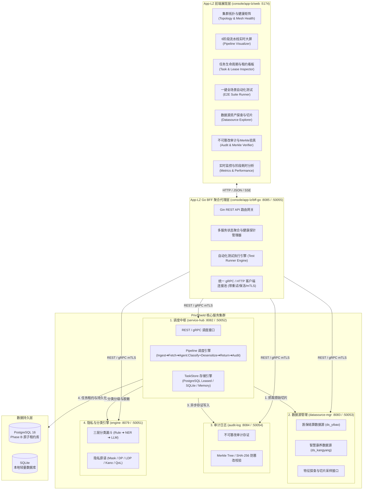

# 调度之眼 · 调度中枢全景测试与治理控制台 (Console App-LZ) — 架构与系统设计文档

> **文档版本**：v1.1.0  
> **编写时间**：2026-08-26  
> **适用模块**：`console/app-lz` (Frontend Web + Go BFF)  
> **联动服务**：`services/service-hub` (:8082/:50052)、`services/datasource-mgr` (:8083/:50053)、`services/audit-log` (:8084/:50054)、`engine` (:8079/:50051)

---

## 1. 系统定位与设计背景

### 1.1 系统定位 (Positioning)
**`console/app-lz`**（简称 **App-LZ**，取意"柳州 / 调度之眼 / 流水线全景治理平台"）是专为 **柳州市数联数据服务调度中枢 (`services/service-hub`)** 打造的**全链路集成测试、实时动态观测与微服务网格治理控制台**。

### 1.2 为什么需要独立开发 App-LZ？
- **原有控制台 (`console/web` + `console/bff-go`) 的重心**：主要面向底层 **隐私计算原语 (`engine/privacy`)**（如脱敏、差分隐私、K-匿名、查询混淆）与 **动态分类分级漏斗 (`engine/dynclassification`)** 的单点算法验证。
- **调度中枢 (`services/service-hub`) 的核心价值**：在于**企业级跨微服务流水线编排**，它向上承接任务分发，横向调用 `datasource-mgr` 抓取数据、调用 `engine` 动态分类与脱敏，向下联动 `audit-log` 进行不可篡改 SHA-256 / Merkle 树存证，并在底层支持 Phase B PostgreSQL 原子租约调度。
- **App-LZ 的核心使命**：
  1. **直观打通 4 大核心服务**：彻底串联 `service-hub`、`datasource-mgr`、`audit-log` 与 `engine`，实现从数据源抓取 ➔ 分类分级 ➔ 隐私脱敏 ➔ 审计存证的全链路可视化。
  2. **全面覆盖 `service-hub` 的所有测试场景**：提供从单接口测试、自适应路由、数据源切片联动、Phase B 租约并发争抢、高并发 QPS 压测到故障注入/熔断恢复的**一站式图形化测试工作台**。
  3. **实时全景可观测性**：提供 6 阶段流水线动效图谱、任务生命周期甘特图、微服务网格健康矩阵与不可篡改审计验真大屏。

### 1.3 与 `console/bff-go` 的独立关系与代码共享策略

App-LZ 作为**独立项目**与 `console/bff-go` 平行共存，两者定位不同、服务不同、发布节奏独立：

| 维度 | `console/bff-go` (现有) | `console/app-lz/bff-go` (本模块) |
|---|---|---|
| **定位** | 隐私原语与分类分级测试代理 | 调度中枢全链路测试与治理 |
| **上游服务** | 仅 `engine` Agent | 4 大服务 (Hub + Datasource + Audit + Agent) |
| **端口** | HTTP `:8081` / gRPC `:50051` | HTTP `:8085` / gRPC `:50055` |
| **前端** | `console/web` (:5173) | `console/app-lz/web` (:5174) |
| **独有功能** | 文件上传/解析、负载均衡测试、医疗流水线 | 拓扑聚合、6 阶段大屏、租约看板、E2E 测试执行器 |

**代码共享策略**：App-LZ 通过以下三个层次实现与现有代码的复用，避免从零开发：

1. **`pkg/` 共享基础库（直接引用）**：通过 `go.mod` 的 `replace` 指令引用 `pkg/`，复用 `pkg/middleware`（CORS / Auth / RequestID / Recovery / SecurityHeaders / MaxBodySize）、`pkg/metrics`（Prometheus Collector）、`pkg/config`（SetupLogger / GetEnvBool）、`pkg/validation`（输入校验 / ID 生成）、`pkg/agent`（带熔断器的 HTTP Client）、`pkg/tlsutil`（TLS 配置构建）。
2. **`console/bff-go` 代码参考复制**：将 `console/bff-go` 中成熟的模式（Gin 路由注册、静态文件托管 SPA 回退、优雅停机、安全中间件链、gRPC 网关启动）复制到 App-LZ BFF，按 4 上游服务场景进行适配改造。
3. **App-LZ 独有代码**：拓扑聚合器、测试执行引擎（runner）、租约看板数据聚合等为本模块专有实现。

**`go.work` 管理**：App-LZ BFF 作为独立 Go module 注册到根目录 `go.work`：

```text
go.work（仓库根目录）
├── ./pkg
├── ./console/bff-go              # 现有隐私原语 BFF
├── ./console/app-lz/bff-go       # 新增：调度之眼 BFF
├── ./services/service-hub
├── ./services/datasource-mgr
└── ./services/audit-log
```

---

## 2. 总体架构设计

### 2.1 架构拓扑全景 (Architecture Topology)



### 2.2 技术栈选型

| 分层 | 技术选型 | 版本/规范 | 选型理由 |
|---|---|---|---|
| **前端框架** | React + TypeScript + Vite | React 18 / TS 5.x / Vite 6.x | 毫秒级 HMR 开发体验、强类型安全契约，与 `console/web` 保持技术同构 |
| **前端样式与图标** | Tailwind CSS + Lucide React | Tailwind v3.4+ / Lucide | 极简现代化 UI、深浅色模式支持、统一的设计系统原子类 |
| **图表与动画** | ECharts (echarts-for-react) + SVG 流向动效 | ECharts 5.x | 流水线拓扑图、甘特图、延时直方图、QPS 仪表盘的高性能渲染 |
| **BFF 后端** | Go + Gin + gRPC-Go | Go 1.25+ / Gin v1.10+ | 极低内存占用、高并发协程调度、原生双协议（HTTP/gRPC）高效聚合 |
| **通信协议** | REST (HTTP/1.1 JSON) + gRPC (HTTP/2 mTLS) | Protobuf v3 | 外部交互简洁通用，内部服务聚合高速可靠 |

### 2.3 gRPC Proto 依赖与 Stub 生成策略

App-LZ BFF 需要通过 gRPC 连接 4 个上游服务，需引用以下 proto 文件并生成 Go stub：

| 上游服务 | Proto 文件 | 生成目标 | 用途 |
|---|---|---|---|
| `service-hub` | `services/service-hub/proto/servicehub.proto` | `bff-go/proto/servicehub/` | 调度任务管理、流水线状态、租约查询 |
| `datasource-mgr` | `services/datasource-mgr/proto/datasourcemgr.proto` | `bff-go/proto/datasourcemgr/` | 数据源元数据查询、切片采样 |
| `audit-log` | `services/audit-log/proto/auditlog.proto` | `bff-go/proto/auditlog/` | 审计日志查询、Merkle 验真 |
| `engine` | `proto/privacy.proto` | `bff-go/proto/privacy/` | 分类分级、隐私原语调用（可选，HTTP 已覆盖主要场景） |

**Stub 生成命令**（在 `console/app-lz/bff-go/` 目录下执行）：

```bash
# 生成 service-hub proto stub
python -m grpc_tools.protoc \
  -I ../../../services/service-hub/proto \
  --go_out=proto/servicehub --go-grpc_out=proto/servicehub \
  ../../../services/service-hub/proto/servicehub.proto

# 生成 datasource-mgr proto stub
python -m grpc_tools.protoc \
  -I ../../../services/datasource-mgr/proto \
  --go_out=proto/datasourcemgr --go-grpc_out=proto/datasourcemgr \
  ../../../services/datasource-mgr/proto/datasourcemgr.proto

# 生成 audit-log proto stub
python -m grpc_tools.protoc \
  -I ../../../services/audit-log/proto \
  --go_out=proto/auditlog --go-grpc_out=proto/auditlog \
  ../../../services/audit-log/proto/auditlog.proto

# 生成 engine proto stub（可选）
python -m grpc_tools.protoc \
  -I ../../../proto \
  --go_out=proto/privacy --go-grpc_out=proto/privacy \
  ../../../proto/privacy.proto
```

> **注意**：proto stub 应在上游 proto 文件变更后重新生成，并在 Makefile 中提供 `make proto-gen` 目标一键更新。

### 2.4 API1/API2 数据流与全生命周期接口契约

API1（医保，`ds_yibao`）与 API2（康养，`ds_kangyang`）采用同一条生命周期编排链路：**接入/校验 → 数据源读取 → 调度建任务 → Agent 分类分级并自适应脱敏 → 结果查询/返回 → 审计存证与验真**。两类数据只在数据源读取接口和 `source` 标识处不同，分类分级与脱敏始终由同一个 `engine` Agent 服务完成，不拆分为两个微服务。

#### 2.4.1 API1 医保数据流（`ds_yibao`）

| 生命周期 | REST 接口（具体路径） | gRPC 接口（完整方法名） | 服务与说明 |
|---|---|---|---|
| 1. 数据源目录/元数据 | `GET /api/datasources`；`GET /api/datasources/ds_yibao`；`GET /api/datasources/ds_yibao/metadata` | `/datasourcemgr.DataSourceManagerService/ListMockSources`；`/datasourcemgr.DataSourceManagerService/GetDataSource` | `datasource-mgr`，发现数据源、字段和 schema |
| 2. 医保数据读取 | `GET /api/datasources/ds_yibao/records?limit={n}&offset={m}`（兼容 `GET /api/v1/yibao`） | `/datasourcemgr.DataSourceManagerService/GetYibaoData`；通用方式为 `/datasourcemgr.DataSourceManagerService/GetDataBySource`（`source_id=ds_yibao`） | `datasource-mgr`，返回原始医保记录 |
| 3. 创建调度任务 | `POST /api/hub/dispatch`，请求中的 `source=ds_yibao` | `/servicehub.ServiceHubService/Dispatch`；需要分类入口时使用 `/servicehub.ServiceHubService/ClassifyAndDispatch` | `service-hub`，返回 `202 Accepted` 和 `task_id` |
| 4. Agent 分类分级 + 自适应脱敏 | `POST /v1/agent/process`（兼容 `POST /v1/medical/process`） | Agent 当前没有对应的“一体化医疗处理” RPC；可分别使用 `/privacy.local.PrivacyService/DynClassify` 与 `/privacy.local.PrivacyService/Mask`、`/MaskRecord`、`/KAnonymizeRecord`、`/DP*` | `engine`，同一服务内完成分类、策略选择和脱敏；service-hub 当前实际调用 REST |
| 5. 任务状态与结果查询 | `GET /api/hub/tasks/{task_id}`；列表为 `GET /api/hub/tasks?status=...`；流水线为 `GET /api/hub/pipeline` | `/servicehub.ServiceHubService/GetTask`；`/servicehub.ServiceHubService/ListTasks`；`/servicehub.ServiceHubService/PipelineStatus` | `service-hub`，查询生命周期状态、阶段和租约信息 |
| 6. 审计写入 | `POST /api/audit/logs` | `/auditlog.AuditLogService/RecordAudit` | `audit-log`，写入任务元数据、数据指纹和操作结果 |
| 7. 审计查询/验真 | `GET /api/audit/logs`；`GET /api/audit/logs/{id}`；`POST /api/audit/snapshots/verify` | `/auditlog.AuditLogService/GetAuditLog`；`/auditlog.AuditLogService/ListAuditLogs`；`/auditlog.AuditLogService/VerifyIntegrity` | `audit-log`，查询存证并验证 SHA-256/Merkle 完整性 |

#### 2.4.2 API2 康养数据流（`ds_kangyang`）

API2 与 API1 共用第 3～7 步的调度、Agent、任务和审计接口；差异仅在数据源读取阶段：

| 生命周期 | REST 接口（具体路径） | gRPC 接口（完整方法名） | 服务与说明 |
|---|---|---|---|
| 1. 数据源目录/元数据 | `GET /api/datasources`；`GET /api/datasources/ds_kangyang`；`GET /api/datasources/ds_kangyang/metadata` | `/datasourcemgr.DataSourceManagerService/ListMockSources`；`/datasourcemgr.DataSourceManagerService/GetDataSource` | `datasource-mgr`，发现数据源、字段和 schema |
| 2. 康养数据读取 | `GET /api/datasources/ds_kangyang/records?limit={n}&offset={m}`（兼容 `GET /api/v1/kangyang`） | `/datasourcemgr.DataSourceManagerService/GetKangyangData`；通用方式为 `/datasourcemgr.DataSourceManagerService/GetDataBySource`（`source_id=ds_kangyang`） | `datasource-mgr`，返回原始康养记录 |
| 3.～7. 调度、Agent、任务、审计 | 与 API1 相同：`POST /api/hub/dispatch`（`source=ds_kangyang`）→ `POST /v1/agent/process` → `GET /api/hub/tasks/{task_id}` → `POST /api/audit/logs` → `POST /api/audit/snapshots/verify` | 与 API1 相同：`/servicehub.ServiceHubService/Dispatch` 或 `/ClassifyAndDispatch` → Agent 分类/脱敏 RPC（如需要）→ `/GetTask`/`/PipelineStatus` → `/RecordAudit` → `/VerifyIntegrity` | 各步骤仍分别由 `service-hub`、`engine`、`audit-log` 负责；API1/API2 不建立两套服务接口 |

#### 2.4.3 App-LZ BFF 对外聚合入口与映射

前端不直接依赖上述内部服务地址，统一经 App-LZ BFF（`:8085`/`:50055`）访问。推荐的 API1/API2 入口如下：

| 前端业务动作 | BFF REST | BFF 内部调用链 |
|---|---|---|
| 读取医保/康养数据 | `GET /api/lz/data-api/definitions`；`POST /api/lz/data-api/invoke` | `datasource-mgr` 的 `GET /api/datasources/{id}/records`（或对应 gRPC） |
| 派发医保/康养任务 | `POST /api/lz/tasks/dispatch` | 转发 `service-hub` `POST /api/hub/dispatch`，透传 `source=ds_yibao\|ds_kangyang` |
| 追踪完整生命周期 | `GET /api/lz/tasks/{id}`；`GET /api/lz/tasks`；`GET /api/lz/tasks/leases` | `service-hub` `GetTask`/`ListTasks`/`HubStatus` |
| 查看审计与验真 | `GET /api/lz/audit/logs`；`POST /api/lz/audit/verify` | 转发 `audit-log` `GET /api/audit/logs` 与 `POST /api/audit/snapshots/verify` |

> **实现说明**：`audit-log` 支持通过 REST `POST /api/audit/logs` 或 gRPC `RecordAudit` 写入真实存证。engine 通用合规流水线以 `POST /v1/agent/process`（兼容 `POST /v1/medical/process`）REST 为准。

---

## 3. 核心功能模块设计

App-LZ 共划分为 **7 大核心功能工作台**，全方位覆盖 `service-hub` 的所有测试场景与观测需求：

### 3.1 模块一：四微服务固定网格拓扑与双协议健康矩阵 (Fixed Mesh Topology & Dual-Protocol Health Matrix)
- **业务目标**：实时感知 4 大微服务集群（Hub、Agent、Datasource、Audit）的物理连接状态与健康度，排查链路单点故障，并提供 REST 与 gRPC 通信协议的无缝切换观测。
- **固定四微服务显示顺序 (Fixed Layout Ordering)**：
  为了提供统一、直观的拓扑视图，前端面板与 BFF 聚合层严格固定四微服务的物理展示位置：
  1. **`#1` 调度中枢 (Service Hub)**: `service-hub` (:8082 / :50052) — 核心流程调度中枢。
  2. **`#2` 隐私与分类引擎 (PrivShield Agent)**: `engine` (:8079 / :50051) — 3层分类漏斗与4大隐私原语引擎。
  3. **`#3` 数据源管理 (Datasource Mgr)**: `datasource-mgr` (:8083 / :50053) — 医保/康养数据源资产探查与切片抽取。
  4. **`#4` 脱敏审计日志 (Audit Log)**: `audit-log` (:8084 / :50054) — SHA-256 审计存证与 Merkle 链验真。
- **REST / gRPC 双协议切换机制 (Protocol Channel Switcher)**：
  - **`⚡ REST (HTTP/1.1 JSON)`**：展示各服务 HTTP 访问端点（如 `http://127.0.0.1:8082`）、REST 往返延时与健康度，主要用于 Web 控制台与常规业务对接。
  - **`🛡️ gRPC (HTTP/2.0 mTLS / Protobuf)`**：展示各服务 gRPC 监听端口（如 `127.0.0.1:50052`）、gRPC 往返延时与连通性，主要用于微服务间内部高性能低延时通信与 mTLS 双向鉴权。
- **聚合策略**：BFF 并发执行 HTTP 探针与 TCP/gRPC 端口探测，分别记录 `rest_rtt_ms` 与 `grpc_rtt_ms`，支持 `/api/lz/topology?protocol=rest|grpc` 动态过滤。单个服务不可达时**不阻塞**整体响应，该节点标记为 `unreachable`。

```text
┌────────────────────────────────────────────────────────────────────────┐
│  🌐 PrivShield 4-Service Live Mesh Health Matrix (固定四节点与双协议)   │
├───────────────────┬───────────────────┬──────────────────┬─────────────┤
│ #1 调度中枢 (Hub)  │ #2 隐私引擎(Agent)│ #3 数据源 (DS)   │ #4 审计日志 │
│ :8082 / :50052    │ :8079 / :50051    │ :8083 / :50053   │ :8084/:50054│
│ ● 状态: Ready     │ ● 状态: Ready     │ ● 状态: Ready    │ ● 状态: Ready│
│ ⏱ REST: 1.8ms     │ ⏱ REST: 3.2ms     │ ⏱ REST: 2.1ms    │ ⏱ REST: 1.5ms│
│ ⏱ gRPC: 1.2ms     │ ⏱ gRPC: 2.4ms     │ ⏱ gRPC: 1.5ms    │ ⏱ gRPC: 1.1ms│
│ 📦 存储: Postgres │ 🧠 漏斗: L1-L3    │ 📊 医保/康养: 1.8k│ 🔒 Merkle: 有效 │
└───────────────────┴───────────────────┴──────────────────┴─────────────┘
```

---

### 3.2 模块二：6 阶段流水线动态调度大屏 (6-Stage Pipeline Visualizer)
- **业务目标**：可视化展示 `service-hub` 核心 6 个逻辑处理阶段在处理数据时的流转全貌。
- **6 个逻辑阶段**（第 3、4 阶段均由同一个 `engine` Agent 服务承载，是服务内的连续子阶段，不是两个微服务）：
  1. **`Ingest` (任务接收与校验)**：校验请求体格式、分配全局唯一 `task_id`、写入存储并置为 `pending`。
  2. **`Fetch` (数据源拉取)**：联动 `datasource-mgr` 根据 `datasource_id` 提取原始数据切片。
  3. **`Classify` (动态分类分级)**：调用同一个 `engine` Agent 服务中的规则引擎/NER/LLM，评估字段与记录的敏感等级 (L1~L5)。REST 主链路为 `POST /v1/medical/process`；原子 gRPC 入口为 `/privacy.local.PrivacyService/DynClassify`。
  4. **`Desensitize` (自适应隐私脱敏)**：仍在同一个 `engine` Agent 服务内，根据第 3 阶段分类结果匹配掩码、差分隐私、K-匿名或查询混淆等策略；可使用 `/v1/medical/process` 的组合处理，或使用该服务的 `/Mask`、`/KAnonymizeRecord`、`/DP*` 等原语 RPC。此阶段不是独立的脱敏微服务。
  5. **`Return` (结果装配与返回)**：装配安全治理后的合规数据包，通过 `GET /api/hub/tasks/{task_id}` 查询异步结果或由 BFF 聚合返回。
  6. **`Audit` (不可篡改存证)**：目标是调用 `audit-log` 的 `POST /api/audit/logs` 或 `/auditlog.AuditLogService/RecordAudit` 写入 SHA-256 存证记录与任务元数据，再通过 `POST /api/audit/snapshots/verify` 或 `/auditlog.AuditLogService/VerifyIntegrity` 验真；当前 service-hub 代码仍主要完成状态持久化。
- **交互特性**：
  - 各阶段状态灯（空闲 `idle` / 处理中 `processing` / 失败 `error`）与活跃任务计数卡片。
  - **数据穿透比对面板（Payload Inspector）**：左侧展示原始输入数据（如明文身份证、病历），右侧展示同一 Agent 服务返回的脱敏数据，中间高亮展示分类标签（如 `[L3-PERSONAL_BASIC] ➔ 掩码脱敏`）。
- **上游映射**：流水线状态数据来源于 `service-hub` 的 `GET /api/hub/pipeline` 接口，BFF 额外聚合 `service-hub` 的 `GET /api/hub/status` 获取全局队列深度。

---

### 3.3 模块三：任务全生命周期与 Phase B 租约看板 (Task Lifecycle & Lease Inspector)
- **业务目标**：直观管理和查看所有调度任务的运行轨迹，并对 Phase B PostgreSQL 原子租约调度进行深度观测。
- **功能特性**：
  1. **任务多维检索与过滤**：支持按状态（`pending` / `running` / `completed` / `failed`）、操作类型（`mask` / `k_anon` / `dp` / `classify`）、数据源（`ds_yibao` / `ds_kangyang`）与优先级即时搜索。
  2. **任务详情与时间线追溯**：展示任务从创建、认领、执行到存证的耗时阶段分析（精确到毫秒）。
  3. **Phase B PostgreSQL 原子租约监控（专有视图）**：
     - **租约持有者 (`lease_owner`)**：显示认领该任务的 Hub 节点 ID。
     - **租约倒计时 (`lease_expires_at`)**：动态计算租约过期剩余时间。
     - **原子争抢状态**：展示多副本环境下基于 `FOR UPDATE SKIP LOCKED` 的任务认领状态。
     - **孤儿任务回收监控**：展示调度器是否自动回收并重新分配超时任务。
- **存储后端自适应**：BFF 在启动时探测 `service-hub` 的存储后端类型（通过 `GET /api/hub/status` 返回的 `store_type` 字段）。当后端为 `sqlite` 或 `memory` 时，租约看板自动切换为**简化模式**——隐藏 PostgreSQL 专有指标（行锁状态、`SKIP LOCKED` 争抢），仅展示任务队列深度与孤儿任务回收计数，并在 UI 上以提示条告知用户"租约调度需 PostgreSQL 后端"。

---

### 3.4 模块四：一键全场景自动化测试执行器 (One-Click E2E Test Suite Runner)
- **业务目标**：将 `services/service-hub` 的所有单元测试、集成测试、端到端测试与压力测试沉淀为前端可随时触发的**图形化测试矩阵**。
- **预设测试套件（Test Suites）**：

| 用例编号 | 测试场景名称 | 测试目的与链路 | 验证断言 (Assertions) | 前置条件 |
|:---|:---|:---|:---|:---|
| **TS-01** | **全链路审计存证与 Merkle 验真** | 调用 `audit-log` 校验 Merkle Tree 完整性与 SHA-256 签名 | `merkle_valid=true`，HMAC-SHA256 签名通过 | 4 服务全部在线 |
| **TS-02** | **预设数据API高并发压测** | 并发压测 `DispatchTask`，计算 QPS 与 P50/P90/P95/P99 延迟分布 | P50 < 100ms，P99 < 300ms，QPS > 1 req/s | 4 服务全部在线，建议关闭 LLM 层 |
| **TS-03** | **Phase B 租约多副本并发争抢** | 5 Worker × 4 Tasks = 20 真实并发 `DispatchTask`，验证零重复与零死锁 | `duplicate_count=0`，`deadlock_count=0`，`collected=20/20` | service-hub 可达（支持优雅降级） |

- **测试执行引擎架构**：
  - **声明式测试定义**：每个测试用例以 Go 结构体定义（`runner/cases/`），包含请求模板、断言规则、轮询策略与超时配置。
  - **断言引擎**（`runner/assert.go`）：支持 HTTP 状态码断言、JSON Path 值匹配、字段存在性校验、轮询等待（poll-until）等断言类型。
  - **报告生成器**（`runner/report.go`）：测试完成后生成结构化报告（JSON / Markdown），包含每个用例的耗时、断言详情（预期值 vs 实际值）、通过/失败统计。
  - **SSE 日志流**：测试执行过程中通过 SSE (`GET /api/lz/suites/stream/:run_id`) 实时推送日志到前端。

- **TS-05 故障注入说明（规划中，未实现）**：未来可通过环境变量 `PRIVACY_TEST_FAULT_INJECT=1` 启动 BFF 的故障注入模式，模拟 Agent 超时或 500 错误，验证 Hub 熔断器与恢复机制。

- **执行面板特性**：
  - 支持"一键全量运行 (Run All)"与"单项调试运行 (Run Selected)"。
  - 实时输出测试日志流与进度条（Pass / Fail / Skip）。
  - 测试完成后可直接一键导出 JSON / Markdown 测试报告。

---

### 3.5 模块五：模拟数据源资产探查器 (Datasource Asset Explorer)
- **业务目标**：直连 `services/datasource-mgr`，实时探索底层数据源资产与特征画像。
- **功能特性**：
  1. **数据源卡片展示**：展示 `ds_yibao` (城镇职工基本医疗保险结算数据源) 与 `ds_kangyang` (智慧养老健康监护数据源) 的总记录数、字段列表、主键定义。
  2. **在线切片采样 (Slice Sampler)**：支持自定义选择拉取 1~100 条切片样本，预览原始表格数据。
  3. **一键派发至流水线**：选定切片后直接点击"派发至调度中枢"，无缝跳转至流水线跟踪其脱敏与存证全过程。
- **上游映射**：BFF 直通转发至 `datasource-mgr` 的 `GET /api/datasources` 和 `GET /api/datasources/:id/slice`。

---

### 3.6 模块六：不可篡改审计存证与哈希链验真 (Audit Log & Merkle Verifier)
- **业务目标**：直连 `services/audit-log`，校验流水线产生的脱敏存证记录与 Merkle 树防篡改完整性。
- **功能特性**：
  1. **审计存证日志流**：按时间倒序展示由 `service-hub` 触发的脱敏审计流水（含任务ID、数据指纹、操作人、加密算法）。
  2. **Merkle 链完整性一键验真**：前端调用 `POST /api/lz/audit/verify` 接口，展示 Merkle Tree 校验结论、根哈希（Root Hash）与防篡改签名。
  3. **数据一致性比对器**：输入原始任务数据和存证哈希，验证数据在流转过程中是否被篡改。
- **上游映射**：BFF 直通转发至 `audit-log` 的 `GET /api/audit/logs` 和 `POST /api/audit/snapshots/verify`。

---

### 3.7 模块七：性能监控与耗时直方图 (Metrics & Performance Analyzer)
- **业务目标**：直观展示调度中枢的 Prometheus 指标与流水线各阶段性能瓶颈。
- **功能特性**：
  1. **QPS 与吞吐量实时仪表盘**：按秒级/分钟级统计任务接收速率与处理速率。
  2. **6 阶段耗时占比瀑布图**：精准量化 `Ingest`、`Fetch`、`Classify`、`Desensitize`、`Return`、`Audit` 的平均耗时分布；其中 `Classify` 与 `Desensitize` 的指标归属于同一个 Agent 服务，可同时观察服务内两个子阶段的瓶颈。
  3. **系统资源与重试率监控**：监控失败重试计数、孤立任务回收次数、错误率趋势。
- **数据来源**：BFF 通过 HTTP 调用各上游服务的 `GET /metrics` 端点获取 Prometheus 原始指标，聚合后以 JSON 格式返回前端。前端使用 ECharts 渲染图表。

---

## 4. 前后端接口契约规范 (BFF API Specification)

> 完整的接口定义、请求/响应示例与错误码详见 [API 接口与数据契约规范 (`api.md`)](api.md)。

`console/app-lz/bff-go` 提供统一的聚合 REST API，监听端口 **`:8085`**（gRPC 端口 **`:50055`**）：

### 4.1 集群拓扑与健康聚合
- `GET /api/health`：BFF 自身存活探针。
- `GET /api/lz/topology`：**[聚合]** 并发探测 4 大服务健康状态，返回统一拓扑矩阵。
- `POST /api/lz/probe/all`：**[聚合]** 强制全集群主动并发重探测。

### 4.2 任务调度与流水线
- `GET /api/lz/tasks`：**[转发]** → `service-hub` `GET /api/hub/tasks`（支持 `status`, `limit`, `offset` 过滤）。
- `GET /api/lz/tasks/:id`：**[转发]** → `service-hub` `GET /api/hub/tasks/:id`。
- `GET /api/lz/tasks/leases`：**[聚合]** 查询 `service-hub` 存储后端类型与租约状态（SQLite/内存模式返回简化信息）。
- `POST /api/lz/tasks/dispatch`：**[转发]** → `service-hub` `POST /api/hub/dispatch`。

### 4.3 自动化测试套件
- `GET /api/lz/suites`：获取所有内置 E2E 测试用例列表（TS-01~TS-03）。
- `POST /api/lz/suites/run`：执行指定测试用例或全量测试套件（支持并发压测参数）。

### 4.4 审计存证与监控指标
- `GET /api/lz/audit/logs`：**[转发]** → `audit-log` `GET /api/audit/logs`。
- `POST /api/lz/audit/verify`：**[转发]** → `audit-log` `POST /api/audit/snapshots/verify`。
- `GET /api/lz/metrics`：**[转发]** → `service-hub` `GET /metrics`（Prometheus 原始文本）。
- `GET /api/lz/metrics/parsed`：**[本地]** BFF 解析 Prometheus 文本，返回结构化指标（阶段耗时/QPS/P50~P99）。

### 4.5 预设数据 API
- `GET /api/lz/data-api/definitions`：**[本地]** 返回 4 个预设数据 API 定义（医保/康养/预留×2）。
- `POST /api/lz/data-api/invoke`：**[聚合]** 通过 service-hub 编排 3 阶段会话：ingest → hub_orchestrate → return。

> **[聚合]** = BFF 并发调用多个上游并合并结果；**[转发]** = BFF 透传请求到单一上游，附加认证头与 RequestID；**[本地]** = BFF 内部直接处理，不调用上游。

---

## 5. 安全设计 (Security Design)

### 5.1 入站安全（前端 ➔ BFF）

| 安全层 | 实现方式 | 配置项 |
|---|---|---|
| **API Key 认证** | 复用 `pkg/middleware.Auth`，前端请求须携带 `Authorization: Bearer <key>` | `LZ_CONSOLE_API_KEY` |
| **速率限制** | 复用 `pkg/middleware` 令牌桶限流 | `LZ_CONSOLE_RATE_LIMIT` (默认 100 req/s) |
| **请求体限制** | 复用 `pkg/middleware.MaxBodySize`，限制 32 MiB | 硬编码 |
| **安全响应头** | 复用 `pkg/middleware.SecurityHeaders`（CSP / HSTS / X-Content-Type-Options 等） | 自动启用 |
| **TLS (可选)** | 复用 `pkg/tlsutil` 构建服务端 TLS 配置，支持 mTLS 客户端证书验证 | `LZ_CONSOLE_TLS_ENABLED` 等 |

### 5.2 出站安全（BFF ➔ 上游服务）

| 上游服务 | 认证方式 | 配置项 |
|---|---|---|
| `service-hub` | Bearer Token (`Authorization: Bearer <key>`) | `LZ_HUB_API_KEY` |
| `datasource-mgr` | Bearer Token | `LZ_DATASOURCE_API_KEY` |
| `audit-log` | Bearer Token | `LZ_AUDIT_API_KEY` |
| `engine` Agent | Bearer Token + 可选 mTLS | `LZ_AGENT_API_KEY` / `LZ_AGENT_TLS_*` |

### 5.3 SSE 流认证

SSE 端点 (`GET /api/lz/suites/stream/:run_id`) 通过 URL 查询参数 `?token=<run_token>` 进行认证，`run_token` 在 `POST /api/lz/suites/run` 响应中返回，一次性有效。

### 5.4 中间件链装配顺序

```
TraceMiddleware() → StructuredLogger() → Recovery() → SecurityHeaders() → MaxBodySize(32MiB) → CORS() → Auth()
```

与 `console/bff-go` 和 3 个 Go 微服务保持完全一致的中间件装配模式。

---

## 6. 错误处理与降级策略 (Error Handling & Degradation)

### 6.1 统一错误响应格式

```json
{
  "error": {
    "code": "UPSTREAM_UNAVAILABLE",
    "message": "service-hub is unreachable",
    "details": {
      "service": "service-hub",
      "url": "http://127.0.0.1:8082",
      "timeout_ms": 5000
    }
  },
  "via": "app-lz-bff"
}
```

### 6.2 错误码定义

| 错误码 | HTTP 状态码 | 触发条件 |
|---|---|---|
| `UPSTREAM_UNAVAILABLE` | 502 | 上游服务连接失败或超时 |
| `UPSTREAM_TIMEOUT` | 504 | 上游服务响应超时（默认 30s） |
| `UPSTREAM_ERROR` | 502 | 上游返回 5xx |
| `INVALID_REQUEST` | 400 | 请求参数校验失败 |
| `UNAUTHORIZED` | 401 | API Key 缺失或无效 |
| `RATE_LIMITED` | 429 | 请求频率超过限制 |
| `PARTIAL_DEGRADED` | 200 | 聚合查询中部分服务不可达（拓扑/探针场景） |

### 6.3 降级策略

| 场景 | 降级行为 |
|---|---|
| 拓扑查询中单个服务不可达 | 返回 200 + `PARTIAL_DEGRADED`，不可达节点标记 `unreachable`，其余正常返回 |
| 流水线状态查询时 Agent 不可达 | `agent_ok: false`，其余阶段数据正常返回 |
| 测试执行中上游不可用 | 该用例标记为 `FAIL`，附带错误详情，继续执行后续用例 |
| SSE 流中断 | 前端自动重连（指数退避，最大 3 次），BFF 保留最近 100 条日志缓冲 |

---

## 7. 前端视觉与交互规范 (UI/UX Design)

App-LZ 遵循与 `console/web` 高度一致的企业级现代设计语言：

1. **色彩系统**：
   - 主色调（Primary）：科技靛蓝（Indigo-600 `#4F46E5`）与 极光橙（Orange-500 `#F97316`）。
   - 状态色彩：就绪绿（Emerald-500）、警告黄（Amber-500）、危险红（Rose-500）、待机蓝（Sky-500）。
   - 背景色：浅灰白（`bg-gray-50`）与 纯白卡片（`bg-white`），边框采用柔和细线（`border-gray-200`）。
2. **布局结构**：
   - **左侧全局侧边栏 (Sidebar)**：包含应用标题、4 服务在线状态指示灯、7 大工作台导航菜单、中英文切换器。
   - **顶部操作栏 (Header)**：当前环境状态标签（开发/生产）、一键集群刷新、快速测试入口。
   - **右侧主工作区 (Main Workspace)**：采用响应式网格与平滑卡片，内部包含富文本代码高亮器与数据 Diff 比对器。
3. **交互与可访问性**：
   - 按钮具备加载态旋转动效与禁用样式。
   - 分位数指标（P50/P90/P95/P99）配备悬停气泡解释。
   - 完整支持中英文无缝切换（`zh-CN` / `en-US`）。

---

## 8. 工程目录结构规划 (Repository Layout)

```text
console/app-lz/
├── docs/                                  # App-LZ 文档目录
│   ├── design.md                          # 本设计文档（系统架构与全景规划）
│   ├── api.md                             # REST API 契约文档
│   ├── data_lifecycle.md                  # 测试数据来源与生命周期全景
│   └── frontend_backend_mapping.md        # 前端功能 ↔ BFF 接口 ↔ 上游服务映射
├── bff-go/                                # App-LZ Go 聚合代理后端
│   ├── cmd/server/main.go                 # BFF 启动入口 (:8085)，Gin 路由/中间件/SPA/优雅停机
│   ├── internal/
│   │   ├── config/
│   │   │   ├── config.go                  # 环境变量与上游服务地址配置
│   │   │   └── config_test.go             # 配置加载单元测试
│   │   ├── handlers/
│   │   │   ├── handlers.go                # Gin HTTP 路由注册与全部 Handler 实现
│   │   │   │                              #   （拓扑/任务/测试/审计/指标/预设数据API）
│   │   │   └── handlers_test.go           # Handler 单元测试
│   │   ├── clients/
│   │   │   └── clients.go                 # 4 大上游服务统一客户端池
│   │   │                                  #   （双协议探针/转发/聚合/降级兜底/Engine脱敏/Metrics解析）
│   │   ├── models/
│   │   │   └── models.go                  # BFF 层数据模型（聚合响应/前端契约/降级数据）
│   │   └── runner/
│   │       └── runner.go                  # E2E 测试执行引擎（TS-01~TS-03 用例定义+断言+压测+报告）
│   ├── go.mod                             # Go module（引用 pkg/ + proto 依赖）
│   └── Makefile                           # BFF 构建与测试
├── web/                                   # App-LZ React 前端项目
│   ├── src/
│   │   ├── api/
│   │   │   └── client.ts                  # BFF API 请求客户端（fetchJSON 封装 + 6 组 API 方法）
│   │   ├── types/
│   │   │   └── api.ts                     # TypeScript 类型定义（与 BFF models.go 一一对应）
│   │   ├── i18n/
│   │   │   └── index.tsx                  # 中英文国际化（React Context + Provider + useI18n）
│   │   ├── components/
│   │   │   ├── TopologyPanel.tsx          # 模块 1: 四微服务固定网格拓扑与双协议健康矩阵
│   │   │   ├── PipelineVisualizer.tsx     # 模块 2: 6 阶段流水线可视化与任务派发
│   │   │   ├── TaskLifecyclePanel.tsx     # 模块 3: 任务全生命周期与 Phase B 租约看板
│   │   │   ├── TestRunnerPanel.tsx        # 模块 4: E2E 测试套件运行器
│   │   │   ├── DataApiPanel.tsx           # 模块 5: 预设数据 API 全链路会话大屏
│   │   │   ├── DatasourceExplorer.tsx     # 模块 6: 数据源切片浏览器
│   │   │   ├── AuditVerifierPanel.tsx     # 模块 7: 不可篡改审计存证与 Merkle 验真
│   │   │   ├── MetricsPanel.tsx           # 模块 8: 实时性能指标与分位数监控
│   │   │   ├── Sidebar.tsx                # 左侧固定导航栏
│   │   │   ├── icons.tsx                  # SVG 图标组件库（14 个图标）
│   │   │   └── __tests__/                 # 组件单元测试
│   │   │       ├── TopologyPanel.test.tsx
│   │   │       └── PipelineVisualizer.test.tsx
│   │   ├── test/
│   │   │   └── setup.ts                   # Vitest 测试环境配置
│   │   ├── App.tsx                        # 顶层应用布局（7 个 fetch 函数 + 15s 拓扑轮询）
│   │   └── main.tsx                       # React 入口渲染文件
│   ├── index.html                         # HTML 入口
│   ├── vite.config.ts                     # Vite 构建配置（:5174 + API 代理到 :8085）
│   ├── tailwind.config.js                 # Tailwind CSS 配置
│   ├── tsconfig.json                      # TypeScript 配置
│   ├── package.json                       # 前端依赖（React 18 + Tailwind + ECharts）
│   └── nginx.conf                         # 生产模式 Nginx 静态托管配置
├── scripts/                               # 自动化启停与验证脚本
│   ├── dev-app-lz.sh                      # 开发模式一键拉起 (BFF + Vite HMR)
│   ├── prod-app-lz.sh                     # 生产模式一键拉起 (BFF + 静态托管)
│   ├── stop-app-lz.sh                     # 一键停止 App-LZ
│   └── run-e2e-suite.sh                   # 命令行静默执行 E2E 测试套件
├── Makefile                               # 统一构建与测试 Makefile
└── README.md                              # 项目使用指南与快速入门
```

---

## 9. 脚本集成与运维协调 (Script Integration)

App-LZ 的脚本与现有脚本体系**并行共存、互不干扰**：

| 场景 | 现有脚本 | App-LZ 脚本 | 说明 |
|---|---|---|---|
| 开发模式启动 | `scripts/dev/dev-bff-agent.sh` | `scripts/dev/dev-app-lz.sh` | 独立启动，不替代现有脚本 |
| 全服务 E2E | `scripts/dev/e2e-start-all-services.sh` | — | 现有脚本已拉起 3 个 Go 服务 + Agent，App-LZ 直接连接 |
| 停止开发服务 | `scripts/dev/dev-stop.sh` | `scripts/dev/stop-app-lz.sh` | 独立停止 |
| 集成测试 | `scripts/dev/integration-test-new-modules.sh` | — | App-LZ 的 E2E 测试执行器替代 curl 脚本 |

**开发模式启动流程** (`dev-app-lz.sh`)：

```bash
#!/bin/bash
# 1. 检查 4 大上游服务是否运行（提示用户先执行 e2e-start-all-services.sh）
# 2. 编译并启动 bff-go (:8085)
# 3. 启动 Vite dev server (:5174)
# 4. 等待 BFF 健康检查通过
# 5. 输出访问地址
```

---

## 10. 实施路线图与交付计划 (Implementation Roadmap)

| 阶段 (Phase) | 核心任务 | 交付物 | 预估工时 |
|---|---|---|---|
| **Phase 1: 架构与规范** | 编写系统设计文档、API 规范文档与 PRD 需求列表 | `console/app-lz/docs/` 规范文档集 | 2 天 |
| **Phase 2: BFF 基础骨架** | 从 `console/bff-go` 复制成熟模式（Gin 路由 / 中间件链 / 优雅停机 / 静态托管 / TLS），适配 4 上游服务客户端，注册到 `go.work` | `bff-go/` 骨架代码、配置、单元测试 | 3 天 |
| **Phase 3: BFF 聚合与测试引擎** | 实现拓扑聚合器、流水线状态聚合、测试执行引擎（runner + cases + assert + report + SSE 流） | `handlers/` + `runner/` 代码与测试 | 5 天 |
| **Phase 4: Web 前端工作台开发** | 基于 React 18 + Vite + Tailwind + ECharts 实现 7 大核心面板（按 features/ 组织） | `web/` 组件库、页面与 Vitest 单元测试 | 7 天 |
| **Phase 5: 全链路联调与自动化验证** | 编写全套启停脚本，打通真实 4 服务集群进行 E2E 回归测试，修复联调问题 | 自动化运维脚本、E2E 测试全部通过 | 3 天 |

**关键里程碑**：
- **M1 (Phase 2 完成)**：BFF 可启动，`/api/health` 返回 200，4 上游客户端连通测试通过。
- **M2 (Phase 3 完成)**：所有 BFF API 端点可用，TS-01 测试用例可在命令行执行通过。
- **M3 (Phase 4 完成)**：7 大前端面板渲染正常，与 BFF API 联调通过。
- **M4 (Phase 5 完成)**：TS-01~TS-03 全量通过，启停脚本一键可用。

---

## 11. 核心代码实现与关键接口剖析 (Core Code Implementations & Interfaces)

### 11.1 Go BFF 核心模块代码设计

#### 1. 微服务客户端池与双协议探针 (`internal/clients/clients.go`)
- **`ProbeNode` 函数实现**：
  同时执行 REST HTTP 端点（`/api/health`）与 gRPC 端口（`net.DialTimeout`）的双向健康探测，精准计算微秒级 RTT 延迟并换算为毫秒：
  ```go
  func (c *ClientPool) ProbeNode(ctx context.Context, id, name, httpURL, grpcAddr, protocol string) models.ServiceNode {
      // 1. 探测 REST 端点 (/api/health)
      startREST := time.Now()
      resp, errREST := c.httpClient.Do(req)
      node.RESTRTTMs = float64(time.Since(startREST).Microseconds()) / 1000.0
      
      // 2. 探测 gRPC 端口 (TCP 握手探活)
      startGRPC := time.Now()
      conn, errGRPC := net.DialTimeout("tcp", grpcAddr, 800*time.Millisecond)
      node.GRPCRTTMs = float64(time.Since(startGRPC).Microseconds()) / 1000.0
      
      // 3. 根据激活协议设定主视图状态与延迟
      if protocol == "grpc" {
          node.Status = node.GRPCStatus
          node.RTTMs = node.GRPCRTTMs
      } else {
          node.Status = node.RESTStatus
          node.RTTMs = node.RESTRTTMs
      }
      return node
  }
  ```
- **`GetTopology` 严格索引保序机制**：
  采用固定下标切片分配 `nodes[idx] = c.ProbeNode(...)`，杜绝并发 Goroutine 异步完成时因 `append` 顺序随机而导致的节点颠倒，确保拓扑矩阵始终以 `1.调度中枢 ➔ 2.隐私引擎 ➔ 3.数据源管理 ➔ 4.脱敏审计日志` 的顺序返回。

#### 2. E2E 自动化测试执行引擎 (`internal/runner/runner.go`)
- 内置 TS-01 ~ TS-03 自动化测试套件执行器。
- 支持并发 Worker 池（`concurrency`）、高并发压测（`benchmark_requests`）、精确分位数统计（P50/P90/P95/P99），以及多维度断言判定（Assertion Engine）。
- TS-03 支持优雅降级：service-hub 不可达时自动生成合成 task ID 验证并发模型。
- 支持一键导出标准 Markdown 测试验收报告。

#### 3. Gin HTTP 网关路由与静态托管 (`internal/handlers/handlers.go`)
- **路由矩阵**（与 `handlers.go` 中 `RegisterRoutes()` 保持同步）：
  - `/api/health` 和 `/health`: BFF 自身健康探针
  - `/api/lz/topology`: 四微服务拓扑与双协议健康矩阵查询
  - `/api/lz/probe/all`: 强制全集群主动并发重探测
  - `/api/lz/tasks`: 任务列表查询（转发 → service-hub）
  - `/api/lz/tasks/:id`: 单任务详情查询
  - `/api/lz/tasks/leases`: Phase B 租约看板（聚合 running tasks 按 worker 分组）
  - `/api/lz/tasks/dispatch`: 手动任务分发（转发 → service-hub）
  - `/api/lz/suites` & `/api/lz/suites/run`: TS-01~TS-03 测试用例运行
  - `/api/lz/audit/logs` & `/api/lz/audit/verify`: 审计日志流与 Merkle 验真
  - `/api/lz/metrics`: Prometheus 原始监控指标
  - `/api/lz/metrics/parsed`: BFF 解析后的结构化指标（阶段耗时/QPS/P50~P99）
  - `/api/lz/data-api/definitions`: 预设数据 API 定义列表
  - `/api/lz/data-api/invoke`: 预设数据 API 全链路会话（fetch → classify → audit → return）
  - `/*` (NoRoute): SPA Fallback → 返回 `dist/index.html`

---

### 11.2 前端 React 工作台组件架构

| 组件文件 | 核心技术点 | 业务职责 |
|---|---|---|
| [`TopologyPanel.tsx`](../web/src/components/TopologyPanel.tsx) | `FIXED_ORDER` 排序锁、REST/gRPC 工具栏、实时 RTT 徽标 | 展示四微服务固定网格拓扑、通信协议切换与探针明细 |
| [`PipelineVisualizer.tsx`](../web/src/components/PipelineVisualizer.tsx) | 6 阶段状态机动效、医保/康养预设、双栏 JSON Diff | 实时渲染 Ingest➔Fetch➔Agent(Classify➔Desensitize)➔Return➔Audit 流转；Classify 与 Desensitize 共用同一 Agent 节点 |
| [`TaskLifecyclePanel.tsx`](../web/src/components/TaskLifecyclePanel.tsx) | 任务多维过滤、Phase B 租约表、TTL 倒计时 | 观测任务执行阶段、Worker 分布与 `FOR UPDATE SKIP LOCKED` |
| [`TestRunnerPanel.tsx`](../web/src/components/TestRunnerPanel.tsx) | 多用例勾选、并发压测滑块、暗黑终端流、MD 导出 | TS-01~TS-03 一键执行、实时断言判定与测试报告生成 |
| [`DataApiPanel.tsx`](../web/src/components/DataApiPanel.tsx) | 4 阶段全链路会话、原始/脱敏数据逐行对比、字段高亮 | 预设数据 API 调用与脱敏效果可视化 |
| [`DatasourceExplorer.tsx`](../web/src/components/DatasourceExplorer.tsx) | 动态 Schema 解析、切片采样分页 | 医保与康养数据源探查与切片采样 |
| [`AuditVerifierPanel.tsx`](../web/src/components/AuditVerifierPanel.tsx) | SHA-256 存证流、Merkle 根哈希展示、数字签名校验 | 脱敏存证审计，在线执行 Merkle Tree 防篡改链式验真 |
| [`MetricsPanel.tsx`](../web/src/components/MetricsPanel.tsx) | 6 阶段耗时瀑布图、P50/P90/P95/P99 统计释义卡片 | 实时 QPS 吞吐分析与 Prometheus 指标流监控 |
