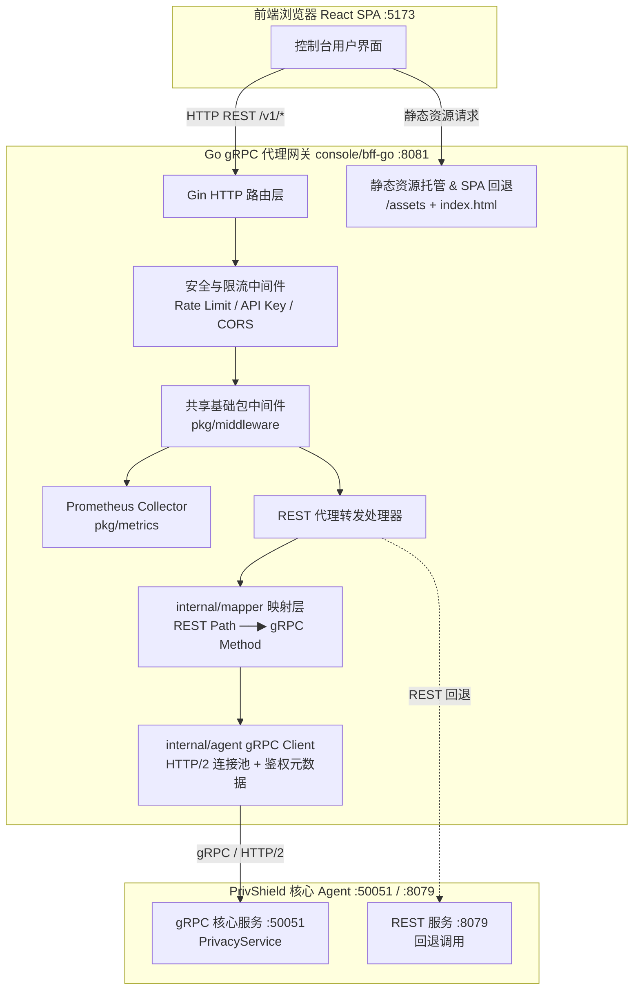

# Go gRPC 代理网关后端 (bff-go) — 详细设计文档

> 本文档定义 **数联天下 · 数盾 (`PrivShield`)** Go gRPC 代理后端（`console/bff-go`）的技术架构、模块职责、协议转换与安全治理设计。

---

## 1. 什么是 BFF (Backend For Frontend)

### 1.1 BFF 概念定义
**BFF（Backend For Frontend，服务于前端的后端 / 前端专属网关）** 是一种专门为特定前端用户界面（如 Web 控制台、移动端 App、小程序、管理后台等）量身定制的专用后端/服务层架构模式。该概念最早由微服务架构先驱 Sam Newman 等人在微服务实践中提炼并推广。

在传统架构或通用微服务架构中，底层后端服务通常围绕领域模型（Domain Model）设计，偏向通用性与数据持久化；而前端展示层则围绕用户体验与交互视图（View Model）设计，两者在接口粒度、协议偏好及迭代频率上存在天然差异。BFF 模式正是在前端与后端通用微服务之间架设的一层“用户体验与服务适配中介”。

### 1.2 为什么需要 BFF（解决的核心痛点）
在 `PrivShield` 及现代化复杂系统的架构演进中，引入 BFF 模式主要解决以下核心痛点：

1. **协议转换与适配（Protocol Transformation）**：
   - **痛点**：底层核心服务（如 `PrivShield Agent` 隐私引擎）为追求高性能、低序列化开销与严格契约，通常采用基于 HTTP/2 的 **gRPC / Protobuf** 二进制协议；而 Web 浏览器端原生且高效支持的交互协议是 **HTTP/1.1 或 HTTP/2 + RESTful JSON**。
   - **BFF 作用**：BFF 充当协议转换网关（Protocol Adapter），对外向浏览器提供符合前端消费习惯的 REST API，对内通过长连接和连接池与底层服务进行高性能 gRPC 通信。
2. **数据聚合与裁剪（Data Aggregation & Tailoring）**：
   - **痛点**：底层的通用微服务通常粒度较细，前端渲染一个完整视图往往需要并发调用多个微服务（增加网络 RTT 往返与前端复杂度），且通用微服务接口容易返回大量前端不需要的冗余字段（Over-fetching），或缺少前端所需的汇总统计指标（Under-fetching）。
   - **BFF 作用**：BFF 在服务端统一编排并发调用底层多个服务（如同时调用脱敏、分类分级、审计日志服务），进行数据清洗、格式转换与字段裁剪，将最契合当前页面视图的数据结构一次性交付前端。
3. **前后端关注点解耦与研发自治（Decoupling & Autonomy）**：
   - **痛点**：前端 UI/UX 变化频繁、展示需求迭代迅速；若每次界面微调都要求修改底层核心微服务的通用接口，不仅协调成本高，还极易影响其他系统调用方。
   - **BFF 作用**：BFF 归属于前端/控制台技术栈，前端团队可根据 UI 交互需求快速演进接口逻辑与数据格式，使底层核心引擎和中台微服务能够专注于领域业务逻辑与底层稳定性。
4. **安全边界收敛与统一治理（Security & Governance Boundary）**：
   - **痛点**：若前端直接对接内部微服务群，会导致内部网络拓扑暴露、CORS 跨域配置碎片化、认证凭证与权限管理分散等安全隐患。
   - **BFF 作用**：BFF 作为统一安全边界，集中管理 CORS 跨域规则、API Key 认证、IP 速率限制（Rate Limiting）、安全响应头注入以及内部敏感异常信息的脱敏拦截。

### 1.3 BFF 在 PrivShield 中的定位与职责
在 `PrivShield` 体系中，**`console/bff-go`** 承担了控制台官方主力专属网关的核心角色：
- **向上（面向 Web 前端与外部系统）**：为 React SPA 前端（`console/web`）提供统一的 RESTful JSON / HTTPS 代理接口（如 `/v1/proxy`、`/v1/batch`、`/v1/upload` 等），支持 TLS 1.3 及 mTLS 客户端证书校验，并负责前端静态构建产物的独立托管与 SPA 路由回退；同时提供 BFF 原生 gRPC Server 服务，对外暴露与 Agent 同构的 gRPC 契约；
- **向下（面向核心服务群）**：通过 HTTP/2 gRPC 长连接与底层 `PrivShield Agent`（`:50051`）高效通信（支持 mTLS），并联动中台微服务群（`service-hub`、`datasource-mgr`、`audit-log`）；
- **对内（业务逻辑与仿真）**：实现 REST 路径到 gRPC 方法的智能映射与分发（`internal/mapper`）、CSV/JSON 文件批量脱敏流式解析、医疗/医保多阶段流水线调度仿真，以及网关负载均衡与并发压力测试。

---

## 2. 背景与核心能力

`PrivShield` 的核心隐私治理服务基于 gRPC（默认端口 `50051`）与 REST（默认端口 `8079`）双协议暴露全部隐私原语（脱敏、差分隐私、K-匿名、查询混淆、数据分类分级）。

为了为前端控制台提供高性能、强类型安全的通信通道，并探索 Go 在高并发隐私网关/Sidecar 中的架构优势，我们构建了 **`console/bff-go`**：

1. **强类型编译期校验**：依托 Protobuf 生成的 Go 结构体，消除手写字典在字段类型、拼写错误上的隐患；
2. **HTTP/2 多路复用与低延迟**：通过 gRPC 长连接复用底层 TCP，吞吐大幅提升，单次原语调用延迟较短连接显著降低；
3. **HTTPS 与 gRPC 双协议暴露**：同时支持 REST/HTTPS 服务与原生 gRPC Server 服务；
4. **全链路 mTLS 双向认证**：入站 HTTPS/gRPC 与出站 Agent gRPC 均支持严格的 mTLS 双向证书与公钥固定（SPKI Pinning）校验；
5. **内置单页应用独立托管**：支持直接托管前端构建产物（`web/dist`），使 Go 后端可独立提供完整 Web UI，无需依赖外部 Web 服务器或 Python 环境；
6. **连接崩溃恢复完备性 (Crash Recovery & Fault Tolerance)**：内置可配置 gRPC 指数退避重试（默认最多 6 次，1s→8s）、`waitForReady=true` 连接等待就绪、HTTP/2 PING 帧心跳保活；
7. **优雅停机与 Panic 恢复**：SIGINT/SIGTERM 信号优雅双协议停机，Gin Recovery 中间件自动捕获 panic，Goroutine 泄漏防护。

> 📖 **可靠性能力详解**：[docs/reliability.md](docs/reliability.md)

---

## 3. 总体架构拓扑



---

## 4. 核心子模块与设计细节

### 4.1 REST 到 gRPC 的智能映射 (`internal/mapper`)

前端所有针对隐私原语的操作通过 `POST /v1/proxy` 发送统一请求：

```json
{
  "method": "POST",
  "path": "/v1/privacy/mask",
  "body": {
    "field_name": "id_card",
    "value": "110101199001011234"
  }
}
```

`mapper.Dispatch(ctx, client, req)` 根据 `path` 路由到对应的专用映射器：

| REST 路径 | 对应 Mapper 模块 | 调用的 gRPC 方法 | Protobuf 请求模型 |
|---|---|---|---|
| `/v1/privacy/mask` | `mapper/mask.go` | `client.Mask` | `MaskRequest` |
| `/v1/privacy/mask_record` | `mapper/mask.go` | `client.MaskRecord` | `MaskRecordRequest` |
| `/v1/privacy/dp_laplace_count` | `mapper/dp.go` | `client.DPLaplaceCount` | `DPLaplaceCountRequest` |
| `/v1/privacy/dp_gaussian` | `mapper/dp.go` | `client.DPGaussian` | `DPGaussianRequest` |
| `/v1/privacy/dp_budget` | `mapper/dp.go` | `client.GetBudget` | `BudgetRequest` |
| `/v1/privacy/kano_eval` | `mapper/kano.go` | `client.KAnonymityEval` | `KAnonymityEvalRequest` |
| `/v1/privacy/qol_obfuscate` | `mapper/qol.go` | `client.QOLObfuscate` | `QOLObfuscateRequest` |
| `/v1/dynclassification/classify`| `mapper/profile.go`| `client.Classify` | `ClassifyRequest` |

响应数据统一包装为 `{status: 200, duration_ms: 12.5, data: {...}, via: "go-grpc", protocol: "gRPC"}`，方便前端统一展示通信协议。

---

### 4.2 共享基础库深度整合 (`pkg/`)

`backend-go` 全面接入 `pkg/`：
- **`pkg/middleware`**：集成 `RequestID()`、`StructuredLogger()`、`CORS()`、`SecurityHeaders()`；
- **`pkg/metrics`**：引入独立的 Prometheus 收集器暴露 `GET /metrics`；
- **`pkg/config`**：使用 `SetupLogger` 实现 JSON/Text 日志格式动态切换。

---

### 4.3 静态 UI 独立托管 (`registerStatic`)

通过 `PRIVACY_CONSOLE_STATIC_DIR` 环境变量配置前端 `web/dist` 路径：
1. **带哈希静态资源**：`/assets/*` 映射到 `dist/assets`，由 Gin 提供强缓存；
2. **SPA 前端路由回退**：对非 `/v1/*` 路由统一回退输出 `index.html`，并设置 `Cache-Control: no-cache`，确保版本更新无缝感知；
3. **目录不存在优雅降级**：若未构建前端静态文件，服务打印告警并无缝降级为纯 API 模式启动。

---

## 5. 路由清单与 API 规范

| 方法 | 路径 | 描述 | 响应包装 |
|---|---|---|---|
| `GET` | `/health` | 服务健康检查 | `{backend: "ok", agent: {...}, via: "go-grpc"}` |
| `GET` | `/health` | 内部健康检查端点 | 同上 |
| `GET` | `/v1/samples` | 获取全部端点的请求样例与元数据 | `{samples: [...]}` |
| `POST` | `/v1/proxy` | 单请求代理转发（REST ──▶ gRPC） | `{status, duration_ms, data, via, protocol}` |
| `POST` | `/v1/batch` | 批量请求顺序代理转发 | `{results: [...]}` |
| `POST` | `/v1/upload` | CSV/JSON 文件上传与批量脱敏/分类 | `{records, masked_records, summary, ...}` |
| `POST` | `/v1/lb_test` | 网关负载均衡策略仿真压测 | `{results, summary, latency_p95, ...}` |
| `POST` | `/v1/concurrency_test` | 模拟多并发请求测试 | `{total, successful, failed, avg_latency}` |
| `POST` | `/v1/medical_pipeline` | 医疗病历多阶段脱敏流水线测试 | `{stages, result}` |
| `POST` | `/v1/yibao_pipeline` | 医保结算流水线脱敏测试 | `{stages, result}` |
| `POST` | `/v1/pipeline/process` | 自定义流水线处理端点 | `{processed_records}` |
| `GET` | `/metrics` | Prometheus 指标采集 | 标准 Prometheus 文本格式 |
