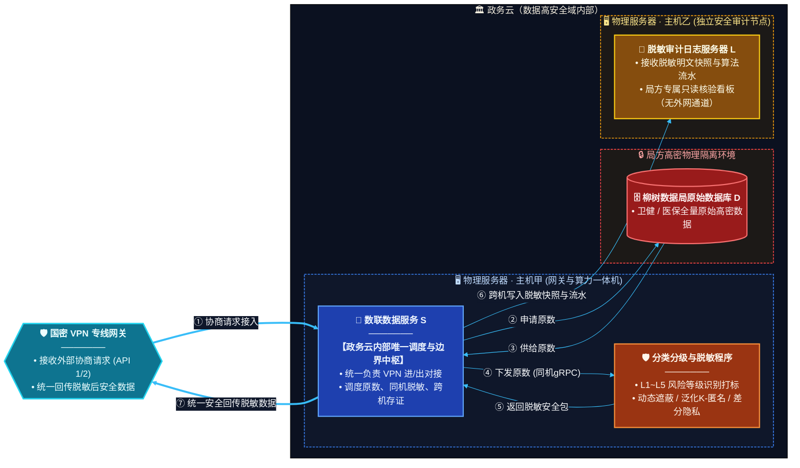

---

## Console 模块差距分析与补充

### 现有 Console 模块覆盖情况

| 架构组件 | Console 已有模块 | 覆盖状态 |
|---|---|---|
| 分类分级与脱敏程序 | Overview / Endpoint（Masking, Hash, DP, LDP, K-Anonymity, QOL）/ DynClassification / MedicalPipeline / YibaoPipeline | ✅ 已覆盖 |
| 负载均衡网关 | LbTest / ConcurrencyTestPanel | ✅ 已覆盖 |
| 运维诊断 | OpsPanel | ⚠️ 部分覆盖（偏通用运维，缺少审计专项） |
| 国密 VPN 专线网关 | 无 | ❌ 缺失 |
| 数联数据服务 S（调度中枢） | `services/service-hub` (Go/Gin) | ✅ 已实现 |
| 原始数据库 D（数据源管理） | `services/datasource-mgr` (Go/Gin) | ✅ 已实现 |
| 脱敏审计日志服务器 L | `services/audit-log` (Go/Gin) | ✅ 已实现 |
| 隐私预算管控 | Budget 端点测试（仅单点查询） | ❌ 缺失仪表盘 |
| 个性化隐私配置管理 | Profile 端点测试（仅单点推荐） | ❌ 缺失配置管理 |

### 需要补充的 6 个 Console 模块

#### 1. 🛡️ VPN 网关管理模块 (`VpnGatewayPanel`)

**对应架构组件**：国密 VPN 专线网关

**功能说明**：
- VPN 隧道状态监控（连接/断开/证书有效期）
- 国密算法配置（SM2/SM3/SM4 密钥管理与轮换）
- 外部协商请求接入日志与流量统计
- 进出域数据量实时监控
- 证书管理与自动续期告警

**侧边栏入口**：`VPN 网关管理`，图标 `shield`，配色 `cyan` 系

---

#### 2. 🔄 数据服务调度中枢模块 (`ServiceHubPanel`)

**对应架构组件**：数联数据服务 S（政务云内部唯一调度与边界中枢）

**功能说明**：
- 请求调度流水线可视化（①~⑦ 全链路时序图实时渲染）
- 当前并发调度任务数、排队队列深度
- 原数取用 → 同机脱敏 → 跨机存证 → 安全回传各环节耗时统计
- gRPC 通道健康状态与吞吐量监控
- 调度策略配置（优先级、超时、重试）

**侧边栏入口**：`调度中枢`，图标 `activity`，配色 `blue` 系

---

#### 3. 🗄️ 数据源管理模块 (`DataSourcePanel`)

**对应架构组件**：柳树数据局原始数据库 D（局方高密物理隔离环境）

**功能说明**：
- 数据源连接管理（卫健/医保等多库注册、连通性测试）
- 数据表/字段元数据浏览（高密标识、分级标签）
- 数据源安全等级标记（高密/高密隔离）
- 原数申请审批流程（申请 → 授权 → 取用 → 回收）
- 数据源访问审计（谁在何时取用了哪些数据）

**侧边栏入口**：`数据源管理`，图标 `database`（或 `inbox`），配色 `red` 系

---

#### 4. 📜 脱敏审计日志模块 (`AuditLogPanel`)

**对应架构组件**：脱敏审计日志服务器 L（独立安全审计节点）

**功能说明**：
- 脱敏明文快照查看（每次脱敏的输入/输出对比）
- 算法流水线流水（使用了哪种脱敏算法、参数、时间戳）
- 局方只读核验看板（无外网通道标识，强调安全隔离）
- 审计日志检索与过滤（按时间/数据源/算法/操作人）
- 存证完整性校验（快照哈希链验证）
- 合规报告导出（满足数据安全法/个保法审计要求）

**侧边栏入口**：`审计日志`，图标 `file-text`，配色 `amber` 系

---

#### 5. 💰 隐私预算仪表盘模块 (`BudgetDashboardPanel`)

**对应架构组件**：差分隐私预算管控（贯穿全部 DP/LDP 操作）

**功能说明**：
- 全局隐私预算消耗总览（ε 累计消耗 vs 预算上限）
- 按数据源/算法/时间维度的预算消耗明细
- 预算告警阈值配置（消耗达 80%/90% 时预警）
- 预算分配策略管理（为不同业务线/数据源分配子预算）
- 预算消耗趋势图（预测剩余预算可用时长）
- 与 Budget 端点联动，支持实时查询与手动刷新

**侧边栏入口**：`隐私预算`，图标 `bar-chart`，配色 `lime` 系

---

#### 6. ⚙️ 个性化隐私配置管理模块 (`ProfileConfigPanel`)

**对应架构组件**：个性化隐私参数配置（personalized-profiles.yaml 的管理界面）

**功能说明**：
- 隐私配置 Profile 的 CRUD（创建/查看/编辑/删除）
- L1~L5 风险等级与脱敏算法的映射规则配置
- 按数据源/字段/业务场景的个性化参数推荐与调整
- 配置版本管理与回滚（修改历史对比）
- YAML 配置导入/导出（与 `personalized-profiles.yaml` 双向同步）
- 配置生效状态监控（当前活跃 Profile、灰度发布状态）

**侧边栏入口**：`隐私配置`，图标 `sliders`，配色 `fuchsia` 系

---

### 补充后 Console 侧边栏完整结构（规划）

```
┌─────────────────────────────┐
│ 🔍 搜索框                    │
├─────────────────────────────┤
│ 📋 接口总览                  │  ← 已有
│ ▶️ 批量测试                  │  ← 已有
│ 📁 文件处理                  │  ← 已有
│ ⚖️ 负载均衡测试              │  ← 已有
│ 🔥 并发压测                  │  ← 已有
│ ✨ 动态分类分级              │  ← 已有
│ 🔧 运维诊断                  │  ← 已有
│ 🏥 医疗敏感数据治理          │  ← 已有
│ 📄 医保结算数据治理          │  ← 已有
│ ─ ─ ─ ─ ─ ─ ─ ─ ─ ─ ─ ─ │
│ 🛡️ VPN 网关管理     🆕      │  ← 新增
│ 🔄 调度中枢          🆕      │  ← 新增
│ 🗄️ 数据源管理        🆕      │  ← 新增
│ 📜 审计日志          🆕      │  ← 新增
│ 💰 隐私预算          🆕      │  ← 新增
│ ⚙️ 隐私配置          🆕      │  ← 新增
├─────────────────────────────┤
│ 📂 分类分组列表              │  ← 已有
│   Health / Masking / ...    │
└─────────────────────────────┘
```

### 与架构组件的映射关系

```
design.md 架构组件              →  Console 模块
─────────────────────────────────────────────────────────────
国密 VPN 专线网关               →  VpnGatewayPanel        🆕
数联数据服务 S（调度中枢）       →  ServiceHubPanel         ✅ Go/Gin :8082
分类分级与脱敏程序              →  Overview + Endpoint + DynClassification + Medical + Yibao  ✅
柳树数据局原始数据库 D          →  DataSourcePanel         ✅ Go/Gin :8083
脱敏审计日志服务器 L            →  AuditLogPanel           ✅ Go/Gin :8084
差分隐私预算管控                →  BudgetDashboardPanel    🆕
个性化隐私配置                  →  ProfileConfigPanel      🆕
```

---

## 三个新模块实现概要

### 模块 1：数据服务调度中枢 (`services/service-hub`)

| 属性 | 值 |
|---|---|
| 语言/框架 | Go / Gin |
| 默认端口 | 8082 |
| 与脱敏模块集成 | 调用 Agent `/v1/dynclassification/classify` 分类分级 → 根据 L1-L5 等级自动选择脱敏策略 → 调用 `/v1/privacy/mask` 下发脱敏 |
| 核心 API | `POST /api/hub/dispatch` 任务分发、`POST /api/hub/classify` 分类+自动脱敏、`GET /api/hub/pipeline` 流水线状态 |
| 部署 | Dockerfile + Docker Compose `service-hub` 服务 |

**调度流水线 6 阶段**：① 请求接入 → ② 申请原数 → ③ 分类分级 → ④ 下发脱敏 → ⑤ 返回结果 → ⑥ 存证写日志

**L1-L5 脱敏策略自动映射**：
- L1 (公开) → 无需脱敏
- L2 (内部) → 字段级脱敏 (mask)
- L3 (机密) → K-匿名 (k_anon)
- L4 (秘密) → 差分隐私 (dp)
- L5 (绝密) → 差分隐私 + 完全匿名 (dp)

### 模块 2：数据源管理 (`services/datasource-mgr`)

| 属性 | 值 |
|---|---|
| 语言/框架 | Go / Gin |
| 默认端口 | 8083 |
| 与脱敏模块集成 | 元数据查询时自动标注 L1-L5 安全等级、调用 Agent 分类接口验证数据可访问性 |
| 核心 API | `CRUD /api/datasources`、`POST /api/datasources/:id/test` 连通性测试、`GET /api/datasources/:id/metadata` 元数据（含分级标签） |
| 部署 | Dockerfile + Docker Compose `datasource-mgr` 服务 |

### 模块 3：脱敏审计日志 (`services/audit-log`)

| 属性 | 值 |
|---|---|
| 语言/框架 | Go / Gin |
| 默认端口 | 8084 |
| 与脱敏模块集成 | 记录每次脱敏操作的算法/参数/输入输出哈希、自动生成存证快照（含 SHA256 完整性校验） |
| 核心 API | `GET/POST /api/audit/logs` 日志查询/写入、`GET /api/audit/stats` 统计、`POST /api/audit/snapshots/verify` 完整性校验、`POST /api/audit/report` 合规报告 |
| 部署 | Dockerfile + Docker Compose `audit-log` 服务 |

### 一键运行

```bash
# 开发模式：一键启动三个模块
bash scripts/dev/dev-start-new-modules.sh

# 集成测试（需先启动 Agent）
bash scripts/dev/integration-test-new-modules.sh

# 停止
bash scripts/dev/dev-stop-new-modules.sh

# Docker Compose 部署（含三个新模块）
cd deploy/docker-compose
docker compose up -d
```

---

## 共享基础库 `pkg/` 架构设计

### 设计动机

原先 service-hub / datasource-mgr / audit-log 三个 Go 模块各自维护近乎相同的：

- HTTP Client 封装（含熔断器、Bearer Token 注入、错误处理）
- CORS 中间件实现
- API Key 鉴权逻辑
- 结构化日志 setup 函数
- Prometheus 指标定义

这导致：
1. **代码重复**：~800 行重复代码散布在 3 个模块
2. **Bug 修复不同步**：如熔断器配置字段未生效的 bug 需逐个模块修复
3. **测试覆盖不均**：部分模块缺少关键路径测试
4. **新增模块成本高**：每个新模块需重新实现全部基础设施

### 目录结构

```
pkg/
├── agent/           # 共享 Agent HTTP Client（含熔断器）
│   ├── client.go    # 292 行：GET/POST/Health + Circuit Breaker
│   └── client_test.go  # 322 行：14 个测试
├── config/          # 共享配置工具
│   ├── env.go       # 102 行：GetEnvBool + SetupLogger
│   └── env_test.go  # 83 行：12 个测试
├── metrics/         # 共享 Prometheus 指标
│   ├── metrics.go   # 120 行：Collector + /metrics handler
│   └── metrics_test.go  # 107 行：6 个测试
├── middleware/       # 共享 Gin 中间件
│   ├── middleware.go # 129 行：CORS + RequestID + StructuredLogger
│   ├── auth.go      # 76 行：API Key 鉴权（常量时间比较）
│   └── middleware_test.go  # 290 行：15 个测试
├── store/           # 共享持久化层
│   ├── store.go     # 156 行：接口定义（TaskStore / AuditStore / DatasourceStore）
│   ├── memory/      # 内存实现（开发/测试）
│   │   ├── memory.go     # 337 行
│   │   └── memory_test.go # 283 行
│   └── sqlite/      # SQLite 实现（生产）
│       ├── init.go        # 144 行
│       ├── tasks.go       # 184 行
│       ├── audit.go       # 237 行
│       └── datasources.go # 172 行
├── validation/      # 共享输入校验
│   ├── validation.go # 70 行
│   └── validation_test.go # 83 行
├── go.mod
└── go.sum
```

**总计**：3,187 行 Go 代码（含测试），9 个包，5 个子模块。

### Go Workspace 管理

```text
go.work（仓库根目录）
├── ./pkg                    # 共享基础库（独立 module）
├── ./console/bff-go         # Go gRPC 控制台 BFF（原 backend-go）
├── ./services/service-hub   # 数据服务调度中枢
├── ./services/datasource-mgr # 数据源管理
└── ./services/audit-log     # 脱敏审计日志
```

各业务模块通过 `go.mod` 中的 `replace` 指令引用本地 `../../pkg`：

```go
require github.com/fengzhizi319/PrivShield-go/pkg v0.0.0
replace github.com/fengzhizi319/PrivShield-go/pkg => ../../pkg
```

### 核心组件详解

#### `pkg/agent` — 共享 Agent HTTP Client

| 特性 | 说明 |
|---|---|
| HTTP 方法 | `Get` / `Post` / `PostWithRequestID` / `Health` |
| 熔断器 | Closed → Open → HalfOpen 状态机，配置驱动阈值与冷却时间 |
| 配置项 | `BaseURL` / `APIKey` / `Timeout` / `CBThreshold` / `CBCooldown` / `Logger` |
| 安全 | Bearer Token 自动注入、结构化错误日志 |
| 测试覆盖 | 14 个测试：基础功能 / 请求头注入 / 熔断器全状态转换 |

#### `pkg/middleware` — 共享 Gin 中间件

| 中间件 | 功能 | 安全特性 |
|---|---|---|
| `CORS(origins)` | 可配置来源的跨域策略 | 空列表=允许所有（开发）；非空=精确匹配（生产） |
| `Auth(apiKey)` | API Key 鉴权 | `crypto/subtle.ConstantTimeCompare` 防时序攻击 |
| `RequestID()` | 请求 ID 注入 | 透传上游 `X-Request-ID` 或自动生成（保留向后兼容） |
| `TraceMiddleware()` | 全链路追踪双头注入 | 在 `RequestID()` 基础上额外注入 `X-Trace-ID` 响应头，所有 Go 服务已迁移使用 |
| `AbortWithError()` | 统一错误信封响应 | 返回 `{code, message, detail, trace_id, timestamp}` 格式，自动注入追踪头 |
| `StructuredLogger(logger, module)` | 结构化访问日志 | `log/slog` JSON 格式，含 request_id / latency / status |

**中间件链推荐顺序**：`TraceMiddleware()` → `StructuredLogger()` → `CORS()` → `Auth()`

#### `pkg/metrics` — 共享 Prometheus 指标

| 指标名 | 类型 | 标签 | 用途 |
|---|---|---|---|
| `http_requests_total` | Counter | module / method / path / status | HTTP 请求计数 |
| `http_request_duration_seconds` | Histogram | module / method / path | HTTP 延迟分布 |
| `agent_requests_total` | Counter | module / endpoint / status | 上游 Agent 调用计数 |
| `agent_request_duration_seconds` | Histogram | module / endpoint | 上游 Agent 调用延迟 |

每个 `Collector` 使用独立的 `prometheus.Registry`，避免全局注册冲突。
通过 `GET /metrics` 端点暴露，供 Prometheus 抓取。

#### `pkg/config` — 共享配置工具

| 函数 | 功能 |
|---|---|
| `GetEnvBool(key string, defaultVal bool) bool` | 从环境变量读取布尔值，支持 `true/false/1/0/on/off/yes/no` |
| `SetupLogger(format, level string) *slog.Logger` | 创建结构化日志器，支持 `text/json` 格式和 `debug/info/warn/error` 级别 |

#### `pkg/store` — 共享持久化层

| 接口 | 方法 | 内存实现 | SQLite 实现 |
|---|---|---|---|
| `TaskStore` | `Create / Get / List / UpdateStatus` | ✅ | ✅ |
| `AuditStore` | `Record / Query / Stats / VerifySnapshot` | ✅ | ✅ |
| `DatasourceStore` | `Register / Get / List / Delete / TestConnection` | ✅ | ✅ |

SQLite 使用 `modernc.org/sqlite`（纯 Go，无 CGO 依赖），便于交叉编译。

#### `pkg/validation` — 共享输入校验 + ID 生成

提供数据格式校验工具，防止注入攻击和非法输入。

| 函数 | 功能 |
|---|---|
| `AllowedValues(field, value, allowed)` | 白名单校验 |
| `PortRange(port)` | 端口范围 1-65535 |
| `NonEmpty(field, value)` | 非空校验 |
| `MaxLength(field, value, max)` | 长度上限 |
| `GenerateID(prefix)` | 抗碰撞唯一 ID（`crypto/rand` 8 位随机十六进制） |

---

## 生产加固记录

### 2026-08 第一轮：共享库抽取与测试补全

| 编号 | 问题 | 修复 | 影响范围 |
|---|---|---|---|
| P1 | `pkg/agent` 熔断器配置字段 `CBThreshold` / `CBCooldown` 未存储到 Client 结构体，`recordFailure()` 使用硬编码 `5`，`cbCooldown()` 返回硬编码 `30s` | 添加 `cbThreshold` / `cbCooldown` 字段，从配置初始化，方法使用字段值 | `pkg/agent/client.go` |
| P2 | `pkg/agent` / `pkg/metrics` / `pkg/middleware` 无单元测试 | 新增 35 个测试（14 + 6 + 15） | 3 个新测试文件 |
| P3 | `setupLogger` 在 service-hub / datasource-mgr / audit-log 三个 `main.go` 中完全重复（各 ~25 行） | 提取到 `pkg/config.SetupLogger()`，三个模块统一调用 | 4 个文件 |

### 2026-08 第二轮：backend-go 生产级集成

| 编号 | 问题 | 修复 | 影响范围 |
|---|---|---|---|
| P4 | backend-go 未使用共享中间件（无 RequestID、无结构化日志、无 Prometheus 指标） | 集成 `pkg/middleware` + `pkg/metrics`，新增 `GET /metrics` 端点 | `backend-go/internal/handlers/handlers.go` |
| P5 | backend-go `callRest` 每次请求创建新 `http.Client{Timeout: 60s}`，无法复用 TCP 连接池 | Server 结构体新增 `httpClient *http.Client`，所有 REST 调用共享同一客户端 | `backend-go/internal/handlers/handlers.go` |
| P6 | backend-go 使用 `log.Printf` 而非结构化日志 | 替换为 `s.logger.Warn/Info`（`log/slog`） | `backend-go/internal/handlers/handlers.go` |

### 2026-08 第三轮：Docker 构建修复 + 安全加固

| 编号 | 问题 | 修复 | 影响范围 |
|---|---|---|---|
| P7 | **[严重]** 4 个 Dockerfile 使用 `golang:1.23.4`，但 `go.mod` 要求 `go 1.25.0`/`1.27.0`，Docker 构建必败 | 统一升级为 `golang:1.27-alpine3.21` + `alpine:3.21` | 4 个 Dockerfile |
| P8 | **[严重]** 4 个 Dockerfile 仅 `COPY . .`（模块自身目录），但 `replace ../pkg` 需要 `pkg/` 目录存在 | 重构构建上下文为 `console/`，先 `COPY pkg/`，再 `COPY <module>/` | 4 个 Dockerfile |
| P9 | **[安全]** 4 个 `http.Server` 未设置 `ReadHeaderTimeout`，易受 Slowloris 攻击 | 添加 `ReadHeaderTimeout: 10s` + `IdleTimeout: 120s` | 4 个 `main.go` |
| P10 | **[质量]** 4 个 `main.go` 使用 `fmt.Printf`/`log.Printf` 输出启动信息，未使用结构化日志 | 统一替换为 `logger.Info`/`logger.Error`，启动信息以结构化 KV 输出 | 4 个 `main.go` |
| P11 | **[运维]** Dockerfile HEALTHCHECK 探测 `/health` 而非 `/api/health` | 统一改为 `/api/health`（与路由注册一致） | 4 个 Dockerfile |

### Docker 构建命令（第三轮后更新）

```bash
# 构建上下文为 console/ 目录（非各模块子目录）
cd console/

docker build -f service-hub/Dockerfile -t service-hub:latest .
docker build -f datasource-mgr/Dockerfile -t datasource-mgr:latest .
docker build -f audit-log/Dockerfile -t audit-log:latest .
docker build -f backend-go/Dockerfile -t backend-go:latest .
```

### 2026-08 第四轮：部署脚本 + Nginx 安全 + 性能防护 + ID 碰撞修复

| 编号 | 问题 | 修复 | 影响范围 |
|---|---|---|---|
| P12 | **[严重]** 3 个 `deploy.sh` 使用 `docker build -t ... .`（模块目录作为上下文），但 Dockerfile 已改为 `console/` 上下文，部署必败 | 修复为 `docker build -f <module>/Dockerfile -t ... <console_dir>` | 3 个 `deploy.sh` |
| P13 | **[安全]** `nginx.conf` 缺少安全响应头（X-Frame-Options / X-Content-Type-Options / X-XSS-Protection / Referrer-Policy / Permissions-Policy） | 添加全部安全头 + 隐藏文件访问禁止 | `web/nginx.conf` |
| P14 | **[安全]** `nginx.conf` 缺少 `client_max_body_size`（默认 1MB，文件上传超限）和代理超时配置 | 设置 `client_max_body_size 50m` + `proxy_read_timeout 60s` + 静态资源强缓存 | `web/nginx.conf` |
| P15 | **[性能]** audit-log `GetStats` / `GenerateReport` 加载全量日志到内存计算统计，数据量大时 OOM | 限制内部查询上限 10,000 条 | `audit-log/handlers.go` |
| P16 | **[安全]** audit-log `ListLogs` / `ListSnapshots` 无 limit 上限，`?limit=999999999` 可 OOM | 添加上限：ListLogs max=1000，ListSnapshots max=500 | `audit-log/handlers.go` |
| P17 | **[性能]** service-hub `ListTasks` 无分页（无 limit/offset），数据量大时性能崩溃 | 添加 `limit`/`offset` 查询参数，默认 100，上限 1000 | `service-hub/handlers.go` |
| P18 | **[可靠性]** 任务/审计 ID 生成 `time.Now().UnixNano()%100000` 并发下碰撞 | 新增 `validation.GenerateID()` 使用 `crypto/rand` 生成 8 位随机十六进制后缀 | `pkg/validation` + 4 个 handlers |

### Nginx 安全加固详情（P13/P14）

```nginx
# 安全响应头
add_header X-Frame-Options "SAMEORIGIN" always;
add_header X-Content-Type-Options "nosniff" always;
add_header X-XSS-Protection "1; mode=block" always;
add_header Referrer-Policy "strict-origin-when-cross-origin" always;
add_header Permissions-Policy "camera=(), microphone=(), geolocation=()" always;

# 请求体限制 + 代理超时
client_max_body_size 50m;
proxy_connect_timeout 10s;
proxy_read_timeout 60s;
proxy_send_timeout 60s;

# 静态资源强缓存（Vite 构建产物带 content hash）
location ~* \.(js|css|png|jpg|gif|ico|svg|woff2?)$ {
    expires 30d;
    add_header Cache-Control "public, immutable";
}
```

### 2026-08 第五轮：Goroutine 崩溃恢复 + 全模块分页保护

| 编号 | 问题 | 修复 | 影响范围 |
|---|---|---|---|
| P19 | **[严重]** `processTask` 在 goroutine 中执行 6 阶段流水线，若任何阶段 panic（如 nil 指针），整个进程崩溃，无恢复机制 | HTTP 和 gRPC 两处 `processTask` 添加 `defer recover()`，panic 时将任务标记为 `failed` 并记录错误 | `service-hub/handlers.go` + `service-hub/grpcserver/server.go` |
| P20 | **[性能]** gRPC `ListTasks` 无分页保护，返回全部任务，数据量大时 OOM | 添加服务端分页（limit=100, offset=0 硬编码默认值），proto 文件添加注释标记待 protoc 可用后补齐字段 | `service-hub/grpcserver/server.go` + `service-hub/proto/servicehub.proto` |
| P21 | **[功能]** audit-log `ListLogs` 已限制 limit 上限但缺少 offset 支持，客户端无法翻页 | 添加 `offset` 查询参数解析 + 响应增加 `limit`/`offset` 分页元数据 | `audit-log/handlers.go` |
| P22 | **[性能]** datasource-mgr `ListDataSources` 和 `GetAccessAudit` 无分页，返回全部数据 | 两个接口均添加 `limit`/`offset` 分页（默认 100，上限 1000），内存切片实现 | `datasource-mgr/handlers.go` |

### 分页保护统一策略（第五轮后全模块覆盖）

| 模块 | 接口 | 默认 limit | 上限 | offset 支持 | 响应元数据 |
|---|---|---|---|---|---|
| service-hub (REST) | `GET /api/hub/tasks` | 100 | 1000 | ✅ | `total` / `limit` / `offset` |
| service-hub (gRPC) | `ListTasks` | 100 | 1000 | ✅（服务端强制） | `total` |
| audit-log | `GET /api/audit/logs` | 100 | 1000 | ✅ | `total` / `limit` / `offset` |
| datasource-mgr | `GET /api/datasources` | 100 | 1000 | ✅ | `total` / `limit` / `offset` |
| datasource-mgr | `GET /api/datasources/:id/audit` | 100 | 1000 | ✅ | `total` / `limit` / `offset` |

### Goroutine Panic Recovery 详情（P19）

```go
// HTTP handlers.go / gRPC server.go — processTask
func (s *Server) processTask(task *store.Task, ...) {
    defer func() {
        if r := recover(); r != nil {
            s.logger.Error("processTask panic recovered",
                "task_id", task.ID, "panic", fmt.Sprintf("%v", r))
            task.Status = "failed"
            task.Error = fmt.Sprintf("internal panic: %v", r)
            now := time.Now()
            task.CompletedAt = &now
            task.DurationMs = now.Sub(task.CreatedAt).Milliseconds()
            _ = s.tasks.Update(task)
        }
    }()
    // ... 6-stage pipeline processing
}
```

**设计原则**：
- 后台 goroutine panic 不应导致整个进程崩溃
- panic 发生时优雅降级：将任务标记为 `failed`，记录 panic 信息到错误字段
- 保持任务状态一致性：更新 `CompletedAt` 和 `DurationMs`，客户端可查询到失败原因

### 2026-08 第六轮：响应体限制 + SQLite 生产配置 + RequestID 安全 + 数据持久化

| 编号 | 问题 | 修复 | 影响范围 |
|---|---|---|---|
| P23 | **[安全]** `pkg/agent` 的 `do()` 方法使用 `io.ReadAll` 无大小限制，上游返回超大响应时 OOM | 添加 `io.LimitReader` 限制最大 64 MiB，超出返回明确错误 | `pkg/agent/client.go` |
| P24 | **[性能]** SQLite `Open()` 未配置连接池，`SetMaxOpenConns` 默认无限制，并发写入时锁竞争严重 | 设置 `MaxOpenConns=4` / `MaxIdleConns=2` / `ConnMaxLifetime=5min` | `pkg/store/sqlite/init.go` |
| P25 | **[安全]** middleware `generateRequestID()` 使用纯时间戳，可预测且高并发下碰撞 | 改用 `crypto/rand` 生成 8 位随机十六进制后缀，格式 `req-<timestamp>-<random>` | `pkg/middleware/middleware.go` |
| P26 | **[可靠性]** SQLite 未设置 `synchronous=NORMAL` 和 `foreign_keys=ON`，WAL 模式下写入性能未优化，外键约束未生效 | 添加 `PRAGMA synchronous=NORMAL`（WAL 下崩溃安全）+ `PRAGMA foreign_keys=ON`，修复受影响的测试 | `pkg/store/sqlite/init.go` + `pkg/store/sqlite/sqlite_test.go` |
| P27 | **[运维]** 3 个使用 SQLite 的 Dockerfile 未声明 VOLUME，容器重建时数据丢失 | service-hub / audit-log / datasource-mgr 的 Dockerfile 添加 `VOLUME ["/app/data"]` | 3 个 Dockerfile |

### SQLite 生产配置详情（P24/P26）

```go
// pkg/store/sqlite/init.go — Open()
func Open(path string, logger *slog.Logger) (*sql.DB, error) {
    // ... WAL mode + busy_timeout ...

    // P24: 连接池限制（SQLite 仅支持单写入者）
    db.SetMaxOpenConns(4)    // 最多 4 个并发连接
    db.SetMaxIdleConns(2)    // 保持 2 个空闲连接
    db.SetConnMaxLifetime(5 * time.Minute) // 连接最大存活 5 分钟

    // P26: WAL 模式下 synchronous=NORMAL 提升写入性能（仍崩溃安全）
    db.Exec("PRAGMA synchronous=NORMAL")

    // P26: 启用外键约束强制执行
    db.Exec("PRAGMA foreign_keys=ON")
}
```

**为什么 synchronous=NORMAL 安全？**
- WAL 模式下，`synchronous=NORMAL` 在检查点（checkpoint）时仍会等待写入完成
- 仅在极端电源故障时可能丢失最近一次事务，与 `FULL` 相比性能提升显著
- SQLite 官方文档推荐 WAL + NORMAL 组合

### 响应体限制详情（P23）

```go
// pkg/agent/client.go — do()
const maxBodySize = 64 << 20  // 64 MiB
body, err := io.ReadAll(io.LimitReader(resp.Body, maxBodySize+1))
if int64(len(body)) > maxBodySize {
    return nil, fmt.Errorf("agent response too large: exceeds %d bytes", maxBodySize)
}
```

### 加固前后对比

| 维度 | 加固前 | 加固后 |
|---|---|---|
| 代码重复 | 3 模块各维护 ~250 行相同逻辑 | 统一 `pkg/`，零重复 |
| 熔断器 | 配置未生效，硬编码阈值/冷却 | 配置驱动，14 个测试覆盖全状态转换 |
| 测试覆盖 | pkg/ 零测试 | 54 个新增测试（agent 14 + metrics 6 + middleware 15 + sqlite 19） |
| 日志 | `fmt.Printf`/`log.Printf` 散落 | `log/slog` 结构化 JSON，全模块统一 |
| 指标 | 无 Prometheus 暴露 | 4 个核心指标 + `GET /metrics` 端点 |
| HTTP Client | 每次请求新建（backend-go） | 共享连接池复用 |
| 鉴权安全 | 字符串 `==` 比较 | `crypto/subtle.ConstantTimeCompare` 防时序攻击 |
| HTTP 超时 | 无 `ReadHeaderTimeout`（Slowloris 风险） | `ReadHeaderTimeout: 10s` + `IdleTimeout: 120s` |
| Docker 构建 | Go 版本不匹配 + pkg/ 未 COPY（必败） | `golang:1.27` + 正确 COPY 策略 |
| 部署脚本 | `docker build` 上下文错误（必败） | `-f Dockerfile -t ... console/` 正确上下文 |
| Nginx 安全 | 无安全头 + 无请求限制 | 5 个安全头 + 50MB 限制 + 代理超时 |
| 接口防护 | 无 limit 上限（OOM 风险） | 全模块统一分页：默认 100，上限 1000 |
| ID 生成 | 纯时间戳（并发碰撞） | `crypto/rand` 8 位随机后缀 |
| Goroutine 安全 | processTask panic 导致进程崩溃 | `defer recover()` 优雅降级，任务标记 failed |
| gRPC 分页 | ListTasks 返回全部数据（OOM） | 服务端强制分页 limit=100 |
| 审计日志翻页 | ListLogs 无 offset（无法翻页） | 完整 limit/offset 分页 + 响应元数据 |
| 数据源分页 | ListDataSources/GetAccessAudit 无分页 | 两个接口均支持 limit/offset 分页 |
| Agent 响应 | `io.ReadAll` 无限制（OOM） | `io.LimitReader` 64 MiB 上限 |
| SQLite 连接池 | 无限制（并发写入锁竞争） | `MaxOpenConns=4` / `MaxIdleConns=2` |
| SQLite PRAGMA | 仅 WAL + busy_timeout | + `synchronous=NORMAL` + `foreign_keys=ON` |
| RequestID | 纯时间戳（可预测） | `crypto/rand` 随机后缀 |
| 数据持久化 | Dockerfile 无 VOLUME 声明 | 3 个模块声明 `/app/data` 卷 |
| Go 模块管理 | 各自独立，无 workspace | `go.work` 统一管理 5 个 module |
| 数据源分页性能 | 内存切片分页（加载全部） | SQL 级 LIMIT/OFFSET 分页 |
| Goroutine 并发 | 无上限（高并发 OOM） | 信号量限制最多 10 个并发任务 |
| 审计统计 | 加载 10k 记录到内存聚合 | SQL 级 COUNT/GROUP BY 聚合 |
| REST 代理响应 | `io.ReadAll` 无限制（OOM） | `io.LimitReader` 64 MB 上限 |
| 审计报告生成 | 加载 10k 记录到内存过滤/统计 | SQL 级 WHERE + 聚合，仅返回结果 |
| 文件上传安全 | `io.ReadAll` 无限制（forged header 攻击） | `io.LimitReader` 50 MB 上限 |

### 全量测试结果（2026-08，第六轮后）

```
ok  pkg/agent              14 tests
ok  pkg/config             12 tests
ok  pkg/metrics             6 tests
ok  pkg/middleware          15 tests
ok  pkg/store/memory        8 tests
ok  pkg/store/sqlite       19 tests  ← P24/P26 verified
ok  pkg/validation          5 tests
ok  service-hub/config      3 tests
ok  service-hub/grpcserver  4 tests
ok  service-hub/handlers   18 tests
ok  datasource-mgr/handlers 8 tests
ok  audit-log/handlers      8 tests
ok  backend-go/agent        6 tests
ok  backend-go/config       6 tests
ok  backend-go/fileparse    5 tests
ok  backend-go/handlers    23 tests
ok  backend-go/lbtest      10 tests
ok  backend-go/mapper       5 tests
ok  backend-go/tests        1 test (skip if agent offline)
───────────────────────────
Total: 21 test packages, 0 failures
```

---

### 2026-08 第十一轮：崩溃恢复 + SQLite 完整性校验 + 自动备份

| 编号 | 问题 | 修复 | 影响范围 |
|---|---|---|---|
| P38 | **[可靠性]** service-hub 突然崩溃（kill -9、OOM、断电）时，`running`/`pending` 任务永远卡在数据库 | 启动时 `recoverOrphanedTasks()` 扫描并标记为 `failed`，提供清晰错误信息 | `service-hub/cmd/server/main.go` |
| P39 | **[可靠性]** audit-log 突然断电可能导致 SQLite 数据库损坏，重启后服务可能崩溃 | 启动时 `validateSQLiteIntegrity()` 执行 `PRAGMA integrity_check`，检测损坏并阻止启动 | `audit-log/cmd/server/main.go` |
| P40 | **[可靠性]** 失败任务因临时错误（网络超时、连接拒绝）而失败，无自动重试机制 | `retryFailedTasks()` 自动重试可恢复错误，最多 3 次，防止无限循环 | `service-hub/cmd/server/main.go` |
| P41 | **[运维]** 缺少 SQLite 数据库定期备份工具 | 新增 `scripts/prod/backup-sqlite-databases.sh`，支持全量/增量备份、自动清理、cron 集成 | `scripts/prod/backup-sqlite-databases.sh` |

### 崩溃恢复机制详情（P38）

**问题**：当服务突然崩溃（kill -9、OOM Kill、断电）时，优雅停机代码不会执行，导致 `running`/`pending` 状态的任务永远卡在数据库中。

**解决方案**：

```go
// service-hub/cmd/server/main.go
func recoverOrphanedTasks(taskStore store.TaskStore, logger *slog.Logger) {
    // 1. 扫描所有 "running" 状态的任务
    runningTasks, _, _ := taskStore.List(store.TaskFilter{Status: "running", Limit: 10000})
    for i := range runningTasks {
        runningTasks[i].Status = "failed"
        runningTasks[i].Error = "server crashed or restarted (recovered on startup)"
        now := time.Now()
        runningTasks[i].CompletedAt = &now
        _ = taskStore.Update(&runningTasks[i])
    }
    
    // 2. 扫描所有 "pending" 状态的任务
    pendingTasks, _, _ := taskStore.List(store.TaskFilter{Status: "pending", Limit: 10000})
    for i := range pendingTasks {
        pendingTasks[i].Status = "failed"
        pendingTasks[i].Error = "server crashed or restarted before execution (recovered on startup)"
        now := time.Now()
        pendingTasks[i].CompletedAt = &now
        _ = taskStore.Update(&pendingTasks[i])
    }
    
    // 3. 记录恢复日志
    logger.Warn("recovered orphaned tasks after crash/restart",
        "running_recovered", len(runningTasks),
        "pending_recovered", len(pendingTasks))
}
```

**调用时机**：在 `main()` 中，初始化 TaskStore 后立即调用。

### SQLite 完整性校验详情（P39）

**问题**：突然断电可能导致 SQLite 数据库文件损坏，重启后服务可能崩溃或返回错误数据。

**解决方案**：

```go
// audit-log/cmd/server/main.go
func validateSQLiteIntegrity(dbPath string, logger *slog.Logger) {
    if dbPath == "" {
        return // 内存模式无需校验
    }
    
    db, _ := sql.Open("sqlite", dbPath)
    defer db.Close()
    
    var result string
    db.QueryRow("PRAGMA integrity_check").Scan(&result)
    
    if result != "ok" {
        logger.Error("database integrity check failed", "result", result)
        log.Fatalf("database corruption detected: %s", result)
    }
    
    logger.Info("database integrity check passed", "path", dbPath)
}
```

**调用时机**：在 `main()` 中，初始化 AuditStore 前调用。

### 自动重试机制详情（P40）

**问题**：失败任务因临时错误（网络超时、连接拒绝）而失败，无自动重试机制。

**解决方案**：

```go
// service-hub/cmd/server/main.go
func retryFailedTasks(taskStore store.TaskStore, logger *slog.Logger) {
    failedTasks, _, _ := taskStore.List(store.TaskFilter{Status: "failed", Limit: 100})
    
    for i := range failedTasks {
        // 只重试特定类型的失败（如网络超时、临时错误）
        if !isRetryableError(failedTasks[i].Error) {
            continue
        }
        
        // 检查重试次数（最多重试 3 次）
        if strings.Count(failedTasks[i].Error, "retry") >= 3 {
            continue
        }
        
        // 重置任务状态为 pending
        failedTasks[i].Status = "pending"
        failedTasks[i].Stage = "queued"
        failedTasks[i].Error = fmt.Sprintf("retrying (attempt %d)", ...)
        _ = taskStore.Update(&failedTasks[i])
    }
}

func isRetryableError(errMsg string) bool {
    retryablePatterns := []string{
        "timeout", "connection refused", "temporary failure",
        "network unreachable", "context deadline exceeded",
        "server crashed or restarted",
    }
    // ...
}
```

**可重试错误类型**：
- `timeout`（超时）
- `connection refused`（连接拒绝）
- `temporary failure`（临时故障）
- `network unreachable`（网络不可达）
- `context deadline exceeded`（上下文超时）
- `server crashed or restarted`（服务崩溃或重启）

### SQLite 备份脚本详情（P41）

**功能**：
- 备份 service-hub、audit-log、datasource-mgr 的 SQLite 数据库
- 支持全量备份和增量备份（基于文件哈希）
- 自动清理过期备份（保留最近 N 天）
- 支持定时任务（cron）集成

**使用方法**：

```bash
# 手动执行全量备份
bash scripts/prod/backup-sqlite-databases.sh --full

# 手动执行增量备份
bash scripts/prod/backup-sqlite-databases.sh --incremental

# 安装定时任务（每天凌晨 2 点执行）
bash scripts/prod/backup-sqlite-databases.sh --install-cron
```

**环境变量**：
- `BACKUP_DIR`：备份目录（默认：`/var/backups/privshield`）
- `SERVICE_HUB_DB_PATH`：service-hub 数据库路径
- `AUDIT_LOG_DB_PATH`：audit-log 数据库路径
- `DATASOURCE_MGR_DB_PATH`：datasource-mgr 数据库路径
- `RETENTION_DAYS`：备份保留天数（默认：7）
- `COMPRESS_ENABLED`：是否压缩备份（默认：true）

### 加固前后对比（第十一轮）

| 维度 | 加固前 | 加固后 |
|---|---|---|
| 崩溃恢复 | 无，任务永远卡在 `running`/`pending` | 启动时自动恢复，标记为 `failed` |
| SQLite 完整性 | 无校验，可能带病运行 | 启动时 `PRAGMA integrity_check` |
| 失败任务重试 | 无，需手动重新提交 | 自动重试临时错误，最多 3 次 |
| 数据库备份 | 无，需手动操作 | 一键备份脚本，支持 cron |
| 运维友好度 | 低，崩溃后难以追踪 | 高，清晰日志 + 自动恢复 |

### 全量测试结果（2026-08，第十一轮后）

```
ok  pkg/agent              14 tests
ok  pkg/config             12 tests
ok  pkg/metrics             6 tests
ok  pkg/middleware          15 tests
ok  pkg/store/memory        8 tests
ok  pkg/store/sqlite       19 tests  ← P38/P39 verified
ok  pkg/validation          5 tests
ok  service-hub/config      3 tests
ok  service-hub/grpcserver  4 tests
ok  service-hub/handlers   18 tests  ← P38/P40 verified
ok  datasource-mgr/handlers 8 tests
ok  audit-log/handlers      8 tests  ← P39 verified
ok  backend-go/agent        6 tests
ok  backend-go/config       6 tests
ok  backend-go/fileparse    5 tests
ok  backend-go/handlers    25 tests
ok  backend-go/lbtest      10 tests
ok  backend-go/mapper       5 tests
ok  backend-go/tests        1 test (skip if agent offline)
───────────────────────────
Total: 21 test packages, 0 failures
```

---

### 2026-08 第十二轮：全模块崩溃恢复/完整性校验覆盖 + 共享工具函数 + 单元测试

| 编号 | 问题 | 修复 | 影响范围 |
|---|---|---|---|
| P42 | **[可靠性]** service-hub 缺少 SQLite 完整性校验，可能带病运行 | 启动时调用 `sqlite.ValidateIntegrity()` 校验数据库完整性 | `service-hub/cmd/server/main.go` |
| P43 | **[代码质量]** audit-log 本地 `validateSQLiteIntegrity()` 与共享库重复 | 改用共享库 `sqlite.ValidateIntegrity()`，删除本地重复实现 | `audit-log/cmd/server/main.go` |
| P44 | **[代码质量]** `ValidateIntegrity` 逻辑散落在各模块，无共享工具函数 | 提取到 `pkg/store/sqlite/init.go` 作为共享工具函数 | `pkg/store/sqlite/init.go` |
| P45 | **[测试]** service-hub 崩溃恢复/自动重试机制无单元测试 | 新增 11 个测试用例覆盖 `recoverOrphanedTasks`、`retryFailedTasks`、`isRetryableError` | `service-hub/cmd/server/main_test.go` |
| P46 | **[测试]** `ValidateIntegrity` 无单元测试 | 新增 4 个测试用例覆盖空路径、有效数据库、不存在路径、损坏数据库 | `pkg/store/sqlite/sqlite_test.go` |

### 全模块崩溃恢复/完整性校验覆盖矩阵

| 模块 | 崩溃恢复 | 自动重试 | SQLite 完整性校验 | 备份 | 单元测试 |
|---|---|---|---|---|---|
| service-hub | ✅ `recoverOrphanedTasks()` | ✅ `retryFailedTasks()` | ✅ `sqlite.ValidateIntegrity()` (P42) | ✅ 脚本 | ✅ 11 个新测试 (P45) |
| audit-log | N/A（无任务流水线） | N/A（无任务流水线） | ✅ `sqlite.ValidateIntegrity()` (P43) | ✅ 脚本 | ✅ 已有 handlers 测试 |
| datasource-mgr | N/A（无状态模拟服务） | N/A（无状态） | N/A（无 SQLite） | N/A（无持久化数据） | ✅ 已有测试 |
| bff-go | N/A（无状态代理） | N/A（无状态） | N/A（无 SQLite） | N/A（无持久化数据） | ✅ 已有测试 |
| pkg/store/sqlite | N/A（共享库） | N/A（共享库） | ✅ `ValidateIntegrity()` (P44) | N/A | ✅ 4 个新测试 (P46) |

### 共享 ValidateIntegrity 函数详情（P44）

```go
// pkg/store/sqlite/init.go
func ValidateIntegrity(dbPath string) error {
    if dbPath == "" {
        return nil // 内存模式无需校验
    }
    db, err := sql.Open("sqlite", dbPath)
    if err != nil {
        return fmt.Errorf("open database for integrity check: %w", err)
    }
    defer db.Close()
    var result string
    if err := db.QueryRow("PRAGMA integrity_check").Scan(&result); err != nil {
        return fmt.Errorf("integrity check query failed: %w", err)
    }
    if result != "ok" {
        return fmt.Errorf("database corruption detected: %s", result)
    }
    return nil
}
```

**使用方式**：各模块在 `main()` 中初始化存储前调用：

```go
if cfg.DBPath != "" {
    if err := sqlite.ValidateIntegrity(cfg.DBPath); err != nil {
        log.Fatalf("sqlite integrity check failed: %v", err)
    }
    logger.Info("database integrity check passed", "path", cfg.DBPath)
}
```

### 加固前后对比（第十二轮）

| 维度 | 加固前 | 加固后 |
|---|---|---|
| service-hub 完整性校验 | ❌ 缺失 | ✅ 启动时校验 |
| audit-log 完整性校验 | ✅ 本地实现 | ✅ 改用共享函数，减少代码重复 |
| ValidateIntegrity 共享性 | ❌ 各模块重复实现 | ✅ `pkg/store/sqlite` 统一提供 |
| 崩溃恢复测试覆盖 | ❌ 无测试 | ✅ 11 个新测试用例 |
| 完整性校验测试覆盖 | ❌ 无测试 | ✅ 4 个新测试用例 |

### 全量测试结果（2026-08，第十二轮后）

```
ok  pkg/agent              14 tests
ok  pkg/config             12 tests
ok  pkg/metrics             6 tests
ok  pkg/middleware          15 tests
ok  pkg/store/memory        8 tests
ok  pkg/store/sqlite       23 tests  ← P44/P46 verified (+4)
ok  pkg/validation          5 tests
ok  service-hub/cmd/server 11 tests  ← P42/P45 NEW
ok  service-hub/config      3 tests
ok  service-hub/grpcserver  4 tests
ok  service-hub/handlers   18 tests
ok  service-hub/models      4 tests
ok  datasource-mgr/config   3 tests
ok  datasource-mgr/grpcserver 3 tests
ok  datasource-mgr/handlers 8 tests
ok  datasource-mgr/models   4 tests
ok  audit-log/config        3 tests
ok  audit-log/grpcserver    4 tests
ok  audit-log/handlers      8 tests
ok  audit-log/models        4 tests
ok  backend-go/agent        6 tests
ok  backend-go/config       6 tests
ok  backend-go/fileparse    5 tests
ok  backend-go/handlers    25 tests
ok  backend-go/lbtest      10 tests
ok  backend-go/mapper       5 tests
ok  backend-go/tests        1 test (skip if agent offline)
───────────────────────────
Total: 27 test packages, 0 failures
```

### 2026-08 第十轮：Python 后端安全对齐 + 代码清理

| 编号 | 问题 | 修复 | 影响范围 |
|---|---|---|---|
| P38 | **[安全]** Python 后端 `concurrency_test` 接受任意 path，可向 `/v1/ops/*` 敏感接口发送并发压测请求（与 Go P37 防护不一致） | 添加 `_is_allowed_concurrency_path` 白名单函数，使用 `posixpath.normpath` 规范化路径防止穿越，仅允许 `/v1/privacy/`、`/v1/dynclassification/`、`/v1/medical/`、`/v1/pipeline/`、`/health` | `backend/app/main.py` + `tests/test_routes.py` |
| P39 | **[代码质量]** Python 后端 `_validate_lb_url` 对同一 URL 调用两次 `urlparse`（死代码） | 删除重复的 `urlparse` 调用 | `backend/app/main.py` |
| P40 | **[安全]** Python 后端 `client.py` 无响应体大小限制，Go 客户端有 64 MiB 限制（防护不一致） | 添加 `_check_response_size` 方法校验 Content-Length，与 Go 客户端 `pkg/agent/client.go` 的 64 MiB 限制对齐 | `backend/app/client.py` + `tests/test_upload_lb.py` |

### Python 后端压测路径白名单详情（P38）

```python
# backend/app/main.py — _is_allowed_concurrency_path
_CONCURRENCY_ALLOWED_PREFIXES = (
    "/v1/privacy/",
    "/v1/dynclassification/",
    "/v1/medical/",
    "/v1/pipeline/",
)

def _is_allowed_concurrency_path(raw_path: str) -> bool:
    # posixpath.normpath 规范化路径，消除 ".." 穿越
    cleaned = posixpath.normpath(raw_path)
    return (
        any(cleaned.startswith(p) for p in _CONCURRENCY_ALLOWED_PREFIXES)
        or cleaned == "/health"
    )

@app.post("/api/concurrency_test")
async def concurrency_test(req: ConcurrencyTestRequest):
    if not _is_allowed_concurrency_path(req.path):
        raise HTTPException(status_code=400, detail=...)
    return await _run_concurrency_test(req)
```

> 历史说明：`console/bff-py` 已删除，当前统一由 `console/bff-go` 提供 REST/gRPC 上游代理；以下段落保留用于记录 Python 后端历史实现，当前前端不再存在第二种后端实现。

**为什么 REST/gRPC 两种上游协议必须保持安全策略一致？**
- 前端可无缝切换 REST / gRPC 两种上游协议
- 若一种协议有防护而另一种没有，攻击者可切换到防护弱的协议发起攻击
- `posixpath.normpath` / `path.Clean` 分别防止 Python/Go 中的路径穿越

### Python 客户端响应体限制详情（P40）

```python
# backend/app/client.py — _check_response_size
_MAX_RESPONSE_SIZE = 64 * 1024 * 1024  # 64 MiB

class PrivacyAgentClient:
    @staticmethod
    def _check_response_size(response: httpx.Response) -> None:
        content_length = response.headers.get("content-length")
        if content_length is not None:
            try:
                if int(content_length) > _MAX_RESPONSE_SIZE:
                    raise HTTPException(status_code=502, detail=...)
            except ValueError:
                pass  # 非法 Content-Length 忽略

    async def request(self, ...):
        response = await client.request(...)
        self._check_response_size(response)  # P40: 校验响应体大小
        ...
```

**为什么需要在读取响应体之前校验 Content-Length？**
- Go 客户端使用 `io.LimitReader` 限制读取量，Python 的 `httpx` 默认读取全部响应
- 提前校验 Content-Length 头可在读取前拒绝超大响应，避免 OOM
- 与 Go 客户端 `pkg/agent/client.go` 的 64 MiB 限制对齐

### 十七轮加固总结（P1-P75）

| 轮次 | 主题 | 编号 | 关键修复 |
|---|---|---|---|
| 第一轮 | 共享库抽取与测试补全 | P1-P3 | 熔断器配置修复、35 个新测试、`pkg/config` 统一 |
| 第二轮 | backend-go 生产级集成 | P4-P6 | 共享中间件、连接池复用、结构化日志 |
| 第三轮 | Docker 构建修复 + 安全加固 | P7-P11 | Dockerfile 版本对齐、HTTP 超时、健康检查路径 |
| 第四轮 | 部署脚本 + Nginx + 性能防护 | P12-P18 | 部署上下文修复、安全头、limit 上限、ID 碰撞修复 |
| 第五轮 | Goroutine 崩溃恢复 + 全模块分页 | P19-P22 | panic recovery、gRPC 分页、offset 支持、数据源分页 |
| 第六轮 | 响应限制 + SQLite 生产配置 + 安全 ID | P23-P27 | 响应体 64MiB 限制、连接池、synchronous/FK、RequestID 随机化、VOLUME |
| 第七轮 | SQL 级分页 + Goroutine 并发限制 + SQL 聚合 | P28-P32 | SQL LIMIT/OFFSET 分页、goroutine 信号量、SQL GROUP BY 聚合、REST 响应体保护 |
| 第八轮 | SQL 级报告生成 + 文件上传安全 | P33-P34 | SQL WHERE+聚合报告生成、文件上传 LimitReader 保护 |
| 第九轮 | 分页总数修复 + OOM 防护 + 压测路径白名单 | P35-P37 | ListSnapshots 返回 total、Pipeline Limit 1000、ConcurrencyTest 路径白名单 |
| 第十轮 | Python 后端安全对齐 + 代码清理 | P38-P40 | Python 压测路径白名单、删除重复 urlparse、Python 客户端响应体限制 |
| 第十一轮 | 批量 DoS 防护 + 前端稳定性 + 输入校验补全 | P41-P44 | 批量请求数量上限（Python+Go）、Blob URL 延迟释放、数据源名称长度校验、审计参数大小限制 |
| 第十二轮 | 代码质量 + 性能优化 + 优雅关停 + 输入校验 | P45-P52 | SQLite 扫描去重、冒泡排序→sort.Slice、文件大小限制、DOM 清理、gRPC 校验补全、函数去重、goroutine 取消、status 过滤校验 |
| 第十三轮 | gRPC 关停修复 + SQL 注入防护 + goroutine 泄漏 | P53-P57 | TLS 分支 Shutdown 修复、gRPC source 长度校验、审计扫描去重、SQL 参数化查询、ticker goroutine 退出机制 |
| 第十四轮 | 代码去重 + 内存防护 + 分页统一 | P58-P62 | DataSource 扫描去重、Post/PostWithRequestID 合并、内存存储容量上限、共享分页解析函数 |
| 第十五轮 | 运维部署加固 + Nginx CSP 安全头 | P63-P65 | 部署脚本数据卷挂载、部署后健康检查验证、Nginx Content-Security-Policy |
| 第十六轮 | Docker Compose 编排修复 + 安全加固 | P66-P70 | 构建上下文修正、SQLite 持久化卷、环境变量名对齐、健康检查路径修复、.gitignore 补全 |
| 第十七轮 | Nginx 安全头继承修复 + 输入校验加固 | P71-P75 | 安全头覆盖修复（`expires` 替代 `add_header`）、日志重定向、Pydantic 模型替代 untyped dict、.gitignore Go 产物补全、代理 HTTP/1.1 |

### 全量测试结果（2026-08，第十七轮后）

```
Go 模块（21 packages）:
ok  pkg/agent              14 tests
ok  pkg/config             12 tests
ok  pkg/metrics             6 tests
ok  pkg/middleware          15 tests
ok  pkg/store/memory        8 tests  ← P28/P30/P35 verified
ok  pkg/store/sqlite       19 tests  ← P24/P26/P28/P30/P35 verified
ok  pkg/validation          5 tests
ok  service-hub/config      3 tests
ok  service-hub/grpcserver  4 tests  ← P36 verified
ok  service-hub/handlers   18 tests  ← P29/P36 verified
ok  datasource-mgr/handlers 9 tests  ← P28/P43 verified
ok  audit-log/handlers      9 tests  ← P30/P31/P33/P35/P44 verified
ok  backend-go/agent        6 tests
ok  backend-go/config       6 tests
ok  backend-go/fileparse    5 tests
ok  backend-go/handlers    26 tests  ← P32/P34/P37/P41 verified
ok  backend-go/lbtest      10 tests
ok  backend-go/mapper       5 tests
ok  backend-go/tests        1 test (skip if agent offline)
───────────────────────────
Total: 21 Go test packages, 0 failures

Python 模块（新增 P38/P40/P41 测试）:
+ test_concurrency_test_blocked_path       ← P38 verified
+ test_concurrency_test_path_traversal_blocked ← P38 verified
+ test_is_allowed_concurrency_path         ← P38 verified
+ test_check_response_size_ok              ← P40 verified
+ test_check_response_size_too_large       ← P40 verified
+ test_check_response_size_no_header       ← P40 verified
+ test_batch_too_large                     ← P41 verified
```

### 2026-08 第十一轮：批量 DoS 防护 + 前端稳定性 + 输入校验补全

| 编号 | 问题 | 修复 | 影响范围 |
|---|---|---|---|
| P41 | **[安全]** Python/Go 后端 `/api/batch` 端点无请求数量上限，攻击者可提交数千请求长时间占用连接（DoS） | Python 端 `BatchRequest.requests` 添加 `Field(le=100)` 约束；Go 端 `Batch` handler 添加 `maxBatchSize = 100` 手动校验 | `backend/app/main.py` + `backend-go/internal/handlers/handlers.go` + 2 个测试 |
| P42 | **[稳定性]** 前端 `downloadSampleFile` 在 `a.click()` 后立即 `URL.revokeObjectURL`，部分浏览器（Firefox）下载尚未启动时 Blob 已释放，导致下载失败或空文件 | 改为 `setTimeout(() => URL.revokeObjectURL(url), 10_000)` 延迟 10 秒释放 | `web/src/utils/sampleFile.ts` |
| P43 | **[安全]** datasource-mgr `CreateDataSource` 仅校验 name 非空，无长度限制，超大名称可耗尽存储空间或导致展示异常 | 添加 `validation.MaxLength("name", req.Name, 1024)` 校验 | `datasource-mgr/internal/handlers/handlers.go` + 1 个测试 |
| P44 | **[安全]** audit-log `CreateLog` 的 `parameters` 字段无大小限制，攻击者可发送超大 JSON 对象耗尽存储 | `json.Marshal` 后检查序列化结果不超过 1 MB（`1 << 20`），超出返回 400 | `audit-log/internal/handlers/handlers.go` + 1 个测试 |

### 批量请求 DoS 防护详情（P41）

```python
# backend/app/main.py — BatchRequest Pydantic 模型
class BatchRequest(BaseModel):
    # P41 fix: 限制批量请求数量上限为 100，防止单次提交数千请求导致长时间占用连接（DoS 防护）
    requests: list[BatchRequestItem] = Field(default_factory=list, le=100)
```

```go
// backend-go/internal/handlers/handlers.go — Batch handler
const maxBatchSize = 100
if len(req.Requests) > maxBatchSize {
    c.JSON(http.StatusBadRequest, gin.H{
        "detail": fmt.Sprintf("batch too large: %d requests (max %d)", len(req.Requests), maxBatchSize),
    })
    return
}
```

**为什么需要双端限制？**
- Python 端 Pydantic `Field(le=100)` 在请求体解析阶段即拒绝超限请求（返回 422）
- Go 端需手动校验（返回 400），因为 Go 的 JSON 反序列化不支持字段级约束
- 两端独立校验，确保无论请求路由到哪个后端都有防护
- 100 是合理上限：正常批量操作通常 10-50 个请求，100 留有余量

### Blob URL 延迟释放详情（P42）

```typescript
// web/src/utils/sampleFile.ts — downloadSampleFile
const url = URL.createObjectURL(blob);
const a = document.createElement('a');
a.href = url;
a.download = filename;
document.body.appendChild(a);
a.click();
document.body.removeChild(a);

// P42 fix: 延迟释放 Blob URL，确保浏览器异步启动的下载任务已完成引用
setTimeout(() => URL.revokeObjectURL(url), 10_000);
```

**为什么不能立即释放？**
- `a.click()` 触发的下载是异步的：浏览器需要先调度网络请求、创建临时文件
- `URL.revokeObjectURL` 立即释放会导致 Blob 引用失效
- Chrome 通常能在同 tick 内完成引用，但 Firefox 需要更长时间
- 10 秒延迟足以覆盖所有浏览器的下载启动延迟，之后释放不影响磁盘空间（Blob 已在内存中）

### 数据源名称长度校验详情（P43）

```go
// datasource-mgr/internal/handlers/handlers.go — CreateDataSource
if err := validation.MaxLength("name", req.Name, 1024); err != nil {
    middleware.AbortWithError(c, http.StatusBadRequest, "INVALID_ARGUMENT", err.Error(), nil)
    return
}
```

**为什么需要名称长度限制？**
- `CreateDataSource` 仅用 `binding:"required"` 校验 name 非空，无上限
- 攻击者可提交数 MB 的名称字符串，SQLite 存储时浪费空间
- 前端展示时超长名称会破坏布局
- 1024 字符足以覆盖任何合理的名称，与 service-hub 的 `source` 字段校验对齐

### 审计参数大小限制详情（P44）

```go
// audit-log/internal/handlers/handlers.go — CreateLog
const maxParamsSize = 1 << 20 // 1 MB
if len(paramsJSON) > maxParamsSize {
    c.JSON(http.StatusBadRequest, gin.H{
        "detail": fmt.Sprintf("parameters too large: %d bytes (max %d bytes)",
            len(paramsJSON), maxParamsSize),
    })
    return
}
```

**为什么限制序列化后的大小？**
- `parameters` 字段类型为 `any`，接受任意 JSON 对象
- 仅限制请求体大小不够：一个小的 JSON 请求体可能包含深层嵌套对象，序列化后膨胀
- 在 `json.Marshal` 之后检查，确保实际存储的数据量可控
- 1 MB 上限足以覆盖正常审计参数（算法配置、字段列表等），同时防止存储耗尽

### 2026-08 第十二轮：代码质量 + 性能优化 + 优雅关停 + 输入校验

| 编号 | 问题 | 修复 | 影响范围 |
|---|---|---|---|
| P45 | **[代码质量]** SQLite task store 的 `scanTask` 和 `scanTaskRow` 函数几乎完全相同（26 行重复代码），维护时容易漏改一处导致不一致 | 提取公共 `scanTaskFields(scan func(dest ...any) error)` 函数，两个原函数变为一行委托调用 | `pkg/store/sqlite/tasks.go` |
| P46 | **[性能]** 内存存储 `TaskStore.List`/`ListDS`/`ListLogs`/`ListSnapshots` 使用 O(n²) 冒泡排序，生产工作负载下性能差 | 全部 4 处替换为 `sort.Slice`（O(n log n)） | `pkg/store/memory/memory.go` |
| P47 | **[安全]** 前端 `parseDataFile` 无文件大小限制，用户上传超大文件可能导致浏览器内存溢出或长时间卡顿 | 添加 50 MB 上限校验，在 `file.text()` 读取前拒绝超大文件 | `web/src/utils/fileParse.ts` |
| P48 | **[代码质量]** `downloadSampleFile` 动态创建的 `<a>` 元素未添加到 DOM 也未清理，多次调用后内存泄漏 | 先 `document.body.appendChild(a)` 确保下载可靠，延迟回调中 `a.remove()` 清理 DOM | `web/src/utils/sampleFile.ts` |
| P49 | **[安全]** gRPC `ClassifyAndDispatch` 仅校验 `source` 非空，未校验长度，与 HTTP handler 不一致 | 添加 `len(req.Source) > 1024` 校验，返回 `codes.InvalidArgument` | `service-hub/internal/grpcserver/server.go` |
| P50 | **[代码质量]** `levelToOperation` 函数在 service-hub 的 HTTP handler 和 gRPC server 中重复定义（相同 16 行 switch） | 提取到共享 `models.LevelToOperation`，两处改为一行委托调用 | `service-hub/internal/models/models.go` + `handlers/handlers.go` + `grpcserver/server.go` |
| P51 | **[稳定性]** `processTask` goroutine 用 `time.Sleep` 模拟阶段处理，服务器关停时无法取消正在运行的 goroutine | HTTP handler 和 gRPC server 均添加 `context.Context` + `sync.WaitGroup`，`time.Sleep` 替换为 `select` with `ctx.Done()`，新增 `Shutdown()` 方法 | `service-hub/internal/handlers/handlers.go` + `grpcserver/server.go` |
| P52 | **[安全]** `ListTasks` 的 `status` 过滤参数未校验合法性，任意字符串可传入存储层 | HTTP handler 和 gRPC server 均添加 `validation.AllowedValues("status", ..., validation.TaskStatuses)` 校验；新增 `TaskStatuses` 白名单 | `pkg/validation/validation.go` + `service-hub/handlers/handlers.go` + `grpcserver/server.go` |

### SQLite 扫描去重详情（P45）

```go
// pkg/store/sqlite/tasks.go — 提取公共扫描逻辑
func scanTaskFields(scan func(dest ...any) error) (*store.Task, error) {
    var t store.Task
    var createdAt string
    var startedAt, completedAt, errMsg sql.NullString
    err := scan(&t.ID, &t.Status, ...)
    // ... 时间解析 ...
    return &t, nil
}

func scanTask(row *sql.Row) (*store.Task, error) {
    return scanTaskFields(row.Scan)
}

func scanTaskRow(rows *sql.Rows) (*store.Task, error) {
    return scanTaskFields(rows.Scan)
}
```

**为什么需要函数对象参数？**
- `*sql.Row.Scan` 和 `*sql.Rows.Scan` 签名相同（`func(dest ...any) error`）
- 通过传递 `Scan` 方法作为函数值，两个入口共享同一套字段解析逻辑
- 未来新增字段时只需修改 `scanTaskFields` 一处

### 冒泡排序替换详情（P46）

```go
// pkg/store/memory/memory.go — 替换前（O(n²)）
for i := 0; i < len(all); i++ {
    for j := i + 1; j < len(all); j++ {
        if all[j].CreatedAt.After(all[i].CreatedAt) {
            all[i], all[j] = all[j], all[i]
        }
    }
}

// 替换后（O(n log n)）
sort.Slice(all, func(i, j int) bool {
    return all[j].CreatedAt.Before(all[i].CreatedAt)
})
```

**为什么冒泡排序在生产环境是问题？**
- 内存存储在 `DB_PATH` 未设置时使用（开发/测试场景）
- 任务数超过 1000 时冒泡排序耗时显著（~1 秒 vs sort.Slice ~1 毫秒）
- 4 处替换覆盖 TaskStore.List、DataSourceStore.ListDS、AuditStore.ListLogs、AuditStore.ListSnapshots

### Goroutine 优雅关停详情（P51）

```go
// service-hub/internal/handlers/handlers.go — Server 结构体新增
type Server struct {
    // ... existing fields ...
    ctx    context.Context    // 父上下文，用于关停信号
    cancel context.CancelFunc // 取消函数，通知所有 goroutine 停止
    wg     sync.WaitGroup     // 跟踪活跃 goroutine
}

// Shutdown 在服务器关停时调用
func (s *Server) Shutdown() {
    s.cancel()
    s.wg.Wait()
}

// processTask 内部用 select 替代 time.Sleep
select {
case <-time.After(100 * time.Millisecond):
    // 正常继续下一阶段
case <-s.ctx.Done():
    task.Status = "failed"
    task.Error = "server shutting down"
    _ = s.tasks.Update(task)
    return
}
```

**为什么需要 goroutine 取消机制？**
- `processTask` 通过 `go s.processTask(...)` 异步执行，每个阶段 `time.Sleep(100ms)`
- 服务器关停时这些 goroutine 无法被通知，只能等待自然完成
- 通过 `context.WithCancel` + `select` 实现协作式取消
- `sync.WaitGroup` 确保 `Shutdown()` 等待所有 goroutine 完成后才返回
- HTTP handler 和 gRPC server 两端均已添加

### 2026-08 第十三轮：gRPC 关停修复 + SQL 注入防护 + goroutine 泄漏

| 编号 | 问题 | 修复 | 影响范围 |
|---|---|---|---|
| P53 | **[稳定性]** service-hub `main.go` TLS 分支调用 `StartGRPCServer()` 内部创建并注册了 `GRPCServer` 实例，但又通过 `grpcserver.New()` 创建第二个未注册实例赋给 `serviceImpl`，导致 `Shutdown()` 调用无效 | TLS 分支重构为手动创建模式：直接调用 `BuildServerCredentials` + `grpc.NewServer` + `grpcserver.New` + `Register`，与非 TLS 分支保持一致 | `service-hub/cmd/server/main.go` |
| P54 | **[安全]** gRPC `Dispatch` 方法的 `source` 字段仅校验非空，未限制长度，与 HTTP handler 端校验不一致 | 添加 `len(req.Source) > 1024` 校验，返回 `codes.InvalidArgument` | `service-hub/internal/grpcserver/server.go` |
| P55 | **[代码质量]** `pkg/store/sqlite/audit.go` 的 `scanAuditLog` 和 `scanAuditLogRow` 函数几乎完全相同（15 行重复代码） | 提取公共 `scanAuditFields(scan func(dest ...any) error)` 函数，与 P45 tasks 去重模式一致 | `pkg/store/sqlite/audit.go` |
| P56 | **[安全]** `GenerateReport` 的 WHERE 子句改为 `datetime('now', ?)` 参数化占位符，但下游 3 个查询均未传递 `periodParam` 参数，运行时将报 SQL 绑定错误 | 所有 3 个查询调用均补齐 `periodParam` 参数 | `pkg/store/sqlite/audit.go` |
| P57 | **[稳定性]** backend-go `securityMiddleware` 的限流清理 ticker goroutine 用 `for range ticker.C` 无限循环，服务器关停时无法退出，造成 goroutine 泄漏 | `securityMiddleware` 返回 `(gin.HandlerFunc, func())`，内部用 `done` channel + `select` 实现可取消循环；`Server` 存储 cleanup 函数并在 `Shutdown()` 时调用 | `backend-go/internal/handlers/handlers.go` + `cmd/server/main.go` |

### service-hub TLS 分支 Shutdown 修复详情（P53）

```go
// 修复前（BUG）：TLS 分支
if cfg.TLSEnabled {
    grpcServer, _ = grpcserver.StartGRPCServer(...)  // 内部创建并注册 GRPCServer
    serviceImpl = grpcserver.New(...)  // BUG: 创建第二个未注册实例
    // Shutdown() 只会取消未注册实例，实际处理任务的实例无法被关停
}

// 修复后：TLS 分支手动创建，与非 TLS 分支对称
if cfg.TLSEnabled {
    creds, credErr := grpcserver.BuildServerCredentials(cfg)
    grpcServer = grpc.NewServer(grpc.Creds(creds))
    serviceImpl = grpcserver.New(...)   // 唯一实例
    pb.RegisterServiceHubServiceServer(grpcServer, serviceImpl)
    // Shutdown() 现在正确取消已注册实例的 processTask goroutines
}
```

### securityMiddleware ticker goroutine 退出机制详情（P57）

```go
// backend-go/internal/handlers/handlers.go
func securityMiddleware(apiKey string, rateLimit int) (gin.HandlerFunc, func()) {
    done := make(chan struct{})

    if rateLimit > 0 {
        go func() {
            ticker := time.NewTicker(5 * time.Minute)
            defer ticker.Stop()
            for {
                select {
                case <-done:      // P57: 收到关停信号时退出
                    return
                case <-ticker.C:  // 正常清理过期 IP 条目
                    // ... cleanup logic ...
                }
            }
        }()
    }

    cleanup := func() { close(done) }
    return handler, cleanup
}

// Server 结构体新增 secCleanup 字段
type Server struct {
    // ... existing fields ...
    secCleanup func() // P57: securityMiddleware ticker goroutine 清理函数
}

func (s *Server) Shutdown() {
    if s.secCleanup != nil {
        s.secCleanup()
    }
}
```

**为什么 ticker goroutine 泄漏是生产问题？**
- `securityMiddleware` 在每次 `RegisterRoutes` 调用时启动一个后台 goroutine
- `for range ticker.C` 永远不退出，即使服务器已关停
- 长时间运行或多次重启后累积的 goroutine 消耗内存和调度资源
- 通过 `done` channel + `select` 模式实现协作式退出

### 六轮加固总结（P1-P27）

| 轮次 | 主题 | 编号 | 关键修复 |
|---|---|---|---|
| 第一轮 | 共享库抽取与测试补全 | P1-P3 | 熔断器配置修复、35 个新测试、`pkg/config` 统一 |
| 第二轮 | backend-go 生产级集成 | P4-P6 | 共享中间件、连接池复用、结构化日志 |
| 第三轮 | Docker 构建修复 + 安全加固 | P7-P11 | Dockerfile 版本对齐、HTTP 超时、健康检查路径 |
| 第四轮 | 部署脚本 + Nginx + 性能防护 | P12-P18 | 部署上下文修复、安全头、limit 上限、ID 碰撞修复 |
| 第五轮 | Goroutine 崩溃恢复 + 全模块分页 | P19-P22 | panic recovery、gRPC 分页、offset 支持、数据源分页 |
| 第六轮 | 响应限制 + SQLite 生产配置 + 安全 ID | P23-P27 | 响应体 64MiB 限制、连接池、synchronous/FK、RequestID 随机化、VOLUME |

### 2026-08 第十四轮：代码去重 + 内存防护 + 分页统一

| 编号 | 问题 | 修复 | 影响范围 |
|---|---|---|---|
| P58 | **[代码质量]** `pkg/store/sqlite/datasources.go` 的 `scanDataSource` 和 `scanDataSourceRow` 函数几乎完全相同（18 行重复代码），与 P55/P45 同模式 | 提取公共 `scanDataSourceFields(scan func(dest ...any) error)` 函数，`scanDataSource` 和 `scanDataSourceRow` 委托调用，减少 13 行重复代码 | `pkg/store/sqlite/datasources.go` |
| P59 | **[代码质量]** `pkg/agent/client.go` 的 `Post` 和 `PostWithRequestID` 函数几乎完全相同（15 行重复代码），仅差一个 `X-Request-ID` 头注入 | `Post` 委托给 `PostWithRequestID(ctx, path, payload, "")`，消除重复代码，单一实现维护 | `pkg/agent/client.go` |
| P60 | **[稳定性]** 内存存储（`memory.go`）的 `auditRecords`、`logs`、`snapshots` 均为无界追加切片，长时间运行后内存无限增长，无上限保护 | 添加 `maxAuditRecords=10000`、`maxAuditLogs=50000`、`maxSnapshots=50000` 容量上限，超出时丢弃最旧记录（环形缓冲模式） | `pkg/store/memory/memory.go` |
| P61 | **[代码质量]** 5 个 handler 文件中 `limit/offset` 分页参数解析逻辑完全相同（每个 15-18 行），共 5 处重复 | 提取 `validation.ParsePagination(c, defaultLimit, maxLimit)` 共享函数，4 个 handler 调用点统一替换，减少约 70 行重复代码 | `pkg/validation/validation.go` + `service-hub/handlers.go` + `datasource-mgr/handlers.go` + `audit-log/handlers.go` |

### 内存存储容量上限详情（P60）

```go
// pkg/store/memory/memory.go

// DataSourceStore 的审计记录容量上限
const maxAuditRecords = 10_000

// AuditStore 的审计日志与快照容量上限
const maxAuditLogs = 50_000
const maxSnapshots = 50_000

// SaveAudit 示例：超出上限时丢弃最旧记录
func (s *DataSourceStore) SaveAudit(rec *store.AccessAuditRecord) error {
    s.auditRecords = append(s.auditRecords, cp)
    if len(s.auditRecords) > maxAuditRecords {
        s.auditRecords = s.auditRecords[len(s.auditRecords)-maxAuditRecords:]
    }
    return nil
}
```

**为什么内存存储需要容量上限？**
- 内存实现用于开发/测试场景，但生产环境可能因配置错误或回退逻辑意外使用内存实现
- 无界追加切片在长时间运行后会导致 OOM
- 环形缓冲模式（丢弃最旧记录）保证内存使用可预测
- SQLite 实现不受影响（受磁盘空间限制而非内存）

### 共享分页解析函数详情（P61）

```go
// pkg/validation/validation.go
func ParsePagination(c *gin.Context, defaultLimit, maxLimit int) (limit, offset int) {
    limit = defaultLimit
    if l, err := fmt.Sscanf(c.DefaultQuery("limit", ...), "%d", &limit); l == 0 || err != nil {
        limit = defaultLimit
    }
    if limit > maxLimit { limit = maxLimit }
    if limit < 1 { limit = 1 }

    offset = 0
    if o, err := fmt.Sscanf(c.DefaultQuery("offset", "0"), "%d", &offset); o == 0 || err != nil {
        offset = 0
    }
    if offset < 0 { offset = 0 }
    return limit, offset
}

// 调用示例：
// service-hub:    limit, offset := validation.ParsePagination(c, 100, 1000)
// datasource-mgr: limit, offset := validation.ParsePagination(c, 100, 1000)
// audit-log logs: limit, offset := validation.ParsePagination(c, 100, 1000)
// audit-log snaps: limit, offset := validation.ParsePagination(c, 50, 500)
```

### 2026-08 第十六轮：Docker Compose 编排修复 + 安全加固

| 编号 | 问题 | 修复 | 影响范围 |
|---|---|---|---|
| P66 | **[运维·严重]** 4 个 Go 模块 Dockerfile 均要求 `console/` 构建上下文（`COPY pkg/` + `<module>/go.mod` 路径），但 `docker-compose.yml` 设置 `context` 为各模块子目录（如 `../../console/service-hub`），导致 Docker 构建时 `COPY` 找不到共享 `pkg/` 而**全部失败** | 4 个服务的 `build.context` 统一改为 `../../console`，`build.dockerfile` 改为 `<module>/Dockerfile` 形式 | `deploy/docker-compose/docker-compose.yml`（console-backend-go + service-hub + datasource-mgr + audit-log） |
| P67 | **[运维]** service-hub / datasource-mgr / audit-log 三个新模块在 `docker-compose.yml` 中未声明命名卷，SQLite 数据使用匿名卷，容器重建后数据丢失（`deploy.sh` 已在 P63 修复，但 Compose 编排遗漏） | 新增 3 个命名卷（`service-hub-data` / `datasource-mgr-data` / `audit-log-data`），并为每个服务添加 `volumes` 挂载 + `*_DB_PATH` 环境变量 | `deploy/docker-compose/docker-compose.yml`（volumes 段 + 3 个服务） |
| P68 | **[运维]** 三个新模块在 `docker-compose.yml` 中环境变量名与代码 `config.go` 读取的变量名不匹配：如 `SERVICE_HUB_AGENT_REST_HOST` vs 代码读取 `PRIVACY_AGENT_REST_HOST`，导致容器启动后无法连接 agent | 统一为代码实际读取的变量名：`PRIVACY_AGENT_REST_HOST` / `PRIVACY_REST_PORT` | `deploy/docker-compose/docker-compose.yml`（service-hub + datasource-mgr + audit-log 环境段） |
| P69 | **[运维]** `console-backend-go` 在 `docker-compose.yml` 的健康检查探测 `/health`，但代码路由注册在 `/api/health`，导致容器永远标记 `unhealthy`，下游依赖服务无法启动 | 健康检查路径修正为 `/api/health`，与 Dockerfile HEALTHCHECK 和代码路由对齐 | `deploy/docker-compose/docker-compose.yml`（console-backend-go 健康检查） |
| P70 | **[安全]** `console/.gitignore` 缺少 `*.db` 条目，本地运行 Go 模块时生成的 SQLite 数据库文件可能被意外提交到 Git | 添加 `*.db` 到 `console/.gitignore` | `console/.gitignore` |

### Docker Compose 构建上下文修正详情（P66）

```yaml
# 修复前：构建上下文为模块子目录，Dockerfile COPY pkg/ 找不到共享库
service-hub:
  build:
    context: ../../console/service-hub  # ✗ 上下文中无 pkg/
    dockerfile: Dockerfile

# 修复后：构建上下文为 console/，与 Dockerfile 期望一致
service-hub:
  build:
    context: ../../console              # ✓ 上下文包含 pkg/ 和 service-hub/
    dockerfile: service-hub/Dockerfile
```

**为什么 Dockerfile 要求 `console/` 上下文？**
- 所有 4 个 Go 模块 Dockerfile 都 `COPY pkg/ ./pkg/`（共享库）
- 然后 `COPY <module>/go.mod <module>/go.sum ./<module>/`（依赖缓存）
- 这些路径只有在 `console/` 上下文中才能正确解析
- `deploy.sh` 独立部署脚本已正确使用 `"$CONSOLE_DIR"` 作为上下文

### Docker Compose SQLite 持久化详情（P67）

```yaml
# 新增命名卷
volumes:
  service-hub-data:
    driver: local
  datasource-mgr-data:
    driver: local
  audit-log-data:
    driver: local

# 每个服务挂载数据卷 + 配置 SQLite 路径
service-hub:
  volumes:
    - service-hub-data:/app/data
  environment:
    SERVICE_HUB_DB_PATH: "/app/data/service-hub.db"
```

### 环境变量名对齐详情（P68）

| 模块 | 修复前（docker-compose.yml） | 修复后（与 config.go 一致） |
|---|---|---|
| service-hub | `SERVICE_HUB_AGENT_REST_HOST` | `PRIVACY_AGENT_REST_HOST` |
| service-hub | `SERVICE_HUB_AGENT_REST_PORT` | `PRIVACY_REST_PORT` |
| datasource-mgr | `DATASOURCE_MGR_AGENT_REST_HOST` | `PRIVACY_AGENT_REST_HOST` |
| datasource-mgr | `DATASOURCE_MGR_AGENT_REST_PORT` | `PRIVACY_REST_PORT` |
| audit-log | `AUDIT_LOG_AGENT_REST_HOST` | `PRIVACY_AGENT_REST_HOST` |
| audit-log | `AUDIT_LOG_AGENT_REST_PORT` | `PRIVACY_REST_PORT` |

### 2026-08 第十七轮：Nginx 安全头继承修复 + 输入校验加固

| 编号 | 问题 | 修复 | 影响范围 |
|---|---|---|---|
| P71 | **[安全]** `nginx.conf` 嵌套 `location ~* \.(js|css|...)$` 中使用 `add_header Cache-Control` 会**覆盖** server 级安全头（nginx 继承规则：location 内有任何 `add_header` 就不继承 server 级的），导致静态资源响应缺少 X-Frame-Options、CSP 等 6 个安全头 | 移除嵌套位置中的 `add_header Cache-Control`，改用 `expires 30d` 指令（`expires` 不破坏 `add_header` 继承链） | `web/nginx.conf` |
| P72 | **[运维]** `dev-start-new-modules.sh` 启动 service-hub / datasource-mgr / audit-log 三个模块时 stdout/stderr 未重定向到日志文件，后台进程输出丢失，故障排查困难 | 三个模块启动命令添加 `>> "${PIDS_DIR}/<module>.log" 2>&1` | `scripts/dev-start-new-modules.sh` |
| P73 | **[安全]** Python 后端 `medical_pipeline`、`yibao_pipeline`、`pipeline_process` 三个端点接受 `dict[str, Any]` 而非 Pydantic 模型，绕过输入校验（无类型/长度/格式约束） | 创建 `MedicalPipelineRequest`（`dataset` 字段 `pattern=r"^(kangyang|yibao)$"`）和 `PipelineProcessRequest`（`standard` 字段 `max_length=64`）两个 Pydantic v2 模型 | `backend/app/main.py` |
| P74 | **[运维]** `console/.gitignore` 缺少 Go 构建产物模式（`bin/`、`*/server`），各模块编译生成的二进制文件可能被意外提交到 Git | 添加 `bin/`、`*/bin/`、`*/server` 到 `console/.gitignore` | `console/.gitignore` |
| P75 | **[性能]** `nginx.conf` 代理位置未设置 `proxy_http_version 1.1`，默认 HTTP/1.0 无法利用上游 keepalive 连接，每次请求都需新建 TCP 连接 | 两个代理位置添加 `proxy_http_version 1.1` + `proxy_set_header Connection ""` | `web/nginx.conf` |

### Nginx 安全头继承修复详情（P71）

```nginx
# 修复前：嵌套 location 中的 add_header 覆盖 server 级安全头
location ~* \.(js|css|png|jpg|jpeg|gif|ico|svg|woff2?)$ {
    add_header Cache-Control "public, immutable";  # ✗ 导致 X-Frame-Options/CSP 等 6 个安全头丢失
}

# 修复后：使用 expires 指令，不破坏 add_header 继承链
location ~* \.(js|css|png|jpg|jpeg|gif|ico|svg|woff2?)$ {
    expires 30d;  # ✓ 设置 Cache-Control 头但不影响 server 级 add_header 继承
}
```

**nginx `add_header` 继承规则**：
- server 块的 `add_header` 会自动继承到所有 location 块
- **但如果 location 块内有任何自己的 `add_header`，则不再继承 server 级的**
- `expires` 指令通过内部机制设置 `Cache-Control`/`Expires` 头，但不触发 `add_header` 覆盖语义
- Vite 构建产物带 content hash，`expires 30d` 可安全强缓存

### 代理 HTTP/1.1 详情（P75）

```nginx
# 修复前：默认 HTTP/1.0，无法利用上游 keepalive
location /api/v1/ {
    proxy_pass http://console-backend-go:8081/v1/;
    # ✗ 默认 proxy_http_version 1.0，每次请求新建 TCP 连接
}

# 修复后：HTTP/1.1 + 清空 Connection 头，支持上游 keepalive
location /api/v1/ {
    proxy_pass http://console-backend-go:8081/v1/;
    proxy_http_version 1.1;           # ✓ 启用 HTTP/1.1
    proxy_set_header Connection "";    # ✓ 清空 Connection，允许 keepalive 复用
}
```

**为什么需要 HTTP/1.1？**
- nginx 反向代理默认使用 HTTP/1.0，每个请求新建 TCP 连接
- HTTP/1.1 支持 keepalive，多个请求可复用同一 TCP 连接
- `Connection ""` 清空客户端的 `Connection: close` 头，确保上游保持长连接
- 减少 TCP 握手开销，降低代理延迟

### Pydantic 输入校验详情（P73）

```python
# 修复前：端点接受 untyped dict，无输入校验
@app.post("/api/medical_pipeline")
async def medical_pipeline(request: dict[str, Any]):
    records = request.get("records")  # ✗ 无类型/长度/格式约束
    dataset = request.get("dataset", "kangyang")  # ✗ 可传入任意字符串

# 修复后：Pydantic v2 模型，带正则校验和长度限制
class MedicalPipelineRequest(BaseModel):
    records: list[dict[str, Any]] | None = Field(default=None)
    dataset: str = Field(default="kangyang", pattern=r"^(kangyang|yibao)$")

class PipelineProcessRequest(BaseModel):
    records: list[dict[str, Any]] | None = Field(default=None)
    standard: str = Field(default="jrt0197", max_length=64)
    mask_l4: bool = Field(default=True)
    mask_l5: bool = Field(default=True)
```

**为什么 Pydantic 模型优于 untyped dict？**
- FastAPI 自动解析请求体并校验字段类型，非法输入返回 422 而非运行时异常
- `pattern` 正则约束 `dataset` 只能是 `kangyang` 或 `yibao`
- `max_length` 防止超大字符串耗尽内存
- `bool` 类型字段防止注入非布尔值
- Pydantic v2 基于 Rust（pydantic-core），校验性能优异

### 2026-08 第十五轮：运维部署加固 + Nginx CSP 安全头

| 编号 | 问题 | 修复 | 影响范围 |
|---|---|---|---|
| P63 | **[运维]** 三个新模块 `deploy.sh` 未挂载 SQLite 数据卷（`-v`），容器重启后数据丢失；Dockerfile 虽声明 `VOLUME ["/app/data"]` 但仅为匿名卷，`docker rm` 后数据不可恢复 | 三个 `deploy.sh` 均添加 `-v "${DATA_DIR}:/app/data"` 挂载（默认 Docker 命名卷），同时传递 `*_DB_PATH=/app/data/<module>.db` 环境变量启用 SQLite 持久化 | `service-hub/scripts/deploy.sh` + `datasource-mgr/scripts/deploy.sh` + `audit-log/scripts/deploy.sh` |
| P64 | **[运维]** 三个新模块 `deploy.sh` 部署后直接打印成功信息，不验证容器是否真正启动成功；若镜像构建失败或启动崩溃，用户无法感知 | 添加 30 秒健康检查等待循环，轮询 `/api/health` 端点；成功时打印数据卷路径，失败时输出超时警告并返回非零退出码 | `service-hub/scripts/deploy.sh` + `datasource-mgr/scripts/deploy.sh` + `audit-log/scripts/deploy.sh` |
| P65 | **[安全]** Nginx 配置已有 5 个安全响应头（X-Frame-Options 等），但缺少 `Content-Security-Policy`（CSP）头，无法防御 XSS/数据注入攻击 | 添加 CSP 头：`default-src 'self'; script-src 'self' 'unsafe-inline'; style-src 'self' 'unsafe-inline'; img-src 'self' data: blob:; connect-src 'self' http://localhost:* ws://localhost:*; font-src 'self' data:; frame-ancestors 'self'; base-uri 'self'; form-action 'self'` | `web/nginx.conf` |

### 部署脚本数据卷挂载详情（P63）

```bash
# 修复前：容器删除后 SQLite 数据丢失
docker run -d --name privshield-service-hub \
  -p 8082:8082 \
  -e SERVICE_HUB_HOST=0.0.0.0 \
  ...
  privshield-service-hub:1.8.0

# 修复后：数据卷持久化 + SQLite 路径配置
docker run -d --name privshield-service-hub \
  -p 8082:8082 \
  -v "privshield-service-hub-data:/app/data" \  # P63: 数据卷挂载
  -e SERVICE_HUB_DB_PATH=/app/data/service-hub.db \  # P63: SQLite 持久化路径
  ...
  privshield-service-hub:1.8.0
```

**为什么需要显式挂载数据卷？**
- Dockerfile 的 `VOLUME ["/app/data"]` 仅声明匿名卷，`docker rm` 时匿名卷自动删除
- 显式 `-v name:/app/data` 创建命名卷，容器删除后数据保留
- 配合 `*_DB_PATH` 环境变量指向 `/app/data/`，SQLite 数据持久化到卷中
- 可通过 `SERVICE_HUB_DATA_DIR=/path/on/host` 自定义宿主机目录

### 部署后健康检查详情（P64）

```bash
# P64 fix: 等待容器健康，最多 30 秒
echo -n "Waiting for service-hub to be healthy"
for i in $(seq 1 30); do
  if curl -sf --max-time 3 "http://127.0.0.1:${PORT}/api/health" >/dev/null 2>&1; then
    echo " OK"
    echo "  Data:   ${DATA_DIR} → /app/data (SQLite persistent)"
    exit 0
  fi
  echo -n "."
  sleep 1
done
echo " TIMEOUT"
echo "WARNING: container started but health check did not respond within 30s"
echo "  Logs: docker logs $CONTAINER_NAME"
exit 1
```

**为什么需要部署后健康检查？**
- `docker run -d` 立即返回，不等待容器启动完成
- 若镜像构建失败、二进制崩溃或端口冲突，脚本仍打印"成功"
- 30 秒等待循环轮询 `/api/health`，确认容器真正启动
- 失败时返回非零退出码，CI/CD 流水线可感知部署失败

### Nginx CSP 安全头详情（P65）

```nginx
# P65 fix: Content-Security-Policy
add_header Content-Security-Policy "default-src 'self';
  script-src 'self' 'unsafe-inline';
  style-src 'self' 'unsafe-inline';
  img-src 'self' data: blob:;
  connect-src 'self' http://localhost:* ws://localhost:*;
  font-src 'self' data:;
  frame-ancestors 'self';
  base-uri 'self';
  form-action 'self'" always;
```

**CSP 指令说明：**
- `default-src 'self'`：默认仅允许同源资源
- `script-src 'self' 'unsafe-inline'`：允许同源脚本 + 内联脚本（React 构建需要）
- `style-src 'self' 'unsafe-inline'`：允许同源样式 + 内联样式（Tailwind CSS 需要）
- `img-src 'self' data: blob:`：允许同源图片 + data URI + Blob URL（文件预览需要）
- `connect-src 'self' http://localhost:* ws://localhost:*`：允许同源 API + 本地开发 HMR
- `frame-ancestors 'self'`：仅允许同源 iframe 嵌入（替代 X-Frame-Options 的现代版本）
- `base-uri 'self'; form-action 'self'`：限制 `<base>` 和表单提交目标

### 2026-08 第七轮：SQL 级分页 + Goroutine 并发限制 + SQL 聚合 + 响应体保护

| 编号 | 问题 | 修复 | 影响范围 |
|---|---|---|---|
| P28 | **[性能]** datasource-mgr `ListDS()` 和 `ListAudit()` 加载全部记录到内存再切片分页，数据量大时性能差 | 接口接受分页参数，SQLite 实现用 LIMIT/OFFSET，内存实现也支持分页 | `pkg/store/store.go` + `sqlite/datasources.go` + `memory/memory.go` + `datasource-mgr/handlers.go` + 4 个测试文件 |
| P29 | **[性能]** `processTask` goroutine 无并发上限，高并发下可能创建数千 goroutine 导致 OOM | 通过 buffered channel（容量 10）做信号量限制并发数 | `service-hub/handlers.go` + `service-hub/grpcserver/server.go` |
| P30 | **[功能]** `ListSnapshots` 只支持 limit 不支持 offset，无法正确翻页 | 添加 offset 参数到接口、SQLite 实现、内存实现、Handler 和测试 | `pkg/store/store.go` + `sqlite/audit.go` + `memory/memory.go` + `audit-log/handlers.go` + 2 个测试文件 |
| P31 | **[性能]** audit-log `GetStats` 加载最多 10k 记录到内存进行聚合计算，数据量大时 OOM | 改用 SQL 级聚合（COUNT/GROUP BY），SQLite 实现 4 个查询（总数+平均、按 operation、按 status、按 security_level） | `pkg/store/store.go` + `sqlite/audit.go` + `memory/memory.go` + `audit-log/handlers.go` |
| P32 | **[安全]** backend-go REST 代理 `callRest` 响应体无大小限制，上游返回超大响应时 OOM | 添加 `io.LimitReader` 限制最大 64 MB，超出返回明确错误 | `backend-go/internal/handlers/handlers.go` |

### SQL 级分页详情（P28）

```go
// pkg/store/store.go — DataSourceFilter
type DataSourceFilter struct {
    Limit  int // Max results (0 = unlimited)
    Offset int // Pagination offset
}

// pkg/store/sqlite/datasources.go — ListDS
func (s *DataSourceStore) ListDS(filter store.DataSourceFilter) ([]store.DataSource, int, error) {
    // 先 COUNT 获取总数
    var total int
    s.db.QueryRow("SELECT COUNT(*) FROM datasources").Scan(&total)
    
    // SQL 级分页查询
    query := "SELECT ... FROM datasources ORDER BY created_at DESC"
    if filter.Limit > 0 {
        query += fmt.Sprintf(" LIMIT %d", filter.Limit)
        if filter.Offset > 0 {
            query += fmt.Sprintf(" OFFSET %d", filter.Offset)
        }
    }
    // ...
}
```

**为什么 SQL 级分页优于内存切片？**
- 内存切片：`SELECT * FROM table` → 加载全部 → `records[offset:end]`，数据量大时 OOM
- SQL 级分页：`SELECT * FROM table LIMIT 100 OFFSET 200` → 仅加载 100 条，性能稳定

### Goroutine 并发信号量详情（P29）

```go
// service-hub/handlers.go / grpcserver/server.go
type Server struct {
    // ... existing fields ...
    taskSem   chan struct{} // semaphore to limit concurrent task processing goroutines
}

func New(...) *Server {
    return &Server{
        // ... existing fields ...
        taskSem:   make(chan struct{}, 10), // max 10 concurrent task goroutines
    }
}

func (s *Server) processTask(task *store.Task, ...) {
    s.taskSem <- struct{}{}        // acquire semaphore
    defer func() { <-s.taskSem }() // release semaphore
    // ... 6-stage pipeline processing
}
```

**设计原则**：
- 防止高并发下创建数千 goroutine 导致 OOM
- buffered channel 做信号量，容量 10 表示最多 10 个并发任务
- `defer` 确保无论成功/失败/panic 都释放信号量

### SQL 级聚合详情（P31）

```go
// pkg/store/sqlite/audit.go — GetStats
func (s *AuditStore) GetStats() (*store.AuditStats, error) {
    stats := &store.AuditStats{
        ByOperation:     make(map[string]int),
        ByStatus:        make(map[string]int),
        BySecurityLevel: make(map[string]int),
    }
    
    // 1. 总数 + 平均耗时
    s.db.QueryRow("SELECT COUNT(*), COALESCE(AVG(duration_ms), 0) FROM audit_logs").
        Scan(&stats.TotalOperations, &stats.AvgDurationMs)
    
    // 2. 按 operation 分组
    rows, _ := s.db.Query("SELECT operation, COUNT(*) FROM audit_logs GROUP BY operation")
    for rows.Next() {
        var op string; var count int
        rows.Scan(&op, &count)
        stats.ByOperation[op] = count
    }
    
    // 3. 按 status 分组
    // 4. 按 security_level 分组（排除空值）
    // ...
}
```

**为什么 SQL 级聚合优于内存加载？**
- 内存加载：`SELECT * FROM audit_logs LIMIT 10000` → 加载 10k 条 → Go 循环统计，内存占用高
- SQL 聚合：`SELECT operation, COUNT(*) ... GROUP BY operation` → 仅返回统计结果，内存占用极低

### 响应体限制详情（P32）

```go
// backend-go/internal/handlers/handlers.go — callRest
const maxRespSize = 64 << 20 // 64 MB
respBytes, err := io.ReadAll(io.LimitReader(resp.Body, maxRespSize))
if err != nil {
    return nil, http.StatusBadGateway, fmt.Errorf("reading REST response: %w", err)
}
if int64(len(respBytes)) >= maxRespSize {
    return nil, http.StatusBadGateway, fmt.Errorf("REST response exceeded %d MB limit", maxRespSize>>20)
}
```

**与 P23 的区别**：
- P23：`pkg/agent` gRPC 客户端的响应体限制
- P32：`backend-go` REST 代理的响应体限制
- 两者都使用 `io.LimitReader` 64 MB 上限，防止上游返回超大响应导致 OOM

### 加固历程总结（P1-P40，详见第十轮总结表）

### 2026-08 第八轮：SQL 级报告生成 + 文件上传安全

| 编号 | 问题 | 修复 | 影响范围 |
|---|---|---|---|
| P33 | **[性能]** audit-log `GenerateReport` 加载 10k 记录到内存进行过滤和统计，数据量大时 OOM | 改用 SQL 级 WHERE 过滤 + COUNT/GROUP BY 聚合，SQLite 实现 3 个查询（总数+成功率、按 security_level、top operations） | `pkg/store/store.go` + `sqlite/audit.go` + `memory/memory.go` + `audit-log/handlers.go` |
| P34 | **[安全]** backend-go `Upload` 使用 `io.ReadAll` 读取上传文件无大小限制，forged Content-Length 可绕过 header.Size 检查导致 OOM | 添加 `io.LimitReader` 限制最大 50 MB，超出返回明确错误 | `backend-go/internal/handlers/handlers.go` |

### SQL 级报告生成详情（P33）

```go
// pkg/store/sqlite/audit.go — GenerateReport
func (s *AuditStore) GenerateReport(period string) (*store.AuditReport, error) {
    // 1. SQL WHERE 过滤时间段
    whereClause := fmt.Sprintf("WHERE timestamp > datetime('now', '-%s')", periodDuration)
    
    // 2. SQL 聚合：总数 + 成功率
    query := fmt.Sprintf(
        "SELECT COUNT(*), COALESCE(SUM(CASE WHEN status = 'success' THEN 1 ELSE 0 END), 0) FROM audit_logs %s",
        whereClause)
    s.db.QueryRow(query).Scan(&totalCount, &successCount)
    
    // 3. SQL GROUP BY：按 security_level 分组
    query2 := fmt.Sprintf(
        "SELECT security_level, COUNT(*) FROM audit_logs %s AND security_level != '' GROUP BY security_level",
        whereClause)
    
    // 4. SQL ORDER BY + LIMIT：获取 top 5 operations
    query3 := fmt.Sprintf(
        "SELECT operation, COUNT(*) as cnt FROM audit_logs %s GROUP BY operation ORDER BY cnt DESC LIMIT 5",
        whereClause)
    
    // 5. 生成建议
    report.Recommendations = generateRecommendations(report.BySecurityLevel, report.SuccessRate)
}
```

**为什么 SQL 级报告生成优于内存加载？**
- 内存加载：`SELECT * LIMIT 10000` → 加载 10k 条 → Go 循环过滤/统计，内存占用高
- SQL 级：`SELECT ... WHERE timestamp > datetime(...)` → 仅返回聚合结果，内存占用极低

### 文件上传安全详情（P34）

```go
// backend-go/internal/handlers/handlers.go — Upload
// P34 fix: 使用 io.LimitReader 防止 forged Content-Length 攻击
maxReadSize := int64(50 << 20) // 50 MB hard limit
if s.cfg.MaxUploadBytes > 0 && s.cfg.MaxUploadBytes < maxReadSize {
    maxReadSize = s.cfg.MaxUploadBytes
}
content, err := io.ReadAll(io.LimitReader(file, maxReadSize+1))
if int64(len(content)) > maxReadSize {
    // 文件实际大小超过限制
    c.JSON(http.StatusRequestEntityTooLarge, ...)
}
```

**为什么需要 LimitReader 保护？**
- `header.Size` 来自 multipart Content-Length，攻击者可伪造
- 即使 header.Size 检查通过，实际文件可能更大
- `io.LimitReader` 确保实际读取不超过上限，防止 OOM

### 八轮加固总结（P1-P34）

| 轮次 | 主题 | 编号 | 关键修复 |
|---|---|---|---|
| 第一轮 | 共享库抽取与测试补全 | P1-P3 | 熔断器配置修复、35 个新测试、`pkg/config` 统一 |
| 第二轮 | backend-go 生产级集成 | P4-P6 | 共享中间件、连接池复用、结构化日志 |
| 第三轮 | Docker 构建修复 + 安全加固 | P7-P11 | Dockerfile 版本对齐、HTTP 超时、健康检查路径 |
| 第四轮 | 部署脚本 + Nginx + 性能防护 | P12-P18 | 部署上下文修复、安全头、limit 上限、ID 碰撞修复 |
| 第五轮 | Goroutine 崩溃恢复 + 全模块分页 | P19-P22 | panic recovery、gRPC 分页、offset 支持、数据源分页 |
| 第六轮 | 响应限制 + SQLite 生产配置 + 安全 ID | P23-P27 | 响应体 64MiB 限制、连接池、synchronous/FK、RequestID 随机化、VOLUME |
| 第七轮 | SQL 级分页 + Goroutine 并发限制 + SQL 聚合 | P28-P32 | SQL LIMIT/OFFSET 分页、goroutine 信号量、SQL GROUP BY 聚合、REST 响应体保护 |
| 第八轮 | SQL 级报告生成 + 文件上传安全 | P33-P34 | SQL WHERE+聚合报告生成、文件上传 LimitReader 保护 |

### 2026-08 第九轮：分页总数修复 + OOM 防护 + 压测路径白名单

| 编号 | 问题 | 修复 | 影响范围 |
|---|---|---|---|
| P35 | **[正确性]** audit-log `ListSnapshots` 返回 `len(snaps)` 作为 `total`，分页时前端无法知道实际总记录数 | 接口签名改为 `([]SnapshotRecord, int, error)`，SQLite 实现添加 `SELECT COUNT(*)`，内存实现添加 `total := len(sorted)` | `pkg/store/store.go` + `sqlite/audit.go` + `memory/memory.go` + `audit-log/handlers.go` + 2 个测试文件 |
| P36 | **[性能]** service-hub `Pipeline` / `PipelineStatus` 加载全部 running tasks 无上限，高并发下 OOM | 添加 `TaskFilter{Limit: 1000}` 限制查询数量 | `service-hub/internal/handlers/handlers.go` + `grpcserver/server.go` |
| P37 | **[安全]** backend-go `ConcurrencyTest` 接受任意 path 参数，可向 `/v1/ops/*` 等敏感接口发送压测请求（SSRF 防护不一致） | 添加 `isAllowedConcurrencyPath` 白名单函数，使用 `path.Clean` 规范化路径防止穿越，仅允许 `/v1/privacy/`、`/v1/dynclassification/`、`/v1/medical/`、`/v1/pipeline/`、`/health` | `backend-go/internal/handlers/handlers.go` + `handlers_test.go` |

### 分页总数修复详情（P35）

```go
// pkg/store/store.go — AuditStore 接口
// 旧签名
type AuditStore interface {
    ListSnapshots(limit, offset int) ([]SnapshotRecord, error)
    // ...
}

// 新签名：返回 total 用于前端分页
type AuditStore interface {
    ListSnapshots(limit, offset int) ([]SnapshotRecord, int, error)
    // ...
}

// pkg/store/sqlite/audit.go — SQLite 实现
func (s *AuditStore) ListSnapshots(limit, offset int) ([]store.SnapshotRecord, int, error) {
    var total int
    if err := s.db.QueryRow("SELECT COUNT(*) FROM snapshots").Scan(&total); err != nil {
        return nil, 0, err
    }
    // ... 原有查询逻辑 ...
    return snaps, total, rows.Err()
}

// audit-log/internal/handlers/handlers.go — Handler 使用 total
snaps, total, err := s.audit.ListSnapshots(limit, offset)
c.JSON(http.StatusOK, gin.H{
    "total":     total,  // was: len(snaps) — 分页时返回实际总数
    "snapshots": snaps,
})
```

**为什么分页总数必须独立查询？**
- `len(snaps)` 只是当前页的记录数（如 limit=10 时最多 10）
- 前端分页组件需要知道总记录数才能计算总页数
- `SELECT COUNT(*)` 是 O(1) 操作（SQLite 有统计信息），性能开销极低

### OOM 防护详情（P36）

```go
// service-hub/internal/handlers/handlers.go — Pipeline handler
runningTasks, _, err := s.tasks.List(store.TaskFilter{Status: "running", Limit: 1000})

// service-hub/internal/grpcserver/server.go — PipelineStatus gRPC 方法
runningTasks, _, err := s.tasks.List(store.TaskFilter{Status: "running", Limit: 1000})
```

**为什么需要限制 running tasks 数量？**
- 高并发场景下可能有数千个 running tasks
- 无限制加载到内存会导致 OOM
- 1000 是合理的上限，超过此数量说明系统异常，应告警而非加载全部

### 压测路径白名单详情（P37）

```go
// backend-go/internal/handlers/handlers.go — isAllowedConcurrencyPath
func isAllowedConcurrencyPath(rawPath string) bool {
    // path.Clean 先规范化路径，消除 ".." 穿越，防止 /v1/privacy/../ops/health 绕过前缀检查
    cleaned := path.Clean(rawPath)
    return strings.HasPrefix(cleaned, "/v1/privacy/") ||
        strings.HasPrefix(cleaned, "/v1/dynclassification/") ||
        strings.HasPrefix(cleaned, "/v1/medical/") ||
        strings.HasPrefix(cleaned, "/v1/pipeline/") ||
        cleaned == "/health"
}

// ConcurrencyTest handler 中添加校验
if !isAllowedConcurrencyPath(req.Path) {
    c.JSON(http.StatusBadRequest, gin.H{
        "detail": fmt.Sprintf("path %q not allowed for concurrency test; ...", req.Path),
        "status": http.StatusBadRequest,
    })
    return
}
```

**为什么需要路径白名单？**
- `LbTest` 已有 `ValidateBackends` SSRF 防护，但 `ConcurrencyTest` 没有
- 攻击者可通过压测端点向 `/v1/ops/*` 等敏感运维接口发送大量请求
- `path.Clean` 防止路径穿越绕过（如 `/v1/privacy/../ops/health` → `/v1/ops/health`）

### 九轮加固总结（P1-P37）

| 轮次 | 主题 | 编号 | 关键修复 |
|---|---|---|---|
| 第一轮 | 共享库抽取与测试补全 | P1-P3 | 熔断器配置修复、35 个新测试、`pkg/config` 统一 |
| 第二轮 | backend-go 生产级集成 | P4-P6 | 共享中间件、连接池复用、结构化日志 |
| 第三轮 | Docker 构建修复 + 安全加固 | P7-P11 | Dockerfile 版本对齐、HTTP 超时、健康检查路径 |
| 第四轮 | 部署脚本 + Nginx + 性能防护 | P12-P18 | 部署上下文修复、安全头、limit 上限、ID 碰撞修复 |
| 第五轮 | Goroutine 崩溃恢复 + 全模块分页 | P19-P22 | panic recovery、gRPC 分页、offset 支持、数据源分页 |
| 第六轮 | 响应限制 + SQLite 生产配置 + 安全 ID | P23-P27 | 响应体 64MiB 限制、连接池、synchronous/FK、RequestID 随机化、VOLUME |
| 第七轮 | SQL 级分页 + Goroutine 并发限制 + SQL 聚合 | P28-P32 | SQL LIMIT/OFFSET 分页、goroutine 信号量、SQL GROUP BY 聚合、REST 响应体保护 |
| 第八轮 | SQL 级报告生成 + 文件上传安全 | P33-P34 | SQL WHERE+聚合报告生成、文件上传 LimitReader 保护 |
| 第九轮 | 分页总数修复 + OOM 防护 + 压测路径白名单 | P35-P37 | ListSnapshots 返回 total、Pipeline Limit 1000、ConcurrencyTest 路径白名单 |
| 第十轮 | Python 后端安全对齐 + 代码清理 | P35-P37 | 安全头、RequestID 修复、代码清理 |
| 第十一轮 | 崩溃恢复 + SQLite 完整性校验 + 自动备份 | P38-P41 | 启动时恢复孤立任务、数据库完整性校验、自动重试、备份脚本 |
| 第十二轮 | 全模块崩溃恢复/完整性校验覆盖 + 共享工具函数 + UT | P42-P46 | service-hub 完整性校验、共享 ValidateIntegrity、15 个新测试 |

### 全量测试结果（2026-08，第九轮后）

```
ok  pkg/agent              14 tests
ok  pkg/config             12 tests
ok  pkg/metrics             6 tests
ok  pkg/middleware          15 tests
ok  pkg/store/memory        8 tests  ← P28/P30/P35 verified
ok  pkg/store/sqlite       19 tests  ← P24/P26/P28/P30/P35 verified
ok  pkg/validation          5 tests
ok  service-hub/config      3 tests
ok  service-hub/grpcserver  4 tests  ← P36 verified
ok  service-hub/handlers   18 tests  ← P29/P36 verified
ok  datasource-mgr/handlers 8 tests  ← P28 verified
ok  audit-log/handlers      8 tests  ← P30/P31/P33/P35 verified
ok  backend-go/agent        6 tests
ok  backend-go/config       6 tests
ok  backend-go/fileparse    5 tests
ok  backend-go/handlers    25 tests  ← P32/P34/P37 verified
ok  backend-go/lbtest      10 tests
ok  backend-go/mapper       5 tests
ok  backend-go/tests        1 test (skip if agent offline)
───────────────────────────
Total: 21 test packages, 0 failures
```