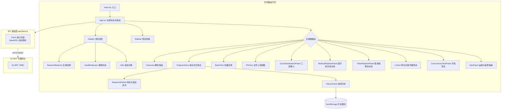

# 测试控制台前端 (React Web SPA) — 详细设计文档

> 本文档定义 **数联天下 · 数盾 (`PrivShield`)** 测试控制台 Web 前端（`console/web`）的系统架构、组件层级、双协议热切换、多流水线交互与国际化设计。

---

## 1. 概述与设计理念

测试控制台 Web 前端基于 **React 18 + TypeScript + Vite + Tailwind CSS** 构建，是一个高性能、零多余第三方 UI 依赖的纯单页应用（SPA）。

### 核心定位
将 `PrivShield` 的全部复杂隐私原语（掩码脱敏、差分隐私、K-匿名、查询混淆、动态三层漏斗分类分级）以及数据服务调度中枢（Service Hub）、数据源管理（Datasource Manager）与脱敏审计日志（Audit Log）组织为一个**结构清晰、交互流畅、可即时调试验证**的沉浸式工作台。

---

## 2. 总体架构与数据流



---

## 3. 核心设计与交互机制

### 3.1 双协议一键热切换 (Dual-Protocol Switching)

前端通过 Go BFF 与核心 Agent 通信，支持在 REST 与 gRPC 两种上游协议间切换：
1. **统一契约保障**：Go BFF 对前端暴露 `/v1/*` 路由与统一 JSON 返回结构；
2. **协议热切换**：用户通过顶栏 `BackendSelector` 切换时，调用 `setBaseUrl('?protocol=rest')` 或 `setBaseUrl('?protocol=grpc')` 切换上游协议标识；
3. **协议透传验证**：响应面板根据返回体中的 `via`（`go-grpc`）与 `protocol`（`REST` / `gRPC`）实时显示通信徽标，验证切换生效。

> 历史说明：`console/bff-py` 已删除，当前统一由 `console/bff-go` 提供 REST/gRPC 上游代理；原先的「双后端」概念已收窄为同一 Go BFF 上的两种上游协议。

---

### 3.2 动态三层漏斗可视化 (`DynClassificationPanel`)

直观展示三层分类漏斗执行路径：
- **Layer 1: 规则引擎**（YAML 领域正则/词表秒级判定）
- **Layer 2: Small-NER**（ONNX / 医疗专用轻量实体识别）
- **Layer 3: Local LLM**（本地大模型多维语义仲裁与置信度平滑）

支持输入单条记录、多行 JSON 或医疗文本，实时动态呈现每一层级的置信度评分、字段打标与最终输出的安全等级（L1~L5）。

---

### 3.3 专项业务流水线面板 (`MedicalPipelinePanel` & `YibaoPipelinePanel`)

- **医疗病历脱敏流水线**：涵盖患者姓名、身份证、就诊科室、敏感诊断（如精神科、传染病）分级脱敏；
- **医保结算脱敏流水线**：涵盖医保卡号、自费金额、统筹报销金额的差分隐私与 K-匿名混合脱敏；
- 页面提供原始数据、脱敏前后对比对照表与差分隐私预算消耗计费面板。

---

## 4. 路由与反向代理配置

### 4.1 Nginx 容器化代理配置 (`nginx.conf`)

生产镜像内嵌 Nginx 监听 `5173` 端口，反向代理各后端微服务：

```nginx
# Go BFF 代理
location /v1/ {
    proxy_pass http://console-backend-go:8081/v1/;
}

# Go BFF 兼容别名
location /v1/go/ {
    proxy_pass http://console-backend-go:8081/;
}

# Service Hub 调度中枢
location /v1/hub/ {
    proxy_pass http://privacy-service-hub:8082/v1/hub/;
}

# Datasource Manager 数据源管理
location /v1/datasources {
    proxy_pass http://privacy-datasource-mgr:8083/v1/datasources;
}

# Audit Log 脱敏审计日志
location /v1/audit/ {
    proxy_pass http://privacy-audit-log:8084/v1/audit/;
}

# SPA 前端路由回退
location / {
    root /usr/share/nginx/html;
    index index.html index.htm;
    try_files $uri $uri/ /index.html;
}
```

---

## 5. 组件层级与模块划分

```text
console/web/src/
├── main.tsx                    # 应用挂载入口
├── App.tsx                     # 根组件：全局状态机、导航布局、路由分发
├── index.css                   # Tailwind 全局样式
├── api/
│   ├── client.ts               # 统一 API 客户端（fetchHealth, proxyRequest, uploadFile 等）
│   └── __tests__/              # API 客户端单元测试
├── components/
│   ├── Header.tsx              # 顶部导航栏（Logo, 后端切换, 状态灯, 语言切换）
│   ├── BackendSelector.tsx     # 后端切换下拉选择器
│   ├── Sidebar.tsx             # 侧边导航栏（分组折叠与搜索）
│   ├── Overview.tsx            # 全景功能概览卡片网格
│   ├── EndpointView.tsx        # 单接口交互测试面板（请求构建 + 响应查看）
│   ├── BatchTest.tsx           # 批量接口并发/顺序测试
│   ├── FileTest.tsx            # 50MB 大文件上传与流式脱敏预览
│   ├── DynClassificationPanel.tsx # 三层漏斗动态分类分级面板
│   ├── MedicalPipelinePanel.tsx   # 医疗健康隐私治理全流程面板
│   ├── YibaoPipelinePanel.tsx     # 医保结算流水治理面板
│   ├── LbTest.tsx              # 负载均衡多策略压测面板
│   ├── ConcurrencyTestPanel.tsx   # 高并发压力测试面板
│   ├── OpsPanel.tsx            # Prometheus 监控指标与运维看板
│   ├── ResponsePanel.tsx       # 语法高亮响应查看器与下载工具
│   ├── HistoryPanel.tsx        # 本地历史请求回放面板
│   ├── ErrorBoundary.tsx       # 全局 React 渲染异常捕获兜底组件
│   └── icons.tsx               # 纯内联 SVG 图标库
├── i18n/
│   └── index.tsx               # 中英文双语国际化上下文与词条映射
├── lib/
│   ├── categories.ts           # 隐私分类元数据与主题色
│   ├── curl.ts                 # cURL 命令一键生成器
│   ├── history.ts              # LocalStorage 历史记录管理
│   └── levelColor.ts           # L1~L5 敏感等级主题配色函数
├── types/
│   └── api.ts                  # 前后端交互 TypeScript 类型定义
└── utils/
    ├── error.ts                # 异常格式化与解析
    ├── fieldLabels.ts          # 字段中文映射
    ├── fileParse.ts            # CSV / JSON 文件解析与校验
    └── sampleFile.ts           # 样例数据生成器
```
