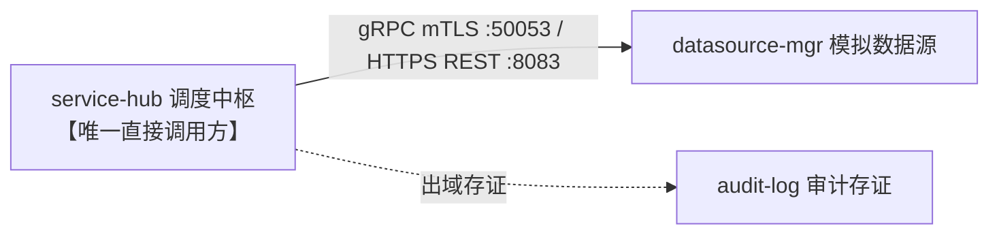

# 模拟数据源服务 (Mock Datasource Manager) — 产品需求文档 (PRD)

## 1. 产品概述

**模拟数据源服务**（`datasource-mgr`）是 PrivShield 平台的轻量级模拟数据源服务，专为开发、联调、测试与合规治理演练阶段提供高保真业务数据仿真与跨服务安全通信验证。生产环境中下游调度流水线可直接对接真实政务云/医疗专网数据底座。

| 属性 | 值 |
|---|---|
| 模块名称 | `datasource-mgr` |
| 默认端口 | HTTP/HTTPS REST: `8083` / gRPC: `50053` |
| 开发语言与框架 | Go 1.25+ / Gin / gRPC (Protobuf v3) |
| 安全协议 | 国密 SM2 / TLS 1.3 mTLS 双向认证 + CN 白名单鉴权 |
| 业务标准 | 四川省健康医疗大数据应用指南 DB51/T 2989—2023 (L1~L5 五级) |

---

## 2. 核心业务需求

### 2.1 模拟数据源资产生命周期
```
数据源注册/加载 → 连通性探测 → 元数据特征探查 → 高保真模拟数据抽取 → 操作审计
```

### 2.2 4 个高保真模拟数据源 (对标 DB51/T 2989—2023)
1. **医保就医与结算源 (`ds_yibao`)**：包含 19 个字段（`insurance_settlement_id`, `person_id`, `diagnosis_name`, `icd10_code`, `admission_condition`, `id_card_no` 等），用于仿真医保合规结算流通场景；
2. **康养体检与慢病源 (`ds_kangyang`)**：包含 27 个字段（`chief_complaint`, `present_illness`, `disability_category`, `assess_score`, `id_card_no`, `medical_insurance_no` 等），用于仿真健康康养监测场景；
3. **预留政务数据源 (`ds_mock3`)**：政务多部门审批流水仿真；
4. **预留企业数据源 (`ds_mock4`)**：企业税务与财务经营数据仿真。

> 数据抽取统一采用「按身份证号查询单条记录」模式（`record-by-id` / `GetRecordByIDCard`），完整字段字典详见 [api.md](api.md) §5。

---

## 3. 功能需求

### 3.1 双协议通信与接口矩阵

| 方法/RPC | 路径/方法名 | 协议 | 说明 |
|---|---|---|---|
| 契约分级 | 协议方法 | 端点 / RPC 方法 | 协议 | 业务说明 |
|---|---|---|---|---|
| **Class A** | GET / rpc | `/v1/datasources/:id/record-by-id?id_card_no=xxx` / `GetRecordByIDCard` | HTTP/gRPC | **核心数据抽取入口 (P0)**：按身份证号查询单条记录（`ds_yibao` 19 字段 / `ds_kangyang` 27 字段） |
| **Class A** | GET / rpc | `/health`, `/health` / `Health` | HTTP/gRPC | 服务基础存活健康探针 (P0) |
| **Class A** | POST / rpc | `/v1/datasources/:id/test` / `TestConnection` | HTTP/gRPC | 数据源物理/逻辑连通性自测 (P1) |
| **Class B** | GET / rpc | `/v1/datasources` / `ListDataSources` | HTTP/gRPC | 数据源资产目录元数据列表（可选扩展 P2） |
| **Class B** | GET / rpc | `/v1/datasources/:id` / `GetDataSource` | HTTP/gRPC | 单个数据源详情元数据（可选扩展 P2） |
| **Class B** | GET | `/v1/datasources/:id/metadata` | HTTP | 数据源 Schema 表结构与字段类型探查（可选扩展 P2） |
| **Class C** | GET | `/readyz` | HTTP | K8s 容器就绪探针（基础设施，外部免实现） |
| **Class C** | GET | `/metrics` | HTTP | Prometheus 监控指标采集（基础设施，外部免实现） |
| **Class D** | GET | `/v1/datasources/:id/audit` | HTTP | 本地模拟访问审计记录查询（测试专用，生产屏蔽） |
| **Class D** | POST | `/v1/datasources/seed` | HTTP | 模拟数据源初始化/重置（测试专用，生产屏蔽） |

### 3.2 运行配置项

| 环境变量 | 默认值 | 说明 |
|---|---|---|
| `DATASOURCE_MGR_HOST` | `127.0.0.1` | HTTP/HTTPS REST 监听地址 |
| `DATASOURCE_MGR_PORT` | `8083` | HTTP/HTTPS REST 监听端口 |
| `DATASOURCE_MGR_GRPC_HOST` | `127.0.0.1` | gRPC 监听地址 |
| `DATASOURCE_MGR_GRPC_PORT` | `50053` | gRPC 监听端口 |
| `DATASOURCE_MGR_ENABLE_MOCK_HELPERS` | `true` | 是否开放 Class D 本地测试辅助端点（`/seed`, `/audit`），生产环境置为 `false` 物理屏蔽 |
| `DATASOURCE_MGR_TLS_ENABLED` | `false` | 是否开启双协议 TLS 1.3 / 国密 SM2 mTLS 双向认证 |
| `DATASOURCE_MGR_TLS_CERT_FILE` | (空) | 服务端 X.509 证书 PEM 路径 |
| `DATASOURCE_MGR_TLS_KEY_FILE` | (空) | 服务端私钥 PEM 路径 |
| `DATASOURCE_MGR_TLS_CA_FILE` | (空) | 客户端身份验证根 CA 证书路径 |
| `DATASOURCE_MGR_TLS_CLIENT_AUTH` | (空) | 客户端证书模式 (`require` / `verify` / `request`) |
| `PRIVACY_AUTH_MTLS_WHITELIST_FILE` | (空) | gRPC 客户端证书 CN 白名单 YAML 文件路径 |
| `DATASOURCE_MGR_API_KEY` | (空) | 入站 API Key 鉴权口令（空表示免密） |
| `DATASOURCE_MGR_STRICT_STORAGE` | `true` | 严格存储模式：CSV 损坏行直接报错，不静默丢弃 |
| `DATASOURCE_MGR_LOG_FORMAT` | `json` | 日志格式 (`json` / `text`) |
| `DATASOURCE_MGR_LOG_LEVEL` | `info` | 日志级别 (`debug` / `info` / `warn` / `error`) |

---

## 4. 安全与非功能需求

1. **金融级零信任传输安全**：
   - 强制 TLS 1.3 / 国密 SM2 双向认证加密基线；
   - 支持 mTLS 客户端证书强校验与 CN 白名单鉴权，阻断跨网络越权调用；
2. **高并发与低延迟**：
   - 数据抽样响应延迟 < 5ms；
   - HTTP Server 显式配置超时（ReadHeaderTimeout 5s, ReadTimeout 30s, IdleTimeout 120s），防御 Slowloris 拒绝服务攻击；
3. **高内聚低耦合**：
   - 纯 Go 标准库与轻量依赖，内置完整数据生成器，零外部数据库依赖，开箱即用。

---

## 5. 系统集成关系



> 前端控制台与 BFF 网关**不直连** `datasource-mgr`，所有数据请求统一经 `service-hub` 编排调度；datasource-mgr 也不直接写入 audit-log，出域存证由 service-hub 统一编排。
