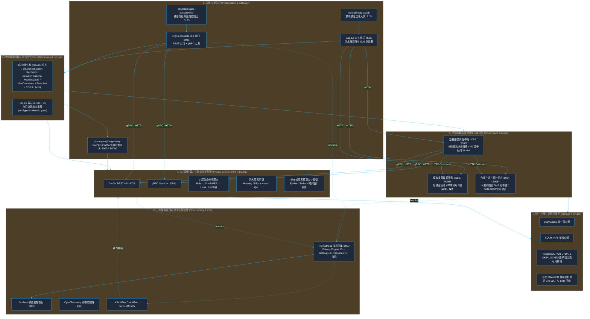
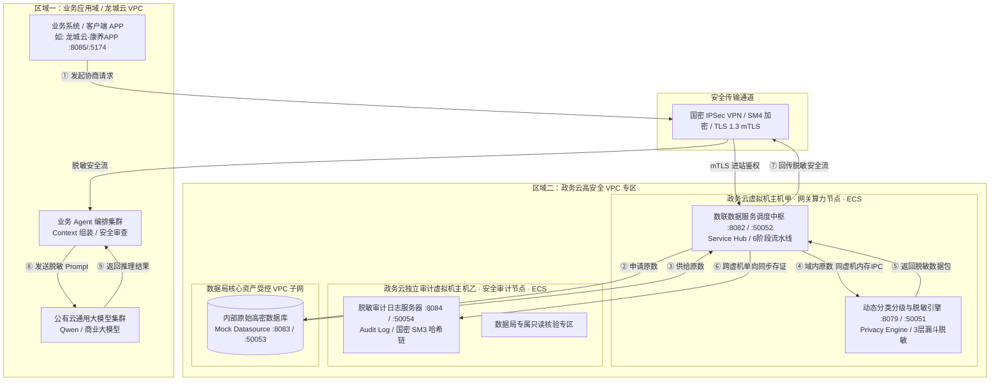
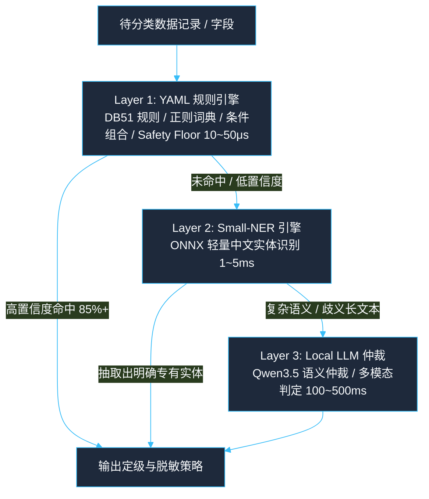
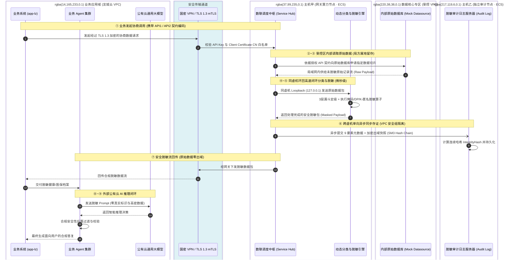

# PrivShield 架构设计文档 (Architecture Design Document)

> **版本**：v16.5.0（2026 生产实装版）  
> **适用范围**：`PrivShield` Go 核心算力引擎（`services/privacy-engine`，内置 `sdk/` 隐私数学原语库）、`services/privacy-engine/model-training/llmlora`（离线模型微调与量化）、企业级中台微服务群（`services/service-hub` / `services/audit-log`）、控制台与数据源生态（`console/engine-console` / `console/app-lz` / `console/mock-datasource`）及云原生部署基础设施。  
> **核心数据分级基准**：**DB51/T 2989—2023《四川省健康医疗大数据应用指南》**（五级分类分级核心基准与敏感病种治理规则）  
> **关联文档**：
> - [liuzhou_govcloud_data_security_architecture.md](liuzhou_govcloud_data_security_architecture.md)（柳州政务云数据流通与网关脱敏安全架构审查专版）
> - [柳州市医疗健康数据分类分级与隐私脱敏算法标准规范.md](柳州市医疗健康数据分类分级与隐私脱敏算法标准规范.md)（柳州市医疗健康数据分类脱敏算法标准规范）
> - [unified_design_specifications.md](unified_design_specifications.md)（全栈统一设计规范）
> - [new_api_design.md](new_api_design.md)（新增数据接口扩展 SOP）
> - [architecture-summary.md](architecture-summary.md)（工程实践速览）
> - [services.md](services.md)（微服务体系设计）
> - [console.md](console.md)（控制台与双 BFF 体系）
> - [production_optimization_design.md](production_optimization_design.md)（生产级高可用设计）

---

## 目录

- [一、总体架构与设计哲学](#一总体架构与设计哲学)
  - [1.1 业务定位与全景拓扑](#11-业务定位与全景拓扑)
  - [1.2 核心设计哲学](#12-核心设计哲学)
  - [1.3 分层 Monorepo 代码架构](#13-分层-monorepo-代码架构)
  - [1.4 政务云三大安全区域与部署拓扑](#14-政务云三大安全区域与部署拓扑)
- [二、算法与核心算力引擎（PrivShield Core）](#二算法与核心算力引擎privshield-core)
  - [2.1 四川省五级分级基准与三层动态分类漏斗](#21-四川省五级分级基准与三层动态分类漏斗)
  - [2.2 差分隐私与预算会计模型 (DP & Budget)](#22-差分隐私与预算会计模型-dp--budget)
  - [2.3 K-匿名与 Mondrian 多维泛化](#23-k-匿名与-mondrian-多维泛化)
  - [2.4 示范数据源（医保与康养）字段脱敏策略矩阵](#24-示范数据源医保与康养字段脱敏策略矩阵)
- [三、企业级中台微服务群（Enterprise Services）](#三企业级中台微服务群enterprise-services)
  - [3.1 数据服务调度中枢 (Service Hub :8082 / :50052)](#31-数据服务调度中枢-service-hub-8082--50052)
  - [3.2 模拟多源数据源服务 (Mock Datasource :8083 / :50053)](#32-模拟多源数据源服务-mock-datasource-8083--50053)
  - [3.3 独立审计与国密 SM3 防篡改存证 (Audit Log :8084 / :50054)](#33-独立审计与国密-sm3-防篡改存证-audit-log-8084--50054)
- [四、端到端数据流转机制与高可用调度](#四端到端数据流转机制与高可用调度)
  - [4.1 端到端 9 阶段全流程流转时序](#41-端到端-9-阶段全流程流转时序)
  - [4.2 各阶段安全关键控制点](#42-各阶段安全关键控制点)
  - [4.3 Go Client-Side 多节点负载均衡与熔断](#43-go-client-side-多节点负载均衡与熔断)
  - [4.4 网关 P2C 动态负载调度](#44-网关-p2c-动态负载调度)
  - [4.5 PostgreSQL 原子租约并发与自愈](#45-postgresql-原子租约并发与自愈)
  - [4.6 云原生多维自动扩缩容](#46-云原生多维自动扩缩容)
- [五、统一管理与测试控制台（Console & BFF）](#五统一管理与测试控制台console--bff)
  - [5.1 统一 Go BFF 网关架构](#51-统一-go-bff-网关架构)
  - [5.2 前端 React 18 架构](#52-前端-react-18-架构)
- [六、全栈可观测性、零信任安全与合规保障](#六全栈可观测性零信任安全与合规保障)
  - [6.1 Prometheus 指标与 Grafana 看板](#61-prometheus-指标与-grafana-看板)
  - [6.2 9 层统一中间件栈与纵深防御](#62-9-层统一中间件栈与纵深防御)
  - [6.3 TLS 1.3 双向 mTLS 与 CN 白名单动态热重载](#63-tls-13-双向-mtls-与-cn-白名单动态热重载)
  - [6.4 Scope-based 接口权限控制体系](#64-scope-based-接口权限控制体系)
  - [6.5 国家法律法规与行业标准合规对照表](#65-国家法律法规与行业标准合规对照表)
- [七、技术选型总表](#七技术选型总表)

---

## 一、总体架构与设计哲学

### 1.1 业务定位与全景拓扑

PrivShield 实现了**「三层四柱五御六类」数据安全与隐私治理架构**：
- **表现与接入面**：双控制台（`console/engine-console/web` 与 `console/app-lz/web`）配合高性能 Go BFF 代理网关群（`:8081` / `:8085`），面向合规工程师与业务运营人员提供全场景交互；
- **调度与存证面**：企业级 Go 微服务群串联多源数据纳管与模拟（`console/mock-datasource:8083`）、6 阶段流水线调度编排（`services/service-hub:8082`）与 9 要素国密 SM3 防篡改存证（`services/audit-log:8084`）；
- **核心计算面**：以独立核心引擎（`services/privacy-engine:8079` / `:50051`）形式提供字段级脱敏、差分隐私、K-匿名与三层动态分类分级漏斗（Rule → Small-NER → Local LLM 仲裁），纯 Go 实现 + 内置 `sdk/` 零依赖数学原语库；
- **存储与基础设施面**：支持 SQLite WAL 单机部署与 PostgreSQL `FOR UPDATE SKIP LOCKED` 原子租约高可用集群，并提供 Helm / K8s / Docker Compose 全栈云原生基础设施。



---

### 1.2 核心设计哲学

| 原则 | 含义 | 架构落地体现 |
|---|---|---|
| **确定性优先** | 隐私算法与安全定级具备可证明的数学与规则依据 | 规则引擎优先于 AI 模型；DP/K-Anon 采用经典数学机制 |
| **优雅降级** | 复杂重依赖缺失或硬件受限时不崩溃，自动回退可用子集 | LLM/NER 缺失回退规则层与人工审核标记；内存 `<512MB` 跳过 LLM |
| **纯 Go 云原生与离线 AI 闭环** | 生产运行时彻底纯 Go 1.25+ 化，AI 模型训练与量化保持离线解耦 | 核心引擎与微服务群 100% 纯 Go 构建，保持 ~25MB Alpine 极简镜像；Python 仅作为离线模型专精微调工具（`model-training/llmlora`）存在 |
| **双栈同源** | 一套核心业务逻辑，同时支持高性能 RPC 与易调试 REST | `PrivacyService` 同时驱动 REST 路由与 gRPC Servicer |
| **零信任访问** | 默认不信任任何内部网络，每跳通信均需身份认证与权限校验 | gRPC mTLS + CN 白名单动态热重载 + HTTP API Key 鉴权 |
| **云原生韧性** | 具备自愈、自适应负载均衡与细粒度事件驱动弹性扩缩 | P2C 动态分流、三态熔断器、优雅停机排空与 CronHPA 潮汐调度 |

---

### 1.3 分层 Monorepo 代码架构

```text
PrivShield/ (Repo Root)
├── services/                          # 商业化生产微服务群 (Production Services)
│   ├── privacy-engine/                # 核心隐私计算与动态分类分级引擎 (Core Sidecar/Agent)
│   │   ├── cmd/
│   │   │   ├── privshield-agent/      # Agent 主入口 (REST :8079 + gRPC :50051)
│   │   │   └── privshield-gateway/    # 网关与反向代理入口 (:8000 + gRPC :50000)
│   │   ├── internal/                  # 动态分类分级、网关代理、安全认证、画像等
│   │   ├── sdk/                       # 内置隐私计算数学原语库 (Masking, DP, LDP, K-Ano, Medical, Budget)
│   │   ├── rules/                     # 领域敏感特征规则库 (Taxonomies, Domains, Standards)
│   │   ├── model-training/llmlora/    # 领域大模型/NER 离线微调与量化流水线 (Python/PEFT)
│   │   ├── docs/                      # 引擎自包含架构与 API 说明文档
│   │   ├── deploy/                    # 引擎专属 Dockerfile / Dockerfile.cuda / k8s / compose
│   │   ├── scripts/                   # 引擎单模块运行、测试与压测脚本
│   │   └── Makefile                   # 引擎单模块构建与测试入口
│   ├── service-hub/                   # 数联数据服务调度中枢 · 唯一编排入口 (流水线调度: :8082 / :50052)
│   │   ├── docs/ deploy/ scripts/ Makefile # 自包含交付资产
│   │   └── ...
│   └── audit-log/                     # 脱敏审计日志与不可篡改存证服务 (:8084 / :50054)
│       ├── docs/ deploy/ scripts/ Makefile # 自包含交付资产
│       └── ...
├── console/                           # 测试与管理生态 (Testing & Management Consoles)
│   ├── engine-console/                # Privacy Engine 专属管理控制台 (专测 privacy-engine)
│   │   ├── bff-go/                    # Engine Console BFF (:8081 / :50055)
│   │   ├── web/                       # Engine Console Web 前端 (React 18 + TS + Vite :5173)
│   │   ├── docs/ deploy/ scripts/ Makefile # 自包含交付资产
│   ├── app-lz/                        # 数联调度之眼业务模拟器 (专测 service-hub 调度编排)
│   │   ├── bff-go/                    # 业务专有 BFF (:8085，所有数据请求统一走 service-hub)
│   │   ├── web/                       # 业务流水线控制台前端 (React 18 + TS + Vite :5174)
│   │   ├── docs/ deploy/ scripts/ Makefile # 自包含交付资产
│   └── mock-datasource/               # 模拟多源异构数据源服务 (:8083 / :50053)
│       ├── docs/ deploy/ scripts/ Makefile # 自包含交付资产
│       └── ...
├── pkg/                               # Go 全局共享基础库
│   ├── naming/                        # SSOT 规范命名与别名归一化
│   ├── auth/                          # Scope-based 身份认证与 REST/gRPC 权限映射
│   ├── middleware/                    # 9 层统一中间件栈、统一错误信封与 DDoS 纵深防御
│   ├── gateway/                       # P2C-EWMA 负载均衡、三态熔断器与 BufferPool 零分配
│   ├── circuitbreaker/                # 共享三态熔断器原语 (Closed → Open → HalfOpen)
│   ├── store/                         # 存储底座抽象 (SQLite WAL / PostgreSQL 原子租约 / Memory)
│   ├── crypto/                        # SM4-GCM 信封加密 (enc:v2: HKDF 派生) 与纯 Go SM3/SM4
│   ├── tlsutil/                       # TLS 1.3 mTLS 与 CN 白名单 5s 热重载 + gRPC 拦截器
│   ├── observability/                 # Prometheus RED 指标、OTel Tracer 抽象与结构化日志
│   └── metrics/                       # Prometheus 业务指标收集器
├── proto/                             # gRPC 协议定义 (privacy.proto)
├── deploy/                            # 全栈集中部署基础设施 (Helm, K8s, Docker Compose, Grafana)
├── config/                            # 全局运行时配置与 mTLS 白名单 (mtls-whitelist.yaml)
└── scripts/                           # 全局自动化运维、启动、测试与全链路压测脚本
```

---

### 1.4 政务云三大安全区域与部署拓扑

针对政务云、医疗医保与智慧康养等高敏感数据跨域流通场景，系统在政务云上划分为三大严格隔离的安全区域，并采用**独立虚拟机 (ECS) 与 VPC 子网及安全组逻辑强隔离**：



| 部署节点定位 | 部署组件 | 网络与 VPC 安全组控制策略 | 归属与管理责任 |
|---|---|---|---|
| **外部业务节点** | • 业务系统 (`console/app-lz`)<br/>• 业务 Agent 集群 | 位于业务云 VPC，经国密 IPSec VPN 专线连接政务云网关 | 业务运营方 |
| **云虚拟机主机甲**<br/>(网关算力节点 · ECS) | • 数据服务调度中枢 (`service-hub:8082`)<br/>• 动态分类分级与脱敏引擎 (`privacy-engine:8079`) | 仅开放受控 VPN 接入端口；中枢与脱敏引擎使用 `127.0.0.1` 环回内存 IPC 高速通信 (10~50μs) | 技术运营方（受数据局监管） |
| **云虚拟机主机乙**<br/>(独立审计节点 · ECS) | • 脱敏审计日志服务器 (`audit-log:8084`)<br/>• 9 要素国密 SM3 连续哈希链与 SM4 快照 | 独立审计虚拟机，VPC 安全组配置单向入站只写策略，暴露只读验真端点 | **数据局安全监管组专属** |
| **核心数据资产区** | • 内部原始数据库 (`mock-datasource:8083`) | 专用高密受控 VPC 子网，禁止外网直连，仅响应主机甲鉴权原数切片申请 | **数据局独家持有与管控** |

---

## 二、算法与核心算力引擎（PrivShield Core）

### 2.1 四川省五级分级基准与三层动态分类漏斗

系统以 **DB51/T 2989—2023《四川省健康医疗大数据应用指南》** 为核心五级分级基准（L1公开、L2内部、L3敏感、L4高敏、L5极敏），并在 `services/privacy-engine/internal/dynclassification` 实现**三层递进漏斗机制**：



* **Layer-1 (规则层 + Safety Floor 保底)**：`ConfigurableRuleEngine` 解析 `services/privacy-engine/rules/domains/*.yaml` 与 DB51 标准体系定义，支持正则匹配、枚举词典、Luhn 校验与条件组合规则，并结合 Safety Floor 对身份证、手机号等关键字段强制保底定级（L3/L4），处理 85%+ 明确模式；
* **Layer-2 (实体抽取层)**：采用轻量级 ONNX NER 模型抽取姓名、身份证、疾病、机构等实体，跳过纯数字及英文字段以提高吞吐；
* **Layer-3 (大模型仲裁层)**：采用专精量化本地大模型（Qwen3.5）进行上下文语义推理与歧义仲裁，配备进程级并发信号量（`PRIVACY_LLM_MAX_CONCURRENCY=1`）防显存 OOM，当系统可用内存 `<512MB` 时自动跳过并标记 `needs_human_review`。

---

### 2.2 差分隐私与预算会计模型 (DP & Budget)

* **严格数学原语**：实现拉普拉斯机制（Laplace Mechanism）与高斯机制（Gaussian Mechanism），涵盖 `count` / `sum` / `mean` / `histogram`、有界截断（Adaptive Clip）及本地差分隐私（LDP）；
* **差分隐私预算会计中枢 (`BudgetAccountant`)**：
  * 支持命名空间隔离追踪累计 $\varepsilon$（Epsilon）与 $\delta$（Delta）消耗；
  * 支持时间窗口自动重置（`PRIVACY_BUDGET_WINDOW_SECONDS`）；
  * 支持跨多实例持久化同步（`PRIVACY_BUDGET_DB`，SQLite / PostgreSQL / Memory）；
  * 不可篡改国密哈希审计：`BudgetAuditLogger` 对每笔预算消耗记录进行 **国密 HMAC-SM3 / SM3** 签名存证。

---

### 2.3 K-匿名与 Mondrian 多维泛化

* **记录级实时泛化**：针对单条业务请求中的准标识符（年龄、邮编、薪资等）按领域层次树做最小化泛化；
* **数据集级全局优化**：实现经典 **Mondrian 多维区间划分算法**，支持 pandas 向量化切片计算，确保整表发布时任意等价类规模 $\ge k$。

---

### 2.4 示范数据源（医保与康养）字段脱敏策略矩阵

针对核心政务与医疗数据资产，系统内置了对齐 DB51 标准的分类脱敏策略矩阵：

#### 1. 医保结算数据接口 (`ds_yibao` / `api1_yibao`，19 字段)
| 字段标识 | 字段业务名称 | 敏感等级 | DB51 数据分类 | 脱敏策略与算法 | 脱敏效果示例 |
|---|---|:---:|:---:|---|---|
| `person_id` | 个人参保标识 | **L4** | 个人直接标识 | 国密 HMAC-SM3 散列 + 截断 | `P9A8***F6` |
| `birth_date` | 出生日期 | **L2** | 准标识符 | 年份保留 / 月日泛化 | `1985-**-**` |
| `gender` | 性别 | **L1** | 统计属性 | 明文保留 / 保持原始 | `男` |
| `hospital_code` | 医疗机构编码 | **L2** | 业务代码 | 结构保留 / 局部掩码 | `H4502***01` |
| `icd10_code` | ICD-10 诊断编码 | **L4** | 高敏医疗编码 | `RedactICD10Code`：L5/L4 编码整值抹空（无痕）、非高危原样 | `B20.900` ➔ `""`；`C34.900` ➔ `""`；`I10.x00` ➔ 原样 |
| `diagnosis_name` | 诊断名称 | **L4** | 高敏医疗信息 | 含高危词 → 无痕临床文本抹平（5 阶段管线：死因重构 + 范畴泛化 + 句法擦除 + 裸词擦除 + 语法自愈）；不含高危词 → 姓名掩码 | `急性心肌梗死` ➔ `""`；`原发性高血压` ➔ `原****压` |
| `insurance_settlement_id` | 结算流水号 | **L3** | 业务流水 | 中段掩码 | `SET-2026-****-88` |

#### 2. 康养体征数据接口 (`ds_kangyang` / `api2_kangyang`，27 字段)
| 字段标识 | 字段业务名称 | 敏感等级 | DB51 数据分类 | 脱敏策略与算法 | 脱敏效果示例 |
|---|---|:---:|:---:|---|---|
| `name` | 患者真实姓名 | **L4** | 个人高敏感 PII | 姓氏保留，名字掩码 | `王*` / `张**` |
| `id_card_no` | 身份证号 | **L4** | 个人法定唯一标识 | 前6后4保留，中间掩码 | `450202********1234` |
| `chief_complaint` | 患者主诉 | **L4** | 高敏病情描述 | 含高危词 → `RedactMedicalText` 无痕抹平；不含 → 原样 | `反复胸闷胸痛半年` ➔ `反复胸闷胸痛半年`（无高危词原样） |
| `past_history` | 既往病史 | **L4** | 高敏个人病史 | 含高危词 → `RedactMedicalText` 无痕抹平；不含 → 原样 | `父亲因恶性肿瘤去世` ➔ `父亲因病去世` |
| `disability_cert_no` | 残疾人证号 | **L4** | 特殊身份敏感标识 | 严格掩码 | `450202********123401` |
| `height` / `weight` | 身高 / 体重 | **L2** | 体征数据 | 注入微量差分噪声 ($\varepsilon=1.0$) | `172.4 cm` ➔ `170~175 cm` |

---

## 三、企业级中台微服务群（Enterprise Services）

中台微服务群位于 `services/`，基于 Go 构建，具备高并发、低内存占用与强类型安全的特性。

### 3.1 数据服务调度中枢 (Service Hub :8082 / :50052)
* **流水线 6 阶段调度**：`Ingest` (请求接入) ➔ `Fetch` (拉取原数) ➔ `Classify` (分类定级) ➔ `Desensitize` (按级脱敏) ➔ `Return` (脱敏回传) ➔ `Audit` (异步存证)；
* **任务状态机与原子租约并发**：集成 `LeasedTaskStore`，在 PostgreSQL 上基于 `FOR UPDATE SKIP LOCKED` 实现多副本无阻塞竞争领取（`ClaimNext`）、带令牌租约续期（`RenewLease`）与完成确认；
* **崩溃恢复与自动重试**：启动时自动回收孤立任务（running 标记失败、pending 保留队列），周期性后台重试失败任务（指数退避 + RetryCount 结构化字段）；
* **完整性校验与备份**：启动时执行 `PRAGMA integrity_check` 阻断损坏数据库，统一备份脚本支持全量/增量/验证模式；
* **HTTP/gRPC 双协议 mTLS**：共享 `pkg/tlsutil` 工具库，TLS 1.3 强制最低版本，gRPC 服务端注册一元与流式 mTLS CN 白名单拦截器。

### 3.2 模拟多源数据源服务 (Mock Datasource :8083 / :50053)
* **多源异构纳管与模拟**：统一管理 MySQL、PostgreSQL、API 及文件型数据源；
* **模拟数据集开箱即用**：内置医保结算（`yibao.csv`）与康养体检慢病（`kangyang.csv`）数据库，支持启动自动种子注入（`SeedMockDataSources`）、元数据自动探查与样本安全切片提取（Sample Slicing）；
* **HTTP/gRPC 双协议 mTLS**：与 service-hub 共享 `pkg/tlsutil` 工具库，支持 TLS 1.3 双向认证与 CN 白名单动态热重载。

### 3.3 独立审计与国密 SM3 防篡改存证 (Audit Log :8084 / :50054)

PrivShield 将审计系统独立部署在政务云独立审计虚拟机主机乙上，实现算力与审计的强隔离：

1. **9 要素国密 SM3 连续哈希链数学模型**：
   每一笔数据流通操作均提取 9 个关键特征字段，采用 **国密 SM3 算法（GM/T 0004-2012 / GB/T 32918）** 与前序区块的哈希值进行链式计算：
   $$\text{Preimage}_n = \text{prev\_hash}_{n-1} \parallel \text{log\_id}_n \parallel \text{timestamp\_utc}_n \parallel \text{algorithm}_n \parallel \text{input\_hash}_n \parallel \text{output\_hash}_n \parallel \text{user}_n \parallel \text{security\_level}_n \parallel \text{params\_json}_n$$
   $$\text{IntegrityHash}_n = \text{SM3}(\text{Preimage}_n)$$
   字段说明：`prev_hash`（链锚点）、`log_id`（记录唯一标识）、`timestamp_utc`（UTC 纳秒级 RFC3339Nano 归一化时间戳）、`algorithm`（哈希算法标签）、`input_hash`/`output_hash`（输入输出数据指纹）、`user`（操作者身份）、`security_level`（安全等级）、`params_json`（操作参数 JSON）。
2. **HMAC-SM3 密钥化存证**：
   配置 `AUDIT_LOG_HASH_KEY` 后采用密钥化 HMAC-SM3：$\text{HMAC-SM3}(\text{key}, \text{"SM3-HMAC:v1|"} \parallel \text{Preimage})$，未持有密钥者无法伪造或改写记录。未配置密钥时退回无密钥 SM3（仅可证明「内容未被修改」）。
3. **向下兼容多轨核验**：
   `VerifyAuditIntegrityHash` 依次尝试「密钥化 HMAC-SM3 → 无密钥 SM3-UTC → SHA-256-UTC → SM3-LocalTZ → SHA-256-LocalTZ」5 种候选，确保加密产品认证前写入的历史证据依然合法可验。
4. **快照 SM4-GCM 信封加密落盘**：
   出域脱敏样本快照在入库前经国密 SM4-GCM 动态信封加密落盘。当前写入格式为 **v2 信封**（HKDF-SM3 逐记录密钥派生 + 版本前缀参与 AAD）：
   ```text
   enc:v2:<Base64( 16 字节 HKDF salt + 12 字节 Nonce + SM4-GCM 密文 + 16 字节认证标签 Tag )>
   ```
   v1 历史格式（`enc:v1:`，SHA-256 弱派生）仅保留解密能力，不再写入。空密钥时 `EncryptString` 返回 `ErrEmptyKey`（Fail-Closed，不静默降级为明文）。
5. **在线核验与秒级验真**：
   暴露 `POST /v1/audit/chain/verify` 接口，支持毫秒级对账核验全链条完整性（检测物理删行、调序或未授权篡改），支持合规审计报告导出。

---

## 四、端到端数据流转机制与高可用调度

### 4.1 端到端 9 阶段全流程流转时序



---

### 4.2 各阶段安全关键控制点

| 阶段序号 | 阶段名称 | 执行实体 | 安全与技术控制点 | 架构关注重点 |
|:---:|---|---|---|---|
| **①** | 协商数据请求 | `console/app-lz` ➔ VPN ➔ `service-hub` | • 必须指明规范化的 `api_code`（如 `api1_yibao`）<br/>• 验证客户端 mTLS 证书 CN 是否在白名单中 | 严格限制调用范围，拒绝任意 SQL 或自由查询 |
| **②~③** | 原数受控供给 | `service-hub` ➔ `mock-datasource` | • 受控专网连接，严格限制读取行数（Limit）<br/>• 原始库表不暴露任何外部公网端口 | 原始数据物理不出专网，仅在局方受控专区流转 |
| **④~⑤** | 同虚机闭环脱敏 | `service-hub` ➔ `privacy-engine` | • 同虚拟机 `127.0.0.1` 环回通信，无跨机抓包风险<br/>• 3 层漏斗自动打标 L1~L5 并强制执行脱敏 | 内存级处理，微秒级响应，杜绝中间明文落盘 |
| **⑥** | 跨虚机同步存证 | `service-hub` ➔ `audit-log` | • 跨虚机异步存证，记录 9 要素国密 SM3 特征<br/>• 样本快照自动执行 SM4-GCM 信封加密 | 计算与审计强隔离，确保存证不可被业务侧篡改 |
| **⑦** | 脱敏安全回传 | `service-hub` ➔ VPN ➔ 业务端 | • 仅允许经脱敏引擎处理后的安全结构体出域<br/>• 经过国密 VPN（IPSec/SM4）通道安全加密传输 | 确保出域数据完全符合脱敏标准，绝无原始高敏泄漏 |
| **⑧~⑨** | 大模型安全交互 | 业务 Agent ➔ 公有云 LLM | • Prompt 仅包含已脱敏字段与泛化特征<br/>• Agent 执行响应后置校验，拦截非法内容 | 外部第三方大模型全程零接触敏感明文 |

---

### 4.3 Go Client-Side 多节点负载均衡与熔断

* `pkg/agent/client.go` 原生支持配置 `PRIVACY_AGENT_URLS` 集群列表；
* 内置无锁 Round-Robin 轮询调度（`atomic.Int32` fetch-and-add），按节点维度独立三态熔断器（Closed → Open → Half-Open），遇到单点宕机自动透明切换至存活节点；
* **4xx 智能防误熔断**：4xx 客户端业务错误直接透传，不计入服务端故障计数，防止恶意或格式错误请求击穿熔断器；
* **智能重试与故障转移**：对网络超时与 5xx 错误执行带随机抖动的指数退避重试（Exponential Backoff with Jitter），并在重试轮次切换到其他健康节点；
* **防 OOM 内存保护**：`io.LimitReader` 限制响应体上限 64 MiB；
* **全链路追踪与幂等**：自动从 Context 注入 `X-Request-ID`、`X-Trace-ID` 与 `X-Idempotency-Key`；
* 实时暴露 `circuit_breaker_state{node="..."}` 状态指标。

### 4.4 网关 P2C-EWMA 动态负载调度

Go 网关（`pkg/gateway/balancer.go` + `services/privacy-engine/internal/gateway/`）实现完整的自适应负载均衡体系：

* **P2C-EWMA（默认策略）**：Power of Two Choices 随机双选 + Exponentially Weighted Moving Average 延迟感知，负载评分 = $(\text{InFlight} + 1) \times \max(\text{EWMA}, 0.001)$，消除大并发下的羊群聚集效应；
* **5 种调度策略**：`p2c`（默认）/ `round_robin`（无锁原子轮询）/ `least_conn`（最少连接）/ `weighted_rr`（Nginx 平滑加权轮询）/ `weighted_random`（加权随机）；
* **三态熔断器**（`pkg/circuitbreaker`）：Closed → Open（连续失败 ≥ 阈值）→ Half-Open（冷却期后探测，成功 ≥ 3 次恢复 Closed），所有状态转换均 `sync.Mutex` 保护；
* **BufferPool 零分配**：`sync.Pool` 管理 32KB 预分配缓冲区，所有代理共享同一 `http.Transport`（MaxIdleConns 2048 / MaxIdleConnsPerHost 256）；
* **gRPC 透明流代理**：`grpc.UnknownServiceHandler` + `rawCodec` 零编解码字节透传，双向并发零拷贝流转发，连接池上限 256；
* **东西向 mTLS 回源**：`backend_tls.go` 构建 TLS 1.3 双向证书认证配置，网关作为 mTLS Client 与后端 Agent 建立加密通道。

### 4.5 PostgreSQL 原子租约并发与自愈

在多副本网关集群部署下，`service-hub` 采用 PostgreSQL `FOR UPDATE SKIP LOCKED` 短事务机制：

```sql
WITH candidate AS (
  SELECT id FROM tasks
  WHERE status = 'pending' AND (retry_after IS NULL OR retry_after <= NOW())
  ORDER BY priority DESC, created_at ASC
  FOR UPDATE SKIP LOCKED LIMIT 1
)
UPDATE tasks
SET status = 'running', lease_owner = $1, lease_token = $2,
    lease_expires_at = NOW() + INTERVAL '60 seconds', version = version + 1
  WHERE id IN (SELECT id FROM candidate)
RETURNING *;
```
* **彻底消除死锁**：多个 Hub 节点抢占任务时无锁阻塞；
* **租约持有与续期**：任务持有者携带 `lease_token` 执行脱敏并在完成后提交确认，杜绝分布式脑裂与任务重复下发；
* **崩溃自愈与退避重试**：节点宕机重启自动回收超期孤儿任务，遇到网络闪断按 $2^n \times \text{Base}$ 指数退避重试（上限 3 次）。

### 4.6 云原生多维自动扩缩容

* **业务指标 HPA**：支持基于 QPS 速率、LLM 排队深度与 P95 延迟进行水平扩缩；
* **CronHPA 预测调度**：预置政务与医疗业务潮汐策略（高峰期提前扩容，夜间平稳缩容）。

---

## 五、统一管理与测试控制台（Console & BFF）

### 5.1 统一 Go BFF 网关架构

* **`console/engine-console/bff-go` (:8081 / :50055)**：采用 Go + Gin + gRPC，对外暴露 REST/JSON 接口，内部通过 gRPC 直连 Privacy Engine 算力层；内置文件脱敏处理器与滑动窗口限流；
* **`app-lz/bff-go` (:8085)**：业务专有 BFF（模拟外部业务程序），所有数据请求统一通过 service-hub 调度中枢编排，不直接访问 mock-datasource / privacy-engine / audit-log；提供动态数据 API 目录并内置 E2E 自动化测试执行器。

### 5.2 前端 React 18 架构

* 基于 Vite + React 18 + TypeScript + TailwindCSS 构建，具备毫秒级 HMR、统一错误信封解析、标准化状态指示器色彩与动态 API 卡片渲染能力。

---

## 六、全栈可观测性、零信任安全与合规保障

### 6.1 Prometheus 指标与 Grafana 看板

* **全栈指标采集**：统一抓取 Privacy Engine（15+ 指标）、Gateway（4+ 指标）、BFF-Go、Service-Hub、Mock-Datasource、Audit-Log（15+ 指标）；
* **预置双仪表盘**：`deploy/grafana/dashboard.json`（全平台总览）与 `service-hub-dashboard.json`（流水线调度大屏）。

### 6.2 9 层统一中间件栈与纵深防御

所有 Go 微服务统一装配 9 层中间件栈：
```text
TraceMiddleware → StructuredLogger → Recovery → SecurityHeaders → MaxBodySize → MaxConcurrent → RateLimit → CORS → Auth
```
- **请求体与并发保护**：`MaxBodySize`（32MB/64MB）与 `MaxConcurrent`（1000）防止 OOM 与资源耗尽；
- **自适应限流**：每客户端 IP 令牌桶限流（默认 100 RPS / 200 Burst）；
- **全链路追踪**：`X-Request-ID` / `X-Trace-ID` 双头传递，Span 树关联；
- **SSOT 规范校验**：基于 [`pkg/naming`](file:///home/charles/code/PrivShield/pkg/naming/naming.go) 单一事实源对数据源别名进行归一化，未知数据源绝对 Fail-Closed 阻断。

### 6.3 TLS 1.3 双向 mTLS 与 CN 白名单动态热重载

* **强制 TLS 1.3 最低版本**；
* **证书 CN 白名单动态热重载**：服务端提取客户端证书中的 `Common Name (CN)`，根据 [`config/mtls-whitelist.yaml`](file:///home/charles/code/PrivShield/config/mtls-whitelist.yaml) 进行方法级权限鉴权，文件修改后 **5 秒内自动热重载生效，无需中断业务**；
* **Go gRPC 服务端拦截器全量注册**：`service-hub`（`:50052`）、`mock-datasource`（`:50053`）、`audit-log`（`:50054`）及 `bff-go`（`:50055`）均已注册一元/流式 mTLS CN 白名单拦截器（`pkg/tlsutil/grpc_interceptor.go`），与全平台共享同一白名单事实源。

### 6.4 Scope-based 接口权限控制体系

所有对外暴露的 REST/gRPC 接口均实施基于 Scope 的细粒度权限控制，由 `pkg/auth` 统一提供身份认证与路径→权限映射能力。

#### 6.4.1 身份模型

每个已认证的调用方持有一个 `Identity`，包含服务类型（`internal`/`external`）、名称与 Scope 列表。Scope `"*"` 为全权限通配符，否则执行精确匹配。

```text
Identity { ServiceType: "external", Name: "portal", Scopes: ["privacy:mask", "classification:read"] }
```

#### 6.4.2 REST 路径→权限映射（`PermissionForRESTPath`）

支持 `/v1/*` 规范前缀，同时覆盖根路径直调别名（`/agent/process`、`/medical/process` 等）；未映射路径默认归入 `admin` 权限（fail-closed），杜绝权限绕过。

| 权限 Scope | 覆盖路由（`/v1/*` 规范前缀 + 根路径直调别名） |
|---|---|
| `privacy:mask` | `/v1/privacy/mask*`、`/v1/privacy/process_file`、`/privacy/process_file` |
| `privacy:hash` | `/v1/privacy/hash` |
| `privacy:dp` | `/v1/privacy/dp/*`、`/v1/privacy/ldp/*` |
| `privacy:kano` | `/v1/privacy/k_anonymize*` |
| `privacy:qol` | `/v1/privacy/qol/*` |
| `privacy:budget` | `/v1/privacy/budget`、`/v1/privacy/budget/reset` |
| `privacy:profile` | `/v1/privacy/profile/recommend` |
| `classification:read` | `/v1/privacy/classify/*` |
| `dynclassification:read` | `/v1/dynclassification/classify*`、`/v1/dynclassification/eval_record` |
| `dynclassification:write` | `/v1/dynclassification/profiles/reload`、`/v1/dynclassification/generate_profile` |
| `agent:process` | `/v1/agent/process`、`/agent/process` |
| `medical:process` | `/v1/medical/*`、`/medical/process` |
| `ops:diagnostics` | `/v1/ops/*`、`/ops/diagnostics` |
| `ops:admin` | `/debug/pprof*` |

#### 6.4.3 service-hub 对外接口权限映射（`ServiceHubPermissionForPath`）

`service-hub` 是唯一对外网提供服务的微服务，实施独立的 Scope 权限体系，区分只读查询与任务分发两类操作：

| 权限 Scope | 覆盖路由 | 说明 |
|---|---|---|
| `hub:read` | `/v1/hub/status`、`/v1/hub/tasks`、`/v1/hub/tasks/:id`、`/v1/hub/pipeline` | 只读查询：状态概览、任务列表/详情、流水线监控 |
| `hub:dispatch` | `/v1/hub/dispatch`、`/v1/hub/classify` | 写操作：任务分发与分类调度 |
| *（无需特定权限）* | `/health`、`/readyz`、`/health`、`/metrics` | 健康探针与监控指标（已认证即可访问） |

**双模式鉴权**：
- **Scope-based 模式**（`SERVICE_HUB_API_KEYS` 已配置时启用）：支持多 Key 多 Scope 细粒度鉴权，格式 `token1:reader:hub:read;token2:admin:*`；
- **单 Key 兼容模式**（`SERVICE_HUB_API_KEY`）：向后兼容的简单 Bearer Token 校验。

#### 6.4.4 gRPC 方法→权限映射（`PermissionForGRPCMethod`）

gRPC 侧通过 mTLS CN 白名单拦截器实现等价权限控制，从客户端证书提取 CN 后与白名单中配置的 `allowed_scopes` 进行匹配，支持 5 秒级文件热重载。

#### 6.4.5 安全设计要点

- **恒定时间比较**：所有 API Key 校验使用 `crypto/subtle.ConstantTimeCompare`，遍历全部已排序 Key 后返回结果，防止时序攻击泄漏密钥信息；
- **Fail-Closed 语义**：未映射路径返回空权限字符串（对所有已认证身份开放），但所有业务路由均已显式映射，未知路径仅包括真正无需权限控制的端点；
- **零信任启动门禁**：`ValidateFailClosed` 在非环回监听时强制要求 API Key + TLS 配置，空配置直接拒绝启动。

### 6.5 国家法律法规与行业标准合规对照表

| 法律法规与标准条款 | 法规核心要求 | 本架构落地防护措施 | 合规判定 |
|---|---|---|:---:|
| **DB51/T 2989—2023**<br/>四川省健康医疗大数据应用指南 | 建立健康医疗数据 L1~L5 五级分类基准与 6 类字段矩阵，规范敏感病种强剥离与彻底抹平/泛化策略 | **核心分级基准**：严格落地五级定级模型、四柱高敏特征强剥离机制，对 STD/HIV/重度精神病彻底抹平，恶性肿瘤/肝炎范畴化泛化 | ✅ **完全符合 (核心基准)** |
| **《密码法》第二十七条** | 关键信息基础设施应当使用商用密码进行保护，开展密码应用安全性评估 | 全链路采用 SM2 双向认证、SM3 完整性哈希链与 HMAC、SM4-GCM 信封加密 | ✅ **完全符合** |
| **《GB/T 39786-2021》第三级** | 信息系统物理和环境、网络和通信、设备和计算、应用和数据密码应用要求 | 网络层 SM4 VPN + 传输层 SM2/TLS 1.3 mTLS + 数据层 SM3 防篡改哈希链 + 存储层 SM4 信封加密 | ✅ **完全符合** |
| **《GB/T 43697-2024》**<br/>数据分类分级规则 | 建立 1~5 级数据分类分级规则，明确重要数据与核心数据保护要求 | 平台 L1~L5 级别严格对齐国标 1~5 级分类分级体系，内置三层漏斗动态定级与差异化脱敏策略 | ✅ **完全符合** |
| **《GB/T 35273-2020》§5.3/§7.4/§8.2**<br/>个人信息安全规范 | 个人信息分类分级、共享前去标识化、公开披露前匿名化 | 敏感个人信息出域前执行 HMAC-SM3 去标识化、Mondrian K-匿名化及差分隐私（DP）抗重构 | ✅ **完全符合** |
| **《JR/T 0197-2020》**<br/>金融数据安全分级指南 | 规范金融与医保结算流水、交易凭证的数据安全分级与访问控制 | 医保与社保结算数据严格实施中段掩码、截断与动态访问鉴权管控 | ✅ **完全符合** |
| **《数据安全法》第二十一条** | 建立数据分类分级保护制度，确定重要数据保护目录 | 内置 3 层动态分类分级漏斗（YAML 规则 + Small-NER + 本地 LLM），实现 L1~L5 细粒度标签化管控 | ✅ **完全符合** |
| **《数据安全法》第二十七条** | 采取技术措施和其他必要措施，保障数据安全 | 全链路国密 VPN + TLS 1.3 双向 mTLS + 9 层中间件防御栈 | ✅ **完全符合** |
| **《个人信息保护法》第二十八条** | 敏感个人信息处理应取得单独同意，采取严格保护措施 | 敏感个人信息（身份证、病历、残疾证）在出域前 100% 执行动态脱敏与泛化，外部大模型零接触原数 | ✅ **完全符合** |
| **《个人信息保护法》第五十一条** | 采取加密、去标识化等安全技术措施 | 掩码、K-匿名（Mondrian）、差分隐私（DP）及快照 SM4-GCM 信封加密全面落地 | ✅ **完全符合** |
| **《政务信息资源共享管理办法》** | 建立健全政务信息资源共享安全管理与审计制度 | 独立云虚拟机审计部署 + 9 要素国密 SM3 密码学哈希链 + 在线对账秒级验真 | ✅ **完全符合** |

---

## 七、技术选型总表

| 分层 | 核心技术组件 | 运行版本 | 核心选型考量 |
|---|---|---|---|
| **算力层（核心引擎）** | Go / Gin / gRPC / 内置 sdk | 1.25+ / 1.12 / 1.72 | 零依赖纯函数隐私原语 + REST/gRPC 双协议 + P2C-EWMA 网关 (~25MB Alpine 极简镜像) |
| **模型微调（离线流水线）** | Python / PyTorch / HuggingFace PEFT / LoRA | 3.10+ | 领域大模型与轻量 NER 离线微调、量化与 ONNX 转换导出（独立解耦，不进生产容器） |
| **分类漏斗** | YAML Rules / ONNX / Qwen3.5 | DB51 基准 | 规则引擎确定性过滤 + 轻量 NER + 本地大模型语义仲裁 |
| **中台微服务** | Go / Gin / ByteDance Sonic | 1.24+ / 1.12 / 1.15 | 超轻量 Goroutine 并发调度与 JIT 极速序列化 |
| **密码学基座** | 纯 Go SM4 / SM4-GCM / 国密 SM3 / SM2 | GM/T 0004 / GB/T 32907 / GB/T 32918 | 国密商用密码标准对齐、快照信封加密与 9 要素防篡改哈希链 |
| **存储与持久化** | PostgreSQL / SQLite Pure Go / Memory | 14+ / WAL mode | PostgreSQL `FOR UPDATE SKIP LOCKED` 原子租约与无 CGO 嵌入式存储 |
| **表现层** | React / TypeScript / Vite / Tailwind | 18.2 / 5.2 / 5.2 / 3.4 | 强类型契约校验与原子化 UI 体系 |
| **云原生编排** | Helm / K8s / KEDA / CronHPA | v3 / v1.28+ | 企业级声明式编排与业务指标弹性扩缩容 |
| **可观测性** | Prometheus / Grafana / OTel | 2.50+ / 10.x | 全链路指标采集、专属调度大屏与分布式追踪 |

---
*PrivShield 架构设计文档 v16.5.0 终*
