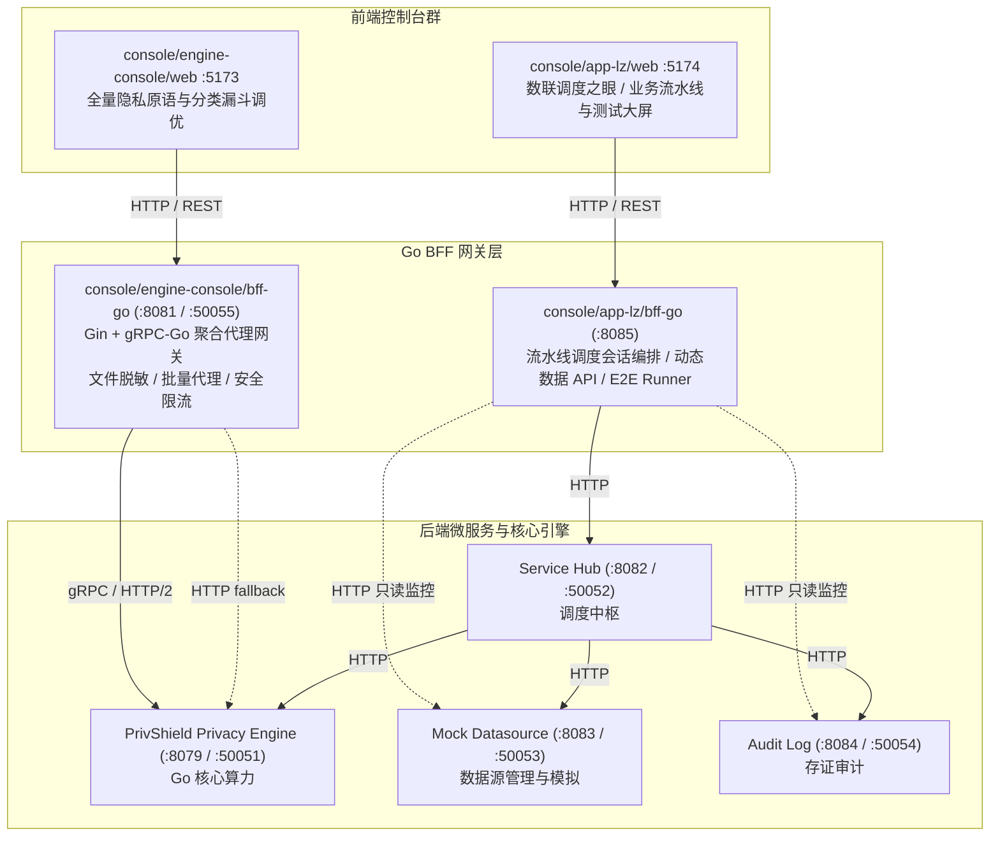

# 统一控制台与 BFF 代理网关群 (Console & BFF Gateways)

> **版本**：v16.0.0  
> **适用范围**：`console/engine-console/bff-go`、`console/app-lz/bff-go`、`console/engine-console/web` 与 `console/app-lz/web`。  
> **定位**：本文档系统阐述数联天下 · 数盾（`PrivShield`）双控制台体系与 Go BFF 代理网关群的架构实现、端点路由与运行指南。

---

## 目录

- [1. 双控制台与 Dual-BFF 架构设计](#1-双控制台与-dual-bff-架构设计)
- [2. 核心组件职责与特性](#2-核心组件职责与特性)
  - [2.1 主控制台 BFF 网关 (console/engine-console/bff-go:8081 / :50055)](#21-主控制台-bff-网关-consoleengine-consolebff-go8081--50055)
  - [2.2 业务调度之眼 BFF (console/app-lz/bff-go:8085)](#22-业务调度之眼-bff-consoleapp-lzbff-go8085)
  - [2.3 前端控制台群 (console/engine-console/web & console/app-lz/web)](#23-前端控制台群-consoleengine-consoleweb--consoleapp-lzweb)
- [3. 路由与微服务聚合架构](#3-路由与微服务聚合架构)
- [4. 运行指南](#4-运行指南)

---

## 1. 双控制台与 Dual-BFF 架构设计

为了同时满足**数据安全合规工程师（全量原语与分类调优）**与**业务流通运营人员（业务流水线与实战调度）**的不同诉求，PrivShield 采用分工明确的双控制台与 Dual-BFF 架构：



---

## 2. 核心组件职责与特性

### 2.1 主控制台 BFF 网关 (`console/engine-console/bff-go:8081` / `:50055`)
- **高性能 REST ➔ gRPC 转换**：对外暴露统一 REST/JSON 接口，内部通过 gRPC 与 Privacy Engine 通信，利用 Protobuf 强契约与 HTTP/2 多路复用大幅削减通信握手延迟；
- **文件级隐私处理 (`POST /v1/upload`)**：支持 CSV/JSON 文件上传，流式解析并调用底层脱敏/K-匿名能力；
- **复合安全中间件**：将 API Key 鉴权与滑动窗口限流（`CONSOLE_RATE_LIMIT`，默认 600 req/min）整合，内置后台协程定期清理过期 IP 防止内存泄漏；当 `PRIVACY_AUTH_MTLS_WHITELIST_FILE` 指向 `config/mtls-whitelist.yaml` 时，可选的入站 gRPC 服务（`:50055`）会注册 `NewWhitelistInterceptor()` unary/stream 拦截器，按客户端 CN 进行 method-scope 鉴权并支持 5 秒 mtime 热重载。
- **负载均衡策略测试器 (`POST /v1/lb_test`)**：用于对多后端 Agent 进行负载分发与熔断切换演练；
- **静态 SPA 托管**：可独立挂载并托管 `console/engine-console/web/dist` 前端构建产物，实现单二进制交付；
- 📖 [可靠性能力详解](../../console/engine-console/bff-go/docs/reliability.md)

### 2.2 业务调度之眼 BFF (`console/app-lz/bff-go:8085`)
- **3 阶段流通会话编排 (`InvokeDataApi`)**：通过 service-hub 统一编排 `ingest` → `hub_orchestrate` → `return` 业务闭环；app-lz BFF 不直接访问 mock-datasource / privacy-engine / audit-log，所有数据操作由 service-hub 内部编排（拉取 + 脱敏 + 审计存证）；
- **动态数据 API 目录 (`GET /v1/lz/data-api/definitions`)**：彻底废除前端写死 API 列表的逻辑，统一动态拉取数据源卡片；
- **内置 E2E 自动化测试套件 (`TestRunner`)**：支持在界面一键触发 TS-01 ~ TS-04 自动化测试用例并实时可视化输出；
- **9 层统一中间件栈**：全量装配 `pkg/middleware`（含 TraceMiddleware、MaxBodySize、MaxConcurrent、RateLimit 与统一错误信封）。

### 2.3 前端控制台群 (`console/engine-console/web` & `console/app-lz/web`)
- **统一技术栈**：React 18 + TypeScript + Vite + TailwindCSS + Lucide Icons；
- **统一错误信封解析**：统一解析 `{code, message, detail, trace_id}`，自动向后兼容历史旧字段；
- **标准化状态色彩规范**：`completed`（翡翠绿）、`running`（靛蓝呼吸光晕）、`failed`（玫瑰红）、`pending`（蓝灰）。

---

## 3. 路由与微服务聚合架构

BFF 网关层提供了面向不同业务场景的聚合路由定义：

| 路由前缀 / 端点 | 处理组件 | 上游微服务 | 功能说明 |
|---|---|---|---|
| `/v1/privacy/*` | `console/engine-console/bff-go` | `privshield-agent:50051` | 隐私计算原语（脱敏、DP、K-匿名、查询混淆）gRPC 代理 |
| `/v1/upload` | `console/engine-console/bff-go` | `privshield-agent:50051` | 文件隐私处理（CSV/JSON 解析与脱敏） |
| `/v1/lb_test` | `console/engine-console/bff-go` | 可配置 Agent REST 后端 | 负载均衡策略测试（round-robin / random / least-connections） |
| `/v1/lz/data-api/invoke` | `app-lz/bff-go` | `service-hub:8082`（统一编排入口） | 通过 service-hub 编排 3 阶段会话：ingest → hub_orchestrate → return |
| `/v1/lz/tasks/dispatch` | `app-lz/bff-go` | `service-hub:8082` | 流水线任务派发 |
| `/v1/lz/audit/*` | `app-lz/bff-go` | `audit-log:8084`（只读监控） | 9 要素哈希链存证查询与在线验真（仅审计监控模块直连） |
| `/v1/lz/suites` / `/v1/lz/suites/run` | `app-lz/bff-go` | 内置 TestRunner | 获取 / 执行 TS-01~TS-04 自动化 E2E 测试套件 |

---

## 4. 运行指南

```bash
# 1. 启动全功能控制台（Privacy Engine + Go BFF + Vite HMR 前端）
bash ./scripts/dev/dev-engine-console.sh
```

```bash
# 2. 启用 mTLS 双向认证模式启动
bash ./scripts/dev/dev-engine-console.sh --mtls
```

```bash
# 3. 启动业务调度控制台（App-LZ Dev）
bash ./scripts/dev/dev-app-lz.sh  --force
```

```bash
# 4. 停止所有控制台服务
bash ./scripts/dev/dev-stop.sh
```
