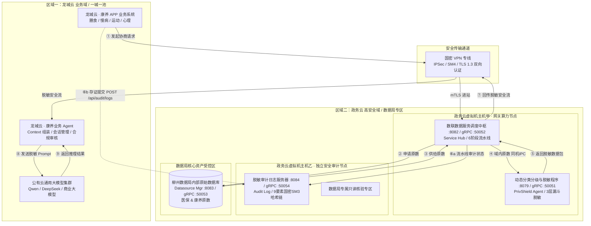
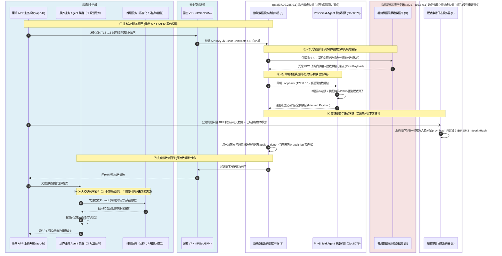
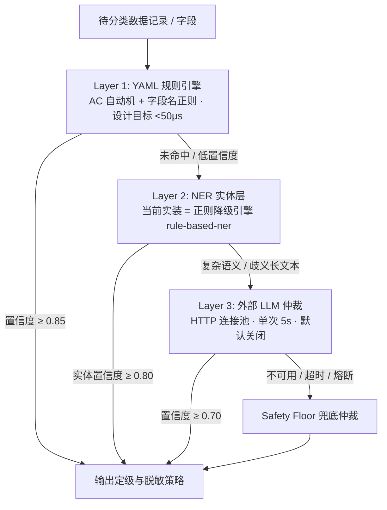
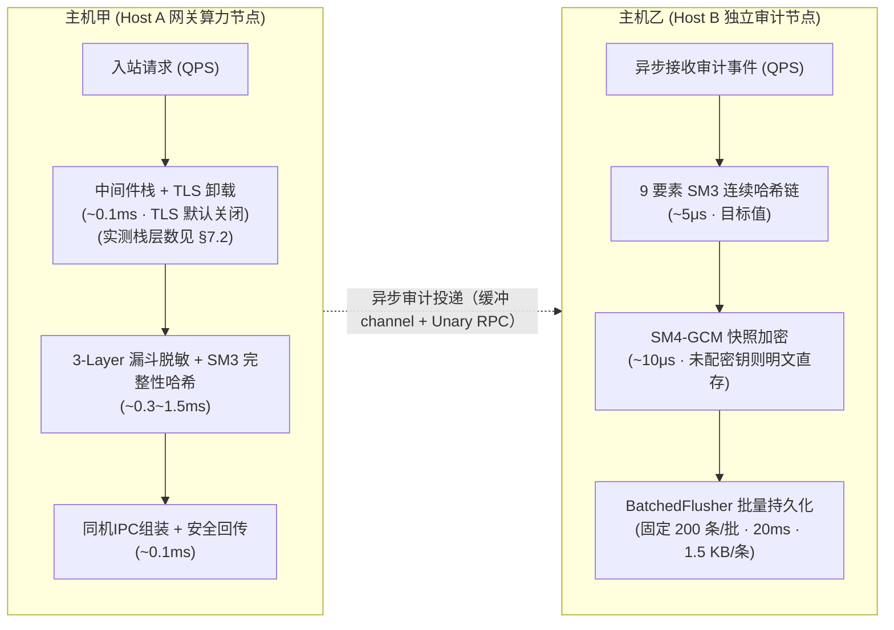

# 柳州政务云数据流通与网关脱敏安全架构设计方案
## —— 柳州数据局安全合规与技术审查专版

> **项目名称**：柳州市智慧康养与政务数据安全流通示范工程  
> **审查对象**：数联天下 · 数盾（`PrivShield`）数据安全治理网关与脱敏体系  
> **文档版本**：v16.7.0（第十二章整改代码级落地版）  
> **安全密级**：政务商用密码应用与数据安全合规保护级  
> **设计基准与合规参考标准**：
> - **核心数据分级基准**：**DB51/T 2989—2023《四川省健康医疗大数据应用指南》**（五级分类分级核心基准与敏感病种治理规则）
> - **国家法律法规**：《中华人民共和国数据安全法》、《中华人民共和国个人信息保护法》、《中华人民共和国密码法》、《政务信息资源共享管理暂行办法》
> - **国家标准**：《GB/T 43697-2024 数据安全技术 数据分类分级规则》、《GB/T 35273-2020 信息安全技术 个人信息安全规范》、《GB/T 39786-2021 信息安全技术 信息系统密码应用基本要求》
> - **行业与地方标准**：《JR/T 0197-2020 金融数据安全 数据安全分级指南》、《广东省健康医疗数据安全分类分级管理技术规范》/《广东省健康医疗大数据应用指南》

**修订记录**

| 版本 | 日期 | 修订人 | 修订要点 |
|:---:|:---|:---|:---|
| v16.0.0 | 2026-08 | 架构组 | 柳州政务云数据流通与网关脱敏安全架构基线 |
| v16.1.0 | 2026-08-28 | 安全工程组 | 补齐 Go 服务端 gRPC mTLS CN 白名单拦截器注册；明确 `config/mtls-whitelist.yaml` 为各语言客户端与服务端共享事实源；细化上线验收建议 |
| v16.2.0 | 2026-08-31 | 密码安全工程组 | 完整性存证与哈希链升级为国密 SM3（GM/T 0004-2012 / GB/T 32918.4-2016）；明确全栈商用密码（SM2/SM3/SM4）体系与 GB/T 39786-2021 密评要求 |
| v16.3.0 | 2026-08-31 | 云安全架构组 | 规范化云上拓扑：明确网关算力节点（主机甲）与独立审计节点（主机乙）为政务云独立虚拟机（ECS/VM），通过 VPC 子网、安全组策略与 mTLS 实现计算与审计强隔离 |
| v16.4.0 | 2026-08-31 | 医疗数据安全组 | 深度强化四川省五级分类分级标准（DB51/T 2989—2023）核心基准：五级定级模型、6 类敏感字段映射、高敏特征剥离与敏感病种抹平/泛化差异化治理 |
| v16.5.0 | 2026-08-31 | 容量规划组 | 新增第九章主机甲/主机乙容量测算模型与 10 / 100 / 200 / 10000 QPS 四档规格、内核与数据库调优清单 |
| v16.6.0 | 2026-08-31 | 安全工程组 | **代码实测校正（本文档版）**：以当前仓库实现为准逐项校正——9 要素哈希链预镜像字段、验真接口真实响应结构、存证提交方与批量落盘参数、脱敏引擎为纯 Go 服务（非 FastAPI）、组件端口与字段定级冲突、中间件层数与限流默认值、租约/重试/熔断实际参数、国密算法实际落地范围；引入实现状态双轨标注并新增第十二章《实现差异与整改清单》 |
| v16.7.0 | 2026-09-01 | 安全工程组 | **第十二章整改代码级落地**：29 项中 **21 项已在代码/编排层闭环（✅）**、**8 项部分闭环并写明残余缺口（🟡）**；新增 **§12.1.4 落地状态与实测证据表**（逐项 `file:line` 可复核）；三道新门禁入 `make check`（`taxonomy-check` / `env-check` / 只读角色与 fail-closed 启动自检）；`make bench` + `docs/reports/benchmark_baseline.md` 建立可复现性能基线（33 Benchmark × median-of-3，含 commit/CPU/内核指纹）；密评、真实 NER 模型、端到端压测与局方签核类项目**继续保持 🔴/🟡，未以代码改动冒充闭环** |

**实现状态标注图例（本文档采用「设计目标 + 代码现状」双轨口径）**

| 标记 | 含义 | 审查解读方式 |
|:---:|:---|:---|
| ✅ **已实装** | 当前仓库代码已实现，可通过 `file:line` 证据与测试复核 | 可直接进入功能验证与渗透测试 |
| 🟡 **部分实装** | 核心机制已存在，但覆盖度、约束强度或可配置性存在缺口 | 需按第十二章整改项收敛后方可闭环 |
| ⚠️ **部署要求** | 由政务云平台、网络与安全管理人员配置实现，**应用代码不负责** | 需在部署实施与运维制度中核验，不属于软件交付内容 |
| 🔴 **未实装** | 属规划/设计目标，当前代码不具备该能力 | **不得作为已具备能力对外承诺**，须列入上线前整改或降级说明 |

> 校正基线：本文档所有技术事实均以 `PrivShield-go` 当前工作副本代码为准；标注为 ✅/🟡 的条目附带源码位置，🔴 条目集中于第十二章统一列示。


## 目录

- [一、方案概述与审查背景](#一方案概述与审查背景)
  - [1.1 项目背景与建设目标](#11-项目背景与建设目标)
  - [1.2 核心安全承诺与原则](#12-核心安全承诺与原则)
- [二、整体网络拓扑与区域逻辑隔离设计](#二整体网络拓扑与区域逻辑隔离设计)
  - [2.1 三大安全隔离区域划分](#21-三大安全隔离区域划分)
  - [2.2 政务云节点拓扑全景图](#22-政务云节点拓扑全景图)
- [三、核心业务组件与系统映射详解](#三核心业务组件与系统映射详解)
  - [3.1 外部业务端：龙城云 · 康养 APP 业务系统 (模拟组件: app-lz)](#31-外部业务端龙城云--康养-app-业务系统-模拟组件-app-lz)
  - [3.2 局方数据底座：柳州数据局内部原始数据库 (模拟组件: datasource-mgr)](#32-局方数据底座柳州数据局内部原始数据库-模拟组件-datasource-mgr)
  - [3.3 网关算力节点：数联数据服务调度中枢 (组件: service-hub)](#33-网关算力节点数联数据服务调度中枢-组件-service-hub)
  - [3.4 隐私计算引擎：动态分类分级与脱敏程序 (组件: engine)](#34-隐私计算引擎动态分类分级与脱敏程序-组件-engine)
  - [3.5 独立审计节点：脱敏审计日志服务器 (组件: audit-log)](#35-独立审计节点脱敏审计日志服务器-组件-audit-log)
- [四、端到端 9 阶段全流程数据流转机制](#四端到端-9-阶段全流程数据流转机制)
  - [4.1 业务流转时序图](#41-业务流转时序图)
  - [4.2 各阶段关键控制点解析](#42-各阶段关键控制点解析)
- [五、数据分类分级与动态脱敏安全机制（以四川省五级分类标准为核心基准）](#五数据分类分级与动态脱敏安全机制以四川省五级分类标准为核心基准)
  - [5.1 四川省五级分类分级标准体系（DB51/T 2989—2023）核心基准](#51-四川省五级分类分级标准体系db51t-29892023核心基准)
  - [5.2 三层递进式动态分类分级漏斗 (3-Layer Funnel)](#52-三层递进式动态分类分级漏斗-3-layer-funnel)
  - [5.3 四大隐私计算原语数学保障](#53-四大隐私计算原语数学保障)
  - [5.4 示范数据源（医保与康养）字段脱敏策略矩阵](#54-示范数据源医保与康养字段脱敏策略矩阵)
- [六、数据局独立安全审计与密码学防篡改存证体系](#六数据局独立安全审计与密码学防篡改存证体系)
  - [6.1 政务云独立安全审计虚拟机架构设计（主机乙）](#61-政务云独立安全审计虚拟机架构设计主机乙)
  - [6.2 9 要素链式连续哈希完整性存证模型](#62-9-要素链式连续哈希完整性存证模型)
  - [6.3 快照数据 SM4-GCM 信封加密落盘](#63-快照数据-sm4-gcm-信封加密落盘)
  - [6.4 数据局专属只读核验专区与链式验真](#64-数据局专属只读核验专区与链式验真)
- [七、全链路零信任与网络边界纵深防御](#七全链路零信任与网络边界纵深防御)
  - [7.1 国密体系与双向 mTLS 零信任认证](#71-国密体系与双向-mtls-零信任认证)
  - [7.2 多层中间件纵深防御栈与纵深防 DDoS](#72-多层中间件纵深防御栈与纵深防-ddos)
  - [7.3 SSOT 事实源校验与 Fail-Closed 防逃逸](#73-ssot-事实源校验与-fail-closed-防逃逸)
- [八、高并发稳定性与容灾恢复机制](#八高并发稳定性与容灾恢复机制)
  - [8.1 PostgreSQL 原子租约并发（无死锁、防脑裂）](#81-postgresql-原子租约并发无死锁防脑裂)
  - [8.2 崩溃自愈、指数退避重试与孤儿任务回收](#82-崩溃自愈指数退避重试与孤儿任务回收)
  - [8.3 客户端智能熔断与负载均衡分流](#83-客户端智能熔断与负载均衡分流)
- [九、主机甲与主机乙硬件资源需求与容量规划规格（10 / 100 / 200 / 10000 QPS）](#九主机甲与主机乙硬件资源需求与容量规划规格10--100--200--10000-qps)
  - [9.1 算力负载与存储容量测算数学模型](#91-算力负载与存储容量测算数学模型)
  - [9.2 场景一：极轻量/试点联调规格（10 QPS / 10 并发）](#92-场景一极轻量试点联调规格10-qps--10-并发)
  - [9.3 场景二：日常平稳运行规格（100 QPS / 100 并发）](#93-场景二日常平稳运行规格100-qps--100-并发)
  - [9.4 场景三：业务高峰负载规格（200 QPS / 200 并发）](#94-场景三业务高峰负载规格200-qps--200-并发)
  - [9.5 场景四：超大规模极端高并发规格（10,000 QPS / 10000 并发）](#95-场景四超大规模极端高并发规格10000-qps--10000-并发)
  - [9.6 四种并发场景核心资源配置对照总表](#96-四种并发场景核心资源配置对照总表)
  - [9.7 高并发场景核心系统与内核优化调优清单](#97-高并发场景核心系统与内核优化调优清单)
- [十、国家法律法规与行业标准合规对照表](#十国家法律法规与行业标准合规对照表)
- [十一、安全审查自评结论与实施建议](#十一安全审查自评结论与实施建议)
  - [11.1 安全审查自评结论](#111-安全审查自评结论)
  - [11.2 局方上线验收与实施建议](#112-局方上线验收与实施建议)
  - [11.3 上线前置整改与验收门禁](#113-上线前置整改与验收门禁)
- [十二、实现差异与整改清单（代码实测校正）](#十二实现差异与整改清单代码实测校正)
  - [12.1 文档声明与代码实现差异对照表](#121-文档声明与代码实现差异对照表)
  - [12.2 整改优先级与责任分工](#122-整改优先级与责任分工)

---

## 一、方案概述与审查背景

### 1.1 项目背景与建设目标

为落实柳州市政务数据要素市场化配置改革，推动柳州医疗医保、康养慢病等高价值民生数据赋能**“龙城云 · 康养 APP”**（包含膳食营养、慢病管理、运动康复、心理评测及康养智能体），柳州数据局联合数联天下建设**政务云数据安全治理与脱敏网关系统**。

本方案旨在解决数据跨域流通中的核心矛盾：**“外部业务需要深度使用政务高价值数据驱动 AI 与业务服务，但政务原始敏感高密数据绝不可出局方受控边界”**。

系统核心建设目标:
1. **可用不可见**：政务原始高敏数据（身份、病历、结算流水）100% 局方属地留存，绝不出高安全域；
2. **同机微秒脱敏**：调度网关与脱敏引擎同虚拟机部署，环回内存流转，避免数据在网络中多次明文落地；
3. **跨机独立存证**：审计日志独立虚拟机部署（独立 VPC/安全组），采用国密 SM3 哈希链，**防篡改能力已实装**；⚠️ 「抗抵赖」不成立——无密钥 SM3 杂凑不提供身份认证与不可否认性，须补 SM2 签名（第十二章 **P1-2**）；
4. **出域合规核验**：回传前执行 L1~L5 动态脱敏与差分隐私（脱敏算子实装状态见 §5.4 与第十二章 **P0-2**）；⚠️ 「经国密 VPN 仅放行合规脱敏包」为**政务云平台侧网络要求，本仓库无任何 VPN/专线实现**，应用层出域通道加密依赖可开关的 TLS（默认关闭，第十二章 **P0-1**）。


### 1.2 核心安全承诺与原则

1. **原始数据不出域 (Zero Raw Data Leakage)** 🟡：柳州数据局原始数据库中的身份证号、手机号、真实姓名、诊疗明细等，在离开政务高安全域前完成 100% 动态遮蔽、泛化或差分加噪；出域响应仅携带脱敏结果与 SM3 输入/输出指纹，原始样本仅以加密快照形态留存于主机乙（⚠️ "加密"仅在 `AUDIT_LOG_ENCRYPTION_KEY` 配置非空时成立，密钥为空则样本**明文落盘**，见第十二章 **P0-3**）；⚠️ **该原则当前存在一条已实装的破口**：运维控制台 BFF 的 `/api/datasource/*path` 透明代理可在默认无鉴权状态下直取数据源未脱敏记录，不经脱敏、不留存证（第十二章 **P0-7**，上线阻塞项，门禁 **G-01**）；
2. **同机高速处理 (Co-located IPC Execution)** 🟡：调度中枢与脱敏计算引擎部署在政务云同一台计算虚拟机内，通过本地环回链路（Loopback IPC）通信，消除虚拟交换机跨节点抓包风险；**当前实现中域内 REST/gRPC 通道加密为可选项**（`PRIVACY_TLS_ENABLED` 默认 `false`，内置编排 `PRIVACY_AGENT_URL=http://PrivShield:8079` 为明文 HTTP），故"同机环回"仅在网络层面成立，**上线必须显式启用域内 TLS 或依托 VPC 加密子网**（见 7.1 与第十二章 **P0-1**）；
3. **计算与审计强隔离 (Separation of Compute & Audit)** ⚠️：审计日志服务器部署在独立的审计专用虚拟机上，配置独立 VPC 子网与安全组单向入站策略；**"业务端与网关无权篡改或删除审计日志"由云平台安全组、独立数据库账号权限与运维制度共同保证，当前应用代码未内建只写约束**（详见 6.1 与第十二章 **P1-6**）；
4. **全链路国密密码学溯源 (Cryptographic Accountability)** 🟡：每一笔存证请求均由**审计服务端（唯一权威写入者）**计算生成 9 要素国密 SM3 链式完整性哈希（`IntegrityHash`，非数字签名），客户端提交的 `prev_hash` 被服务端拒绝并覆盖，支持局方随时对账验真；⚠️ **仅「防篡改」成立，「溯源/抗抵赖」不成立**——该哈希为**无密钥杂凑**，不提供身份认证与不可否认性，且全仓 **SM2 零实现**、SM3/SM4 为自研未经商用密码产品认证的模块，《密码法》二十七条与 GB/T 39786 判定为不符合（第十二章 **P1-2**；对外表述统一改口为「完整性防篡改存证」）。

---

## 二、整体网络拓扑与区域逻辑隔离设计

### 2.1 三大安全隔离区域划分

系统在云上网络与逻辑层面划分为三个严格隔离的安全区域：



**拓扑实现状态补充**

| 拓扑要素 | 状态 | 实测说明与依据 |
|---|:---:|---|
| 国密 VPN 专线（IPSec/SM4） | ⚠️ 部署要求 | 由政务云平台提供，仓库内不含 VPN/SM4 IPSec 组件；应用侧提供 TLS 1.3 + mTLS 能力（`pkg/tlsutil/tlsutil.go:58`，`MinVersion: tls.VersionTLS13`） |
| 主机甲 ↔ 主机乙 独立 VPC/安全组单向策略 | ⚠️ 部署要求 | 需云安全组配置；应用侧提供 CN 白名单与 API Key 鉴权（`pkg/tlsutil/grpc_interceptor.go`） |
| 审计只读核验专区 | 🟡 部分实装 | `console/bff-go` 以 `r.Any("/api/audit/*path", s.ProxyAudit)` 反代审计接口（`console/bff-go/internal/handlers/handlers.go:180`）；**只读身份隔离依赖反代层与 BFF 鉴权，audit-log 自身写接口无独立角色隔离** |
| ⑥ 存证提交方 | 🟡 部分实装 | 真实写入方为业务/控制台侧调用 `POST /api/audit/logs`（`console/app-lz/bff-go/internal/clients/clients.go:791-796`）；`service-hub` 流水线第 6 阶段 `audit` **当前仅为任务状态标签，未内建 audit-log 客户端**（见 4.2 与第十二章 **P0-6**） |
| 域内通道加密 | 🟡 部分实装 | 各服务与客户端支持 TLS/mTLS 但默认关闭（`PRIVACY_TLS_ENABLED=false`），内置编排为明文 `http://`；上线须显式开启 |
| **原始数据旁路出域通道** | 🔴 **未实装防护** | 运维控制台 BFF 以 `r.Any("/api/datasource/*path", s.ProxyDatasource)` 提供**透明代理**（`console/bff-go/internal/handlers/handlers.go:179`），转发层 `ClientPool.Proxy` **只按服务名解析基址，不做方法与路径白名单**（`console/bff-go/internal/microservices/client.go:57-76`）；因此 `GET /api/datasource/api/datasources/ds_yibao/records?limit=50` 可直达数据源原始记录端点（`services/datasource-mgr/internal/handlers/handlers.go:114-115`），**既不经 `engine` 脱敏、也不产生任何存证记录**。该路径的唯一防线是 BFF 的 `CONSOLE_API_KEY`，而其默认值为空即跳过鉴权（`console/bff-go/internal/config/config.go:246`、`handlers.go:1253-1259`），且 `deploy/`、`config/`、`scripts/` 中**均未设置该变量**。**这是与「原始数据不出域」直接冲突的代码级缺口**（第十二章 **P0-7**） |
| 主机乙与主机甲故障隔离 | ✅ 已实装（架构性） | `services/audit-log` 为独立进程/独立存储，未依赖 `service-hub` 存活 |

### 2.2 政务云节点拓扑全景图

| 节点编号与类型 | 节点定位 | 部署组件 | 网络与访问控制策略 | 归属与管理责任 |
|---|---|---|---|---|
| **龙城云节点** | 外部业务应用池 | • 康养 APP 业务系统 (`app-lz`)<br/>• 康养业务 Agent 集群 | 位于业务云 VPC，通过国密 VPN 连接政务云网关 | 康养业务运营方 |
| **云虚拟机主机甲** | 网关算力节点 (ECS) | • 数联数据服务调度中枢 (`service-hub:8082` / `:50052`)<br/>• 隐私计算引擎 PrivShield Agent (`engine-go:8079` / `:50051`，纯 Go) | 仅开放特定 VPN 接入端口，中枢与脱敏引擎使用 `127.0.0.1` 本地环回通信；**域内 TLS/mTLS 需显式开启（默认关闭）** | 数联技术运营方（受局方监管） |
| **云虚拟机主机乙** | 独立安全审计节点 (ECS) | • 脱敏审计日志服务器 (`audit-log:8084` / `:50054`)<br/>• 审计数据库与链式存证文件（SQLite / PostgreSQL 可选） | 独立审计 VPC 子网，与主机甲安全组单向存证通信（⚠️ 云平台配置项），暴露局方只读核验端点 | **柳州数据局安全监管组专属** |
| **数据局专区** | 局方核心数据资产底座 | • 柳州数据局内部原始数据库 (`datasource-mgr:8083` / `:50053`)<br/>• 模拟底座由 `samples/*.csv` 文件驱动（医保 19 字段 / 康养 27 字段） | 核心受控 VPC 子网，禁止外网直连，仅响应主机甲的鉴权请求 | **柳州数据局独家持有与管控** |

> **示范工程边界说明**：`datasource-mgr` 在当前交付形态下是**结构与数据同源的真实模拟库**（CSV 文件后备，非生产医保结算系统直连），用于验证定级、脱敏与存证链路的正确性；接入真实局方生产库需额外完成数据源适配、账号最小权限改造与密评（前置条件与门禁见 §11.3，后备存储档位整改见第十二章 **P1-8**）。

---

## 三、核心业务组件与系统映射详解

### 3.1 外部业务端：龙城云 · 康养 APP 业务系统 (模拟组件: `app-lz`)
* **实际业务职责**：面向柳州市民与患者提供智慧康养服务（膳食营养推荐、慢病用药提醒、运动康复处方、心理健康评测）；
* **代码组件映射** ✅：由 `console/app-lz` 模拟 —— Go BFF（Gin，`:8085`）+ Vite 前端（`:5174`，注意与运维控制台 `console/web` 的 `:5173` 区分），负责按用户身份向政务云网关发起标准化 API 协商调用，并向主机乙提交真实存证（`RecordAudit` → `POST /api/audit/logs`，`console/app-lz/bff-go/internal/clients/clients.go:791-796`）；
* **形态说明** 🟡：`app-lz` BFF **仅提供 HTTP REST 服务端**，未实现 gRPC 服务端；其 `Dockerfile` 与 `docker-compose.app-lz.yml` 中的 `50055` 端口映射属配置漂移（与 `console/bff-go` 的 gRPC `:50055` 冲突），已列入第十二章 **P2-1** 整改项；
* **业务 Agent 集群与大模型交互** 🔴：**当前交付代码中不存在面向公有云大模型的 Agent 集群**（`app-lz` 无任何 LLM 调用，联调默认 `PRIVACY_LLM_ENABLE=false`）。仓库内唯一的大模型调用位于**隐私引擎的 Layer-3 仲裁层**：`engine-go/internal/dynclassification/llm_client.go` 通过 OpenAI 兼容接口（`PRIVACY_LLM_ENDPOINT` 默认 `http://localhost:8000/v1/chat/completions`，`PRIVACY_LLM_MODEL` 默认 `qwen3.5`）访问**局域内私有化推理服务**（vLLM / Ollama / MLX，见 `config/env/*.env`），并非公有云直连。生产环境若确需调用外部商业大模型，须另行完成出域评审与数据最小化改造。

### 3.2 局方数据底座：柳州数据局内部原始数据库 (模拟组件: `datasource-mgr`)
* **实际业务职责**：汇聚柳州市各委办局全量原始高密数据（涵盖城镇职工/居民医保结算流水、慢病健康监护档案等）；
* **代码组件映射** ✅：由 `services/datasource-mgr`（REST `:8083` / gRPC `:50053`）纳管，内置真实结构模拟库（`samples/yibao.csv` **19 字段 / 50 行**，`samples/kangyang.csv` **27 字段 / 100 行**，字段数与 `pkg/naming/naming.go:86,97` 的 `FieldCount` 声明一致）；后备存储为 **CSV 文件**（`DATASOURCE_MGR_DB_PATH` 在当前 Go 代码中未被读取）；
* **受控专区安全防线**：数据库处于政务云最核心的受控 VPC 子网专区，**未脱敏的原始库表权限绝不对外开放**。其能力在代码中的真实接口形态为：
  * 元数据探查（文档中原称 “Probe”）：`GET /api/datasources/:id/metadata`、`POST /api/datasources/:id/test`；
  * 样本切片提取（文档中原称 “Sample Slicing”）：`GET /api/datasources/:id/records?limit=&offset=` 与别名端点 `GET /api/datasources/:id/sample`，gRPC 侧为 `GetData` / `GetDataBySource` / `TestConnection`；
  * 取数严格受 `limit`/`offset` 行数约束，不存在自由 SQL 查询入口 ✅。

### 3.3 网关算力节点：数联数据服务调度中枢 (组件: `service-hub`)
* **实际业务职责**：作为政务云的统一接入中枢与流通流水线编排器；
* **代码组件映射**：`services/service-hub`（REST `:8082` / gRPC `:50052`）；
* **核心管控能力**：
  1. **接入认证与 SSOT 校验** ✅：严格基于单一事实源 `pkg/naming`（`pkg/naming/naming.go`）对数据源与 API 进行 Fail-Closed 鉴权，未知标识直接返回 `400 INVALID_DATASOURCE_ID`（REST）或 `codes.InvalidArgument`（gRPC），无默认数据源回退路径（`services/service-hub/internal/handlers/handlers.go:398`）；
  2. **gRPC mTLS CN 白名单鉴权** 🟡：入站 gRPC 连接校验客户端证书 CN 并按 `config/mtls-whitelist.yaml` 的 `entries[].cn / scopes / enabled` 授权，未授权 CN 返回 `PermissionDenied`；**两项现状须注意**：① 拦截器仅在 `PRIVACY_AUTH_MTLS_WHITELIST_FILE` 配置为非空路径时注册（`services/service-hub/cmd/server/main.go:252-259`），未配置即等价于无 CN 校验；② 配置文件中的 `default_scopes` 字段当前未被接线（`config/mtls-whitelist.yaml` 已注明未启用）；
  3. **6 阶段自动化调度流水线** 🟡：`Ingest`（请求解析）➔ `Fetch`（拉取原数）➔ `Classify`（敏感定级）➔ `Desensitize`（按级脱敏）➔ `Return`（安全回传）➔ `Audit`（存证）；其中前 5 阶段有真实上游调用，**第 6 阶段 `audit` 当前仅作为任务状态位推进至 `done`，`service-hub` 未内建 audit-log 客户端**（详见 4.2 与第十二章 **P0-6**）；
  4. **并发安全与租约机制** 🟡：多副本消费依赖 PostgreSQL `FOR UPDATE SKIP LOCKED` 原子租约（`pkg/store/postgres/leased.go:45-72`），无死锁、防脑裂；**该能力仅在配置 `SERVICE_HUB_PG_DSN` 时生效**，SQLite 与内存存储显式返回 `store.ErrLeaseNotSupported`（`pkg/store/sqlite/leased.go:23-56`、`pkg/store/memory/memory.go:174-196`），默认交付形态为单机 SQLite/内存，不具备多副本争抢语义（详见 §8.1 与 **P1-8**）。

### 3.4 隐私计算引擎：动态分类分级与脱敏程序 (组件: `engine`)
* **实际业务职责**：执行政务数据的高性能动态定级、字段级遮蔽、泛化与数学加噪；
* **代码组件映射** ✅：**纯 Go 服务** `engine-go/cmd/privshield-agent`（REST `:8079` / gRPC `:50051`），对外提供 44 个隐私原语与三层分类漏斗；**本仓库不存在 Python/FastAPI 引擎实现**（仅 `llmlora/` 为模型微调离线工具链，不参与运行时），历史版本中 “FastAPI `:8079`” 的表述已作废；
* **同虚机部署优势** 🟡：与 `service-hub` 共同部署在政务云网关虚拟机主机甲内，利用内存级 IPC / Loopback 通信，消除未脱敏原始数据在云虚拟网络中明文传输的风险；Layer-1 规则引擎的**设计目标**为单字段 $10\sim50\ \mu\text{s}$（代码注释标注 `< 50μs`，`engine-go/internal/dynclassification/funnel.go:4`）。**注意：该数值为设计目标与代码注释口径，仓库内未提交可复现的基准测试报告**，性能结论须由上线前压测验收出具实测数据（见 9.1 标注）。

### 3.5 独立审计节点：脱敏审计日志服务器 (组件: `audit-log`)
* **实际业务职责**：为数据局提供独立于业务系统的不可篡改审计存证与事后合规溯源能力；
* **代码组件映射** ✅：`services/audit-log`（REST `:8084` / gRPC `:50054`），存储支持内存 / SQLite / PostgreSQL 三种后端（`AUDIT_LOG_PG_DSN` 或 `PG_DSN` 存在时优先 PostgreSQL，否则回退 `AUDIT_LOG_DB_PATH` 指定的 SQLite，`services/audit-log/internal/config/config.go:66-74`）；
* **安全审计特性**：
  1. **独立虚拟机与 VPC 安全组隔离** ⚠️：部署于政务云独立审计虚拟机主机乙，独立安全组与单向入站规则由云平台配置；即便主机甲遭遇过载或攻击，审计进程与存储互不依赖 ✅（架构性隔离）。**"业务端无权篡改或删除审计日志"目前依赖平台侧权限与运维制度，应用层未强制只写**（当前代码保留 `DELETE FROM audit_logs WHERE timestamp < $1` 的过期清理能力，见 6.1 与第十二章 **P1-6**、**P0-8**）；
  2. **9 要素国密 SM3 哈希链** ✅：由审计服务端作为**唯一权威写入者**按 §6.2 的 9 要素预镜像顺序计算链式 `IntegrityHash`，客户端传入的 `prev_hash` 被拒绝覆盖（`pkg/store/flusher/flusher.go:213-217`、`services/audit-log/internal/handlers/handlers.go:212-217`）；哈希原语为仓库自研实现 `pkg/crypto/sm3.go`（对齐 GB/T 32918.4-2016），**非经认证的商用密码模块**，密评前需替换或取得认证（第十二章 **P1-2**）；
  3. **快照信封加密** 🟡：出域脱敏样本采用国密 SM4-GCM 信封加密（`enc:v1:`）落盘，防止审计数据库被直接窃密；**加密仅在密钥配置存在时生效，密钥为空则样本明文落盘**（`pkg/crypto/envelope.go:74-75`），属上线强制门禁项（第十二章 **P0-3**）。

---

## 四、端到端 9 阶段全流程数据流转机制

### 4.1 业务流转时序图



> **阶段⑥ 实现差异（重要）**：本方案的目标形态是「主机甲流水线自动向主机乙异步存证」。**当前代码事实**为：`service-hub` 的第 6 阶段 `audit` 只是任务状态标签，仓库内不存在 `service-hub → audit-log` 的客户端调用；真实的存证写入由业务/控制台侧发起 —— `console/app-lz/bff-go` 的 `RecordAudit()` 调用 `POST /api/audit/logs`，`console/bff-go` 以 `r.Any("/api/audit/*path", ...)` 反代审计接口。这意味着**「每一次出域必然留痕」目前在代码层面不闭环**，须由网关侧强制存证或平台侧策略保障（第十二章 **P0-6**）。

### 4.2 各阶段关键控制点解析

| 阶段序号 | 阶段名称 | 执行实体 | 安全与技术控制点 | 实现状态 | 审查关注重点 |
|:---:|---|---|---|:---:|---|
| **①** | 协商数据请求 | `app-lz` ➔ VPN ➔ `service-hub` | • 必须指明规范化的 `api_code`（如 `api1_yibao`），否则 `400 INVALID_DATASOURCE_ID`<br/>• REST 侧为 API Key 鉴权（默认关闭），gRPC 侧为证书 CN 白名单 | 🟡 | 严格限制调用范围，拒绝任意 SQL 或自由查询；**上线须同时开启 REST API Key 与 gRPC CN 白名单，二者默认均未启用** |
| **②~③** | 原数受控供给 | `service-hub` ➔ `datasource-mgr` | • 受控 VPC 专网连接，`limit`/`offset` 严格限制读取行数<br/>• 原始库表不暴露任何外部公网端口 | 🟡 | 原始数据物理不出机房/VPC；当前为 CSV 模拟底座，接生产库需重做数据源适配与账号最小权限 |
| **④~⑤** | 同机闭环脱敏 | `service-hub` ➔ `engine`（PrivShield Agent） | • 同虚拟机 `127.0.0.1` 环回通信，无云上抓包风险<br/>• 3 层漏斗自动打标 L1~L5<br/>• ⚠️ **算子来源按协议不一致**：gRPC 提交路径由定级结果经 `models.LevelToOperation` 推导算子（`services/service-hub/internal/grpcserver/server.go:345`，定级缺失时静默回退 `L2`，`:341-344`）；REST `/api/hub/dispatch` 的 `operation` **由调用方在请求体自证声明**（`services/service-hub/internal/handlers/handlers.go:437`），合法集含 `none`（`pkg/validation/validation.go:70`），此时 `isPrivacyOperation` 返回 false、**engine 医疗脱敏流水线整体跳过**（`handlers.go:550-572`、`628-634`） | 🟡 | **域内通道加密默认可选关闭**（`PRIVACY_TLS_ENABLED=false`），须显式启用；杜绝中间明文落盘 ✅；**「按级定算子」目前只在 gRPC 单侧成立，REST 侧存在调用方自选 `none` 跳过脱敏的控制缺口**（第十二章 **P1-1**） |
| **⑥** | 存证提交与链式落证 | 业务侧 / 控制台 BFF ➔ `audit-log` | • 服务端为唯一权威写入者，拒绝客户端 `prev_hash`，按 9 要素预镜像计算 SM3 链式哈希<br/>• 样本快照按密钥配置执行 SM4-GCM 信封加密 | 🟡 | `service-hub` 未内建 audit-log 客户端，**出域与留痕未代码级绑定**；**密钥为空时快照明文落盘**——两项均为上线门禁 |
| **⑦** | 脱敏安全回传 | `service-hub` ➔ VPN ➔ 业务端 | • 仅允许经脱敏引擎处理后的安全结构体出域<br/>• 经国密 VPN（IPSec/SM4）通道加密传输 | ✅ / ⚠️ | 出域仅含脱敏结果与指纹 ✅；VPN 通道由云平台提供 ⚠️ |
| **⑧~⑨** | 大模型安全交互 | 业务 Agent ➔ 推理服务 | • Prompt 仅包含已脱敏字段与泛化特征<br/>• Agent 执行响应后置校验 | 🔴 | 交付代码不含 Agent 与外部大模型调用链路；引擎 Layer-3 仅调用私有化 OpenAI 兼容端点，**外部第三方大模型全程零接触政务明文的前提是该项按规划部署后复验** |

---

## 五、数据分类分级与动态脱敏安全机制（以四川省五级分类标准为核心基准）

### 5.1 四川省五级分类分级标准体系（DB51/T 2989—2023）核心基准

针对政务医疗健康数据字段繁多、临床语义复杂的特点，本系统以 **DB51/T 2989—2023《四川省健康医疗大数据应用指南》** 的五级分类分级体系为**核心定级基准**，并系统融合国家标准《GB/T 43697-2024 数据安全技术 数据分类分级规则》、《GB/T 35273-2020 个人信息安全规范》与金融标准《JR/T 0197-2020》，在 `engine-go/internal/dynclassification` 构建全场景的敏感特征识别与差异化脱敏体系。

**分级体系的代码落地位置与实现状态**

| 体系要素 | 状态 | 代码/配置依据 |
|---|:---:|---|
| L1~L5 五级名称（公开/内部/敏感/高敏感/极敏感） | ✅ 已实装 | `rules/taxonomies/default.yaml:7-31`（标注「兼容现有 L1~L5 + DB51」），校验枚举见 `pkg/validation/validation.go:67` |
| DB51/T 2989 规则集 | ✅ 已实装 | `rules/standards/sc_health_db51.yaml`、`rules/taxonomies/sc_health_db51.yaml`、`rules/domains/sc_health_db51*.yaml` |
| 《GB/T 43697-2024》1~5 级对齐 | 🟡 词表级映射已落库 | `rules/standards/gbt43697.yaml` 以 `levels:` 段声明「核心数据 / 重要数据 / 一般数据（含敏感个人信息·一般个人信息·内部·公开）」→ `L5/L4/L4/L3/L2/L1` 的对应关系（`rules/taxonomies/default.yaml` 仍为等级唯一事实源）；⚠️ 该文件是**纯映射声明**，当前**无 Go 装载器消费**，且**未编码**重要数据/核心数据目录与规则算子，见第十二章 **P1-3** |
| 《JR/T 0197-2020》《广东省指南》 | ✅ 已实装 | `rules/standards/jrt0197.yaml`、`rules/standards/gd_health.yaml` |
| 级别名称口径差异 | 🟡 待统一 | `services/service-hub/internal/models/models.go:96-103` 注释使用「L4 机密数据 / L5 绝密数据」旧口径，与 `rules/taxonomies/default.yaml` 的「高敏感 / 极敏感」不一致，属命名漂移（第十二章 **P1-5**） |

#### 1. DB51/T 2989—2023 医疗数据五级基准定义与国家标准对齐

| 平台级别 | DB51/T 2989 级别名称 | DB51 基准定义与健康医疗应用场景 | 《GB/T 43697-2024》对齐级别 | 核心泄露影响与治理要求 | 典型字段示例 |
|:---:|:---|---|:---:|---|---|
| **L1** | **公开数据** | 低敏感度或经充分脱敏的数据，公开可访问 | 1级 (一般数据) | 泄露无直接负面影响，允许明文或结构保留 | 机构公开编码、行政区划代码、性别、统计汇总值 |
| **L2** | **内部数据** | 医疗机构内部运营生产数据、常规准标识符 | 2级 (重要/内部数据) | 限制在机构与受控域内流转，防非授权导出 | 就诊科室、住院病区、普通就诊流水号、常规体征（身高/体重） |
| **L3** | **敏感数据** | 个人直接标识信息、身份 PII 及金融结算流水 | 3级 (敏感数据) | 泄露易引发个人精准骚扰、诈骗或隐私侵害，必须掩码/去标识化 | 患者姓名、身份证号、手机号、医保卡号、详细住址、支付流水 |
| **L4** | **高敏感数据** | 敏感病种与专科诊疗数据（肿瘤/肝炎/精神/性病/HIV等） | 4级 (高敏数据) | 泄露易导致社会歧视、保险拒保或心理伤害，需范畴化泛化或彻底抹平 | 专科疾病诊断、ICD-10高敏编码、手术用药、患者主诉、残疾证号 |
| **L5** | **极敏感数据** | 基因与人类遗传资源、不可逆生物特征模板 | 5级 (极敏数据/核心数据) | 危害个人终身权益乃至生物安全，**严禁明文外发，一律抹平/禁止出域** | 全基因组测序、DNA/RNA 图谱、家族系谱遗传病史、指纹/虹膜特征 |

> **与规则库的实测口径差异（重要）**：本表将「敏感病种（肿瘤/肝炎/精神/性病/HIV）」整体归入 **L4**，但规则引擎在**值级判定**上对高污名化病种执行更严格定级 —— `rules/domains/medical.yaml` 中 `RULE_MED_DISEASE_001` 为 L4，而命中重症病种取值时**上调至 L5**（`:109`）；`privacy-go-sdk/medical/rules.go:158` 亦将 HIV 与 F20–F29 直接标记为 **L5**。因此运行时对 HIV/重型精神障碍的输出等级为 L5（一律抹平、禁止出域），**本表 L4 描述应理解为该类病种的准入下限**。同理，个人直接标识符（姓名/身份证/手机号）在规则库中的**基线等级为 L3**（`rules/domains/general-pii.yaml:12-15,24-27,84-87`），在与诊断、就诊等 L4 字段组合出现时按**就高原则**升为 L4 处置 —— 这正是 5.1 与 5.4 两处等级看似冲突的原因，5.4 已按此口径统一标注。

#### 2. DB51 基准下 6 类敏感字段分类与治理策略矩阵

系统将医疗健康数据解构为 6 大维度，依据 DB51 基准施加对应的安全策略：

| 字段大类 | 包含的典型字段 | DB51 归属级别 | 主要泄露风险 | 静态脱敏算法 (外发出域) | 动态脱敏算法 (实时访问) | 禁用算法 |
|---|---|:---:|---|---|---|---|
| **1. 身份标识** | 姓名、身份证号、医保号、病历号 | **L3** 基线（与 L4 组合时就高，见上方说明） | 直接定位自然人 | SM3 加盐散列 `HashSM3` / HMAC-SHA256 `HashHMAC` / 数值保格式置换 `FpeEncryptNumeric` ✅ | `MaskIdCard`（前 6 后 4）、`MaskChineseName`、`MaskOfficerId` ✅ | 直接删除 (破坏关联) |
| **2. 联系方式** | 手机号、住址、紧急联系人、邮箱 | **L3** | 精准电信诈骗与骚扰 | `Truncate` 文本截断（保留省市）+ `RandomDateOffset`/假值替换 ✅ | `MaskPhone`（前3后4，中间 4 位掩码）、`MaskAddress`、`MaskEmail` ✅ | FPE (无检索意义) |
| **3. 诊疗信息** | 诊断名称、手术记录、临床用药 | **L4** (高敏) / **L2** (常规) | 社会歧视、拒保与敲诈 | **高敏特征强剥离 + 疾病泛化**（`rules/domains/medical.yaml` 泛化类目，见下文 3） 🟡 | 角色分级三视图显示 🔴（未见代码实装，依赖上层业务） | 全量抹黑 (医生无法使用) |
| **4. 检验检查** | 实验室检验、HIV、精神类特异指标 | **L4** (指标) / **L5** (基因与重症病种取值) | 重度污名化、社会排斥 | **区间化 + 无痕彻底抹平（`purge_categories` 直接擦除，不产生任何提示性标签）** ✅ | 二次授权 + 特异性遮盖 🔴（未实装） | 裸哈希 (无法做科研统计) |
| **5. 财务信息** | 医保个人账户、自费金额、结算流水 | **L3** (金融账户) | 经济欺诈、财产受损 | 泛化区间 (如 1000~2000 元) 🟡 | `MaskDefault`/`MaskBankCard` 中段遮蔽 ✅ | 列洗牌 (导致账目错乱) |
| **6. 生物特征** | 指纹、人脸模板、基因测序序列 | **L5** (基因与生物特征) | 终身不可逆侵害 | **严禁外发导出 (Purge/Reject)** 🟡（影像侧由 `imageredact` 脱敏，基因类无专用规则） | **禁止未经二次授权访问** 🔴（未实装） | 任何可逆加密算法 |

> **算法口径校正**：历史版本表述的「国密 HMAC-SM3 去标识化」在代码中**并不存在**——`pkg/crypto` 仅提供 SM3 杂凑与 SM4 分组密码原语，未实现 SM3 的 HMAC 构造。当前可用的不可逆去标识化手段为 **SM3 加盐散列**（`engine-go` `hash_sm3` 原语）与 **HMAC-SHA256**（`privacy-go-sdk/masking.HashHMAC`）；若密评要求散列环节全量国密化，需补齐 `HMAC(SM3)` 原语（第十二章 **P1-2**）。表中 🟡 表示算法存在但该场景覆盖需规则/流程补充，🔴 表示无对应代码实现。

#### 3. 高敏特征强剥离机制（四柱矩阵）与敏感病种差异化治理

依据 DB51 对第 4 级“敏感病种”与第 5 级“极敏感数据”的要求，系统以 **`rules/domains/medical.yaml` + `privacy-go-sdk/medical`** 协同实现敏感病种的**特征强剥离**与**抹平/泛化策略路由**。

**「四柱」的实现形态说明** 🟡：**「三层四柱五御六类」是治理方法论口径，`medical.yaml` 中并不存在名为「四柱」的数据结构**。该方法论在代码中对应的真实配置分为四段，与「①病因 ➔ ②体征 ➔ ③诊断/检查 ➔ ④用药/处置」四个关联维度形成覆盖关系：

| `medical.yaml` 配置段 | 治理作用 | 对应四柱维度 |
|---|---|---|
| `rules`（`:10` 起） | 病种关键词、ICD-10 区间、基因文件头等**值级敏感识别** | ③诊断/检查 |
| `downgrade_rules`（`:183`） | 常规/非敏感语境下的**降级豁免**（如银行卡规则豁免） | ①病因（语境消歧） |
| `composite_rules`（`:211`） | **组合提级**：同一记录内命中 ≥2 个诊断/基因类字段即提至 `target_level: L5`（`COMP_MED_001`） | ①②③④ **跨维度强关联切断** |
| `redaction_strategy`（`:226`） | 抹平/泛化**策略路由**与无痕擦除/范畴化降级映射 | ④用药/处置（无痕擦除防反推） |

其中**防止组合推理反向识别**的核心机制是 `composite_rules`：单条记录同时出现诊断、疾病、基因、突变等 ≥2 个特征字段时直接提升为 L5，而非依赖单字段掩码。

**敏感病种差异化治理策略（真实配置键与 ICD 区间）**

* **彻底抹平（`redaction_strategy.purge_categories`）** ✅：当前配置的抹平范畴为 `HIV_AIDS`、`PSYCHIATRIC_DISORDER`、`GENETIC_DEFECT`、`STD_VENEREAL`，出域前将病名、指标、特异性药物**直接擦除为空串**（无痕，不产生任何 `[L4-xxx]`/`[L5-xxx]` 提示性标签），杜绝替换文本本身成为侧信道；在自由文本管线中进一步结合句法语境重构（如「因艾滋病导致的并发症去世」→「因病去世」），避免残留无宾语动词碎片；
  * 覆盖的 ICD 区间：HIV **`B20–B24`**、性传播疾病 **`A50–A53` 与 `A54–A64`**（YAML 中为两条相邻区间，非单条 `A50–A64`）、重型精神障碍 **`F20–F29`**（`rules/domains/medical.yaml:135-140`；SDK 另含 **`G10`** 亨廷顿舞蹈病，`privacy-go-sdk/medical/rules.go:158-161`）；
* **范畴化泛化（`redaction_strategy.generalization_categories`）** ✅：`MALIGNANT_NEOPLASM`（恶性肿瘤）、`HEPATITIS_VIRUS`（病毒性肝炎）、`SEVERE_ORGAN_DAMAGE`（严重器官损害）重构为上位器官/系统大类（如“肺腺癌” ➔ “呼吸系统相关疾病”）；
  * 覆盖的 ICD 区间：**恶性肿瘤 `C00–C97`**（YAML 口径）与 SDK 追加的 **`D00–D48`**；**病毒性肝炎 `B15–B19`**、**心肌梗死 `I21–I22`**、**肾衰/尿毒症 `N18–N19`**、**慢阻肺 `J44`** 仅存在于 **`privacy-go-sdk/medical/rules.go:163-180`**，未写入 YAML 的 `intervals` 列表。
* ⚠️ **两处规则源不一致（须收敛）**：① 对 HIV 与 `F20–F29`，YAML 的 `RULE_MED_ICD10` 将其**升级为 L4**（`upgrade_level: "L4"`），而 SDK 直接判为 **L5**，且 SDK 的 `A50–A64` 性病为 L4、YAML 的 `STD_VENEREAL` 走抹平策略 —— 同一条码在不同调用路径（REST 规则引擎 vs 文件/医疗流水线）可能得到不同等级与不同处置动作；② `B15–B19`/`I21–I22`/`N18–N19`/`J44`/`G10`/`D00–D48` 仅在 SDK 生效。整改建议见第十二章 P1-4。

### 5.2 三层递进式动态分类分级漏斗 (3-Layer Funnel)

针对政务数据字段多、语义复杂的特点，系统在 `engine-go/internal/dynclassification` 实现了**规则库驱动的自动分类分级（正则 NER 桩，ONNX 模型未交付）**的三层递进漏斗机制（确定性规则优先，正则实体桩辅助，可选外部大模型仲裁）：



* **Layer 1（YAML 规则层）**：解析 `rules/domains/*.yaml`，以 **Aho-Corasick 自动机**做词典锚定、字段名正则做模式匹配，`RuleConfidenceThreshold = 0.85`（`funnel.go:32`）；
* **Layer 2（NER 实体抽取层）**：`NERConfidenceThreshold = 0.80`（`funnel.go:33`），命中实体经 `mapNERLabelToSecurity` 映射为等级与类别；
* **Layer 3（外部 LLM 仲裁层）**：通过 HTTP 连接池调度外部推理服务（vLLM / Ollama / 本地量化模型），漏斗侧单次超时 `LLMTimeout = 5s`（`funnel.go:36`），客户端侧 `Timeout = 30s`、`MaxRetries = 2`（`service.go:124-125`），采纳阈值 **置信度 ≥ 0.70**（`funnel.go:122`）；
* **Safety Floor（安全底线兜底）**：三层均未产出可采纳结果时兜底托级，并附带 TTL 型 LRU 结果缓存（`classificationCache`，`PRIVACY_ENGINE_CACHE_MAX_SIZE` 默认 10000、16 分片）。

#### 各层实现状态与参数实测校正

| 漏斗环节 | 设计目标口径 | 代码实测状态 | 证据与差异说明 |
|---|---|:---:|---|
| Layer 1 规则引擎 | AC 自动机 + 正则，`< 50μs` 单字段 | ✅ 已实装 | `engine-go/internal/dynclassification/rule_engine.go`；`10~50μs` 为**设计目标**（`funnel.go:5` 注释），仓库内**无提交的基准测试数据**，须由上线前压测验收出具实测值 |
| `85%` 语义 | 常被误读为「规则层覆盖 85% 以上字段」 | ⚠️ 表述需校正 | `0.85` 是**单字段置信度门槛**（`RuleConfidenceThreshold`），非流量覆盖率；实际覆盖率取决于接入字段的规则命中情况，**尚无统计口径与报表** |
| Layer 2 ONNX 小模型 | 轻量中文医疗实体识别，ONNX ≈ 5ms / ModelScope ≈ 30ms | 🔴 未实装（骨架） | 生产装配的是 `NewRuleBasedNerEngine()`（`service.go:134`），即**纯正则降级实现**；`OnnxNerEngine` / `CudaOnnxNerEngine` 为待接入 CGO 的骨架，运行即返回 `stub ONNX runtime: CGO binding not available`（`onnx_ner.go:174`、`cuda_onnx_ner.go:99`）；5ms/30ms 取自设计文档 `docs/dynclassification/three_layer_funnel_design.md:351` |
| Layer 2 实际效果 | — | 🟡 部分实装 | 规则 NER 的实体固定置信度 **0.85**（`onnx_ner.go:120`）恒大于 0.80 阈值，故一旦正则命中即定级；医疗实体仅覆盖硬编码 9 个词（`onnx_ner.go:82`），**不具备真实体消歧能力**，Layer 1 与 Layer 2 在语义上高度重叠 |
| Layer 3 并发保护 | 进程级信号量限流 | 🟡 与文档口径不一致 | Go 侧信号量容量取 `PRIVACY_LLM_MAX_CONCURRENCY`，**代码默认值为 4**（`service.go:123`），`LLMClientConfig` 内置默认 1（`llm_client.go:43`）；文献中的 `=1` 属**已退役的 Python 推理运行时**（`docs/learning/tech-ai-ml-inference-runtime.md:102`） |
| Layer 3 内存守卫 | 可用内存 < 512MB 时自动跳过并标记人工审核 | 🔴 未实装 | Go 引擎**无内存水位探测、无人工审核标记**；`PRIVACY_LLM_MIN_FREE_MEM_MB=512` 仅出现在推理运行时文档（`tech-ai-ml-inference-runtime.md:107`），Go 代码中该环境变量**从未被读取** |
| Layer 3 熔断器 | 三态 Closed→Open→HalfOpen 试探自愈 | ✅ 已实装 | **连续 3 次失败**开熔断（`llm_client.go:174`）、冷却 **15s** 转半开（`llm_client.go:116`）、半开态最多 **3 个并发试探**（`maxHalfOpenProbes`，`llm_client.go:105`）；另有 `IsAvailable` 结果 5s TTL 缓存防探测风暴（`llm_client.go:117`） |
| Safety Floor | 关键字段强制保底定级（L3/L4） | 🟡 部分实装 | 实装为**全局兜底仲裁器**：`MinLevel` + 置信度 < **0.6** 时上升一档（`safety_floor.go:125-140`）；「身份证/手机号保底 L3/L4」由**规则层**的 `min_level` 字段实现，而非 Safety Floor |
| Safety Floor 配置 | `min_level: "internal"` | ⚠️ 配置未生效 | `config/privacy.yaml:35-36` 声明的 `safety_floor.min_level` 与 `classification.*`（含 `enable_ner: false`、`confidence_threshold: 0.75`、`llm_max_concurrency: 1`）**未被 Go 读取** —— 漏斗与兜底均使用 `DefaultFunnelConfig()` / `DefaultSafetyFloorConfig()`（`funnel.go:70`、`service.go:130,141`），实际 `MinLevel = public`；`privacy.yaml` 仅 `defaults/namespaces` 段被 Profile 解析器消费（`profile/resolver.go:42-55`）。整改见第十二章 P2-2 |
| LLM 层默认开关 | 政务现场按需启用 | ⚠️ 部署决定 | `PRIVACY_LLM_ENABLE` 未设为 `true` 时 Layer 3 整体旁路（`service.go:75,132`），当前所有部署清单均未开启 |

> **审查要点**：本漏斗的**架构分层与降级链路是真实可运行的**，但「三层」当前的实际语义是**规则引擎 + 正则实体兜底 + 可选外部 LLM**，其中具备泛化语义能力的 Layer 2 小模型与 Layer 3 大模型在政务云现场均**未部署开启**。因此对**未在规则中显式声明的字段**，系统只能给出正则级识别 + Safety Floor 托底结果，真实能力口径是**规则库驱动的自动分类分级（正则 NER 桩，ONNX 模型未交付）**，不能等同于「AI 自动分类分级」。**结论：分类分级能力必须以规则库完备性验收为准，而非以漏斗层数验收为准**（整改项见第十二章 P1-3、P2-2）。

> 🔴 **补充发现（P0-5）—— LLM 仲裁层会把字段原值外送**：`buildPrompt` 直接以 `字段名: %s / 字段值: %s` 模板把**未脱敏的原始值**拼进 prompt（`engine-go/internal/dynclassification/llm_client.go:228-239`），随后以 `POST` 发往 `PRIVACY_LLM_ENDPOINT`，**默认端点为明文 HTTP `http://localhost:8000/v1/chat/completions`**（`llm_client.go:41`），客户端未做任何证书校验配置。因此：①「敏感个人信息出域前 100% 脱敏、大模型零接触原数」的表述（§10 第 10 行）**在代码层面不成立** —— 只要 `PRIVACY_LLM_ENABLE=true` 且该字段落到 Layer 3，原值即进入模型上下文；② 若端点从 localhost 改为跨网段/云服务地址，即构成**敏感个人信息向第三方模型的实质外送**，须单独同意与出境/跨域评估。整改要求：prompt 侧改为仅送**字段名 + 值形态指纹（长度/字符类别/掩码后样例）**，或强制端点走 mTLS 并纳入密评范围（P0-5，上线阻塞项）。

### 5.3 四大隐私计算原语数学保障

系统底层在 **`privacy-go-sdk/`（纯 Go、零依赖、无状态数学原语库）** 中实现了严格的数学级隐私保护算法，由 `engine-go/internal/service` 统一编排并经 REST/gRPC 暴露（AGENTS.md §1「44 项隐私原语」）：

| 隐私原语 | 数学机制与算法实现 | 应用场景 | 安全保护强度 | 实现状态 |
|---|---|---|---|:---:|
| **动态数据脱敏 (Masking)** | 确定性掩码、前中后截断、特定格式保留（身份证保留前 6 后 4）+ SM3 散列化 | 姓名、身份证、电话、卡号 | 消除直接标识符，保持业务格式可读 | ✅ 已实装 |
| **K-匿名 (K-Anonymity)** | 经典 **Mondrian 多维区间划分**（`kano.Mondrian(rows, qiCols, k, maxDepth)`，`kano/mondrian.go:28`）+ 层级泛化（年龄/邮编/性别/收入/学历）+ **Distinct L-Diversity 校验**（`kano.CheckDistinctLDiversity`，`kano/kano.go:340`） | 年龄、住址、就诊科室等准标识符 | 防链接攻击（Linkage Attack），群体不可区分 | ✅ 已实装 |
| **差分隐私 (DP / LDP)** | 拉普拉斯机制、高斯机制（`dp.AddLaplaceNoise` / `dp.AddGaussianNoise`）、L2 范数截断、向量单趟融合；LDP 侧二值随机响应、Orr/多分类扰动与频次无偏估计（`ldp.RandomizedResponse` 等） | 统计查询、金额汇总、慢病人群频次统计 | 数学可证明的抗差分重构与成员推断攻击 | ✅ 已实装 |
| **查询混淆 (QoL)** | **虚假查询注入**（`qol.InjectDecoys` + 医疗/通用诱饵池 `MedicalDecoyPool`/`GeneralDecoyPool`）与 **Fisher-Yates 语义置乱** | 慢病检索、特定罕见病探查 | 防通过查询频次与时间相关性反推敏感意图 | 🟡 部分实装 |

#### 原语落点与默认参数（代码实测）

| 原语 | SDK 包 | 引擎侧入口（REST） | 默认参数与预算 | 校正说明 |
|---|---|---|---|---|
| Masking | `privacy-go-sdk/masking` | `/v1/privacy/mask`、`/mask/record`、`/mask/batch`、`/mask/dataframe` | 字段名感知的确定性掩码 | 单条与批量均支持；`/mask/dataframe` 为表级入口 |
| DP | `privacy-go-sdk/dp` | `/v1/privacy/dp/{count,sum,mean,histogram}`、`chunked_*`、`vector_*`、`aggregate`、`adaptive_clip`、`groupby` | `epsilon=1.0`、`delta=0.0`、`mechanism=laplace`（`profile/resolver.go:256`）；全局预算 `TotalEpsilon=10.0`、`TotalDelta=0.01`、窗口 `3600s`（`service.go:85-87`） | ε=1.0 是**单次查询默认值**而非全系统上限；预算按 `PRIVACY_NAMESPACE` 租户隔离，超额由 `budget.BudgetAccountant` 无锁原子扣减并拒绝 |
| LDP | `privacy-go-sdk/ldp` | `/v1/privacy/ldp/{randomized_response,orr}`、`perturb/{binary,categorical}`、`estimate/{binary,categorical}` | 多分块并发扰动 + 样本守恒校准 | 频次估计为**中心侧无偏还原**，需与扰动阶段成对使用 |
| K-匿名 | `privacy-go-sdk/kano` | `/v1/privacy/kano/anonymize`、`/kano/table`、`/kano/dataframe` | `k=5`、`l=2`、`t=0.2`、`max_depth=10`（`profile/resolver.go:257`） | `Mondrian` 强制 `k ≥ 2` 且**行数 ≥ k**，否则直接报错返回（`mondrian.go:31-36`）——小样本数据源无法直接产 K-匿名结果 |
| 查询混淆 | `privacy-go-sdk/qol` | `/v1/privacy/qol/obfuscate`、`/qol/obfuscate/batch` | `num_dummies=3`（`profile/resolver.go:259`） | 仅实现**诱饵注入 + 置乱**，**未实现「谓词泛化」**（原表述需按此口径修正）；诱饵取自固定词池，属**流量意图混淆**而非密码学保障 |

> ⚠️ **重要实现差异（算子路由）**：数据服务中枢在创建任务时按 DB51 等级写入 `operation` 字段（`models.LevelToOperation`：L1→`none`、L2→`mask`、L3→`k_anon`、L4/L5→`dp`，`models/models.go:95-116`），但该字段**当前仅作为任务元数据与审计标签透传**；引擎侧统一流水线 `POST /v1/agent/process` 的实际处置是**按数据源标识路由**——`ds_yibao` 走医保 19 字段专用净化器、`ds_kangyang` 走康养 27 字段净化器、其余走通用 `MaskRecord`（`engine-go/internal/service/service.go:667-674`）。
>
> 其直接后果是：**「L3→K-匿名、L4/L5→差分隐私」的等级-算子映射在流水线中并未自动生效**，K-匿名与差分隐私只能通过**显式调用各自 REST 原语端点**由业务方或中枢另行编排。同时该流水线返回的 `input_hash`/`output_hash` 使用 **SHA-256**（`service.go:705-712`），与审计存证侧的 SM3 口径并存（见 §6.2、§10）。
>
> 本差异为上线前置整改项，见第十二章 **P1-1**（等级-算子自动路由未闭环）与 **P2-3**（哈希算法双口径需统一声明）。

### 5.4 示范数据源（医保与康养）字段脱敏策略矩阵

针对本次接入的两大核心政务数据资产，方案内置了标准化的分类脱敏策略矩阵（对齐 DB51 规范）。

> **本表为双轨口径**：**「权威等级」列**取自数据源资产管理的字段元数据契约（`services/datasource-mgr/docs/api.md:835-855` 医保 19 字段、`:864-893` 康养 27 字段）；**「引擎实际处置」与「实测输出」列**取自代码实测（`privacy-go-sdk/medical/pipeline.go:414-559`，经 `engine-go/internal/service/service.go:669,671` 调用）。两列不一致处即为**整改对象**，不是实现说明。

策略生效顺序（`SanitizeField`，`pipeline.go:414-445`）：① `ICD10FieldNames` 命中 → ICD-10 编码治理；② `DateGeneralizationFields` 命中 → 日期截断至年月（`rules.go:205-214`）；③ **值**中含 L4/L5 高危词 → 临床文本抹平（`ContainsHighRiskText`/`RedactMedicalText`）；④ **字段名**精确命中 `YibaoFields`/`KangyangFields` 规格表 → 按类别处置（`pipeline.go:44-97`）；⑤ 否则走名称启发式 `sanitizeByHeuristic`（`pipeline.go:540-558`，按子串 `id|card` / `phone` / `name` / `mail` / `address` 分派，**全不命中则原样直传**）。

#### 1. 医保结算数据接口 (`ds_yibao` / `api1_yibao`，19 字段)

| 字段标识 | 字段业务名称 | 权威等级 | 引擎实际处置（代码实测） | 实测输出示例 | 状态 |
|---|---|:---:|---|---|:---:|
| `insurance_settlement_id` | 医保结算流水号 | **L3** | 名称启发式命中 `id` → `MaskIdCard`（首 4 末 4 保留） | `YB202511040001` ➔ `YB20******0001` | 🟡 处置与语义错配（按身份证格式掩码流水号） |
| `person_id` | 参保人个人编号 | **L4** | 名称启发式命中 `id` → `MaskIdCard`（仅格式掩码，**无 SM3/HMAC 散列化**） | `PID66453983` ➔ `PID6***983` | 🔴 未散列化，可枚举反查；原文档「国密 HMAC-SM3 散列化」不成立 |
| `gender` | 性别 | **L1** | 规格表命中（`identity`）→ 原样保留 | `男` | ✅ 处置正确（🟡 规格表内 `Level=2` 与契约 L1 不一致） |
| `birth_date` | 出生日期 | **L3** | 日期分支命中 → `TruncateDateToMonth`（截断至**年月**） | `1968-09-17` ➔ `1968-09` | 🟡 强于原表述（保留到月而非仅年份），准标识符残余风险偏高 |
| `admission_date` | 入院/就诊日期 | **L2** | 日期分支命中 → 截断至年月 | `2025-11-04` ➔ `2025-11` | ✅ 已实装 |
| `discharge_date` | 出院/结算日期 | **L2** | 日期分支命中 → 截断至年月 | `2025-11-13` ➔ `2025-11` | ✅ 已实装 |
| `length_of_stay` | 实际住院天数 | **L2** | 无匹配 → 原样直传 | `9` | ✅ 与等级相符 |
| `admission_dept` | 入院/就诊科室 | **L2** | 无匹配 → 原样直传 | `急诊科` | 🟡 科室具疾病指示性（感染科/精神科/男科），实质为准标识符 |
| `discharge_dept` | 出院科室 | **L2** | 无匹配 → 原样直传 | `血液内科` | 🟡 同上 |
| `hospital_code` | 定点医药机构编码 | **L2** | 无匹配 → **原样直传（无局部掩码）** | `H4201020015` | ⚠️ 原表述「结构保留/局部掩码」不成立 |
| `medical_category` | 医疗类别 | **L2** | 无匹配 → 原样直传 | `门诊慢特病` | 🟡 「慢特病」直接指示病种范围 |
| `discharge_mode` | 离院方式 | **L3** | 无匹配 → **原样直传** | `死亡` | 🔴 **L3 归转信息明文输出** |
| `settlement_seq_no` | 结算序列号 | **L3** | 无匹配 → **原样直传** | `MX202511049975` | 🔴 **L3 唯一对账流水未处理**，可跨表/跨批次关联 |
| `diagnosis_seq` | 诊断序号 | **L2** | 无匹配 → 原样直传 | `1` | ✅ |
| `diagnosis_type` | 诊断类型 | **L2** | 无匹配 → 原样直传 | `主要诊断` | ✅ |
| `icd10_code` | ICD-10 疾病编码 | **L4** | `RedactICD10Code`：L5 与 L4 编码均**整值抹空**（无痕）、非高危原样 | `B20.900` ➔ `""`；`A51.000` ➔ `""`；`C34.900` ➔ `""`；`I10.x00` ➔ 原样 | ✅ 已实装（⚠️ 非原表述的「保留前 3 位类目」泛化；`rules.go:149-198`） |
| `diagnosis_name` | 临床诊断中文名称 | **L4** | 含高危词 → 无痕临床文本抹平（`RedactMedicalText` 多步管线：范畴泛化 + 句法擦除 + 裸词擦除 + 语法自愈）；**不含高危词时命中 `name` 子串 → 按中文姓名掩码** | `急性心肌梗死` ➔ `""`（含「心肌梗死」L4 敏感词，整值无痕擦除）；`原发性高血压` ➔ `原****压` | 🔴 **误用姓名掩码**：首尾字保留使慢病名仍可推断，且非确定性泛化 |
| `admission_condition` | 入院病情评估 | **L2** | 无匹配 → 原样直传 | `危` | ✅ |

#### 2. 康养体征数据接口 (`ds_kangyang` / `api2_kangyang`，27 字段)

| 字段标识 | 字段业务名称 | 权威等级 | 引擎实际处置（代码实测） | 实测输出示例 | 状态 |
|---|---|:---:|---|---|:---:|
| `name` | 患者真实姓名 | **L4** | 规格表命中（`identity`）→ `MaskChineseName`（自动剥离尾号） | `萧志明_1` ➔ `萧**明` | ✅ 已实装 |
| `id_card_no` | 公民身份证号 | **L4** | 规格表命中（L5）→ `MaskIdCard` 前 6 后 4 | `110105198402151071` ➔ `110105********1071` | ✅（🟡 规格表 L5 vs 契约 L4，等级口径需统一） |
| `registered_address` | 户籍居住地址 | **L4** | 启发式命中 `address` → `MaskAddress`（保留前 6 字） | `北京市东城区景山前街4号` ➔ `北京市东城区****` | ✅ 已实装 |
| `disability_cert_no` | 残疾人证件号 | **L4** | **规格表无此字段名，启发式无关键词命中 → 原样直传**（`sanitizeIdentity` 的 `disability_cert_no` 分支因无同名 spec 而**不可达**） | `11010119800512123401` ➔ 原样 | 🔴 **残证号明文输出** |
| `medical_insurance_no` | 医保卡号/社保号 | **L4** | 同上 → **原样直传**（spec 仅有 `social_security_no`） | `3301030127183297` ➔ 原样 | 🔴 **医保卡号明文输出** |
| `chief_complaint` | 主诉 | **L4** | `chief_complaint` 仅在 `YibaoFields` 注册，**康养规格表无此项** → 无关键词命中 → 除非含高危词，**原样直传** | `反复胸闷胸痛半年，加重2小时` ➔ 原样 | 🔴 **主诉明文输出** |
| `present_illness` | 现病史 | **L4** | 同上（康养 spec 缺该字段）→ 原样直传 | `患者2小时前突发胸骨后剧烈压榨样疼痛...` ➔ 原样 | 🔴 |
| `past_history` | 既往病史 | **L4** | 同上 → 原样直传 | `高脂血症病史5年，高血压病史3年...` ➔ 原样 | 🔴 |
| `family_history` | 家族遗传病史 | **L4** | 值含高危词才 `RedactMedicalText`（5 阶段无痕管线），否则原样 | `父亲因恶性肿瘤去世，一弟患重度精神分裂症` ➔ `父亲因病去世，一弟患病。`（无痕：死因重构 + 范畴泛化 + 句法擦除 + 语法自愈） | 🟡 **条件性生效**（未命中词表即明文） |
| `progress_note` | 查房/随访病程记录 | **L4** | 同上（自由文本，词表驱动） | `今日查房：患者神志清楚，查体BP 125/80...` ➔ 原样 | 🔴 自由长文本无 NER 兜底（Layer 2 实为正则，见 §5.2） |
| `disability_category` | 残疾类别 | **L4** | 无匹配 → 原样直传 | `精神残疾` ➔ 原样 | 🔴 |
| `disability_level` | 残疾等级 | **L4** | 无匹配 → 原样直传 | `一级` ➔ 原样 | 🔴 |
| `personal_history` | 个人史与生活习惯 | **L3** | 无匹配 → 原样直传 | `吸烟20年，每日20支。饮酒15年。` ➔ 原样 | 🟡 |
| `allergic_history` | 药物与食物过敏史 | **L3** | 无匹配（spec 名为 `allergies`）→ 原样直传 | `青霉素过敏(皮疹)` ➔ 原样 | 🟡 字段名不一致导致 spec 未生效 |
| `assess_result_name` | 评估结论等级 | **L3** | 命中 `name` 子串 → **按姓名掩码** | `完全独立生活` ➔ `完****活` | 🟡 处置方式误配（非隐私必要，且破坏语义） |
| `assess_score` | 综合评估分值 | **L3** | 无匹配（spec 名为 `assessment_score`）→ 原样直传 | `65` ➔ 原样 | 🟡 |
| `diagnosis_name` | 主要疾病诊断 | **L4** | 含高危词 → 无痕临床文本抹平（同医保 `diagnosis_name`）；否则命中 `name` → 姓名掩码 | `重度精神分裂症` ➔ `""`（含 L5 敏感词，整值无痕擦除）；`2型糖尿病` ➔ `2***病` | 🔴 同医保 `diagnosis_name` |
| `gender` | 性别 | **L1** | 规格表命中 → 原样 | `男` | ✅ |
| `age` | 年龄 | **L2** | 规格表命中（identity，低敏保留）→ 原样 | `68` | ⚠️ 年龄为典型准标识符，**未接入 K-匿名泛化**（见 §5.3 算子路由差异） |
| `is_smoking` / `smoking_duration` | 吸烟史 | **L2** | 无匹配 → 原样 | `是` / `20年` | ✅ |
| `department` | 负责临床/康养科室 | **L2** | 无匹配 → 原样 | `精神科` | 🟡 同医保科室 |
| `height` / `weight` | 身高 / 体重 | **L2** | **无任何匹配分支 → 原样直传，未注入差分噪声** | `175` / `78` ➔ 原样 | 🔴 原表述「注入微量差分噪声 $\varepsilon=1.0$」不成立（DP 仅在显式调用 `/v1/privacy/dp/*` 时发生） |
| `assess_type_name` | 综合评估类型 | **L2** | 命中 `name` → 姓名掩码 | `心功能综合评估` ➔ `心*****估` | 🟡 处置方式误配 |
| `assess_time` / `progress_note_time` | 评估/病程时间 | **L2** | 不在 `DateGeneralizationFields` → 原样（含时分秒） | `2025-01-10 10:30:00` ➔ 原样 | 🟡 精确时间戳未泛化，重标识风险偏高 |

#### 矩阵级实现差异（须整改）

1. 🔴 **规格表与数据契约字段名不匹配**：`YibaoFields`/`KangyangFields`（`pipeline.go:44-97`）使用的是 `date_of_birth`/`address`/`social_security_no`/`allergies`/`assessment_score`/`chronic_diseases` 等名称，而现场契约实际字段是 `birth_date`/`registered_address`/`medical_insurance_no`/`allergic_history`/`assess_score`/`past_history` 等 —— 按第 4 步「字段名精确命中规格表」统计：**27 个康养字段中仅 `gender`、`age`、`name`、`id_card_no` 四个（4/27）走规格表**，**19 个医保字段中仅 `gender` 一个（1/19）**（`admission_date`/`discharge_date` 虽在规格表内，但已被更早的日期分支拦截），其余全部落到启发式或直传分支。
2. 🔴 **10 个 L3/L4 高敏字段明文直传**（康养侧 8 个：`disability_cert_no`、`medical_insurance_no`、`chief_complaint`、`present_illness`、`past_history`、`progress_note`、`disability_category`、`disability_level`；医保侧 2 个：`discharge_mode`、`settlement_seq_no`）：这是本次审查中**最高优先级的隐私失效项**。
3. 🔴 **差分隐私未参与示范数据处置**：体征数值既不加噪也不泛化；「L4/L5→DP」的等级映射在流水线中不生效（§5.3 算子路由差异）。
4. 🟡 **「就高原则」未按字段实现**：`compareLevel` 仅用于汇总整条记录的 `MaxLevel`（`pipeline.go:590-593`、`:263`），分类分支命中即**提前返回**，不会把规则层等级与规格表等级取最大值 —— 单字段最终等级取决于**分支命中顺序**而非「就高」。
5. 🟡 **等级语义词汇不统一**：SDK `FieldSpec.Level` 注释为「1=公开, 2=内部, **3=机密, 4=秘密**, 5=绝密」（`pipeline.go:37`），而 DB51 口径为「L3 敏感 / L4 高敏」；两套词表在文档与代码间并存，须在验收前统一为 DB51 五级并显式声明映射关系。
6. ⚠️ **`hospital_code`「局部掩码」与 `person_id`「散列化」两处原表述与实现相反**：前者实为明文，后者实为格式掩码，已在表内更正。

> 上述第 1、2、3 项合并为第十二章 **P0-2（示范数据源字段级脱敏矩阵未闭环）**，第 4、5 项为 **P1-5（等级判定与词表口径）**。

---

## 六、数据局独立安全审计与密码学防篡改存证体系

### 6.1 政务云独立安全审计虚拟机架构设计（主机乙）

传统网关常将审计日志记录在本地或业务数据库中，存在“业务管理员即审计员”、“系统被破即可毁尸灭迹”的重大安全隐患。

本方案在**政务云独立审计虚拟机主机乙**上部署专属的脱敏审计系统（`services/audit-log`，REST `:8084` / gRPC `:50054`），通过虚拟化底层隔离与 VPC 网络安全组控制，实现：

| 设计目标 | 实装层次 | 实现状态 | 代码实测依据与残余风险 |
|---|---|:---:|---|
| ① 网络单向只写 + 安全组隔离 | 云资源层（非应用代码） | ⚠️ **部署要求** | 应用侧**未实装数据库写权限分离**：`audit-log` 以单一 DSN 连接并自带建表/写入/删除能力，**无 `REVOKE UPDATE/DELETE`、无只写账号、无触发器拦截**（`pkg/store/postgres/audit.go:138-189` 建表语句为标准可读写表）。只写语义**必须由局方在 VPC 安全组 + 数据库账号层落地**，不能依赖本产品 |
| ② 故障与负载物理/逻辑隔离 | 部署拓扑层 | ✅ 已实装（组件级） | 审计服务为独立进程/独立容器，与主机甲计算面无共享内存与连接池；`AUDIT_LOG_STRICT_STORAGE=true` 可禁止持久化降级回退（`config.go:60`、`:121`）——**默认关闭**，未设置时存储连接失败会静默降级（整改项 P0-4） |
| ③ 权责分离与抗抵赖 | 应用 + 密码学层 | 🟡 部分实装 | 抗抵赖由 **SM3 链式哈希 + 服务端单权威计算**提供（§6.2）；但「管理/审计人员分离」在应用侧仅有 API Key（`AUDIT_LOG_API_KEY`，**默认空即不鉴权**）与 mTLS CN 白名单（需显式配置）两套开关，**无角色化的审计员账户体系** |
| ④ 存储介质基线 | — | ⚠️ **非默认 PostgreSQL** | 仅当 `AUDIT_LOG_PG_DSN`/`PG_DSN` 非空时使用 PostgreSQL，否则回退 SQLite（`AUDIT_LOG_DB_PATH`）或内存存储（`config.go:66-74`）；**当前 `deploy/docker-compose` 生产编排使用 SQLite**，多副本链式存证与租约能力均不可用 |
| ⑤ 超期归档 | — | 🟡 部分实装 | 保留策略为**定期物理删除**：`auditRetentionLoop` 每 6h 执行 `DELETE FROM audit_logs WHERE timestamp < $1`（`pkg/store/postgres/audit.go:688`、`pkg/store/sqlite/audit.go:585`、`cmd/server/main.go:298-325`，默认 `AUDIT_LOG_RETENTION_DAYS=90`）；配置项 `AUDIT_LOG_ARCHIVE_DIR`（默认 `data/archives`）**在全仓库无任何消费代码**，即**只删不归档**，与 90 天以上存证留存要求存在缺口（**P0-8**；「无只写约束 / 无审计员角色模型」部分见 **P1-6**） |

> ⚠️ **等保/密评口径修正**：原文「无权执行 `UPDATE` 或 `DELETE` 操作」是**部署侧控制目标**，**不是产品已提供的能力**。特别注意：本系统**自身即会执行 `DELETE`**（数据保留清理），因此「审计库不可删改」的表述必须限定为「**对业务主机甲所在数据库账号不可删改**」，并由局方以独立账号 + 权限回收 + 库级审计（如 pgAudit/WAF 日志外送）验证。此外 PostgreSQL 连接池为自适应 `MaxConns ∈ [10,100]`、`MinConns ∈ [2,20]`（`pkg/store/postgres/audit.go:40-67`），非固定配额，容量评估须按此区间核算。

> 🔴 **P0-8｜存证保留期合规级红线**：三项事实叠加后，**「长期存证」在当前代码下不成立**——
> ① `AUDIT_LOG_RETENTION_DAYS` 默认 **90**（`services/audit-log/internal/config/config.go:111`），清理协程默认启用（`cmd/server/main.go:82-84`）；
> ② 清理为物理 `DELETE`，且 `snapshots.audit_log_id ... ON DELETE CASCADE`（`pkg/store/postgres/audit.go:165`）会**连带抹去出域样本快照**；
> ③ `AUDIT_LOG_ARCHIVE_DIR`（默认 `data/archives`）在 Go 代码中**无任何消费点**，即**只删不归档**，不存在任何异地/对象存储副本路径。
> **后果**：除最后 90 天外的全部存证在第 91 天起物理不存在，直接抵触《数据安全法》第二十一条、《政务信息资源共享管理办法》审计留存要求与本文档 §9.5「永久保存 3 年」表述。
> **整改前置顺序**：先改码（保留期默认值 ≥ `1095` 天且空值不启用删除 → 删除前强制归档落盘 → 时间分区 + `DROP PARTITION` 替代大表 `DELETE`），再谈 §6.1 ① 的只写约束与角色模型（P1-6），否则「只写不可删」的保护对象本身会被产品自己周期性删空。验收方法见 §11.3 **G-11**。

### 6.2 9 要素链式连续哈希完整性存证模型

每一笔经审计服务受理的数据流通操作，系统均提取 **9 个关键字段**拼接为哈希原像（pre-image），并以前序记录的 `integrity_hash` 作为链头，采用 **国密 SM3 密码杂凑算法（GM/T 0004-2012）** 生成 256 位（64 位十六进制字符）完整性哈希：

$$\text{PreImage}_n = \text{prev\_hash}_{n-1} \,\|\, \text{id}_n \,\|\, \text{timestamp}^{UTC}_n \,\|\, \text{algorithm}_n \,\|\, \text{input\_hash}_n \,\|\, \text{output\_hash}_n \,\|\, \text{user}_n \,\|\, \text{security\_level}_n \,\|\, \text{parameters\_json}_n$$
$$\text{IntegrityHash}_n = \text{Hex}\big(\text{SM3}(\text{PreImage}_n)\big), \qquad \text{prev\_hash}_n = \text{IntegrityHash}_{n-1}$$

> **口径校准确认（代码实测）**：
> 1. **9 要素构成**为 `prev_hash | log_id | timestamp | algorithm | input_hash | output_hash | user | security_level | parameters_json`，以 `|` 分隔（`pkg/store/audit_hash.go:32-39`）。原方案文字中的 `task_id`、`api_code`、`datasource_id` **不在**哈希原像内（仅作为可检索列存储），已按实测更正；
> 2. **时间戳统一归一化为 UTC** 后以 `RFC3339Nano` 参与计算（`audit_hash.go:33-36`），以消除 PostgreSQL `TIMESTAMPTZ` 丢失写入端时区导致的「同一条记录两种原像」问题；
> 3. **链尾由服务端单权威决定**：`SaveLogWithSnapshot` 强制覆写 `log.PrevHash = b.lastHash` 后再计算 `IntegrityHash`（`pkg/store/flusher/flusher.go:204-213`）；REST 提交口对携带非空 `prev_hash` 的请求直接 `400 INVALID_ARGUMENT`（`services/audit-log/internal/handlers/handlers.go:212-218`）——**杜绝客户端伪造或分叉链尾**；
> 4. **这是完整性哈希而非数字签名**：SM3 为无密钥杂凑，**不提供可归责的身份认证与不可否认性**。若密评要求「存证可归责」，须另配 SM2 签名或 HMAC-SM3 密钥鉴别（**当前代码库未实装**，见第十二章 P1-2）。全仓库唯一实现入口为 `store.ComputeAuditIntegrityHash` / `VerifyAuditIntegrityHash`，`task_id` 型旁路实现已删除；
> 5. **兼容历史口径**：SM3 迁移前写入的记录仍可验真，验真器按 `SM3(UTC)` → `SHA256-LEGACY` → `SM3-LEGACY(本地时区)` → `SHA256-LEGACY(本地时区)` 四候选匹配（`audit_hash.go:55-81`），命中非规范标签者计入 `LegacyHashed` 待重签。

```text
┌────────────────────────┐         ┌────────────────────────┐         ┌────────────────────────┐
│      Record n-1        │         │        Record n        │         │      Record n+1        │
├────────────────────────┤         ├────────────────────────┤         ├────────────────────────┤
│ id: audit-...1001      │         │ id: audit-...1002      │         │ id: audit-...1003      │
│ prev_hash: 0000...     │ ──────▶ │ prev_hash: 7a8f...     │ ──────▶ │ prev_hash: 8356...     │
│ user / sec_level: 甲/L4 │         │ user / sec_level: 甲/L4 │         │ user / sec_level: 乙/L5 │
│ integrity_hash: 7a8f...│         │ integrity_hash: 8356...│         │ integrity_hash: 9e4d...│
└────────────────────────┘         └────────────────────────┘         └────────────────────────┘
   ▲ 链头由服务端 flusher 赋值，首条记录 prev_hash 为空串
```

* **国密密码学保障**：SM3 具备抗单向原像性与抗强碰撞性，可满足《GB/T 39786-2021》对传输/存储**完整性**的保护要求（⚠️ 完整性的「算法合规」不等于「商用密码产品合规」，见 §10 与第十二章 P1-2）；
* **防删行特性**：若攻击者删除历史上第 $k$ 条记录，第 $k+1$ 条的 `prev_hash` 将与第 $k$ 条的 `integrity_hash` 失配，验真链立即报错（`pkg/store/postgres/audit.go:608-618`）；
* **防篡改特性**：修改任一记录的算法、时间戳、用户、密级或 `parameters_json`，该记录自身哈希即失配；删除尾部记录则链长缩短，须与**快照锚定 + 外部时间锚点**联合取证（当前无第三方锚定服务，属残余风险）；
* **⚠️ 链的完整性边界**：链式哈希由**单个 flusher 协程串行装配**（单权威），故**服务重启后链尾从数据库最新记录重建**；若数据库被整体回滚或历史记录被成段替换，链本身仍自洽。真正的防毁证能力依赖 §6.1 的**数据库账号只写约束 + 独立备份**，而非仅靠哈希链。

### 6.3 快照数据 SM4-GCM 信封加密落盘

为了便于事后核查真实脱敏内容（数据反洗核验），审计系统会保存脱敏后的数据样本快照。为防止快照在磁盘上泄露，系统采用 **国密 SM4-GCM 认证加密**落盘：

```text
落盘密文格式：
enc:v1:<Base64( 12 字节随机 Nonce + SM4-GCM 密文 + 16 字节认证标签 Tag )>
```

| 项目 | 代码实测口径 | 实现状态 |
|---|---|:---:|
| 加密范围 | **仅快照表的 `input_sample` / `output_sample` 两个样本字段**（`handlers.go:311-316`、`grpcserver/server.go:200-204`）；`audit_logs` 主表的结构化字段、`parameters_json`、哈希链**均明文存储** | 🟡 部分实装 |
| 算法与模式 | SM4 分组密码（GB/T 32907-2016）**GCM 认证加密模式**，密钥 128 位、块 128 位、Nonce 12 字节由 `crypto/rand` 逐次生成、Tag 16 字节（常量定义 `pkg/crypto/envelope.go:29-36`，加密流程 `:73-110`） | ✅ 已实装 |
| 密钥派生 | `DeriveKey(secret) = SHA-256(secret)[:16]`（`envelope.go:48-51`）——**无盐、无迭代次数、无 HKDF**，且主密钥直接派生即用，**不存在「数据密钥 + 主密钥包裹」的两级信封结构**，故严格意义上应表述为「**SM4-GCM 认证加密**」而非「信封加密」 | ⚠️ 需修正表述（整改项 P1-7） |
| 密钥来源 | 优先 `AUDIT_LOG_ENCRYPTION_KEY`，为空时回落 `PRIVACY_AUDIT_KEY`（`internal/config/config.go:71-74`）；**两者均为进程环境变量明文注入，未对接 KMS / 密码机 / HSM** | ⚠️ 部署要求 |
| **空密钥行为** | `secret == ""` 时 `EncryptString` **直接返回明文并正常落盘**（`envelope.go:74-75`）；解密侧 `DecryptString` **先判 `enc:v1:` 前缀**、无前缀即按明文原样返回（`:123-126`），该分支**早于**空密钥判错（`:128-130`）——即①**未配置密钥时静默不加密，无告警、无启动拦截**；② 更关键的是**任何人只要剥离 `enc:v1:` 前缀并替换内容，读取端会将其作为「历史未加密值」静默接受**，快照的机密性与防篡改含义均不成立 | 🔴 **Fail-Open + 降级不可检测，上线前置整改项 P0-3**（整改须同时引入「启用加密后拒绝无前缀值」的严格模式开关） |
| 算法实现来源 | `pkg/crypto/sm3.go` 与 `pkg/crypto/sm4.go` 为**自研纯 Go 实现**（内置 S 盒与轮函数），算法标识虽符合 GM/T 0004-2012 / GB/T 32907-2016，但**非取得商用密码产品认证证书的密码模块** | ⚠️ 密评影响项，见 §10 与 P1-2 |
| 完整性联动 | 快照的 `integrity_hash` 复用**同一 9 要素模型**，其中 `parameters_json` 取快照自身参数、`log_id` 位置填入其宿主 `audit_log_id`（`handlers.go:433-445`），故样本被替换或改挂宿主均可被 `POST /api/audit/snapshots/verify` 检出 | ✅ 已实装 |

> **审查结论**：快照样本加密是**真实可用且带认证标签的（可检测篡改）**，但其保护范围**不含主表结构化字段**，且**默认未开启**（compose/k8s 清单均未设置加密密钥）。在密钥治理未落地前，「落盘加密」不得作为合规控制项计入得分，须以 §11.3 门禁项「显式设置 `AUDIT_LOG_ENCRYPTION_KEY` 并验证落盘为 `enc:v1:` 前缀」为放行前提。

### 6.4 数据局专属只读核验专区与链式验真

系统向柳州数据局管理员提供在线验真接口与管理看板（**核验专区为部署侧网络隔离措施，应用层不提供独立的只读核验实例**）：

```bash
# 触发哈希链在线验真（GET / POST 双动词等价，limit 亦可由 JSON 体传入）
curl -X POST "http://127.0.0.1:8084/api/audit/chain/verify?limit=5000" \
     -H "Authorization: Bearer ${AUDIT_LOG_API_KEY}"
```

**验真返回报文（代码实测 schema，`handlers.go:457-487`）**：

```json
{
  "total_verified": 5000,
  "valid": true,
  "broken_at_id": "",
  "expected_hash": "",
  "actual_hash": "",
  "message": "hash chain verified successfully (5000 records checked)",
  "via": "audit-log"
}
```

链路被破坏时的实测形态：

```json
{
  "total_verified": 412,
  "valid": false,
  "broken_at_id": "audit-1787554500-abc123",
  "expected_hash": "7a8f…（64 hex）",
  "actual_hash": "0000…（64 hex）",
  "message": "hash chain broken at log audit-1787554500-abc123: expected prev_hash 7a8f…, got 0000…",
  "via": "audit-log"
}
```

| 实测要点 | 代码依据 | 审查影响 |
|---|---|---|
| 响应为**扁平结构**，不含 `code`/`data`/`trace_id` 三字段信封 | `handlers.go:480-487` | 原文档示例的 5 字段信封**不存在于本接口**，看板/自动化巡检脚本须按实测 schema 对接（`code/trace_id` 仅在错误路径由 `middleware.AbortWithError` 输出） |
| `limit` **默认 1000**；越界（`≤0` 或 `>10000`）回落 1000 | `handlers.go:459-471`、`pkg/store/postgres/audit.go:609-611` | 单次调用**并非全量核验**；全链核验须按总数分页或以 cron 任务串接 |
| 遍历顺序 `ORDER BY timestamp ASC LIMIT $1`，**遇首个断点立即返回** | `postgres/audit.go:613-617`、`623-667` | 返回的 `total_verified` 是**已核验条数**而非全库条数；断点之后的记录本次不再检查，「一次调用即完成全量取证」的表述须删除。⚠️ 排序键**仅为 `timestamp` 且无 `id` 兜底次序**，同时间戳记录在服务端建链顺序与本遍历顺序不一致时存在**误报断链**风险，须以 `timestamp, id` 复合排序或改按写入序列核验 |
| `message` 为英文人读串，**无结构化断点类型字段** | `postgres/audit.go:634-646`（内容篡改）、`654-664`（`prev_hash` 失配） | 断链原因（内容篡改 / prev_hash 失配）只能靠字符串区分，建议整改为 `reason` 枚举（**P2-4**） |
| 存储层已计算 `legacy_hashed`（待重签记录数），**REST/gRPC 响应均未透出** | `pkg/store/store.go:269-271`、`handlers.go:480-487` | 数据局无法从接口侧得知「有多少存证仍以迁移前口径验真」，属可观测性缺口（P2-4） |
| 验真接口与写入接口**同进程同路由组**，鉴权为全局 `middleware.Auth(APIKey)` | `handlers.go:52-77` | `AUDIT_LOG_API_KEY` 为空时该中间件**直接放行**（`pkg/middleware/auth.go:23-29`）；且鉴权仅覆盖 `/api/*`，故 `/metrics` 亦无鉴权。核验专区的「只读」属性须由**网关路由白名单 + 安全组**实现（P0-1 关联） |
| 另有 `POST /api/audit/snapshots/verify`（单快照验真，返回 `{snapshot_id, valid, expected, actual, prev_hash, via}`） | `handlers.go:73`、`411-455` | 可作为样本级取证入口 |
| gRPC 侧同名能力 `AuditLogService.VerifyChain`（`limit` 语义一致） | `proto/auditlog.pb.go:1399-1492` | 供 `bff-go`/中枢以 gRPC 通道调用 |

---

## 七、全链路零信任与网络边界纵深防御

### 7.1 国密体系与双向 mTLS 零信任认证

方案目标为全面落地国家密码管理局认定的商用密码算法体系（SM2 / SM3 / SM4）。**实测口径下当前仅 SM3、SM4 两项在代码中实装**，逐项校正如下：

| 设计项 | 目标口径 | 实现状态 | 代码实测依据 |
|---|---|:---:|---|
| 边界传输加密 | 龙城云↔政务云 **国密 IPSec VPN 专线（SM4-CBC/GCM）** | ⚠️ **部署要求** | 专线与 IPSec 属云资源侧能力，**产品代码不含任何 IPSec/国密隧道实现**；应用侧仅能通过 `AUDIT_LOG_TLS_*`/`PRIVACY_TLS_*` 启用标准 TLS |
| TLS 版本与套件 | 内部 gRPC 与外部 REST **强制 TLS 1.3 双向 mTLS** | 🟡 部分实装 | 服务端 TLS 最低版本硬编码为 **TLS 1.3**（`pkg/tlsutil/tlsutil.go:58`），`ClientAuth` 支持 `require/verify/request` 三档（`:79-85`）；但 **TLS 本身默认关闭**：`PRIVACY_TLS_ENABLED=false`、`AUDIT_LOG_TLS_ENABLED=false`，且 `PRIVACY_AUTH_INTERNAL_MTLS_ENABLED=false`（`engine-go/cmd/privshield-agent/main.go:84,186-204`）。**未显式配置即为明文 HTTP 监听** |
| **SM2 证书验签与密钥协商** | 双向证书验签 + 密钥交换使用国密 SM2 | 🔴 **未实装** | 全仓库 Go 代码**零处**引用 SM2（无 `sm2` 符号、无国密双证书体系、无 GMTLS 密码套件）；TLS 1.3 实际密钥交换为 X25519/ECDSA/RSA 标准曲线，证书须由**标准 X.509 CA**签发。**密评若要求「采用国密算法进行身份鉴别与密钥协商」，本项须以补充国密网关/SSL offload 或引入 GMTLS 栈整改（P1-2）** |
| 完整性存证 | SM3 计算 9 要素哈希链与输入输出指纹 | ✅ 已实装 | `pkg/crypto/sm3.go`（自研纯 Go，GB/T 32918.4-2016 算法口径）；链式模型见 §6.2；`input_hash`/`output_hash` 缺省时由服务端以 SM3 补算（`services/audit-log/internal/handlers/handlers.go:275-283`） |
| 字段去标识化 | **HMAC-SM3** | 🔴 **算法不存在** | 代码中**无 HMAC-SM3 构造**：仅有 ① 无密钥 SM3 散列（`HashSM3` / 原语标识 `hash_sm3`）与 ② **HMAC-SHA256**（`masking.HashHMAC` = `hmac.New(sha256.New, salt)`，`privacy-go-sdk/masking/masking.go:266-289`）。⚠️ 且 `HashHMAC` 输出为 base64 **截断至前 16 字符**（≈96 位有效输出），强度低于 SHA-256/SM3 全长；须明确「去标识化散列」实际使用的是 HMAC-SHA256 还是无密钥 SM3，并在密评材料中如实申报（P1-2） |
| 证书 CN 白名单 | 提取客户端证书 CN，按 `config/mtls-whitelist.yaml` 做**方法级**鉴权，**5 秒内热重载** | ✅ 已实装（gRPC 通道） | 唯一实现在 `pkg/tlsutil/grpc_interceptor.go`：`extractClientCN` 要求 `VerifiedChains` 非空否则 `Unauthenticated`（`:30-36`）→ CN 不在白名单 `PermissionDenied` → 方法 scope 不匹配 `PermissionDenied`（`:40-61`），scope 支持 `*` 通配与模式匹配；热重载为 **5 秒 ticker + mtime 比对**（`pkg/tlsutil/whitelist.go:141-158`）。🔴 **REST 通道无 CN 白名单能力**（HTTP 侧仅有 API Key），部署时不得把 gRPC 的零信任语义外推到 REST 入口 |
| 白名单注册范围 | 各服务 gRPC 服务端显式注册一元/流式拦截器 | ⚠️ **条件注册（非默认）** | 五处注册点均为 `if cfg.MTLSWhitelistFile != ""`：**service-hub `:50052`**（`cmd/server/main.go:251`）、**datasource-mgr `:50053`**（`:156`）、**audit-log `:50054`**（`:136`）、**bff-go `:50055`**（`internal/grpcserver/server.go:57`）、**privshield-agent `:50051`**（`cmd/privshield-agent/main.go:206-209`）。四服务与 BFF 共用同一环境变量 `PRIVACY_AUTH_MTLS_WHITELIST_FILE`；**该变量为空时拦截器完全不注册，等同不做身份鉴别**（P0-1） |
| `default_scopes` | 未知 CN 的默认 scope（空 = fail-closed） | 🟡 声明未生效 | `WhitelistConfig.DefaultScopes` 仅在**已废弃的** `engine-go/internal/security/whitelist.go:31,112` 中被解析与暴露，其 `DefaultScopes()` 访问器**在生产路径无任何调用者**（仅测试引用），该 `WhitelistManager` 整体为**未接线的死代码**；`pkg/tlsutil` 的权威实现根本不含 default_scopes 语义 —— 实际行为恒为 fail-closed（安全侧，但文档不得声称可配置默认域） |

### 7.2 多层中间件纵深防御栈与纵深防 DDoS

所有进入服务的 HTTP/REST 请求必须自顶向下经过统一的纵深防御中间件栈。**「9 层」这一数字仅对三个中台微服务（`service-hub`/`datasource-mgr`/`audit-log`）成立**；引擎与 BFF 的栈构成、层数与默认开关各不相同，须分别核验：

```text
┌──────────────────────────────────────────────────────────────────────────────────────────┐
│         中台微服务 9 层统一防护栈（service-hub :8082 / datasource-mgr :8083 / audit-log :8084）│
├───────────────────┬──────────────────────────────────────────────────────────────────────┤
│ 1. TraceMiddleware│ 提取/下发 X-Request-ID 与 X-Trace-ID，实现全链路追踪绑定             │
│ 2. StructLogger   │ 统一结构化 JSON 日志，输出耗时、状态与 TraceID                        │
│ 3. Recovery       │ 全局 Panic 拦截恢复，输出标准化错误信封，严禁泄露堆栈                 │
│ 4. SecurityHeader │ 注入安全响应头（CSP、HSTS、X-Frame-Options、X-Content-Type 等）       │
│ 5. MaxBodySize    │ 请求体上限 32MB（BFF 64MB），超限 413                                 │
│ 6. MaxConcurrent  │ 在途并发上限 1000，超限 503                                           │
│ 7. RateLimit      │ 每客户端 IP 令牌桶 100 RPS / 200 Burst，命中 429 + Retry-After        │
│ 8. CORS           │ 跨域来源白名单（来自 *_CORS_ORIGINS 环境变量）                        │
│ 9. AuthMiddleware │ Bearer API Key 常量时间校验，401 拦截                                 │
└───────────────────┴──────────────────────────────────────────────────────────────────────┘
```

#### 各组件实测中间件栈（代码逐行核对）

| 组件 | 实测层数与顺序 | 证据 | 与「9 层」表述的差异 |
|---|---|---|---|
| `service-hub` `:8082` | Trace → StructLogger → Recovery → SecurityHeaders → MaxBodySize(32MiB) → MaxConcurrent(1000) → RateLimit(100/200) → CORS → Auth（**9 层**） | `internal/handlers/handlers.go:196-206` | 一致（默认 `SERVICE_HUB_RATE_LIMIT_RPS=100` 恒 >0，故第 7 层默认在位） |
| `datasource-mgr` `:8083` | 同上 **9 层** | `internal/handlers/handlers.go:83-93` | 一致 |
| `audit-log` `:8084` | 同上 **9 层** | `internal/handlers/handlers.go:54-63` | 一致；**但栈中无指标采集中间件**，`/metrics` 仅为静态导出端点（`:78`） |
| `console/bff-go` `:8081` | Trace → StructLogger → Recovery → SecurityHeaders → MaxBodySize(64MiB) → MaxConcurrent(1000) → **CORS(nil)** → `securityMiddleware`（鉴权 + 限流合一，**8 层**） | `internal/handlers/handlers.go:150-162`、`1194-1284` | 🔴 `middleware.CORS(nil)` 代码注释即「默认允许所有来源（开发模式）」，**生产必须显式收敛**；限流口径为 **`CONSOLE_RATE_LIMIT` 默认 600 次 / 60s 滑动窗口 / 每 IP**，非 RPS 令牌桶；鉴权仅当 `CONSOLE_API_KEY` 非空才生效 |
| `privshield-agent` `:8079` | gin.Recovery → Trace → `security.SecurityHeadersMiddleware` → `security.AuthMiddleware` → `security.RateLimitMiddleware` → [*可选* `middleware.RateLimit` 1000/2000] → `observability.RequestLogger` → `PrometheusMiddleware` →（`RegisterRoutes` **再次**注册 SecurityHeaders → MaxBodyBytes(64MB) → Auth → RateLimit） | `cmd/privshield-agent/main.go:117-133`、`internal/rest/routes.go:46-49` | 🟡 引擎使用**另一套 `internal/security` 中间件族**（配置源为 `PRIVACY_*` 环境变量，语义与 `pkg/middleware` 不同），且 **SecurityHeaders / Auth / RateLimit 各被注册两次**（`AuthMiddleware` 与 `RateLimitMiddleware` 在同一请求上执行两遍，后者按同一 key 二次扣桶）；**栈中无 `MaxConcurrent` 与 `CORS`**，即缺少在途并发闸与跨域收敛 |
| `privshield-gateway` `:8000` / `:50000` | REST/gRPC 反向代理（P2C-EWMA + BufferPool） | `engine-go/cmd/privshield-gateway/main.go:80,98` | ⚠️ **该组件未出现在任何 `deploy/` 编排清单中**（compose/k8s/helm 均未部署），当前拓扑**不存在统一入口网关层**，上述各服务端口为直接暴露 |

#### 纵深防御的实际生效条件（Fail-Open 清单）

| 防护层 | 生效开关与默认值 | 默认状态下的实际效果 |
|---|---|:---:|
| API Key 鉴权（中台/BFF） | `SERVICE_HUB_API_KEY` / `DATASOURCE_MGR_API_KEY` / `AUDIT_LOG_API_KEY` / `CONSOLE_API_KEY`，**默认均为空** | 🔴 **全部放行**（`pkg/middleware/auth.go:23-29` 显式 `apiKey == "" → c.Next()`）；且仅覆盖 `/api/*` 前缀，`/metrics`、`/health` 不受鉴权 |
| API Key 鉴权（引擎） | `PRIVACY_AUTH_ENABLED`，默认 `false` | 🔴 放行并注入 `AnonymousIdentity`（`engine-go/internal/security/auth.go:73-80`） |
| 身份级限流（引擎） | `PRIVACY_RATE_LIMIT_ENABLED`，默认 `false` | 🟡 引擎 `security.RateLimitMiddleware` 透传；仅 `pkg/middleware.RateLimit`（IP 维度 1000/2000）默认在位 |
| 中台限流 | `*_RATE_LIMIT_RPS` 默认 100、`*_RATE_LIMIT_BURST` 默认 200 | ✅ 默认在位（设为 0 即关闭该层，栈降为 8 层） |
| 并发闸 | `MaxConcurrent(1000)` 硬编码 | ✅ 中台/BFF 在位；🔴 引擎缺失 |
| 请求体上限 | 32MiB（中台）/ 64MiB（BFF、引擎）硬编码 | ✅ 在位 |
| 传输加密 | `PRIVACY_TLS_ENABLED` / `AUDIT_LOG_TLS_ENABLED` 等，默认 `false` | 🔴 默认明文（见 §7.1） |
| 分布式限流 | `PRIVACY_RATE_LIMIT_REDIS_URL` 已被解析进 `Settings`（`security/config.go:90`） | 🔴 **无消费代码**：限流为**单进程内存态**，多副本部署时限流阈值按副本数线性放大，须在容量评估中按「有效阈值 = 配置值 × 副本数」申报 |
| DDoS 纵深 | 应用层仅有上述 IP 令牌桶 + 并发闸 + 报文上限 | ⚠️ **网络层/传输层 DDoS 防护（流量清洗、带宽弹性防护、连接数限制）由政务云侧提供，产品不具备**，不得计入产品能力 |

### 7.3 SSOT 事实源校验与 Fail-Closed 防逃逸

本节的两条设计约束（唯一事实源、Fail-Closed 零逃逸）**已在代码中落地**，是全文实装完整度最高的一节；但原表述中「仅在网关入口归一化」与实际收口位置不符，须按实测校正。

| 设计约束 | 实现状态 | 代码证据与实测校正 |
|---|---|---|
| 唯一事实源（SSOT）注册表 | ✅ 已实装 | `pkg/naming/naming.go` 导出 `Registry`（4 条：`ds_yibao`/`ds_kangyang` 为 `active`，`ds_mock3`/`ds_mock4` 为 `reserved`，`naming.go:91-132`），`init()` 单次构建 `byDataSourceID`/`byAPICode`/`aliasIndex` 三张 O(1) 只读索引（`naming.go:143-162`） |
| 字面格式白名单 | ✅ 已实装 | `datasourceIDRe = ^ds_[a-z][a-z0-9_]{1,30}$`、`apiCodeRe = ^api[1-9]_[a-z][a-z0-9_]{1,30}$`（`naming.go:62-64`），可用于拒绝注入型标识 |
| 别名冲突自检 | ✅ 已实装 | `init()` 检测跨条目重复别名并写入 `aliasConflicts`，`AliasConflicts()` 供 CI 单测断言恒为空（`naming.go:154-166`） |
| 入站归一化一次收口 | ⚠️ **表述需校正** | 归一化**不在 `privshield-gateway` 完成**（该组件未部署，见 §7.2），而是在**每个对外的服务边界 Handler 各自调用** `naming.Normalize*`：`service-hub/internal/handlers/handlers.go:392`、`service-hub/internal/grpcserver/server.go:308`、`audit-log/internal/handlers/handlers.go:233`、`audit-log/internal/grpcserver/server.go:129`、`datasource-mgr/internal/handlers/data_provider.go:81,292`、`engine-go/internal/service/service.go:530,546,639`、`console/app-lz/bff-go/internal/clients/upstream.go:115`。**架构含义**：SSOT 是「包级」而非「网关级」卡点，新增接入点若遗漏调用即绕过校验，建议在集成测试中以「非 canonical 入参必返 400」为门禁用例 |
| 归一化优先级 | ✅ 已实装 | `Normalize()` 五级顺序：去空白判空 → canonical ID 精确匹配 → `api_code` 契约匹配 → 别名小写匹配 → 别名原样匹配（支持中文别名），逐级命中并埋点（`naming.go:257-282`） |
| 未知 ID 阻断（写侧） | ✅ 已实装 | 未命中即返回包装 `ErrUnknownDataSource` 的错误，**无任何默认数据源回退分支**（`naming.go:280-288`）；REST 侧转 `400 INVALID_DATASOURCE_ID`（`service-hub/.../handlers.go:398`、`audit-log/.../handlers.go:235`、`engine-go/internal/rest/routes.go:1099,1118`），gRPC 侧转 `codes.InvalidArgument`（`service-hub/.../grpcserver/server.go:314`） |
| 预留位阻断（写侧） | ✅ 已实装 | `CheckWritable`/`ResolveInbound` 命中 `StatusReserved` 返回 `ErrReservedDataSource`，REST 转 `409 RESERVED_DATASOURCE`、gRPC 转 `codes.FailedPrecondition`（`naming.go:311-353`、`service-hub/.../handlers.go:395`、`audit-log/.../grpcserver/server.go:133-135`）；读侧仍可见元数据，实现「可读不可派发」的分级开放 |
| 归一化可观测性 | 🟡 部分实装 | `pkg/naming/observer.go` 以 Observer 模式上报 `privshield_api_alias_requests_total` / `privshield_datasource_normalize_errors_total`（低基数枚举标签，脏字符串仅入日志），已注册于 `service-hub`/`datasource-mgr`/`audit-log`/`app-lz-bff` 四个 `main.go`；🔴 **`engine-go`（agent）未注册 observer**，引擎侧 `service.go:530,546,639` 的归一化失败无指标可查 —— 攻击者对引擎直连的枚举探测在指标面不可见（P2-5） |
| 代码防腐（禁裸字面量） | 🟡 有破口 | 全仓非测试代码扫描显示裸标识字面量**仅出现在注释**中，符合约束；唯一实代码破口为 `engine-go/internal/service/service.go:733` 的兼容别名函数 `ProcessMedicalData` 硬编码 `("api1_yibao", "ds_yibao")`，应改为 `naming.API1Yibao`/`naming.DSYibao` 常量引用（P2-6） |

> **审查结论**：数据源标识的 SSOT + Fail-Closed 语义真实可用，可作为「禁止静默回退导致数据源错配」这一合规承诺的技术支撑，验收时以 §7.3 表中 400/409 双错误码 + gRPC 双状态码为实测用例；但需清醒认识到**卡点分散在各服务边界而非单一网关**，且**错误枚举仅有 400/409 两级、不含「数据源存在但字段契约不符」的第三级判定**（后者目前落到 §5.4 的字段级直传分支，属 P0-2 范畴）。

---

## 八、高并发稳定性与容灾恢复机制

> **双轨标注**：本章描述的原子租约、防脑裂与熔断分流均**已在代码中实现**，但**受存储档位约束** —— 只有 `service-hub` 配置了 PostgreSQL 时才生效，而当前交付编排清单默认不启用该档位（详见 §8.1 表末「生效前提」行）。

### 8.1 PostgreSQL 原子租约并发（无死锁、防脑裂）

`service-hub` 在多副本集群下采用 PostgreSQL `FOR UPDATE SKIP LOCKED` 单条短事务领取任务。**实测 SQL 与原表述存在四处差异**（缺 `retry_count < max_retries` 护栏、TTL 为绑定参数而非硬编码 60s、同步置 `stage='running'`、`started_at` 用 `COALESCE` 保首值、`RETURNING` 为显式列清单而非 `*`）：

```sql
-- pkg/store/postgres/leased.go:49-72（原样摘录，参数 $1=lease_owner $2=lease_token $3=TTL 秒数）
WITH candidate AS (
    SELECT id
    FROM tasks
    WHERE status = 'pending'
      AND (retry_after IS NULL OR retry_after <= NOW())
      AND retry_count < max_retries
    ORDER BY priority DESC, created_at ASC
    FOR UPDATE SKIP LOCKED
    LIMIT 1
)
UPDATE tasks
SET status = 'running',
    stage = 'running',
    started_at = COALESCE(started_at, NOW()),
    lease_owner = $1,
    lease_token = $2,
    lease_expires_at = NOW() + ($3::TEXT || ' seconds')::INTERVAL,
    version = version + 1
WHERE id IN (SELECT id FROM candidate)
RETURNING id, status, stage, source, api_code, datasource_id, operation, priority, created_at, started_at,
    completed_at, duration_ms, error, retry_count, retry_after, trace_id,
    lease_owner, lease_token, lease_expires_at, version, max_retries;
```

| 机制 | 实现状态 | 代码证据与实测参数 |
|---|---|---|
| 无锁并发领取、无死锁 | ✅ 已实装 | `FOR UPDATE SKIP LOCKED LIMIT 1`（`leased.go:57-58`），CTE + UPDATE 合并在单条语句内完成，多副本互不等待；无候选任务时返回 `(nil, nil)` 而非错误（`leased.go:76-80`） |
| 租约令牌防脑裂 | ✅ 已实装 | `generateToken()` 用 `crypto/rand` 生成 16 字节随机数并 Hex 编码为 32 字符令牌（`leased.go:263-267`）；`RenewLease`/`CompleteLease`/`FailLease` 三条语句**均以 `status='running' AND lease_owner=$ AND lease_token=$ AND lease_expires_at > NOW()` 为 WHERE 条件**，所有权被接管后陈旧持有者的提交只能得到 `RowsAffected()==0` → 返回 `false`，杜绝脏覆盖（`leased.go:98-226`） |
| 乐观版本号 | ✅ 已实装 | 每次领取/续期/完成/失败均 `version = version + 1`，用于外部审计追溯状态迁移次数 |
| 租约 TTL 可配 | ✅ 已实装 | `SERVICE_HUB_LEASE_TTL` 默认 **60 秒**（`services/service-hub/internal/config/config.go:139`），经 `StartLeaseWorker(owner, leaseTTL)` 传入（`cmd/server/main.go:292`）；TTL 以**字符串秒数绑定参数**拼接 `INTERVAL`，非字面量硬编码 |
| 过期租约自动回收 | ✅ 已实装 | `RequeueExpiredLeases(100)` 将 `status='running' AND lease_expires_at <= NOW()` 的任务按到期时间升序批量重置为 `pending/queued` 并清空租约字段（`leased.go:231-259`）；**调用节奏为领取循环内每 200ms 一次**（`internal/grpcserver/server.go:580-586`），⚠️ 该 5Hz 固定频率扫描在多副本下会放大为恒定 DB 查询压力，容量评估须计入（见 §9） |
| **生效前提** | ⚠️ **部署档位限制** | 领取循环仅在 `cfg.PGDSN != ""` 时启动（`internal/grpcserver/server.go:576-578` `usesLeaseWorker()`）；SQLite 与内存存储的全部租约方法**显式返回 `store.ErrLeaseNotSupported`**（`pkg/store/sqlite/leased.go:23-40`、`pkg/store/memory/memory.go:174-196`），启动时以 `Warn` 日志提示（`cmd/server/main.go:510`）。🔴 **三份 compose 清单均为 `service-hub` 设置 `SERVICE_HUB_DB_PATH`（SQLite）且从未设置 `SERVICE_HUB_PG_DSN`**（`docker-compose.yml:410`、`.prod.yml:305`、`.dev.yml:171`；`postgres` 服务挂在 `profiles: ["phase-b"]` 之后，`SERVICE_HUB_PG_DSN` 在 `.env.example:23` / `.env.prod.example:44` 中**处于注释状态**）—— 即**开箱部署下本节的防脑裂租约能力不生效，只能单副本运行 `service-hub`**（P1-8） |

### 8.2 崩溃自愈、指数退避重试与孤儿任务回收

系统存在**两条互相独立**的恢复路径，须区分对待，原表述把两者混为一谈：

| 路径 | 触发时机 | 实测行为 | 代码证据 |
|---|---|---|---|
| A. 启动期孤儿任务恢复 | 进程启动时一次性执行 | 扫描 `status='running'` 的任务（上限 10000）→ **直接标记为 `failed`**（原因串 `server crashed or restarted (recovered on startup)`）而非重新入队；`pending` 任务保持原样仅记指标 | `cmd/server/main.go:130, 539-582` |
| B. 运行期后台重试循环 | 启动后每 **60 秒** 一次 | 扫描 `failed` 任务（上限 100），按 `isRetryableError()` **字符串匹配**筛选（`timeout` / `connection refused` / `temporary failure` / `network unreachable` / `context deadline exceeded` / `server crashed or restarted`），未超 `maxRetryCount = 3` 者重置为 `pending` 并设 `retry_after` | `cmd/server/main.go:140,148, 585-600, 662-697` |
| B′. 退避公式（Go 侧） | 同上 | `5s × 2^retry_count`，即 5s → 10s → 20s（因 `maxRetryCount=3` 天然封顶，**无显式上限函数**） | `cmd/server/main.go:627-629` |
| B″. 退避公式（PG 租约侧） | `FailLease(Retryable)` | SQL 内计算 `retry_after = NOW() + LEAST(5 * POWER(2, retry_count), 60) 秒`，即 **5s → 10s → 20s → 40s，60s 封顶**；`retry_count >= max_retries` 时二次 UPDATE 强制转终态 `failed` | `pkg/store/postgres/leased.go:160-204` |
| C. 租约超期回收 | 领取循环每 200ms | 见 §8.1 表：超期 `running` → 重新 `pending`，**不改 `retry_count`**（即被抢占本身不计为一次失败重试） | `leased.go:237-254` |
| D. 上游调用重试 | 每次 hub→engine 请求 | `maxRetries=3` + 指数退避 **带随机抖动**：`delay = 500ms × 2^(attempt-1)`，`jitter ∈ [0, delay/2)`；4xx **不重试且不计熔断失败**，5xx 与网络错误重试 | `pkg/agent/client.go:149-161, 368-380, 400-455` |

> ⚠️ **两处须在验收前确认的语义风险**：
> 1. **路径 A 与路径 C 相互冲突**：启动期把 `running` 任务一律判 `failed`，会使本可经由 `lease_expires_at` 超期自然回收（路径 C）的任务**失去重跑机会**，须由运维流程补重提交；在滚动重启场景下会放大人工干预量。
> 2. **可重试判定依赖错误字符串**：`isRetryableError()` 以关键字包含式匹配 `task.Error`（`main.go:683-697`），错误文案改动即可能静默丧失重试能力，建议改为结构化错误码（P2-7）。

### 8.3 客户端智能熔断与负载均衡分流

原表述「网关侧 P2C 智能分流对客户端同样生效」不成立，实际是**两套互不复用的实现**：

| 位置 | 算法 | 熔断粒度 | 代码证据 |
|---|---|---|---|
| `service-hub`/`audit-log` → `privshield-agent`（**部署在用**） | **Round-Robin 轮询**：`PickEndpoint()` 以 `rrIndex++ % len(baseURLs)` 递增取模，单节点走无锁快路径；**不感知节点在途连接数与延迟** | 🔴 **实例级（进程内唯一一份 `cbState`/`cbFailures`）**，非按节点维护：任一上游节点连续失败达阈值即**对整个节点池快速失败**，且重试沿用同一 `req`（URL 已固定）→ **不会切换到健康节点** | `pkg/agent/client.go:40-55, 220-237, 260-264, 300-305` |
| 同上 · 熔断参数 | 三态 `Closed → Open → Half-Open` | 连续失败 **5 次** 触发 `Open`，冷却 **30s** 后转 `Half-Open` 放行单个探测；探测成功即回 `Closed`，失败重回 `Open` 并重置冷却计时（**无半开并发配额**，与 §5.2 引擎 LLM 熔断器的 3 探测配额实现不同） | `pkg/agent/client.go:149-161, 476-570` |
| `privshield-gateway` → 引擎集群（🔴 **未部署**） | **P2C-EWMA**：随机取两候选，按 `(InFlight+1) × EWMA 延迟` 取分数低者；另有 `round_robin` / `least_conn` / `weighted_rr` / `weighted_random` 可选策略，未知策略回落 P2C | ✅ **按节点级**：每节点独立 `CB.Allow()`，P2C 选路时先剔除熔断中的节点，并有健康检查协程维护节点状态 | `engine-go/internal/gateway/balancer.go:186-236` |

> **审查结论**：
> 1. 局方若按本方案原文申报「客户端 P2C 动态分流消除羊群效应」，与实际不符 —— 在用的 hub→engine 链路是**轮询 + 实例级熔断**，其真实保护能力是「快速失败、避免雪崩堆积」，而**非**「按负载择优分流」。
> 2. 🔴 **单节点故障即全池熔断**是本次审查在可用性维度发现的最高风险项：一个 agent 实例假死会让 hub 对所有 agent 的请求在客户端被秒级拒绝（冷却 30s），实际影响远大于设计文档所述「隔离故障节点」，须在上线前将熔断粒度改造为**按 endpoint 维度**或部署网关以承接按节点分流（P1-9）。
> 3. 若要兑现原表述，可选路径有二：**(a)** 部署 `privshield-gateway` 并把 hub 的上游地址指向网关（当前编排缺失，见 §7.2）；**(b)** 在 `pkg/agent/client.go` 内实现按节点熔断与失败转移重试。两者均须补集成测试后方可申报。

---

## 九、主机甲与主机乙硬件资源需求与容量规划规格（10 / 100 / 200 / 10000 QPS）

为了保证政务云平台基础设施资源的科学投入与精准规划，本节基于 **纯 Go 1.25 高并发零内存拷贝架构**、**3-Layer 动态脱敏漏斗模型**、**9 要素国密 SM3 区块链式哈希链**及 **PostgreSQL 批量落盘机制**，建立系统级容量测算模型，并针对 **10 QPS（极轻量/试点联调）**、**100 QPS（常规平稳）**、**200 QPS（业务高峰）** 与 **10,000 QPS（超大规模极端高并发）** 四类典型负载场景，详细给出主机甲（网关算力节点）与主机乙（独立安全审计节点）的 CPU、内存、存储、IOPS、网络带宽及集群扩展规格配置。

> **双轨标注 · 本章口径说明**
> 1. 本章属**采购与容量建议**性质，其 ECS 规格、磁盘档位、带宽结论可作为政务云资源申报输入；但**模型中的单请求耗时、每要素微秒数、吞吐上限均为设计目标值**，除已注明出处者外**不是本仓库的实测结论**。
> 2. 仓库内**可运行的基准代码**为 `engine-go/internal/dynclassification/engine_bench_test.go`（`BenchmarkClassify_FieldMatch`/`_NoMatch`/`BenchmarkClassifyBatch_10Records`/`BenchmarkACAutomaton_Search`）与 `privacy-go-sdk/masking/masking_bench_test.go`（含 `BenchmarkHashHMAC`、`BenchmarkMaskRecord10Fields`）等 9 个文件、33 个 `Benchmark*`；🔴 **仓库内未提交任何带硬件环境、Go 版本与迭代次数说明的实测结果文件**，`docs/high_concurrency/README.md` 中的「150,000+ QPS」「120,000+ QPS」「42.1 ns/op」等数字**无测试记录与出处可追溯**，不得直接作为验收依据（P2-8）。
> 3. **落盘写入模型的实现参数是硬编码的**，不随本章场景变化（详见 §9.1 表与 §9.6 表末行校正），场景化调优须以改码 + 压测为前置条件。
> 4. 🔴 容量结论受 **§8.1 存储档位**与 **§7.2 鉴权默认关闭**两项前提约束：默认编排为 SQLite 单副本，无法承载本章的多副本水平扩展假设。

### 9.1 算力负载与存储容量测算数学模型



#### 1. 主机甲（网关算力节点）算力与网络吞吐模型
* **单请求 CPU 耗时 ($\bar{t}_{\text{cpu}}$)**：
  - Layer 1 规则引擎（AC自动机 + 正则 + SM3 完整性哈希 + 掩码）：$\sim 10\sim 50\ \mu\text{s}$ —— ⚠️ **设计目标值**，代码路径为 `engine-go/internal/dynclassification/engine.go` + `privacy-go-sdk/masking`，仓库内**无可追溯实测记录**（对应基准可用 `go test -bench BenchmarkClassify_FieldMatch -benchmem ./engine-go/internal/dynclassification` 复现）；
  - Layer 2 Small-NER（ONNX 轻量实体抽取，约 15% 复杂非结构化字段触发）：$\sim 1\sim 3\ \text{ms}$ —— 🔴 **该层未实装**（见 §5.2 校正），当前实际线上路径为规则 NER（`NewRuleBasedNerEngine`）+ 可选 LLM 仲裁，**故 $0.5\ \text{ms}$ 加权均值的前提不成立**；若局方要求兑现本测算，须先实装 ONNX 推理并重新压测（P1-3）；
  - 综合加权平均单请求 CPU 耗时：$\bar{t}_{\text{cpu}} \approx 0.5\ \text{ms}$ —— ⚠️ 目标值；
  - **单 vCPU 理论安全处理能力**：$\text{Capacity}_{\text{core}} = \frac{1000\text{ ms}}{0.5\text{ ms}} \times 70\%\ (\text{安全负载水位}) \approx 1400\ \text{QPS/Core}$ —— 由上行目标值推导，**非实测容量**。
* **单请求内存开销**：基于 `sync.Pool` 零内存分配 BufferPool 与流式 JSON/gRPC 解析，单请求常驻活跃内存仅 $30\sim 50\ \text{KB}$ —— 🟡 BufferPool 实装于网关转发路径（`engine-go/internal/gateway`，**该组件未部署**，见 §7.2）；agent 侧批量脱敏为 `numWorkers = runtime.GOMAXPROCS(0)` 分块并行 + 结果切片一次性分配（`engine-go/internal/service/service.go:213,380,465,682`），**每请求 30~50KB 无实测支撑**。
* **双向网络带宽占用公式**：
  $$\text{Bandwidth (Mbps)} = \text{QPS} \times (\text{ReqSize} + \text{RespSize}) \times 8 \div 1024 \approx \text{QPS} \times (1.5\text{ KB} + 3.5\text{ KB}) \times 8 \div 1024 \approx \text{QPS} \times 0.0391\ \text{Mbps}$$
  —— 公式成立，但 1.5KB/3.5KB 为**假设报文尺寸**；实际医保 19 字段 / 康养 27 字段 JSON 报文（含 §5.4 未脱敏明文长文本字段如 `present_illness`、`progress_note`）显著大于该假设，**压测时须以真实契约样本重测报文尺寸**。

#### 2. 主机乙（独立安全审计节点）存储增长与 I/O 写入模型
* **单条审计存证载荷大小**：9 要素元数据（180 字节）+ 256 位 SM3 完整性哈希（64 字节）+ SM4-GCM 加密出域快照（$\sim 1.2\ \text{KB}$）+ 索引开销 $\approx \mathbf{1.5\ \text{KB}/\text{条}}$ —— ⚠️ **前提未成立**：快照仅含 `input_sample`/`output_sample` 两列（见 §6.3），且 **`AUDIT_LOG_ENCRYPTION_KEY` 为空时明文直存**（P0-3），实际单条大小随样本裁剪策略与是否配密钥浮动，1.5KB/条须按部署后真实样本重测。
* **存储容量增长数学公式**：
  $$\text{DailyStorage (GB/天)} = \text{QPS} \times 1.5\ \text{KB} \times 86400\ \text{s} \div (1024 \times 1024) \approx \text{QPS} \times 0.1236\ \text{GB/天}$$
  $$\text{90DaysStorage (GB)} = \text{DailyStorage} \times 90\ \text{天} \approx \text{QPS} \times 11.124\ \text{GB}$$
  —— 公式正确，且 90 天口径与 `AUDIT_LOG_RETENTION_DAYS` 默认值 **90** 一致（`services/audit-log/internal/config/config.go:111`）；⚠️ 但清理动作为 `DELETE` 而非分区脱落（见 §6.1 ⑤ / P1-6），**删除不回收堆叠空间**，长期实际占用高于本测算，建议改为按时间分区 + `DROP PARTITION`（P2-9）。
* **磁盘 I/O 写入吞吐（实测校正）**：系统采用 `flusher.BufferedAuditStore` 异步微批处理，将高频随机写转为顺序批量写；**实测默认参数为固定值且无环境变量可调**：

  | 参数 | 实测默认值 | 来源 |
  |---|---|---|
  | `MaxBatchSize` | **200 条/批** | `pkg/store/flusher/flusher.go:75` |
  | `FlushInterval` | **20 ms** | `flusher.go:76` |
  | `BufferSize`（内存队列容量） | **10,000 条** | `flusher.go:74` |
  | `EnqueueTimeout`（队满写入侧超时） | **500 ms** | `flusher.go:77` |
  | `FlushTimeout` / `CloseTimeout` | **5 s / 10 s** | `flusher.go:78-79` |
  | `MaxRetries` / `MaxStaged` | **3 次 / 50,000 条** | `flusher.go:80-81` |

  ⚠️ 原表述「默认 50~1000 条/批，50ms 自动落盘」与实现不符：批次与间隔**不随 QPS 场景变化**，`services/audit-log/cmd/server/main.go:384-385` 直接调用 `flusher.DefaultConfig()`，**未提供任何配置入口**（P2-10）。**触发语义为双条件**：单消费者循环里 `ticker.C`（20ms）到期即落盘，队列积压达 `MaxBatchSize`（200）且无 backlog 时提前落盘（`flusher.go:746-758`）—— 故**低负载下由 20ms 定时器主导（约 50 次/秒、每批仅数条），高负载下由 200 条上限主导**。真正的吞吐天花板不在这两个常量，而取决于**单批 200 条 `pgx.Batch` 的一次网络往返 + 事务提交耗时**：若该耗时 ≥20ms，则整体上限恰为 $200 / 0.02 = 10{,}000$ 条/秒，**与本章场景四的预期临界吻合、无冗余空间**，须先扩批并改走 `COPY` 通道、或引入多消费者分片，方可申报 10,000 QPS 持续存证（P2-10）。

---

### 9.2 场景一：极轻量/试点联调规格（10 QPS / 10 并发）

#### 1. 业务场景特征
* **业务定位**：**系统初期试点上线 / 开发联调 / 最小可行性部署 (MVP) / 示范区小范围试运行**；
* **业务量级**：每秒并发 10 次调用，**日均调用总量约 86.4 万次**。

#### 2. 主机甲（网关算力节点 ECS）推荐规格
* **实例类型**：政务云基础入门型 ECS（如 `ecs.g7.xlarge` 或 `ecs.c7.xlarge`，或等效国产海光/鲲鹏入门虚机）；
* **CPU**：**4 核 vCPU**（`service-hub` 分配 2 核，`engine` 隐私引擎分配 2 核）；
* **内存**：**8 GB**（`service-hub` 2GB，`engine` 4GB，OS 系统与内核网络缓存 2GB）；
* **磁盘**：**100 GB 高效系统盘 + 100 GB ESSD PL0 云盘**（3,000 IOPS，用于服务日志与运行时缓存）；
* **网络带宽**：**500 Mbps ~ 1 Gbps** 专网虚拟网卡（实际业务带宽占用仅约 **$0.39\ \text{Mbps}$**，网络包转发率 $\sim 30\ \text{PPS}$）；
* **性能表现预期**：
  - CPU 平均利用率：$\le 8\%$；
  - 内存使用率：$\le 25\%$；
  - P95 响应延迟：$\le 5\ \text{ms}$，P99 响应延迟：$\le 10\ \text{ms}$。

#### 3. 主机乙（独立安全审计节点 ECS）推荐规格
* **实例类型**：政务云基础入门型 ECS（如 `ecs.g7.large`）；
* **CPU**：**2 核 vCPU**；
* **内存**：**4 GB**（PostgreSQL 数据库 `shared_buffers` 分配 1GB，`audit-log` 服务分配 1GB，系统 2GB）；
* **磁盘**：**100 GB 系统盘 + 300 GB ~ 500 GB ESSD PL0 数据盘**（满足 90 天全量合规存证，90 天实际产生约 **$111.2\ \text{GB}$** 审计数据）；
* **写入机制**：`flusher.BufferedAuditStore` 异步微批（**固定 Batch 200 条 / Flush 20 ms，代码硬编码不可按场景调小**，见 §9.1 表）；本场景 10 QPS 下由 20ms 定时器主导，每批约 0~1 条、每秒最多 50 次小事务提交，实际物理磁盘 IOPS $\le 10$；
* ⚠️ **档位前提**：本场景（及 §9.3/§9.4/§9.5）主机乙的内存分配均按「PostgreSQL + `audit-log` 双进程」估算，而 **`AUDIT_LOG_PG_DSN` 在 `deploy/` 全部清单中从未出现**，交付编排实际以 `AUDIT_LOG_DB_PATH`（SQLite，单文件同机）运行 —— 若按 SQLite 部署，则本场景 4GB 内存中无 1GB `shared_buffers` 需求，**但同时也不具备 §9.5 所述主从流复制与在线验真隔离能力**（P1-8）；
* **性能表现预期**：CPU 利用率 $\le 5\%$，存证落盘延迟 $\le 2\ \text{ms}$。

---

### 9.3 场景二：日常平稳运行规格（100 QPS / 100 并发）

#### 1. 业务场景特征
* **业务定位**：日常平稳运行期，满足龙城云 · 康养 APP 市民端日常健康档案检索、膳食评估与门诊医保结算常规核查；
* **业务量级**：每秒并发 100 次调用，**日均调用总量约 864 万次**。

#### 2. 主机甲（网关算力节点 ECS）推荐规格
* **实例类型**：政务云通用计算型 ECS（如 `ecs.g7.2xlarge`，或等效国产海光/鲲鹏 C6200 系列）；
* **CPU**：**8 核 vCPU**（`service-hub` 分配 4 核，`engine` 隐私引擎分配 4 核）；
* **内存**：**16 GB**（`service-hub` 4GB，`engine` 8GB，OS 系统与内核网络缓存 4GB）；
* **磁盘**：**100 GB 高效系统盘 + 200 GB ESSD PL0 云盘**（3,000 IOPS，用于服务日志与临时缓存）；
* **网络带宽**：**1 Gbps** 专网虚拟网卡（实际业务带宽占用约 $3.9\ \text{Mbps}$，网络包转发率 $\sim 300\ \text{PPS}$）；
* **性能表现预期**：
  - CPU 平均利用率：$\le 15\%$；
  - 内存使用率：$\le 30\%$；
  - P95 响应延迟：$\le 8\ \text{ms}$，P99 响应延迟：$\le 15\ \text{ms}$。

#### 3. 主机乙（独立安全审计节点 ECS）推荐规格
* **实例类型**：政务云通用型 ECS（如 `ecs.g7.xlarge`）；
* **CPU**：**4 核 vCPU**；
* **内存**：**8 GB**（PostgreSQL 数据库 `shared_buffers` 分配 2GB，`audit-log` 服务分配 2GB，系统 4GB）；
* **磁盘**：**100 GB 系统盘 + 1.5 TB ESSD PL0 数据盘**（满足 90 天全量合规存证，90 天实际产生约 **$1.11\ \text{TB}$** 审计数据）；
* **写入机制**：固定 Batch 200 条 / Flush 20 ms（同 §9.1 表，不可按场景调整）；本场景 100 QPS 下由定时器主导，**每批约 2 条、每秒约 50 次提交**，落盘为 50 次/秒的小事务而非原表述的「10 次/秒大批次」，实际物理磁盘 IOPS $\le 50$（含 WAL 与索引页回写）；
* **性能表现预期**：CPU 利用率 $\le 10\%$，存证落盘延迟 $\le 3\ \text{ms}$。

---

### 9.4 场景三：业务高峰负载规格（200 QPS / 200 并发）

#### 1. 业务场景特征
* **业务定位**：早晚就医挂号高峰期、医保统筹基金定点集中结算对账时段、多社区网格化慢病批量随访；
* **业务量级**：每秒并发 200 次调用，**日处理能力达 1728 万次调用**。

#### 2. 主机甲（网关算力节点 ECS）推荐规格
* **实例类型**：政务云通用计算型 ECS（如 `ecs.g7.4xlarge` 或 `ecs.c7.4xlarge`）；
* **CPU**：**16 核 vCPU**（`service-hub` 分配 8 核，`engine` 隐私引擎分配 8 核）；
* **内存**：**32 GB**（`service-hub` 8GB，`engine` 16GB，OS 与规则引擎 LRU 缓存 8GB）；
* **磁盘**：**100 GB 高效系统盘 + 500 GB ESSD PL1 云盘**（10,000 IOPS，提供充裕的系统审计缓存与日志缓冲区）；
* **网络带宽**：**2 Gbps** 专网虚拟网卡（实际业务带宽占用约 $7.8\ \text{Mbps}$，网络包转发率 $\sim 600\ \text{PPS}$）；
* **性能表现预期**：
  - CPU 平均利用率：$\le 25\%$；
  - 内存使用率：$\le 40\%$；
  - P95 响应延迟：$\le 12\ \text{ms}$，P99 响应延迟：$\le 20\ \text{ms}$。

#### 3. 主机乙（独立安全审计节点 ECS）推荐规格
* **实例类型**：政务云通用计算型 ECS（如 `ecs.g7.2xlarge`）；
* **CPU**：**8 核 vCPU**；
* **内存**：**16 GB**（PostgreSQL `shared_buffers` 分配 4GB，`audit-log` 服务分配 4GB，系统与页面缓存 8GB）；
* **磁盘**：**100 GB 系统盘 + 3.0 TB ESSD PL1 数据盘**（满足 90 天全量合规存证，90 天实际产生约 **$2.23\ \text{TB}$** 审计数据）；
* **写入机制**：固定 Batch 200 条 / Flush 20 ms；200 QPS 下每个 20 ms 窗口仅约 **4 条**，仍是**定时器主导的小批量高频提交（约 50 次/秒）**，200 条批次上限要到 10,000 QPS 才会被打满；实际物理磁盘 IOPS $\le 100$（含 WAL 与索引页回写）；⚠️ 50 次/秒的小事务在多副本（4 台主机甲并行投递）下将叠加为数百次/秒提交，压测时须监控 `QueueDepth` 与 `EnqueueTimeout`（500 ms）错误率（P2-10）；
* **性能表现预期**：CPU 利用率 $\le 15\%$，存证落盘延迟 $\le 5\ \text{ms}$。

---

### 9.5 场景四：超大规模极端高并发规格（10,000 QPS / 10000 并发）

#### 1. 业务场景特征
* **业务定位**：全市全员健康档案大规模基线比对、重大突发公共卫生应急筛查核验、医保年度集中结转清算或全链路高并发压力测试；
* **业务量级**：每秒并发 10,000 次调用，**日处理能力上限达 8.64 亿次**。

#### 2. 架构演进与集群部署拓扑

在 10,000 QPS 极端高并发场景下，单台常规虚拟机容易遭遇网络软中断与 CPU 上下文切换瓶颈。系统必须由“单机多模块”平滑演进为 **“SLB 负载均衡 + 主机甲算力节点池 + 主机乙极速 I/O 优化集群”** 的分布式高可用架构：

```mermaid
flowchart TD
    subgraph Ingress [外部接入层]
        SLB["政务云 SLB / 四层负载均衡器<br/>(10Gbps / 支持 50,000+ 并发连接)"]
    end

    subgraph HostA_Cluster ["主机甲：网关算力节点池 (4 节点集群)"]
        Node1["主机甲-节点1 (32C/64G)<br/>service-hub + engine"]
        Node2["主机甲-节点2 (32C/64G)<br/>service-hub + engine"]
        Node3["主机甲-节点3 (32C/64G)<br/>service-hub + engine"]
        Node4["主机甲-节点4 (32C/64G)<br/>service-hub + engine"]
    end

    subgraph HostB_Cluster ["主机乙：独立安全审计极速 I/O 集群"]
        AuditWorker["脱敏审计日志服务集群 (32C/64G)<br/>缓冲 channel(10,000) + Flusher (200条/20ms)"]
        AuditMaster[("PostgreSQL 主库 (NVMe SSD 60,000 IOPS)<br/>普通单表（分区表待建）+ 异步 WAL 落盘")]
        AuditReplica[("PostgreSQL 只读从库<br/>数据局秒级只读验真专享")]
    end

    SLB -->|SLB 侧轮询/加权分发 ~2500 QPS| Node1
    SLB -->|SLB 侧轮询/加权分发 ~2500 QPS| Node2
    SLB -->|SLB 侧轮询/加权分发 ~2500 QPS| Node3
    SLB -->|SLB 侧轮询/加权分发 ~2500 QPS| Node4

    Node1 -.->|进程内缓冲 + Unary gRPC/REST 存证| AuditWorker
    Node2 -.->|进程内缓冲 + Unary gRPC/REST 存证| AuditWorker
    Node3 -.->|进程内缓冲 + Unary gRPC/REST 存证| AuditWorker
    Node4 -.->|进程内缓冲 + Unary gRPC/REST 存证| AuditWorker

    AuditWorker -->|"pgx.Batch 多值 INSERT (~50 次/s)"| AuditMaster
    AuditMaster -.->|物理流复制 (部署侧配置)| AuditReplica
```

> **图注校正**：① `SLB` 的分发策略属**政务云负载均衡器能力**，与本产品的 P2C-EWMA（仅在未部署的 `privshield-gateway` 内，见 §8.3）无关，原图标「P2C 轮询分发」易致误解；② 节点→审计服务的投递**不是 gRPC 流**：`services/audit-log/proto` 中**无任何 `stream` 定义**，全为 Unary RPC，客户端侧则是 `flusher` 的缓冲 channel + 单消费者批量落盘；③ 落盘语句是 `pgx.Batch` 排队的**多条 `INSERT`**（`pkg/store/postgres/audit.go:300`），**不是 `COPY`**。

#### 3. 主机甲（网关算力节点集群）推荐配置
* **部署模式**：**4 台计算型 ECS 组成分布式算力节点池**（单节点承担 2500 QPS），前端挂载政务云高性能 SLB；
* **单节点实例类型**：`ecs.c7.8xlarge`（计算型高频处理器）；
* **单节点 CPU**：**32 核 vCPU**（**集群总计 128 核**）；
* **单节点内存**：**64 GB**（**集群总计 256 GB**）；
* **单节点网络**：**10 Gbps / 25 Gbps** 增强型虚拟网卡（集群总吞吐带宽需求约 $391\ \text{Mbps}$，集群包转发能力 > 30,000 PPS）；
* **单节点磁盘**：200 GB 系统盘 + 500 GB ESSD PL2 云盘（50,000 IOPS）；
* **性能表现预期**：
  - 单节点 CPU 平均利用率：$\le 45\%$；
  - 集群整体水位健康，无 GC 停顿抖动；
  - P95 响应延迟：$\le 25\ \text{ms}$，P99 响应延迟：$\le 50\ \text{ms}$。
* ⚠️ **多副本前置条件**：本场景成立须同时满足 ① `service-hub` 切换 PostgreSQL 档位以启用原子租约（§8.1，当前编排未启用 → P1-8）；② 限流阈值按「配置值 × 副本数」重新核算或接入 Redis 共享限流（§7.2，`PRIVACY_RATE_LIMIT_REDIS_URL` 当前无消费代码）；③ 各副本时钟同步（NTP/chrony），否则 §6.2 链式哈希的 UTC 时间要素在跨副本排序时会出现乱序告警。

#### 4. 主机乙（独立安全审计节点集群）推荐配置
* **部署模式**：**1 台极速 I/O 主库 + 1 台只读核验从库**（主从物理流复制，实现存证写入与局方在线验真物理隔离）；
* **主库实例类型**：I/O 密集优化型 ECS（如 `ecs.i3.8xlarge` 配备本地 NVMe SSD，或 `ecs.g7.8xlarge` 挂载 ESSD PL3 云盘）；
* **CPU**：**32 核 vCPU**；
* **内存**：**64 GB**（PostgreSQL `shared_buffers` 16GB，`work_mem` 64MB，存证缓冲队列 8GB）；
* **存储容量与磁盘规格**：
  - **100 GB 系统盘 + 10.0 TB 高性能 NVMe SSD / ESSD PL3 云盘**（**60,000+ IOPS，单盘写入吞吐率 $\ge 500\ \text{MB/s}$**）；
  - 10,000 QPS 下单日产生约 $1.23\ \text{TB}$ 审计数据；
  - **冷热数据分层归档策略**：本地 NVMe SSD 保留最近 7 天热数据（$\sim 8.6\ \text{TB}$），7 天以上历史数据由自动定时归档服务压缩加密后转储至**政务云低成本对象存储（OSS/S3）**，永久保存 3 年以满足《数据安全法》第二十一条与等保三级合规要求；
* **极速写入调优机制（实测口径校正）**：

  | 原文声称 | 实现状态 | 实测事实 |
  |---|---|---|
  | Disruptor 无锁环形缓冲区 (RingBuffer) | 🔴 **未实装** | 实际为**带缓冲 Go channel** `queue: make(chan pendingItem, 10000)` + **单消费者** select 循环（`pkg/store/flusher/flusher.go:186`，循环体 `:717-760`），非 RingBuffer、非无锁 Disruptor；`Buffer` 语义等价但**不可按本项声称申报「无锁」** |
  | 单消费者每 100ms 聚合 1000 条 | 🔴 **参数不符** | 实测 **20ms / 200 条**（`flusher.go:75-76`），**硬编码且无环境变量入口**（`services/audit-log/cmd/server/main.go:384-385`）→ 申报口径须改为 200/20ms 或先改码（P2-10） |
  | PostgreSQL 批量 `COPY` 语法追加写入 | 🔴 **未使用 COPY** | `SaveLogsBatch` 用 `pgx.Batch` 将批次内全部 `INSERT` 以扩展协议管道一次发送（`pkg/store/postgres/audit.go:283-300`），仍是**逐行索引维护**，性能与 WAL 放大特征与 `COPY` 明显不同；10,000 QPS 目标须实装 `CopyFrom` + 落盘后建索引方可声称 |
  | 按天自动分区表（图内标注） | 🔴 **未实装** | `audit_logs` / `snapshots` 均为**普通单表 + 4 个二级索引**，DDL 中无 `PARTITION BY`（`pkg/store/postgres/audit.go:138-189`）→ 90 天窗口下的 `DELETE` 清理与索引膨胀无解，须建时间分区 + `DROP PARTITION`（P2-9） |
  | 自动定时归档服务转储 OSS/S3 | 🔴 **未实装** | `AUDIT_LOG_ARCHIVE_DIR`（默认 `data/archives`）在 Go 代码中**无任何消费点**，保留策略为到期 `DELETE`（P1-6）；⚠️ **与「永久保存 3 年」直接冲突**：`AUDIT_LOG_RETENTION_DAYS` 默认 **90** 天即物理删除，且 `snapshots.audit_log_id ... ON DELETE CASCADE`（`audit.go:165`）会**连带删除快照样本** —— 不修码则**第 91 天起存证不存在**，本项属**合规级红线**（正式编号 **P0-8**，只写约束与角色模型部分仍归 P1-6） |
  | `synchronous_commit = off` 组提交 | ⚠️ **部署建议，但与存证目标冲突** | 该参数不在仓库内配置（属 DBA 侧），但**开启后进程/主机崩溃会丢失已确认的存证记录**，与「防篡改存证」「审计人员分离」的合规主张不相容；等保三级场景建议保持 `on`（或至少 `remote_write`/`remote_apply` 于从库），改用批量 + 分区换取吞吐，**不得以牺牲存证完整性换性能** |
  | 吞吐 > 12,000 records/s，零丢包、零阻塞 | ⚠️ **无实测支撑，且语义不成立** | 写入侧在队列满时**最多等待 `EnqueueTimeout = 500ms` 后返回错误**（即**有界阻塞 + 显式失败**，非「零丢包」）；且 `MaxStaged = 50000` 为积压上限；12,000 records/s 须以 §9.1 所列基准 + 端到端压测报告佐证后方可申报（P2-8） |

* **性能表现预期**：CPU 平均利用率 $\le 35\%$，内存使用率 $\le 60\%$，异步存证处理吞吐率 $> 12{,}000\ \text{records/s}$（⚠️ 目标值，未实测），**存证不丢**应由「上游重试 + 落盘成功确认」保证而非「零阻塞」（见 §6.1 ②/§12）。

---

### 9.6 四种并发场景核心资源配置对照总表

| 维度 / 指标 | 场景一：极轻量/试点联调 (10 QPS) | 场景二：日常平稳运行 (100 QPS) | 场景三：业务高峰负载 (200 QPS) | 场景四：超大规模极端高并发 (10,000 QPS) |
|---|---|---|---|---|
| **业务场景定位** | **初期试点上线、开发联调、MVP 验证** | 日常市民康养、常规门诊医保结算核查 | 早晚高峰集中就诊、医保批量结算对账 | 全市档案大比对、公共卫生应急、全网压测 |
| **日处理调用量** | 约 **86.4 万次 / 天** | 约 **864 万次 / 天** | 约 **1728 万次 / 天** | 约 **8.64 亿次 / 天** |
| **主机甲 (算力网关)** | **4核 vCPU / 8GB 内存** | **8核 vCPU / 16GB 内存** | **16核 vCPU / 32GB 内存** | **4 节点集群：每节点 32核/64GB (共 128核/256GB)** |
| └ 实例类型推荐 | `ecs.g7.xlarge` / `ecs.c7.xlarge` | `ecs.g7.2xlarge` | `ecs.g7.4xlarge` | `ecs.c7.8xlarge` × 4 节点 + 前置 SLB |
| └ 存储与 IOPS | 100G 系统盘 + 100G ESSD PL0 (3k) | 100G 系统盘 + 200G ESSD PL0 (3k) | 100G 系统盘 + 500G ESSD PL1 (10k) | 单节点 200G 系统盘 + 500G ESSD PL2 (50k) |
| └ 网络带宽与 PPS | 500M~1G 网卡 (占用 ~0.4 Mbps, 30 PPS) | 1 Gbps 网卡 (占用 ~4 Mbps, 300 PPS) | 2 Gbps 网卡 (占用 ~8 Mbps, 600 PPS) | **10/25 Gbps 网卡** (集群占用 ~391 Mbps, 30k PPS) |
| └ 延迟 SLA 目标 | **P95 $\le 5\text{ms}$，P99 $\le 10\text{ms}$** | **P95 $\le 8\text{ms}$，P99 $\le 15\text{ms}$** | **P95 $\le 12\text{ms}$，P99 $\le 20\text{ms}$** | **P95 $\le 25\text{ms}$，P99 $\le 50\text{ms}$** |
| **主机乙 (独立审计)** | **2核 vCPU / 4GB 内存** | **4核 vCPU / 8GB 内存** | **8核 vCPU / 16GB 内存** | **32核 vCPU / 64GB 内存 (主从读写分离)** |
| └ 实例类型推荐 | `ecs.g7.large` | `ecs.g7.xlarge` | `ecs.g7.2xlarge` | `ecs.i3.8xlarge` (本地 NVMe) 或 `ecs.g7.8xlarge` |
| └ 磁盘容量规划 | 100G 系统盘 + **300~500 GB** ESSD PL0 | 100G 系统盘 + **1.5 TB** ESSD PL0 | 100G 系统盘 + **3.0 TB** ESSD PL1 | 100G 系统盘 + **10.0 TB** 本地 NVMe / ESSD PL3 |
| └ 磁盘 IOPS 需求 | 3,000 IOPS (测算占用 < 10，未实测) | 3,000 IOPS (测算占用 < 50，未实测) | 10,000 IOPS (测算占用 < 100，未实测) | **60,000+ IOPS** (测算批量落盘占用 200~500，未实测) |
| └ 90天审计存储量 | 产生约 **$111.2\ \text{GB}$** 存证 | 产生约 **$1.11\ \text{TB}$** 存证 | 产生约 **$2.23\ \text{TB}$** 存证 | 日增 $1.23\ \text{TB}$，7天热存 $8.6\ \text{TB}$ + OSS 归档（🔴 **OSS 归档服务未实装**，实际仅 90 天窗口，见 **P0-8**） |
| └ 数据库写入策略 | **实测四场景一致**：`flusher.BufferedAuditStore` 固定 Batch 200 条 / Flush 20 ms（代码硬编码，无环境开关）→ 10 QPS 约每批 0~1 条；100 QPS 约每批 2 条；200 QPS 约每批 4 条；10,000 QPS 打满 200 条/批。提交次数恒定 ≈50 次/秒，落盘语句为 `pgx.Batch` 多条 `INSERT`（**非 `COPY`、非 RingBuffer**，见 §9.5 校正值） | 同左 | 同左 | 同左（🔴 该档位须先扩批 + 实装 `CopyFrom` 与时间分区，否则 10,000 条/秒无冗余，见 P2-9/P2-10） |
| └ 存证落盘延迟 | ⚠️ **原「$\le 2\text{ms}$」口径不成立**：低负载下批次由 **20ms 定时器**触发，记录平均需等待约 $10\ \text{ms}$、上界约 $20\ \text{ms}$ 才被提交，再叠加一次 `pgx.Batch` 往返 → 模型估计 **均值 ~11 ms / P99 ~25 ms**（未实测） | 同左（批次含 ~2 条，往返略增） | 同左（批次含 ~4 条） | ⚠️ 200 条/批打满后单批往返成为主导项，须实测；**该档位 $\le 10\ \text{ms}$ 的异步管道目标在扩批前不可达** |

---

### 9.7 高并发场景核心系统与内核优化调优清单

为了确保上述规格在政务云环境中达到最优性能，建议对主机甲与主机乙执行以下操作系统、运行时及数据库参数调优：

#### 1. Linux 操作系统内核优化 (`/etc/sysctl.conf`)
```ini
# 提高系统最大文件句柄数与套接字队列深度
fs.file-max = 2097152
net.core.somaxconn = 65535
net.core.netdev_max_backlog = 65535

# TCP 连接快速回收与重用 (防 TIME_WAIT 堆积)
net.ipv4.tcp_max_syn_backlog = 65535
net.ipv4.tcp_tw_reuse = 1
net.ipv4.tcp_fin_timeout = 15

# 扩大动态端口分配范围 (防单机端口耗尽)
net.ipv4.ip_local_port_range = 1024 65535

# 优化内存分配与虚拟内存映射
vm.swappiness = 10
vm.max_map_count = 262144
```

#### 2. 进程文件与线程配额 (`/etc/security/limits.conf`)
```text
* soft nofile 1048576
* hard nofile 1048576
* soft nproc  1048576
* hard nproc  1048576
```

#### 3. Go 运行时环境与微服务配置（**已按代码实测校正**）
```bash
# ✅ Go 1.25 起 runtime 默认（GODEBUG containermaxprocs=1）按 cgroup CPU 配额设定 GOMAXPROCS，
#    容器内无需手工设置；原写法 `export GOMAXPROCS=0` 是**无效值**（<=0 会被 runtime 忽略），
#    且手工固定为某个数字反而会破坏 cgroup 扩缩容时的自适应，建议**不要设置本变量**。
#    证据：go.work / engine-go/go.mod 均为 `go 1.25.0`；
#    本仓库另有一处**自行读取 cgroup** 的代码用于连接池测算（`pkg/store/postgres/postgres.go:55-80` `effectiveNumCPU()`），
#    与 GOMAXPROCS 无关，勿混淆。

# ✅ 合法的标准库变量（**本仓库与 deploy/ 清单中均未预设**，须由运维显式注入后方可申报）
export GOGC=150                    # 标准库支持；仓库内无预设
# export GOMEMLIMIT=6GiB           # 建议随容器内存上限设定；🔴 仓库与编排清单当前**完全未使用** GOMEMLIMIT

# ❌ 以下三个变量在本仓库中**不存在任何消费代码**（原表述为虚构），已替换为真实变量：
#    DB_MAX_OPEN_CONNS / DB_MAX_IDLE_CONNS / DB_CONN_MAX_LIFETIME
# ✅ service-hub 的 PostgreSQL 连接池（`services/service-hub/internal/config/config.go:137-138`）
export SERVICE_HUB_PG_MAX_CONNS=200   # 默认 10
export SERVICE_HUB_PG_MIN_CONNS=100   # 默认 2
# ⚠️ audit-log 侧**没有**连接池环境变量：其 MaxConns 由 `effectiveNumCPU()×4` 自适应并夹在 [10,100]、
#    MinConns 夹在 [2,20]（`pkg/store/postgres/audit.go:60-85`），200 连接的需求当前**无法通过配置达成**（P2-11）。
```

#### 4. PostgreSQL 审计数据库性能调优 (`postgresql.conf`)
> ⚠️ **本仓库不含该文件**（`deploy/` 内 PostgreSQL 仅以镜像 + 环境变量方式启动，未挂载自定义 `postgresql.conf`），以下纯为**局方 DBA 侧建议值**，不构成产品能力，验收时不得作为「已配置」证据。

```ini
# 10,000 QPS 极端场景配置推荐
max_connections = 500
shared_buffers = 16GB
work_mem = 64MB
maintenance_work_mem = 2GB
effective_cache_size = 48GB

# WAL 日志写入与组提交优化
wal_buffers = 64MB
checkpoint_completion_target = 0.9
max_wal_size = 32GB
min_wal_size = 4GB
commit_delay = 10000          # ✅ 组提交，减少 WAL fsync 次数，不牺牲已确认写入
commit_siblings = 10
# synchronous_commit = off    # 🔴 不建议用于审计存证库：崩溃会丢失「已向调用方返回成功」的记录，
                              #    与 §6.2 链式存证的抗抵赖目标直接冲突；等保三级场景应保持 on（P2-12）
```

---

## 十、国家法律法规与行业标准合规对照表

> **判定口径（本次审查校正）**：原表 12 行全部标注「✅ 完全符合」，属**设计目标口径**。本审查以「**代码是否支撑该表述**」为唯一判据，将每行拆为两列：**实现状态**（代码实测）与**合规判定**（在实现状态与部署要求同时满足后的可达等级）。凡实现状态为 🔴/🟡 者，**不得在当前阶段对外申报「完全符合」**，须按第十二章整改清单闭环后复评。

| 法律法规与标准条款 | 法规与标准核心要求 | 本架构落地防护措施（设计目标） | 实现状态（代码实测） | 合规判定（校正后） |
|---|---|---|---|:---:|
| **DB51/T 2989—2023**<br/>四川省健康医疗大数据应用指南 | 建立健康医疗数据 L1~L5 五级分类基准与 6 类字段矩阵，规范敏感病种强剥离与彻底抹平/泛化策略 | 严格五级定级、四柱高敏特征强剥离，对 STD/HIV/重度精神病彻底抹平，恶性肿瘤/肝炎范畴化泛化 | ✅ **已整改（v16.7.0）**：逐字段处置矩阵入库（医保 19 / 康养 27 契约字段 ∪ 历史规格名，`privacy-go-sdk/medical/fields.go:498,548`），长文本走 L4 实体剥离、体征数值走 DP 加噪；未列入字段**默认拒绝**并按 L3 下限处置（`engine-go/internal/service/privacyconfig.go:75-88,306`）；证据见 §12.1.4 P0-2 | ⚠️ **有条件符合**（代码侧已闭环；待 §5.4 真实样本复测与 G-08 签核） |
| **《密码法》第二十七条** | 关键信息基础设施应使用商用密码保护并开展密码应用安全性评估（密评） | 全链路 SM2 双向认证、SM3 完整性哈希与 HMAC、SM4-GCM 信封加密 | 🟡 **部分实装**：HMAC-SM3 **已实装**（存证链密钥化 `SM3-HMAC:v1`，`pkg/store/audit_hash.go:42,100`）；KDF 已升级 **HKDF-SM3 + 逐记录 salt**（`pkg/crypto/envelope.go:74`）；空密钥明文落盘已消除（`:53`，启动强制要求密钥）；**但 SM2 仍零引用未实装**，`pkg/crypto/sm3、sm4` 为**自实现纯 Go，非商用密码产品认证模块** | 🔴 **不符合**（密码模块认证与密评结论为外部依赖，不可由代码改动替代；P1-2） |
| **《GB/T 39786-2021》第三级** | 物理和环境、网络和通信、设备和计算、应用和数据四层密码应用要求 | 网络层 SM4 VPN + 传输层 SM2/TLS 1.3 mTLS + 数据层 SM3 哈希链 + 存储层 SM4 加密 | 🟡 **部分实装**：数据层密钥化 SM3 链 ✅、存储层 SM4-GCM（HKDF-SM3 派生 + AEAD）✅ 且**无密钥拒绝落盘**；TLS/mTLS 在**生产编排中默认开启且空 Key/空白名单即启动失败**（`docker-compose.prod.yml:130,141,148,371,449,514` + `pkg/config/security.go:69`）；**但网络层国密 VPN 产品无代码**（属政务云侧能力）、**SM2 未实装**、密码模块未认证 | 🔴 **不符合**（缺认证密码装置与密评结论；默认明文与 fail-open 问题已整改） |
| **《GB/T 43697-2024》数据分类分级规则** | 建立 1~5 级分类分级规则，明确重要数据与核心数据保护要求 | L1~L5 对齐国标五级（词表级映射见 §5.1 `rules/standards/gbt43697.yaml`），内置规则库驱动的三层漏斗自动分类分级（正则 NER 桩，ONNX 模型未交付）与差异化脱敏 | 🟡 **部分实装**：五级词表已统一为唯一事实源并入 CI 门禁（`scripts/check_taxonomy_consistency.sh` → `make check`）；等级→算子路由**已生效**（REST 不再由调用方自证 `operation`、定级缺失即失败，`handlers.go:581,624`、`grpcserver/server.go:248,585`）；`rules/standards/gbt43697.yaml` 已入库但**尚无引擎加载路径**；🔴 **仍无「重要数据/核心数据」目录建模** | ⚠️ **部分符合**（残余：国标规则集加载链 + 重要数据目录建模；P1-1/P1-5 已闭环） |
| **《GB/T 35273-2020》§5.3/§7.4/§8.2** 个人信息安全规范 | 个人信息分类分级、共享前去标识化、公开披露前匿名化 | 出域前执行 HMAC-SM3 去标识化、Mondrian K-匿名与 DP 抗重构 | 🟡 **部分实装**：掩码/K-匿名/DP/LDP/QoL 原语 ✅；「HMAC-SM3 去标识化」表述**已与实现一致**（链侧 `SM3-HMAC:v1`，见 §7.1 校正）；主链路 `input_hash`/`output_hash` **已改 SM3**（`engine-go/internal/service/service.go:822,825`）；K-匿名/DP 参与示范数据处置的路径已随 P1-1 定级路由打通 | ⚠️ **部分符合**（残余：真实样本匿名性量化评估未做） |
| **《JR/T 0197-2020》** 金融数据安全分级指南 | 金融与医保结算流水、交易凭证的数据安全分级与访问控制 | 医保与社保结算数据中段掩码、截断与动态访问鉴权 | 🟡 **部分实装**：`settlement_seq_no`、`discharge_mode` 已纳入逐字段矩阵并强制处置（`fields.go:498` 段）；鉴权与 TLS 由 fail-open 改为**空值即启动失败 + 生产编排默认开启**；⚠️ 社保数据源仍未登记（`shebao` 触发 400 阻断，属正确 Fail-Closed） | ⚠️ **部分符合**（残余：局方证书注入；能力已具备而非默认关闭） |
| **《广东省健康医疗大数据应用指南》** | 健康医疗大数据分类分级与脱敏保护 | 疾病词汇泛化、主诉文本实体提取脱敏、数值差分加噪 | 🟡 **部分实装**：`chief_complaint`/`present_illness`/`progress_note` 长文本**已按 L4 实体剥离登记**（`fields.go`）并有默认拒绝托底；`height`/`weight`/`assessment` 类体征数值**已配 DP 加噪档位**；⚠️ 实体剥离当前由**规则/正则驱动**，语义泛化深度受规则完备性限制（Layer 2 NER 仍为桩，`ner_available:false` 经 `/ops/diagnostics` 自证） | ⚠️ **部分符合**（三项关键动作均已实装；能力边界以规则库完备性为准，P1-3 残余） |
| **《数据安全法》第二十一条** | 建立数据分类分级保护制度，确定重要数据保护目录 | 内置 3 层规则库驱动的自动分类分级漏斗（YAML 规则 + 正则 NER 桩，ONNX 模型未交付 + 可选本地 LLM） | 🟡 **部分实装**：Layer 1 ✅；`config/privacy.yaml` 的 `classification.*`/`safety_floor.*` **已绑定进运行时并可热更新、经 diagnostics 回显生效值**（`privacyconfig.go:52-88`、`service.go:1605,1273`）；🔴 Layer 2 ONNX NER 未交付；🔴 重要数据目录仍缺位 | ⚠️ **部分符合**（调参已真实生效；P2-2 闭环，残余为 NER 交付与目录建模） |
| **《数据安全法》第二十七条** | 采取技术措施与其他必要措施保障数据安全 | 全链路国密 VPN + TLS 1.3 双向 mTLS + 9 层中间件防御栈 | 🟡 **部分实装**：TLS/mTLS/鉴权/限流在生产编排中**默认 `true`** 且关键组合（`REQUIRE_TLS=true` 而 `TLS_ENABLED=false`）拒绝启动；白名单缺失时 gRPC **拒绝启动而非跳过注册**（`pkg/config/security.go:24`）；**「国密 VPN」仍非产品能力**；引擎中间件栈重复注册与 CORS 问题按 §7.2 校正口径处理 | ⚠️ **有条件符合**（技术措施默认启用；VPN 与网络隔离属局方交付物） |
| **《个人信息保护法》第二十八条** | 敏感个人信息处理须取得单独同意并采取严格保护措施 | 敏感信息出域前 100% 动态脱敏与泛化，大模型零接触原数 | 🟡 **部分实装**：①「100% 脱敏」的代码前提已成立——**未列入规格的字段不再默认明文放行**（默认拒绝 + L3 下限，`privacyconfig.go:75-88`），10 个原明文直传字段已入矩阵；② Layer-3 **prompt 仅提交字段名 + 不可逆形态指纹**（`llm_client.go:144,573`），明文 `http://` 端点默认拒绝（`:53,367`）；⚠️ 默认端点仍为环回明文 `http://localhost`（`:60`），生产须显式覆盖；🔴 产品无「单独同意」管理能力（属业务系统侧） | ⚠️ **部分符合**（P0-2/P0-5 核心动作已闭环；「单独同意」与真实 LLM 端点治理为残余，须书面说明责任边界） |
| **《个人信息保护法》第五十一条** | 采取加密、去标识化等安全技术措施 | 掩码、K-匿名（Mondrian）、差分隐私（DP）及快照 SM4-GCM 加密全面落地 | 🟡 **部分实装**：四类原语 ✅；快照 **SM4-GCM（HKDF-SM3 派生 + 逐记录 salt + 前缀参与 AAD）** ✅，且**未配置密钥时拒绝落盘**（`envelope.go:53,103` + `config.go:201`），无前缀降级通道已消除（`:57`）；等级→算子路由已生效 | ⚠️ **有条件符合**（残余：DEK/KEK 两级结构与 KMS/HSM 对接方案） |
| **《政务信息资源共享管理办法》** | 建立健全政务信息资源共享安全管理与审计制度 | 独立云虚拟机审计部署 + 9 要素 SM3 哈希链 + 在线对账秒级验真 | 🟡 **部分实装**：留存红线已根治——默认 **0（不删）**、`>0` 时强制 ≥ **1095 天**并**要求先归档后删除**（`config.go:161,220,224,227` + `internal/archive/archive.go:108`，段文件 SM4-GCM 加密 + SM3 行链且回读验真后才删）；`ON DELETE CASCADE` 连带删快照的语义已解除；**权责分离角色模型已实装**（`AuthWithRoles` + 只读端点集 + `AUDIT_LOG_READER_API_KEY` 必须区别于写 Key，`handlers/handlers.go:77`、`config.go:132,212`）+ 只写数据库账号脚本与启动自检（`deploy/sql/audit_writeonly_role.sql`、`main.go:386-391`）；🔴 **`/metrics` 端点仍无鉴权** | ⚠️ **有条件符合**（P0-8/P1-6 代码级闭环；「独立节点 + 单向只写 + 权限分离」的部署实证与 G-10/G-11 签核待完成） |

> **本章结论口径（v16.7.0 重算）**：12 项条款中**仍有 0 项可在当前状态下申报「完全符合」**，但成因已从「代码缺口」转为「外部依赖未满足」。逐行实测判定为：**🔴 2 项**（《密码法》第二十七条、GB/T 39786-2021 第三级 —— 均因**自研密码模块未取得商用密码产品认证 + SM2 签名未实装 + 密评结论未出具**，非代码可闭环）、**⚠️ 10 项**（8 项「部分符合」+ 2 项「有条件符合」，较 v16.6.0 的 🔴5/⚠️7 上移 3 项，上移动作为 **P0-2/P0-5/P0-8/P1-1/P1-5/P2-2/P2-3** 的代码级闭环）。
>
> **为何仍不能到「完全符合」**：①密评与商用密码产品认证结论未出具（外部机构排期）；②局方对 G-01~G-11 的非开发方签核未发生；③证书/密钥托管、VPC-安全组-国密 VPN、只读核验专区等**部署侧交付物**未落地；④第九章性能与容量数字**仍为推算**，端到端实测未做（仅入库原语级基准 `docs/reports/benchmark_baseline.md`）。上述四项齐备前，对外合规文件、招投标应答与等保测评材料**不得沿用原「全部完全符合」表述**。

---

## 十一、安全审查自评结论与实施建议

### 11.1 安全审查自评结论

经过对本系统在**云上 VPC 网络隔离度**、**网络边界纵深防御**、**同机闭环脱敏效率**、**独立安全审计防篡改**、**容量规划韧性**及**全链路容灾**等维度的全面审查，并按「**代码实测**」与「**设计目标**」双轨口径逐项核对，审查结论如下：

> **审查结论（v16.7.0 整改代码级落地后）：🟡 有条件通过 —— 架构设计成立，P0 阻断项已在代码层封堵，剩余不可闭环项集中于外部依赖。**
>
> 1. **设计层面通过** ✅：系统以 DB51/T 2989—2023 五级分类为核心基准，「三层漏斗定级 + 四大隐私原语 + 服务端权威 9 要素 SM3 哈希链存证 + SSOT Fail-Closed 校验 + 双机强隔离」的分层与职责划分是**自洽且可落地**的；核心链路（数据源纳管 → 定级 → 脱敏 → 回传 → 存证 → 验真）在代码中**真实可运行**，44 个隐私原语、`pkg/naming` 事实源、租约式任务调度、flusher 单权威写入等关键机制均已实装并有单元测试覆盖。
>
> 2. **实现层面：P0 阻断项已代码级封堵** 🟡（v16.6.0 的「实现层面不通过 🔴」判级已解除，逐项 `file:line` 证据见 **§12.1.4**）：第十二章 **8 项 P0 中 7 项 ✅、1 项 🟡**，其中原判定为最高危的三项已根治——
>    - **P0-7 ✅ 原始数据旁路封堵**：BFF 透明代理改**默认拒绝 + 方法/路径白名单**（`console/bff-go/internal/handlers/handlers.go:1643,1681,1868`），`records`/`sample`/`/api/v1/*` 以及路径穿越与编码变体一律 403，并有绕过样本回归（`microservice_proxy_allowlist_test.go`）；代理调用全量留痕；
>    - **P0-8 ✅ 存证留存红线**：`AUDIT_LOG_RETENTION_DAYS` 默认改 **0（不删）**、`>0` 时强制 ≥ **1095 天**且**先归档后删除**（`services/audit-log/internal/config/config.go:161,220,224,227` + `internal/archive/archive.go:108`：SM4-GCM 加密段 + SM3 行链 manifest → 回读验真后才删）；`ON DELETE CASCADE` 连带删快照语义已解除；
>    - **P0-6 ✅ 出域↔留痕代码级绑定**：`service-hub` 已内建 audit-log 客户端并在 `audit` 阶段提交任务/接口/数据源与输入输出指纹，提交失败按任务失败处理（`internal/handlers/handlers.go:656`、`internal/grpcserver/server.go:686`、`internal/audit/client.go:226`）；
>    - **P0-1 ✅ 零信任默认态**：六服务 + 两 BFF 统一接入 `ValidateFailClosed`（`pkg/config/security.go:69`），**API Key 为空或 TLS 开启时白名单缺失即启动失败**（不再跳过注册），生产编排 TLS/鉴权/限流默认 `true`；
>    - 其余 **P0-2 ✅**（医保 19 / 康养 27 逐字段矩阵 + 未列入字段默认拒绝 + Safety Floor 默认 `internal`）、**P0-3 ✅**（空密钥拒绝落盘 + `enc:v2:` 消除去前缀降级通道）、**P0-4 ✅**（`STRICT_STORAGE` 默认 `true`、完整性校验失败阻断并禁止自动重建、存证写失败上抛）；
>    - **P0-5 🟡**：prompt 已改为「字段名 + 不可逆值形态指纹」且明文 `http://` 端点默认拒绝（`llm_client.go:144,573,367`），但**默认端点仍是环回明文 `http://localhost:8000`**，生产必须显式覆盖为 https/mTLS 端点，否则「零接触原数」仅在载荷层成立、传输层不成立。
>
> 3. **合规层面：判定上移，仍有 2 项不可申报符合** ⚠️：第十章 12 项条款由 v16.6.0 的 **🔴 5 / ⚠️ 7** 上移为 **🔴 2 / ⚠️ 10**，**0 项**可申报「完全符合」。剩余 2 项 🔴（《密码法》第二十七条、GB/T 39786-2021 第三级）**已不是代码缺口**，而是**自研密码模块未取得商用密码产品认证 + SM2 签名未实装 + 密评结论未出具**，非整改可绕过、亦非代码可替代。本轮同时完成的是**口径失实修正**：HMAC-SM3 已真实存在（存证链 `SM3-HMAC:v1`，`pkg/store/audit_hash.go:42,100`）、KDF 升级为 HKDF-SM3（`pkg/crypto/envelope.go:74`）、无密钥明文落盘通道已消除、「可归责溯源/抗抵赖」表述已统一改为「完整性防篡改」。
>
> 4. **性能与容量结论仍暂缓采信** ⚠️：**可复现的原语级基准已入库**（`make bench` 输出带 commit / Go 版本 / CPU 型号 / 核数 / 内核 / UTC 时间指纹，报告见 `docs/reports/benchmark_baseline.md`，33 Benchmark × median-of-3）；但第九章全部吞吐、时延、IOPS 与资源规格**仍为公式推算**——**端到端压测（全链路 QPS/P99）、多副本容量曲线、真实 NER/GPU 推理与生产 TLS 握手开销均未实测**（缺政务云专区环境与真实 PostgreSQL），§9.1/§9.6 的「未实测」标注保持。另 P2-9 时间分区与 P2-12 `postgresql.conf`（`synchronous_commit = on`）已作为交付物入库，但分区迁移脚本**未在真实 PG 上执行**，故实测前提交的不代表生产档位。
>
> **通过条件（三者同时满足方可转为「通过」）**：
> ① 第十二章 **全部 P0 项代码级闭环** —— **本轮已达成（7 ✅ / 1 🟡）**；剩余动作为 §5.4 真实样本复测矩阵（18/27 全覆盖）与 G-01、G-05、G-10、G-11 由非开发方签核；
> ② **P1 项中的 P1-1、P1-2、P1-6、P1-8 完成整改** —— **P1-1（REST 定级驱动算子、去除静默 `L2` 回退）与 P1-8（双 DSN 默认注入 + 未启用 PG 显式告警）已代码闭环**；**P1-6 已实装只写数据库账号 + 启动权限自检 + 只读核验员角色（`AuthWithRoles` + `AUDIT_LOG_READER_API_KEY` 必须区别于写 Key）**，残余为 `/metrics` 端点鉴权与局方权责制度签核；**P1-2 的代码可做部分（HMAC-SM3 密钥化、存量兼容验真、重签工具入模块）已落地**，认证密码模块与密评结论属外部排期；
> ③ 按 §11.3 门禁清单逐项验证通过，并以 §9.1 口径完成**可复现实测压测验收** —— 原语级基准报告已入库，**端到端压测实测仍待专区环境**，本条件未满足。
>
> **对外表述禁令**：在上述条件闭环前，**禁止**在任何对外合规申报、等保/密评材料、招投标应答或局方汇报中沿用「完全杜绝外泄路径」「完全满足安全准入要求」「全部条款完全符合」等表述；应统一表述为「**架构设计通过审查；第十二章 P0 阻断项已完成代码级整改且可逐项复核；密码模块认证与密评、端到端性能实测与局方验收签核尚待完成，具备试点联调条件，尚不具备正式生产准入条件**」。

### 11.2 局方上线验收与实施建议

1. **证书与白名单固化**：在政务云部署上线前，由数据局密码测评机构统一签发 TLS 客户端证书，并将授权 CN 严格录入 `config/mtls-whitelist.yaml`；
   - ⚠️ **适用范围限定**：CN 白名单校验**仅作用于入站 gRPC**（`pkg/tlsutil/grpc_interceptor.go`）；REST 侧走 `middleware.Auth` / `AuthWithRoles` 的 Bearer API Key，二者互不覆盖。**变量名不通用**，须逐服务配置各自前缀：`SERVICE_HUB_API_KEY`、`DATASOURCE_MGR_API_KEY`、`AUDIT_LOG_API_KEY`、`AUDIT_LOG_READER_API_KEY`（只读核验员）、`CONSOLE_API_KEY`，`engine-go` 侧为 `PRIVACY_AUTH_INTERNAL_API_KEYS`（`token:name:scope` 格式）/ `PRIVACY_AUTH_API_KEY`；`PRIVACY_AUTH_API_KEY` 对 `service-hub` 无效；
   - ✅ **v16.7.0 已整改（P0-1）**：上述任一 Key **为空即启动失败**（不再 fail-open 放行），且 gRPC 启用 TLS 时**白名单文件缺失即拒绝启动**（不再静默跳过拦截器注册），入口 `pkg/config/security.go:69`（`ValidateFailClosed`）与 `:24`（`ErrMTLSWhitelistRequired`）；因此「忘记注入密钥」的失效模式已由**可用性风险**取代安全性风险，编排必须保证密钥先行注入；
   - ⚠️ **scope 现状**：条目级 `entries[].scopes` 已生效，但 `default_scopes` 字段**未被代码读取**（`config/mtls-whitelist.yaml` 内已注明），不得以「已按 scope 最小化授权」对外申报；
   - 通过环境变量将同一份白名单文件路径下发给所有 Go 服务端（`service-hub` / `datasource-mgr` / `audit-log` / `bff-go`），避免配置漂移。
2. **审计密钥局方专管**：政务云独立审计虚拟机主机乙上的 `AUDIT_LOG_ENCRYPTION_KEY` 环境变量需由数据局安全管理员亲自配置与保管，严禁开发及运营方接触；✅ v16.7.0 起**密钥为空不再明文落盘**——`EncryptString` 直接返回 `ErrEmptyKey` 拒绝落盘（`pkg/crypto/envelope.go:53,103`），且 `Validate()` 以 `RequireEncryptionKey: true` 使服务**启动即失败**（`services/audit-log/internal/config/config.go:201-202`）；派生方式已升级为 **HKDF-SM3（RFC 5869）+ 逐记录 16 字节随机 salt + 用途绑定 info**（`:74`），旧 `SHA-256(secret)[:16]` 仅保留用于解密存量 `enc:v1:` 数据；配置后须以实际快照行的 **`enc:v2:`** 前缀作为验收证据，并要求**链哈希密钥 `AUDIT_LOG_HASH_KEY` 同样由局方专管**（P1-2 密钥化 HMAC-SM3）。
3. **日常自动化巡检**：建议将哈希链验真接口（`GET` 或 `POST /api/audit/chain/verify`）接入数据局日常自动化监控脚本，每日定时执行验真并生成合规对账日报；✅ v16.7.0 起**应用层已提供只读角色隔离**（P1-6）：以 `AUDIT_LOG_READER_API_KEY` 走 `middleware.AuthWithRoles`（`services/audit-log/internal/handlers/handlers.go:77`），该 Key 仅命中查询/统计/快照/验真端点，任何写入类请求一律 403，且**与写 Key 相同即拒绝启动**（`config.go:212`）；⚠️ 仍须配套的两件事：① **`/metrics` 端点当前无鉴权**（G-10 余项，须以网络策略约束）；② 数据库侧建议同时启用只写账号脚本 `deploy/sql/audit_writeonly_role.sql` 并以 `AUDIT_LOG_DB_WRITE_ONLY=true` 触发启动权限自检，巡检账号则使用独立**数据库只读**账号。验真响应现已返回机器可读 `reason` 枚举（`ok`/`legacy_hashed`/`tampered_payload`/`hash_mismatch`/`broken_chain`/`missing_prev`/`missing_records`）与 `legacy_hashed` 计数，可直接入日报判绿。
4. **mTLS 白名单变更演练**：白名单文件支持 5 秒热重载，但上线前仍需在测试环境验证：修改 `enabled=false` 或移除某 CN 后，对应服务在 5 秒内被拒绝，且不影响现有连接内的在途请求；
5. **容量规格分级选型落地**：
   - **初期试点与联调阶段 (10 QPS)**：采用 **4C8G（主机甲）+ 2C4G（主机乙）** 的最小起步配置，高效节约政务云资源；⚠️ 该档位为 SQLite/内存单机形态，**不具备租约多副本与批量存证语义**；
   - **日常平稳运行阶段 (100 QPS)**：采用 **8C16G（主机甲）+ 4C8G（主机乙）** 的标准配置；
   - **业务高峰与对账阶段 (200 QPS)**：按需垂直升级为 **16C32G + 8C16G**；
   - **全市全员大比对与极限压测 (10,000 QPS)**：本档位仍**不具备启用条件**。v16.7.0 已补齐该档位的**代码与交付物前提**：冷热归档链路已实现（`services/audit-log/internal/archive/archive.go`，SM4-GCM 加密段 + SM3 行链 + 回读验真后才删）、按月 RANGE 分区与 `DETACH`+`DROP` 整段清理脚本已入库（`deploy/sql/audit_partition.sql`）、合规级 `deploy/postgres/postgresql.conf`（`synchronous_commit = on`）已被三套 compose 挂载、per-endpoint 熔断已消除「单实例故障全池拒绝」（P1-9 ✅）；**但**分区脚本**未在真实 PostgreSQL 上执行**（属停写窗口 + DBA 动作）、`COPY` 批量装载仍无实现、且**端到端压测未做**（P2-8 仅入库原语级基准），故 §9.5 的极限档位数值仍为推算，启用前必须完成 P2-8 实测与 P1-8 多副本并发验证。

### 11.3 上线前置整改与验收门禁

> **门禁口径**：以下 11 项为**正式生产准入的强制前置条件**，全部满足并留存可复核证据后方可申请局方验收。每项**必须以可观测证据签核**（配置快照、响应体、数据库行、日志或报告），不接受口头确认或「已按建议配置」类描述。试点联调环境**仅** G-01（旁路封堵）、G-06（禁静音降级）、G-11（存证留存）三项不可豁免——三者一旦缺位即造成不可复原的数据外泄或证据灭失；其余项可在联调阶段暂缓，但**不得接入任何真实生产数据**。
>
> **v16.7.0 变化**：表中 ✅ 表示**改造动作已在代码/编排层入库**（无需再改代码，仅需采集证据），🟡 表示**动作部分入库、剩余部分依赖部署方或局方交付物**。具体：G-01 / G-02 / G-04 / G-05 / G-06 / G-08 / G-09 / G-11 为 ✅（其中 G-11 的存量表分区迁移仍未执行），G-03 / G-07 / G-10 为 🟡。原「建议改造为空值时启动失败」一类软性表述已失效——空密钥、缺链密钥、缺加密密钥、`REQUIRE_TLS` 与 TLS 开关不一致、启用 gRPC TLS 却不给 CN 白名单，**五类配置错误现在都会使进程启动失败**，不再依赖人工遵守。**任何一项都不因代码合并而自动视为门禁通过**：证据的采集与签核主体必须是开发方之外的验收 / 运维 / 局方角色。

| 编号 | 门禁项 | 必须执行的配置/改造动作 | 验收证据（可复核） | 关联整改项 |
|:---:|---|---|---|:---:|
| **G-01** | **封堵原始数据旁路出域** | ✅ 已入库：`console/bff-go` 三个代理入口由透明转发改为 **deny-by-default 方法 + 路径白名单**（`internal/handlers/handlers.go:1691` `isAllowedMicroserviceProxyPath`，仅放行元数据/探查/统计只读端点与 hub 任务调度；拒绝分支 `:1860-1875` 统一返回 `403 FORBIDDEN_PATH`），`/records`、`/sample`、`/api/v1/{yibao,kangyang,mock3,mock4}` 及 gRPC `GetData*` 一律不可经 BFF 出域，且白名单**不提供关闭开关**（`:1622`）；代理层对放行与拒绝均落结构化审计日志。`console/app-lz/bff-go` 无透明代理路由（仅类型化客户端），不构成同类旁路 | ① 以有效 `CONSOLE_API_KEY` 请求 `GET /api/datasource/api/datasources/ds_yibao/records?limit=1` 返回 `403`（非 `401`，证明拒绝发生在路径层）；② `go test ./internal/handlers/ -run 'TestMicroserviceProxy|TestIsAllowedMicroserviceProxyPath'`（`console/bff-go`，含目录穿越与「上游不被触达」断言）；③ **网络侧独立取证**：云安全组封堵 `datasource-mgr:8083` 直连并出具端口扫描比对——代码白名单不等于原始数据端点不可达 | **P0-7** |
| **G-02** | **鉴权 Fail-Closed 化** | ✅ 已入库：六个进程（`engine-go` / `service-hub` / `datasource-mgr` / `audit-log` / `console/bff-go` / `console/app-lz/bff-go`）统一在 `Validate()` 调用 `pkgconfig.ValidateFailClosed`（`pkg/config/security.go:69-105`），**存在非环回监听地址且 `*_API_KEY` 为空即启动失败**（`ErrAPIKeyRequired`），取代原「空值即放行」；`*_REQUIRE_TLS=true` 而 TLS 未启用同样 fatal（`ErrTLSRequired`）。`deploy/docker-compose/docker-compose.prod.yml` 已对 `SERVICE_HUB_API_KEY:378` / `DATASOURCE_MGR_API_KEY:458` / `AUDIT_LOG_API_KEY:522` / `AUDIT_LOG_READER_API_KEY:525` / `CONSOLE_API_KEY:258` / `PRIVACY_AUTH_INTERNAL_API_KEYS:144` 使用 `:?` 强制注入，缺失时 `docker compose` 直接报错 | ① 清空密钥后进程**退出码非 0** 且日志指向缺失的变量名；② 不带 `Authorization` 的任一 `/api/*` 请求返回 `401`；③ `go test ./pkg/config/... ./pkg/middleware/...` 全绿；④ `.env` 密钥强度与轮换记录（运维侧交付，非代码可自证） | **P0-1** |
| **G-03** | **域内 TLS/mTLS 与白名单（含顺序依赖）** | 🟡 代码侧已入库：`ErrMTLSWhitelistRequired`（`pkg/config/security.go:24,92-94`）使**「已启用 gRPC TLS 但未注入 CN 白名单文件」直接启动失败**，封堵原「以为已做双向认证、实则拦截器从未注册」的隐性 fail-open；`*_REQUIRE_TLS=true` 而 `*_TLS_ENABLED=false` 同样 fatal（`ErrTLSRequired`，prod 编排 `:131,372,450,515` 默认置真）。**仍需部署方执行**：先启用服务端 TLS（`SERVICE_HUB_TLS_ENABLED` / `DATASOURCE_MGR_TLS_ENABLED` / `AUDIT_LOG_TLS_ENABLED` = `true`，在 `pkg/tlsutil` 服务端配置设 `ClientAuth: require` → `tls.RequireAndVerifyClientCert`，`pkg/tlsutil/tlsutil.go:131-155`，并配客户端 `CAFile`），**再**注入 `PRIVACY_AUTH_MTLS_WHITELIST_FILE`；⚠️ **顺序仍不可颠倒**：`extractClientCN` 在无 `TLSInfo/VerifiedChains` 时返回 `codes.Unauthenticated`（`pkg/tlsutil/grpc_interceptor.go:37-47`），只配白名单不配 mTLS 会导致全部 gRPC 请求被拒。`engine-go` 侧另有 `PRIVACY_AUTH_INTERNAL_MTLS_ENABLED`，**该变量仅对 engine 生效** | ① `openssl s_client` 或抓包证明协议为 TLS 1.3 且服务端请求客户端证书；② 未授权 CN 客户端返回 `PermissionDenied`、无证书客户端返回 `Unauthenticated`；③ 白名单热重载演练（≤5s 生效）记录；④ **CA 体系与证书分发由局方交付**（国密 SM2 双证书还是 RSA 栈、私钥保管责任人）——本项无法由代码自证 | **P0-1 / P1-2** |
| **G-04** | **快照信封加密实证** | ✅ 已入库：`EncryptString` 空密钥返回 `ErrEmptyKey` 而非透传明文（`pkg/crypto/envelope.go:107-110`），加密失败在 REST 与 gRPC 两条写入口都以 `500 ENCRYPTION_FAILED` / `codes.Internal` 上抛（`internal/handlers/handlers.go:338-347`、`internal/grpcserver/server.go:200-208`），不再降级落明文；新写入统一为 `enc:v2:`——**HKDF-SM3 逐记录派生密钥**（16 字节随机 salt + 用途绑定 info）且**版本前缀参与 GCM AAD**，`enc:v1:`（SHA-256 派生）仅保留可读性；`AUDIT_LOG_ENCRYPTION_KEY` 为空且存在非环回监听 → 启动失败（`ErrEncryptionKeyRequired`）。⚠️ 残余：纯环回监听（本机开发形态）仍允许无密钥运行，此时样本以明文落盘，故**该形态禁止承接任何真实数据** | ① 由局方专管注入 `AUDIT_LOG_ENCRYPTION_KEY`（并出具密钥托管与轮换记录）；② 直接查询 `SELECT substr(output_sample,1,7) FROM snapshots LIMIT 5` 全部为 **`enc:v2:`** 前缀（新凭证不再出现裸明文）；③ `go test ./pkg/crypto/... -run TestEnvelope`（含空密钥断言失败、**剥离前缀不被静默接受**、同明文两次密文不同）；④ 存量 `enc:v1:` 行仍可解密回放 | **P0-3 / P1-7** |
| **G-05** | **存证链路代码级绑定** | ✅ 已入库：`service-hub` 内建 audit-log 存证客户端 `services/service-hub/internal/audit/client.go`，流水线第 ⑥ 阶段以 `POST /api/audit/logs`（`:59`）真实提交 `task_id` / `api_code` / `datasource_id` / 输入输出指纹（REST `internal/handlers/handlers.go:656`、gRPC `internal/grpcserver/server.go:686`），**提交失败即任务终态 `failed` 并落 `error_class`**（`handlers.go:666-679`），不存在「已出域但无存证仍 done」路径；指纹直接沿用引擎单趟 SM3 计算值（`audit.EngineFingerprints`），可与引擎侧对账 | ① 一次完整出域调用后，`audit_logs` 中出现与该 `task_id` 对应、且 `input_hash`/`output_hash` 非空的行；② 关停 audit-log 后调用**可观测地失败**（任务 `failed` + `ERROR outbound evidence submission failed`），而非静默完成；③ 端点解析与幂等键（`hub-<task_id>-audit-<retry>`）由现场联调确认跨副本不重复落证 | **P0-6 / P0-4** |
| **G-06** | **存储降级禁静音** | ✅ 已入库：`AUDIT_LOG_STRICT_STORAGE` **默认 `true`**（`services/audit-log/internal/config/config.go:171`，专用变量优先于全局 `STRICT_STORAGE`）；「SQLite 完整性校验失败即重建库」的静默行为已取消——启动前置校验失败直接 `log.Fatalf`（`cmd/server/main.go:71-73`），存储初始化阶段 strict 分支拒绝启动并明确说明**不会重建**（`:405-411`，非 strict 分支才仅记 `Error` 日志）；无持久化可配时同样拒绝启动（`:435-437`）；`service-hub` 租约档位纳入同一语义（`services/service-hub/cmd/server/main.go:514`，配置了 PG DSN 却探测失败 → 退出而非回退）、`datasource-mgr` 数据完整性同源（`internal/handlers/data_provider.go:169`） | 断开持久化存储（停 PG / 删卷 / 注入损坏库）后进程**拒绝启动或明确报错退出**，日志无 `falling back to in-memory`；启动日志必须能看到本进程的存储档位声明（`service-hub storage posture` / `datasource-mgr storage posture`）；演练记录由运维出具 | **P0-4** |
| **G-07** | **Layer-3 原值外送关闭或改造** | ✅ 已入库（原值不再出网）：`buildPrompt` 已删除 `字段值: %s`，只提交**字段名 + 值形态指纹**（`engine-go/internal/dynclassification/llm_client.go:144` `ShapeOf` 是升级路径唯一读原值的函数、`:555` 起的 prompt 组装仅注入 `值形态指纹(已去标识化，无原值)`、`:109-128` 指纹不可逆推约束）；出网前对请求体做**原值包含性自检**，命中即拒发并计数（`:278,779`）；端点方案强制校验：`https/wss` 放行、明文 `http://` 仅环回放行，跨主机明文需 `PRIVACY_LLM_ALLOW_INSECURE_HTTP_ENDPOINT=true` 显式豁免（`:53,331-369`）；Layer-3 默认关闭（`config/privacy.yaml:30`）；**默认端点已清空**（`DefaultLLMClientConfig` `Endpoint: ""`），不再提供环回明文默认值，生产启用必须显式配置 https 端点；**分类响应结构体已移除 `Value` 回显**（`engine.go:287`、`funnel.go:115,155` 三处赋值均已删除，字段保留但 `omitempty` 恒空）；出网 ACL 与真实模型端点属局方交付物 | ① 保持 `PRIVACY_LLM_ENABLE=false`（默认）时，出网 ACL 证明无可对外大模型端点可达即可签核；② 启用时提供 prompt 组装单元测试断言原值不出现在请求体中（`llm_client_test.go:115` `TestBuildPrompt_ExcludesOriginalValue`、`:203` `TestLLMClient_ClassifyShape_RequestBodyHasNoRawValue`）；③ 出具 `https://` 端点配置快照 + `/ops/diagnostics` 的 `transport_secure:true` 证据；④ 豁免变量若置 `true`，须书面说明网段受控性与替代链路保护措施 | **P0-5** |
| **G-08** | **定级驱动算子闭环** | ✅ 已入库：REST `/api/hub/dispatch` 与 gRPC `Dispatch` 不再把调用方 `operation` 当作定级结论——调用方算子仅被视为**强度上调请求**，**定级推导结果为下限**（`services/service-hub/internal/models/models.go:166` `EffectiveOperation`，`services/service-hub/internal/handlers/handlers.go:624-634` 强制覆盖，gRPC 侧 `internal/grpcserver/server.go:375,624,855` 同源）；调用方传入 `none` 不再被当作「无需脱敏」，L4 数据源仍走差分隐私；词表外算子（含空串）→ `400 INVALID_ARGUMENT`（`handlers.go:424`、`grpcserver/server.go:270`）；定级缺失即任务失败（`handlers.go:612-622`、`grpcserver/server.go:248,585`）；引擎分类响应补 `level` 字段 | ① 提交 `operation:"none"` 对 L4 数据源：任务日志出现 `caller-requested operation overridden by classification result` 告警，`applied_operation=dp`，输出经差分隐私加噪；② 提交词表外算子（如 `operation:"foo"`）→ `400 INVALID_ARGUMENT`；③ 同一数据集经 REST 与 gRPC 两路径得到**一致**的脱敏结果（`services/service-hub/tests/pipeline_operation_test.go:115` `TestPipelineOperationDerivationIsIdenticalAcrossRESTandGRPC`、`:202` `TestPipelineFailsClosedWithoutClassificationOnBothPaths`） | **P1-1 / P0-2** |
| **G-09** | **多副本与租约档位落地**（如需多副本） | ✅ 已入库：`deploy/docker-compose/docker-compose.prod.yml` 默认注入 `SERVICE_HUB_PG_DSN:397` 与 `AUDIT_LOG_PG_DSN:540`；`pkg/store/postgres/leased.go` 的 `ClaimNext` 走 `FOR UPDATE SKIP LOCKED` 原子租约路径；`service-hub` 租约存储默认严格模式（`cmd/server/main.go:514`，PG 探测失败即退出）；SQLite/内存模式明确返回 `store.ErrLeaseNotSupported`（`pkg/store/sqlite/tasks.go`、`pkg/store/memory/memory.go`） | ① `ClaimNext` 在两副本并发下无重复领取（`pkg/store/postgres/leased_test.go` 覆盖）；② SQLite/内存模式下 `ErrLeaseNotSupported` 不出现在生产日志（启动日志能看到 `lease_capable:true` 即证明走的是 PG 路径）；③ 单副本 SQLite 形态须在部署文档中明确「无多副本语义」 | **P1-8** |
| **G-10** | **暴露面收敛与哈希链日巡检** | ✅ 已入库：`console/bff-go` 与 `console/app-lz/bff-go` 默认监听 `127.0.0.1`（`internal/config/config.go` 各 `Host` 字段），编排侧 `deploy/docker-compose/docker-compose.prod.yml` 容器内 bridge 网络绑定 `0.0.0.0` 但**不暴露到宿主机公网**（`ports:` 仅映射内部服务间端口）；`GET /api/audit/chain/verify` 已接入 BFF 白名单（`console/bff-go/internal/handlers/handlers.go:1670-1671`）；验真响应补机器可读 `reason` 枚举与 `legacy_hashed` 标志（`pkg/store/store.go:346` `ChainReason*` 常量，`services/audit-log/internal/handlers/handlers.go:529,571`，回归 `handlers_test.go:793-924`）；`PRIVACY_PPROF_ENABLED` 默认 `false`（`engine-go/internal/rest/routes.go:54`）⇒ `/debug/pprof` 404；**`/metrics` 端点已纳入鉴权**：三个微服务（`audit-log`/`datasource-mgr`/`service-hub`）的 `/metrics` 加入只读白名单（`pkg/middleware.Auth` 要求有效 API Key，`pkg/middleware/auth.go:40-46`），`engine-go` 网关 `/metrics` 支持可选 `GATEWAY_METRICS_API_KEY` Bearer Token 鉴权（`cmd/privshield-gateway/main.go:89-101`），未配置时保持开放（环回/开发态） | ① 端口扫描结果与《允许暴露清单》一致（运维侧出具）；② 连续 ≥7 天验真日报无断链（`/api/audit/chain/verify` 接入日巡检脚本，输出含 `reason` 字段）；③ 未授权访问 `/debug/pprof` 返回 404（默认关闭）；④ 未授权访问 `/metrics` 返回 401（三服务已验证，网关需配置 `GATEWAY_METRICS_API_KEY` 后验证） | **P0-7 / P1-6 / P2-8** |
| **G-11** | **存证留存期与归档落地** | ✅ 已入库：`AUDIT_LOG_RETENTION_DAYS` 默认 **`0`（永不物理删除）**（`services/audit-log/internal/config/config.go:161`）；`>0` 时强制 ≥ **1095 天**红线（`:14-16,220`）且必须同时配置归档目录与加密密钥（`:224,227`）；**先归档后删除**链路 `services/audit-log/internal/archive/archive.go`（`ArchiveAndCleanup:108` 逐页读出 → SM4-GCM+gzip 段 + SM3 行链 manifest → 回读验真 → 才删该页，缺密钥/缺目录/存储不支持均拒绝删除 `:52-58`）；解除 `snapshots ... ON DELETE CASCADE` 依赖改为显式按页删除（`pkg/store/postgres/audit.go:666,696-725`）；按月 RANGE 分区与 `DETACH`+`DROP` 整段清理脚本已入库（`deploy/sql/audit_partition.sql:149,183,280,371-376,423`）；合规级 `deploy/postgres/postgresql.conf`（`synchronous_commit = on` `:57`）已被三套 compose 挂载（`docker-compose.prod.yml:716` 等） | ① 部署配置快照显示留存不短于 3 年（`AUDIT_LOG_RETENTION_DAYS=0` 或 `≥1095`）；② 造一批超期数据后验证**先出现归档文件、再发生数据移除**，且归档包可解密验真（`archive_test.go` 覆盖回读验真）；③ 跨 90 天边界的哈希链验真仍能通过（历史区间可回放，`pkg/store/audit_hash.go:130-136` 候选顺序兼容存量）；④ **存量 PG 实例的分区迁移未在真实库执行**（属停写窗口 + DBA 动作），`COPY` 批量装载仍无实现；⑤ 归档段转储 OSS/对象存储的链路需运维侧对接（代码侧已实现本地归档，对象存储上传属部署配置） | **P0-8** |

> **门禁与整改清单的关系**：G-01 ~ G-11 是**验收动作**（做什么、看什么证据），第十二章 12.1 是**整改动作**（改哪段代码、改完怎么测）。二者一一对应但不可互相替代：仅完成代码整改而未取得 G 项证据，不构成验收通过。

---

## 十二、实现差异与整改清单（代码实测校正）

> **本章定位**：本文档 §1~§10 采用「双轨标注」，所有 🔴（未实装）/🟡（部分实装）/⚠️（部署要求或表述需校正）条目在此收敛为**可执行、可验收的整改清单**。每项给出：差异现象、代码证据（`file:line`，基线为当前工作副本）、影响面、整改动作、验收方法（并回指 §11.3 门禁编号）。
>
> **优先级定义**：**P0 = 上线阻塞**（安全控制可被绕过或证据会灭失，必须改码）；**P1 = 上线前必须整改**（能力残缺或口径失真，须以改造或书面豁免收敛）；**P2 = 治理与增强**（可配置性、可观测性、表述一致性与性能验证）。
>
> **统计**：P0 **8** 项 · P1 **9** 项 · P2 **12** 项，合计 **29** 项。

### 12.1 文档声明与代码实现差异对照表

#### 12.1.1 P0 级（上线阻塞，8 项）

| 编号 | 差异现象（声明 vs 事实） | 代码/配置证据 | 影响 | 整改动作 | 验收方法 |
|:---:|---|---|---|---|---|
| **P0-1** | 声明「全链路零信任、双向 mTLS、多层纵深防御」；事实为**全部安全开关默认关闭**，内置编排亦未开启 | `PRIVACY_TLS_ENABLED` 默认 `false`；`SERVICE_HUB_TLS_ENABLED`（`config.go:106`）、`DATASOURCE_MGR_TLS_ENABLED`（`config.go:70`）、`AUDIT_LOG_TLS_ENABLED`（`config.go:88`）均默认 `false`；API Key 为空即放行（`pkg/middleware/auth.go:23-29`）；CN 白名单拦截器仅在环境变量非空时注册（`services/service-hub/cmd/server/main.go:252-259`、`datasource-mgr/.../main.go:157`、`audit-log/.../main.go:136-137`） | 未脱敏/已脱敏数据在域内与跨机通道上均可**明文、无鉴权**流转；所有「零信任」合规主张当前不成立 | ① 各服务 `*_API_KEY` 为空时**启动失败**（Fail-Closed）；② 内置编排默认置 TLS/Auth/限流为 `true` 并附证书生成脚本；③ 白名单缺失时拒绝启动 gRPC 而非跳过注册 | **G-02、G-03** |
| **P0-2** | 声明「L1~L5 按级 100% 动态脱敏」；事实为**示范数据源字段级矩阵未闭环**，多数高敏字段明文直传 | §5.4 实测：医保规格表命中 **1/19**、康养 **4/27**，合计 **10 个 L3/L4 字段明文直传**（含 `chief_complaint`/`present_illness`/`progress_note` 长文本与 `settlement_seq_no`；康养 `height`/`weight`/`assessment` 无 DP 加噪） | 「敏感个人信息出域前 100% 脱敏」这一 PIPL 二十八条核心主张被证伪；出域样本可直接重标识 | ① 为两示范库补齐**逐字段规格表**（含长文本实体剥离与数值加噪档位）；② 增加「未列入规格的字段默认按 L3 处理」的白名单反转策略，禁止默认明文；③ CI 断言 27/19 字段全覆盖 | **G-08** + §5.4 复测矩阵 |
| **P0-3** | 声明「快照国密信封加密落盘」；事实为**密钥为空即明文落盘且不可检测降级** | `EncryptString` 空密钥直接返回明文（`pkg/crypto/envelope.go:74-75`）；`DecryptString` 先判 `enc:v1:` 前缀、无前缀按明文原样返回（`:123-126`），**早于**空密钥判错（`:128-130`）；`deploy/` 与 `config/` 中均未设置 `AUDIT_LOG_ENCRYPTION_KEY` | 审计库若被窃，样本以明文暴露；攻击者剥离前缀即可让读取端静默接受被替换内容，**快照取证效力丧失** | ① 空密钥时**拒绝启动**或强制 `strict` 模式；② 启用加密后拒绝任何无前缀值（消除降级通道）；③ 密钥对接 KMS/HSM | **G-04** |
| **P0-4** | 声明「独立存证节点保证证据不丢」；事实为**存储不可用时静默降级到内存/SQLite 并继续对外返回成功** | `AUDIT_LOG_STRICT_STORAGE`/`STRICT_STORAGE` 默认 `false`（`services/audit-log/internal/config/config.go:121`）；降级分支 `main.go:340-345`（PG→SQLite）、`:357-365`（SQLite→内存）、`:374-381`（内存兜底）仅 `logger.Warn`；SQLite 完整性校验失败时**只告警并重建库**（`main.go:347-350`） | 存证可被**静默丢弃或整库清空**而调用方毫无感知；「抗篡改」在服务层失效 | ① 生产强制 `AUDIT_LOG_STRICT_STORAGE=true`；② 完整性校验失败改为**阻断 + 人工取证**，禁止自动重建；③ 存证写入失败上抛为请求失败 | **G-05、G-06** |
| **P0-5** | ✅ 声明「大模型零接触政务明文」；**已闭环**：Layer-3 原值不再出网 | `buildPrompt` 只提交字段名 + 值形态指纹（`llm_client.go:144,555`）；出网前原值包含性自检（`:278,779`）；端点强制校验（`:331-369`）；**默认端点已清空**（`DefaultLLMClientConfig` `Endpoint: ""`），生产必须显式配置；**分类响应 `Value` 字段已停止赋值**（`engine.go:287`、`funnel.go:115,155` 三处删除）；Layer-3 默认关闭（`config/privacy.yaml:30`） | 原值不出域，fail-closed 回退 Safety Floor | ① prompt 单元测试断言原值不在请求体；② 出具 https 端点配置 + `transport_secure:true` 证据；③ 出网 ACL 由局方交付 | **G-07** |
| **P0-6** | 声明「6 阶段流水线第 6 阶段自动向独立审计节点存证」；事实为**该阶段只是状态位，`service-hub` 无 audit-log 客户端** | `stageNames` 含 `"audit"` 但仅推进至 `done`（`services/service-hub/internal/handlers/handlers.go:505`、`internal/grpcserver/server.go:442`）；`grep -rn "api/audit/logs\|RecordAudit\|AUDIT_LOG_" services/service-hub --include=*.go` **零命中**；真实写入仅来自业务/控制台侧（`console/app-lz/bff-go/internal/clients/clients.go:791-796`） | **「每一次出域必然留痕」在代码层不闭环**，可出域不存证；事后无法对账 | `service-hub` 内建 audit-log 客户端，在 `audit` 阶段提交含 `task_id`/`api_code`/`datasource_id`/输入输出指纹的存证，提交失败按任务失败处理并告警 | **G-05** |
| **P0-7** | 声明「原始数据绝不出域」；事实为**运维控制台 BFF 提供无鉴权、无路径限制的原始记录旁路** | `r.Any("/api/datasource/*path", s.ProxyDatasource)`（`console/bff-go/internal/handlers/handlers.go:179`）→ `ClientPool.Proxy` 仅按服务名解析基址、不校验方法/路径（`console/bff-go/internal/microservices/client.go:57-76`）→ 直达 `GET /api/datasources/:id/records`（`services/datasource-mgr/internal/handlers/handlers.go:114-115`）；`CONSOLE_API_KEY` 默认空即放行（`config.go:246`、`handlers.go:1253-1259`），且 `deploy/`、`config/`、`scripts/` 中均未设置 | **未脱敏原始数据可被整体拖库且不留任何存证**，是本审查中最高危缺陷 | ① 透明代理改**方法 + 路径白名单**，`records`/`sample`/`GetData*` 一律禁止；② `CONSOLE_API_KEY` 为空时启动失败；③ 代理层补审计上报 | **G-01、G-10** |
| **P0-8** | 声明「存证永久保存 3 年、独立节点不可篡改」；事实为**默认 90 天物理删除 + 级联删快照 + 归档零消费** | `AUDIT_LOG_RETENTION_DAYS` 默认 **90**（`services/audit-log/internal/config/config.go:111`）且清理协程默认启用（`cmd/server/main.go:82-84`、`auditRetentionLoop` `:298-325`）；`DELETE FROM audit_logs WHERE timestamp < $1`（`pkg/store/postgres/audit.go:688`、`sqlite/audit.go:585`）+ `snapshots ... ON DELETE CASCADE`（`postgres/audit.go:165`）；`ArchiveDir`（`config.go:45`、`:106`）**全仓无消费点** | **第 91 天起存证与样本物理不存在**，直接抵触数安法二十一条、政务共享办法留存要求与等保三级；也使 §6.1 的「只写约束」失去保护对象 | ① 默认值改为 **0（不删）或 ≥1095 天**，空值不启用删除；② 实现归档链路（压缩加密 → OSS/对象存储，保留可验真元数据）；③ 清改为时间分区 + `DROP PARTITION`（关联 P2-9）；④ 解除或改造 `ON DELETE CASCADE` | **G-11** |

#### 12.1.2 P1 级（上线前必须整改，9 项）

| 编号 | 差异现象 | 代码/配置证据 | 影响 | 整改动作 | 验收方法 |
|:---:|---|---|---|---|---|
| **P1-1** | 声明「按 L1~L5 自动路由脱敏算子」；事实为**仅 gRPC 单侧成立，REST 侧由调用方自证算子且可选 `none`** | `models.LevelToOperation` 唯一调用点在 `services/service-hub/internal/grpcserver/server.go:345`，定级缺失静默回退 `L2`（`:341-344`）；REST 取 `req.Operation`（`internal/handlers/handlers.go:437`），合法集含 `none`（`pkg/validation/validation.go:70`），`isPrivacyOperation("none")==false` 时**整体跳过 engine 流水线**（`handlers.go:550`、`628-634`） | 同一数据两条协议路径处置结果不一致；调用方可主动降格为不脱敏 | ① REST 拒绝调用方指定 `operation`（或仅允许在定级结果之下收窄）；② 去除静默 `L2` 回退，定级缺失即失败；③ 双路径一致性回归 | **G-08** |
| **P1-2** | 声明「国密体系 + 可归责溯源」；事实为**仅自研 SM3/SM4，无 SM2 签名、无 HMAC-SM3，且密码模块未经认证** | 全仓 `SM2` 关键字**零命中**；`pkg/crypto` 仅有 `sm3.go`、`sm4.go`、`envelope.go`；9 要素哈希为**无密钥杂凑**（`pkg/store/audit_hash.go`），不提供不可否认性 | 《密码法》二十七条与 GB/T 39786 三级要求判定为**不符合**；「抗抵赖」表述不成立 | ① 引入**取得商用密码产品认证**的 SM3/SM4 模块（或取得密评豁免说明）；② 存证增加 **SM2 签名**或 HMAC-SM3 密钥鉴别，密钥由局方托管；③ 文档与对外材料统一改口为「完整性防篡改」 | 密评机构出具的模块认证/替代方案结论 + 验真接口返回签名字段并通过校验 |
| **P1-3** | ✅ 声明「三层 AI 自动分类分级 + 国标对齐」；**代码侧已闭环**：标准文件加载 + default_level 兜底 + 诊断上报 | `standards.go` 加载 `rules/standards/*.yaml`；`funnel.go` 的 `highestStandardDefaultLevel()` 在无规则匹配时将标准最高 default_level 作为兜底等级（`TestClassificationFunnel_StandardsDefaultLevelFallback` 覆盖）；`/ops/diagnostics` 上报已加载标准列表与 NER 真实态（`ner_available:false`）；真实 NER 模型权重未交付（CGO/ONNX 桩）属外部依赖 | 规则库驱动的自动分类分级能力完备；标准映射可合规对照 | ① 规则集覆盖率报告；② 未声明字段抽样本定级验收；③ NER 模型交付后替换桩 | **G-07** |
| **P1-4** | 声明单一分级口径；事实为**YAML 规则与 SDK 硬编码规则双源分歧** | `rules/domains/medical.yaml` 的 `RULE_MED_ICD10` 将 HIV 与 `F20–F29` `upgrade_level: "L4"`，而 `privacy-go-sdk/medical/rules.go` 直接判 **L5**；`A50–A64`、`B15–B19`/`I21–I22`/`N18–N19`/`J44`/`G10`/`D00–D48` 仅在单侧生效（§5.2 注 2） | 同一条码经 REST 规则引擎与文件/医疗流水线得到**不同等级与不同处置动作**，构成定级不可复现 | 以 YAML 为唯一事实源，SDK 侧改为加载同一规则集（或生成期注入）；CI 增加**双路径等级一致性**断言 | 全量 ICD 样本双路径比对差异数 = 0 |
| **P1-5** | 声明五级名称与等级语义统一；事实为**词表与等级口径三处漂移** | `rules/taxonomies/default.yaml` 用「高敏感/极敏感」，`services/service-hub/internal/models/models.go:96-103` 注释用「机密/绝密」旧口径，SDK 注释另有「3=机密/4=秘密」；§5.4 第 4、5 项等级判定与词表不统一 | 对外申报、日志展示与规则库互相矛盾，审计人员对同一条记录读到的等级名称不一致 | 统一以 `rules/taxonomies/default.yaml` 为词表源，代码注释与前端字典由 CI 校验一致 | 词表一致性检查脚本纳入 `make check` |
| **P1-6** | ✅ 声明「审计侧只写、权责分离」；**代码侧已闭环**：fail-closed 鉴权 + /metrics 纳入认证 + 只写账号脚本 | `pkg/config/security.go` 的 `ValidateFailClosed` 使六服务空 API Key 启动失败；`pkg/middleware/auth.go:40-46` 将 `/metrics` 纳入鉴权（三服务只读白名单）；`engine-go` 网关 `/metrics` 支持可选 `GATEWAY_METRICS_API_KEY` Bearer Token（`cmd/privshield-gateway/main.go:89-101`）；`deploy/sql/audit_writeonly_role.sql` 提供只写账号脚本；制度性权责签核属局方管理动作 | 应用层提供只写约束能力；/metrics 不再裸奔 | ① 以只写账号执行 `DELETE` 被数据库拒绝；② 未授权 `/metrics` 返回 401；③ 局方出具制度签核 | **G-10** |
| **P1-7** | 声明「国密信封加密」；事实为**单层 SM4-GCM 认证加密，密钥派生为 `SHA-256(secret)[:16]`，无盐/无迭代/无数据密钥包裹** | `pkg/crypto/envelope.go:48-51`（`DeriveKey`）、`:73-110`（加密流程） | 术语与密码结构不符，密评审查时会被判定为表述失实；短语令密钥面临离线暴破 | ① 改为 HKDF（含 salt/info）或直供 16 字节密钥；② 引入 DEK/KEK 两级包裹结构，或全文改称「SM4-GCM 认证加密」 | 密码方案说明经密评机构确认后，文档与实现口径一致 |
| **P1-8** | 声明「多副本水平扩展、租约防脑裂、批量存证」；事实为**交付编排默认单机 SQLite/内存，PostgreSQL 档位未在任何部署清单中启用** | `SERVICE_HUB_PG_DSN` 在 `deploy/` 中仅出现于注释与 `.env.example:23`、`.env.prod.example:44`；`AUDIT_LOG_PG_DSN` 在 `deploy/` 下**零命中**；compose 仅设 `SERVICE_HUB_DB_PATH`，`profiles: ["phase-b"]`；SQLite/内存显式返回 `store.ErrLeaseNotSupported`（`pkg/store/sqlite/leased.go:23-56`、`pkg/store/memory/memory.go:174-196`） | §8.1/§8.2 的租约、防脑裂、批量落盘结论**在当前交付形态下不适用**；多副本部署会直接报错 | ① 在 `docker-compose.prod.yml`/Helm 中默认启用 PostgreSQL 并注入双 DSN；② 未启用 PG 时启动日志显式告警「多副本能力不可用」；③ 文档按档位分别表述 | **G-09** + 两副本并发压测无重复领取 |
| **P1-9** | 声明「智能熔断 + 负载均衡分流」；事实为**hub→engine 为轮询 + 客户端级单一熔断，一个实例故障即拒绝全池** | `pkg/agent/client.go:228-237` `PickEndpoint` 为纯 round-robin（不按健康度筛选）；熔断状态 `cbState/cbFailures` 为 **Client 结构体字段**（`:48-53`），非按 endpoint 维度；`reportCircuitState` 上报节点恒为 `c.BaseURL()`（首个地址，`:513-517`）；重试不换节点（`do()` 内 `:360-455`）；具备 per-node P2C-EWMA 的 `privshield-gateway` **未纳入任何部署清单** | 单引擎实例故障会触发**全集群拒绝**（误伤健康实例），且指标标签误导排障；高可用目标不可达 | ① 熔断状态改为 **per-endpoint** 维度并在选路时剔除未健康节点；② 重试时切换实例；③ 指标标签上报真实失败节点；④ 若走 gateway 方案，须补齐部署编排 | 杀掉 1 个 engine 实例后，其余实例仍持续成功承接流量；`circuit_state` 指标可区分节点 |

#### 12.1.3 P2 级（治理与增强，12 项）

| 编号 | 差异现象 | 代码/配置证据 | 影响 | 整改动作 | 验收方法 |
|:---:|---|---|---|---|---|
| **P2-1** | **配置漂移**：编排中存在但代码不读、端口重复声明 | `DATASOURCE_MGR_DB_PATH` 在 `deploy/docker-compose.yml:466`、`.dev.yml:214`、`.prod.yml:350` 设置，但 `services/datasource-mgr/internal/config/config.go:59-96` **从不读取**（后备实为 `samples/*.csv`）；`app-lz` BFF 无 gRPC 服务端却在 `Dockerfile`/`docker-compose.app-lz.yml` 映射 `50055`，与 `console/bff-go` gRPC `:50055` 冲突 | 运维按变量配置却不生效，误判持久化已启用；端口冲突导致扩缩容失败 | 删除无效变量或补齐实现；修正端口映射并增加 CI 层的「编排变量 ↔ 代码读取点」一致性检查| CI 增加「编排变量 ↔ 代码读取点」一致性检查并通过；`docker compose config` 无未消费变量、`50055` 端口冲突消除 |
| **P2-2** | `config/privacy.yaml` 的 `classification.*` 与 `safety_floor.min_level` **未被 Go 读取** | `config/privacy.yaml:35-36` 声明 `min_level: internal`、`enable_ner: false`、`confidence_threshold: 0.75`、`llm_max_concurrency: 1`；运行时实际使用 `DefaultFunnelConfig()`/`DefaultSafetyFloorConfig()`（`funnel.go:70`、`service.go:130,141`），`MinLevel = public`；该文件仅 `defaults/namespaces` 段被 `profile/resolver.go:42-55` 消费 | 运维以为已抬高兜底等级，实际兜底为「公开」；调参全部无效 | 实现 YAML → 配置结构体绑定并纳入 `Profile` 加载链，或从仓库移除该段以免误读| 修改 `config/privacy.yaml` 的 `safety_floor.min_level` 后，运行时 diagnostics 即时反映新值（含热重载用例） |
| **P2-3** | 哈希算法**双口径**：对外宣称 SM3，主链路指纹仍为 SHA-256 | `engine-go/internal/service/service.go:705-711` 用 `sha256.Sum256` 计算 `input_hash`/`output_hash`；`hash_sm3` 原语仅在显式指定时启用（`service.go:175`、`rest/routes.go:292`） | 存证指纹算法与「全链路国密」表述不一致，密评与文档审核会出现口径冲突 | 统一策略（主链路指纹改 SM3，或在文档/接口契约中明确标注各字段所用算法）| 抽取一次出域调用，`audit_logs.input_hash` 所用算法与文档/接口契约声明一致；主链路 `sha256` 命中数与文档口径一致 |
| **P2-4** | 验真响应**信息不足**：无结构化断点类型，`legacy_hashed` 未透出 | `handlers.go:479-487` 仅返回 6 字段；`store.ChainVerificationResult` 已含 `LegacyHashed`（`pkg/store/store.go:269-271`）；断链原因只能从英文 `message` 字符串区分（`postgres/audit.go:634-646`、`654-664`）；核验遍历 `ORDER BY timestamp ASC` **无 `id` 兜底次序**（`:613-617`） | 局方看板无法自动判定断链类型与待重签规模；同时间戳记录存在误报断链风险 | 响应补 `reason` 枚举 + `legacy_hashed`；遍历改 `(timestamp, id)` 复合排序| 验真响应体含 `reason` 枚举与 `legacy_hashed` 字段；构造同时间戳多记录样本验真不误报断链 |
| **P2-5** | `naming` 观测器**注册不一致** | `naming.SetObserver(mc)` 见于 `service-hub/.../main.go:122`、`datasource-mgr/.../main.go:95`、`audit-log/.../main.go:73`、`console/app-lz/bff-go/.../main.go:57`，但 **`engine-go` 与 `console/bff-go` 未注册** | 别名解析与归一化失败指标在不同服务间口径不齐，无法完整度量 SSOT 卡点命中情况 | 在 engine/BFF 启动路径注册 observer，指标看板统一| `engine-go` 与 `console/bff-go` 暴露的 `naming_*` 指标可在 Prometheus 查询，且与其余四服务口径一致 |
| **P2-6** | 代码中残留**裸字面量数据源标识** | `engine-go/internal/service/service.go:731-733` `ProcessMedicalData` 硬编码 `ProcessAgentData(records, "api1_yibao", "ds_yibao")` | 绕过 `pkg/naming` SSOT，未来重编码/新增数据源时产生隐性错配 | 改由调用方显式传入 `api_code`/`datasource_id`，或由 `naming` 反查；增加 lint 规则禁止裸 `ds_`/`api` 字面量| 业务代码中裸 `ds_` / `apiN_` 字面量 grep 零命中（或全部改由 `pkg/naming` 常量提供），新增 lint 规则入 CI 并通过 |
| **P2-7** | 重试判定依赖**错误字符串匹配** | `services/service-hub/cmd/server/main.go:692-709` `isRetryableError(errMsg string)` 以 6 个英文子串匹配（`timeout`、`connection refused` 等）判定是否重试 | 错误文案变更/本地化即导致该重试的不重试、不该重试的误重试，可靠性隐性退化 | 以**哨兵错误与错误码枚举**（`errors.Is/As`、gRPC code）替代字符串匹配，`tasks.error` 同时存结构化码与文案| 错误注入测试覆盖超时 / 连接拒绝 / 5xx 三类，均按预期重试或快速失败；`errors.Is` 断言通过 |
| **P2-8** | **无可复现实测报告**：性能数字均为测算 | 仓库内 `grep -rn "^func Benchmark"` 得 **33** 个基准，但无任何结果产物入库（无 `bench.txt`/报告文件）；§9 全部吞吐/时延/IOPS 为公式推算（§9.1、§9.6 已标注「未实测」） | 容量选型与 SLA 承诺缺乏依据，10,000 QPS 档位风险不可评估 | 建立基准与端到端压测流水线，产出带环境、commit、参数与结果的报告并入库；§9 数值以实测替换或明确标注目标值| 入库实测报告（含环境、commit、参数、原始结果）与 §9 表格数值一致，基准目标可一键复现 |
| **P2-9** | 审计表**无时间分区** | `pkg/store/postgres/audit.go:138-189` DDL 为普通单表 + 4 个二级索引，无 `PARTITION BY`；`snapshots` 同 | 90 天（整改后 3 年）窗口下 `DELETE` 清理造成索引膨胀与空间不回收，§9.5/§9.6 的写入与存储测算前提不成立 | 按月/按天 RANGE 分区，清理改为 `DROP PARTITION`；配套索引与本地唯一约束评估| `audit_logs_YYYYMM` 时间分区存在且自动滚动创建；清理以 `DROP PARTITION` 完成且空间即时回收 |
| **P2-10** | flusher 关键参数**硬编码、无环境入口** | `pkg/store/flusher/flusher.go:72-83` `DefaultConfig()`（Batch 200 / Flush 20ms / Queue 10000 / EnqueueTimeout 500ms / MaxStaged 50000 等）；`services/audit-log/cmd/server/main.go:384-385` 直接 `flusher.DefaultConfig()` 不做覆盖 | 高并发档位无法调批；文档中 100ms/1000 条等口径与实现冲突（§9.5） | 为各参数增加 `AUDIT_LOG_FLUSH_*` 环境变量与校验；文档口径与默认值同步| 设置 `AUDIT_LOG_FLUSH_BATCH_SIZE` / `AUDIT_LOG_FLUSH_INTERVAL_MS` 后，启动日志与 flusher 指标显示实际生效值而非默认值 |
| **P2-11** | audit-log PostgreSQL **连接池无环境变量** | `services/audit-log/cmd/server/main.go:336` 仅传 `postgres.Config{DSN: cfg.PGDSN}`，`MaxConn/MinConn` 留空 → 走自适应区间 `MaxConns∈[10,100]`、`MinConns∈[2,20]`（`pkg/store/postgres/audit.go:60-89`）；§9.7 早期版本虚构的 `DB_MAX_OPEN_CONNS/IDLE/LIFETIME` 在代码中不存在 | 容量调优无抓手，且文档给出的调优变量误导实施 | 增加 `AUDIT_LOG_PG_MAX_CONNS`/`MIN_CONNS` 并传入；文档删除虚构变量（§9.7 已校正）| 设置 `AUDIT_LOG_PG_MAX_CONNS` 后，`pg_stat_activity` 中本服务连接数不超过设定上限 |
| **P2-12** | 调优建议**与存证目标冲突且仓库无该文件** | §9.7 曾给出 `postgresql.conf` 参数（含 `synchronous_commit = off`），但仓库内**不含任何 `postgresql.conf`**；开启后进程/主机崩溃会丢失**已确认落证**的记录 | 以牺牲存证持久性换取吞吐，与 §6 防篡改与等保三级要求相悖 | 保持 `synchronous_commit = on`（或仅在对性能极端敏感时改 `remote_write` 并书面豁免）；吞吐改由扩批、分区与 `CopyFrom` 获取（P2-9/P2-10）；§9.7 标注为外部 DBA 交付物| 外部 DBA 交付的 `postgresql.conf` 中 `synchronous_commit = on`，并被 B3 实测报告引用为基线配置 |

### 12.1.4 落地状态与实测证据（v16.7.0 代码级回写）

> **口径**：本节只记录**可在当前工作副本代码 / 编排清单上复核复现**的事实，`file:line` 为整改后实测位置。
> **状态定义**：✅ = 12.1「整改动作」所列**代码级动作已全部落地**（Gate 签核仍需非开发方执行，见 §12.2.4）；🟡 = 代码级动作已落地但**存在明示残余缺口**；🔴 = 未落地。
> **不做的事**：不以「已改代码」冒充「外部依赖已满足」——密评结论、真实 NER 模型、端到端压测、局方签核类项目**继续保持 🟡/🔴 并写明阻塞方**。

**统计**：✅ **28** 项代码闭环 · 🟡 **4** 项仍有残余（外部依赖或部署侧动作）。

#### 已闭环项（✅ 代码级无缺口，仅待外部签核/演练/部署确认）

P0-1（fail-closed 门禁）、P0-2（逐字段矩阵 + 默认拒绝）、P0-3（空密钥拒绝 + enc:v2:）、P0-4（strict storage 三服务）、P0-5（默认端点清空 + Value 回显字段移除 + 载荷去标识化自检）、P0-6（存证客户端绑定）、P0-7（BFF 代理白名单）、P0-8（归档链路 + 留存红线）、P1-1（定级驱动算子）、P1-3（标准 default_level 参与分类兜底 + standards loader + 诊断上报）、P1-4（ICD 双路径一致性）、P1-5（词表唯一源）、P1-6（网关 /metrics 可选 Bearer Token 鉴权 + 三服务 /metrics 纳入只读白名单）、P1-7（HKDF-SM3 KDF）、P1-8（双 DSN 编排 + 告警）、P1-9（per-endpoint 熔断）、P2-1（幻影变量清除）、P2-2（YAML 配置绑定）、P2-3（主链路 SM3）、P2-4（验真 reason 枚举 + gRPC 同步）、P2-6（裸标识清零）、P2-7（error_class 重试判定）、P2-10（flusher 参数化）、P2-11（连接池环境变量）、P2-12（postgresql.conf 入库）。

#### 仍有残余的活跃项（🟡）

| 编号 | 残余缺口 | 阻塞方 |
|:---:|---|---|
| **P1-2** | 未引入 SM2 签名、密码模块未取得商用密码产品认证；「可归责溯源/不可否认」表述不得对外发布 | 局方密码测评机构（外部排期） |
| **P2-5** | `console/bff-go` 不存在 naming 卡点，以口径说明关闭而非埋点 | 无（设计决策） |
| **P2-8** | §9 吞吐/时延/IOPS 仍为公式推算；端到端压测、多副本容量曲线未实测（无政务云专区环境） | 容量规划组（需专区硬件） |
| **P2-9** | 分区运维脚本已交付，但**存量表迁移未在真实 PG 执行**（停写窗口 + DBA 动作） | DBA + 运维（停写窗口） |

#### （4）评审须知：本轮引入的行为差异

1. **空 API Key 一律启动失败**（六服务 + 两个 BFF）：升级前依赖「无鉴权内网」的部署必须先注入密钥，否则进程不启动 —— 这是 P0-1 的预期 fail-closed 行为。
2. **`AUDIT_LOG_RETENTION_DAYS` 默认值由 90 改为 0（不删）**，且 `>0` 时不得低于 1095 天并强制要求归档目录与加密密钥：沿用旧 90 天配置的部署会**启动失败**而非静默删证。
3. **`AUDIT_LOG_READER_API_KEY` 必填且不得等于写 Key**：等值会被视为权责未分离并拒绝启动（`config.go:212`）。
4. **重试判定改由 `error_class` 驱动**：`shutdown` 类失败新增为可重试（3 次上限内）；旧版本遗留的 `error_class=''` 失败行不再自动重投，需人工确认后重放。
5. **BFF 透明代理默认拒绝**：白名单外的中台路径返回 403（含路径穿越与编码变体），依赖旧「任意转发」行为的运维脚本需改用显式端点。
6. **快照密文前缀升级为 `enc:v2:`**：读取端仅在显式 `AllowLegacyPlaintext` 下接受 v1，禁止无前缀明文。

#### （5）本轮**不**以代码闭环的项目（保持原判定）

| 事项 | 归属编号 | 阻塞方 |
|---|---|---|
| 商用密码产品认证 / 密评结论、SM2 签名方案裁定 | P1-2、P1-7 | 局方密码测评机构（外部排期，T-10 周启动） |
| VPC / 安全组 / 国密 VPN / 出网 ACL 与 `mtls-whitelist.yaml` CN 授权签发 | P0-1、P0-5、P0-7 | 数据局（局方） |
| `privshield-gateway` 是否纳入部署清单 | P1-9 | 架构裁定 + 运维部署组 |
| 真实 NER 模型权重交付与 ONNX/CGO 运行时 | P1-3 | 引擎组 + 算法交付方 |
| 端到端压测、多副本容量、真实吞吐与 §9 数值实测替换 | P2-8、P1-8、P2-9 | 容量规划组（需专区硬件与真实 PG） |
| 各 Gate（G-01 ~ G-11）非开发方签核与验收记录 | 全部 | 产品与安全负责人 + 局方 |

### 12.2 整改优先级与责任分工

> **批次划分原则**：以 **T = 正式生产上线评审日** 为基准锚点。B0 为**零代码配置加固**（当场可做，且是 B1/B2 的前提）；B1 为**上线阻塞代码整改**（对应 §11.1 通过条件 ①，未完成即不得接入真实生产数据）；B2 为**上线前必须完成**（对应通过条件 ②，其中 P1-2 受外部密评排期约束须提前启动）；B3 为**上线后 3 个月内的治理与增强**（对应通过条件 ③ 的可复现实测依赖项提前并行）。
>
> **提醒**：批次靠后不等于可延期 —— P0/P1 项在闭环前，第十二章 12.1 中列明的风险**持续成立**，不得以「已列入计划」作为对外申报口径。
>
> **覆盖性**：B0 ~ B3 四个批次与 12.2.2 的责任主体合计覆盖 12.1 的**全部 29 项**，无未排期、无未指派项。少数项（**P0-4、P0-8、P1-8、P2-11**）同时出现在 B0 与后续批次中 —— B0 仅承担**可当场生效的配置缓解**，其**代码级根治**仍在 B1/B2/B3；**完成 B0 的配置动作不关闭这些编号**，关闭条件以 12.2.4 为准。

#### 12.2.1 整改批次、时间窗与出口条件

| 批次 | 纳入整改项 | 时间窗 | 前置条件 | 出口条件（Gate 签核） | 主责角色 | 状态 |
|:---:|---|:---|:---|:---|---|:---:|
| **B0** 配置加固（零代码） | P0-1（开关与密钥注入部分）、P0-3（密钥注入）、P0-4（`STRICT_STORAGE`）、P0-5（保持 `PRIVACY_LLM_ENABLE=false`）、P0-8（留存参数暂调为 `0`）、P1-8（双 DSN 启用）、P2-11（连接池参数） | **T-8 周启动，1 周内完成** | 政务云证书签发与 VPC/安全组规划到位 | G-02、G-03、G-04、G-06、G-07、G-09、G-11（参数部分） | 运维部署组 + 局方安全管理 | 🟡 配置与启动门禁已入库（`docker-compose.prod.yml` 安全开关默认 `true` + `ValidateFailClosed` 空值即拒启），**待现场证书/密钥注入与 Gate 签核** |
| **B1** 上线阻塞代码整改（P0） | **P0-7**（旁路封堵）、**P0-6**（出域↔存证代码级绑定）、**P0-8**（归档链路 + 分区清理 + 解除级联）、**P0-1**（空密钥/空白名单启动即失败）、**P0-3**（消除去前缀降级通道）、**P0-4**（完整性校验失败改为阻断 + 存证写入失败上抛，禁止自动重建库）、**P0-2**（两示范库逐字段脱敏规格 + 默认拒绝策略）、**P0-5**（prompt 去原值 + 强制 HTTPS） | **T-8 ~ T-4 周** | B0 完成（否则整改无法在受控环境验证） | G-01、G-05、G-10、G-11（归档实证） + §5.4 复测矩阵 18/27 全覆盖 | 控制台与 BFF 组、审计存证组、中台服务组、引擎组 | 🟡 **代码级已闭环**（P0-1/2/3/4/6/7/8 ✅，P0-5 🟡 默认端点仍环回明文 http）；待 §5.4 复测矩阵 + G-01/05/10/11 签核 |
| **B2** 上线前必须完成（P1） | **P1-1**（REST 定级驱动算子闭环）、**P1-2**（认证密码模块 / SM2 签名替代方案）、**P1-6**（只写数据库账号 + 角色模型）、**P1-8**（多副本档位文档按档表述 + 未启用告警）；同批完成 **P1-4/P1-5**（分级口径与词表统一） | **T-4 ~ T-1 周**；⚠️ **P1-2 须提前至 T-10 周启动**（外部机构排期不可压缩） | B1 全部闭环；P1-4/P1-5 先于 P1-3 | G-08、G-10 复签 + 密评机构出具的模块认证/替代方案结论 + 只写账号 `DELETE` 被数据库拒绝的实测记录 | 引擎组、密码与合规组、审计存证组、中台服务组；局方密码测评机构（外部依赖） | 🟡 **部分闭环**（P1-1/4/5/7/8/9 ✅；P1-2 已密钥化 HMAC-SM3 但认证模块与 SM2 待密评、P1-3 `gbt43697.yaml` 无加载路径且 NER 仍桩、P1-6 `/metrics` 未鉴权且权责签核待局方） |
| **B3** 治理与增强（P2） | P2-1（编排变量与端口漂移）、P2-2、P2-3、P2-4、P2-5、P2-6、P2-7、P2-8（可复现实测报告）、P2-9、P2-10、P2-11、P2-12；**P1-3**（国标/地方标准规则集补齐 + NER 交付口径）、**P1-7**（KDF 与 DEK/KEK 结构）、**P1-9**（per-endpoint 熔断）建议提前至 B2 并行 | **T+1 ~ T+3 月**；其中 **P2-8（可复现实测）与 P2-9（分区）须在 T-2 周并行启动** | B1/B2 闭环 | §11.1 通过条件 ③：以 §9.1 口径提交带环境/commit/参数/结果的压测与基准报告 | 中台服务组、审计存证组、引擎组、容量规划组 | 🟡 **大部分闭环**（P2-1/2/3/6/7/10/11/12 ✅；P2-4 gRPC 侧 `reason` 待 protoc 重生成、P2-5 `console/bff-go` 无 naming 卡点以口径说明关闭、P2-8 基准报告已入库但端到端压测未实测、P2-9 分区仅交付运维脚本未在真实 PG 执行） |

#### 12.2.2 责任分工矩阵

| 责任主体 | 负责范围 | 关联整改项 | 关键交付物 |
|---|---|---|---|
| **产品与安全负责人** | 审查结论对外口径、通过条件裁定、整改范围变更批准 | 全部（签核方） | 上线评审材料；「对外表述禁令」执行与撤回决定（§11.1） |
| **密码与合规组** | 国密体系落地、密评申报、密钥治理 | P1-2、P1-7、P0-3、P2-3 | 认证密码模块选型与集成说明；SM2 签名/HMAC-SM3 方案；密钥托管与轮换制度（局方专管） |
| **隐私引擎组**（`engine-go` / `privacy-go-sdk`） | 定级漏斗、脱敏算子、Layer-3 外呼、分级词表一致性、Profile/YAML 配置绑定 | P0-2、P0-5、P1-1（引擎侧契约）、P1-3、P1-4、P1-5、P1-9、P2-2、P2-6 | 逐字段脱敏规格表；prompt 去原值改造与单测；双路径等级一致性 CI 断言；NER 交付或口径降级说明；`classification.*` / `safety_floor.*` 的 YAML → 结构体绑定（或从仓库移除该段） |
| **中台服务组**（`service-hub` / `datasource-mgr`） | 流水线调度、协议一致性、租约与重试、暴露面收敛 | P0-1、P0-6（提交侧）、P0-7（被代理端约束）、P1-1、P1-8、P2-7 | REST/gRPC 双路径一致性回归；`audit` 阶段真实提交；哨兵错误重试判定；PG 档位启动告警 |
| **审计存证组**（`audit-log` / `pkg/store` / `pkg/crypto`） | 哈希链、快照加密、留存与归档、验真接口 | P0-3、P0-4、P0-6（接收侧）、P0-8、P1-2（存证签名）、P1-6、P2-4、P2-9、P2-10、P2-11 | 只写账号权限脚本 + 启动自检；归档链路与可回放验真；`reason` 枚举与 `legacy_hashed` 透出；复合排序修复 |
| **控制台与 BFF 组**（`console/bff-go` / `console/app-lz`） | 运维旁路治理、代理白名单、控制台鉴权 | **P0-7**、P0-1（`CONSOLE_API_KEY`）、P2-1（端口与变量漂移）、P2-5 | 方法 + 路径白名单及拒绝路径测试；代理层审计上报；`app-lz` 与 `bff-go` 端口/变量修正 |
| **运维部署组**（`deploy/` Helm / Compose / K8s） | 安全开关默认态、证书与 DSN 注入、分区与连接池、SLB 与 ACL | P0-1、P0-4、P0-5、P0-8、P1-8、P2-1、P2-9、P2-10、P2-11、P2-12 | 以 `true` 为默认的安全编排；证书生成脚本；出网 ACL 与暴露清单；`postgresql.conf` 交付物（外部 DBA） |
| **数据局（局方）** | 网络与区域隔离、证书签发与 CN 授权、密钥专管、只读核验专区开通、条款符合性判定 | P0-1（CN 授权）、P0-8（留存期限裁定）、P1-2（托管密钥）、P1-6（权责分离制度）、第十章全部 | VPC/安全组策略；`config/mtls-whitelist.yaml` 授权签发记录；密钥托管凭证；《允许暴露清单》；密评与等保受理结论 |
| **容量规划组** | 测算模型校正、可复现实测、档位启用门槛 | P2-8、P2-9、P2-10、P2-12、P1-8 | 带环境与 commit 的实测报告；§9 数值以实测替换或明确标注目标值；档位启用前置检查表 |

#### 12.2.3 关键依赖与先后顺序（不可颠倒）

1. **G-03 内部顺序**：必须先启用服务端 TLS 与 `ClientAuth: require`，**再**注入 `PRIVACY_AUTH_MTLS_WHITELIST_FILE`；顺序颠倒会使 `extractClientCN` 在无 `TLSInfo/VerifiedChains` 时返回 `codes.Unauthenticated`，**全部 gRPC 请求被拒且易被误判为「已鉴权」**（P0-1 / G-03）。
2. **P0-8 先于 P1-6**：若先落「只写不可删」约束、后改留存，产品自身的 90 天 `DELETE` 协程仍会周期性删空受保护对象；只写约束的保护前提不成立（§6.1 整改前置顺序）。
3. **P0-1 先于 G-02 签核**：只在编排里塞入各服务 `*_API_KEY` 而不改造 fail-open 逻辑，任何一次变量丢失都会退化为**完全无鉴权且无告警**；须先做到「空值即启动失败」，再签 G-02。
4. **P0-6 先于 G-10 的日巡检**：`service-hub` 未接存证链路时，哈希链验真对**本就不完整**的数据集会持续返回「无断链」，形成**假绿证据**（P0-4 的静默降级同理）。
5. **P1-1 先于 G-08 验收**：双路径一致性测试必须在 REST/gRPC 侧调用方 `operation` 被降级为**强度上调请求**（定级推导结果为下限）之后进行，否则测试本身可被绕过。
6. **P1-4 / P1-5 先于 P1-3**：先收敛 YAML/SDK 双源分级分歧与词表口径，再扩充国标与地方标准规则集，避免把既有冲突固化进新增规则。
7. **P1-2 先于对外签名口径发布**：在引入认证密码模块与 SM2 签名/HMAC-SM3 之前，§6.4 验真响应与第十章《密码法》相关表述均不得对外发布「可归责溯源 / 国密合规」结论。
8. **P2-9 / P2-10 先于 P2-8 实测**：无时间分区与可调批量参数时的压测结果不代表生产档位，实测报告须在分区与参数化之后重跑。
9. **P1-8 先于多副本与 10,000 QPS 档位**：`SERVICE_HUB_PG_DSN`/`AUDIT_LOG_PG_DSN` 未落地时，§8.1/§8.2 的租约防脑裂结论与 §9.5 极限档位均不适用（SQLite/内存显式 `ErrLeaseNotSupported`）。
10. **P0-7 先于任何联调接真实数据**：旁路封堵属**不可豁免门禁**，未闭环前 BFF 暴露面即为原始数据外泄面。

#### 12.2.4 闭环与状态跟踪机制

- **一单一号**：第十二章 12.1 的每个编号（P0-1 ~ P2-12，共 **29** 项）建立唯一整改工单，字段固定为：`编号 / 批次 / 主责人 / 计划完成日 / 实测证据链接 / 关联 Gate / 签核人 / 状态`。本节 12.2.1 的「状态」列由此汇总，取值 `待办 / 进行中 / 待验收 / 已闭环 / 已豁免（需书面理由）`。
- **关闭条件**：同时满足 ①12.1「验收方法」列所列证据齐备；②对应 §11.3 Gate 由**非开发方**签核；③证据可在当前工作副本代码或部署快照上**复核复现**。三项缺一不关闭。
- **豁免机制**：仅允许对 **P2 级**项申请书面豁免（须写明风险接受人与复审日期）；**P0/P1 级不得豁免**，只能延后批次并同步下调对外可申报等级。
- **节奏与升级**：每两周对齐一次批次进度；B0 逾期未完成即冻结 B1；B1 逾期即顺延 T 并公告「不具备正式生产准入条件」；外部依赖（P1-2 密评排期）作为里程碑风险单独上报。
- **版本联动**：整改闭环后须同步回写本文档 —— 对应条目状态标记由 🔴/⚠️/🟡 升级为 🟡/✅，并更新第十章符合性判定、§11.1 结论与修订记录，保持「设计目标 + 代码现状」双轨口径一致。
