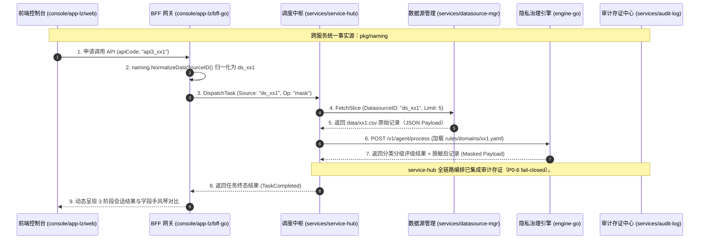
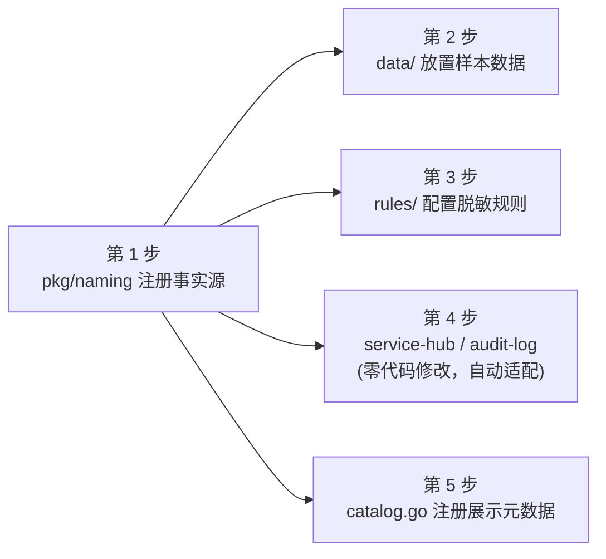

# 新增数据接口（Data API）全链路扩展与命名规范设计

> **版本**：v16.0.0  
> **适用范围**：PrivShield 体系下新增业务数据接口（如 `ds_xx1` / `api3_xx1`）的标准架构设计与扩展实施指南（SOP）。  
> **定位**：旨在确保跨服务（Go 微服务群、Go 隐私计算引擎、TypeScript 前端控制台）实现**统一命名规范**、**单一事实源（Single Source of Truth, SSOT）**、**零语义漂移**与**快速敏捷接入**。

---

## 目录

- [1. 概述与设计哲学](#1-概述与设计哲学)
  - [1.1 核心设计原则](#11-核心设计原则)
- [2. 全局命名规范与四位一体标准矩阵](#2-全局命名规范与四位一体标准矩阵)
  - [2.1 规范详情说明](#21-规范详情说明)
- [3. 全链路架构拓扑与数据流转](#3-全链路架构拓扑与数据流转)
- [4. 新增数据接口标准实施路径 (5 步 SOP)](#4-新增数据接口标准实施路径-5-步-sop)
  - [第 1 步：在 pkg/naming 中注册核心事实源](#第-1-步在-pkgnaming-中注册核心事实源)
  - [第 2 步：在 services/datasource-mgr 中接入数据资产](#第-2-步在-servicesdatasource-mgr-中接入数据资产)
  - [第 3 步：在 rules/domains 中配置动态分类分级与脱敏规则](#第-3-步在-rulesdomains-中配置动态分类分级与脱敏规则)
  - [第 4 步：service-hub 与 audit-log 自动适配验证](#第-4-步service-hub-与-audit-log-自动适配验证)
  - [第 5 步：在 app-lz/bff-go 中注册前端展示元数据](#第-5-步在-app-lzbff-go-中注册前端展示元数据)
- [5. 质量保证与 CI 门禁验证 (Verification DoD)](#5-质量保证与-ci-门禁验证-verification-dod)

---

## 1. 概述与设计哲学

在分布式数据流通与隐私治理平台中，业务数据源（如医保结算、康养体征、金融流水、政务协同等）的字段结构、分类分级策略与流转链路各不相同。如果各微服务独立维护数据源名称、接口路径与字段映射，极易导致：
1. **命名语义漂移**：前端传 `yibao`，调度中枢用 `ds_yibao`，审计存证记录 `medical_insurance`，导致全链路追踪断裂；
2. **重复开发与硬编码**：每增加一个数据接口，需要修改多个微服务中的路由、校验器和模型；
3. **安全漏洞**：未知或未校验的数据源标识被意外透传，破坏 Fail-closed 安全防御边界。

### 1.1 核心设计原则

- **单一事实源原则 (Single Source of Truth, SSOT)**：  
  跨服务业务标识在 [`pkg/naming/naming.go`](../../pkg/naming/naming.go) 集中注册，所有 Go 微服务（`service-hub`、`datasource-mgr`、`audit-log`、`console/bff-go`、`console/app-lz/bff-go`）直接依赖该包，实现**一处定义、全服务生效**。
- **边界归一化与 Fail-Closed**：  
  允许入站请求携带别名（如文件名 `xx.csv`、中文名 `XX数据`、Slug `xx`），但**只允许在服务入口边界被归一化一次**（`naming.NormalizeDataSourceID()`），内部流转统一使用 Canonical 标准标识。未知或预留标识直接拦截拒绝。
- **编译期静态约束**：  
  业务代码禁止出现裸字符串字面量（如 `"ds_xx1"`），一律引用 `naming.DSXX1` 常量，利用编译器消除拼写错误。
- **泛型数据负载流转**：  
  调度中枢与审计存证针对业务载荷采用泛型 JSON（`map[string]any`）传输，新增数据源无需重构数据传输对象（DTO）。

---

## 2. 全局命名规范与四位一体标准矩阵

为保证全局一致性，每个新增业务接口必须严格遵循**四位一体命名规范**：

```text
┌─────────────────────────────────────────────────────────────────────────────────────────────────┐
│                                  四位一体命名规范矩阵                                              │
├─────────────────────┬───────────────────────────┬───────────────────────────────────────────────┤
│ 规范维度             │ 格式命名约束              │ 示例 (`ds_xx1`)                               │
├─────────────────────┼───────────────────────────┼───────────────────────────────────────────────┤
│ **1. 数据源唯一标识** │ `^ds_[a-z][a-z0-9_]{1,30}$`│ `ds_xx1` (常量: `naming.DSXX1`)              │
│ **2. 业务 API 编码** │ `^api[1-9]_[a-z0-9_]{1,30}$`│ `api3_xx1` (常量: `naming.API3XX1`)          │
│ **3. 原始数据集文件** │ `<domain>.csv`            │ `data/xx1.csv`                                │
│ **4. 分类脱敏规则集** │ `rules/domains/<domain>.yaml` | `rules/domains/xx1.yaml`                     │
└─────────────────────┴───────────────────────────┴───────────────────────────────────────────────┘
```

### 2.1 规范详情说明

1. **数据源标识 (DataSource ID)**：全局唯一的底层数据源实体名，前缀固定为 `ds_`，用于数据源切片管理、任务元数据与审计存证。
2. **API 稳定编码 (API Code)**：面向外部调用方与控制台的 API 编号，前缀为 `api<序号>_`，用于服务目录展示与 API 申请调度。
3. **数据集文件 (Dataset File)**：存放于 `data/` 目录下，作为该数据源的静态样本与模拟数据源。
4. **领域规则文件 (Domain Rules)**：存放于 `rules/domains/` 目录下，定义该数据源特有字段的分类分级标准与脱敏策略。

---

## 3. 全链路架构拓扑与数据流转

新增数据接口在各核心组件之间的协同关系如下：



> **默认端口、环境变量与 mTLS 说明**：
> - Go Agent REST `:8079` / gRPC `:50051`；service-hub `:8082`/`:50052`；datasource-mgr `:8083`/`:50053`；audit-log `:8084`/`:50054`；bff-go `:8081`/`:50055`（可选）。
> - 环境变量按服务隔离：`SERVICE_HUB_*`、`DATASOURCE_MGR_*`、`AUDIT_LOG_*`、`PRIVACY_CONSOLE_*`、`PRIVACY_AGENT_*` 等，并共享 `PRIVACY_AUTH_MTLS_WHITELIST_FILE` 等配置。
> - Go gRPC 服务器统一使用 `pkg/tlsutil` 的 `NewWhitelistInterceptor()` CN 白名单拦截器；配置 `PRIVACY_AUTH_MTLS_WHITELIST_FILE=config/mtls-whitelist.yaml` 后，通过 5 秒 mtime 轮询热重载。

---

## 4. 新增数据接口标准实施路径 (5 步 SOP)

以下以新增 **`ds_xx1` / `api3_xx1`**（XX业务数据接口）为例，演示完整的标准化接入步骤。



---

### 第 1 步：在 `pkg/naming` 中注册核心事实源

打开 [`pkg/naming/naming.go`](../../pkg/naming/naming.go)，完成常量声明与注册表追加：

```go
// 1. 声明 canonical 常量
const (
    API3XX1 = "api3_xx1" // 新增 API 编码
    DSXX1   = "ds_xx1"   // 新增数据源 ID
)

// 2. 在 Registry 切片中追加条目
var Registry = []Entry{
    // ... 原有 DSYibao, DSKangyang 条目 ...
    {
        APICode:      API3XX1,
        DataSourceID: DSXX1,
        Seq:          3,
        DisplayName:  map[string]string{
            "zh-CN": "XX业务流转数据接口",
            "en-US": "XX Business Workflow API",
        },
        Category:     "business_flow",
        FileName:     "xx1.csv",
        FieldCount:   7,
        Aliases: []string{
            "xx1", "xx1.csv", "XX业务", "XX数据", "business_flow",
        },
        Status: StatusActive, // 标记为已激活
    },
}
```

> **底层生效机制**：
> - `naming.NormalizeDataSourceID("xx1")` 自动映射为 `"ds_xx1"`；
> - `naming.ValidateDatasourceID("ds_xx1")` 自动判定为合法并放行；
> - `service-hub`、`datasource-mgr`、`audit-log` 等服务即刻感知，**无需修改任何 Go 微服务的鉴权与校验逻辑**。

---

### 第 2 步：在 `services/datasource-mgr` 中接入数据资产

1. **放置样本数据文件**：  
   创建并放入 [`data/xx1.csv`](../../data/) 文件，包含真实或模拟的业务字段表头与行数据：
   ```csv
   trade_no,user_name,id_card,phone_number,trade_amount,trade_time,terminal_ip
   TX-2026-001,王建国,510101198505051234,13900001111,2500.00,2026-08-25 10:30:00,192.168.1.100
   TX-2026-002,李淑珍,510101199008085678,13811112222,880.50,2026-08-25 11:15:20,192.168.1.101
   ```
2. **验证数据源切片提取**：  
   `datasource-mgr` 会根据注册表中的 `FileName: "xx1.csv"` 自动定位文件，支持通过 REST 接口拉取 JSON 格式的原始记录切片：
   ```bash
   curl -s http://127.0.0.1:8083/v1/datasources/ds_xx1/sample?limit=2 | jq .
   ```

---

### 第 3 步：在 `engine` 中配置动态分类分级与脱敏规则

1. **新建领域规则配置文件**：  
   在 [`rules/domains/`](../../rules/domains/) 目录下新建 `xx1.yaml`：
   ```yaml
   # rules/domains/xx1.yaml
   domain: xx1
   version: "1.0.0"
   description: "XX业务流转数据分类分级与脱敏治理规则"

   rules:
     - id: rule-xx1-name
       field: user_name
       level: L2
       category: pii
       matchers:
         - operator: regex
           pattern: "^[\\u4e00-\\u9fa5]{2,4}$"
       action: mask_name

     - id: rule-xx1-idcard
       field: id_card
       level: L3
       category: pii
       matchers:
         - operator: regex
           pattern: "^[1-9]\\d{5}(18|19|20)\\d{2}(0[1-9]|1[0-2])(0[1-9]|[12]\\d|3[01])\\d{3}[0-9Xx]$"
       action: mask_id_card

     - id: rule-xx1-phone
       field: phone_number
       level: L2
       category: pii
       matchers:
         - operator: regex
           pattern: "^1[3-9]\\d{9}$"
       action: mask_phone
   ```

2. **热重载分类规则引擎**：  
   无需重启 Go Agent，通过热重载接口立即生效：
   ```bash
   curl -s -X POST http://127.0.0.1:8079/v1/dynclassification/profiles/reload | jq .
   ```

---

### 第 4 步：`service-hub` 与 `audit-log` 自动适配验证

得益于调度中枢与审计存证的**泛型负载（`map[string]any`）**设计，**新增数据源无需修改 `service-hub` 与 `audit-log` 的现有 Go 源代码**即可被识别：

1. **调度中枢自动转发**：  
   `service-hub` 从 `datasource-mgr` 获取任意字段的 JSON 记录，透明转发给 `engine-go` 的 `POST /v1/agent/process`，`engine-go` 根据 `rules/domains/xx1.yaml` 自动完成分类分级与脱敏。
2. **审计存证当前状态**：  
   `audit-log` 服务已就绪（`:8084` REST / `:50054` gRPC），支持显式调用 `RecordAudit` 并将样本以 SM4-GCM 信封加密后持久化；`service-hub` 6 阶段流水线支持自动异步写入 9 要素存证。

---

### 第 5 步：在 `app-lz/bff-go` 中注册前端展示元数据

打开 [`console/app-lz/bff-go/internal/catalog/catalog.go`](../../console/app-lz/bff-go/internal/catalog/catalog.go)，在 `schemas` 映射表中追加该数据源的字段清单与展示描述：

```go
var schemas = map[string]schema{
    // ... 原有 naming.DSYibao, naming.DSKangyang 条目 ...
    naming.DSXX1: {
        NameZh: "XX业务流转数据 API",
        NameEn: "XX Business Workflow API",
        Description: fmt.Sprintf(
            "XX业务真实流转记录 (%s 7 字段)，包含交易流水号、用户姓名、身份证号、手机号、交易金额、交易时间、终端IP等字段。",
            fileNameOf(naming.DSXX1)),
        Fields: []string{
            "trade_no", "user_name", "id_card", "phone_number",
            "trade_amount", "trade_time", "terminal_ip",
        },
    },
}
```

> **底层生效机制**：
> `catalog.Definitions()` 会自动遍历 `pkg/naming.Registry`，与 `schemas` 映射表动态合并生成 `models.DataApiDef` 列表供前端接口 `/v1/lz/data-api/definitions` 拉取，前端卡片与字段手风琴对比组件自动渲染展示。

---

## 5. 质量保证与 CI 门禁验证 (Verification DoD)

完成上述 5 步后，依次执行以下命令确保全链路接入无误：

```bash
# 1. 运行全量 Go 测试套件 (SDK + Agent + 微服务群 + BFF)
make test

# 2. 运行 Go 基础库与微服务测试
go test -race -count=1 ./pkg/naming/... ./services/datasource-mgr/... ./console/app-lz/bff-go/...

# 3. 执行 App-LZ 自动化 E2E 调度流水线测试
go test -v -run TestRunSuites ./console/app-lz/bff-go/internal/runner/
```
