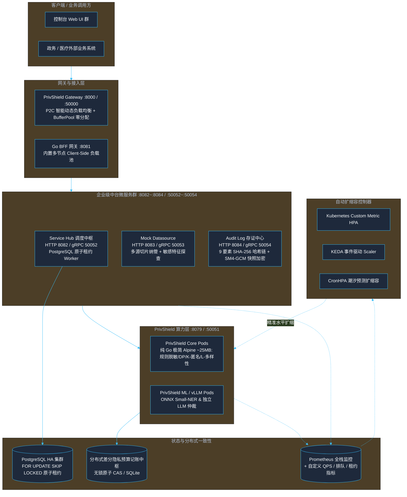

# PrivShield 生产级架构优化与高可用演进设计方案

> **版本**：v18.0.0  
> **适用范围**：`services/privacy-engine` 核心算力引擎、中台微服务群（`services/service-hub` / `services/audit-log`）、控制台与数据源生态（`console/mock-datasource` / `console/engine-console` / `console/app-lz`）及 Kubernetes 云原生部署套件。  
> **核心目标**：针对高并发政务与医疗数据流通场景，全面实现负载均衡、分布式预算一致性、PostgreSQL 原子租约并发、细粒度事件驱动自动扩缩容（KEDA/CronHPA）、异步任务队列与极限压测套件。

---

## 目录

- [1. 架构演进全景图](#1-架构演进全景图)
- [2. 核心高可用与优化模块实现](#2-核心高可用与优化模块实现)
  - [2.1 分布式全局隐私预算一致性中心 (Distributed Consistency Budget)](#21-分布式全局隐私预算一致性中心-distributed-consistency-budget)
  - [2.2 智能动态负载均衡 (Smart Load Balancing)](#22-智能动态负载均衡-smart-load-balancing)
  - [2.3 Service Hub 原子租约与异步工作池 (Atomic Leases & Worker Pool)](#23-service-hub-原子租约与异步工作池-atomic-leases--worker-pool)
  - [2.4 细粒度事件驱动自动扩缩容 (Advanced Auto-Scaling)](#24-细粒度事件驱动自动扩缩容-advanced-auto-scaling)
  - [2.5 极限压测与基准性能评估套件 (Stress & Benchmark Suite)](#25-极限压测与基准性能评估套件-stress--benchmark-suite)

---

## 1. 架构演进全景图



> **gRPC mTLS 接入**：service-hub、mock-datasource、audit-log、engine-console/bff-go 等 Go gRPC 服务器在 `PRIVACY_AUTH_MTLS_WHITELIST_FILE` 指向 `config/mtls-whitelist.yaml` 时，通过 `pkg/tlsutil.NewWhitelistInterceptor()` 注册 unary/stream CN 白名单拦截器，并支持 5 秒 mtime 轮询热载。

---

## 2. 核心高可用与优化模块实现

### 2.1 分布式全局隐私预算一致性中心 (Distributed Consistency Budget)

在 `services/privacy-engine/sdk/budget/budget.go` 中，`BudgetAccountant` 通过纯 Go 原子无锁并发设计实现统一预算抽象：
1. **无锁原子 CAS 模式**（默认）：基于 `sync/atomic` 与 `math.Float64bits` 实现单机千万级 QPS 原子扣减与原子回滚，消除读陈旧与并发丢失风险；
2. **SQLite 模式**：通过环境变量 `PRIVACY_BUDGET_DB` 启用，支持单机本地持久化与跨实例共享；
3. **滑动时间窗口**：通过 `PRIVACY_BUDGET_WINDOW_SECONDS` 实现自动周期重置；
4. **HMAC/SM3 防篡改审计**：`BudgetAuditLogger` 对每笔预算消耗记录进行 HMAC-SHA256 / 国密 SM3 签名存证。

---

### 2.2 智能动态负载均衡与零分配网关 (Smart Load Balancing & BufferPool)

#### 1. Go 微服务共享客户端多节点池化 (`pkg/agent/client.go` / `internal/datasource/client.go`)
- **多端点配置**：`Config.BaseURLs` 支持传入多个后端 REST 地址；`service-hub` 分别读取环境变量 `PRIVACY_AGENT_URLS`（多 `privacy-engine` 引擎节点）、`DATASOURCE_MGR_URLS`（多 `mock-datasource` 数据源节点）与 `SERVICE_HUB_AUDIT_LOG_URLS`（多 `audit-log` 存证节点），支持逗号分隔多地址集群；未配置时优雅回退为单节点地址；
- **客户端轮询与故障转移 (Client-Side Round-Robin & Failover)**：
  - 基于无锁原子递增序号（`atomic.Uint64`）实现无锁平滑 Round-Robin 均衡分发；
  - **按节点独立熔断（Per-Node Circuit Breaker）**：为每个实例维护独立的三态熔断器（连续 5 次失败触发 Open），单节点宕机只隔离故障节点，绝不引发全池熔断；经过 30s 冷却后放行半开探测流量进行自愈验证；
  - **重试智能故障转移**：请求遭遇超时或 5xx 错误时，触发带随机抖动的指数退避重试，并在重试轮次自动切换到下一个健康节点，无需上层业务介入重连；
  - **4xx 业务错误不计入熔断**：防止非法参数或客户端探针异常打穿熔断器；
- **响应体及时释放与 64 MiB 防 OOM 限制**：重试循环内显式 `resp.Body.Close()`（读取完毕后立即关闭），并配合 `io.LimitReader` 硬限制 64 MiB，防止响应体累积导致内存泄漏与连接池耗尽。

#### 2. Go 网关 P2C-EWMA 动态负载调度与 BufferPool (`services/privacy-engine/internal/gateway/`)
- **Power of Two Choices + EWMA 算法 (`balancer.go`)**：
  - 每次调度从健康节点列表中随机选取两个候选节点；
  - 基于指数加权移动平均（EWMA）计算候选节点的综合负载得分：
    $$\text{Score} = \text{InflightRequests} \times 1.0 + \text{EWMALatencyMs} \times 0.05$$
  - 将请求派发给负载得分最低的节点，有效消除羊群效应（Herd Effect）；
- **BufferPool 零堆分配反向代理 (`http_proxy.go`)**：
  - 基于 `sync.Pool` 复用 32KB 数据包内存切片，实现反向代理数据流转发 0 B/op。

---

### 2.3 Service Hub 原子租约与异步工作池 (Atomic Leases & Worker Pool)

#### 1. PostgreSQL 原子租约并发 (`LeasedTaskStore`)
在多副本 Hub 场景下，采用 `FOR UPDATE SKIP LOCKED` 短事务实现无阻塞并发抢占：
```sql
WITH candidate AS (
  SELECT id FROM tasks
  WHERE status = 'pending'
    AND (retry_after IS NULL OR retry_after <= NOW())
    AND retry_count < max_retries
  ORDER BY priority DESC, created_at ASC
  FOR UPDATE SKIP LOCKED LIMIT 1
)
UPDATE tasks
SET status = 'running', lease_owner = $1, lease_token = $2,
    lease_expires_at = NOW() + INTERVAL '60 seconds', version = version + 1
WHERE id IN (SELECT id FROM candidate)
RETURNING *;
```
- 彻底消除多副本重复读取同一任务导致的脑裂与重复执行；
- 支持租约续期（`RenewLease`）、状态完成（`CompleteLease`）与超期回收（`RequeueExpiredLeases`）。
- 后端限制：`LeasedTaskStore` 完整语义仅在 PostgreSQL 后端（`pkg/store/postgres`）实现；SQLite 与内存后端会返回 `ErrLeaseNotSupported`，避免多副本 Hub 误配时静默出错。

#### 2. 崩溃恢复与自动重试
- **启动时崩溃恢复**：自动扫描并回收孤立任务（running 标记失败、pending 保留队列），通过 Prometheus 指标 `orphaned_tasks_recovered_total` 记录恢复数量；
- **周期性后台重试**：定期扫描失败任务，自动重试可恢复错误，指数退避延迟 + `RetryCount` 结构化字段，通过 `tasks_retried_total` 指标监控重试活动；
- **完整性校验**：SQLite 模式启动时执行 `PRAGMA integrity_check` 阻断损坏数据库；
- **统一备份脚本**：支持全量/增量备份、`--verify` 恢复验证模式、自动过期清理。

---

### 2.4 细粒度事件驱动自动扩缩容 (Advanced Auto-Scaling)

#### 1. 基于自定义业务指标的 HPA 扩展
在 Helm Chart 中支持直接绑定 Prometheus 业务指标：
- **QPS 触发**：`rate(privacy_requests_total[1m]) > 200`
- **P95 延迟恶化触发**：`histogram_quantile(0.95, rate(privacy_request_duration_seconds_bucket[2m])) > 0.5`

#### 2. 算力分层 Deployment（Tiered Scaling）
- **`privshield-core`**：纯 CPU 算力（脱敏、K-匿名、差分隐私），极速秒级扩缩（副本数 3~30）；
- **`privshield-ml`**：GPU 显存算力（Small-NER 与本地 LLM），平稳扩缩（副本数 2~6）。

#### 3. CronHPA 潮汐预测调度
针对政务就医业务规律，预置工作日早高峰（08:15）提前扩容与夜间（20:00）自动缩容。

---

### 2.5 极限压测与基准性能评估套件 (Stress & Benchmark Suite)

新增 `scripts/test/stress_test_suite.py` 自动化压测套件：
- 支持并发模拟 50~500 用户持续压测；
- 统计并输出 QPS、总吞吐、P50、P90、P95、P99 延迟及错误率；
- 验证在极限压力下熔断器与多节点负载均衡的稳定性。

---

## 3. 第二轮深度四维架构审计优化（P0~P3）

在第一轮 12 项优化基础上，对 `services/privacy-engine` 全模块再次实施全量四维审计（功能性、安全性、可靠性、并发性），发现并修复 **24 项** 新优化点：

### 3.1 P0 — 隐私安全与正确性

- **dpHistogram 绕过预算检查**：3 个 Histogram handler 统一走 `svc.DPHistogram()` 预算核算
- **脱敏失败返回原文隐私泄露**：Mask RPC 失败返回错误，不再回退原文；MaskBatch 失败返回 `"***"`
- **dpAggregate/dpGroupBy 忽略预算错误**：检查 `NoisyCount`/`NoisySum` 错误，预算耗尽返回 429
- **PrivacyService 热重载数据竞争**：`classifier` 字段改为 `atomic.Pointer[RuleEngine]`，无锁读 + 原子替换

### 3.2 P1 — 架构与可靠性

- **RuleEngine 缓存有界化**：16 分片有界缓存 + 随机半量淘汰，替代无界 `sync.Map`
- **RuleEngine 热重载修复**：从文件重新加载规则，而非空操作
- **SafetyFloor 读配置加锁**：`Arbitrate` 使用 `RLock` 读取 config
- **SelectNode 无锁化**：SWRR `currentWeight` 改为 `atomic.Int32`，移除全局互斥锁
- **LLM 错误响应限制**：`io.LimitReader` 限制最大 1MB 防 OOM
- **解析溢出修复**：`strconv.ParseFloat`/`strconv.Atoi` 替代手写解析器

### 3.3 P2 — 资源管理与防御

- **gRPC 连接池限制**：`maxPoolSize: 256`
- **goroutine 优雅退出**：proxyCache 与 rateLimiter 添加 `done` channel
- **双向流完整等待**：gRPC 流转发等待两个方向都退出
- **LLM 重试可取消**：重试循环检查 `ctx.Done()` + `select` 替代 `time.Sleep`
- **排序优化**：冒泡排序→`sort.Float64s`
- **限流路径归一化**：动态 ID 段替换为 `:id`，防止限流桶爆炸
- **IsAvailable HEAD 探测**：避免 POST 端点副作用

### 3.4 P3 — 性能与可观测性

- **CacheStats 原子计数器**：`atomic.Int64` O(1) 命中/未命中统计
- **ArbitrateBatch 并行化**：>32 条目多核分块并发仲裁
- **DPChunked 使用请求 ctx**：替代 `context.Background()`
- **Profile 加载错误日志**：`slog.Warn` 记录加载失败

**全量测试验证**：`services/privacy-engine` 全部包通过 `go test -race -count=1 ./...`，零数据竞争。

---

## 4. 第三轮深度四维架构审计优化（P0~P2）

在前两轮 36 项优化基础上，对 `services/privacy-engine` 全模块实施第三轮全量四维审计，发现并修复 **9 项** 新优化点：

### 4.1 P0 — 隐私安全与正确性

- **TypedServer Mask/MaskBatch 脱敏失败返回原文**：与 `server.go` 已修复的 P0 问题一致，但 `typed_server.go` 未同步修复。失败时返回 `"***"` 而非原文，消除隐私泄露。
- **TypedServer Histogram 绕过预算检查**：`DPHistogram`/`DPNoisyHistogram`/`DPChunkedHistogram` 直接调用 `dp.NoisyHistogram()` 绕过 service 层预算核算，统一改为通过 `svc.DPHistogram(ctx, ...)` 走预算消耗。
- **grpc_proxy getOrCreateConn 双重解锁 panic**：`defer g.connPoolMu.Unlock()` + 手动 `g.connPoolMu.Unlock()` 在连接池满时触发双重解锁。移除手动 Unlock，由 defer 统一释放。
- **service 层 DPGroupBy/DPAggregate/DPAdaptiveClip 缺少预算检查**：三个高级 DP API 直接调用 `dp` 包函数，未消耗隐私预算。补充 `budget.Consume()` 检查。

### 4.2 P1 — 并发安全

- **RuleEngine Classify 数据竞争**：`Classify` 读 `e.rules`/`e.fieldRegexps`/`e.ac` 无锁保护，而 `checkRulesReload` 在 `reloadMu` 下写这些字段。引入 `atomic.Pointer[ruleSnapshot]` 原子快照，`Classify` 无锁读、`reload` 原子替换，零锁开销。
- **WhitelistManager checkReload 数据竞争**：`checkReload` 读 `m.lastMtime` 无锁，而 `load()` 在锁内写。加 `RLock` 读取后比较。

### 4.3 P2 — 防御性

- **ProcessAgentData 静默忽略归一化错误**：`naming.NormalizeDataSourceID` 错误从 `_` 改为记录 `slog.Warn` 日志。
- **getEnvInt 改用 strconv.Atoi**：`fmt.Sscanf` 不检查错误且对无效输入返回 0，改用 `strconv.Atoi` + 错误回退默认值。影响 `service.go` 和 `cmd/privshield-agent/main.go`。

**全量测试验证**：`services/privacy-engine` 全部包通过 `go test -race -count=1 ./...`，零数据竞争。

---

## 5. 第四轮深度四维架构审计优化（P0~P2）

在前三轮 45 项优化基础上，对 `services/privacy-engine`（引擎服务 + 内置 sdk）全模块实施第四轮全量四维审计，发现并修复 **6 项** 新优化点：

### 5.1 P0 — 正确性与安全

- **kano.parseNumeric 死循环与解析错误**：手写逐字符解析存在死循环和逻辑缺陷，`formatFloat` 使用 `string(rune(int64(f)+'0'))` 对 >9 数值产生错误 Unicode。改用 `strconv.ParseFloat` + `strconv.FormatFloat`，确保 Mondrian 分裂正确性。
- **constantTimeLookup 时序侧信道**：Go map 迭代顺序随机，迭代次数泄漏 key 数量。改用 `sort.Strings` 确定性迭代 + `subtle.ConstantTimeCompare` 全量比较，消除时序侧信道。
- **DICOM os.ReadFile 无大小上限**：`ReadDICOM` 直接 `os.ReadFile` 无文件大小限制，存在 OOM 风险。加 256MB 默认上限，通过 `PRIVACY_DICOM_MAX_FILE_SIZE` 环境变量可配置。

### 5.2 P1 — 可靠性

- **gRPC GracefulStop 无超时回退**：agent/gateway 的 `grpcSrv.GracefulStop()` 无超时，RPC 不结束会挂死。加超时回退机制（`PRIVACY_GRPC_GRACEFUL_STOP_SECONDS`，默认 15s），超时后强制 `Stop()`。gateway `Server` 新增 `Stop()` 方法供超时回退调用。
- **后台 goroutine 未与生命周期绑定**：限流清理（`StopRateLimiter`）和代理缓存清理（`StopProxyCacheCleaner`）在关闭时未调用。在 agent/gateway shutdown 流程中显式调用，确保资源释放。

### 5.3 P2 — 并发性能

- **LDP 批量扰动全局 rand 锁竞争**：`PerturbBinaryBatch`/`PerturbCategoricalBatch` 多 worker 共享 `math/rand/v2` 全局函数，内部全局锁竞争。改为 per-worker 独立 `rand.New(rand.NewPCG(...))` 消除锁竞争。

**全量测试验证**：`services/privacy-engine` 19 个包（12 个 internal 包 + 7 个内置 sdk 原语包）全部通过 `go test -race -count=1 ./...`，零数据竞争。

---

## 6. 第五轮深度四维架构审计优化（P1~P2）

在前四轮 51 项优化基础上，对 `services/privacy-engine` 全模块实施第五轮全量四维审计，发现并修复 **5 项** 新优化点：

### 6.1 P1 — 并发安全

- **balancer selectP2C/HealthCheck EWMA 数据竞争**：`selectP2C` 和 `NewHealthCheckHandler` 无锁读 `BackendNode.EWMA` 字段，而 `UpdateEWMA()` 在 `eWMAMu` 保护下写。新增 `GetEWMA()` 方法加锁读取，修复数据竞争。

### 6.2 P1 — 功能性与安全

- **`/readyz/llm` 硬编码修复**：原处理器无条件返回 `"not_loaded"`，K8s 探针无法感知 LLM 实际状态。改为通过 `PrivacyService.LLMStatus()` → `ClassificationFunnel.LLMStatus()` → `LLMClient.IsAvailable()` 链路真实探测，返回三种状态：`not_configured`/`ready`/`unavailable`。
- **分类缓存 key PII 哈希化**：`ClassificationFunnel.Classify` 的缓存 key 为 `field + "\x00" + value`，原始 value 留存在堆内存中。高基数数据（唯一ID、地址等）导致缓存无限增长与数据驻留。改用 `field + "\x00" + sha256(value)[:16]`，将 key 空间固定在 16 字节。

### 6.3 P2 — 性能与并发

- **ProcessAgentData 多核并行**：原单线程循环处理每条记录的分类与脱敏。改为 >32 记录时 strided 多 worker 并行（上限 16），与 ClassifyBatch/MaskBatchContext 模式一致。
- **engineCache 智能驱逐**：原随机遍历 Go map key 淘汰一半，热数据与冷数据同概率被丢弃。改为两阶段：Phase 1 优先淘汰 `MatchedBy=="default"` 或 `Confidence < 0.6` 的低价值条目；Phase 2 回退随机补足。

**全量测试验证**：19 个包全部通过 `go test -race -count=1 ./...`，零数据竞争。

---

## 7. 深度优化建议评估与定向改造

对外部提出的 6 项优化建议逐条进行代码事实验证（避免假阳性），实施其中 3 项高确定性改造：

### 7.1 已实施

- **LLMClient Half-Open 并发试探限制（P1 可靠性）**：`llm_client.go` 的 `checkCircuit` 在 Half-Open 态无条件 `return true`，与同仓 `gateway.CircuitBreaker`（`successCount < halfOpenMax` 限流）实现不一致。改造为：`halfOpenInflight atomic.Int32` 配额（上限 3），Open→HalfOpen 迁移时 `Store(1)` 由迁移者自身占位；返回幂等 `releaseProbe` 回调（`sync.Once` 保护），`Classify` 中 `defer` 释放；超额请求拒绝并降级到 Safety Floor，防止刚恢复的 LLM 被瞬时流量二次打崩。
- **RuleEngine 热路径 Stat 节流（P1 性能）**：`engine.go` 的 `checkRulesReload` 在每次 `Classify` 前执行 `os.Stat`，属每请求 syscall。新增 5s 节流窗口：`lastCheckNano atomic.Int64` + CAS 确保同一窗口仅一个 goroutine 执行检测；`PRIVACY_RULES_RELOAD_CHECK_SECONDS` 可配置（0 禁用）。保持"零 goroutine、零外部依赖"设计原则不变。另经代码验证：`WhitelistManager.checkReload` 实际未接入任何请求热路径（仅测试调用），建议原文明单错位，真实风险在 RuleEngine。
- **ArbitrateBatch 并行阈值 32→128（P3）**：单条仲裁为纯内存比较 + ring buffer 写入，32~128 区间 goroutine 创建/调度开销高于并行收益，小批量改串行单趟。

### 7.2 评估后未采纳/留待专项

- **fsnotify 事件驱动热重载**：白名单热重载未接入认证链路（前提不成立）；RuleEngine 侧用时间节流即可消除热路径 Stat，引入 fsnotify 会破坏零依赖约定并新增 goroutine，性价比低。
- **分类 LRU 读锁改造（S3-FIFO/读写分离）**：痛点属实（`get` 因 `moveToFront` 持写锁），但替换淘汰算法影响面大，建议后续以"命中计数阈值延迟重排"的小改造方案专项评估。（第六轮已以 Second-Chance/CLOCK 方案实施，见 §8.1）
- **大文件流式处理**：当前已有 50MB multipart / 256MB XLSX 上限兜底 OOM；真流式受限于 Mondrian 全局分组算法本质无法全流式，需架构级专项设计（CSV/JSON 可先行）。（第六轮已实施 CSV/JSON 流式脱敏，见 §8.3）
- **ReverseProxy 内聚 BackendNode**：合理但会牺牲后端节点动态增删灵活性，需确认网关拓扑后再动。（经确认节点集合启动时静态确定，第六轮已实施，见 §8.2）

**测试验证**：新增 `TestLLMClient_HalfOpenProbeQuota`（确定性配额断言 + 幂等性）与 `TestRuleEngine_ReloadCheckThrottle`（节流窗口内跳过/关闭后正常重载），19 包 全部通过 `go test -race -count=1 ./...`。

---

## 8. 第六轮：剩余三项建议的定向实施（P1~P2）

在 §7 的评估基础上，对当时列为"留待专项"的 ①⑤⑥ 三项完成实施，累计优化项达 59 项。

### 8.1 分类 LRU 读锁竞争 → Second-Chance（CLOCK）近似（P1 并发）

**原状**：`classificationCache.get` 为维护严格 LRU 链表，每次读命中都要在**分片互斥锁**下执行 `moveToFront`（三次指针写），因此读路径无法使用 `RWMutex` 的共享锁——同分片并发读完全串行化，16 分片在高并发分类下仍构成明显的序列化点。

**改造**（`dynclassification/funnel.go`）：
- `lruNode` 新增 `ref atomic.Bool` 引用标记；`lruShard.mu` 由 `sync.Mutex` 改为 `sync.RWMutex`；删除未被读取的分片级 `hits/misses` 冗余计数（统计已由全局 `totalHits/totalMiss` 原子计数器承担）。
- **读路径**：全程持 `RLock`，命中仅拷贝结果值并 `ref.Store(true)`，**不再触碰链表**，同分片并发读真正并行；`ref` 写在锁外执行且为原子操作，即使节点已被并发淘汰也只是写入一个孤立对象，无正确性影响。
- **淘汰路径**：`removeOldest` 改为 CLOCK 语义——从尾部扫描，凡引用位为 1 的节点"延迟提升到队首"（偿还读路径下放的结构性写），遇到引用位为 0 的节点即淘汰；扫描上限 `lruMaxScanAttempts = 8`，耗尽后直接淘汰尾部，保证单次驱逐 O(1) 摊销、且在"全条目均被引用"时不会发生活锁。

**权衡**：由严格 LRU 退化为近似 LRU（CLOCK），命中率损失在真实工作负载下通常 <1%，换取读路径无锁化；`CacheStats` 的 size 遍历同步降级为 `RLock`。

### 8.2 反向代理实例与 BackendNode 生命周期绑定（P2 架构）

**原状**：`http_proxy.go` 用包级 `proxyCache sync.Map` + `init()` 派生的常驻清理 goroutine（每 2 分钟扫描、10 分钟 TTL）管理 `*httputil.ReverseProxy`，并在 `main.go` 停机链路中要求显式调用 `StopProxyCacheCleaner()`——忘记调用即产生孤儿 goroutine，且 `init()` 派生的 goroutine 无法被测试隔离。

**改造**：
- `BackendNode` 新增 `proxyOnce sync.Once` + `proxy *httputil.ReverseProxy` + `proxyErr error`，实例随节点惰性构建、随节点回收，生命周期天然对齐；
- `getOrCreateReverseProxy(addr, node, metrics)` → `(*BackendNode).ReverseProxy(metrics)`，删除 `proxyCache`/`proxyEntry`/`init()` 清理协程/`StopProxyCacheCleaner()`，并移除 `main.go` 中的停机钩子调用；
- 地址解析失败为启动期静态配置导致的永久错误，经 `sync.Once` 固化错误，避免每请求重复构建；
- 连接池复用不受影响：`sharedTransport` 与 `globalBufferPool` 仍为包级共享，`ReverseProxy` 本身无可变状态。

**前提确认**：网关后端节点集合由 `NewLoadBalancer/NewWeightedLoadBalancer` 在启动时一次性构建，`LoadBalancer` 无 `AddNode/RemoveNode` 动态变更 API，因此原 TTL 清理机制解决的是不存在的问题。

### 8.3 CSV/JSON 流式文件处理（恒定内存窗口 + 分块多核）（P1 资源）

**原状**：`/v1/privacy/process_file` 先 `io.ReadAll` 物化整个文件，`csv.Reader.ReadAll()` 再物化 `[][]string`，随后构建未脱敏 `records` 副本与脱敏结果——三阶内存放大，峰值约为文件体积的 4~6 倍（50MB 上传即可瞬时占用数百 MB）。

**改造**（`service/service.go` + `rest/routes.go`）：
- 新增 `ProcessFileStream(io.Reader, filename, operation, options)`：CSV 走 `bufio + csv.Reader` 逐行读取（含 UTF-8 BOM 剥离），JSON 走 `json.Decoder` 令牌流逐对象解码，**边解码边脱敏**，不再保留原始快照与全量中间结构；
- **恒定内存窗口**：每积累 `streamBatchSize = 2048` 行即调用 `maskCSVBatch/maskJSONBatch` 脱敏并释放该批原始行，批次缓冲经 `batch[:0]` 复用，峰值额外内存与文件规模解耦；
- **分块多核**：`forEachChunked` 将批次划分为至多 `streamMaxWorkers = 16` 段连续区间并发写回（按索引不重叠，无锁），低于 `streamParallelMinRows = 512` 行单趟串行；`masking.MaskValue` 为纯函数（内部仅用 `sync.Map`/`sync.Pool`），并发安全；
- **硬上限不退化**：`cappedReader` 对流式读取同样施加 50MB 字节上限，超限返回哨兵 `ErrFileTooLarge`，REST 层 `errors.Is` 映射为 413；截断时长度错误优先于解析/尾部错误；
- **语义回退**：`k_anonymize`（Mondrian 需全局视野）与 XLSX 自动回退到 `ProcessFile` 物化路径，输出结构与字段与旧路径逐字节一致。

**实测**（Apple M4 Max，40000 行 CSV）：`TotalAlloc` 40.3MB → 22.9MB（-43%）；5000 行基准 4.82MB/op → 2.99MB/op，耗时 5.28ms/op → 2.04ms/op（多核分块收益）。

### 8.4 本轮测试

- `TestClassificationCache_SecondChanceKeepsHotEntry`：同一分片内 4 条目满仓，读命中的最旧条目在驱逐后仍存活、冷条目出局（确定性验证第二次机会生效）。
- `TestClassificationCache_EvictionTerminatesWhenAllReferenced`：全条目被引用时淘汰仍在有限扫描后完成，容量不漂移。
- `TestClassificationCache_GetReturnsCopy` / `_ConcurrentReadWithEviction`：值拷贝语义与读写并发（-race）。
- `TestBackendNodeReverseProxyIsNodeScoped`（含 16 goroutine 并发同一性断言）/ `TestBackendNodeReverseProxyPersistsBuildError`。
- `TestProcessFileStreamCSVMatchesProcessFile`（BOM/列过滤/引号内逗号/空表体/空文件 6 形态）、`TestProcessFileStreamJSONMatchesProcessFile`（嵌套值/空数组/顶层对象/非对象元素/尾部脏数据 8 形态）：**流式与物化路径输出 `reflect.DeepEqual` 等价**；另有回退一致性、字节硬上限、内存放大消除与 `forEachChunked` 区间不重不漏断言。

**全量测试验证**：19 个包全部通过 `go test -race -count=1 ./services/privacy-engine/...`，零数据竞争。
