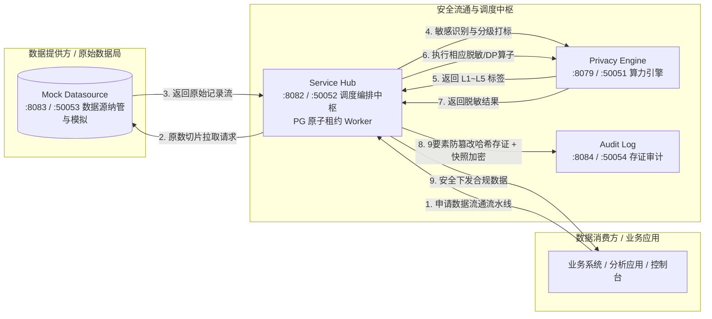

# 企业级数据流通中台微服务群 (Enterprise Services)

> **版本**：v16.0.0  
> **适用范围**：`services/service-hub`、`services/privacy-engine`、`services/audit-log` 及数据源模拟服务 `console/mock-datasource`、共享库 `pkg/`。  
> **定位**：本文档系统阐述数联天下 · 数盾（`PrivShield`）高性能 Go 微服务群的核心职责、流通模型、可靠性与密码学存证机制。

---

## 目录

- [1. 业务架构与流通模型](#1-业务架构与流通模型)
- [2. 微服务职责与关键特性](#2-微服务职责与关键特性)
  - [2.1 Service Hub 数据服务调度中枢 (:8082 / :50052)](#21-service-hub-数据服务调度中枢-8082--50052)
  - [2.2 Mock Datasource 模拟数据源与资产管理服务 (:8083 / :50053)](#22-mock-datasource-模拟数据源与资产管理服务-8083--50053)
  - [2.3 Audit Log 脱敏审计与存证微服务 (:8084 / :50054)](#23-audit-log-脱敏审计与存证微服务-8084--50054)
- [3. 运行、测试与验证命令](#3-运行测试与验证命令)

---

## 1. 业务架构与流通模型

在数据要素市场化与政务云跨域数据流通中，数据流通的核心挑战在于**「如何在数据不出域/可用不可见的前提下，完成跨部门安全调度、自动化敏感分级与全流程存证」**。

数盾微服务群实现了《数据要素流通安全与隐私治理技术白皮书》定义的核心枢纽拓扑：



---

## 2. 微服务职责与关键特性

微服务群通过**服务专属环境变量**暴露 HTTP/gRPC 监听地址与 TLS 配置（`SERVICE_HUB_*`、`DATASOURCE_MGR_*`、`AUDIT_LOG_*`），并复用共享的 `PRIVACY_*` 变量（如 `PRIVACY_REST_PORT`、`PRIVACY_AGENT_*`、`PRIVACY_AUTH_MTLS_WHITELIST_FILE`）。所有 Go gRPC 服务端（service-hub、mock-datasource、audit-log 及 console/engine-console/bff-go）均在 `PRIVACY_AUTH_MTLS_WHITELIST_FILE` 指向 `config/mtls-whitelist.yaml` 时，通过 `pkg/tlsutil.NewWhitelistInterceptor()` 注册 unary/stream 拦截器，实现基于客户端证书 CN 的 method-scope 授权与 5 秒 mtime 轮询热重载。

### 2.1 Service Hub 数据服务调度中枢 (`:8082` / `:50052`)
* **6 阶段自动化调度流水线**：
  1. `Ingest`：解析外部调用方数据请求与参数，生成唯一 `task_id` 与绑定 `trace_id`；
  2. `Fetch`：安全连接指定数据源拉取数据切片（`pkg/naming` 归一化校验）；
  3. `Classify`：请求 PrivShield 核心 Agent（`services/privacy-engine/internal/dynclassification/`）执行三层漏斗动态分类分级（YAML 规则 → 可选 Small-NER → 可选外部 LLM 仲裁）；
  4. `Desensitize`：根据判定等级（L1~L5）自动选择并执行最佳脱敏算子（明文/掩码/K-匿名/差分隐私）；
  5. `Return`：封装脱敏后的安全数据流并返回调用方；
  6. `Audit`：异步向 Audit Log 微服务写入 9 要素存证与加密快照；
  7. `Done`：持久化任务终态结果。
* **统一出站多节点负载均衡与故障转移**：
  - **算力节点负载均衡 (`agentClient`)**：通过 `PRIVACY_AGENT_URLS` 读取多 `privacy-engine` 算力节点地址，基于 `pkg/agent/client.go` 的无锁原子 Round-Robin 均衡轮询调度与按节点独立熔断，遭遇节点单点故障透明切换至健康节点重试；
  - **数据源与存证节点高可用 (`dsClient` / `evidenceClient`)**：分别支持 `DATASOURCE_MGR_URLS` 与 `SERVICE_HUB_AUDIT_LOG_URLS` 多实例轮询与自动重试故障转移（Failover），实现出站全链路三态熔断与故障隔离；
* **高可用与原子租约并发**：
  - 集成 `pkg/store.LeasedTaskStore`，在 PostgreSQL 上基于 `FOR UPDATE SKIP LOCKED` 实现多副本无阻塞竞争领取（`ClaimNext`）；
  - 任务持有者使用 `lease_token` 与乐观锁版本号（`version`）进行租约续期（`RenewLease`）与完成确认，彻底消除脑裂与重复执行；
* **崩溃恢复与自动重试**：启动时自动回收孤立任务（running 标记失败、pending 保留队列），后台基于指数退避与 `RetryCount` 结构化字段自动重试失败任务；
* **完整性校验与备份**：`pkg/store/` 支持 memory / SQLite / PostgreSQL 后端；SQLite 模式启动时执行 `PRAGMA integrity_check` 阻断损坏数据库，统一备份脚本支持全量/增量/验证模式；
* **HTTP/gRPC 双协议 mTLS**：共享 `pkg/tlsutil` 工具库（`grpc_interceptor.go` / `whitelist.go`），TLS 1.3 + `NewWhitelistInterceptor()` CN 白名单 method-scope 授权与 5 秒轮询热重载；
* 📖 [学习指南](../../services/service-hub/docs/learning-guide.md) · [详细设计](../../services/service-hub/docs/design.md) · [可靠性能力](../../services/service-hub/docs/reliability.md)

### 2.2 Mock Datasource 模拟数据源与资产管理服务 (`:8083` / `:50053`)
* **统一资产纳管与 SSOT**：统一纳管医保 `ds_yibao`、康养 `ds_kangyang` 及扩展接口，基于 `pkg/naming` 严格执行唯一事实源标识校验与 Fail-Closed 阻断；
* **样本切片提取 (Sample Slicing)**：提供安全受限的真实样本抽样（`GET /v1/datasources/:id/records` / `sample`），支持单次最大行数沙箱保护；
* **双协议暴露**：同时支持 HTTPS REST（TLS 1.3 + API Key）与 gRPC mTLS 双向认证，并通过共享 `pkg/tlsutil.NewWhitelistInterceptor()` 启用 CN 白名单 method-scope 授权；
* **生命周期管控**：提供数据源资产目录、连通性心跳探测、动态元数据探查与多维访问审计；
* 📖 [学习指南](../../console/mock-datasource/docs/learning-guide.md) · [详细设计](../../console/mock-datasource/docs/design.md) · [可靠性能力](../../console/mock-datasource/docs/reliability.md)

### 2.3 Audit Log 脱敏审计与存证微服务 (`:8084` / `:50054`)
* **9 要素区块链式防篡改哈希链**：
  $$\text{IntegrityHash} = \text{SHA256}(\text{prev\_hash} \parallel \text{id} \parallel \text{task\_id} \parallel \text{api\_code} \parallel \text{datasource\_id} \parallel \text{timestamp} \parallel \text{input\_hash} \parallel \text{output\_hash} \parallel \text{algorithm})$$
  形成严格的区块链式链式锚定，任何删行、篡改或重放均能即刻识别；
* **快照信封加密**：敏感脱敏快照数据采用 SM4-GCM 加密存储（当前写入标准为 HKDF-SM3 派生的 `enc:v2:` 格式，兼容读取 `enc:v1:`），密钥由 `AUDIT_LOG_ENCRYPTION_KEY` 或 `PRIVACY_AUDIT_KEY` 派生，读取时透明解密；
* **HTTP/gRPC 双协议 mTLS**：支持 HTTPS REST 与 gRPC mTLS，并通过共享 `pkg/tlsutil.NewWhitelistInterceptor()` 启用 CN 白名单 method-scope 授权；
* **在线核验与报告**：暴露 `POST /v1/audit/chain/verify` 接口秒级核验全量或区间存证链条，支持多维合规统计报告（`POST /v1/audit/report`）；
* **数据保留策略**：支持按 `AUDIT_LOG_RETENTION_DAYS`（默认 90 天）自动清理超期记录，同时保持链条完整；
* 📖 [学习指南](../../services/audit-log/docs/learning-guide.md) · [详细设计](../../services/audit-log/docs/design.md) · [可靠性能力](../../services/audit-log/docs/reliability.md)

---

## 3. 运行、测试与验证命令

```bash
# 1. 启动全套真实微服务群 (需 Privacy Engine 先在 :8079 启动)
bash ./scripts/dev/e2e-start-all-services.sh

# 2. 运行 Go 微服务单元测试（启用竞争检测）
go test -race -count=1 ./services/service-hub/... ./console/mock-datasource/... ./services/audit-log/... ./services/privacy-engine/...

# 3. 运行端到端 E2E 集成测试
bash ./scripts/dev/integration-test-services.sh

# 4. 触发审计哈希链在线验真
curl -X POST http://127.0.0.1:8084/v1/audit/chain/verify
```
