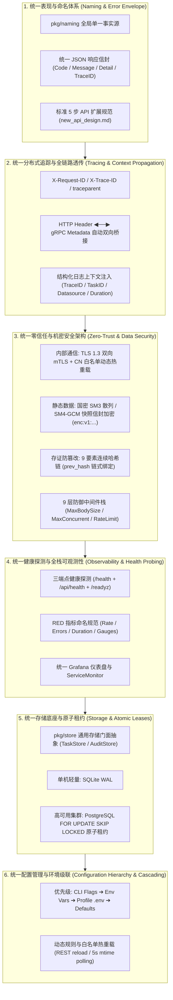
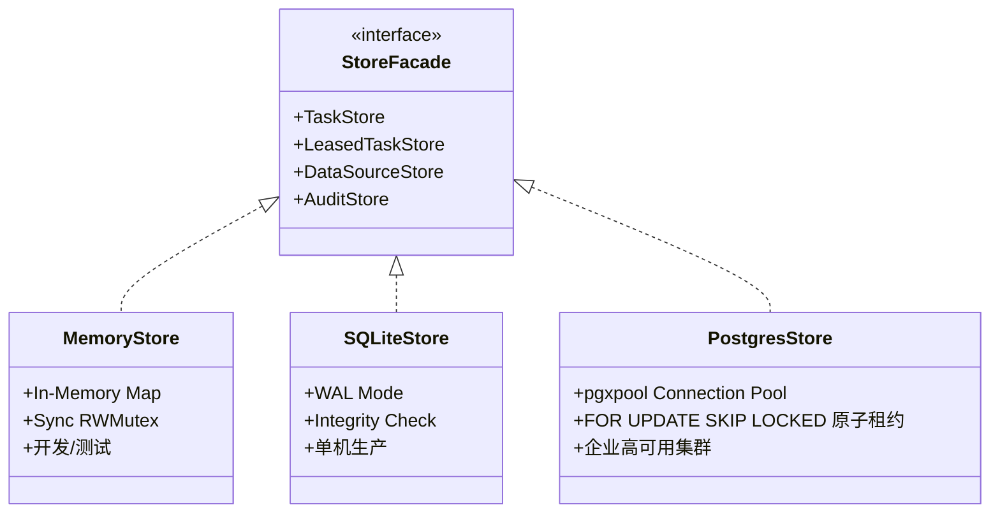

# PrivShield 全栈统一架构设计与跨层协同规范 (Unified Architecture Design Specifications)

> **版本**：v16.0.0  
> **适用范围**：PrivShield 核心隐私引擎（Go `engine-go` / `privacy-go-sdk`）、企业级中台微服务群（Go `service-hub` / `datasource-mgr` / `audit-log`）、控制台与 BFF 网关（`console/bff-go` / `console/app-lz` / `console/web`）及基础共享库（`pkg/`）。  
> **定位**：本文档沉淀 PrivShield 在分布式、高并发场景下的**跨层统一架构设计标准与协同规范**，消除不同服务之间的语义分歧与实现割裂。

---

## 目录

- [1. 总体设计规范全景 (Architecture Blueprint)](#1-总体设计规范全景-architecture-blueprint)
- [2. 统一错误码与 API 响应信封规范 (Unified Error Codes & API Envelope)](#2-统一错误码与-api-响应信封规范-unified-error-codes--api-envelope)
  - [2.1 REST API 统一响应信封](#21-rest-api-统一响应信封)
  - [2.2 全栈标准错误码对照表](#22-全栈标准错误码对照表)
  - [2.3 安全与防泄漏要求 (Fail-Closed & Sanitization)](#23-安全与防泄漏要求-fail-closed--sanitization)
- [3. 全链路分布式追踪与上下文透传规范 (Distributed Tracing & Context Propagation)](#3-全链路分布式追踪与上下文透传规范-distributed-tracing--context-propagation)
  - [3.1 追踪标识标准命名](#31-追踪标识标准命名)
  - [3.2 跨协议双向桥接机制](#32-跨协议双向桥接机制)
- [4. 统一零信任安全与机密数据防护架构 (Zero-Trust & Data Security)](#4-统一零信任安全与机密数据防护架构-zero-trust--data-security)
  - [4.1 9 层统一中间件防护栈 (pkg/middleware/)](#41-9-层统一中间件防护栈-pkgmiddleware)
  - [4.2 传输安全：gRPC 双向 mTLS 与 CN 白名单动态授权](#42-传输安全grpc-双向-mtls-与-cn-白名单动态授权)
  - [4.3 数据安全：快照样本 SM4-GCM 信封加密规范](#43-数据安全快照样本-sm4-gcm-信封加密规范)
  - [4.4 存证安全：9 要素区块链式防篡改哈希链](#44-存证安全9-要素区块链式防篡改哈希链)
- [5. 统一健康探测与可观测性标准 (Observability & Health Probing)](#5-统一健康探测与可观测性标准-observability--health-probing)
  - [5.1 双路径健康探测一致性规范](#51-双路径健康探测一致性规范)
  - [5.2 Prometheus 指标命名与 Label 规范 (RED 模式)](#52-prometheus-指标命名与-label-规范-red-模式)
- [6. 统一分层存储底座架构 (Tiered Storage Layer)](#6-统一分层存储底座架构-tiered-storage-layer)
  - [6.1 LeasedTaskStore 原子租约接口 (pkg/store/store.go)](#61-leasedtaskstore-原子租约接口-pkgstorestorego)
  - [6.2 部署选型与配置标准](#62-部署选型与配置标准)
- [7. 统一配置管理与环境级联覆盖机制 (Configuration Hierarchy)](#7-统一配置管理与环境级联覆盖机制-configuration-hierarchy)
  - [7.1 动态热重载规范 (Zero-Downtime Reload)](#71-动态热重载规范-zero-downtime-reload)
- [8. 统一架构决策与技术选型对齐表 (ADR Matrix)](#8-统一架构决策与技术选型对齐表-adr-matrix)
- [9. 开发者协作与演进指南](#9-开发者协作与演进指南)

---

## 1. 总体设计规范全景 (Architecture Blueprint)



### 1.1 服务入口与默认监听地址

| 服务 | 入口模块 | 默认 HTTP 地址 | 默认 gRPC 地址 | 说明 |
|---|---|---|---|---|
| Go PrivShield Agent | `engine-go/cmd/privshield-agent` | `0.0.0.0:8079` | `0.0.0.0:50051` | 核心隐私算力与动态分类双协议统一入口 |
| Go PrivShield Gateway | `engine-go/cmd/privshield-gateway` | `0.0.0.0:8000` | `0.0.0.0:50000` | L7 P2C-EWMA 反向代理网关与 BufferPool 缓存 |
| service-hub | `services/service-hub` | `127.0.0.1:8082` | `127.0.0.1:50052` | 数据服务调度中枢 |
| datasource-mgr | `services/datasource-mgr` | `127.0.0.1:8083` | `127.0.0.1:50053` | 数据源资产管理 |
| audit-log | `services/audit-log` | `127.0.0.1:8084` | `127.0.0.1:50054` | 审计存证服务 |
| bff-go / console | `console/bff-go` | `127.0.0.1:8081` | `127.0.0.1:50055`（可选） | 统一管理控制台 BFF 网关 |
| app-lz / bff-go | `console/app-lz/bff-go` | `127.0.0.1:8085` | — | 调度之眼业务 BFF（统一走 service-hub 编排） |

> 生产环境请通过对应的环境变量显式设置监听地址；默认回环地址仅用于本地开发。各服务具体的环境变量名见 [7. 统一配置管理](#7-统一配置管理与环境级联覆盖机制-configuration-hierarchy)。

---

## 2. 统一错误码与 API 响应信封规范 (Unified Error Codes & API Envelope)

为了让前端、BFF 网关与各微服务实现统一的错误拦截、国际化提示与重试判定，全栈统一采用以下响应信封与错误码结构。

### 2.1 REST API 统一响应信封

所有 REST 接口在成功或失败时，均遵循标准化 JSON 结构：

#### 成功响应信封 (Success Envelope)
```json
{
  "code": "OK",
  "message": "success",
  "data": { ... },
  "trace_id": "req-1787554500-abc12345",
  "timestamp": "2026-08-28T10:30:00.123Z"
}
```

#### 错误响应信封 (Error Envelope)
```json
{
  "code": "INVALID_DATASOURCE_ID",
  "message": "指定的业务数据源不存在或未激活",
  "detail": "datasource 'ds_unknown' is not registered in canonical naming",
  "trace_id": "req-1787554500-abc12345",
  "timestamp": "2026-08-28T10:30:00.123Z"
}
```

### 2.2 全栈标准错误码对照表

| 错误编码 (`code`) | HTTP 状态码 | gRPC 状态码 | 说明与处理建议 |
|---|---|---|---|
| `OK` | 200 OK | `OK` (0) | 请求成功处理 |
| `INVALID_ARGUMENT` | 400 Bad Request | `InvalidArgument` (3) | 参数校验失败（Pydantic / Go 校验器拦截） |
| `INVALID_DATASOURCE_ID` | 400 Bad Request | `InvalidArgument` (3) | 未知数据源标识（`pkg/naming` 拦截） |
| `UNAUTHORIZED` | 401 Unauthorized | `Unauthenticated` (16) | API Key 缺失或无效 / mTLS 证书校验失败 |
| `FORBIDDEN` | 403 Forbidden | `PermissionDenied` (7) | mTLS CN 白名单越权或不在授权 Scope 内 |
| `NOT_FOUND` | 404 Not Found | `NotFound` (5) | 目标资源（任务、数据源、审计日志）不存在 |
| `RESERVED_DATASOURCE` | 409 Conflict | `FailedPrecondition` (9) | 数据源条目已登记但尚未激活实现（写侧拒绝） |
| `PAYLOAD_TOO_LARGE` | 413 Payload Too Large | `InvalidArgument` (3) | 请求体超过 `MaxBodySize` 上限（默认 32MB / BFF 64MB） |
| `RATE_LIMITED` | 429 Too Many Requests | `ResourceExhausted` (8) | 触发 API 限流阈值，建议客户端指数退避重试 |
| `BUDGET_EXHAUSTED` | 429 Too Many Requests | `ResourceExhausted` (8) | 差分隐私 $\varepsilon$ 或 $\delta$ 预算耗尽，拒绝查询 |
| `INTERNAL_ERROR` | 500 Internal Server Error | `Internal` (13) | 服务内部不可预期异常（生产环境脱敏堆栈） |
| `MAX_CONCURRENT_EXCEEDED`| 503 Service Unavailable | `Unavailable` (14) | 当前微服务在途并发已达上限（默认 1000），保护进程 |
| `UPSTREAM_UNAVAILABLE` | 503 Service Unavailable | `Unavailable` (14) | 上游核心引擎或数据库不可达，已进入降级模式 |

### 2.3 安全与防泄漏要求 (Fail-Closed & Sanitization)
- **生产模式禁止外抛堆栈**：生产环境（`GIN_MODE=release` / `PRIVACY_LOG_LEVEL=INFO`）下，禁止在 HTTP 响应中直接输出完整的调用栈，详细 Trace 仅记录于服务端日志中；
- **未知数据源绝对 Fail-Closed**：遇到未在 `pkg/naming` 中登记的数据源，强制返回 `INVALID_DATASOURCE_ID`，禁止静默回退至默认数据源。

---

## 3. 全链路分布式追踪与上下文透传规范 (Distributed Tracing & Context Propagation)

在跨 Go Agent、Go 微服务群与 Web UI 的全链路调用中，必须保证**一次用户触发的所有日志、任务状态与审计快照具备相同的 Trace 标识**。

### 3.1 追踪标识标准命名
全栈统一使用以下 HTTP 请求头与 gRPC Metadata 字段：
- **`X-Request-ID`**：前端或客户端生成的唯一会话标识（格式：`req-{unix_timestamp}-{8位随机hex}`）；
- **`X-Trace-ID`**：与 `X-Request-ID` 保持同义并同步流转，服务端响应头双头下发；
- **`traceparent`**：遵循 W3C Trace Context 标准（`00-{trace_id}-{span_id}-{flags}`），支持无缝对接 OpenTelemetry。

### 3.2 跨协议双向桥接机制

```text
┌────────────────┐  HTTP: X-Request-ID  ┌────────────────┐  gRPC: x-request-id  ┌────────────────┐
│   前端 Web UI  │ ───────────────────▶ │   BFF / Hub    │ ───────────────────▶ │ Agent / Audit  │
│  (React/Axios) │                      │   (Go Gin)     │   (gRPC Metadata)    │ (Go gRPC)      │
└────────────────┘                      └────────────────┘                      └────────────────┘
        ▲                                       ▲                                       ▲
        └───────────────────────────────────────┴───────────────────────────────────────┘
                                统一注入结构化日志 (Structured Log Context)
```

1. **HTTP 中间件自动提取/注入**：
   - 入站请求若包含 `X-Request-ID`，写入上下文并透传；
   - 入站请求若缺失，中间件自动生成并回写到 HTTP 响应头 `X-Request-ID` 与 `X-Trace-ID`；
2. **gRPC 双向元数据转换**：
   - Go gRPC 客户端（`console/bff-go/internal/agent/client.go`）发起 gRPC 调用时，自动将上下文中的 trace ID 写入 gRPC `metadata.AppendToOutgoingContext(ctx, "x-request-id", traceID, "x-trace-id", traceID)`；
   - Go HTTP 客户端（`pkg/agent/client.go`）发起 HTTP 调用时，自动注入 `X-Request-ID` + `X-Trace-ID` 双头；
   - Go gRPC Servicer（`engine-go/internal/grpcserver/server.go`）自动从 gRPC metadata 中提取并在日志中绑定；
3. **结构化日志标准输出字段**：
   ```json
   {
     "level": "INFO",
     "time": "2026-08-28T10:30:00.123Z",
     "logger": "service-hub.scheduler",
     "trace_id": "req-1787554500-abc12345",
     "task_id": "task-1787554500-f9a8b7c6",
     "datasource_id": "ds_yibao",
     "operation": "mask",
     "duration_ms": 2.45,
     "message": "Task completed successfully"
   }
   ```

---

## 4. 统一零信任安全与机密数据防护架构 (Zero-Trust & Data Security)

系统采用 **“边界外层防护、内部全链路 mTLS、数据落地信封加密、存证区块链化”** 的立体安全纵深防御体系。

### 4.1 9 层统一中间件防护栈 (`pkg/middleware/`)

Go 微服务全量装配以下 9 层中间件栈，执行顺序严格一致：

```text
TraceMiddleware ➔ StructuredLogger ➔ Recovery ➔ SecurityHeaders ➔ MaxBodySize ➔ MaxConcurrent ➔ RateLimit ➔ CORS ➔ Auth
```

| 中间件 | 职责与保护目标 | 默认配置与行为 |
|---|---|---|
| `TraceMiddleware` | 分布式追踪注入与双头下发 | 自动提取或生成 UUID，响应头下发 `X-Request-ID` + `X-Trace-ID` |
| `StructuredLogger` | 结构化日志记录 | 打印请求方法、路径、状态码、延迟与 trace_id |
| `Recovery` | 全局 Panic 拦截恢复 | 捕获未处理 panic 并输出 500 统一错误信封 |
| `SecurityHeaders` | 浏览器安全响应头 | 强制注入 CSP、HSTS、X-Frame-Options、X-Content-Type-Options |
| `MaxBodySize` | 限制请求体上限 | 核心微服务 32 MiB / BFF 64 MiB，超限返回 413 信封 |
| `MaxConcurrent` | 限制在途并发数 | 默认 1000 并发，超限返回 503 信封，保护协程池 |
| `RateLimit` | 基于 IP 的令牌桶限流 | 默认 100 RPS / 200 Burst，超限返回 429 信封 |
| `CORS` | 跨域资源共享白名单 | 严格配置允许源 |
| `Auth` | API Key 鉴权校验 | 校验 `X-API-Key` 标头，配置为空时跳过 |

### 4.2 传输安全：gRPC 双向 mTLS 与 CN 白名单动态授权

1. **强密码学通信**：微服务间跨机通信强制启用 TLS 1.3，禁用非安全老旧密码套件；
2. **证书 CN 授权与热重载 (`config/mtls-whitelist.yaml`)**：
   - Go 端通过 `pkg/tlsutil/grpc_interceptor.go` 与 `pkg/tlsutil/whitelist.go` 提供的 `NewWhitelistInterceptor()` 构造 unary/stream 拦截器；当 `PRIVACY_AUTH_MTLS_WHITELIST_FILE` 指向 `config/mtls-whitelist.yaml` 时，`engine-go`、`service-hub`、`datasource-mgr`、`audit-log`、`bff-go` 的 gRPC 服务端均自动注册该拦截器；
   - 服务端提取客户端证书的 `Common Name (CN)`，根据白名单配置匹配客户端角色与允许调用的 RPC 方法（Scopes，如 `["*"]` 或 `["privacy:mask"]`）；
   - Go 端支持通过文件 mtime 轮询（5 秒间隔）监听白名单文件，**动态热更新授权无需重启服务**；
   - 兼容 `PRIVACY_AUTH_MTLS_ALLOWED_CNS` 静态列表作为降级。

### 4.3 数据安全：快照样本 SM4-GCM 信封加密规范

对于在 `audit-log`、任务暂存库或冷存储中持久化的原始/脱敏数据样本（`input_sample` / `output_sample`），统一采用**信封加密 (Envelope Encryption)**：

```text
密文字符串格式规范：
enc:v1:<Base64( 12 字节随机 Nonce + SM4-GCM 密文 + 16 字节 Auth Tag )>
```

- **加密标识与透明回退**：`crypto.IsEncrypted(s)` 通过 `enc:v1:` 前缀识别。若遇到历史未加密明文，自动透明回退读取，保证升级兼容；
- **密钥派生与隔离**：基于环境变量 `AUDIT_LOG_ENCRYPTION_KEY`（或别名 `PRIVACY_AUDIT_KEY`）派生固定 128 位（16 字节）SM4 主密钥，每次加密使用 `crypto/rand` 生成独一无二的 12 字节 Nonce。

### 4.4 存证安全：9 要素区块链式防篡改哈希链

为了保证存证记录在物理介质上的不可篡改性与全链验真能力，`audit-log` 采用连续哈希链绑定：

$$\text{Data} = \text{prev\_hash} \parallel \text{id} \parallel \text{task\_id} \parallel \text{api\_code} \parallel \text{datasource\_id} \parallel \text{timestamp} \parallel \text{input\_hash} \parallel \text{output\_hash} \parallel \text{algorithm}$$
$$\text{IntegrityHash} = \text{SHA256}(\text{Data})$$

- 创世区块的 `prev_hash` 为 `"0000000000000000000000000000000000000000000000000000000000000000"`；
- 后续每一条存证的 `prev_hash` 严格等于前一条记录的 `integrity_hash`；
- 通过 `POST /api/audit/chain/verify` 可在 $O(N)$ 复杂度内快速检测出任何历史篡改、行删除或断链异常。

---

## 5. 统一健康探测与可观测性标准 (Observability & Health Probing)

### 5.1 双路径健康探测一致性规范

所有后端服务（FastAPI 与 Gin）必须统一注册以下三个标准端点：

| 端点路径 | HTTP 动作 | 用途与判定逻辑 |
|---|---|---|
| **`/health`** | `GET` | **容器级存活探针 (Liveness Probe)**：进程启动且事件循环正常即返回 `200 OK` |
| **`/api/health`** | `GET` | **API 网关/BFF 业务探针**：逻辑与 `/health` 相同，专用于前端路由代理与 API 网关转发 |
| **`/readyz`** | `GET` | **就绪探针 (Readiness Probe)**：深度检查核心依赖（数据库连接池、引擎配置解析器、磁盘可写性），未就绪返回 `503` 自动从 Service 摘流 |

### 5.2 Prometheus 指标命名与 Label 规范 (RED 模式)

所有微服务统一遵循 Prometheus 官方命名规范：

```text
<命名空间>_<子系统>_<指标名称>_<单位>
```

#### 核心指标清单
1. **请求速率与计数 (Rate)**：
   - `privacy_requests_total{method="POST", path="/v1/privacy/mask", status="200"}`
   - `http_requests_total{service="service-hub", method="POST", path="/api/hub/dispatch", status="200"}`
2. **请求延迟分布 (Duration)**：
   - `privacy_request_duration_seconds{method="POST", path="/v1/dynclassification/eval"}`
   - `http_request_duration_seconds{method="POST", path="/api/audit/logs"}`
3. **并发、租约与资源状态 (Gauges)**：
   - `task_lease_conflicts_total`：Service Hub 租约争抢冲突计数
   - `task_lease_expired_total`：Service Hub 超期失效的租约计数
   - `circuit_breaker_state{node="..."}`：Agent 客户端与网关熔断器状态
   - `privacy_budget_remaining{namespace="...", budget_type="epsilon"}`：差分隐私预算剩余量

---

## 6. 统一分层存储底座架构 (Tiered Storage Layer)

底层存储统一采用门面模式（Facade Pattern）进行抽象封装：



### 6.1 `LeasedTaskStore` 原子租约接口 (`pkg/store/store.go`)
- **`ClaimNext(owner, leaseTTL)`**：基于 PostgreSQL `FOR UPDATE SKIP LOCKED` 原子抢占一条待处理任务并分配租约令牌；无可用任务时返回 `(nil, nil)`，使用 `errors.Is(err, pgx.ErrNoRows)` 判定而非字符串比对；
- **`RenewLease(id, owner, token, leaseTTL)`**：持有者在任务处理中延长租约有效期；
- **`CompleteLease(id, owner, token, result)`**：带所有权校验的状态完成落盘；
- **`FailLease(id, owner, token, failure)`**：带重试计数与退避时间的故障处理；
- **`RequeueExpiredLeases(limit)`**：自动回收超期未完成的孤儿任务。

### 6.2 部署选型与配置标准

| 运行环境 / 场景 | 推荐存储引擎 | 配置方式 | 架构优势 |
|---|---|---|---|
| **本地开发 / 单元测试** | `memory` | 默认（不配 DSN） | 内存常驻，零外部依赖，毫秒级快速启动 |
| **单机生产 / 边缘轻量节点** | `sqlite` | 指定本地文件路径<br/>`SERVICE_HUB_DB_PATH` | 单文件部署、自动开启 WAL 模式、支持热备份 |
| **企业级多副本高并发集群** | `postgres` | 指定数据库连接串<br/>`SERVICE_HUB_PG_DSN`<br/>`AUDIT_LOG_PG_DSN` | • `FOR UPDATE SKIP LOCKED` 原子租约争抢无死锁<br/>• `pgx.Batch` 高吞吐批量存证落盘<br/>• 消除脑裂与重复执行 |

---

## 7. 统一配置管理与环境级联覆盖机制 (Configuration Hierarchy)

全栈所有微服务遵循严格的**多层级配置覆盖优先级阶梯**。环境变量按服务隔离，各服务拥有独立前缀：

- `SERVICE_HUB_*`：数据服务调度中枢
- `DATASOURCE_MGR_*`：数据源资产管理
- `AUDIT_LOG_*`：审计存证服务
- `PRIVACY_CONSOLE_*` / `CONSOLE_*`：BFF 控制台

跨服务共享与安全中间件采用**「机制与策略分离」**设计模式（`pkg/middleware`、`pkg/crypto`）：
- 公共中台包支持显式传入服务专属环境变量（如 `GATEWAY_ALLOWED_CIDRS`、`AGENT_ALLOWED_CIDRS`、`GATEWAY_TRUSTED_PROXIES`）；
- 未指定或未配置专属变量时，安全平滑回退至全局 `PRIVACY_*`，兼顾各服务网络安全隔离与老旧编排兼容性；
- 全局共享配置示例：
  - `PRIVACY_AUTH_MTLS_WHITELIST_FILE`：所有 Go gRPC 服务端共享的 mTLS CN 白名单文件
  - `PRIVACY_AGENT_*`：上游 Go Agent 连接参数（`PRIVACY_AGENT_REST_HOST`、`PRIVACY_AGENT_API_KEY` 等）
  - `PRIVACY_REST_PORT` / `PRIVACY_GRPC_PORT`：Go Agent 监听端口

```text
┌─────────────────────────────────────────────────────────────────────────────┐
│ 优先级 1: 命令行参数 (CLI Flags，如 --port / --host / --mtls)                 │
│    ▲                                                                        │
│ 优先级 2: 操作系统/容器环境变量 (OS Environment Variables，如 PRIVACY_XXX)    │
│    ▲                                                                        │
│ 优先级 3: YAML 业务配置文件 (config/privacy-profile.yaml / rules/*.yaml)     │
│    ▲                                                                        │
│ 优先级 4: 代码内置缺省默认值 (Default Fallbacks)                             │
│    └────────────────────────────────────────────────────────────────────────┘
```

### 7.1 动态热重载规范 (Zero-Downtime Reload)
以下配置项支持在**不重启微服务进程**的情况下动态重载生效：
1. **动态分类分级规则库 (`rules/domains/*.yaml`、`rules/taxonomies/*.yaml`)**：由 `engine-go/internal/dynclassification/funnel.go` 实现三层漏斗（规则 → 可选 Small-NER → 可选外部 LLM 仲裁）；调用 `POST /v1/dynclassification/profiles/reload` 或 `/ops/reload` 触发引擎无锁重载；
2. **医疗流水线字段规格矩阵与别名字典 (`rules/domains/medical.yaml`)**：支持声明式配置 `field_specs`（脱敏算子/分箱步长/差分隐私上下界）与 `aliases`（上游更名字段映射），通过 5s mtime 检测或 reload 端点自动动态装配至统一 `medicalPipeline`，无需修改代码；
3. **mTLS CN 访问控制白名单 (`config/mtls-whitelist.yaml`)**：Go 端 `pkg/tlsutil/whitelist.go` 与 `engine-go/internal/security/whitelist.go` 内置文件 mtime 轮询监听器（5 秒间隔）在文件变更时自动热更新内存白名单；
4. **数据源定义与别名注册 (`pkg/naming`)**：作为静态事实源编译固化，保证分布式集群间的一致性。

---

## 8. 统一架构决策与技术选型对齐表 (ADR Matrix)

| 架构决策维度 | 选定方案 | 核心选型理由 |
|---|---|---|
| **跨服务命名治理** | `pkg/naming` 单一事实源注册表 | 杜绝语义漂移与拼写错误，实现编译期静态检查与入站自动归一化 |
| **存证数据防篡改** | 9 要素区块链式哈希链 + 链式验真 | 保证存证前后强关联，杜绝删行、篡改与重放，无需昂贵的外部硬件即可实现审计抗抵赖 |
| **机密数据保护** | SM4-GCM 信封加密 (`enc:v1:`) | 针对敏感字段按需加密，密文自带 Nonce 与 Auth Tag，具备版本前缀透明兼容回退能力 |
| **多副本分布式租约** | PostgreSQL `FOR UPDATE SKIP LOCKED` | 利用成熟 RDBMS 的行级锁实现原子任务争抢，免去第三方分布式锁运维与锁超时脑裂风险 |
| **大文件恒定内存处理** | `ProcessFileStream` 逐行解码分块脱敏 | 基于 `bufio` + `json.Decoder`/`csv.Reader` 单趟流水线与 `streamBatchSize` 分块，避免全量物化 4~6 倍内存峰值放大 |
| **匹配算子防泄漏** | `boundedRegexCache` 有界正则缓存 | 淘汰无界 `sync.Map`，设定 1024 槽位上限与半容量自适应驱逐，杜绝长运行态内存泄漏 |
| **医疗脱敏流水线** | 单一全域规格流水线 (`NewFullMedicalPipeline`) | 融合医保 19、康养 27、体征及民政扩展槽位，消除多实例冗余状态，支持声明式动态热装配 |
| **微服务通信协议** | gRPC (Protobuf) + REST (HTTP/JSON) 双协议 | 兼顾前端易用性与微服务间高性能二进制传输、强类型定义及双向流控 |

---

## 9. 开发者协作与演进指南

当您在 PrivShield 项目中进行代码开发或新增功能时，请遵循以下闭环流程：
1. **新增数据接口/API**：严格依照 [docs/architecture/new_api_design.md](new_api_design.md) 执行 5 步 SOP；
2. **新增配置项**：在 `internal/config/config.go` 中声明带有清晰默认值的结构体字段，并在环境变量表中补充；
3. **新增微服务调用**：统一通过 `pkg/` 共享基础库（`pkg/agent`、`pkg/naming`、`pkg/store`、`pkg/middleware`）进行标准化封装；
4. **提交前自检**：运行全栈测试套件 `go test -race -count=1 ./...` 与 `PYTHONPATH=. pytest tests -q`，确保 100% 绿色通过。
