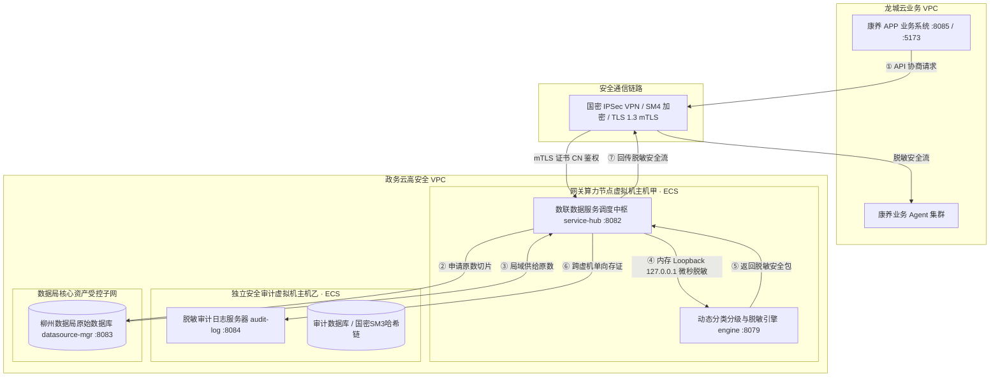
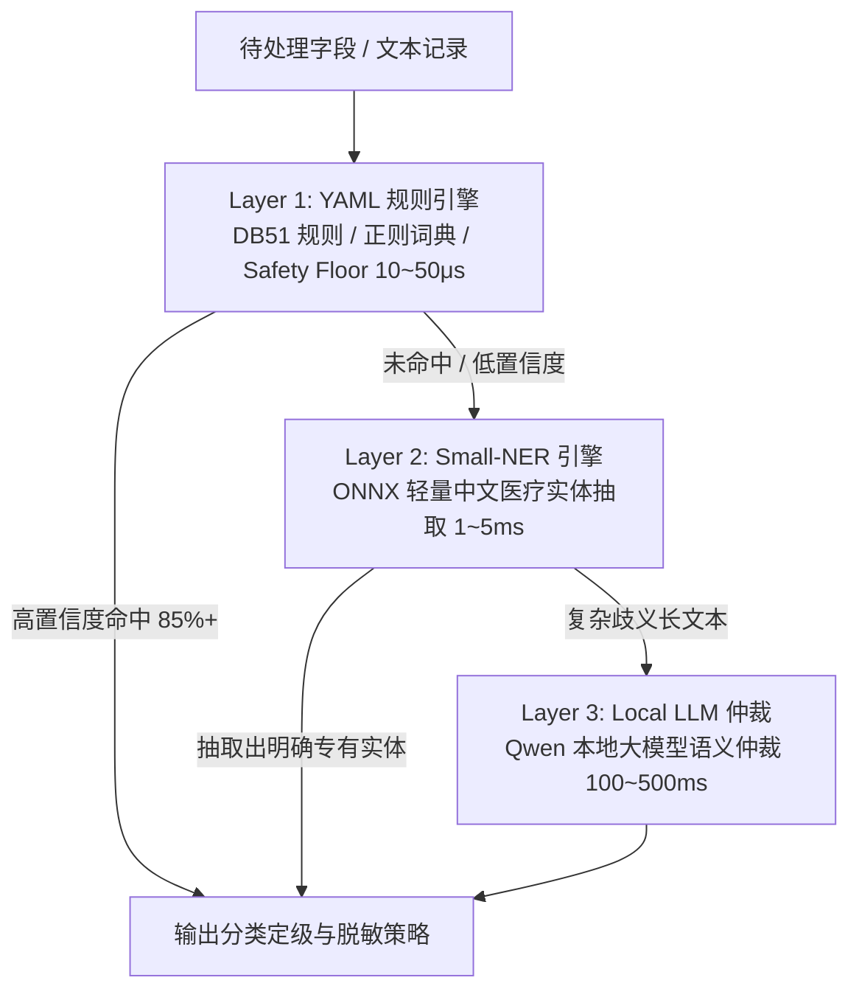

# 柳州市医疗健康数据分类分级与隐私脱敏算法标准规范
*(Liuzhou Medical & Health Data Classification and Privacy Redaction Algorithm Standard Specification)*

> **项目名称**：柳州市智慧康养与政务数据安全流通示范工程  
> **审查对象**：数联天下 · 数盾（`PrivShield`）数据安全治理网关与脱敏体系  
> **文档版本**：v2.0.0（2026 生产实装版）  
> **文档状态**：正式发布 / 柳州市政务云实施技术标准规范  
> **安全密级**：政务商用密码应用与数据安全合规保护级  
> **适用范围**：柳州市政务云环境下医疗健康数据（医保结算、康养体征、电子病历等）流通网关动态脱敏、数据库离线治理、大模型安全交互及独立存证审计  
> **发布日期**：2026-08-31  
> **设计基准与合规参考标准**：
> - **核心数据分级基准**：**DB51/T 2989—2023《四川省健康医疗大数据应用指南》**（五级分类分级核心基准与敏感病种治理规则）
> - **国家法律法规**：《中华人民共和国数据安全法》、《中华人民共和国个人信息保护法》、《中华人民共和国密码法》、《政务信息资源共享管理暂行办法》
> - **国家标准**：《GB/T 43697-2024 数据安全技术 数据分类分级规则》、《GB/T 35273-2020 信息安全技术 个人信息安全规范》、《GB/T 39786-2021 信息安全技术 信息系统密码应用基本要求》（第三级）
> - **行业与地方标准**：《JR/T 0197-2020 金融数据安全 数据安全分级指南》、《广东省健康医疗数据安全分类分级管理技术规范》/《广东省健康医疗大数据应用指南》

---

## 目录

- [前言](#前言)
- [引言](#引言)
- [一、标准概述与适用法规基线](#一标准概述与适用法规基线)
  - [1.1 规范背景与法规要求](#11-规范背景与法规要求)
  - [1.2 适用范围与实施原则](#12-适用范围与实施原则)
  - [1.3 规范性引用文件](#13-规范性引用文件)
  - [1.4 核心术语与定义](#14-核心术语与定义)
  - [1.5 「三层四柱五御六类」整体治理技术框架](#15-三层四柱五御六类整体治理技术框架)
- [二、四川省五级分级基准与 6 类敏感字段映射体系](#二四川省五级分级基准与-6-类敏感字段映射体系)
  - [2.1 DB51/T 2989—2023 五级定级核心基准](#21-db51t-29892023-五级定级核心基准)
  - [2.2 6 类敏感字段分类与治理推荐算法矩阵](#22-6-类敏感字段分类与治理推荐算法矩阵)
  - [2.3 敏感病种四柱特征强剥离与差异化治理策略](#23-敏感病种四柱特征强剥离与差异化治理策略)
  - [2.4 不满十四周岁未成年人信息保护专项](#24-不满十四周岁未成年人信息保护专项)
- [三、政务云网关与双模式治理架构实施规范](#三政务云网关与双模式治理架构实施规范)
  - [3.1 政务云独立虚拟机 (ECS) 与 VPC 隔离部署架构](#31-政务云独立虚拟机-ecs-与-vpc-隔离部署架构)
  - [3.2 数据库批量离线治理模式与网关流式脱敏模式比对](#32-数据库批量离线治理模式与网关流式脱敏模式比对)
  - [3.3 医疗分系统（HIS / EMR / LIS / PACS / 医保）实施要点](#33-医疗分系统his--emr--lis--pacs--医保实施要点)
- [四、角色三视图动态访问控制规范](#四角色三视图动态访问控制规范)
- [五、核心算法规则与临床文本脱敏规范](#五核心算法规则与临床文本脱敏规范)
  - [5.1 三层递进式动态分类分级漏斗 (3-Layer Funnel)](#51-三层递进式动态分类分级漏斗-3-layer-funnel)
  - [5.2 PII 国密去标识化与掩码规范](#52-pii-国密去标识化与掩码规范)
  - [5.3 临床自由文本八步句法重构规范](#53-临床自由文本八步句法重构规范)
  - [5.4 年龄分段 K-匿名泛化规则](#54-年龄分段-k-匿名泛化规则)
  - [5.5 差分隐私 (DP) 与数值加噪规范](#55-差分隐私-dp-与数值加噪规范)
  - [5.6 输出安全门禁与质量指标要求](#56-输出安全门禁与质量指标要求)
- [六、示范数据源（医保与康养）字段脱敏规约](#六示范数据源医保与康养字段脱敏规约)
  - [6.1 医保结算数据接口 (`ds_yibao` / `api1_yibao`，19 字段) 规约](#61-医保结算数据接口-ds_yibao--api1_yibao19-字段-规约)
  - [6.2 康养体征数据接口 (`ds_kangyang` / `api2_kangyang`，27 字段) 规约](#62-康养体征数据接口-ds_kangyang--api2_kangyang27-字段-规约)
- [七、综合脱敏案例库（代表性案例）](#七综合脱敏案例库代表性案例)
- [八、数据局独立安全审计与国密防篡改存证体系](#八数据局独立安全审计与国密防篡改存证体系)
  - [8.1 独立审计虚拟机与 VPC 安全组单向管控](#81-独立审计虚拟机与-vpc-安全组单向管控)
  - [8.2 9 要素国密 SM3 区块链式哈希链数学模型](#82-9-要素国密-sm3-区块链式哈希链数学模型)
  - [8.3 出域快照 SM4-GCM 信封加密落盘](#83-出域快照-sm4-gcm-信封加密落盘)
  - [8.4 秒级全量在线验真与合规溯源](#84-秒级全量在线验真与合规溯源)
- [九、合规管理与运维运行要求](#九合规管理与运维运行要求)
- [十、文档控制与修订历史](#十文档控制与修订历史)

---

## 前言

本文件参照 GB/T 1.1—2020《标准化工作导则 第1部分：标准化文件的结构和起草规则》起草。

本文件起草单位：深圳数联天下智能科技有限公司、柳州市大数据发展局。

本规范根据柳州市智慧康养与政务数据安全流通工程的实际技术架构（包括 `service-hub` 调度中枢、`engine` 动态脱敏引擎、`audit-log` 独立审计系统及 `app-lz` 业务系统）编写，旨在为政务医疗健康数据在安全可控、密评合规的前提下赋能民生健康服务提供统一的算法标准与操作规程。

---

## 引言

随着政务数据要素市场化配置改革的推进，推动柳州医疗医保、康养慢病等高价值民生数据赋能“龙城云 · 康养 APP”（包含膳食营养、慢病管理、运动康复、心理评测及康养业务 Agent 集群）成为重点任务。

医疗健康数据兼具**极高临床/健康服务价值**与**极高隐私敏感度**。一旦发生原始数据泄露或身份逆向关联，将对患者与市民造成严重的社会歧视、商业拒保或财产侵害。

本规范以 **DB51/T 2989—2023《四川省健康医疗大数据应用指南》** 的五级分类分级体系为**核心定级基准**，全面落地 **「三层四柱五御六类」** 数据安全与隐私治理体系，统一规范政务云虚拟机环境下的动态脱敏算法、敏感病种剥离策略、国密商用密码应用与链式防篡改存证要求，确保原始敏感高密数据**“资产属地留存、可用不可见、回传严脱敏、过程全存证”**。

---

## 一、标准概述与适用法规基线

### 1.1 规范背景与法规要求

根据《数据安全法》、《个人信息保护法》、《密码法》及国家卫健委等部门《医疗卫生机构数据安全和个人信息保护管理办法（试行）》（国卫规划发〔2026〕6号）：

1. **存储加密（TDE / 信封加密）**：高敏感数据落在磁盘时必须执行国密加密，审计快照采用 **SM4-GCM 信封加密**；
2. **访问脱敏（动态脱敏）**：业务调用、运维排障、大模型交互时动态执行脱敏，支持**角色三视图权限管控**；
3. **外发去标识（静态脱敏/差分隐私）**：跨域回传或对外共享时执行不可逆去标识化与差分加噪，防交叉比对与重识别攻击；
4. **商用密码应用（密评三级）**：传输层采用 SM2/TLS 1.3 mTLS 双向认证，存证层采用 SM3 哈希链，存储层采用 SM4-GCM。

### 1.2 适用范围与实施原则

**适用范围**：
* 柳州市政务云平台纳管的各类结构化数据（医保结算 `yibao.csv`、康养体征 `kangyang.csv`、医院电子病历 EMR、检验报告 LIS 等）；
* 包含主诉、病史、体征、处方等的临床自由文本；
* 网关单条流式实时脱敏与离线数据集批量脱敏。

**核心实施原则**：
1. **最小必要原则**：严格基于 API 契约协商授权字段，禁止放行非必要字段；
2. **同虚机闭环原则**：网关调度中枢与脱敏计算引擎同虚拟机部署，微秒级内存 IPC 流转，严禁未脱敏明文跨网络落地；
3. **计算与审计分离原则**：审计系统部署于独立审计虚拟机，配置独立 VPC 安全组，业务与运维侧无权篡改审计记录；
4. **Fail-Closed 零逃逸原则**：任何规则未命中、网络超时或系统异常，一律拒绝输出明文数据。

### 1.3 规范性引用文件

| 引用标准 / 法规 | 性质 | 在本规范中的应用要求 |
|---|---|---|
| **DB51/T 2989—2023《四川省健康医疗大数据应用指南》** | 地方标准 / 核心基准 | **医疗健康数据 L1~L5 五级分类分级唯一基准**，敏感病种展开与治理要求 |
| **GB/T 43697—2024《数据安全技术 数据分类分级规则》** | 国家标准 | 国家 1~5 级数据分类分级体系对齐，重要数据与核心数据认定 |
| **GB/T 35273—2020《信息安全技术 个人信息安全规范》** | 国家标准 | 个人信息去标识化、匿名化与最小必要原则 |
| **GB/T 39786—2021《信息系统密码应用基本要求》（第三级）** | 国家标准 | 国密 SM2 双向认证、SM3 完整性哈希链、SM4-GCM 对称加密落地 |
| **JR/T 0197—2020《金融数据安全 数据安全分级指南》** | 行业标准 | 医保与社保结算流水号、个人账户金额数据分级与遮蔽 |
| **《广东省健康医疗大数据应用指南》** | 地方规范 | 个人基本、健康状况、医疗服务、公共卫生四类数据脱敏补充规范 |

### 1.4 核心术语与定义

* **动态脱敏 (Dynamic Masking)**：原始数据库保持不变，在数据流经政务云网关时实时执行掩码、截断或泛化计算，按调用方角色返回安全脱敏视图。
* **四柱强剥离 (Four-Pillar Redaction)**：针对高敏感病种，全链条剥离 **①病因/诱因 ➔ ②现象/体征 ➔ ③诊断/检查 ➔ ④用药/处置** 四类关联特征，阻断反向推理（见 §2.3）。
* **彻底抹平 (Purge)**：对极高社会污名化风险病种（HIV、性病、重度精神病）及其关联特征执行整句/整块零痕迹擦除，禁止输出任何细分词汇。
* **范畴化泛化 (Categorical Generalization)**：将恶性肿瘤、肝炎等高敏病种重构为同器官/系统的低敏通用疾病大类，兼顾临床研究效用与隐私保护。
* **保留格式加密 (FPE)**：保持身份证、医保号完全一致的长度与数字格式的密文替换，支持精准等值匹配查询且不可逆推。
* **差分隐私 (Differential Privacy, DP)**：向体征统计数值注入受控拉普拉斯/高斯随机噪声，在数学上证明抗成员推断与重构攻击。

### 1.5 「三层四柱五御六类」整体治理技术框架

```text
┌────────────────────────────────────────────────────────────────────────────────────────┐
│              「三层四柱五御六类」医疗数据安全与隐私增强治理架构                        │
├───────────────────┬────────────────────────────────────────────────────────────────────┤
│ 三层 (3-Layer)    │ Layer 1: YAML 规则引擎 ➔ Layer 2: ONNX Small-NER ➔ Layer 3: 本地LLM│
│ 四柱 (4-Pillars)  │ 彻底剥离高敏病种的：①病因 ➔ ②体征 ➔ ③诊断/检查 ➔ ④用药/处置      │
│ 五御 (5-Defenses) │ ①御越权 (DB51 L1~L5) ➔ ②御泄露 (三视图) ➔ ③御推断 (DP) ➔          │
│                   │ ④御关联 (K-匿名) ➔ ⑤御追踪 (FPE + 国密SM3链式存证)               │
│ 六类 (6-Categories│ 1.身份标识 ｜ 2.联系方式 ｜ 3.诊疗信息 ｜ 4.检验检查 ｜ 5.财务 ｜ 6.生物特征 │
└───────────────────┴────────────────────────────────────────────────────────────────────┘
```

---

## 二、四川省五级分级基准与 6 类敏感字段映射体系

### 2.1 DB51/T 2989—2023 五级定级核心基准

本规范以 **DB51/T 2989—2023《四川省健康医疗大数据应用指南》** 表 2 的五级分类分级体系为**唯一分级基准**：

| 平台级别 | DB51 级别名称 | 基准定义与健康医疗应用场景 | 《GB/T 43697》对齐 | 典型字段示例 |
|:---:|:---|---|:---:|---|
| **L1** | **公开数据** | 低敏感度或经脱敏的数据，公开可访问 | 1级 (一般数据) | 医疗机构公开编码、行政区划、性别、统计汇总值 |
| **L2** | **内部数据** | 医疗机构内部运营生产数据、常规准标识符 | 2级 (内部/重要数据) | 就诊科室、住院病区、普通结算流水、常规体征（身高/体重） |
| **L3** | **敏感数据** | 个人标识与身份 PII、联系方式、金融账户 | 3级 (敏感数据) | 患者姓名、身份证号、手机号、医保卡号、住址、结算金额 |
| **L4** | **高敏感数据** | 敏感病种与专科诊疗数据、特殊身份标识 | 4级 (高敏数据) | 恶性肿瘤、肝炎、严重器官损害、重度精神病、性病、残疾证号 |
| **L5** | **极敏感数据** | 基因与人类遗传资源、不可逆生物特征 | 5级 (极敏/核心数据) | 全基因组测序、DNA/RNA 图谱、家族系谱遗传病史、指纹/虹膜 |

### 2.2 6 类敏感字段分类与治理推荐算法矩阵

| 字段大类 | 典型字段 | DB51 归属级别 | 主要泄露风险 | 静态脱敏算法 (离线外发) | 动态脱敏算法 (网关实时) | 禁用算法 |
|---|---|:---:|---|---|---|---|
| **1. 身份标识** | 姓名、身份证号、医保号、病历号 | **L3** (与高敏组合按L4) | 直接定位自然人 | 国密 HMAC-SM3 / FPE 散列 | 姓氏保留名字掩码 / 身份证前后保留中段掩码 | 直接删除 (破坏关联与检索) |
| **2. 联系方式** | 手机号、住址、紧急联系人、邮箱 | **L3** | 精准电信诈骗与骚扰 | 文本截断（保留省市）+ 假值替换 | 手机号保留前3后4，中间掩码 | FPE (格式无检索意义) |
| **3. 诊疗信息** | 诊断名称、手术记录、用药方案 | **L4** (高敏) / **L2** (常规) | 社会歧视、拒保与敲诈 | **四柱强剥离 + 句法重构 + 列洗牌** | 角色分级三视图显示 / 专有名词泛化 | 全量掩码 (医生无法看病) |
| **4. 检验检查** | 实验室检验、HIV、精神类特异指标 | **L4** (指标) / **L5** (基因) | 严重污名化、社会排斥 | **区间化 + 彻底抹平 (Purge)** | 二次授权 + 特异性遮盖 | 裸哈希 (无法做科研统计) |
| **5. 财务信息** | 医保个人账户、自费金额、结算流水 | **L3** (金融账户) | 经济欺诈、财产受损 | 假值替换 + 数值区间化 | 中段遮蔽 (如 `SET-2026-****-88`) | 列洗牌 (导致账目对应错乱) |
| **6. 生物特征** | 指纹、人脸模板、基因测序序列 | **L5** (基因与生物特征) | 终身不可逆侵害 | **严禁外发导出 (Purge/Reject)** | **禁止未经二次授权访问** | 任何可逆解密算法 |

### 2.3 敏感病种四柱特征强剥离与差异化治理策略

#### 1. 四柱高敏特征强剥离矩阵 (4-Pillar Matrix)
对 DB51 第 4 级与第 5 级涉及的高敏感疾病，必须在流通前全链条剥离四柱特征：

| 柱序 | 特征类型 | 典型内容 | 治理要求 |
|---|---|---|---|
| **第一柱** | 病因/诱因 | 不洁性接触史、高危接触史、家族遗传突变 | 识别后整句擦除 |
| **第二柱** | 现象/体征 | 外阴赘生物、无痛性硬下疳、命令性幻听、舞蹈样动作 | 识别后定点清除 |
| **第三柱** | 诊断/检查 | 醋酸白试验阳性、TPPA/RPR 阳性、CD4 计数、病毒载量 | 剥离具体指标与结论 |
| **第四柱** | 用药/处置 | 特异性抗病毒/抗精神病药物、激光灼除术、抗逆转录方案 | 阻断用药反推病种 |

#### 2. 敏感病种差异化治理策略
分级与治理策略解耦管理，严格遵循以下策略路由：

| 范畴编号 | 敏感病种范畴 | ICD-10 敏感区间 | DB51 定级 | 脱敏治理策略 | 治理动作说明 |
|---|---|---|:---:|---|---|
| **L4-STD** | 性传播疾病 (STD) | A50–A64 | L4 | **彻底抹平 (Purge)** | 零痕迹擦除，严禁任何形式泛化输出 |
| **L4-AIDS** | 艾滋病 / HIV 感染 | B20–B24 | L4 | **彻底抹平 (Purge)** | 病名、CD4 指标、抗逆转录药物全量清除 |
| **L4-PSY** | 重型精神障碍 | F20–F29 | L4 | **彻底抹平 (Purge)** | 精神分裂症/双相障碍等整句擦除 |
| **L4-TUMOR**| 恶性肿瘤 (Neoplasm) | C00–D49 | L4 | **范畴化泛化 (Generalize)** | 泛化为上位概念（如“消化系统相关疾病”） |
| **L4-HEP** | 病毒性肝炎 | B15–B19 | L4 | **范畴化泛化 (Generalize)** | 泛化为“肝脏系统疾病” |
| **L4-ORGAN**| 严重器官衰竭 | I21–I22, J44, N18–N19 | L4 | **范畴化泛化 (Generalize)** | 泛化为“心血管/呼吸/肾脏慢性疾病” |
| **L5-GENE** | 基因与遗传数据 | 全部基因序列/遗传系谱 | L5 | **彻底抹平 / 严禁外发** | 绝不出域，直接拦截或清除 |

### 2.4 不满十四周岁未成年人信息保护专项

1. 不满十四周岁未成年人的个人信息属于高敏感个人信息（《个人信息保护法》第三十一条），在 DB51 体系下按不低于 **L3** 处理；
2. 涉及未成年人敏感病种或心理评测数据的，按不低于 **L4** 处理并默认执行**彻底抹平**策略；
3. 未成年人数据出域调用必须在网关层执行更严格的 K-匿名与监护人授权审计校验。

---

## 三、政务云网关与双模式治理架构实施规范

### 3.1 政务云独立虚拟机 (ECS) 与 VPC 隔离部署架构

系统在柳州政务云上采用**多虚拟机与虚拟专有云 (VPC) 子网逻辑强隔离**设计：



* **主机甲（算力节点 · ECS）**：`service-hub` 与 `engine` 共同部署在同一虚拟机内，通过内存级 IPC（`127.0.0.1` 环回链路）通信，单条记录脱敏延迟仅 **10~50μs**，消除未脱敏数据在虚拟网络中的传输抓包风险；
* **主机乙（独立审计节点 · ECS）**：`audit-log` 部署在独立审计虚拟机，配置独立 VPC 安全组单向入站只写策略，业务虚机与网关无权限修改或删除审计日志；
* **核心资产区**：数据局核心原始数据库部署于受控专用 VPC 子网，禁止外网直连，仅响应主机甲的鉴权原数请求。

### 3.2 数据库批量离线治理模式与网关流式脱敏模式比对

| 脱敏与隐私技术 | 数据库批量离线治理模式 (Database Batch Mode) | 网关实时流式脱敏模式 (Single-Stream Gateway Mode) | 算法价值与业务说明 |
|---|---|---|---|
| **保留格式加密 (FPE)** | **数据库级 FPE**：保持身份证/卡号完全一致的长度与数字形态。 | **动态 FPE 映射**：根据字段类型即时生成假值数字串。 | **支持精准相等匹配查询 (Exact Match)**，密文不可逆推。 |
| **K-匿名 (K-Anonymity)** | **全局多维 Mondrian 分割算法**：按中位数递归切分 QI 维度，保证 $K \ge 5$。 | **自适应分段层次树**：依据领域分段树（如 $<60$ 岁 3 岁区间）即时泛化。 | 批处理求解全局最优，流式保障微秒级响应。 |
| **日期偏移 (Date Offset)** | **患者级统一随机偏移 (Random Date Offset)**：整表中同一患者的所有日期偏移 $N$ 天。 | **流式日期截断 (Date Truncation)**：精准日期转换为年月（如 `1985-01`）。 | 抹去绝对时间防交叉比对，100% 保留时间差与间隔。 |
| **列洗牌 (Column Shuffle)** | **科研列洗牌算子 (Column Shuffle)**：打乱诊断码与科室列对应关系。 | **句法范畴化泛化 (Categorical Generalization)**：重构为通用大类病种。 | 保持列级统计分布（均值、方差）不变。 |

### 3.3 医疗分系统（HIS / EMR / LIS / PACS / 医保）实施要点

1. **HIS 系统（挂号/缴费）**：必须使用 **FPE 保留格式加密**，严禁直接使用掩码破坏身份证精准匹配与患者挂号检索；
2. **EMR 电子病历**：主诉与诊断自由文本执行**八步句法重构**（§5.3）与四柱特征强剥离；
3. **LIS 检验系统**：HIV、精神类特异指标及基因检测执行**二次授权访问控制**与数值区间化；
4. **PACS 医学影像**：批量清洗 **DICOM Tag Header 元数据**，对图像像素嵌有的化验单文字定位文本框执行高斯模糊马赛克；
5. **医保结算与康养平台**：严格执行本规范第六章所定义的字段脱敏规约。

---

## 四、角色三视图动态访问控制规范

在动态脱敏网关场景中，数据库原始数据保持不变，系统根据访问者角色实时呈现差异化安全视图：

| 访问角色 | 授权视图档位 | 视图呈现内容 | 适用业务场景 |
|---|---|---|---|
| **主治医师 / 经办人员** | **明文视图 (View 1)** | 完整姓名、证件号、临床诊疗全文明文 | 临床诊疗与医保实名经办必需（必须留全量审计） |
| **实习医师 / 护理人员** | **部分脱敏视图 (View 2)** | 姓名掩码（`张*`）、证件号保留前3后4、高敏病史脱敏 | 临床教学、日常护理与辅助诊疗 |
| **运维人员 / 开发人员** | **完全脱敏视图 (View 3)** | 身份标识呈 FPE 密文串、高敏病种全掩码 | 数据库查库排障与系统联调，严禁接触明文 |
| **科研分析 / 外部大模型** | **去标识化视图 (View 4)** | FPE + 日期偏移 + 列洗牌 + K-匿名 + 敏感病种抹平/泛化 | 龙城云康养 Agent 交互与公有云大模型安全推理 |

---

## 五、核心算法规则与临床文本脱敏规范

### 5.1 三层递进式动态分类分级漏斗 (3-Layer Funnel)

针对政务医疗数据语义复杂的特点，系统在 `engine/dynclassification` 实现了三层递进智能识别漏斗：



* **Layer 1 (YAML 规则层 + Safety Floor 兜底)**：解析 `rules/domains/medical.yaml` 规则，采用高性能正则与词典匹配，结合 **Safety Floor** 机制对身份证、手机号等强制保底定级（L3/L4），覆盖 85% 以上常规字段；
* **Layer 2 (Small-NER 实体抽取层)**：基于轻量化 ONNX 模型抽取姓名、机构、地名、疾病实体，跳过纯数字与英文；
* **Layer 3 (本地大模型仲裁层)**：仅当规则与实体冲突时触发本地量化大模型仲裁，内存低于 512MB 时自动降级并标记人工审核。

### 5.2 PII 国密去标识化与掩码规范

| 类别 | 默认脱敏规则 | 原始数据示例 | 脱敏后效果 |
|---|---|---|---|
| **真实姓名** | 二字保留首字；三字及以上保留首末字；复姓保留复姓 | `张三` / `李四明` / `诸葛孔明` | `张*` / `李*明` / `诸葛**` |
| **身份证号** | 前 6 后 4 保留，中间 8 位掩码 | `450202199001011234` | `450202********1234` |
| **联系电话** | 手机号保留前 3 后 4；座机保留区号与后 2 位 | `13812345678` / `0772-2812345` | `138****5678` / `0772-****45` |
| **详细住址** | 泛化保留至省/市级，擦除区县以下门牌详细地址 | `广西柳州市城中区友谊路1号` | `广西柳州市` |
| **人员标识** | **国密 HMAC-SM3** 散列化 + 截断保留业务前缀 | `PID10023456` | `P9A8***F6` |
| **流水账号** | 业务前缀保留，中段流水号掩码 | `SET-2026-0831-8899` | `SET-2026-****-88` |

### 5.3 临床自由文本八步句法重构规范

为防止范畴擦除提前切除敏感病名导致死因动词悬空，文本脱敏严格执行**句法优先**的八步编排顺序：
1. **死因短语整体重构**：捕获死因表达，重构为自然汉语；
2. **死因/患病年龄 K-匿名**：剥离病名同时对年龄施加 §5.4 分段泛化；
3. **特异性用药与处置擦除**：绑定前缀与后缀整句擦除抗病毒/抗精神病治疗方案；
4. **就诊机构与独立诊断擦除**：专科机构与独立诊断短语整句消除；
5. **特征体征与现象擦除**：定点擦除四柱第二柱体征描述；
6. **综合句法擦除与范畴化泛化**：可泛化病种按 §2.3 映射重构，禁止泛化病种整句抹平；
7. **裸词与既往史擦除**：清除残留独立病名裸词与既往病史片段；
8. **语法自愈与残渣清理**：消除空括号、死标点、孤立动词/介词，保障汉语流畅自然。

### 5.4 年龄分段 K-匿名泛化规则

| 人群年龄区间 | 泛化步长 | 泛化计算公式 | 规则设计理由 |
|---|---|---|---|
| **$< 60$ 岁** | 3 岁区间 | $\text{age}_{\text{anon}} = \text{age} - (\text{age} \bmod 3)$ | 年龄精细度对健康影响较平缓，宽区间提供更强抗重识别保护 |
| **$\ge 60$ 岁** | 2 岁区间 | $\text{age}_{\text{anon}} = \text{age} - (\text{age} \bmod 2)$ | 老年慢病与康养场景中年龄为核心指标，较窄区间兼顾医学价值 |

### 5.5 差分隐私 (DP) 与数值加噪规范

针对身高、体重、血压、血糖等体征数值，系统采用拉普拉斯差分隐私加噪机制：

$$f(x) = x + \text{Lap}\left(\frac{\Delta f}{\varepsilon}\right)$$

* 隐私预算默认配置：$\varepsilon = 1.0$；
* 示例：身高 `172.4 cm` 注入微量噪声泛化为 `170~175 cm` 区间，有效防止通过多源体检数据交叉比对锁定个人。

### 5.6 输出安全门禁与质量指标要求

* **三级输出安全门禁**：
  1. 一级门禁：原文高敏词正则反扫，命中强制删除；
  2. 二级门禁：全角/半角、大小写归一化后反扫（如捕获 `ＨＩＶ` 等变体）；
  3. 三级门禁：消除字符间零宽空格/特殊干扰符后反扫，Fail-Closed 占位替换。
* **脱敏质量关键指标**：
  * 敏感信息召回率（Recall）$\ge 99.5\%$；
  * 治理精确率（Precision）$\ge 95.0\%$；
  * 语法自然完整率 $\ge 99.0\%$；
  * 性能处理延迟 P99 $\le 50\text{ms}$。

---

## 六、示范数据源（医保与康养）字段脱敏规约

### 6.1 医保结算数据接口 (`ds_yibao` / `api1_yibao`，19 字段) 规约

| 序号 | 字段 Key (`yibao.csv`) | 字段中文业务名称 | DB51 定级 | 推荐脱敏算法 | 脱敏效果示例 |
|:---:|---|---|:---:|---|---|
| 1 | `insurance_settlement_id` | 医保结算流水号 | **L2** | 中段掩码 | `SET-2026-****-88` |
| 2 | `person_id` | 个人参保标识 | **L4** | 国密 HMAC-SM3 散列 + 截断 | `P9A8***F6` |
| 3 | `gender` | 性别 | **L1** | 原样保留 | `男` / `女` |
| 4 | `birth_date` | 出生日期 | **L2** | 年份保留/月日泛化 | `1985-**-**` |
| 5 | `hospital_code` | 医疗机构编码 | **L2** | 结构保留/局部掩码 | `H4502***01` |
| 6 | `admission_date` | 入院日期 | **L2** | 截断为年月 / 随机天数偏移 | `2026-03` |
| 7 | `discharge_date` | 出院日期 | **L2** | 截断为年月 / 同步天数偏移 | `2026-03` (保持住院时长) |
| 8 | `length_of_stay` | 住院天数 | **L1** | 原样保留 | `12` |
| 9 | `admission_dept` | 入院科室 | **L2** | 原样保留 / 离线科研列洗牌 | `内分泌科` |
| 10 | `discharge_dept` | 出院科室 | **L2** | 原样保留 / 离线科研列洗牌 | `内分泌科` |
| 11 | `medical_category` | 医疗类别 | **L1** | 原样保留 | `普通住院` / `门诊慢特病` |
| 12 | `discharge_mode` | 离院方式 | **L1** | 原样保留 | `医嘱离院` |
| 13 | `settlement_seq_no` | 明细结算流水号 | **L2** | 次级流水号掩码 | `SEQ-****-01` |
| 14 | `diagnosis_seq` | 诊断序号 | **L1** | 原样保留 | `1` |
| 15 | `diagnosis_type` | 诊断类别 | **L1** | 原样保留 | `主要诊断` |
| 16 | `icd10_code` | ICD-10 诊断编码 | **L3~L4** | 类目泛化（保留前3位）/ 高敏剥离 | `E11.**` (2型糖尿病) |
| 17 | `diagnosis_name` | 诊断名称 | **L3~L4** | 专有名词泛化 / 敏感病种抹平 | `内分泌代谢疾病` |
| 18 | `admission_condition` | 入院病情 | **L2** | 敏感词扫描 + 部分保留 | `一般` / `急` |

### 6.2 康养体征数据接口 (`ds_kangyang` / `api2_kangyang`，27 字段) 规约

| 序号 | 字段 Key (`kangyang.csv`) | 字段中文业务名称 | DB51 定级 | 推荐脱敏算法 | 脱敏效果示例 |
|:---:|---|---|:---:|---|---|
| 1 | `record_id` | 康养档案记录号 | **L2** | 业务前缀保留掩码 | `KY-2026-****-01` |
| 2 | `name` | 患者真实姓名 | **L4** | 姓氏保留，名字掩码 | `王*` / `张**` |
| 3 | `id_card_no` | 身份证号 | **L4** | 前 6 后 4 保留，中间掩码 | `450202********1234` |
| 4 | `gender` | 性别 | **L1** | 原样保留 | `女` |
| 5 | `age` | 年龄 | **L2** | 分段 K-匿名泛化 | `62岁` |
| 6 | `phone_number` | 联系电话 | **L3** | 前 3 后 4 保留，中间掩码 | `138****5678` |
| 7 | `residential_address` | 详细住址 | **L3** | 泛化至省市级 | `广西壮族自治区柳州市` |
| 8 | `emergency_contact_phone`| 紧急联系人电话 | **L3** | 前 3 后 4 保留，中间掩码 | `139****1234` |
| 9 | `chief_complaint` | 患者主诉 | **L3** | 规则过滤 + 实体脱敏 | `患者主诉反复[隐匿]1月` |
| 10 | `past_history` | 既往病史 | **L3~L4** | 专有病种词汇泛化 | `高血压二级 / 慢性病` |
| 11 | `disability_cert_no` | 残疾人证号 | **L4** | 严格掩码 | `450202********123401` |
| 12 | `height` | 身高 (cm) | **L2** | 拉普拉斯差分加噪 ($\varepsilon=1.0$) | `168.0` ➔ `165~170` |
| 13 | `weight` | 体重 (kg) | **L2** | 拉普拉斯差分加噪 ($\varepsilon=1.0$) | `65.5` ➔ `65~68` |
| 14 | `systolic_bp` | 收缩压 (mmHg) | **L2** | 泛化至 5mmHg 区间 | `135~140` |
| 15 | `diastolic_bp` | 舒张压 (mmHg) | **L2** | 泛化至 5mmHg 区间 | `85~90` |
| 16 | `fasting_blood_glucose` | 空腹血糖 (mmol/L) | **L2** | 数值保留一位小数 / 区间化 | `6.2` |
| 17 | `heart_rate` | 静息心率 (次/分) | **L1** | 原样保留 | `76` |
| 18 | `dietary_preference` | 膳食偏好 | **L1** | 原样保留 | `低盐低脂` |
| 19 | `exercise_frequency` | 运动频次 | **L1** | 原样保留 | `每周3次` |
| 20 | `sleep_duration` | 日均睡眠时长 (小时) | **L1** | 原样保留 | `7.0` |
| 21 | `smoking_status` | 吸烟史 | **L1** | 原样保留 | `已戒烟` |
| 22 | `drinking_status` | 饮酒史 | **L1** | 原样保留 | `偶尔饮酒` |
| 23 | `psychological_score` | 心理评测评分 | **L2** | 分值区间化 | `75~80分 (良好)` |
| 24 | `rehabilitation_plan` | 运动康复处方 | **L2** | 实体脱敏 + 结构保留 | `太极拳/慢走每日30分钟` |
| 25 | `medication_compliance` | 用药依从性 | **L1** | 原样保留 | `规律用药` |
| 26 | `assessment_date` | 评测日期 | **L2** | 截断为年月 | `2026-08` |
| 27 | `evaluator_code` | 评估师编码 | **L1** | 局部掩码 | `EV-4502****` |

---

## 七、综合脱敏案例库（代表性案例）

| 案例编号 | 场景与病种 | 原始输入数据 | 规范脱敏输出结果 | 核心算法与合规原理 |
|:---:|---|---|---|---|
| **Case 1** | 身份与联系方式 | `患者王建国，身份证450202198001011234，电话13877215678` | `患者王*，身份证450202********1234，电话138****5678` | PII 国密掩码规范（§5.2） |
| **Case 2** | 性传播疾病 (L4-STD) | `患者2周前发现外阴多发菜花样赘生物，醋酸白试验阳性，行激光灼除术` | `"" (整句彻底抹平)` | 四柱特征全剥离 + 彻底抹平（§2.3） |
| **Case 3** | 艾滋病/HIV (L4-AIDS) | `患者李某，男，45岁，确诊HIV抗体阳性，长期口服拉米夫定抗病毒治疗` | `患者李*，男，45岁` | HIV 诊断、指标与特异性药物全抹平 |
| **Case 4** | 恶性肿瘤 (L4-TUMOR) | `患者张三因右上肺腺癌(T2N1M0)于2026年3月行胸腔镜肺叶切除术` | `患者张*因呼吸系统疾病于2026-03接受手术治疗` | 恶性肿瘤范畴化泛化 + 句法重构（§5.3） |
| **Case 5** | 复杂死因与既往史 | `患者母亲殁于'亨廷顿舞蹈病'(52岁)，父亲因'重症肝硬化'去世` | `患者母亲殁于51岁，父亲因消化系统慢性疾病去世` | 罕见遗传病抹平 + 肝硬化泛化 + 年龄K-匿名 |
| **Case 6** | 常规慢性病对照 | `原发性高血压病史10年，规律口服氨氯地平片，血压控制平稳` | `原发性高血压病史10年，规律口服氨氯地平片，血压控制平稳` | 常规慢病非高敏，零篡改原样保留保障医疗效用 |
| **Case 7** | 医保结算数据切片 | `person_id: 450202198501018888, icd10: E11.9, diagnosis: 2型糖尿病` | `person_id: P9F2***A1, icd10: E11.**, diagnosis: 内分泌代谢疾病` | HMAC-SM3 + ICD-10 类目泛化（§6.1） |

---

## 八、数据局独立安全审计与国密防篡改存证体系

### 8.1 独立审计虚拟机与 VPC 安全组单向管控

网关在将脱敏数据包回传给业务端的同时，必须向政务云**独立审计虚拟机主机乙**异步同步 9 要素存证特征与加密出域快照：
1. **网络单向只写**：网关虚拟机所在 VPC 仅拥有向审计虚拟机提交存证的端口单向权限，无权执行修改或删除；
2. **审计日志抗抵赖**：业务过载或网关系统故障完全不影响审计虚拟机的存证持久化。

### 8.2 9 要素国密 SM3 区块链式哈希链数学模型

每一笔数据流通操作，系统提取 9 个关键特征字段，采用 **国家密码管理局标准国密 SM3 算法（GM/T 0004-2012 / GB/T 32918）** 与前序区块哈希进行连续链式计算：

$$\text{BlockData}_n = \text{prev\_hash}_{n-1} \parallel \text{id}_n \parallel \text{task\_id}_n \parallel \text{api\_code}_n \parallel \text{datasource\_id}_n \parallel \text{timestamp}_n \parallel \text{input\_hash}_n \parallel \text{output\_hash}_n \parallel \text{algorithm}_n$$
$$\text{IntegrityHash}_n = \text{SM3}(\text{BlockData}_n)$$

```text
┌────────────────────────┐         ┌────────────────────────┐         ┌────────────────────────┐
│      Block n-1         │         │        Block n         │         │      Block n+1         │
├────────────────────────┤         ├────────────────────────┤         ├────────────────────────┤
│ ID: 1001               │         │ ID: 1002               │         │ ID: 1003               │
│ PrevHash: 0000...      │ ──────▶ │ PrevHash: 7a8f...      │ ──────▶ │ PrevHash: 8356...      │
│ IntegrityHash: 7a8f... │         │ IntegrityHash: 8356... │         │ IntegrityHash: 9e4d... │
└────────────────────────┘         └────────────────────────┘         └────────────────────────┘
```

* **防删行与防篡改特性**：任意历史记录被删除或篡改，后序所有区块的哈希链将全部断裂，校验器立即精准定位断链位置。

### 8.3 出域快照 SM4-GCM 信封加密落盘

审计系统保存的出域脱敏数据样本快照，采用 **国密 SM4-GCM 动态信封加密** 落盘：
$$\text{EncryptedSnapshot} = \text{enc:v1:} \parallel \text{Base64}(\text{Nonce}_{12\text{B}} \parallel \text{SM4-GCM-Ciphertext} \parallel \text{Tag}_{16\text{B}})$$
* 加密密钥由柳州数据局专属环境变量 `AUDIT_LOG_ENCRYPTION_KEY` 派生管控。

### 8.4 秒级全量在线验真与合规溯源

向柳州数据局安全监管人员提供专享只读验真接口（`POST /api/audit/chain/verify`），可毫秒级完成全量数十万条审计日志的哈希链连续性校验，并输出对账审计报告。

---

## 九、合规管理与运维运行要求

1. **不可逆性与可逆性管理**：
   * 彻底抹平、范畴化泛化及数值加噪属不可逆处理；
   * FPE 与 HMAC 映射表属于受控可逆处理，密钥由数据局 KMS 专管，严禁在业务端暴露；
2. **零逃逸与 Fail-Closed 机制**：
   * 遇到规则未命中、三级门禁拦截失败或服务超时，系统必须 Fail-Closed 阻断输出，严禁降级放行明文；
3. **审计日志留存要求**：
   * 存证记录与链式哈希日志在独立审计虚拟机上保存期限**不得少于三年**；
4. **规则与词库版本化管理**：
   * `rules/domains/medical.yaml` 等规则配置文件应执行 Git 版本化管理，热重载生效时间不得超过 5 秒。

---

## 十、文档控制与修订历史

| 版本 | 发布日期 | 修订人 | 修订主要内容与要点 |
|:---:|:---|:---|:---|
| v1.0.0 | 2026-08-10 | 安全标准组 | 初始版本编制，初步确立医疗数据脱敏算法基线 |
| v1.6.0 | 2026-08-20 | 架构组 | 引入三层漏斗识别与四柱特征强剥离机制 |
| v2.0.0 | 2026-08-31 | 医疗数据安全组 | **生产实装升级**：<br/>1. 确立以四川省健康医疗大数据应用指南（DB51/T 2989—2023）为核心五级分级基准；<br/>2. 全面升级国密 SM2/SM3/SM4 密码学算法体系与密评三级合规要求；<br/>3. 明确政务云虚拟机 (ECS) 与 VPC 子网逻辑隔离部署拓扑；<br/>4. 规范化医保结算（19 字段）与康养体征（27 字段）两大示范数据源脱敏规约。 |

---
*柳州市医疗健康数据分类分级与隐私脱敏算法标准规范 (v2.0.0) 终*
