# 数联天下 · 数盾 (PrivShield) 目录与服务架构重整规划方案 (双层自治完备版)
*(PrivShield Architecture Directory & Service Reorganization Plan - Refined v3.0)*

> **文档标识**：`PS-ARCH-PLAN-20260904-DIR-REORG-V3`  
> **文档版本**：`v3.0.0`（双层工程资产模型：服务原子自治 + 全局系统聚合）  
> **编写日期**：2026-09-04  
> **架构归属**：系统架构组 & 安全工程组  
> **归档路径**：`docs/archive/directory_and_service_reorganization_plan.md`  
> **适用基准**：Go 1.25+ Multi-Module Workspace (`go.work`)  

---

## 目录

- [一、核心重构动因与双层工程资产哲学](#一核心重构动因与双层工程资产哲学)
  - [1.1 命名痛点：「engine」缺乏业务语义与专有属性](#11-命名痛点engine缺乏业务语义与专有属性)
  - [1.2 资源分散痛点：`privacy-go-sdk` 与 `rules/` 孤立于引擎之外](#12-资源分散痛点privacy-go-sdk-与-rules-孤立于引擎之外)
  - [1.3 测试控制台痛点：双测试体系深度隔离原则](#13-测试控制台痛点双测试体系深度隔离原则)
  - [1.4 双层工程资产模型：服务原子自治 vs 全局系统聚合](#14-双层工程资产模型服务原子自治-vs-全局系统聚合)
- [二、目标架构全景与目录拓扑设计](#二目标架构全景与目录拓扑设计)
  - [2.1 重整前后对比矩阵](#21-重整前后对比矩阵)
  - [2.2 目标架构全景目录树 (含双层 docs/deploy/scripts)](#22-目标架构全景目录树-含双层-docsdeployscripts)
  - [2.3 全景架构调用与测试拓扑图](#23-全景架构调用与测试拓扑图)
- [三、双层工程资产规范：服务级独立发布与集群级编排](#三双层工程资产规范服务级独立发布与集群级编排)
  - [3.1 第一层：服务原子自治规范 (Service-Level Autonomy)](#31-第一层服务原子自治规范-service-level-autonomy)
  - [3.2 第二层：全局系统聚合规范 (Global Aggregation & Governance)](#32-第二层全局系统聚合规范-global-aggregation--governance)
  - [3.3 双层 docs / deploy / scripts 职责对照表](#33-双层-docs--deploy--scripts-职责对照表)
- [四、核心服务角色定位与业务边界界定](#四核心服务角色定位与业务边界界定)
  - [4.1 商业化生产服务群 (`services/`)](#41-商业化生产服务群-services)
  - [4.2 测试验证与控制台生态 (`console/`)](#42-测试验证与控制台生态-console)
  - [4.3 根目录公共基础设施底座 (Shared Base)](#43-根目录公共基础设施底座-shared-base)
- [五、改造影响面深度审计](#五改造影响面深度审计)
  - [5.1 Go 工作区与模块声明 (`go.work`)](#51-go-工作区与模块声明-gowork)
  - [5.2 编译构建体系 (`Makefile` / `Dockerfile`)](#52-编译构建体系-makefile--dockerfile)
  - [5.3 编排部署资产更新 (`deploy/`)](#53-编排部署资产更新-deploy)
  - [5.4 自动化运维脚本更新 (`scripts/`)](#54-自动化运维脚本更新-scripts)
  - [5.5 质量门禁与工程文档对齐](#55-质量门禁与工程文档对齐)
- [六、分步演进与平滑迁移路线图](#六分步演进与平滑迁移路线图)
  - [6.1 实施阶段与耗时预估](#61-实施阶段与耗时预估)
  - [6.2 阶段 0：基线快照与分支准备](#62-阶段-0基线快照与分支准备)
  - [6.3 阶段 1：物理路径平移与工作区对齐 (`git mv`)](#63-阶段-1物理路径平移与工作区对齐-git-mv)
  - [6.4 阶段 2：服务级 docs/deploy/scripts 资产补齐与构建适配](#64-阶段-2服务级-docsdeployscripts-资产补齐与构建适配)
  - [6.5 阶段 3：编排清单与双控制台联调验证](#65-阶段-3编排清单与双控制台联调验证)
  - [6.6 阶段 4：质量门禁自检与全量回归](#66-阶段-4质量门禁自检与全量回归)
- [七、风险评估与应急回退预案](#七风险评估与应急回退预案)

---

## 一、核心重构动因与双层工程资产哲学

### 1.1 命名痛点：「engine」缺乏业务语义与专有属性

在原有工程结构中，`engine-go` 孤悬于项目根目录，其名称存在明显的业务语义缺失：
1. **业务定位模糊**：在分布式中台架构中，「engine」可能指代工作流引擎、规则匹配引擎或存储查询引擎。单纯使用 `engine` 无法向用户、客户及外部测评机构直观传递其业务核心。
2. **真实业务能力被遮蔽**：该组件的真实职责是 **「动态敏感数据分类分级」**（3 层漏斗：AC 规则 + ONNX NER + 熔断大模型）与 **「44 项高阶隐私脱敏与计算保护」**（国密掩码、差分隐私 DP/LDP、K-匿名与 L-多样性、查询混淆、DICOM 影像脱敏等）。
3. **改名决策**：正式升级为 **`services/privacy-engine`**（中译：**分类分级与隐私脱敏核心引擎** / **核心隐私算力引擎**），确立其作为数据要素流通中「隐私安全与分类治理大脑」的核心地位。

### 1.2 资源分散痛点：`privacy-go-sdk` 与 `rules/` 孤立于引擎之外

经过对全仓代码的系统性依赖审计：
- 纯数学原语库 `privacy-go-sdk/`
- 分类分级标准与规则库 `rules/`

在全代码库中**百分之百专门由核心隐私引擎调用**！中枢 `service-hub`、存证 `audit-log`、数据源沙箱以及各大 BFF 均不直接依赖它们。
然而原有结构将它们置于根目录下，造成跨目录认知负担，且在独立打包部署算力节点时需要跨目录拼装。
**重构决策**：将 `privacy-go-sdk`（作为 `sdk/`）与 `rules/` 完整迁入 `services/privacy-engine/` 内部，构建一个**高内聚、自包含、自闭环的隐私计算算力子系统**。

### 1.3 测试控制台痛点：双测试体系深度隔离原则

架构审查彻底厘清了原 `console/` 目录下两套测试体系的本质差异：
- **控制台 A (`console/engine-console/`)**：专门面向底层算力节点 **`privacy-engine`**，用于开发者和安全管理员单点调测脱敏原语、比对差分隐私加噪、验证规则匹配与医学影像脱敏效果；
- **控制台 B (`console/app-lz/`)**：专门面向业务调度中枢 **`service-hub`**，模拟外部政务/医疗申请端发起数据申请，验证 6 阶段调度流水线、Token 权限校验与上链存证。

**两者的后端（BFF）绝对不能合并**：
1. **被测服务完全不同**：`engine-console` 直连 `privacy-engine`（`:8079`）；`app-lz` 严格且唯一连接 `service-hub`（`:8082`），网络与代码层杜绝直连底层。
2. **安全模型完全对立**：`engine-console` 具备管理员权限，可查看引擎内部规则与诊断；`app-lz` 模拟外部普通业务系统，中枢对外响应物理剥离原始记录 `raw_record`，外部绝对拿不到明文。
3. **隔离结论**：两套测试体系保持各自独立的 BFF 和前端，**物理隔离，独立运行，绝不合并**。

### 1.4 双层工程资产模型：服务原子自治 vs 全局系统聚合

本次优化最核心的工程理念，是确立**「服务级独立自治」与「系统级全局聚合」的双层工程资产模型**：

```
┌────────────────────────────────────────────────────────────────────────────────────────┐
│                        PrivShield 双层工程资产模型 (Two-Tier Model)                     │
├───────────────────────────────────────────┬────────────────────────────────────────────┤
│   第一层：服务原子自治层 (Service Layer)   │    第二层：全局系统聚合层 (Global Layer)   │
│   (每个微服务/控制台均自带 docs/deploy/scripts)│    (根目录的 docs/deploy/scripts)          │
├───────────────────────────────────────────┼────────────────────────────────────────────┤
│ • 目标：单个服务能够「独立编译、独立测试、 │ • 目标：全栈系统能够「一体化编排、端到端测试│
│   独立拉起、独立发布」，零外部耦合。       │   、全仓门禁合规与宏观架构治理」。         │
│ • docs/：该服务专有的 API/配置/排障指南。 │ • docs/：系统全栈白皮书、等保三级密评、ADR。│
│ • deploy/：该服务单体 Dockerfile/Compose/ │ • deploy/：全栈集中 Compose、统一 Helm、K8s│
│   K8s 原子清单，一键拉起本服务。          │   拓扑清单、全栈 Prometheus/Grafana。       │
│ • scripts/：本服务专有开发启动/单测/构建。 │ • scripts/：跨服务端到端联调脚本、全局门禁。│
└───────────────────────────────────────────┴────────────────────────────────────────────┘
```

---

## 二、目标架构全景与目录拓扑设计

### 2.1 重整前后对比矩阵

| 组件/资产名称 | 当前物理路径 (Before) | 目标规范路径 (After) | 归属分类 | 重构动因与业务价值 |
|---|---|---|---|---|
| **分类分级与隐私脱敏核心** | `/engine-go` | `services/privacy-engine` | 商业化生产服务 | **升级更名并归位**：赋予业务语义，进入核心生产服务目录 |
| **隐私数学原语库** | `/privacy-go-sdk` | `services/privacy-engine/sdk` | 商业化生产服务 | **内聚收敛**：作为引擎内核，实现无状态算力自包含 |
| **规则与标准库** | `/rules` | `services/privacy-engine/rules` | 商业化生产服务 | **内聚收敛**：规则 YAML 与策略装配代码置于同级 |
| **数据流通调度中枢** | `services/service-hub` | `services/service-hub` | 商业化生产服务 | **规范自包含**：强化专属 docs/deploy/scripts 独立发布能力 |
| **独立安全存证节点** | `services/audit-log` | `services/audit-log` | 商业化生产服务 | **规范自包含**：强化专属 docs/deploy/scripts 独立发布能力 |
| **引擎开发者测试控制台** | `console/bff-go`<br/>`console/web` | `console/engine-console/bff-go`<br/>`console/engine-console/web` | 测试与管理生态 | **专有化重组**：专门测试 privacy-engine，独立部署与运维 |
| **业务申请模拟控制台** | `console/app-lz` | `console/app-lz/bff-go`<br/>`console/app-lz/web` | 测试与管理生态 | **专有化固化**：专门端到端测试 service-hub，物理隔离底层 |
| **测试数据源沙箱** | `services/datasource-mgr` | `console/mock-datasource` | 测试与管理生态 | **正确定位迁入**：作为测试数据供给沙箱，非生产组件 |
| **公共基础设施底座** | `/pkg` | `/pkg` | 公共基础底座 | **原地保留**：跨服务共享纯基础包（通信/国密/存储/中间件） |
| **跨服务协议定义** | `/proto` | `/proto` | 公共基础底座 | **原地保留**：跨服务统一 Protobuf 契约事实源 |
| **运行时策略配置** | `/config` | `/config` | 公共基础底座 | **原地保留**：全局环境配置与 mTLS 白名单事实源 |
| **全栈集中编排资产** | `/deploy` | `/deploy` | 公共基础底座 | **系统级聚合**：全套 Docker Compose / Helm / K8s 集中编排 |
| **全栈集成与运维脚本** | `/scripts` | `/scripts` | 公共基础底座 | **系统级聚合**：一键端到端联调、全局质量门禁、全局 Benchmark |
| **全栈顶层技术文档** | `/docs` | `/docs` | 公共基础底座 | **系统级聚合**：全系统架构设计、合规白皮书、等保评定文档 |

### 2.2 目标架构全景目录树 (含双层 docs/deploy/scripts)

```text
PrivShield-go/
├── services/                          # ── 【商业化生产服务群】核心治理交付件 ──
│   ├── privacy-engine/                # 分类分级与隐私脱敏核心引擎 (Agent :8079 + Gateway :8000)
│   │   ├── cmd/                       # 二进制入口：privshield-agent 与 privshield-gateway
│   │   ├── internal/                  # 3 层漏斗分类、图像脱敏、P2C 负载均衡、安全认证
│   │   ├── sdk/                       # (原 privacy-go-sdk) 44 项纯 Go 隐私计算数学原语库
│   │   ├── rules/                     # (原 rules/) 国家标准、地方标准与领域分类分级规则 (YAML)
│   │   ├── docs/                      # 【服务级文档】算力原语数学模型、三层漏斗规则、配置字典
│   │   ├── deploy/                    # 【服务级部署】独立 Dockerfile、Dockerfile.cuda、独立 Compose/K8s
│   │   ├── scripts/                   # 【服务级脚本】独立启动 run-agent.sh/run-gateway.sh、独立压测
│   │   └── Makefile                   # 独立构建：make build, make test, make bench
│   │
│   ├── service-hub/                   # 数联数据服务调度中枢 · 唯一业务编排入口 (:8082)
│   │   ├── cmd/server/                # 调度中枢主入口
│   │   ├── internal/                  # 6 阶段流水线、ABAC 细粒度数据源鉴权、内建 audit 客户端
│   │   ├── docs/                      # 【服务级文档】调度状态机契约、security.md、ops.md
│   │   ├── deploy/                    # 【服务级部署】独立 Dockerfile、独立 Compose、原子 K8s 清单
│   │   ├── scripts/                   # 【服务级脚本】独立启动 run.sh、独立测试 test.sh
│   │   └── Makefile                   # 独立构建：make build, make test
│   │
│   └── audit-log/                     # 独立安全存证与哈希链防篡改服务 (:8084)
│       ├── cmd/server/                # 审计服务主入口
│       ├── internal/                  # 9 要素 HMAC-SM3 行链、HKDF-SM4 快照加密、复合排序验真
│       ├── docs/                      # 【服务级文档】哈希链防篡改规范、只写权限脚本、验真 API 说明
│       ├── deploy/                    # 【服务级部署】独立 Dockerfile、独立 Compose、PG 初始化 SQL
│       ├── scripts/                   # 【服务级脚本】独立启动 run.sh、链核验脚本 verify-chain.sh
│       └── Makefile                   # 独立构建：make build, make test-race
│
├── console/                           # ── 【测试验证与控制台生态】独立双控制台 + 数据沙箱 ──
│   ├── engine-console/                # 【控制台 A】专门测试与运维 privacy-engine
│   │   ├── bff-go/                    # 引擎测试专有网关 / BFF (:8081)
│   │   ├── web/                       # 引擎功能测试、原语演练与规则调优前端 (:5173)
│   │   ├── docs/                      # 【服务级文档】控制台架构、开发调试指南、反向代理白名单说明
│   │   ├── deploy/                    # 【服务级部署】前端与 BFF 容器清单、一键拉起独立测试台 Compose
│   │   └── scripts/                   # 【服务级脚本】一键并发启动 bff + vite 前端开发环境
│   │
│   ├── app-lz/                        # 【控制台 B】专门模拟业务申请端、端到端测试 service-hub
│   │   ├── bff-go/                    # 业务模拟专有代理 BFF (:8085，严格受限无权直连底层)
│   │   ├── web/                       # 业务申请发起、流水线进度与审批控制台前端 (:5174)
│   │   ├── docs/                      # 【服务级文档】业务模拟场景说明（医保结算/慢病申报）、隔离契约
│   │   ├── deploy/                    # 【服务级部署】业务端独立容器镜像与独立部署清单
│   │   └── scripts/                   # 【服务级脚本】一键启动业务模拟端 dev.sh
│   │
│   └── mock-datasource/               # 【测试沙箱 C】测试数据源与特征自动探查沙箱 (:8083)
│       ├── cmd/server/                # 沙箱服务主入口
│       ├── internal/                  # 样本读取、敏感字段自动探查与模拟数据供给 API
│       ├── samples/                   # 医保、康养、金融等演示样本 CSV 数据
│       ├── docs/                      # 【服务级文档】测试数据集契约说明、探查规则规范
│       ├── deploy/                    # 【服务级部署】独立 Dockerfile、独立 Compose 部署清单
│       ├── scripts/                   # 【服务级脚本】独立启动 run.sh、样本校验脚本
│       └── Makefile                   # 独立构建：make build, make test
│
├── pkg/                               # ── 【公共基础设施底座】跨服务共享 Go 模块 ──
│   ├── agent/                         # 面向 privacy-engine 的自适应弹性客户端
│   ├── crypto/                        # 国密实现 (SM2/SM3/SM4/TLCP/信封加密)
│   ├── middleware/                    # 标准 5 字段错误拦截、Fail-Closed API Key 鉴权
│   ├── naming/                        # 字段与安全等级命名事实源 (SSOT)
│   ├── store/                         # 权威哈希链计算、存储抽象与 Postgres/SQLite 引擎
│   └── validation/                    # 参数校验与安全防御工具
│
├── proto/                             # 统一 gRPC Protobuf 契约定义 (privacy.proto)
├── config/                            # 全局策略与运行时配置文件 (privacy.yaml, mtls-whitelist.yaml)
├── deploy/                            # ── 【系统级集中编排】全系统端到端拓扑与监控套件 ──
│   ├── docker-compose/                # 全套服务集成 Compose (prod / dev / app-lz / full)
│   ├── helm/PrivShield/               # 全栈统一生产级 Helm Chart
│   ├── k8s/                           # 原生 Kubernetes 全栈集成清单
│   ├── prometheus/                    # Prometheus 全局指标采集与告警规则
│   └── grafana/                       # 全栈微服务监控预置仪表盘
│
├── scripts/                           # ── 【系统级聚合脚本】端到端全链路运维与质量门禁 ──
│   ├── dev/                           # 全栈一键联调脚本 (dev-app-lz.sh, dev-engine-console.sh)
│   ├── check_taxonomy_consistency.sh  # 全局数据分级词表一致性门禁 (P1-5)
│   └── check_orchestration_env_consistency.sh # 全局编排环境变量代码读取一致性门禁 (P2-1)
│
├── docs/                              # ── 【系统级宏观文档】全栈顶层架构与合规方案 ──
│   ├── architecture/                  # 柳州政务云数据安全架构方案、全局拓扑设计
│   ├── audit_reports/                 # 等保三级自评报告、密评合规性评估报告
│   ├── reports/                       # 全仓 33 项原语级基准压测基线报告 (Benchmark Baseline)
│   └── archive/                       # 架构演进与历史重构规划方案归档
│
├── go.work                            # Go 1.25+ 多模块工作区配置
└── Makefile                           # 统一顶层入口：make test, make check, make docker-all
```

### 2.3 全景架构调用与测试拓扑图

```mermaid
flowchart TB
    subgraph Test_Ecosystem ["测试验证与控制台生态 (console/)"]
        subgraph Engine_Test_Suite ["【控制台 A】专门测试与运维 privacy-engine"]
            EC_WEB["engine-console Web\n(:5173 开发者前端)"]
            EC_BFF["engine-console bff-go\n(:8081 引擎测试 BFF)"]
            EC_WEB --> EC_BFF
        end

        subgraph Biz_App_Sim ["【控制台 B】专门端到端测试 service-hub"]
            LZ_WEB["app-lz Web\n(:5174 外部业务前端)"]
            LZ_BFF["app-lz bff-go\n(:8085 外部业务 BFF)"]
            LZ_WEB --> LZ_BFF
        end

        subgraph Mock_Data ["【测试沙箱 C】测试数据供给"]
            MOCK_DS["mock-datasource\n(:8083 模拟数据源/探查)"]
        end
    end

    subgraph Production_Services ["商业化生产服务群 (services/)"]
        subgraph Host_Alpha ["政务云 · 网关算力节点 (主机甲)"]
            HUB["service-hub\n(:8082 调度中枢 · 唯一业务编排)"]
            ENG["privacy-engine\n(:8079 / :8000 分类分级与脱敏核心)"]
            SDK["engine/sdk (44 原语库)"]
            RULES["engine/rules (标准/领域规则)"]
            ENG --- SDK
            ENG --- RULES
        end

        subgraph Host_Beta ["政务云 · 独立审计节点 (主机乙)"]
            AUDIT["audit-log\n(:8084 不可篡改链式存证节点)"]
        end
    end

    %% 控制台 A: 开发者直连调测 privacy-engine
    EC_BFF -.->|开发者调测/原语演练/诊断| ENG

    %% 控制台 B: 模拟外部业务端，仅通过 service-hub 申请 (严格物理隔离)
    LZ_BFF ==>|1. 外部数据申请 (带 Token 权限)| HUB

    %% 中枢调度业务流水线
    HUB -->|2. 拉取原始数据 (真实库或沙箱)| MOCK_DS
    HUB -->|3. 提交脱敏与定级| ENG
    ENG -->|4. 返回已脱敏数据| HUB
    HUB -->|5. 强制链式存证| AUDIT
    HUB ==>|6. 安全回传脱敏记录 (物理彻底剥离 raw_record)| LZ_BFF

    classDef prod fill:#e8f5e9,stroke:#2e7d32,stroke-width:2px;
    classDef testEngine fill:#e3f2fd,stroke:#1565c0,stroke-width:2px;
    classDef testBiz fill:#fff3e0,stroke:#e65100,stroke-width:2px;
    classDef mock fill:#f3e5f5,stroke:#7b1fa2,stroke-width:2px;

    class HUB,ENG,AUDIT,SDK,RULES prod;
    class EC_WEB,EC_BFF testEngine;
    class LZ_WEB,LZ_BFF testBiz;
    class MOCK_DS mock;
```

---

## 三、双层工程资产规范：服务级独立发布与集群级编排

### 3.1 第一层：服务原子自治规范 (Service-Level Autonomy)

为了保证**任何一个微服务都能够被独立拉出、独立编译、独立测试、独立交付**，每个服务目录下必须具备 4 大原子资产：
1. **`docs/`（服务级文档）**：
   - `api.md`：详细的 REST / gRPC 接口契约、输入输出报文结构（包含错误信封格式）；
   - `config.md`：本服务所有读取的环境变量、默认值、必填项与 Fail-Closed 判定逻辑；
   - `ops.md`：本服务的健康检查端点（`/healthz`、`/readyz`）、指标暴露（`/metrics`）与排障手册。
2. **`deploy/`（服务级独立部署）**：
   - `Dockerfile`：单服务极简多阶段构建镜像定义；
   - `docker-compose.yml`：单服务轻量级独立启动定义（含该服务依赖的独立后备存储如 SQLite/Redis）；
   - `k8s/`：单服务原子 Kubernetes Deployment、Service、ConfigMap 清单，支持 `kubectl apply -f deploy/k8s/` 独立部署。
3. **`scripts/`（服务级专属脚本）**：
   - `run.sh`：本地快速启动本服务的便携脚本（预设开发态环境变量）；
   - `test.sh`：运行本服务内所有包的单元测试与竞态测试（`-race`）；
   - `build.sh`：将本服务二进制编译输出到本目录 `bin/`。
4. **`Makefile`（服务级构建入口）**：
   - 提供 `make build`、`make test`、`make run` 标准目标。

### 3.2 第二层：全局系统聚合规范 (Global Aggregation & Governance)

根目录下的资产绝非单个服务的重复，而是承载**全栈系统协同、集成测试与宏观治理**的统帅角色：
1. **根目录 `docs/`（全局宏观文档）**：
   - `architecture/`：柳州政务云等大型生产项目的全景安全与网络拓扑方案、双机强隔离机制；
   - `audit_reports/`：国家标准 GB/T 39786-2021（密评第三级）与等保三级合规对照与整改报告；
   - `reports/`：全系统 33 个 Benchmark 原语级基准压测报告（含 commit、CPU、内核指纹）；
   - `archive/`：重大架构演进设计与重组规划方案。
2. **根目录 `deploy/`（全栈集中编排）**：
   - `docker-compose/`：编排全系统 5 大微服务、数据库、Redis 与监控的集中拓扑（`docker-compose.prod.yml`、`docker-compose.app-lz.yml` 等）；
   - `helm/PrivShield/`：面向企业与政务云生产发布的统一部署 Helm Chart；
   - `prometheus/` 与 `grafana/`：统一采集所有微服务指标并渲染企业级大屏仪表盘。
3. **根目录 `scripts/`（全栈聚合脚本）**：
   - `dev/dev-app-lz.sh`：一键并发拉起全系统 5 大组件，支持 `--force`、`--mtls`、`--tlcp` 模式；
   - `check_taxonomy_consistency.sh`：校验全仓安全等级词表唯一事实源一致性（门禁 **P1-5**）；
   - `check_orchestration_env_consistency.sh`：校验所有编排清单中的环境变量均在代码中有读取点，杜绝幽灵变量（门禁 **P2-1**）。
4. **根目录 `Makefile`**：
   - `make test`：全仓全模块（SDK + 引擎 + 中枢 + 审计 + 控制台）全量测试；
   - `make check`：集成 `format` + `lint` + `taxonomy-check` + `env-check` + `test` 的五合一最高质量门禁；
   - `make docker-all`：全量镜像流水线构建。

### 3.3 双层 docs / deploy / scripts 职责对照表

| 资产类型 | 第一层：服务原子级 (Service-Level) | 第二层：全局系统级 (Global-Level) |
|---|---|---|
| **`docs/`** | • 模块内部实现细节<br/>• 专有 REST/gRPC 接口参数契约<br/>• 单服务环境变量与 Ops 排障说明 | • 跨服务端到端数据流通流水线<br/>• 柳州政务云双机 VPC 拓扑与网络隔离<br/>• 等保三级、密评与合规审查综合报告<br/>• 全仓 Benchmark 性能基线白皮书 |
| **`deploy/`** | • 单服务原子 Dockerfile<br/>• 单服务轻量独立 Compose（可脱离其他服务单独起）<br/>• 单服务 K8s Deployment/Service 原子清单 | • 全栈多服务集中 Compose（定义微服务拓扑与网络网段）<br/>• 统一生产级 Helm Chart (`deploy/helm/`)<br/>• 全局 Kubernetes Kustomize 清单<br/>• Prometheus 采集规则与 Grafana 集中仪表盘 |
| **`scripts/`** | • 单服务本地快速启动 `run.sh`<br/>• 单服务专有单元与竞态测试 `test.sh`<br/>• 单服务本地编译产出脚本 | • 全系统一键拉起与联调脚本 (`dev-app-lz.sh`)<br/>• 词表一致性门禁 (`check_taxonomy_consistency.sh`)<br/>• 编排变量防漂移门禁 (`check_orchestration_env_consistency.sh`)<br/>• 全栈性能压测启动与报告输出脚本 |

---

## 四、核心服务角色定位与业务边界界定

### 4.1 商业化生产服务群 (`services/`)

1. **`services/privacy-engine`**（原 `engine-go` + `privacy-go-sdk` + `rules`）
   - **核心职责**：无状态核心隐私计算与动态分类分级。
   - **自包含结构**：
     - `cmd/privshield-agent`：暴露 REST (`:8079`) 与 gRPC (`:50051`)；
     - `cmd/privshield-gateway`：高性能零内存反向代理与 P2C-EWMA 负载均衡 (`:8000` / `:50000`)；
     - `sdk/`：44 项隐私数学原语纯 Go 算法库；
     - `rules/`：国家标准（GB/T 43697）、地标（DB51/T 2989）与领域规则 YAML；
     - `docs/`、`deploy/`、`scripts/`、`Makefile`：自包含完整交付与测试资产。
2. **`services/service-hub`**
   - **核心职责**：数据流通与安全调度中枢，**全系统对外业务调度的唯一入口**。
   - **核心机制**：
     - 6 阶段自动化调度流水线（`Ingest` ➔ `Fetch` ➔ `Classify` ➔ `Desensitize` ➔ `Return` ➔ `Audit`）；
     - ABAC 细粒度数据源租户授权检查（`checkDatasourceAccess` 校验调用方 Token 中的 `hub:dispatch:<ds_id>`，越权阻断 403）；
     - 强制存证绑定（流水线第 6 阶段内建真实 audit-log 客户端，存证失败流程直接阻断）；
     - 对外响应物理剥离原始明文 `raw_record`，杜绝未脱敏数据外泄。
3. **`services/audit-log`**
   - **核心职责**：独立安全存证与数据流转不可篡改追溯节点。
   - **核心机制**：
     - 9 要素服务端唯一权威 HMAC-SM3 链式哈希计算；
     - HKDF-SM3 密钥派生 + SM4-GCM 信封加密落盘（`enc:v2:`）；
     - 复合排序 `(timestamp, id)` 验真消除同时间戳误报；
     - 应用层只读核验员角色模型（`AuthWithRoles`）与数据库只写角色隔离。

### 4.2 测试验证与控制台生态 (`console/`)

1. **`console/engine-console/`（原 `bff-go` + `web`）**
   - **定位**：专门面向 **`privacy-engine`** 的开发者与运维管理测试台。
   - **职责**：直连 `:8079` / `:8000`，测试脱敏原语、规则匹配、差分隐私与医学脱敏效果。
   - **自包含**：自带 `docs/`、`deploy/`、`scripts/`，可一键拉起前端与 BFF 进行单点算法调测。
2. **`console/app-lz/`（调度之眼业务模拟器）**
   - **定位**：专门面向 **`service-hub`** 的外部业务调用端模拟器。
   - **职责**：模拟外部政务/医疗系统，通过中枢 `:8082` 发起合规数据申请，测试审批与全链路调度。
   - **隔离原则**：独立 BFF (`:8085`)，网络与代码层绝对无权访问底层数据库与算力节点。
3. **`console/mock-datasource/`（原 `services/datasource-mgr`）**
   - **定位**：测试数据源供给沙箱。
   - **职责**：基于本地 `samples/*.csv` 样本为中枢流水线提供模拟测试数据与特征探查。商业化生产直接对接真实政务数据库，本服务无需部署。

### 4.3 根目录公共基础设施底座 (Shared Base)

- **`pkg/`**：跨服务共享的纯 Go 基础库（国密、通信客户端、存储抽象、中间件、命名事实源），严禁反向依赖应用层业务。
- **`proto/`**：跨微服务统一 gRPC Protobuf 契约定义。
- **`config/`**：系统运行环境配置与安全 Profile 事实源（如 `mtls-whitelist.yaml`）。

---

## 五、改造影响面深度审计

### 5.1 Go 工作区与模块声明 (`go.work`)

```go
// 目标工作区 (go.work)
use (
	./console/app-lz/bff-go
	./console/engine-console/bff-go   // 原 ./console/bff-go
	./console/mock-datasource         // 原 ./services/datasource-mgr
	./pkg
	./scripts/dev
	./services/audit-log
	./services/privacy-engine         // 原 ./engine-go
	./services/privacy-engine/sdk     // 原 ./privacy-go-sdk
	./services/service-hub
)
```

### 5.2 编译构建体系 (`Makefile` / `Dockerfile`)

1. **根目录 `Makefile` 调整**：
   - 目标 `build`：编译 `./services/privacy-engine/cmd/privshield-agent` 与 `./services/privacy-engine/cmd/privshield-gateway`；
   - 目标 `lint` / `format` / `test` / `bench`：模块路径同步更新；
   - 目标 `docker-services`：构建 `privacy-engine`、`service-hub`、`audit-log`；
   - 目标 `docker-console`：构建 `engine-console`（BFF+Web）、`app-lz`（BFF+Web）与 `mock-datasource`。
2. **各微服务专属 `Makefile` 补齐**：
   - `services/privacy-engine/Makefile`：支持独立编译与独立基准测试；
   - `console/mock-datasource/Makefile`：保持独立测试。

### 5.3 编排部署资产更新 (`deploy/`)

- 全局 Docker Compose 文件（`docker-compose.yml`、`.prod.yml`、`.dev.yml`、`.app-lz.yml`）：
  - 替换 Dockerfile 路径：`engine-go/Dockerfile` ➔ `services/privacy-engine/Dockerfile`；
  - 替换数据源路径：`services/datasource-mgr/Dockerfile` ➔ `console/mock-datasource/Dockerfile`；
  - 替换控制台路径：`console/bff-go/` ➔ `console/engine-console/bff-go/`。

### 5.4 自动化运维脚本更新 (`scripts/`)

- `scripts/dev/dev-app-lz.sh`：内部启动服务路径对齐新拓扑；
- `scripts/dev/dev-bff-agent.sh`：重命名为 `dev-engine-console.sh`，专门拉起 `privacy-engine` + `engine-console`。

### 5.5 质量门禁与工程文档对齐

- `scripts/check_taxonomy_consistency.sh`：第 19 行指向 `$ROOT/services/privacy-engine/internal/dynclassification/engine.go`；
- `AGENTS.md` 与 `README.md`：结构树全面更新；
- `docs/architecture/liuzhou_govcloud_data_security_architecture.md`：代码路径引用全面同步。

---

## 六、分步演进与平滑迁移路线图

### 6.1 实施阶段与耗时预估

```mermaid
gantt
    title 目录与双层资产架构重整计划 (预计 2.5 小时)
    dateFormat  HH:mm
    axisFormat  %H:%M
    section 准备
    基线验证与创建分支        :p0, 00:00, 10m
    section 核心迁移
    物理目录平移与工作区同步  :p1, after p0, 25m
    服务级 docs/deploy/scripts 补齐与构建 :p2, after p1, 35m
    全局编排清单与双控制台联调 :p3, after p2, 35m
    section 验收收敛
    质量门禁自检与全量回归    :p4, after p3, 25m
    全链路实跑与主干合并      :p5, after p4, 20m
```



### 6.2 阶段 0：基线快照与分支准备

```bash
# 确认基线全绿
make check

# 检出特性分支
git checkout -b refactor/dir-reorg-v3
```

### 6.3 阶段 1：物理路径平移与工作区对齐 (`git mv`)

严格使用 `git mv` 保持历史连贯性：

```bash
# 1. 迁移 privacy-engine
mkdir -p services/privacy-engine
git mv engine-go/* services/privacy-engine/
git mv engine-go/.* services/privacy-engine/ 2>/dev/null || true
rmdir engine-go

# 2. 将 privacy-go-sdk 与 rules 迁入 privacy-engine
git mv privacy-go-sdk services/privacy-engine/sdk
git mv rules services/privacy-engine/rules

# 3. 将 datasource-mgr 迁入 console/mock-datasource
git mv services/datasource-mgr console/mock-datasource

# 4. 规范化 engine-console
mkdir -p console/engine-console
git mv console/bff-go console/engine-console/bff-go
git mv console/web console/engine-console/web

# 5. 更新 go.work 并同步
go work sync
go test ./...
```

### 6.4 阶段 2：服务级 docs/deploy/scripts 资产补齐与构建适配

1. 为 `services/privacy-engine` 补齐独立的 `docs/`、`deploy/` 与 `Makefile`：
   - 提取原有的文档片段形成 `services/privacy-engine/docs/`（含原语与规则说明）；
   - 将原根目录的独立 Compose 片段收敛至 `services/privacy-engine/deploy/docker-compose.yml`，支持单服务独立启动；
2. 为 `console/engine-console` 与 `console/app-lz` 补齐独立启动与部署脚本；
3. 更新根目录 `Makefile` 并测试全局编译：
   ```bash
   make clean && make build
   ```

### 6.5 阶段 3：编排清单与双控制台联调验证

1. 批量更新 `deploy/docker-compose/` 下所有编排配置；
2. 实地运行双测试体系：
   - 运行引擎测试台验证：`bash scripts/dev/dev-engine-console.sh`（`:8081` + `:5173` 测试 `:8079`）；
   - 运行业务测试端验证：`bash scripts/dev/dev-app-lz.sh --force`（`:8085` + `:5174` 测试 `:8082`）；
3. 确保两套系统互不干扰、端口正交。

### 6.6 阶段 4：质量门禁自检与全量回归

1. 适配门禁脚本并执行：
   ```bash
   make taxonomy-check
   make env-check
   make check
   make bench
   ```
2. 回写 `AGENTS.md`、`README.md` 与全局技术文档。

---

## 七、风险评估与应急回退预案

1. **服务级独立性验证**：在 CI 流程中增加「单服务进入目录执行 `make test` / `make build`」的独立断言，防止产生对根目录全局文件的隐式隐性依赖；
2. **Git Blame 溯源保证**：全量操作必须通过 `git mv` 执行，严禁操作系统级 `mv`；
3. **一键应急回退命令**：
   ```bash
   git reset --hard HEAD
   git clean -fd
   git checkout main
   go work sync
   make test
   ```

---

> **架构结论**：本优化方案通过**「双层工程资产模型」**，既确保了每一个微服务与控制台都具备 100% 自包含的独立编译、独立部署与独立测试能力（原子自治），又在根目录保持了全局集群编排、质量门禁与端到端协同的统一视角（系统聚合）。结合 `privacy-engine` 的业务精准命名与双测试控制台的物理隔离，PrivShield 的工程拓扑达到了金融级中台架构的最高标准。
