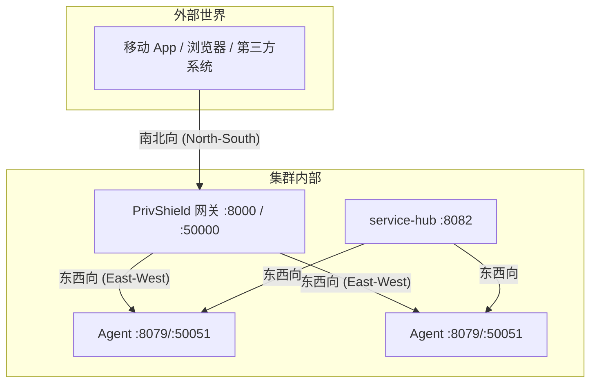
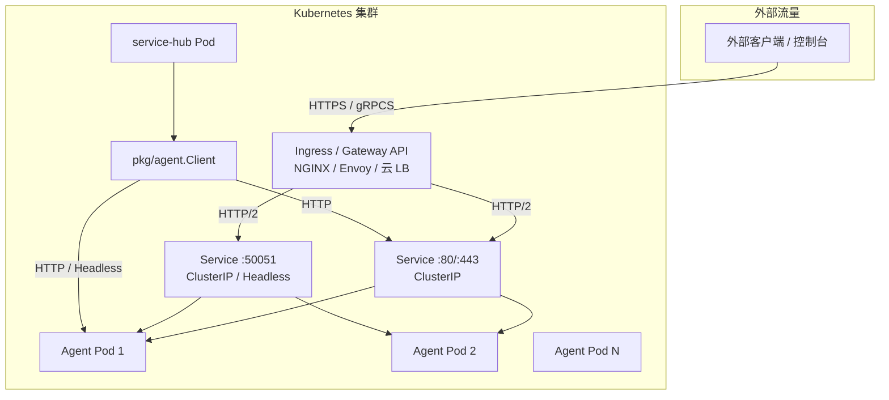
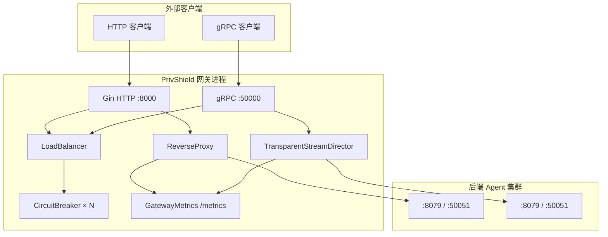
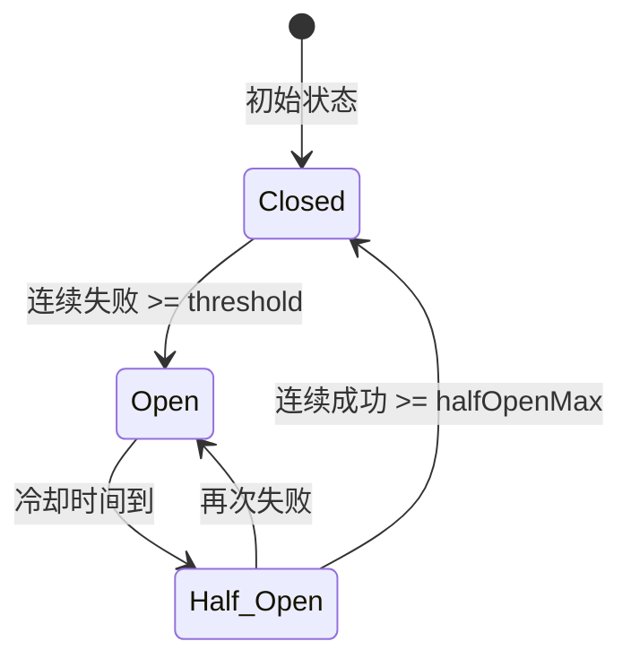
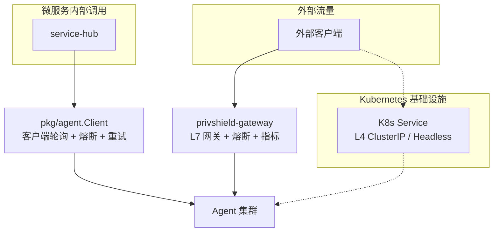

# 代理转发与负载均衡网关设计文档

本文档定义 `PrivShield` Go 网关子系统（`engine-go/internal/gateway` 与 `engine-go/cmd/privshield-gateway`）的技术架构、核心概念、模块实现、高可用机制、与 Kubernetes 负载均衡的关系，以及针对固定后端 IP 场景（如 `services/service-hub`）的选型建议。

---

## 1. 概述

`PrivShield` 网关是一个基于 Go 1.25+ 的 L7（应用层）自适应负载均衡网关，同时支持 REST（HTTP/1.1 & HTTP/2）与 gRPC 双协议的反向代理。它为外部调用方提供统一的南北向入口（`:8000` / `:50000`），并将流量按 RPC/请求粒度调度到后端 Agent 集群（`:8079` / `:50051`）。

当前实现位于：

- `pkg/gateway/balancer.go`：后端节点、三态熔断器、调度策略（通用实现，已下沉为全仓库公共 API）。
- `engine-go/internal/gateway/balancer.go`：引擎侧薄包装与类型别名，保持现有调用方不变。
- `engine-go/internal/gateway/http_proxy.go`：HTTP 反向代理。
- `engine-go/internal/gateway/grpc_proxy.go`：gRPC 透明流代理。
- `engine-go/internal/gateway/backend_tls.go`：东西向 mTLS 回源配置。
- `engine-go/cmd/privshield-gateway/main.go`：网关入口。
- `pkg/agent/client.go`：微服务侧（service-hub / datasource-mgr / audit-log / bff-go）共享的 Agent HTTP 客户端，内置客户端负载均衡与熔断。

---

## 2. 设计原理

### 2.1 为什么需要 L7 网关？

在 Kubernetes 中，`Service`（ClusterIP / IPVS / iptables）通常提供的是 **L4（传输层）负载均衡**。它只在 TCP 连接建立时做一次目标选择，之后该连接上的所有请求都会落到同一个后端 Pod。

对于 gRPC（基于 HTTP/2 长连接多路复用），这会导致典型的 **"单 Pod 钉住"** 问题：

- 外部客户端与网关建立少量 TCP 长连接；
- 网关通过 K8s Service 与后端 Agent 建立少量 TCP 长连接；
- 后续成千上万个 gRPC RPC 全部落在同一个 Agent Pod 上，造成热点。

L7 网关的破局点在于：**对每个独立的 HTTP 请求 / gRPC RPC，都在应用层重新选择后端节点**，从而真正实现请求级负载均衡。同时，L7 网关还能做以下事情：

- 应用层健康探针（HTTP `/health` / gRPC `Health`）感知真实业务状态；
- 节点级熔断器隔离故障 Pod；
- EWMA 延迟反馈驱动的自适应调度；
- 按 method/path 的 Prometheus 指标与日志；
- 南北向 TLS 终结与东西向 mTLS 回源。

### 2.2 流量方向：南北向与东西向



- **南北向流量**：从集群外部进入网关的流量，需要 TLS 终结、认证、限流。
- **东西向流量**：集群内部服务之间的调用（如 service-hub → Agent），通常已在内网，但金融级场景下仍需 mTLS 防止内网嗅探。

### 2.3 调度算法选型

网关内置 5 种调度策略，通过 `GATEWAY_STRATEGY` 环境变量配置：

| 策略 | 标识 | 核心思想 | 适用场景 |
|---|---|---|---|
| P2C + EWMA | `p2c`（默认） | 随机选两个节点，按 `在途数 × EWMA 延迟` 打分，选低分者 | 通用生产场景，兼顾负载与延迟 |
| 轮询 | `round_robin` | 原子递增游标，均匀循环 | 同构节点、短请求 |
| 平滑加权轮询 | `weighted_rr` | Nginx SWRR 算法，避免权重集中脉冲 | 异构机型、需要严格按比例分流 |
| 最少连接 | `least_conn` | 选择在途请求数最少的节点 | 长耗时/流式请求 |
| 加权随机 | `weighted_random` | 按权重概率抽样 | 节点数多、请求离散 |

**选型思路**：

- **P2C-EWMA**：只需比较两个随机节点，$O(1)$ 复杂度，却能获得接近全局最优的负载分布；同时引入 EWMA 延迟反馈，能自动避让慢节点。这是生产默认策略。
- **Round-Robin**：实现最简单，但无法感知节点实际负载差异，适合节点同构且请求均匀的场景。
- **SWRR**：相比普通加权轮询，能避免权重集中导致的流量脉冲，适合异构节点按比例分流。
- **Least-Conn**：以在途请求数为唯一指标，适合长连接或流式请求，但对节点处理能力的差异不敏感。
- **Weighted-Random**：实现简单、无锁，适合节点数多、请求离散、对顺序无要求的场景。

### 2.4 高可用自愈：熔断器 + 被动故障感知

每个后端节点绑定独立的三态熔断器：

- **Closed**：正常服务；连续失败达到阈值（默认 5 次）后转入 Open。
- **Open**：拒绝流量；冷却期（默认 30 秒）后转入 Half-Open。
- **Half-Open**：允许少量探测请求；成功则恢复 Closed，失败则重新 Open。

当前 Go 实现采用**被动故障感知**：在 HTTP 反向代理或 gRPC 流转发过程中，一旦遇到连接错误、后端不可达或 5xx，立即调用 `RecordFailure()` 计数。这种方式是毫秒级的，无需等待主动探针周期。但当前代码**缺少主动探针协程**，主动健康检查是后续增强项。

### 2.5 零拷贝透明 gRPC 代理

网关不依赖预先生成的 gRPC 桩代码，而是通过 `grpc.UnknownServiceHandler` 捕获所有未注册方法，配合自定义 `rawCodec` 直接透传 `[]byte`。

这样做的收益：

- **零反序列化开销**：网关无需理解 44 个隐私原语的具体 protobuf 结构，只负责字节搬运。
- **协议透明**：新增 RPC 方法时，网关侧无需重新生成代码或重启。
- **双向流支持**：通过两个 Goroutine 并发泵送，支持 unary / client-streaming / server-streaming / bidi-streaming 四种模式。

---

## 3. 技术选型与理由

| 能力 | 技术 | 选型理由 |
|---|---|---|
| HTTP 反向代理 | `net/http/httputil.ReverseProxy` | Go 标准库，成熟稳定，自动处理 Hop-by-Hop 头、X-Forwarded-* 注入、连接池复用。 |
| gRPC 透明代理 | `grpc.UnknownServiceHandler` + `rawCodec` | 无需为每个 RPC 写存根，零反序列化开销，直接透传原始 protobuf 字节。 |
| 调度算法 | 自研 | P2C-EWMA、SWRR、LeastConn 均可在无锁/细粒度锁下实现，避免引入重依赖。 |
| 连接池 | 全局 `http.Transport` + gRPC `ClientConn` 池 | HTTP 长连接复用；gRPC 连接池按地址缓存，状态不健康时重建。 |
| 东西向安全 | 标准库 `crypto/tls` | 支持 mTLS 双向认证，最低 TLS 1.3（可降级到 1.2）。 |
| 微服务 → Agent 调用 | `pkg/agent.Client` | 共享库，统一重试、熔断、追踪头注入、鉴权，避免每个服务重复实现。 |

### 3.1 为什么不直接用 Nginx / Envoy / Traefik？

- **可控性**：自研网关可以在代码层面快速迭代 P2C-EWMA、按 namespace 的预算指标、`rawCodec` 零拷贝等隐私计算专用能力。
- **镜像体积**：Nginx/Envoy 镜像通常数十 MB 起步，而自研网关可与 Agent 共用同一个 ~25MB Alpine 基础镜像。
- **学习曲线与运维**：Envoy 配置复杂、版本迭代快；Nginx gRPC 模块功能有限；Traefik 对 gRPC 方法级路由支持不足。
- **协议统一**：自研网关在单个进程中同时暴露 HTTP `:8000` 与 gRPC `:50000`，配置一套后端列表即可。

当然，如果组织已有成熟的 Service Mesh 或 API 网关团队，完全可以将 REST 流量交给 Ingress，只在需要 gRPC 方法级治理时保留自研网关。

### 3.2 为什么 Kubernetes Service 不能独当一面？

- **L4 连接级负载均衡**：只在 TCP 建连时选一次后端，HTTP/2 长连接上的所有 RPC 会被钉住。
- **缺少应用层语义**：无法按 gRPC method、REST path 做路由、指标、熔断。
- **无法感知业务健康**：TCP 端口通不等于业务可用（如 Agent OOM、Goroutine 泄漏、预算模块死锁）。
- **无统一边缘治理**：TLS 终结、认证、限流需要在 Ingress / Sidecar 中额外配置。

---

## 4. 限制单连接并发 Stream 数，强制客户端在流满后新建连接

### 4.1 问题背景

gRPC 基于 HTTP/2，HTTP/2 允许在一条 TCP 连接上并发运行多个 Stream（多路复用）。这意味着：

- 客户端与 Agent 之间可能只维持少量长连接；
- Kubernetes `Service`（ClusterIP / iptables / IPVS）作为 L4 负载均衡器，只在 TCP 连接建立时选择一次后端 Pod；
- 一旦连接建立，该连接上的所有 gRPC Stream / RPC 都会打到同一个 Pod，造成热点。

### 4.2 解决方案：`grpc.MaxConcurrentStreams`

HTTP/2 的 `SETTINGS_MAX_CONCURRENT_STREAMS` 参数表示一条连接上同时允许的最大并发 Stream 数。服务端可以通过调小该值，强制客户端在 Stream 用满后新建 TCP/TLS 连接。每条新连接都会重新经过 K8s Service 的 L4 负载均衡，从而有机会被分发到另一个 Pod。

在 PrivShield 的 Agent gRPC 服务端，已在 `engine-go/internal/grpcserver/server.go` 中通过内置选项设置：

```go
// engine-go/internal/grpcserver/server.go:47-51
builtinOpts := []grpc.ServerOption{
    grpc.MaxRecvMsgSize(64 * 1024 * 1024), // 64MB 接收上限，防止 OOM
    grpc.MaxSendMsgSize(64 * 1024 * 1024), // 64MB 发送上限
    grpc.MaxConcurrentStreams(250),        // 并发流限制
}
```

**注意**：这个设置作用于 **Agent gRPC 服务器**（`:50051`），而不是网关。它的直接效果是让任何与 Agent 建立长连接的 gRPC 客户端（包括网关、BFF、Mesh Sidecar）在单条连接上最多同时保持 250 个活跃 Stream；超过后，客户端会被迫新建连接。

### 4.3 利弊权衡

**收益**：

- 在不引入 L7 网关的情况下，让 K8s Service 有更多机会把流量分散到多个 Pod。
- 对短生命周期的 unary RPC 效果最明显。
- 实现简单，只需一个 gRPC ServerOption。

**代价**：

- 更多的 TCP/TLS 连接意味着更多的握手开销、文件描述符和内存占用。
- 客户端侧可能出现 `TIME_WAIT` 套接字堆积。
- K8s kube-proxy conntrack 表压力增大。
- 对长流（server-streaming / bidi-streaming）帮助有限：一个长流仍可能独占一条连接。
- 250 这个阈值是粗粒度全局值，无法针对具体 method 或客户端动态调整。

因此，`grpc.MaxConcurrentStreams` 是一种**缓解手段**，而不是网关替代品。下两节将讨论：限制 Stream 数后是否还需要自研网关，以及如果彻底移除自研网关应如何设计。

---

## 5. 如果这样还需要自带的网关么？

**结论：需要。限制单连接 Stream 数只能缓解 gRPC 长连接钉住，无法替代 L7 网关。**

即使 Agent 已经配置了 `grpc.MaxConcurrentStreams(250)`，自研网关仍然提供以下 K8s Service + Stream 限制所不具备的能力：

| 能力 | 自研网关 | K8s Service + `MaxConcurrentStreams` |
|---|---|---|
| per-RPC / per-HTTP 请求级调度 | ✅ `SelectNode()` 每次请求独立选后端 | ❌ 仍依赖连接级 L4 分发 |
| 节点级熔断器 | ✅ 毫秒级被动感知 + 三态熔断 | ❌ 只能依赖 readiness probe（秒级） |
| EWMA 延迟反馈 | ✅ 自动避让慢节点 | ❌ 无 |
| 方法/Path 级指标与日志 | ✅ `rawCodec` 可识别 method | ❌ 只能拿到连接级指标 |
| 南北向 TLS 终结 | ✅ 网关内置 | ⚠️ 需要 Ingress / Gateway API |
| 东西向 mTLS 回源 | ✅ `BuildBackendTLSConfig` | ⚠️ 需要 Istio / Envoy Sidecar |
| 统一认证 / 限流 | ✅ 在边缘统一执行 | ⚠️ 需要额外组件 |
| 灰度 / 金丝雀路由 | ✅ 代码层面可按权重 / 标签分流 | ⚠️ 需要 Service Mesh |
| 基础设施无关 | ✅ 裸机、VM、多集群均可运行 | ❌ 强依赖 K8s |

### 5.1 实际场景：`services/service-hub` 连接固定 App 后端 IP

在 `services/service-hub` 这类场景中，后端 Agent IP 是固定的，service-hub 通过 `pkg/agent.Client` 直接连接这些 IP，走 HTTP REST（`:8079`），而不是 gRPC 长连接。

- **这种情况下，流量不需要经过 `privshield-gateway`**。`pkg/agent.Client` 已提供客户端轮询、熔断、重试、追踪头透传。
- **限制 Stream 数与 service-hub 关系不大**，因为 REST 不存在 HTTP/2 Stream 钉住问题。
- **网关的价值在于南北向入口**：外部控制台、第三方系统、BFF 的流量需要统一的 TLS 终结、认证、限流入口，这正是 K8s Service 做不到的。

### 5.2 内部东西向调用的另一种形态

对于微服务内部的东西向调用，如果希望获得接近网关的调度能力，又不想引入额外跳点，可以让调用方使用 `pkg/agent.Client`。它在客户端侧实现了：

- 多地址轮询 / P2C-EWMA（可扩展）
- 三态熔断器
- 指数退避重试
- 追踪头透传

这样，service-hub → Agent 的流量仍然保持"客户端负载均衡"模式，而 Agent 集群边缘的 `privshield-gateway` 继续服务于南北向流量。

---

## 6. 如果一定要删掉自研网关，直接采用 K8s，应该如何设计实现，弊端是什么？

在某些组织约束下（如强制统一基础设施、减少自研组件），可能需要移除 `privshield-gateway`。本节给出一种可行替代方案及其必须面对的弊端。

### 6.1 替代方案设计



**核心设计**：

1. **每个 Agent Pod 的 gRPC Server 配置 `grpc.MaxConcurrentStreams(250)`**（当前已实现，见 `engine-go/internal/grpcserver/server.go`）。
2. **南北向入口**：使用 K8s Ingress / Gateway API 终结 TLS，将流量转发到 Agent Service。
3. **东西向调用**：
   - `services/service-hub` 通过 `pkg/agent.Client` 直接连固定 IP；或
   - 使用 Headless Service 做客户端发现，由 `pkg/agent.Client` 做客户端负载均衡。
4. **如需 L7 能力**：引入 Istio / Envoy Sidecar 提供 per-RPC 负载均衡、熔断、重试、mTLS、方法级指标。
5. **可观测性**：通过 PodMonitor / ServiceMonitor 抓取 Agent `/metrics`，结合 Ingress Controller 指标。

### 6.2 必须面对的弊端

1. **失去 per-RPC EWMA 调度与自研熔断器**：K8s Service 仍是连接级 L4 负载均衡；即使引入 Istio，调度策略也是其内置的 `LEAST_CONN` / `ROUND_ROBIN`，无法直接使用 P2C-EWMA。
2. **`grpc.MaxConcurrentStreams` 是粗粒度权衡**：为缓解钉住而调低阈值会导致连接数激增、TLS 握手与内存开销上升；阈值过高则负载均衡效果差。
3. **缺少统一方法级指标**：K8s Service 只能提供连接级指标；方法级 QPS/P99 需要 Istio/Envoy 额外暴露。
4. **增加外部依赖**：Ingress Controller、Service Mesh、cert-manager 等组件都会引入运维复杂度。
5. **隐私专用路由能力减弱**：自定义按 namespace / mechanism 的预算指标路由、灰度发布等，在通用 Ingress/Mesh 中实现成本高。
6. **统一认证 / 限流更难注入**：需要依赖 Ingress annotation、Istio AuthorizationPolicy / RateLimit 等外部配置。
7. **东西向 mTLS 变成网格级策略**：不再由应用层 `BuildBackendTLSConfig` 控制，而需通过 Istio mTLS 或 NetworkPolicy 统一配置。

### 6.3 什么情况下可以移除自研网关？

如果同时满足以下条件，移除自研网关是可行的：

- 流量以短 REST 或 unary gRPC 为主，无长流；
- 后端 Agent 节点同构，无需按算力权重分流；
- 对方法级可观测性、节点级熔断、自动重试没有强需求，或已有 Service Mesh 补齐；
- 能接受为限制 Stream 数而增加的连接与 TLS 开销；
- 组织已有成熟的 Ingress / Service Mesh 运维能力。

否则，保留自研网关仍是更优选择。

---

## 7. 系统架构



---

## 8. 核心模块实现

### 8.1 BackendNode

```go
type BackendNode struct {
    Address       string            // 后端地址，如 "127.0.0.1:8079"
    Weight        int               // 静态权重
    currentWeight atomic.Int32      // SWRR 动态权重
    InFlight      atomic.Int64      // 当前在途请求数
    EWMA          float64           // 指数移动加权平均延迟
    LastUsed      time.Time
    CB            CircuitBreaker    // 节点专属熔断器
    eWMAMu        sync.Mutex
    proxyOnce     sync.Once
    proxy         *httputil.ReverseProxy
    proxyErr      error
}
```

- `InFlight` 使用 `atomic.Int64`，保证高并发下无锁读取。
- `EWMA` 更新使用独立互斥锁，避免与 InFlight 竞争。
- 反向代理实例通过 `sync.Once` 懒加载，与节点生命周期绑定，无需全局缓存与清理协程。

### 8.2 CircuitBreaker

```go
type CircuitBreaker struct {
    state        CBState
    failureCount int
    successCount int
    threshold    int           // 默认 5
    halfOpenMax  int           // 默认 3
    lastFailure  time.Time
    cooldown     time.Duration // 默认 30s
    mu           sync.Mutex
}
```

状态转移：



### 8.3 LoadBalancer

```go
type LoadBalancer struct {
    nodes    []*BackendNode
    strategy string       // "p2c" | "round_robin" | "least_conn" | "weighted_rr" | "weighted_random"
    rrIndex  atomic.Int32
}
```

#### P2C-EWMA（默认策略）

```go
func (lb *LoadBalancer) selectP2C() *BackendNode {
    available := lb.availableNodes()
    if len(available) <= 1 { return available[0] }

    i, j := rand.IntN(len(available)), rand.IntN(len(available))
    for j == i { j = rand.IntN(len(available)) }

    a, b := available[i], available[j]
    scoreA := float64(a.InFlight.Load()+1) * math.Max(a.GetEWMA(), 0.001)
    scoreB := float64(b.InFlight.Load()+1) * math.Max(b.GetEWMA(), 0.001)

    if scoreA <= scoreB { return a }
    return b
}
```

P2C 只需比较两个随机节点，时间复杂度 $O(1)$，却能在大规模节点池下获得接近全局最优的负载分布。

#### 平滑加权轮询（SWRR）

```go
func (lb *LoadBalancer) selectWeightedRoundRobin() *BackendNode {
    available := lb.availableNodes()
    totalWeight := int32(0)
    var best *BackendNode
    bestCW := int32(math.MinInt32)

    for _, n := range available {
        cw := n.currentWeight.Add(int32(n.Weight))
        totalWeight += int32(n.Weight)
        if cw > bestCW {
            bestCW = cw
            best = n
        }
    }
    best.currentWeight.Add(-totalWeight)
    return best
}
```

权重 `5:1` 时，6 次调度序列为 `A, A, A, B, A, A`，避免脉冲式集中。

#### 轮询

```go
idx := int(lb.rrIndex.Add(1)-1) % len(available)
```

使用 `atomic.Int32` 实现无锁轮询。

### 8.4 HTTP 反向代理（`http_proxy.go`）

核心流程：

1. `NewHTTPProxyHandler` 接收请求；
2. 调用 `lb.SelectNode()` 选择后端；
3. 检查 `node.CB.Allow()`；
4. `node.IncrementInFlight()`；
5. 获取或创建 `httputil.ReverseProxy`；
6. `proxy.ServeHTTP()` 转发请求；
7. `defer` 中 `node.DecrementInFlight()`、更新 `EWMA`、上报 Prometheus；
8. 根据状态码更新熔断器（`<500` 成功，`>=500` 失败）。

关键优化：

- `byteBufferPool`：32KB `sync.Pool` 复用 buffer，减少 GC 压力。
- `sharedTransport`：全局单例连接池，`MaxIdleConns=2048`，`MaxIdleConnsPerHost=256`。
- 反向代理实例按节点懒加载，生命周期内聚。

### 8.5 gRPC 透明流代理（`grpc_proxy.go`）

核心流程：

1. `grpc.UnknownServiceHandler` 捕获所有未注册方法；
2. `grpc.MethodFromServerStream()` 提取全限定方法名；
3. `lb.SelectNode()` 选择后端；
4. `getOrCreateConn()` 获取或创建到该地址的 gRPC 连接；
5. 创建双向流，启动两个 Goroutine 并发泵送数据；
6. 任一方向出错即 `context.Cancel`，另一端联动退出；
7. 更新 EWMA、熔断器、Prometheus 指标。

关键优化：

- `rawCodec` 直接透传 `[]byte`，避免网关对 protobuf 做反序列化/序列化。
- 支持 Unary、Client-Streaming、Server-Streaming、Bidirectional-Streaming 四种模式。
- 元数据（metadata）通过 `metadata.NewOutgoingContext` 透传到后端。

### 8.6 东西向 mTLS 回源（`backend_tls.go`）

```go
func BuildBackendTLSConfig(caCertPath, clientCertPath, clientKeyPath string) (*tls.Config, error) {
    caCert, _ := os.ReadFile(caCertPath)
    caCertPool := x509.NewCertPool()
    caCertPool.AppendCertsFromPEM(caCert)

    clientCert, _ := tls.LoadX509KeyPair(clientCertPath, clientKeyPath)

    return &tls.Config{
        Certificates: []tls.Certificate{clientCert},
        RootCAs:      caCertPool,
        MinVersion:   tls.VersionTLS13,
    }, nil
}
```

网关作为 mTLS 客户端，使用内部 CA 验证后端 Agent 证书，并出示自己的客户端证书供后端验证。

---

## 9. 启动入口与配置

`engine-go/cmd/privshield-gateway/main.go`：

```go
observability.InitLogger(getEnv("PRIVACY_LOG_LEVEL", "INFO"))
backends := getEnv("GATEWAY_BACKENDS", "127.0.0.1:8079")
addresses := strings.Split(backends, ",")
strategy := getEnv("GATEWAY_STRATEGY", "p2c")
lb := gateway.NewLoadBalancer(addresses, strategy)
gwMetrics := observability.NewGatewayMetrics()

r := gin.New()
r.Use(gin.Recovery())
r.Use(observability.RequestLogger())
r.Use(gwMetrics.PrometheusMiddleware())
r.GET("/health", ...)
r.GET("/gateway/backends", ...)
r.GET("/metrics", gwMetrics.Handler())
r.NoRoute(gateway.NewHTTPProxyHandler(lb, gwMetrics))

grpcProxyServer, grpcLis, _ := gateway.NewGrpcProxyListener(lb, grpcAddr, gwMetrics)
```

环境变量速查：

| 变量 | 默认值 | 说明 |
|---|---|---|
| `GATEWAY_HOST` | `0.0.0.0` | HTTP 监听地址 |
| `GATEWAY_PORT` | `8000` | HTTP 监听端口 |
| `GATEWAY_GRPC_PORT` | `50000` | gRPC 监听端口 |
| `GATEWAY_BACKENDS` | `127.0.0.1:8079` | 后端 Agent 地址列表（逗号分隔） |
| `GATEWAY_STRATEGY` | `p2c` | 调度策略 |
| `GATEWAY_LOG_LEVEL` | `INFO` | 日志级别 |

优雅停机：

1. 捕获 `SIGINT` / `SIGTERM`；
2. `httpSrv.Shutdown(ctx)`（15 秒超时）；
3. `grpcProxyServer.GracefulStop()`，超时后回退 `Stop()`。

---

## 10. 高可用与自愈机制

### 10.1 当前已实现

- **被动故障感知**：代理层遇到连接失败、不可达、5xx 时立即触发熔断计数。
- **节点级熔断器**：独立状态机，防止单点故障拖垮全局。
- **EWMA 延迟反馈**：P2C 调度综合在途数与历史延迟，自动避让慢节点。
- **连接池复用**：HTTP 与 gRPC 均复用长连接，降低握手开销。

### 10.2 当前缺失

- **主动健康探针循环**：原 Python 实现有每 5 秒一次的 HTTP `/health` + gRPC `Health` 主动探针，Go 实现目前尚未添加。
- **动态节点注册/下线 API**：Go 实现当前为静态后端列表，不支持运行时热注册/热下线。
- **幂等重试**：HTTP 反向代理目前未对失败请求做自动重试（gRPC 流也未重试），失败直接返回错误；重试由客户端或 `pkg/agent` 负责。

---

## 11. 可观测性

网关指标由 `engine-go/internal/observability/gateway_metrics.go` 定义：

| 指标 | 类型 | labels | 说明 |
|---|---|---|---|
| `privshield_gateway_backend_in_flight` | Gauge | `node_id`, `backend_addr` | 节点实时在途请求数 |
| `privshield_gateway_backend_ewma_latency_seconds` | Gauge | `node_id` | 节点 EWMA 延迟 |
| `privshield_gateway_circuit_breaker_state` | Gauge | `node_id`, `state` | 熔断器状态 |
| `privshield_gateway_requests_total` | Counter | `node_id`, `status` | 转发请求总数 |

访问日志由 `observability.RequestLogger()` 统一记录。

---

## 12. 与 pkg/agent 客户端负载均衡的关系

`pkg/agent/client.go` 是微服务侧（service-hub、datasource-mgr、audit-log、bff-go）调用上游 Agent 的共享 HTTP 客户端。它自身具备：

- 多地址轮询（`BaseURLs`）
- 三态熔断器
- 指数退避重试 + 抖动
- 4xx 不计入熔断失败
- `X-Request-ID` / `X-Trace-ID` / `X-Idempotency-Key` 透传
- 64 MiB 响应体上限保护

```go
cfg := pkgagent.Config{
    BaseURLs: []string{"http://10.0.0.1:8079", "http://10.0.0.2:8079"},
    APIKey:   "sk-xxx",
}
client := pkgagent.New(cfg)
```

`service-hub/internal/config/config.go` 通过 `PRIVACY_AGENT_URLS` 环境变量支持配置多个固定 Agent URL：

```go
func (c *Config) AgentBaseURLs() []string {
    envURLs := pkgconfig.EnvStringSlice("PRIVACY_AGENT_URLS")
    if len(envURLs) > 0 { return envURLs }
    return []string{c.AgentBaseURL()}
}
```

因此，`services/service-hub` 连接固定 App 后端 IP 时，走的是 **客户端负载均衡**（`pkg/agent`），而不是 `privshield-gateway`。

---

## 13. 选型讨论：何时使用网关、K8s Service 还是 pkg.agent？

### 13.1 三种负载均衡的位置与职责



### 13.2 决策矩阵

| 场景 | 推荐方案 | 理由 |
|---|---|---|
| 外部公网/公区流量进入 Agent 集群 | **privshield-gateway** | 需要统一的 TLS 终结、认证、限流、L7 gRPC per-RPC 调度、可观测性入口。 |
| 微服务内部（service-hub → Agent）且后端 IP 固定 | **pkg/agent 客户端负载均衡** | 无需额外网络跳点，客户端自带熔断/重试，配置简单，延迟最低。 |
| 微服务内部需要服务发现 | **K8s Headless Service + pkg/agent** | Headless 提供 Pod IP 列表，pkg/agent 做客户端 LB/熔断。 |
| 只需要简单 TCP/HTTP 分发，无 gRPC 长连接痛点 | **K8s Service** | 基础设施原生，运维成本低。 |
| 需要全局限流、WAF、复杂路由 | **Envoy / Nginx / 云 LB** | 自研网关不做这些。 |
| gRPC 长连接钉住，但能接受限制并发 Stream 数 | **K8s Service + 限制 `MAX_CONCURRENT_STREAMS`** | 临时缓解方案，仍需网关提供熔断、可观测性与优雅滚动。详见 §4、§6。 |

### 13.3 针对 service-hub 固定 IP 场景的建议

用户描述的实际场景是：**`services/service-hub` 跟固定的 App 后端 IP 进行连接**。

在这种情况下，**不需要也不应该让流量先经过 `privshield-gateway`**。原因如下：

1. **避免额外网络跳点**：service-hub → gateway → Agent 比 service-hub → Agent 多一跳，增加延迟与故障点。
2. **固定 IP 意味着已知后端列表**：`pkg/agent` 的 `BaseURLs` 完全可以覆盖这种场景，通过 `PRIVACY_AGENT_URLS=http://10.0.0.1:8079,http://10.0.0.2:8079` 配置多固定 IP。
3. **客户端已具备所需能力**：`pkg/agent` 的轮询、熔断、重试、追踪头透传已满足微服务到 Agent 的高可用需求。
4. **网关的职责边界**：网关是**南北向入口**组件，不应成为内部微服务到 Agent 的必经路径，否则网关会成为新的单点瓶颈。

**推荐部署方式**：

```bash
# service-hub 环境变量
PRIVACY_AGENT_URLS="http://10.0.0.1:8079,http://10.0.0.2:8079,http://10.0.0.3:8079"
PRIVACY_AGENT_API_KEY="sk-xxx"
```

如果固定 IP 是 K8s Pod IP，建议改用 **Headless Service** 让 Pod IP 通过 DNS 暴露，然后 service-hub 仍通过 `pkg/agent` 直接连接这些 IP（或让 `pkg/agent` 未来支持从 K8s API/Consul 动态发现地址）。

### 13.4 是否应完全用 K8s 替代自研网关？

**不能简单替代**，因为 K8s Service 无法解决以下问题：

1. **gRPC 长连接钉住**：K8s L4 仅在 TCP 建连时选择一次后端，gRPC HTTP/2 长连接上的所有 RPC 会集中到一个 Pod。
2. **缺少应用层熔断**：TCP 端口通不代表业务健康（如 Agent OOM、Goroutine 泄漏、预算模块死锁）。
3. **缺少统一可观测性**：无法按 RPC method 统计 QPS/P99/错误率。
4. **缺少南北向 TLS 终结 + 东西向 mTLS 回源的统一编排**。

**但在微服务内部固定 IP 场景下，K8s Service 可以作为 pkg/agent 的底层发现机制**，而真正的负载均衡、熔断、重试仍由 `pkg/agent` 在客户端完成，这样比单纯依赖 K8s Service 更可靠。

### 13.5 自研网关能力速览

为便于决策，下面将 `privshield-gateway` 提供的核心能力与对应的实现位置做统一梳理。

| 能力 | 实现位置 | 说明 |
|---|---|---|
| **REST 反向代理** | `engine-go/internal/gateway/http_proxy.go` | 基于 `httputil.ReverseProxy`，支持 Keep-Alive 长连接复用、32KB buffer pool、Hop-by-Hop 头过滤、X-Forwarded-* 注入。 |
| **gRPC 透明流代理** | `engine-go/internal/gateway/grpc_proxy.go` | 基于 `grpc.UnknownServiceHandler` + `rawCodec` 零拷贝透传，支持 unary / client-streaming / server-streaming / bidi-streaming 四种模式。 |
| **per-RPC 负载均衡** | `engine-go/internal/gateway/balancer.go` | 每个 HTTP 请求 / gRPC RPC 独立调用 `SelectNode()`，彻底解决 HTTP/2 长连接钉住。 |
| **5 种调度策略** | `engine-go/internal/gateway/balancer.go` | `p2c`（默认）、`round_robin`、`least_conn`、`weighted_rr`、`weighted_random`。 |
| **P2C-EWMA 自适应** | `engine-go/internal/gateway/balancer.go` | 随机双选节点，按 `(in_flight + 1) × EWMA 延迟` 打分，自动避让慢节点。 |
| **节点级熔断器** | `engine-go/internal/gateway/balancer.go` | 每个后端独立三态熔断器：`Closed → Open → HalfOpen`，阈值 5 次，冷却 30 秒。 |
| **东西向 mTLS 回源** | `engine-go/internal/gateway/backend_tls.go` | 构建 TLS 1.3 配置，支持客户端证书双向认证；当前已提供配置函数，待接入代理层。 |
| **Prometheus 指标** | `engine-go/internal/observability/gateway_metrics.go` | 在途数、EWMA 延迟、熔断器状态、转发请求数；独立 Registry。 |
| **访问日志** | `engine-go/internal/observability/logger.go` | `RequestLogger` Gin 中间件统一记录 method / path / status / duration / request_id。 |
| **优雅停机** | `engine-go/cmd/privshield-gateway/main.go` | SIGTERM 后执行 HTTP `Shutdown` + gRPC `GracefulStop` 并带超时回退。 |
| **统一南北向入口** | `engine-go/cmd/privshield-gateway/main.go` | 单进程同时监听 HTTP `:8000` 与 gRPC `:50000`，对外呈现统一接入点。 |

**一句话总结**：自研网关的核心价值在于**在应用层理解 gRPC/HTTP 协议**，从而做到 per-RPC 调度、应用层熔断、方法级可观测与 TLS 统一编排。这些能力无法通过 K8s Service 或"限制 Stream 数"完整替代。

---

## 14. 若必须删除自研网关，完全采用 Kubernetes 的详细替代方案

虽然本文档建议保留 `privshield-gateway`，但在某些组织约束下可能需要完全移除自研网关，改由 Kubernetes 原生能力承载流量。本节给出详细的替代架构、关键实现点以及必须面对的弊端。核心结论与取舍已在 §6 中说明，本节为操作层面的补充。

### 14.1 替代架构总览


**核心变化**：

1. **南北向入口**：由 K8s Ingress / Gateway API（如 NGINX Ingress Controller、Envoy Gateway、云厂商 ALB/NLB）替代自研网关的 `:8000` / `:50000`。
2. **东西向调用**：微服务到 Agent 的调用直接通过 K8s `Service` 或 `Headless Service`，由 `pkg/agent.Client` 做客户端负载均衡。
3. **高级治理能力**：若需要熔断、重试、方法级指标、mTLS，则必须引入 **Service Mesh**（如 Istio、Linkerd）或 **Envoy Sidecar**。

### 14.2 REST 流量替代方案

#### 14.2.1 Ingress / Gateway API 作为入口

```yaml
apiVersion: networking.k8s.io/v1
kind: Ingress
metadata:
  name: privshield-rest
  annotations:
    nginx.ingress.kubernetes.io/backend-protocol: HTTP
    nginx.ingress.kubernetes.io/ssl-redirect: "true"
spec:
  ingressClassName: nginx
  tls:
    - hosts:
        - privshield.example.com
      secretName: privshield-tls
  rules:
    - host: privshield.example.com
      http:
        paths:
          - path: /
            pathType: Prefix
            backend:
              service:
                name: privshield-agent
                port:
                  number: 8079
```

**关键点**：

- TLS 证书由 **cert-manager** 自动签发或挂载 `tls` Secret。
- 认证、限流、WAF 通过 Ingress Controller 注解或企业级 API 网关（如 Kong、AWS API Gateway）实现。
- 健康检查使用 K8s `readinessProbe` / `livenessProbe`：

```yaml
readinessProbe:
  httpGet:
    path: /readyz
    port: 8079
  periodSeconds: 5
livenessProbe:
  httpGet:
    path: /health
    port: 8079
  periodSeconds: 10
```

#### 14.2.2 Pod 级负载均衡

- `Service` 为 ClusterIP，kube-proxy（iptables/IPVS）在 TCP 层分发。
- 由于 REST HTTP/1.1 连接生命周期短，ClusterIP 负载均衡效果较好，基本无"钉住"问题。
- 若需会话保持，可通过 `sessionAffinity: ClientIP` 配置，但通常不需要。

### 14.3 gRPC 流量替代方案

#### 14.3.1 方案 A：Headless Service + 客户端负载均衡

```yaml
apiVersion: v1
kind: Service
metadata:
  name: privshield-agent-grpc-headless
spec:
  clusterIP: None
  selector:
    app: privshield-agent
  ports:
    - port: 50051
      targetPort: 50051
```

- `clusterIP: None` 让 K8s 通过 DNS 直接暴露所有 Pod IP。
- 客户端通过 DNS SRV/A 记录获取 Pod IP 列表，再由 `pkg/agent.Client` 或 gRPC 自定义 resolver 做轮询。
- 适合 `service-hub → Agent` 这种内部固定/半固定调用方场景。

#### 14.3.2 方案 B：Ingress / Gateway API 支持 gRPC

NGINX Ingress 支持 gRPC：

```yaml
apiVersion: networking.k8s.io/v1
kind: Ingress
metadata:
  name: privshield-grpc
  annotations:
    nginx.ingress.kubernetes.io/backend-protocol: GRPC
    nginx.ingress.kubernetes.io/grpc-max_concurrent_streams: "1"
spec:
  ingressClassName: nginx
  rules:
    - host: grpc.privshield.example.com
      http:
        paths:
          - path: /
            pathType: Prefix
            backend:
              service:
                name: privshield-agent-grpc
                port:
                  number: 50051
```

Envoy Gateway 配置更灵活：

```yaml
apiVersion: gateway.networking.k8s.io/v1beta1
kind: HTTPRoute
metadata:
  name: privshield-grpc
spec:
  parentRefs:
    - name: privshield-gateway
  rules:
    - backendRefs:
        - name: privshield-agent-grpc
          port: 50051
```

**关键点**：

- 必须启用 HTTP/2 后端协议（`backend-protocol: GRPC`）。
- 限制 `grpc-max_concurrent_streams` 可以缓解长连接钉住，但代价见 §4、§6。
- Ingress 通常无法做 method 级路由（如把 `/PrivacyService/Classify` 路由到 ml Pod，其余路由到 core Pod），除非使用 Envoy Gateway 的 gRPCRoute。

#### 14.3.3 方案 C：Service Mesh（Istio）

Istio 通过 Sidecar 透明拦截流量，提供近似 L7 网关的能力：

```yaml
apiVersion: networking.istio.io/v1beta1
kind: DestinationRule
metadata:
  name: privshield-agent
spec:
  host: privshield-agent-grpc
  trafficPolicy:
    connectionPool:
      tcp:
        maxConnections: 100
      http:
        h2UpgradePolicy: UPGRADE
        http1MaxPendingRequests: 100
        http2MaxRequests: 1          # 强制限制单连接 stream 数
    loadBalancer:
      simple: LEAST_CONN
    outlierDetection:
      consecutive5xxErrors: 5
      interval: 10s
      baseEjectionTime: 30s
```

**能力覆盖**：

- per-RPC 负载均衡（`LEAST_CONN`、`ROUND_ROBIN`、`RANDOM`）
- 熔断（outlier detection）
- 重试
- mTLS（自动双向 TLS）
- 方法级指标（Istio Prometheus metrics with `destination_service` / `grpc_response_status`）
- 灰度发布 / 权重路由

**代价**：

- Sidecar 资源开销（每个 Pod 增加 ~100MB 内存、0.1~0.5 vCPU）。
- 运维复杂度陡增（控制面、数据面、CRD 版本管理）。
- 对 DaemonSet / 特权模式有要求，部分金融私有云审批严格。

### 14.4 可观测性替代方案

| 能力 | 自研网关方案 | K8s 替代方案 |
|---|---|---|
| QPS / 错误率 | `privshield_gateway_requests_total` | Ingress Controller metrics、Istio metrics、Pod `http_requests_total` |
| P99 延迟 | `privshield_gateway_backend_ewma_latency_seconds` | Ingress histogram、Istio `istio_request_duration_milliseconds` |
| 熔断器状态 | `privshield_gateway_circuit_breaker_state` | Istio outlier detection events、Pod 级自定义 exporter |
| 在途连接数 | `privshield_gateway_backend_in_flight` | Pod `container_network_tcp_connections`、Istio connections |
| 访问日志 | slog JSON | Ingress access log、Istio access log、Loki |
| 分布式追踪 | NoOp / OTel | Jaeger / Tempo + OTel auto-instrumentation |

**关键差异**：

- K8s/Ingress 指标通常是 **连接级或 Pod 级**，缺少 **method 级** 的 `Mask` vs `ClassifyField` 维度。
- 需要额外配置 **PodMonitor / ServiceMonitor** 抓取 Agent Pod 暴露的 `/metrics`。
- 方法级指标可在 Agent 侧通过 `EngineMetrics` 暴露，但外部客户端到 Ingress 这一段的方法级指标缺失。

### 14.5 安全替代方案

| 能力 | 自研网关方案 | K8s 替代方案 |
|---|---|---|
| 南北向 TLS 终结 | 网关内置 | Ingress TLS Secret / cert-manager |
| 南北向 mTLS | 网关内置 | Ingress 支持客户端证书校验（NGINX `ssl-verify-client`）或 Istio Gateway |
| 东西向 mTLS | 网关作为 mTLS 客户端回源 | Istio 自动 mTLS（Sidecar 到 Sidecar）或 NetworkPolicy |
| 认证 | API Key / mTLS CN | Ingress annotation、Istio AuthorizationPolicy、OAuth2 Proxy |
| 限流 | 网关令牌桶 | Ingress annotation、Istio RateLimit、Redis 限流 |
| 网络隔离 | — | NetworkPolicy 限制命名空间间通信 |

### 14.6 高可用与弹性替代方案

- **水平扩缩容**：HPA 基于 CPU/内存或自定义指标（如 `prometheus-adapter`）。
- **故障隔离**：
  - 无网关时，依赖 K8s `readinessProbe` 摘除 Pod（秒级）。
  - 引入 Istio 后可做到毫秒级 outlier detection。
- **优雅滚动更新**：
  - 配置 `preStop: sleep 30` 给 Pod 预留排空时间。
  - Agent gRPC Server 已配置 `GracefulStop`，但仍无法避免已建立长流被中断。
- **PodDisruptionBudget**：确保更新或驱逐时至少保留一定数量 Pod 可用。
- **Topology Spread Constraints**：跨可用区打散 Pod。

### 14.7 必须面对的弊端

即使完整引入 Ingress + Service Mesh，仍会失去或弱化以下能力：

**1. 真正的 per-RPC 负载均衡**

- K8s Service + iptables/IPVS 仍是连接级；只有 Service Mesh 能做到 per-RPC。
- 限制 Stream 数可以缓解 unary，但对 streaming 无能为力。

**2. 统一的 REST + gRPC 双协议入口**

- 自研网关单进程同时暴露 `:8000` REST 与 `:50000` gRPC。
- K8s 方案通常需要 **两个 Ingress / Gateway 资源**，分别配置 HTTP/2 后端协议，运维复杂度上升。

**3. 应用层熔断与幂等重试的缺失（无 Service Mesh 时）**

- 纯 K8s Service 没有熔断器；Pod 连续 5xx 时仍会被打流量。
- 幂等重试必须由每个客户端（如 `pkg/agent`）自行实现。

**4. 方法级可观测性缺口**

- Ingress / Service Mesh 的指标维度通常是 host、path、status；
- 无法像自研网关那样按 `/privacy.PrivacyService/Mask` 方法统计 QPS/P99，除非额外改造。

**5. 连接数与 TLS 开销**

- 若采用"限制 Stream 数"策略，连接数会大幅上升，带来：
  - TLS 握手 CPU 开销
  - conntrack 表压力
  - 客户端 `TIME_WAIT` 堆积
  - Pod 内存与 fd 消耗增加

**6. 滚动更新体验差**

- 长连接在 Pod 终止时会被强制拆除，客户端收到 `UNAVAILABLE`。
- 自研网关可以在感知后端变化后，把新请求路由到健康节点，减少影响面。

**7. 异构调度困难**

- K8s Service 对所有后端一视同仁；
- 若 ml Pod（GPU 大模型）与 core Pod（CPU 轻量）混部，无法按算力权重分流，除非使用 Istio subset 权重。

**8. 运维复杂度转移而非消除**

- 删除自研网关并不意味着降低复杂度，只是把复杂度转移到了：
  - Ingress Controller 选型、升级、bug 修复；
  - Service Mesh 控制面运维；
  - cert-manager、NetworkPolicy、OAuth2 Proxy 等多组件协同。

**9. 丢失可控的自定义行为**

- 自研网关可以针对隐私计算场景快速迭代：
  - 自定义 P2C-EWMA 调度；
  - 按 namespace/mechanism 的预算指标；
  - `rawCodec` 零拷贝透传 44 个 RPC；
  - 动态注册/下线 API。
- 这些在 Ingress / Service Mesh 中很难低成本实现。

### 14.8 迁移路径建议

如果必须移除自研网关，建议分阶段进行，不要一次性全切：

**阶段 1：并行运行**

- 保留 `privshield-gateway`；
- 同时部署 K8s Ingress + Service，让部分流量走新入口验证稳定性。

**阶段 2：REST 切 Ingress**

- REST HTTP/1.1 无长连接钉住问题，最容易迁移；
- 配置 Ingress TLS、限流、认证；
- 验证访问日志与指标完整性。

**阶段 3：gRPC 切 Headless Service 或 Service Mesh**

- 内部微服务（service-hub → Agent）优先走 Headless Service + `pkg/agent` 客户端 LB；
- 外部 gRPC 流量若必须保留，引入 Envoy Gateway 或 Istio，验证限制 Stream 数后的连接开销。

**阶段 4：下线网关**

- 确认指标、熔断、重试、TLS、mTLS 等能力已补齐；
- 保留回滚方案（网关镜像与配置）。

### 14.9 结论

> **删除自研网关、完全依赖 Kubernetes 是可行的，但本质上是用"基础设施组件 + 运维复杂度"替代"自研网关 + 代码可控性"。**
>
> - 如果流量以短 REST 为主、无长流、后端同构、已有 Service Mesh，迁移成本较低。
> - 如果存在大量 gRPC 流式调用、异构 Agent 节点、强方法级可观测需求，或需要快速迭代隐私治理相关的路由/熔断策略，保留自研网关仍是更优选择。
> - 折中方案：保留自研网关作为 gRPC / 东西向流量的 L7 调度器，REST 流量可逐步由 Ingress 承接。

---

## 15. 安全设计

- **南北向 TLS 终结**：网关对外提供 HTTPS / gRPCS，可配置服务端证书与 mTLS 客户端认证。
- **东西向 mTLS 回源**：网关向后端 Agent 发起 TLS 连接时，出示客户端证书并验证服务端证书。
- **Fail-Closed**：未配置 API Key 的管理接口默认拒绝，防止未授权暴露。
- **SSRF 阻断**：动态注册 API 需要校验协议白名单与内部地址范围。
- **Hop-by-Hop 头过滤**：`httputil.ReverseProxy` 自动剥离 `Connection`、`Transfer-Encoding` 等逐段头。

---

## 16. 已知限制与改进建议

| 优先级 | 问题 | 建议 | 影响 |
|---|---|---|---|
| P1 | 缺少主动健康探针 | 增加后台 goroutine，每 5 秒对后端 HTTP `/health` 与 gRPC `Health` 发起主动探测，及时标记不健康节点。 | 可靠性 |
| P1 | HTTP 与 gRPC 后端共用同一地址配置 | `GATEWAY_BACKENDS` 应支持分别配置 HTTP 地址与 gRPC 地址，例如 `http://127.0.0.1:8079\|grpc://127.0.0.1:50051`。当前 main.go 用同一端口同时做 HTTP 反向代理与 gRPC 拨号，实际部署中会导致 gRPC 不可达。 | 可用性 |
| P2 | 缺少动态节点注册/下线 API | 恢复 Python 版本的 `/v1/gateway/register` / `/v1/gateway/deregister` / `/v1/gateway/drain` 接口，支持运行时扩缩容。 | 运维 |
| P2 | HTTP 反向代理未做失败重试 | 对幂等方法（GET/HEAD）及 `ConnectError` 的非幂等方法增加有限重试（最多 3 次），避免单节点瞬时抖动影响可用性。 | 可用性 |
| P2 | 后端 TLS 未与 HTTP/gRPC 代理连接 | 当前 `backend_tls.go` 提供配置构建函数，但 `http_proxy.go` 与 `grpc_proxy.go` 未实际使用 `BuildBackendTLSConfig` 建立 TLS 连接。 | 安全 |
| P2 | 网关自身缺少限流 | 增加网关级令牌桶限流，防止突发流量打满后端。 | 稳定性 |
| P2 | 缺少 gRPC Stream 指标拦截器 | 在 `grpc_proxy.go` 中按 method 记录 stream 数、时长、错误码，丰富方法级可观测性。 | 可观测性 |
| P3 | K8s-native 模式文档化 | 在 `docs/deployment/` 中补充「无网关纯 K8s 部署」清单，明确何时保留/移除自研网关。 | 可维护性 |
| P3 | 保留/移除网关的决策指引 | 在 README 或运维手册中给出清晰决策树：南北向流量 → 保留网关；service-hub 固定 IP → pkg/agent；已有 Service Mesh → 可评估移除。 | 可维护性 |
| P3 | 服务发现集成 | 为 `pkg/agent` 增加 K8s Endpoints / Consul / Etcd 动态发现，减少固定 IP 维护成本。 | 可维护性 |
| P3 | gRPC 代理连接池容量无动态清理 | 长期运行后 `connPool` 可能累积已下线的后端连接，应增加 TTL 或事件驱动清理。 | 资源 |

---

## 17. 工业化评分

| 维度 | 权重 | 得分 | 说明 |
|---|---|---|---|
| 功能完整性 | 20% | 7/10 | HTTP/gRPC 双协议代理、5 种调度策略、熔断器、EWMA、Prometheus 指标已落地；主动探针、动态注册、东西向 TLS 实际接入尚未完成。 |
| 性能 | 20% | 8/10 | rawCodec 零拷贝、gRPC 流式并发泵送、HTTP 连接池复用、32KB buffer pool；P2C 无锁调度。 |
| 可靠性 | 20% | 6/10 | 被动熔断有效，但缺少主动探针与代理层重试；gRPC 与 HTTP 后端地址共用同一配置，存在部署隐患。 |
| 安全性 | 15% | 6/10 | mTLS 配置函数已提供，但未实际接入代理连接；管理接口 Fail-Closed 待验证。 |
| 可维护性 | 15% | 7/10 | 模块拆分清晰，注释详尽；但动态扩缩容能力不足，K8s 集成未闭环。 |
| 工程化 | 10% | 6/10 | 缺少 e2e 网关测试覆盖东西向 mTLS、动态注册、主动探针。 |
| **总分** | **100%** | **6.75** | |

---

## 18. 代码路径速查

| 主题 | 路径 |
|---|---|
| 网关入口 | `engine-go/cmd/privshield-gateway/main.go` |
| 负载均衡与熔断器（公共实现） | `pkg/gateway/balancer.go` |
| 负载均衡与熔断器（引擎包装） | `engine-go/internal/gateway/balancer.go` |
| HTTP 反向代理 | `engine-go/internal/gateway/http_proxy.go` |
| gRPC 透明流代理 | `engine-go/internal/gateway/grpc_proxy.go` |
| 东西向 mTLS | `engine-go/internal/gateway/backend_tls.go` |
| Agent gRPC Server 流限制 | `engine-go/internal/grpcserver/server.go` |
| 网关指标 | `engine-go/internal/observability/gateway_metrics.go` |
| 微服务客户端负载均衡 | `pkg/agent/client.go` |
| service-hub Agent 配置 | `services/service-hub/internal/config/config.go:179-185` |
