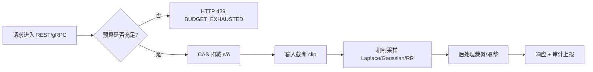

# 差分隐私与本地差分隐私技术指南 / Differential Privacy & Local DP Technical Guide

> 所属层次：隐私计算原语层（Privacy Primitives）
> 对应代码：`services/privacy-engine/sdk/dp/`、`services/privacy-engine/sdk/ldp/`、`services/privacy-engine/sdk/budget/`
> 前置阅读：`docs/learning/tech-k-anonymity.md`（微观泛化 vs 宏观加噪的分工）、`docs/learning/tech-go-gin.md`（REST 入口与错误信封）

---

## 0. 阅读导航 / Reading Guide

| 章节 | 内容 | 适合谁 |
|---|---|---|
| 1 | DP/LDP 数学定义、敏感度、机制选择、组合定理 | 需要理论底线的读者 |
| 2 | Go 包结构、调用链、状态分层原则 | 二次开发 / 架构评审 |
| 3 | `sdk/dp` 逐函数源码剖析 | 引擎维护者 |
| 4 | `sdk/ldp` 随机响应 / O-RR / 无偏还原 | 数据采集端开发 |
| 5 | `sdk/budget` 无锁原子会计与窗口重置 | SRE / 多租户治理 |
| 6 | REST + gRPC 端点、请求体字段、错误码 | 业务接入方 |
| 7 | 全部可调项与默认值 | 部署实施 |
| 8 | 单测、Python 对齐测试、基准命令与解读 | QA |
| 9 | 反模式清单与修复方式 | 上线前自查 |
| 10 | 症状 → 根因 → 处置 | 值班排障 |

---

## 1. 技术简介 / Introduction

**差分隐私（Differential Privacy, DP）** 由 Cynthia Dwork 等人于 2006 年提出，是目前唯一具备严格数学证明、且对任意背景知识攻击者都成立的隐私保护标准。其核心目标是：使攻击者即便拥有任意辅助信息，也无法从机制输出中可靠判断某条特定记录是否存在于原始数据集中。

### 1.1 核心数学定义 / Mathematical Foundation

设 $D$ 与 $D'$ 为仅相差一条记录的任意相邻数据集（$\|D \Delta D'\|_1 = 1$），$M$ 为随机化机制：

- **纯差分隐私（$\epsilon$-DP）**：对任意可测输出集合 $S \subseteq \mathrm{Range}(M)$，

  $$\Pr[M(D) \in S] \le e^{\epsilon} \cdot \Pr[M(D') \in S]$$

  $\epsilon$ 称为隐私损失预算。$\epsilon$ 越小保护越强、效用越低。经验区间：$\epsilon \le 1$ 强保护（人口普查级），$1 < \epsilon \le 10$ 中等（多数统计发布），$\epsilon > 10$ 弱（仅抗穷举关联）。

- **近似差分隐私（$(\epsilon, \delta)$-DP）**：

  $$\Pr[M(D) \in S] \le e^{\epsilon} \cdot \Pr[M(D') \in S] + \delta$$

  $\delta$ 为「保证失效」的概率，生产上通常要求 $\delta \ll 1/|D|$（例如 $|D|=10^6$ 时取 $\delta \le 10^{-5}$）。本项目 `BudgetAccountant` 默认总额 $\delta = 0.01$（见 §5），属于**账户级上限**而非单次查询级，使用时需按调用次数做预算化拆分。

- **Rényi 差分隐私（RDP）**：以 Rényi 散度阶 $\alpha$ 参数化的松弛定义 $\big(\alpha, \epsilon_{\mathrm{RDP}}(\alpha)\big)$。优势是**组合可加**（$k$ 次调用的 RDP 成本直接相加），因此高斯机制的长期预算追踪在深度学习场景普遍采用 RDP → $(\epsilon,\delta)$-DP 的转换上界：

  $$\epsilon_{\mathrm{DP}} \le \epsilon_{\mathrm{RDP}}(\alpha) + \frac{\log(1/\delta)}{\alpha - 1}$$

  !!! note "本项目当前不实现 RDP 记账器"
      Go 引擎的预算扣减采用**顺序组合（Basic Composition）**线性累加 $\sum_i \epsilon_i \le \epsilon_{\text{total}}$，保守但绝对安全。若需要 RDP / moments accountant 级别的紧确界收紧，应在调用侧离线计算后再申请预算，或在 `sdk/budget` 扩展记账器（现有 `Consume(epsilon, delta)` 接口已为此预留位置）。

- **本地差分隐私（Local DP, LDP）**：数据主体在**自己设备上**完成扰动后再上传，中心方从始至终接触不到明文。LDP 的信任假设强于中心式 DP，代价是同等 $\epsilon$ 下方差更大（约 $O(k/\epsilon^2)$）。

### 1.2 敏感度与机制选择 / Sensitivity & Mechanism Selection

查询函数 $f$ 的全局敏感度定义为相邻数据集上输出的最大距离：

- $L_1$ 敏感度：$\Delta_1 f = \max_{D \Delta D'} \|f(D) - f(D')\|_1$ → 搭配 **Laplace 机制**，噪声尺度 $b = \Delta_1 f / \epsilon$；
- $L_2$ 敏感度：$\Delta_2 f = \max_{D \Delta D'} \|f(D) - f(D')\|_2$ → 搭配 **Gaussian 机制**，标准差

  $$\sigma \ge \frac{\Delta_2 f \cdot \sqrt{2\ln(1.25/\delta)}}{\epsilon}$$

  这是经典 Dwork–Roth 定理 B.6 的解析高斯界，本项目 `AddGaussianNoise` 严格使用该式。

| 统计量 | $L_1$ 敏感度 | $L_2$ 敏感度 | 推荐机制 | 项目实现 |
|---|---|---|---|---|
| Count | $1$ | $1$ | Laplace | `dp.NoisyCount` |
| Sum（值域 $[lo,hi]$，逐值截断） | $hi - lo$ | $hi - lo$ | Laplace | `dp.NoisySum` / `dp.Aggregate` |
| Mean（$n$ 公开，对称截断 $\pm B$） | $2B/n$ | $\sqrt{2}B/n$ | Gaussian | `dp.NoisyMean`（按 $B/n$ 计，见 §3.3） |
| 直方图（每记录只落 1 桶） | $1$ | $1$ | Laplace（各桶独立） | `dp.NoisyHistogram` |
| 向量求和（$L_2$ 截断 $C$，$d$ 维） | $\sqrt d \cdot C$ | $C$ | Laplace 向量 | `dp.VectorSum` |
| 向量均值（$n$ 公开，截断 $C$） | $\sqrt d \cdot C/n$ | $C/n$ | Laplace 向量 | `dp.VectorMean` |

!!! warning "敏感度必须与「实际截断」一致"
    Laplace/Gaussian 机制只在声明的 $\Delta$ **不小于真实敏感度**时成立。若声明 $\Delta = 1$ 但输入未截断（真实敏感度无界），隐私保证直接失效。项目的 REST 层因此在加噪前强制调用 `clipValues()`（`services/privacy-engine/internal/rest/routes.go`），保证「声明敏感度 = 实际截断宽度」。

### 1.3 组合定理 / Composition Theorems

同一数据集上多次查询的隐私成本会累积，这是预算记账存在的根本原因：

1. **顺序组合（Basic）**：$k$ 个机制各满足 $\epsilon_i$-DP，组合满足 $\big(\sum_i \epsilon_i\big)$-DP。`BudgetAccountant.Consume` 即按此线性累加。
2. **并行组合（Parallel）**：若各机制作用于**两两不相交**的数据子集，组合满足 $\max_i \epsilon_i$-DP。`dp.GroupBy` / `dp.Aggregate` 采用**均匀切分**（$\epsilon/k$）而非并行免消耗，代码注释明确了这一取舍：

   ```go
   // 按 DP 基本组合定理将 (ε,δ) 均匀分配至各分组：
   // k 个分组各消耗 ε/k，总隐私成本 = k × (ε/k) = ε。
   ```

   因为分组归属由数据内容决定（一条记录的增删可能改变其所属分组），**不能**按并行组合处理，该实现是正确且保守的。
3. **高级组合（Advanced）**：$k$ 次 $\epsilon$-DP 查询的组合在任意 $\delta>0$ 下满足 $\big(O(\epsilon\sqrt{k\log(1/\delta)}), \delta\big)$-DP。迭代型查询（如自适应阈值搜索）可用此收紧界离线核算。

### 1.4 后处理不变性 / Post-Processing Immunity

若 $M$ 满足 $\epsilon$-DP，则对任意（甚至计算不可行的）函数 $f$，$f \circ M$ 仍满足 $\epsilon$-DP。工程含义：**加噪之后的取整、裁剪到合法区间、格式化、二次聚合、告警规则匹配都不需要再次消耗预算**。项目中的 `math.Max(0, ·)` 截断、`math.Round` 取整、直方图归一化均属安全的后处理。

### 1.5 三种信任模型对比 / Central vs Local vs Distributed

| 维度 | 中心式 DP（CDP） | 本地 DP（LDP） | 安全聚合 + DP |
|---|---|---|---|
| 明文可见方 | 数据持有方（可信查询者） | 仅数据主体本人 | 仅本机；聚合方只见密文 |
| 噪声注入位置 | 服务端聚合后 | 客户端上报前 | 客户端 + 服务端双层 |
| 同等 $\epsilon$ 下误差 | 最小（$O(\Delta/\epsilon)$） | 较大（$O(\sqrt{k}/(\epsilon\sqrt n))$） | 介于两者之间 |
| 是否需预算记账 | **必须**（`budget`） | 不需要（预算天然分散在端侧） | 需要 |
| 项目落点 | `sdk/dp` + `sdk/budget` | `sdk/ldp` | `dp.VectorSum/Mean`（累加器语义） |

---

## 2. 在 PrivShield 中的实现全景 / Implementation Map

### 2.1 包与模块归属 / Module Layout

隐私原语位于独立 Go 模块 `services/privacy-engine/sdk`（module path `github.com/fengzhizi319/PrivShield-go/privacy-go-sdk`），可脱离引擎主体被直接 import：

| 包 | 路径 | 规模 | 职责 | 状态 |
|---|---|---|---|---|
| `dp` | [`services/privacy-engine/sdk/dp/dp.go`](services/privacy-engine/sdk/dp/dp.go) | 490 行 | Laplace/Gaussian、截断、向量、自适应截断、分组与多指标聚合 | **零状态纯函数** |
| `ldp` | [`services/privacy-engine/sdk/ldp/ldp.go`](services/privacy-engine/sdk/ldp/ldp.go) | 463 行 | RR / O-RR / 数值 LDP / 批量扰动 / 无偏频率还原 | **零状态纯函数** |
| `budget` | [`services/privacy-engine/sdk/budget/budget.go`](services/privacy-engine/sdk/budget/budget.go) | 160 行 | $(\epsilon,\delta)$ 无锁原子预算会计 + 窗口重置 | **有状态，唯一** |

工作区由 `go.work` 同时纳管 `services/privacy-engine` 与其子模块 `services/privacy-engine/sdk`，因此修改 `sdk` 后无需 `go mod tidy` 即可在引擎侧生效。

### 2.2 调用链路 / Call Chain

```text
                     客户端请求 / Client Request
                                │
        ┌───────────────────────┴────────────────────────┐
        ▼                                                ▼
  REST :8079 /v1/privacy/dp/*, /v1/privacy/ldp/*   gRPC :50051 PrivacyService
  internal/rest/routes.go                          internal/grpcserver/typed_server.go
        │                                                │
        └───────────────────────┬────────────────────────┘
                                ▼
                  service.PrivacyService（编排层，有状态）
                  internal/service/service.go
                                │
             ┌──────────────────┴──────────────────┐
             ▼                                     ▼
   budget.BudgetAccountant.Consume(ε, δ)   纯函数原语 dp.* / ldp.*
   失败 → "privacy budget exhausted"        （零状态，多核分块并行）
             │                                     │
             └──────────────────┬──────────────────┘
                                ▼
                    标准 5 字段信封 JSON / Protobuf 响应
                    {"result": <noisy>, "epsilon": <ε>}
```



### 2.3 分层原则：数学原语无状态，状态集中在编排层

这是本项目最重要的架构约束（见 `AGENTS.md` §7）：

- `sdk/dp`、`sdk/ldp` 中的函数**不读取任何业务全局变量**（除并发安全的随机源），因此可在任意 goroutine 中并行复用、可被单元测试直接调用、可被 gRPC 与 REST 两条协议栈共享；
- 预算扣减**只发生在 `PrivacyService` 编排层**（`internal/service/service.go`），保证「先扣预算，后出噪声」在任何调用路径上都不可绕过；
- 直接 `import github.com/fengzhizi319/PrivShield-go/privacy-go-sdk/dp` 的调用方**不会**消耗预算——这既是灵活性（离线批量分析、SDK 内嵌），也是责任边界：此时预算治理由调用方自行保证。

---

## 3. 集中式差分隐私原语详解 / Centralized DP Primitives

源码：[`services/privacy-engine/sdk/dp/dp.go`](services/privacy-engine/sdk/dp/dp.go)

### 3.1 噪声采样：Laplace 与 Gaussian

```go
// AddLaplaceNoise 为数值添加 Laplace 噪声。
// scale = sensitivity / epsilon，满足 ε-差分隐私。
// epsilon <= 0 时直接返回原值（无隐私保护）。
func AddLaplaceNoise(value, epsilon, sensitivity float64) float64 {
	if epsilon <= 0 || sensitivity <= 0 {
		return value
	}
	scale := sensitivity / epsilon
	u := rand.Float64() - 0.5
	sgn := 1.0
	if u < 0 {
		sgn = -1.0
	}
	noise := -scale * sgn * math.Log(1.0-2.0*math.Abs(u))
	return value + noise
}
```

要点：

1. **逆变换采样（Inverse CDF）**。设 $U \sim \mathrm{Uniform}(-\tfrac12, \tfrac12)$，则 $-\beta\,\mathrm{sgn}(U)\ln(1-2|U|) \sim \mathrm{Laplace}(0,\beta)$。相比「两个指数分布相减」，该式只做一次 `log` 且分支更少。
2. **`epsilon <= 0` 短路返回原值**。这是**不加保护**的语义（等价于 $\epsilon = \infty$），不是报错；REST/gRPC 通过 `binding:"required"` 强制 $\epsilon > 0$，SDK 层保持纯数学语义以便复用。
3. 随机源为 `math/rand/v2` 的全局函数：Go 1.22+ 起其内部为**按线程分片的 ChaCha8 源**，并发安全、无需 `Seed`、无全局锁竞争，吞吐远高于 `crypto/rand`。

```go
// AddGaussianNoise 为数值添加 Gaussian 噪声。
// sigma = sqrt(2 * ln(1.25/delta)) * sensitivity / epsilon，
// 满足 (ε,δ)-差分隐私。
func AddGaussianNoise(value, epsilon, delta, sensitivity float64) float64 {
	if epsilon <= 0 || delta <= 0 || sensitivity <= 0 {
		return value
	}
	sigma := math.Sqrt(2.0*math.Log(1.25/delta)) * sensitivity / epsilon
	return value + boxMullerNormal()*sigma
}

// boxMullerNormal 使用 Box-Muller 变换生成标准正态分布随机数。
func boxMullerNormal() float64 {
	u1 := rand.Float64()
	u2 := rand.Float64()
	for u1 == 0 { // 避免 log(0) → -Inf
		u1 = rand.Float64()
	}
	return math.Sqrt(-2.0*math.Log(u1)) * math.Cos(2.0*math.Pi*u2)
}
```

`delta <= 0` 时同样短路——因为 $\sqrt{2\ln(1.25/\delta)}$ 在 $\delta \to 0$ 时发散，语义上表示「不允许使用 Gaussian 机制」。若需要 $\delta = 0$ 的保证，请改用 Laplace 机制（$\epsilon$-DP）。

Box-Muller 每次生成两个正态数但只取 `Cos` 一支，另一半被丢弃：这是**有意的简单性取舍**（避免引入需同步的缓存状态），额外一次 `rand.Float64()` 的成本在噪声主导的计算中可忽略。

!!! tip "对比：Marsaglia polar 方法"
    若基准显示 `AddGaussianNoise` 成为热点，可换极坐标拒绝法省掉 `sqrt/log/cos`；但任何**拒绝采样**都会引入「运行时长与随机值相关」的时间侧信道，需与 §9.2 一并权衡。

### 3.2 截断算子：Clipping

```go
// ClipValue 将数值截断至 [-bound, +bound] 区间。
func ClipValue(value, bound float64) float64 { ... }

// ClipValueRange 将数值截断至 [lower, upper] 区间。
// 用于差分隐私聚合的有界敏感度截断：值域 [lower, upper] 确保
// sum 敏感度 = upper - lower 有界，满足 ε-DP 保证。
func ClipValueRange(value, lower, upper float64) float64 { ... }

// ClipL2Norm 将向量截断至 L2 范数不超过 maxNorm。
// 返回截断后的新切片（不修改原切片）。
func ClipL2Norm(vec []float64, maxNorm float64) []float64 {
	if maxNorm <= 0 || len(vec) == 0 {
		return vec
	}
	var sumSq float64
	for _, v := range vec {
		sumSq += v * v
	}
	norm := math.Sqrt(sumSq)
	if norm <= maxNorm {
		result := make([]float64, len(vec))
		copy(result, vec)
		return result
	}
	scale := maxNorm / norm
	result := make([]float64, len(vec))
	for i, v := range vec {
		result[i] = v * scale
	}
	return result
}
```

设计约定：

- **不修改入参切片**。`ClipL2Norm` 即使范数已达标也返回**拷贝**，保证调用方原始数据不被隐式改写（纯函数契约）。
- `maxNorm <= 0` 时**原样返回**而非报错，语义为「不做截断」。注意此时若把 `maxNorm` 直接当敏感度传给加噪函数会得到 0（等于不加噪）——批量接口通过内联截断规避了这一路径（见 §3.4），但手工组合 `ClipL2Norm` + `AddLaplaceVector` 时必须自行保证界为正。
- 三个截断函数均与历史 Python 实现做数值对齐（`TestAlignPython_ClipValue`、`TestAlignPython_ClipL2Norm`）。

### 3.3 统计聚合：NoisyCount / NoisySum / NoisyMean

```go
// NoisyCount 计算计数并添加 Laplace 噪声（敏感度 = 1）。
func NoisyCount(count int, epsilon float64) float64 {
	return AddLaplaceNoise(float64(count), epsilon, 1.0)
}

// NoisyMean 计算均值并添加 Gaussian 噪声。
// 先对每个值截断至 [-clipBound, +clipBound]，再计算均值并加噪。
func NoisyMean(values []float64, epsilon, delta, clipBound float64) float64 {
	if len(values) == 0 {
		return 0
	}
	var sum float64
	for _, v := range values {
		sum += ClipValue(v, clipBound)
	}
	mean := sum / float64(len(values))
	// 均值的敏感度 = clipBound / n
	sensitivity := clipBound / float64(len(values))
	return AddGaussianNoise(mean, epsilon, delta, sensitivity)
}
```

敏感度推导（理解 $B/n$ 的来源）：设相邻数据集**样本数相同**（$n$ 固定），仅第 $j$ 条记录变化，则

$$|\bar{x}(D) - \bar{x}(D')| = \frac{|x_j - x'_j|}{n} \le \frac{2B}{n}$$

代码取 $B/n$，隐含建模假设为「一条记录的加入/离开使**分子**变化不超过 $B$」（$n$ 视为公开分母，且值域语义偏向 $[0, B]$）。两种口径都是行业常见做法，但**不可混用**：

!!! danger "均值敏感度的两个前提必须显式声明"
    1. **$n$ 是否公开**：若 $n$ 本身由被保护记录决定（如「某科室患者均值」，人数即敏感信息），必须同时对 `NoisyCount` 加噪并用**含噪分母**做除法，敏感度按比值界另算；
    2. **截断界 $B$ 的符号**：`ClipValue` 是对称截断 $[-B, B]$，若真实值域是 $[0, B]$（血压、评分），对称截断会把敏感度高估一倍（保守但降效用）。项目 `dp.Aggregate` 的 `mean` 分支因此在注释中明确「`bound` 取 `clipLower/clipUpper` 绝对值的较大者」。

`NoisyMean` 在 `len(values) == 0` 时返回 `0`——这是**后处理常量**，不泄露信息，但会造成「无数据」与「真实 0」歧义，REST 层通过 `INVALID_ARGUMENT` 提前拒绝空 `values`。

### 3.4 向量聚合与单趟流式零分配

`VectorMean` / `VectorSum` 与 Python `dp_vector_mean`/`dp_vector_sum` 对齐，实现上做了两处工程优化：

```go
// VectorMean 计算向量均值并添加 Laplace 向量噪声。
// 单趟流式计算：在线截断 L2 范数并融合累加，消除中间切片分配。
func VectorMean(vectors [][]float64, maxNorm float64, epsilon float64) []float64 {
	n := len(vectors)
	if n == 0 { return nil }
	dim := len(vectors[0])
	if dim == 0 { return nil }

	sum := make([]float64, dim)
	for _, v := range vectors {
		var normSq float64
		vLen := len(v)
		for j := 0; j < dim && j < vLen; j++ {
			normSq += v[j] * v[j]
		}
		norm := math.Sqrt(normSq)
		scale := 1.0
		if maxNorm > 0 && norm > maxNorm {
			scale = maxNorm / norm
		}
		for j := 0; j < dim && j < vLen; j++ {
			sum[j] += v[j] * scale
		}
	}

	num := float64(n)
	mean := make([]float64, dim)
	for j := 0; j < dim; j++ {
		mean[j] = sum[j] / num
	}

	sensitivity := maxNorm / num
	return AddLaplaceVector(mean, epsilon, sensitivity)
}
```

1. **融合「截断 + 累加」**：不再先 `ClipL2Norm` 生成中间切片再累加，而是同一趟内联完成；对 10 万条 768 维向量可省掉 10 万次切片分配，GC 压力从 $O(n \times d)$ 降为 $O(d)$。
2. **逐分量独立加 Laplace 噪声**（`AddLaplaceVector`）等价于按保守界做各分量独立 $\epsilon$-Laplace，实现简单、无相关性假设。若需要各分量共享预算的严格多元高斯机制，应改为对整向量采样一次多元正态（当前未实现，作为演进方向记录）。
3. **维度不一致容错**：`j < dim && j < vLen` 双条件确保短向量按 0 补齐、长向量尾部被忽略，不会 panic；但也意味着**调用方必须保证维度同质**（Python 侧由 NumPy 强制矩阵，Go 侧留为宽松语义）。
4. `VectorSum` 与 `VectorMean` 唯一差别是不除以 $n$、敏感度取 `maxNorm`，且不做归一化后处理。

### 3.5 自适应截断：AdaptiveClip

固定截断界需要预知数据分布；`AdaptiveClip` 用 DP 分位数估计在**不额外泄露数据**的前提下自动搜索上界（思想源自 DP-SGD 的 adaptive clipping）：

```go
func AdaptiveClip(values []float64, epsilon float64, targetQuantile float64,
	numIterations int, initialClip float64) (float64, float64)
```

| 参数 | 非法值回落 | 含义 |
|---|---|---|
| `epsilon` | 必填 | 总预算，内部均分到每次迭代 |
| `targetQuantile` | `0.95`（$\le 0$ 或 $\ge 1$） | 目标分位数，即希望约 95% 的值不被截断 |
| `numIterations` | `15`（$\le 0$） | 搜索轮数，每轮消耗 `epsilon/numIterations` |
| `initialClip` | `10.0`（$\le 0$） | 搜索起点 |

算法骨架：

```go
epsPerIter := epsilon / float64(numIterations)
curClip := initialClip
// ... 按 runtime.GOMAXPROCS(0) 计算 numWorkers（上限 16）与 chunkSize
for i := 0; i < numIterations; i++ {
    // n <= 10000 走单核直扫；否则多核分块计数后归并
    noisyBelow := NoisyCount(belowCount, epsPerIter)   // 关键：计数先加噪
    frac := noisyBelow / totalCount
    if frac < targetQuantile {
        curClip *= 1.5
    } else {
        curClip *= 0.85
    }
}
return 0.0, curClip
```

要点与代价：

- **每次迭代都真实消耗一次 Laplace 噪声**，$\epsilon$ 均分 ⇒ 轮数越多单轮预算越小、判定越抖。15 轮 + $\epsilon=1$ 时每轮 $\epsilon \approx 0.067$，对小样本（$n < 10^3$）会明显震荡，建议降至 5~8 轮或直接固定截断。
- 返回值为 `(0.0, curClip)`，即**下界恒为 0**——面向「非负梯度范数 / 非负费用」场景。数据可能为负时需调用方自行取对称界。
- $n > 10000$ 时启用无锁分块并行，分块计数是**精确求和**（各 worker 写各自槽位 `localCounts[workerID]`，无数据竞争），加噪只发生在归并后的总计数上，因此并行不改变隐私保证。
- 结果**不具复放确定性**（含随机性），因此 REST 响应必须把最终 `clip_upper` 回传并落审计；后续正式聚合复用该界值时不再重复搜索、也不再消耗估界预算。

### 3.6 分组与多指标聚合：GroupBy / Aggregate

这两个函数是「DataFrame 风格」的高层入口，直接吃 `[]map[string]string`（CSV/JSON 行记录）：

```go
func GroupBy(rows []map[string]string, groupCol, targetCol, agg string,
	epsilon, delta, clipLower, clipUpper float64, mechanism string) (map[string]float64, error)

func Aggregate(rows []map[string]string, specs map[string]string,
	epsilon, delta, clipLower, clipUpper float64, mechanism string) (map[string]float64, error)
```

实现细节（容易踩坑处）：

1. **数值解析是宽松前缀扫描**，非严格 JSON 数字校验：

   ```go
   for i, r := range tStr {
       if (r >= '0' && r <= '9') || r == '.' || r == '-' {
           continue
       }
       tStr = tStr[:i]
       break
   }
   var parsed float64
   n, _ := fmt.Sscanf(tStr, "%f", &parsed)
   if n > 0 {
       val = parsed
   }
   ```

   - 优点：`"72.5 kg"` 这类带单位的脏数据可容错（→ `72.5`）；
   - 缺点：`"未知"` 解析失败并**按 0 计入**，会静默改变均值/求和；空串同样按 0 计入。含缺失值的列应先在分类/清洗层处理，或在调用侧过滤。
   - 该扫描按 **byte 索引切 UTF-8 串**，遇到中文（首字节 $\ge 0x80$）即在第一个非数字字节处截断，不会越界或产生非法切片。

2. **分组缺失值归入 `"unknown"` 桶**（`groupCol` 为空串时）。

3. **预算均分**：`GroupBy` 按分组数、`Aggregate` 按指标数（`len(specs)`）均分 $\epsilon$ 与 $\delta$。注意**分组/指标数量本身依赖数据内容**（参数依赖型组合）：严格口径应按**可能的最大分组数**切分，否则分组数波动会悄悄改变单组实际预算。

4. **输出 key 约定**：`Aggregate` 返回 `"<列名>_<算子小写>"`（如 `age_mean`、`dept_count`）；`GroupBy` 返回分组值本身作为 key。

5. **算子兜底**：未知 `agg` 一律降级为 `count`，不返回错误——便于宽表配置容忍脏算子，但也意味着拼写错误（`avarage`）会静默变成计数，排查时应比对请求 `specs` 与响应 key。

6. `clipUpper <= clipLower` 时自动放宽为 `clipLower + 1`，敏感度 $\ge 1$，避免除零与零敏感度不加噪；仅当 `mechanism == "gaussian"` 且 `delta > 0` 时才走 Gaussian，否则回落 Laplace。

---

## 4. 本地差分隐私原语详解 / Local DP Primitives

源码：[`services/privacy-engine/sdk/ldp/ldp.go`](services/privacy-engine/sdk/ldp/ldp.go)

### 4.1 Warner 二值随机响应

```go
// RandomizedResponse 对布尔值执行 Randomized Response。
// 以概率 p = e^ε / (1 + e^ε) 返回真实值，以概率 1-p 返回翻转值。
// 满足 ε-本地差分隐私。
func RandomizedResponse(value bool, epsilon float64) bool {
	if epsilon <= 0 {
		return value
	}
	p := math.Exp(epsilon) / (1 + math.Exp(epsilon))
	if rand.Float64() < p {
		return value
	}
	return !value
}
```

$\dfrac{e^\epsilon}{1+e^\epsilon} = \dfrac{1}{1+e^{-\epsilon}}$，即 sigmoid。批量实现 `PerturbBinaryBatch` 与 `perturbBinary` 采用后者 `1.0 / (1.0 + math.Exp(-epsilon))`：数值上避免 $\epsilon$ 较大时 $e^{\epsilon}$ 溢出为 `+Inf`（$\epsilon \gtrsim 709$），此时 sigmoid 应稳定收敛到 1。

无偏还原：单条上报满足 $\mathbb{E}[Y] = p\,x + (1-p)(1-x)$，对 $n$ 个样本 $\hat p_{\text{obs}} = \frac1n\sum Y_i$，解出

$$\hat x = \frac{\hat p_{\text{obs}} - (1-p)}{2p - 1}$$

```go
// EstimateTrueCount 从 Randomized Response 结果中估计真实 true 计数。
func EstimateTrueCount(responses []bool, epsilon float64) int {
	// ...
	p := math.Exp(epsilon) / (1 + math.Exp(epsilon))
	estimated := (float64(sum) - float64(n)*(1-p)) / (2*p - 1)
	return int(math.Round(estimated))
}
```

`EstimateTrueCount` **不做 $[0,n]$ 截断**（`EstimateBinaryFrequency` 做 $[0,1]$ 截断），因为计数场景把「是否投影到物理可行区间」留给调用方决定；截断属于后处理，不破坏 LDP 保证。

!!! warning "$\epsilon \to 0$ 时分母 $2p-1 \to 0$"
    $p \to 0.5$ 使 $2p-1 \to 0$，估计方差 $\propto \frac{1}{(2p-1)^2}$ 发散。两个估计函数都用 `epsilon <= 0` 短路返回 0 规避除零，但 $\epsilon = 0.05$ 这类「极小正预算」仍会产出天文数字。实践中 $\epsilon < 0.2$ 时应改报**频率估计 + 置信区间**，并明确告知调用方该查询在此预算下不可用。

### 4.2 多类别优化随机响应（O-RR）与频数还原

```go
// ORRResponse 对离散类别执行 Optimized Randomized Response。
// 以概率 p = e^ε / (e^ε + k - 1) 返回真实值，
// 以概率 1-p 均匀随机返回其他 k-1 个值之一。
func ORRResponse(value int, epsilon float64, domainSize int) int {
	if domainSize <= 1 || epsilon <= 0 {
		return value
	}
	p := math.Exp(epsilon) / (math.Exp(epsilon) + float64(domainSize) - 1)
	if rand.Float64() < p {
		return value
	}
	other := rand.IntN(domainSize - 1)
	if other >= value {
		other++
	}
	return other
}
```

- `other >= value → other++` 是**在 $k-1$ 个「非真实类别」上等概率取样**的简洁写法：从 $[0, k-2]$ 均匀取值并跳过自身编号，即得 $[0,k-1]\setminus\{value\}$ 上的均匀分布，全程一次 `IntN`、无额外切片分配。
- 真实值保留概率 $p = \frac{e^\epsilon}{e^\epsilon + k - 1}$，任一**错误**类别的概率 $q = \frac{1-p}{k-1}$。

频数还原（`EstimateFrequency`）：

$$\text{count}_i = \frac{n_i - n \cdot q}{p - q}, \quad \text{随后 } \max(0, \cdot) \text{ 截断}$$

并附带一个**样本总量守恒的保形校准**后处理：

```go
// 样本总数守恒保形校准
if estSum > 0 && estSum != n && n > 10 {
    scale := float64(n) / float64(estSum)
    // 按比例缩放后，把累积的整数误差 diff 全部并入最大桶
    diff := n - newSum
    if diff != 0 && domainSize > 0 {
        maxIdx := /* argmax(estimated) */
        if estimated[maxIdx]+diff >= 0 {
            estimated[maxIdx] += diff
        }
    }
}
```

条件 `n > 10` 是为避免小样本下缩放把噪声平摊到所有桶、破坏单桶可读性；误差并入最大桶是「相对误差最小」的常用启发式。

!!! note "校准改变了无偏性"
    逐桶无偏估计之和的期望本应为 $n$，但因 $[0,\infty)$ 截断，`estSum` 会系统性偏离；归一化把结果变成**有偏但总量守恒**的估计。做假设检验/显著性分析时应使用未归一化的原始估计并自行处理方差。

### 4.3 数值型 LDP

```go
// NumericLDP 对 [lower, upper] 区间内的数值添加本地差分隐私噪声。
// 使用简化的分段机制：将值归一化至 [0, 1]，添加 Laplace 噪声后截断回区间。
func NumericLDP(value, lower, upper, epsilon float64) float64 {
	if upper <= lower || epsilon <= 0 {
		return value
	}
	normalized := (value - lower) / (upper - lower)
	noisy := AddLaplaceSimple(normalized, epsilon) // 敏感度 = 1
	noisy = math.Max(0, math.Min(1, noisy))
	return lower + noisy*(upper-lower)
}
```

归一化后单条记录的 $L_\infty$ 距离为 1（等价 $L_1$ 敏感度 1），故 `scale = 1/ε`；裁剪到 $[0,1]$ 是后处理。这是**简化版**（非 Piecewise/Optimal 数值机制）：效用随 $\epsilon$ 变小快速劣化，长尾分布数据（住院费用、检验值）应先做对数/分位数变换再进 `NumericLDP`。

### 4.4 批量扰动的多核无锁分块模型

`PerturbBinaryBatch` 与 `PerturbCategoricalBatch` 是本仓库「高频批量计算统一采用无锁分块多核并行」规范的标准样板：

```go
// 概率 p 仅在循环外计算一次
p := 1.0 / (1.0 + float64(k-1)*math.Exp(-epsilon))

// 预先为每个类别构建"其他类别列表"，消除循环内动态切片分配
othersMap := make(map[string][]string, k)
for _, cat := range categories {
    others := make([]string, 0, k-1)
    for _, other := range categories {
        if other != cat {
            others = append(others, other)
        }
    }
    othersMap[cat] = others
}

if n <= 1024 { /* 单核直扫，避免 goroutine 创建开销 */ return result }

numWorkers := runtime.GOMAXPROCS(0)
if numWorkers > 16 { numWorkers = 16 }
if numWorkers > n { numWorkers = n }
chunkSize := (n + numWorkers - 1) / numWorkers
var wg sync.WaitGroup
for w := 0; w < numWorkers; w++ {
    // ... 计算 [startIdx, endIdx)
    wg.Add(1)
    go func(s, e int) {
        defer wg.Done()
        // per-worker 独立随机源，消除全局 math/rand 锁竞争
        rng := rand.New(rand.NewPCG(rand.Uint64(), rand.Uint64()))
        for i := s; i < e; i++ { /* rng.Float64() < p ? 保留 : 换类别 */ }
    }(startIdx, endIdx)
}
wg.Wait()
```

四层优化逐条对应真实瓶颈：

| 优化 | 消除的成本 | 关键约束 |
|---|---|---|
| $n \le 1024$ 走串行 | goroutine 创建 + `WaitGroup` 同步开销 | 阈值为经验值，可用基准复现拐点 |
| $p$ 与 `othersMap` 提到循环外 | 每元素一次 `Exp`、每元素一次 $O(k)$ 切片构造 | 二者只依赖 $\epsilon$ 与类别表，语义等价 |
| worker 数 $\le 16$ 且 $\le n$ | 高核机器上 goroutine 数量爆炸、RNG 初始化成本 | 避免 $n$ 小时出现 $n$ 个 worker |
| 每 worker 独立 `rand.NewPCG` | 全局随机源锁竞争 | worker 间统计独立，种子取自全局 ChaCha8 源 |

**并行不改变隐私语义**：每个元素的扰动只依赖自身与 $\epsilon$，worker 划分不影响边际分布；写入使用不相交的 `result[s:e]` 区间，无数据竞争（`-race` 已覆盖）。

`PerturbBinaryBatch` 中非 `0/1` 的输入**原样透传**（`result[i] = v`）：语义为「越界值不属于本机制定义域，既不扰动也不报错」。这对上游脏数据友好，但意味着**不能**用它做输入校验。

### 4.5 与 Python `LocalDPApi` 对齐的函数

| Go 函数 | Python 对应 | 输出 | 特殊语义 |
|---|---|---|---|
| `PerturbBinaryBatch` | `perturb_binary_batch` | `[]int` | 非 0/1 透传 |
| `PerturbCategoricalBatch` | `perturb_categorical_batch` | `[]string` | 值不在 `categories` 内时**从全集中随机取值**（`categories[rand.IntN(k)]`），即越界值也被扰动而非透传 |
| `EstimateBinaryFrequency` | `estimate_binary_frequency` | `float64 \in [0,1]` | $\epsilon \le 0$ 或空输入返回 0 |
| `EstimateCategoricalHistogram` | `estimate_categorical_histogram` | `map[string]float64`，和为 1 | $k<2$ / $n=0$ / $\epsilon\le0$ 回落均匀分布 |

`EstimateCategoricalHistogram` 输出频率（而非计数）并强制归一，便于前端直接绘制分布图；三条退化路径都返回**合法概率分布**，调用方不会拿到 `NaN`。

---

## 5. 隐私预算记账 / Budget Accounting

源码：[`services/privacy-engine/sdk/budget/budget.go`](services/privacy-engine/sdk/budget/budget.go)

### 5.1 用 atomic.Uint64 承载 float64

```go
// BudgetAccountant 管理 (ε, δ) 隐私预算的扣减与查询。
type BudgetAccountant struct {
	// 使用 atomic 浮点位操作实现无锁并发
	totalEpsilonBits atomic.Uint64 // 总 ε 预算（以 uint64 位表示）
	usedEpsilonBits  atomic.Uint64 // 已消耗 ε
	totalDeltaBits   atomic.Uint64 // 总 δ 预算
	usedDeltaBits    atomic.Uint64 // 已消耗 δ

	// 滑动窗口重置
	windowSeconds int64
	lastResetTime atomic.Int64
}

func NewBudgetAccountant(totalEpsilon, totalDelta float64, windowSeconds int64) *BudgetAccountant {
	ba := &BudgetAccountant{windowSeconds: windowSeconds}
	ba.totalEpsilonBits.Store(math.Float64bits(totalEpsilon))
	ba.totalDeltaBits.Store(math.Float64bits(totalDelta))
	ba.lastResetTime.Store(time.Now().Unix())
	return ba
}
```

Go 早期版本的 `sync/atomic` 没有 `atomic.Float64`，标准做法即用 `math.Float64bits` / `math.Float64frombits` 把浮点位模式塞进 `uint64` 原子字。额外收益：CAS 判等是**位模式相等**，不受浮点比较语义（`-0.0 == 0.0`、`NaN`）干扰。

结构体含 `atomic.Uint64`，**不可复制**（`go vet` copylocks 会告警），必须按指针传递——`NewBudgetAccountant` 返回 `*BudgetAccountant` 正是为此。

### 5.2 Consume：CAS 循环 + 跨字段回滚

```go
// Consume 尝试扣减 (ε, δ) 预算。
// 若剩余预算不足则返回 false，不做任何扣减。
// 使用严格无锁 CAS 循环保障并发安全与原子回滚。
func (ba *BudgetAccountant) Consume(epsilon, delta float64) bool {
	ba.maybeReset()
	totalE := ba.TotalEpsilon()
	totalD := ba.TotalDelta()

	// 1. 原子扣减 ε 预算（CAS 循环每次从当前 oldBits 反解真实值）
	for {
		oldEBits := ba.usedEpsilonBits.Load()
		curUsedE := math.Float64frombits(oldEBits)
		newEVal := curUsedE + epsilon
		if newEVal > totalE {
			return false
		}
		if ba.usedEpsilonBits.CompareAndSwap(oldEBits, math.Float64bits(newEVal)) {
			break
		}
	}

	if delta <= 0 {
		return true
	}

	// 2. 原子扣减 δ 预算
	for {
		oldDBits := ba.usedDeltaBits.Load()
		curUsedD := math.Float64frombits(oldDBits)
		newDVal := curUsedD + delta
		if newDVal > totalD {
			// δ 超限，原子回滚刚才已扣减的 ε
			ba.rollbackEpsilon(epsilon)
			return false
		}
		if ba.usedDeltaBits.CompareAndSwap(oldDBits, math.Float64bits(newDVal)) {
			break
		}
	}
	return true
}
```

关键性质与边界：

1. **线性化点**：ε 的 CAS 成功即「扣减生效」。高竞争下 CAS 会重试，但每次重试都重新 `Load`，进度单调，不会活锁饿死。
2. **「检查-再写」竞态是安全的**：`newEVal > totalE → return false` 基于读取瞬间的值；若在 CAS 前被其他 goroutine 抢满，本次 CAS 失败并重新判定。由于**每次写入前都重新校验**，总额不会被突破。
3. **ε/δ 不是单条 CAS 的原子对**：δ 超限时通过 `rollbackEpsilon(epsilon)` 补偿回滚（同样是 CAS 循环并 `max(0, ·)` 兜底）。在「部分请求带 δ、部分不带」的混合高并发下，交错会使**瞬时观测值短暂偏高**（方向保守，不会超支），这是选择无锁而非全局互斥的有意取舍。
4. `epsilon <= 0` **不短路**，会以 `newEVal == curUsedE` 通过校验（免费放行）。是否允许 $\epsilon = 0$ 由上层输入校验决定（REST `binding:"required"` 拒绝 0），SDK 保持数学语义纯净。
5. 浮点累加存在极小误差（$\epsilon=0.1$ 累加 100 次不等于 10.0），因此判定是「$>$ 上限」而非「$\ge$」，实际可用预算可能比标称多/少约 $10^{-13}$ 量级，不影响工程结论。

### 5.3 窗口重置

```go
func (ba *BudgetAccountant) maybeReset() {
	if ba.windowSeconds <= 0 {
		return
	}
	lastReset := ba.lastResetTime.Load()
	now := time.Now().Unix()
	if now-lastReset >= ba.windowSeconds {
		if ba.lastResetTime.CompareAndSwap(lastReset, now) {
			// 重置已用预算
			ba.usedEpsilonBits.Store(0)
			ba.usedDeltaBits.Store(0)
		}
	}
}

// Reset 手动重置已用预算。
func (ba *BudgetAccountant) Reset() { /* used* = 0，推进 lastResetTime */ }
```

- 语义是**固定窗口（fixed window）**：到期后一次性清零，不做历史窗口加权衰减（代码注释称「滑动窗口」，按此理解即可）。
- `windowSeconds <= 0` 表示永不自动重置（生命周期型预算池）。
- 精度为**秒级**（`time.Now().Unix()`）。清零与「进行中的 `Consume`」之间存在窄竞态：窗口边界上已在跑的请求可能把额度写入新窗口，效果是**少许可用预算被占用**（保守方向）。
- `lastResetTime` 的 CAS 保证多 goroutine 中只有一个赢家执行清零，不会重复重置。

### 5.4 编排层集成：先扣预算，后出噪声

`internal/service/service.go` 中每个消耗预算的方法第一件事都是 `Consume`：

```go
// NoisyMean 噪声均值
func (s *PrivacyService) NoisyMean(ctx context.Context, values []float64, epsilon, delta, clipBound float64) (float64, error) {
	if !s.budget.Consume(epsilon, delta) {
		return 0, fmt.Errorf("privacy budget exhausted")
	}
	return dp.NoisyMean(values, epsilon, delta, clipBound), nil
}
```

REST 层翻译成 HTTP 429 + 标准错误码：

```go
result, err := svc.NoisyMean(c.Request.Context(), req.Values, req.Epsilon, req.Delta, req.ClipBound)
if err != nil {
	middleware.AbortWithError(c, http.StatusTooManyRequests, "BUDGET_EXHAUSTED", "隐私预算已耗尽", err.Error())
	return
}
```

不消耗预算的接口：所有 `ldp.*`（端侧扰动天然分散预算）、`kano.*`（泛化不换度）、`masking.*`（确定性变换）。
**容易漏记的预算消耗点**：`DPAdaptiveClip`、`DPGroupBy`、`DPAggregate`（`service.go:1326-1343`）。

预算状态可读、可重置：

```bash
curl -s http://127.0.0.1:8079/v1/privacy/budget
# {"total_epsilon":10,"used_epsilon":0.3,"remaining_epsilon":9.7,
#  "total_delta":0.01,"used_delta":0,"remaining_delta":0.01}

curl -s -X POST http://127.0.0.1:8079/v1/privacy/budget/reset
```

`Diagnostics` 与 `DeepHealthCheck` 也读取 `RemainingEpsilon()/TotalEpsilon()`（`service.go:1049`），剩余比例过低时在健康检查中降级提示——把它接进告警规则是上线必做项（参考 `deploy/prometheus/alerts.yml`）。

### 5.5 多实例一致性边界（重要）

| 部署形态 | 记账器 | 正确做法 |
|---|---|---|
| 单 Pod / 单进程多 goroutine | 内存 `atomic`（默认） | 开箱即用，强一致 |
| **Go 引擎多副本** | 每副本各一份内存账本 | 全局限额 = 副本数 × `TotalEpsilon`。需按副本数**折算**（3 副本想要总预算 10，则每副本配 3.33），或在网关/治理层做总额收敛 |
| 历史 Python 引擎 | `PRIVACY_BUDGET_DB` SQLite 共享库 | **Go 引擎不读取该变量**（见 `deploy/docker-compose/docker-compose.go-engine.yml` 的显式说明），迁移时勿误配 |

`Config.TotalEpsilon/TotalDelta/BudgetWindowSec` 在 `DefaultConfig()` 中为 `10.0 / 0.01 / 3600`，**当前没有环境变量入口**；需要调整必须走构造 `Config` 的代码路径（或新增读取点），而不是指望 `PRIVACY_BUDGET_DB` 生效。命名空间取自 `AGENT_NAMESPACE`（默认 `default`），仅作为审计与画像推荐的标签维度（`service.go:146`、`RecommendParams`），**不参与预算分片**。

---

## 6. API 使用手册 / API Handbook

### 6.1 REST 端点清单（前缀 `/v1/privacy`，默认 `:8079`）

| 方法 | 路径 | 消耗预算 | 服务层方法 |
|---|---|---|---|
| POST | `/dp/count` | ✅ ε | `NoisyCount` |
| POST | `/dp/sum` | ✅ ε | `NoisySum` |
| POST | `/dp/mean` | ✅ ε(+δ) | `NoisyMean` |
| POST | `/dp/histogram` | ✅ ε | `DPHistogram` |
| POST | `/dp/noisy_count` `/dp/noisy_sum` `/dp/noisy_mean` `/dp/noisy_histogram` | ✅ | 同上（Python 对齐别名） |
| POST | `/dp/chunked_count` `/dp/chunked_sum` `/dp/chunked_mean` `/dp/chunked_histogram` | ✅ **仅一次** | 分块合并后只加噪一次 |
| POST | `/dp/vector_sum` `/dp/vector_mean` | ✅ | `DPVectorSum` / `DPVectorMean` |
| POST | `/dp/aggregate` | ✅ | `DPAggregate` |
| POST | `/dp/groupby` | ✅ | `DPGroupBy` |
| POST | `/dp/adaptive_clip` | ✅ | `DPAdaptiveClip` |
| POST | `/ldp/randomized_response` `/ldp/orr` | ❌ | `RandomizedResponse` / `ORRResponse` |
| POST | `/ldp/perturb/binary` `/ldp/perturb/categorical` | ❌ | 批量扰动 |
| POST | `/ldp/estimate/*` | ❌ | 无偏还原 |
| GET | `/budget` | ❌ | `BudgetStatus` |
| POST | `/budget/reset` | ❌ | `BudgetReset` |

路由注册与 curl 示例内嵌在 `services/privacy-engine/internal/rest/routes.go` 的注释中（`// Demo: curl ...`），是最权威的端点清单来源。

### 6.2 请求示例

计数（`count` 显式给出优先，否则由 `values` 长度推断）：

```bash
curl -sS -X POST http://127.0.0.1:8079/v1/privacy/dp/count \
  -H 'Content-Type: application/json' \
  -d '{"values":[1,2,3,4,5,6,7,8,9,10],"epsilon":0.5}'
# {"result":11.37...,"epsilon":0.5}
```

求和（**必须**给截断界，敏感度自动 = `clip_upper - clip_lower`，且实际值先被裁剪）：

```bash
curl -sS -X POST http://127.0.0.1:8079/v1/privacy/dp/sum \
  -H 'Content-Type: application/json' \
  -d '{"values":[120,340,55,900],"epsilon":0.5,"clip_lower":0,"clip_upper":1000}'
```

均值（`clip_bound` 缺失时依次由 `clip_upper-clip_lower`、`clip_upper`、`1.0` 兜底）：

```bash
curl -sS -X POST http://127.0.0.1:8079/v1/privacy/dp/mean \
  -H 'Content-Type: application/json' \
  -d '{"values":[72.5,68,81.2],"epsilon":0.5,"delta":1e-5,"clip_bound":120}'
```

多指标聚合（响应 key 为 `<列>_<算子>`）：

```bash
curl -sS -X POST http://127.0.0.1:8079/v1/privacy/dp/aggregate \
  -H 'Content-Type: application/json' \
  -d '{"rows":[{"age":"34","dept":"内科"},{"age":"67","dept":"外科"},{"age":"12","dept":"内科"}],
       "specs":{"age":"mean","dept":"count"},"epsilon":1.0,"clip_lower":0,"clip_upper":100}'
# {"result":{"age_mean":37.9...,"dept_count":3.42...}}
```

分块计数（**关键正确性要点**：整表只消耗一次预算、只加一次噪）：

```bash
curl -sS -X POST http://127.0.0.1:8079/v1/privacy/dp/chunked_count \
  -H 'Content-Type: application/json' \
  -d '{"chunks":[[1,2,3],[4,5,6],[7,8]],"epsilon":0.5}'
# {"result":8.61...}
```

LDP 上报与还原：

```bash
curl -sS -X POST http://127.0.0.1:8079/v1/privacy/ldp/perturb/binary \
  -H 'Content-Type: application/json' -d '{"values":[1,1,0,1,0],"epsilon":1.0}'

curl -sS -X POST http://127.0.0.1:8079/v1/privacy/ldp/estimate/binary \
  -H 'Content-Type: application/json' -d '{"values":[1,1,0,1,1],"epsilon":1.0}'
```

### 6.3 gRPC 端点

`proto/privacy.proto` 的 `service PrivacyService` 提供 `DPCount DPSum DPMean DPHistogram DPNoisyCount DPNoisySum DPNoisyMean DPNoisyHistogram DPChunkedCount DPChunkedSum DPChunkedMean DPChunkedHistogram DPVectorSum DPVectorMean DPAggregate DPAdaptiveClip DPGroupBy`，以及 LDP 的 `PerturbBinaryBatch PerturbCategoricalBatch EstimateBinaryFrequency EstimateCategoricalHistogram`。REST 与 gRPC 共用同一个 `PrivacyService` 实例与**同一本预算账**，不存在「换协议绕过预算」的路径。

### 6.4 错误码

| HTTP | `code` | 触发条件 | 处置建议 |
|---|---|---|---|
| 400 | `INVALID_ARGUMENT` | JSON 校验失败 / `epsilon` 缺失 / `values` 与 `true_sum` 同时为空 | 客户端修参 |
| 429 | `BUDGET_EXHAUSTED` | `budget.Consume` 返回 false | 降低 $\epsilon$、降低查询频率，或由管理侧 `POST /budget/reset` |
| 401 / 403 | `UNAUTHENTICATED` / `PERMISSION_DENIED` | 启用鉴权后缺少凭证或 scope 不足 | 配置 API Key 与角色 scope |
| 503 | `SERVICE_UNAVAILABLE` | 熔断打开或就绪探针失败 | 检查 `/readyz`、`/readyz/llm` |

---

## 7. 配置与环境变量 / Configuration

| 变量 | 默认 | 作用域 | 说明 |
|---|---|---|---|
| `AGENT_NAMESPACE` | `default` | PrivacyService | 预算/画像推荐的租户标签（不参与预算分片） |
| `PRIVACY_NAMESPACE` | — | **仅历史 Python 引擎** | Go 引擎当前读取点是 `AGENT_NAMESPACE`；双引擎并行期两者都设才能保持标签一致 |
| `AGENT_REST_PORT` | `8079` | REST | DP/LDP 端点端口 |
| `AGENT_GRPC_PORT` | `50051` | gRPC | DP RPC 端口 |
| `AGENT_AUTH_ENABLED` | `false` | REST/gRPC | 生产必须开启，否则任何人均可消耗公共预算 |
| `AGENT_RATE_LIMIT_ENABLED` | `false` | REST | 与预算互补：限流防 DoS，预算防隐私超支 |
| `PRIVACY_BUDGET_DB` | — | **Go 引擎无效** | 见 §5.5 |

代码级默认（`service.DefaultConfig()`）：`TotalEpsilon=10.0`、`TotalDelta=0.01`、`BudgetWindowSec=3600`。

---

## 8. 测试与性能基准 / Testing & Benchmarking

### 8.1 测试资产清单

| 文件 | 关注点 | 代表用例 |
|---|---|---|
| `sdk/dp/dp_test.go` | 机制数学性质、截断、聚合、退化路径 | `TestAddLaplaceNoise` `TestClipL2Norm` `TestNoisyMean` `TestAdaptiveClip` `TestGroupBy` `TestAggregate` |
| `sdk/dp/align_python_test.go` | 与历史 Python 实现**统计对齐**（非逐值对齐） | `TestAlignPython_NoisyCountStatistical` `TestAlignPython_NoisySumStatistical` `TestAlignPython_VectorMean` `TestAlignPython_VectorSum` |
| `sdk/dp/dp_bench_test.go` | 微基准 | `BenchmarkAddLaplaceNoise` `BenchmarkAddGaussianNoise` `BenchmarkNoisyCount_Batch1000` |
| `sdk/ldp/ldp_test.go` | RR / O-RR / NumericLDP | `TestRandomizedResponse` `TestEstimateFrequency` `TestNumericLDP` |
| `sdk/ldp/align_python_test.go` | 批量扰动 + 还原的分布性质 | `TestAlignPython_EstimateCategoricalHistogram_SumToOne` `TestAlignPython_PerturbBinaryBatch_HighEpsilon` |
| `sdk/budget/budget_test.go` | 并发扣减、δ 回滚、窗口重置 | 见文件 |

统计型测试的写法值得复用——单次采样无法判定噪声分布是否正确，因此以大量样本比对**均值与方差**是否落在理论区间：Laplace 机制下 $\mathbb{E}[\tilde{c}] = c$、$\mathrm{Var}[\tilde{c}] = 2(\Delta/\epsilon)^2$；Gaussian 机制下 $\mathrm{Var} = \sigma^2$。

### 8.2 运行命令

```bash
# 引擎 + SDK 全量单测
cd services/privacy-engine && CGO_ENABLED=0 go test ./... ./sdk/...

# 只跑隐私原语三层
go test ./sdk/dp/... ./sdk/ldp/... ./sdk/budget/...

# 竞态检测（批量分块并行的必查项）
go test -race ./sdk/dp/... ./sdk/ldp/... ./sdk/budget/...

# 覆盖率
go test -cover ./sdk/dp/... ./sdk/ldp/... ./sdk/budget/...

# 微基准 + 内存剖面
go test -bench=. -benchmem -count=6 ./sdk/dp/...
go test -bench=BenchmarkNoisyCount_Batch1000 -benchmem ./sdk/dp/...

# 引擎统一入口（含 bench.sh 环境指纹采集）
cd services/privacy-engine && make bench
```

### 8.3 基准结果解读要点

- `-count=6` 取中位数而非最小值：噪声生成受 CPU 调频影响，单轮波动可达 10%+。
- 对比 `BenchmarkNoisyCount`（1 次）与 `BenchmarkNoisyCount_Batch1000`（1000 次）可推算**单次加噪开销**，进而评估「每分块一次噪声」相对「每查询一次噪声」的成本收益。
- `-benchmem` 下 `VectorMean` 的 `allocs/op` 应为 $O(\dim)$ 量级；若退化为 $O(n \times \dim)$ 说明流式融合被破坏（例如又引入了中间 `ClipL2Norm` 切片）。
- LDP 批量接口在 $n$ 略高于 1024 处出现吞吐台阶（切换到多核）是**预期的非单调拐点**，不应作为性能回归上报。

---

## 9. 生产最佳实践与陷阱 / Best Practices & Pitfalls

### 9.1 敏感度与截断

1. **绝不对无上界数值做 DP 求和/均值**。必须显式 `clip_lower`/`clip_upper`（或 `clip_bound`），并确保业务上界覆盖真实分布的 $p99.9$，否则大量记录被截到边界会让结果系统性偏移。
2. **截断界本身可能敏感**。`AdaptiveClip` 得到的 `clip_upper` 是**由数据推导的隐私敏感量**且已计入预算；不要把同一份数据既用于估界又用于不加噪的聚合。
3. **计数分母也要保护**。若科室人数本身敏感，`count` 必须走 `NoisyCount` 并以含噪分母做除法；固定分母仅适用于「人数已公开」的场景。
4. **小分组要抑制**。DP 只防成员推断，不防「单例分组的极值泄露」。生产策略应结合 K-匿名下限：分组样本数 $< k$ 时直接不返回该组（记为 `suppressed`）。

### 9.2 浮点与随机源的安全边界

1. **Mironov 浮点攻击（2012）**：确定性浮点舍入会使 Laplace 机制在某些输入对上退化为「可区分」，破坏严格 $\epsilon$-DP。规避手段按强度排序：
   - 对输出做**离散化/量化**（如保留到 $10^{-6}$），代价可忽略且实践中最常用；
   - 使用固定精度的几何采样（本项目当前未实现，属可演进点）；
   - 保证 $\epsilon$ 不过小并对输出统一做后处理量化。

   本项目 `NoisyCount`/`NoisySum` 返回 `float64`，**对外发布前务必在业务出口做格式化量化**，同时在审计中保留原始浮点值用于复算与举证。
2. **`math/rand/v2` 是统计安全但非密码学安全**（ChaCha8 / PCG64）。判定准则：
   - 用于**隐私噪声注入**：可接受（输出不构成密钥、不参与鉴权，攻击者无法预测进程内种子）；
   - 用于**密钥 / token / salt 生成**：**必须** `crypto/rand`（`pkg/crypto`、`pkg/auth` 的密钥签发即如此）。

   若审计要求「噪声源可举证为 CSPRNG」，可切换到 `crypto/rand` 版本，代价是约 1~2 个数量级的吞吐下降，需在基准中重新记录基线。
3. **不要用「极小 $\epsilon$ + 不截断」来表达拒绝**——那会返回未加噪原值。拒绝必须显式：返回 `INVALID_ARGUMENT`。

### 9.3 预算治理

1. **按副本数折算总额**（§5.5），并在容量规划文档中留痕。
2. **窗口周期与业务节拍对齐**：`3600s` 适合「实时看板」；月度合规报表应改为 `2592000`，否则窗口滚动等于预算「白送」，可被反复拉取实现差分攻击。
3. **对高敏 $\epsilon$ 做二次授权**：`epsilon > 1` 的请求应在网关或 BFF 侧要求 `privacy:dp:high` 类 scope（`pkg/auth` RBAC 可扩展）。
4. **预算耗尽要可观测**：把 `remaining_epsilon / total_epsilon < 0.1` 接进 Prometheus 告警（429 计数同样要采），否则表现为「统计接口莫名变红」而无人知道是隐私闸门生效。
5. **不要在重试逻辑里重复扣预算**：429 属于**业务性拒绝**，客户端应退避并降 $\epsilon$，而不是像对待 5xx 那样原参重试（每次重试都真实消耗预算，会把窗口提前打空）。
6. **DP 不保护单条记录发布**。明细数据（行级）场景请用 K-匿名泛化与字段脱敏；DP 只适用于聚合统计。两者组合参见 `docs/learning/tech-k-anonymity.md` §3.2。

### 9.4 反模式清单

| 反模式 | 后果 | 正例 |
|---|---|---|
| 只加噪不扣预算（直接 import `dp` 包对外服务） | 可无限次查询后差分攻击 | 统一走 `PrivacyService`，或自建记账器 |
| 同一 `epsilon` 反复用于 1000 次查询 | 总隐私成本 $1000\epsilon$ | 预算池 + 高级组合收紧 |
| `clip_upper` 拍脑袋取 1e9 | 噪声尺度爆炸，结果无意义 | `AdaptiveClip` 或分位数预估 |
| 拿含噪结果当下一查询的输入 | 破坏 DP 保证（非相邻数据集） | 永远从明文集合重新计算 |
| 空结果当作 0 上报业务 | 与真实 0 无法区分 | 区分 `suppressed` / `error` / 数值 |
| 把 `mean` 写成 `avg` | 静默降级为 `count` | 严格使用 `count/sum/mean` |

---

## 10. 故障排查 FAQ / Troubleshooting

| 症状 | 根因 | 处置 |
|---|---|---|
| `429 BUDGET_EXHAUSTED` | 预算窗口内累加超限 | `GET /v1/privacy/budget` 看余额 → 降 $\epsilon$ / 拉长 `windowSeconds` / 管理侧 `POST /budget/reset` |
| 加噪后数值与真值差 $10^3$ 量级 | $\epsilon$ 太小或 `sensitivity` 过大（未截断） | 先 `AdaptiveClip` 定界，再按 $\Delta = hi-lo$ 重算 |
| 结果为**未加噪原值** | `epsilon <= 0` 或 `sensitivity <= 0` 短路 | 校验入参；确认未使用不消耗预算的旁路 |
| 均值结果偶发为 0 | 空 `values` 退化（`len==0 → 0`） | 上游过滤，或在 BFF 区分 `null` |
| `age_sum` 全为 0 | 列值含非数字字符导致解析失败按 0 计入 | 先做字段清洗；用 `count` 与 `sum` 对比交叉校验 |
| 直方图各桶之和 $\gg n$ | 小 $n$ + 小 $\epsilon$ 的正常噪声 | 增大 $n$ 或提高 $\epsilon$，或改用 LDP 频率估计 |
| `VectorMean` 分配量异常增长 | 流式融合被破坏，重新引入中间切片 | 比对 `allocs/op` 基线，恢复单趟循环 |
| 多副本预算“像没用一样” | 每副本独立账本 | 按副本数折算 `TotalEpsilon` |
| 重启后预算全恢复 | 预算仅在内存（设计如此） | 若需跨重启累计，在治理层外接持久化账本 |

相关文档：

- K-匿名与 Mondrian 泛化：`docs/learning/tech-k-anonymity.md`
- 动态分类分级（决定哪些字段可进聚合）：`docs/learning/tech-dynamic-classification-funnel.md`
- 审计存证（预算消耗可举证）：`docs/learning/tech-observability-metrics-tracing.md`
- 测试工程与基准方法论：`docs/learning/tech-testing-benchmark-qa.md`


