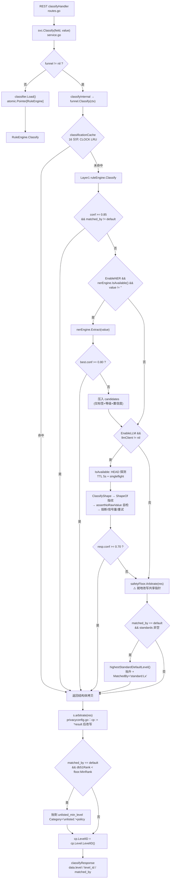

# 动态数据分类分级与三层漏斗仲裁系统技术指南 / Dynamic Classification & 3-Layer Funnel Technical Guide

> 本文是 `services/privacy-engine` **Layer1 规则 → Layer2 NER → Layer3 LLM → Safety Floor → 标准兜底**
> 这条动态分类分级链路的完整技术手册：既给出分类分级理论与算法复杂度推导，也逐段对照 Go 真实实现
> （带文件行号锚点与可复现命令），并**如实标注「设计文档承诺」与「当前代码实装」之间的差距清单**。
>
> 阅读约定：凡是文中出现「⚠️ 实现现状」标记的小节，都在说明某项能力**当前并未接线**，
> 不要按字面标题去推断生产行为。所有结论均可用第 13 章给出的命令自行复验。

---

## 0. 阅读导航 / Reading Guide

### 0.1 章节地图

| 章节 | 主题 | 适合谁 | 前置 |
|---|---|---|---|
| [1](#1-分类分级理论基础) | 五级词表、置信度语义、默认拒绝的成本模型、复杂度 | 所有人、密评/合规 | — |
| [2](#2-实现全景与真实调用链) | 代码资产盘点、一次 `Classify` 的全链路、能力实装对照表 | 架构、新人上手 | 1 |
| [3](#3-layer-1--ruleengine规则层) | 字段名正则 + AC 值匹配、双缓存、规则加载 | 引擎开发 | 2 |
| [4](#4-layer-2--ner-实体抽取层) | `rule-based-ner` 桩、ONNX 骨架、能力诚实上报 | 引擎开发、ML | 2 |
| [5](#5-layer-3--llm-升级仲裁层) | 值形态指纹、传输 fail-closed、三态熔断、出网自检 | 安全、ML | 2 |
| [6](#6-safety-floor-与服务层二次仲裁) | 底线规则、共享指针改写缺陷、修复式拷贝 | 引擎开发、安全 | 3 |
| [7](#7-算子系统与校验算法) | 16 类算子、GB 11643/Luhn/ICD-10 算法推导、RE2 | 引擎开发 | 3 |
| [8](#8-复合规则与标准映射) | 复合提级、标准映射、**未接线清单** | 架构、合规 | 2 |
| [9](#9-api-手册) | REST / gRPC 端点、curl 示例、响应字段真实来源 | 集成方 | 2 |
| [10](#10-配置与环境变量) | `config/privacy.yaml` 绑定关系、`AGENT_*` vs `PRIVACY_*` 漂移 | 运维 | 2 |
| [11](#11-缓存与热重载工程) | 两套分片缓存、CLOCK 近似 LRU、快照热重载 | 性能、运维 | 3 |
| [12](#12-诊断与可观测) | `/ops/diagnostics`、`/readyz`、字段来源与失真点 | SRE | 9 |
| [13](#13-测试与基准) | 测试分层、可运行命令、基准与 `-race` 复现 | 所有人 | 2 |
| [14](#14-最佳实践与反模式) | 上线检查单、六类反模式、等保三级映射 | 架构、运维 | 全部 |
| [15](#15-故障排查-faq) | 现象 → 根因 → 验证方法 | SRE、值班 | 全部 |

### 0.2 核心源码索引

| 文件 | 行数 | 职责 |
|---|---:|---|
| [`internal/dynclassification/engine.go`](services/privacy-engine/internal/dynclassification/engine.go) | 559 | Layer1 规则引擎 + 内联 AC 自动机 + `engineCache` |
| [`internal/dynclassification/funnel.go`](services/privacy-engine/internal/dynclassification/funnel.go) | 491 | 三层漏斗编排 + `classificationCache`（CLOCK LRU） |
| [`internal/dynclassification/safety_floor.go`](services/privacy-engine/internal/dynclassification/safety_floor.go) | 283 | 安全底线仲裁器 + 仲裁事件 ring buffer |
| [`internal/dynclassification/llm_client.go`](services/privacy-engine/internal/dynclassification/llm_client.go) | 830 | Layer3 客户端：形态指纹、传输校验、熔断、探测缓存 |
| [`internal/dynclassification/onnx_ner.go`](services/privacy-engine/internal/dynclassification/onnx_ner.go) | 447 | Layer2 `RuleBasedNerEngine`（默认）+ ONNX 骨架 |
| [`internal/dynclassification/operators.go`](services/privacy-engine/internal/dynclassification/operators.go) | 651 | 16 类算子与校验算法、`OperatorRegistry`、有界正则缓存 |
| [`internal/dynclassification/ac_automaton.go`](services/privacy-engine/internal/dynclassification/ac_automaton.go) | 245 | 独立 `AhoCorasick`（供算子层使用，与 engine.go 内联版不同实现） |
| [`internal/dynclassification/composite.go`](services/privacy-engine/internal/dynclassification/composite.go) | 154 | 跨字段复合提级引擎（**生产无调用方**） |
| [`internal/dynclassification/standards.go`](services/privacy-engine/internal/dynclassification/standards.go) | 106 | `rules/standards/*.yaml` 加载，仅供诊断与默认档位兜底 |
| [`internal/service/service.go`](services/privacy-engine/internal/service/service.go) | 1348 | 服务装配：规则合并、漏斗构造、`Classify*` 入口 |
| [`internal/service/privacyconfig.go`](services/privacy-engine/internal/service/privacyconfig.go) | 434 | `config/privacy.yaml` 绑定 + 服务层二次仲裁（修复式拷贝） |
| [`internal/service/dyn_management.go`](services/privacy-engine/internal/service/dyn_management.go) | 376 | 管理面：标准/领域/算子列表、规则校验、画像生成 |
| [`pkg/naming/levels.go`](pkg/naming/levels.go) | — | L1~L5 等级词表 **唯一事实源（SSOT）** |

### 0.3 与 Python 旧版文档的关系

本仓已于 v3.0 完成 **Python → Go 全量迁移**，仓库内不再存在 `engine/**/*.py`。
历史文档中引用的以下类型与机制，在 Go 侧**并不存在对应实现**，遇到时请查阅第 8.3 节的差距清单：

`ConfidencePolicy`、`DomainTaxonomy`、`ConfigurableRuleEngine`、`FieldClassificationResult`、
`TableClassificationResult`、`rule_schema.matchers`、`Override 压制`、`降级规则`、
`fork-after-warmup COW`、`值级证据地基`。

---

## 1. 分类分级理论基础

### 1.1 五级词表与 SSOT 收敛（P1-1）

数据分类分级的第一个工程问题不是算法，而是**词表**：国标 GB/T 43697 用 `L1~L5`，
金融行业 JR/T 0197 用 `1~5 级`，引擎内部历史代码用 `public/internal/confidential/secret/top_secret`，
下游审计日志又只认 `L1~L5`。多词表并存必然在跨服务边界处发生静默丢级。

本仓的收敛策略是：**canonical 名称在引擎内流转，`LevelID` 在边界处补齐，词表只在 `pkg/naming` 定义一次**。

```go
// pkg/naming/levels.go
var securityLevels = []SecurityLevelSpec{
    {ID: "L1", Canonical: "public",       ZH: "公开数据",   Rank: 1},
    {ID: "L2", Canonical: "internal",     ZH: "内部数据",   Rank: 2},
    {ID: "L3", Canonical: "confidential", ZH: "较敏感数据", Rank: 3},
    {ID: "L4", Canonical: "secret",       ZH: "敏感数据",   Rank: 4},
    {ID: "L5", Canonical: "top_secret",   ZH: "极敏感数据", Rank: 5},
}
```

两条必须记住的语义差别：

| 函数 | 词表外取值的行为 | 后果 |
|---|---|---|
| `naming.NormalizeSecurityLevelID` / `SecurityLevelRank` | 返回 `""` / `0`（**不猜测**） | 调用方必须显式处理空值 |
| `dynclassification.LevelFromString` | 返回 `LevelPublic`（**rank 0**） | ⚠️ fail-open，见 §6.4 |

`ClassificationResult` 因此携带**两个**等级字段：

```go
// internal/dynclassification/engine.go:40
type ClassificationResult struct {
    Field string `json:"field"`
    Value string `json:"value,omitempty"`
    // Level 是引擎内部 canonical 词表（public/internal/confidential/secret/top_secret）或
    // 规则文件原始 L 形式，取决于来源；LevelID 始终是可跨服务消费的 L1~L5 标识。
    Level      SecurityLevel `json:"level"`
    LevelID    string        `json:"level_id,omitempty"`
    Category   string        `json:"category"`
    Confidence float64       `json:"confidence"`
    MatchedBy  string        `json:"matched_by"` // "rule:<id>" | "ner" | "llm"
}
```

> **陷阱（P1-1 根因）**：`Level` 的取值域是「canonical **或** 规则文件原文 L 形式」，
> 而 Layer1/Layer2/Layer3 三条路径**都不填 `LevelID`**（只有服务层 `arbitrate` 会补，见 §6.3）。
> 因此任何绕过 `PrivacyService` 直接调用 `RuleEngine.Classify` 或 `ClassificationFunnel.Classify` 的代码，
> 拿到的 `LevelID` 恒为空串。中枢 service-hub 读不到级别时会把脱敏算子降级为默认值 —— 这正是历史上「定级正确但脱敏格式不对」的成因。

### 1.2 置信度：不是概率，是分层排序键

漏斗里所有 `Confidence` 都是**引擎赋的常量**，不是模型输出的后验概率（Layer3 例外，但 LLM 自报的 `confidence` 本身不可信）。它唯一的作用是：**在阈值比较中稳定地表达「谁比谁更可信」**。

| 来源 | 取值 | 出处 | 是否可配 |
|---|---:|---|---|
| Layer1 字段名正则命中 | `0.95` | `engine.go:271` | ❌ 硬编码 |
| Layer1 AC 值命中 | `0.90` | `engine.go:292` | ❌ 硬编码 |
| Layer1/2/3 全部未命中（default） | `0.50` | `engine.go:303` | ❌ 硬编码 |
| Layer2 NER 命中 | 透传实体 `Confidence` | `funnel.go:118` | — |
| `rule-based-ner` 桩实体 | 恒 `0.85` | `onnx_ner.go` | ❌ 硬编码 |
| Layer3 LLM | 模型自报值 | `funnel.go:157` | ❌ 采纳阈值 `0.70` 硬编码 |
| 标准 `default_level` 兜底 | 强制回写 `0.50` | `funnel.go:178` | ❌ 硬编码 |
| 复合规则标签 | 恒 `1.0` | `composite.go:99` | ❌ 硬编码（且未接线） |

阈值一侧的完整判定链（**只有三个数可调，其余全部硬编码**）：

```
Layer1 早返回     : res.Confidence >= RuleConfidenceThreshold (默认 0.85) && MatchedBy != "default"
Layer2 采纳       : bestEntity.Confidence >= NERConfidenceThreshold (默认 0.80)
Layer3 采纳       : llmResp.Confidence >= 0.70          ← 硬编码，不可配
Safety Floor 升级 : result.Confidence <  0.60           ← 可配（safety_floor.confidence_threshold）
标准兜底抬升      : 仅当 MatchedBy == "default" 且标准档位 > 当前等级
```

> ⚠️ **重要语义漂移**：`config/privacy.yaml` 的 `classification.confidence_threshold` 注释写着
> 「送入 LLM 仲裁的置信度阈值」，但代码把它绑定到 **`FunnelConfig.NERConfidenceThreshold`（Layer2）**，
> 与 LLM 无关（`privacyconfig.go`，详见 §10.2）。改这个值不会影响是否升级外送。

由于 Layer1 命中值恒为 `0.95/0.90`，把 `RuleConfidenceThreshold` 配成 `(0.50, 0.90]` 区间内任意值，
效果都只是「字段名命中早返回、值命中不早返回」；配成 `>0.95` 则 Layer1 完全失效、全部下探 Layer2。

### 1.3 默认拒绝：把不确定性代价算进函数

若定级错误成本对称，最优策略就是「取最可能等级」。隐私治理的成本是**强不对称**的：

- 把 `secret` 误判为 `public` → 原始病历/身份证直接出域，构成数据泄露事件，等保三级判定为重大不符合项；
- 把 `public` 误判为 `internal` → 多一道掩码，业务可用性小幅下降，可复核回滚。

因此引擎的目标函数不是最小化误判率，而是 **约束 `P(泄露)` 上界后最大化可用性**：

```text
min  过度脱敏量
s.t. P(实际敏感 ∧ 判定低于实际敏感) ≤ ε_leak
```

工程落地为两道独立的「只升不降」闸门：

1. **漏斗内 Safety Floor**（`safety_floor.go`）：`MinLevel` 下限 + 低置信度升一档；
2. **服务层二次仲裁**（`privacyconfig.go::arbitrate`）：`unlisted_field_policy` + `unlisted_min_level`（代码默认 `L3` + `mask`），专治「字段名未列入规则库」这一最高危场景。

`DefaultSafetyFloorConfig` 的 `MinLevel` 默认是 `LevelInternal`（L2）而非 `public`，注释写得很清楚：
配置文件缺失时，不再把「没有任何底线」当默认态 —— `public` 底线等价于「未定级字段可原样出域」。

### 1.4 复杂度分析

设 `R` = 规则条数，`P` = 字段名合并正则的模式长度，`n` = 字段名字节长，`m` = 字段值字节长，
`K` = 值模式条数，`C` = 缓存分片数。

| 阶段 | 命中路径 | 未命中路径 | 说明 |
|---|---|---|---|
| 缓存查询 | `O(n+m)` 哈希 + `O(1)` 分片 | 同 | FNV-1a，`engineCache` 16 分片 |
| Layer1 字段名 | `O(n·P)`（RE2 线性） | `O(n·P·R)` | ⚠️ 遍历全部规则，无短路索引 |
| Layer1 值匹配 | `O(m + Z)` | `O(m)` | 内联 trie 沿 fail 链回退（§3.3，**非严格 AC**） |
| Layer2 NER | `O(m·9)` 正则 | 同 | 9 条串行动规 |
| Layer3 LLM | 网络 RTT（默认 5s 超时） | — | 熔断/信号量前置拦截 |
| Safety Floor | `O(1)` | `O(1)` | 两次 rank 比较 + ring buffer 写 |
| 漏斗整体 | 期望 `O(1)`（缓存命中） | 上界 `O(n·P·R + m·K)` | — |

两个关键结论：

- **Layer1 是线性扫规则表**，不是「AC 自动机一把梭」。字段名判定语义是「首个命中的规则胜出」，
  因此**规则顺序即优先级**（§3.4），这也决定了不能用哈希索引替换。
- 规则数 \(R\) 在个位数到百量级时，`engineCache` 命中率是性能的决定因素。
  两套缓存的容量目前**写死为 10000**（共 3 处字面量），
  文档与 `.env.example` 里宣传的 `PRIVACY_ENGINE_CACHE_MAX_SIZE` **Go 代码零读取**（§10.3）。
  即便可调，对高基数自由文本字段收益也很小，因为 key 含值本身（§11.1）。

---

## 2. 实现全景与真实调用链

### 2.1 代码资产盘点

```text
internal/dynclassification/  ── 14 个非测试文件 / 6 029 行
  ├ engine.go          559   Layer1：RuleDef / RuleEngine / ACAutomaton(内联) / engineCache
  ├ funnel.go          491   编排：FunnelConfig / ClassificationFunnel / classificationCache
  ├ safety_floor.go    283   底线：SafetyFloor / ArbitrationEvent / LevelFromString
  ├ llm_client.go      830   Layer3：ValueShape / ValidateLLMTransport / 熔断 / 探测缓存
  ├ onnx_ner.go        447   Layer2：NerEngine 接口 / RuleBasedNerEngine / OnnxNerEngine 骨架
  ├ cuda_onnx_ner.go   665   Layer2：CUDA EP 构建（//go:build cuda）
  ├ dynamic_batching.go 257  微批队列（供 ONNX 引擎使用）
  ├ tokenizer.go       225   WordPiece 分词
  ├ operators.go       651   16 类算子 + OperatorRegistry + boundedRegexCache
  ├ ac_automaton.go    245   独立 AhoCorasick（严格字面量多模式）
  ├ composite.go       154   复合提级（未接线）
  ├ standards.go       106   标准映射加载
  ├ domain_registry.go  98   领域脱敏回调注册表（未接线）
  └ types.go                 SecurityLevel 常量等

rules/  ── 三套目录，职责完全不同
  ├ domains/*.yaml     5 文件 971 行   字段规格 field_specs + aliases（→ 医疗脱敏流水线）+ rules（→ ⚠️ 未被 Go 解析）
  ├ standards/*.yaml   4 文件  85 行   外部标准 → L1~L5 映射（→ 诊断 + default_level 兜底）
  └ taxonomies/*.yaml  4 文件 310 行   等级体系定义（→ 仅管理面 ListStandardsDetail 读取）
```

### 2.2 一次 `POST /v1/dynclassification/classify` 的完整调用链



关键点：**同一条结果被仲裁了两次**，且两次用的是不同的 `SafetyFloorConfig` 语义
（漏斗内置底线永远用代码默认值；服务层底线用配置文件值），
只有第二次会补 `LevelID`。详见 §6.3。

### 2.3 生产实际生效的 Layer1 规则集（务必核对）

`RuleEngine` 收到的规则来自 `service.go::DefaultConfig` + `mergeDomainRules`：

```go
// internal/service/service.go
Rules:       defaultRules(),          // 8 条内置 canonical 规则
rulesDir:    getEnv("AGENT_RULES_DIR", "rules/domains"),
standardsDir: getEnv("AGENT_STANDARDS_DIR", "rules/standards"),
configFile:  getEnv("AGENT_CONFIG_FILE", "config/privacy.yaml"),
```

而 `defaultRules()`（`service.go:1177-1236`）是**唯一确定生效**的规则集：

| # | Rule ID | Level | Category | FieldPattern |
|---:|---|---|---|---|
| 1 | `id_card` | `secret` | `pii.identity` | `(?i)(id_?card\|身份证\|identity)` |
| 2 | `phone` | `confidential` | `pii.contact` | `(?i)(phone\|mobile\|手机\|电话)` |
| 3 | `email` | `confidential` | `pii.contact` | `(?i)(email\|邮箱\|邮件)` |
| 4 | `bank_card` | `secret` | `pii.financial` | `(?i)(bank_?card\|银行卡\|信用卡)` |
| 5 | `name` | `confidential` | `pii.identity` | `(?i)(^name$\|patient_name\|user_name\|姓名)` |
| 6 | `address` | `confidential` | `pii.location` | `(?i)(address\|地址\|住址)` |
| 7 | `medical_record` | `secret` | `medical.record` | `(?i)(medical_record\|病历\|诊断)` |
| 8 | `social_security` | `top_secret` | `pii.financial` | `(?i)(social_security\|社保\|医保号)` |

> ⚠️ **实现现状：`rules/domains/*.yaml` 里的 `rules:` 段不会生效。**
> 三重证据：
> 1. `LoadRulesFromDir` 只解析顶层 `rules:` 一个键，反序列化目标 `RuleDef` 只有
>    `id / level / category / field_patterns / value_patterns / description` 六个字段（`engine.go:452-476`）；
> 2. `rules/domains/*.yaml` 的规则 schema 实际是 `id / name / category / level / priority / match_logic / matchers[]`
>    （5 个文件共 46 处 `matchers`），**没有一个文件使用 `field_patterns`**；
> 3. 全仓 Go 代码中 `matchers` / `match_logic` / `keyword_contains` **零命中**（含 struct tag）。
>
> 结论：这些条目经 `yaml.Unmarshal` 后 `FieldPatterns`/`ValuePatterns` 均为 `nil`，
> 在 `NewRuleEngine` 中既不会编译成正则（`len(rule.FieldPatterns) > 0` 为假，`fieldRegexps[i]` 留 `nil`），
> 也不会进 AC（`for _, pattern := range rule.ValuePatterns` 空循环）。
> `Classify` 遍历时因 `re != nil` 判定直接跳过 —— **静默零命中，不报错**。
>
> `rules/domains/*.yaml` 真正被消费的是 **`field_specs:` 与 `aliases:`** 两段，
> 由 [`domain_specs.go::loadAndRegisterDomainSpecs`](services/privacy-engine/internal/service/domain_specs.go)
> 喂给**医疗脱敏流水线**（`privacy-go-sdk/medical`），与分类分级是两条独立链路。

### 2.4 设计能力 vs 实装状态对照表

| 能力 | 实装 | 接线 | 出处 |
|---|:--:|:--:|---|
| Layer1 字段名正则 | ✅ | ✅ | `engine.go:253-311` |
| Layer1 AC 值模式匹配 | ⚠️ 仅字面量 | ❌ 无生产数据 | §3.3 |
| Layer2 NER（rule-based 桩） | ✅ | ✅ | `onnx_ner.go` |
| Layer2 NER（ONNX/CUDA） | ✅ 骨架 | ⚠️ 需 `cuda` tag + 模型文件 | `onnx_ner.go:240+`, `cuda_onnx_ner.go` |
| Layer3 LLM 仲裁 | ✅ | ⚠️ 默认关闭，需显式 https 端点 | `llm_client.go` |
| Safety Floor（2 条规则） | ✅ | ✅ | `safety_floor.go:128-182` |
| 服务层 unlisted 字段策略 | ✅ | ✅ | `privacyconfig.go::arbitrate` |
| 标准 `default_level` 兜底 | ✅ | ✅ | `funnel.go:169-181` |
| 声明式 `matchers` 规则引擎 | ❌ | ❌ | Go 无对应类型 |
| 四阶段评估管线 `ConfigurableRuleEngine` | ❌ | ❌ | 仅 Python 旧版 |
| 短路优化 / 评估缓存（四阶段版） | ❌ | ❌ | 同上 |
| `ConfidencePolicy`（值级证据/冲突集合/一致性压制） | ❌ | ❌ | 同上 |
| 降级规则 `downgrade_rules` | ❌ | ❌ | 仅 `StandardDef` 字段，无消费者 |
| Override 强制覆盖压制 | ❌ | ❌ | 同上 |
| `DomainTaxonomy` 分类树遍历 / `max_level` | ❌ | ⚠️ 仅管理面读 levels | `dyn_management.go` |
| 跨字段复合提级 | ✅ | ❌ **零生产调用方** | `composite.go` |
| 领域脱敏回调注册表 | ✅ | ❌ **零生产调用方** | `domain_registry.go` |
| `ac_automaton` 算子 | ✅ | ❌ **未注册进 Registry** | §7.4 |
| 规则文件热重载（mtime 被动检测） | ✅ | ⚠️ 仅 `RuleEngine` 自带，且换不到主路径 | §11.3 |
| `WatchRules`（主动监听） | ✅ | ❌ 仅测试调用 | `engine.go:325-335` |
| fork-after-warmup COW 模型共享 | ❌ | ❌ Go 无 fork 语义 | — |

---

## 3. Layer 1 — RuleEngine（规则层）

### 3.1 数据结构与快照

```go
// internal/dynclassification/engine.go:181
type ruleSnapshot struct {
    rules        []RuleDef
    fieldRegexps []*regexp.Regexp // 与 rules 同索引；nil 表示该规则无字段名模式
    ac           *ACAutomaton
}
```

`RuleEngine` 用 `atomic.Pointer[ruleSnapshot]` 持有快照，读端**完全无锁**，热重载时整体替换指针。
`fieldRegexps` 与 `rules` 严格同索引，因此「命中第 i 个正则」直接等价于「第 i 条规则胜出」，无需回查映射。

```go
// internal/dynclassification/engine.go:53
type RuleDef struct {
    ID            string        `yaml:"id"`
    Level         SecurityLevel `yaml:"level"`
    Category      string        `yaml:"category"`
    FieldPatterns []string      `yaml:"field_patterns,omitempty"` // 字段名正则
    ValuePatterns []string      `yaml:"value_patterns,omitempty"` // 值内容正则（AC 自动机）
    Description   string        `yaml:"description,omitempty"`
}
```

> 注意 `ValuePatterns` 的注释写「值内容正则」，但实现并不按正则处理 —— 见 §3.3。

### 3.2 模式合并：多 pattern → 单正则

```go
// internal/dynclassification/engine.go:206-219
func NewRuleEngine(rules []RuleDef) (*RuleEngine, error) {
    fieldRegexps := make([]*regexp.Regexp, len(rules))
    ac := NewACAutomaton()
    for i, rule := range rules {
        if len(rule.FieldPatterns) > 0 {
            combined := strings.Join(rule.FieldPatterns, "|")   // ← 合并为单条
            re, err := regexp.Compile(combined)
            if err != nil { return nil, err }
            fieldRegexps[i] = re
        }
        for _, pattern := range rule.ValuePatterns {
            if err := ac.AddPattern(rule.ID, pattern); err != nil { return nil, err }
        }
    }
    ac.Build()
    ...
}
```

`strings.Join(patterns, "|")` 是一个**必须警惕**的写法：它不加括号，直接把多条模式用 `|` 拼接。
由于 `|` 在正则中优先级最低，单条模式内不含裸 `|` 时结果正确；
一旦某条 pattern 自带**顶层** `|`（如表 2.3 中全部 pattern 都以 `(?i)` 开头则安全，
因为 `(?i)` 是 flag，`a|b` 的 `|` 仍在最外层），拼接语义就会漂移：

```text
安全：  (?i)(phone|mobile) | (?i)(tel|分机)      → 两分支各自带内联 flag，等价
危险：  phone|mobile       | 座机               → 实际语义 (phone) | (mobile|座机)，
                                                  第二个规则的「座机」被并入第一个规则的分支
```

即：**规则 1 的 pattern 若含顶层未括起的 `|`，会「吞掉」紧随其后的规则 2 的 pattern**，
导致规则 2 的等级被规则 1 冒领（返回 `rule:<规则1的ID>`）。
`defaultRules()` 全部用 `(?:...)` 显式分组因而安全；自研规则必须照做。

> 附带效果：合并后无法区分「命中了哪一条 pattern」，`MatchedBy` 只能到规则 ID 粒度。

### 3.3 AC 自动机的真相：正则原文被当字面量插入 trie

`engine.go` 内联的 `ACAutomaton` 是唯一被 `RuleEngine` 使用的值匹配器，其 `AddPattern` 做两件事：

```go
// internal/dynclassification/engine.go:92-116
func (ac *ACAutomaton) AddPattern(id, pattern string) error {
    re, err := regexp.Compile(pattern)   // ① 编译正则
    if err != nil { return err }
    ac.patterns[id] = re                 //    存入 map —— ⚠️ 全仓仅此一次写入，从未被读取

    node := ac.root
    for _, ch := range pattern {         // ② 把「正则原文」逐 rune 插进 trie
        if node.children[ch] == nil { node.children[ch] = &ACNode{...} }
        node = node.children[ch]
    }
    node.isEnd = true
    node.output = append(node.output, id)
    return nil
}
```

`Search` 只走 trie，**从不查 `ac.patterns`**：

```go
// internal/dynclassification/engine.go:151-170
func (ac *ACAutomaton) Search(text string) []string {
    var matches []string
    node := ac.root
    for _, ch := range text {
        for node != ac.root && node.children[ch] == nil { node = node.fail }
        if node.children[ch] != nil { node = node.children[ch] }
        // 检查 output 而非 isEnd：Build() 阶段已将 fail 链上游的输出合并到 node.output
        if len(node.output) > 0 { matches = append(matches, node.output...) }
    }
    return matches
}
```

后果可实测复现（临时测试文件，跑完即删）：

```bash
cd services/privacy-engine
cat > internal/dynclassification/zz_probe_test.go <<'EOF'
package dynclassification

import "testing"

func TestProbeACRegexAsLiteral(t *testing.T) {
    eng, _ := NewRuleEngine([]RuleDef{
        {ID: "re_val",  Level: LevelSecret,       Category: "c.re",
         ValuePatterns: []string{`HIV|艾滋病`}},  // 文档声称按正则匹配值
        {ID: "lit_val", Level: LevelConfidential, Category: "c.lit",
         ValuePatterns: []string{`HIV`}},        // 纯字面量
    })
    for _, v := range []string{"HIV抗体阳性", "艾滋病确诊", "HIV"} {
        r := eng.Classify("diagnosis_text", v)   // 无字段名规则 → 强制走 AC 分支
        t.Logf("value=%-12q -> matched_by=%-12s level=%-14s", v, r.MatchedBy, r.Level)
    }
}
EOF
go test ./internal/dynclassification/ -run TestProbeACRegexAsLiteral -v
rm internal/dynclassification/zz_probe_test.go
```

实测输出：

```text
value="HIV抗体阳性"  -> matched_by=rule:lit_val level=confidential
value="艾滋病确诊"    -> matched_by=default      level=public
value="HIV"         -> matched_by=rule:lit_val level=confidential
```

解读：正则模式 `HIV|艾滋病` **只在文本逐字包含 `"HIV|艾滋病"` 这串正则原文时才命中**；
`艾滋病` 永远不会被它匹配。字面量模式 `HIV` 正常工作。

三条修正建议（按侵入性从小到大）：

1. **约定**：`value_patterns` 只允许写字面量关键词，正则一律走 `field_patterns`。写进规则评审清单。
2. **改实现**：在 `Search` 中补一条 `for id, re := range ac.patterns { if re.MatchString(text) {...} }` 回退路径 —— 代价是把 AC 的线性复杂度退化为 `O(K·m)`。
3. **换实现**：值匹配统一改用 `ac_automaton.go` 的严格字面量 `AhoCorasick`，正则需求交给算子层的 `OpRegex`（§7），并在 `AddPattern` 中**拒绝**含正则元字符的模式（fail-fast 而非静默失效）。

另有一个附带缺陷：`ac.patterns` 以 **规则 ID 为 key**，同一规则的多个 `ValuePatterns` 会互相覆盖
（当前因 map 无人读取而无实际影响，一旦按建议 2 修复立即暴露）。

### 3.4 规则顺序即优先级

```go
// internal/dynclassification/engine.go:266-277  Layer1 字段名匹配
for i, re := range snap.fieldRegexps {
    if re != nil && re.MatchString(field) {
        result := &ClassificationResult{
            Field: field, Level: snap.rules[i].Level, Category: snap.rules[i].Category,
            Confidence: 0.95, MatchedBy: "rule:" + snap.rules[i].ID,
        }
        e.cache.put(cacheKey, result)
        return result          // ← 首个命中即返回
    }
}
```

值匹配分支同样是「找到第一个匹配的规则就返回」，且**外层遍历规则、内层遍历 matches**：

```go
// internal/dynclassification/engine.go:283-300
matches := snap.ac.Search(value)
if len(matches) > 0 {
    for _, rule := range snap.rules {        // 外层：规则顺序
        for _, matchID := range matches {    // 内层：AC 命中集合
            if rule.ID == matchID { ... return result }
        }
    }
}
```

因此**两条路径的优先级都由规则表顺序决定，与 AC 命中的文本位置无关**。

`mergeDomainRules` 明确固化了这个契约：

```go
// internal/service/service.go
// base 在前、目录规则追加在后，顺序即优先级（首个字段名正则命中即返回）
```

实践含义：想让某个更精确的规则（如 `patient_name` → `secret`）压过泛化规则（`name` → `confidential`），
**必须把它放在 `field_patterns` 表更靠前的位置，且放在合并结果表的更前段**；
由于内置 `defaultRules()` 永远在前，目录规则只能补充未覆盖的字段名，**无法覆盖内置规则**。
唯一例外是内置规则的模式本身不匹配（如 `^name$` 不匹配 `full_name`）。

> ⚠️ 这也意味着 `rules/domains/*.yaml` 里的 `priority:` 字段是**装饰性的** —— Go 侧完全不看它。

### 3.5 默认结果与 `default` 语义

```go
// internal/dynclassification/engine.go:302-310
result := &ClassificationResult{
    Field: field, Level: LevelPublic, Category: "unknown",
    Confidence: 0.50, MatchedBy: "default",
}
```

`MatchedBy == "default"` 是整条链路上最重要的哨兵值，被四处用作判据：

| 判据处 | 作用 |
|---|---|
| `funnel.go:100` | 即使阈值被配得很低，default 也**不许**在 Layer1 早返回 |
| `funnel.go:138` | 决定是否把 Layer1 结果作为候选下传 LLM |
| `funnel.go:172` | 决定是否触发标准 `default_level` 抬升 |
| `engine.go:539`（缓存淘汰） | 优先淘汰 default 与低置信度条目 |
| `privacyconfig.go::arbitrate` | 决定是否应用 `unlisted_field_policy` |

`Level: LevelPublic` 是**故意的乐观中间态**：Layer1 不兜底抬级，把「未列入怎么办」集中交给后两道闸门，
避免出现「规则层擅自抬级导致底线仲裁无法归因」。代价是：任何只调 `RuleEngine.Classify`
而不经过 `funnel` + `arbitrate` 的调用方，都会拿到 `public` —— **必须避免绕过服务层**。

### 3.6 ClassifyBatch：多核分块与结果顺序契约

```go
// internal/dynclassification/engine.go:388
func (e *RuleEngine) ClassifyBatch(records []map[string]string) []*ClassificationResult
```

worker 数 `min(GOMAXPROCS, 16, len(records))`，每个 worker 写自己独占的结果切片，
最后按 `workerResults` 顺序拼接。这带来一个**必须知道的语义**：

- 结果数组内**同一记录的多个字段不保证相邻**（外层遍历记录、内层遍历 map，
  而 Go 的 map 迭代顺序是随机化的），展平后的下标归属哪个记录取决于分块边界；
- 因此调用方**不能按下标反推 `(record_index, field_name)`**，必须读结果里的 `Field` 字段自行归组；
- `PrivacyService.ClassifyBatch`（`service.go:564`）用的是另一套实现：预分配 `allResults[i]` 按下标写，
  小批量 `n <= 32` 走串行快路径 —— 那条路径**保持展平顺序**。两者不要混为一谈。

---

## 4. Layer 2 — NER 实体抽取层

### 4.1 接口与「能力诚实上报」（P1-3）

```go
// internal/dynclassification/onnx_ner.go:45
type NerEngine interface {
    Extract(ctx context.Context, text string) ([]NerEntity, error)
    IsAvailable() bool
    Name() string
}

// internal/dynclassification/onnx_ner.go:66 —— 可选能力接口
type ModelBackedNerEngine interface {
    NerEngine
    ModelBacked() bool
}

func NerEngineModelBacked(engine NerEngine) bool {
    mb, ok := engine.(ModelBackedNerEngine)
    return ok && mb.ModelBacked()
}
```

这是整条链路里**最值得学习的一个接口设计**。默认实现 `RuleBasedNerEngine.IsAvailable()` 恒为 `true`
（正则桩永远「可用」），如果用 `IsAvailable()` 表述「AI NER 能力是否可用」，
运维诊断就会把正则桩谎报成已交付的模型推理能力。

解法是**能力探测而非状态探测**：用 Go 的类型断言做能力检查，
且口径对新增引擎 **fail-closed** —— 未显式实现 `ModelBackedNerEngine` 的引擎一律上报「非模型驱动」。

| 引擎 | `Name()` | `IsAvailable()` | `ModelBacked()` | 诊断上报 |
|---|---|:--:|:--:|---|
| `RuleBasedNerEngine` | `rule-based-ner` | `true` | 不实现该接口 | `model_backed: false` |
| `OnnxNerEngine`（未加载模型） | `onnx-ner` | `false` | `false` | `model_backed: false` |
| `OnnxNerEngine`（模型已加载） | `onnx-ner[-gpu]` | `true` | `true` | `model_backed: true` |

漏斗侧的导出方法即为此设计：`funnel.NerStatus() (backend string, modelBacked bool)`。

### 4.2 默认实现：9 条串行动规

按声明顺序依次 `FindAllString`，一条文本可同时产出多个实体（**不互斥、不短路**）：

| # | Label | 正则源文 | 锚点 |
|---:|---|---|:--:|
| 1 | `ID_CARD` | `\b(\d{6}(19\|20)\d{2}(0[1-9]\|1[0-2])(0[1-9]\|[12]\d\|3[01])\d{3}[\dXx])\b` | 有 |
| 2 | `PHONE` | `\b(1[3-9]\d{9})\b` | 有 |
| 3 | `EMAIL` | `\b([a-zA-Z0-9._%+\-]+@[a-zA-Z0-9.\-]+\.[a-zA-Z]{2,})\b` | 有 |
| 4 | `BANK_CARD` | `\b(\d{4}[\s-]?\d{4}[\s-]?\d{4}[\s-]?\d{4,7})\b` | 有 |
| 5 | `PERSON` | `([\x{4e00}-\x{9fff}]{2,4})` | **无** |
| 6 | `ADDRESS` | `((?:省\|市\|区\|县\|镇\|乡\|村\|路\|街\|号\|弄\|栋\|幢\|单元\|室).{2,20})` | 关键词 |
| 7 | `MEDICAL_CONDITION` | `(艾滋病\|HIV\|梅毒\|乙肝\|结核\|癌症\|肿瘤\|糖尿病\|高血压\|冠心病\|白血病)` | 词典 |
| 8 | `MILITARY_ID` | `\b(军字第\s?\d{4,8}号)\b` | 有 |
| 9 | `PASSPORT` | `\b([A-Z]\d{8})\b` | 有 |

两点阅读提示：

- Go 的 `\b` 基于 ASCII `\w = [0-9A-Za-z_]`，**汉字不算词字符**。
  因此 `手机号13812345678，` 中 `号`（非词）→ `1`（词）是合法边界，能匹配；
  而这也是第 5 条 `PERSON` 为什么**没有**用 `\b` 的原因之一 —— 加了反而在纯汉字上下文里失效。
- 第 5 条没有任何形式的左锚点，等价于「文中每 2~4 个连续汉字都能开一个 `PERSON` 候选」，
  下一节给出实测影响。

实体置信度**恒为 `0.85`、`Source` 恒为 `"rule"`**。
阈值 `NERConfidenceThreshold` 默认 `0.80`，因此**只要抽出任何实体就必然被采纳** ——
这个阈值在默认配置下不起任何过滤作用，只有调到 `> 0.85` 才会让 Layer2 整体失效并下探 Layer3/底线。

> ⚠️ **`PERSON` 模式是最大的误报源**：它匹配「任意 2~4 个连续汉字」，
> 既无词边界也无姓氏词典。实测（`EnableNER` 默认开）：
>
> ```text
> "胸部X线片未见明显异常" → 3 个 PERSON：胸部 / 线片未见 / 明显异常
> "2型糖尿病，未见异常"   → PERSON(型糖尿病) / PERSON(未见异常) / MEDICAL_CONDITION(糖尿病)
> "患者"                 → 1 个 PERSON：患者
> "无"                   → 0 个实体（单字不满足 2~4）
> ```
>
> 经 `selectHighestRiskEntity` + `mapNERLabelToSecurity` 后的漏斗输出：
>
> ```text
> chief_complaint = "患者"      → confidential / pii.identity / conf=0.85 / matched_by=ner:PERSON
> diagnosis       = "2型糖尿病" → secret       / medical.condition / matched_by=ner:MEDICAL_CONDITION
> remark          = "无"        → confidential / unknown / conf=0.50 / matched_by=default
> ```
>
> 前两条是**过度脱敏**（`getRiskRank` 让 `MEDICAL_CONDITION`(4) 压过 `PERSON`(3)，方向安全）；
> `chief_complaint="患者"` 判成「个人身份信息」则是纯粹的标签错误 —— 它只影响归因，
> 不影响处置强度（都是 L3，掩码而非丢弃）。要修的话正确做法是给 `PERSON` 加
> 复姓/单姓词典与 `\b`-等价的非汉字锚点，而不是调高阈值（调高会连带废掉 `ID_CARD`/`PHONE`）。

### 4.3 实体挑选：风险优先，同级看置信度

```go
// internal/dynclassification/funnel.go:439
func selectHighestRiskEntity(entities []NerEntity) NerEntity {
    var best NerEntity
    bestRank := -1
    for _, e := range entities {
        rank := getRiskRank(e.Label)
        if rank > bestRank || (rank == bestRank && e.Confidence > best.Confidence) {
            best, bestRank = e, rank
        }
    }
    return best
}
```

这是「**宁高勿低**」原则在实体粒度上的体现：一条文本里同时出现 `PERSON` 和 `ID_CARD` 时，
取 `ID_CARD`（rank 5）而不是「第一个实体」或「最长实体」。

两套 rank 标度**不要混淆**：

| 标度 | 范围 | 用途 |
|---|---|---|
| `getRiskRank(label)` | `1~5`（`ID_CARD`=5、`MEDICAL_CONDITION`=4、`PERSON`=3、`ORG`=2、其他=1） | 仅在 NER 实体之间比较 |
| `LevelRank(SecurityLevel)` | `0~4`（`public`=0 … `top_secret`=4） | 全局等级比较（底线、抬升、max） |

注释里的 `// 5 // TopSecret` 与 `LevelRank(top_secret) == 4` 是**同一事物的两个编号**，
前者只用于排序，永远不该参与算术或跨函数传递。

### 4.4 标签 → 等级/类别映射表

| Label | `mapNERLabelToSecurity` 返回 | Category |
|---|---|---|
| `ID_CARD` | `top_secret` (L5) | `pii.identity` |
| `BANK_CARD` | `top_secret` (L5) | `pii.financial` |
| `PASSPORT` / `MILITARY_ID` | `top_secret` (L5) | `pii.identity` |
| `DISEASE` / `MEDICAL_CONDITION` / `ICD10_CODE` / `HIV` / `PSYCHIATRIC` | `secret` (L4) | `medical.condition` |
| `PHONE` / `EMAIL` | `confidential` (L3) | `pii.contact` |
| `ADDRESS` | `confidential` (L3) | `pii.location` |
| `PERSON` | `confidential` (L3) | `pii.identity` |
| `ORG` / `ORGANIZATION` | `internal` (L2) | `entity.organization` |
| 其他（含空标签） | `public` (L1) | `unknown` |

> ⚠️ 与 `defaultRules()` 存在**等级不一致**（这是有意还是待修，需要产品决策）：
> 字段名规则把 `id_card` / `bank_card` 定为 `secret`(L4)，而 NER 标签把同名实体定为
> `top_secret`(L5)。同一条 `id_card_no` 记录，走 Layer1 得 L4、走 Layer2 得 L5。
> 由于 Layer1 早返回，实际观测到的**总是较低的那个** —— 与「宁高勿低」相反。
> 排查「为什么身份证是 L4 而不是 L5」时应首先想到这一点。

### 4.5 未达阈值时的候选下传

```go
// internal/dynclassification/funnel.go:124-131
// 未达阈值：只把「标签 + 等级 + 置信度」下传为候选，实体文本本身绝不出域
level, category := mapNERLabelToSecurity(bestEntity.Label)
candidates = append(candidates, LLMCandidate{
    Source:     "ner:" + bestEntity.Label,
    Level:      string(level),
    Category:   category,
    Confidence: bestEntity.Confidence,
})
```

`NerEntity.Text` 在这里被**主动丢弃** —— 这是 P0-5 的关键实现点：
Layer2 的输出结构 (`LLMCandidate`) 根本没有承载文本的字段，
「实体原文」在类型层面就无法流进 Layer3。相比「记得别传文本」的口头约定，
**用类型消灭非法状态**是这里可复用的模式。

### 4.6 ONNX 骨架与 CUDA 路径

| 项 | 现状 |
|---|---|
| `OnnxNerEngine` | 结构体与生命周期完整，但**无 CGO 绑定**（`available` 构造期置 `false`）；`Extract` **既不报错也不失败**，而是**静默委派给内置 `RuleBasedNerEngine`** 并计入 `fallbackCount` |
| `Name()` | `onnx-ner-cpu` / `onnx-ner-gpu`（按 `cfg.Device`） |
| `ModelBacked()` | 返回 `e.available`；骨架实现从不置 true，因此**交付构建中恒为 false**（P1-3） |
| 默认模型路径 | `.models/ner/model.onnx`、词表 `.models/ner/vocab.txt` |
| 关键参数 | `MaxSeqLen=128`、`QueueSize=512`、`Timeout=50ms`、`BatchMaxSize=32`、`BatchMaxWait=10ms` |
| CUDA 构建 | `cuda_onnx_ner.go` 带 `//go:build cuda` 标签，需 `-tags cuda` + CUDA Toolkit + ONNX Runtime GPU |
| 动态合批 | `dynamic_batching.go` 的 `DynamicBatcher`（按 `BatchMaxSize`/`BatchMaxWait` 双触发） |
| 分词 | `tokenizer.go` WordPiece |
| 四级降级 | `GPU → CPU ONNX → 规则 AC → Safety Floor`，代码层面体现为「`nerEngine == nil` 时 `NewClassificationFunnel` 自动填 `NewRuleBasedNerEngine()`」 |

```go
// internal/dynclassification/funnel.go:65-67
if nerEngine == nil {
    nerEngine = NewRuleBasedNerEngine()   // 降级链的最后一级在构造期就固化
}
```

设计要点：降级**不是运行时的 try/catch 链**，而是构造期的依赖注入兜底。
好处是热路径零分支判断；代价是「GPU 引擎运行中途挂掉」不会自动回落到规则桩 ——
`Extract` 返回 `err != nil` 时漏斗只是**跳过 Layer2**继续走 Layer3/底线（`funnel.go:110`），
效果上等价于降级，但不会更换引擎实例。这一点在 §15 FAQ「换模型要不要重启」里还会再提。

骨架模式反而是一个**安全的设计**：`available=false` 时 `Extract` 直接走规则桩、不产生错误，
上层行为与「根本没有 ONNX 层」完全一致；而 `ModelBacked()` 仍报 false，
诊断不会把降级结果宣称为模型能力。「功能可用但能力不谎报」是这里值得学的模式。

### 4.7 ⚠️ 未接线的 NER 辅助能力与其中的地雷

以下三项**仅被 `onnx_ner_test.go` 引用，生产零调用方**：

| 符号 | 用途 | 风险 |
|---|---|---|
| `FallbackChain` | 多引擎优先级降级链 | 与 `OnnxNerEngine` 内部的 `fallback` 字段**职责重叠**（两套降级机制），接线前必须先收敛 |
| `RedactEntities` | 按实体偏移抹除文本 | ⚠️ **含一个会造成漏脱敏的字节 / rune 坐标混用缺陷**，见下 |
| `NerLabelToSecurityTag` | 标签 → `PHI_HEALTH` 等安全标签 | 与 `mapNERLabelToSecurity` **并存但词表不同**（后者返回 canonical level/category），接线前同样需收敛 |

`RedactEntities` 的缺陷必须先记住两条契约：

1. 生产者 `Extract` 的偏移来自 `FindAllStringIndex`，是**字节**偏移；
2. 消费者 `RedactEntities` 却先 `result := []rune(text)` 再用同一组偏移索引 **rune** 数组。

实测（临时探针，跑完即删）：

```go
text := "身份证号 110101199003071234 已登记"
ents, _ := NewRuleBasedNerEngine().Extract(context.Background(), text)
t.Logf("len(bytes)=%d len(runes)=%d", len(text), len([]rune(text)))
t.Logf("RedactEntities => %q", RedactEntities(text, ents, "*"))
```

```text
label=ID_CARD      start=13 end=31 text="110101199003071234"
label=BANK_CARD    start=13 end=31 text="110101199003071234"
label=PERSON       start=0  end=12 text="身份证号"
label=PERSON       start=32 end=41 text="已登记"
label=ADDRESS      start=9  end=32 text="号 110101199003071234 "
len(bytes)=41 len(runes)=27
RedactEntities => "************99003071234 已登记"
```

三个严重结果：

- **身份证号尾部 11 位明文残留**。字节偏移 13 被当作 rune 下标 13 使用，
  只遮到了前 12 个 rune（相当于「身份证号 + 前 7 位数字」）；
- `PERSON start=32 end=41` 因 `end > len(result)=27` 被**静默 `continue` 跳过**（`onnx_ner.go:415`）：
  越界不报错、不记日志，只丢遮罩；
- 同一 span 同时产出 `ID_CARD` 与 `BANK_CARD`（反向印证了本节开头「不互斥、不短路」），
  重复写入本身不出错，但说明 `seen` 去重仅按 `(label,start,end)` 三元组，不防跨标签重叠。

而现有单测 `TestRedactEntities` 使用**手写的 `Start: 5, End: 23`** 并通过：
那恰好是 **rune** 下标（而非生产者会给出的字节下标 13/31）。
这是一个典型的「测试 fixture 向实现对齐、而不是向契约对齐」的陷阱：
它锁住了错误行为，使接入真实 `Extract` 输出时必然漏脱敏。

**修复方向**：统一按字节操作（`[]byte` + 从后往前替换，字节切片对 UTF-8 安全只要边界落在字符间），
或统一把偏移转为 rune 下标；并把单测 fixture 改为直接消费 `Extract` 的输出来生成，
以消除两套坐标并存的空间。同时 `start < 0 || end > len(result)` 应当**记日志或返回错误**，
而不是 `continue` —— 在隐私脱敏路径上，「静默什么都不做」永远比「报错」危险。

---

## 5. Layer 3 — LLM 升级仲裁层

### 5.1 P0-5 的核心：只送特征，不送原值

Layer3 是全链路**唯一跨越信任边界**的一环 —— 前两层都在进程内，第三层要把信息交给外部模型服务。
设计上必须回答一个问题：*在拿不到原值的前提下，模型还有足够信息做判断吗？*

答案是：**分级判定所需的信息几乎全在「形态」而非「内容」**。
11 位纯数字、18 位末位 X、含 `@` 且无空格的 ASCII 串、2~4 个汉字 —— 这些足以定级，
而不需要知道具体是哪一个号码。于是就有了 `ValueShape`：

```go
// internal/dynclassification/llm_client.go:117
type ValueShape struct {
    LengthBucket string // "len=11"（≤32 精确）/ "len=33-64" / … / "len>1024"
    Digits       int    // ASCII 数字字符数
    Latin        int    // ASCII 拉丁字母数
    CJK          int    // 汉字数
    Sep          int    // 空白 + 标点 + 符号类字符数
    Other        int    // 其余（非拉丁文字、组合记号等）
    Identifier   string // 结构化标识符形态标签
}
```

注释里写明了三条设计约束，其中第二条最容易被忽视：

> 不含原值的任何子串或字符位置信息（**连「掩码后样例」也不外送**，
> 因为保留首尾字符会给链接攻击留下还原线索）

这是正确的取舍。常见错误做法是送 `13****5678`：看似脱敏，实则把 11 位号码降为
\(10^3 \times 10^4 = 10^7\) 的搜索空间，配合运营商号段表与其他已泄露字段可完成重识别。

`identifierShape` 的 18 种形态（仅依据「总长度 + 字符类别计数 + 符号存在性」）：

| Identifier | 判定条件 |
|---|---|
| `empty` | `n == 0` |
| `email-like` | 含 `@` 且无空白 |
| `numeric-cn-mobile` | 纯数字且 `n == 11` |
| `numeric-imei` | 纯数字且 `n == 15` |
| `numeric-id-card` | 纯数字且 `n == 18` |
| `numeric-bank-card` | 纯数字且 `n ∈ {16, 19}` |
| `numeric` | 其他纯数字 |
| `date-like` | `punct>=1 ∧ n<=10 ∧ digits>=6 ∧ 无汉字 ∧ 无空白` |
| `numeric-grouped` | `digits*2>=n ∧ (punct+spaces)>0 ∧ 无汉字`（带空格卡号、`+86` 电话） |
| `cjk-name-like` | 全汉字且 `n<=4` |
| `cjk-prose` | `cjk*2>=n ∧ n>=20` |
| `cjk-mixed-text` | 含汉字 ∧ `n>=20` |
| `cjk-text` | `cjk*2>=n` |
| `alpha-token` | 全拉丁字母 |
| `alnum-code` | 数字+字母且 `n<=32` |
| `free-text` | 有空白且非空白字符数 `>=4` |
| `mixed-encoded` | 含 `other` 类字符 |
| `mixed` | 兜底 |

> 注：`18` 位身份证号若末位是 `X`，`digits != n` 因此**不会**命中 `numeric-id-card`，
> 而落到 `alnum-code`（`digits+latin == n ∧ n<=32`）。
> 这是一个已知的形态粒度损失，也是「X 结尾身份证」在 Layer3 判准率略低于纯数字样本的原因；
> 修复它不能靠引入位置信息（会破坏不可逆性），只能靠加计数特征（如「拉丁字母是否全为 X」）。

函数契约同样重要：

```go
// ShapeOf 计算字段值的形态指纹——这是升级路径上**唯一**允许读取原值的函数
func ShapeOf(value string) ValueShape
```

### 5.2 传输 fail-closed：构造期判定，此后只读

```go
// internal/dynclassification/llm_client.go:339
func ValidateLLMTransport(endpoint string, allowPlaintext bool) error {
    if endpoint == "" { return fmt.Errorf("llm endpoint is empty") }
    u, err := url.Parse(endpoint)                    // 解析失败 → 拒绝
    host := u.Hostname();  if host == "" { 拒绝 }
    switch strings.ToLower(u.Scheme) {
    case "https", "wss": return nil
    case "http":
        if isLoopbackHost(host) { return nil }       // 环回：明文不出机器
        if allowPlaintext      { return nil }        // 运维显式放行
        return fmt.Errorf("...refused fail-closed (use https, or set %s=true)", envLLMPlaintextOptIn)
    default: return fmt.Errorf("scheme unsupported")
    }
}
```

`DefaultLLMClientConfig().Endpoint` 是**空串**，而不是历史上某个 `http://localhost:8000/v1/...`。
空串在 `ValidateLLMTransport` 中被拒绝 —— 这保证「忘记配置端点」的结果是 Layer3 完全沉默，
而不会是「静默把数据发去了某个默认地址」。

```go
// internal/dynclassification/llm_client.go:59-67
func DefaultLLMClientConfig() LLMClientConfig {
    return LLMClientConfig{
        Endpoint:       "",          // P0-5: 强制显式配置，不提供不安全的默认端点
        ModelName:      "qwen3.5",
        MaxConcurrency: 1,
        Timeout:        30 * time.Second,
        MaxRetries:     2,
    }
}
```

`isLoopbackHost` **刻意不做 DNS 解析**（只认 `127.0.0.0/8`、`::1`、`localhost` 及 `*.localhost`）：
解析会把「内网 DNS 把 `evil.com` 指到 `127.0.0.1`」变成放行理由，
同时解析本身就是一次外呼，与 fail-closed 的目的相反。

判定的时机也值得学：在 `NewLLMClient` 构造期就算好 `transportErr` 并**记为字段**，
之后 `Classify` / `IsAvailable` 只读它，不重复解析：

```go
// internal/dynclassification/llm_client.go:298-316
func NewLLMClient(config LLMClientConfig) *LLMClient {
    c := &LLMClient{ ..., transportErr: ValidateLLMTransport(config.Endpoint, allowPlaintext), ... }
    if c.transportErr != nil {
        slog.Error("Layer-3 LLM endpoint refused: plaintext egress blocked, escalation falls back to Safety Floor", ...)
    }
    return c
}
```

注意这里**不是 panic 也不是启动失败**，而是「记一条 ERROR 日志 + 后续全部 fail closed」。
理由：Layer3 是可选增强层，端点配错不应该让整台脱敏引擎起不来 ——
降级到 Safety Floor 的结果是「定级保守」，而不是「服务中断」。这是可选安全组件的正确失败模式。

### 5.3 出网前自检：`assertNoRawValue`

```go
// internal/dynclassification/llm_client.go:537-551
const rawValueSelfCheckMinLen = 8

func assertNoRawValue(prompt, value string) error {
    if len(value) < rawValueSelfCheckMinLen { return nil }   // 短值天然会出现在统计串中，逐字判定必误报
    if strings.Contains(prompt, value) {
        return fmt.Errorf("LLM escalation blocked: prompt self-check detected original value in outgoing payload")
    }
    return nil
}
```

这是一道**冗余防御**（belt-and-braces）：`buildPrompt` 从类型上就拿不到原值，
但仍然在真正外呼前逐字检查一遍。价值在于：将来有人给 `LLMRequest` 加一个 `Sample string` 字段
并拼进 prompt 时，这道检查会立刻把问题暴露成一次可观测的失败，而不是静默泄露。

`rawValueSelfCheckMinLen = 8` 的取舍也必须理解：不设阈值的话，
`"2024"`（4 字节值）会因为 `len=2024` 或 `digits=4` 这类统计串中的数字子串而**必然误报**，
导致所有短值无法升级。8 字节是「不会与常见统计数字偶然重合」的下界。

自检失败时 `classify` 直接 `return nil, err`，**在 `escalations.Add(1)` 之前** ——
即被拦下的请求不计入外送统计。这让「Escalations」的语义严格等于「真实离开进程的请求数」，
可以拿来做合规举证。

### 5.4 外呼顺序：便宜的安全检查在前，贵的重试在后

```go
// internal/dynclassification/llm_client.go:478-535（顺序即优先级）
① c.transportErr != nil      → 拒绝（零成本，构造期已定）
② checkCircuit()             → 熔断拦截（O(1) 加锁读）
③ select { c.sem <- … / ctx } → 获取并发槽（ctx 感知，不无界排队）
④ buildPrompt(req)           → 纯字符串拼接
⑤ assertNoRawValue           → 出网自检
⑥ for attempt <= MaxRetries  → callLLM，失败线性退避 (attempt+1)*100ms
⑦ recordSuccess / recordFailure
```

把 ①②③ 排在 ④ 之前不是风格问题：① 让被禁端点上的**每一次**调用都零开销返回，
② 让熔断期间不再构造 prompt（prompt 拼接是 `strings.Builder` + 多次 `rune` 扫描），
③ 让「已经排不上队」的请求不产生任何字符串分配。

重试策略是**线性退避**（100ms / 200ms）而非指数：Layer3 的预算是 `LLMTimeout=5s`（漏斗侧），
`MaxRetries=2` → 最多 3 次尝试。指数退避在 3 次内没有收益，只会更容易撞上 `ctx` 超时白做。
每次退避都 `select` 上 `ctx.Done()`，超时即刻放弃。

> ⚠️ 两处超时要注意区分：`LLMClientConfig.Timeout=30s` 是 `http.Client` 级总超时，
> 而漏斗用 `context.WithTimeout(ctx, f.cfg.LLMTimeout=5s)` 包住整次仲裁。
> **ctx 的 5s 先生效**，所以 30s 实际上永远达不到；而 30s 只在直接构造客户端调用时才有意义。

### 5.5 三态熔断器

```go
const (
    CircuitClosed   CircuitState = 0 // 闭合（正常通行）
    CircuitOpen     CircuitState = 1 // 打开（熔断阻断）
    CircuitHalfOpen CircuitState = 2 // 半开（试探自愈）
)
```

| 转换 | 条件 | 源码 |
|---|---|---|
| Closed → Open | 连续失败 `failures >= 3` | `recordFailure:442-447` |
| Open → HalfOpen | `time.Since(lastFailure) > cooldown(15s)` | `checkCircuit:403-417` |
| HalfOpen → Closed | 任一试探 `recordSuccess` | `recordSuccess:429-434` |
| HalfOpen → Open | 任一试探失败（**立即**，不等 3 次） | `recordFailure:448-450` |
| Open 期错误 | **不更新 `lastFailure`** | `recordFailure:451-453` |

最后一行是最容易写错的地方，注释也专门标了「防饥饿」：
若在 Open 态下仍接收在途请求的迟到错误并刷新 `lastFailure`，
那么冷却窗口会被不断后推，**熔断器可能永远无法进入 HalfOpen**。

HalfOpen 的并发试探配额同样关键：

```go
// internal/dynclassification/llm_client.go:291-293
// maxHalfOpenProbes Half-Open 状态下允许并发通过的试探请求上限，
// 与 gateway.CircuitBreaker 的 halfOpenMax 保持一致的保护语义。
const maxHalfOpenProbes = 3
```

刚恢复的 LLM 服务最脆弱，如果放开全部并发，试探流量本身会把它二次打崩（惊群式雪崩）。
实现上注意 `checkCircuit` 的返回契约：

```go
func (c *LLMClient) checkCircuit() (allowed bool, releaseProbe func())
```

`Closed` 态返回 `(true, nil)`；其余放行路径返回一个 `sync.Once` 包裹的幂等释放函数，
调用方 `defer releaseProbe()`。`classify` 里 `if releaseProbe != nil { defer releaseProbe() }`
—— 这个 nil 判定不能省，否则 Closed 态快路径会 panic。

由 Open → HalfOpen 的转换里还有一处细节：

```go
// internal/dynclassification/llm_client.go:406-412
c.cbState = CircuitHalfOpen
c.halfOpenInflight.Store(1)     // 进入 HalfOpen 重置配额，本请求自身占位成为第一个试探请求
return true, func() { once.Do(func() { c.halfOpenInflight.Add(-1) }) }
```

**触发状态转换的那个请求自己就要占一个配额**，否则它转换完立刻又 `Add(1)` 变成 2，
并让后续请求少一个可用试探位。

### 5.6 可用性探测：TTL 缓存 + singleflight + HEAD

```go
// internal/dynclassification/llm_client.go:744-783
func (c *LLMClient) IsAvailable(ctx context.Context) bool {
    if c.transportErr != nil { return false }              // 被禁端点连探测都不外呼
    if time.Since(time.Unix(0, c.availCacheTime.Load())) < c.availCacheTTL {  // 5s
        return c.availCache.Load()                        // 快路径
    }
    c.availProbeMu.Lock(); defer c.availProbeMu.Unlock()   // 慢路径：串行化
    if time.Since(...) < c.availCacheTTL { return c.availCache.Load() }  // 双重检查
    req, _ := http.NewRequestWithContext(ctx, "HEAD", c.config.Endpoint, nil)  // HEAD 避免副作用
    available := resp.StatusCode < 500
    ...
}
```

三个设计点：

1. **TTL 缓存**：分类 QPS 下若每次都探测，探测流量会与原数流量同量级，直接把 LLM 打死。
2. **双重检查 + 互斥串行化**（手写 singleflight）：缓存过期瞬间只有 1 个 goroutine 外呼，
   其余等锁后复用结果，避免「过期风暴」（thundering herd on TTL expiry）。
3. **`HEAD` 而非 `GET`**：OpenAI 兼容端点通常只有 `/v1/chat/completions` 的 POST，
   `GET`/`POST` 都可能产生副作用或 4xx，`HEAD` 是最保守的选择。

由此产生的**判定口径必须知道**：`statusCode < 500` 即算「可用」。
这意味着 `401`（APIKey 错）、`404`（路径错）、`405`（不支持 HEAD）都会被判为可用，
随后真正的 POST 才失败并计入熔断。所以 `LLMEnabled/LLMAvailable` 为 true 但
`escalations` 长期为 0 时，第一优先级是查端点可达性与鉴权，而不是怀疑漏斗没触发。

### 5.7 Prompt 构造与注入抑制

```go
// internal/dynclassification/llm_client.go:565-597（模板节选）
"你是一个数据安全分类分级专家。以下仅提供字段的模式元数据与去标识化形态特征，不含字段原值；…\n\n"
"字段名: "      + promptToken(req.Field, 64) + "\n"
"值形态指纹(已去标识化，无原值): " + req.Shape.Token() + "\n"
"前层候选判定: "  + formatCandidates(req.Candidates) + "\n"   // 最多 5 条
"请返回 JSON 格式: {\"level\": …, \"category\": …, \"confidence\": 0.0-1.0}\n只返回 JSON，不要其他内容。"
```

`promptToken` 做三件事：换行/制表折叠为空格、**丢弃全部控制字符**、按 **rune** 截断到 64。
这三件事合起来是「让不可信输入无法破坏 prompt 结构」的最小可行集：

- 折叠换行 → 阻止「伪造一个新的 `字段名:` 行」；
- 丢控制字符 → 阻止用 `\x00`/`\x1b` 等做截断或终端注入；
- rune 而非 byte 截断 → 阻止把汉字从中间截成非法 UTF-8（`strings` 会原样带出乱码，污染下游 JSON 编解码）。

字段名在本项目里**属于不可信输入**（外部业务系统可任意命名字段），
因此 `Field` 也走 `promptToken`，不只是 Domain/Standard 走。截断长度 64 与候选上限 5
共同给出 prompt 规模上界，避免「用一个超长字段名把上下文撑满」的成本攻击。

响应侧的严格解析同样是安全点：

```go
// internal/dynclassification/llm_client.go:731-738
content := result.Choices[0].Message.Content
if err := json.Unmarshal([]byte(content), &llmResp); err != nil {
    return nil, fmt.Errorf("parse LLM JSON: %w (content: %s)", err, content)
}
```

**没有**「剥掉 ` ```json ` 代码围栏再试一次」这类容错。
模型若被诱导输出非纯 JSON，结果是解析失败 → `recordFailure` → 走 Safety Floor 保守定级。
这是正确的方向：对不可信输出**收紧而非放宽**，容错解析同时会给 prompt 注入打开一条
「只要输出格式对就能被采信」的通路。

---

## 6. Safety Floor 与服务层二次仲裁

### 6.1 两条规则，一就地改写

```go
// internal/dynclassification/safety_floor.go:128-182
func (sf *SafetyFloor) Arbitrate(result *ClassificationResult) *ClassificationResult {
    if result == nil { return nil }
    sf.mu.RLock(); cfg := sf.config; sf.mu.RUnlock()   // 防止与 UpdateConfig 并发竞争

    original := result.Level
    reason := ""

    // 规则 1：不低于最低安全等级
    if LevelRank(result.Level) < LevelRank(cfg.MinLevel) {
        result.Level = cfg.MinLevel                     // ⚠️ 就地改写
        reason = "below_minimum_level"
    }

    // 规则 2：低置信度触发升级
    if result.Confidence < cfg.ConfidenceThreshold {
        if cfg.ForceUpgradeOnUncertainty {
            nextLevel := sf.nextLevel(result.Level)
            if LevelRank(nextLevel) > LevelRank(result.Level) {
                result.Level = nextLevel                // ⚠️ 就地改写
                reason += "+low_confidence" 或 = "low_confidence"
            }
        }
    }

    if reason != "" && cfg.AuditLog { sf.recordEvent(...) }
    return result                                        // 同一个指针
}
```

两个规则**可叠加**，通过 `"+"` 拼接成因（`"below_minimum_level+low_confidence"`）。
这个设计让审计能回答「为何从 public 变成了 internal」而不只是「变成了什么」。

`DefaultSafetyFloorConfig` 的四键默认（P0-2）：

```go
MinLevel: LevelInternal, ConfidenceThreshold: 0.6,
ForceUpgradeOnUncertainty: true, AuditLog: true
```

### 6.2 `nextLevel` 阶梯与「只升不降」的实现位置

```go
// internal/dynclassification/safety_floor.go:227
public → internal → confidential → secret → top_secret → top_secret（饱和）
```

阶梯在 `top_secret` 饱和：`nextLevel(top_secret) == top_secret`，
配合 `LevelRank(next) > LevelRank(cur)` 的守卫，**已是最高档时不再触发升级**、
也不会溢出。这个「饱和 + 守卫」组合就是「只升不降」的全部实现：
代码里**不存在任何降低等级的路径**（降级规则在 Go 侧根本未实现，见 §8.3）。

一次 `Arbitrate` 最多升两档：规则 1 抬到 `MinLevel`，规则 2 从 `MinLevel` 再抬一档。
记住这一点，§6.3 的叠加缺陷就是它的两倍。

### 6.3 ⚠️ 两次仲裁：低置信度升级被**重复叠加**

一次 `svc.Classify` 路上有**两个独立的 SafetyFloor 实例**：

```go
// internal/service/service.go:194 → NewClassificationFunnel 内部
f.safetyFloor: NewSafetyFloor(DefaultSafetyFloorConfig())   // ← 永远用代码默认值

// internal/service/service.go:222
safetyFloor: dynclassification.NewSafetyFloor(sfCfg),        // ← 用配置绑定后的值
```

`classifyInternal` 先走漏斗、再走服务层：

```go
// internal/service/service.go:619-627
if funnel != nil {
    res, err := funnel.Classify(context.Background(), field, value)
    if err == nil && res != nil {
        return s.arbitrate(res)      // ← 第二次仲裁
    }
}
```

后果是**同一条结果被升两次档**。实测（临时探针，跑完即删；使用仓内真实的
`config/privacy.yaml` + `rules/standards`，`safety_floor` 三键与代码默认完全一致）：

```text
field=weather_code  value="SUNNY" -> level=secret  level_id=L4  cat=unknown  conf=0.50 matched=default
field=remark        value="无"     -> level=secret  level_id=L4  cat=unknown  conf=0.50 matched=default

funnel-only          -> confidential (L3)
after svc.arbitrate  -> secret       (L4)
```

逐步推演（两个 floor 参数相同：`MinLevel=internal`、阈值 0.6、强制升级开）：

| 步骤 | 位置 | Level 变化 | 说明 |
|---|---|---|---|
| 0 | `RuleEngine` | `public` | 无任何命中，conf 0.50 |
| 1 | 漏斗 floor 规则 1 | `public` → `internal` | rank 0 < 1 |
| 2 | 漏斗 floor 规则 2 | `internal` → `confidential` | 0.50 < 0.6，升一档 |
| 3 | 服务层 floor 规则 1 | 不变 | rank 2 >= 1 |
| 4 | 服务层 floor 规则 2 | `confidential` → **`secret`** | 0.50 **仍然** < 0.6，再升一档 |
| 5 | P0-2 unlisted 下限 | 不触发 | `db51Rank("secret")=4 >= MinRank=3` |

**为什么没修好**：`privacyconfig.go:284` 的注释写得很准确 ——
「就地改写既会与并发读者竞争，**也会让低置信度升级被重复叠加**」。
修复只做了 `cp := *result`（解决了前者），而 `sf.Arbitrate(&cp)` 仍会执行一次完整升级。
由于 `Confidence` **从不因升级而改变**（两条规则都只改 `Level`），
第 4 步的 `result.Confidence < cfg.ConfidenceThreshold` 永远仍为真 ——
仲裁器不是幂等的，而漏斗与服务层各自持有一个实例并依次作用在它身上。

两个附带影响：

- **P0-2 的可审计标记被绕过**：`arbitrate` 只在 `Category == "" || "unknown"` 时回写
  `"unlisted." + floor.Name`，而那个分支的前置条件 `db51Rank < MinRank` 已被叠加抬高打破，
  所以**实际输出里 `Category` 永远是 `unknown`**，不会出现承诺的
  `unlisted.field_level_default_deny`。设这个标记是为了审计追溯，现在它拿不到。
- **等级与处置可能不匹配**：分类侧升到 L4，而脱敏侧（`medical.Pipeline`）仍按
  `unlisted_field_policy: mask` 执行，两边对「为什么是 L4」的解释不一致。

**修复建议**（三选一，语义递进）：

1. 漏斗内置 floor 改为**接受外部注入**：`NewClassificationFunnel` 增加 `safetyFloor *SafetyFloor`
   参数（或 `SetSafetyFloor`），服务层传自己那个实例，全局只剩一个 floor；
2. 令 `Arbitrate` **幂等**：升级时写入 `MatchedBy` 后缀或新增 `Floored bool` 字段，
   已仲裁过的结果直接返回；
3. 服务层只做 unlisted 下限、不再跑一遍 floor（把 `sf.Arbitrate(&cp)` 从 `arbitrate` 移除）。

第 1 种最干净（消除双实例本身），第 2 种改动面最小。

### 6.4 ⚠️ 共享指针改写：一个实测的 DATA RACE

`RuleEngine` 的缓存 `get` **返回共享指针、不拷贝**：

```go
// internal/dynclassification/engine.go:521-528
func (c *engineCache) get(key string) (*ClassificationResult, bool) {
    shard := c.shardFor(key)
    shard.mu.Lock(); defer shard.mu.Unlock()
    r, ok := shard.items[key]
    return r, ok          // ← 直接交还 map 里的那个 *ClassificationResult
}
```

而 `funnel.Classify` 把这个指针直接交给会就地改写的 `Arbitrate`：

```go
// internal/dynclassification/funnel.go:99
res := f.ruleEngine.Classify(field, value)     // 可能来自 ruleEngine 缓存的共享对象
// internal/dynclassification/funnel.go:167
floorRes := f.safetyFloor.Arbitrate(res)        // ← 写 res.Level，即写缓存里的对象
```

这产生两类问题，都可实测：

**（a）数据竞争。** 并发请求下，一个 goroutine 在 `funnel.go:167` 写 `res.Level`，
另一个从 `engine.go:521` 读到同一个指针并在 `engine.go:296` 比较 `result.Confidence`，
`-race` 直接报出：

```bash
cd services/privacy-engine
cat > internal/dynclassification/zz_race_test.go <<'EOF'
package dynclassification

import (
    "fmt"
    "sync"
    "testing"
)

func TestProbeSharedPointerMutation(t *testing.T) {
    eng, _ := NewRuleEngine([]RuleDef{{ID: "phone", Level: LevelConfidential,
        Category: "pii.contact", FieldPatterns: []string{`(?i)(phone|mobile)`}}})
    f, _ := NewClassificationFunnel(nil, nil, nil, DefaultFunnelConfig())
    _ = eng
    var wg sync.WaitGroup
    for i := 0; i < 64; i++ {
        wg.Add(2)
        go func() { defer wg.Done(); _ = f.Classify(t.Context(), "zz_unlisted", "abc") }()
        go func() { defer wg.Done(); _ = f.ruleEngine.Classify("zz_unlisted", "abc") }()
    }
    wg.Wait()
    r := f.ruleEngine.Classify("zz_unlisted", "abc")
    fmt.Printf("ruleEngine cache entry now = level=%s conf=%.2f\n", r.Level, r.Confidence)
}
EOF
go test ./internal/dynclassification/ -run TestProbeSharedPointerMutation -race
rm internal/dynclassification/zz_race_test.go
```

```
WARNING: DATA RACE
  Write at 0x00c000114240 by goroutine 12:
    ...SafetyFloor.Arbitrate()
        internal/dynclassification/safety_floor.go:152 +0x3c4
    ...ClassificationFunnel.Classify()
        internal/dynclassification/funnel.go:167 +0x2a8
  Previous read at 0x00c000114240 by goroutine 31:
    ...RuleEngine.Classify()
        internal/dynclassification/engine.go:285 +0x6b8
```

（行号会随代码演进小幅漂移；**竞争双方 `safety_floor.go` 的 152/143 与 `funnel.go:167`
才是本质证据**，分别对应两条规则的写入点。）

**（b）永久污染。** 即使不并发，单次仲裁也会把 `default` 结果**写回规则缓存**：

```text
ruleEngine cache entry now = level=confidential conf=0.50
```

原本应是 `public` 的条目变成了 `confidential`，且带着 `MatchedBy="default"` 留在
`engineCache` 里 —— 而 `MatchedBy` 没被改写，所以后续从这条缓存取到结果的调用方
**仍会把它当 default 再抬一次**（`funnel.go:172`、`privacyconfig.go:308` 都是看 `MatchedBy`）。
实际观察上是「逐次堆高直到 `top_secret`」，直到条目被 `put` 淘汰：
而 `put` 的淘汰策略恰好**优先淘汰 `MatchedBy == "default"` 的条目**，
于是形成「污染 → 优先被淘 → 重新计算 → 重新污染」的循环，
等级输出取决于缓存当前容量水位 —— 这是最难复现的一类故障。

> **工程结论**：任何带缓存的引擎，**缓存读取必须返回值拷贝或不可变对象**。
> `funnel` 自己的 `classificationCache.get` 就做对了（`cp := *node.val` 后返回 `&cp`），
> 而同一个文件体系里的 `engineCache.get` 没有。两个缓存一字之差，一个是竞态源头，一个不是。

### 6.5 标准 `default_level` 兜底：一条可证伪的死代码

```go
// internal/dynclassification/funnel.go:172-179
if floorRes.MatchedBy == "default" && len(f.standards) > 0 {
    if stdLevel := f.highestStandardDefaultLevel(); stdLevel != "" {
        parsed := LevelFromString(stdLevel)                      // ⓪
        if LevelRank(parsed) > LevelRank(floorRes.Level) { ... } // ⓐ
    }
}
```

`LevelFromString` 只认识 canonical 五个名字，其余**一律返回 `LevelPublic`**：

```text
LevelFromString("L1")           = public         rank=0
LevelFromString("L3")           = public         rank=0
LevelFromString("L5")           = public         rank=0
LevelFromString("C3")           = public         rank=0
LevelFromString("confidential") = confidential   rank=2
```

而 `rules/standards/*.yaml` 里的 `default_level` 写的正是 **DB51 形式**
（`gbt43697.yaml:11 → "L3"`、`jrt0197.yaml:11 → "C3"`）。
结果：ⓐ 恒为假，`MatchedBy` **永远不会**变成 `"standard:L3"` ——
这条 P1-3 兜底在当前仓内配置下是**可证伪的死代码**（实测：`weather_code/SUNNY`
经漏斗后 `matched=default`，而不是 `matched=standard:L3`）。

同时 `highestStandardDefaultLevel()` 内部的「取最高」比较用的也是同一个函数：

```go
// internal/dynclassification/funnel.go:204
r := LevelRank(LevelFromString(dl))     // 对 L1~L5 / C3 恒为 0
if r > bestRank { bestRank, best = r, dl }
```

四个标准的 rank 全等于 0，所以「最高」退化为「`standard_id` 字典序的**第一个有 `default_level` 的标准**」。
实测 `highestStandardDefaultLevel() == "L3"`（来自 `gbt43697`，而非任何比较结果）。

**修复**：`funnel` 不应自己解词表，直接调 `service` 侧已有的 `db51Rank` / `naming.SecurityLevelRank`（
它同时认识 `L1~L5` 与 canonical），并在无法识别时**记日志而不是当 0 处理**。
`config/privacy.yaml` 与 `rules/` 已统一采用 DB51 写法，所以上游没错，是解码端窄了。

### 6.6 fail-open vs fail-closed：同一仓内的两种口径

这是全章最值得背下来的一张表。同一个「把等级字符串解析成可比较对象」的动作，
仓内有四套实现，**安全语义不同**：

| 函数 | 词表外取值行为 | 语义 | 位置 |
|---|---|---|---|
| `dynclassification.LevelFromString` | 返回 `LevelPublic`（rank 0） | ⚠️ **fail-open** | `safety_floor.go:27` |
| `dynclassification.LevelRank` | 返回 `0` | ⚠️ **fail-open** | `safety_floor.go:55` |
| `naming.SecurityLevelRank` / `NormalizeSecurityLevelID` | 返回 `0` / `""`，**不兜底** | ✅ 中性，强迫调用方处理 | `pkg/naming/levels.go` |
| `service.db51Rank` | 返回 `0`，调用方 `if rank > 0` 才采纳 | ✅ **fail-closed** | `privacyconfig.go:135` |
| `safetyFloorSection.minLevelSecurityLevel` | 返回 `("", false)`，保留 restrictive 默认 + 打 WARN | ✅ **fail-closed** | `privacyconfig.go:216` |

最后两个是整改后的产物，注释里直接写了原因：

> 词表外的取值不再回落成 `LevelPublic`（P0-2 fail-closed）：
> 历史上 `min_level: confidntial` 这类拼写错误会把底线**静默降到最弱档**。

而 §6.5 证明 `LevelFromString` 仍在漏斗里造成同类问题（只是方向相反：
fail-open 到 public 导致「该抬的没抬」而不是「不该降的降了」）。
**同一个根因的两种表现**，排查时不要只看配置文件。

```go
// internal/service/privacyconfig.go:232-243（正确的写法）
if raw := strings.TrimSpace(sec.MinLevel); raw != "" {
    level, ok := sec.minLevelSecurityLevel()
    if !ok {
        slog.Warn("safety_floor.min_level is outside the L1~L5 / canonical vocabulary; keeping the restrictive default floor",
            "configured", raw, "effective", string(out.MinLevel),
            "allowed", strings.Join(naming.SecurityLevelNames(), "|"))
    } else {
        out.MinLevel = level
    }
}
```

三个细节可以直接当代码模板：① **空值不进入判定**（区分「没配」与「配错」）；
② 失败时**保留更严的默认**而不是回落到最宽；③ 告警里带上 `effective` 与 `allowed`，
让运维看一眼就知道改什么。

### 6.7 仲裁事件 ring buffer

```go
// internal/dynclassification/safety_floor.go:101-107, 243-277
type SafetyFloor struct {
    config    SafetyFloorConfig
    mu        sync.RWMutex
    audit     []ArbitrationEvent // 固定容量，预分配 10000
    auditIdx  int                // 下一个写入位置
    auditFull bool               // 是否已循环覆盖一轮
}
```

`AuditEvents()` 按 `auditFull` 重建时序（已绕回时从 `auditIdx` 读到尾部再接头到 `auditIdx`），
保证调用方看到的**始终是旧→新的连续窗口**，而不是从写入起点切开。

两点使用限制：

- ring buffer 受 `sf.mu` 保护，但**不区分字段也不采样**：高 QPS 下 10000 容量
  可能只能回看几秒，不能作为审计凭证（它是诊断手段，不是审计日志）；
- 事件只记录 `reason != ""` 的仲裁，**未被抬升的结果不留痕**。要完整解释一个等级，
  需要 `MatchedBy` + `ArbitrationEvent` 两者合并；单看后者会误以为「其余字段都未被处理」。

`ArbitrateBatch` 的并发阈值也值得一说：

```go
// internal/dynclassification/safety_floor.go:187-203
n := len(results)
if n <= 128 { /* 单趟串行 */ }
numWorkers := runtime.GOMAXPROCS(0); if numWorkers > 16 { numWorkers = 16 }
```

单条仲裁是纯内存比较 + ring buffer 写入，**阈值 128 以下 goroutine 创建与调度开销
高于串行执行收益**。这类「小批量不并行」的守卫在仓内至少出现三处
（`ClassifyBatch` 用 32、`ArbitrateBatch` 用 128、LDP 分块另有阈值），
具体数字必须靠实测而不是直觉 —— 第 13 章给出了自己量一次的方法。

---

## 7. 算子系统与校验算法

### 7.1 两层十六个算子

```go
// internal/dynclassification/operators.go:22-37（声明的全部 OperatorType）
regex  contains  equals  starts_with  ends_with  ac_automaton  field_match
id_card_checksum  medical_card_checksum  icd10_range  luhn_checksum
length_range  ip_address  mac_address  chinese_name  email
```

算子接口只有一个方法：

```go
type Operator interface {
    Type() OperatorType
    Match(field, value string) bool
}
```

> ⚠️ 全链路**没有任何生产代码调用 `OperatorRegistry` 做分类判定**。
> 它只被 `GET /v1/dynclassification/operators` 用来列出名字（`dyn_management.go`）。
> 换句话说：本章列出的校验算法当前**全部不参与定级决策**，
> 存在价值是「已实现、可单测、等待接线」。详见 §8.3。

### 7.2 身份证校验：GB 11643-1999

```go
var idCardWeights = [17]int{7, 9, 10, 5, 8, 4, 2, 1, 6, 3, 7, 9, 10, 5, 8, 4, 2}
var idCardChars = [11]string{"1", "0", "X", "9", "8", "7", "6", "5", "4", "3", "2"}

// validateIdCard（operators.go:309-326）
长度必须 == 18（字节）→ 正则校格式 → Σ(digit[i] * weight[i]) for i in 0..16
→ 校验位 = idCardChars[total % 11] → 与 value[17] 大写比较
```

权重的来历：第 \(i\) 位（从 1 编号）的因子是 \(2^{18-i} \bmod 11\)：

\[
2^0,2^1,\dots \bmod 11 = 1,2,4,8,5,10,9,7,3,6,1,2,4,8,5,10,9,\dots
\]

从第 18 位往回数即得表中的 `7,9,10,5,8,4,2,1,6,3,7,9,10,5,8,4,2`。
校验字符表是 \(12 - k \bmod 11\) 在 \(k=0..10\) 上的展开（10 写作 `X`）。

实现细节的两个安全属性：

- **先正则后模运算**：避开 `strconv.Atoi` 对非数字字节的错误路径；
- `len(value) != 18` 用字节长度判定。对合法身份证号（全 ASCII）正确；
  但对带全角数字的输入会因字节数 > 18 而直接排除 —— **行为安全，不可移植为「字符数」**
  （改成 `utf8.RuneCountInString` 后 `value[i]` 就不再是第 \(i\) 位）。

对比 §5.1 的形态指纹：这里用的是**内容级证据**（校验位必须算得对），
而 `numeric-id-card` 只是**形态证据**（18 位纯数字）。
两者共同说明了为什么 Layer1/算子层与 Layer3 需要并存：形态可以定级，校验位才能确认。

### 7.3 其余校验算子

| 算子 | 算法 | 关键参数与陷阱 |
|---|---|---|
| `medical_card_checksum` | 上海医保卡 9 位：前 8 位加权（`7,9,10,5,8,4,2,1`），`(10 - total%10) % 10 == digits[8]` | 外层 `(10 - x) % 10` 不可省：`total%10==0` 时校验位是 **0 不是 10** |
| `luhn_checksum` | 从右往左奇位直加、偶位乘 2 后 `>9 则 -9`，总和 `%10 == 0` | 默认长度 `13..19`；先全字数字判定再算 |
| `icd10_range` | 正则 `^([A-Z])(\d{2})(?:\.?\d{0,2})?$` 归一为 `(letter, num)`，**元组比较**判定闭区间 | ⚠️ 小数亚目被丢弃：`C00.1` 与 `C00` 等价；区间比较也**只看字母 + 两位主目** |
| `length_range` | `len(value)` 区间 | ⚠️ `len` 是**字节数**：18 个汉字 = 54。配 `max: 20` 会把长中文地址误判为超长 |
| `ip_address` | `ipv4Regex \| ipv6Regex` | ⚠️ `ipv6Regex` 要求**恰好 8 组**，不支持 `::` 压缩，`::1`/`2001:db8::1` 不匹配 |
| `mac_address` | `^([0-9A-Fa-f]{2}[:-]){5}[0-9A-Fa-f]{2}$` | 分隔符必须全一致（`00:11-22:...` 不匹配）；不支持无分隔写法 |
| `chinese_name` | 2~4 个 `unicode.Han` | 无姓氏词典（与 §4.2 的 `PERSON` 同源问题）；`length` 按 rune（此处正确） |
| `email` | `^[a-zA-Z0-9._%+\-]+@[a-zA-Z0-9.\-]+\.[a-zA-Z]{2,}$` | 不支持引号 local-part、不允许中文域名 |
| `field_match` / `regex` / `contains` / `equals` / `starts_with` / `ends_with` | 直接字面量/正则判定 | `regex` 走 `matchRegex`（有界缓存） |
| `ac_automaton` | `AhoCorasick` 多模式，`MatchDetail` 返回（命中, 最高等级, 命中词列表） | ⚠️ **未注册进 Registry**，`Create(OpACAutomaton)` 返回 `nil`（§7.4） |

`Icd10RangeOperator.Match` 的一个特殊语义也值得记：

```go
// internal/dynclassification/operators.go:204-213
code := normalizeIcd10(value)
if code == nil { return false }
if o.start == "" || o.end == "" { return true }   // 只校验「是否为合法 ICD-10 格式」
return inIcd10Interval(code, o.start, o.end)
```

**不传区间时它降级为格式校验器**，这与注册表里的 factory 行为一致
（`len(args) < 2` 时返回 `&Icd10RangeOperator{}`）。使用时要清楚：
一个参数写错的规则会变成「所有合法 ICD-10 都命中」，而不是报错。

另需知道：**ICD-10 定级的唯一事实源不是这个算子**，而是
`privacy-go-sdk/medical/rules.go::ClassifyICD10Code`（`rules/domains/medical.yaml` 里
`RULE_MED_ICD10` 的注释直接写了这句话）。两边并存时必须以 SDK 为准。

### 7.4 注册表：16 类声明，15 个注册

```go
// internal/dynclassification/operators.go:468-562
func NewOperatorRegistry() *OperatorRegistry {
    r := &OperatorRegistry{...}
    r.Register(OpRegex, …); r.Register(OpContains, …); … r.Register(OpEmail, …)
    // 没有 r.Register(OpACAutomaton, …)
    return r
}
```

后果链：`Create(OpACAutomaton)` 命中 `factory, ok := r.operators[opType]` 的
`ok == false` 分支 → **返回 `nil`**（不 panic）→
`ListOperators()` 也不会列出 `ac_automaton`。因此：

- 运维看 `GET /v1/dynclassification/operators` 返回的清单，会以为只有 15 类算子；
- 任何「未来接线到 `matchers`」的改动若直接 `registry.Create(m.Operator)`，
  对 `ac_automaton` 会拿到 `nil` —— **必须显式处理 `nil`**，否则会退化成
  「一个永远不命中的算子」而不是报错。

`AcAutomatonOperator` 自身也是全仓**唯一真正在用 `ac_automaton.go` 的 `AhoCorasick`** 的地方，
而 `engine.go` 自己内联了一套**不同**的实现。两套 AC 的差异必须背下来：

| | `engine.go` 内联 `ACAutomaton` | `ac_automaton.go` 独立 `AhoCorasick` |
|---|---|---|
| trie 存入内容 | **正则原文**（逐 rune） | 字面量模式串 |
| 终止节点 | 记 `output`，`Build` 时**合并 fail 链上游 output** | 只记终止节点，`search` 时**沿 fail 链回溯**收集 |
| 复杂度 | `O(m + Z)`（fail 合并后无需回溯） | 非严格 `O(m + Z)`：长 fail 链上重复回溯 |
| 大小写 | 区分 | `NewAcAutomatonOperator` 统一 `ToLower` 后入库与查询 |
| 生产接线 | ✅ 在 `RuleEngine` 里（但 `ValuePatterns` 无数据） | ❌ 仅 `AcAutomatonOperator`，而它又未注册 |
| 匹配语义 | 字面量包含（**不是正则**，§3.3） | 真字面量多模式 |

一句话：**真正能用的 AC 没接线，接了线的 AC 不按正则工作**。

### 7.5 ReDoS：Go RE2 使这层防御成为冗余

本仓文档旧版曾用整节描述「Python `re` 的回溯爆炸与超时防护」。
在 Go 里这个风险模型**不成立**：

- `regexp` 实现是 RE2 风格的自动机，**无回溯**，匹配时间为 \(O(m)\)（常数与自动机状态数成正比）；
- 因此 `(a+)*b` 这类经典灾难性模式在 Go 里**不会**爆炸，不需要 `context.Context` 正则超时；
- 真正的 Go 侧 DoS 面是 **编译时间**（`regexp.Compile` 对超复杂模式可耗时）与
  **内存**（状态数爆炸），而不是单次匹配耗时。

代码里的 `boundedRegexCache` 应对的是后者：

```go
// internal/dynclassification/operators.go:598-642
var globalRegexCache = newBoundedRegexCache(1024)

func (c *boundedRegexCache) getOrCompile(pattern string) (*regexp.Regexp, error) {
    // 先 RLock 读；miss 则 Compile；写锁内超上限则**先删一半**再插入
}

func matchRegex(pattern, text string) bool {
    re, err := globalRegexCache.getOrCompile(pattern)
    if err != nil { return false }     // ⚠️ 非法正则静默返回 false
    return re.MatchString(text)
}
```

三个要点：

1. **上限 1024，满则清一半**而不是 LRU。这保证内存有界，代价是周期性「群体失效」，
   下一波请求会集中重编译。模式种类远小于 1024 时不会触发；
   如果把**用户可控字符串**当 pattern（目前没这个路径），就会反复触发清仓。
2. `err != nil → return false`：**非法正则变成静默不命中**。与 §3.3 同类问题（参数错误不报错）。
   新增算子时宁可返回 `(bool, error)` 让上层把启动失败暴露出来。
3. 写锁内**不重新查缓存**就直接 `c.entries[pattern] = compiled`：
   两个 goroutine 同时 miss 同一 pattern 会重复 `Compile`（结果一致，不致错，只是浪费）。
   典型的「正确但不够快」的双检漏写 —— 修法是写锁内再 `if _, ok := c.entries[pattern]; ok { return }`。

另需知道 `ac_automaton.go` 的 `search` 为何**不是严格 `O(m + Z)`**：

```go
// internal/dynclassification/ac_automaton.go:163-203
tmp := cur
for tmp != ac.root {
    if tmp.pattern != "" { matches = append(matches, …) }
    tmp = tmp.fail
    // 避免重复遍历已报告的 fail 链（优化：如果 fail 节点无 pattern 可提前终止）
    if tmp.pattern == "" && tmp != ac.root {
        continue          // ⚠️ 这行是空操作
    }
}
```

每个文本位置都**完整走一遍 fail 链**（而不是依赖预合并的 `output`），
所以最坏是 \(O(m \cdot D)\)，\(D\) 为 fail 链深度；模式集包含大量互为前缀的词
（如「糖尿病 / 糖尿病肾病 / 2型糖尿病」）时 \(D\) 会明显大于 1。
那行标着「优化」的 `continue` 是**死代码**：`tmp = tmp.fail` 已在它前面执行，
`continue` 只是跳回 `for tmp != ac.root` 判定，与不写完全等价。
对比之下，`engine.go` 内联版在 `Build()` 里把 fail 链上游的 `output` 合并下来，
查找时无需回溯 —— **那个细节才是正确的**。两个实现各对一半，是「同一算法写两遍」的典型代价。

---

## 8. 复合规则、标准映射与未接线清单

### 8.1 复合规则引擎（已实现、未接线）

`composite.go` 要解决的问题很真实：**单字段不敏感、组合后敏感**。
`name` 单独看是 L3，但 `name + id_card + phone` 同时出现时，链接风险远超三档中的任何一档。

```go
// internal/dynclassification/composite.go:14
type CompositeRuleDef struct {
    ID            string        `yaml:"id" json:"id"`
    FieldPatterns []string      `yaml:"field_patterns" json:"field_patterns"`
    MinMatches    int           `yaml:"min_matches" json:"min_matches"`   // 命中多少个模式才触发
    TargetLevel   SecurityLevel `yaml:"target_level" json:"target_level"`
    Category      string        `yaml:"category" json:"category"`
    Description   string        `yaml:"description" json:"description"`
}
```

算法三步（`Evaluate`，`composite.go:73`）：

1. 规范化字段名：小写 + 删空格/下划线/连字符，使 `id_card` / `id-card` / `idcard` 归一；
2. 对每条复合规则，统计「有多少个模式至少命中一个字段」（同一模式多字段只计 1 次）；
3. `matched >= MinMatches` → 产出 `CompositeTag{Confidence: 1.0, SourceEngine: "COMPOSITE"}`。

模式编译时额外包了一层边界：

```go
// internal/dynclassification/composite.go:48
bounded := `(?:\b|_)(?:` + pattern + `)(?:\b|_)`
if re, err := regexp.Compile(`(?i)` + bounded); err == nil { ... }
```

这里有两个实现细节必须知道：

- **已经在 `normalize` 阶段删掉了下划线**，所以下一行的 `\b|_` 里的 `_` 分支对**规范化后的名字**
  永远命中不了（它只能对 `re.MatchString(origName)` 那条回退路径生效，`composite.go:87`）；
  即两个匹配入口用的是不同的字串，行为不对称。
- `pattern` 被包在 `(?:…)`` 里，因此**允许模式内含顶层 `|`** —— 这是 `engine.go` 的
  `strings.Join` 写法（§3.2）应当参考的正确做法。

**接线现状**：`NewCompositeRuleEngine` / `DefaultCompositeRules` 在**全仓 Go 代码（除测试）里零引用**。
因此：

- `POST /v1/dynclassification/eval_record`（记录级）**不会做复合提级**；
- `CompositeTag` / `SourceEngine: "COMPOSITE"` 在真实响应里**不会出现**；
- 设计文档里「组合字段升档」的能力当前**不成立**，向上汇报时必须说清。

接线成本很低（在 `evalRecordHandler` 里对记录调一次 `Evaluate` + `ApplyToRecordLevel`），
但要先解决两个问题：`DefaultCompositeRules` 的规则集需产品定级，
以及复合提级后的结果是否应进 `arbitrate`（否则又会碰上 §6.3 的 double-lift）。

### 8.2 标准、taxonomy、领域三套规则目录的职责划分

| 目录 | 消费者 | 用途 | 参与定级？ |
|---|---|---|---|
| `rules/domains/*.yaml` 的 `field_specs` / `aliases` | `service/domain_specs.go` → `medical.Pipeline` | 医疗脱敏矩阵（字段→算子） | ❌（它定的是**怎么脱**，不是**多敏感**） |
| `rules/domains/*.yaml` 的 `rules` | `engine.go::LoadRulesFromDir` | 分类规则 | ⚠️ **解析但永不命中**（§2.3） |
| `rules/standards/*.yaml` | `standards.go` → `funnel.SetStandards` | 合规对照 + `default_level` 兜底 | ⚠️ 兜底当前失效（§6.5） |
| `rules/taxonomies/*.yaml` | `dyn_management.go::ListStandardsDetail` | 对外展示等级体系 | ❌ |

`StandardDef` 的关键字段：

```go
// internal/dynclassification/standards.go:30
type StandardDef struct {
    StandardID   string   `yaml:"standard_id"`
    Taxonomy     string   `yaml:"taxonomy"`
    Domains      []string `yaml:"domains"`
    GlobalParams struct {
        DefaultLevel string `yaml:"default_level"`
    } `yaml:"global_params"`
    Levels              map[string]StandardLevelMapping `yaml:"levels"`
    ExtraRules          []RuleDef                       `yaml:"extra_rules"`           // ⚠️ 无消费者
    ExtraDowngradeRules []RuleDef                       `yaml:"extra_downgrade_rules"` // ⚠️ 无消费者
}
```

`ExtraRules` 只出现在 `StandardsSummary` 的 `extra_rules: len(sd.ExtraRules)`（一个诊断计数），
**从不被合并进规则表**；`ExtraDowngradeRules` 连计数都没有。
两者在所有 `rules/standards/*.yaml` 里也**均未书写**，所以目前是纯结构性死字段。

### 8.3 ⚠️ 未接线能力总表（本仓现状的完整诚实口径）

这张表是本文档最重要的一页。上线前的能力审计应当逐项比对它，而不是比对设计文档。

| # | 能力 | 代码是否存在 | 生产调用方 | 数据是否存在 | 影响 |
|---:|---|:--:|:--:|:--:|---|
| 1 | 声明式 `matchers` 规则引擎 | ❌ | — | ✅ 46 处 | 领域规则库**全部无效**，Layer1 只剩 8 条内置规则 |
| 2 | `value_patterns` AC 值匹配 | ✅ | ✅ | ❌ 0 处 | 分支不可达；且即使填了也不按正则跑（§3.3） |
| 3 | `privacy.yaml` 的 `rules: []` | ❌ | — | ✅ | 内联覆盖能力不存在（只有 `classification` + `safety_floor` 两段被读） |
| 4 | `privacy.yaml` 的 `budget` / `dp` / `kano` / `medical` | ❌ | — | ✅ | **全部不被 Go 读取**，改了无效果 |
| 5 | 复合规则提级 | ✅ | ❌ | ✅（代码内置） | 记录级不升档（§8.1） |
| 6 | 标准 `default_level` 兜底 | ✅ | ✅ | ✅ | **词表不兼容导致恒假**（§6.5） |
| 7 | `ac_automaton` 算子 | ✅ | ❌ | — | 未注册，`Create` 返回 `nil`（§7.4） |
| 8 | 15 个已注册算子参与定级 | ✅ | ❌ | — | 身份证/Luhn/ICD-10 等**内容级证据完全未被使用** |
| 9 | 规则热重载 | ✅ | ⚠️ 部分 | ✅ | 重载后换不到主路径（§11.3） |
| 10 | `WatchRules` | ✅ | ❌ 仅测试 | — | 文件监控不会启动 |
| 11 | `DomainStrategyRegistry`（可插拔文本脱敏回调） | ✅ | ❌ | — | 领域解耦能力不存在 |
| 12 | `FallbackChain` / `RedactEntities` / `NerLabelToSecurityTag` | ✅ | ❌ | — | 其中 `RedactEntities` 含漏脱敏地雷（§4.7） |
| 13 | `OnnxNerEngine` 真实推理 | ⚠️ 骨架 | ❌（默认注的是规则桩） | ❌ 无模型 | 静默降级为规则桩（§4.6） |
| 14 | `ConfidencePolicy`（值级证据下限 / 冲突集合约束 / 一致性压制） | ❌ | — | — | Python 旧版能力，Go 无任何对应实现 |
| 15 | 降级规则 / Override 压制 | ❌ | — | — | 同上；Go 侧**不存在降低等级的代码路径** |
| 16 | `DomainTaxonomy` 分类树遍历 / `max_level` | ❌ | — | — | 同上 |
| 17 | `POST /profiles/reload` 重建漏斗内部规则引擎 | ❌ | — | — | §11.3 |

一句总结：**Layer1 事实上 = 8 条内置字段名正则；Layer2 事实上 = 9 条正则桩；
Layer3 事实上默认关；算子与复合规则事实上未参与。**
这句话应当出现在每一份能力清单与密评材料里。

---

## 9. API 手册

### 9.1 端点全景

所有端点由 [`internal/rest/routes.go`](services/privacy-engine/internal/rest/routes.go) 注册在 Agent REST（默认 `:8079`）上。

| 方法 | 路径 | Handler | 备注 |
|---|---|---|---|
| POST | `/v1/privacy/classify/field` | `classifyHandler` | 与下面 `/v1/dynclassification/classify` **完全同一个 handler** |
| POST | `/v1/privacy/classify/record` | `classifyBatchHandler` | 同上 |
| POST | `/v1/dynclassification/classify` | `classifyHandler` | 返回**裸 `ClassificationResult`** |
| POST | `/v1/dynclassification/classify/batch` | `classifyBatchHandler` | 返回数组 |
| POST | `/v1/dynclassification/eval` | `evalHandler` | 返回**半空结构**（§9.4） |
| POST | `/v1/dynclassification/eval_record` | `evalRecordHandler` | 多字段；**不做复合提级** |
| POST | `/v1/dynclassification/profiles/reload` | `dynProfilesReloadHandler` | ⚠️ 只换 `s.classifier`（§11.3） |
| GET | `/v1/dynclassification/standards` | `listStandardsHandler` | 来自 `rules/standards/` |
| GET | `/v1/dynclassification/domains` | `listDomainsHandler` | 来自 `domain_registry`，**不反映分类能力** |
| GET | `/v1/dynclassification/operators` | `listOperatorsHandler` | 返回 15 个，**缺 `ac_automaton`** |
| POST/GET | `/v1/dynclassification/validate` | `validateHandler` | ⚠️ **仅 YAML 语法校验**（§9.5） |
| POST | `/v1/dynclassification/generate_profile` | `generateProfileHandler` | ⚠️ **空壳**，不生成文件（§9.5） |

权限面：路由层由 `pkg/auth` 统一把关，**启动时会审计全部路由的 scope 映射**
（遗漏时 fall back 到 `admin` 并打 WARN），所以新加端点不会静默变成公开。

### 9.2 ⚠️ 最坑的契约：数字型 `value` 会被 float64 改写

`/classify` 要求 `value` 为必填，`/eval` 则把 `value` 声明为 `any` 再用 `fmt.Sprintf("%v")` 强转：

```go
// internal/rest/routes.go（evalHandler）
Value any `json:"value"`
...
valueStr := ""
if req.Value != nil {
    valueStr = fmt.Sprintf("%v", req.Value)   // ⚠️ JSON 数字 → float64 → 科枝计数法
}
```

实测（`encoding/json` + `any`，与 handler 同构）：

```text
原始 JSON            %v 结果
13812345678     ->   "1.3812345678e+10"
110101199003072345 -> "1.1010119900307235e+17"   ← 精度已丢！
"110101199003072345" -> "110101199003072345"      ← 字符串才正确
1e6             ->   "1e+06"
```

后果不是「格式不好看」这么轻：

1. **身份证 18 位超出 float64 有精度位**，`…2345` 变成 `…235` —— 返回值里的 `value` 是一个**被篡改过的值**；
2. 分类行为连带变化：形态指纹从 `len=18 numeric-id-card` 变成 `len=20 mixed`（§5.1），
   Layer2 的 `ID_CARD` 正则因 `\b` 与数字被改写而不再命中；
3. 审计日志会记下被篡改后的值，形成**存证与真实数据不一致**。

**强制约定**：`value` 必须是 **JSON 字符串**。建议在 handler 里加一道守卫：

```go
if _, isNum := req.Value.(float64); isNum {
    middleware.AbortWithError(c, http.StatusBadRequest, "INVALID_ARGUMENT",
        "value must be a JSON string (numbers lose precision via float64)", nil)
    return
}
```

或在绑定结构上用 `json.Number`（需 `decoder.UseNumber()`），后者保留原文不丢精度。

### 9.3 字段级分类：请求与响应

```bash
# 启动引擎（默认 127.0.0.1:8079）
go run ./services/privacy-engine/cmd/privshield-agent

# ✅ 命中字段名规则（L4 / secret）
curl -sS -X POST -H 'Content-Type: application/json' \
  -d '{"field":"id_card_no","value":"11010119900307234X"}' \
  http://127.0.0.1:8079/v1/dynclassification/classify

# ⚠️ 未列入字段：当前会因 double-lift 到 L4（预期是 L3）
curl -sS -X POST -H 'Content-Type: application/json' \
  -d '{"field":"weather_code","value":"SUNNY"}' \
  http://127.0.0.1:8079/v1/dynclassification/classify

# 中文值：走 Layer2 NER（MEDICAL_CONDITION）
curl -sS -X POST -H 'Content-Type: application/json' \
  -d '{"field":"diagnosis","value":"2型糖尿病"}' \
  http://127.0.0.1:8079/v1/dynclassification/classify

# 批量
curl -sS -X POST -H 'Content-Type: application/json' \
  -d '{"records":[{"id_card_no":"11010119900307234X","phone":"13812345678","dept":"内分泌科"}]}' \
  http://127.0.0.1:8079/v1/dynclassification/classify/batch
```

`/classify` 直接把 `ClassificationResult` 序列化返回（无信封）：

```json
{
  "field": "id_card_no",
  "value": "11010119900307234X",
  "level": "secret",
  "level_id": "L4",
  "category": "pii.identity",
  "confidence": 0.95,
  "matched_by": "rule:id_card"
}
```

字段阅读要点：

- `value` **会回显原值**（`json:"value,omitempty"`）。开启认证与 TLS 前不要公网可达；
  审计侧要确认这个回显不会被落入无保护的日志；
- `level` 与 `level_id` 理论上可不同词表（§1.1），但经过 `arbitrate` 后两者一定同步；
  **如果看到 `level_id` 为空串，说明这条结果没走服务层**；
- `matched_by` 是唯一可靠归因字段：`rule:<id>` / `ner:<LABEL>` / `llm` / `default`；
  当前不会出现 `standard:<Lx>`（§6.5）。

### 9.4 `/eval` 的硬编码字段（集成方必读）

`evalHandler` 为了给旧前端保持兼容，返回了大量**写死的占位值**：

| 响应字段 | 实际值 | 是否真实 |
|---|---|:--:|
| `fieldResult.engineLayer` | `"L1_RULE"` | ⚠️ **恒为 L1_RULE**，即使 `matched_by` 是 `ner:*` 或 `llm` |
| `tags[].sourceEngine` | `"RULE"` | ⚠️ 同上 |
| `tags[].ruleId` | `res.MatchedBy` | ✅ 真实 |
| `auditInfo.ruleSetVersion` | `"1.0.0"` | ⚠️ 写死 |
| `auditInfo.rulesEvaluated` / `rulesHit` | `1` / `1` | ⚠️ 写死（与真实规则数无关） |
| `tags[].needsHumanReview` | `false` | ⚠️ 写死 |
| `tags[].isOverride` / `isDowngrade` | `false` | ⚠️ 写死（Go 侧无此能力，§8.3） |
| `tags[].suppressedTags` | `[]` | ⚠️ 写死 |
| `recordResult` | `null` | ⚠️ `/eval` 不处理记录级 |
| `fieldResult.level` / `finalLevel` | `levelID` | ✅ 真实 |
| `fieldResult.confidence` | `res.Confidence` | ✅ 真实 |
| `auditInfo.durationMs` | 实测 | ✅ 真实（仅 `svc.Classify` 一段） |

因此 `level` / `level_id` / `category` / `confidence` / `matched_by` 这五个
**顶层别名字段才是可信的**。前端如果按 `engineLayer` 展示「命中第几层」，
对 NER/LLM 命中会**统一显示成「规则层」**，归因完全失真。
修法很简单（不是占位，而是从 `matched_by` 推导）：

```go
layer := "L1_RULE"
switch {
case strings.HasPrefix(res.MatchedBy, "ner:"):   layer = "L2_NER"
case res.MatchedBy == "llm":                      layer = "L3_LLM"
case res.MatchedBy == "default":                  layer = "L4_FLOOR"
}
```

### 9.5 管理面：两个「实现了但什么也没做」的端点

**`POST /validate`** —— `ValidateRules` **只做 YAML 语法校验**：

```go
// internal/service/dyn_management.go
var errs []string
var yamlDoc map[string]interface{}
if err := yaml.Unmarshal(data, &yamlDoc); err != nil { errs = append(errs, …) }
// warnings 始终为空
```

它**不检查**：`level` 是否在词表内、正则是否可编译、`matchers` 是否被本引擎支持、
规则 ID 是否重复。所以 `POST /validate` 返回 `valid: true` 完全不能推出
「这些规则会生效」—— 当前 5 个领域文件全部能通验证却全部无效（§2.3）。
**不要把 `validate` 的绿灯写进交付验收标准**。最小可用改进：
把每条 `rules[].id` 过一遍 `RuleDef` 反序列化，对 `field_patterns` 为空且
`value_patterns` 为空的条目直接报 warning（就能当场拓40 条死规则）。

**`POST /generate_profile`** —— 不生成任何文件，仅根据 `doc_path` 里的关键词
（「广东」/「金融」/「43697」）返回一个**硬编码路径映射**，默认 `sc_health_db51`。
命名为「生成画像」容易误导调用方以为落盘了；当它不存在即可，
需要动态画像时请直接编辑 `config/personalized-profiles.yaml`（YAML 热加载）。

另 `ListStandardsDetail` 里有一个必须知道的小语义：
`RuleCount = len(rules) + len(downgrade_rules) + len(composite_rules)`，
而 `DefaultLevel` 缺省回写 **`"L3"`**。前者会把不存在的降级/复合规则计 0
（永远为 0，所以 `rule_count` 实际就是 `rules` 条数）；后者是**代码里写死的 L3**，
与 taxonomy 文件无关 —— 诊断里看到 `default_level: L3` 时先去文件里查一下是否真的写了。

---

## 10. 配置与环境变量

### 10.1 代码真实读取的变量（唯一事实源）

以下是 `dynclassification` + `internal/service` 中与分类分级**相关的全部**环境变量读取点：

| 变量 | 默认值 | 读取位置 | 作用 |
|---|---|---|---|
| `AGENT_RULES_DIR` | `rules/domains` | `service.go:100` | 领域规则目录（实际只影响 `field_specs`/`aliases`，§2.3） |
| `AGENT_STANDARDS_DIR` | `rules/standards` | `service.go:101` | 标准映射目录 |
| `AGENT_CONFIG_FILE` | `config/privacy.yaml` | `service.go:102` | 隐私策略文件（只读两段，§10.2） |
| `AGENT_RULES_RELOAD_CHECK_SECONDS` | `5`（代码常量） | `engine.go:234` | mtime 检测节流；`0` = 每请求都 `Stat` |
| `AGENT_LLM_ENABLE` | 未设即 `false` | `service.go:94` | 只写 `true` 才生效（`== "true"` 严格比较） |
| `AGENT_LLM_ENDPOINT` | 空 | `service.go:95,159` | Layer3 端点；空串被 `ValidateLLMTransport` 拒绝 |
| `AGENT_LLM_MODEL` | `qwen3.5` | `service.go:176` | 模型名 |
| `AGENT_LLM_API_KEY` | 空 | `service.go:180` | 非空则发 `Authorization: Bearer …` |
| `AGENT_LLM_MAX_CONCURRENCY` | `4` | `service.go:164` | 并发信号量容量 |
| `AGENT_LLM_ALLOW_INSECURE_HTTP_ENDPOINT` | 空 | `llm_client.go:53,320` | 显式放行非环回明文 http（**仅放宽传输，不放宽载荷**） |
| `AGENT_NAMESPACE` | `default` | `service.go:146` | 预算租户（与分类无关，一并列出避开命名陷阱） |

三个命名陷阱：

1. `AGENT_LLM_ENABLE` 不是 `AGENT_ENABLE_LLM`，也不是 `…=1`/`…=TRUE`。
   代码是 `os.Getenv("AGENT_LLM_ENABLE") == "true"` —— **只有字面量 `true` 有作用**，
   写成 `True` / `1` / `yes` 都会静默关闭 Layer3。而旁边的
   `AGENT_LLM_ALLOW_INSECURE_HTTP_ENDPOINT` 则做了 `EqualFold` + `TrimSpace`，
   接受 `TRUE` / ` true `。**两个相邻变量的宽松度不同**，不要凭直觉写。
2. `pkgconfig.EnvString/EnvInt` 族（[`pkg/config/env.go`](pkg/config/env.go)）与
   `os.Getenv` **混用**：上表里 4 个用 `os.Getenv`、其余用 `pkgconfig`。
   后果是非法值的行为不一致：`EnvInt` 解析失败回落默认值，`os.Getenv` 那么自己比较。
   统一它们是一个好重构点。
3. **没有任何变量能开关 Layer2 NER**。`Config.EnableNER` 只是结构体字段默认 `true`，
   无 `AGENT_*` 入口（见 §10.4）。

### 10.2 `config/privacy.yaml` 的真实绑定面

`privacyPolicyFile` 只有**两个**顶层段：

```go
// internal/service/privacyconfig.go
type privacyPolicyFile struct {
    Classification classificationSection `yaml:"classification"`
    SafetyFloor    safetyFloorSection    `yaml:"safety_floor"`
}
```

因此仓内 `config/privacy.yaml` 的下列内容 **Go 完全不读**：

| YAML 段 | 行号 | 真实情况 |
|---|---|---|
| `agent.*` | 5-14 | ❌ 不读。网络/开关全走 `AGENT_REST_*` 等环境变量（`pkg/config` 是另一套） |
| `budget.*` | 16-21 | ❌ 不读（预算属 DP 链路，由另一套变量控制） |
| `dp.*` | 23-29 | ❌ 不读 |
| `kano.*` | 31-34 | ❌ 不读（`default_k: 5` 改了无效） |
| `classification.default_domain` / `default_standard` | 38-39 | ❌ 不读 |
| `medical.*` | 54-58 | ❌ 不读 |
| `rules: []` | 63 | ❌ 不读（§8.3 第 3 项） |
| `classification.confidence_threshold` | 40 | ✅ → **`NERConfidenceThreshold`（Layer2）** |
| `classification.enable_llm` / `llm_endpoint` / `llm_max_concurrency` | 42-44 | ✅ |
| `classification.enable_ner` | 41 | ⚠️ 解析但**故意不绑定**（§10.4） |
| `safety_floor.min_level` / `confidence_threshold` / `force_upgrade_on_uncertainty` | 47-50 | ✅ |
| `safety_floor.unlisted_field_policy` / `unlisted_min_level` | — | ⚠️ 可配但**文件里没写** → 走代码默认 |

两个语义陷阱：

- `classification.confidence_threshold: 0.75` 的**行内注释写的是「LLM 仲裁置信度阈值」**，
  实际绑到 Layer2。LLM 采纳阈值是硬编码的 `0.70`（`funnel.go:152`），**无配置入口**。
- 当前值 `0.75` 与代码默认 `0.80` 不同。因为规则桩实体恒为 `0.85`，两个值**行为完全相同**
  （均低于 0.85）；但一旦接入真 ONNX 模型，输出置信度会落在 0.5~0.99 区间，
  此时「YAML 的 0.75 静默覆盖掉 0.80」就会变成一颗难以溯源的雷。

### 10.3 ⚠️ 变量名漂移：`PRIVACY_*` 全部不被读取

全仓 Go 代码对下列变量的读取次数为 **0**：

```text
PRIVACY_RULES_DIR          PRIVACY_CONFIG_FILE        PRIVACY_STANDARDS_DIR
PRIVACY_RULES_RELOAD_CHECK_SECONDS
PRIVACY_ENGINE_CACHE_MAX_SIZE
PRIVACY_LLM_ENABLE / PRIVACY_LLM_ENDPOINT / PRIVACY_LLM_MODEL / PRIVACY_LLM_API_KEY
PRIVACY_LOG_FORMAT         PRIVACY_PROFILE            PRIVACY_BUDGET_DB
```

但它们在 **9 处以上**交付资产里被声明或被声称有效：

| 位置 | 行为 | 危害 |
|---|---|---|
| `AGENTS.md` §6 | 把 `PRIVACY_RULES_DIR`、`PRIVACY_ENGINE_CACHE_MAX_SIZE` 列为可配变量 | 运维按表配置 → **静默无效** |
| `.env.example:198` | `# PRIVACY_ENGINE_CACHE_MAX_SIZE=4096` | 取消注释也无用 |
| `docker-compose.prod-go-engine.yml:45-47` | 真实注入两个变量，注释写「agent 仍在读取的 `PRIVACY_*` 路径变量」 | **目前靠“巧合”工作**，见下 |
| `docker-compose.go-engine.yml:39` | 注释称「参数面走 `PRIVACY_CONFIG_FILE` + `PRIVACY_RULES_DIR`」 | 注释错误（该文件下方真实设的是 `AGENT_LLM_*`） |
| `helm/…/configmap.yaml:6`、`deployment.yaml:121` | 同样的错误注释 | 误导 K8s 侧运维 |
| `docs/deployment/ops.md:2734,2773,2815` | 给出 `PRIVACY_ENGINE_CACHE_MAX_SIZE=2048/4096/8192` 的调优步骤 | 按手册调优 → **零效果** |

**为什么现在没爆**：`services/privacy-engine/deploy/Dockerfile:36-41` 设 `WORKDIR /app`
并把 `config/`、`services/privacy-engine/rules/` 分别拷到 `/app/config/`、`/app/rules/`，
所以代码里的**相对默认值** `config/privacy.yaml`、`rules/domains`
恰好解析到 `PRIVACY_*` 变量声明的同一个路径。

**什么时候会爆**：任何人把规则改挂到别的目录 ——
例如 `- ./custom_rules:/etc/PrivShield/rules:ro` 并设 `PRIVACY_RULES_DIR=/etc/PrivShield/rules`。
这是「把规则库做成可替换交付物」的最常见做法，而它**不会报错、不会告警，
只是继续用镜像里烧进去的旧规则**。在隐私项目里这是合规风险：
局方看到「已挂载自定义规则」，实际跑的是默认规则。

**收敛方案**（推荐同时做前两项）：

1. **代码侧**：`service.go:100-102` 改成双名兼容，并在新名被设置时打一条告警：

```go
rulesDir := pkgconfig.EnvString("AGENT_RULES_DIR", "")
if rulesDir == "" {
    if v := os.Getenv("PRIVACY_RULES_DIR"); v != "" {
        slog.Warn("PRIVACY_RULES_DIR is a legacy Python-era name; prefer AGENT_RULES_DIR", "value", v)
        rulesDir = v
    }
}
if rulesDir == "" { rulesDir = "rules/domains" }
```

2. **启动侧**：在 `docker-entrypoint.sh` 里加一致性断言 ——
   若 `PRIVACY_RULES_DIR` 已设且与解析后的生效目录不同，**直接退出**而不是只打 WARNING。
   （当前脚本第 29-31 行只做目录存在性检查，不检查它是否真的被使用。）
3. **文档侧**：在 `AGENTS.md` §6 表中给每个变量标上「读取点」，
   无人读取的变量直接删除或标为「已废弃」，避免手册继续传播。

关于 `PRIVACY_ENGINE_CACHE_MAX_SIZE`：目前三处硬编码（`engine.go:248`、`engine.go:384`、
`funnel.go:75`）。要使其生效应统一走一个 `cacheCapacityFromEnv()` 帮函数 ——
注意 `engine.go:384` 在**重载路径**里，新引擎必须拿到同一个容量，只改构造函数会适有失效。

### 10.4 `enable_ner`：一个故意不绑定的开关

```go
// internal/service/privacyconfig.go:266-276
func (cls classificationSection) warnUnboundKeys(path string) {
    if cls.EnableNER != nil && !*cls.EnableNER {
        slog.Warn("classification.enable_ner is NOT bound to the classifier funnel (intentional, P2-2)",
            "path", path, "configured", *cls.EnableNER, "effective", true,
            "reason", "Layer 2 当前由正则 NER 实现，关闭它将使分类档位回退；ONNX NER 就绪后再绑定")
    }
}
```

`config/privacy.yaml` 写的是 `enable_ner: false`，**而 Layer2 实际是开的**。
这是一个**正确的不绑定**：关掉 Layer2 不会提升安全性，反而会让中文自由文本从
`secret`（`MEDICAL_CONDITION`）回退到 §6.3 的底线档 —— 净效果是安全性下降。
真正的原因是「`enable_ner` 这个名字承诺的是模型能力，而实现是正则桩」。

可复用的模式是：**宁可让配置项失效 + 打告警，也不要让配置项静默地做出错误行为**。
代码里把它叫 P2-2（配置绑定可审计），`warnUnboundKeys` 是它的实现手段，
而诊断侧的 `config_bound`（§12）则让「配了但没生效」变成可观测状态。

### 10.5 配置只能收紧，不能放宽

Layer3 外送面的控制是**单向收紧**设计：

```go
// internal/service/service.go:165-170 —— 并发上限
llmMaxConcurrency := pkgconfig.EnvInt("AGENT_LLM_MAX_CONCURRENCY", 4)
if policy != nil && *policy.Classification.LLMMaxConcurrency > 0 &&
    *policy.Classification.LLMMaxConcurrency < llmMaxConcurrency {
    // 配置文件只能收紧并发上限（不放大外送面）。
    llmMaxConcurrency = *policy.Classification.LLMMaxConcurrency
}

// internal/service/service.go:191 —— 开关
// Layer 3 只有在调用方与配置文件双方都允许时才开启（配置可关不可开）。
funnelCfg.EnableLLM = funnelCfg.EnableLLM && cfg.EnableLLM && llmClient != nil
```

两条不变量：

- **YAML 不能把环境变量已收紧的并发上限调回去**（取两者较小值）；
- **YAML 写 `enable_llm: true` 也无法单独打开 Layer3** ——
  必须同时满足：YAML 允许、`AGENT_LLM_ENABLE=true`、`llmClient != nil`（端点非空且过传输判定）。

这是**纵深防御的默认拒绝写法**：两个配置源中任何一个单独被误改
（例如误提交了一个 `enable_llm: true` 的 YAML）都不会造成外送面打开。
反例写法是 `funnelCfg.EnableLLM |= *policy.EnableLLM` —— 那会让一个文件的误提交就能打开全链路。

一个看起来「矛盾」但实际正确的现象：`llmClient != nil` 只要求
`cfg.EnableLLM || llmEndpoint != ""`（`service.go:172`），
即只设 `AGENT_LLM_ENDPOINT` 不设 `AGENT_LLM_ENABLE` 时，客户端会**被构造**
（包括构造期传输判定与可能的 ERROR 日志），但漏斗仍不走 Layer3。
这不是 bug（不会外送），但会让诊断里出现
`configured=true / enabled=false` 的组合 —— §15 FAQ 会回到这一点。

### 10.6 硬编码项速查

知道「什么不能配」与知道「什么能配」同等重要：上表决定了排查时
**哪些假设可以直接排除**。

| 不可配（硬编码） | 值 | 位置 |
|---|---|---|
| Layer1 字段名置信度 | `0.95` | `engine.go:271` |
| Layer1 值置信度 | `0.90` | `engine.go:292` |
| default 置信度 | `0.50` | `engine.go:303` |
| Layer1 早返回阈值 | `0.85` | 字段 `RuleConfidenceThreshold` 可设，但**无 YAML/env 入口** |
| Layer3 采纳阈值 | `0.70` | `funnel.go:152` |
| 熔断开启 / 冷却 / HalfOpen 试探数 | `3` / `15s` / `3` | `llm_client.go:293,308,444` |
| 可用性探测 TTL | `5s` | `llm_client.go:309` |
| 两套缓存容量与分片数 | `10000` / `16` | `engine.go:248,384,509`、`funnel.go:75,275` |
| 原值自检最小长度 | `8` | `llm_client.go:540` |
| prompt token 截断 / 候选上限 | `64` rune / `5` | `llm_client.go:555,558` |
| 重试退避 | `(attempt+1)×100ms` | `llm_client.go:526` |
| `nextLevel` 阶梯 | `public→…→top_secret` | `safety_floor.go:227` |
| 仲裁 ring buffer 容量 | `10000` | `safety_floor.go:123` |
| 正则编译缓存 | `1024`，满则清一半 | `operators.go:642` |
| `ArbitrateBatch` 并行阈值 | `128` | `safety_floor.go:189` |
| LLM `temperature` / `max_tokens` | `0.1` / `256` | `llm_client.go:686-687` |
| unlisted 默认下限 | `L3` + `mask` | `privacyconfig.go:87` |
