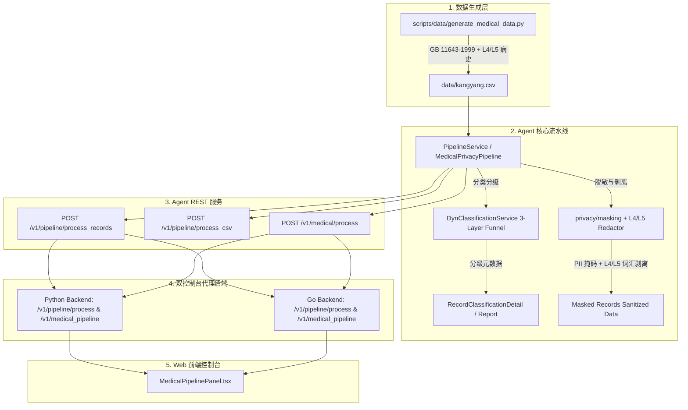

# 医疗数据分类分级与脱敏流水线设计方案 (Medical Privacy Pipeline Design)

> **文档版本**: 1.1 (已实操落盘与全栈贯通)  
> **关联文档**: [`docs/medical_pipeline/prd-legacy.md`](prd-legacy.md)  
> **关键组件**: `scripts/data/generate_medical_data.py`, `engine/pipeline`, `engine/medical_pipeline`, `console/bff-go`, `console/web`

---

## 1. 需求与架构概述

构建端到端的**医疗数据分类分级 (3-Layer) + 敏感脱敏与 L4/L5 剥离流水线**，覆盖数据仿真生成、算法编排、Agent 核心服务、双后端代理及前端测试控制台：



---

## 2. 字段规范与数据生成

### 2.1 字段定义 (kangyang.csv)

固定 27 个标准医疗与个人身份字段，覆盖 5 个语义组：

| 语义组 | 字段列表 (snake_case) | 敏感等级 | 治理策略 |
|---|---|---|---|
| **身份 PII** | `name`, `id_card_no`, `registered_address`, `disability_cert_no`, `medical_insurance_no` | **L3-L4** | PII 自动感知的格式保频掩码 |
| **人口学信息** | `gender`, `age` | **L1** | 保持原样 |
| **临床医疗信息** | `diagnosis_name`, `chief_complaint`, `present_illness`, `past_history`, `personal_history`, `is_smoking`, `smoking_duration`, `family_history`, `allergic_history`, `department` | **L3-L5** | **L4/L5 强剥离** (替换为 `[L5-IMMUNODEFICIENCY-SENSITIVE-MASKED]` 等范畴词) |
| **体征指标** | `height`, `weight` | **L1-L2** | 保持原样 |
| **残疾评估** | `disability_category`, `disability_level`, `assess_type_name`, `assess_result_name`, `assess_score`, `assess_time` | **L2-L3** | 保持原样 / 评估信息规约 |
| **病程与图文** | `progress_note`, `progress_note_time` | **L4-L5** | 含图文病例引用 (如 `[DICOM-CT: /radiology/chest_ct_01.dcm]`)，剥离 L4/L5 诊断 |

### 2.2 仿真生成规则 (`scripts/data/generate_medical_data.py`)

- **身份证号校验**: 遵循 GB 11643-1999 (ISO 7064:1983.MOD 11-2) 模 11-2 算法，生成 100% 可通过合法性校验的 18 位身份证。
- **高敏场景覆盖**:
  - **L4 场景**: 恶性肿瘤 (肺腺癌/胃癌)、乙型肝炎、严重冠心病。
  - **L5 场景**: HIV/艾滋病、重度精神分裂症、遗传性亨廷顿舞蹈病。
- **图文病历标记**: 包含文字描述及 PACS/DICOM/病理切片图的图片引用路径。
- **CLI 参数**: 支持 `--output` (默认 `data/kangyang.csv`), `--count` (默认 20), `--seed` (默认 2026)。

---

## 3. Agent 模块与代码实现结构

### 3.1 代码文件分布

```text
engine/
├── pipeline/
│   ├── __init__.py           # 导出 PipelineService, PipelineResult, classify_records, mask_records, router
│   ├── models.py             # Pydantic 契约模型 (PipelineResult, ClassificationSummary, etc.)
│   ├── classifier.py         # 封装 DynClassificationService 三层分级
│   ├── masker.py             # 封装 privacy/masking 脱敏与 L4/L5 强剥离
│   ├── service.py            # PipelineService 编排器
│   └── router.py             # REST 路由 /v1/pipeline
├── medical_pipeline/
│   ├── __init__.py           # 医疗专属模块导出
│   ├── rules.py              # 医疗敏感词汇正则与规则库
│   ├── pipeline.py           # MedicalPrivacyPipeline 实现
│   └── samples/kangyang.csv     # 仿真数据集备份
└── main.py                   # 挂载 pipeline.router 与 medical.router
```

### 3.2 关键类与 API 契约

#### 1. `PipelineResult` (统一输出结构)

```python
class PipelineResult(BaseModel):
    classification_summary: ClassificationSummary  # 分级汇总 (total_records, level_distribution, high_risk_fields, duration_ms)
    record_details: list[RecordClassificationDetail] # 分级明细 (record_index, final_level, field_details)
    masked_records: list[dict[str, Any]]             # 脱敏清洗后的记录数据 (零 L4/L5 原始高危词汇)
    masking_details: list[MaskingDetail]             # 脱敏操作审计明细
```

#### 2. REST 端点定义

- `POST /v1/pipeline/process_records`: 处理 JSON 记录数组，返回 `PipelineResult`。
- `POST /v1/pipeline/process_csv`: 接受 `multipart/form-data` CSV 文件上传，返回 `PipelineResult`。
- `POST /v1/medical/process`: 医疗特定流程端点，返回 `classification_report` 与 `sanitized_data`。

---

## 4. 后端代理与全栈集成

### 4.1 Go BFF (`console/bff-go`)
- 扩展 `console/bff-go/internal/handlers/handlers.go`:
  - `POST /v1/pipeline/process`
  - `POST /v1/medical_pipeline`
- 若请求体未提供 `records`，自动读取 `console/bff-go/internal/samples/kangyang.csv` 并在 HTTP 代理层透传到 Agent。

### 4.3 Web 前端 (`console/web`)
- 组件: `MedicalPipelinePanel.tsx`
- 支持一键触发 `kangyang.csv` 治理，双 Tab 展示：
  1. **分类分级报告 (Classification Report)**: 记录级与字段级 L1~L5 等级 Badge 展示。
  2. **脱敏清洗数据 (Sanitized Data)**: 展示符合 100% 剥离要求的安全表格。

---

## 5. 单元测试与验证清单

| 测试模块 | 覆盖功能 | 命令 |
|---|---|---|
| `tests/test_pipeline.py` | `PipelineService` 分类、脱敏、CSV 解析及 REST 端点 | `PYTHONPATH=. pytest tests/test_pipeline.py -v` |
| `tests/test_medical_pipeline.py` | GB 11643-1999 校验、L4/L5 泄漏测试、双输出结构 | `PYTHONPATH=. pytest tests/test_medical_pipeline.py -v` |
| Go BFF 测试 | `/v1/pipeline/process` 与 `/v1/medical_pipeline` | `go test -v ./...` (在 `console/bff-go` 下) |

> **历史说明**：早期同时存在 Python REST BFF（`console/backend`）实现相同路由，该实现已移除。
| 前端构建测试 | TypeScript 类型检查与 Vite 编译 | `corepack pnpm build` (在 `console/web` 下) |
