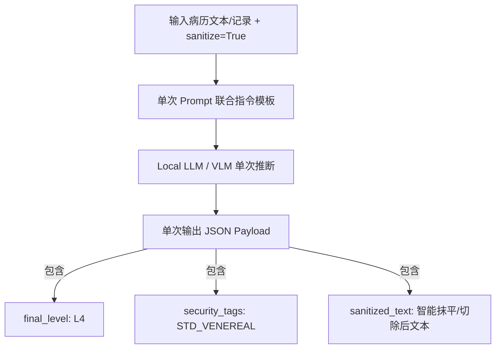

# 医疗敏感数据分类分级与脱敏 Pipeline 设计方案 (Medical Privacy Pipeline Design)

> **文档路径**: `docs/medical_pipeline/design.md`  
> **面向对象**: 架构师、后端/Agent 开发者、算法工程师、前端开发者  
> **功能目标**: 提供真实医疗场景数据生成、3-Layer 分类分级 (L1-L5)、L4/L5 高敏感数据脱敏剥离与双输出保障，并实现 Agent、Python/Go 控制台后端以及 Web 前端的全链路接入。

> **标准算法规范**: [`医疗健康数据分类分级与隐私脱敏算法标准规范.md`](医疗健康数据分类分级与隐私脱敏算法标准规范.md)  

---

## 1. 概述与需求背景 (Overview & Requirements)

在医疗健康数据开放与合规共享场景中，电子病历 (EMR)、残疾人评估记录及医保结算数据包含高度敏感的个人身份标识信息 (PII，如身份证号、医保证号) 以及极高风险的医疗病史信息（如 L4 级的恶性肿瘤/病毒性肝炎病史，以及 DB51 同为 L4 级但采用最严格抹平策略的 HIV 感染/重度精神障碍/性病，L5 级的遗传缺陷等，定级与策略的区分见标准规范 §2.3.2）。

本设计方案旨在构建一个完整的**「三层四柱五御六类」医疗数据合规治理 Pipeline**：

- **三层 (3-Layer Funnel)**：3 层识别与决策漏斗 (Layer-1 规则引擎 ➔ Layer-2 Small-NER ➔ Layer-3 LLM/VLM 仲裁) + 角色三视图控制。
- **四柱 (4-Pillar Matrix)**：高敏疾病 **病因/体征/诊断/处置** 4 柱特征强剥离。
- **五御 (5-Fold Defense)**：**御越权** (DB51 分级)、**御泄漏** (角色三视图+Masking)、**御推断** (DP 差分加噪)、**御关联** (K-匿名泛化)、**御追踪** (FPE + 查询混淆)。
- **六类 (6-Category Matrix)**：覆盖 **身份标识、联系方式、诊疗信息、检验检查、财务信息、生物特征** 6 类字段矩阵。

1. **数据模拟生成 (`scripts/data/generate_medical_data.py`)**：自动生成 100 条包含真实身份证校验码 (GB 11643-1999)、真实文本病历、以及 L4/L5 级敏感病史的高仿真 `kangyang.csv`。
2. **算法处理核心 (`engine/medical_pipeline/`)**：
   - 彻底与 `dynclassification` 统一合并：直接调用 `DynClassificationService.classify_field(..., sanitize=True)` 3 层漏斗 (Rule -> Small-NER -> Qwen3.5 LLM) 完成 27 个字段及文本病历的 L1~L5 风险分级标注。
   - **智能抹平与格式对称**：对 PII 及 L4/L5 级高敏感诊断执行自动抹平，输出语义连贯的无痕重写文本，强制保障输出数据中**绝对不包含任何 L4/L5 级原始敏感内容**。
   - **多线程安全与缓存复用**：`MedicalPrivacyPipeline` 内部挂载 `self._lock = threading.Lock()` 保护 `_sanitized_cache` 读写，避免并发数据竞态。
   - **双重结果输出**：输出 (1) 分级报告数据 (`classification_report`) 和 (2) 脱敏后符合安全合规要求的清洗数据 (`sanitized_data`)。
3. **代理后端与前端全链路集成**：
   - 将 100 条 `kangyang.csv` 放置于 Go/Python 控制台后端及 `medical_pipeline/samples/` 样例目录。
   - 在 Python 后端与 Go 后端实现对应的测试代理与 gRPC/REST 通信。
   - 在 Web 前端控制台增加“医疗数据治理 (Medical Pipeline)”与预置图片病例测试面板，实现 Front-to-End 跑通。

---

## 2. 整体架构设计 (System Architecture)

```mermaid
flowchart TD
    subgraph DataGen [数据生成脚本]
        SG[scripts/data/generate_medical_data.py] -->|生成合规高仿真数据| D1[kangyang.csv]
    end

    subgraph AgentPipeline [engine/medical_pipeline]
        D1 --> MP[MedicalPrivacyPipeline]
        MP -->|调用 dynclassification| DC[3-Layer 分类分级引擎]
        DC -->|标注 L1~L5 等级与 Tag| CR[1. 分级结果数据 (Classification Report)]
        MP -->|调用 privacy/masking| MS[脱敏与 L4/L5 抹平引擎]
        MS -->|PII 掩码 + L4/L5 泛化/抹平| SD[2. 脱敏清洗数据 (Sanitized Data)]
    end

    subgraph Endpoints [通信层与后端通道]
        MP --> Service[PrivacyService / MedicalRoute]
        Service --> PyBackend[Python Console Backend /api/medical_pipeline]
        Service --> GoBackend[Go Console Backend /api/medical_pipeline]
    end

    subgraph Frontend [Web 前端控制台]
        PyBackend --> WebUI[MedicalPipelinePanel.tsx]
        GoBackend --> WebUI
    end
```

---

## 3. 详细模块设计 (Detailed Component Design)

### 3.1 字段规范与 L1~L5 敏感分级定义

数据包含 27 个标准医疗与身份字段，其敏感分级定义遵循中国《数据安全法》、《医疗健康数据安全指南》与相关标准：

| 序号 | 中文字段 | 英文 Key (`kangyang.csv`) | 敏感等级 | 治理策略 |
|---|---|---|---|---|
| 1 | 姓名 | `name` | **L3 (高)** | 姓名掩码（如 `张*`） |
| 2 | 身份证号 | `id_card_no` | **L4 (极高)** | 身份证号保频掩码（如 `110101********1237`） |
| 3 | 户口地址 | `registered_address` | **L3 (高)** | 地址泛化到地级市 |
| 4 | 残疾证号 | `disability_cert_no` | **L3 (高)** | 证号遮蔽掩码 |
| 5 | 医保证号 | `medical_insurance_no` | **L3 (高)** | 证号遮蔽掩码 |
| 6 | 性别 | `gender` | **L1 (低)** | 保持原样 |
| 7 | 年龄 | `age` | **L1 (低)** | 保持原样 / 范围泛化 |
| 8 | 诊断名称 | `diagnosis_name` | **L4~L5 (特高)** | **L4/L5 剥离**（替换为合规范畴词，如 `[L4-普通慢性病]`） |
| 9 | 主诉 | `chief_complaint` | **L3 (高)** | 敏感文本 NER 抽取与遮蔽 |
| 10 | 现病史 | `present_illness` | **L4~L5 (特高)** | **L4/L5 剥离与 NER 掩码** |
| 11 | 既往史 | `past_history` | **L4~L5 (特高)** | **L4/L5 剥离与 NER 掩码** |
| 12 | 个人史 | `personal_history` | **L2 (中)** | 脱敏处理 |
| 13 | 是否吸烟 | `is_smoking` | **L1 (低)** | 保持原样 |
| 14 | 吸烟时长 | `smoking_duration` | **L1 (低)** | 保持原样 |
| 15 | 家族史 | `family_history` | **L3 (高)** | 遗传病敏感文本替换 |
| 16 | 过敏史 | `allergic_history` | **L2 (中)** | 保持原样/掩码 |
| 17 | 科室 | `department` | **L1 (低)** | 保持原样 |
| 18 | 身高 | `height` | **L1 (低)** | 保持原样 |
| 19 | 体重 | `weight` | **L1 (低)** | 保持原样 |
| 20 | 残疾类别 | `disability_category` | **L2 (中)** | 保持原样 |
| 21 | 残疾等级 | `disability_level` | **L2 (中)** | 保持原样 |
| 22 | 评估类型 | `assess_type_name` | **L1 (低)** | 保持原样 |
| 23 | 评估结果 | `assess_result_name` | **L2 (中)** | 保持原样 |
| 24 | 评估分数 | `assess_score` | **L1 (低)** | 保持原样 |
| 25 | 评估时间 | `assess_time` | **L1 (低)** | 格式归一化 |
| 26 | 病程记录 | `progress_note` | **L4~L5 (特高)** | **含图片病例引用，抹平 L4/L5 描述，保护图片 Hash/路径** |
| 27 | 病程记录时间 | `progress_note_time` | **L1 (低)** | 格式归一化 |

---

### 3.2 仿真数据生成器 (`scripts/data/generate_medical_data.py`)

1. **GB 11643-1999 校验码算法**：计算 ISO 7064:1983.MOD 11-2 前 17 位加权余数，生成符合校验规则的真实格式身份证号。
2. **L4/L5 级病史数据嵌入**：
   - **L4 级场景**：恶性肿瘤（肺腺癌、胃癌）、乙型肝炎、严重冠心病。
   - **L5 级场景**：HIV/艾滋病病毒感染、重度精神分裂症、遗传性亨廷顿舞蹈病。
3. **图文混合病程记录**：病程记录中嵌入类似 `[病理切片图: /medical_images/pathology_01.png]` 或 `[DICOM-CT: /radiology/ct_scan_05.dcm]` 的真实图文混合引用。

---

### 3.3 核心算法 Pipeline (`engine/medical_pipeline/`)

包结构定义：
```text
engine/medical_pipeline/
├── __init__.py
├── pipeline.py          # 医疗数据治理 Pipeline 主逻辑 (MedicalPrivacyPipeline)
├── rules.py             # 医疗专属分级规则、PII 别名、L4/L5 关键词字典与 ICD-10 高危编码段治理
├── samples/
│   ├── kangyang.csv        # 自动生成的 27 字段仿真医疗数据集
│   └── yibao.csv        # 自动生成的 19 字段医保结算仿真数据集
```

#### Pipeline 处理逻辑流程：
```python
class MedicalPrivacyPipeline:
    def process_record(self, record: dict) -> Tuple[dict, dict]:
        """
        处理单条医疗记录，返回 (classification_report, sanitized_record)
        """
        # Step 1: 分类分级 (DynClassificationService)
        classification = self.classify_record(record)
        
        # Step 2: L4/L5 级别扫描与全量掩码/剥离
        sanitized = self.sanitize_record(record, classification)
        
        return classification, sanitized
```

---

### 3.5 技术代码实现与正则架构 (Technical Implementation & Pattern Architecture)

> **对应标准规范**: [`医疗健康数据分类分级与隐私脱敏算法标准规范.md`](医疗健康数据分类分级与隐私脱敏算法标准规范.md)

为了支持标准规范中定义的治理原则与 8 步脱敏流水线，底层 Python 代码实现了精细的模块划分、正则表达式预编译与句法自愈管线。

#### 1. 关键 Python 函数与方法签名

| 模块文件 | 函数/方法 | 代码职责说明 |
|---|---|---|
| `rules.py` | `redact_medical_text(text: str) -> str` | 规则脱敏入口函数，按 8 步编排顺序依次执行正则重构与擦除 |
| `rules.py` | `_clean_orphan_syntax(s: str) -> str` | 语法自愈函数，清理擦除敏感实体后残存的孤立介词、连词、悬空动词与死标点 |
| `rules.py` | `_death_age_replace(match: re.Match) -> str` | 死因年龄重构回调，匹配包含年龄的死因句式，保留死因动词并执行年龄 K-匿名 |
| `rules.py` | `_death_replace(match: re.Match) -> str` | 无年龄死因重构回调，将捕获的复合死因与并发症句式重构为"因病去世" |
| `pipeline.py` | `MedicalPrivacyPipeline._contains_high_risk_text(text)` | 三级门禁强扫函数，原文/全角归一化/去噪后扫描 L4/L5 模式，触发 Fail-Safe 整值替换 |
| `service.py` | `DynClassificationService._compute_sanitized_value()` | 动态分类内核脱敏算子，挂载 Fail-Safe 门禁并返回安全 sanitized_value |
| `ner_engines.py` | `_chunk_text(text, max_chunk_len=120)` | 超长文本分句切片静态工具，基于自然标点分句与 120 字符带 20 字符重叠的滑动窗口 |

#### 2. 底层预编译正则表达式对象 (`engine/medical_pipeline/rules.py`)

代码中将高频句法规则预编译为全局 `Pattern` 对象，以实现微秒级高性能匹配：

* **死因重构正则组**：
  * `_REDACT_DEATH_ACTION`：`r"(?:去世|死于|离世|殁于|身亡于|病逝于|不幸身亡|宣告不治|逝世)"`
  * `_REDACT_CAUSE_DEATH_PATTERN`：匹配 `(?:因|由于|死于|殁于|身亡于|病逝于|离世于|因为|由) [高敏病名] (破裂出血导致|并发症导致|抢救无效)? (去世|死于...)?`
  * `_REDACT_DEATH_WITH_AGE_PATTERN`：匹配 `(身亡于|病逝于|死于|殁于|离世于|去世于|因|由于) [高敏病名] (50岁)`，提取组 1 动作词与组 2 年龄数字。
* **四柱特征句法正则组**：
  * `_REDACT_MEDICATION_FULL_PATTERN`：特异性用药与处置完整句法擦除正则（结合 `_MED_PREFIX` 前缀与 `_MED_SUFFIX` 后缀）
  * `_REDACT_GENETIC_CLAUSE_PATTERN`：遗传缺陷与 CAG 重复序列擦除正则
  * `_REDACT_STD_FEATURE_CLAUSE_PATTERN`：性传播疾病（梅毒/TPPA/RPR/醋酸白/CO2激光）综合句法正则
  * `_REDACT_HEPATITIS_FEATURE_CLAUSE_PATTERN`：病毒性肝炎载量（HBV-DNA）、肝穿刺活检（G3S4）擦除正则
* **高敏门禁检测正则组**：
  * `L5_PATTERNS` / `L4_PATTERNS`：用于 Layer-1 扫描与三级门禁强扫的高敏模式列表
  * `_TERMS_FIRST_CHARS_PATTERN`：词库首字符预筛正则，用于快速路径（Fast-Path）短路跳过干净文本

#### 3. 代码级 ReDoS 灾难性回溯切断机制

为了防止恶意构造的长空白串在正则组合槽位间引发灾难性回溯（ReDoS），代码层采取了三维防护：
1. **连续水平空白折叠**：在 `redact_medical_text` 与 `_clean_orphan_syntax` 入口处执行 `s = re.sub(r"[ \t]{2,}", " ", s)`，将所有连续空格折叠为单空格，使可选组间的 `\s*` 回溯空间降为常数；
2. **有界字符量词**：在 `_flex_escape` 词库编译中，字符间分隔符匹配使用有界量词 `[\s.\-_...]{0,1}`，确保线性匹配复杂度；
3. **超长文本降级守卫**：当 `len(text) > 50,000` 时，自动降级为单次替换函数 `_redact_terms_only`，切断复杂的句法回溯。

---

### 3.4 代理后端与 Frontend 跑通路线

1. **Agent 接口层**：
   - REST 路由: `POST /v1/medical/process`（已实现，`engine/routers/medical.py`）
   - gRPC 接口: ~~在 `proto/privacy.proto` 补充 `MedicalProcessRequest` 与 `MedicalProcessResponse`~~ **（未实现，规划中）**——当前 `proto/privacy.proto` 与 `grpc_server.py` 均无医疗 Pipeline 消息与方法；Go 控制台的 `/api/medical_pipeline` 实际走 REST 代理通道。
2. **Go & Python 控制台后端**：
   - Go BFF: 在 `console/bff-go/internal/handlers/handlers.go` 增加 `POST /api/medical_pipeline`。
   - 将 `kangyang.csv` 部署到 `console/bff-go/internal/samples/kangyang.csv`。

> **历史说明**：早期设计同时要求 Python REST BFF（`console/backend/app/main.py`）实现相同路由，该实现已移除。
3. **Web 控制台 (`console/web`)**：
   - 新增 `MedicalPipelinePanel.tsx` 视图组件。
   - 在左侧侧边栏增加“医疗数据治理 (Medical Pipeline)”入口。
   - 支持一键载入 `kangyang.csv` 20 条数据、一键运行 Pipeline、联动分栏展示“1. 字段与记录级分级报告”和“2. 脱敏清洗数据（已彻底消除 L4/L5 高危病史与 PII）”。

---

## 4. 单元测试设计 (Testing Plan)

在 `tests/test_medical_pipeline.py` 中编写自动化测试，验证：
1. `kangyang.csv` 的字段完整性 (27 列) 与身份证号算法有效性。
2. 包含 L4/L5 级诊断与病史的数据记录经 Pipeline 处理后，`sanitized_data` 中绝对不包含原始 L4/L5 敏感字符串。
3. PII 字段（姓名、身份证、医保证、残疾证）脱敏后符合掩码规范。
4. 双重输出（分级报告与脱敏数据）格式与结构完全符合 JSON 契约。
5. 替换标签中不包含原始敏感词汇（如 HIV、乙肝等）。
6. 批量身份证校验码 (GB 11643-1999) 100% 通过率。
7. 混合 L4+L5 文本的完整剥离验证。
8. `pipeline/masker.py` 与 `medical_pipeline/rules.py` 词库一致性验证。

---

## 5. 代码质量改进记录 (Code Quality Improvements)

### 5.1 已修复的漏洞与缺陷

| 编号 | 问题 | 修复内容 | 影响文件 |
|---|---|---|---|
| Q-1 | `rules.py` 中 `_compile_term_patterns` 是死代码，且用 `"L5" in str(terms_dict)` 判断级别不可靠 | 删除死代码 | `medical_pipeline/rules.py` |
| Q-2 | `sanitize_field` 传入 `"chinese_name"` 但 `guess_field_type` 不识别 | 改用实际字段名 `"name"` | `medical_pipeline/pipeline.py` |
| Q-3 | `_classify_field` 只返回首个匹配等级，可能遗漏混合风险 | 重写扫描逻辑，确保 L5 优先于 L4 | `medical_pipeline/pipeline.py` |
| Q-4 | `pipeline/masker.py` 维护独立的 L4/L5 词库，与 `medical_pipeline/rules.py` 不同步 | 统一从 `medical_pipeline.rules` 导入 | `pipeline/masker.py` |
| Q-5 | CSV 生成用 `utf-8-sig`（含 BOM），读取用 `utf-8`，首列名可能带 `\ufeff` | 统一默认 `utf-8-sig` 编码 | `pipeline/service.py` |
| Q-6 | L5 替换标签 `[L5-HIV_AIDS-...]` 中包含原始敏感词 "HIV" | 引入抽象类别映射，替换为 `[L5-IMMUNODEFICIENCY-...]` | `medical_pipeline/rules.py` |
| Q-7 | `masker.py` 中 L4/L5 剥离条件硬编码字段名，与分级结果脱钩 | 提取 `CLINICAL_TEXT_FIELDS` 常量，逻辑更清晰 | `pipeline/masker.py` |

### 5.2 安全审计与加固记录（第二轮）

| 编号 | 问题 | 修复内容 | 影响文件 |
|---|---|---|---|
| Q-8 | **【Critical】ReDoS**：`_REDACT_STD_FEATURE_CLAUSE_PATTERN` 等句法正则在 `"梅毒，患者"+2000空格` 类输入上挂死（实测 >10s），50,000 字符降级守卫无法覆盖（百余字符即触发） | ① 重写 STD 句法正则，移除相邻可选组间的无界 `\s*` 链；② 进入敏感路径后先将 `[ \t]{2,}` 折叠为单空格，使所有 `\s*` 槽位回溯空间降为常数；③ 自愈管线 rule-8 全匹配正则增加 30 字符上限；④ `redact_medical_text_with_ner` 补齐 >50,000 字符降级守卫 | `medical_pipeline/rules.py` |
| Q-9 | **【Critical】变体绕过**：全角 `ＨＩＶ`、插字符 `H I V`/`H.I.V`/`艾-滋-病`/零宽字符、英文病名（`AIDS`/`syphilis` 等）、同义词（`人免疫缺陷病毒`）等变体端到端原样泄露 | ① 词库编译引入 `_flex_escape`：字符间容忍至多 1 个分隔符（有界 `{0,1}`，保证线性匹配）；② 全角字母/数字归一化；③ 词库补入英文病名与同义词；④ 最终门禁升级为原文/归一化/去噪三级检测 | `medical_pipeline/rules.py`、`medical_pipeline/pipeline.py` |
| Q-10 | **【Critical】四柱覆盖缺口**：替诺福韦/拉米夫定单药、抗精神病药（氨磺必利/利培酮/氯氮平）、苄星青霉素、肝硬化体征群、CD4 计数、化疗/放疗/干扰素/病毒载量等 16 项强关联特征探针全部泄露；规范 Case 4 经 NER 路径实测泄露 `180/μL。行+。` 残渣 | ① 按四柱（病因/体征/检查/用药）系统补词入库；② NER 路径镜像执行规则句法擦除（CD4/用药/泛化），不再只依赖实体锚点；③ CD4 正则支持 `个/μL` 等单位、HBV 载量兼容上标数字（`×10⁶`） | `medical_pipeline/rules.py` |
| Q-11 | 范畴化泛化张冠李戴：`有呼吸系统肿瘤家族史` → `有呼吸系统消化道疾病家族史`（首条规则前缀可选导致误配） | 器官/系统前缀改为必选，裸 `肿瘤` 兜底规则（→ 相关系统疾病）置于最后 | `medical_pipeline/rules.py` |
| Q-12 | `guarantee_no_l4_l5_raw_data` 为自报标志（仅看打码失败数），实测泄露场景仍为 `True` | 改为对全部脱敏输出执行三级高敏词回扫后的**实测**结论；summary 新增 `fail_safe_triggered_fields`（门禁触发数）与 `sanitized_pii_fields_total`（实测 PII 计数，原 `sanitized_pii_fields_per_record` 硬编码词表大小问题一并修复） | `medical_pipeline/pipeline.py` |
| Q-13 | `_sanitized_cache` 无界增长：`sanitize=False` 时只写不读、图像分支提前 return 不消费缓存项 | 图像分支 return 前消费缓存；`sanitize=False` 批次结束统一清空；缓存加 FIFO 上限（2048，与 NER 缓存一致） | `medical_pipeline/pipeline.py` |
| Q-14 | 非临床低敏字段在 `_sanitize_field` 中被重入 `_classify_field` 二次完整漏斗推理（NER/LLM 成本翻倍）；NER 推理在锁内执行阻塞并发缓存访问 | `_sanitize_field` 增加 `level_hint` 参数复用已算等级；NER 缓存改双检模式（锁内查/写、锁外推理） | `medical_pipeline/pipeline.py` |
| Q-15 | `mask_id_card` 对非 18 位脏数据原样返回（明文放行） | 非 18 位按长度分级降级掩码（>=10 留前 3 后 4、>=4 留首尾、更短全掩码），绝不原样放行 | `privacy/masking.py` |
| Q-16 | PII 拦截只认 5 个规范英文键+中文别名，`id_card`/`address`/`phone_number` 等常见英文变体被判 L1 原样输出 | PII 别名表扩充常见英文变体并大小写归一 | `medical_pipeline/rules.py` |
| Q-17 | `POST /v1/medical/process` 无记录数/字段数/字段长度限制，可被超大 payload DoS | 增加请求规模校验（500 记录 / 100 字段 / 100,000 字符），超限 422 | `routers/medical.py` |
| Q-18 | **【High】ASCII 词项无词边界**：`archive` 被抠成 `arce`（含 hiv）、`http://` 被抠成 `seep://`（含 htt）、`ABCD4` 被抠成 `AB`（含 CD4），叠加最终门禁导致良性字段被整值抹除 | `_flex_escape` 对首尾为 ASCII 字母数字的词项附加 `(?<![A-Za-z0-9])` / `(?![A-Za-z0-9])` 零宽断言；CJK 词项保持子串匹配 | `medical_pipeline/rules.py` |
| Q-19 | **【Medium】NER 降级路径干净文本误篡改**：fallback 在 `redact_medical_text` 结果上再套一层 `_clean_orphan_syntax`，清理正则（删"出现/进一步/伴瘙痒"等）误伤干净文本（`患者出现皮疹3天，伴瘙痒。` → `患者皮疹3天。`） | fallback 直接返回 `redact_medical_text(text)`（其内部已对敏感文本完成自愈、对干净文本 Fast-Path 原样返回） | `medical_pipeline/rules.py` |
| Q-20 | 拼音/形近覆盖表面化：仅修审计样例（`aizibing`/`肺ai`/`霉毒`），同族变体（`精神分lie`/`乙gan`/`xingbing`/`乳腺ai`/`H1V`/`HlV`）仍泄露 | 系统化补词：字符替换型（`H1V`/`HlV`）、中英混合型（`精神分lie`/`乙gan`/`丙gan`）、器官+`ai` 系列（乳腺/肠/食道/胰/宫颈/前列腺等 20 部位）、`xingbing`/`linbing` 等 | `medical_pipeline/rules.py` |
| Q-21 | Fast-Path 性能退化：词边界零宽断言使交替匹配失预过滤，49KB 干净文本扫描 233ms | 增加词库首字符预筛正则（未命中直接短路）+ 三级检测变体集合去重，降回 ~80ms/49KB（典型字段 <2ms） | `medical_pipeline/rules.py`、`medical_pipeline/pipeline.py` |
| Q-22 | 控制台后端读取带 BOM 的 CSV 时首列键带 `\ufeff` 前缀（Python `utf-8`、Go `ParseCSV` 均未处理） | Go BFF `ParseCSV` 入口剥离 BOM | `console/bff-go/internal/fileparse/fileparse.go` |

> **历史说明**：早期由 Python REST BFF（`console/backend/app/main.py`）处理 BOM，该实现已移除。
| Q-23 | NER 分支仅做实体锚定擦除，`确诊艾滋病` 经 NER 路径残留 `确诊`（句法残渣） | NER 分支重构为「先规则全量句法擦除（复用 `redact_medical_text` 主路径）→ 再 NER 实体锚定擦除词库外实体」，两引擎输出收敛一致 | `medical_pipeline/rules.py` |

> 同期 `dynclassification` 内核侧修复（路径穿越白名单校验、文本脱敏 fail-closed、LLM 裁定地板校验与 Prompt 注入中和、图片路径沙箱 `PRIVACY_IMAGE_ALLOWED_DIRS`、仲裁默认值对齐 0.75/true、MLX `sanitize` 形参补齐等）详见 `docs/dynclassification/` 与对应模块变更记录。

---

## 6. 性病及 L4 级疾病脱敏方案与 3-Layer 智能切除演进

### 6.1 现有脱敏机制 (规则与词表抽取)

当前在 `medical_pipeline/rules.py` 与 `pipeline/masker.py` 中，对性病（梅毒、淋病、尖锐湿疣、生殖器疱疹、软下疳等）、恶性肿瘤及乙肝等 L4/L5 级疾病采用【四柱强剥离/无痕抹平原则】治理路径：

1. **【四柱强剥离原则 (Four-Pillar Erasure Principle)】**：全链条擦除四类强相关特征，严防通过上下文反推高敏病史：
   - **病因/诱因描述 (Etiology/Exposure)**：不洁性接触史、输血史、针刺伤、特定基因突变（如 HTT 基因 CAG 重复扩增）等；
   - **现象/体征描述 (Manifestations/Signs/Symptoms)**：外阴/会阴/肛周多发赘生物伴瘙痒（菜花状/鸡冠状/乳头状）、无痛性溃疡(硬下疳)、生殖器水疱、命令性幻听、被害妄想、四肢舞蹈样动作、慢性腹泻伴消瘦等；
   - **诊断/检查描述 (Diagnoses/Examinations/Labs)**：醋酸白试验阳性、TPPA/RPR滴度阳性、HPV 6/11或16/18等低/高危基因型阳性、CD4+ T淋巴细胞计数、HBV-DNA载量、病理活检提示等；
   - **用药/处置描述 (Medications/Treatments/Procedures)**：CO2激光灼除术、咪喹莫特乳膏外用、ART抗逆转录治疗(替诺福韦+拉米夫定+多替拉韦)、奥氮平片、四苯嗪、恩替卡韦等。
2. **特定词表与正则精准匹配 (Layer 1 Rule)**：在 `L4_TERMS_MAP` 与 `L5_TERMS_MAP` 中建立专项高敏感字典（涵盖病名、体征现象、检查指标及专科药物）。
3. **范畴化标签替换与强剥离**：将匹配到的敏感特征整句/整块擦除并自愈孤立语法残渣，确保输出数据不含任何原始高危词汇。

### 6.2 引入 Small-NER 与 Local LLM 智能切除的优势分析

传统基于 Layer 1 静态正则/词表的脱敏方式在复杂非结构化临床病历（如主诉、现病史、病程记录）中存在局限。**调用 Small-NER (Layer 2) 与 Local LLM (Layer 3) 直接智能切除/抹平关于性病及 L4/L5 疾病的四柱描述，效果显著更好**。

### 6.3 领域解耦与策略注册架构 (Domain Decoupling & Registration Architecture)

1. **定位解耦**：`medical_pipeline/rules.py` 专门维护医疗领域的敏感字典、四柱强剥离正则与句法自愈算法，与通用分类内核 `dynclassification` 严格解耦（符合单一职责原则）。
2. **策略自动注册**：`MedicalPrivacyPipeline` 在初始化时向 `dynclassification.default_domain_registry` 注册医疗领域的脱敏回调策略：
   ```python
   from ..dynclassification import default_domain_registry
   default_domain_registry.register_sanitizer("medical", self._medical_text_sanitizer)
   ```
3. **跨领域扩展**：通用的 `dynclassification` 内核零硬编码医疗逻辑，未来的 `finance_pipeline` 或 `hr_pipeline` 均可通过相同的策略注册模式无缝接入。

### 6.4 差异化自动化治理矩阵 (Automated Differential Governance Matrix)

系统在数据处理流中**全自动判别病种范畴**，并按以下策略矩阵自动路由执行：

| 治理策略分类 | 涵盖疾病范畴 | 自动化处理行为 | 典型自动化示例 |
|---|---|---|---|
| **禁止泛化/彻底抹平 (Purge Only)** | **性传播疾病 (STD)**<br>**艾滋病 (HIV/AIDS)**<br>**重度精神障碍** | **100% 自动直接整句/整块擦除**，坚决不泛化为任何大类词（防止通过大类词结合患病部位/用药引发污名化猜测）。 | `患者1年前有梅毒病史，行咪喹莫特外用。` $\rightarrow$ **`""`** (零迹抹平) |
| **范畴化降级泛化 (Generalization Allowed)** | **恶性肿瘤 (Malignant Neoplasms)**<br>**病毒性肝炎 (Hepatitis)**<br>**罕见遗传缺陷**<br>**严重器官衰竭** | **自动重构降级**为 L1/L2 通用器官与系统大类疾病，保留临床科研与家族史特征价值。 | `家族中有明显消化道肿瘤聚集倾向` $\rightarrow$ **`家族中有明显消化道疾病聚集倾向`**<br>`有乙肝家族史` $\rightarrow$ **`有肝脏疾病家族史`** |

---

## 7. 医疗脱敏规则引擎 (Rule) 与 Small-NER 算法详细方案

### 7.1 规则引擎脱敏算法 (`redact_medical_text`) 详细链路

#### 1. Fast-Path 前置无篡改检测
- **匹配逻辑**：使用 `_TERMS_ONLY_PATTERN.search(text)` 匹配词库与 `_MASKED_LABEL_RE.search(text)` 匹配脱敏标签。
- **效果**：无敏感词文本直接原样返回，开销由 ~50ms 降至 `<1ms`，零误伤干净文本。

#### 2. ReDoS 灾难性回溯防护
- 当输入文本长度 `len(text) > 50,000` 字符时，自动降级为 `_redact_terms_only` 单次扫描替换，切断复杂句法正则的回溯计算。

#### 3. 八步句法重构与定点擦除（遵循四柱强剥离原则）
1. **死因短语重构**：将 `因'恶性肿瘤'去世`、`因'HIV'导致的并发症去世` 自然重构为 `因病去世`。
2. **完整服药/用药与处置句法擦除**：涵盖特异性用药（如 `CO2激光灼除术`、`咪喹莫特乳膏`、`ART抗逆转录`、`奥氮平片`、`四苯嗪`、`恩替卡韦`），要求前缀 (服用/口服/给予...)、剂量用法 (`20mg qd`) 或后缀 (控制症状/方案/外用/局部涂抹) 匹配整句擦除。
3. **就诊机构句法擦除**：擦除 `曾就诊于...` 短语。
4. **独立诊断与检查句法擦除**：擦除 `诊断为...`、`醋酸白试验阳性`、`HPV 6/11或16/18阳性`、`TPPA/RPR滴度`、`HBV-DNA载量` 等强特征化验与结论短语。
5. **特征体征与现象倾向擦除**：擦除 `外阴/会阴/肛周多发赘生物伴瘙痒`（菜花状/鸡冠状/乳头状）、`无痛性溃疡(硬下疳)`、`生殖器水疱`、`及保护性约束倾向` 等病理体征现象短语。
6. **复合列表擦除**：在 `患'A'、'B'` 顿号列表中仅擦除敏感项并擦除多余顿号 `、`，保留非敏感项。
7. **单疾病场景重构**：将 `一弟患'重度精神分裂症'` 自然重构泛化为 `一弟患病`。
8. **既往史/病史擦除**：清理 `慢性乙型肝炎病史` 残留的 `慢性` 前缀。

---

### 7.2 Small-NER 脱敏算法 (`redact_medical_text_with_ner`) 详细链路

```mermaid
flowchart TD
    TextIn[输入非结构化病历文本] --> NERExtract[1. Small-NER 实体抽取\nner_adapter.extract]
    NERExtract -->|输出实体列表| Filter[2. L4/L5 重大高敏实体筛选\n_is_major_sensitive_entity]
    Filter -->|遵照 L4_L5_MAJOR_SENSITIVE_PROMPT_GUIDELINE| SensitiveEntities{是否存在 L4/L5 高敏实体?}
    SensitiveEntities -->|否 (全是高血压/高脂血症等常规慢病)| FallbackRule[保留原文本 / 降级至规则引擎]
    SensitiveEntities -->|是| Sort[3. 按实体字符长度倒序排列\nreverse=True]
    Sort --> RedactLoop[4. 类型绑定上下文擦除\nDRUG / HOSPITAL / DISEASE / SYMPTOM / TEST]
    RedactLoop --> SelfHeal[5. 语法自愈与无语义碎片整句抹平\n_clean_orphan_syntax]
    SelfHeal --> OutputText[输出高合规脱敏文本]
```

#### 1. 神经网络实体抽取 (Entity Extraction)
- 通过 `ner_adapter.extract(text)` 延迟加载底层 Small-NER 模型（ONNX / ModelScope / TensorRT），抽取 `DISEASE`（疾病）、`DRUG`（药物）、`SYMPTOM`（现象/体征）、`TEST`（检查/结论）、`HOSPITAL`（机构）等实体。

#### 2. L4/L5 重大高敏实体筛选 (`_is_major_sensitive_entity`)
- **提示词指南**：遵照 `L4_L5_MAJOR_SENSITIVE_PROMPT_GUIDELINE` 规范，全面落实【四柱强剥离原则】：
  - **病因/诱因**：不洁性接触史、高危接触史、HTT基因CAG重复等；
  - **现象/体征**：外阴/会阴/肛周多发赘生物伴瘙痒、菜花状/鸡冠状赘生物、无痛性溃疡(硬下疳)、命令性幻听、被害妄想、舞蹈样动作、慢性腹泻伴消瘦等；
  - **诊断/检查**：醋酸白试验阳性、TPPA/RPR滴度、HPV 6/11或16/18阳性、CD4+ T淋巴细胞计数、HBV-DNA载量等；
  - **用药/处置**：CO2激光灼除术、咪喹莫特乳膏外用、ART抗逆转录、奥氮平片、四苯嗪、恩替卡韦等。
- **筛选逻辑**：
  - 仅保留属于 **L4/L5 重大高敏级别** 的实体及其强相关高敏处置/用药/检查/现象。
  - **常规慢性病（高血压、高脂血症、糖尿病等）及常规用药（阿托伐他汀、降压药等）判定为 False，100% 跳过不擦除，原样保留。**

#### 3. 实体按长度倒序排列 (Length-first Sorting)
- 待擦除实体按字符长度从长到短排序（`reverse=True`），优先匹配长词，防止短词切割长词导致字词残渣。

#### 4. 类型绑定的上下文擦除 (Type-bound Contextual Redaction)
- **DRUG (药物)**：擦除 `修饰前缀 + 药名 + 剂量用法(\d+mg qd...) + 控制症状短语/局部外用/涂抹`；
- **HOSPITAL (机构)**：擦除 `就诊动作 + 医院名`；
- **DISEASE/SYMPTOM/TEST (疾病/现象/检查)**：做实体级精准剥离，绑定关联介词修饰并擦除紧随的顿号。

#### 5. 语法自愈与无语义碎片整句抹平 (`_clean_orphan_syntax`)
- **孤立连词剥离**：清理句首/句尾孤立连词（如 `与`、`和`、`及`）；
- **标点合并**：合并连续重复标点（如 `，。` $\rightarrow$ `。`）；
- **无语义孤立状语整句抹平**：若整句文本擦除后仅剩下形如 `外阴多发赘生物伴瘙痒1月` $\rightarrow$ `""`、`反复发作3年` $\rightarrow$ `""` 等**既无主语也无病因实体的时间/频次/孤立前缀状语**，自愈逻辑判定其为无语义碎片，**直接整句抹平清空为 `""`**。

---

### 7.3 两种脱敏引擎实测行为对比表

| 输入文本范例 | 规则引擎 (Rule) 脱敏输出 | Small-NER 引擎脱敏输出 | 说明与合规理由 |
|---|---|---|---|
| `高脂血症病史5年，口服阿托伐他汀20mg qn。` | `高脂血症病史5年...` | `高脂血症病史5年...` | 高脂血症与阿托伐他汀为常规 L1/L2 慢病/常用药，两个引擎均 **100% 原样保留** |
| `外阴多发赘生物伴瘙痒1月` | `""` (抹平为空) | `""` (抹平为空) | 识别为 L4 级性病（尖锐湿疣）典型体征现象描述，全句擦除并自愈为 **`""`** |
| `患者1月前发现外阴多发菜花状赘生物，醋酸白试验阳性。行CO2激光灼除术及咪喹莫特乳膏外用。胸片详见 xray.png。` | `胸片详见 xray.png。` | `胸片详见 xray.png。` | 按【四柱原则】擦除现象、检查结论与特定手术/用药，仅保留非敏感胸片引用 |
| `因'HIV'导致的并发症去世。` | `因病去世。` | `因病去世。` | 包含 L5 级 HIV 极高敏词，自然重构为泛化 `因病去世` |
| `一弟患'重度精神分裂症'、'2型糖尿病'。` | `一弟患'2型糖尿病'。` | `一弟患'2型糖尿病'。` | 精准擦除 L5 级精神分裂症与顿号 `、`，保留非敏感的 2型糖尿病 |
| `幻听与被害妄想反复发作3年` | `""` (抹平为空) | `""` (抹平为空) | 全句均为 L5 极高敏症状，抹平后仅剩无主语状语，自愈逻辑判定为无语义碎片，**直接整句清空** |
| `高脂血症病史5年，长期服用奥氮平片20mg qd控制重度精神分裂症。` | `高脂血症病史5年。` | `高脂血症病史5年。` | 准确保留常规慢病，抹平 L5 级精神分裂症与关联用药奥氮平片 |高合规性的完美平衡。

### 7.4 3-Layer (Rule → NER → LLM) 协同治理最佳实践

1. **Layer 1 (Rule)**：极低延迟与极低开销，兜底已知明确性病关键词及身份证/姓名等 PII 脱敏。
2. **Layer 2 (Small-NER)**：毫秒级推断，识别非结构化临床病历中的病名/症状 Span 进行定点切除。
3. **Layer 3 (Local LLM)**：在复合病历或复杂语义场景下触发，执行上下文重构与完全无缝切除。

---

### 7.5 单次 Prompt 联合推断与接口重定义优化 (Single-Pass Joint Classification & Sanitization)

#### 1. 传统两次调用的性能瓶颈
若将“分类分级”与“文本脱敏”拆分为两个独立阶段分别调用 LLM/VLM：
- **阶段 1**：LLM 评估文本敏感等级（如判断是否为 L4/L5）。
- **阶段 2**：若等级 > L3，再次调用 LLM 执行文本抹平/切除重构。

单次大模型推理通常耗时 1.5~3.0 秒。两次串行调用将使接口延迟翻倍达 3~6 秒，显存与计算资源开销增加 100%，极易造成高并发下的 OOM 或超时。

#### 2. 接口重定义与单次 Prompt 融合架构
重新定义 API 接口与Prompt 模板，支持传入控制参数 `sanitize: bool = True`：



**融合 Prompt 指令范例**：
> *"请评估以下临床病历文本的敏感等级 (L1~L5) 与安全标签。**若评定级别 > L3 (如 L4 或 L5) 且 sanitize=true**，请在同一响应中同时给出抹平切除性病/重症描述后的 sanitized_text；若级别 <= L3，则 sanitized_text 保持原文。请统一以 JSON 格式输出：`{"final_level": "...", "reasoning": "...", "sanitized_text": "..."}`。"*

#### 3. 性能收益
- **响应延迟降低 50%**：单次推断完成判定与重构脱敏。
- **显存与计算开销降低 50%**：仅需一次 Context 加载与 KV Cache 计算。
- **接口扩展性**：设置 `sanitize=False` 时，只进行分类分级计算，彻底切断不必要的脱敏开销。

---

## 8. 规则脱敏 (Rule) 与 Small-NER 脱敏详细处理流程与算法 (Detailed Redaction Algorithms)

> 注：本节为第 7 章的详版补充，流程图与要点与 7.1/7.2 一致，供实现层对照参考。

### 8.1 规则脱敏算法 (`redact_medical_text`) 详细链路

```mermaid
flowchart TD
    In[输入文本 text] --> CheckEmpty{是否为空?}
    CheckEmpty -->|是| RetEmpty[返回原文]
    CheckEmpty -->|否| CheckLen{长度 > 50,000?}
    CheckLen -->|是| Fallback[_redact_terms_only 词库级单次替换]
    CheckLen -->|否| FastPath{含有 L4/L5 敏感词或脱敏标签?}
    FastPath -->|否 (Fast-Path)| RetClean[原样返回原文 (零篡改, <1ms)]
    FastPath -->|是| Step1[1. 死因句法重构: 因'HIV'去世 -> 因病去世]
    Step1 --> Step2[2. 服药句法擦除: 服用'奥氮平片'20mg qd -> 抹平]
    Step2 --> Step3[3. 就诊机构句法擦除: 曾就诊于精神卫生中心 -> 抹平]
    Step3 --> Step4[4. 独立诊断句法擦除: 诊断为重度精神分裂症 -> 抹平]
    Step4 --> Step5[5. 特征倾向句法擦除: 及保护性约束倾向 -> 抹平]
    Step5 --> Step6[6. 复合列表顿号擦除: 患'精神分裂'、'2型糖尿病' -> 患'2型糖尿病']
    Step6 --> Step7[7. 亲属单疾病重构: 一弟患'精神分裂症' -> 一弟患病]
    Step7 --> Step8[8. 既往史/病史擦除: 消除'慢性'前缀残渣]
    Step8 --> Heal[_clean_orphan_syntax 语法自愈与无语义碎片整句抹平]
    Heal --> Out[输出脱敏文本]
```

#### 1. Fast-Path 前置无篡改检测
- **算法原委**：为解决干净文本（无敏感词文本）在经过后续句法自愈正则时产生误篡改（例如误将 `母亲“高血压”控制良好` 改为 `母亲患'高血压”控制良好` 或消除段落空行）的问题，引入 Fast-Path 前置校验。
- **匹配逻辑**：使用 `_TERMS_ONLY_PATTERN.search(text)` 匹配词库与 `_MASKED_LABEL_RE.search(text)` 匹配脱敏标签。
- **效果**：无敏感词文本直接原样返回，开销由 ~50ms 降至 `<1ms`，零误伤干净文本。

#### 2. ReDoS 灾难性回溯防护
- 当输入文本长度 `len(text) > 50,000` 字符时，自动降级为 `_redact_terms_only` 单次扫描替换，切断复杂句法正则的回溯计算。

#### 3. 八步句法重构与定点擦除
1. **死因短语重构**：将 `因'恶性肿瘤'去世`、`因'HIV'导致的并发症去世` 自然重构为 `因病去世`。
2. **完整服药句法擦除**：要求前缀 (服用/口服/给予...)、剂量用法 (`20mg qd`) 或后缀 (控制症状/方案) 至少存在其一，避免无修饰裸词抢先匹配；整句抹去服药短语及剂量。
3. **就诊机构句法擦除**：擦除 `曾就诊于...` 短语。
4. **独立诊断句法擦除**：擦除 `诊断为...` 短语。
5. **特征倾向擦除**：擦除 `及保护性约束倾向` 等短语（要求必须有前缀或后缀）。
6. **复合列表擦除**：在 `患'A'、'B'` 顿号列表中仅擦除敏感项并擦除多余顿号 `、`，保留非敏感项。
7. **单疾病场景重构**：将 `一弟患'重度精神分裂症'` 自然重构泛化为 `一弟患病`。
8. **既往史/病史擦除**：清理 `慢性乙型肝炎病史` 残留的 `慢性` 前缀。

---

### 8.2 Small-NER 脱敏算法 (`redact_medical_text_with_ner`) 详细链路

```mermaid
flowchart TD
    TextIn[输入非结构化病历文本] --> NERExtract[1. Small-NER 实体抽取\ner_adapter.extract]
    NERExtract -->|输出实体列表| Filter[2. L4/L5 重大高敏实体筛选\n_is_major_sensitive_entity]
    Filter -->|遵照 L4_L5_MAJOR_SENSITIVE_PROMPT_GUIDELINE| SensitiveEntities{是否存在 L4/L5 高敏实体?}
    SensitiveEntities -->|否 (全是高血压/高脂血症等常规慢病)| FallbackRule[保留原文本 / 降级至规则引擎]
    SensitiveEntities -->|是| Sort[3. 按实体字符长度倒序排列\nreverse=True]
    Sort --> RedactLoop[4. 类型绑定上下文擦除\nDRUG / HOSPITAL / DISEASE]
    RedactLoop --> SelfHeal[5. 语法自愈与无语义碎片整句抹平\n_clean_orphan_syntax]
    SelfHeal --> OutputText[输出高合规脱敏文本]
```

#### 1. 神经网络实体抽取 (Entity Extraction)
- 通过 `ner_adapter.extract(text)` 延迟加载底层 Small-NER 模型（ONNX / ModelScope / TensorRT），提取出 `DISEASE`（疾病）、`DRUG`（药物）、`SYMPTOM`（症状）、`HOSPITAL`（机构）等实体。

#### 2. L4/L5 重大高敏实体筛选 (`_is_major_sensitive_entity`)
- **提示词指南**：遵照 `L4_L5_MAJOR_SENSITIVE_PROMPT_GUIDELINE` 规范。
- **筛选逻辑**：
  - 仅保留属于 **L4/L5 重大高敏级别** 的实体（HIV/艾滋病、重度精神分裂症、幻听、被害妄想、恶性肿瘤、梅毒、乙肝/丙肝、急性心肌梗死等）及其关联高敏药物（奥氮平、四苯嗪、替诺福韦、恩替卡韦等）。
  - **常规慢性病（高血压、高脂血症、糖尿病等）及常规用药（阿托伐他汀、降压药等）判定为 False，100% 跳过不擦除，原样保留。**

#### 3. 实体按长度倒序排列 (Length-first Sorting)
- 待擦除实体按字符长度从长到短排序（`reverse=True`），优先匹配长词，防止短词切割长词导致字词残渣。

#### 4. 类型绑定的上下文擦除 (Type-bound Contextual Redaction)
- **DRUG (药物)**：擦除 `修饰前缀 + 药名 + 剂量用法(\d+mg qd...) + 控制症状短语`；
- **HOSPITAL (机构)**：擦除 `就诊动作 + 医院名`；
- **DISEASE/SYMPTOM (疾病/症状)**：做实体级精准剥离，并擦除紧随的顿号。

#### 5. 语法自愈与无语义碎片整句抹平 (`_clean_orphan_syntax`)
- **孤立连词剥离**：清理句首/句尾孤立连词（如 `与`、`和`、`及`）；
- **标点合并**：合并连续重复标点（如 `，。` $\rightarrow$ `。`）；
- **无语义孤立状语整句抹平**：若整句文本擦除后仅剩下形如 `反复发作3年`、`3年`、`反复发作` 等**既无主语也无病因实体的时间/频次状语**，自愈逻辑判定其为无语义碎片，**直接整句抹平清空为 `""`**。

---

### 8.3 两种脱敏引擎实测行为对比表

| 输入文本范例 | 规则引擎 (Rule) 脱敏输出 | Small-NER 引擎脱敏输出 | 说明与合规理由 |
|---|---|---|---|
| `高脂血症病史5年，口服阿托伐他汀20mg qn。` | `高脂血症病史5年...` | `高脂血症病史5年...` | 高脂血症与阿托伐他汀为常规 L1/L2 慢病/常用药，两个引擎均 **100% 原样保留** |
| `因'HIV'导致的并发症去世。` | `因病去世。` | `因病去世。` | 包含 L5 级 HIV 极高敏词，自然重构为泛化 `因病去世` |
| `一弟患'重度精神分裂症'、'2型糖尿病'。` | `一弟患'2型糖尿病'。` | `一弟患'2型糖尿病'。` | 精准擦除 L5 级精神分裂症与顿号 `、`，保留非敏感的 2型糖尿病 |
| `幻听与被害妄想反复发作3年` | `""` (抹平为空) | `""` (抹平为空) | 全句均为 L5 极高敏症状，抹平后仅剩无主语状语，自愈逻辑判定为无语义碎片，**直接整句清空** |
| `高脂血症病史5年，长期服用奥氮平片20mg qd控制重度精神分裂症。` | `高脂血症病史5年。` | `高脂血症病史5年。` | 准确保留常规慢病，抹平 L5 级精神分裂症与关联用药奥氮平片 |

