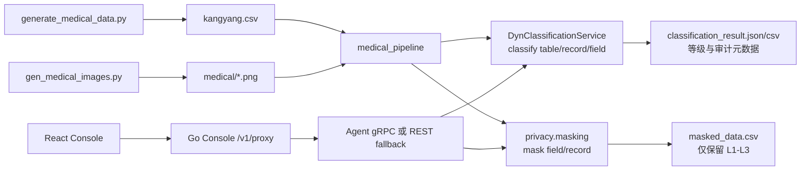

# 医疗病例数据生成、分类分级与脱敏流水线设计

> 状态：设计方案（本阶段只定义方案，不实现代码）
>
> 本方案覆盖仿真医疗 CSV 的生成、动态分类分级、字段脱敏、高敏数据剔除，以及 Python/Go Console 和 Web 前端的端到端验证。

## 1. 背景与目标

需求包含三条必须闭环的链路：

1. 生成 20 条具有医疗语义、包含 L4/L5 病史、个人信息和图文病例引用的仿真数据，并输出 `kangyang.csv`。
2. 读取 CSV，调用 `engine.dynclassification` 完成字段/记录分类分级，再调用 `engine.privacy` 完成脱敏；最终同时得到“分级数据”和“不含 L4/L5 数据的脱敏数据”。
3. 将同一流程接入测试控制台：React 前端可发起和查看处理结果，Python Console 后端和 Go Console 后端都能转发并跑通完整 Agent 链路。

目标是形成可重复、可测试、默认不泄露原始高敏内容的测试流水线，而不是生成或接入真实患者数据。

### 1.1 非目标

- 不接入真实医院、医保或身份证库，也不验证身份是否属于真实个人。
- 不把生成的身份号码、病例、图片作为生产数据或模型训练数据。
- 不在 Console 后端重复实现分类算法或脱敏算法；算法只属于 Agent 核心服务。
- 不把 LLM/VLM 设为常规单元测试的硬依赖；无模型时必须使用规则/Mock 降级路径。

## 2. 现有能力与复用原则

当前仓库已经具备大部分基础能力，实施时应优先复用：

| 能力 | 现有实现 | 方案中的用法 |
|---|---|---|
| 医疗 CSV 生成与合法校验码 | `scripts/data/generate_medical_data.py` | 扩展现有脚本，不新建第二套同名数据模板 |
| 医疗病例图片 | `scripts/data/gen_medical_images.py` | 复用 `CaseTemplate`、`TEMPLATES` 和 `render_case()` |
| 三层分类漏斗 | `engine/dynclassification/service.py` | 以 `classify_record()` / `classify_table()` 为主要入口 |
| 分类 REST API | `engine/routers/dynclassification.py` | Console 的动态分类请求经 `/v1/proxy` 透传 |
| 分类 gRPC API | `engine/grpc_server.py`、`proto/privacy.proto` | Go 对已有可映射 RPC 使用 gRPC；无映射的动态分类路径明确走 REST fallback 或补充正式 RPC |
| 字段/记录脱敏 | `engine/privacy/masking.py` | 复用 `mask_value()`、`mask_record()` 或批量接口，不复制字段规则 |
| Go Console | `console/bff-go/internal/handlers`、`internal/mapper` | 新增专用流水线请求时保持既有 `ProxyResponse` 包装；动态分类当前必须处理 REST fallback 差异 |
| Web 动态分类页 | `console/web/src/components/DynClassificationPanel.tsx` | 新增“病例流水线”视图或 Tab，沿用现有标准选择、结果徽章和原始 JSON 展示 |

现有 `scripts/data/generate_medical_data.py` 已会向 Agent 与 Go Console 的 sample 目录分发 CSV。新设计应把这些路径统一为可配置的复制目标，并避免多份内容分别生成导致数据不一致。

> **历史说明**：早期同时存在 Python Console（`console/backend`），会向该目录分发 CSV，该实现已移除。

## 3. 总体架构



### 3.1 处理顺序

1. 生成图片资源和 CSV；CSV 中通过 `case_image_path`（可选扩展列）引用项目内图片，不将二进制图片嵌入 CSV。
2. 读取 CSV，保留原始行号和稳定的 `record_id`，统一转为 `list[dict[str, str]]`。
3. 对每个字段调用动态分类服务。表级/记录级结果用于聚合，字段级结果用于确定哪些值可以进入脱敏输出。
4. 对允许保留的 L1-L3 字段调用 masking；姓名、身份证、地址、证件号、医保号等个人信息即使等级低于 L4，也必须按字段类型脱敏。
5. 对 L4/L5 字段执行“删除值而不是仅打星号”的严格策略；图片若被判为 L4/L5，不进入脱敏结果。
6. 对输出执行二次安全门禁：检查字段分类等级、已知高敏关键词和图片引用，任何 L4/L5 或无法确定等级的内容都拒绝写入 `masked_data.csv`。
7. 输出分类结果和脱敏结果两个独立产物，并返回统计信息、版本、标准和处理错误。

## 4. 数据契约

### 4.1 CSV 主字段

CSV 的机器字段名使用需求中给出的英文 snake_case；中文名称只用于文档、前端标签和字段说明，不与英文列名混用。

```text
gender, age, diagnosis_name, chief_complaint, present_illness,
past_history, personal_history, is_smoking, smoking_duration,
family_history, allergic_history, department, height, weight,
disability_category, disability_level, assess_type_name,
assess_result_name, assess_score, assess_time, progress_note,
progress_note_time, name, id_card_no, registered_address,
disability_cert_no, medical_insurance_no
```

建议增加一个可选扩展字段：

```text
case_image_path
```

该字段只存相对路径，例如 `medical/genetic_report.png`，用于将文字病例与图片病例绑定；不改变上述 27 个必需字段的含义。为兼容已有 CSV，缺失该列时按纯文字病例处理。

若必须严格保持 27 列，则使用同目录的 `kangyang.images.json` 作为 `record_id -> image paths` sidecar，而不是把路径塞进病历正文。实现前应选择一种方案并在 schema 中固定，不能同时采用两套隐式约定。

### 4.2 仿真数据规则

- 默认固定生成 20 条，可通过 CLI 的 `--count` 覆盖；默认种子应可配置，测试使用固定 seed 以保证可重复。
- 使用 `generate_valid_id_card()` 的 GB 11643-1999 / MOD 11-2 校验码算法生成格式和校验位合法的仿真身份证号；这只表示校验位正确，不代表号码对应真实人员。
- 姓名、地址、证件号和医保号全部标记为 synthetic；禁止使用真实数据集或外部个人信息。
- 至少覆盖 L4 和 L5 病史，至少包含文字病例和图片病例；图片样例复用 `gen_medical_images.py` 的 L3/L4/L5 模板。
- 生成器应在 CSV 元数据或日志中记录 `synthetic=true`、seed、生成时间和脚本版本，不能把这些元数据混入医疗字段。
- 日期必须使用 ISO 风格 `YYYY-MM-DD HH:MM:SS`；年龄、身高、体重和分数应保持可解析的稳定格式。

### 4.3 分类结果契约

建议产物：

```text
engine/medical_pipeline/output/classification_result.json
engine/medical_pipeline/output/classification_result.csv
```

JSON 作为完整结果，CSV 作为前端下载和人工查看的扁平化视图。完整结果至少包括：

```json
{
  "schema_version": "1.0",
  "source": {"file": "kangyang.csv", "synthetic": true},
  "standard": "<实际采用的动态分类标准>",
  "summary": {
    "records": 20,
    "fields": 0,
    "l4_fields": 0,
    "l5_fields": 0,
    "masked_records": 0,
    "dropped_values": 0
  },
  "records": [
    {
      "record_id": "record-0001",
      "record_level": "L5",
      "fields": [
        {
          "field_name": "present_illness",
          "level": "L5",
          "category": "medical_sensitive",
          "confidence": 0.0,
          "engine_layer": "rule",
          "action": "drop_from_masked_output"
        }
      ],
      "image_results": []
    }
  ]
}
```

分类产物默认只保存字段名、等级、类别、置信度、引擎层、规则/审计信息和处理动作，不保存未经脱敏的原始字段值。若调试确需保留样本值，必须显式开启本地开发选项并禁止提交到 Git。

### 4.4 脱敏结果契约

建议产物：

```text
engine/medical_pipeline/output/masked_data.csv
engine/medical_pipeline/output/masked_manifest.json
```

`masked_data.csv` 保留稳定 schema 和 L1-L3 的非空字段：

- 个人信息字段使用 `privacy.masking` 的字段名感知策略，例如姓名、身份证、地址、证件号、医保号按既有策略处理。
- L4/L5 字段的值为空或被删除；不得以原文、部分原文或仅哈希形式输出。
- 对整段病史、诊断、图片说明等无法安全拆分的值，按最高命中等级整体删除，不能只删除某个关键词后继续输出剩余原文。
- `masked_manifest.json` 只记录源文件摘要、输出摘要、被删除字段名/数量和算法版本，不记录高敏原文。

“无 L4/L5”定义为：脱敏 CSV 的任何非空值均未被分类为 L4/L5，且二次扫描没有发现被配置为 L4/L5 的高敏医疗内容。分类结果中可以出现 L4/L5 等级，因为它是审计结果；脱敏结果中不得出现其原始内容。

## 5. 分类与等级策略

### 5.1 动态分类调用

优先使用 `DynClassificationService.classify_table()` 获得批量分类结果；若当前接口不能携带图片或需要逐条关联图片，则对每条记录调用 `classify_record()`，图片单独调用字段分类/VLM 输入，再把结果合并到该记录。

REST 调用使用动态分类路由的 camelCase alias（如 `fieldName`、`standard`、`record`、`schema`）；Python 内部可以使用 snake_case。不得把动态分类 REST 的字段约定与 masking gRPC 的 snake_case 约定混为一谈。

标准选择通过 CLI/请求参数显式传入，默认值从项目已有动态分类配置读取。等级比较必须使用当前 `DomainTaxonomy` 的 rank，不得在代码中假设所有标准都有 `L4`、`L5`。本需求的“L4/L5”是默认医疗标准下的业务验收标签；切换到 C/G 等其他标准时应按其实际最大等级映射并在结果中记录标准。

### 5.2 L4/L5 安全门禁

分类流程结束后执行以下门禁：

1. 使用分类结果的 `finalLevel`/`recordLevel` 和标签 rank 判断高敏字段。
2. 对低置信度、人工复核、规则冲突或分类失败的字段采取保守策略：不进入脱敏输出。
3. 对病史、诊断、家族史、评估结果、基因/传染病/精神疾病等文本字段执行统一的最高等级聚合，避免字段级拆分绕过保护。
4. 图片分类结果为 L4/L5、模型超时或无法确认时，不复制图片到脱敏输出，并在 manifest 中记录 `image_action=drop`。
5. 对脱敏结果再次分类/规则扫描；发现 L4/L5 时让流水线失败并删除临时输出，不能返回“部分成功”的不安全文件。

## 6. `medical_pipeline` 模块设计

计划在 `engine/medical_pipeline/` 下按职责拆分，避免把 CSV 生成、算法调用和 HTTP 路由混在一个脚本中：

```text
engine/medical_pipeline/
├── __init__.py
├── models.py              # 输入行、分类结果、脱敏结果、汇总模型
├── generator.py           # 可复用的 20 条仿真数据生成逻辑
├── classifier.py          # DynClassificationService 适配与等级聚合
├── sanitizer.py           # privacy.masking 适配和 L4/L5 门禁
├── pipeline.py            # 编排 generate/read -> classify -> sanitize -> write
├── io.py                  # CSV、JSON、图片 sidecar 和原子写文件
└── cli.py                 # 命令行入口（如需独立入口）
```

现有脚本可保留为薄 CLI：

```bash
python scripts/data/generate_medical_data.py --count 20 --seed 2026
python -m engine.medical_pipeline --input .../kangyang.csv --output .../output
```

如果实现阶段选择不增加包级 CLI，则必须保证 `scripts` 脚本能调用包内函数，避免测试通过执行脚本复制出第二套业务逻辑。

### 6.1 文件写入与失败处理

- 先写临时文件，校验通过后使用原子替换，避免前端读到半成品。
- 输入 CSV 编码固定为 UTF-8 with BOM 或 UTF-8；实现时选择一种并在文档/测试中固定，中文 Excel 兼容性优先时使用 UTF-8 with BOM。
- 输出目录默认位于 `engine/medical_pipeline/output/`，用户可以用 `--output` 覆盖。
- 不覆盖原始 `kangyang.csv`；输入和输出路径必须经过 `Path.resolve()` 校验，禁止输出到项目外不可控位置（除非 CLI 明确允许）。
- 单条记录错误记录在 manifest 中并按 `--fail-fast` 决定是否终止；安全门禁错误必须终止并清理不安全输出。

## 7. Agent 与 Console 接口设计

### 7.1 Agent 层

首选复用现有 REST/gRPC 原语，不新增重复的“医疗专用算法端点”：

- 分类：动态分类的 `eval_record`/`eval_table`，必要时加图片字段调用既有 VLM 分类入口。
- 脱敏：按字段/记录调用 masking 已有接口；批量处理优先使用已有批量能力。
- 如果端到端性能或事务性要求无法通过多个通用接口满足，再新增一个 Agent pipeline endpoint；该 endpoint 的核心实现仍必须调用 `dynclassification` 和 `privacy`，而不是重新实现规则。

若增加统一 pipeline API，建议契约为：

```text
POST /v1/medical-pipeline/process
```

请求至少包括：

```json
{
  "input": [{"record_id": "record-0001", "gender": "男"}],
  "standard": "medical",
  "include_images": true,
  "strict_remove_l4_l5": true,
  "return_classification": true
}
```

响应使用：

```json
{
  "classification": {"summary": {}, "records": []},
  "masked": {"columns": [], "rows": []},
  "manifest": {}
}
```

默认不返回原始值；若实现阶段认为通用 `/v1/proxy` 足够，则不新增此端点，只由包级流水线提供 CLI。

### 7.2 Go BFF Console

Go BFF（`console/bff-go`）作为统一代理：

- `/v1/proxy` 透传 pipeline、动态分类和 masking 请求（优先 gRPC，必要时 REST fallback）。
- `/v1/upload` 支持上传 `kangyang.csv`，文件由 Agent 解析；后端不执行算法。
- `/v1/samples` 增加一个医疗流水线示例，请求体使用与 Agent 一致的字段命名。
- 响应继续包装为 `status`、`duration_ms`、`data`、`via="go-grpc"` 或 `via="go-rest-proxy"`、`protocol="gRPC"` 或 `protocol="REST"`。

> **历史说明**：早期由 Python Console（`console/backend`）作为薄 REST 代理返回 `via="python-rest"`，该实现已移除。

### 7.3 Go BFF 与 Agent 契约对齐

Go BFF 必须与 Agent 暴露完全相同的 `/v1/*` JSON 契约：

- 若 Agent proto 已有可用的 `DynClassify`/mask RPC，在 `internal/mapper` 增加医疗流水线所需路径映射、请求转换和响应转换。
- 动态分类当前不在固定 mapper 表中，必须显式测试其 REST fallback；不能仅因 Go 服务名为 gRPC 就假定该请求走 gRPC。
- 若新增统一 pipeline RPC，则同步更新 `proto/privacy.proto`、生成 Go/Python stubs，并补充 mapper 与 handler 测试。
- Go 上传 operation 必须补齐与 Python `/v1/upload` 对等的 CSV pipeline 操作；在未实现前，前端应将该能力标记为不可用，而不是返回成功的空结果。
- 响应继续使用 `via="go-grpc"`、`protocol="gRPC"`；若动态分类走 REST fallback，应在内部日志或扩展字段中可观测地标明，不能伪装成 gRPC 调用。

## 8. Web 前端设计

在现有 `DynClassificationPanel` 中增加“医疗病例流水线” Tab，或新建同级 `MedicalDataPipelinePanel`，推荐后者以隔离复杂状态。页面至少包括：

1. 选择/生成 `kangyang.csv`，显示 20 条记录和是否含图片病例。
2. 选择分类标准、是否启用图片分类、严格移除 L4/L5 开关（默认开启且不可在生产模式关闭）。
3. 触发分类与脱敏，显示处理阶段、总记录数、L4/L5 字段计数、删除计数和错误。
4. 分成两个结果面板：
   - 分级数据：等级徽章、字段名、类别、置信度、引擎层、处理动作；默认不展示原始高敏值。
   - 脱敏数据：仅展示脱敏后的 L1-L3 字段；L4/L5 字段显示“已移除”，不展示原文。
5. 图片病例缩略图只在原始/分类测试区展示；被判为 L4/L5 的图片在脱敏区不可预览、不可下载。
6. 支持下载分类 JSON/CSV 和脱敏 CSV；下载前再次检查 manifest 的安全门禁状态。
7. 显示当前后端标识，确保 Go gRPC BFF 返回的结果结构一致。

> **历史说明**：早期页面支持在 Python REST 与 Go gRPC 后端之间切换，该双后端模式已移除。

前端类型应采用 camelCase 的 Agent 响应模型（如 `fieldName`、`finalLevel`、`engineLayer`），代理请求体只在明确需要时保留 snake_case。接口适配应集中在 API client，不在多个组件中手工转换。

## 9. 测试方案

### 9.1 生成器单元测试

建议新增 `tests/medical_pipeline/test_generator.py`：

- 默认生成恰好 20 条，字段集合完整，扩展图片列按约定出现。
- 固定 seed 生成结果稳定；不同 seed 不要求内容相同。
- 每个身份证号为 18 位，前 17 位日期/区域/顺序码可解析，校验码通过 GB 11643-1999 算法；测试只验证格式和校验位，不查询真实身份。
- L4/L5 场景数量达到最低要求，文字病例和图片病例均存在。
- 生成脚本在目标目录创建文件且不会覆盖输入源。

### 9.2 Pipeline 单元测试

建议新增 `tests/medical_pipeline/test_pipeline.py`、`test_classifier.py`、`test_sanitizer.py`：

- mock `DynClassificationService`，验证分类先于脱敏，且每个字段使用分类结果决定动作。
- mock masking 接口，验证姓名/身份证/地址/证件号/医保号走字段感知策略。
- L4/L5、低置信度、冲突和异常字段均从脱敏输出删除。
- 脱敏输出二次门禁发现高敏内容时失败并不保留临时文件。
- 图片为 L4/L5、图片模型超时、图片缺失时均不泄露图片并记录 manifest 动作。
- 空 CSV、缺列、重复列、非法编码、超大字段、无效图片路径和部分记录失败均有明确结果。
- 输出 JSON/CSV schema、汇总计数和稳定 record_id 正确。

### 9.3 Agent REST/gRPC 测试

- REST 路由测试覆盖记录级/表级分类、pipeline 请求（若新增）和严格移除参数。
- gRPC 测试覆盖 proto 消息、Python servicer、生成 stub 和错误映射。
- Go mapper 测试覆盖动态分类 REST fallback 或新增 pipeline RPC 的完整转换。
- Python 与 Go 对同一个 fixture 的响应字段、状态码和脱敏结果一致；只允许 `via`、`protocol` 等后端标识不同。

### 9.4 Console 与前端测试

- `console/bff-go`：补充 handler/mapper 单测和真实 Agent 可选集成测试，覆盖上传、动态分类 fallback、双结果响应。
- `console/web`：测试标准参数、CSV 选择/上传、两块结果渲染、L4/L5 隐藏、图片不可下载、错误提示。

> **历史说明**：早期同时存在 Python REST BFF（`console/backend/tests/`）与双后端切换测试，该实现已移除。
- 真实 VLM 测试继续标记为 slow/integration，并在无 `.models/Qwen2-VL-2B-Instruct` 时跳过；常规 CI 使用 mock 图片分类结果。

推荐验证命令：

```bash
# 主包与流水线单元测试
pytest tests/medical_pipeline -q

# Go Console
cd console/bff-go
go test -short ./...
go test ./tests -v

# 前端
cd ../web
corepack pnpm install
corepack pnpm build

# 文档
cd ../..
make docs-build
```

## 10. 安全、隐私与可观测性

- 所有数据都必须显式标记为 synthetic；日志不得打印原始身份证号、病史、图片 base64 或高敏字段值。
- 生成数据、原始图片和分类/脱敏输出应加入合适的忽略规则或放在明确的 test fixture 路径；不得提交模型权重和真实医疗资料。
- 仅在本地开发环境允许查看原始数据；Console 默认展示分类元数据和脱敏值，不展示 L4/L5 原文。
- 记录处理耗时、分类层、丢弃字段数、脱敏字段数和错误数，但指标标签不得包含姓名、身份证或病历文本。
- 失败时优先删除未完成的脱敏文件；分类结果也应遵循“无原文”原则，以免分类阶段成为泄露通道。

## 11. 实施顺序与验收标准

### 11.1 推荐实施顺序

1. 固定字段 schema、图片绑定方式、默认分类标准和等级映射。
2. 将现有生成脚本整理为可复用函数，生成单一 `kangyang.csv` 并按需复制到两个 Console fixture 目录。
3. 实现 `medical_pipeline` 的读入、分类适配、脱敏适配和安全门禁。
4. 增加 Agent/包级单元测试和输出 fixture。
5. 接入 Python Console、Go Console 与统一示例契约。
6. 增加 Web 页面、结果下载和前端测试。
7. 执行主包、双后端、前端构建及文档构建。

### 11.2 验收清单

- [ ] 默认命令生成 20 条可重复的仿真医疗记录和文字/图片病例引用。
- [ ] 身份证号通过格式与校验位测试，但所有数据仍明确是 synthetic。
- [ ] 每条记录可得到分类结果，分类结果不包含原始高敏值。
- [ ] 脱敏 CSV 中没有任何 L4/L5 值，也没有未处理的个人信息。
- [ ] L4/L5 文本和图片不会通过低等级字段、日志、manifest 或下载接口泄露。
- [ ] Python Console 和 Go Console 的前端契约一致，后端差异可观测。
- [ ] Web 前端可以展示分级数据、脱敏数据、统计信息和图片处理状态。
- [ ] 无模型环境下单元测试可运行；模型测试只在显式 integration/slow 环境执行。
- [ ] `pytest`、Python Console 测试、Go 测试、前端构建和 `make docs-build` 均通过。

## 12. 待实现前必须确认的决策

以下事项不能由实现者隐式决定，应在编码前固定：

1. 是否采用 `case_image_path` 扩展列，还是使用 `kangyang.images.json` sidecar。
2. 默认动态分类标准的 ID，以及该标准中 L4/L5 的确切语义和 rank 映射。
3. 是否新增 `/v1/medical-pipeline/process`；若不新增，如何通过现有 `/v1/upload` 和 `/v1/proxy` 组合保证原子性。
4. Go 动态分类继续 REST fallback，还是新增/完善正式 gRPC 映射。
5. 脱敏结果对含有 L4/L5 的整条记录采取“保留行并清空高敏字段”，还是“整行删除”；本方案默认保留稳定行并清空高敏字段，以便与分类结果逐行对照。
6. `kangyang.csv` 是否作为仓库 fixture 提交；默认建议只提交生成脚本和最小测试 fixture，避免在仓库中长期保存大量医疗语义样本。

