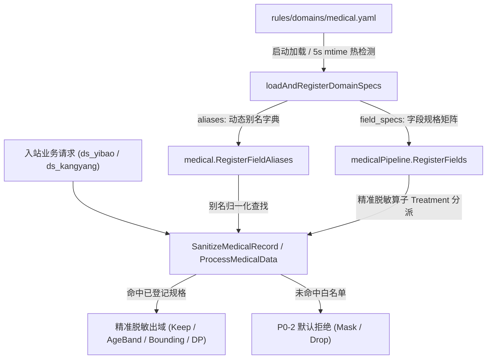

# 医疗敏感数据治理流水线 — 运维指南 (Ops Guide)

> 本文档面向 PrivShield 运维工程师与平台管理员，详细说明 **领域规则库 YAML（[`rules/domains/medical.yaml`](../../rules/domains/medical.yaml)）与医疗脱敏流水线规格白名单矩阵的动态装配链路**、热重载运维机制、配置规范及排障 SOP。

---

## 1. 动态装配链路架构原理

`PrivShield` 遵循 **P0-2 零信任默认拒绝（Fail-Closed / Default-Deny）** 安全底线：
- 任何未列入白名单规格矩阵的字段，一律强制打上 `UNLISTED_DEFAULT_DENY` 安全标签，自动提升至至少 L3 敏感等级，并强制执行字符掩码或整列丢弃，**严禁明文穿透出域**；
- 为了在严格默认拒绝的前提下支持灵活应对**字段重命名**与**新增业务字段**，引擎引入了 **YAML 声明式规格矩阵动态装配链路**。



### 核心收益
1. **解耦编译与业务迭代**：新增或修改字段规格无需修改 Go 源码，无需重新打包编译镜像；
2. **零停机动态热生效**：修改 YAML 文件后，引擎在 5 秒内自动感知变更并原子重载，生产流量不中断；
3. **单流水线统一治理**：医保结算与康养档案统一接入单一 `medicalPipeline`，消除重复维护成本。

---

## 2. YAML 规格矩阵配置规范

配置文件路径：[`rules/domains/medical.yaml`](../../rules/domains/medical.yaml)（可通过环境变量 `PRIVACY_RULES_DIR` 指定目录）。

### 2.1 字段规格矩阵 (`field_specs`)

在 YAML 底部声明 `field_specs` 列表，每项字段参数定义如下：

| 配置键 | 类型 | 必填 | 说明 |
|---|---|---|---|
| `name` | string | 是 | 字段名（匹配入站请求键名，自动转小写并去除空格） |
| `category` | string | 是 | 业务分类：`identity`（身份）、`medical`（医疗）、`financial`（资产）、`location`（位置）、`contact`（联系方式）、`other`（其他） |
| `level` | int | 是 | DB51 安全等级（1: 公开, 2: 内部, 3: 敏感, 4: 高敏, 5: 极高敏） |
| `treatment` | string | 是 | 脱敏算子（支持标准名与简写别名，详见下表） |
| `band` | float | 否 | `bounding`（分箱）算子的步长（例如 `50.0` 表示按 50 步长区间化） |
| `clip_lower` | float | 否 | `dp_noise`（差分隐私加噪）数值截断下界 |
| `clip_upper` | float | 否 | `dp_noise`（差分隐私加噪）数值截断上界 |
| `description`| string | 否 | 字段运维注释与业务含义说明 |

#### 支持的脱敏算子 (`treatment`)

| 算子标识 | 简写别名 | 行为说明 | 典型字段示例 |
|---|---|---|---|
| `keep` | `allow`, `plain` | 合法公开/内部字段原样保留出域（含内容安全网兜底） | `gender`, `vip_level` |
| `mask_name` | `name`, `chinese_name` | 中文姓名脱敏（2字遮尾，3字遮中，4字遮中二） | `name`, `doctor_name` |
| `mask_id_card` | `id_card`, `idcard` | 身份证号脱敏（前 6 后 4，中间打星） | `id_card_no` |
| `mask_phone` | `phone`, `mobile` | 手机电话脱敏（前 3 后 4，中间打星） | `phone`, `emergency_phone` |
| `mask_card` | `card`, `bank_card` | 银行卡/医保卡掩码（前 6 后 4） | `medical_insurance_no` |
| `mask_email` | `email`, `mail` | 电子邮箱脱敏（用户名保留首尾字符） | `email` |
| `mask_address` | `address` | 地址泛化至省市级，街道门牌遮蔽 | `registered_address` |
| `mask_partial` | `partial` | 流水号/编码部分脱敏（保留业务前缀） | `hospital_code`, `record_id` |
| `hash_id` | `hash` | 带盐散列匿名化（SHA-256/SM3 截断） | `person_id` |
| `age_band` | `age_band_kanon`, `age` | 年龄分段 K-匿名泛化（如 `[88-90)`） | `age`, `patient_age` |
| `bounding` | `band` | 数值区间化分箱泛化（如按 `band: 50.0` 泛化为 `[100.0~150.0]`） | `total_cost`, `consultation_fee` |
| `dp_noise` | `dp`, `noise` | 差分隐私拉普拉斯加噪并截断至 `[clip_lower, clip_upper]` | `height`, `temperature` |
| `date_month` | — | 日期截断至年月（`YYYY-MM`） | `admission_date`, `assess_time` |
| `date_year` | — | 日期截断至年份（`YYYY`） | `birth_date`, `date_of_birth` |
| `disease_generalize`| `disease_generalization`| 短诊断文本疾病泛化与敏感词抹平 | `diagnosis_name` |
| `clinical_text` | `clinical_text_redaction` | 临床长文本高敏词彻底擦除与病理重构 | `chief_complaint`, `present_illness` |
| `drop` | — | 彻底丢弃字段值（置空 `""`） | 自定义合规要求字段 |

---

## 2.2 字段别名映射 (`aliases`)

当上游数据源变更了字段名，但脱敏规则完全沿用既有规范字段时，直接在 `aliases` 中配置键值对：

```yaml
aliases:
  "cust_name": "name"            # 客户姓名 -> 标准姓名脱敏
  "patient_age": "age"           # 患者年龄 -> 标准年龄段泛化
  "sfz_card": "id_card_no"       # 身份证件 -> 标准身份证脱敏
  "cellphone": "phone"           # 移动电话 -> 标准手机号脱敏
```

---

## 3. 典型运维配置示例

打开 [`rules/domains/medical.yaml`](../../rules/domains/medical.yaml)，在文件末尾直接添加配置：

```yaml
# ==============================================================================
# 5. 字段规格扩展与别名映射 (field_specs / aliases)
# ==============================================================================
field_specs:
  # 场景 1: 新增自费就诊挂号费（按 50 元步长分箱）
  - name: "consultation_fee"
    category: "financial"
    level: 3
    treatment: "bounding"
    band: 50.0
    description: "门诊自费挂号费"

  # 场景 2: 新增体温连续监测指标（差分隐私加噪，限制生理范围 35.0 ~ 43.0）
  - name: "body_temperature"
    category: "medical"
    level: 2
    treatment: "dp_noise"
    clip_lower: 35.0
    clip_upper: 43.0
    description: "体温监测数值"

  # 场景 3: 业务公开标识（允许原样出域，不打码）
  - name: "vip_level"
    category: "other"
    level: 1
    treatment: "keep"
    description: "业务会员标识"

aliases:
  "cust_name": "name"
  "cust_phone": "phone"
  "identity_number": "id_card_no"
```

---

## 4. 热重载运维与生效验证

### 4.1 自动检测热重载机制
- **轮询周期**：引擎内置热重载监控，默认每 5 秒检测一次 `rules/domains/*.yaml` 文件的 `mtime`（修改时间戳）；
- **生效流程**：一旦检测到文件发生更新，引擎自动执行 `loadAndRegisterDomainSpecs`，原子替换流水线规格字典，无任何中断。

### 4.2 手动触发重载 API
如需在 CI/CD 流水线中强制立即重载，无需等待 5 秒，可调用运维端点：

```bash
# REST API 强制刷新配置与规则
curl -X POST http://localhost:8079/ops/reload
```

### 4.3 生效验证 SOP

#### 步骤 1：查看运维诊断接口
检查 `/ops/diagnostics` 或 `/readyz`，确认字段已计入规格总数：
```bash
curl -s http://localhost:8079/ops/diagnostics | jq '.unlisted_field_policy'
```
返回中 `spec_field_count` 包含当前全量规格矩阵去重字段总数。

#### 步骤 2：发起脱敏冒烟验证
发送一条包含新字段的测试记录验证脱敏效果：
```bash
curl -s -X POST http://localhost:8079/medical/process \
  -H "Content-Type: application/json" \
  -d '{
    "domain": "ds_yibao",
    "records": [
      {
        "cust_name": "张三丰",
        "consultation_fee": "123.45",
        "vip_level": "VIP-A"
      }
    ]
  }' | jq .
```
**期望结果**：
- `cust_name` 命中别名，脱敏为 `"张**丰"`；
- `consultation_fee` 命中分箱规则，泛化为 `"[100.0~150.0]"`；
- `vip_level` 命中保留规则，原样保留为 `"VIP-A"`。

---

## 5. 常见故障排查 SOP (Troubleshooting)

| 故障现象 | 根因排查 | 处理方案 |
|---|---|---|
| **配置了新字段，但输出仍被打码为 `*`** | 1. 检查 YAML 缩进与语法是否有效（可用 `yamllint` 检查）；<br>2. 检查 `treatment` 算子拼写是否合法；<br>3. 检查环境变量 `PRIVACY_RULES_DIR` 指向的路径是否与修改的文件一致。 | 修正 YAML 配置后，调用 `curl -X POST /ops/reload` 刷新。 |
| **配置了 `keep` 但某些记录依然被打码** | 触发了**值层安全网（Content Safety Net）**：该字段的值中夹带了艾滋病、恶性肿瘤等 L4/L5 高危临床词汇。 | 属于引擎预期防御行为（防止脏数据绕过）。如确属误伤，检查词表或数据源清洁度。 |
| **修改了文件但未自动生效** | 容器内挂载方式为 Docker `bind mount` 且某些编辑器更新时改变了 inode 导致 mtime 未刷新。 | 建议在容器外以标准覆写方式保存，或直接调用 `/ops/reload` 触发。 |
| **数值字段分箱输出为空或未分箱** | 传入的数值字段包含非数字字符（如 `"120元"`）。 | `bounding` 与 `dp_noise` 要求纯数值格式，非数值输入会自动回退到安全遮蔽。 |
