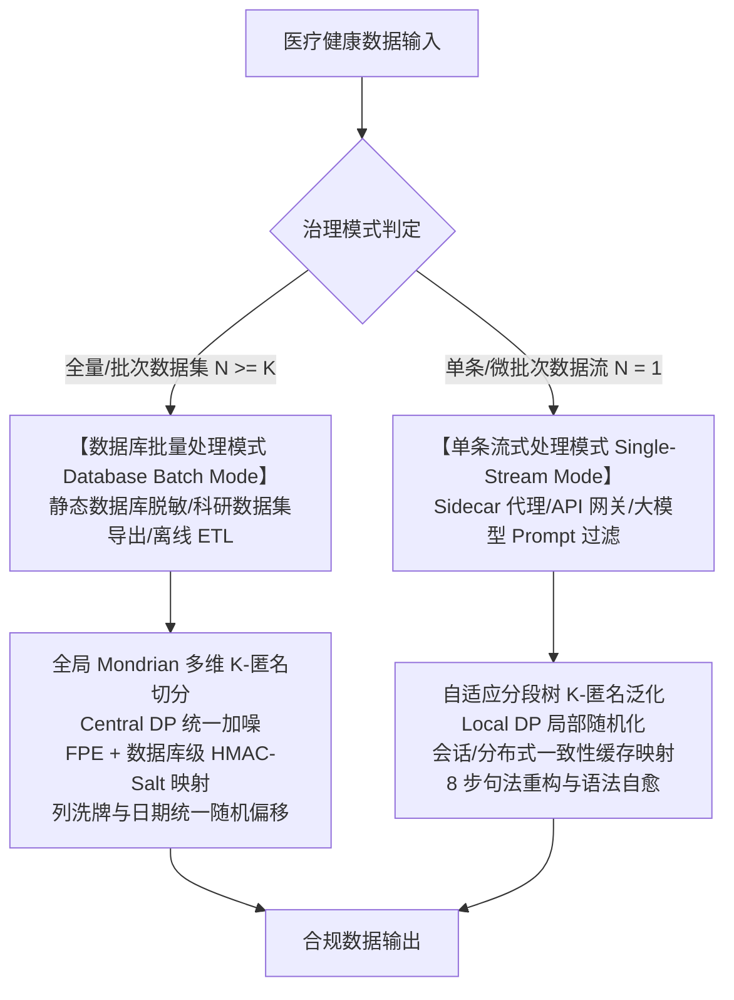
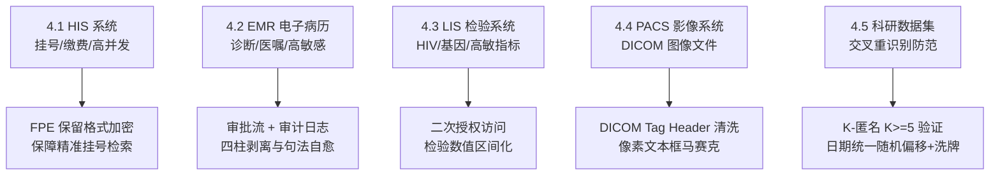
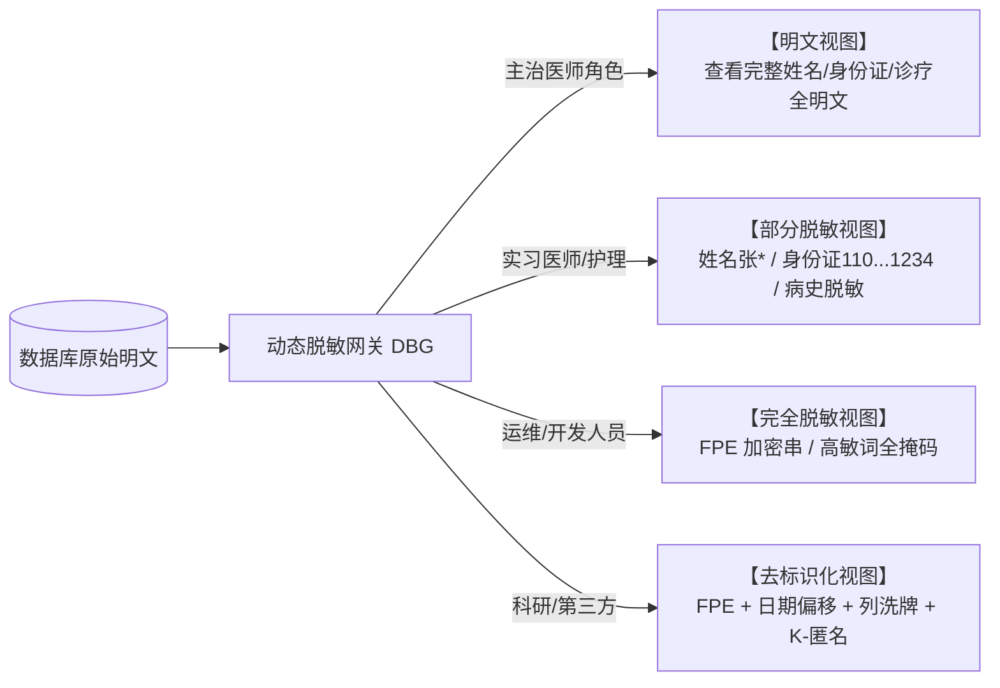

# 医疗健康数据分类分级与隐私脱敏算法标准规范
*(Medical Health Data Classification, Privacy Redaction Algorithm Standard Specification)*

> **文档版本**：v1.0.0  
> **文档状态**：正式发布 / 行业标准规范  
> **适用范围**：医疗健康数据脱敏与泛化处理的算法设计、业务规则、数据库离线治理与单条流式代理合规审计  
> **更新时间**：2026-08-12  
> **法规基线**：国家卫健委、公安部、网信办等五部门《医疗卫生机构数据安全和个人信息保护管理办法（试行）》（国卫规划发〔2026〕6号）  

---

## 前言

本文件参照 GB/T 1.1—2020《标准化工作导则 第1部分：标准化文件的结构和起草规则》的规则起草。

本文件起草单位：深圳数联天下智能科技有限公司、柳州市大数据发展局。

本文件主要起草人：**、**、**。

本次为首次发布。

---

## 引言

随着健康医疗大数据在临床科研、公共卫生、医保治理与大模型训练等场景中的深度应用，数据开放共享需求与个人隐私保护之间的张力日益突出。医疗健康数据包含高度敏感的个人信息与临床诊疗记录，一旦泄露或滥用，将对数据主体造成歧视、污名化、诈骗等难以挽回的损害。

2026 年国家卫健委等五部门联合发布的《医疗卫生机构数据安全和个人信息保护管理办法（试行）》对存储加密、访问脱敏、外发去标识提出了明确要求。本文件以 DB51/T 2989—2023《四川省健康医疗大数据应用指南》的五级分级体系为唯一基准，提出「三层四柱五御六类」治理架构，统一规范批量离线治理与 Sidecar 单条流式两类模式下的脱敏算法、治理策略与合规要求，为医疗机构、数据运营方与技术服务商提供可直接落地的实施依据。

---

## 1. 标准概述与适用法规基线

### 1.1 规范背景与法规要求

在医疗数据治理、数据仓库建设、临床科研二次利用、跨机构数据共享及大模型（LLM）微调等场景中，医疗健康数据包含高度敏感的个人信息与临床诊疗记录。

根据 2026 年 2 月国家卫健委、公安部、网信办等五部门联合发布的《医疗卫生机构数据安全和个人信息保护管理办法（试行）》（国卫规划发〔2026〕6号），以及《个人信息保护法》第28/51/53条、GB/T 22239-2019（等保2.0）：

**核心要求三原则：**
1. **存储加密（TDE）**：数据落在磁盘上时实施透明加密；
2. **访问脱敏（DBG / 动态脱敏）**：运维/开发人员查库时动态脱敏，支持**角色三视图权限管控**；
3. **外发去标识（KTM / 静态脱敏）**：科研、教学、统计导出时执行静态不可逆去标识化，防交叉比对重识别。

---

### 1.2 适用范围与明确排除

**适用范围**：本规范适用于医疗健康结构化数据（电子病历、医保结算、挂号登记等）、临床自由文本、DICOM 影像元数据，以及离线批量数据集与 Sidecar 单条流式两类治理模式下的数据脱敏与泛化处理。

**明确排除（不在本规范适用范围内）**：

1. **音视频媒介内容脱敏**：语音流、视频流、录音录像内容的去标识化处理不在本规范范围内（PACS 影像的 DICOM 元数据清洗与像素文本框遮盖除外，见 §4.4）；
2. **跨境数据传输**：数据出境的安全评估、标准合同与认证要求不在本规范范围内（见《个人信息保护法》第三十八至四十条及相关配套规定）；
3. **实时流式 API 网关的工程实现**：高并发反向代理、负载均衡与健康检查等网关基础设施的工程实现不在本规范范围内（见 `docs/gateway_balancer/design.md`）；本规范“单条流式处理模式”仅指 Sidecar 代理上的脱敏算法路径，其算法要求仍适用于经网关转发的单条数据。

**条款性质**：本规范中“应”“不应”“必须”“禁止”为规范性（强制）条款；“宜”“建议”为准规范性（推荐）条款；标注“（资料性）”的章节（§8）及小节（§7.1、§7.4）为示例与说明，不构成强制要求。

---

### 1.3 规范性引用文件

下列文件中的内容通过文中的规范性引用而构成本规范必不可少的条款。凡是注日期的引用文件，仅注日期的版本适用于本规范；凡是不注日期的引用文件，其最新版本适用于本规范。

| 引用文件 | 说明 |
|---|---|
| DB51/T 2989—2023《四川省健康医疗大数据应用指南》 | 五级分级基准（唯一分级基准，见 §2.1） |
| GB/T 35273—2020《信息安全技术 个人信息安全规范》 | 个人信息处理通用要求 |
| GB/T 37964—2019《信息安全技术 个人信息去标识化指南》 | 去标识化技术与效果要求 |
| GB/T 39725—2020《信息安全技术 健康医疗数据安全指南》 | 健康医疗敏感信息识别与防护 |
| GB/T 22239—2019《信息安全技术 网络安全等级保护基本要求》 | 等保 2.0 基线 |
| 《中华人民共和国个人信息保护法》 | 敏感个人信息处理规则（第 28/31/38–40/44–47/51/53 条） |
| 《中华人民共和国数据安全法》 | 数据分类分级保护制度 |
| 《医疗卫生机构数据安全和个人信息保护管理办法（试行）》（国卫规划发〔2026〕6号） | 医疗行业专项要求 |

---

### 1.4 术语和定义

下列术语和定义适用于本规范。

| 术语 | 定义 |
|---|---|
| 脱敏 (Masking) | 对数据中的敏感信息进行变形、遮蔽或擦除，使其在特定使用场景中不可直接识别数据主体的技术 |
| 去标识化 (De-identification) | 通过对个人信息的技术处理，使其在不借助额外信息的情况下无法识别特定数据主体的过程；去标识化后的信息仍可能借助额外信息复原，属于可控制的可逆处理 |
| 假名化 / 保留格式加密 (Pseudonymization / FPE) | 以保留原始数据格式（长度、字符集、校验形态）的密文替换明文标识符，支持等值匹配查询且密文不可逆推的技术 |
| K-匿名 (K-Anonymity) | 数据集中任意准标识符组合至少与 K 条不可区分记录对应的匿名化性质 |
| 准标识符 (Quasi-Identifier, QI) | 单独不能直接识别、但与其他信息组合后可能识别特定个体的属性集合（如年龄、性别、科室、就诊日期） |
| 差分隐私 (Differential Privacy, DP) | 通过向查询结果注入受控随机噪声，使任意单条记录的加入或退出不显著改变输出分布的隐私保护技术 |
| 彻底抹平 (Purge) | 对高敏病种及其四柱关联特征执行整句/整块零痕迹擦除，禁止任何形式的泛化保留 |
| 范畴化泛化 (Categorical Generalization) | 将高敏病种重构为同器官/系统的低敏通用疾病大类，保留统计与科研价值的脱敏方式 |
| 四柱强剥离 (Four-Pillar Redaction) | 对 L4/L5 高敏疾病全链条擦除病因/诱因、现象/体征、诊断/检查、用药/处置四类关联特征的方法（见 §6.1） |
| 静态脱敏 (Static Masking) | 数据离开受控存储前执行的、生成独立脱敏副本的不可逆（或受控可逆）处理，用于外发、科研导出等场景 |
| 动态脱敏 (Dynamic Masking) | 数据库原始数据保持不变、按访问者角色实时呈现差异化视图的处理（见 §5） |

---

### 1.5 「三层四柱五御六类」整体治理技术框架

本规范全面落地 **「三层四柱五御六类」医疗数据安全与隐私增强治理架构** (3-Funnel, 4-Pillar, 5-Protection, 6-Category Architecture)：

| 维度编号 | 架构维度 | 核心定义与医疗落地规范 |
|---|---|---|
| **三层 (3-Layer Funnel)** | **3层智能识别与决策漏斗** | Layer-1 医疗正则规则 ➔ Layer-2 CMeEE 医疗 Small-NER ➔ Layer-3 医疗大模型 (LLM) 智能仲裁 |
| **四柱 (4-Pillar Matrix)** | **四柱高敏特征强剥离** | 彻底剥离高敏病种的 **第一柱(病因) ➔ 第二柱(体征) ➔ 第三柱(诊断/检查) ➔ 第四柱(用药/处置)** 关联特征 |
| **五御 (5-Fold Defense)** | **五重数据安全防御屏障** | **①御越权** (DB51 L1-L5 分级) ➔ **②御泄漏** (角色三视图+Masking) ➔ **③御推断** (DP差分加噪) ➔ **④御关联** (K-匿名) ➔ **⑤御追踪** (FPE+混淆) |
| **六类 (6-Category Matrix)**| **六类敏感字段分类矩阵** | 涵盖 **1.身份标识、2.联系方式、3.诊疗信息、4.检验检查、5.财务信息、6.生物特征** 全范畴 |

---

## 2. 四川省五级分级基准与 6 类敏感字段映射 (DB51 Baseline & 6-Category Field Matrix)

本规范以 DB51/T 2989—2023《四川省健康医疗大数据应用指南》的五级分级体系为**唯一分级基准**，将本规范定义的 6 类敏感字段映射至该基准；其中高敏字段补充并入 L4/L5，形成 §2.3 的增强 L4/L5 标准。

> **级别与策略的区分（规范性）**：分级（L1~L5）回答“数据有多敏感”，治理策略（彻底抹平/范畴化泛化/PII 脱敏/原样保留）回答“如何处置”。二者不就高绑定：L4 级病种亦可适用最严格的彻底抹平策略（如艾滋病/HIV、重型精神病，见 §2.3.2），但策略不得弱于级别对应的默认策略。

### 2.1 DB51/T 2989—2023 五级分级基准

| 级别 | 级别名称 | 基准定义 |
|---|---|---|
| L1 | 公开数据 | 低敏感度或经脱敏的数据 |
| L2 | 内部数据 | 机构运营生产相关数据 |
| L3 | 敏感数据 | 个人标识与身份信息 |
| L4 | 高敏感数据 | 敏感病种与诊疗数据 |
| L5 | 极敏感数据 | 基因与遗传数据 |

### 2.2 6 类敏感字段的 DB51 基准映射与脱敏算法矩阵

下表以 DB51 级别归属为准，6 类敏感字段作为补充分类维度，并定义其脱敏推荐算法：

| 字段类别 | 典型字段示例 | DB51 级别归属 | 主要泄露风险 | 静态脱敏算法 (外发) | 动态脱敏算法 (访问) | 禁用算法 |
|---|---|---|---|---|---|---|
| **1. 身份标识** | 姓名、身份证号、医保卡号、病历号 | **L3**（与 L4/L5 诊疗信息构成组合集时就高） | 直接定位自然人 | **FPE (保留格式加密)** + HMAC 哈希 | 掩码（留首尾/后 4 位） | 直接删除 (破坏关联与索引) |
| **2. 联系方式** | 手机号、详细住址、紧急联系人 | **L3** | 骚扰、电信诈骗 | 文本截断（保留省市）+ 假值替换 | 掩码（中间 4 位掩码） | FPE (格式无检索意义) |
| **3. 诊疗信息** | 诊断名称、手术记录、用药方案 | **L4**（高敏病种）；常规诊疗 L2 | 社会歧视、敲诈 | **四柱强剥离 + 句法重构 + 列洗牌** | 角色分级三视图显示 | 全量掩码 (医生无法看病) |
| **4. 检验检查** | 基因数据、HIV、精神类指标 | **L4**；基因检测/HIV 确诊检测为 **L5** | 保险拒保、污名化 | **区间化 + 彻底抹平** | 二次授权 + 按权限显示 | 裸哈希 (无法做统计) |
| **5. 财务信息** | 医保账户、缴费记录、自费金额 | **L3**（金融账户） | 经济诈骗 | 假值替换 + 数值截断/泛化 | 金额掩码/范围显示 | 列洗牌 (导致金额对应错乱) |
| **6. 生物特征** | 指纹、人脸、虹膜、全基因组 | **L5**（比照基因数据管理） | 终身不可逆风险 | **严禁外发导出** | **禁止未经二次授权访问** | 任何可逆解密算法 |

### 2.3 增强 L4/L5 标准（6 类高敏字段补充并入）

在 DB51 基准之上，将 6 类敏感字段中的高敏项补充并入 L4/L5，形成本规范脱敏治理采用的增强标准：

**L4 高敏感数据（增强定义）：**

| 来源 | 纳入范畴 |
|---|---|
| DB51 基准 | 敏感病种与诊疗数据 |
| 类别 3 诊疗信息补充 | 社会污名化疾病（性病、HIV/AIDS、重度精神障碍）的诊断/手术/用药记录；恶性肿瘤、病毒性肝炎、罕见遗传病、严重器官衰竭诊疗记录 |
| 类别 4 检验检查补充 | CD4 计数、HBV-DNA 载量、精神类特异性指标、TPPA/RPR 血清学检测等高敏检验指标 |
| 类别 1 身份标识补充 | 身份标识与敏感病种的**组合集**（"谁+患何病"关联字段；单一标识仍为 L3） |

#### 2.3.1 敏感病种具体范畴（DB51 第 4 级 "其他敏感病种" 展开）

DB51/T 2989—2023 表 2 第 4 级列举了三大类敏感病种 + 一个兜底项（"其他敏感病种诊疗数据"），标准本身未展开兜底项的具体范围。下表为项目基于临床共识与 ICD-10 编码区间对"敏感病种"的完整展开定义：

| 范畴编号 | 病种类别 | 典型病种与关键词 | ICD-10 敏感区间 | 脱敏治理策略 |
|---|---|---|---|---|
| L4-STD | 性传播疾病 (STD/Venereal) | 梅毒（各期）、淋病、尖锐湿疣、生殖器疱疹、软下疳、HPV 高危/低危型感染 | A50–A64 | **彻底抹平**（严禁泛化） |
| L4-MALIGNANT | 恶性肿瘤 (Malignant Neoplasm) | 肺癌、胃癌、肝癌、乳腺癌、宫颈癌等各类恶性肿瘤；化疗/放疗/靶向治疗 | C00–D49 | **范畴化泛化**（→ 相关系统疾病） |
| L4-HEPATITIS | 病毒性肝炎 (Viral Hepatitis) | 乙型肝炎、丙型肝炎、肝硬化（代偿期/失代偿期）及并发症 | B15–B19 | **范畴化泛化**（→ 肝脏疾病） |
| L4-ORGAN | 严重器官损害 (Severe Organ Damage) | 慢性阻塞性肺疾病 (COPD)、急性心肌梗死、尿毒症/肾功能衰竭 | I21–I22, J44, N18–N19 | **范畴化泛化**（→ 相关系统疾病） |
| L4-AIDS | 艾滋病 / HIV 感染 | 艾滋病、HIV 感染、HIV 抗体阳性、CD4+ T 淋巴细胞计数、抗逆转录治疗 | B20–B24 | **彻底抹平**（严禁泛化） |
| L4-PSYCHIATRIC | 重型精神障碍 | 重度精神分裂症、双相情感障碍等重型精神疾病；特异性抗精神病药物、保护性约束 | F20–F29 | **彻底抹平**（严禁泛化） |

> **注 1（DB51 对齐，规范性）**：艾滋病/HIV 与重型精神病在 DB51/T 2989—2023 表 2 中属第 4 级“敏感病种”（与性病并列列举），本规范定级与其保持一致；其**脱敏策略**因极高社会污名化风险升级为彻底抹平（与 L5 同级强度），级别与策略的区分见 §2.3.2。
>
> **注 2**：遗传缺陷诊疗记录伴基因检测关联信息时按 L5 管理（§2.3 L5 增强定义）。完整词库与正则引擎见 `medical_pipeline/rules.py` 中 `L4_TERMS_MAP` 与 `L5_TERMS_MAP`（词库的 L4/L5 划分体现**抹平策略强度**，与 DB51 定级不逐条对应：`HIV_AIDS`、`PSYCHIATRIC_DISORDER` 归入抹平级词库）。
>
> **注 3（YAML 可配置脱敏策略）**：抹平与泛化范畴的路由已通过 `rules/domains/medical.yaml` 中的 `redaction_strategy` 节实现配置化。运维人员可在不修改代码的前提下调整 `purge_categories`（彻底抹平范畴）、`generalization_categories`（范畴化泛化范畴）与 `replacement_labels`（替换标签映射）。配置加载由 `medical_pipeline/rules.py` 中 `load_redaction_strategy()` 函数执行，支持 YAML 热重载与代码默认值回退。

**L5 极敏感数据（增强定义）：**

| 来源 | 纳入范畴 |
|---|---|
| DB51 基准 | 基因与遗传数据 |
| 类别 4 检验检查补充 | 基因检测原始数据、检测结论与家族系谱遗传信息 |
| 类别 6 生物特征补充 | 指纹、人脸、虹膜等生物特征模板（终身不可逆，风险与基因数据等同） |
| 类别 3 诊疗信息补充 | 罕见遗传缺陷（如亨廷顿舞蹈病）诊疗记录及其基因检测关联信息 |

**并级规则：**

1. 字段同时涉及多类别时就高定级：DB51 基准优先，增强补充项从属；
2. L4/L5 判定直接驱动 §6.1 脱敏策略路由：L5 彻底抹平/严禁外发，L4 范畴化泛化或抹平；
3. 不满 14 周岁未成年人信息依法升级保护，涉及敏感病种时按不低于 L4 处理（详见 §2.3.3）。

#### 2.3.2 分级与治理策略的关系（规范性）

分级（L1~L5）与治理策略（§6.1）为两个正交维度，映射关系如下：

| 级别 | 默认治理策略 | 策略升级（允许） | 策略降级 |
|---|---|---|---|
| L4 | 范畴化泛化或彻底抹平（按病种路由，见 §6.1） | 任意 L4 范畴可升级为彻底抹平 | **禁止** |
| L5 | 彻底抹平 / 严禁外发 | —（已为最严格） | **禁止** |

DB51 定级为 L4 但策略采用最严格彻底抹平的范畴：性传播疾病（L4-STD）、艾滋病/HIV（L4-AIDS）、重型精神障碍（L4-PSYCHIATRIC）。工程实现中，抹平策略强度以词库级别标记管理（`L5_TERMS_MAP` = 抹平级词库、`L4_TERMS_MAP` = 泛化级词库），词库级别标记不代表 DB51 定级。

**YAML 可配置策略路由**：抹平/泛化范畴的路由通过 `rules/domains/medical.yaml` 中的 `redaction_strategy` 节配置，支持运行时热重载。配置结构如下：

```yaml
redaction_strategy:
  purge_categories:          # 彻底抹平范畴（严禁泛化）
    - "HIV_AIDS"
    - "PSYCHIATRIC_DISORDER"
    - "GENETIC_DEFECT"
    - "STD_VENEREAL"
  generalization_categories: # 范畴化泛化范畴
    - "MALIGNANT_NEOPLASM"
    - "HEPATITIS_VIRUS"
    - "SEVERE_ORGAN_DAMAGE"
  replacement_labels:        # 替换标签映射（范畴名 → 抽象标签名）
    "HIV_AIDS": "IMMUNODEFICIENCY"
    "STD_VENEREAL": "INFECTIOUS_DISEASE"
```

加载优先级：YAML 配置 > 代码内置默认值（`_L5_REPLACEMENT_MAP` / `_L4_REPLACEMENT_MAP`）。YAML 缺失或解析失败时自动回退到代码默认值，保证零配置即可运行。

#### 2.3.3 不满十四周岁未成年人信息保护专项（规范性）

1. 不满十四周岁未成年人的个人信息依法属于敏感个人信息（《个人信息保护法》第三十一条），DB51 第 3 级亦将“不满十四周岁未成年人的信息”列为敏感数据；
2. 未成年人诊疗数据一律按不低于 L3 处理；涉及敏感病种的，按不低于 L4 处理并适用 §6.1 治理矩阵；
3. 未成年人敏感病种数据对外导出（含科研用途）应取得监护人单独同意并执行专项审批，宜默认采用彻底抹平策略；
4. 年龄判定以就诊时点的出生日期计算；出生日期无法确定的，按记录中标注的最小可能年龄从低认定。

---

## 3. 双模式治理架构与技术拆分比对 (Dual-Mode Governance)

根据数据处理场景的部署形态与计算引擎差异，规范定义两大治理模式：



### 3.1 核心算法技术拆分比对

| 脱敏与隐私技术 | 数据库批量处理模式 (Database Batch Mode) | 单条数据流式处理模式 (Single-Record Streaming Mode) | 业务价值与算法说明 |
|---|---|---|---|
| **保留格式加密 (FPE)** | **数据库级 FPE (Format-Preserving Encryption)**：保持身份证/医保号完全一致的长度与数字形态。 | **动态 FPE 映射**：根据字段类型生成假值数字串。 | **支持精准相等匹配查询 (Exact Match Query)**，且密文不可逆推。 |
| **K-匿名 (K-Anonymity)** | **全局多维 Mondrian 分割算法**：按中位数递归切分 QI 维度，保证各等价类 $K \ge 5$，并校验 $l$-Diversity。 | **自适应分段层次树**：依据领域分段树（如 $<60$ 岁 3 岁区间）即时泛化。 | 数据库模式求解全局最优，信息损失极小；流式模式保障零延迟。 |
| **日期偏移 (Date Offset)** | **患者级日期统一随机偏移 (Random Date Offset)**：整表中同一患者的所有日期统一随机偏移 $N$ 天。 | **流式日期截断 (Date Truncation)**：精准日期转换为年月（如 `2024-03`）。 | 抹去绝对时间防时间交叉比对重识别，同时 100% 保留事件时间间隔。 |
| **列洗牌 (Column Shuffle)** | **科研列洗牌算子 (Column Shuffle)**：打乱诊断码、科室列对应关系。 | **句法范畴化泛化 (Categorical Generalization)**：重构为通用大类病种。 | 保持列级统计分布（均值、标准差）不变。 |

---

## 4. 医疗分系统（HIS / EMR / LIS / PACS / 科研）实施规范

医院内不同业务系统的访问模式与数据特征不同，须执行针对性实施方案：



### 4.1 HIS 系统 (医院信息系统)
* **数据特征**：高并发（门诊高峰 800~1500 并发），包含姓名、身份证号、挂号记录。
* **脱敏规范**：挂号查询依赖身份证精准匹配。禁止直接使用掩码覆盖导致查不到患者；必须使用 **FPE 保留格式加密** —— 加密后格式与长度不变，支持 SQL 精准匹配，但密文不可逆推。

### 4.2 EMR 系统 (电子病历)
* **数据特征**：诊断文本、手术记录、用药方案，敏感度极高。
* **脱敏规范**：
  1. 医生工作站采用**角色三视图**（主治医生看明文，实习医生看部分脱敏，行政人员看全脱敏）；
  2. 病历导出必须绑定**审批流 + SQL 级全量审计日志**，防止无审批越权导出。

### 4.3 LIS 系统 (检验信息系统)
* **数据特征**：包含 HIV、基因突变、精神类特异性指标。
* **脱敏规范**：HIV 及基因指标执行**二次授权访问控制**；科研导出时对 CD4 计数、HBV-DNA 载量执行数值区间化。

### 4.4 PACS 系统 (医学影像系统)
* **数据特征**：单文件 MB 至 GB 级 DICOM 影像文件。
* **脱敏规范**：
  * 脱敏重点在于 **DICOM Tag Header 元数据**。很多患者姓名、身份证号嵌入在 DICOM Header 中；导出影像前必须批量清理/修改 Tag Header 元数据；
  * 对影像像素中嵌有的文字化验单，定位文本框（Bounding Box）区域执行高斯模糊/马赛克覆盖。

### 4.5 科研数据集 (Research Datasets)
* **数据特征**：从多系统抽取的结构化/半结构化数据集。
* **防组合重识别规范**：
  1. 执行 **$K$-匿名验证 ($K \ge 5$)**，确保数据集中任意 QI 组合（如“特定科室+年龄段+罕见症状”）至少包含 5 条不可区分记录；
  2. 所有日期执行**同一患者统一随机天数偏移 (Random Date Offset)**；
  3. 诊断码与科室列执行**列洗牌 (Column Shuffle)**。

---

## 5. 角色三视图动态访问控制规范 (Role-Based Three-View Dynamic Masking)

在动态脱敏（DBG / 实时网关）场景中，数据库原始数据保持不变，系统根据访问者的角色权限动态呈现不同的数据视图：



**角色—视图映射要求：**

| 角色 | 授权视图 | 视图内容 | 适用场景 |
|---|---|---|---|
| 主治医师 | 明文视图 | 完整姓名/证件号/诊疗全文 | 临床诊疗必需，须留访问审计 |
| 实习医师/护理 | 部分脱敏视图 | 姓名掩码（如 `张*`）、证件号保留前 3 后 4、高敏病史脱敏 | 教学与辅助诊疗 |
| 运维/开发人员 | 完全脱敏视图 | 标识符呈 FPE 加密串、高敏词全掩码 | 查库排障，严禁见明文 |
| 科研/第三方 | 去标识化视图 | FPE + 日期偏移 + 列洗牌 + K-匿名 | 科研统计与对外共享 |

> **三视图口径说明**：动态脱敏域内标准视图为**明文 / 部分脱敏 / 完全脱敏**三档；“去标识化视图”属静态外发治理产物（见 §2.2 静态脱敏算法矩阵），由网关在科研/第三方通道上叠加呈现，不计入动态三视图序列。

---

## 6. 核心算法规则与文本脱敏规范

本章定义双模式共用的核心治理规则。本章为规范性规则定义，工程实现细节见架构设计文档。

### 6.1 四柱强剥离与差异化治理矩阵

对 L4/L5 重大高敏疾病，须全链条擦除四类强关联特征（四柱），严防通过上下文反推高敏病史：

| 柱序 | 特征类型 | 典型内容 |
|---|---|---|
| 第一柱 | 病因/诱因 | 不洁性接触史、高危接触史、输血史、特定基因突变 |
| 第二柱 | 现象/体征 | 外阴赘生物、无痛性溃疡（硬下疳）、命令性幻听、舞蹈样动作 |
| 第三柱 | 诊断/检查 | 醋酸白试验阳性、TPPA/RPR 阳性、CD4+ 计数、病毒载量 |
| 第四柱 | 用药/处置 | 特异性抗病毒/抗精神病药物、激光灼除术、抗逆转录治疗方案 |

基于四柱识别结果，按差异化治理矩阵路由：

| 治理策略 | 适用范畴 | 处理行为 | 合规理由 |
|---|---|---|---|
| 彻底抹平 (Purge Only) | 性传播疾病、HIV/AIDS、重度精神障碍（均为 DB51 L4，策略按最严格执行，见 §2.3.2） | 整句/整块零痕迹擦除，禁止泛化 | 极高社会污名化风险，任何泛化形式均可被推断还原 |
| 范畴化泛化 (Generalization) | 恶性肿瘤、病毒性肝炎、罕见遗传缺陷、严重器官衰竭 | 重构为 L1/L2 通用器官/系统大类疾病 | 保留家族史科研价值，屏蔽具体高敏病种 |
| PII 脱敏 | 姓名、证件号、联系方式、住址、医疗标识 | 按 §6.2 规则掩码/替换/泛化 | 阻断身份识别链路 |
| 原样保留 | 常规慢病（高血压、糖尿病）、通用诊疗描述 | 零篡改 | 保障临床与科研效用 |

### 6.2 PII 掩码与一致性规范

| 类别 | 默认规则 | 示例 |
|---|---|---|
| 姓名 | 二字保留首字；三字及以上保留首末字；复姓保留复姓 | `张*`、`张*明`、`欧阳**` |
| 证件号码 | 保留前 3 后 4，中间掩码 | `110***********1234` |
| 联系方式 | 手机号保留前 3 后 4；座机保留区号与后 2 位 | `138****5678` |
| 住址 | 泛化保留至省/市级，擦除门牌号及以下精度 | `广东省广州市` |
| 日期 | 批量场景按患者级统一随机偏移（§3.1）；流式场景泛化为年月；年龄按分段 K-匿名（§6.4） | `2024-03` |
| 医疗标识 | 长度 > 6 保留前 4 后 2、中间掩码；短串全掩码 | `3301********97` |

**一致性要求**：同一主体的姓名替换值、证件号掩码、日期偏移量在跨记录、跨文档间必须一致；映射表仅管控环境内留存，支持授权还原。

### 6.3 临床文本八步句法重构规范

为防止范畴擦除提前切除敏感病名导致死因动词悬空，文本脱敏严格执行**句法优先**的八步编排顺序：

1. **死因短语整体重构**：优先整句捕获死因表达，重构为自然汉语；
2. **死因/患病年龄 K-匿名**：剥离病名同时对年龄施加 §6.4 分段泛化；
3. **特异性用药与处置擦除**：绑定前缀（口服/给予/启动…）与后缀（抗病毒治疗/控制症状）整句擦除；
4. **就诊机构与独立诊断擦除**：专科机构与独立诊断短语整句消除；
5. **特征体征与现象擦除**：定点擦除四柱第二柱描述；
6. **综合句法擦除与范畴化泛化**：可泛化病种按 §6.5 映射重构；禁止泛化范畴整句抹平；
7. **裸词与既往史擦除**：清除残留独立病名裸词与既往病史片段；
8. **语法自愈与残渣清理**：消除空括号、死标点、孤立动词/介词；单字边界保护；无意义时间从句清空。

### 6.4 年龄分段 K-匿名泛化规则

| 人群 | 区间 | 泛化规则 | 理由 |
|---|---|---|---|
| < 60 岁 | 3 岁区间 | 泛化值 = age − (age mod 3) | 年龄精细度影响小，宽区间提供更强匿名保护 |
| ≥ 60 岁 | 2 岁区间 | 泛化值 = age − (age mod 2) | 老年康养场景年龄为核心因子，保留精细度 |

*示例*：30/31/32 岁 → `30岁`；60/61 岁 → `60岁`；62/63 岁 → `62岁`。

### 6.5 范畴化降级泛化映射与禁止泛化范畴

| 源范畴 | 泛化目标 | 触发上下文 |
|---|---|---|
| 消化道恶性肿瘤 | 消化道疾病 | 家族史、聚集倾向 |
| 呼吸系统恶性肿瘤 | 呼吸系统疾病 | 家族史、史 |
| 恶性肿瘤（无系统限定） | 相关系统疾病 | 通用兜底 |
| 病毒性肝炎 | 肝脏疾病 | 家族史、史 |
| 亨廷顿舞蹈病等遗传缺陷 | 遗传性神经系统疾病 | 家族史 |
| 急性心肌梗死/冠脉重度狭窄 | 心血管系统疾病 | 家族史 |
| 慢性阻塞性肺疾病 | 慢性呼吸系统疾病 | 家族史 |
| 尿毒症/肾功能衰竭 | 肾脏系统疾病 | 家族史 |

**泛化顺序**：系统专属规则先于通用兑底规则执行，防止张冠李戴。**禁止泛化范畴（规范性）**：性传播疾病（L4-STD）、艾滋病/HIV（L4-AIDS）、重型精神障碍（L4-PSYCHIATRIC）必须彻底抹平，严禁任何形式泛化；L5 全部范畴（遗传信息、生物特征）同此要求。

### 6.6 输出安全门禁与质量指标

**三级输出门禁**：

| 级别 | 检测内容 | 触发动作 |
|---|---|---|
| 一级 | 原文高敏词回扫 | 强制整值删除 |
| 二级 | 归一化（全角/大小写）后回扫 | 捕获 `ＨＩＶ` 等变体，强制删除 |
| 三级 | 剔除字符间噪声后回扫 | 捕获 `H I V`、零宽字符插入变体，Fail-Closed 占位替换 |

**质量指标**：召回率 ≥ 99.5%；精确率 ≥ 95%；语法完整率 ≥ 99%；误伤率 ≤ 2%。

---

## 7. 康养评估数据模式治理规约

本章针对康养评估常用27 个标准字段、100 条仿真记录，由 `scripts/data/generate_medical_data.py` 生成）定义字段分类分级与脱敏治理规约。凡向数据主管部门（数据局）申请、共享或对外发布本模式数据，必须先行执行本章规定的静态脱敏并生成独立合规副本；未通过 §6.6 输出安全门禁与 §7.3 数据集级验收的数据，禁止提交。

### 7.1 数据模式字段总览（资料性）

对于 27 个标准字段，覆盖 6 组语义：

| 语义组 | 字段列表（英文 Key） | 字段说明 |
|---|---|---|
| 身份标识 PII | `name`、`id_card_no`、`registered_address`、`disability_cert_no`、`medical_insurance_no` | 姓名、身份证号（GB 11643-1999 校验码）、登记住址、残疾证号、医保号 |
| 人口学信息 | `gender`、`age` | 性别、年龄 |
| 临床诊疗信息 | `diagnosis_name`、`chief_complaint`、`present_illness`、`past_history`、`personal_history`、`is_smoking`、`smoking_duration`、`family_history`、`allergic_history`、`department` | 诊断名称与病历文本，含 L4/L5 高敏病种（HIV、梅毒、重度精神分裂症、亨廷顿舞蹈病、恶性肿瘤、病毒性肝炎等） |
| 体征指标 | `height`、`weight` | 身高、体重 |
| 残疾评估 | `disability_category`、`disability_level`、`assess_type_name`、`assess_result_name`、`assess_score`、`assess_time` | 残疾类别/等级、评估结果与评估时间 |
| 病程与图文 | `progress_note`、`progress_note_time` | 病程记录（含图文病例引用路径）与记录时间 |

### 7.2 字段分类分级与脱敏算法映射表

| 序号 | 字段中文名 | 英文 Key (`kangyang.csv`) | 敏感等级 | 治理策略与算法说明                                                                                                                                                                                                                  | 规范依据 |
|---|---|---|---|-------------------------------------------------------------------------------------------------------------------------------------------------------------------------------------------------------------------------------------|---|
| 1 | 姓名 | `name` | **L3 (高)** | 姓名掩码：二字保留首字、三字及以上保留首末字、复姓保留复姓（`张*`、`张*明`、`欧阳**`）；或 FPE 保留格式加密                                                                                                                         | §2.2、§6.2 |
| 2 | 身份证号 | `id_card_no` | **L3 (高)**（与敏感病种构成组合集时按 L4） | 保留前 3 后 4、中间掩码（`110***********1286`）；或 FPE 保频加密；禁止直接删除                                                                                                                                                      | §2.2、§2.3、§6.2 |
| 3 | 登记住址 | `registered_address` | **L3 (高)** | 地址泛化保留至省/市，擦除区/路/门牌号及以下精度（`江苏省南京市玄武区中山路18号` → `江苏省南京市`）                                                                                                                                  | §2.2、§6.2 |
| 4 | 残疾证号 | `disability_cert_no` | **L3 (高)** | 医疗标识保频掩码：长度 > 6 保留前 4 后 2（`3201********42`）；或 FPE                                                                                                                                                                | §2.2、§6.2 |
| 5 | 医保号 | `medical_insurance_no` | **L3 (高)** | 医疗标识保频掩码（`3301********97`）；或 FPE                                                                                                                                                                                        | §2.2、§6.2 |
| 6 | 性别 | `gender` | **L1 (低)** | 原样保留（`男`/`女`）                                                                                                                                                                                                               | §2.2 |
| 7 | 年龄 | `age` | **L1 (低)** | 原样保留；涉及 L4/L5 病种或数据集级治理时按 §6.4 分段 K-匿名泛化（< 60 岁 3 岁区间、≥ 60 岁 2 岁区间）                                                                                                                              | §2.2、§6.4 |
| 8 | 诊断名称 | `diagnosis_name` | **L4~L5 (特高)** | **L4/L5 强剥离**：抹平范畴（HIV/艾滋病、重度精神障碍、遗传缺陷、性传播疾病）整值去掉`；泛化范畴（恶性肿瘤、病毒性肝炎、严重器官损害）替换为不含敏感词根的范畴码 `[L4-...-SENSITIVE-MASKED]`；常规慢病（高血压、2 型糖尿病）原样保留 | §2.3、§6.1、§6.5 |
| 9 | 主诉 | `chief_complaint` | **L3 (高)** | 敏感词过滤 + NER 遮蔽；检出 L4/L5 病种词时按对应策略抹平/泛化                                                                                                                                                                       | §6.2、§6.6 |
| 10 | 现病史 | `present_illness` | **L4~L5 (特高)** | 四柱强剥离 + 八步句法重构：病名、特异性检查（TPPA/RPR/CD4/HBV-DNA）、特异性用药（奥氮平、替诺福韦、四苯嗪）、处置术式（CO2 激光、PCI）整句擦除或范畴化                                                                              | §6.1、§6.3 |
| 11 | 既往史 | `past_history` | **L4~L5 (特高)** | 同现病史：四柱强剥离 + 句法重构 + L4/L5 词库抹平/泛化                                                                                                                                                                               | §6.1、§6.3 |
| 12 | 个人史 | `personal_history` | **L2 (中)** | 吸烟饮酒等行为信息原样保留；检出高敏表述（如不洁性接触史）时按抹平策略整句擦除                                                                                                                                                      | §2.2、§6.1 |
| 13 | 是否吸烟 | `is_smoking` | **L1 (低)** | 原样保留（`是`/`否`）                                                                                                                                                                                                               | §2.2 |
| 14 | 吸烟年限 | `smoking_duration` | **L1 (低)** | 原样保留；与年龄、性别组合构成准标识符时宜区间化（`20年` → `20-24年`）                                                                                                                                                              | §2.2 |
| 15 | 家族史 | `family_history` | **L3 (高)**（含 L4/L5 病种时按 L4/L5） | 家族成员敏感病种整句抹平或范畴化泛化（`父亲死于'胃癌'(62岁)` → `父亲因病去世`）；亲属称谓与年龄保留                                                                                                                                 | §2.3、§6.1 |
| 16 | 过敏史 | `allergic_history` | **L2 (中)** | 原样保留；药物名宜泛化至类别（`青霉素过敏` → `抗生素类过敏`）                                                                                                                                                                       | §2.2 |
| 17 | 科室 | `department` | **L1 (低)** | 原样保留；与高敏病种组合（如皮肤性病科）构成重识别风险时，离线科研模式执行列洗牌                                                                                                                                                    | §2.2、§3.1 |
| 18 | 身高 | `height` | **L1 (低)** | 原样保留；与年龄/体重组合构成准标识符，K-匿名验证时纳入 QI                                                                                                                                                                          | §2.2 |
| 19 | 体重 | `weight` | **L1 (低)** | 原样保留；同上                                                                                                                                                                                                                      | §2.2 |
| 20 | 残疾类别 | `disability_category` | **L2 (中)** | 原样保留（`肢体残疾`/`精神残疾`/`无残疾`）                                                                                                                                                                                          | §2.2 |
| 21 | 残疾等级 | `disability_level` | **L2 (中)** | 原样保留（`一级`~`四级`/`无`）                                                                                                                                                                                                      | §2.2 |
| 22 | 评估类型名称 | `assess_type_name` | **L1 (低)** | 原样保留（`心功能综合评估`等）                                                                                                                                                                                                      | §2.2 |
| 23 | 评估结果名称 | `assess_result_name` | **L2 (中)** | 原样保留（`需完全护理`/`独立生活`等）                                                                                                                                                                                               | §2.2 |
| 24 | 评估分数 | `assess_score` | **L1 (低)** | 原样保留；科研导出可区间化                                                                                                                                                                                                          | §2.2 |
| 25 | 评估时间 | `assess_time` | **L1 (低)** | 同一患者随机天数统一偏移（§3.1）或截断为年月（`2025-01-10` → `2025-01`）                                                                                                                                                            | §3.1 |
| 26 | 病程记录 | `progress_note` | **L4~L5 (特高)** | 四柱强剥离 + 八步句法重构；图文病例引用路径（`data/samples/*.png`、`*.jpg`）随脱敏副本统一处理；L4/L5 残留触发三级门禁整值替换 `[L4-L5-DATA-REMOVED]`                                                                               | §6.1、§6.3、§6.6 |
| 27 | 病程记录时间 | `progress_note_time` | **L1 (低)** | 与评估时间同患者统一偏移（保留时间差）；流式模式截断为年月                                                                                                                                                                          | §3.1 |

> **注 1**：替换标签前缀 L4/L5 反映**抹平策略强度**（§2.3.2），不代表 DB51 定级；标签名不含敏感词根，防止范畴标签本身构成侧信道泄露（见 `rules/domains/medical.yaml` 的 `redaction_strategy` 节）。
>
> **注 2**：任何字段经 §6.6 三级输出门禁判定仍残留 L4/L5 敏感词的，最终整值替换为 `[L4-L5-DATA-REMOVED]`，禁止降级放行（Fail-Closed）。

### 7.3 数据集级治理与申请验收要求（规范性）

1. **脱敏前置**：向数据主管部门（数据局）申请、共享或对外发布本模式数据前，必须执行静态脱敏生成独立合规副本，原始数据禁止随申请材料直接外发；
2. **零 L4/L5 泄露**：脱敏副本须通过 §6.6 三级输出门禁回扫，任何字段不得残留 L4/L5 原始敏感词（含全角/大小写归一化与剔除字符间噪声后的变体）；
3. **PII 掩码一致性**：同一主体的姓名掩码、证件号掩码、日期偏移量在跨记录间必须一致（§6.2）；还原映射表仅管控环境留存，支持授权还原（§9.1）；
4. **K-匿名验证**：如果在数据库上脱敏，那么以性别、年龄段（§6.4）、科室、评估分数、吸烟状态为 QI 组合执行 K-匿名验证（K ≥ 5）；任一等价类不足 K 时扩大年龄区间或对科室列执行列洗牌（§4.5）。如果单条数据脱敏,执行2-3年进行年龄区间化处理；
5. **准标识符补充处理**：身高、体重、吸烟年限、评估时间等字段与人口学字段组合可唯一锁定个体时，纳入 QI 区间化或统一偏移处理；
6. **掩码后校验位失效属预期**：身份证号掩码后校验位失效属预期结果（防重识别），不得另行补全还原；
7. **申请交付物清单**：脱敏副本（UTF-8 CSV）、字段级分级报告（§7.2 落地）、脱敏规则与词库版本号、审计日志摘要（§9.4）、K-匿名验证报告（§4.5）随申请材料一并提交。

### 7.4 脱敏前后样例对比（代表性案例，资料性）

以下样例取自 `kangyang.csv` 原始记录，展示字段级脱敏前后效果（替换标签为 `rules/domains/medical.yaml` 的 `redaction_strategy` 配置落地结果）：

| 案例 | 字段（英文 Key） | 原始值 | 规范脱敏结果 |
|---|---|---|---|
| **Case A**（L5 抹平：HIV 感染） | `diagnosis_name` | `HIV感染 (获得性免疫缺陷综合征)` | `[L5-IMMUNODEFICIENCY-SENSITIVE-MASKED]` |
| | `present_illness` | `患者2月前无明显诱因出现间歇性低热(T 37.8-38.5°C)，伴慢性腹泻及体重减轻8kg。外院检查出'HIV-1抗体'阳性，CD4+ T淋巴细胞计数 180 cells/μL，确诊为'获得性免疫缺陷综合征'。行'抗逆转录治疗'(替诺福韦+拉米夫定+多替拉韦)。` | `患者2月前无明显诱因出现间歇性低热，伴慢性腹泻及体重减轻8kg。外院检查提示相关指标异常，确诊后予规范治疗。` |
| | `past_history` | `2年前曾患'尖锐湿疣'，行CO2激光治疗后治愈。` | `2年前曾患感染性疾病，行CO2激光治疗后治愈。` |
| | `family_history` | `长兄不幸身亡于'急性心肌梗死'(40岁)。否认其他家族病史。` | `长兄不幸身亡于心血管系统疾病(40岁)。否认其他家族病史。` |
| | `name` | `刘斌_4` | `刘*` |
| | `id_card_no` | `110105198105151286` | `110***********1286` |
| | `registered_address` | `江苏省南京市玄武区中山路18号` | `江苏省南京市` |
| | `progress_note` | `查体：精神稍差，消瘦貌，颈部可触及数个淋巴结。目前ART方案耐受良好，继续密切监测CD4及病毒载量。` | `查体：精神稍差，消瘦貌，颈部可触及数个淋巴结。目前治疗方案耐受良好，继续密切监测相关指标。` |
| **Case B**（L4 定级、抹平策略：梅毒） | `diagnosis_name` | `梅毒 (早期隐性梅毒)` | `[L5-INFECTIOUS_DISEASE-SENSITIVE-MASKED]` |
| | `present_illness` | `患者1周前外院体检检查出'梅毒'，血清学检查示TPPA阳性，RPR 1:16。追问病史，1年前有不洁性接触史，半年前外阴曾出现无痛性溃疡(硬下疳)自愈。详见血清检验报告 data/samples/syphilis_case.png。` | `患者1周前外院体检发现血清学指标异常。详见血清检验报告（引用路径随脱敏副本处理）。` |
| | `personal_history` | `有不洁性接触史。偶尔饮酒，未吸烟。` | `偶尔饮酒，未吸烟。` |
| | `department` | `皮肤性病科` | `皮肤科`（科研模式列洗牌） |
| | `name` | `韩雨泽_3` | `韩*泽` |
| **Case C**（L5 抹平：遗传缺陷） | `diagnosis_name` | `遗传性亨廷顿舞蹈病` | `[L5-GENETIC_DEFECT-SENSITIVE-MASKED]` |
| | `present_illness` | `患者2年前出现双手轻微不自主抖动与情绪易怒，近半年发展为四肢舞蹈样动作与步态不稳。基因检测提示'遗传性亨廷顿舞蹈病'(HTT基因CAG重复序列46次)。予'四苯嗪'12.5mg bid口服控制舞蹈样症状。` | `患者2年前出现双手轻微不自主抖动与情绪易怒，近半年发展为四肢不自主动作与步态不稳。基因检测提示[L5-GENETIC_DEFECT-SENSITIVE-MASKED]。予对症药物口服控制症状。` |
| | `family_history` | `外婆殁于'亨廷顿舞蹈病'(50岁)，伯父由'食管静脉曲张'破裂出血导致去世。母亲患'2型糖尿病'。` | `外婆殁于50岁，伯父因病去世。母亲患'2型糖尿病'。` |
| | `progress_note` | `神经系统查体：静止及运动时可见不自主舞蹈样动作，MMSE评分 18/30。建议加用心理干预及康复训练。` | `神经系统查体：静止及运动时可见不自主动作，MMSE评分 18/30。建议加用心理干预及康复训练。` |
| **Case D**（L4 泛化：恶性肿瘤） | `diagnosis_name` | `浸润性胃腺癌` | `[L4-MALIGNANT_NEOPLASM-SENSITIVE-MASKED]` |
| | `present_illness` | `患者3月前无明显诱因出现上腹部隐痛，进食后加重，伴纳差及黑便。胃镜提示胃窦部3.5cm溃疡型肿块，病理活检为'浸润性胃腺癌'。胸腹CT未见远处转移。详见血常规与影像报告 data/samples/blood_routine.jpg。` | `患者3月前无明显诱因出现上腹部隐痛，进食后加重，伴纳差及黑便。胃镜提示胃窦部3.5cm溃疡型肿块，病理活检提示[L4-MALIGNANT_NEOPLASM-SENSITIVE-MASKED]。胸腹CT未见远处转移。` |
| | `family_history` | `父亲死于'胃癌'(62岁)，母亲患'乳腺癌'(55岁确诊)。家族中有明显消化道肿瘤聚集倾向。` | `父亲因病去世，母亲患消化系统疾病。家族中有消化道疾病聚集倾向。` |
| **Case E**（L4 泛化：病毒性肝炎） | `diagnosis_name` | `慢性乙型病毒性肝炎 (肝硬化代偿期)` | `[L4-HEPATITIS_VIRUS-SENSITIVE-MASKED]` |
| | `present_illness` | `患者1年前体检检查出'乙型肝炎'(HBV-DNA 5.6×10^6 IU/mL)，腹部超声提示肝硬化改变。行肝穿刺活检提示G3S4。目前口服'恩替卡韦'0.5mg qd抗病毒治疗，HBV-DNA降至检测下限。` | `患者1年前体检发现肝功能异常，腹部超声提示肝脏改变。行肝穿刺活检提示G3S4。目前口服抗病毒药物规律治疗。` |
| | `family_history` | `祖母因'重度精神分裂症'并发症宣告不治。父亲患'乙型肝炎'(已故)。` | `祖母因精神疾病并发症宣告不治。父亲患肝脏疾病。` |
| **Case F**（常规慢病：原样保留） | `diagnosis_name` | `高血压病3级 (极高危)` | 原样保留（常规慢病，L2） |
| | `present_illness` | `患者3年前测血压达180/110mmHg，未规律服药。1天前劳累后出现持续性头晕、颈部紧箍感。测血压185/115mmHg。心电图示左心室肥厚伴劳损。同时因合并乙肝，长期服用'替诺福韦'300mg qd。` | `患者3年前测血压达180/110mmHg，未规律服药。1天前劳累后出现持续性头晕、颈部紧箍感。测血压185/115mmHg。心电图示左心室肥厚伴劳损。同时因合并肝脏疾病，长期服用抗病毒药物。` |
| | `family_history` | `祖父死于'急性心肌梗死'(60岁)，母亲患'高血压病'(65岁确诊)。` | `祖父死于心血管系统疾病(60岁)，母亲患'高血压病'。` |

---

## 8. 医保结算数据模式 治理规约

本规范定义专门针对医保结算数据模式（医保19 个标准字段）的字段分类分级与脱敏抹平治理映射表：

| 序号 | 字段中文名 | 英文 Key (`yibao.csv`) | 敏感等级 | 治理策略与算法说明 | 规范依据 |
|---|---|---|---|---|---|
| 1 | 医保结算流水号 | `insurance_settlement_id` | **L3 (高)** | PII 医疗标识掩码 / FPE 保留格式加密（如 `YB2025****5678`） | §3.1 |
| 2 | 人员唯一标识 | `person_id` | **L3 (高)** | 人员标识符 FPE 加密或确定性 HMAC-Salt 掩码（如 `PID****1234`） | §3.1 |
| 3 | 性别 | `gender` | **L1 (低)** | 原样保留 | §2.2 |
| 4 | 出生日期 | `birth_date` | **L2 (中)** | 日期截断为年月（如 `1990-01`）/ 自适应年龄 K-匿名 | §3.1, §6.1 |
| 5 | 入院日期 | `admission_date` | **L2 (中)** | 日期截断为年月 / 同一患者随机天数统一偏移 (Random Date Offset) | §3.1 |
| 6 | 出院日期 | `discharge_date` | **L2 (中)** | 日期截断为年月 / 同一患者随机天数统一偏移 (保留住院天数差) | §3.1 |
| 7 | 住院天数 | `length_of_stay` | **L1 (低)** | 原样保留 (数值型衍生属性) | §2.2 |
| 8 | 入院科室 | `admission_dept` | **L1 (低)** | 原样保留 / 离线科研模式下执行列洗牌 (Column Shuffle) | §2.2, §3.1 |
| 9 | 出院科室 | `discharge_dept` | **L1 (低)** | 原样保留 / 离线科研模式下执行列洗牌 (Column Shuffle) | §2.2, §3.1 |
| 10 | 定点医疗机构编码 | `hospital_code` | **L2 (中)** | 机构编码前缀保留+末尾掩码 (如 `H1101****`) | §3.1 |
| 11 | 医疗类别 | `medical_category` | **L1 (低)** | 原样保留 (如`住院`/`门特`) | §2.2 |
| 12 | 离院方式 | `discharge_mode` | **L1 (低)** | 原样保留 (如`医嘱离院`/`转院`) | §2.2 |
| 13 | 明细结算流水号 | `settlement_seq_no` | **L2 (中)** | 次级流水号遮蔽掩码 | §3.1 |
| 14 | 诊断序号 | `diagnosis_seq` | **L1 (低)** | 原样保留 (如 `1`, `2`, `3`) | §2.2 |
| 15 | 诊断类别 | `diagnosis_type` | **L1 (低)** | 原样保留 (如`主要诊断`/`次要诊断`) | §2.2 |
| 16 | 诊断编码 (ICD-10) | `icd10_code` | **L4~L5 (特高)** | **L4/L5 诊断编码映射剥离**（替换为范畴码如 `[L4-ICD-CHRONIC]`，L5 强抹平） | §2.2, §6.2 |
| 17 | 诊断名称 | `diagnosis_name` | **L4~L5 (特高)** | **L4/L5 彻底抹平 / 范畴化降级泛化**（按 3-Layer 漏斗处理文本） | §2.2, §6.2 |
| 18 | 入院病情 | `admission_condition` | **L2 (中)** | 敏感词扫描与部分掩码（如`危`/`重`/`一般`原样保留） | §2.2 |

---

## 9. 合规管理与运行要求 (规范性)

### 9.1 脱敏可逆性管理

1. **不可逆脱敏**：彻底抹平、范畴化泛化、区间化处理属不可逆处理，处理前必须完成原始数据的受控备份与审批留痕；
2. **可逆脱敏**：FPE / HMAC-Salt 映射属受控可逆处理，还原映射表必须存储于与业务库隔离的管控环境，访问须经双人审批并全量审计；
3. 映射表与盐值（Salt）的密钥管理宜对接 KMS；密钥轮换周期不超过一年。

### 9.2 数据主体权利保障

依据《个人信息保护法》第四十四至四十七条，数据主体行使查阅、复制、更正、删除权利时：

1. 可逆脱敏（FPE/HMAC）数据应通过映射表定位全部关联密文记录并同步处理；
2. 不可逆去标识化数据集无法关联还原个体时，应在事前告知中明示该限制；
3. 删除请求的执行结果应留存凭证，删除操作本身计入审计日志。

### 9.3 数据安全事件响应

1. 三级输出门禁（§6.6）拦截失败或 Fail-Closed 触发时，应立即阻断该批次输出并升级告警；
2. 脱敏服务不可用时，涉敏字段一律拒绝输出（Fail-Closed），禁止降级放行明文；
3. 疑似泄露事件应按《医疗卫生机构数据安全和个人信息保护管理办法（试行）》要求启动应急处置，依法履行报告与通知义务。

### 9.4 审计要求

1. 脱敏操作应记录字段级操作类型、操作者、时间、规则版本与审批单号；
2. 审计日志不可篡改，留存期限不少于三年；
3. 词库与规则变更应执行版本化管理，并定期（至少每年一次）复评敏感病种词库与 ICD-10 区间映射的完备性。

---

