# 可观测性设计文档

> 对应 PRD: `docs/production_observability/prd.md`

本文档定义 `PrivShield` Go 引擎可观测性模块的技术架构、设计原理、选型依据与实现细节，并与当前代码保持一致。

---
可观测性（Observability）是现代分布式系统工程的基石概念，其内涵远超出"监控"这一传统范畴。以下从理论基础、技术原理、工程实践到前沿演进，进行系统性深度解析。

---

## 一、理论基础：从控制论到软件工程

### 1.1 控制论起源
可观测性（Observability）概念最早由匈牙利数学家 **Rudolf E. Kálmán** 于1960年提出，用于描述线性动态系统的状态估计问题。在控制论中，若一个系统的内部状态可以通过其外部输出在有限时间内被唯一确定，则称该系统是"可观测的"。

这一数学定义迁移到软件工程后，核心命题变为：**给定系统的输出集合（日志、指标、追踪），能否在不侵入生产代码的前提下，推断出系统的内部状态与行为路径？** 这要求输出数据必须具备足够的"信息熵"——即数据必须丰富、结构化、且相互关联。

### 1.2 信息论视角
从信息论角度看，可观测性解决的是"不确定性消除"问题。一个黑盒系统的内部状态空间可能极其庞大（微服务架构中，$n$ 个服务的状态组合呈指数级增长）。可观测性数据相当于对系统状态空间的"采样"，其质量取决于：
- **分辨率**：数据粒度（是秒级聚合还是每次请求全量记录）
- **维度**：标签/属性的丰富度（能否按用户、地域、版本切片）
- **保真度**：采样是否扭曲了原始分布（尾部延迟是否被采样丢弃）

### 1.3 动态系统与涌现性
分布式系统是典型的**复杂适应系统**（Complex Adaptive System），其故障往往具有**涌现性**（Emergence）——即单个组件正常，但整体行为异常（如级联超时、retry storm、缓存雪崩）。这类故障无法通过预设规则监控，只能通过高保真的可观测性数据进行**事后根因推断**（Post-hoc Root Cause Analysis）。

---

## 二、可观测性 vs 监控：范式革命

| 维度 | 监控（Monitoring） | 可观测性（Observability） |
|------|-------------------|--------------------------|
| **哲学** | 已知未知（Known Unknowns） | 未知未知（Unknown Unknowns） |
| **工作方式** | 预设阈值，被动告警 | 探索式查询，主动调查 |
| **数据假设** | 知道什么指标重要 | 不知道什么数据会派上用场 |
| **问题响应** | "CPU超过80%了" | "为什么这个用户的请求慢了5秒，它经过了哪些服务，每个服务在做什么" |
| **典型工具** | Nagios、Zabbix | Prometheus + Grafana + Jaeger/Tempo |

监控回答的是"系统是否按预期工作"，而可观测性回答的是"系统实际上在做什么，以及为什么这么做"。

---

## 三、三大支柱的深度解剖

### 3.1 Metrics：聚合的艺术与基数陷阱

**时序数据模型**
Metrics 本质上是**时序数据**（Time Series Data），每个数据点可表示为三元组：$(timestamp, value, labels)$。其存储后端（如 Prometheus、InfluxDB、VictoriaMetrics）采用**列式存储**与**时间分区**策略，配合**倒排索引**实现高效的多维度检索。

**聚合与降采样**
生产环境中，原始指标数据量巨大。系统通过**降采样**（Downsampling）与**聚合**（Aggregation）减少存储压力：
- **Rollup**：将10秒粒度的数据合并为1分钟、5分钟、1小时
- **Retention**：热数据（7天）存SSD，温数据（30天）存SAS，冷数据（1年）存对象存储
- **预聚合**：对高频查询的指标组合（如 `sum by (status)`）在写入时即计算

**基数爆炸（Cardinality Explosion）**
Metrics 最大的工程陷阱是**高基数标签**。Prometheus 的每个唯一标签组合都会生成一个新的时间序列。若将用户ID、订单ID、IP地址等超高基数维度放入标签，会导致内存与磁盘爆炸。业界通常遵循：
- **低基数维度**（<1000）：状态码、HTTP方法、服务版本、可用区
- **中基数维度**（1000-10万）：API端点、容器Pod名
- **高基数维度**（>10万）：用户ID、SessionID、TraceID → **应放入Logs/Traces，而非Metrics**

> **PrivShield 实践**：其 `privshield_requests_total` 指标仅使用 `protocol`、`endpoint`、`status`、`namespace`、`mechanism` 等低基数标签，刻意避免将敏感字段（如用户ID、原始数据路径）注入指标，既防止基数爆炸，又避免隐私泄露。

### 3.2 Logs：从文本到结构化的事件流

**日志的演进三代**
1. **文本日志**：`2024-01-01 10:00:00 ERROR connection failed` —— 人类可读，机器难以解析
2. **结构化日志（JSON）**：`{"ts":"2024-01-01T10:00:00Z","level":"ERROR","msg":"connection failed","service":"payment","trace_id":"abc123"}` —— 机器可索引，人类可过滤
3. **宽事件（Wide Events）**：将一次请求的所有上下文（Headers、Body摘要、环境变量）打包为单个结构化事件 —— 兼具日志与追踪的部分特性

**日志级别哲学**
- **DEBUG**：开发调试信息，生产通常关闭
- **INFO**：系统生命周期事件（启动、配置加载、正常完成）
- **WARN**：异常但已处理的情况（降级、重试、缓存失效）
- **ERROR**：功能受损但未崩溃（请求失败、DB连接超时）
- **FATAL**：系统无法继续运行，即将退出

**关键原则**：日志级别应反映**对业务的影响**，而非代码异常的存在。一个被妥善处理的异常不应记为ERROR。

**存储与索引架构**
现代日志系统（Loki、Elasticsearch、ClickHouse）采用**写优化**设计：
- **分片（Sharding）**：按时间或标签哈希分片
- **列式存储**：相同字段连续存储，压缩率高
- **倒排索引**：仅对高频查询字段（如 `trace_id`、`service_name`）建索引，避免索引膨胀
- **Bloom Filter**：快速排除不包含目标日志的数据块

> **PrivShield 实践**：采用 Go 1.25 标准库 `log/slog` 输出 JSON 格式到 stdout，由外部日志采集器（如 Fluent Bit、Promtail）收集。请求日志包含 `method`、`path`、`query`、`status`、`duration`、`client_ip`、`request_id`，但不记录敏感字段明文，实现"可审计但不可还原"。

### 3.3 Traces：分布式系统的因果地图

**Span 模型与上下文传播**
分布式追踪的核心数据结构是 **Span**，表示一个逻辑操作单元（如一次HTTP请求、一次DB查询）。Span 之间通过 **Parent-Child** 关系构成树形结构，形成一次完整请求的 **Trace**。

每个 Span 包含：
- **TraceID**：全局唯一，标识一次完整请求链
- **SpanID**：当前操作唯一标识
- **ParentSpanID**：父操作标识
- **Start/End Time**：时间戳
- **Attributes**：键值对元数据（如 `db.system=mysql`、`http.method=GET`）
- **Events**：时间点事件（如"开始连接DB"、"收到响应"）
- **Status**：成功/错误状态

**上下文传播机制**
追踪数据必须随请求**跨进程传递**。业界标准 **W3C Trace Context** 定义了 `traceparent` 和 `tracestate` HTTP头：
```
traceparent: 00-0af7651916cd43dd8448eb211c80319c-b7ad6b7169203331-01
```
格式：`版本-TraceID-ParentSpanID-标志位`。这确保了请求从浏览器 → CDN → 网关 → 微服务A → 微服务B 时，追踪上下文不丢失。

**采样策略：成本与精度的博弈**
全量采集所有 Trace 在大型系统中成本不可接受。采样策略分为：

| 策略 | 原理 | 优点 | 缺点 |
|------|------|------|------|
| **头部采样**（Head-based） | 请求入口处随机决定是否采样（如1%） | 实现简单，客户端零负担 | 可能丢弃错误/慢请求的Trace |
| **尾部采样**（Tail-based） | 先缓存所有Span，请求完成后根据规则（错误、延迟>阈值）决定是否保留 | 精准保留异常Trace | 内存开销大，实现复杂 |
| **概率采样** | 按固定概率采样 | 统计意义准确 | 无法保证保留异常 |
| **自适应采样** | 根据系统负载动态调整采样率 | 高峰期降采样，低峰期全量 | 算法复杂，需全局协调 |

> **PrivShield 实践**：Tracing 默认使用 `NoOpTracer`，`StartSpan` 直接返回原 context 与空结束函数，零运行时开销。仅在配置 `OTEL_EXPORTER_OTLP_ENDPOINT` 后切换为真实 OTel exporter，体现"默认零外部依赖"原则。

---

## 四、数据关联与上下文：可观测性的灵魂

单独使用 Logs、Metrics、Traces 任一支柱都有盲区。可观测性的真正威力在于**三向关联**（Three-way Correlation）。

### 4.1 关联机制

**Metrics → Traces**
当监控面板显示某个API的P99延迟突增时，工程师需要下钻到具体慢请求。通过在 Metrics 中暴露 **Exemplar**（Prometheus 2.26+ 支持），可以在直方图桶中附带一个典型请求的 TraceID：
```
histogram_quantile(0.99, rate(http_request_duration_seconds_bucket[5m]))
# 同时显示 exemplar: {trace_id="abc123", value=2.3}
```

**Traces → Logs**
Trace 中的每个 Span 可附带 `span_id` 和 `trace_id`。日志系统通过这两个字段索引，可一键检索某次请求经过的所有服务的日志。

**Logs → Metrics**
从结构化日志中**实时提取指标**（如统计ERROR级别日志的速率），无需修改代码即可创建新的监控指标。

### 4.2 统一请求上下文

> **PrivShield 实践**：`TraceMiddleware` 生成或复用 `X-Request-ID` / `X-Trace-ID`，贯穿 REST → BFF → Agent → gRPC 全链路。Prometheus Counter `privshield_requests_total{protocol,endpoint,status}` 与访问日志的 `method/path/status/request_id` 可通过 `request_id` 做点对点对账，也可通过 `endpoint` 做批量聚合。这种"同一维度、不同粒度"的设计是生产排障的关键。

---

## 五、分布式系统的可观测性挑战

### 5.1 时钟同步与因果顺序
分布式系统中，各节点物理时钟存在漂移（即使使用NTP，误差也在毫秒级）。Trace 的 Span 时间戳若直接比较，可能产生"子Span结束时间早于父Span开始时间"的悖论。解决方案：
- **逻辑时钟**：Lamport Timestamp、Vector Clock
- **因果追踪**：不依赖绝对时间，仅依赖 Happened-Before 关系
- **TrueTime**：Google Spanner 的 GPS/原子钟同步（极少数系统可用）

### 5.2 异步与消息队列
当请求流经 Kafka/RabbitMQ 时，追踪上下文需嵌入消息 **Header/Properties** 中。消费者的 Span 应与生产者的 Span 建立 **FollowsFrom** 关系（而非 ChildOf），表示异步因果。

### 5.3 批处理与流计算
Spark/Flink 等批处理系统的一个任务可能处理数百万条记录。为每个记录生成 Span 不现实，通常采用：
- **任务级追踪**：一个Spark Stage对应一个Span
- **采样注入**：在数据流中按概率注入TraceID，仅追踪样本数据

### 5.4 级联故障的可观测性
级联故障（Cascading Failure）的典型模式是：服务A超时 → 客户端重试 → 服务A负载更高 → 更多超时。可观测性需捕获：
- **重试次数**：通过 Span 的 `retry_count` 属性
- **队列深度**：服务内部的请求队列长度（Gauge指标）
- **熔断器状态**：如 PrivShield 网关的 `privshield_gateway_circuit_breaker_state` 指标，记录 `closed=0`、`half_open=1`、`open=2`

---

## 六、可观测性驱动开发（ODD）

可观测性不应是系统上线后的"补丁"，而应是架构设计的**第一公民**。ODD（Observability-Driven Development）要求：

1. **设计阶段**：定义 SLI（Service Level Indicator），如"P99延迟 < 200ms"、"错误率 < 0.1%"
2. **编码阶段**：每个功能提交必须附带可观测性埋点（指标、日志、追踪）
3. **测试阶段**：验证可观测性数据是否正确生成（如 PrivShield 的 `metrics_test.go`）
4. **发布阶段**：通过 Canary 发布对比新旧版本的关键指标
5. **运维阶段**：基于可观测性数据进行容量规划与故障演练

> **SRE 黄金信号**（Google SRE Book）：
> - **Latency**：处理请求所需时间
> - **Traffic**：系统承载的请求量
> - **Errors**：错误率
> - **Saturation**：资源饱和度（CPU、内存、连接池）
    > PrivShield 的 RED 指标（Rate/Errors/Duration）正是黄金信号的精简实现。

---

## 七、安全与隐私：可观测性的双刃剑

可观测性数据本身就是**高价值攻击目标**。日志中可能包含：
- 用户凭证（Token、Cookie）
- PII（个人身份信息）
- 业务敏感数据（交易金额、医疗记录）

### 7.1 数据脱敏原则
- **静态脱敏**：日志采集前用正则/规则引擎替换敏感字段
- **动态脱敏**：根据查看者权限返回不同级别的日志
- **字段白名单**：仅允许特定字段进入追踪属性

> **PrivShield 实践**（隐私计算场景）：
> - 指标标签仅含路径模板（`/v1/privacy/mask`），不含具体字段名或用户ID
> - 日志记录字段名、路径、状态与耗时，不记录敏感字段明文
> - 追踪属性限制为业务元数据，禁止写入原始数据样本、身份证、手机号
> - pprof 端点由 `PRIVACY_PPROF_ENABLED` 开关控制，生产默认关闭，防止堆栈/内存数据泄露

### 7.2 访问控制
- `/metrics` 端点应限制为内部网络或认证访问
- 日志存储应加密（AES-256）并启用审计
- 追踪数据保留期应符合 GDPR/CCPA 要求

---

## 八、工程落地的反模式

| 反模式 | 表现 | 后果 |
|--------|------|------|
| **"日志即调试器"** | 在生产代码中保留大量DEBUG日志 | I/O开销、存储成本、信息噪声 |
| **指标滥用** | 将用户ID放入Prometheus标签 | 内存爆炸、查询缓慢 |
| **追踪孤岛** | 部分服务接入追踪，部分未接入 | 断链、无法端到端分析 |
| **告警疲劳** | 所有ERROR都触发PagerDuty | 运维人员麻木，遗漏真正故障 |
| **事后埋点** | 出故障后才加日志 | 无法复现问题，被动救火 |
| **忽略基线** | 只看绝对值，不看趋势 | 无法发现渐进式退化 |

---

## 九、前沿演进

### 9.1 eBPF 与无侵入可观测性
eBPF（Extended Berkeley Packet Filter）允许在内核态安全地执行用户定义代码，无需修改应用即可采集：
- 系统调用（文件IO、网络IO）
- TCP连接状态
- HTTP/gRPC 请求详情（通过解析内核缓冲区）

工具如 **Cilium、Pixie、Grafana Beyla** 已实现基于 eBPF 的自动追踪，对遗留系统尤为有价值。

### 9.2 AI 辅助根因分析
- **异常检测**：使用 Prophet、LSTM 自动识别指标异常
- **日志聚类**：将海量日志按模式聚类，定位异常模式
- **Trace 自动分析**：识别延迟瓶颈路径（如"哪个Span贡献了90%的延迟"）

### 9.3 OpenTelemetry：统一标准
OpenTelemetry（OTel）由 CNCF 主导，旨在统一 Logs、Metrics、Traces 的采集标准与协议（OTLP）。其核心优势：
- **语言无关**：Java、Go、Python、JS 等统一SDK
- **Collector 架构**：接收 → 处理（过滤、 enrich、采样）→ 导出，解耦应用与后端
- **语义约定**：标准化的属性命名（`http.method` 而非 `method`、`req_method`）

---

## 十、总结

程序的可观测性是一套**从理论到工程、从数据到文化**的完整体系：

1. **理论根基**：源于控制论的状态估计，要求系统输出具备足够信息熵
2. **三大支柱**：Metrics 回答"有多严重"（聚合），Logs 回答"发生了什么"（细节），Traces 回答"在哪里发生"（拓扑）
3. **核心原理**：从"预设告警"转向"探索式查询"；通过统一上下文（TraceID/RequestID）实现三向关联；通过采样平衡成本与精度
4. **工程约束**：避免高基数标签、实施数据脱敏、默认零依赖、失败优雅降级
5. **组织价值**：可观测性不仅是技术能力，更是**系统理解的民主化**——让开发者、运维、产品经理都能基于同一套数据语言对话

> 正如 Charity Majors（Honeycomb CEO）所言："可观测性不是关于数据，而是关于**人**——它让你能在系统行为偏离预期时，快速提出假设、验证假设、并理解系统的真实运行方式。"
## 十一、PrivShield 工程设计概述

`PrivShield` 作为企业级隐私治理 sidecar，需要同时对外暴露 REST（:8079）与 gRPC（:50051）双协议入口，并附带 L7 网关（:8000 / :50000）。可观测性模块为这三个入口提供统一的结构化日志、Prometheus 指标、可选分布式追踪、健康探针与性能剖析能力，满足生产排障、SLI/SLO 监控、安全审计与容量规划需求。

当前实现位于：

- `engine-go/internal/observability/`：日志、指标、追踪抽象与 Gin 中间件。
- `engine-go/internal/rest/routes.go`：健康探针、运维诊断、pprof 路由。
- `engine-go/cmd/privshield-agent/main.go`：Agent 观测性初始化与挂载。
- `engine-go/cmd/privshield-gateway/main.go`：网关观测性初始化与挂载。

---

## 十二、设计原理

可观测性设计遵循 **Metrics / Logs / Traces 三大支柱** 思想，并针对隐私计算场景做以下取舍。下面六条原则不仅是口号，而是直接决定代码结构、部署形态与排障效率的约束。

### 12.1 RED 指标优先：SLI 的最小完备集

Google SRE 提出的**黄金信号**（Latency、Traffic、Errors、Saturation）是面向运维的完整视角，但在 sidecar 这种请求处理型组件里，最小可用子集就是 **RED**：

- **Rate** —— 每秒处理多少请求，对应容量与流量突增。
- **Errors** —— 错误请求占比，对应服务质量。
- **Duration** —— 请求处理耗时，对应用户体验与下游依赖健康度。

为什么只保留 RED 而不是同时建设两套指标？因为 **指标维度越少，聚合越稳定**。`privshield_requests_total` 与 `privshield_request_duration_seconds` 两个指标已经能回答"有没有坏、坏多少、哪里慢"这三个生产中最常见的问题；再多一套协议专属指标会让 Prometheus 查询碎片化，也增加认知负担。因此 REST 与 gRPC 共用同一组 RED 指标，仅用 `protocol="http"|"grpc"` 区分。

代码中这一语义统一体现在 `engine-go/internal/observability/metrics.go`：

- `PrometheusMiddleware()` 在 `c.Next()` 后调用 `RecordRequest("http", path, status, duration)`。
- `UnaryServerInterceptor()` 在 handler 返回后调用 `RecordRequest("grpc", info.FullMethod, statusCode, duration)`。

二者写入同一个 `CounterVec` 与 `HistogramVec`，只是 `protocol` 标签值不同。这样在 Grafana 里可以用同一套 PromQL 模板同时观察 REST 和 gRPC 的 QPS、错误率、P99。

### 12.2 默认零外部依赖：sidecar 的自律性

PrivShield 作为 sidecar，经常被以 DaemonSet 或伴随容器形式注入到业务 Pod 中。它不能假设宿主环境已经部署了日志采集器、 tracing collector、Kafka、etcd 等中间件。因此可观测性默认采用**进程内自包含**模型：

- **日志**：`log/slog` JSON Handler 直接写 `stdout`。外部是否用 Fluent Bit / Promtail / Vector 来捞，是平台层的决策，不是 sidecar 启动的必要条件。
- **指标**：进程内 `prometheus.NewRegistry()` 维护所有指标，通过 Gin `/metrics` HTTP 端点以 Prometheus Pull 模型暴露。不需要 Pushgateway、StatsD daemon 或 OTLP collector。
- **追踪**：默认 `NoOpTracer`，`StartSpan` 直接返回原 context 与空结束函数，零对象分配、零网络开销。只有显式配置 `OTEL_EXPORTER_OTLP_ENDPOINT` 后才可能切换为真实 exporter。

这种设计把**可观测性的最小可用能力**内建在进程里，外部系统只负责"拉走数据"，不负责"产生数据"。sidecar 即使在离线、网络分区、collector 故障的情况下，依然能回答"自己现在是否健康"。

### 12.3 隐私敏感信息不出指标/日志

隐私治理 sidecar 处理的是敏感数据，可观测性必须避免成为新的泄露面。原则可以总结为：**指标和日志只能暴露"发生了什么"，不能暴露"内容是什么"**。

具体落地为三条规则：

1. **指标标签低基数且去敏化**
   - `endpoint` 只记录路径模板（`/v1/privacy/mask`），不记录字段名、用户 ID、数据路径。
   - `status` 只记录 HTTP/gRPC 状态码，不记录业务错误中的敏感原因。
   - 所有标签值集合必须是可控的（枚举或有限模板），避免用户 ID、手机号、身份证号等高基数维度进入 Prometheus。

2. **日志字段裁剪**
   - `RequestLogger` 记录 `method`、`path`、`query`、`status`、`duration`、`client_ip`、`request_id`，不记录请求体明文。
   - 业务层对 query 参数脱敏后再落盘；敏感请求体是否打印摘要由业务 handler 决定。

3. **追踪属性白名单**
   - 即使未来接入 OTel，`StartSpan` 的 `attrs map[string]string` 也应限制为业务元数据（如 `namespace`、`mechanism`、`engine`）。
   - 严禁将原始数据样本、身份证、手机号、银行卡号等写入 span attribute。

此外，`/debug/pprof` 由 `PRIVACY_PPROF_ENABLED` 开关控制，生产默认关闭；开启时应前置认证或 NetworkPolicy，防止堆栈、内存、goroutine 数据泄露。

### 12.4 统一请求上下文：Trace / Request-ID 的穿透

一次隐私处理请求往往跨越多个进程：前端 → BFF → service-hub → Agent → gRPC PrivacyService。如果每个进程各自生成 ID，排障时就需要靠时间戳、IP、端点来"猜测"关联关系。PrivShield 通过 `pkg/middleware.TraceMiddleware` 强制统一上下文：

- **生成/复用规则**：优先复用上游传入的 `X-Request-ID`，其次复用 Gin 内部 `request_id`，都没有时生成新的唯一 ID。
- **双响应头注入**：将同一个 ID 同时写入 `X-Request-ID` 与 `X-Trace-ID` 响应头，兼容传统日志系统与 OTel 追踪生态。
- **跨协议透传**：通过 `pkg/agent.ContextWithRequestID` 将 ID 注入 `request.Context()`，下游 HTTP 或 gRPC 客户端会自动把该 ID 带出去。

结果是：无论请求走 REST 还是 gRPC，无论经过多少跳，日志中的 `request_id`、指标中的 `endpoint`、未来 trace 中的 `trace_id` 都指向同一个调用链。这是"三大支柱"能从三条独立数据流变成一张因果图的前提。

### 12.5 失败优雅降级：可观测性不能反噬主路径

可观测性代码是生产系统的"旁路"，旁路不能因为自身故障拖垮主路。PrivShield 的降级策略体现在：

- **日志初始化失败**：`InitLogger` 不返回 error，即使 JSON Handler 创建异常，也会通过标准错误输出降级提示，不会阻止 `main` 继续启动。
- **指标更新失败**：`prometheus/client_golang` 的 `WithLabelValues` 与 `Observe` 内部保证并发安全；即使在极端 panic 场景下，也会被上层 `gin.Recovery()` 或 gRPC recovery 捕获。
- **指标注册失败**：`MustRegister` 在启动阶段 panic，属于"fail fast"，便于立即发现指标命名冲突，而不是运行期偷偷丢数据。
- **Tracing 默认 NoOp**：未配置 OTLP endpoint 时，`StartSpan` 不分配对象、不发网络请求，对请求主路径零影响。

简言之：日志/指标/tracing 的异常只能影响自身数据完整性，不能阻塞、延迟或崩溃隐私计算服务。

### 12.6 协议无关的指标语义

REST 与 gRPC 的调用模型不同（HTTP 方法 + 路径 vs. service + method），但如果分别建设两套指标命名（如 `http_requests_total` 与 `grpc_calls_total`），PromQL 查询、Dashboard、告警规则都需要分叉维护。PrivShield 采用**协议无关的语义抽象**：

- 统一指标名：`privshield_requests_total`、`privshield_request_duration_seconds`。
- 统一维度：`protocol` 区分 `http` / `grpc`；`endpoint` 对 HTTP 记录路由模板，对 gRPC 记录 full method；`status` 对 HTTP 记录状态码，对 gRPC 记录 `status.Code` 整数值。
- 统一聚合：在 Grafana 里可以用 `sum by (protocol) (rate(privshield_requests_total[1m]))` 一键汇总双协议流量，也可以按 `endpoint` 下钻到具体方法。

这种抽象牺牲了部分协议特有语义（如 HTTP method、gRPC message size），但换来了跨协议的可比性。当生产问题表现为"整体错误率上升"时，先按 protocol 拆分，再下钻到具体 endpoint，是更高效的排障路径。

### 12.7 三大支柱的落地机制

| 支柱 | 实现组件 | 输出形态 | 关键设计 |
|---|---|---|---|
| **Metrics** | `prometheus/client_golang` + 独立 `Registry` | `/metrics` HTTP 端点，Pull 模型 | 统一 RED 指标：`privshield_requests_total` / `privshield_request_duration_seconds` 覆盖 REST 与 gRPC；按 `protocol`/`endpoint`/`status` 等低基数维度打标签，避免高基数 PII 标签。 |
| **Logs** | Go 1.25 `log/slog` JSON Handler | stdout JSON 行 | 统一请求日志字段；关键事件（认证失败、预算耗尽）结构化输出；不打印敏感字段明文。 |
| **Traces** | 自抽象 `Tracer` 接口 + 预留 OTel | OTLP / NoOp | 默认 NoOp 零开销；配置 `OTEL_EXPORTER_OTLP_ENDPOINT` 后切换为真实 OTel exporter。 |

### 12.8 指标与日志的协同

- **同一请求上下文**：`TraceMiddleware` 在请求进入时生成/复用 `X-Request-ID`，并写入 Gin Context 与 HTTP Response Header；`RequestLogger` 在请求结束后从 Header 读取该 ID 打印访问日志。后续应改为从 Gin Context 读取（见 §13.4 改进建议），以消除 Header 大小写不一致导致的不一致。
- **同一维度聚合**：Prometheus Counter `privshield_requests_total{protocol,endpoint,status}` 与访问日志的 `method/path/status/request_id` 可以通过 `request_id` 做点对点对账，也可以通过 `endpoint` 做批量聚合。
- **失败事件双写**：安全层在拒绝请求时打印 `slog.Warn`/`slog.Error` 事件日志；同时 Prometheus Counter 记录 `status=4xx/5xx`，实现日志的定性分析与指标的定量监控互补。

---

## 十三、技术选型与理由

| 能力 | 选用技术 | 版本/说明 | 选型理由 |
|---|---|---|---|
| 结构化日志 | Go 标准库 `log/slog` | Go 1.25+ | 标准库原生支持 JSON/文本 Handler，零第三方依赖；与 Go 生态（`context`、Gin recovery 等）集成自然；性能优于反射式日志库。 |
| Metrics | `prometheus/client_golang` | v1.22.0 | 业界事实标准，原生支持 Counter/Histogram/Gauge；通过独立 `Registry` 避免全局注册冲突；支持自定义 bucket。 |
| Tracing | 自抽象 `Tracer` 接口 + OpenTelemetry（预留） | — | 默认 NoOp 零开销；`OTEL_EXPORTER_OTLP_ENDPOINT` 配置后可切换为 OTel 后端，避免强依赖 `go.opentelemetry.io/otel` SDK。 |
| HTTP 框架 | Gin | v1.12.0 | 高性能路由与中间件链；`gin.Recovery()` 提供 panic 恢复；中间件顺序可控，便于将日志、metrics、认证、限流分层。 |
| gRPC | `google.golang.org/grpc` | v1.83.1 | 原生拦截器链支持未来统一接入 metrics/tracing；当前 Server 已配置 keepalive 与消息大小限制。 |
| 性能剖析 | 标准库 `net/http/pprof` | Go 内置 | 与 Gin 通过 `gin.WrapF` / `gin.WrapH` 挂载，生产默认关闭，由 `PRIVACY_PPROF_ENABLED` 开关控制。 |

未选用的方案：

- **Zap / Logrus**：Zap 性能更优但引入第三方依赖；`slog` 已满足当前需求。
- **OpenTelemetry 作为默认依赖**：OTel Go SDK 会显著增大二进制体积与启动复杂度；作为可选能力通过接口抽象延后引入。
- **StatsD / Graphite**：需要外部守护进程，违背“默认零外部依赖”原则。

### 13.1 选型对比详解

#### 为什么用 `log/slog` 而不是 Zap/Logrus？

| 维度 | `log/slog` | Zap | Logrus |
|---|---|---|---|
| 依赖 | 标准库（零外部依赖） | 第三方 | 第三方 |
| 性能 | 接近 Zap，远超 Logrus | 最高 | 反射较多，性能一般 |
| 结构化 | 原生 `slog.Attr` / `slog.Value` | `zap.Field` | 通过 `logrus.Fields` |
| Handler 模型 | 可替换 JSON/Text/自定义 Handler | 固定 Encoder 思路 | 固定 Formatter |
| 与 `context` 集成 | 天然支持 `slog.With` 与 context 携带 logger | 需额外封装 | 弱 |

结论：`slog` 在性能、标准库零依赖、与 Go 1.25 生态一致性上达到最佳平衡，足够支撑当前 RED 指标与请求日志场景。

#### 为什么 Prometheus 用独立 Registry？

`prometheus.NewRegistry()` 与默认 `prometheus.DefaultRegisterer` 相比的优势：

1. **避免指标名冲突**：Agent、网关、测试各自独立注册，不会因为同名指标导致 `AlreadyRegisteredError`。
2. **按需暴露端点**：Agent `/metrics` 只暴露 `EngineMetrics`，网关 `/metrics` 只暴露 `GatewayMetrics`，不会被对方指标污染。
3. **单元测试隔离**：每个测试用例可新建 Registry，避免全局注册状态相互影响。
4. **精细化采集**：未来可为不同业务域创建多个 Registry，按权限或租户分别暴露。

#### 为什么 Tracing 默认 NoOp？

- **零运行时开销**：`NoOpTracer.StartSpan` 直接返回原 context 与空结束函数，不分配 span 对象。
- **零依赖**：未引入 `go.opentelemetry.io/otel`，二进制体积不增加。
- **渐进式接入**：后续只需实现 `OTelTracer` 的 `StartSpan` 方法，并在 `InitTracing` 中根据 endpoint 构造真实 tracer，无需修改业务埋点代码。

---

## 十四、架构设计

```mermaid
graph TD
    subgraph Agent [:8079 / :50051]
        REQ[外部请求] --> |HTTP| REST[Gin Router]
        REQ --> |gRPC| GRPC[gRPC Server]
        REST --> TM[TraceMiddleware]
        TM --> RM[Auth / RateLimit]
        RM --> RL[RequestLogger]
        RL --> PM[PrometheusMiddleware]
        PM --> HANDLER[业务 Handler]
        HANDLER --> METRIC_UPDATE[RecordClassification /<br>RecordBudgetConsumed /<br>RecordNerInference]
        PM --> REG1[EngineMetrics Registry]
        GRPC --> SVC[PrivacyService]
        REG1 --> |/metrics| SCRAPE1[Prometheus scrape]
    end

    subgraph Gateway [:8000 / :50000]
        GREQ[外部请求] --> GIN[Gin Router]
        GIN --> GTM[TraceMiddleware]
        GTM --> GRL[RequestLogger]
        GRL --> GPM[GatewayMetrics PrometheusMiddleware]
        GPM --> PROXY[HTTP / gRPC Proxy]
        PROXY --> LB[LoadBalancer + CircuitBreaker]
        LB --> GW_UPDATE[SetBackendInFlight /<br>SetBackendEWMALatency /<br>SetCircuitBreakerState /<br>RecordForwarded]
        GW_UPDATE --> REG2[GatewayMetrics Registry]
        REG2 --> |/metrics| SCRAPE2[Prometheus scrape]
    end
```



模块职责：

- `engine-go/internal/observability/logger.go`：
  - `InitLogger(level string)`：基于 `log/slog` 初始化 JSON Handler，输出到 stdout。
  - `RequestLogger()`：Gin 中间件，记录 HTTP 请求访问日志，字段包含 `method`、`path`、`query`、`status`、`duration`、`client_ip`、`request_id`。
  - `HealthHandler()`：通用健康检查 Handler。
- `engine-go/internal/observability/metrics.go`：
  - `EngineMetrics`：Agent 侧 Prometheus 指标集合，独立 Registry。
  - `PrometheusMiddleware()`：Gin 中间件，自动统计 REST 请求 RED 指标，并跳过 `/metrics` 自身。
  - `UnaryServerInterceptor()`：gRPC unary 拦截器，将 gRPC 调用统一记录到同一套 RED 指标中，`endpoint` 使用 gRPC full method，`status` 使用 gRPC 数字状态码。
  - 业务埋点 API：`RecordRequest`、`RecordClassification`、`RecordBudgetConsumed`、`RecordNerInference`。
- `engine-go/internal/observability/gateway_metrics.go`：
  - `GatewayMetrics`：网关侧 Prometheus 指标集合，独立 Registry。
  - 暴露后端在途数、EWMA 延迟、熔断器状态、转发请求数。
- `engine-go/internal/observability/tracing.go`：
  - `Tracer` 接口与 `NoOpTracer` 默认实现。
  - `InitTracing` / `GetTracer` / `StartSpan` 入口。
  - `OTelTracer` 为预留结构，真实 OTel SDK 引入后替换内部 `StartSpan` 实现即可。

---

## 十五、日志设计

### 15.1 实现

- 使用 Go 1.25 标准库 `log/slog`。
- 默认输出 **JSON** 到 stdout，Handler 在 `InitLogger` 中通过 `slog.NewJSONHandler(os.Stdout, opts)` 创建。
- 日志级别通过环境变量 `PRIVACY_LOG_LEVEL` 控制，支持 `DEBUG` / `INFO` / `WARN` / `ERROR`，默认 `INFO`。
- 当前代码固定为 JSON 输出；PRD 中提到的 `PRIVACY_LOG_FORMAT=text` 尚未实现，属于后续增强项。

### 15.2 请求日志字段

`RequestLogger` 在请求完成后打印如下字段：

| 字段 | 来源 | 说明 |
|---|---|---|
| `method` | `c.Request.Method` | HTTP 方法 |
| `path` | `c.Request.URL.Path` | 请求路径 |
| `query` | `c.Request.URL.RawQuery` | 查询字符串（脱敏后原样记录） |
| `status` | `c.Writer.Status()` | HTTP 状态码 |
| `duration` | `time.Since(start)` | 处理耗时 |
| `client_ip` | `c.ClientIP()` | 客户端 IP |
| `request_id` | `X-Request-ID` 请求头 | 链路追踪 ID；`pkg/middleware.TraceMiddleware` 已优先生成并写入响应头 |

> 注：`RequestLogger` 当前从请求头读取 `request_id`，未从 Gin Context 读取。若上游已透传 `X-Request-ID`，`TraceMiddleware` 会复用并写入响应头，因此两者通常一致。

### 15.3 关键事件日志

认证失败、越权、超速、预算耗尽等事件由 `engine-go/internal/security` 与 `engine-go/internal/service` 在业务逻辑中通过 `slog.Warn` / `slog.Error` 主动打印，不再由可观测层统一拦截。日志字段需包含 `request_id`（从 context 或 Gin Context 提取）与事件原因。

---

## 十六、Metrics 设计

### 16.1 指标命名规范

- 自定义指标统一使用 `privshield_` 前缀。
- Counter 以 `_total` 结尾。
- Histogram 以 `_duration_seconds` 或 `_seconds` 结尾。
- 每个组件使用独立 `prometheus.Registry`，避免 Agent、网关、测试之间的注册冲突。

### 16.2 Agent 指标（`EngineMetrics`）

| 指标名 | 类型 | labels | 说明 | 代码位置 |
|---|---|---|---|---|
| `privshield_requests_total` | Counter | `protocol`, `endpoint`, `status` | 按协议/端点/状态统计请求总数 | `metrics.go:60` |
| `privshield_request_duration_seconds` | Histogram | `protocol`, `endpoint` | 请求处理延迟直方图，默认 `prometheus.DefBuckets` | `metrics.go:67` |
| `privshield_classification_total` | Counter | `engine`, `level`, `domain` | 三层分类分级命中数 | `metrics.go:75` |
| `privshield_budget_consumed_total` | Counter | `namespace`, `mechanism` | 差分隐私预算累计消耗 | `metrics.go:83` |
| `privshield_ner_inference_seconds` | Histogram | `device`, `batch_size` | NER 推理耗时，按设备与 batch 分组 | `metrics.go:91` |

业务埋点调用示例：

```go
metrics.RecordClassification("rule", "L4", "medical")
metrics.RecordBudgetConsumed("default", "laplace")
metrics.RecordNerInference("cuda:0", 8, 0.003)
```

### 16.3 网关指标（`GatewayMetrics`）

| 指标名 | 类型 | labels | 说明 | 代码位置 |
|---|---|---|---|---|
| `privshield_gateway_backend_in_flight` | Gauge | `node_id`, `backend_addr` | 各后端节点实时在途请求数 | `gateway_metrics.go:42` |
| `privshield_gateway_backend_ewma_latency_seconds` | Gauge | `node_id` | 各后端节点指数加权移动平均延迟 | `gateway_metrics.go:51` |
| `privshield_gateway_circuit_breaker_state` | Gauge | `node_id`, `state` | 熔断器状态：`closed=0`, `half_open=1`, `open=2` | `gateway_metrics.go:59` |
| `privshield_gateway_requests_total` | Counter | `node_id`, `status` | 网关转发请求总数 | `gateway_metrics.go:67` |

网关中间件 `PrometheusMiddleware` 会跳过 `/health`、`/metrics`、`/gateway/backends` 等本地端点，避免自引用与运维端点污染后端流量指标。精确转发指标由 `gateway.NewHTTPProxyHandler` 在代理完成后调用 `RecordForwarded` 上报。

### 16.4 REST `/metrics` 挂载

Agent：

```go
engineMetrics := observability.NewEngineMetrics()
router.Use(engineMetrics.PrometheusMiddleware())
router.GET("/metrics", engineMetrics.Handler())
```

Gateway：

```go
gwMetrics := observability.NewGatewayMetrics()
r.Use(gwMetrics.PrometheusMiddleware())
r.GET("/metrics", gwMetrics.Handler())
```

`PrometheusMiddleware` 在 `c.Next()` 后记录，因此 `/metrics` 请求本身不会被记录到 `privshield_requests_total` 中。

### 16.5 gRPC 指标

`EngineMetrics` 已挂载统一的 gRPC unary 拦截器（`engine-go/internal/observability/metrics.go:UnaryServerInterceptor`），并在 `engine-go/internal/grpcserver/server.go` 中通过 `grpc.ChainUnaryInterceptor` 注入。gRPC 与 REST 复用同一套 RED 指标：

- `privshield_requests_total{protocol="grpc",endpoint="/privacy.PrivacyService/Mask",status="0"}`：按 gRPC full method 与数字状态码统计请求数。
- `privshield_request_duration_seconds{protocol="grpc",endpoint="/privacy.PrivacyService/Mask"}`：按 gRPC full method 统计延迟直方图。

`endpoint` 标签对 HTTP 记录 Gin 路由模板（如 `/v1/privacy/mask`），对 gRPC 记录 full method；`status` 对 HTTP 记录 HTTP 状态码，对 gRPC 记录 `google.golang.org/grpc/status.Code` 的整数值。业务指标（如 `RecordBudgetConsumed`）仍由 `PrivacyService` 在方法内部按需调用。

### 16.6 PromQL 示例

```promql
# QPS（按状态码）
sum by (status) (rate(privshield_requests_total[1m]))

# P99 延迟（按接口）
histogram_quantile(0.99,
  sum by (le, endpoint) (
    rate(privshield_request_duration_seconds_bucket[5m])
  )
)

# 各后端熔断器状态
privshield_gateway_circuit_breaker_state

# 差分隐私预算消耗速率
rate(privshield_budget_consumed_total[5m])
```

### 16.7 指标是怎么被生产出来的

理解指标从请求进入到 `/metrics` 端点的完整数据流，是排查"为什么 Grafana 看不到数"或"为什么维度不对"的关键。下面分三条路径说明。

#### 16.7.1 REST 请求 RED 指标的数据流

1. **请求进入 Gin**：`engine-go/cmd/privshield-agent/main.go` 在路由创建后执行 `router.Use(engineMetrics.PrometheusMiddleware())`。
2. **中间件开始计时**：`PrometheusMiddleware()` 记录 `start := time.Now()`，调用 `c.Next()` 让后续中间件与业务 handler 执行。
3. **业务处理完成**：handler 返回后，`c.Writer.Status()` 与 `c.FullPath()` 被读取。若 `FullPath()` 为空则回退到 `c.Request.URL.Path`；若路径是 `/metrics` 则直接返回，避免自引用递归。
4. **写入 Prometheus**：调用 `RecordRequest("http", path, status, duration)`，其中 `status` 已转为字符串。
   - `RequestsTotal.WithLabelValues("http", path, statusStr).Inc()` 给对应标签组合的 Counter 加 1。
   - `RequestDuration.WithLabelValues("http", path).Observe(durationSec)` 将延迟放入对应 Histogram 桶。
5. **Registry 聚合**：所有 Counter/Histogram 的值都保存在进程内 `prometheus.Registry` 实例中，不依赖外部进程。
6. **Prometheus 抓取**：外部 Prometheus 通过 HTTP GET `/metrics` 调用 `engineMetrics.Handler()`（内部是 `promhttp.HandlerFor`），Registry 将当前快照序列化为 Prometheus exposition 格式返回。

#### 16.7.2 gRPC 请求 RED 指标的数据流

1. **Server 初始化时挂载**：`engine-go/internal/grpcserver/server.go` 在 `Serve` 中判断 `s.metrics != nil`，通过 `grpc.ChainUnaryInterceptor(s.metrics.UnaryServerInterceptor())` 把指标拦截器注入 gRPC 链。
2. **请求到达**：gRPC 框架调用 `UnaryServerInterceptor()`，开始计时并执行 `handler(ctx, req)`。
3. **解析状态码**：handler 返回后，若 `err != nil` 则取 `status.Code(err).String()` 对应的整数值；成功为 `0`。
4. **写入同一套 RED 指标**：调用 `RecordRequest("grpc", info.FullMethod, statusCode, duration)`。`info.FullMethod` 形如 `/privacy.PrivacyService/Mask`，作为 `endpoint` 标签。
5. **复用 Registry**：与 REST 指标共用同一个 `EngineMetrics.registry`，因此 `/metrics` 端点同时展示 HTTP 与 gRPC 流量。

> 当前已实现 unary 拦截器。streaming RPC 的指标采集可参考 unary 实现，通过 `grpc.StreamServerInterceptor` 在 `stream.Recv()` / `Send()` 前后计时，并记录 `protocol="grpc-stream"`。

#### 16.7.3 业务手动埋点指标的数据流

除了框架自动采集的 RED 指标，业务逻辑也会通过 `EngineMetrics` 的公开方法主动上报：

- **分类分级命中**：`engine-go/internal/dynclassification` 在命中规则后调用 `RecordClassification(engine, level, domain)`，最终写入 `privshield_classification_total`。
- **差分隐私预算消耗**：`engine-go/internal/service` 在每次 DP 调用后调用 `RecordBudgetConsumed(namespace, mechanism)`，最终写入 `privshield_budget_consumed_total`。
- **NER 推理耗时**：`engine-go/internal/dynclassification` 在 ONNX NER 推理完成后调用 `RecordNerInference(device, batchSize, durationSec)`，最终写入 `privshield_ner_inference_seconds`。

这些手动埋点与 REST/gRPC RED 指标共用同一个 Registry，但由业务代码在关键路径上按需触发。它们不参与请求速率/延迟的统计，而是补充**领域语义**（分类、预算、推理），让 Prometheus 能回答"今天有多少医疗数据被判定为 L4"、"默认命名空间的 Laplace 预算消耗速率是多少"这类业务问题。

#### 16.7.4 数据流的时序与一致性说明

- **进程内即时可见**：`Inc()` / `Observe()` 调用会立即修改内存中的时间序列对象，不需要异步 flush。`/metrics` 端点读取的是调用时刻的快照。
- **标签组合按需创建**：Prometheus client 使用 lazy label set：第一次出现某个 `protocol/endpoint/status` 组合时创建新的时间序列，后续复用。因此冷启动后的 `/metrics` 输出可能只有已访问过的 endpoint。
- **无持久化，重启清零**：Registry 内存中维护指标，进程重启后所有 Counter/Histogram 归零。长期趋势由外部 Prometheus TSDB 负责存储。
- **并发安全**：`client_golang` 的 Counter/Histogram 内部使用原子操作，业务代码无需额外加锁。

---

## 十七、Tracing 设计

### 17.1 抽象接口

```go
type Tracer interface {
    StartSpan(ctx context.Context, name string, attrs map[string]string) (context.Context, func())
}
```

- `NoOpTracer`：默认实现，`StartSpan` 直接返回原 context 与空结束函数，零开销。
- `OTelTracer`：预留结构，保存 `Endpoint` 与 `ServiceName`；`StartSpan` 当前仍降级为 NoOp，待引入 `go.opentelemetry.io/otel` SDK 后替换为真实 span 创建。

### 17.2 初始化与配置

```go
// endpoint 为空时读取 OTEL_EXPORTER_OTLP_ENDPOINT
// serviceName 为空时读取 PRIVACY_SERVICE_NAME，默认 PrivShield
tracer := observability.InitTracing(endpoint, serviceName)
```

- 未配置 OTLP endpoint 时返回 `NoOpTracer`。
- REST 与 gRPC instrumentation 当前尚未挂载；真实 OTel SDK 引入后，可在 `TraceMiddleware` 与 gRPC interceptor 中调用 `observability.StartSpan`。

### 17.3 与日志的协同

`pkg/middleware.TraceMiddleware` 已将 `request_id` 注入 `request.Context()`（通过 `pkg/agent.ContextWithRequestID`）。后续在 `RequestLogger` 或业务日志中可通过 `pkg/agent.GetRequestID(ctx)` 读取，实现日志与 trace 的关联。

---

## 十八、健康探针、诊断与性能剖析

### 18.1 Agent 探针

由 `engine-go/internal/rest/routes.go` 注册：

| 端点 | 用途 | 说明 |
|---|---|---|
| `GET /health` | Liveness | 返回 `{"status":"ok"}` |
| `GET /readyz` | Readiness | 返回引擎就绪状态 |
| `GET /readyz/llm` | LLM 就绪探测 | 检查外部 LLM 是否可用 |
| `GET /ops/diagnostics` | 运维诊断 | 返回内存、goroutine、预算状态等综合快照 |
| `GET /debug/pprof/*` | pprof 剖析 | 由 `PRIVACY_PPROF_ENABLED` 控制，默认关闭 |

### 18.2 网关探针

| 端点 | 用途 | 说明 |
|---|---|---|
| `GET /health` | 网关自身健康 | 返回 `{"status":"ok","component":"gateway"}` |
| `GET /gateway/backends` | 后端状态 | 返回各后端 `address`、`in_flight`、`ewma_ms`、`cb_state` |
| `GET /metrics` | 网关 Prometheus 指标 | 独立 Registry |

---

## 十九、接入点（与代码对应）

### 19.1 Agent 启动流程

`engine-go/cmd/privshield-agent/main.go`：

1. `observability.InitLogger(cfg.LogLevel)` 初始化 slog。
2. `observability.NewEngineMetrics()` 创建指标集合。
3. Gin 中间件顺序：`gin.Recovery()` → `middleware.TraceMiddleware()` → `security.SecurityHeadersMiddleware()` → `security.AuthMiddleware()` → `security.RateLimitMiddleware()` → `middleware.RateLimit(...)`（可选） → `observability.RequestLogger()` → `engineMetrics.PrometheusMiddleware()`。
4. `rest.RegisterRoutes(router, svc)` 注册业务路由，并在路由组内再次挂载 `security.SecurityHeadersMiddleware()`、`security.AuthMiddleware()`、`security.RateLimitMiddleware()` 与 `maxBodyBytesMiddleware(64MiB)`，作为第二道安全防线。
5. `router.GET("/metrics", engineMetrics.Handler())` 暴露指标。
6. gRPC Server 通过 `grpcserver.NewServer(svc, grpcOpts...).WithMetrics(engineMetrics)` 启动；`engine-go/internal/grpcserver/server.go` 在 `Serve` 方法中，当 `metrics` 非 nil 时自动追加 `grpc.ChainUnaryInterceptor(s.metrics.UnaryServerInterceptor())`，实现 gRPC RED 指标统一记录。

### 19.2 网关启动流程

`engine-go/cmd/privshield-gateway/main.go`：

1. `observability.InitLogger(...)` 初始化 slog。
2. `observability.NewGatewayMetrics()` 创建网关指标。
3. Gin 中间件顺序：`gin.Recovery()` → `observability.RequestLogger()` → `gwMetrics.PrometheusMiddleware()`。
4. 注册 `/health`、`/gateway/backends`、`/metrics`。
5. `r.NoRoute(gateway.NewHTTPProxyHandler(lb, gwMetrics))` 将所有未匹配请求反向代理到后端 Agent。
6. gRPC 透明流代理通过 `gateway.NewGrpcProxyListener(lb, grpcAddr, gwMetrics)` 启动。

---

## 二十、与安全层的协同

- 认证、鉴权、限速拦截器在 `RequestLogger` 与 `PrometheusMiddleware` 之前执行，因此被拒绝的请求仍会被记录到访问日志与 `privshield_requests_total{status=4xx/5xx}` 中。
- `TraceMiddleware` 在认证依赖之前运行，确保 `request_id` 可用于所有后续日志与错误响应。
- 安全事件（认证失败、越权、超速）由 `engine-go/internal/security` 主动调用 `slog.Warn` / `slog.Error`，不通过 metrics 暴露敏感原因，仅记录 `reason` 字符串用于审计。

---

## 二十一、错误处理

- `InitLogger` 失败不会阻止服务启动；代码中未返回 error，失败时会通过标准错误输出降级提示。
- Prometheus 指标更新由 client_golang 保证并发安全；更新 panic 会被上层中间件或 Gin recovery 捕获。
- metrics 初始化错误（如重复注册）会在 `MustRegister` 时 panic，发生在启动阶段，便于快速发现。
- gRPC 与 tracing 保持默认 NoOp，未配置时不影响请求主路径。

---

## 二十二、测试策略

现有测试覆盖：

- `engine-go/internal/observability/metrics_test.go`：验证 `EngineMetrics` 各指标正确注册与取值（含 gRPC unary interceptor 触发的 RED 指标）。
- `engine-go/internal/observability/tracing_test.go`：验证 `NoOpTracer` 与 `InitTracing` 初始化逻辑。
- `engine-go/internal/rest/routes_test.go`：验证 `/readyz`、`/ops/diagnostics` 等端点。
- `engine-go/internal/gateway/http_proxy_test.go`：验证网关反向代理与 metrics 上报。

建议补充：

- gRPC stream interceptor 的 RED 指标测试。
- `RequestLogger` JSON 输出字段完整性测试。
- OpenTelemetry 真实 SDK 接入后的 span 导出测试。

---

## 二十三、工业化评分 / Industrialization Scorecard

> 评估框架参考 ISO/IEC 25010 与 Google SRE 实践，采用 6 维度加权评分（1–10 分）。

### 23.1 加权评分表

| 维度 | 权重 | 得分 | 说明 |
|------|------|------|------|
| 功能完整性 | 20% | 8/10 | REST 与 gRPC 统一 RED 指标、结构化日志、健康探针、pprof 已落地；网关指标独立完整；tracing 真实实现尚未完成。 |
| 性能 | 15% | 8/10 | NoOp Tracer 零开销；prometheus-client 原生性能；Gin 中间件开销微小；slog JSON Handler 性能良好。 |
| 可靠性 | 20% | 8/10 | 初始化失败不阻塞启动；metrics 更新异常不中断请求；优雅停机时先标记 unready 再关闭服务。 |
| 安全性 | 15% | 8/10 | 指标与日志不携带敏感明文；认证拒绝事件记录审计日志；访问日志与 metrics 端点分离。 |
| 可维护性 | 15% | 8/10 | 模块拆分清晰（logger/metrics/gateway_metrics/tracing）；独立 Registry 避免冲突；代码注释对齐设计文档章节。 |
| 工程化 | 15% | 6/10 | 缺少 Grafana Dashboard JSON、AlertManager 规则示例；日志格式(text) 待补齐。 |
| **总分** | **100%** | **7.70** | |

### 23.2 结论

**通过（Pass）** — 当前可观测性能力满足生产基本需求，可作为主线运行。REST 与 gRPC 统一 RED 指标、结构化日志、健康探针、pprof 已就绪；网关侧负载与熔断指标已就绪。

### 23.3 亮点

- 使用 Go 标准库 `log/slog` 与 `prometheus/client_golang`，依赖最小化。
- Agent 与网关使用独立 Prometheus Registry，避免指标名冲突。
- 中间件分层清晰，安全层在日志/metrics 之前执行，拒绝请求仍可观测。
- REST 与 gRPC 共用同一套 RED 指标（`privshield_requests_total`、`privshield_request_duration_seconds`），通过 `protocol` 标签区分。
- 全链路 `X-Request-ID` / `X-Trace-ID` 贯穿，为后续真实 tracing 打下基础。

### 23.4 改进建议

| 优先级 | 建议 | 影响维度 | 备注 |
|--------|------|----------|------|
| P2 | 为 gRPC Server 增加统一 stream metrics interceptor（当前仅 unary 已覆盖） | 功能完整性 +0.5 | 在 `grpcserver/server.go` 中追加 `ChainStreamInterceptor`，复用 `EngineMetrics.RecordRequest` |
| P1 | 实现 `PRIVACY_LOG_FORMAT=text` 文本日志模式 | 功能完整性 +0.5 | 在 `pkg/observability.InitLogger` 中根据环境变量切换 `slog.TextHandler`；内部 `engine-go/internal/observability.InitLogger` 作为兼容入口保留 |
| P2 | 引入 OpenTelemetry Go SDK，替换 `OTelTracer.StartSpan` | 功能完整性 +1 | 保持可选依赖，未配置时仍为 NoOp |
| P2 | 补充 Grafana Dashboard JSON 与 AlertManager 规则示例 | 工程化 +1 | 可放入 `deploy/grafana/` 与 `deploy/prometheus/` |
| P2 | 增加可观测层自身健康指标（metrics 更新失败计数、日志队列大小） | 工程化 +0.5 | 通过 Prometheus Counter 自监控 |
| P3 | 在 `RequestLogger` 中从 Gin Context 读取 `request_id`，确保与 `TraceMiddleware` 强一致 | 可维护性 +0.5 | 使用 `pkg/middleware.GetTraceID(c)` |

---

## 二十四、代码路径速查

| 主题 | 路径 |
|---|---|
| Agent 入口初始化 | `engine-go/cmd/privshield-agent/main.go:96,113,130-137` |
| 网关入口初始化 | `engine-go/cmd/privshield-gateway/main.go:38,56,62-74` |
| 全仓库通用可观测性（logger / request logger / RED metrics / tracer） | `pkg/observability/` |
| 引擎可观测性兼容入口 | `engine-go/internal/observability/logger.go`、`metrics.go`、`tracing.go` |
| 网关指标定义 | `engine-go/internal/observability/gateway_metrics.go` |
| 全链路 trace ID | `pkg/middleware/trace.go` |
| REST 健康/诊断/pprof 路由 | `engine-go/internal/rest/routes.go:56-65,1363-1376` |
| 网关反向代理与 metrics 上报 | `engine-go/internal/gateway/http_proxy.go` |
| gRPC 统一 RED 指标拦截器挂载 | `engine-go/internal/grpcserver/server.go:46-57` |
| 指标测试 | `engine-go/internal/observability/metrics_test.go`、`pkg/observability/observability_test.go` |
