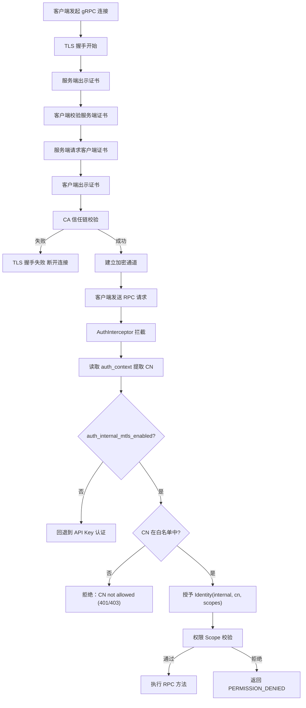

# 生产安全加固设计文档

> **版本**：v16.0.0  
> **适用范围**：`PrivShield` 核心算力引擎（`engine`）、企业级中台微服务群（`service-hub` / `datasource-mgr` / `audit-log`）、控制台与双 BFF 体系（`bff-go` / `app-lz`）。  
> **核心目标**：定义 TLS 1.3/mTLS 传输安全、mTLS CN 白名单动态热重载认证鉴权、速率限制、全栈 9 层中间件纵深防 DDoS、SM4-GCM 快照信封加密与 9 要素密码学哈希链防篡改存证的技术架构与实现细节。

---

## 目录

- [1. 概述](#1-概述)
- [2. 设计目标](#2-设计目标)
- [3. 威胁模型与缓解措施](#3-威胁模型与缓解措施)
- [4. 总体架构](#4-总体架构)
- [5. 模块设计与实现细节](#5-模块设计与实现细节)
  - [5.1 配置管理 (security/config.py)](#51-配置管理-securityconfigpy)
  - [5.2 TLS 传输层参数生成 (security/tls.py)](#52-tls-传输层参数生成-securitytlspy)
  - [5.3 身份模型与 Scope 权限映射 (pkg/auth/identity.go)](#53-身份模型与-scope-权限映射-pkgauthidentitygo)
    - [5.3.1 Identity 数据结构](#531-identity-数据结构)
    - [5.3.2 API Key 配置解析 (ParseAPIKeysEnv)](#532-api-key-配置解析parseapikeysenv)
    - [5.3.3 路径归一化与 REST 权限映射](#533-路径归一化与-rest-权限映射permissionforrestpath)
    - [5.3.4 gRPC 方法权限映射](#534-grpc-方法权限映射permissionforgrpcmethod)
    - [5.3.5 service-hub 权限映射](#535-service-hub-权限映射servicehubpermissionforpath)
  - [5.4 认证与鉴权依赖 (pkg/auth/, pkg/middleware/, console/)](#54-认证与鉴权依赖-pkgauth-pkgmiddleware-console)
    - [5.4.1 REST API Key 认证中间件](#541-rest-api-key-认证中间件)
    - [5.4.2 gRPC mTLS CN 白名单拦截器](#542-grpc-mtls-cn-白名单拦截器)
    - [5.4.3 控制台 BFF 增强认证（三级等保合规）](#543-控制台-bff-增强认证三级等保合规)
    - [5.4.4 WAF Web 攻击防护 (G-12)](#544-waf-web-攻击防护g-12)
    - [5.4.5 可信代理与真实 IP (G-02)](#545-可信代理与真实-ipg-02)
    - [5.4.6 API Key 生命周期管理 (G-14)](#546-api-key-生命周期管理g-14)
  - [5.5 速率限制引擎 (security/ratelimit.py)](#55-速率限制引擎-securityratelimitpy)
- [6. mTLS 白名单认证鉴权体系](#6-mtls-白名单认证鉴权体系)
  - [6.1 原理与双层校验模型](#61-原理与双层校验模型)
  - [6.2 gRPC 与 REST 认证流程](#62-grpc-与-rest-认证流程)
  - [6.3 白名单管理器 (WhitelistManager) 与 5 秒热重载](#63-白名单管理器-whitelistmanager-与-5-秒热重载)
  - [6.4 Fail-Closed 安全设计](#64-fail-closed-安全设计)
- [7. Go 共享微服务安全栈 (pkg/)](#7-go-共享微服务安全栈-pkg)
  - [7.1 9 层统一中间件栈与纵深防 DDoS](#71-9-层统一中间件栈与纵深防-ddos)
  - [7.2 SM4-GCM 快照信封加密 (pkg/crypto)](#72-sm4-gcm-快照信封加密-pkgcrypto)
  - [7.3 9 要素密码学哈希链 (services/audit-log)](#73-9-要素密码学哈希链-servicesaudit-log)
- [8. 部署与运维约定](#8-部署与运维约定)
- [9. 标准错误码矩阵](#9-标准错误码矩阵)

---

## 1. 概述

本文档定义 `PrivShield` 生产安全模块的技术架构、设计原理与实现细节。该模块为 REST 与 gRPC 双协议提供可选的传输安全、身份认证、权限鉴权与速率限制能力。

---

## 2. 设计目标

- 为 REST/gRPC 提供可选的服务器端 TLS，gRPC 额外支持可选的 mTLS。
- 区分内部服务与外部服务两类身份，按最小权限原则控制接口访问。
- 基于调用者身份与接口路径/方法进行速率限制。
- 构建全栈防 DDoS 纵深防御（慢速连接拦截、大包切断、IP 令牌桶限流、并发容量硬顶）。
- 实施数据源输入沙箱与存储边界防御（LFI 防护、异常脱敏、SQL 分页夹紧）。
- 所有安全能力默认平滑兼容，核心开关通过环境变量显式开启。

---

## 3. 威胁模型与缓解措施

| 威胁类型 | 攻击场景 / 风险 | 缓解措施与防御层级 |
|---|---|---|
| **链路窃听** | 窃听隐私数据、脱敏结果与预算请求 | REST/gRPC 强制开启 TLS 1.3 / HTTPS / gRPCs |
| **中间人篡改** | 伪造调用方身份消耗隐私预算 | mTLS 双向证书 CA 信任链 + 客户端 CN 白名单校验 |
| **越权调用** | 外部租户越权调用高敏差分隐私或销毁接口 | Bearer API Key 恒定时间防时序攻击鉴权 + Scope 细粒度校验 |
| **慢速攻击 (Slowloris)** | 攻击者以极慢速度发送 Header/Body 挂起连接池 | 服务端强制配置 `ReadHeaderTimeout: 5s`、`ReadTimeout: 30s` 与 `MaxHeaderBytes: 1MB` |
| **大包 DoS (Payload Attack)** | 传入超大 JSON/CSV 造成内存耗尽 (OOM) | `MaxBodySize` (32MB/64MB) + `http.MaxBytesReader` 超限切断并返回 413 |
| **应用层 Flood** | 单 IP 突发数千 QPS 刷爆 CPU | `pkg/middleware.RateLimit` IP 令牌桶限流 (429 + Retry-After) |
| **并发协程耗尽** | 大规模并发连接打满 Goroutine 线程池 | `pkg/middleware.MaxConcurrent` 信号量硬顶 (503 快速失败) |
| **任意文件包含 (LFI)** | CSV 数据源路径穿越读取系统敏感文件 | 强制 `.csv` 后缀白名单、`filepath.Base` 提取与沙箱目录校验 |
| **敏感信息泄露** | 服务端 Panic 返回完整堆栈给客户端 | `pkg/middleware.Recovery` 堆栈收敛至服务端内部日志，对外返回脱敏 JSON |
| **SQL 越界查询** | 超大 Limit 或负数 Offset 拖垮 SQLite | `validation.ParsePagination` 强制 Limit (1~10000) 与 Offset (>=0) |
| **K8s 探针误判** | 健康检查因无凭证导致 Pod 被误重启 | `/health` 与 `Health` 默认保持匿名放行与不限速 |

---

## 4. 总体架构

```mermaid
graph TD
    subgraph ClientAndIngress [外部流量与云原生入口]
        Ingress[K8s Ingress / Envoy<br/>Rate-Limit: 100 RPS / 50 Conn]
    end

    subgraph GoMicroservices [中台微服务群与 BFF]
        BFF[console/bff-go & app-lz]
        Hub[services/service-hub]
        DS[services/datasource-mgr]
        Audit[services/audit-log]
        PkgSec[pkg/middleware<br/>CORS / Auth / RateLimit / MaxBodySize / MaxConcurrent / Recovery]
        BFF & Hub & DS & Audit --- PkgSec
    end

    subgraph EngineSecurity [Go 核心算力引擎 (engine-go)]
        REST[Gin REST :8079]
        GRPC[gRPC Server :50051]
        SEC[Security Layer<br/>TLS / mTLS / APIKey / 32-Shard TokenBucket / WhitelistManager]
        REST --> SEC
        GRPC --> SEC
    end

    Ingress --> BFF
    BFF -->|gRPC mTLS| GRPC
    BFF & Hub -->|REST TLS| REST
    Hub --> DS & Audit
```

安全层对 Go 核心算力引擎与 Go 中台微服务群提供统一协同治理：

- **Go 算力层 (`engine-go/internal/security/`)**：`security.go` 证书参数构造、`auth.go` / `ratelimit.go` Gin 中间件与 gRPC Interceptor、`whitelist.go` mTLS CN 白名单（5s mtime 热重载）；
- **Go 微服务群 (`pkg/middleware/`)**：`ratelimit.go` (IP 令牌桶限流 + MaxBodySize + MaxConcurrent)、`auth.go` (恒定时间 Bearer 鉴权)、`envelope.go` (统一错误信封)、`trace.go` (全链路追踪 TraceMiddleware)、`middleware.go` (CORS、Request ID、结构化日志、Recovery 异常脱敏与 Security Headers)。所有中间件错误响应统一使用 `AbortWithError()` 输出信封格式。

---

## 5. 模块设计与实现细节

### 5.1 配置管理 (`security/config.py`)

使用 Pydantic v2 `BaseModel` 解析环境变量：

```python
class SecuritySettings(BaseModel):
    tls_enabled: bool = False
    tls_cert_file: Path | None = None
    tls_key_file: Path | None = None
    tls_ca_file: Path | None = None
    tls_client_auth: Literal["none", "optional", "require"] = "none"
    tls_key_password: str | None = None

    auth_enabled: bool = False
    auth_internal_mtls_enabled: bool = False
    auth_mtls_allowed_cns: list[str] = Field(default_factory=list)
    auth_mtls_whitelist_file: Path | None = None  # YAML 配置文件路径（可选）
    internal_keys: dict[str, KeyConfig] = Field(default_factory=dict)
    external_keys: dict[str, KeyConfig] = Field(default_factory=dict)

    rate_limit_enabled: bool = False
    rate_limit_default_rps: float = 10.0
    rate_limit_default_burst: float = 20.0
    rate_limit_per_endpoint: dict[str, RateLimitConfig] = Field(default_factory=dict)
    rate_limit_redis_url: str | None = None

    health_no_auth: bool = True
    health_no_rate_limit: bool = True
```

### 5.2 TLS 传输层参数生成 (`security/tls.py`)

#### REST
```python
def uvicorn_ssl_kwargs(settings: SecuritySettings) -> dict:
    return {
        "ssl_keyfile": str(settings.tls_key_file),
        "ssl_certfile": str(settings.tls_cert_file),
        "ssl_keyfile_password": settings.tls_key_password,
        "ssl_cert_reqs": _map_client_auth(settings.tls_client_auth),
        "ssl_ca_certs": str(settings.tls_ca_file) if settings.tls_ca_file else None,
    }
```

#### gRPC
```python
def grpc_server_credentials(settings: SecuritySettings) -> grpc.ServerCredentials:
    private_key = settings.tls_key_file.read_bytes()
    certificate_chain = settings.tls_cert_file.read_bytes()
    if settings.tls_client_auth == "require":
        root_certificates = settings.tls_ca_file.read_bytes()
        return grpc.ssl_server_credentials(
            ((private_key, certificate_chain),),
            root_certificates=root_certificates,
            require_client_auth=True,
        )
    return grpc.ssl_server_credentials(((private_key, certificate_chain),))
```

### 5.3 身份模型与 Scope 权限映射 (`pkg/auth/identity.go`)

#### 5.3.1 Identity 数据结构

```go
// pkg/auth/identity.go
type Identity struct {
    ServiceType string   // "internal" (高信任内部服务) | "external" (外部客户端) | "anonymous" (开发模式)
    Name        string   // 服务/账户名称（如 "service-hub"、"bff-go"）
    Scopes      []string // 权限列表；["*"] 表示通配所有权限
}

func (id *Identity) HasPermission(permission string) bool {
    for _, s := range id.Scopes {
        if s == "*" || s == permission {
            return true
        }
    }
    return false
}
```

**设计要点**：
- `internal` 与 `external` 分别存储于独立的 Key 池（`InternalKeys` / `ExternalKeys`），认证时先查 internal 再查 external；
- `"*"` 通配符授予所有权限，用于管理员/网关全量访问场景；
- 认证未启用时注入 `AnonymousIdentity{ServiceType: "anonymous", Scopes: ["*"]}`，开发环境零配置可用。

#### 5.3.2 API Key 配置解析（`ParseAPIKeysEnv`）

**环境变量格式**：
```text
token:name:scope1,scope2;token2:name2:scope3:2025-12-31T23:59:59Z
```

- 条目按 `;` 分隔，每条按 `:` 拆分为 `token`、`name`、`rest` 三段（`SplitN(, 3)` 保留 scope 中的冒号如 `privacy:mask`）；
- `rest` 部分通过 `findExpirySeparator()` 从末尾回溯扫描，检测是否存在 RFC3339 时间戳后缀（G-14 合规增强）；
- 缺少 scopes 时默认 `["*"]`（全部权限）；空 token 或空 name 的条目被丢弃。

```go
// pkg/auth/identity.go
func ParseAPIKeysEnv(raw string) map[string]*KeyConfig {
    // 1. 按 ";" 分割多 Key 条目
    // 2. 每条 SplitN(entry, ":", 3) → token, name, rest
    // 3. findExpirySeparator(rest) 回溯查找 RFC3339 时间戳
    // 4. 剩余部分按 "," 分割为 scopes
    // 5. 缺少 scopes → 默认 ["*"]
}

// findExpirySeparator 从末尾回溯查找过期时间分隔冒号。
// RFC3339 最短 20 字符（如 2006-01-02T15:04:05Z），
// 逐冒号位尝试 time.Parse(time.RFC3339, candidate)，成功即返回位置。
func findExpirySeparator(s string) int { ... }
```

**KeyConfig 与过期检查**（`pkg/auth/settings.go`）：
```go
type KeyConfig struct {
    Name      string
    Scopes    []string
    ExpiresAt *time.Time  // nil = 永不过期
}

func (k *KeyConfig) IsExpired() bool {
    if k.ExpiresAt == nil { return false }
    return time.Now().After(*k.ExpiresAt)
}
```

认证中间件在 `ConstantTimeLookup` 命中后检查 `matched.IsExpired()`，过期 Key 视为无效（G-14 合规）。

#### 5.3.3 路径归一化与 REST 权限映射（`PermissionForRESTPath`）

函数入口处执行两步归一化，确保别名路由与主路由共享同一权限映射：

```go
func PermissionForRESTPath(path string) string {
    // 1. 去除尾部斜杠（防 /api/hub/dispatch/ 绕过精确匹配）
    // 2. 前缀归一化：/api/v1/* → /v1/*（别名路由统一映射）
    // 3. switch-case 前缀匹配 → 返回权限字符串
    // 4. 未映射路径返回 ""（对所有已认证身份开放）
}
```

> **已修复的安全漏洞（SEC-09）**：早期版本仅匹配 `/v1/*` 前缀，导致 40+ 别名路由（`/api/v1/*`、根路径别名、快捷别名）完全绕过权限校验。修复方案是在函数入口统一归一化路径前缀。

##### Engine 权限映射表

| REST 路径 / gRPC 方法 | 对应权限 Scope |
|---|---|
| `/health`, `/livez`, `/readyz` / `Health` | `health:read` |
| `/v1/privacy/mask*`, `/api/v1/mask*`, `/privacy/process_file` / `Mask`, `MaskRecord` | `privacy:mask` |
| `/v1/privacy/hash`, `/api/v1/hash/hmac` / `Hash` | `privacy:hash` |
| `/v1/privacy/dp/*`, `/v1/privacy/ldp/*`, `/api/v1/dp/*`, `/api/v1/ldp/*` / `DPCount`, `DPSum`, `DPMean` | `privacy:dp` |
| `/v1/privacy/k_anonymize*`, `/api/v1/kano/*` / `KAnonymizeRecord` | `privacy:kano` |
| `/v1/privacy/qol/*`, `/api/v1/qol/*` / `ObfuscateQuery` | `privacy:qol` |
| `/v1/privacy/budget`, `/v1/privacy/budget/reset`, `/api/v1/budget`, `/api/v1/budget/reset` | `privacy:budget` |
| `/v1/privacy/profile/recommend` | `privacy:profile` |
| `/v1/privacy/classify/*`, `/api/v1/classify*` | `classification:read` |
| `/v1/dynclassification/classify*`, `/v1/dynclassification/eval_record`, `/api/v1/dynclassification/*` | `dynclassification:read` |
| `/v1/dynclassification/profiles/reload`, `/v1/dynclassification/generate_profile` | `dynclassification:write` |
| `/v1/agent/process`, `/api/v1/agent/process`, `/agent/process` | `agent:process` |
| `/v1/medical/*`, `/api/v1/medical/*`, `/medical/process` | `medical:process` |
| `/v1/ops/*`, `/api/v1/ops/*`, `/ops/diagnostics` | `ops:diagnostics` |
| `/debug/pprof*` | `ops:admin` |

#### 5.3.4 gRPC 方法权限映射（`PermissionForGRPCMethod`）

覆盖 44 个隐私原语 gRPC 方法，映射逻辑与 REST 一致：

```go
func PermissionForGRPCMethod(method string) string {
    // method 格式："/PrivacyService/Mask"
    // 提取最后一段方法名，查 map 返回权限字符串
    mapping := map[string]string{
        "Mask": "privacy:mask", "MaskRecord": "privacy:mask",
        "MaskBatch": "privacy:mask", "MaskDataFrame": "privacy:mask",
        "DPCount": "privacy:dp", "DPSum": "privacy:dp", "DPMean": "privacy:dp",
        "DPHistogram": "privacy:dp", "DPChunkedCount": "privacy:dp",
        "KAnonymizeRecord": "privacy:kano", "KAnonymizeTable": "privacy:kano",
        "ObfuscateQuery": "privacy:qol",
        "ClassifyField": "classification:read",
        "DynClassify": "dynclassification:read",
        "Health": "health:read",
        // ... 共 44 个方法
    }
}
```

#### 5.3.5 service-hub 权限映射（`ServiceHubPermissionForPath`）

| REST 路径 | 对应权限 Scope |
|---|---|
| `/api/hub/status`, `/api/hub/tasks`, `/api/hub/tasks/:id`, `/api/hub/pipeline` | `hub:read` |
| `/api/hub/dispatch`, `/api/hub/classify` | `hub:dispatch` |
| `/health`, `/readyz`, `/api/health`, `/metrics` | 无需特定权限（已认证即可） |

**设计要点**：`hub:dispatch` 仅授予需要触发数据流通流水线的调用方（如 BFF 网关），只读查询用 `hub:read`，遵循最小权限原则。

### 5.4 认证与鉴权依赖 (`pkg/auth/`, `pkg/middleware/`, `console/`)

#### 5.4.1 REST API Key 认证中间件

**完整认证链路**（`pkg/auth/middleware.go` `AuthMiddleware`）：

```text
HTTP 请求
  │
  ├─ IsHealthPathOrMethod(path)?  ──YES──▶ 注入健康探针身份，放行
  │
  ├─ !settings.AuthEnabled?       ──YES──▶ 注入 AnonymousIdentity{Scopes:["*"]}，放行
  │
  ├─ ExtractBearerToken(Authorization header)
  │   └─ 空?  ──YES──▶ 401 UNAUTHENTICATED
  │
  ├─ authenticateAPIKey(settings, token)
  │   ├─ ConstantTimeLookup(InternalKeys, token)  ──命中──▶ Identity{internal}
  │   ├─ ConstantTimeLookup(ExternalKeys, token)  ──命中──▶ Identity{external}
  │   └─ 都未命中 / 已过期  ──▶ 401 UNAUTHENTICATED
  │
  ├─ PermissionForRESTPath(path) → requiredPerm
  │   └─ requiredPerm != "" && !identity.HasPermission(requiredPerm)?
  │       ──YES──▶ 403 FORBIDDEN
  │
  └─ c.Set("security_identity", identity) → c.Next()
```

**常量时间查找**（防时序侧信道攻击）：

```go
func ConstantTimeLookup(keys map[string]*KeyConfig, token string) *KeyConfig {
    // 1. 排序 key：消除 Go map 迭代随机性带来的时序差异
    // 2. 遍历全部 key，不提前 break（即使已命中也继续比较）
    // 3. subtle.ConstantTimeCompare 确保每次比较耗时恒定
    // 4. G-14 合规：命中后检查 matched.IsExpired()，过期返回 nil
}
```

#### 5.4.2 gRPC mTLS CN 白名单拦截器

**源码位置**：`pkg/tlsutil/grpc_interceptor.go`

```text
gRPC 请求 → extractClientCN(ctx) → 从 peer.Peer.AuthInfo 提取
           → VerifiedChains[0][0].Subject.CommonName（经 CA 验证）
           → DynamicWhitelist.CheckScope(cn, fullMethod)
           → 匹配规则："*" → 精确匹配 → 前缀通配符（如 /AuditLog/*）
           → 通过 → 执行 RPC | 拒绝 → PERMISSION_DENIED
```

同时提供 `UnaryServerInterceptor` 和 `StreamServerInterceptor`，一元与流式全覆盖。快速装配工厂：
```go
unaryInt, streamInt, whitelist, err := tlsutil.NewWhitelistInterceptor(path)
// path 为空 → 返回全 nil（禁用 CN 白名单鉴权）
```

#### 5.4.3 控制台 BFF 增强认证（三级等保合规）

**G-03 登录失败处理与账号锁定**（`console/app-lz/bff-go/internal/auth/userstore.go`）：

| 参数 | 值 | 说明 |
|------|-----|------|
| `maxFailedAttempts` | 5 | 连续失败次数阈值 |
| `lockoutDuration` | 15 分钟 | 锁定时长 |
| 存储 | `failedAttempts map[string]int` + `lockedUntil map[string]time.Time` | 内存级，`sync.RWMutex` 保护 |

认证流程：`Authenticate()` 入口检查 `IsLocked()` → 已锁定则返回 `ErrAccountLocked`（HTTP 423）→ 失败则 `recordFailedLogin()` → 成功则 `resetFailedLogin()`。

**G-04 密码策略强化**（`validatePasswordStrength`）：

| 规则 | 要求 |
|------|------|
| 最低长度 | 12 字符 |
| 字符类混合 | 4 类（大写/小写/数字/特殊）中至少 3 类 |
| 弱密码字典 | 16 个常见弱密码黑名单（`password`、`1234567890`、`qwerty123456` 等） |
| 用户名包含 | 密码不得包含用户名（大小写不敏感） |

注册时（`Register()`）在 bcrypt 哈希前调用，不合规返回 `ErrPasswordWeak`。

**G-05 JWT 令牌吊销**（`console/app-lz/bff-go/internal/auth/jwt.go`）：

```go
type JWTManager struct {
    secret    []byte
    expiryHours int
    blacklist sync.Map  // key: SHA-256(token) hex → value: int64(expiryUnix)
}
```

- `RevokeToken(token)`：验证 token 有效后，将 SHA-256 哈希存入黑名单；
- `ValidateToken(token)`：三阶段校验 — 签名验证（`hmac.Equal` 常量时间）→ 过期检查 → 黑名单检查；
- `cleanupLoop()`：后台 goroutine 每 10 分钟清理过期黑名单条目，防止内存无限增长；
- `HandleLogout()`：新增 `/logout` 端点，调用 `RevokeToken()` 使 JWT 提前失效。

**G-11 TOTP 双因素认证**（`console/app-lz/bff-go/internal/auth/totp.go`）：

| 参数 | 值 | 说明 |
|------|-----|------|
| 密钥长度 | 20 字节（160-bit） | RFC 推荐最低值 |
| 验证码位数 | 6 位 | 标准 TOTP 输出 |
| 时间步长 | 30 秒 | RFC 6238 标准 |
| 容忍窗口 | ±1 步（±30 秒） | 容忍时钟偏差 |

核心函数：`GenerateSecret()`（crypto/rand → Base32）、`ValidateCode(secret, code)`（RFC 6238 HMAC-SHA1 + 动态截断）、`GenerateOTPAuthURL()`（生成 `otpauth://totp/...` URI 供 QR 码扫描）。

#### 5.4.4 WAF Web 攻击防护（G-12）

**源码位置**：`pkg/middleware/waf.go`

5 类 72 条正则规则，`init()` 时编译为 `[]*regexp.Regexp`，运行时不可变：

| 类别 | 规则数 | 典型检测 |
|------|:------:|---------|
| `SQL_INJECTION` | 21 | UNION SELECT、OR 1=1、DROP TABLE、SLEEP/BENCHMARK 盲注、`information_schema` |
| `XSS` | 18 | `<script>`、`javascript:`、事件处理器 `on\w+=`、`<iframe>`、`document.cookie` |
| `COMMAND_INJECTION` | 12 | 管道/分号 + 系统命令、反引号/`$()` 替换、`exec()`/`system()` |
| `PATH_TRAVERSAL` | 14 | `../`、URL 编码变体（`%2e%2e%2f`）、`/etc/passwd`、空字节（`%00`） |
| `EXPLOIT` | 7 | Log4Shell（CVE-2021-44228）、Shellshock（CVE-2014-6271）、Spring4Shell SSTI |

**扫描范围**：URL path + raw query + 5 种 header（`User-Agent`/`Referer`/`Cookie`/`X-Forwarded-For`/`Content-Type`）+ body（仅 form 类型，≤1 MiB，扫描后重建 body 供下游读取）。

**命中响应**：`403 Forbidden`，错误码 `WAF_BLOCKED`，结构化日志记录攻击详情（类别、匹配规则、载荷截断至 512 字符）。

#### 5.4.5 可信代理与真实 IP（G-02）

**源码位置**：`pkg/middleware/middleware.go`

```go
func ConfigureTrustedProxies(r *gin.Engine, trustedProxies []string)
func RealClientIP(c *gin.Context) string
```

- `ConfigureTrustedProxies`：包装 `r.SetTrustedProxies()`，仅受信代理 IP/CIDR 的 `X-Forwarded-For` / `X-Real-IP` 头被采信；
- `RealClientIP`：优先 `c.ClientIP()`（受 TrustedProxies 配置约束），回退 `c.Request.RemoteAddr`（去端口）；
- 环境变量 `PRIVACY_TRUSTED_PROXIES` 配置受信代理列表，未配置时不信任任何代理（防 `X-Forwarded-For` 伪造）；
- 限流 key、WAF 日志、审计记录统一使用 `RealClientIP` 获取真实客户端地址。

#### 5.4.6 API Key 生命周期管理（G-14）

| 能力 | 实现 | 位置 |
|------|------|------|
| 过期时间 | `KeyConfig.ExpiresAt *time.Time` | `pkg/auth/settings.go` |
| 过期检查 | `IsExpired()` → 认证时拒绝过期 Key | `pkg/auth/middleware.go` |
| 环境配置 | 末尾追加 RFC3339 时间戳：`token:name:scopes:2025-12-31T23:59:59Z` | `pkg/auth/identity.go` |
| 解析兼容 | `findExpirySeparator()` 回溯扫描，不破坏含冒号的 scope（如 `privacy:mask`） | `pkg/auth/identity.go` |

### 5.5 速率限制引擎 (`security/ratelimit.py`)

- **限流键**：`f"{identity.name}:{method_or_path}"`；
- **后端适配**：支持内存滑动窗口与 Redis 分布式共享存储（`PRIVACY_RATE_LIMIT_REDIS_URL`）；
- **响应**：REST 超速返回 `429 Too Many Requests`，gRPC 超速返回 `grpc.StatusCode.RESOURCE_EXHAUSTED`。

---

## 6. mTLS 白名单认证鉴权体系

### 6.1 原理与双层校验模型

| 层级 | 校验内容 | 作用 |
|------|---------|------|
| **传输层**（TLS 握手） | 客户端证书是否由受信任 CA 签发 | 证明客户端持有合法证书（CA 信任链校验） |
| **应用层**（CN 白名单） | 证书 Common Name（CN）是否在白名单中 | 证明客户端被**明确授权**访问本服务 |

### 6.2 gRPC 与 REST 认证流程



### 6.3 白名单管理器 (WhitelistManager) 与 5 秒热重载

- **Per-CN Scope 控制**：支持在 `config/mtls-whitelist.yaml` 中为每个 CN 单独配置 `scopes: ["*"]` 或 `scopes: ["health:read"]`；
- **动态热重载**：基于文件 `mtime` 轮询（Go 端 5 秒轮询，Python 端每次请求被动比对），修改配置后**无需重启服务即可立即生效**。

### 6.4 Fail-Closed 安全设计

| 配置项 | 默认值 | Fail-Closed 行为 |
|--------|--------|------------------|
| `auth_internal_mtls_enabled` | `false` | 即使客户端证书通过 CA 校验，也不授予内部身份 |
| `auth_mtls_allowed_cns` | `[]` | 即使启用了 mTLS 认证，白名单为空时拒绝所有证书 |
| `tls_client_auth` | `"none"` | 不请求客户端证书，不启用 mTLS |

---

## 7. Go 共享微服务安全栈 (`pkg/`)

### 7.1 9 层统一中间件栈与纵深防 DDoS

所有 Go 微服务统一挂载 9 层中间件栈：
```text
TraceMiddleware ➔ StructuredLogger ➔ Recovery ➔ SecurityHeaders ➔ MaxBodySize ➔ MaxConcurrent ➔ RateLimit ➔ CORS ➔ Auth
```
1. **Slowloris 防护**：`ReadHeaderTimeout: 5s` + `MaxHeaderBytes: 1MB`；
2. **大包防御**：`MaxBodySize` 限制 32MB / 64MB，超限返回 `413 Payload Too Large`；
3. **IP 令牌桶限流**：`RateLimit(rps, burst)` 自动回收闲置 IP 桶，超限返回 `429 Too Many Requests`；
4. **并发容量硬顶**：`MaxConcurrent(limit)` 限制在途最大请求数，超载快速失败返回 `503 Service Unavailable`；
5. **异常脱敏**：`Recovery` 捕获 Panic 并向客户端返回通用错误信封，堆栈收敛至内部日志。

### 7.2 SM4-GCM 快照信封加密 (`pkg/crypto`)

脱敏出域快照落盘前执行 SM4-GCM 信封加密：
```text
enc:v1:<Base64(12B Nonce + Ciphertext + 16B Tag)>
```
密钥由环境变量 `AUDIT_LOG_ENCRYPTION_KEY` 派生，读取时透明还原。

### 7.3 9 要素密码学哈希链 (`services/audit-log`)

$$\text{IntegrityHash} = \text{SHA256}(\text{prev\_hash} \parallel \text{id} \parallel \text{task\_id} \parallel \text{api\_code} \parallel \text{datasource\_id} \parallel \text{timestamp} \parallel \text{input\_hash} \parallel \text{output\_hash} \parallel \text{algorithm})$$
形成严格的区块链式链式锚定，提供秒级在线核验（`POST /api/audit/chain/verify`）。

---

## 8. 部署与运维约定

- **证书挂载**：服务端证书与私钥挂载于 `/certs/server.crt` 与 `/certs/server.key`；CA 证书挂载于 `/certs/ca.crt`；
- **健康检查探针豁免**：K8s `livenessProbe` 与 `readinessProbe` 访问 `/health` 默认保持匿名放行与免限流；
- **分布式共享限流**：单副本使用内存计数器，多副本时配置 `PRIVACY_RATE_LIMIT_REDIS_URL`。

---

## 9. 标准错误码矩阵

| 场景 | REST 响应 | gRPC 响应 |
|---|---|---|
| 未认证 / 凭证失效 | `401 Unauthorized` | `UNAUTHENTICATED` |
| 权限不足 / 越权 | `403 Forbidden` | `PERMISSION_DENIED` |
| 速率超限 (Rate Limit) | `429 Too Many Requests` | `RESOURCE_EXHAUSTED` |
| 并发超载 (MaxConcurrent) | `503 Service Unavailable` | `UNAVAILABLE` |
| 请求体超大 (MaxBodySize) | `413 Payload Too Large` | `INVALID_ARGUMENT` |
| 非法数据源标识 | `400 Bad Request` | `INVALID_ARGUMENT` |
| TLS 握手失败 | SSL/TLS 连接断开 | `UNAVAILABLE` |