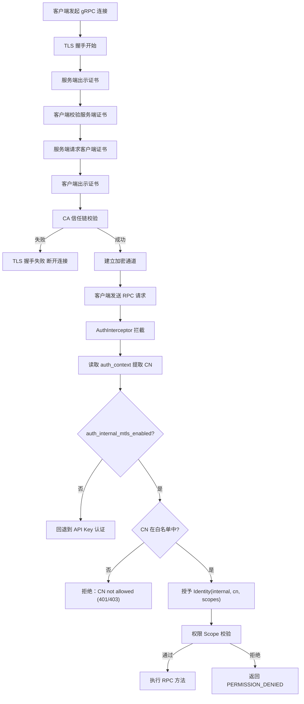

# 生产安全加固设计文档

> **版本**：v17.0.0 (Go 1.25+ Cloud-Native 全栈纯 Go 实现)  
> **适用范围**：`PrivShield` 核心算力引擎（`engine-go`）、自适应网关（`privshield-gateway`）、企业级中台微服务群（`service-hub` / `datasource-mgr` / `audit-log`）、控制台与双 BFF 体系（`bff-go` / `app-lz`）。  
> **核心目标**：定义 TLS 1.3/mTLS (SAN/SPIFFE) 传输安全与国密 TLCP 双证书、动态热重载认证鉴权、全栈 Fail-Closed 访问控制、Bell-LaPadula MAC 强制访问控制、32 分片高水位限流与端点级差异化限流、全栈 9 层中间件纵深防 DDoS、SM4-GCM 多版本信封加密、国密算法上电自检 (KAT)、内存敏感数据安全销毁 (Zeroize) 与 9 要素密码学哈希链防篡改存证的技术架构与实现细节。

---

## 目录

- [1. 概述](#1-概述)
- [2. 设计目标](#2-设计目标)
- [3. 威胁模型与缓解措施](#3-威胁模型与缓解措施)
- [4. 总体架构](#4-总体架构)
- [5. 模块设计与实现细节](#5-模块设计与实现细节)
  - [5.1 配置管理 (engine-go/internal/security/config.go & pkg/auth/settings.go)](#51-配置管理-engine-gointernalsecurityconfiggo--pkgauthsettingsgo)
  - [5.2 TLS / TLCP 传输层参数与双证书配置 (pkg/tlsutil/)](#52-tls--tlcp-传输层参数与双证书配置-pkgtlsutil)
  - [5.3 身份模型与 Scope 权限映射 (pkg/auth/identity.go)](#53-身份模型与-scope-权限映射-pkgauthidentitygo)
    - [5.3.1 Identity 数据结构](#531-identity-数据结构)
    - [5.3.2 API Key 配置解析 (ParseAPIKeysEnv)](#532-api-key-配置解析parseapikeysenv)
    - [5.3.3 路径归一化与 REST 权限映射 (PermissionForRESTPath)](#533-路径归一化与-rest-权限映射permissionforrestpath)
    - [5.3.4 gRPC 方法权限映射 (PermissionForGRPCMethod)](#534-grpc-方法权限映射permissionforgrpcmethod)
    - [5.3.5 微服务权限映射与 Fail-Closed 兜底机制](#535-微服务权限映射与-fail-closed-兜底机制)
    - [5.3.6 强制访问控制 MAC 引擎 (pkg/auth/mac.go)](#536-强制访问控制-mac-引擎-pkgauthmacgo)
  - [5.4 认证与鉴权体系 (pkg/auth/, pkg/middleware/, console/)](#54-认证与鉴权体系-pkgauth-pkgmiddleware-console)
    - [5.4.1 REST API Key 认证中间件与常量时间查找](#541-rest-api-key-认证中间件与常量时间查找)
    - [5.4.2 gRPC mTLS SAN/SPIFFE 与 CN 多级身份拦截器](#542-grpc-mtls-sanspiffe-与-cn-多级身份拦截器)
    - [5.4.3 控制台 BFF 增强认证（三级等保合规）](#543-控制台-bff-增强认证三级等保合规)
    - [5.4.4 WAF Web 攻击防护 (G-12)](#544-waf-web-攻击防护g-12)
    - [5.4.5 可信代理、真实 IP 与 IPv6 双栈规范提取](#545-可信代理真实-ip-与-ipv6-双栈规范提取)
    - [5.4.6 API Key 生命周期管理 (G-14)](#546-api-key-生命周期管理g-14)
    - [5.4.7 集中化密钥凭据监听器与动态热加载 (SecretWatcher & KeyStore)](#547-集中化密钥凭据监听器与动态热加载-secretwatcher--keystore)
  - [5.5 速率限制引擎 (pkg/middleware/ratelimit.go)](#55-速率限制引擎-pkgmiddlewareratelimitgo)
    - [5.5.1 32 分片高并发令牌桶](#551-32-分片高并发令牌桶)
    - [5.5.2 分片容量高水位保护与防 Hash-Flooding 淘汰](#552-分片容量高水位保护与防-hash-flooding-淘汰)
    - [5.5.3 端点级差异化限流](#553-端点级差异化限流)
  - [5.6 网关边界安全与协议强制 (engine-go/cmd/privshield-gateway/)](#56-网关边界安全与协议强制-engine-gocmdprivshield-gateway)
- [6. mTLS 白名单认证鉴权体系](#6-mtls-白名单认证鉴权体系)
  - [6.1 原理与双层校验模型](#61-原理与双层校验模型)
  - [6.2 gRPC 与 REST 认证流程](#62-grpc-与-rest-认证流程)
  - [6.3 白名单管理器 (WhitelistManager) 与 5 秒热重载](#63-白名单管理器-whitelistmanager-与-5-秒热重载)
  - [6.4 Fail-Closed 安全设计](#64-fail-closed-安全设计)
- [7. Go 共享微服务安全栈与国密体系 (pkg/)](#7-go-共享微服务安全栈与国密体系-pkg)
  - [7.1 9 层统一中间件栈与纵深防 DDoS](#71-9-层统一中间件栈与纵深防-ddos)
  - [7.2 SM4-GCM 快照信封加密与多版本密钥轮换 (pkg/crypto/envelope.go)](#72-sm4-gcm-快照信封加密与多版本密钥轮换-pkgcryptoenvelopego)
  - [7.3 9 要素密码学哈希链 (services/audit-log)](#73-9-要素密码学哈希链-servicesaudit-log)
  - [7.4 国密算法上电已知答案自检 (KAT) 与内存敏感数据安全销毁 (pkg/crypto/)](#74-国密算法上电已知答案自检-kat-与内存敏感数据安全销毁-pkgcrypto)
- [8. 部署与运维约定](#8-部署与运维约定)
- [9. 标准错误码矩阵](#9-标准错误码矩阵)

---

## 1. 概述

本文档定义 `PrivShield` 生产安全模块的技术架构、设计原理与实现细节。该模块为 REST 与 gRPC 双协议提供可选的传输安全、身份认证、权限鉴权与速率限制能力。

---

## 2. 设计目标

- 为 REST/gRPC 提供可选的服务器端 TLS，gRPC 额外支持可选的 mTLS。
- 区分内部服务与外部服务两类身份，按最小权限原则控制接口访问。
- 基于调用者身份与接口路径/方法进行速率限制。
- 构建全栈防 DDoS 纵深防御（慢速连接拦截、大包切断、IP 令牌桶限流、并发容量硬顶）。
- 实施数据源输入沙箱与存储边界防御（LFI 防护、异常脱敏、SQL 分页夹紧）。
- 所有安全能力默认平滑兼容，核心开关通过环境变量显式开启。

---

## 3. 威胁模型与缓解措施

| 威胁类型 | 攻击场景 / 风险 | 缓解措施与防御层级 |
|---|---|---|
| **链路窃听** | 窃听隐私数据、脱敏结果与预算请求 | REST/gRPC 强制开启 TLS 1.3 / HTTPS / gRPCs |
| **中间人篡改** | 伪造调用方身份消耗隐私预算 | mTLS 双向证书 CA 信任链 + 客户端 CN 白名单校验 |
| **越权调用** | 外部租户越权调用高敏差分隐私或销毁接口 | Bearer API Key 恒定时间防时序攻击鉴权 + Scope 细粒度校验 |
| **慢速攻击 (Slowloris)** | 攻击者以极慢速度发送 Header/Body 挂起连接池 | 服务端强制配置 `ReadHeaderTimeout: 5s`、`ReadTimeout: 30s` 与 `MaxHeaderBytes: 1MB` |
| **大包 DoS (Payload Attack)** | 传入超大 JSON/CSV 造成内存耗尽 (OOM) | `MaxBodySize` (32MB/64MB) + `http.MaxBytesReader` 超限切断并返回 413 |
| **应用层 Flood** | 单 IP 突发数千 QPS 刷爆 CPU | `pkg/middleware.RateLimit` IP 令牌桶限流 (429 + Retry-After) |
| **并发协程耗尽** | 大规模并发连接打满 Goroutine 线程池 | `pkg/middleware.MaxConcurrent` 信号量硬顶 (503 快速失败) |
| **任意文件包含 (LFI)** | CSV 数据源路径穿越读取系统敏感文件 | 强制 `.csv` 后缀白名单、`filepath.Base` 提取与沙箱目录校验 |
| **敏感信息泄露** | 服务端 Panic 返回完整堆栈给客户端 | `pkg/middleware.Recovery` 堆栈收敛至服务端内部日志，对外返回脱敏 JSON |
| **SQL 越界查询** | 超大 Limit 或负数 Offset 拖垮 SQLite | `validation.ParsePagination` 强制 Limit (1~10000) 与 Offset (>=0) |
| **K8s 探针误判** | 健康检查因无凭证导致 Pod 被误重启 | `/health` 与 `Health` 默认保持匿名放行与不限速 |

---

## 4. 总体架构

```mermaid
graph TD
    subgraph ClientAndIngress [外部流量与云原生入口]
        Ingress[K8s Ingress / Envoy<br/>Rate-Limit: 100 RPS / 50 Conn]
    end

    subgraph GoMicroservices [中台微服务群与 BFF]
        BFF[console/bff-go & app-lz]
        Hub[services/service-hub]
        DS[services/datasource-mgr]
        Audit[services/audit-log]
        PkgSec[pkg/middleware<br/>CORS / Auth / RateLimit / MaxBodySize / MaxConcurrent / Recovery]
        BFF & Hub & DS & Audit --- PkgSec
    end

    subgraph EngineSecurity [Go 核心算力引擎 (engine-go)]
        REST[Gin REST :8079]
        GRPC[gRPC Server :50051]
        SEC[Security Layer<br/>TLS / mTLS / APIKey / 32-Shard TokenBucket / WhitelistManager]
        REST --> SEC
        GRPC --> SEC
    end

    Ingress --> BFF
    BFF -->|gRPC mTLS| GRPC
    BFF & Hub -->|REST TLS| REST
    Hub --> DS & Audit
```

安全层对 Go 核心算力引擎与 Go 中台微服务群提供统一协同治理：

- **Go 算力层 (`engine-go/internal/security/`)**：`security.go` 证书参数构造、`auth.go` / `ratelimit.go` Gin 中间件与 gRPC Interceptor、`whitelist.go` mTLS CN 白名单（5s mtime 热重载）；
- **Go 微服务群 (`pkg/middleware/`)**：`ratelimit.go` (IP 令牌桶限流 + MaxBodySize + MaxConcurrent)、`auth.go` (恒定时间 Bearer 鉴权)、`envelope.go` (统一错误信封)、`trace.go` (全链路追踪 TraceMiddleware)、`middleware.go` (CORS、Request ID、结构化日志、Recovery 异常脱敏与 Security Headers)。所有中间件错误响应统一使用 `AbortWithError()` 输出信封格式。

---

## 5. 模块设计与实现细节

### 5.1 配置管理 (`engine-go/internal/security/config.go` & `pkg/auth/settings.go`)

在 Go 运行时中，安全配置由 `pkg/auth/settings.go` 与 `engine-go/internal/security/config.go` 统一解析与维护：

```go
type Settings struct {
	TLSEnabled              bool
	TLSCertFile             string
	TLSKeyFile              string
	TLSCAFile               string
	TLSClientAuth           string // "none" | "optional" | "require"
	TLSKeyPassword          string

	AuthEnabled             bool
	AuthInternalMTLSEnabled bool
	AuthMTLSWhitelistFile   string
	InternalKeys            map[string]*KeyConfig
	ExternalKeys            map[string]*KeyConfig

	RateLimitEnabled        bool
	RateLimitDefaultRPS     float64
	RateLimitDefaultBurst   float64
	RateLimitPerEndpoint    map[string]*pkgmiddleware.EndpointRateLimit

	HealthNoAuth            bool
	HealthNoRateLimit       bool
}
```

配置从标准环境变量加载，严格执行 Fail-Closed 校验：当认证开启但未注入有效密钥或白名单文件不存在时，系统启动时拒绝提供服务。

### 5.2 TLS / TLCP 传输层参数与双证书配置 (`pkg/tlsutil/`)

#### REST (Gin / HTTP Server)
支持标准 TLS 1.3 与国密 TLCP（GB/T 38636-2020 / GM/T 0024 双证书）纯国密传输：
```go
// 标准 TLS 配置（crypto/tls）
tlsConfig := &tls.Config{
	MinVersion:   tls.VersionTLS12,
	Certificates: []tls.Certificate{serverCert},
	ClientAuth:   tlsClientAuthType,
	ClientCAs:    caCertPool,
}

// TLCP 国密双证书模式（pkg/tlsutil/tlcp.go）
// 自动加载签名证书 (sign.crt/sign.key) 与加密证书 (enc.crt/enc.key)
tlcpConfig, err := tlsutil.NewTLCPConfig(signCert, signKey, encCert, encKey, caCert)
```

#### gRPC
```go
// 构造服务端传输凭证 credentials.TransportCredentials
creds, err := credentials.NewServerTLSFromFile(certFile, keyFile)
if requireClientAuth {
	creds = credentials.NewTLS(&tls.Config{
		Certificates: []tls.Certificate{cert},
		ClientAuth:   tls.RequireAndVerifyClientCert,
		ClientCAs:    caPool,
	})
}
```

### 5.3 身份模型与 Scope 权限映射 (`pkg/auth/identity.go`)

#### 5.3.1 Identity 数据结构

```go
// pkg/auth/identity.go
type Identity struct {
    ServiceType string   // "internal" (高信任内部服务) | "external" (外部客户端) | "anonymous" (开发模式)
    Name        string   // 服务/账户名称（如 "service-hub"、"bff-go"）
    Scopes      []string // 权限列表；["*"] 表示通配所有权限
}

func (id *Identity) HasPermission(permission string) bool {
    for _, s := range id.Scopes {
        if s == "*" || s == permission {
            return true
        }
    }
    return false
}
```

**设计要点**：
- `internal` 与 `external` 分别存储于独立的 Key 池（`InternalKeys` / `ExternalKeys`），认证时先查 internal 再查 external；
- `"*"` 通配符授予所有权限，用于管理员/网关全量访问场景；
- 认证未启用时注入 `AnonymousIdentity{ServiceType: "anonymous", Scopes: ["*"]}`，开发环境零配置可用。

#### 5.3.2 API Key 配置解析（`ParseAPIKeysEnv`）

**环境变量格式**：
```text
token:name:scope1,scope2;token2:name2:scope3:2025-12-31T23:59:59Z
```

- 条目按 `;` 分隔，每条按 `:` 拆分为 `token`、`name`、`rest` 三段（`SplitN(, 3)` 保留 scope 中的冒号如 `privacy:mask`）；
- `rest` 部分通过 `findExpirySeparator()` 从末尾回溯扫描，检测是否存在 RFC3339 时间戳后缀（G-14 合规增强）；
- 缺少 scopes 时默认 `["*"]`（全部权限）；空 token 或空 name 的条目被丢弃。

```go
// pkg/auth/identity.go
func ParseAPIKeysEnv(raw string) map[string]*KeyConfig {
    // 1. 按 ";" 分割多 Key 条目
    // 2. 每条 SplitN(entry, ":", 3) → token, name, rest
    // 3. findExpirySeparator(rest) 回溯查找 RFC3339 时间戳
    // 4. 剩余部分按 "," 分割为 scopes
    // 5. 缺少 scopes → 默认 ["*"]
}

// findExpirySeparator 从末尾回溯查找过期时间分隔冒号。
// RFC3339 最短 20 字符（如 2006-01-02T15:04:05Z），
// 逐冒号位尝试 time.Parse(time.RFC3339, candidate)，成功即返回位置。
func findExpirySeparator(s string) int { ... }
```

**KeyConfig 与过期检查**（`pkg/auth/settings.go`）：
```go
type KeyConfig struct {
    Name      string
    Scopes    []string
    ExpiresAt *time.Time  // nil = 永不过期
}

func (k *KeyConfig) IsExpired() bool {
    if k.ExpiresAt == nil { return false }
    return time.Now().After(*k.ExpiresAt)
}
```

认证中间件在 `ConstantTimeLookup` 命中后检查 `matched.IsExpired()`，过期 Key 视为无效（G-14 合规）。

#### 5.3.3 路径归一化与 REST 权限映射（`PermissionForRESTPath`）

函数入口处执行两步归一化，确保直调别名与主路由共享同一权限映射：

```go
func PermissionForRESTPath(path string) string {
    // 1. 去除尾部斜杠（防 /v1/hub/dispatch/ 绕过精确匹配）
    // 2. switch-case 前缀匹配（/v1/* 规范前缀 + 根路径直调别名）→ 返回权限字符串
    // 3. 未映射路径返回 "admin"（fail-closed）
}
```

> **历史修复（SEC-09）**：早期版本曾同时注册 `/v1/*` 别名路由组，并在函数入口统一执行 `/v1/*` → `/v1/*` 前缀归一化，确保别名路由不绕过权限校验。当前版本已整体移除 `/v1/*` 别名路由组与归一化逻辑，`/v1/*` 为唯一规范前缀。

##### Engine 权限映射表

| REST 路径 / gRPC 方法 | 对应权限 Scope |
|---|---|
| `/health`, `/livez`, `/readyz` / `Health` | `health:read` |
| `/v1/privacy/mask*`, `/privacy/process_file` / `Mask`, `MaskRecord` | `privacy:mask` |
| `/v1/privacy/hash` / `Hash` | `privacy:hash` |
| `/v1/privacy/dp/*`, `/v1/privacy/ldp/*` / `DPCount`, `DPSum`, `DPMean` | `privacy:dp` |
| `/v1/privacy/k_anonymize*` / `KAnonymizeRecord` | `privacy:kano` |
| `/v1/privacy/qol/*` / `ObfuscateQuery` | `privacy:qol` |
| `/v1/privacy/budget`, `/v1/privacy/budget/reset` | `privacy:budget` |
| `/v1/privacy/profile/recommend` | `privacy:profile` |
| `/v1/privacy/classify/*` | `classification:read` |
| `/v1/dynclassification/classify*`, `/v1/dynclassification/eval_record` | `dynclassification:read` |
| `/v1/dynclassification/profiles/reload`, `/v1/dynclassification/generate_profile` | `dynclassification:write` |
| `/v1/agent/process`, `/agent/process` | `agent:process` |
| `/v1/medical/*`, `/medical/process` | `medical:process` |
| `/v1/ops/*`, `/ops/diagnostics` | `ops:diagnostics` |
| `/debug/pprof*` | `ops:admin` |

#### 5.3.4 gRPC 方法权限映射（`PermissionForGRPCMethod`）

覆盖 44 个隐私原语 gRPC 方法，映射逻辑与 REST 一致：

```go
func PermissionForGRPCMethod(method string) string {
    // method 格式："/PrivacyService/Mask"
    // 提取最后一段方法名，查 map 返回权限字符串
    mapping := map[string]string{
        "Mask": "privacy:mask", "MaskRecord": "privacy:mask",
        "MaskBatch": "privacy:mask", "MaskDataFrame": "privacy:mask",
        "DPCount": "privacy:dp", "DPSum": "privacy:dp", "DPMean": "privacy:dp",
        "DPHistogram": "privacy:dp", "DPChunkedCount": "privacy:dp",
        "KAnonymizeRecord": "privacy:kano", "KAnonymizeTable": "privacy:kano",
        "ObfuscateQuery": "privacy:qol",
        "ClassifyField": "classification:read",
        "DynClassify": "dynclassification:read",
        "Health": "health:read",
        // ... 共 44 个方法
    }
}
```

#### 5.3.5 微服务权限映射与 Fail-Closed 兜底机制

在中台微服务中，每个服务独立维护路径到所需权限的映射函数，并严格执行 **Fail-Closed（默认拒绝）** 策略：

##### service-hub (`ServiceHubPermissionForPath`)
| REST 路径 | 对应权限 Scope |
|---|---|
| `/v1/hub/status`, `/v1/hub/tasks`, `/v1/hub/tasks/:id`, `/v1/hub/pipeline`, `/v1/hub/topology`, `/v1/hub/audit/logs`, `/v1/hub/datasources` | `hub:read` |
| `/v1/hub/dispatch`, `/v1/hub/classify`, `/v1/hub/fetch-and-desensitize`, `/v1/hub/audit/verify` | `hub:dispatch` |
| `/health`, `/readyz`, `/health`, `/metrics` | 豁免放行（健康检查与指标） |
| **未显式声明的其它路径（default）** | **`admin` (Fail-Closed 兜底)** |

##### datasource-mgr (`DatasourceMgrPermissionForPath`)
| REST 路径 | 对应权限 Scope |
|---|---|
| `/v1/datasources`, `/v1/datasources/:id`, `/record-by-id`, `/metadata`, `/audit` | `datasource:read` |
| `/v1/datasources/:id/test`, `/v1/datasources/seed` | `datasource:admin` |
| `/health`, `/readyz`, `/health`, `/metrics` | 豁免放行 |
| **未显式声明的其它路径（default）** | **`datasource:admin` (Fail-Closed 兜底)** |

##### audit-log (`AuditLogPermissionForPath`)
| REST 路径与方法 | 对应权限 Scope |
|---|---|
| `GET /v1/audit/logs`, `/stats`, `/snapshots` | `audit:read` |
| `POST /v1/audit/logs`, `/report` | `audit:write` |
| `POST /v1/audit/snapshots/verify`, `/v1/audit/chain/verify` | `audit:verify` |
| `/health`, `/readyz`, `/health`, `/metrics` | 豁免放行 |
| **未显式声明的其它路径（default）** | **`audit:admin` (Fail-Closed 兜底)** |

> **Fail-Closed 安全设计**：若外部调用方持有低权限或空 Scope Token，一旦访问未在白名单中显式声明的路由，映射函数一律返回最高管理员权限，鉴权中间件立即返回 `403 Forbidden`，彻底杜绝新增端点时的越权穿透风险。

#### 5.3.6 强制访问控制 MAC 引擎 (`pkg/auth/mac.go`)

为满足三级等保（GB/T 22239-2019 §2.4.2）对主体/客体安全标记与强制访问控制的合规要求，`PrivShield` 实现了基于多级安全（MLS）Bell-LaPadula 模型的不下读（No Read Up）MAC 判定引擎：

```go
type SecurityLevel int

const (
	LevelPublic       SecurityLevel = 1 // S1 / L1: 公开数据
	LevelInternal     SecurityLevel = 2 // S2 / L2: 内部业务受控
	LevelConfidential SecurityLevel = 3 // S3 / L3: 敏感隐私数据
	LevelRestricted   SecurityLevel = 4 // S4 / L4: 核心极密数据
)

func EvaluateMAC(subjectClearance, objectLevel SecurityLevel) error {
	if subjectClearance < objectLevel {
		return fmt.Errorf("MAC access forbidden: subject clearance %s is insufficient for object security level %s", subjectClearance, objectLevel)
	}
	return nil
}
```
结合 3-Layer 动态分类分级引擎的输出，当客体数据被标记为 $S_i$ 时，主体调用方安全许可（Clearance）必须满足 $\text{Clearance} \ge S_i$，否则在脱敏调度链路前直接强制阻断。

### 5.4 认证与鉴权依赖 (`pkg/auth/`, `pkg/middleware/`, `console/`)

#### 5.4.1 REST API Key 认证中间件

**完整认证链路**（`pkg/auth/middleware.go` `AuthMiddleware`）：

```text
HTTP 请求
  │
  ├─ IsHealthPathOrMethod(path)?  ──YES──▶ 注入健康探针身份，放行
  │
  ├─ !settings.AuthEnabled?       ──YES──▶ 注入 AnonymousIdentity{Scopes:["*"]}，放行
  │
  ├─ ExtractBearerToken(Authorization header)
  │   └─ 空?  ──YES──▶ 401 UNAUTHENTICATED
  │
  ├─ authenticateAPIKey(settings, token)
  │   ├─ ConstantTimeLookup(InternalKeys, token)  ──命中──▶ Identity{internal}
  │   ├─ ConstantTimeLookup(ExternalKeys, token)  ──命中──▶ Identity{external}
  │   └─ 都未命中 / 已过期  ──▶ 401 UNAUTHENTICATED
  │
  ├─ PermissionForRESTPath(path) → requiredPerm
  │   └─ requiredPerm != "" && !identity.HasPermission(requiredPerm)?
  │       ──YES──▶ 403 FORBIDDEN
  │
  └─ c.Set("security_identity", identity) → c.Next()
```

**常量时间查找**（防时序侧信道攻击）：

```go
func ConstantTimeLookup(keys map[string]*KeyConfig, token string) *KeyConfig {
    // 1. 排序 key：消除 Go map 迭代随机性带来的时序差异
    // 2. 遍历全部 key，不提前 break（即使已命中也继续比较）
    // 3. subtle.ConstantTimeCompare 确保每次比较耗时恒定
    // 4. G-14 合规：命中后检查 matched.IsExpired()，过期返回 nil
}
```

#### 5.4.2 gRPC mTLS SAN/SPIFFE 与 CN 多级身份拦截器

**源码位置**：`pkg/tlsutil/grpc_interceptor.go`

针对现代云原生零信任架构（Istio、SPIFFE/SPIRE、cert-manager），拦截器在传统的 CommonName 基础上全面升级为 **SAN (Subject Alternative Name) 多级身份凭据解析**：

```text
gRPC 请求 → extractClientIdentities(ctx)
           ├─ 1. SAN URIs (SPIFFE ID: spiffe://cluster.local/ns/prod/sa/service-hub)
           ├─ 2. SAN DNSNames (如 service-hub.prod.svc)
           └─ 3. Subject CommonName (CN)
           → DynamicWhitelist.authorizeClientIdentities(identities, fullMethod)
           → 只要任一合法身份匹配白名单且满足 Scope 权限 → 放行并透明执行 RPC
           → 未授权身份 → 返回 codes.PermissionDenied (403)
```

快速装配工厂：
```go
unaryInt, streamInt, whitelist, err := tlsutil.NewWhitelistInterceptor(path)
// path 为空 → 返回全 nil（禁用 CN/SAN 白名单鉴权）
```

#### 5.4.3 控制台 BFF 增强认证（三级等保合规）

**G-03 登录失败处理与账号锁定**（`console/app-lz/bff-go/internal/auth/userstore.go`）：

| 参数 | 值 | 说明 |
|------|-----|------|
| `maxFailedAttempts` | 5 | 连续失败次数阈值 |
| `lockoutDuration` | 15 分钟 | 锁定时长 |
| 存储 | `failedAttempts map[string]int` + `lockedUntil map[string]time.Time` | 内存级，`sync.RWMutex` 保护 |

认证流程：`Authenticate()` 入口检查 `IsLocked()` → 已锁定则返回 `ErrAccountLocked`（HTTP 423）→ 失败则 `recordFailedLogin()` → 成功则 `resetFailedLogin()`。

**G-04 密码策略强化**（`validatePasswordStrength`）：

| 规则 | 要求 |
|------|------|
| 最低长度 | 12 字符 |
| 字符类混合 | 4 类（大写/小写/数字/特殊）中至少 3 类 |
| 弱密码字典 | 16 个常见弱密码黑名单（`password`、`1234567890`、`qwerty123456` 等） |
| 用户名包含 | 密码不得包含用户名（大小写不敏感） |

注册时（`Register()`）在 bcrypt 哈希前调用，不合规返回 `ErrPasswordWeak`。

**G-05 JWT 令牌吊销**（`console/app-lz/bff-go/internal/auth/jwt.go`）：

```go
type JWTManager struct {
    secret    []byte
    expiryHours int
    blacklist sync.Map  // key: SHA-256(token) hex → value: int64(expiryUnix)
}
```

- `RevokeToken(token)`：验证 token 有效后，将 SHA-256 哈希存入黑名单；
- `ValidateToken(token)`：三阶段校验 — 签名验证（`hmac.Equal` 常量时间）→ 过期检查 → 黑名单检查；
- `cleanupLoop()`：后台 goroutine 每 10 分钟清理过期黑名单条目，防止内存无限增长；
- `HandleLogout()`：新增 `/logout` 端点，调用 `RevokeToken()` 使 JWT 提前失效。

**G-11 TOTP 双因素认证**（`console/app-lz/bff-go/internal/auth/totp.go`）：

| 参数 | 值 | 说明 |
|------|-----|------|
| 密钥长度 | 20 字节（160-bit） | RFC 推荐最低值 |
| 验证码位数 | 6 位 | 标准 TOTP 输出 |
| 时间步长 | 30 秒 | RFC 6238 标准 |
| 容忍窗口 | ±1 步（±30 秒） | 容忍时钟偏差 |

核心函数：`GenerateSecret()`（crypto/rand → Base32）、`ValidateCode(secret, code)`（RFC 6238 HMAC-SHA1 + 动态截断）、`GenerateOTPAuthURL()`（生成 `otpauth://totp/...` URI 供 QR 码扫描）。

#### 5.4.4 WAF Web 攻击防护（G-12）

**源码位置**：`pkg/middleware/waf.go`

5 类 72 条正则规则，`init()` 时编译为 `[]*regexp.Regexp`，运行时不可变：

| 类别 | 规则数 | 典型检测 |
|------|:------:|---------|
| `SQL_INJECTION` | 21 | UNION SELECT、OR 1=1、DROP TABLE、SLEEP/BENCHMARK 盲注、`information_schema` |
| `XSS` | 18 | `<script>`、`javascript:`、事件处理器 `on\w+=`、`<iframe>`、`document.cookie` |
| `COMMAND_INJECTION` | 12 | 管道/分号 + 系统命令、反引号/`$()` 替换、`exec()`/`system()` |
| `PATH_TRAVERSAL` | 14 | `../`、URL 编码变体（`%2e%2e%2f`）、`/etc/passwd`、空字节（`%00`） |
| `EXPLOIT` | 7 | Log4Shell（CVE-2021-44228）、Shellshock（CVE-2014-6271）、Spring4Shell SSTI |

**扫描范围**：URL path + raw query + 5 种 header（`User-Agent`/`Referer`/`Cookie`/`X-Forwarded-For`/`Content-Type`）+ body（仅 form 类型，≤1 MiB，扫描后重建 body 供下游读取）。

**命中响应**：`403 Forbidden`，错误码 `WAF_BLOCKED`，结构化日志记录攻击详情（类别、匹配规则、载荷截断至 512 字符）。

#### 5.4.5 可信代理、真实 IP 与 IPv6 双栈规范提取

**源码位置**：`pkg/middleware/middleware.go` 与 `pkg/middleware/ip_allowlist.go`

- **规范化双栈 IP 提取**：`RealClientIP` 使用 `net.SplitHostPort` 提取主机，自动剥除方括号，完美支持 `[::1]:port`、`[2001:db8::1]:port` 等 IPv6 格式与常规 IPv4；
- **可信代理绑定**：仅受信代理（`PRIVACY_TRUSTED_PROXIES`）转发的 `X-Forwarded-For` / `X-Real-IP` 被采信；
- **标准错误响应**：IP 白名单拦截（`IPAllowlist`）统一采用 `middleware.AbortWithError` 输出带 `trace_id` 与 `IP_NOT_ALLOWED` 的 5 字段信封，确保全链路审计追踪。

#### 5.4.6 API Key 生命周期管理（G-14）

| 能力 | 实现 | 位置 |
|------|------|------|
| 过期时间 | `KeyConfig.ExpiresAt *time.Time` | `pkg/auth/settings.go` |
| 过期检查 | `IsExpired()` → 认证时拒绝过期 Key | `pkg/auth/middleware.go` |
| 环境配置 | 末尾追加 RFC3339 时间戳：`token:name:scopes:2025-12-31T23:59:59Z` | `pkg/auth/identity.go` |
| 解析兼容 | `findExpirySeparator()` 回溯扫描，不破坏含冒号的 scope（如 `privacy:mask`） | `pkg/auth/identity.go` |

#### 5.4.7 集中化密钥凭据监听器与动态热加载 (`pkg/auth/secret_manager.go` / `pkg/auth/keystore.go`)

为了适应云原生 Secrets 运维（HashiCorp Vault、K8s Secret Watcher、AWS Secrets Manager），`PrivShield` 提供了无缝的密钥动态热重载与监听接口：

- `SecretWatcher`：定义基于事件通道的凭据监听抽象，支持 `Watch()`、`Close()` 与上下文生命周期；
- `KeyStoreWithWatcher`：通过 `NewKeyStoreWithWatcher(watcher)` 实现由 Vault / K8s ConfigMap 推送事件驱动的内存级 API Key 热更新，支持字符串配置内容热重载（`ReloadContent`）与结构化条目原子替换（`UpdateKeys`），完全摆脱本地静态磁盘文件依赖。

### 5.5 速率限制引擎 (`pkg/middleware/ratelimit.go`)

#### 5.5.1 32 分片高并发令牌桶
- **无锁分片**：内置 32 个独立的互斥锁分片（`rateLimitShard`），通过 FNV-1a 哈希将限流 key 均匀打散至对应分片，极大消除高并发场景下的跨核锁争用；
- **限流键**：`identity.ServiceType + ":" + identity.Name + ":" + normalizedPath`（未认证用户追加 `RealClientIP` 防止单 IP 洪泛）。

#### 5.5.2 分片容量高水位保护与防 Hash-Flooding 淘汰
- **容量硬上限**：定义 `maxBucketsPerShard = 10000`（单实例上限 320,000 桶）；
- **自适应内存淘汰**：新 Key 插入时若达到上限，首先执行快速局部淘汰（清理 2 分钟未活动的闲置桶）；若仍达高水位则强制驱逐随机旧桶，防范恶意高基数随机路径导致内存耗尽（OOM DoS）。

#### 5.5.3 端点级差异化限流
- **环境变量配置**：支持 `PRIVACY_RATE_LIMIT_PER_ENDPOINT`（格式 `/heavy=10/20,/export=2/5`）；
- **最长前缀匹配**：`RateLimitWithEndpoints` 自动执行标准化路径的最长前缀匹配，重型计算接口（如 K-匿名、批处理）与轻量探针接口实行配额隔离。

### 5.6 网关边界安全与协议强制 (`engine-go/cmd/privshield-gateway/`)

#### 5.6.1 TLS 终止协议强制
网关本身面向内网高速转发，当部署于前置 Ingress / 硬件负载均衡之后时：
- 设置 `GATEWAY_REQUIRE_FORWARDED_PROTO=true` 或 `GATEWAY_REQUIRE_TLS=true`；
- 网关强制校验非环回请求必须携带 `X-Forwarded-Proto: https`（否则返回 `426 Upgrade Required` 并带标准错误信封）；
- 若绑定非环回地址且未开启强制校验，启动时输出 Audit Warning 警示运维。

#### 5.6.2 网关管理端点与拓扑暴露保护
- **后端拓扑保护**：`/gateway/backends` 端点受 `GATEWAY_ADMIN_API_KEY`（或 `GATEWAY_METRICS_API_KEY`）保护；
- **指标端点保护**：`/metrics` 端点受 `GATEWAY_METRICS_API_KEY` 保护；
- **防时序侧信道**：token 校验全面采用 `crypto/subtle.ConstantTimeCompare`，拒绝访问统一返回标准 5 字段信封与 trace ID。

---

## 6. mTLS 白名单认证鉴权体系

### 6.1 原理与双层校验模型

| 层级 | 校验内容 | 作用 |
|------|---------|------|
| **传输层**（TLS 握手） | 客户端证书是否由受信任 CA 签发 | 证明客户端持有合法证书（CA 信任链校验） |
| **应用层**（CN 白名单） | 证书 Common Name（CN）是否在白名单中 | 证明客户端被**明确授权**访问本服务 |

### 6.2 gRPC 与 REST 认证流程



### 6.3 白名单管理器 (DynamicWhitelist) 与 5 秒热重载

- **Per-CN / Per-SPIFFE Scope 控制**：支持在 `config/mtls-whitelist.yaml` 中为每个证书主体单独配置通配符 `scopes: ["*"]`、精确方法或前缀模式（如 `/PrivacyService/*`、`health:read`）；
- **动态热重载**：基于文件 `mtime` 后台轮询（5 秒检测），检测到文件变更后原子置换内部授权映射表，修改配置**无需重启服务即可立即生效**。

### 6.4 Fail-Closed 安全设计

| 配置项 | 默认值 | Fail-Closed 行为 |
|--------|--------|------------------|
| `auth_internal_mtls_enabled` | `false` | 即使客户端证书通过 CA 校验，也不授予内部身份 |
| `auth_mtls_allowed_cns` | `[]` | 即使启用了 mTLS 认证，白名单为空时拒绝所有证书 |
| `tls_client_auth` | `"none"` | 不请求客户端证书，不启用 mTLS |

---

## 7. Go 共享微服务安全栈与国密体系 (`pkg/`)

### 7.1 9 层统一中间件栈与纵深防 DDoS

所有 Go 微服务统一挂载 9 层中间件栈：
```text
TraceMiddleware ➔ StructuredLogger ➔ Recovery ➔ SecurityHeaders ➔ MaxBodySize ➔ MaxConcurrent ➔ RateLimit ➔ CORS ➔ Auth
```
1. **Slowloris 防护**：`ReadHeaderTimeout: 5s` + `MaxHeaderBytes: 1MB`；
2. **大包防御**：`MaxBodySize` 限制 32MB / 64MB，超限返回 `413 Payload Too Large`；
3. **IP 令牌桶限流**：`RateLimit(rps, burst)` 自动回收闲置 IP 桶与分片容量上限硬顶（10,000 桶），超限返回 `429 Too Many Requests`；
4. **并发容量硬顶**：`MaxConcurrent(limit)` 限制在途最大请求数，超载快速失败返回 `503 Service Unavailable`；
5. **异常脱敏**：`Recovery` 捕获 Panic 并向客户端返回通用 5 字段错误信封，堆栈收敛至内部日志；
6. **全链路追踪**：`TraceMiddleware` 注入并提取 `X-Trace-ID` / `X-Request-ID`，日志与信封统一携带追踪元数据。

### 7.2 SM4-GCM 快照信封加密与多版本密钥轮换 (`pkg/crypto/envelope.go`)

脱敏出域快照落盘前执行基于国密 SM4-GCM 的信封加密：
```text
enc:v3:<KeyVersion>:<Base64(16B Salt + 12B Nonce + Ciphertext + 16B Tag)>
```
- **密钥多版本注册**：支持通过环境变量 `PRIVACY_CRYPTO_KEY_<VERSION>` 注册多个历史与未来密钥版本，写入时采用活跃版本（默认 `v3`），解密时自适应按版本提取解密密钥；
- **独立 Salt 派生**：每次加密使用 `crypto/rand` 采集 16 字节随机 salt 经由 HMAC-SM3 派生单次工作密钥，确保即使明文相同，密文输出也绝对随机唯一；
- **完整向后兼容**：自动兼容旧版 `enc:v1:` 与 `enc:v2:` 密文格式，实现业务无感平滑轮换。

### 7.3 9 要素密码学哈希链 (`services/audit-log`)

$$\text{IntegrityHash} = \text{HMAC-SM3}(\text{prev\_hash} \parallel \text{id} \parallel \text{task\_id} \parallel \text{api\_code} \parallel \text{datasource\_id} \parallel \text{timestamp} \parallel \text{input\_hash} \parallel \text{output\_hash} \parallel \text{algorithm})$$
形成严格的区块链式链式锚定，辅以 SM2 非对称数字签名与存证，提供秒级在线链完整性核验（`POST /v1/audit/chain/verify`）。

### 7.4 国密算法上电已知答案自检 (KAT) 与内存敏感数据安全销毁 (`pkg/crypto/`)

#### 7.4.1 上电与运行时自检 Known Answer Test (`pkg/crypto/self_test.go`)
对标密评 GM/T 0115-2023 与 GB/T 39786 标准，提供上电自检函数 `RunCryptoSelfTests()`：
- **SM3 杂凑算法自检**：对标 GM/T 0004-2012 附录 A.1 官方标准测试向量进行杂凑校验；
- **SM4 分组密码自检**：对标 GM/T 0002-2012 附录 A 单分组加解密测试向量进行正确性自检；
- **SM2 非对称算法自检**：执行动态密钥对生成、签名生成、正向验签与篡改报文负向验签流程。自检失败则阻断系统密码服务启动，防范算法后门与实现篡改。

#### 7.4.2 敏感数据显式内存清零 (`pkg/crypto/zeroize.go`)
为满足密钥生命周期安全销毁要求，实现 `Zeroize(b []byte)` 原语：
- 对明文私钥、对称密钥和敏感凭证在内存使用完毕后立即显式覆写清零；
- 引入 `runtime.KeepAlive(b)` 抑制 Go 编译器的死存储消除（Dead Store Elimination, DSE）优化，确保内存清零操作切实执行。

---

## 8. 部署与运维约定

- **证书挂载**：服务端证书与私钥挂载于 `/certs/server.crt` 与 `/certs/server.key`；CA 证书挂载于 `/certs/ca.crt`；
- **健康检查探针豁免**：K8s `livenessProbe` 与 `readinessProbe` 访问 `/health` 默认保持匿名放行与免限流；
- **分布式共享限流**：单副本使用内存计数器，多副本时配置 `PRIVACY_RATE_LIMIT_REDIS_URL`。

---

## 9. 标准错误码矩阵

| 场景 | REST 响应 | gRPC 响应 |
|---|---|---|
| 未认证 / 凭证失效 | `401 Unauthorized` | `UNAUTHENTICATED` |
| 权限不足 / 越权 | `403 Forbidden` | `PERMISSION_DENIED` |
| 速率超限 (Rate Limit) | `429 Too Many Requests` | `RESOURCE_EXHAUSTED` |
| 并发超载 (MaxConcurrent) | `503 Service Unavailable` | `UNAVAILABLE` |
| 请求体超大 (MaxBodySize) | `413 Payload Too Large` | `INVALID_ARGUMENT` |
| 非法数据源标识 | `400 Bad Request` | `INVALID_ARGUMENT` |
| TLS 握手失败 | SSL/TLS 连接断开 | `UNAVAILABLE` |