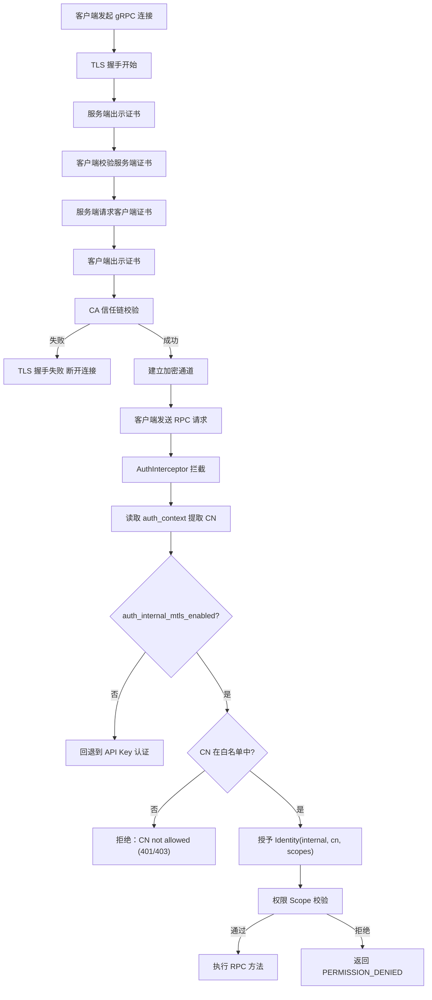

# 生产安全加固设计文档

> **版本**：v16.0.0  
> **适用范围**：`PrivShield` 核心算力引擎（`engine`）、企业级中台微服务群（`service-hub` / `datasource-mgr` / `audit-log`）、控制台与双 BFF 体系（`bff-go` / `app-lz`）。  
> **核心目标**：定义 TLS 1.3/mTLS 传输安全、mTLS CN 白名单动态热重载认证鉴权、速率限制、全栈 9 层中间件纵深防 DDoS、SM4-GCM 快照信封加密与 9 要素密码学哈希链防篡改存证的技术架构与实现细节。

---

## 目录

- [1. 概述](#1-概述)
- [2. 设计目标](#2-设计目标)
- [3. 威胁模型与缓解措施](#3-威胁模型与缓解措施)
- [4. 总体架构](#4-总体架构)
- [5. 模块设计与实现细节](#5-模块设计与实现细节)
  - [5.1 配置管理 (security/config.py)](#51-配置管理-securityconfigpy)
  - [5.2 TLS 传输层参数生成 (security/tls.py)](#52-tls-传输层参数生成-securitytlspy)
  - [5.3 身份模型与 Scope 权限映射 (security/identity.py)](#53-身份模型与-scope-权限映射-securityidentitypy)
  - [5.4 认证与鉴权依赖 (security/auth.py)](#54-认证与鉴权依赖-securityauthpy)
  - [5.5 速率限制引擎 (security/ratelimit.py)](#55-速率限制引擎-securityratelimitpy)
- [6. mTLS 白名单认证鉴权体系](#6-mtls-白名单认证鉴权体系)
  - [6.1 原理与双层校验模型](#61-原理与双层校验模型)
  - [6.2 gRPC 与 REST 认证流程](#62-grpc-与-rest-认证流程)
  - [6.3 白名单管理器 (WhitelistManager) 与 5 秒热重载](#63-白名单管理器-whitelistmanager-与-5-秒热重载)
  - [6.4 Fail-Closed 安全设计](#64-fail-closed-安全设计)
- [7. Go 共享微服务安全栈 (pkg/)](#7-go-共享微服务安全栈-pkg)
  - [7.1 9 层统一中间件栈与纵深防 DDoS](#71-9-层统一中间件栈与纵深防-ddos)
  - [7.2 SM4-GCM 快照信封加密 (pkg/crypto)](#72-sm4-gcm-快照信封加密-pkgcrypto)
  - [7.3 9 要素密码学哈希链 (services/audit-log)](#73-9-要素密码学哈希链-servicesaudit-log)
- [8. 部署与运维约定](#8-部署与运维约定)
- [9. 标准错误码矩阵](#9-标准错误码矩阵)

---

## 1. 概述

本文档定义 `PrivShield` 生产安全模块的技术架构、设计原理与实现细节。该模块为 REST 与 gRPC 双协议提供可选的传输安全、身份认证、权限鉴权与速率限制能力。

---

## 2. 设计目标

- 为 REST/gRPC 提供可选的服务器端 TLS，gRPC 额外支持可选的 mTLS。
- 区分内部服务与外部服务两类身份，按最小权限原则控制接口访问。
- 基于调用者身份与接口路径/方法进行速率限制。
- 构建全栈防 DDoS 纵深防御（慢速连接拦截、大包切断、IP 令牌桶限流、并发容量硬顶）。
- 实施数据源输入沙箱与存储边界防御（LFI 防护、异常脱敏、SQL 分页夹紧）。
- 所有安全能力默认平滑兼容，核心开关通过环境变量显式开启。

---

## 3. 威胁模型与缓解措施

| 威胁类型 | 攻击场景 / 风险 | 缓解措施与防御层级 |
|---|---|---|
| **链路窃听** | 窃听隐私数据、脱敏结果与预算请求 | REST/gRPC 强制开启 TLS 1.3 / HTTPS / gRPCs |
| **中间人篡改** | 伪造调用方身份消耗隐私预算 | mTLS 双向证书 CA 信任链 + 客户端 CN 白名单校验 |
| **越权调用** | 外部租户越权调用高敏差分隐私或销毁接口 | Bearer API Key 恒定时间防时序攻击鉴权 + Scope 细粒度校验 |
| **慢速攻击 (Slowloris)** | 攻击者以极慢速度发送 Header/Body 挂起连接池 | 服务端强制配置 `ReadHeaderTimeout: 5s`、`ReadTimeout: 30s` 与 `MaxHeaderBytes: 1MB` |
| **大包 DoS (Payload Attack)** | 传入超大 JSON/CSV 造成内存耗尽 (OOM) | `MaxBodySize` (32MB/64MB) + `http.MaxBytesReader` 超限切断并返回 413 |
| **应用层 Flood** | 单 IP 突发数千 QPS 刷爆 CPU | `pkg/middleware.RateLimit` IP 令牌桶限流 (429 + Retry-After) |
| **并发协程耗尽** | 大规模并发连接打满 Goroutine 线程池 | `pkg/middleware.MaxConcurrent` 信号量硬顶 (503 快速失败) |
| **任意文件包含 (LFI)** | CSV 数据源路径穿越读取系统敏感文件 | 强制 `.csv` 后缀白名单、`filepath.Base` 提取与沙箱目录校验 |
| **敏感信息泄露** | 服务端 Panic 返回完整堆栈给客户端 | `pkg/middleware.Recovery` 堆栈收敛至服务端内部日志，对外返回脱敏 JSON |
| **SQL 越界查询** | 超大 Limit 或负数 Offset 拖垮 SQLite | `validation.ParsePagination` 强制 Limit (1~10000) 与 Offset (>=0) |
| **K8s 探针误判** | 健康检查因无凭证导致 Pod 被误重启 | `/health` 与 `Health` 默认保持匿名放行与不限速 |

---

## 4. 总体架构

```mermaid
graph TD
    subgraph ClientAndIngress [外部流量与云原生入口]
        Ingress[K8s Ingress / Envoy<br/>Rate-Limit: 100 RPS / 50 Conn]
    end

    subgraph GoMicroservices [中台微服务群与 BFF]
        BFF[console/bff-go & app-lz]
        Hub[services/service-hub]
        DS[services/datasource-mgr]
        Audit[services/audit-log]
        PkgSec[pkg/middleware<br/>CORS / Auth / RateLimit / MaxBodySize / MaxConcurrent / Recovery]
        BFF & Hub & DS & Audit --- PkgSec
    end

    subgraph EngineSecurity [Go 核心算力引擎 (engine-go)]
        REST[Gin REST :8079]
        GRPC[gRPC Server :50051]
        SEC[Security Layer<br/>TLS / mTLS / APIKey / 32-Shard TokenBucket / WhitelistManager]
        REST --> SEC
        GRPC --> SEC
    end

    Ingress --> BFF
    BFF -->|gRPC mTLS| GRPC
    BFF & Hub -->|REST TLS| REST
    Hub --> DS & Audit
```

安全层对 Go 核心算力引擎与 Go 中台微服务群提供统一协同治理：

- **Go 算力层 (`engine-go/internal/security/`)**：`security.go` 证书参数构造、`auth.go` / `ratelimit.go` Gin 中间件与 gRPC Interceptor、`whitelist.go` mTLS CN 白名单（5s mtime 热重载）；
- **Go 微服务群 (`pkg/middleware/`)**：`ratelimit.go` (IP 令牌桶限流 + MaxBodySize + MaxConcurrent)、`auth.go` (恒定时间 Bearer 鉴权)、`envelope.go` (统一错误信封)、`trace.go` (全链路追踪 TraceMiddleware)、`middleware.go` (CORS、Request ID、结构化日志、Recovery 异常脱敏与 Security Headers)。所有中间件错误响应统一使用 `AbortWithError()` 输出信封格式。

---

## 5. 模块设计与实现细节

### 5.1 配置管理 (`security/config.py`)

使用 Pydantic v2 `BaseModel` 解析环境变量：

```python
class SecuritySettings(BaseModel):
    tls_enabled: bool = False
    tls_cert_file: Path | None = None
    tls_key_file: Path | None = None
    tls_ca_file: Path | None = None
    tls_client_auth: Literal["none", "optional", "require"] = "none"
    tls_key_password: str | None = None

    auth_enabled: bool = False
    auth_internal_mtls_enabled: bool = False
    auth_mtls_allowed_cns: list[str] = Field(default_factory=list)
    auth_mtls_whitelist_file: Path | None = None  # YAML 配置文件路径（可选）
    internal_keys: dict[str, KeyConfig] = Field(default_factory=dict)
    external_keys: dict[str, KeyConfig] = Field(default_factory=dict)

    rate_limit_enabled: bool = False
    rate_limit_default_rps: float = 10.0
    rate_limit_default_burst: float = 20.0
    rate_limit_per_endpoint: dict[str, RateLimitConfig] = Field(default_factory=dict)
    rate_limit_redis_url: str | None = None

    health_no_auth: bool = True
    health_no_rate_limit: bool = True
```

### 5.2 TLS 传输层参数生成 (`security/tls.py`)

#### REST
```python
def uvicorn_ssl_kwargs(settings: SecuritySettings) -> dict:
    return {
        "ssl_keyfile": str(settings.tls_key_file),
        "ssl_certfile": str(settings.tls_cert_file),
        "ssl_keyfile_password": settings.tls_key_password,
        "ssl_cert_reqs": _map_client_auth(settings.tls_client_auth),
        "ssl_ca_certs": str(settings.tls_ca_file) if settings.tls_ca_file else None,
    }
```

#### gRPC
```python
def grpc_server_credentials(settings: SecuritySettings) -> grpc.ServerCredentials:
    private_key = settings.tls_key_file.read_bytes()
    certificate_chain = settings.tls_cert_file.read_bytes()
    if settings.tls_client_auth == "require":
        root_certificates = settings.tls_ca_file.read_bytes()
        return grpc.ssl_server_credentials(
            ((private_key, certificate_chain),),
            root_certificates=root_certificates,
            require_client_auth=True,
        )
    return grpc.ssl_server_credentials(((private_key, certificate_chain),))
```

### 5.3 身份模型与 Scope 权限映射 (`security/identity.py`)

```python
@dataclass(frozen=True)
class Identity:
    service_type: Literal["internal", "external"]
    name: str
    scopes: list[str]

    def has_permission(self, permission: str) -> bool:
        return "*" in self.scopes or permission in self.scopes
```

#### Engine 权限映射（`PermissionForRESTPath`）

支持 `/v1/*` 与 `/api/v1/*` 双前缀（别名路由归一化后统一匹配），以及根路径直调别名。

| REST 路径 / gRPC 方法 | 对应权限 Scope |
|---|---|
| `/health`, `/livez`, `/readyz` / `Health` | `health:read` |
| `/v1/privacy/mask*`, `/api/v1/mask*`, `/privacy/process_file` / `Mask`, `MaskRecord` | `privacy:mask` |
| `/v1/privacy/hash`, `/api/v1/hash/hmac` / `Hash` | `privacy:hash` |
| `/v1/privacy/dp/*`, `/v1/privacy/ldp/*`, `/api/v1/dp/*`, `/api/v1/ldp/*` / `DPCount`, `DPSum`, `DPMean` | `privacy:dp` |
| `/v1/privacy/k_anonymize*`, `/api/v1/kano/*` / `KAnonymizeRecord` | `privacy:kano` |
| `/v1/privacy/qol/*`, `/api/v1/qol/*` / `ObfuscateQuery` | `privacy:qol` |
| `/v1/privacy/budget`, `/v1/privacy/budget/reset`, `/api/v1/budget`, `/api/v1/budget/reset` | `privacy:budget` |
| `/v1/privacy/profile/recommend` | `privacy:profile` |
| `/v1/privacy/classify/*`, `/api/v1/classify*` | `classification:read` |
| `/v1/dynclassification/classify*`, `/v1/dynclassification/eval_record`, `/api/v1/dynclassification/*` | `dynclassification:read` |
| `/v1/dynclassification/profiles/reload`, `/v1/dynclassification/generate_profile` | `dynclassification:write` |
| `/v1/agent/process`, `/api/v1/agent/process`, `/agent/process` | `agent:process` |
| `/v1/medical/*`, `/api/v1/medical/*`, `/medical/process` | `medical:process` |
| `/v1/ops/*`, `/api/v1/ops/*`, `/ops/diagnostics` | `ops:diagnostics` |
| `/debug/pprof*` | `ops:admin` |

#### service-hub 权限映射（`ServiceHubPermissionForPath`）

| REST 路径 | 对应权限 Scope |
|---|---|
| `/api/hub/status`, `/api/hub/tasks`, `/api/hub/tasks/:id`, `/api/hub/pipeline` | `hub:read` |
| `/api/hub/dispatch`, `/api/hub/classify` | `hub:dispatch` |
| `/health`, `/readyz`, `/api/health`, `/metrics` | 无需特定权限（已认证即可） |

### 5.4 认证与鉴权依赖 (`security/auth.py`)

- **API Key 认证**：从 `Authorization: Bearer <token>` 提取，使用 `secrets.compare_digest` 恒定时间比较；
- **FastAPI 依赖**：`get_current_identity` 与 `require_permission(scope)`；
- **gRPC Interceptor**：`AuthInterceptor` 在 `intercept_service` 中拦截并校验 metadata/auth_context。

### 5.5 速率限制引擎 (`security/ratelimit.py`)

- **限流键**：`f"{identity.name}:{method_or_path}"`；
- **后端适配**：支持内存滑动窗口与 Redis 分布式共享存储（`PRIVACY_RATE_LIMIT_REDIS_URL`）；
- **响应**：REST 超速返回 `429 Too Many Requests`，gRPC 超速返回 `grpc.StatusCode.RESOURCE_EXHAUSTED`。

---

## 6. mTLS 白名单认证鉴权体系

### 6.1 原理与双层校验模型

| 层级 | 校验内容 | 作用 |
|------|---------|------|
| **传输层**（TLS 握手） | 客户端证书是否由受信任 CA 签发 | 证明客户端持有合法证书（CA 信任链校验） |
| **应用层**（CN 白名单） | 证书 Common Name（CN）是否在白名单中 | 证明客户端被**明确授权**访问本服务 |

### 6.2 gRPC 与 REST 认证流程



### 6.3 白名单管理器 (WhitelistManager) 与 5 秒热重载

- **Per-CN Scope 控制**：支持在 `config/mtls-whitelist.yaml` 中为每个 CN 单独配置 `scopes: ["*"]` 或 `scopes: ["health:read"]`；
- **动态热重载**：基于文件 `mtime` 轮询（Go 端 5 秒轮询，Python 端每次请求被动比对），修改配置后**无需重启服务即可立即生效**。

### 6.4 Fail-Closed 安全设计

| 配置项 | 默认值 | Fail-Closed 行为 |
|--------|--------|------------------|
| `auth_internal_mtls_enabled` | `false` | 即使客户端证书通过 CA 校验，也不授予内部身份 |
| `auth_mtls_allowed_cns` | `[]` | 即使启用了 mTLS 认证，白名单为空时拒绝所有证书 |
| `tls_client_auth` | `"none"` | 不请求客户端证书，不启用 mTLS |

---

## 7. Go 共享微服务安全栈 (`pkg/`)

### 7.1 9 层统一中间件栈与纵深防 DDoS

所有 Go 微服务统一挂载 9 层中间件栈：
```text
TraceMiddleware ➔ StructuredLogger ➔ Recovery ➔ SecurityHeaders ➔ MaxBodySize ➔ MaxConcurrent ➔ RateLimit ➔ CORS ➔ Auth
```
1. **Slowloris 防护**：`ReadHeaderTimeout: 5s` + `MaxHeaderBytes: 1MB`；
2. **大包防御**：`MaxBodySize` 限制 32MB / 64MB，超限返回 `413 Payload Too Large`；
3. **IP 令牌桶限流**：`RateLimit(rps, burst)` 自动回收闲置 IP 桶，超限返回 `429 Too Many Requests`；
4. **并发容量硬顶**：`MaxConcurrent(limit)` 限制在途最大请求数，超载快速失败返回 `503 Service Unavailable`；
5. **异常脱敏**：`Recovery` 捕获 Panic 并向客户端返回通用错误信封，堆栈收敛至内部日志。

### 7.2 SM4-GCM 快照信封加密 (`pkg/crypto`)

脱敏出域快照落盘前执行 SM4-GCM 信封加密：
```text
enc:v1:<Base64(12B Nonce + Ciphertext + 16B Tag)>
```
密钥由环境变量 `AUDIT_LOG_ENCRYPTION_KEY` 派生，读取时透明还原。

### 7.3 9 要素密码学哈希链 (`services/audit-log`)

$$\text{IntegrityHash} = \text{SHA256}(\text{prev\_hash} \parallel \text{id} \parallel \text{task\_id} \parallel \text{api\_code} \parallel \text{datasource\_id} \parallel \text{timestamp} \parallel \text{input\_hash} \parallel \text{output\_hash} \parallel \text{algorithm})$$
形成严格的区块链式链式锚定，提供秒级在线核验（`POST /api/audit/chain/verify`）。

---

## 8. 部署与运维约定

- **证书挂载**：服务端证书与私钥挂载于 `/certs/server.crt` 与 `/certs/server.key`；CA 证书挂载于 `/certs/ca.crt`；
- **健康检查探针豁免**：K8s `livenessProbe` 与 `readinessProbe` 访问 `/health` 默认保持匿名放行与免限流；
- **分布式共享限流**：单副本使用内存计数器，多副本时配置 `PRIVACY_RATE_LIMIT_REDIS_URL`。

---

## 9. 标准错误码矩阵

| 场景 | REST 响应 | gRPC 响应 |
|---|---|---|
| 未认证 / 凭证失效 | `401 Unauthorized` | `UNAUTHENTICATED` |
| 权限不足 / 越权 | `403 Forbidden` | `PERMISSION_DENIED` |
| 速率超限 (Rate Limit) | `429 Too Many Requests` | `RESOURCE_EXHAUSTED` |
| 并发超载 (MaxConcurrent) | `503 Service Unavailable` | `UNAVAILABLE` |
| 请求体超大 (MaxBodySize) | `413 Payload Too Large` | `INVALID_ARGUMENT` |
| 非法数据源标识 | `400 Bad Request` | `INVALID_ARGUMENT` |
| TLS 握手失败 | SSL/TLS 连接断开 | `UNAVAILABLE` |