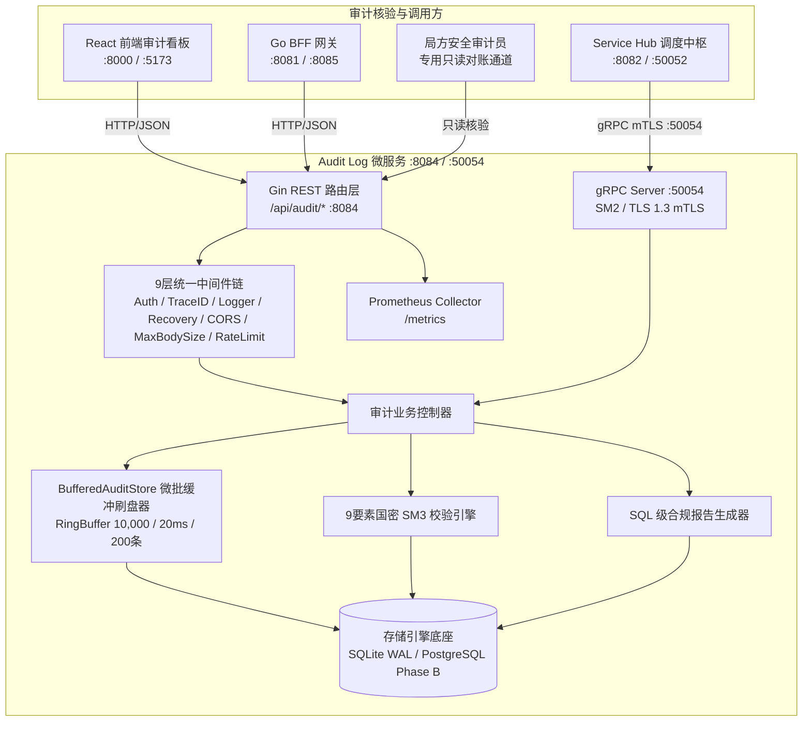
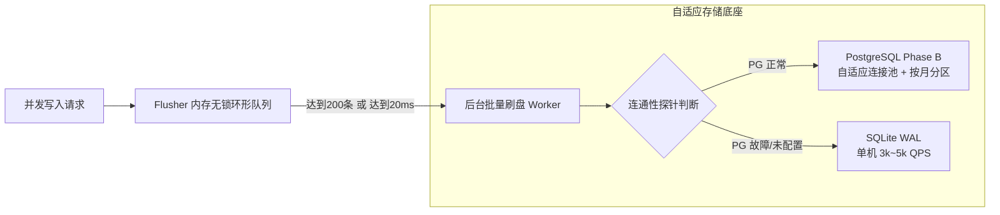

# 脱敏审计日志与存证 (Audit Log) — 详细设计文档

> 本文档定义 **数联天下 · 数盾 (`PrivShield`)** 脱敏审计日志与存证模块（`services/audit-log`）的系统架构、双协议服务模型（REST + gRPC）、国密商用密码体系（SM2/SM3/SM4）、9 要素连续防篡改哈希链、内存微批聚合刷盘（3k~5k QPS）与存储自适应容灾架构。

---

## 1. 背景与业务定位

在国家《数据安全法》、《个人信息保护法》与《GB/T 39786-2021 密码应用基本要求（第三级）》合规要求下，数据流通全链路必须具备**「可追溯、防篡改、抗抵赖」**的法定审计存证能力。**脱敏审计日志与存证服务 (Audit Log)** 作为独立的安全审计节点，承担着以下核心职责：

1. **双协议接入（REST + gRPC）**：对外提供标准 HTTP REST API（端口 `:8084`）供前端控制台访问，同时对内提供高性能 gRPC 接口（端口 `:50054`）供 `service-hub` 调度中枢与微服务集群直接写入审计存证；
2. **零信任 mTLS 与国密认证**：gRPC 通道支持 TLS 1.3 / 国密 SM2 双向证书认证（mTLS），并内置动态 CN 白名单鉴权，杜绝跨网络越权与未授权写入；
3. **9 要素国密 SM3 连续防篡改哈希链**：采用国密 **SM3 算法（GM/T 0004-2012 / GB/T 32918）** 将 `log_id`、`prev_hash`、`timestamp`、`algorithm`、`input_hash`、`output_hash`、`user`、`security_level`、`params_json` 九大审计要素进行链式绑定，形成区块链式不可篡改账本；支持通过 `SetAuditChainKey` 升级为 HMAC-SM3 密钥化存证；
4. **快照样本国密 SM4-GCM 信封加密**：对出域快照数据执行应用层 SM4-GCM 动态信封加密（`enc:v1:...`），确保审计库自身零明文隐私泄露；
5. **内存微批聚合刷盘 (`pkg/store/flusher`)**：通过内存无锁环形队列 + 定量(200条)/定时(20ms)微批刷盘机制，将单机 SQLite 写入性能推升至 **3,000 ~ 5,000 QPS**，且优雅停机保证 100% 刷盘零丢数据；
6. **存储底座自适应与平滑容灾**：支持 PostgreSQL Phase B 分布式存证，具备**自动连通性探针回退**（PG 故障/未配置平滑回退 SQLite WAL）、**基于 CPU 核心数自适应连接池**与**按月自动分区索引预建**；
7. **全链在线验真与合规报告**：提供 `POST /api/audit/chain/verify` 毫秒级全链连续性验真接口与 SQL 级合规报告（`GenerateReport`）。

---

## 2. 总体架构拓扑



---

## 3. 国密 mTLS 与防篡改存证流程


---

## 4. 连续防篡改哈希链 (Hash Chain) 与 9 要素国密 SM3 完整性

为了彻底防止特权用户物理删除/篡改中间日志行或注入虚假记录，系统引入了**前序哈希链（Blockchain-like Linked Hash Chain）**。主审计日志的完整性哈希 `integrity_hash` 由 `pkg/store.ComputeAuditIntegrityHash` 计算，覆盖以下 9 个审计要素：

```
prev_hash | log_id | timestamp | algorithm | input_hash | output_hash | user | security_level | params_json
```

前映像按 UTC RFC3339Nano 归一化，消除 PostgreSQL `TIMESTAMPTZ` 时区偏移导致的伪分叉：

```go
payload := fmt.Sprintf("%s|%s|%s|%s|%s|%s|%s|%s|%v",
    prevHash, logID, timestamp.UTC().Format(time.RFC3339Nano), algorithm,
    inputHash, outputHash, user, securityLevel, paramsJSON)
```

### 4.1 主日志完整性哈希

`ComputeAuditIntegrityHash` 的执行逻辑：

1. 使用 UTC 归一化的 9 要素前映像。
2. 若进程启动时通过 `pkg/store.SetAuditChainKey(key)` 注入了 HMAC 密钥，则对 `"SM3-HMAC:v1|" + payload` 计算 **HMAC-SM3**，输出 64 位小写十六进制摘要。HMAC 密钥由局方托管且不在数据库中存储，持有数据库写权限的攻击者无法伪造合法哈希。
3. 未配置密钥时回退到无密钥 **SM3**，仅可证明内容未被修改，不能阻止知情者重算，因此生产环境必须配置密钥。

规范的算法标签通过 `ComputeAuditIntegrityHashAlgo` 返回：

- 配置密钥后：`SM3-HMAC:v1`
- 无密钥态：`SM3`
- 历史存量兼容：`SHA256`（带 `-LEGACY` 后缀）

`VerifyAuditIntegrityHash` 按「当前密钥化 HMAC-SM3 → 无密钥 SM3-UTC → SHA-256-UTC → SM3-LocalTZ → SHA-256-LocalTZ」的顺序多轨核验，确保密钥升级前的历史证据仍然可验。

### 4.2 快照完整性哈希（P0 修复）

每条 `SnapshotRecord` 不再直接复制父日志的 `integrity_hash`，而是由 `pkg/store.ComputeSnapshotIntegrityHash` 计算**独立的完整性哈希**，覆盖快照自身字段：

```
prev_hash | snapshot_id | audit_log_id | timestamp | algorithm | input_sample | output_sample | parameters_json
```

其中：

- `snapshot.prev_hash` 指向父日志的 `integrity_hash`，形成 **日志主链 → 快照子链** 的二级链式结构。
- `input_sample` / `output_sample` 参与哈希计算，即使样本被替换为另一段有效 SM4-GCM 密文，也会破坏快照完整性哈希。
- 验证入口 `VerifySnapshotIntegrityHash` 优先校验新的独立快照哈希，并保留旧版「继承自主日志哈希」的兼容性回退。

### 4.3 输入/输出哈希强制由调用方提供（P0 修复）

`input_hash` 与 `output_hash` 必须是调用方对实际输入/输出数据内容计算的密码学摘要（推荐 SM3）。REST（`services/audit-log/internal/handlers/handlers.go`）与 gRPC（`services/audit-log/internal/grpcserver/server.go`）写入接口已删除服务端兜底计算：

- `input_hash` 为空时直接返回 `INVALID_ARGUMENT`。
- `output_hash` 为空时直接返回 `INVALID_ARGUMENT`。

### 4.4 全链对账核验与序列号（P1 修复）

`VerifyChain` 默认行为（`limit <= 0`）已改为验证全表记录，返回 `total_records` 并与实际核验条数比对：

- 若 `limit` 未指定或为 0，扫描全部记录；
- 若 `limit > 0`，最多核验 `limit` 条（上限 100,000）。

`ChainVerificationResult` 包含 `total_records` 与 `total_verified`：

- 当全量验证发现 `total_verified < total_records` 时，返回 `valid=false` 并提示可能存在物理删除。
- PostgreSQL 实现按单调递增的 `seq` 列排序（`ORDER BY seq ASC`），SQLite 实现按 `rowid ASC` 排序，避免时钟回拨或相同时间戳导致的顺序错乱。

`audit_logs` 表已增加 `seq` 列（PostgreSQL `BIGSERIAL`，SQLite 在写入时通过 `COALESCE(MAX(seq), 0) + 1` 分配），用于确定链式验证顺序并辅助检测记录缺失。

* **创世存证与链式关联**：第一条记录的 `prev_hash` 为空；后续每条记录在生成时自动关联上一条记录的 `integrity_hash`。
* **单一权威裁定**：`pkg/store/flusher.BufferedAuditStore.SaveLogWithSnapshot` 在服务端持锁强制覆盖调用方传入的 `prev_hash` 与 `integrity_hash`，彻底杜绝写入端与存储端哈希分叉。

---

## 5. 快照样本应用层国密 SM4-GCM 信封加密

快照表（`snapshots`）存储了脱敏前后的数据样本（`input_sample` 与 `output_sample`）。为了彻底避免审计数据库本身成为敏感 PII 泄露源，系统引入了应用层 **国密 SM4-GCM 信封加密**：

1. **落盘加密**：配置 `AUDIT_LOG_ENCRYPTION_KEY`（或 `PRIVACY_AUDIT_KEY`）后，样本在入库前自动以随机 12-byte Nonce 进行 SM4-GCM 加密，存储格式为 `enc:v1:<base64>`；
2. **透明解密**：仅在经过认证与鉴权的 API 调用方查询快照时，在内存中动态解密呈现；
3. **向后兼容**：未加密的历史遗留样本与未配置密钥环境平滑兼容。
4. **快照独立完整性哈希**：快照入库时由 `pkg/store.ComputeSnapshotIntegrityHash` 计算自身完整性哈希，将 `input_sample` / `output_sample` 纳入前映像，并与父日志 `integrity_hash` 绑定，防止密文样本被替换后仍验证通过。

---

## 6. 微批聚合刷盘与存储自适应容灾架构



1. **内存微批聚合刷盘 (`pkg/store/flusher`)**：
   * 采用无锁 Channel 环形缓冲队列（默认容量 10,000）；
   * 将单条并发写入聚合成 `SaveLogsBatch` 单事务批量写入，化解 SQLite 单写者锁竞争；
   * 优雅停机时触发同步 `Flush()`，确保剩余存证 100% 刷盘，零数据丢失。
2. **自适应连接池与自动分区 (PostgreSQL Phase B)**：
   * `NewAuditStore` 启动时自动根据 `runtime.NumCPU()` 计算最佳连接池连接数（`MaxConns: 20~100`, `MinConns: 4~20`）；
   * `AutoEnsurePartitions` 启动及日常维护时自动预建未来 3 个月的时间范围分区索引。
3. **自动连通性探针回退 (Self-healing Fallback)**：
   * 配置 `AUDIT_LOG_PG_DSN` 时以 3 秒超时进行连接探针测试；若 PG 不可达，自动安全回退至 SQLite WAL 模式，确保服务高可用。

---

## 7. 业务合规存证与基础设施运维日志 (Loki / ELK) 的架构定位辨析

在系统总体架构与运维体系中，必须清晰区分 **「业务级数据脱敏合规存证」** 与 **「基础设施级运行日志聚合 (如 Grafana Loki / ELK)」** 两个维度的概念：

### 7.1 核心差异矩阵

| 维度 | `services/audit-log` (业务存证中台) | Grafana Loki / ELK (运维日志平台) |
|---|---|---|
| **核心定位** | **业务合规与法律证据**（解决“谁在何时对什么数据执行了何种脱敏”的法定合规溯源） | **系统运维与故障排查**（解决“服务是否健康、报错堆栈为何、请求延迟与网络抖动”的 SRE 观测） |
| **存储内容** | 9 要素国密 SM3 连续哈希链、输入输出 SM3 摘要、SM4-GCM 密文快照 | 容器与进程标准输出 stdout / stderr 的非结构化/半结构化文本或 JSON |
| **密码学防篡改** | **链式防篡改**（国密 SM3 连续哈希链 + 动态核验对账接口，杜绝任何删改） | **不具备**（日志以分块 Chunk 或倒排索引存储，依赖存储介质本身的写保护） |
| **法律合规效力** | 满足《数据安全法》第二十七条、《个人信息保护法》第六十九条与 GB/T 39786-2021 | 面向运维与内部分析，通常不具备直接的抗抵赖与司法存证签名能力 |
| **存储底座** | 独立 SQLite WAL 读写分离引擎 / 专用关系型 PostgreSQL 存证库（Append-Only） | 分布式对象存储（S3/MinIO）+ 索引存储（BoltDB/Cassandra/DynamoDB） |
| **查询接口** | 结构化 RESTful API (`:8084`) + 高并发 gRPC 接口 (`:50054`) | LogQL / Kibana 查询语言与 Grafana 仪表盘 |

---

## 8. SQL 级多维统计与合规报告生成机制

为了防范大批量历史存证导致内存溢出 (OOM)，系统采用 SQL 原生聚合查询实现高性能统计：

```sql
-- 统计总操作数与平均耗时
SELECT COUNT(*), COALESCE(AVG(duration_ms), 0) FROM audit_logs;

-- 按治理算子聚合
SELECT operation, COUNT(*) FROM audit_logs GROUP BY operation;

-- 按数据敏感等级聚合 (L1~L5)
SELECT security_level, COUNT(*) FROM audit_logs GROUP BY security_level;
```

---

## 9. 存储引擎设计与 Append-Only 不可篡改约束

- **SQLite WAL 并发模式**：写操作通过写前日志 (Write-Ahead Log) 顺序追加，读操作完全无锁并发，配合 `flusher` 微批刷盘提供极高吞吐存证写入能力。
- **只增不改 (Append-Only) 热链约束**：
  - 正常写入路径仅暴露 `SaveLog`、`SaveLogWithSnapshot`、`SaveLogsBatch`、`GetLog`、`ListLogs`、`SaveSnapshot`；
  - 核心业务层不提供任何 `Update` 或单行 `Delete` 接口，从代码级根绝人为篡改或删除在线热链记录的可能。
- **归档冷链删除**：物理删除仅通过 `store.AuditArchiveReader` 接口（`FetchOldestForArchive` / `DeleteLogsByIDs`）执行，且必须在完成 WORM/归档后按已归档 ID 精确删除。删除动作本身也建议写入审计日志，使删除事件被纳入哈希链监管。

---

## 10. 防篡改性已知缺陷与改进建议

> 本节说明审计存证模块历史上存在的关键缺陷及其修复状态，并列出仍需后续跟进的改进建议。

### 10.1 已修复的关键缺陷

#### 10.1.1 快照完整性哈希未覆盖样本内容（P0）

**历史缺陷**

早期实现中，`SnapshotRecord.IntegrityHash` 与 `PrevHash` 直接复制自主日志（旧版 `pkg/store/flusher/flusher.go`）：

```go
s.PrevHash = log.PrevHash
s.IntegrityHash = log.IntegrityHash
```

主日志完整性哈希 `ComputeAuditIntegrityHash` 的输入仅覆盖 9 个审计要素，**完全不包含快照字段**（`input_sample`、`output_sample`、`snapshot.id`）。因此攻击者可替换加密样本，而验证仍用主日志字段重算并通过。

**修复方案**

- `pkg/store.ComputeSnapshotIntegrityHash` 为快照计算**独立完整性哈希**，覆盖 `snapshot_id`、`audit_log_id`、`prev_hash`、`timestamp`、`algorithm`、`input_sample`、`output_sample`、`parameters_json`；若配置了 HMAC 密钥，使用 HMAC-SM3。
- `snapshot.prev_hash` 指向父日志的 `integrity_hash`，形成 **日志主链 → 快照子链** 的二级链式结构。
- `pkg/store.VerifySnapshotIntegrityHash` 优先校验快照自身字段，并保留旧版「继承自主日志哈希」的兼容性回退。

#### 10.1.2 输入/输出哈希存在"元数据哈希"回退（P0）

**历史缺陷**

`services/audit-log/internal/handlers/handlers.go` 与 `services/audit-log/internal/grpcserver/server.go` 曾允许调用方省略 `input_hash` / `output_hash`，服务端用仅含数据源 ID、行数、用户、参数的元数据兜底计算，不覆盖实际输入/输出数据内容。

**修复方案**

- 写入接口已删除兜底逻辑；`input_hash` 或 `output_hash` 为空时直接返回 `INVALID_ARGUMENT`。
- 调用方必须提供对真实输入/输出数据内容的密码学摘要（推荐 SM3 或 SHA-256）。

#### 10.1.3 PostgreSQL 验证按 `timestamp` 排序（P1）

**历史缺陷**

PostgreSQL 实现曾按 `timestamp ASC` 对 `VerifyChain` 排序。当时钟回拨、多条记录时间戳相同或被插入伪造历史记录时，排序结果可能与实际插入顺序不一致，导致伪断链或被绕过。

**修复方案**

- `audit_logs` 表新增单调递增的 `seq` 列（PostgreSQL `BIGSERIAL`，SQLite 写入时通过 `COALESCE(MAX(seq), 0) + 1` 分配）。
- PostgreSQL `VerifyChain` 改为 `ORDER BY seq ASC`；SQLite 沿用 `ORDER BY rowid ASC`。
- `VerifyChain(limit <= 0)` 默认扫描全表，返回 `total_records`；当全量验证发现 `total_verified < total_records` 时，返回 `valid=false` 提示可能存在物理删除。

#### 10.1.4 验证接口默认仅检查最近记录（P1）

**历史缺陷**

`VerifyChain` 默认 `limit=1000`，只验证最近 1000 条；中间记录被删除后，只要最后 1000 条完整就可能返回 `valid=true`。

**修复方案**

- `VerifyChain` 参数语义已改为：`limit <= 0` 时验证全表；`limit > 0` 时最多验证该条数（上限 100,000）。
- `ChainVerificationResult` 同时返回 `total_verified` 与 `total_records`，支持调用方检测中间缺失。

### 10.2 仍待完善的改进建议

| 优先级 | 问题 | 建议动作 | 影响 |
|---|---|---|---|
| P2 | 无 HMAC 密钥退化为普通 SM3 | 生产环境通过 `pkg/store.SetAuditChainKey` 注入密钥；`services/audit-log/internal/config` 已设置 `RequireHashKey: true`，需保证启动脚本/K8s Secret 不遗漏；历史存量可用 `pkg/store/cmd/repairchain` 重签 | 抗抵赖 |
| P2 | 物理删除与 Append-Only 宣传冲突 | 在线热链严格只增不改；归档必须通过 `store.AuditArchiveReader` 完成并写入 WORM/S3 Object Lock/MinIO WORM 后删除；删除操作本身应生成"归档删除事件"审计记录并锚定归档段哈希 | 合规 |
| P2 | 参数 JSON 序列化非确定性 | 写入前对 `parameters_json` 键按字母序规范化并去除空白；验证时始终使用数据库原始 JSON 字符串，不经过二次序列化 | 避免伪断链 |
| P3 | 定期全量巡检 | 在 `archive` 包或独立 Cron 任务中每天执行一次 `VerifyChain(0)`，将结果写入 Prometheus 指标与结构化日志 | 持续合规 |
| P3 | 分页验证增强 | 当前 `limit` 已限制上限 100,000；超大表场景可引入 `offset` + `limit` 分页验证，并返回"是否为最后一段"标识 | 可扩展性 |

### 10.3 结论

P0/P1 修复后，审计存证已具备：

1. **快照独立完整性哈希**：样本替换会破坏快照哈希；
2. **输入/输出内容哈希必填**：服务端不再接受元数据兜底哈希；
3. **单调 `seq` 列保证验证顺序**：PostgreSQL 不再依赖 `timestamp` 排序；
4. **默认全量链式验证**：`VerifyChain` 返回 `total_records` 并检测中间缺失。

剩余 P2/P3 项主要围绕 HMAC 密钥生产化、归档冷链流程完善与 JSON 参数规范化。建议优先完成 HMAC 密钥注入与归档 WORM 流程，再逐步补齐 JSON 规范化与自动巡检。
