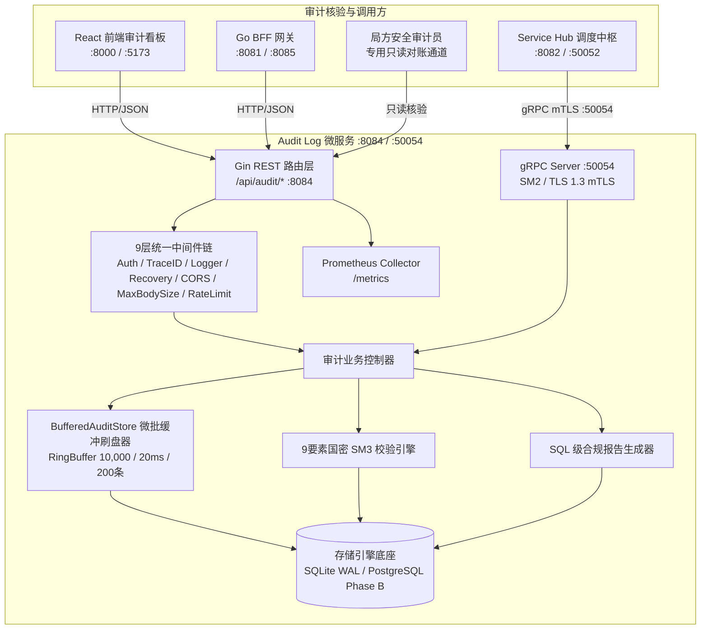
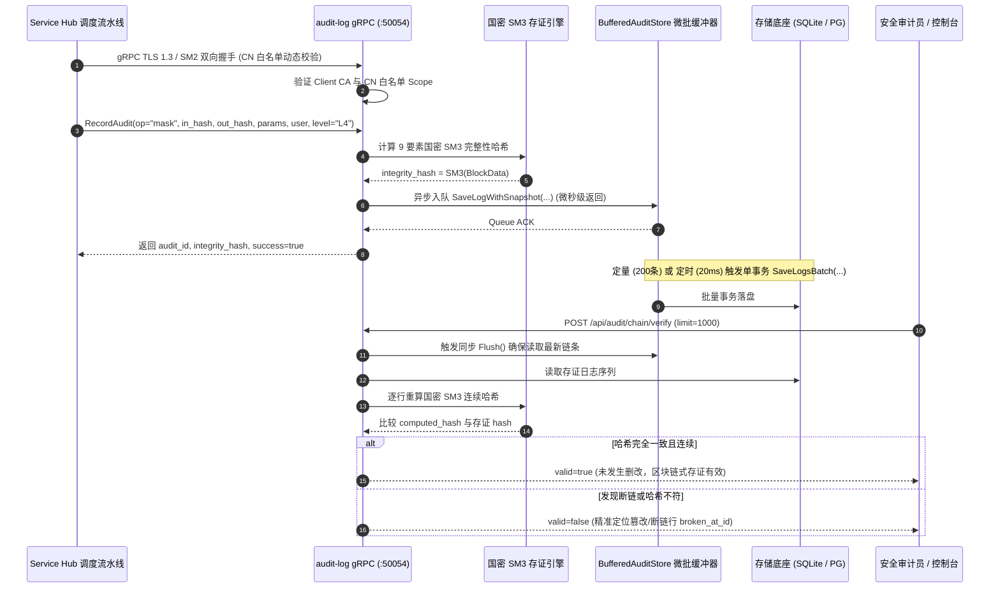
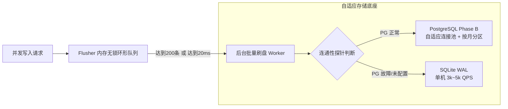

# 脱敏审计日志与存证 (Audit Log) — 详细设计文档

> 本文档定义 **数联天下 · 数盾 (`PrivShield`)** 脱敏审计日志与存证模块（`services/audit-log`）的系统架构、双协议服务模型（REST + gRPC）、国密商用密码体系（SM2/SM3/SM4）、9 要素连续防篡改哈希链、内存微批聚合刷盘（3k~5k QPS）与存储自适应容灾架构。

---

## 1. 背景与业务定位

在国家《数据安全法》、《个人信息保护法》与《GB/T 39786-2021 密码应用基本要求（第三级）》合规要求下，数据流通全链路必须具备**「可追溯、防篡改、抗抵赖」**的法定审计存证能力。**脱敏审计日志与存证服务 (Audit Log)** 作为独立的安全审计节点，承担着以下核心职责：

1. **双协议接入（REST + gRPC）**：对外提供标准 HTTP REST API（端口 `:8084`）供前端控制台访问，同时对内提供高性能 gRPC 接口（端口 `:50054`）供 `service-hub` 调度中枢与微服务集群直接写入审计存证；
2. **零信任 mTLS 与国密认证**：gRPC 通道支持 TLS 1.3 / 国密 SM2 双向证书认证（mTLS），并内置动态 CN 白名单鉴权，杜绝跨网络越权与未授权写入；
3. **9 要素国密 SM3 连续防篡改哈希链**：采用国密 **SM3 算法（GM/T 0004-2012 / GB/T 32918）** 将前序区块哈希、任务ID、接口编码、时间戳、输入输出 SM3 摘要进行链式绑定，形成区块链式不可篡改账本；
4. **快照样本国密 SM4-GCM 信封加密**：对出域快照数据执行应用层 SM4-GCM 动态信封加密（`enc:v1:...`），确保审计库自身零明文隐私泄露；
5. **内存微批聚合刷盘 (`pkg/store/flusher`)**：通过内存无锁环形队列 + 定量(200条)/定时(20ms)微批刷盘机制，将单机 SQLite 写入性能推升至 **3,000 ~ 5,000 QPS**，且优雅停机保证 100% 刷盘零丢数据；
6. **存储底座自适应与平滑容灾**：支持 PostgreSQL Phase B 分布式存证，具备**自动连通性探针回退**（PG 故障/未配置平滑回退 SQLite WAL）、**基于 CPU 核心数自适应连接池**与**按月自动分区索引预建**；
7. **全链在线验真与合规报告**：提供 `POST /api/audit/chain/verify` 毫秒级全链连续性验真接口与 SQL 级合规报告（`GenerateReport`）。

---

## 2. 总体架构拓扑



---

## 3. 国密 mTLS 与防篡改存证流程



---

## 4. 连续防篡改哈希链 (Hash Chain) 与 9 要素国密 SM3 完整性

为了彻底防止特权用户物理删除/篡改中间日志行或注入虚假记录，系统引入了**前序哈希链（Blockchain-like Linked Hash Chain）**，基于国密 SM3 算法连续递归计算：

$$\text{BlockData}_n = \text{prev\_hash}_{n-1} \parallel \text{id}_n \parallel \text{task\_id}_n \parallel \text{api\_code}_n \parallel \text{datasource\_id}_n \parallel \text{timestamp}_n \parallel \text{input\_hash}_n \parallel \text{output\_hash}_n \parallel \text{algorithm}_n$$

$$\text{IntegrityHash}_n = \text{SM3}(\text{BlockData}_n)$$

```go
func computeIntegrityHash(logID, prevHash string, timestamp time.Time, algorithm, inputHash, outputHash, user, securityLevel, paramsJSON string) string {
    data := fmt.Sprintf("%s|%s|%s|%s|%s|%s|%s|%s|%v",
        prevHash, logID, timestamp.Format(time.RFC3339Nano), algorithm,
        inputHash, outputHash, user, securityLevel, paramsJSON)
    h := sm3.Sm3Sum([]byte(data))
    return hex.EncodeToString(h[:])
}
```

* **创世存证与链式关联**：第一条记录的 `prev_hash` 为 `0000...0000` 或空；后续每条记录在生成时自动关联上一条记录的 `integrity_hash`。
* **全链对账核验**：提供 `POST /api/audit/chain/verify` 及 gRPC `VerifyChain` 接口，按时序逐行重算与比对链条连续性。任何删行、篡改或调序均会立即引起雪崩断链并精准定位断点。

---

## 5. 快照样本应用层国密 SM4-GCM 信封加密

快照表（`snapshots`）存储了脱敏前后的数据样本（`input_sample` 与 `output_sample`）。为了彻底避免审计数据库本身成为敏感 PII 泄露源，系统引入了应用层 **国密 SM4-GCM 信封加密**：

1. **落盘加密**：配置 `AUDIT_LOG_ENCRYPTION_KEY`（或 `PRIVACY_AUDIT_KEY`）后，样本在入库前自动以随机 12-byte Nonce 进行 SM4-GCM 加密，存储格式为 `enc:v1:<base64>`；
2. **透明解密**：仅在经过认证与鉴权的 API 调用方查询快照时，在内存中动态解密呈现；
3. **向后兼容**：未加密的历史遗留样本与未配置密钥环境平滑兼容。

---

## 6. 微批聚合刷盘与存储自适应容灾架构



1. **内存微批聚合刷盘 (`pkg/store/flusher`)**：
   * 采用无锁 Channel 环形缓冲队列（默认容量 10,000）；
   * 将单条并发写入聚合成 `SaveLogsBatch` 单事务批量写入，化解 SQLite 单写者锁竞争；
   * 优雅停机时触发同步 `Flush()`，确保剩余存证 100% 刷盘，零数据丢失。
2. **自适应连接池与自动分区 (PostgreSQL Phase B)**：
   * `NewAuditStore` 启动时自动根据 `runtime.NumCPU()` 计算最佳连接池连接数（`MaxConns: 20~100`, `MinConns: 4~20`）；
   * `AutoEnsurePartitions` 启动及日常维护时自动预建未来 3 个月的时间范围分区索引。
3. **自动连通性探针回退 (Self-healing Fallback)**：
   * 配置 `AUDIT_LOG_PG_DSN` 时以 3 秒超时进行连接探针测试；若 PG 不可达，自动安全回退至 SQLite WAL 模式，确保服务高可用。

---

## 7. 业务合规存证与基础设施运维日志 (Loki / ELK) 的架构定位辨析

在系统总体架构与运维体系中，必须清晰区分 **「业务级数据脱敏合规存证」** 与 **「基础设施级运行日志聚合 (如 Grafana Loki / ELK)」** 两个维度的概念：

### 7.1 核心差异矩阵

| 维度 | `services/audit-log` (业务存证中台) | Grafana Loki / ELK (运维日志平台) |
|---|---|---|
| **核心定位** | **业务合规与法律证据**（解决“谁在何时对什么数据执行了何种脱敏”的法定合规溯源） | **系统运维与故障排查**（解决“服务是否健康、报错堆栈为何、请求延迟与网络抖动”的 SRE 观测） |
| **存储内容** | 9 要素国密 SM3 连续哈希链、输入输出 SM3 摘要、SM4-GCM 密文快照 | 容器与进程标准输出 stdout / stderr 的非结构化/半结构化文本或 JSON |
| **密码学防篡改** | **链式防篡改**（国密 SM3 连续哈希链 + 动态核验对账接口，杜绝任何删改） | **不具备**（日志以分块 Chunk 或倒排索引存储，依赖存储介质本身的写保护） |
| **法律合规效力** | 满足《数据安全法》第二十七条、《个人信息保护法》第六十九条与 GB/T 39786-2021 | 面向运维与内部分析，通常不具备直接的抗抵赖与司法存证签名能力 |
| **存储底座** | 独立 SQLite WAL 读写分离引擎 / 专用关系型 PostgreSQL 存证库（Append-Only） | 分布式对象存储（S3/MinIO）+ 索引存储（BoltDB/Cassandra/DynamoDB） |
| **查询接口** | 结构化 RESTful API (`:8084`) + 高并发 gRPC 接口 (`:50054`) | LogQL / Kibana 查询语言与 Grafana 仪表盘 |

---

## 8. SQL 级多维统计与合规报告生成机制

为了防范大批量历史存证导致内存溢出 (OOM)，系统采用 SQL 原生聚合查询实现高性能统计：

```sql
-- 统计总操作数与平均耗时
SELECT COUNT(*), COALESCE(AVG(duration_ms), 0) FROM audit_logs;

-- 按治理算子聚合
SELECT operation, COUNT(*) FROM audit_logs GROUP BY operation;

-- 按数据敏感等级聚合 (L1~L5)
SELECT security_level, COUNT(*) FROM audit_logs GROUP BY security_level;
```

---

## 9. 存储引擎设计与 Append-Only 不可篡改约束

- **SQLite WAL 并发模式**：写操作通过写前日志 (Write-Ahead Log) 顺序追加，读操作完全无锁并发，配合 `flusher` 微批刷盘提供极高吞吐存证写入能力。
- **只增不改 (Append-Only) 架构约束**：
  - 数据层接口仅暴露 `SaveLog`、`SaveSnapshot`、`SaveLogsBatch`、`GetLog`、`ListLogs`；
  - 核心业务层不提供任何 `Update` 或单行 `Delete` 接口，从代码级根绝人为篡改或删除历史存证的可能。
