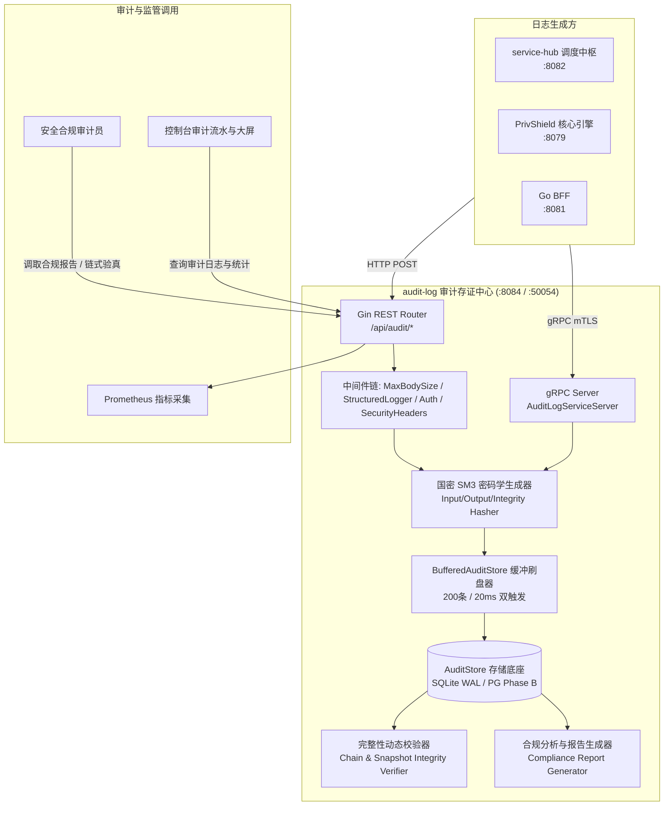
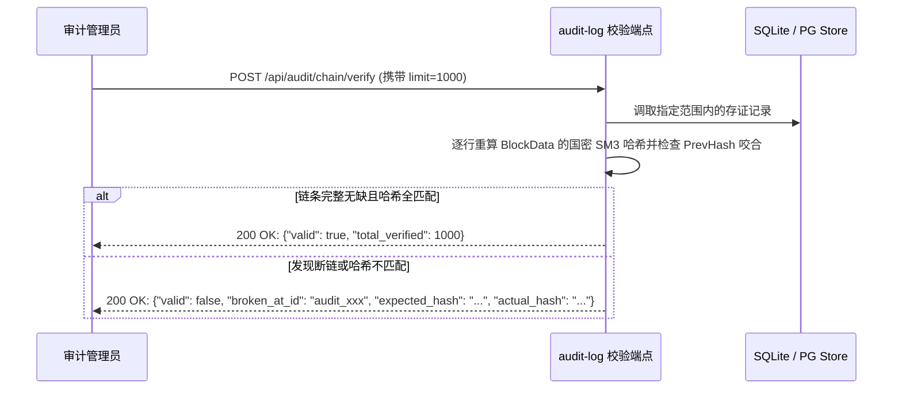
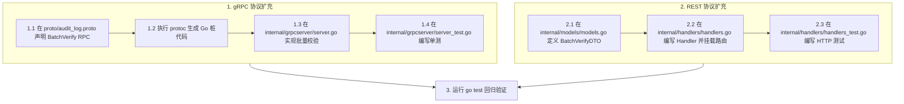

# 脱敏审计与防篡改存证服务 (audit-log) 深度学习指南

> 面向研发、合规审计师与安全架构师的完整技术指南，深入解析数联天下 · 数盾 (`PrivShield`) 脱敏审计日志、国密 SM3 密码学不可篡改存证、内存微批聚合刷盘（3k~5k QPS）、合规报告生成与核心源码实现。

---

## 目录 / Table of Contents

- [1. 模块全景与业务定位](#1-模块全景与业务定位)
- [2. 系统架构与存证拓扑图解](#2-系统架构与存证拓扑图解)
- [3. 9 要素审计存证模型与国密 SM3 防篡改原理](#3-9-要素审计存证模型与国密-sm3-防篡改原理)
  - [3.1 审计日志 9 大关键要素](#31-审计日志-9-大关键要素)
  - [3.2 国密 SM3 密码学哈希链与快照完整性校验机制](#32-国密-sm3-密码学哈希链与快照完整性校验机制)
- [4. 核心代码架构与目录结构](#4-核心代码架构与目录结构)
- [5. 核心源码深入解读](#5-核心源码深入解读)
  - [5.1 服务启动入口与生命周期 (cmd/server/main.go)](#51-服务启动入口与生命周期-cmdservermaingo)
  - [5.2 配置驱动与环境变量解析 (internal/config/config.go)](#52-配置驱动与环境变量解析-internalconfigconfiggo)
  - [5.3 REST 控制层与合规报告生成 (internal/handlers/handlers.go)](#53-rest-控制层与合规报告生成-internalhandlershandlersgo)
  - [5.4 存储引擎与 Append-only 存证 (pkg/store)](#54-存储引擎与-append-only-存证-pkgstore)
  - [5.5 内存微批异步聚合刷盘器 (pkg/store/flusher)](#55-内存微批异步聚合刷盘器-pkgstoreflusher)
  - [5.6 gRPC 高性能存证写入与 mTLS 加固 (internal/grpcserver/server.go)](#56-grpc-高性能存证写入与-mtls-加固-internalgrpcserverservergo)
  - [5.7 gRPC 桩代码与服务端实现的核心关联 (audit_log_grpc.pb.go vs server.go)](#57-grpc-桩代码-audit_log_grpcpbgo-与服务端实现-servergo-的核心关联)
- [6. 合规报告与统计聚合引擎](#6-合规报告与统计聚合引擎)
- [7. 本地开发、实操与 API 演练](#7-本地开发实操与-api-演练)
- [8. 生产环境部署与监控](#8-生产环境部署与监控)
- [9. 常见问题排查 (FAQ)](#9-常见问题排查-faq)
- [10. 实战演练：如何新增一个存证通信 API（REST & gRPC 双协议全流程）](#10-实战演练如何新增一个存证通信-apirest--grpc-双协议全流程)

---

## 1. 模块全景与业务定位

在《中华人民共和国数据安全法》、《个人信息保护法》(PIPL)、《GB/T 39786-2021 密码应用基本要求（第三级）》以及四川省地方标准《DB51/T 2989—2023》规范中，**“操作留痕、去向可追、责任可究、存证防篡改”** 是企业数据合规治理的法定红线。

**`audit-log` (脱敏审计与防篡改存证服务)** 是 `PrivShield` 体系中的不可篡改账本与合规存证中心：

```
┌───────────────────────────────────────────────────────────────────────────┐
│              数据治理协同方 (service-hub 调度中枢 / PrivShield Agent)        │
└─────────────────────────────────────┬─────────────────────────────────────┘
                                      │ HTTP REST (:8084) / gRPC (:50054)
                                      ▼
┌───────────────────────────────────────────────────────────────────────────┐
│                 audit-log 脱敏审计存证中台 (Go 1.24+ / Gin)                │
│                                                                           │
│   • 9要素存证落盘   • 国密 SM3 双哈希存证   • 快照 SM4-GCM 信封加密   • 合规报告生成  │
│   • Flusher 微批聚合刷盘 (3k~5k QPS)    • PostgreSQL 探针自动降级 SQLite WAL │
└─────────────────────────────────────┬─────────────────────────────────────┘
                                      │
                                      ▼
┌───────────────────────────────────────────────────────────────────────────┐
│                 持久化不可篡改存储 (SQLite WAL / PostgreSQL Phase B)        │
│                                                                           │
│   • 日志表 (audit_logs)   • 存证快照表 (snapshots)   • 按月动态分区与索引      │
└───────────────────────────────────────────────────────────────────────────┘
```

### 核心职责与设计目标

1. **9 要素国密不可篡改存证**：每次脱敏操作均记录操作主体、时间戳、原始数据国密 SM3 哈希、脱敏数据国密 SM3 哈希、算法及参数。
2. **密码学快照与完整性校验**：结合 `SM3(prevHash + logID + timestamp + algorithm + inputHash + outputHash + user + securityLevel + paramsJSON)` 动态验证账本完整性，杜绝数据库管理员 (DBA) 或外部黑客篡改日志。
3. **内存微批聚合刷盘 (`BufferedAuditStore`)**：采用无锁环形队列 + 定量(200条)/定时(20ms)双触发刷盘，化解 SQLite 单写者锁，单机承载 **3,000 ~ 5,000 QPS**，且优雅停机保证 100% 刷盘零丢数据。
4. **自适应连接池与自动探针降级**：PostgreSQL 模式下根据 CPU 核心数自适应调优连接池；探针超时（>3s）自动回退至 SQLite WAL 模式。
5. **多维统计与合规报告**：自动按时间跨度（1h/24h/7d/30d）、敏感等级（L1~L5，遵循 DB51/T 2989—2023）、算子分布与成功率聚合生成标准化合规审计报告。
6. **零信任金融级安全**：支持 TLS 1.3 / 国密 SM2 双向认证与 CN 白名单鉴权。

---

## 2. 系统架构与存证拓扑图解



---

## 3. 9 要素审计存证模型与国密 SM3 防篡改原理

### 3.1 审计日志 9 大关键要素

每条存入系统的日志实体均包含满足法律合规溯源要求的 9 大核心要素（结构定义见 `internal/models/models.go`）：

```go
type AuditLog struct {
    ID            string    `json:"id"`              // 1. 唯一存证 ID (audit_...)
    Timestamp     time.Time `json:"timestamp"`       // 2. 存证时间戳 (精确至毫秒)
    User          string    `json:"user"`            // 3. 操作人 / 调用服务 CN / 租户标识
    Operation     string    `json:"operation"`       // 4. 治理动作 (mask/classify/k_anon/dp/qol)
    DataSource    string    `json:"datasource"`      // 5. 目标数据源标识 (ds_yibao/ds_kangyang...)
    InputHash     string    `json:"input_hash"`      // 6. 原始数据国密 SM3 摘要 SM3(Input)
    OutputHash    string    `json:"output_hash"`     // 7. 脱敏后数据国密 SM3 摘要 SM3(Output)
    Algorithm     string    `json:"algorithm"`       // 8. 执行算法与算子名称 (hmac_sm3_mask...)
    Parameters    any       `json:"parameters"`      // 算法参数字典 (如 {"fields": ["id_card"]})
    InputRows     int       `json:"input_rows"`      // 输入记录条数
    OutputRows    int       `json:"output_rows"`     // 输出记录条数
    DurationMs    int64     `json:"duration_ms"`     // 执行耗时
    Status        string    `json:"status"`          // "success" | "failed"
    SecurityLevel string    `json:"security_level"`  // 数据分类分级判定级别 (L1-L5，遵循 DB51)
    PrevHash      string    `json:"prev_hash"`       // 9. 前序区块国密 SM3 哈希指针
    IntegrityHash string    `json:"integrity_hash"`  // 9 要素国密 SM3 连续防篡改完整性哈希
}
```

> **为什么记录 `InputHash` 而不记录原始明文？**
> 审计日志本身如果包含明文敏感数据，日志库自身就会成为最大的泄密源！通过记录原始明文的 **国密 SM3 哈希值**，既能实现“未来发生数据纠纷时出示原文比对哈希以自证清白”，又实现了“审计库自身零敏感数据沉淀”。

### 3.2 国密 SM3 密码学哈希链与快照完整性校验机制

为了防止数据库被未经授权的特权账号（如 DBA 或恶意黑客）篡改、插入或删除历史记录，系统提供了**区块链式连续哈希链与快照完整性校验机制**：



---

## 4. 核心代码架构与目录结构

```text
services/audit-log/
├── cmd/
│   └── server/
│       └── main.go              # 服务启动主入口、HTTP/gRPC 并发启动、探针降级与优雅停机
├── internal/
│   ├── config/                  # 环境变量配置加载与默认值保护
│   │   ├── config.go
│   │   └── config_test.go
│   ├── agent/                   # PrivShield Agent 连通性探测客户端
│   │   ├── client.go
│   │   └── client_test.go
│   ├── grpcserver/              # gRPC 服务端实现与 TLS/mTLS 凭证构造
│   │   ├── server.go
│   │   └── server_test.go
│   ├── handlers/                # REST 控制层 (日志写入、查询、快照校验、链式验真、合规报告)
│   │   ├── handlers.go
│   │   └── handlers_test.go
│   └── models/                  # 审计实体模型、统计模型与合规报告 DTO
│       ├── models.go
│       └── models_test.go
├── proto/                       # gRPC Protobuf 契约与生成的 Go 代码
│   ├── audit_log.proto
│   ├── audit_log.pb.go
│   └── audit_log_grpc.pb.go
├── docs/                        # SDLC 规范文档
│   ├── prd.md
│   ├── design.md
│   ├── api.md
│   ├── ops.md
│   ├── reliability.md
│   ├── testing.md
│   └── learning-guide.md        # 本学习文档
├── Dockerfile                   # 多阶段轻量镜像构建
├── Makefile                     # 快捷命令入口
└── run.sh                       # 本地快速启动脚本
```

---

## 5. 核心源码深入解读

### 5.1 服务启动入口与生命周期 (`cmd/server/main.go`)

`cmd/server/main.go` 负责装配审计日志服务的所有核心依赖，并包含自愈探针降级与微批刷盘生命周期管理：

```go
func main() {
    cfg := config.Load()
    logger := pkgconfig.SetupLogger(cfg.LogFormat, cfg.LogLevel)

    // 1. 初始化审计存储（带 3s PG 探针探测与 SQLite WAL 平滑回退，外覆 Flusher 微批刷盘器）
    auditStore, err := initAuditStore(cfg, logger)
    if err != nil {
        log.Fatalf("failed to initialize audit store: %v", err)
    }

    // 2. 初始化指标收集器与 Agent 客户端
    mc := metrics.NewCollector("audit-log")
    naming.SetObserver(mc)
    agentClient := agent.New(cfg)

    // 3. 初始化 Gin 路由器并注入安全中间件
    server := handlers.New(agentClient, cfg, auditStore, logger, mc)
    router := gin.New()
    server.RegisterRoutes(router)

    // 4. 并发启动 gRPC 与 HTTP REST
    // ...

    // 5. 优雅关停释放连接并同步清空微批缓冲
    <-sigCtx.Done()
    retentionCancel()
    serviceImpl.Shutdown()
    grpcServer.GracefulStop()
    _ = httpSrv.Shutdown(shutdownCtx)

    // 清空并关闭微批缓冲刷盘器（确保零丢数据）
    if buf, ok := auditStore.(*flusher.BufferedAuditStore); ok {
        _ = buf.Close()
    }
}
```

### 5.2 内存微批异步聚合刷盘器 (`pkg/store/flusher`)

`pkg/store/flusher/flusher.go` 实现了通用的微批聚合刷盘器 `BufferedAuditStore`：
- **无锁 Channel 环形队列**：缓存写入请求，异步入队耗时仅微秒级；
- **双触发单事务刷盘**：达到 200 条或 20ms 时自动调用底层 `SaveLogsBatch` 单事务提交，大幅度降低文件 I/O 与锁竞争；
- **安全停机**：`Close()` 阻塞等待队列排空并执行最终同步 `Flush()`。

---

## 6. 合规报告与统计聚合引擎

调用 `POST /api/audit/report` 可自动生成结构化合规审计报告：

```json
{
  "id": "report_20260831_001",
  "generated_at": "2026-08-31T10:00:00Z",
  "period": "24h",
  "total_operations": 15420,
  "success_rate": 99.98,
  "by_security_level": {
    "L1": 3200,
    "L2": 7800,
    "L3": 3900,
    "L4": 520,
    "L5": 0
  },
  "top_operations": ["mask", "k_anon", "classify"],
  "recommendations": [
    "L3/L4 敏感操作均已成功执行国密 SM3 掩码与差分隐私加噪，符合 DB51/T 2989—2023 与《数据安全法》合规要求",
    "国密 SM3 连续哈希链与快照完整性校验全部通过，未检测到账本篡改事件"
  ]
}
```

---

## 7. 本地开发、实操与 API 演练

### 7.1 启动服务

```bash
cd services/audit-log
bash run.sh
```

### 7.2 核心 REST 接口演练

#### 1. 写入一条脱敏存证记录 (`POST /api/audit/logs`)
```bash
curl -s -X POST http://127.0.0.1:8084/api/audit/logs \
  -H "Content-Type: application/json" \
  -d '{
    "task_id": "task_demo_01",
    "api_code": "api1_yibao",
    "datasource_id": "ds_yibao",
    "operation": "mask",
    "datasource": "ds_yibao",
    "algorithm": "hmac_sm3_mask",
    "parameters": {"fields": ["person_id", "diagnosis_name"]},
    "input_rows": 10,
    "output_rows": 10,
    "duration_ms": 15,
    "user": "service_hub",
    "status": "success",
    "security_level": "L4"
  }' | jq .
```

#### 2. 全链路国密 SM3 连续哈希链验真
```bash
curl -s -X POST http://127.0.0.1:8084/api/audit/chain/verify \
  -H "Content-Type: application/json" \
  -d '{"limit": 500}' | jq .
```

#### 3. 获取实时审计聚合统计指标
```bash
curl -s "http://127.0.0.1:8084/api/audit/stats?period=24h" | jq .
```

#### 4. 生成合规审计报告
```bash
curl -s -X POST http://127.0.0.1:8084/api/audit/report \
  -H "Content-Type: application/json" \
  -d '{"period": "24h"}' | jq .
```

### 7.3 运行单元测试套件

```bash
go test -v ./services/audit-log/...
go test -v ./pkg/store/flusher/...
```

---

## 8. 生产环境部署与监控

### Docker 容器化构建与持久化挂载

```bash
# 1. 在项目根目录构建镜像
docker build -f services/audit-log/Dockerfile -t privshield-audit-log:latest .

# 2. 启动容器并挂载数据卷实现持久化
docker run -d \
  --name privshield-audit-log \
  -p 8084:8084 -p 50054:50054 \
  -v audit-log-data:/app/data \
  -e AUDIT_LOG_DB_PATH=/app/data/audit.db \
  -e AUDIT_LOG_ENCRYPTION_KEY=0123456789abcdef0123456789abcdef \
  privshield-audit-log:latest
```

### Prometheus 监控指标

访问 `http://127.0.0.1:8084/metrics`（所有 Go 服务共享 `pkg/metrics` 指标库，通过 `module` 标签区分服务）：
- `http_requests_total`：HTTP 接口请求总数（按 method/path/status 统计）
- `http_request_duration_seconds`：HTTP 请求延迟直方图
- `agent_requests_total`：Agent 上游调用计数
- `circuit_breaker_state`：Agent 客户端熔断器状态

---

## 9. 常见问题排查 (FAQ)

### Q1: 大批量存证写入时是否会造成请求阻塞？
- **优化机制**：`audit-log` 内置了 `pkg/store/flusher` 内存微批异步聚合刷盘器，将高频写操作聚合成批量事务，单机 SQLite 写入性能可达 3k~5k QPS，消除了单写者锁瓶颈。

### Q2: 请求体过大提示 `http: request body too large`
- **安全说明**：系统在 `handlers.go` 中通过 `middleware.MaxBodySize(32 << 20)` 限制了单次最大 Payload 为 32 MiB，以防御恶意内存消耗攻击。超过 32MB 的批量数据应分批分片写入。

### Q3: 快照校验接口提示 `integrity hash mismatch`
- **排查说明**：说明该快照对应的数据库记录字段已被外部修改（例如通过直接编辑数据库文件篡改了 `input_sample` 或 `output_sample`）。系统成功识别并拦截了账本篡改行为。

---

## 10. 实战演练：如何新增一个存证通信 API（REST & gRPC 双协议全流程）

当需要为存证微服务扩充全新的业务接口（例如新增「批量快速核验存证列表」接口 `BatchVerifySnapshots`）时，遵循以下开发流程：


