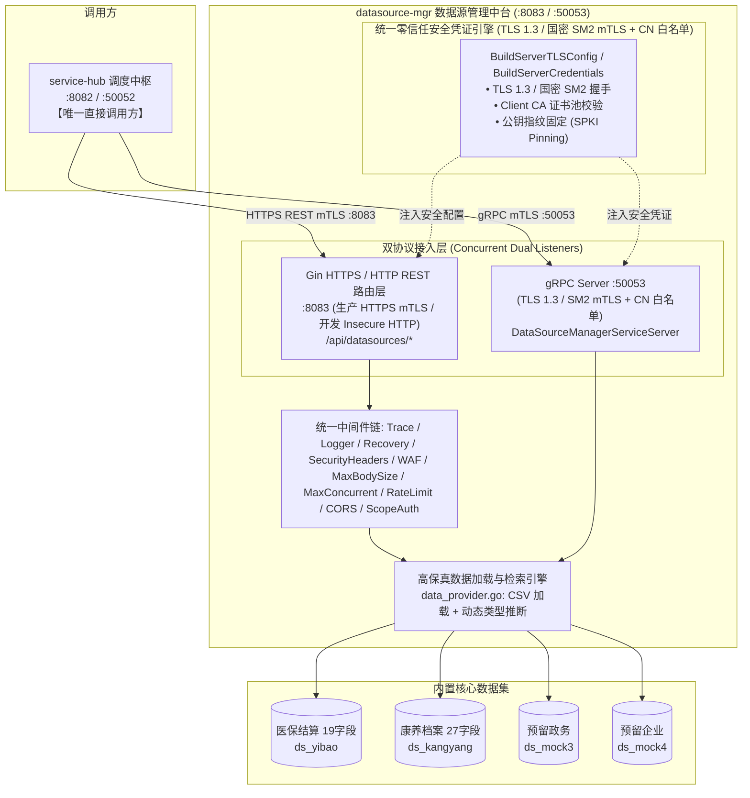

# 数据源管理服务 (datasource-mgr) 深度学习指南

> 面向研发、测试与数据治理工程师的完整技术指南，全面解析数联天下 · 数盾 (`PrivShield`) 数据源管理与高保真仿真探查模块的系统架构、数据字典、双协议暴露、零信任国密安全与核心源码实现。

---

## 目录 / Table of Contents

- [1. 模块全景与业务定位](#1-模块全景与业务定位)
- [2. 系统架构与交互拓扑](#2-系统架构与交互拓扑)
- [3. 预置高保真数据源与敏感特征字典 (对标 DB51/T 2989—2023)](#3-预置高保真数据源与敏感特征字典-对标-db51t-29892023)
  - [3.1 医保就医与结算数据集 (ds_yibao, 19 字段)](#31-医保就医与结算数据集-ds_yibao-19-字段)
  - [3.2 康养体检与慢病健康档案数据集 (ds_kangyang, 27 字段)](#32-康养体检与慢病健康档案数据集-ds_kangyang-27-字段)
  - [3.3 预留政务/企业数据源 (ds_mock3, ds_mock4)](#33-预留政务企业数据源-ds_mock3-ds_mock4)
- [4. 核心代码架构与目录结构](#4-核心代码架构与目录结构)
- [5. 核心源码深入解读](#5-核心源码深入解读)
  - [5.1 服务启动入口与双协议并发 (cmd/server/main.go)](#51-服务启动入口与双协议并发-cmdservermaingo)
  - [5.2 REST 路由、鉴权与权限映射 (internal/handlers/handlers.go)](#52-rest-路由鉴权与权限映射-internalhandlershandlersgo)
  - [5.3 CSV 数据加载与按身份证号检索 (internal/handlers/data_provider.go)](#53-csv-数据加载与按身份证号检索-internalhandlersdata_providergo)
  - [5.4 gRPC 服务实现与 mTLS 加固 (internal/grpcserver/server.go)](#54-grpc-服务实现与-mtls-加固-internalgrpcserverservergo)
- [6. 零信任传输与国密 SM2 mTLS 安全机制](#6-零信任传输与国密-sm2-mtls-安全机制)
- [7. 本地开发、实操与 API 演练](#7-本地开发实操与-api-演练)
- [8. 常见问题排查 (FAQ)](#8-常见问题排查-faq)

---

## 1. 模块全景与业务定位

在数据要素流通与隐私保护的开发、联调与生产运行过程中，直接使用真实生产库存在巨大的合规风险与泄密隐患。

**`datasource-mgr` (数据源管理与敏感特征自动探查服务)** 是 `PrivShield` 体系中的数据源资产枢纽与高保真数据提供者，扮演 **数据提供者（Data Provider）** 角色：

```
┌───────────────────────────────────────────────────────────────────────────┐
│              数盾调度中枢 service-hub 【唯一直接调用方】                   │
└─────────────────────────────────────┬─────────────────────────────────────┘
                                      │ HTTPS REST (:8083) / gRPC mTLS (:50053)
                                      ▼
┌───────────────────────────────────────────────────────────────────────────┐
│                  datasource-mgr 数据源管理中台 (Go 1.25+)                 │
│                                                                           │
│   • 数据源注册与纳管  • 连通性健康探测  • 元数据特征探查 • 单条记录抽取   │
│   • 国密 SM2 / TLS 1.3 mTLS • CN 白名单鉴权 • 防 Slowloris • 双协议暴露   │
└───────────┬─────────────────────────┬──────────────────────────┬──────────┘
            │                         │                          │
            ▼                         ▼                          ▼
┌───────────────────────┐ ┌────────────────────────┐ ┌─────────────────────────┐
│ 医保结算源 ds_yibao   │ │ 康养档案源 ds_kangyang │ │ 预留政务/企业源 mock3/4 │
│ 19 字段 (诊断/结算等) │ │ 27 字段 (慢病/评估等)  │ │ 自定义扩展流水与报表    │
└───────────────────────┘ └────────────────────────┘ └─────────────────────────┘
```

> **调用边界**：前端控制台与 BFF 网关**不直连** datasource-mgr，所有数据请求统一经 `service-hub` 编排调度（详见 [api.md](api.md) §1.1）。

### 核心职责与设计目标

1. **统一数据源资产纳管**：统一抽象异构数据源（文件源、高保真 Mock 数据源）元数据。
2. **严格对齐地方与行业标准**：样本结构深度对标 **DB51/T 2989—2023《四川省健康医疗大数据应用指南》** L1~L5 定级要求。
3. **多协议高效安全暴露**：提供 HTTP/HTTPS RESTful API (:8083) 与微服务间高性能二进制 gRPC API (:50053)。
4. **金融级零信任传输**：全链路集成 TLS 1.3 / 国密 SM2 双向证书校验与 CN 白名单鉴权。
5. **开箱即用与零外部依赖**：内置 yibao.csv / kangyang.csv 高保真样本，零外部数据库依赖快速启动。

---

## 2. 系统架构与交互拓扑



---

## 3. 预置高保真数据源与敏感特征字典 (对标 DB51/T 2989—2023)

> 以下字段字典与 [api.md](api.md) §5、`data_provider.go` 的 `GetMetadata` 及 CSV 表头严格一致。

### 3.1 医保就医与结算数据集 (`ds_yibao`, 19 字段)

| 字段名称 | 类型 | 敏感等级 | 说明 |
|---|---|---|---|
| `insurance_settlement_id` | string | L2 | 医保结算单次唯一业务流水号 |
| `person_id` | string | L3 | 参保人个人编号（准标识符） |
| `gender` | string | L2 | 性别（GB/T 2261.1） |
| `birth_date` | string | L3 | 出生日期（K-匿名准标识符 QI） |
| `admission_date` | string | L2 | 入院/就诊日期 |
| `discharge_date` | string | L2 | 出院/结算日期 |
| `length_of_stay` | integer | L2 | 实际住院天数 |
| `admission_dept` | string | L2 | 入院/就诊科室 |
| `discharge_dept` | string | L2 | 出院科室 |
| `hospital_code` | string | L2 | 定点医药机构编码 |
| `medical_category` | string | L2 | 医疗类别（门诊/住院/日间手术等） |
| `discharge_mode` | string | L2 | 离院方式（医嘱离院/转院等） |
| `settlement_seq_no` | string | L2 | 结算序列号 |
| `diagnosis_seq` | integer | L1 | 诊断序号 |
| `diagnosis_type` | string | L2 | 诊断类型（主要/次要/病理） |
| `icd10_code` | string | L4 | ICD-10 疾病编码（极度高敏诊断特征） |
| `diagnosis_name` | string | L4 | 临床诊断中文名称（四柱高敏特征剥离对象） |
| `admission_condition` | string | L2 | 入院病情评估（一般/急/重/危） |
| `id_card_no` | string | L4 | 公民身份证号（极高敏身份核验要素，按身份证号查询键） |

### 3.2 康养体检与慢病健康档案数据集 (`ds_kangyang`, 27 字段)

| 字段名称 | 类型 | 敏感等级 | 说明 |
|---|---|---|---|
| `gender` | string | L2 | 性别 |
| `age` | integer | L3 | 实足周岁年龄（准标识符 QI） |
| `diagnosis_name` | string | L4 | 主要疾病诊断 |
| `chief_complaint` | string | L4 | 主诉（NLP 自由文本脱敏对象） |
| `present_illness` | string | L4 | 现病史（长文本） |
| `past_history` | string | L4 | 既往病史（四柱特征剥离） |
| `personal_history` | string | L3 | 个人史与生活习惯 |
| `is_smoking` | string | L2 | 是否吸烟 |
| `smoking_duration` | string | L2 | 吸烟年限（不吸烟可为空） |
| `family_history` | string | L4 | 家族遗传病史（长文本） |
| `allergic_history` | string | L3 | 药物与食物过敏史 |
| `department` | string | L2 | 负责临床/康养科室 |
| `height` | integer | L3 | 身高 cm（QI） |
| `weight` | integer | L3 | 体重 kg（QI） |
| `disability_category` | string | L3 | 残疾类别（GB/T 13800） |
| `disability_level` | string | L3 | 残疾等级（一级最重） |
| `assess_type_name` | string | L2 | 综合评估类型 |
| `assess_result_name` | string | L3 | 评估结论等级 |
| `assess_score` | integer | L3 | 综合评估分值（0~100） |
| `assess_time` | string | L2 | 评估日期 |
| `progress_note` | string | L4 | 查房/随访病程记录（长文本） |
| `progress_note_time` | string | L2 | 病程记录时间戳 |
| `name` | string | L4 | 患者真实姓名（极高敏个人标识符） |
| `id_card_no` | string | L4 | 公民身份证号（极高敏身份核验要素） |
| `registered_address` | string | L4 | 户籍居住地址（详细门牌号） |
| `disability_cert_no` | string | L4 | 残疾人证件号（20 位） |
| `medical_insurance_no` | string | L4 | 个人医保卡号/社保号 |

### 3.3 预留政务/企业数据源 (`ds_mock3`, `ds_mock4`)

- **`ds_mock3`（政务审批流水）**：预留扩展数据源，用于政务跨部门联合调试，字段动态。
- **`ds_mock4`（企业财税报表）**：预留扩展数据源，用于企业端数据合规流转调试，字段动态。

> 预留数据源当前仅登记元数据（`type: "mock"`, `row_count: 10`），暂不支持 `record-by-id` 抽取。

---

## 4. 核心代码架构与目录结构

```text
services/datasource-mgr/
├── cmd/
│   └── server/
│       └── main.go              # 服务主入口，并发启动 HTTP 与 gRPC 服务、优雅停机
├── internal/
│   ├── config/                  # 环境变量解析与 fail-closed 配置校验
│   │   ├── config.go
│   │   ├── config_test.go
│   │   └── scripts_test.go
│   ├── grpcserver/              # gRPC 服务端实现与 TLS/mTLS 凭证构造
│   │   ├── server.go            # 5 个 RPC 方法 + BuildServerTLSConfig/Credentials
│   │   ├── auth.go              # gRPC CN 白名单鉴权拦截器
│   │   ├── auth_test.go
│   │   └── server_test.go
│   ├── handlers/                # HTTP REST 路由处理与高保真数据加载
│   │   ├── handlers.go          # Gin 路由、中间件链、Scope 鉴权、探针
│   │   ├── data_provider.go     # CSV 加载、按身份证号检索、Schema 元数据构建
│   │   └── handlers_test.go
│   └── models/                  # 数据模型与 DTO 定义
│       ├── models.go            # MockDataSource / MetadataResponse / SingleRecordResponse 等
│       └── models_test.go
├── proto/                       # gRPC 契约与桩代码
│   ├── datasourcemgr.proto
│   ├── datasourcemgr.pb.go
│   └── datasourcemgr_grpc.pb.go
├── docs/                        # SDLC 规范文档
├── scripts/                     # dev-run.sh / prod-run.sh / gen-certs.sh 等运维脚本
├── Dockerfile
├── Makefile
└── run.sh                       # 顶层 CLI 入口（bash run.sh [dev|prod]）
```

---

## 5. 核心源码深入解读

### 5.1 服务启动入口与双协议并发 (`cmd/server/main.go`)

```go
func main() {
    cfg := config.Load()
    if err := cfg.Validate(); err != nil { // fail-closed 零信任门禁
        log.Fatalf("invalid configuration: %v", err)
    }
    pkgobs.InitLogger(cfg.LogFormat, cfg.LogLevel)
    logger := slog.Default()

    // P0-4 禁静音降级：CSV 损坏行直接报错，不静默丢弃
    handlers.SetStrictDataIntegrity(cfg.StrictStorage)

    // 构建 REST 处理器（cfg, keyStore 热轮转, logger, mc 指标收集器）
    mc := metrics.NewCollector("datasource-mgr")
    naming.SetObserver(mc)
    server := handlers.New(cfg, keyStore, logger, mc)
    router := gin.New()
    server.RegisterRoutes(router)

    // 显式超时防御 Slowloris（ReadHeaderTimeout 5s / ReadTimeout 30s / IdleTimeout 120s）
    httpSrv := &http.Server{Addr: cfg.Address(), Handler: router, /* ... */}

    // gRPC：64 MiB 消息上限 + keepalive + mTLS CN 白名单拦截器
    grpcServer := pkggrpcserver.New(cfg.GRPCAddress(), grpcServerOpts...)
    // ... 分别在独立 goroutine 中启动 gRPC 与 HTTP，捕获 SIGINT/SIGTERM 优雅停机
}
```

### 5.2 REST 路由、鉴权与权限映射 (`internal/handlers/handlers.go`)

- **中间件链**（`RegisterRoutes`）：`TraceMiddleware` → `RequestLoggerWithModule` → `Recovery` → `SecurityHeaders` → `WAF` → `MaxBodySize(32MiB)` → `MaxConcurrent(1000)` → `RateLimit`（可选）→ `CORS` → `scopeAuthMiddleware`。
- **Scope 鉴权**：`DatasourceMgrPermissionForPath` 将路径映射为 `datasource:read`（查询类）或 `datasource:admin`（`test`/`seed`）；探针与 `/metrics` 免鉴权。配置 `DATASOURCE_MGR_API_KEYS` 时启用 Scope 模式，否则回退单 `APIKey`。
- **常量时间校验**：`constantTimeLookupKeys` 在排序后的 key 集合上用 `subtle.ConstantTimeCompare` 查找 token，防时序攻击。
- **注册端点**：见 [api.md](api.md) §3 与 [design.md](design.md) §3 能力矩阵。

### 5.3 CSV 数据加载与按身份证号检索 (`internal/handlers/data_provider.go`)

- **`LoadCSVRecords(filename)`**：定位文件 → 解析表头 → 逐行读取并做动态类型推断（整数/浮点/字符串）。严格模式（默认）下损坏行上抛为错误而非静默 `continue`。
- **`findCSVFile`**：`filepath.Base` 提取纯文件名 + `allowedCSVFiles` 白名单（仅 `yibao.csv`/`kangyang.csv`）+ `.csv` 后缀校验，防路径遍历/LFI。
- **`GetRecordByIDCard(sourceID, idCardNo)`**：归一化数据源 ID → 选定 CSV → 遍历匹配 `id_card_no` → 命中返回记录，未命中返回 `ErrRecordNotFound`（REST 层转为 `found:false` 的 200）。
- **`GetMetadata(sourceID)`**：返回与 CSV 表头严格对齐的 Schema（yibao 19 字段 / kangyang 27 字段）。

### 5.4 gRPC 服务实现与 mTLS 加固 (`internal/grpcserver/server.go`)

`GRPCServer` 实现 `pb.DataSourceManagerServiceServer`，共 **5 个 RPC 方法**：

| RPC 方法 | 说明 |
|---|---|
| `Health` | 存活/就绪探针，返回 `via: datasource-mgr` |
| `ListDataSources` | 数据源资产目录（委托内部 `ListMockSources`） |
| `GetDataSource` | 单个数据源元数据，未找到返回 `codes.NotFound` |
| `TestConnection` | 连通性探测，返回延迟毫秒数 |
| `GetRecordByIDCard` | 按身份证号查询单条记录，`map[string]any` 序列化为 `DataRowProto.fields`（值统一格式化为字符串） |

`BuildServerTLSConfig` / `BuildServerCredentials` 强制 TLS 1.3 最低版本，支持 `RequireAndVerifyClientCert` 与公钥指纹固定（`VerifyPeerCertificate` 比对 RSA Modulus+Exponent）。

---

## 6. 零信任传输与国密 SM2 mTLS 安全机制

1. **TLS 1.3 强制基线**：`MinVersion: tls.VersionTLS13`，阻断协议降级攻击；国密场景经 `pkg/tlsutil` 支持 SM2/SM3/SM4-GCM（TLCP）。
2. **双向证书校验**：服务端加载 CA 证书池校验客户端证书（`RequireAndVerifyClientCert`）。
3. **公钥指纹固定 (SPKI Pinning)**：即便 CA 被仿冒，只要客户端公钥不匹配 `client.pub` 即拒绝连接。
4. **CN 白名单**：gRPC 侧经 `PRIVACY_AUTH_MTLS_WHITELIST_FILE` 加载白名单拦截器，仅放行 `service-hub` 等合法 CN。
5. **fail-closed 门禁**：`config.Validate()` 在非环回监听缺 API Key、声明 `REQUIRE_TLS` 却未启用 TLS、启用 gRPC TLS 却缺白名单文件时拒绝启动。

---

## 7. 本地开发、实操与 API 演练

### 7.1 启动服务

```bash
cd services/datasource-mgr
bash scripts/dev-run.sh        # 开发模式（免 mTLS，127.0.0.1，text 日志）
# 或：bash run.sh dev / make dev
# 生产加固：bash scripts/prod-run.sh（0.0.0.0，mTLS + 公钥固定，json 日志）
```

监听：**HTTP REST** `http://127.0.0.1:8083`、**gRPC** `127.0.0.1:50053`。

### 7.2 REST 接口演练

```bash
# 1. 数据源资产目录
curl -s http://127.0.0.1:8083/api/datasources | jq .

# 2. 探查医保数据源 Schema（必须包含 19 字段）
curl -s http://127.0.0.1:8083/api/datasources/ds_yibao/metadata | jq .

# 3. 按身份证号查询医保单条记录（核心抽取入口）
curl -s "http://127.0.0.1:8083/api/datasources/ds_yibao/record-by-id?id_card_no=110101196809171010" | jq .

# 4. 按身份证号查询康养单条记录（必须包含 27 字段）
curl -s "http://127.0.0.1:8083/api/datasources/ds_kangyang/record-by-id?id_card_no=110105198402151071" | jq .
```

### 7.3 gRPC 接口演练

```bash
grpcurl -plaintext 127.0.0.1:50053 datasourcemgr.DataSourceManagerService/Health
grpcurl -plaintext -d '{"source_id":"ds_yibao","id_card_no":"110101196809171010"}' \
  127.0.0.1:50053 datasourcemgr.DataSourceManagerService/GetRecordByIDCard
grpcurl -plaintext 127.0.0.1:50053 datasourcemgr.DataSourceManagerService/ListDataSources
```

### 7.4 运行测试

```bash
go test -v ./services/datasource-mgr/...
```

---

## 8. 常见问题排查 (FAQ)

| 现象 | 可能原因 | 排查方法 |
|---|---|---|
| `record-by-id` 返回 `found:false` | 身份证号格式合法但样本中无此记录 | 确认使用 CSV 中真实存在的 `id_card_no` |
| 启动报 `id_card_no must be 18 characters` | 查询参数非 18 位 | REST 与 gRPC 均强校验 18 位长度 |
| 启动即退出并提示缺 API Key / TLS | fail-closed 门禁触发 | 检查 `DATASOURCE_MGR_API_KEY`、`REQUIRE_TLS`、`PRIVACY_AUTH_MTLS_WHITELIST_FILE` 配置 |
| CSV 加载报 `malformed record at line N` | 严格模式下样本存在损坏行 | 修复样本 CSV，或显式 `DATASOURCE_MGR_STRICT_STORAGE=false`（不推荐） |
| 找不到样本文件 `csv file not found` | 工作目录下未定位到 `yibao.csv`/`kangyang.csv` | 确认从仓库根或服务目录启动，样本位于 `data/` 或 `samples/` |
