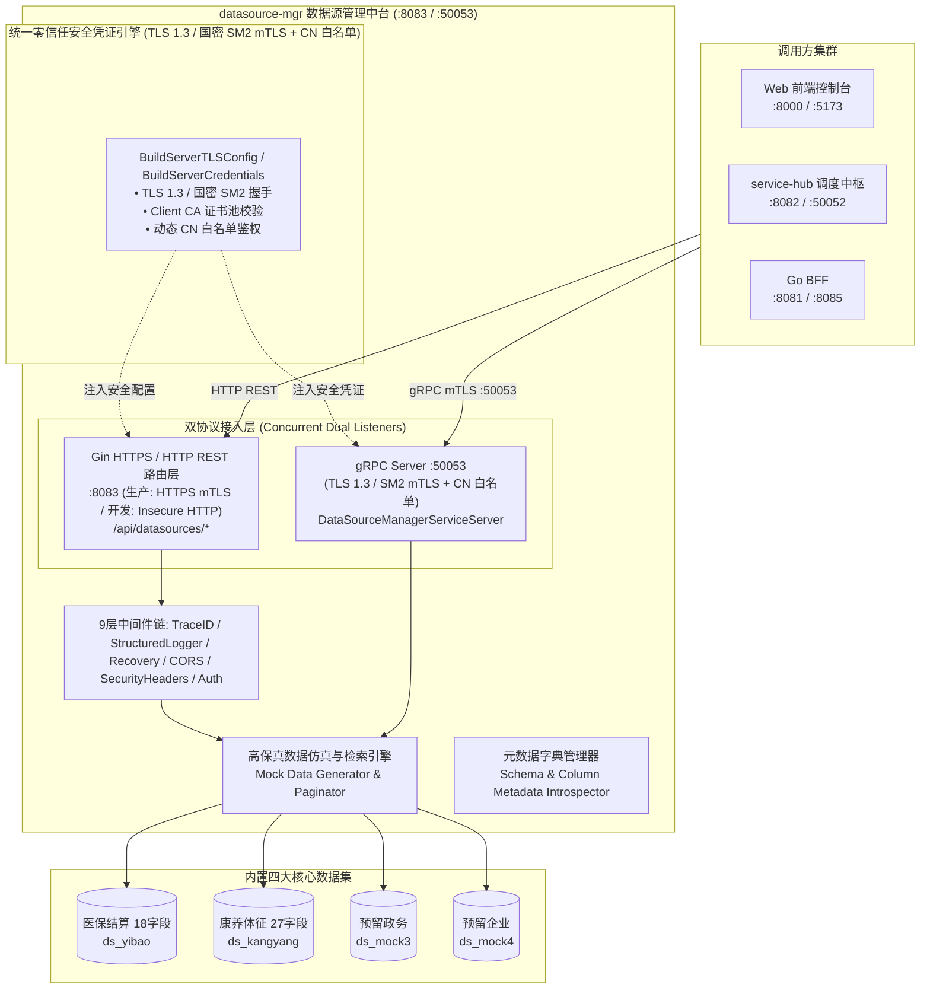

# 数据源管理服务 (datasource-mgr) 深度学习指南

> 面向研发、测试与数据治理工程师的完整技术指南，全面解析数联天下 · 数盾 (`PrivShield`) 数据源管理与高保真仿真探查模块的系统架构、数据字典、双协议暴露、零信任国密安全与核心源码实现。

---

## 目录 / Table of Contents

- [1. 模块全景与业务定位](#1-模块全景与业务定位)
- [2. 系统架构与交互拓扑](#2-系统架构与交互拓扑)
- [3. 预置高保真数据源与敏感特征字典 (对标 DB51/T 2989—2023)](#3-预置高保真数据源与敏感特征字典-对标-db51t-29892023)
  - [3.1 医保就医与结算数据集 (ds_yibao, 18 字段)](#31-医保就医与结算数据集-ds_yibao-18-字段)
  - [3.2 康养旅居与健康档案数据集 (ds_kangyang, 27 字段)](#32-康养旅居与健康档案数据集-ds_kangyang-27-字段)
  - [3.3 预留政务数据源 3 (ds_mock3)](#33-预留政务数据源-3-ds_mock3)
  - [3.4 预留企业数据源 4 (ds_mock4)](#34-预留企业数据源-4-ds_mock4)
- [4. 核心代码架构与目录结构](#4-核心代码架构与目录结构)
- [5. 核心源码深入解读](#5-核心源码深入解读)
  - [5.1 服务启动入口与双协议并发 (cmd/server/main.go)](#51-服务启动入口与双协议并发-cmdservermaingo)
  - [5.2 配置驱动与环境变量解析 (internal/config/config.go)](#52-配置驱动与环境变量解析-internalconfigconfiggo)
  - [5.3 REST 路由与数据检索控制 (internal/handlers/handlers.go)](#53-rest-路由与数据检索控制-internalhandlershandlersgo)
  - [5.4 模拟数据生成器与分页探针 (internal/handlers/mock_data.go)](#54-模拟数据生成器与分页探针-internalhandlersmock_datago)
  - [5.5 gRPC 高性能服务实现与 mTLS 加固 (internal/grpcserver/server.go)](#55-grpc-高性能服务实现与-mtls-加固-internalgrpcserverservergo)
  - [5.6 gRPC 桩代码与业务实现的核心关联 (datasourcemgr_grpc.pb.go vs server.go)](#56-grpc-桩代码-datasourcemgr_grpcpbgo-与业务实现-servergo-的核心关联)
- [6. 零信任传输与国密 SM2 mTLS 安全机制](#6-零信任传输与国密-sm2-mtls-安全机制)
- [7. 本地开发、实操与 API 演练](#7-本地开发实操与-api-演练)
- [8. 生产环境部署与容器化](#8-生产环境部署与容器化)
- [9. 常见问题排查 (FAQ)](#9-常见问题排查-faq)
- [10. 实战演练：如何新增一个通信 API（REST & gRPC 双协议全流程）](#10-实战演练如何新增一个通信-apirest--grpc-双协议全流程)

---

## 1. 模块全景与业务定位

在数据要素流通与隐私保护的开发、联调与生产运行过程中，直接使用真实生产库存在巨大的合规风险与泄密隐患。

**`datasource-mgr` (数据源管理与敏感特征自动探查服务)** 是 `PrivShield` 体系中的数据源资产枢纽与高保真数据提供者：

```
┌───────────────────────────────────────────────────────────────────────────┐
│                      数据源调度调用方 (service-hub / 控制台 BFF)          │
└─────────────────────────────────────┬─────────────────────────────────────┘
                                      │ HTTP/HTTPS REST (:8083) / gRPC (:50053) [双协议 mTLS]
                                      ▼
┌───────────────────────────────────────────────────────────────────────────┐
│                  datasource-mgr 数据源管理中台 (Go 1.24+)                 │
│                                                                           │
│   • 数据源注册与纳管  • 连通性健康探测  • 元数据特征探查 • 高保真数据抽取 │
│   • 国密 SM2 / TLS 1.3 mTLS • CN 白名单鉴权 • 防 Slowloris攻击•双协议安全暴露│
└───────────┬─────────────────────────┬──────────────────────────┬──────────┘
            │                         │                          │
            ▼                         ▼                          ▼
┌───────────────────────┐ ┌────────────────────────┐ ┌─────────────────────────┐
│ 医保结算源 ds_yibao   │ │ 康养健康源 ds_kangyang │ │ 预留政务/企业源 mock3/4 │
│ 18 字段 (诊断/金额等) │ │ 27 字段 (体征/慢病等)  │ │ 自定义扩展流水与报表    │
└───────────────────────┘ └────────────────────────┘ └─────────────────────────┘
```

### 核心职责与设计目标

1. **统一数据源资产纳管**：统一抽象异构数据源（MySQL、PostgreSQL、文件源、高保真 Mock 数据源）元数据。
2. **严格对齐地方与行业标准**：样本结构深度对标 **DB51/T 2989—2023《四川省健康医疗大数据应用指南》** L1~L5 定级要求。
3. **多协议高效安全暴露**：提供 Web 端易用的 HTTP/HTTPS RESTful API (:8083) 与微服务间高性能二进制 gRPC API (:50053)。
4. **金融级零信任传输**：全链路集成 TLS 1.3 / 国密 SM2 双向证书校验与 CN 白名单鉴权。
5. **开箱即用与零外部依赖**：内置完整的高保真医疗、康养仿真数据生成器，零依赖快速启动。

---

## 2. 系统架构与交互拓扑



---

## 3. 预置高保真数据源与敏感特征字典 (对标 DB51/T 2989—2023)

### 3.1 医保就医与结算数据集 (`ds_yibao`, 18 字段)

| 字段名称 | 类型 | 敏感等级 | 说明 |
|---|---|---|---|
| `insurance_settlement_id` | string | L2 | 医保结算流水单号 |
| `person_id` | string | L4 | 参保人个人唯一标识符 (国密 SM3 掩码对象) |
| `name` | string | L4 | 参保人真实姓名 |
| `gender` | string | L2 | 性别 |
| `age` | int | L3 | 年龄 (K-匿名准标识符 QI) |
| `phone` | string | L4 | 联系电话 (正则掩码对象) |
| `id_card` | string | L4 | 居民身份证号 |
| `visit_date` | string | L2 | 就医结算日期 |
| `hospital_name` | string | L2 | 医疗机构名称 |
| `dept_name` | string | L2 | 就诊科室名称 |
| `icd10_code` | string | L3 | 疾病国际诊断编码 ICD-10 |
| `diagnosis_name` | string | L4 | 就医诊断名称 (四柱高敏特征剥离对象) |
| `treatment_plan` | string | L4 | 临床治疗方案 |
| `medication_list` | string | L4 | 用药清单与处方 |
| `total_amount` | float | L3 | 医疗总费用 |
| `reimbursement_amount` | float | L3 | 医保统筹报销金额 |
| `self_pay_amount` | float | L3 | 个人自费金额 |
| `payment_status` | string | L2 | 支付与结算状态 |

### 3.2 康养旅居与健康档案数据集 (`ds_kangyang`, 27 字段)

| 字段名称 | 类型 | 敏感等级 | 说明 |
|---|---|---|---|
| `record_id` | string | L2 | 康养健康档案流水号 |
| `person_id` | string | L4 | 居民唯一标识 |
| `name` | string | L4 | 居民真实姓名 |
| `gender` | string | L2 | 性别 |
| `age` | int | L3 | 年龄 (准标识符 QI) |
| `phone` | string | L4 | 联系电话 |
| `id_card` | string | L4 | 居民身份证号 |
| `address` | string | L3 | 居住地址 |
| `emergency_contact` | string | L3 | 紧急联系人姓名 |
| `emergency_phone` | string | L4 | 紧急联系人电话 |
| `disability_card_no` | string | L4 | 残疾证号 (高敏四柱特征) |
| `vital_signs_heart_rate` | int | L3 | 心率体征 (拉普拉斯差分加噪 $\varepsilon=1.0$) |
| `vital_signs_blood_pressure_systolic` | int | L3 | 收缩压 |
| `vital_signs_blood_pressure_diastolic` | int | L3 | 舒张压 |
| `vital_signs_blood_glucose` | float | L3 | 空腹血糖 |
| `vital_signs_spo2` | int | L3 | 血氧饱和度 |
| `vital_signs_temperature` | float | L3 | 体温 |
| `chief_complaint` | string | L4 | 主诉健康状况 (NLP 自由文本脱敏对象) |
| `past_medical_history` | string | L4 | 既往病史 (四柱特征剥离) |
| `present_illness_history` | string | L4 | 现病史 |
| `fall_risk_score` | int | L2 | 跌倒风险评分 |
| `adl_score` | int | L2 | 日常生活自理能力 ADL 评分 |
| `cognitive_score` | int | L2 | 认知功能评估得分 |
| `followup_date` | string | L2 | 随访日期 |
| `followup_doctor` | string | L2 | 责任随访医生 |
| `health_assessment_grade` | string | L2 | 综合健康评估等级 |
| `dietary_guidance` | string | L2 | 康养膳食干预建议 |

---

## 4. 核心代码架构与目录结构

```text
services/datasource-mgr/
├── cmd/
│   └── server/
│       └── main.go              # 服务主入口，并发启动 HTTP 与 gRPC 服务
├── internal/
│   ├── config/                  # 环境变量解析与配置校验
│   │   ├── config.go
│   │   ├── config_test.go
│   │   └── scripts_test.go
│   ├── grpcserver/              # gRPC 服务端实现与 TLS/mTLS 凭证构造
│   │   ├── server.go
│   │   └── server_test.go
│   ├── handlers/                # HTTP REST 路由处理与高保真数据生成
│   │   ├── handlers.go
│   │   ├── handlers_test.go
│   │   └── mock_data.go
│   └── models/                  # 数据模型与 DTO 定义
│       ├── models.go
│       └── models_test.go
├── proto/                       # gRPC 契约与桩代码
│   ├── datasource.proto
│   ├── datasource.pb.go
│   └── datasource_grpc.pb.go
├── docs/                        # SDLC 规范文档
├── Dockerfile
├── Makefile
└── run.sh
```

---

## 5. 核心源码深入解读

### 5.1 服务启动入口与双协议并发 (`cmd/server/main.go`)

```go
func main() {
    cfg := config.Load()
    logger := pkgconfig.SetupLogger(cfg.LogFormat, cfg.LogLevel)

    // 1. 初始化 Gin 路由器并注入中间件
    server := handlers.New(cfg, logger)
    router := gin.New()
    server.RegisterRoutes(router)

    // 2. 构建 HTTP Server（显式超时防御 Slowloris 攻击）
    httpSrv := &http.Server{
        Addr:              cfg.Address(),
        Handler:           router,
        ReadHeaderTimeout: 5 * time.Second,
        ReadTimeout:       30 * time.Second,
        WriteTimeout:      60 * time.Second,
        IdleTimeout:       120 * time.Second,
        MaxHeaderBytes:    1 << 20,
    }

    // 3. 构建 gRPC Server 并注入 mTLS 凭证与 CN 白名单
    grpcSrv := grpcserver.New(cfg, logger)
    // ...
}
```

---

## 6. 本地开发、实操与 API 演练

### 6.1 启动服务

```bash
cd services/datasource-mgr
bash run.sh
```

### 6.2 接口演练

```bash
# 1. 抽取 5 条医保数据
curl -s "http://127.0.0.1:8083/api/datasources/ds_yibao/records?limit=5" | jq .

# 2. 抽取 5 条康养数据
curl -s "http://127.0.0.1:8083/api/datasources/ds_kangyang/records?limit=5" | jq .

# 3. 运行测试套件
go test -v ./services/datasource-mgr/...
```
