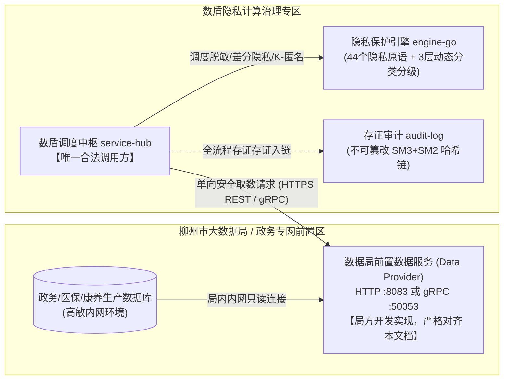

# 柳州市大数据局 × 数盾（数联 PrivShield）数据要素流通接口技术规范与对接指南

---

## 目录

- [1. 对接架构与权责边界](#1-对接架构与权责边界)
  - [1.1 业务拓扑与数据流向](#11-业务拓扑与数据流向)
  - [1.2 通信协议与端口规划](#12-通信协议与端口规划)
  - [1.3 极简对接接口交付清单 (仅 2 个必选 + 1 个推荐)](#13-极简对接接口交付清单-仅-2-个必选--1-个推荐)
- [2. 安全防护与通信基线](#2-安全防护与通信基线)
  - [2.1 传输安全 (TLS 1.3 / 国密 SM2 双向 mTLS)](#21-传输安全-tls-13--国密-sm2-双向-mtls)
  - [2.2 身份鉴权 (Bearer Token / mTLS CN 白名单)](#22-身份鉴权-bearer-token--mtls-cn-白名单)
  - [2.3 审计追踪标头 (X-Request-ID / X-Trace-ID)](#23-审计追踪标头-x-request-id--x-trace-id)
- [3. 核心业务接口详细规范](#3-核心业务接口详细规范)
  - [3.1 核心取数：按身份证号查询单条个人记录 (GET /api/datasources/:id/record-by-id)](#31-核心取数按身份证号查询单条个人记录-get-apidatasourcesidrecord-by-id)
  - [3.2 基础探活：前置机健康检查 (GET /health)](#32-基础探活前置机健康检查-get-health)
  - [3.3 连通探测：数据源连通性自测 (POST /api/datasources/:id/test)](#33-连通探测数据源连通性自测-post-apidatasourcesidtest)
- [4. 业务数据集标准与字段字典](#4-业务数据集标准与字段字典)
  - [4.1 数据集 1：医保就医与费用结算数据集 (ds_yibao · 19 字段)](#41-数据集-1医保就医与费用结算数据集-ds_yibao--19-字段)
  - [4.2 数据集 2：康养体检与慢病健康档案数据集 (ds_kangyang · 27 字段)](#42-数据集-2康养体检与慢病健康档案数据集-ds_kangyang--27-字段)
- [5. 可选高性能通道：gRPC 极简协议规范](#5-可选高性能通道grpc-极简协议规范)
  - [5.1 极简 Protobuf 定义 (datasourcemgr.proto)](#51-极简-protobuf-定义-datasourcemgrproto)
- [6. 异常响应与统一错误信封](#6-异常响应与统一错误信封)
  - [6.1 统一 5 字段错误响应](#61-统一-5-字段错误响应)
  - [6.2 状态码映射标准](#62-状态码映射标准)
- [7. 联调验证与验收 Checklist](#7-联调验证与验收-checklist)

---

## 1. 对接架构与权责边界

### 1.1 业务拓扑与数据流向

在柳州市数据要素可信流通体系中，**柳州市大数据局（或定点医疗/医保机构）**部署其独立运行的「数据源前置服务（Data Provider Gateway）」，连接政务内网的原始业务库（MySQL/Oracle/数据中台）。数盾平台调度中枢（`service-hub`）根据已审批的隐私计算任务凭证，向数据局前置服务发起精确取数请求。



#### 关键权责边界声明：
1. **单向网络流向**：网络连接**由数盾调度中枢单向主动发起**，数据局前置服务作为服务端监听请求，局方服务**无须且禁止**主动向数盾侧发起反向连接；
2. **零无关平台功能侵入**：数据局前置服务**仅需提供单条数据查询与存活探测**，无需接入或开发平台内部的监控体系（如 Prometheus `/metrics`）、K8s 就绪探针（`/readyz`）或管理类控制台；
3. **数据主权绝对可控**：数据源仅提供针对特定主体的单条只读抽取接口，数据局绝对不开放全表无条件倾倒（Dump）、批处理遍历或任何数据重置端点；
4. **存证集中归档**：数据流转全过程的审计与不可篡改数字签名存证由数盾集群内的 `audit-log` 微服务统一承载，数据局本地无需维护对外开放的审计查询接口。

---

### 1.2 通信协议与端口规划

数据局服务部署于政务外网或隔离专网 VPC 中，暴露以下端点之一（推荐 REST，高性能场景支持 gRPC）：

| 协议类型 | 默认端口 | 安全保障 | 说明 |
|---|---|---|---|
| **HTTPS REST** (推荐) | `8083` (可自定) | TLS 1.3 / 国密 SM2 + Bearer Token | 通用、标准、跨语言，易于政务外网防火墙策略穿透 |
| **gRPC (HTTP/2)** | `50053` (可自定) | TLS 1.3 / 国密 SM2 双向 mTLS + CN 白名单 | 适用于高频次、大吞吐、极低延迟的数据抽取需求 |

---

### 1.3 极简对接接口交付清单 (仅 2 个必选 + 1 个推荐)

为最大化降低数据局承建方的开发实施成本，双方协商约定的最终交付清单仅包含以下接口：

| 优先级 | 业务能力 | REST 路径 / 方法 | gRPC RPC 方法 | 数据局交付说明 |
|---|---|---|---|---|
| **P0 (强制必选)** | **按身份证号精确抽取单条记录** | `GET /api/datasources/:id/record-by-id?id_card_no=xxx` | `rpc GetRecordByIDCard` | **数据要素流通核心业务接口**。输入身份证号，返回该主体结构化原始数据。 |
| **P0 (强制必选)** | **前置机基础存活探针** | `GET /health` | `rpc Health` | 服务基础存活检测，返回 HTTP 200 即证明前置机就绪。 |
| **P1 (推荐必选)** | **数据源物理连通性自测** | `POST /api/datasources/:id/test` | `rpc TestConnection` | 探测底层数据库连接池与查询响应延迟。 |

---

## 2. 安全防护与通信基线

### 2.1 传输安全 (TLS 1.3 / 国密 SM2 双向 mTLS)

1. **协议基线**：生产环境必须强制启用 **TLS 1.3**（若采用国密标准，支持 **TLCP / GM/T 0024** 国密双证书协议）；
2. **加密套件**：
   - 国际套件：`TLS_AES_256_GCM_SHA384` / `TLS_CHACHA20_POLY1305_SHA256`；
   - 国密套件：`ECDHE-SM2-WITH-SM4-SM3`；
3. **证书要求**：双方使用政务电子政务 CA 或项目统一根 CA 签发的 X.509 证书。

### 2.2 身份鉴权 (Bearer Token / mTLS CN 白名单)

1. **REST 鉴权（Bearer API Key）**：
   - 数盾在发起 HTTP 请求时，将在 Header 中携带双方协商约定的预共享安全密钥（Pre-Shared Key）：
     ```http
     Authorization: Bearer <SEC_DATASOURCE_TOKEN>
     ```
   - 局方前置服务必须在入口处校验该 Token，并采用**恒定时间比对（Constant-Time Compare）**以防范时序侧信道攻击；校验失败应直接返回 `401 Unauthorized`。
2. **gRPC 鉴权（客户端 CN / SPIFFE 证书校验）**：
   - 若使用 gRPC 协议，局方服务在 TLS 握手完成后应从客户端证书 Subject CN 中校验调用方身份（如 `CN = service-hub.privshield.internal`）。

### 2.3 审计追踪标头 (X-Request-ID / X-Trace-ID)

为确保数据要素跨域流动的端到端不可篡改审计追踪：
- 数盾调用方在每一次请求中均会注入分布式追踪标头：
  - `X-Request-ID: req-20260902-yibao-a1b2c3`
  - `X-Trace-ID: req-20260902-yibao-a1b2c3`
- 局方前置程序必须将收到的 Trace ID 记录至本地日志，并在所有 HTTP 响应 Header 中**原样回传**，以便在发生数据安全争议时进行全流程存证对账。

---

## 3. 核心业务接口详细规范

### 3.1 核心取数：按身份证号查询单条个人记录 (GET /api/datasources/:id/record-by-id)

- **功能说明**：根据公民身份证号，从柳州市对应数据源中精确检索并返回单条原始记录。
- **请求方式**：`GET`
- **请求路径**：`/api/datasources/:id/record-by-id`
- **路径参数 (Path)**：
  - `id` (string, 必填)：数据源唯一规范标识：
    - `ds_yibao`：医保就医与费用结算数据集
    - `ds_kangyang`：康养体检与慢病健康档案数据集
- **查询参数 (Query)**：
  - `id_card_no` (string, 必填)：18 位中国居民身份证号码（支持字母 X 大写）。
- **请求头 (Headers)**：
  - `Authorization: Bearer <SEC_DATASOURCE_TOKEN>`
  - `X-Request-ID: <UUID/RequestID>`

#### 响应格式与规则：

##### 场景 A：命中记录（HTTP 200 OK，found = true）
当身份证号匹配到底层记录时，返回规范的结构化记录：
```json
{
  "datasource_id": "ds_yibao",
  "found": true,
  "record": {
    "insurance_settlement_id": "YB202511040001",
    "person_id": "PID66453983",
    "gender": "男",
    "birth_date": "1968-09-17",
    "admission_date": "2025-11-04",
    "discharge_date": "2025-11-13",
    "length_of_stay": "9",
    "admission_dept": "急诊科",
    "discharge_dept": "急诊科",
    "hospital_code": "H4201020015",
    "medical_category": "日间手术",
    "discharge_mode": "医嘱转院",
    "settlement_seq_no": "MX202511049975",
    "diagnosis_seq": "1",
    "diagnosis_type": "主要诊断",
    "icd10_code": "A51.000",
    "diagnosis_name": "硬下疳伴TPPA滴度1:64阳性(早期梅毒)",
    "admission_condition": "一般",
    "id_card_no": "110101196809171010"
  },
  "via": "lz-data-provider"
}
```

##### 场景 B：未匹配到记录（HTTP 200 OK，found = false）
若身份证格式合法但在局方数据库中不存在该人员记录，**仍返回 HTTP 200**，`found` 设为 `false`，`record` 设为 `null`（不抛出 404，由调度中枢据此决定流程走向）：
```json
{
  "datasource_id": "ds_yibao",
  "found": false,
  "record": null,
  "via": "lz-data-provider"
}
```

##### 场景 C：参数非法（HTTP 400 Bad Request）
未传 `id_card_no` 或身份证长度不满足 18 位：
```json
{
  "code": "INVALID_ARGUMENT",
  "message": "id_card_no must be 18 characters",
  "detail": null,
  "trace_id": "req-20260902-err-01",
  "timestamp": "2026-09-02T08:35:00Z"
}
```

---

### 3.2 基础探活：前置机健康检查 (GET /health)

- **功能说明**：供数盾调度中枢确认前置机网络与进程是否正常。
- **请求方式**：`GET`
- **请求路径**：`/health`（或兼容别名 `/api/health`）
- **认证要求**：默认允许免认证放行（内网白名单网络限制）。
- **成功响应**：`HTTP 200 OK`
  ```json
  {
    "status": "ok",
    "latency_ms": 0,
    "via": "lz-data-provider"
  }
  ```

---

### 3.3 连通探测：数据源连通性自测 (POST /api/datasources/:id/test)

- **功能说明**：数盾中枢在启动批次数据调度任务前，主动触发此接口探测目标数据源底层数据库的连通性及网络时延。
- **请求方式**：`POST`
- **请求路径**：`/api/datasources/:id/test`
- **路径参数**：`id` (例如 `ds_yibao` 或 `ds_kangyang`)
- **成功响应**：`HTTP 200 OK`
  ```json
  {
    "datasource_id": "ds_yibao",
    "success": true,
    "latency_ms": 3,
    "via": "lz-data-provider"
  }
  ```
- **异常响应**：若底层数据库断连或超时，返回 `HTTP 200` 且 `success: false`，附带错误说明：
  ```json
  {
    "datasource_id": "ds_yibao",
    "success": false,
    "error": "database connection timeout after 3000ms",
    "latency_ms": 3001,
    "via": "lz-data-provider"
  }
  ```

---

## 4. 业务数据集标准与字段字典

### 4.1 数据集 1：医保就医与费用结算数据集 (ds_yibao · 19 字段)

数据局在响应 `datasource_id = "ds_yibao"` 时，`record` 对象必须严格遵循以下 **19 字段** 规范输出（字段名小写下划线）：

| 序号 | 字段物理名 (`key`) | 字段中文名 | 类型 | 必填 | 样例数据 | 业务含义与说明 |
|:---:|---|---|:---:|:---:|---|---|
| 1 | `insurance_settlement_id` | 医保结算流水号 | string | 是 | `YB202511040001` | 单次就诊医保结算流水号 |
| 2 | `person_id` | 参保人编号 | string | 是 | `PID66453983` | 医保系统个人编号 |
| 3 | `gender` | 性别 | string | 是 | `男` / `女` | 参保人生理性别 |
| 4 | `birth_date` | 出生日期 | string | 是 | `1968-09-17` | 出生日期 (`YYYY-MM-DD`) |
| 5 | `admission_date` | 就诊/入院日期 | string | 是 | `2025-11-04` | 门诊挂号或住院日期 (`YYYY-MM-DD`) |
| 6 | `discharge_date` | 离院/结算日期 | string | 是 | `2025-11-13` | 门诊离院或出院日期 (`YYYY-MM-DD`) |
| 7 | `length_of_stay` | 住院天数 | integer | 是 | `9` | 住院时长（天），门诊为 0 或 1 |
| 8 | `admission_dept` | 入院科室 | string | 是 | `急诊科` | 入院时收治科室 |
| 9 | `discharge_dept` | 出院科室 | string | 是 | `急诊科` | 出院时结算科室 |
| 10 | `hospital_code` | 医疗机构编码 | string | 是 | `H4201020015` | 定点医院标准代码 |
| 11 | `medical_category` | 医疗类别 | string | 是 | `普通门诊`, `住院`, `日间手术` | 就医类别 |
| 12 | `discharge_mode` | 离院方式 | string | 是 | `医嘱离院`, `转院` | 转归状态 |
| 13 | `settlement_seq_no` | 结算序列号 | string | 是 | `MX202511049975` | 医保交易明细序列号 |
| 14 | `diagnosis_seq` | 诊断序号 | integer | 是 | `1` | 诊断排序 |
| 15 | `diagnosis_type` | 诊断类型 | string | 是 | `主要诊断`, `次要诊断` | 诊断分类 |
| 16 | `icd10_code` | ICD-10 疾病编码 | string | 是 | `A51.000` | 国际疾病分类 ICD-10 标准编码 |
| 17 | `diagnosis_name` | 诊断名称 | string | 是 | `硬下疳伴TPPA阳性(早期梅毒)` | 临床诊断中文全称 |
| 18 | `admission_condition` | 入院病情 | string | 是 | `一般`, `急`, `重`, `危` | 入院病情严重程度 |
| 19 | `id_card_no` | 身份证号 | string | 是 | `110101196809171010` | 18 位公民身份证号（精准关联要素） |

---

### 4.2 数据集 2：康养体检与慢病健康档案数据集 (ds_kangyang · 27 字段)

数据局在响应 `datasource_id = "ds_kangyang"` 时，`record` 对象必须严格遵循以下 **27 字段** 规范输出（字段名小写下划线）：

| 序号 | 字段物理名 (`key`) | 字段中文名 | 类型 | 必填 | 样例数据 | 业务含义与说明 |
|:---:|---|---|:---:|:---:|---|---|
| 1 | `gender` | 性别 | string | 是 | `男` / `女` | 性别 |
| 2 | `age` | 年龄 | integer | 是 | `45` | 实足年龄 |
| 3 | `diagnosis_name` | 主要疾病诊断 | string | 是 | `急性心肌梗死` | 康养或慢病诊断名称 |
| 4 | `chief_complaint` | 主诉 | string | 是 | `反复胸闷胸痛半年` | 主诉症状与持续时长 |
| 5 | `present_illness` | 现病史 | string | 是 | `患者突发剧烈胸痛...` | 现病史详细描述 |
| 6 | `past_history` | 既往病史 | string | 是 | `高血压病史3年` | 既往慢性病与外伤史 |
| 7 | `personal_history` | 个人史 | string | 是 | `吸烟20年，每日20支` | 生活习惯与烟酒史 |
| 8 | `is_smoking` | 是否吸烟 | string | 是 | `是` / `否` | 是否长期吸烟 |
| 9 | `smoking_duration` | 吸烟年限 | string | 否 | `20年` | 吸烟时长（不吸烟可传空串） |
| 10 | `family_history` | 家族遗传病史 | string | 是 | `父亲因肿瘤去世` | 直系亲属病史 |
| 11 | `allergic_history` | 过敏史 | string | 是 | `青霉素过敏` / `否认过敏史` | 药物与食物过敏史 |
| 12 | `department` | 负责科室 | string | 是 | `心内科` | 康养服务责任科室 |
| 13 | `height` | 身高 (cm) | integer | 是 | `175` | 身体测量身高（厘米） |
| 14 | `weight` | 体重 (kg) | integer | 是 | `78` | 身体测量体重（公斤） |
| 15 | `disability_category` | 残疾类别 | string | 是 | `肢体残疾`, `无残疾` | 评定残疾类型 |
| 16 | `disability_level` | 残疾等级 | string | 是 | `二级`, `无` | 残疾分级 |
| 17 | `assess_type_name` | 综合评估类型 | string | 是 | `心功能综合评估` | 评估项目名称 |
| 18 | `assess_result_name` | 评估结论等级 | string | 是 | `需辅助工具与护理` | 生活自理评估等级 |
| 19 | `assess_score` | 综合评估分值 | integer | 是 | `65` | 量化评估分值 (0~100) |
| 20 | `assess_time` | 评估日期 | string | 是 | `2025-01-10` | 评估日期 (`YYYY-MM-DD`) |
| 21 | `progress_note` | 病程记录 | string | 是 | `今日查房神志清楚...` | 随访与体格检查记录 |
| 22 | `progress_note_time` | 记录时间 | string | 是 | `2025-01-10 10:30:00` | 记录精确时间戳 |
| 23 | `name` | 姓名 | string | 是 | `萧志明` | 真实姓名 |
| 24 | `id_card_no` | 身份证号 | string | 是 | `110105198402151071` | 18 位公民身份证号 |
| 25 | `registered_address` | 户籍居住地址 | string | 是 | `北京市东城区景山前街4号` | 居住常住地址 |
| 26 | `disability_cert_no` | 残疾人证号 | string | 是 | `11010119800512123401` | 残疾人联合会证件号（无则为空串） |
| 27 | `medical_insurance_no` | 医保卡号 | string | 是 | `3301030127183297` | 医保个人编号/卡号 |

---

## 5. 可选高性能通道：gRPC 极简协议规范

若双方约定采用 gRPC 协议传输，数据局端仅需实现以下精简的 Protobuf 服务契约：

### 5.1 极简 Protobuf 定义 (`datasourcemgr.proto`)

```protobuf
syntax = "proto3";

package datasourcemgr;

option go_package = "github.com/fengzhizi319/PrivShield-go/services/datasource-mgr/proto";

// DataSourceManagerService 柳州数据局前置数据服务接口
service DataSourceManagerService {
  // 1. 服务健康探活 (P0)
  rpc Health(HealthRequest) returns (HealthResponse);

  // 2. 数据库物理连通性自测 (P1)
  rpc TestConnection(TestConnectionRequest) returns (TestConnectionResponse);

  // 3. 核心数据抽取：按身份证号精确查询单条记录 (P0)
  rpc GetRecordByIDCard(GetRecordByIDCardRequest) returns (SingleRecordResponse);
}

message HealthRequest {}

message HealthResponse {
  string status = 1;       // 固定返回 "ok"
  int64  latency_ms = 2;   // 自检耗时
  string via = 3;          // 节点标识 "lz-data-provider"
}

message TestConnectionRequest {
  string id = 1;          // 数据源标识，如 "ds_yibao"
}

message TestConnectionResponse {
  string datasource_id = 1;
  bool success = 2;       // 连通结果
  int64 latency_ms = 3;   // 延迟（毫秒）
  string via = 4;
}

message GetRecordByIDCardRequest {
  string source_id = 1;   // "ds_yibao" 或 "ds_kangyang"
  string id_card_no = 2;  // 18 位公民身份证号
}

message DataRowProto {
  map<string, string> fields = 1; // 字段名 -> 字符串格式化数据
}

message SingleRecordResponse {
  string datasource_id = 1;
  DataRowProto record = 2;        // 命中时填充，未找到时为 nil
  bool found = 3;                 // 是否找到
  string via = 4;
}
```

---

## 6. 异常响应与统一错误信封

### 6.1 统一 5 字段错误响应

当接口发生 4xx 或 5xx 异常时，HTTP 响应体必须统一为标准 5 字段 JSON 格式：

```json
{
  "code": "INVALID_ARGUMENT",
  "message": "身份证号码必须为18位字符",
  "detail": null,
  "trace_id": "req-20260902-yibao-a1b2c3",
  "timestamp": "2026-09-02T08:35:00.123Z"
}
```

### 6.2 状态码映射标准

| HTTP 状态码 | 错误码 (`code`) | 触发场景 | 处理建议 |
|:---:|---|---|---|
| `400` | `INVALID_ARGUMENT` | 缺少 `id_card_no` 或格式不合法 | 检查传入的身份证号 |
| `401` | `UNAUTHENTICATED` | 缺失或错误的 Authorization Bearer Token | 检查预共享密钥配置 |
| `404` | `NOT_FOUND` | 请求了不存在的数据源 `datasource_id` | 仅支持 `ds_yibao` 和 `ds_kangyang` |
| `500` | `INTERNAL_ERROR` | 数据局底层数据库连接断开或 SQL 执行崩溃 | 检查前置机内网数据库连通状态 |

---

## 7. 联调验证与验收 Checklist

在双方正式切流前，请局方技术人员按照以下步骤完成自检与联调：

- [ ] **网络连通性**：数盾节点可正常通过 TCP Ping 通局方前置机 `:8083` 端口；
- [ ] **TLS 传输层加固**：禁用 TLS 1.0/1.1，强制启用 TLS 1.3 / 国密 SM2，握手成功；
- [ ] **鉴权测试**：无 Token 请求拦截返回 401，携带正确 Token 请求返回 200；
- [ ] **探活接口**：`curl -H "Authorization: Bearer <KEY>" http://<HOST>:8083/health` 正常返回 `status: ok`；
- [ ] **连通自测接口**：`curl -X POST -H "Authorization: Bearer <KEY>" http://<HOST>:8083/api/datasources/ds_yibao/test` 返回 `success: true`；
- [ ] **医保取数测试**：传入测试身份证号 `110101196809171010`，能够完整输出 19 个医保字段，无字段缺失；
- [ ] **康养取数测试**：传入测试身份证号 `110105198402151071`，能够完整输出 27 个康养字段，长文本无截断；
- [ ] **查无人员测试**：传入不存在的身份证号（如 `000000000000000000`），返回 200 且 `found: false`、`record: null`；
- [ ] **链路追踪回传**：请求注入 `X-Request-ID` 时，响应头与 Body 中的 `trace_id` 严格原样回传；
- [ ] **性能指标**：单条查询接口平均响应耗时 $\le 50\text{ms}$，P99 耗时 $\le 200\text{ms}$。
