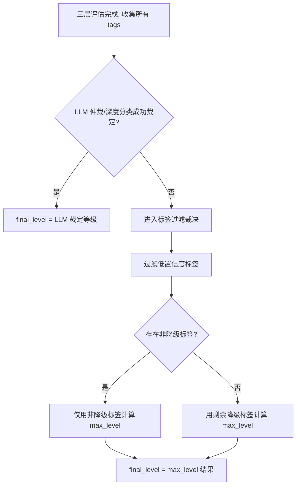
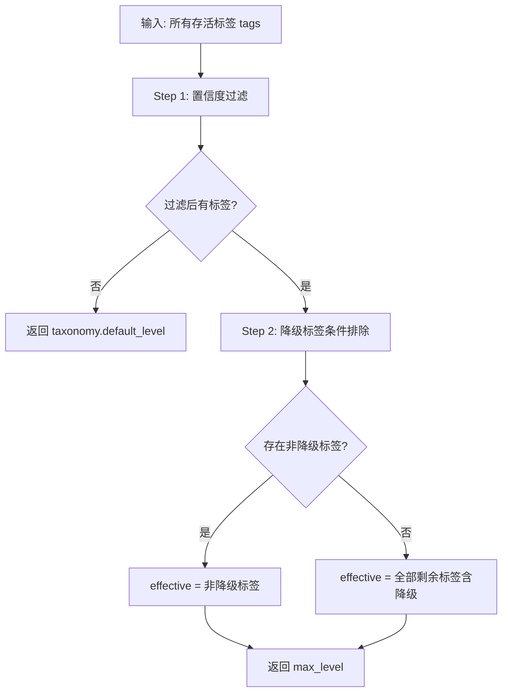
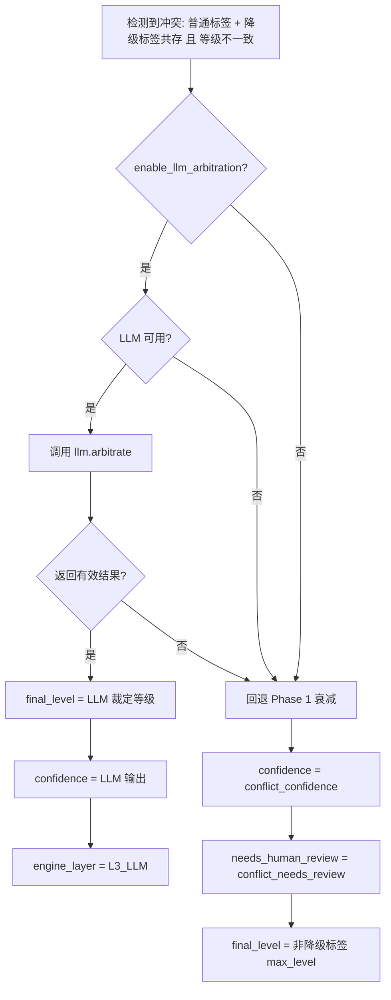

# 三层漏斗裁决逻辑

本文档详细说明 `ClassificationFunnel` 在完成三层评估后，如何从多来源标签中裁定最终敏感度等级。

---


## 1. 裁决总览



**核心优先级**：

```
LLM 裁定等级 > 有效标签 max_level > taxonomy.default_level
```

---

## 2. LLM 直接裁定（最高优先级）

当 Layer-3 LLM 成功返回裁定结果时，其等级**直接作为最终等级**，不再参与 `max_level` 计算。

### 2.1 触发场景

| 场景 | 条件 | LLM 方法 |
|------|------|----------|
| 规则冲突仲裁 | `has_conflict=True` 且 `enable_llm_arbitration=True` 且 LLM 可用 | `llm.arbitrate()` |
| 低置信度兜底 | `confidence < llm_confidence_threshold` 且 `enable_llm=True` 且 LLM 可用 | `llm.classify()` |

### 2.2 裁定规则

```python
# LLM 返回结构
llm_result = {
    "final_level": "L2",       # 裁定的最终等级
    "confidence": 0.92,        # 修正后的置信度
    "reasoning": "..."         # 推理说明
}

# 裁定逻辑
if llm_level and llm_level in taxonomy.levels:
    llm_adjudicated_level = llm_level  # 记录裁定等级

# Step 5: 最终等级
if llm_adjudicated_level:
    final_level = llm_adjudicated_level  # 直接使用，不被其他标签覆盖
```

### 2.3 设计意图与一致性保障

LLM 仲裁是为了解决规则冲突，如果仲裁结论仍被冲突标签的 `max_level` 覆盖，则仲裁形同虚设。因此 LLM 裁定具有最高优先级。

同时：
1. **审计追踪**：LLM 裁定标签会追加到 `tags` 列表中（`source_engine="LLM"`），用于审计追踪。
2. **标签一致性**：LLM 仲裁成功后，与裁定等级冲突的普通规则标签会被自动移入 `suppressed_tags` 列表中保存。这确保了外部对 `funnel_result.tags` 二次重算 `_resolve_level` 时，结果与 `final_level` 保持完全对齐。
3. **复核标记刷新**：当 LLM 仲裁输出高置信度（`confidence >= llm_confidence_threshold`）时，系统会自动清空继承的历史 `needs_human_review` 标记（重置为 `False`），避免产生多余的审核工单。

---

## 3. 标签过滤裁决（无 LLM 裁定时）

当 LLM 未触发或裁定失败时，通过 `_resolve_level(tags)` 从标签列表中计算最终等级。

### 3.1 过滤流程



### 3.2 Step 1：置信度过滤

```python
min_conf = policy.min_tag_confidence  # 默认 0.5
confident_tags = [t for t in tags if t.confidence >= min_conf]
```

**目的**：防止低置信度 NER 标签（如 0.3）无条件拉高最终等级。

**示例**：

| 标签 | 等级 | 置信度 | 是否参与裁决 |
|------|------|--------|-------------|
| 规则命中 | L3 | 1.0 | 是 |
| NER 识别 | L5 | 0.3 | 否（低于 0.5） |

最终等级 = L3（而非被低置信度 L5 拉高）。

### 3.3 Step 2：降级标签条件排除

```python
normal_tags = [t for t in confident_tags if not t.is_downgrade]
effective = normal_tags if normal_tags else confident_tags
```

**规则**：

| 场景 | 行为 | 原因 |
|------|------|------|
| 非降级标签存在 | 排除降级标签 | 降级标签不应上推等级，其压制效果已通过 `suppressed_tags` 体现 |
| 仅剩降级标签 | 保留降级标签 | Override 已压制所有普通标签，降级标签代表最终裁定 |

**示例 A**（冲突共存，无 override）：

| 标签 | 等级 | is_downgrade | 参与裁决 |
|------|------|-------------|---------|
| RULE_REPORT | L3 | False | 是 |
| RULE_DOWN_OPS | L2 | True | 否（有非降级标签存在） |

最终等级 = L3（安全保守，就高原则）。

**示例 B**（override 压制后）：

| 标签 | 等级 | is_downgrade | 参与裁决 |
|------|------|-------------|---------|
| ~~RULE_REPORT~~ | ~~L3~~ | — | 已被压制到 suppressed_tags |
| RULE_DOWN_OPS | L2 | True | 是（仅剩降级标签） |

最终等级 = L2（override 成功降级）。

---

## 4. engine_layer 归属规则

`engine_layer` 标识"谁做出了最终决策"，用于审计和监控。

| 条件 | engine_layer | 说明 |
|------|-------------|------|
| L1 规则命中且未被后续层改变 | `L1_RULE` | 规则引擎独立决策 |
| L1 无标签，NER 首次给出分类 | `L2_SMALL_NER` | NER 提供了首个有效分类 |
| NER 等级高于 L1 结果 | `L2_SMALL_NER` | NER 提升了最终等级 |
| NER 仅补充信息但未改变等级 | `L1_RULE` | 主决策仍来自 L1 |
| LLM 仲裁/深度分类成功 | `L3_LLM` | LLM 做出最终裁定 |

**判定逻辑**：

```python
# NER 归属判定
ner_level = resolve_level(ner_tags)
if not l1_has_tags or get_level_rank(ner_level) > current_rank:
    engine_layer = "L2_SMALL_NER"

# LLM 归属（仲裁或深度分类成功时直接设置）
engine_layer = "L3_LLM"
```

---

## 5. 冲突场景完整决策树

**冲突判定准则（精细化）**：
只有当普通规则标签与降级标签同时存在，**且两者的最高等级不同**（`normal_max != downgrade_max`）时，才认定为实质规则冲突。若两者算出的敏感度等级相同（如均为 L2），说明目标无矛盾，不判定为冲突，置信度保持不衰减。



---

## 6. 配置参数参考

所有裁决相关参数均在 `ConfidencePolicy` 中配置（通过 taxonomy YAML 的 `confidence_policy` 节）：

| 参数 | 默认值 | 作用 |
|------|--------|------|
| `conflict_confidence` | 0.7 | 冲突时（无 LLM）的置信度 |
| `conflict_needs_review` | true | 冲突时是否标记人工复核 |
| `enable_llm_arbitration` | false | 是否启用 LLM 冲突仲裁 |
| `llm_confidence_threshold` | 0.6 | 低于此置信度时触发 LLM 深度分类 |
| `enable_ner` | false | 是否启用 Layer-2 NER |
| `enable_llm` | false | 是否启用 Layer-3 LLM 深度分类 |
| `ner_trigger_max_rank` | 3 | NER 触发阈值（等级 rank ≤ 此值时触发） |
| `min_tag_confidence` | 0.5 | 参与等级裁决的最低标签置信度 |

### YAML 配置示例

```yaml
# rules/taxonomies/default.yaml
confidence_policy:
  conflictConfidence: 0.7
  conflictNeedsReview: true
  enableLlmArbitration: false
  llmConfidenceThreshold: 0.6
  enableNer: true
  enableLlm: false
  nerTriggerMaxRank: 3
  minTagConfidence: 0.5
```

---

## 7. 边界情况处理

| 场景 | 行为 |
|------|------|
| 普通规则与降级规则等级一致（如均为 L2） | 不判定为冲突（`has_conflict=False`），置信度保持最大标签取值，不触发衰减 |
| LLM 仲裁成功 | LLM 裁定等级直接作为 `final_level`；与裁定等级矛盾的规则标签移入 `suppressed_tags`；置信度满足阈值时刷新 `needs_human_review=False` |
| 所有标签置信度 < min_tag_confidence | 回退到 `taxonomy.default_level` |
| LLM 返回的 final_level 不在 taxonomy.levels 中 | 忽略 LLM 等级，回退到标签过滤裁决 |
| LLM 仲裁返回 None | 回退到 Phase 1 置信度衰减 |
| NER/LLM 适配器为 None 或不可用 | 跳过对应层，graceful degradation |
| 字段值为 None | 转为空字符串处理 |
| override 压制所有普通标签后仅剩降级标签 | 降级标签作为最终裁定参与 max_level |

---

## 8. 源码位置

| 组件 | 文件 |
|------|------|
| 漏斗编排器 | `engine/dynclassification/funnel.py` |
| 置信度策略模型 | `engine/dynclassification/models.py` → `ConfidencePolicy` |
| 规则引擎（Layer-1） | `engine/dynclassification/engine.py` |
| NER 适配器（Layer-2） | `engine/dynclassification/ner_adapter.py` |
| LLM 适配器（Layer-3） | `engine/dynclassification/llm_adapter.py` |
| 单元测试 | `tests/dynclassification/test_funnel.py` |