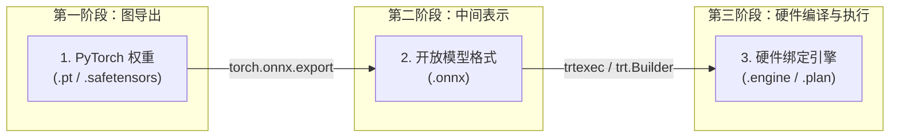
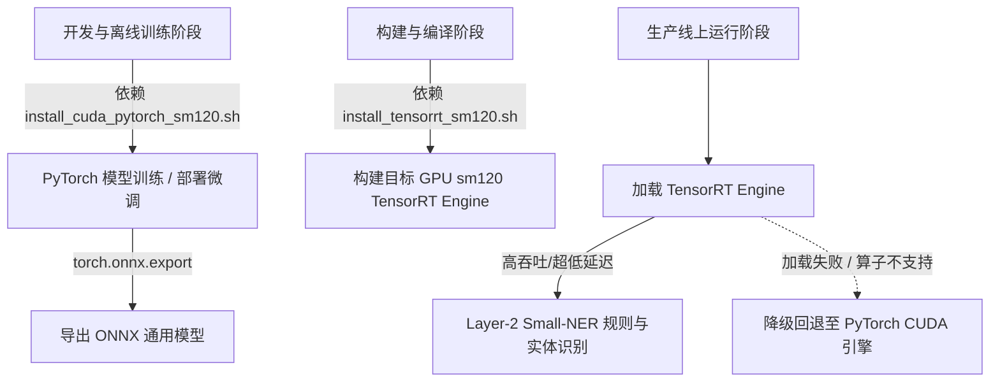

# PyTorch 到 TensorRT 引擎标准转换链路与工程实践指南

本文档详细介绍了 AI 模型从研发训练形态（PyTorch）到生产高性能推理形态（NVIDIA TensorRT Engine）的完整构建与优化链路。

---


## 1. 架构链路总览

标准的深度学习模型推理性能优化链路分为三个阶段：



$$\text{PyTorch (.pt / .safetensors)} \xrightarrow[\text{依赖 PyTorch/CUDA}]{\text{图跟踪与算子映射}} \text{ONNX (.onnx)} \xrightarrow[\text{依赖 trtexec / TensorRT Builder}]{\text{算子融合/硬件特定编译}} \text{TensorRT Engine (.engine)}$$

### 各阶段形态对比

| 维度 | 第一阶段 (PyTorch) | 第二阶段 (ONNX) | 第三阶段 (TensorRT Engine) |
|---|---|---|---|
| **文件后缀** | `.pt`, `.pth`, `.safetensors` | `.onnx` | `.engine`, `.plan` |
| **底层表示** | Python 动态计算图 / PyTorch C++ IR | 开放标准算子计算图 (Open Neural Network Exchange) | 硬件指令流水线与重组后的 CUDA Kernel 映射 |
| **硬件绑定性** | 跨平台/硬件无关 | 硬件无关 | **强绑定具体 GPU 架构与驱动版本** (如 `sm_120`) |
| **推理性能** | 中（适合训练/研发） | 中高（通过 ONNX Runtime） | **极高**（针对特定 GPU 深度重组与算子融合） |
| **运行时依赖** | `torch`, `cuda-runtime` | `onnxruntime` / `onnxruntime-gpu` | `libnvinfer.so`, `tensorrt-cu12` |

---

## 2. 第一阶段：PyTorch 模型导出为 ONNX (PyTorch $\to$ ONNX)

### 2.1 导出原理
PyTorch 采用动态图机制（Eager Mode）。导出为 ONNX 时，`torch.onnx.export` 会通过 Trace（追踪假数据输入）或 TorchScript AST 解析的方式，将 PyTorch 的计算逻辑抓取并转换成标准 ONNX Graph。

### 2.2 核心要点
1. **动态 Shape 声明 (`dynamic_axes`)**：
   - 生产环境中文本 Batch Size（如 `1` 到 `64`）和序列长度 Sequence Length（如 `16` 到 `512`）通常是动态变化的。
   - 导出时必须明确指定哪些维度是 dynamic，否则生成的 ONNX 只能接受固定 Shape。
2. **Eval 模式**：导出前必须显式调用 `model.eval()`，确保 Dropout 被禁用，Batch Normalization 切换为推理平滑模式。
3. **Opset Version**：推荐使用 `opset_version=17` 或更高，以完整支持现代 Transformer 算子（如 Multi-Head Attention, RMSNorm 等）。

### 2.3 完整导出代码示例 (`export_to_onnx.py`)

```python
import torch
import torch.nn as nn

class ExampleNERModel(nn.Module):
    """示例 NER 分类模型节点"""
    def __init__(self, vocab_size=30522, hidden_dim=256, num_classes=9):
        super().__init__()
        self.embedding = nn.Embedding(vocab_size, hidden_dim)
        self.lstm = nn.LSTM(hidden_dim, hidden_dim, batch_first=True, bidirectional=True)
        self.fc = nn.Linear(hidden_dim * 2, num_classes)

    def forward(self, input_ids):
        x = self.embedding(input_ids)
        out, _ = self.lstm(x)
        logits = self.fc(out)
        return logits

def export_model():
    model = ExampleNERModel()
    model.eval()  # 必须切换为评估模式

    # 构造 Dummy 输入 (Batch Size=1, Seq Len=128)
    dummy_input = torch.randint(0, 30522, (1, 128), dtype=torch.long)
    onnx_file_path = "ner_model.onnx"

    # 执行导出
    torch.onnx.export(
        model,
        dummy_input,
        onnx_file_path,
        export_params=True,        # 导出模型训练权重
        opset_version=17,           # Opset 版本号
        do_constant_folding=True,   # 执行常量折叠优化
        input_names=["input_ids"],  # 输入节点名称
        output_names=["logits"],    # 输出节点名称
        dynamic_axes={              # 动态维度设置
            "input_ids": {0: "batch_size", 1: "seq_len"},
            "logits": {0: "batch_size", 1: "seq_len"}
        }
    )
    print(f"[+] ONNX 模型已成功导出至: {onnx_file_path}")

if __name__ == "__main__":
    export_model()
```

---

## 3. 第二阶段：ONNX 模型校验与结构优化

在将 ONNX 喂给 TensorRT 之前，必须进行模型校验与计算图清理，避免残余废节点影响 TensorRT 算子融合。

### 3.1 模型正确性校验
```python
import onnx

onnx_model = onnx.load("ner_model.onnx")
onnx.checker.check_model(onnx_model)
print("[+] ONNX 模型拓扑结构与算子校验通过！")
```

### 3.2 图结构简化 (`onnx-simplifier`)
利用 `onnxsim` 工具折叠冗余的 Reshape、Unsqueeze、Identity 节点：
```bash
pip install onnxscript onnxsim
onnxsim ner_model.onnx ner_model_simplified.onnx
```

---

## 4. 第三阶段：TensorRT Engine 编译构建 (ONNX $\to$ TensorRT Engine)

TensorRT 引擎的编译是**硬件相关的优化过程**。TensorRT 会针对当前 GPU 架构（例如 NVIDIA Blackwell `sm_120`）执行以下优化：
1. **算子融合（Layer & Tensor Fusion）**：将 Conv + Bias + ReLU 或 Attention 中的多个 Gemm 融合成单个 CUDA Kernel。
2. **内核自动调优（Kernel Auto-Tuning）**：针对目标 GPU 的 SM 数量和 Cache 规格，筛选出延迟最小的 CUDA 内核实现。
3. **精度量化（Precision Calibration）**：自动转换 FP32 到 FP16 / BF16 / INT8 / FP4，并配置 Tensor Core 指令集。

---

### 4.1 方法 A：使用 `trtexec` 命令行快速构建 (推荐 CI/CD 自动化)

针对 **Blackwell (`sm_120`)** 和动态输入 Shape，执行以下命令构建 FP16 加速引擎：

```bash
trtexec \
  --onnx=ner_model_simplified.onnx \
  --saveEngine=ner_model_sm120.engine \
  --fp16 \
  --minShapes=input_ids:1x16 \
  --optShapes=input_ids:16x128 \
  --maxShapes=input_ids:64x512 \
  --memPoolSize=workspace:2048MiB
```

#### 参数详解：
- `--fp16`：开启 Tensor Core FP16 半精度加速（Blackwell 架构上性能提升显著）。
- `--minShapes / --optShapes / --maxShapes`：指定动态 Shape 范围。`optShapes` 是 TensorRT 进行 KernelAuto-Tuning 的核心基准形状。
- `--memPoolSize=workspace:2048MiB`：分配显存临时工作空间。

---

### 4.2 方法 B：使用 Python `trt.Builder` 原生 API 构建

如果需要将其集成到自动化 Python 服务中，可使用 TensorRT Python 绑定：

```python
import tensorrt as trt

def build_engine(onnx_path: str, engine_path: str):
    logger = trt.Logger(trt.Logger.INFO)
    builder = trt.Builder(logger)

    # 创建网络定义与构建配置
    network_flag = 1 << int(trt.NetworkDefinitionCreationFlag.EXPLICIT_BATCH)
    network = builder.create_network(network_flag)
    config = builder.create_builder_config()
    parser = trt.OnnxParser(network, logger)

    # 1. 解析 ONNX
    with open(onnx_path, "rb") as f:
        if not parser.parse(f.read()):
            for error in range(parser.num_errors):
                print(parser.get_error(error))
            raise RuntimeError("ONNX 解析失败")

    # 2. 设置精度模式 (FP16)
    if builder.platform_has_tf32:
        config.set_flag(trt.BuilderFlag.FP16)

    # 3. 设置动态 Shape Optimization Profile
    profile = builder.create_optimization_profile()
    profile.set_shape(
        "input_ids",
        min=(1, 16),      # 最小输入尺寸
        opt=(16, 128),    # 最佳推荐尺寸
        max=(64, 512)     # 最大输入尺寸
    )
    config.add_optimization_profile(profile)

    # 4. 构建并序列化 Engine
    print("[*] 开始编译 TensorRT Engine (针对当前 GPU 架构与驱动)...")
    serialized_engine = builder.build_serialized_network(network, config)
    
    with open(engine_path, "wb") as f:
        f.write(serialized_engine)
    print(f"[+] Engine 成功编译并写入: {engine_path}")

if __name__ == "__main__":
    build_engine("ner_model_simplified.onnx", "ner_model_sm120.engine")
```

---

## 5. 第四阶段：TensorRT Engine 推理与生命周期管理

### 5.1 运行时推理调用 (`trt.Runtime`)

构建好的 `.engine` 文件在运行时不再依赖 PyTorch 或 ONNX 解析器，仅需要轻量级 `libnvinfer.so` 运行：

```python
import tensorrt as trt
import torch

class TensorRTRuntimeEngine:
    def __init__(self, engine_path: str):
        self.logger = trt.Logger(trt.Logger.WARNING)
        self.runtime = trt.Runtime(self.logger)
        
        with open(engine_path, "rb") as f:
            self.engine = self.runtime.deserialize_cuda_engine(f.read())
            
        self.context = self.engine.create_execution_context()

    def infer(self, input_ids_tensor: torch.Tensor) -> torch.Tensor:
        """输入为 PyTorch CUDA Tensor，避免 Host-Device 内存拷贝开销"""
        batch_size, seq_len = input_ids_tensor.shape
        
        # 1. 设置当前推理的动态 Shape
        self.context.set_input_shape("input_ids", (batch_size, seq_len))
        
        # 2. 分配输出 Buffer
        output_shape = self.context.get_tensor_shape("logits")
        output_tensor = torch.empty(tuple(output_shape), dtype=torch.float32, device="cuda")

        # 3. 绑定 CUDA 内存地址指针
        self.context.set_tensor_address("input_ids", input_ids_tensor.data_ptr())
        self.context.set_tensor_address("logits", output_tensor.data_ptr())

        # 4. 执行异步 GPU 推理
        stream = torch.cuda.current_stream().cuda_stream
        self.context.execute_async_v3(stream_handle=stream)
        
        return output_tensor
```

---

## 6. 在 `PrivShield` 中的架构设计总结

在 `PrivShield` 的轻量化边缘侧部署架构中，本链路发挥着核心作用：



1. **研发与编译期**：使用 `../../scripts/env/install_cuda_pytorch_sm120.sh` 安装支持 Blackwell (`sm120`) 的 PyTorch，完成 NER/VLM 模型训练与 ONNX 导出。
2. **优化与构建期**：使用 `../../scripts/env/install_tensorrt_sm120.sh` 中的 TensorRT Builder 工具将 ONNX 编译为高性能 `.engine` 文件。
3. **生产部署期**：对于只需 Small-NER 的纯推理容器，可以裁剪掉庞大的 PyTorch 依赖，仅保留 TensorRT 运行时，实现**超小镜像体积（< 500MB）与微秒级推理延迟**。