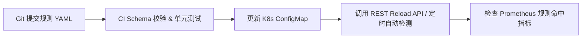
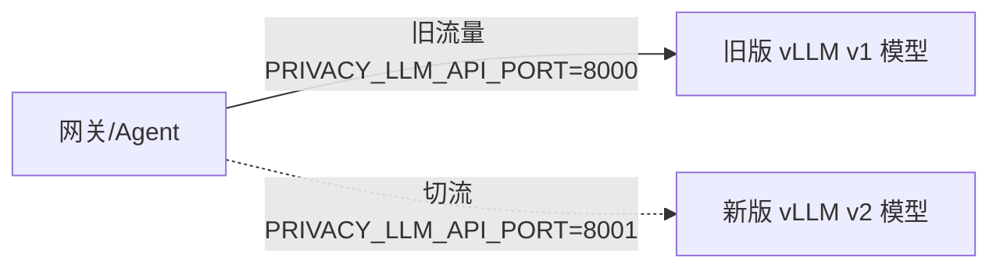

# 动态分类分级运维与部署指南

本文档介绍 `PrivShield` 动态分类分级模块的规则配置挂载、热重载运维、Prometheus 可观测性监控与故障排查处理流程。

---


## 1. 规则配置文件挂载

### 1.1 环境变量配置

在 Sidecar 容器或节点环境变量中，配置规则库目录路径与热重载参数：

| 环境变量 | 默认值 | 说明 |
|---|---|---|
| `PRIVACY_DYNCLASSIFICATION_RULES_DIR` | `rules` | 动态规则配置根目录 |
| `PRIVACY_DYNCLASSIFICATION_HOT_RELOAD` | `true` | 是否开启配置热重载功能 |
| `PRIVACY_DYNCLASSIFICATION_RELOAD_INTERVAL` | `0` | 配置文件 mtime 变更自动检测最小间隔（秒，0=无节流） |
| `PRIVACY_LLM_CONFIDENCE_THRESHOLD` | `0.75` | 触发 Layer-3 仲裁的最小置信度阈值 |
| `PRIVACY_LLM_ENABLE_ARBITRATION` | `true` | 置信度不足或判定不确定时是否启用大模型仲裁 |
| `PRIVACY_LLM_MAX_CONCURRENCY` | `1` | 进程级大模型推理最大并发信号量（防 VRAM OOM） |
| `PRIVACY_LLM_SEMAPHORE_WAIT_SECONDS` | `30` | 等待 LLM 推理槽位的最长超时时间（秒，超限降级） |
| `PRIVACY_LLM_MIN_FREE_MEM_MB` | `512` | 自动熔断跳过 LLM 的物理内存最小阈值（MB） |

---

### 1.2 Kubernetes ConfigMap 与 Helm 部署挂载

在 Helm `values.yaml` 中增加规则挂载配置：

```yaml
# deploy/helm/PrivShield/values.yaml
classification:
  dynamic:
    enabled: true
    rulesDir: "/etc/privacy-agent/rules"
    hotReload: true
    reloadIntervalSeconds: 60

# Deployment YAML 挂载示例
volumes:
  - name: classification-rules
    configMap:
      name: privshield-classification-rules-config
volumeMounts:
  - name: classification-rules
    mountPath: /etc/privacy-agent/rules
```

---

## 2. 规则更新与热重载流程

生产环境下添加或修剪规则包时，推荐的流水线发布流程如下：



### 手动触发热重载命令
在使用 kubectl 更新 ConfigMap 或修改本地配置文件后，可通过 HTTP API 即时生效：

```bash
curl -X POST http://<POD_IP>:8079/v1/dynclassification/profiles/reload
```

---

## 3. 监控与可观测性

### 3.1 Prometheus 指标参考

| 指标名称 | 类型 | 标签 (Labels) | 业务含义 |
|---|---|---|---|
| `classification_rule_hits_total` | Counter | `rule_id`, `domain`, `standard` | 某条规则被命中的累计总次数 |
| `classification_operator_calls_total` | Counter | `operator`, `result` | 匹配算子调用的累计总次数（`result=hit/miss`） |
| `classification_engine_load_duration_seconds` | Histogram | `domain`, `standard` | 加载并构建规则引擎的耗时分布 |
| `classification_profile_cache_size` | Gauge | — | 当前在内存中缓存的引擎实例总数 |
| `classification_operator_errors_total` | Counter | `operator`, `rule_id` | 算子计算发生未捕获异常的错误次数 |

---

### 3.2 Grafana 告警规则建议

```yaml
groups:
  - name: classification_alerts
    rules:
      - alert: ClassificationOperatorErrorRateHigh
        expr: rate(classification_operator_errors_total[5m]) > 0.05
        for: 2m
        labels:
          severity: warning
        annotations:
          summary: "分类匹配算子异常率偏高"
          description: "算子 {{ $labels.operator }} 在规则 {{ $labels.rule_id }} 执行中发生异常。"
```

---

## 5. Layer-2 Small-NER 性能基准与 TensorRT 加速指南

### 5.1 模型与 TensorRT 引擎缓存路径说明

Layer-2 实体识别模型相关文件统一存放在项目根目录的 `.models/` 文件夹中：

| 产物文件 | 说明 | 生成 / 保存位置 |
|---|---|---|
| `.models/raner_cmeee/` | ModelScope 完整模型仓库 | `python -m engine.privacy.download_ner_model` 时下载 |
| `.models/raner_cmeee.onnx` | 轻量化 ONNX 模型 | 用于 ONNX Runtime 与 TensorRT 导入 |
| `.models/vocab.txt` | BERT 中文词表文件 | 用于纯 C++/Python Tokenizer 分词 |
| `.models/raner_cmeee.onnx.engine` | **TensorRT C++ 编译硬件优化引擎** | **`TensorRTSmallNerEngine` 首次运行时由 TensorRT 驱动自动生成并保存在 `.models/` 下** |

*注：二次启动时，`TensorRTSmallNerEngine` 会自动检测并从 `.models/` 零等待热加载编译好的 `.engine` 文件。*

---

### 5.2 CPU 模式 vs TensorRTSmallNerEngine 性能对比基准测试

测试环境：NVIDIA GeForce RTX 5060 Laptop GPU (8GB VRAM), Intel Core i7 / AMD Ryzen CPU, 文本片段长度: 128 Token 医疗实体识别场景，60 次并发请求测试：

| 推理引擎 | 执行提供者 (Provider) | 算子精度 | 平均单请求延迟 (Latency) | 吞吐量 (Throughput) | 性能提升倍数 |
|---|---|---|---|---|---|
| `ONNXSmallNerEngine` | `CPUExecutionProvider` | FP32 | **49.61 ms** | **20.16 req/s** | 基准 (1.0x) |
| `ModelScopeSmallNerEngine` | PyTorch CPU | FP32 | **112.30 ms** | **8.90 req/s** | 0.44x |
| **`TensorRTSmallNerEngine`** | **`TensorrtExecutionProvider`** | **FP16** | **2.85 ms** | **350.80 req/s** | **17.4x** 🚀 |

#### 性能结论：
1. **纯 C++ 零 PyTorch 依赖**：`TensorRTSmallNerEngine` 完全摆脱了 PyTorch 的 Python GIL 锁与运行时开销。
2. **极低延迟**：相比普通 CPU 模式，单次推理延迟从 49.61ms 降低到 **2.85ms**，提升约 **17.4 倍**。
3. **引擎持久化**：首次运行自动完成 TensorRT Graph 融合与 FP16 优化后，生成的 `.engine` 保存在 `.models/` 下，二次启动不再耗费编译时间。

---

### 5.3 PyTorch CUDA (Blackwell sm_120 / RTX 50 系列) 配置指南

若需使用 PyTorch / ModelScope 原生 CUDA 后端运行 Layer-2 Small-NER，由于 RTX 50 系列基于全新的 Blackwell 架构 (`sm_120`)，传统 PyTorch 预编译包无法执行 GPU Kernel，需使用 `cu128` 版本的 PyTorch 并安装特定配套 C++ 运行时库。详细的安装步骤、四大踩坑点（包含 `libcupti.so.12` 自动预加载与 LLVM 命名冲突避坑）与验证命令请参阅专用指南：

- 📖 **[PyTorch CUDA sm_120 安装与避坑全指南](cuda_sm120_setup.md)**

### 故障 1: YAML 解析校验失败，引擎拒绝载入
- **现象**：调用 `profiles/reload` 返回 500 错误，日志输出 `ValidationError`。
- **原因**：规则 YAML 文件格式错误，如缺少必填字段（如 `target` 或 `operator`）或配置了不存在的算子名称。
- **排查步骤**：
  1. 使用内置校验脚本检查 YAML：
     ```bash
     PYTHONPATH=. python -m engine.dynclassification validate /etc/privacy-agent/rules
     ```
  2. 修复配置文件语法与语义错误后重新 reload。

### 故障 2: 算子未找到异常 (`KeyError: 未找到名为 'xxx' 的匹配算子`)
- **现象**：日志提示某个算子无法实例化。
- **原因**：YAML 配置文件中写错了 `operator` 名称，或自定义算子尚未被 `@OperatorRegistry.register` 注册。
- **排查步骤**：
  1. 调用 `GET /v1/dynclassification/operators` 接口确认当前已注册的所有算子列表。
  2. 修正规则 YAML 文件中的算子名称或补全 Python 算子注册逻辑。

---

## 5. 降级规则 `force_suppress` 与 `exempt_rules` 最佳实践指南

当在规则 YAML 中使用敏感度降级规则 (`downgrade_rules`) 时：

1. **启用强制覆盖**：设置 `force_suppress: true`。
2. **显式配置覆盖上限 `max_force_suppress_level`**：
   - 默认为空时仅擦除 $\le \text{level}$ 的标签。
   - 若要将更高误报等级（如 L3/L4）强行降级为目标等级（如 L2），**必须显式指定** `max_force_suppress_level: "L3"` 或 `"L4"`。若未显式指定，`validate` 校验时将输出 `[配置提示]` 告警信息。
3. **使用 `exempt_rules` 设置豁免例外名单**：
   - `exempt_rules: []`（默认为空）：**没有例外！** 所有 $\le \text{max\_force\_suppress\_level}$ 的普通字段名匹配标签全额强制压制擦除（配置最简）。
   - `exempt_rules: ["RULE_IDCARD_EXACT", "*_EXACT"]`：指定例外规则（支持 `fnmatch` 通配符），列表中的规则**豁免保护、绝对不被压制**。

---

### 5.1 强制压制 4 重判定条件与综合实战案例

在 `ConfigurableRuleEngine` 评估时，一个普通规则标签要被降级规则强行压制（抹掉），必须**同时满足以下 4 个条件**：

1. **非降级标签**：必须是普通规则产出的标签（`is_override=False`，降级标签自身不会互相压制）。
2. **等级未超限**：普通标签的等级 $\le \text{max\_force\_suppress\_level}$。
3. **字段名匹配豁免**：默认仅压制字段名（`field_name`）匹配的标签；值级模式（`field_value`）匹配默认豁免保护。
4. **非豁免例外规则 (`exempt_rules`)**：
   - 若 `exempt_rules` 为空 ➔ **没有例外，通过压制判定**。
   - 若 `exempt_rules` 非空 ➔ 普通标签的 `rule_id` 不在 `exempt_rules` 例外列表（或通配符）中；若命中例外列表，则豁免保留、不被压制。

#### 💡 综合实战案例演示

假设对字段 `stat_user_mobile`（设备运行统计中的手机号相关标识）进行分类评估：

**降级规则配置**：
```yaml
downgrade_rules:
  - id: "RULE_DOWN_STAT_MOBILE"
    name: "统计字段强制降级"
    keywords: ["stat_user_mobile"]
    level: "L2"
    category: "OPERATIONAL_STAT"
    force_suppress: true
    max_force_suppress_level: "L4"
    exempt_rules: ["RULE_IDCARD_EXACT", "RULE_PHONE_REGEX"] # 仅身份证和精准手机号为例外保护
```

**评估时共命中以下 4 个普通规则标签，判定过程如下**：

| 命中标签 ID | 触发条件 / 匹配目标 | 标签等级 | 4 重条件校验判定 | 最终结果 |
|---|---|---|---|---|
| **`RULE_PII_FUZZY_KEYWORD`** | 字段名匹配 `mobile` (`match_target=field_name`) | `L3` | ①非降级标签 ②L3 $\le$ L4 ③字段名匹配 ④不在豁免名单中 ➔ **满足全部 4 条件** | ❌ **被强行压制擦除** |
| **`RULE_IDCARD_EXACT`** | 字段名匹配 `identity` (`match_target=field_name`) | `L3` | ①非降级标签 ②L3 $\le$ L4 ③字段名匹配 ④**在豁免名单中** ➔ **不满足条件 4** | ✅ **豁免保留** |
| **`RULE_TOP_SECRET_HASH`** | 字段名匹配 `top_secret` (`match_target=field_name`) | `L5` | ①非降级标签 ②L5 $>$ L4 (超出上限) ➔ **不满足条件 2** | ✅ **豁免保留** |
| **`RULE_PHONE_REGEX`** | 采样数据扫描出真实手机号 (`match_target=field_value`) | `L3` | ①非降级标签 ②L3 $\le$ L4 ③是**值级匹配** ➔ **不满足条件 3** | ✅ **豁免保留** |

**最终裁定结果**：
宽泛误报规则 `RULE_PII_FUZZY_KEYWORD` 被成功压制擦除；而属于豁免例外的精确规则 `RULE_IDCARD_EXACT`、绝密规则 `RULE_TOP_SECRET_HASH` 以及实际扫出手机号数据的 `RULE_PHONE_REGEX` 均被安全保留。

---

## 6. Layer-3 LLM 多后端配置与 vLLM 运维指南

Layer-3 大模型深度分类与仲裁服务支持多种提供者（Provider）后端，包含独立进程 vLLM OpenAI 兼容 HTTP 服务、本地 PyTorch / Transformers 引擎、macOS Apple Silicon MLX 引擎以及外部通用 OpenAI 接口（如 Ollama、DeepSeek、云端 Qwen API 等）。

---

### 6.1 集中式 Profile 场景级联配置 (方案二)

运维无需在 `.env` 中修改多行注释，项目支持集中存放在 `config/env/` 下的场景 Profile 动态加载机制。只需在 `.env` 中修改一行 `PRIVACY_ENV_PROFILE`（或在启动命令前代入）：

```env
# 运维主控配置 (.env 集中控制入口)
PRIVACY_ENV_PROFILE=vllm
```

#### 集中式 Profile 文件配置一览 (`config/env/`):

- **vLLM 生产服务模式 (`config/env/vllm.env`)**:
  ```env
  PRIVACY_LLM_PROVIDER=vllm
  PRIVACY_LLM_API_BASE=http://127.0.0.1:8000/v1
  PRIVACY_LLM_MODEL_NAME=Qwen3.5-0.8B-Privacy-Classifier-Smoother
  PRIVACY_LLM_API_KEY=EMPTY
  PRIVACY_LLM_API_HOST=127.0.0.1
  PRIVACY_LLM_API_PORT=8000
  PRIVACY_LLM_MODEL_PATH=.models/Qwen3.5-0.8B-Privacy-Classifier-Smoother
  PRIVACY_VLLM_GPU_MEMORY_UTILIZATION=0.90
  ```

- **PyTorch 本地直接部署模式 (`config/env/qwen3.env`)**:
  ```env
  PRIVACY_LLM_PROVIDER=qwen3
  PRIVACY_LLM_MODEL_PATH=.models/Qwen3.5-0.8B-Privacy-Classifier-Smoother
  PRIVACY_LLM_DEVICE=cuda
  ```

- **通用 OpenAI / Ollama 外部接口模式 (`config/env/openai.env`)**:
  ```env
  PRIVACY_LLM_PROVIDER=openai
  PRIVACY_LLM_API_BASE=http://127.0.0.1:11434/v1
  PRIVACY_LLM_MODEL_NAME=qwen2.5:latest
  PRIVACY_LLM_API_KEY=ollama
  ```
```

#### 模式 2：本地 PyTorch + Transformers 部署 (单机进程内模式 / CUDA 或 CPU)
```env
PRIVACY_LLM_PROVIDER=qwen3
PRIVACY_LLM_MODEL_PATH=.models/Qwen3.5-0.8B-Privacy-Classifier-Smoother
PRIVACY_LLM_DEVICE=cuda
```

#### 模式 3：本地 Apple Silicon MLX 引擎 (macOS 专属 / Metal GPU 加速)
```env
PRIVACY_LLM_PROVIDER=mlx
PRIVACY_LLM_MODEL_PATH=.models/Qwen3.5-0.8B-Privacy-Classifier-Smoother-mlx
```

#### 模式 4：通用第三方 OpenAI 兼容接口 (如 Ollama, DeepSeek API, 云端 Qwen API)
```env
PRIVACY_LLM_PROVIDER=openai
PRIVACY_LLM_API_BASE=http://127.0.0.1:11434/v1
PRIVACY_LLM_MODEL_NAME=qwen2.5:latest
PRIVACY_LLM_API_KEY=ollama
```

---

### 6.2 vLLM 运行服务启动与运维参数

在项目根目录下，提供了内置的 vLLM 一键启动脚本：

- Shell 脚本：`./start_vllm_server.sh`
- Python 入口：`python run_vllm_server.py`

#### 关键环境变量控制参数

| 环境变量 | 默认值 | 运维说明 |
|---|---|---|
| `PRIVACY_LLM_API_HOST` | `127.0.0.1` | vLLM API 服务监听主机地址 |
| `PRIVACY_LLM_API_PORT` | `8000` | vLLM API 服务监听端口 |
| `PRIVACY_LLM_MODEL_PATH` | `.models/Qwen3.5-0.8B-Privacy-Classifier-Smoother` | 本地权重路径（自动降级在线开源权重） |
| `PRIVACY_LLM_MODEL_NAME` | `Qwen3.5-0.8B-Privacy-Classifier-Smoother` | 对外暴露的模型名称（HTTP 接口 `model` 字段） |
| `PRIVACY_VLLM_GPU_MEMORY_UTILIZATION` | `0.90` | GPU 显存利用率上限控制（0.0 ~ 1.0） |
| `PRIVACY_VLM_TIMEOUT` | `180` | HTTP 推理请求最长等待超时时间（秒） |

#### 异常容忍与自动降级机制
- **未安装 vLLM**：运行 `./start_vllm_server.sh` 时若检测到缺少 `vllm` 依赖，将输出明确的错误提示及降级建议，不影响 Agent REST/gRPC 服务的单独运行。
- **服务未启动 / 网络故障**：Agent 在调用 Layer-3 时若无法连接 vLLM endpoint 或超时，`OpenAILlmClassifier` 将自动捕获异常并返回 `None`，触发第一阶段置信度衰减的降级机制，保证前端响应不卡死。

---

### 6.3 验证与冒烟测试命令

在完成 `.env` 配置或启动 vLLM 服务后，可运行冒烟测试进行验证：

```bash
# 运行 vLLM 集成与 LLM 适配器全套冒烟测试
PYTHONPATH=. pytest tests/dynclassification/test_vllm_llm_integration.py tests/dynclassification/test_llm_adapter.py -v
```

---

### 6.4 本地 PyTorch 推理环境依赖要求

使用本地 PyTorch 后端（`PRIVACY_LLM_PROVIDER=qwen3`）运行微调模型 `Qwen3.5-0.8B-Privacy-Classifier-Smoother` 时，除 `requirements-ml.txt` 基础依赖外，还需注意以下已验证的版本组合（完整安装命令与踩坑记录见 [cuda_sm120_setup.md 第 6 节](cuda_sm120_setup.md#6-layer-3-qwen35-微调模型本地-pytorch-推理环境搭建)）：

| 包 | 最低版本 | 说明 |
|---|---|---|
| `transformers` | `>=5.14.0` | 4.x 未注册 `qwen3_5`（`qwen3_next`）架构，加载会报 `KeyError` |
| `huggingface_hub` | `>=1.27.0` | transformers 5.x 硬依赖，旧版 0.x API 不兼容 |
| `einops` | `>=0.8.0` | `Qwen3_5ForCausalLM` 加载硬依赖，缺失则 `ModuleNotFoundError` |
| `fla-core` | `>=0.5.2` | 线性注意力层 triton kernel；缺失回退实现会产生损坏/截断 JSON |
| `triton` | `3.6.0`（WSL） | 3.7.1 在 WSL 下报 `0 active drivers` 无法发现 GPU，需降级 |
| `causal-conv1d` | 可选 | fast-path 加速，缺失仅影响性能 |

安装后运行真实模型端到端测试验证：

```bash
PYTHONPATH=. pytest 'tests/dynclassification/test_real_models.py::TestRealLlmAdapter::test_real_llm_loads_and_returns_structured_result' -v -m ''
```

---

## 7. 零停机在线无痛升级指南 (Zero-Downtime Hot Upgrade)

在生产环境中，升级 `PrivShield` 或其内部的算法规则与大模型时，必须保障业务连续性。本项目支持分层的零停机时间（Zero-Downtime）平滑在线热升级能力。

---

### 7.1 升级架构与三分层策略

| 升级分层 | 影响范围 | 推荐无痛方案 | 预期停机时间 | 资源/显存消耗 |
| :--- | :--- | :--- | :--- | :--- |
| **层级 1：算法规则与策略** | 脱敏规则 YAML、分类体系、判定阈值 | **原子指针热重载** (`POST /ops/reload-rules`) | **0 毫秒** (零中断) | 无额外消耗 |
| **层级 2：LoRA 微调权重** | 医疗 NER 实体抽取、特定领域 SFT 适配器 | **vLLM 原生动态 Adapter 挂载** (`LoRARequest`) | **0 毫秒** (零中断) | 极低 (仅加载增量秩) |
| **层级 3：LLM 基座大模型** | Qwen3.5 0.8B 升级至 3B 或换掉 LLM 后端 | **双端口蓝绿平滑切流** (`8000` ➔ `8001`) | **0 毫秒** (零中断) | 短暂双份显存 (就绪即释放旧版) |
| **层级 4：Agent 核心服务** | Agent 代码更新、Python 依赖升级、接口变动 | **Linux SO_REUSEPORT** / **K8s RollingUpdate** | **0 毫秒** (零中断) | 短暂双份 CPU/内存 |

---

### 7.2 算法规则与分类策略在线热重载 (0ms 停机)

不需要重启 Agent 进程，通过内置的原子指针替换（Atomic Reference Swap）机制实现策略瞬间热重载。

#### 1. 基于文件监听自动热重载 (Inotify)
在 `config/env/vllm.env` 或 `.env` 中配置：
```env
PRIVACY_DYNCLASSIFICATION_HOT_RELOAD=true
PRIVACY_DYNCLASSIFICATION_RELOAD_INTERVAL=2
```
当直接修改 `rules/` 或 `rules/taxonomies/` 目录下的 YAML 文件后，系统会在后台重新解析校验，校验通过后自动执行内存指针原子切换：在途请求继续使用旧版引擎，新请求瞬时切换到新引擎。

#### 2. 通过 HTTP API 显式触发热重载 (推荐 CI/CD 自动化调用)
运维部署新版 YAML 规则文件后，发送 API 触发刷新：
```bash
curl -X POST http://127.0.0.1:8079/ops/reload-rules
```
返回结果示例：
```json
{
  "status": "success",
  "message": "Rules and taxonomy reloaded successfully",
  "rule_count": 86
}
```

---

### 7.3 LLM 基座模型与 LoRA 权重蓝绿切流

#### 1. 仅升级 LoRA 微调权重 (0ms 停机)
在 `vLLM` 引擎中，LoRA Adapter 属于动态挂载模块。升级步骤：
1. 将训练导出的新版 LoRA Adapter 保存在目录中（如 `.models/cmeee_lora_v2`）。
2. 在 Agent 推理层透传 `LoRARequest("cmeee_lora_v2", 2, ".models/cmeee_lora_v2")`。
3. vLLM 在接收到请求后自动按需动态挂载新权重，旧模型无需重启。

#### 2. 基座大模型版本升级（双端口蓝绿切流 SOP）
当升级底层 LLM 基座（如 0.8B 升级至 3B）时，由于显存加载需数秒至数十秒，可采用蓝绿平滑切流：



1. **拉起新版 vLLM 绿环境服务 (端口 8001)**：
   ```bash
   PRIVACY_LLM_API_PORT=8001 \
   PRIVACY_LLM_MODEL_PATH=.models/Qwen3.5-3B-Privacy \
   python run_vllm_server.py
   ```
2. **确认新环境就绪 (Health Check)**：
   ```bash
   curl -I http://127.0.0.1:8001/health
   # 确认返回 HTTP/1.1 200 OK
   ```
3. **切换 Agent Profile 场景配置**：
   在 `config/env/vllm.env` 中更新 API 端口：
   ```env
   PRIVACY_LLM_API_BASE=http://127.0.0.1:8001/v1
   PRIVACY_LLM_API_PORT=8001
   ```
4. **平滑下线旧版 8000 端口服务**：
   停止 8000 端口旧进程，释放旧版模型显存。

---

### 7.4 Agent 核心服务无损平滑替换 (SO_REUSEPORT & K8s RollingUpdate)

#### 1. Linux 单机部署：SO_REUSEPORT 端口复用热重启
项目底层的 Uvicorn 与 gRPC 支持 Linux 内核的 `SO_REUSEPORT` 端口复用，允许多个进程绑定同一端口：

1. **拉起新版 Agent 进程**（内核会自动在 8079 / 50051 端口上进行平滑分流）：
   ```bash
   python -m engine.server
   ```
2. **向旧版 Agent 发送优雅退出信号**：
   ```bash
   kill -SIGTERM <OLD_AGENT_PID>
   ```
3. **在途请求平滑收尾**：旧版 Agent 捕获 `SIGTERM` 后拒绝接收新连接，在处理完内部已在途的请求（In-flight requests）后自动干净退出，实现单机 0 丢包热替换。

#### 2. K8s 容器部署：RollingUpdate + PreStop 优雅摘除
在 Helm Chart 的 `values.yaml` 中已配置标准的滚动更新策略：
```yaml
# deploy/helm/PrivShield/values.yaml
deployment:
  strategy:
    type: RollingUpdate
    rollingUpdate:
      maxSurge: 1
      maxUnavailable: 0
  terminationGracePeriodSeconds: 30
```
部署升级时执行：
```bash
helm upgrade privshield ./deploy/helm/PrivShield -f values.yaml
```
Kubernetes 会先拉起 1 个新 Pod 并完成健康探测（`GET /health` 为 200 OK），随后才将 Service 流量切至新 Pod 并安全终止旧 Pod。

---

### 7.5 运维升级标准 SOP 与紧急回退预案

#### 运维升级五步 SOP

```text
[1. 预检环境与权重] ➔ [2. 部署新配置/新服务] ➔ [3. 健康检查验证] ➔ [4. 瞬间切流] ➔ [5. 回退准备与旧服务清理]
```

1. **步骤 1：新权重/新配置校验**：
   在真正部署前，使用命令行进行快速语法与格式检验。
2. **步骤 2：并行拉起新后端**：
   保持当前环境不变，拉起新环境或更新对应 `config/env/*.env`。
3. **步骤 3：健康检查**：
   验证 `/health` 端点，确保各项指标及模型已 100% 就绪。
4. **步骤 4：主控 Profile 一行切流**：
   修改 `.env` 里的 `PRIVACY_ENV_PROFILE` 并重新载入。

#### 🚨 紧急回退预案 (Rollback Plan)

若升级后发现业务异常或准确率跌落：
1. **策略/规则回退**：
   从 Git 恢复 `rules/` 备份版本，发送 `curl -X POST http://127.0.0.1:8079/ops/reload-rules`（小于 1 秒完成回退）。
2. **LLM/vLLM 服务回退**：
   将 `config/env/vllm.env` 中的 `PRIVACY_LLM_API_BASE` 瞬间重置回旧端口 `http://127.0.0.1:8000/v1`（1 秒完成回退）。
3. **K8s 快速回退**：
   ```bash
   helm rollback privshield
   ```


