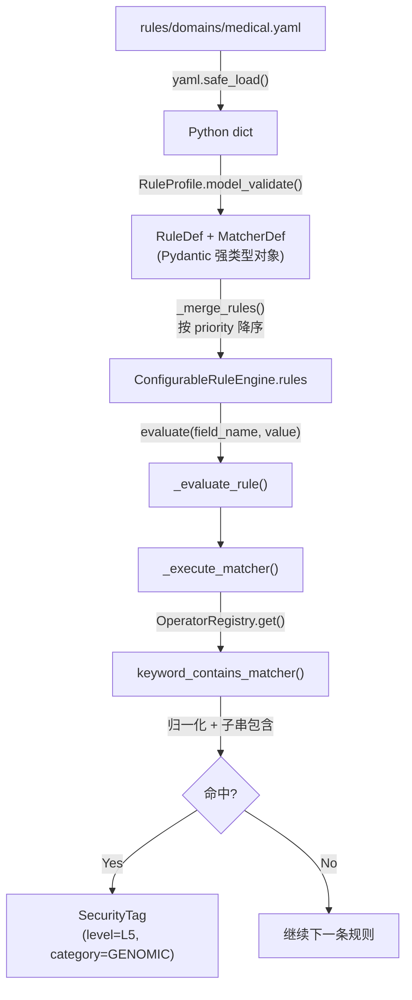

# 规则解析与执行机制详解

本文档以 `rules/domains/medical.yaml` 中的 `RULE_MED_G_001` 规则为例，详细说明声明式规则从 YAML 配置文件到运行时匹配执行的完整生命周期，以及在不同部署环境下的规则目录配置方法。

---


## 1. 规则定义示例

以医疗领域基因组规则为例：

```yaml
# rules/domains/medical.yaml
- id: "RULE_MED_G_001"
  name: "BRCA/TP53 基因指标"
  category: "GENOMIC"
  level: "L5"
  priority: 200
  matchers:
    - target: "field_name"
      operator: "keyword_contains"
      params:
        keywords: ["brca1", "brca2", "tp53"]
```

各字段含义：

| 字段 | 值 | 说明 |
|---|---|---|
| `id` | `RULE_MED_G_001` | 规则唯一标识，用于日志追踪和 Prometheus 指标 |
| `name` | `BRCA/TP53 基因指标` | 人类可读名称 |
| `category` | `GENOMIC` | 命中后输出的分类类别 ID |
| `level` | `L5` | 命中后输出的敏感度等级 ID |
| `priority` | `200` | 执行优先级（数值越大越先执行） |
| `matchers` | 匹配器列表 | 定义匹配目标、算子和参数 |
| `matchers[].target` | `field_name` | 匹配目标为字段名（另一选项为 `field_value`） |
| `matchers[].operator` | `keyword_contains` | 使用的匹配算子名称 |
| `matchers[].params` | `{keywords: [...]}` | 传递给算子的参数字典 |

---

## 2. 解析流程（加载阶段）

### 2.1 文件读取与 YAML 反序列化

入口方法：`ProfileLoader.load_profile("medical")`

```python
# engine/dynclassification/profile_loader.py
path = self.rules_dir / "domains" / "medical.yaml"
data = yaml.safe_load(path.read_text(encoding="utf-8"))
```

`yaml.safe_load()` 将 YAML 文本解析为 Python 嵌套字典（dict），此时尚无任何类型约束。

### 2.2 Pydantic 模型校验与结构化

```python
self._profile_cache[domain] = RuleProfile.model_validate(data)
```

Pydantic v2 递归校验整个数据结构，将其转换为强类型对象树：

```text
RuleProfile
├── domain = "medical"
├── version = "1.0.0"
├── rules: list[RuleDef]
│   └── [0] RuleDef(
│           id = "RULE_MED_G_001",
│           name = "BRCA/TP53 基因指标",
│           category = "GENOMIC",
│           level = "L5",
│           priority = 200,
│           match_logic = "AND",       ← 默认值（YAML 未显式指定）
│           enabled = True,            ← 默认值
│           matchers = [
│               MatcherDef(
│                   target = "field_name",
│                   operator = "keyword_contains",
│                   params = {"keywords": ["brca1", "brca2", "tp53"]}
│               )
│           ]
│       )
├── downgrade_rules: list[DowngradeRuleDef]
└── composite_rules: list[CompositeRuleDef]
```

涉及的模型定义位于 `engine/dynclassification/rule_schema.py`：

| 模型类 | 职责 |
|---|---|
| `MatcherDef` | 描述单个匹配器（target + operator + params） |
| `RuleDef` | 单条规则（含匹配器列表、命中后标签、优先级） |
| `DowngradeRuleDef` | 降级规则（字段名关键词匹配后降低等级） |
| `CompositeRuleDef` | 复合规则（记录级多字段组合判定） |
| `RuleProfile` | 一个领域包的完整定义 |

### 2.3 引擎构建与规则排序

`ConfigurableRuleEngine` 构造时合并所有 Profile 的规则：

```python
# engine/dynclassification/engine.py
def _merge_rules(self, profiles: list[RuleProfile]) -> list[RuleDef]:
    all_rules = []
    for profile in profiles:
        all_rules.extend(r for r in profile.rules if r.enabled)
    return sorted(all_rules, key=lambda r: r.priority, reverse=True)
```

`RULE_MED_G_001` 的 `priority=200` 为最高优先级，在规则列表中排在最前面被优先执行。

---

## 3. 执行流程（运行时阶段）

### 3.1 总体调用链

```text
engine.evaluate("brca1_mutation", "阳性")
│
├── 遍历 self.rules（按 priority 降序）
│   └── _evaluate_rule(RULE_MED_G_001, "brca1_mutation", "阳性")
│       │
│       ├── 遍历 rule.matchers（本规则仅 1 个 matcher）
│       │   └── _execute_matcher(matcher, "brca1_mutation", "阳性")
│       │       ├── target == "field_name" → target_value = "brca1_mutation"
│       │       ├── OperatorRegistry.get("keyword_contains") → 算子函数
│       │       └── keyword_contains_matcher("brca1_mutation", params) → True
│       │
│       ├── match_logic = "AND" → all([True]) = True → 命中
│       │
│       └── 生成 SecurityTag(level="L5", category="GENOMIC", rule_id="RULE_MED_G_001")
│
├── 执行降级规则（_evaluate_downgrade）
│
└── 去重返回 _unique_tags(tags)
```

### 3.2 匹配器执行细节

`_execute_matcher()` 方法的核心逻辑（返回归一化的 `OperatorResult`）：

```python
def _execute_matcher(self, matcher: MatcherDef, field_name: str, str_value: str) -> OperatorResult:
    # 1. 从注册表获取算子函数（KeyError 时返回 miss）
    try:
        op_func = OperatorRegistry.get(matcher.operator)
    except KeyError:
        return OperatorResult(hit=False)

    # 2. 根据 target 决定输入值
    target_value = field_name if matcher.target == "field_name" else str_value

    # 3. 空值短路
    if target_value is None or target_value == "":
        return OperatorResult(hit=False)

    # 4. 执行算子并归一化结果（支持 bool / OperatorResult / tuple 三种返回）
    try:
        raw = op_func(target_value, matcher.params)
        return normalize_result(raw)
    except Exception as exc:
        # 算子异常 fail-safe：记录错误指标，返回未命中
        logger.warning(f"operator_execution_failed: {matcher.operator}", exc_info=exc)
        return OperatorResult(hit=False)
```

**`normalize_result()` 归一化逻辑**：

```python
def normalize_result(raw: bool | OperatorResult | tuple) -> OperatorResult:
    if isinstance(raw, bool):
        return OperatorResult(hit=raw)
    elif isinstance(raw, OperatorResult):
        return raw
    elif isinstance(raw, tuple):  # 向后兼容 (hit, level, category)
        return OperatorResult(hit=raw[0], level=raw[1], category=raw[2])
    else:
        return Operator(hit=bool(raw))
```

### 3.3 `keyword_contains` 算子实现

```python
# engine/dynclassification/operators.py
@OperatorRegistry.register("keyword_contains")
def keyword_contains_matcher(value: Any, params: dict[str, Any]) -> bool:
    keywords = params.get("keywords", [])
    use_word_boundaries = params.get("use_word_boundaries", False)  # 默认纯子串匹配

    if use_word_boundaries:
        # 单词边界模式：对原始值仅做小写化，保留分隔符以使 \b 生效
        raw_lower = str(value).lower() if value else ""
        if not raw_lower:
            return False
        for kw in keywords:
            if kw:
                pattern = r"\b" + re.escape(kw.lower()) + r"\b"
                if re.search(pattern, raw_lower):
                    return True
        return False
    else:
        # 纯子串模式：归一化后匹配（去下划线/空格）
        norm = str(value).lower().replace("_", "").replace(" ", "") if value else ""
        if not norm:
            return False
        return any(kw.lower().replace("_", "").replace(" ", "") in norm for kw in keywords if kw)
```

**算法说明**：

该算子支持两种匹配模式，由 `params.use_word_boundaries` 控制：

| 模式 | `use_word_boundaries` | 归一化方式 | 匹配语义 | 典型场景 |
|---|---|---|---|---|
| **纯子串匹配**（默认） | `false` | 输入值和关键词均执行 `小写 + 去下划线 + 去空格` | `kw in norm`（子串包含） | 字段名匹配（`brca1_mutation` → `brca1`） |
| **单词边界匹配** | `true` | 输入值仅小写化（保留分隔符），关键词也仅小写化 | `\bkw\b`（正则单词边界） | 需要避免 "report" 误中 "reported" 的场景 |

**纯子串匹配示例**（默认模式）：

| 输入字段名 | 归一化后 | 命中关键词 | 结果 |
|---|---|---|---|
| `brca1_mutation` | `brca1mutation` | `brca1` | ✅ 命中 |
| `BRCA2_Status` | `brca2status` | `brca2` | ✅ 命中 |
| `TP53` | `tp53` | `tp53` | ✅ 命中 |
| `serum_tp53_level` | `serumtp53level` | `tp53` | ✅ 命中 |
| `hemoglobin` | `hemoglobin` | — | ❌ 未命中 |

**单词边界匹配示例**（`use_word_boundaries=true`）：

| 输入值 | 小写化后 | 关键词 | 正则模式 | 结果 |
|---|---|---|---|---|
| `reported` | `reported` | `report` | `\breport\b` | ❌ 未命中（\b 不匹配） |
| `report` | `report` | `report` | `\breport\b` | ✅ 命中 |
| `annual_report_2024` | `annual_report_2024` | `report` | `\breport\b` | ✅ 命中（`_` 是单词边界） |

### 3.4 `regex` 算子实现

```python
@OperatorRegistry.register("regex")
def regex_matcher(value: Any, params: dict[str, Any]) -> bool:
    if not isinstance(value, str) or not value:
        return False
    pattern = params.get("pattern", "")
    if not pattern:
        return False
    # ReDoS 缓解：超长输入截断评估（上限 256KB）
    if len(value) > _REGEX_MAX_INPUT_LEN:  # _REGEX_MAX_INPUT_LEN = 256 * 1024
        value = value[:_REGEX_MAX_INPUT_LEN]
    try:
        return bool(re.search(pattern, value))
    except re.error:
        return False  # 无效正则 fail-safe
```

**算法说明**：

- 使用 `re.search()`（非 `fullmatch`），模式可匹配字符串任意位置
- **ReDoS 防护**：输入长度上限 256KB，超长输入截断后评估，缓解恶意/误配规则模式的灾难性回溯
- **异常安全**：无效正则模式返回 `False`（fail-safe），不抛出异常

匹配示例：

| 输入值 | pattern | 结果 |
|---|---|---|
| `rs12345` | `rs\d+` | ✅ 命中（基因组变异编号） |
| `ABC\x01\x02` | `^ABC` | ✅ 命中（文件格式头检测） |
| `normal_text` | `^##fileformat=VCF` | ❌ 未命中 |

### 3.5 `prefix_match` / `suffix_match` 算子实现

```python
@OperatorRegistry.register("prefix_match")
def prefix_matcher(value: Any, params: dict[str, Any]) -> bool:
    if not isinstance(value, str) or not value:
        return False
    prefixes = params.get("prefixes", [])
    case_insensitive = params.get("case_insensitive", True)  # 默认大小写不敏感
    if case_insensitive:
        v = value.lower()
        return any(v.startswith(p.lower()) for p in prefixes)
    return any(value.startswith(p) for p in prefixes)

@OperatorRegistry.register("suffix_match")
def suffix_matcher(value: Any, params: dict[str, Any]) -> bool:
    # 结构与 prefix_match 对称，使用 endswith() 替代 startswith()
    ...
```

**算法说明**：

- 默认大小写不敏感（`case_insensitive=True`），可通过参数关闭
- 用于文件格式检测（如 BAM/VCF 文件头）、编码前缀匹配等

匹配示例：

| 输入值 | prefixes | case_insensitive | 结果 |
|---|---|---|---|
| `BAM\x01\x02` | `["BAM\x01", "@SQ"]` | `true` | ✅ 命中（BAM 文件头） |
| `##fileformat=VCF` | `["##fileformat=VCF"]` | `true` | ✅ 命中（VCF 文件头） |
| `icd_A50` | `["icd_"]` | `true` | ✅ 命中 |

### 3.6 `id_card_checksum` 算子实现

```python
@OperatorRegistry.register("id_card_checksum")
def id_card_checksum_matcher(value: Any, params: dict[str, Any]) -> bool:
    return _validate_id_card(str(value) if value else "")

def _validate_id_card(value: str) -> bool:
    # Step 1: 长度必须正好 18 位
    if len(value) != 18:
        return False
    # Step 2: 正则校验结构：6位地区码 + 8位生日(19xx/20xx) + 3位顺序码 + 校验位
    if not re.match(
        r"^[1-9]\d{5}(18|19|20)\d{2}(0[1-9]|1[0-2])(0[1-9]|[12]\d|3[01])\d{3}[\dXx]$",
        value,
    ):
        return False
    # Step 3: 计算前 17 位加权和，对 11 取模，映射到校验字符
    _ID_CARD_WEIGHTS = [7, 9, 10, 5, 8, 4, 2, 1, 6, 3, 7, 9, 10, 5, 8, 4, 2]
    _ID_CARD_CHARS = ["1", "0", "X", "9", "8", "7", "6", "5", "4", "3", "2"]
    total = sum(int(value[i]) * _ID_CARD_WEIGHTS[i] for i in range(17))
    expected = _ID_CARD_CHARS[total % 11]
    # Step 4: 比较计算校验字符与第 18 位（大小写不敏感）
    return value[17].upper() == expected
```

**算法说明**（GB 11643-1999 标准）：

1. **长度校验**：必须正好 18 位字符
2. **结构校验**：正则验证 `6位地区码 + 出生年月日 + 3位顺序码 + 1位校验位`
3. **加权求和**：前 17 位分别乘以权重 `[7,9,10,5,8,4,2,1,6,3,7,9,10,5,8,4,2]`，求和
4. **模 11 映射**：总和 mod 11 → 映射到校验字符 `"10X98765432"`
5. **比较**：计算的校验字符与第 18 位比较（'X' 大小写不敏感）

校验示例：

| 输入值 | 长度 | 结构 | 加权和 mod 11 | 期望校验位 | 实际校验位 | 结果 |
|---|---|---|---|---|---|---|
| `445321193704139886` | 18 ✅ | ✅ | 2 → "X" | X | 6 | ❌ 校验失败 |
| `110101199003074518` | 18 ✅ | ✅ | 计算值 | X | X | ✅ 校验通过 |
| `12345` | 5 ❌ | — | — | — | — | ❌ 长度不符 |

### 3.7 `medical_card_checksum` 算子实现

```python
@OperatorRegistry.register("medical_card_checksum")
def medical_card_checksum_matcher(value: Any, params: dict[str, Any]) -> bool:
    return _validate_medical_card(str(value) if value else "")

def _validate_medical_card(value: str) -> bool:
    # Step 1: 必须正好 9 位数字
    if not re.match(r"^\d{9}$", value):
        return False
    # Step 2: 前 8 位加权和
    _SH_MEDICAL_WEIGHTS = [7, 9, 10, 5, 8, 4, 2, 1]
    digits = [int(c) for c in value]
    total = sum(digits[i] * _SH_MEDICAL_WEIGHTS[i] for i in range(8))
    # Step 3: 模 10 补数
    expected = (10 - total % 10) % 10
    # Step 4: 比较第 9 位
    return digits[8] == expected
```

**算法说明**（上海医保卡号校验）：

1. **长度校验**：必须正好 9 位数字
2. **加权求和**：前 8 位分别乘以权重 `[7,9,10,5,8,4,2,1]`，求和
3. **模 10 补数**：`(10 - total % 10) % 10`
4. **比较**：计算校验位与第 9 位比较

### 3.8 `icd10_range` 算子实现

```python
@OperatorRegistry.register("icd10_range")
def icd10_range_matcher(value: Any, params: dict[str, Any]) -> OperatorResult:
    icd = _normalize_icd10(str(value) if value else "")
    if not icd:
        return OperatorResult(hit=False)  # 非法 ICD-10 编码

    intervals = params.get("intervals", [])
    for interval in intervals:
        if _in_icd10_interval(icd, interval["start"], interval["end"]):
            # 命中敏感区间：返回升级等级和类别
            level = params.get("upgrade_level", "L4")
            category = interval.get("category", "")
            return OperatorResult(hit=True, level=level, category=category)

    # 未命中敏感区间但为合法 ICD-10：使用默认等级
    level = params.get("default_level", "L3")
    return OperatorResult(hit=True, level=level, category="MEDICAL_ICD10_GENERAL")

def _normalize_icd10(code: str) -> tuple[str, int] | None:
    """解析 ICD-10 编码为 (字母, 数字) 元组。支持 B20.0 与 B200 格式。"""
    s = str(code).upper().strip() if code else ""
    match = re.match(r"^([A-Z])(\d{2})(?:\.?\d{0,2})?$", s)
    if not match:
        return None
    return match.group(1), int(match.group(2))

def _in_icd10_interval(code: tuple[str, int], start: str, end: str) -> bool:
    """判断 ICD-10 编码是否落在闭区间内（元组字典序比较）。"""
    start_norm = _normalize_icd10(start)
    end_norm = _normalize_icd10(end)
    if not start_norm or not end_norm:
        return False
    return start_norm <= code <= end_norm
```

**算法说明**：

1. **编码解析**：`_normalize_icd10()` 将 ICD-10 编码解析为 `(字母, 数字)` 元组，支持 `B20.0` 和 `B200` 两种格式
2. **区间判定**：`_in_icd10_interval()` 使用元组字典序比较（先按字母，再按数字）
3. **动态等级**：命中敏感区间返回 `upgrade_level`（如 L4），否则返回 `default_level`（如 L3）
4. **返回类型**：`OperatorResult`，携带动态等级和类别信息

匹配示例：

| 输入值 | 解析结果 | 命中区间 | 返回 |
|---|---|---|---|
| `B20.5` | `("B", 20)` | B20~B24 (HIV) | `OperatorResult(hit=True, level="L4", category="MEDICAL_ICD10_HIV")` |
| `F25.0` | `("F", 25)` | F20~F29 (精神类) | `OperatorResult(hit=True, level="L4", category="MEDICAL_ICD10_PSYCHIATRIC")` |
| `J10.0` | `("J", 10)` | 无敏感区间命中 | `OperatorResult(hit=True, level="L3", category="MEDICAL_ICD10_GENERAL")` |
| `XYZ` | `None` | — | `OperatorResult(hit=False)` |

### 3.9 `luhn_checksum` 算子实现

```python
@OperatorRegistry.register("luhn_checksum")
def luhn_checksum_matcher(value: Any, params: dict[str, Any]) -> bool:
    s = str(value).strip() if value else ""
    min_len = params.get("min_length", 13)
    max_len = params.get("max_length", 19)
    if not s.isdigit() or not (min_len <= len(s) <= max_len):
        return False
    digits = [int(d) for d in s]
    odd_sum = sum(digits[-1::-2])       # 从右往左奇数位之和
    even_sum = sum(sum(divmod(2 * d, 10)) for d in digits[-2::-2])  # 偶数位×2后各位之和
    return (odd_sum + even_sum) % 10 == 0
```

**算法说明**（Luhn 算法 / ISO/IEC 7812-1）：

1. **长度校验**：全数字且长度在 `[min_length, max_length]` 内
2. **奇数位求和**：从最右位（校验位）开始，每隔一位取数求和
3. **偶数位处理**：每隔一位取数×2，若结果>9则减9（等价于各位相加），再求和
4. **校验**：总和 mod 10 == 0 则有效

### 3.10 其他内置算子

| 算子 | 核心算法 | 返回类型 |
|---|---|---|
| `length_range` | `min_length <= len(str(value)) <= max_length` | `bool` |
| `exact_match` | 归一化后完全相等：`norm(value) in [norm(v) for v in allowed]` | `bool` |
| `ip_address` | 正则匹配 IPv4（4组0-255点分隔）或 IPv6（8组4位十六进制冒号分隔） | `bool` |
| `mac_address` | 正则匹配 `^([0-9A-Fa-f]{2}[:-]){5}([0-9A-Fa-f]{2})$` | `bool` |
| `chinese_name` | 正则匹配 `^[\u4e00-\u9fa5]{2,4}$`（2~4个 CJK 统一表意文字） | `bool` |
| `email` | 正则匹配 `^[a-zA-Z0-9._%+\-]+@[a-zA-Z0-9.\-]+\.[a-zA-Z]{2,}$`（RFC 5322 简化版） | `bool` |

### 3.11 多匹配器逻辑（match_logic）

当一条规则包含多个 matcher 时，通过 `match_logic` 字段控制组合逻辑：

| match_logic | 语义 | 判定方式 |
|---|---|---|
| `AND`（默认） | 所有匹配器均命中 | `all(results)` |
| `OR` | 任一匹配器命中即可 | `any(results)` |

示例（`RULE_MED_G_002` 使用 OR 逻辑）：

```yaml
- id: "RULE_MED_G_002"
  matchers:
    - target: "field_name"
      operator: "keyword_contains"
      params:
        keywords: ["snp", "cnv", "genome", "genomic"]
    - target: "field_value"
      operator: "regex"
      params:
        pattern: "rs\\d+"
  match_logic: "OR"    # 字段名含关键词 或 字段值匹配 rs编号 → 均命中
```

### 3.12 输出结果

命中后生成 `SecurityTag` 对象：

```python
SecurityTag(
    level="L5",                    # 敏感度等级
    category="GENOMIC",            # 分类类别
    source_engine="RULE",          # 来源引擎标识
    rule_id="RULE_MED_G_001",     # 命中的规则 ID
    domain="medical",              # 所属领域
    standard_id="sc_health_db51",  # 所属标准（若有）
)
```

---

## 4. 算子注册机制

### 4.1 注册表架构

所有算子通过 `OperatorRegistry` 类进行统一管理：

```python
# engine/dynclassification/operator_registry.py
class OperatorRegistry:
    _operators: dict[str, MatcherOperator] = {}

    @classmethod
    def register(cls, name: str):       # 装饰器注册
    @classmethod
    def register_func(cls, name, func): # 运行时动态注册
    @classmethod
    def get(cls, name: str):            # 获取算子（热路径无锁读）
    @classmethod
    def list_operators(cls):            # 列出所有已注册算子
```

### 4.2 内置算子清单

| 算子名称 | 功能 | 算法摘要 | 典型 params |
|---|---|---|---|
| `regex` | 正则表达式匹配 | `re.search()` + 256KB ReDoS 截断 | `{pattern: "..."}` |
| `keyword_contains` | 关键词子串包含 | 归一化后子串包含 / `\b` 单词边界 | `{keywords: [...], use_word_boundaries: false}` |
| `prefix_match` | 前缀匹配 | `startswith()` + 大小写不敏感 | `{prefixes: [...], case_insensitive: true}` |
| `suffix_match` | 后缀匹配 | `endswith()` + 大小写不敏感 | `{suffixes: [...], case_insensitive: true}` |
| `id_card_checksum` | 中国大陆 18 位身份证校验 | GB 11643-1999 加权 mod 11 | 无 |
| `medical_card_checksum` | 上海医保卡号校验 | 9位加权 mod 10 补数 | 无 |
| `icd10_range` | ICD-10 编码区间判定 | 元组字典序区间比较 → `OperatorResult` | `{default_level, upgrade_level, intervals}` |
| `luhn_checksum` | Luhn 算法（银行卡号） | ISO/IEC 7812-1 奇偶位加权 mod 10 | `{min_length: 13, max_length: 19}` |
| `length_range` | 字符串长度范围 | `min <= len(str) <= max` | `{min_length, max_length}` |
| `exact_match` | 精确取值匹配 | 归一化后完全相等 | `{values: [...]}` |
| `ip_address` | IPv4/IPv6 地址判定 | 正则匹配 IPv4/IPv6 格式 | 无 |
| `mac_address` | MAC 地址匹配 | 正则匹配 6组十六进制 | 无 |
| `chinese_name` | 中文姓名模式 | 正则匹配 2~4 字 CJK 表意文字 | 无 |
| `email` | 电子邮箱匹配 | RFC 5322 简化版正则 | 无 |

### 4.3 ICD-10 算子特殊机制

`icd10_range` 算子返回 `OperatorResult`，携带动态等级和类别信息，引擎在 `_evaluate_rule()` 中解析并覆盖规则默认等级：

```python
# 算子返回 OperatorResult，携带动态等级/类别
# 命中敏感区间 → 返回升级等级
return OperatorResult(hit=True, level=params.get("upgrade_level", "L4"), category=interval.get("category", ""))

# 未命中敏感区间但为合法 ICD-10 → 使用默认等级
return OperatorResult(hit=True, level=params.get("default_level", "L3"), category="MEDICAL_ICD10_GENERAL")

# 非法 ICD-10 编码 → 未命中
return OperatorResult(hit=False)
```

引擎在 `_evaluate_rule()` 中通过 `OperatorResult` 动态覆盖等级：

```python
# _evaluate_rule() 中的动态等级解析
for matcher in rule.matchers:
    op_result = self._execute_matcher(matcher, field_name, str_value)
    is_hit = op_result.hit
    # 命中时捕获由算子返回的动态等级/类别 (如 ICD-10 动态匹配)
    if is_hit and op_result.level is not None:
        dynamic_level = op_result.level
        dynamic_category = op_result.category

# 最终使用动态等级或回退到规则默认等级
level = dynamic_level if dynamic_level is not None else rule.level
category = dynamic_category if dynamic_category is not None else rule.category
```

---

## 5. 规则目录路径配置

### 5.1 路径解析逻辑

```python
# engine/dynclassification/profile_loader.py
env_rules_dir = os.environ.get("PRIVACY_DYNCLASSIFICATION_RULES_DIR", "rules")
target_dir = rules_dir if rules_dir is not None else env_rules_dir
self.rules_dir = Path(target_dir)
```

优先级：`构造参数 rules_dir` > `环境变量 PRIVACY_DYNCLASSIFICATION_RULES_DIR` > `默认值 "rules"`

### 5.2 目录结构约定

```text
rules/                              # 规则配置根目录
├── taxonomies/                     # 分类体系 YAML
│   ├── default.yaml                # 内置 L1~L5 体系
│   ├── sc_health_db51.yaml         # 四川健康医疗
│   └── finance_jrt0197.yaml        # 金融 C1~C4 体系
├── domains/                        # 领域规则包 YAML
│   ├── general-pii.yaml            # 通用 PII
│   ├── medical.yaml                # 医疗健康
│   ├── finance.yaml                # 金融
│   └── sc_health_db51.yaml         # 四川指南专用
└── standards/                      # 标准组合 YAML
    ├── sc_health_db51.yaml         # DB51/T 2989
    └── jrt0197.yaml                # JR/T 0197
```

### 5.3 Docker 环境配置

#### 场景一：标准 Dockerfile 构建（无需额外配置）

当前 Dockerfile 中 `WORKDIR /app` + `COPY . .`，`rules/` 目录被复制到 `/app/rules/`，
进程工作目录为 `/app`，默认相对路径 `"rules"` 可正确解析。

```dockerfile
WORKDIR /app
COPY . .
CMD ["python", "-m", "engine.server"]
```

#### 场景二：打包为可执行文件（PyInstaller 等）

打包后 CWD 不确定，必须使用绝对路径：

```dockerfile
ENV PRIVACY_DYNCLASSIFICATION_RULES_DIR=/app/rules
```

#### 场景三：生产环境外挂规则目录（支持热更新）

```yaml
# docker-compose.yml
services:
  PrivShield:
    environment:
      PRIVACY_DYNCLASSIFICATION_RULES_DIR: "/etc/PrivShield/rules"
    volumes:
      - ./rules:/etc/PrivShield/rules:ro
```

#### 场景四：Kubernetes / Helm 部署

```yaml
# values.yaml
extraEnv:
  - name: PRIVACY_DYNCLASSIFICATION_RULES_DIR
    value: /etc/PrivShield/rules

extraVolumes:
  - name: dynclassification-rules
    configMap:
      name: privacy-rules-config

extraVolumeMounts:
  - name: dynclassification-rules
    mountPath: /etc/PrivShield/rules
    readOnly: true
```

### 5.4 配置建议总结

| 部署场景 | 配置方式 | 说明 |
|---|---|---|
| 开发环境 / 标准 Dockerfile | 无需配置 | 默认相对路径 `rules` 可用 |
| PyInstaller 打包 + Docker | `PRIVACY_DYNCLASSIFICATION_RULES_DIR=/app/rules` | 必须使用绝对路径 |
| 生产环境需热更新 | Volume 挂载 + 环境变量指向挂载点 | 支持运行时更新规则 |
| K8s ConfigMap | Helm extraEnv + extraVolumes | 配合 reload API 使用 |

---

## 6. 完整数据流总结



核心设计思想：**引擎不包含任何领域知识，仅做声明式规则的解释执行。** 新增行业或标准只需添加 YAML 配置文件，无需修改 Python 引擎代码。