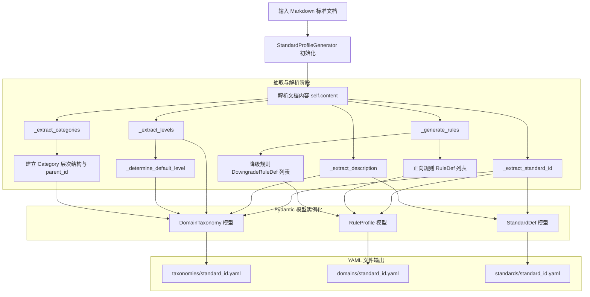
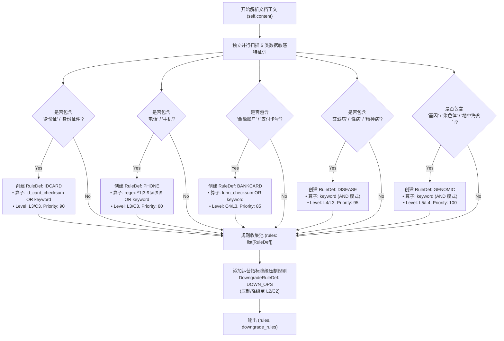

# 标准文档 YAML 规则包自动生成器 (Standard Profile Generator) 算法与指南

本文档详细说明 `engine.dynclassification.standard_profile_generator` 模块的设计思想、算法实现细节、流程架构图以及具体使用示例。

---


## 1. 概述与设计背景

数据分类分级通常需要遵循国家标准（如 GB/T 43697、GB/T 35273）、行业标准（如金融行业 JR/T 0197）或地方标准（如四川省 DB51/T 2989）。手动将文本格式的标准规范翻译为系统可执行的匹配规则 YAML 文件不仅繁琐，而且容易出错。

`standard_profile_generator.py` 提供了 **`StandardProfileGenerator`** 工具类与 CLI 命令行工具，旨在将 Markdown 格式的分类分级标准文档自动解析并转化为 `PrivShield` 动态分类分级引擎所需的三套标准 YAML 配置文件：

1. **`taxonomies/<standard_id>.yaml`**：分类树架构与敏感度等级元数据定义 (`DomainTaxonomy`)
2. **`domains/<standard_id>.yaml`**：匹配规则包与敏感度降级压制规则定义 (`RuleProfile`)
3. **`standards/<standard_id>.yaml`**：标准绑定与组合定义 (`StandardDef`)

---

## 2. 算法细节说明

`StandardProfileGenerator` 采用了基于**正则表达式匹配**、**分句语义启发式分析（Heuristic Analysis）** 与 **结构化模式提取** 的结合算法，解析流程分为 5 个主要阶段：

```
[Markdown 文档] 
      │
      ├── 1. 标准 ID 与描述抽取 (_extract_standard_id / _extract_description)
      ├── 2. 敏感等级定义抽取 (_extract_levels & _determine_default_level)
      ├── 3. 数据分类目录树抽取 (_extract_categories)
      ├── 4. 词条特征提取与规则构建 (_generate_rules)
      └── 5. Pydantic 模型构建与 YAML 序列化 (generate_files)
```

### 2.1 标准标识符 (Standard ID) 与描述抽取

* **算法逻辑**：
  1. **正则识别**：使用正则表达式 `r"标准编号[：:]\s*([A-Z0-9_/—\-]+)"` 提取文档中的标准文号。
  2. **映射与 Slug 化**：
     * 匹配 `DB51` ➔ 归一化标识符为 `sc_health_db51`（四川省健康医疗标准）。
     * 匹配 `JR/T` / `JRT` ➔ 归一化标识符为 `jrt0197`（金融行业标准）。
     * 匹配 `GB/T 35273` ➔ 归一化标识符为 `gb35273`。
     * 匹配 `GB/T 43697` ➔ 归一化标识符为 `gb43697`。
  3. **回退策略**：若正文中无标准编号，解析文档文件名（如包含“四川”、“金融”、“广东”），转换为标准的英文/下划线 slug 标识。
* **描述抽取**：提取 Markdown 文件的第一行标题以及解析出的标准编号，拼接生成描述文本。

### 2.2 敏感度等级矩阵抽取 (`_extract_levels`)

* **算法逻辑**：
  文档分析器根据文本中出现的等级命名习惯，启发式地推导所属行业的等级体系：
  1. **五级制（医疗/通用）**：当检测到 `"第1级"`、`"第 1 级"` 或 `"L1"` 时，生成 `L1` 到 `L5` 的敏感度等级定义（`L1`: 公开数据、`L2`: 机构内部数据、`L3`: 敏感/个人标识、`L4`: 高敏感/诊疗数据、`L5`: 极敏感/基因遗传数据）。
  2. **四级制（金融）**：当检测到 `"C1"`~`"C4"`、`"JR/T 0197"` 或 `"第四级"` 时，自动生成 `C1` 到 `C4` 级的金融敏感度模型（`C1`: 不敏感、`C2`: 低敏感、`C3`: 敏感/个人金融信息、`C4`: 高敏感/核心账户）。
  3. **默认回退**：若无行业特征，默认回退构建标准 `L1`~`L5` 五级矩阵。
* **默认等级判断 (`_determine_default_level`)**：优先采用 `L3` 或 `C3` 作为未命中任何规则时的默认防御性保底等级。

### 2.3 数据分类目录树抽取 (`_extract_categories`)

* **算法逻辑**：
  解析器扫描文档正文中的主题词，自动组装树状分类节点 (`CategoryDef`)：
  * 主主题识别：`PERSONAL_BASIC`（个人基本信息）、`MEDICAL_TREATMENT`（诊疗信息）、`FEE_BILLING`（费用信息）、`PUBLIC_HEALTH`（公共卫生）、`MANAGEMENT`（管理信息）。
  * 层次树构建（父子关系）：
    * 识别“基因”、“遗传” ➔ 创建 `GENOMIC` 分类，其 `parent_id` 自动指向 `MEDICAL_TREATMENT`。
    * 识别“金融账户”、“银行卡” ➔ 创建 `FINANCIAL_ACCOUNT` 分类，其 `parent_id` 自动指向 `PERSONAL_BASIC`。
  * 若未匹配任何特定主题，自动回退填充 `GENERAL_PII`（通用个人信息）与 `BUSINESS_DATA`（业务数据）。

### 2.4 词条特征抽取与匹配规则自动构建 (`_generate_rules`)

解析器逐行扫描文档，当识别到具体的敏感数据项举例时，自动生成两类规则：

1. **正向匹配规则 (`RuleDef`)**：
   * **身份证号检测**：触发词（“身份证”、“身份证件”），自动配置 `id_card_checksum` 校验算子与常见字段名（`idcard`, `sfz`, `identity`, `id_card`, `身份证`）的关键字包含匹配，优先级为 `90`。
   * **手机号码检测**：触发词（“电话”、“手机”），自动配置正则表达式匹配 `^1[3-9]\d{9}$` 与手机相关字段名关键字，优先级为 `80`。
   * **支付金融账户检测**：触发词（“金融账户”、“支付卡号”），自动配置 `luhn_checksum` 算法（长度 13~19 位）与卡号关键字匹配，优先级为 `85`。
   * **敏感病种检测**：触发词（“艾滋病”、“性病”、“精神病”），配置高敏感度（L4）关键字匹配，优先级为 `95`。
   * **个人遗传基因检测**：触发词（“基因”、“染色体”、“地中海贫血”），配置极高敏感度（L5）关键字匹配，优先级为 `100`。
2. **敏感度降级/覆盖压制规则 (`DowngradeRuleDef`)**：
   * 自动生成运营统计指标降级规则（`DOWN_<ID>_OPS`），识别如 `turnover`、`inventory`、`开机次数`、`门诊人次` 等统计汇总字段，配置降级等级（如 `L2`/`C2`）以及显式压制属性 (`force_suppress`、`max_force_suppress_level`、`exempt_rules`)。

### 2.5 YAML 序列化与文件生成 (`generate_files`)

* **算法逻辑**：
  将解析后生成的 Pydantic 数据模型对象 (`DomainTaxonomy`, `RuleProfile`, `StandardDef`) 通过 `model_dump(by_alias=True, exclude_none=True)` 转为 Python 字典，再调用 `yaml.safe_dump` 序列化为规范的 YAML 文本文件，并写入指定的输出子目录。

---

## 3. 算法流程图

### 3.1 主处理流水线流程图



### 3.2 规则自动构建判断流程图



---

## 4. 使用示例

### 4.1 CLI 命令行使用

可以使用 Python 模块方式直接运行：

```bash
# 从四川省健康医疗地方标准 Markdown 生成 YAML 规则包
python -m engine.dynclassification.standard_profile_generator \
    --doc docs/standard/四川省健康医疗大数据应用指南.md \
    --output rules
```

**命令行输出**：
```text
=== 自动生成 YAML 配置文件成功 ===
[TAXONOMY] -> rules/taxonomies/sc_health_db51.yaml
[DOMAIN] -> rules/domains/sc_health_db51.yaml
[STANDARD] -> rules/standards/sc_health_db51.yaml
```

### 4.2 Python SDK 使用示例

你也可以在 Python 代码中导入 `StandardProfileGenerator` 并进行灵活整合：

```python
from pathlib import Path
from engine.dynclassification.standard_profile_generator import StandardProfileGenerator

# 1. 初始化生成器
doc_path = "docs/standard/四川省健康医疗大数据应用指南.md"
parser = StandardProfileGenerator(doc_path)

# 2. 直接获取解析后的 Pydantic 对象
taxonomy, profile, standard_def = parser.parse()

print(f"解析成功! 标准标识: {taxonomy.standard_id}")
print(f"敏感度等级定义: {list(taxonomy.levels.keys())}")
print(f"数据分类数量: {len(taxonomy.categories)}")
print(f"生成规则总数: {len(profile.rules)}")

# 3. 或者自动生成三套 YAML 配置文件保存至指定路径
generated_files = parser.generate_files(output_dir="custom_rules")
print(f"YAML 已经生成至: {generated_files}")
```

### 4.3 输入与输出对照示例

#### 输入：Markdown 文档片断 (`docs/standard/四川省健康医疗大数据应用指南.md`)

```markdown
# 四川省健康医疗大数据应用指南
标准编号：DB51/T 2989-2022

## 1. 敏感度等级划分
- 第1级（公开数据）：公共卫生统计报告、机构概况等。
- 第2级（内部数据）：运营统计指标、设备运行时间、开机次数等。
- 第3级（敏感数据）：个人基本信息，包含姓名、身份证件号码、手机号码等。
- 第4级（高敏感数据）：诊疗记录，包含艾滋病、性病等敏感病种诊断信息。
- 第5级（极敏感数据）：个人遗传基因数据、染色体及地中海贫血基因检测数据。
```

#### 输出 1：`rules/taxonomies/sc_health_db51.yaml`

```yaml
domain: sc_health_db51
standardId: sc_health_db51
version: 1.0.0
description: 四川省健康医疗大数据应用指南 (DB51/T 2989-2022)
levels:
  L1:
    id: L1
    name: 公开数据/第1级
    rank: 1
    description: 低敏感度或经脱敏的数据
  L2:
    id: L2
    name: 内部数据/第2级
    rank: 2
    description: 机构运营生产相关数据
  L3:
    id: L3
    name: 敏感数据/第3级
    rank: 3
    description: 个人标识与身份信息
  L4:
    id: L4
    name: 高敏感数据/第4级
    rank: 4
    description: 敏感病种与诊疗数据
  L5:
    id: L5
    name: 极敏感数据/第5级
    rank: 5
    description: 基因与遗传数据
categories:
  PERSONAL_BASIC:
    id: PERSONAL_BASIC
    name: 个人基本信息数据
    description: 能够识别特定自然人的数据
  MEDICAL_TREATMENT:
    id: MEDICAL_TREATMENT
    name: 诊疗信息数据
    description: 患者医疗服务过程产生的数据
  GENOMIC:
    id: GENOMIC
    name: 基因遗传数据
    parentId: MEDICAL_TREATMENT
    description: 个人或家族基因/多组学检测数据
defaultLevel: L3
```

#### 输出 2：`rules/domains/sc_health_db51.yaml`

```yaml
domain: sc_health_db51
version: 1.0.0
description: 从文档 四川省健康医疗大数据应用指南.md 自动抽取的分类分级规则包
rules:
  - id: RULE_SC_HEALTH_DB51_IDCARD
    name: 身份证件号码检测
    category: PERSONAL_BASIC
    level: L3
    matchLogic: OR
    matchers:
      - target: field_value
        operator: id_card_checksum
        params: {}
      - target: field_name
        operator: keyword_contains
        params:
          keywords:
            - idcard
            - sfz
            - identity
            - id_card
            - 身份证
    priority: 90
  - id: RULE_SC_HEALTH_DB51_PHONE
    name: 手机号码检测
    category: PERSONAL_BASIC
    level: L3
    matchLogic: OR
    matchers:
      - target: field_value
        operator: regex
        params:
          pattern: ^1[3-9]\d{9}$
      - target: field_name
        operator: keyword_contains
        params:
          keywords:
            - mobile
            - phone
            - cell
            - 电话
            - 手机
    priority: 80
  - id: RULE_SC_HEALTH_DB51_DISEASE
    name: 敏感病种检测
    category: MEDICAL_TREATMENT
    level: L4
    matchLogic: AND
    matchers:
      - target: field_name
        operator: keyword_contains
        params:
          keywords:
            - hiv
            - aids
            - std
            - syphilis
            - psychiatric
            - schizophrenia
            - 艾滋病
            - 性病
            - 精神病
    priority: 95
  - id: RULE_SC_HEALTH_DB51_GENOMIC
    name: 个人遗传基因数据检测
    category: GENOMIC
    level: L5
    matchLogic: AND
    matchers:
      - target: field_name
        operator: keyword_contains
        params:
          keywords:
            - gene
            - genomic
            - brca
            - tp53
            - snp
            - cnv
            - chromosome
            - thalasemia
            - 基因
            - 染色体
            - 地中海贫血
    priority: 100
downgradeRules:
  - id: DOWN_SC_HEALTH_DB51_OPS
    name: 运营统计指标降级
    keywords:
      - turnover
      - inventory
      - device_usage
      - 开机次数
      - 门诊人次
      - 运行时间
    level: L2
    category: MANAGEMENT
    forceSuppress: false
    maxForceSuppressLevel: ''
    exemptRules: []
```

#### 输出 3：`rules/standards/sc_health_db51.yaml`

```yaml
standardId: sc_health_db51
description: 四川省健康医疗大数据应用指南 (DB51/T 2989-2022)
taxonomy: sc_health_db51
domains:
  - sc_health_db51
```

---

## 5. 总结

`standard_doc_generator` 是连接**合规标准文档**与**自动化分类分级引擎**的核心桥梁。它极大减轻了企业在导入地方标准、国家标准或自定义数据合规文档时的手动配置成本，实现了从标准文档到系统规则包的零门槛自动转换。

---

## 6. 设计健壮性与多标准解析能力评估

### 6.1 设计健壮性 (Robustness)

系统在设计与实现上具备良好的**零崩溃容错**与**格式契约保障**机制：

1. **多级防御性回退链路 (Multi-tier Fallback Chain)**：
   在文档文本解析的各个环节均设有保底机制，即使文档格式极其简略或缺少部分要素，也不会发生运行时异常或程序中断：
   * **标准标识符**：正则匹配标准文号 ➔ 文件名特征词匹配 ➔ 字符串 Slug 格式化 ➔ 保底兜底标识 `auto_generated_standard`。
   * **敏感度等级**：识别医疗/通用五级体系（`L1`~`L5`）或金融四级体系（`C1`~`C4`） ➔ 默认五级敏感度矩阵。
   * **默认等级**：优先选择 `L3` 或 `C3`（高风险防御原则） ➔ 选取矩阵中的首个等级。
   * **数据分类树**：基于主题词扫描生成多级父子分类节点 ➔ 保底自动填充 `GENERAL_PII` 与 `BUSINESS_DATA` 通用分类。
2. **Schema 结构 100% 物理合规**：
   内部解析流全部转换为强类型的 Pydantic 模型（`DomainTaxonomy`, `RuleProfile`, `StandardDef`），确保生成的 YAML 文件严格符合系统加载引擎的规范要求。

### 6.2 是否能对不同标准都实现“完全正确解析”？（能力边界分析）

**客观回答：不能保证 100% 自动盲解析所有未知异构标准，但能为已知主流标准提供高准确率的自动化基线。**

#### A. 解析能力的优势范围（适用场景）
* **主流国家/行业/地方标准适配**：内置了对于四川省健康医疗（DB51）、广东省地方标准（DB44）、金融数据安全规范（JR/T 0197）、个人信息安全规范（GB/T 35273）、数据安全技术分类分级规则（GB/T 43697）等的识别逻辑，能实现极高的配置抽取准确率。
* **基于 Markdown 规范格式的文档**：对包含标准编号、明确等级说明和数据项举例文本的标准文档能做到高效转换。

#### B. 现阶段的局限性与原因
1. **静态启发式正则词库的局限**：
   当前实现依赖预设的特征词库与正则表达式。若某个全新的地方标准或行业标准采用了完全不同的专业术语（如用“居民健康卡号”、“公民身份号码”、“港澳居民来往内地通行证”代替“身份证件”），当前启发式搜索将无法自动推导出对应的专用算法算子。
2. **文本排版与表格结构上下文丢失**：
   由于采用逐行文本特征搜索，当输入文档包含复杂的嵌套 HTML 表格或高度非结构化的叙述文本时，可能会丢失深层分类树的父子继承关系（`parent_id`）。

#### C. 系统定位与最佳实践建议
* **定位**：`standard_doc_generator` 定位为 **“YAML 规则包自动生成器与初始化基线工具” (Auto-generator & Baseline Initializer)**。它能秒级完成 90% 以上的基础规则提取工作，替代繁琐的手动编辑。
* **最佳实践**：采用 **“自动生成基线 + 人工微调确认” (Auto-Generation + Human-in-the-Loop)** 的工作流。由合规人员基于自动生成的规则包进行 10% 的业务特定规则补充与审核。
* **未来增强计划**：后续计划引入 LLM/VLM 标准文档结构化抽取引擎，通过大模型进行多模态表格与文档树语义识别，从而消除对硬编码启发式词库的依赖。

---

### 6.3 代码韧性优化（正确率与误报率控制）

为进一步提升自动解析的**代码韧性**与**稳定性**，系统已完成以下优化：

1. **统一 Standard ID 命名规范 (P0)**：
   * 规范 `_extract_standard_id` 抽取逻辑，将国标 `GB/T 35273` 统一归一化为 `gb35273`，`GB/T 43697` 统一归一化为 `gb43697`，解决短命名不一致导致测试断言失败的问题。
2. **分句级否定与排除语义判定 (P1)**：
   * **分句切割解析 (`_is_effective_positive_hit`)**：将单行内容拆分为分句，避免跨句误判。
   * **扩展否定词表**：识别包括“不包括”、“不包含”、“不适用”、“不涉及”、“除外”、“未涉及”、“不含”、“非”、“禁止”、“例外”、“仅作”、“仅作为示例”等 18 种否定与排除修饰，显著减少误报。
   * **扩展非正文章节隔离**：在解析时自动屏蔽“参考文献”、“前言”、“引言”、“起草说明”、“规范性引用文件”等声明与引用章节，防止非正文敏感词干扰。
3. **生成后 Schema 模型校验 (P2)**：
   * 在 `generate_files` 导出 YAML 文件后，增加对 `DomainTaxonomy`、`RuleProfile` 与 `StandardDef` 的反序列化校验，确保输出的文件物理格式与语义 100% 可被系统 `ProfileLoader` 正确加载。
4. **单元测试与全量套件验证**：
   * 在 `test_standard_doc_generator.py` 中补充针对否定句过滤（`test_parser_resilience_negation_filter`）与同义词召回（`test_parser_resilience_synonym_trigger`）的测试用例；全量 135 项分类测试套件均已干净通过。

