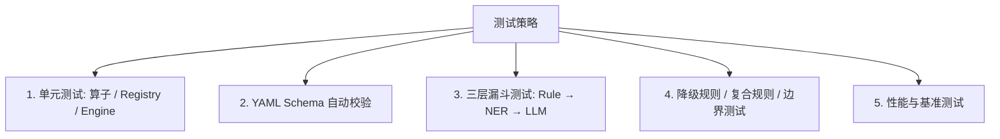

# 动态分类分级测试指南

本文档描述 `PrivShield` 动态分类分级模块的测试策略、单元测试方法、影子模式（Shadow Mode）对比测试与规则 Schema 自动化校验。

---


## 1. 测试策略概述

动态分类分级模块采用分层测试策略，确保配置解析准确、匹配算子无状态且可靠，以及新旧引擎输出完全一致：



---

## 2. 测试文件结构

所有测试位于 `tests/dynclassification/` 目录：

| 文件 | 覆盖范围 |
|---|---|
| `test_dynclassification.py` | 核心引擎、OperatorRegistry、ConfigurableRuleEngine、ProfileLoader |
| `test_dynclassification_operators.py` | 全部匹配算子（regex/keyword_contains/icd10_range 等） |
| `test_dynclassification_coverage.py` | 服务层集成测试（classify_field/record/table） |
| `test_dynclassification_coverage_final.py` | 金融标准 C1~C4 端到端、多领域合并 |
| `test_dynclassification_edge_cases.py` | 边界条件（空值/None/特殊字符/超长输入） |
| `test_standard_profile_generator.py` | StandardProfileGenerator 文档规则包生成器 |
| `test_dynclassification_grpc_and_metrics.py` | gRPC 接口 + Prometheus 指标 |
| `test_dynclassification_optimizations.py` | 缓存、热加载、线程安全 |
| `test_downgrade_override.py` | 降级规则、override 压制、白名单语义 |
| `test_funnel.py` | 三层漏斗编排（NER/LLM mock、置信度策略、配置化映射） |
| `test_ner_adapter.py` | Layer-2 NER 实体提取引擎与适配器（ONNX / ModelScope 延迟加载与优雅降级） |
| `test_llm_adapter.py` | Layer-3 LLM 大模型分类与冲突仲裁适配器（Qwen3.5 专精 SFT 分类与 JSON 响应解析） |

---

## 3. 单元测试代码示例

### 3.1 `OperatorRegistry` 算子注册与调用测试

```python
import pytest
from engine.dynclassification.operator_registry import OperatorRegistry

def test_operator_registry_register_and_get():
    @OperatorRegistry.register("test_dummy_op")
    def dummy_op(val, params):
        return str(val) == params.get("target_val")

    assert "test_dummy_op" in OperatorRegistry.list_operators()

    op = OperatorRegistry.get("test_dummy_op")
    assert op("hello", {"target_val": "hello"}) is True
    assert op("world", {"target_val": "hello"}) is False

def test_operator_not_found():
    with pytest.raises(KeyError):
        OperatorRegistry.get("non_existent_operator_xyz")
```

---

### 3.2 `ConfigurableRuleEngine` 评估引擎测试

```python
from engine.dynclassification.models import DomainTaxonomy, SensitivityLevelDef, CategoryDef
from engine.dynclassification.rule_schema import RuleProfile, RuleDef, MatcherDef
from engine.dynclassification.engine import ConfigurableRuleEngine

def test_configurable_engine_evaluation():
    taxonomy = DomainTaxonomy(
        domain="test",
        standard_id="test_std",
        levels={"L1": SensitivityLevelDef(id="L1", name="Low", rank=1),
                "L3": SensitivityLevelDef(id="L3", name="High", rank=3)},
        categories={"PII": CategoryDef(id="PII", name="PII Data")},
        default_level="L1"
    )

    profile = RuleProfile(
        domain="test",
        rules=[
            RuleDef(
                id="RULE_PHONE",
                category="PII",
                level="L3",
                matchers=[
                    MatcherDef(target="field_value", operator="regex", params={"pattern": "^1[3-9]\\d{9}$"})
                ]
            )
        ]
    )

    engine = ConfigurableRuleEngine(taxonomy, [profile])

    # 测试手机号匹配（注意 evaluate 返回元组）
    tags, suppressed = engine.evaluate("mobile_number", "13800138000")
    assert len(tags) == 1
    assert tags[0].level == "L3"
    assert tags[0].category == "PII"
    assert tags[0].rule_id == "RULE_PHONE"

    # 测试未命中
    no_tags, _ = engine.evaluate("mobile_number", "not_a_phone")
    assert len(no_tags) == 0
```

---

### 3.3 三层漏斗 NER 配置化测试

```python
def test_ner_custom_entity_mapping(taxonomy, engine_conflict):
    """自定义 ner_entity_mapping 配置化映射生效。"""
    taxonomy.ner_entity_mapping = {"MEDICAL_DISEASE": "L5", "MEDICATION": "L2"}
    # ... 构建漏斗并验证 NER 实体映射到自定义等级

def test_ner_custom_sensitive_keywords(taxonomy, engine_conflict):
    """自定义 ner_sensitive_keywords 配置生效。"""
    taxonomy.ner_sensitive_keywords = ["洗钱", "恐怖融资"]
    # ... 构建漏斗并验证敏感关键词触发升级
```

---

## 4. CI 中 YAML 规则 Schema 自动校验

为防止不合法的 YAML 配置被提交合并，在 CI 流水线中增加静态校验步骤：

### 校验命令

```bash
cd /path/to/PrivShield
PYTHONPATH=. python -m pytest tests/dynclassification/ -v
```

### Schema 校验示例

```python
from pathlib import Path
import yaml
import pytest
from engine.dynclassification.models import DomainTaxonomy
from engine.dynclassification.rule_schema import RuleProfile, StandardDef

RULES_DIR = Path("rules")

@pytest.mark.parametrize("yaml_file", list((RULES_DIR / "taxonomies").glob("*.yaml")))
def test_validate_taxonomies(yaml_file):
    data = yaml.safe_load(yaml_file.read_text(encoding="utf-8"))
    tax = DomainTaxonomy.model_validate(data)
    assert tax.domain is not None

@pytest.mark.parametrize("yaml_file", list((RULES_DIR / "domains").glob("*.yaml")))
def test_validate_domain_profiles(yaml_file):
    data = yaml.safe_load(yaml_file.read_text(encoding="utf-8"))
    prof = RuleProfile.model_validate(data)
    assert prof.domain is not None

@pytest.mark.parametrize("yaml_file", list((RULES_DIR / "standards").glob("*.yaml")))
def test_validate_standards(yaml_file):
    data = yaml.safe_load(yaml_file.read_text(encoding="utf-8"))
    std = StandardDef.model_validate(data)
    assert std.standard_id is not None
```

---

## 5. 运行全套单元测试

```bash
cd /path/to/PrivShield
PYTHONPATH=. pytest tests/dynclassification/ -v
```

当前测试统计：**117+ 个测试用例**，覆盖算子、引擎、漏斗、降级、复合、服务层、gRPC、指标、边界等全链路。