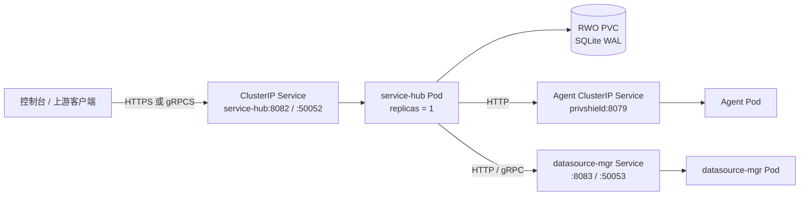
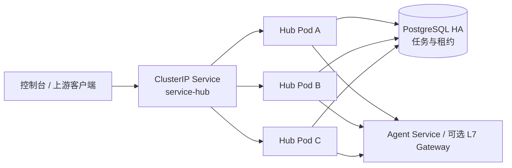
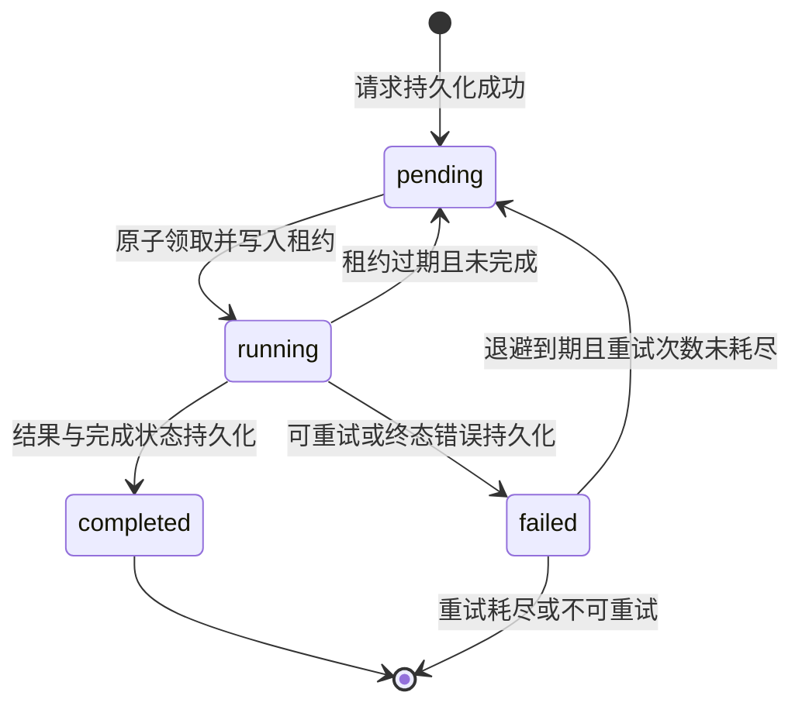

# Service Hub Kubernetes 接入与调度目标架构

> 本文档定义调用方（`console/bff-go`、其他微服务或外部系统）、`service-hub`、Kubernetes Service 与可选 L7 网关（`engine.gateway`）之间的目标关系。它解决“当 service-hub 成为固定业务入口后，Kubernetes 负载均衡是否仍有价值、何时需要引入 L7 网关”的部署与一致性问题。

## 目录

1. [结论与范围](#1-结论与范围)
2. [当前能力与约束](#2-当前能力与约束)
3. [目标拓扑](#3-目标拓扑)
4. [任务状态机与原子租约](#4-任务状态机与原子租约)
5. [连接与负载均衡行为](#5-连接与负载均衡行为)
6. [Kubernetes 对象与运行策略](#6-kubernetes-对象与运行策略)
7. [安全与网络策略](#7-安全与网络策略)
8. [可观测性与告警](#8-可观测性与告警)
9. [分阶段迁移与验收](#9-分阶段迁移与验收)
10. [决策记录](#10-决策记录)
11. [常见疑问](#11-常见疑问)
12. [实施状态](#12-实施状态)
13. [相关文档](#13-相关文档)

> **范围说明**：为避免与隐私计算核心进程 `engine`（亦称 Agent）混淆，本文使用“调用方”指代访问 `service-hub` 的上游客户端；“Agent 计算节点”或 `engine` 指代被 `service-hub` 调度的下游隐私计算 Agent。本文档位于 `docs/gateway_balancer/` 目录，是因为它讨论的是 service-hub 在集群内的负载均衡与网关替代方案。

## 1. 结论与范围

调用方应连接 Kubernetes Service 的稳定 DNS，而不是某个 Pod IP：

```text
service-hub.privshield.svc.cluster.local:50052
```

这使 Pod 重建、滚动发布和后续扩容不改变调用方配置。Kubernetes `ClusterIP` Service 在 Hub 单副本时提供服务发现和故障切换入口；在 Hub 多副本时还提供四层连接分流。

本设计区分两类负载均衡：

| 流量 | 默认责任方 | 是否需要 `engine.gateway` |
|---|---|---|
| 调用方 → service-hub | Kubernetes Service | 否。Hub 是固定业务入口。 |
| service-hub → 单个 Agent | 直接连接 Agent Service | 否。 |
| service-hub → 多副本 Agent，HTTP 短请求 | Kubernetes Service | 通常否。 |
| service-hub → 多副本 Agent，少量长期 gRPC 连接且需每 RPC 均衡/高级熔断 | `engine.gateway` 或 Envoy | 视压测结果启用。 |

`engine.gateway` 不是 service-hub 的高可用替代品：它能分发 Agent 回源流量，却不能让没有共享存储与原子领取语义的 Hub 安全地多副本运行。

### 1.1 角色定位

| 组件 | 职责 | 与 service-hub 的关系 | 是否需要多副本 |
|---|---|---|---|
| **调用方**（console BFF、上游微服务、外部系统） | 向 service-hub 提交任务/查询 | service-hub 的上游客户端 | 由调用方自身决定 |
| **service-hub** | 任务调度、状态机管理、调用下游 Agent | 固定业务入口，任务协调者 | 阶段 A 单副本；阶段 B 多副本 |
| **Kubernetes Service** | 稳定 DNS 发现、L4 连接分流、Readiness 驱动端点管理 | 调用方到 service-hub 的首选入口 | 始终需要 |
| **engine.gateway** | L7 请求级负载均衡、熔断、动态拓扑 | service-hub → 多 Agent 的可选增强；调用方 → service-hub 通常不需要 | 仅当压测证明 L4 不足时 |
| **Agent 计算节点**（`engine`） | 执行隐私计算原语 | service-hub 的下游 worker | 可水平扩展 |

阶段 A 的核心约束：**service-hub 单副本 + 独占 SQLite PVC**。在这个前提下，给 service-hub 前面加 L7 网关并不能提升可用性，只会增加额外跳数和证书边界。真正可能产生多副本需求的是下游 Agent 计算节点，此时才考虑 `engine.gateway`。

## 2. 当前能力与约束

当前 service-hub 同时监听 HTTP `8082` 与 gRPC `50052`，提供 `/health`、`/readyz` 和 `/metrics`。它可将任务写入 SQLite；任务状态经 `TaskStore.Update()` 以单行 `UPDATE` 持久化。SQLite 模式开启 WAL、完整性检查和重试恢复，适合单实例任务协调。

但现有 `TaskStore` 只有 `Save`、`Get`、`List`、`Update`、`Counts` 和 `CleanupOld`。不存在条件领取（compare-and-set）、租约或围栏令牌。若多个 Hub 副本同时执行“读取 pending → 修改 running → 调用下游”的流程，可能发生：

1. 两个副本读取到同一条 `pending` 任务；
2. 两者均将本地对象置为 `running`；
3. 两者都执行不可逆的下游脱敏或审计调用；
4. 最后一次 `Update()` 覆盖前一次状态，数据库无法表达重复执行事实。

因此，**共享 SQLite 文件和多副本 Hub 是不支持的组合**。`ReadWriteOnce` PVC、`replicas: 1` 与 `Recreate` 更新策略是当前 Kubernetes 模板的正确约束，不能为了取得 Service 的“负载均衡”效果而将副本数改为大于 1。

## 3. 目标拓扑

### 3.1 阶段 A：单副本 Hub 与 SQLite



Kubernetes Service 仍然有实际价值：调用方只持有稳定 DNS；Pod IP 更换后 Endpoints 自动更新；Readiness 失败的 Pod 自动从 Endpoints 集移除。此阶段 Service 不会在多个 Hub Pod 间均衡，因为仅允许一个 Ready 副本。

**部署要求**：

- 使用 [service-hub Kustomize 模板](../../services/service-hub/deploy/k8s/kustomization.yaml)；
- 任务数据库路径为 `/app/data/service-hub.db`，挂载独占 `ReadWriteOnce` PVC；
- `Deployment.spec.replicas` 必须保持 `1`；
- 更新策略必须保持 `Recreate`，先停止旧 Pod 再挂载卷启动新 Pod；
- 不配置 HPA；PodDisruptionBudget 仅可设置 `minAvailable: 1`，不能制造第二个写入者；
- `readyz` 返回失败时，Service 立即停止将新连接分配给该 Pod。

### 3.2 阶段 B：高可用 Hub 与 PostgreSQL

只有在实现共享数据库和原子领取后，Hub 才可增加副本：



此阶段的持久化层不是“把 SQLite 放到共享网络盘”，而是 PostgreSQL 等支持事务、行锁和并发写入的数据库。每个副本无状态化，任务的所有权由数据库事务决定，而非由某个内存队列决定。

## 4. 任务状态机与原子租约

### 4.1 状态与执行语义



系统提供**至少一次**执行保证，不承诺对下游副作用的端到端 exactly-once。原因是任务处理可能在“下游已成功”与“本地状态写入 completed”之间崩溃。要控制重复副作用，必须组合：

- 由 Hub 为每个任务生成稳定 `task_id`，并将其作为下游幂等键；
- Agent、审计服务和数据源侧按幂等键去重或返回已有结果；
- 重试只针对可重试错误，维持当前指数退避与最大重试次数；
- 对不可幂等外部操作使用 Outbox/Saga 或人工补偿流程。

### 4.2 PostgreSQL 领取协议

任务表在现有字段上增加 `lease_owner`、`lease_token`、`lease_expires_at`、`version`、`priority`、`retry_after`。当前 `service-hub` 的 `Task` 模型尚未包含这些字段，阶段 B 需要先扩展 schema 与 `pkg/store.Task` 结构体，再实现 `LeasedTaskStore`。领取操作必须是一个短事务，使用数据库服务器时间：

```sql
WITH candidate AS (
  SELECT id
  FROM tasks
  WHERE status = 'pending'
    AND (retry_after IS NULL OR retry_after <= NOW())
  ORDER BY priority DESC, created_at ASC
  FOR UPDATE SKIP LOCKED
  LIMIT 1
)
UPDATE tasks
SET status = 'running',
    stage = 'running',
    started_at = COALESCE(started_at, NOW()),
    lease_owner = $1,
    lease_token = $2,
    lease_expires_at = NOW() + INTERVAL '60 seconds',
    version = version + 1
WHERE id IN (SELECT id FROM candidate)
RETURNING *;
```

`SKIP LOCKED` 让多个 Hub 副本竞争时跳过已锁行，而不是彼此阻塞。处理完成、失败或续租必须带上 `id`、`lease_owner`、`lease_token` 与未过期条件：

```sql
UPDATE tasks
SET status = 'completed', completed_at = NOW(), lease_expires_at = NULL,
    version = version + 1
WHERE id = $1
  AND status = 'running'
  AND lease_owner = $2
  AND lease_token = $3
  AND lease_expires_at > NOW();
```

更新结果为零行时，当前副本已失去任务所有权，必须停止提交结果，并记录 `task_lease_conflicts_total`。租约过期回收应通过带条件的批量事务完成；不能使用“扫描所有 running 后无条件更新”的方式覆盖仍健康副本。

> **时钟同步要求**：`lease_expires_at` 以数据库服务器时间为权威时间，但副本在本地判断“我的租约是否仍有效”时会依赖本地时钟。阶段 B 部署必须保证所有 Hub 副本通过 NTP 与数据库服务器保持时钟同步，否则可能出现副本过早放弃租约或过期后仍错误提交结果的情况。若无法保证时钟同步，应改由副本在每次领取/续租时读取 `NOW()` 并仅持有“数据库已确认未过期”的乐观假设。

> **重试计数**：为支持有限重试，任务表还需增加 `retry_count` 与 `max_retries` 字段。`ClaimNext` 的 `WHERE` 子句应过滤掉 `retry_count >= max_retries` 的终态失败任务；重试时 `retry_count` 自增并设置 `retry_after = NOW() + backoff_interval`。

### 4.3 新存储接口

在切换多副本前，service-hub 应在不破坏 `pkg/store.TaskStore` 公共接口的前提下，新增一个显式所有权接口，避免业务代码回退到 `List` 后 `Update`：

```go
type TaskLease struct {
    Task       *Task
    Owner      string
    Token      string
    ExpiresAt  time.Time
}

type LeasedTaskStore interface {
    TaskStore
    ClaimNext(owner string, leaseTTL time.Duration) (*TaskLease, error)
    RenewLease(id, owner, token string, leaseTTL time.Duration) (bool, error)
    CompleteLease(id, owner, token string, result TaskResult) (bool, error)
    FailLease(id, owner, token string, failure TaskFailure) (bool, error)
    RequeueExpiredLeases(limit int) (int, error)
}
```

`TaskResult` 与 `TaskFailure` 是新引入的结构体，分别封装任务执行结果与失败原因（含错误分类、是否可重试、原始错误摘要等）。阶段 B 实现时应先补充这些类型及对应的 `Task` 字段映射，再让业务代码从“直接 `Update`”迁移到“带租约的完成/失败”接口。

`bool` 表示条件更新是否实际取得一行，调用方不得忽略。SQLite 实现可返回“不支持多副本租约”的显式错误，防止运行配置悄然越过部署约束。

## 5. 连接与负载均衡行为

### 5.1 调用方到 Hub

调用方（`console/bff-go`、其他微服务或外部客户端）使用 `service-hub` DNS 作为唯一上游地址，而不是某个 Pod IP。HTTP 客户端应设置连接、请求和总截止时间；gRPC 客户端应设置 `keepalive`、连接退避、每 RPC deadline 与优雅重连。客户端不缓存 Pod IP。

对 HTTP 短连接或多连接池，ClusterIP 可随新 TCP 连接分散到 Ready Endpoints。对 gRPC/HTTP2 长连接，Service 常在建连时选定一个 Pod；该连接上的后续 RPC 通常保持在同一 Hub 副本。阶段 A 无影响，因为 Hub 只有一个副本。阶段 B 需要根据连接数量决定策略：

| 情况 | 推荐方式 |
|---|---|
| 大量调用方实例，各自建立连接 | 保留 ClusterIP，连接总体会自然分散。 |
| 少量调用方、大量长寿命 gRPC 连接 | 每个调用方维护小型 gRPC 连接池，并设置最大连接年龄促使平滑再建连。 |
| 需要按 RPC 的权重、排空、熔断与跨协议统一路由 | 在调用方前部署 `engine.gateway` 或 Envoy；仅在压测证明 ClusterIP 分布不足时启用。 |

不要在调用方与固定单副本 Hub 之间额外引入 L7 网关。它会增加一跳、证书边界与故障域，却不能增加真实可用副本。

### 5.2 Hub 到多副本 Agent

Hub 可直接访问 Agent Service。当前 service-hub 已通过 `pkg/agent.Client` 与上游 Agent 通信，该共享客户端内置多 `BaseURL` 轮询、熔断器与自动重试。若部署中 Agent 节点地址已知且数量不多，优先在 `PRIVSHIELD_AGENT_URLS` 中配置多个 Agent 端点，让客户端层完成简单负载均衡与故障转移。

只有存在以下更高级要求时，才将 Hub 的上游改为 `engine.gateway`：

- gRPC 长连接导致 Pod 负载明显倾斜；
- 基于权重、在途连接数或 P2C 的请求级选路；
- 集中式 Circuit Breaker、Half-Open 单探测、主动与被动健康融合；
- 跨集群 Agent 拓扑或运行时注册/排空。

启用时，Hub 只连接网关 Service，网关再将请求转发到多个 Agent Endpoints；不能让 Hub 同时随机直接访问 Agent 和网关，否则熔断、指标和回退语义会分裂。

### 5.3 与 `privshield-gateway` 的边界与协同

`privshield-gateway` 是 PrivShield 自带的 L7 网关与负载均衡器，位于 `engine-go/cmd/privshield-gateway` 与 `engine-go/internal/gateway/`。它提供双协议反向代理、节点级熔断、按 RPC 负载均衡（P2C-EWMA）与 BufferPool 零分配缓存，适用于**多副本 Agent 计算节点**的流量调度场景。它与 service-hub 的边界如下：

| 职责 | 是否由 service-hub 负责 | 是否由 privshield-gateway 负责 | 说明 |
|---|---|---|---|
| 任务持久化与状态机 | ✅ | ❌ | service-hub 独占数据库与任务租约语义。 |
| 调用方到 service-hub 的入口发现 | ✅（K8s Service） | ❌ | 固定业务入口，无需网关。 |
| service-hub 到 Agent 计算节点的 L7 调度 | ❌ | ✅（可选） | 仅在 Agent 多副本且 L4 分布不足时启用。 |
| 跨集群/运行时注册的 Agent 拓扑 | ❌ | ✅ | 网关提供动态注册、隔离、排空 API。 |

**关键原则**：

1. **不要为单副本 service-hub 前面部署 privshield-gateway**。网关无法把单副本变成多副本，只会引入额外延迟与故障域。
2. **网关应作为 Agent 池的前置调度层**。当 service-hub 调用多个 Agent Pod 时，网关负责请求级选路、熔断与动态扩缩容感知。
3. **保持流量路径单一**。同一类流量不能同时走“直接 Service”和“经网关”两条路径，否则熔断、重试、指标会割裂。
4. **阶段 B 的多副本 service-hub 仍不需要前置网关**。service-hub 副本之间通过 PostgreSQL 租约协调，入口仍使用 K8s Service 做 L4 分发；若出现 RPC 级分布不均，优先在客户端启用连接池，其次再考虑 L7 网关。

## 6. Kubernetes 对象与运行策略

### 6.1 Service

`service-hub` 使用 `ClusterIP` 并暴露命名端口：HTTP `8082`、gRPC `50052`。选择器仅匹配 `app.kubernetes.io/name: service-hub`。服务不暴露 NodePort/LoadBalancer；集群外接入由现有 Ingress/Gateway 或 BFF 负责。

Readiness 使用 `/readyz` 而非仅 TCP 探针：它应至少验证任务存储可用、关键配置可解析及必要依赖是否满足服务定义。Liveness 使用轻量 `/health`，不能因短时下游 Agent 不可达而重启健康 Hub 进程。

### 6.2 Deployment

阶段 A 的关键字段：

```yaml
spec:
  replicas: 1
  strategy:
    type: Recreate
```

`terminationGracePeriodSeconds` 要大于 Hub 的 `SERVICE_HUB_SHUTDOWN_TIMEOUT`，并为 gRPC `GracefulStop` 与在途任务取消留出余量。Pod 收到 `SIGTERM` 后应依次：从 Ready Endpoints 移除、停止接收新流量、停止领取任务、续租或安全放弃在途任务、关闭 gRPC、关闭 HTTP、关闭数据库连接。

阶段 B 切换为 `RollingUpdate`、至少两个副本、HPA 与 topology spread constraints 前，必须先完成第 4 节的 PostgreSQL 和租约改造，并通过故障演练验证。

### 6.3 持久卷、备份与恢复

阶段 A PVC 只保存 SQLite 数据；使用存储类快照或 `sqlite3 .backup` 生成一致性备份。恢复演练必须包括 `PRAGMA integrity_check`、任务数核对和随机任务状态核对。WAL 模式不是多节点共享协调协议，禁止使用 `ReadWriteMany` 网络卷来规避单副本限制。

阶段 B 任务库应采用受管 PostgreSQL 或具备复制、备份、PITR、监控和故障切换的 PostgreSQL 集群。数据库备份、schema migration、凭据轮换和恢复点目标必须独立于 Pod 生命周期管理。

## 7. 安全与网络策略

生产环境在 Hub 的 HTTP/gRPC 入站和到 Agent、datasource-mgr 的东西向调用启用 TLS/mTLS。证书、私钥、CA 与 API Key 仅通过 Secret 挂载或引用，不写入 ConfigMap、镜像或 Git。

推荐 NetworkPolicy 采用默认拒绝，并只允许：

| 方向 | 源/目的 | 端口 | 原因 |
|---|---|---:|---|
| Ingress | BFF、获授权 Agent 或 Ingress namespace → Hub | 8082, 50052 | 外部任务提交与查询。 |
| Egress | Hub → Agent Service | 8079 | 分类与隐私算子调用。 |
| Egress | Hub → datasource-mgr Service | 8083, 50053 | 数据源查询。 |
| Egress | Hub → PostgreSQL | 5432 | 仅阶段 B 的共享任务存储。 |
| Egress | Hub → DNS/OTel/Prometheus 端点 | 按部署确定 | 名称解析与可观测性。 |

Service DNS 不是认证机制。mTLS 的客户端身份与服务端 SAN 校验、API Key 的最小权限、请求体上限和 per-client 限流仍需保留。

## 8. 可观测性与告警

所有日志应包含 `request_id`、`task_id`、`lease_owner`、`lease_token` 的安全摘要、状态迁移前后值和错误分类；不得记录任务原始敏感载荷。指标至少包括：

| 指标 | 用途 |
|---|---|
| `service_hub_tasks_total{status}` | 各状态任务积压。 |
| `service_hub_task_transition_total{from,to,result}` | 状态转换及持久化失败。 |
| `service_hub_task_lease_conflicts_total` | 发现失去所有权或错误并发。 |
| `service_hub_task_lease_expired_total` | 租约到期回收频率。 |
| `service_hub_task_claim_latency_seconds` | 领取延迟与数据库锁竞争。 |
| `service_hub_retry_total{result}` | 重试、耗尽与非可重试失败。 |
| `service_hub_ready` | Readiness 当前状态。 |
| `kube_endpoint_address_available{service="service-hub"}` | 可接收流量的 Hub Endpoints 数。 |

建议告警：阶段 A 中 `available endpoints != 1`；阶段 B 中任务持续积压、租约冲突、租约到期、数据库连接耗尽、重试耗尽比率和 `ready` 持续为零。告警需关联部署版本、数据库事件与下游 Agent 健康度，避免将下游瞬断误判为 Hub 进程故障。

## 9. 分阶段迁移与验收

### 阶段 A：固定入口与单副本持久化

1. 构建 `service-hub:latest` 镜像并部署 `services/service-hub/deploy/k8s/`。
2. 将调用方（如 BFF、控制台或其他微服务）的上游地址从 Pod IP 改为 `service-hub` Service DNS。
3. 验证 HTTP、gRPC、`/health`、`/readyz`、PVC 重启恢复与 Service Endpoints。
4. 对任务处理期间执行 Pod 删除，确认重启后的孤立任务恢复与幂等边界符合预期。

**验收条件**：Hub Pod 重建后调用方不修改地址；数据库文件持续存在；运行中任务不会静默丢失；任何时刻最多一个 Hub 进程挂载 SQLite PVC。

> **幂等性要求**：阶段 A 的 `Recreate` 更新会把运行中任务标记为 failed 并重试，因此即使在阶段 A，下游 Agent 接口也应具备幂等键去重能力或天然幂等；不能等到阶段 B 才考虑重复副作用。

### 阶段 B：多副本前的存储改造

1. 增加 PostgreSQL schema、迁移工具和 `LeasedTaskStore`。
2. 为 `ClaimNext`、续租、完成、失败、租约回收编写并发集成测试。
3. 接入所有下游幂等键，记录可重复执行的业务边界。
4. 压测单副本瓶颈、数据库领取吞吐和 gRPC 连接分布。

**验收条件**：多个 Hub 副本并行领取时每个 `task_id` 仅有一个有效租约；故障副本的任务在租约到期后由其他副本接管；旧所有者无法覆盖新所有者结果；重复投递在下游可观测且不产生重复副作用。

### 阶段 C：多副本发布

1. 切换到 PostgreSQL，保留 SQLite 只读归档或完成迁移后下线。
2. 将 Hub 逐步扩至 2 个副本，启用 rolling update、PodDisruptionBudget、反亲和/拓扑分散。
3. 依据 CPU、队列年龄、领取延迟和数据库连接池设置 HPA，而非仅依据平均 CPU。
4. 演练节点驱逐、数据库主从切换、长连接重建、Hub 灰度发布和 Agent 故障。

**验收条件**：缩扩容与滚动升级不造成重复领取、持续积压或不可恢复的任务；Hub Service 与客户端连接管理在目标并发下满足 P99 延迟和错误预算。

## 10. 决策记录

| 决策 | 结论 | 原因 |
|---|---|---|
| 调用方是否固定连接 Hub | 是，固定到 Service DNS，不固定到 Pod | 获得稳定发现和无配置漂移的故障切换。 |
| 单副本 Hub 是否保留 K8s Service | 是 | Service 仍是稳定地址和 Readiness 驱动的端点管理层。 |
| SQLite 是否支持多副本 Hub | 否 | 缺少跨副本任务租约，SQLite 单写者和网络卷无法补齐协议语义。 |
| Hub 多副本前置条件 | PostgreSQL + 原子租约 + 下游幂等 | 同时解决领取竞态、故障接管与重复副作用。 |
| 是否默认部署 `engine.gateway` | 否 | 对固定单副本 Hub 没有额外可用性收益。 |
| 何时启用 L7 网关 | 仅 Agent 多副本、长连接失衡或需要请求级策略时 | 避免无收益的额外跳数与故障域。 |

## 11. 常见疑问

### Q1：既然 service-hub 是单副本，Kubernetes Service 还有意义吗？

有意义。Service 提供稳定的 DNS 名称、Readiness 驱动的端点管理以及 Pod 重建时的自动切换。即使当前只有一个 Ready Pod，调用方也只需持有 `service-hub.privshield.svc.cluster.local:50052`，无需在 Pod 重建后修改配置。

### Q2：能否通过给 SQLite 加 `ReadWriteMany` PVC 让 Hub 跑多副本？

不能。SQLite 的 WAL 与锁语义基于文件系统，不支持多节点并发写入；`ReadWriteMany` 网络卷无法满足原子租约要求。阶段 A 必须使用 `ReadWriteOnce` PVC + `replicas: 1` + `Recreate` 策略。阶段 B 必须迁移到 PostgreSQL 等支持事务与行锁的数据库。

### Q3：`engine.gateway` 能否让 service-hub 多副本运行？

不能。`engine.gateway` 是无状态 L7 代理，它可以解决下游 Agent 计算节点的负载均衡问题，但不能提供任务状态机的共享存储与原子租约。service-hub 的多副本依赖数据库层改造，而不是网关层。

### Q4：调用方使用 gRPC 长连接时，是否会导致流量全部打到单个 Hub Pod？

阶段 A 只有一个 Hub Pod，因此不影响。阶段 B 多副本后，如果调用方实例少、长连接多，可能出现连接级倾斜。此时优先在调用方启用小型连接池 + 最大连接年龄；只有在压测证明仍不均匀时，才考虑在调用方前引入 L7 网关或 Envoy。

### Q5：service-hub 调用 Agent 时，为什么不直接用 `engine.gateway`？

可以直接使用 Kubernetes Service 做 L4 分发，这是默认推荐。只有在 Agent 多副本、长连接倾斜、需要按 RPC 策略调度或需要运行时动态扩缩容时，才启用 `engine.gateway`。启用后必须确保 service-hub 只通过网关访问 Agent，避免路径分裂。

### Q6：阶段 A 升级 service-hub 时任务会丢失吗？

不会丢失，但运行中任务会被标记为 failed。`Recreate` 策略会先停止旧 Pod，新 Pod 启动时执行崩溃恢复：将 `running` 任务置为 failed，`pending` 任务保留。这些 failed 任务会按重试策略重新调度。只要下游 Agent 接口幂等，重复执行不会产生副作用。

## 12. 实施状态

已提供阶段 A 的 Kubernetes 资源：[Service](../../services/service-hub/deploy/k8s/service.yaml)、[Deployment](../../services/service-hub/deploy/k8s/deployment.yaml)、[PVC](../../services/service-hub/deploy/k8s/persistentvolumeclaim.yaml) 与 [Kustomization](../../services/service-hub/deploy/k8s/kustomization.yaml)。

阶段 B 核心代码已实现：

- **`LeasedTaskStore` 接口**：定义于 `pkg/store/store.go`，包含 `ClaimNext`、`RenewLease`、`CompleteLease`、`FailLease`、`RequeueExpiredLeases` 五个原子租约方法。
- **PostgreSQL 实现**：`pkg/store/postgres/` 提供完整的 `LeasedTaskStore` 实现，使用 `FOR UPDATE SKIP LOCKED` 实现无阻塞竞争领取。
- **SQLite / 内存桩实现**：所有租约方法返回 `ErrLeaseNotSupported`，防止单副本部署意外启用多副本语义。
- **Task 模型扩展**：新增 `LeaseOwner`、`LeaseToken`、`LeaseExpiresAt`、`Version`、`MaxRetries` 字段。
- **Prometheus 租约指标**：`task_lease_conflicts_total`、`task_lease_expired_total`、`task_claim_latency_seconds`、`task_transitions_total`、`service_hub_ready`。
- **Service-Hub 集成**：`initLeasedTaskStore()` 根据 `SERVICE_HUB_PG_DSN` 自动选择 PostgreSQL 或回退 SQLite。
- **K8s PostgreSQL 资源**：`services/service-hub/deploy/k8s/postgres/` 提供可选的 PostgreSQL Deployment/Service/PVC/Secret。
- **下游 Agent 幂等凭据集成**：已完整支持 `X-Idempotency-Key` 自动透传。

## 13. 相关文档

- [service-hub 可靠性能力说明](../../services/service-hub/docs/reliability.md)
- [网关与负载均衡器设计](./design.md)
- [网关可靠性能力说明](./reliability.md)
- [网关 PRD](./prd.md)
- [service-hub K8s 资源](../../services/service-hub/deploy/k8s/)