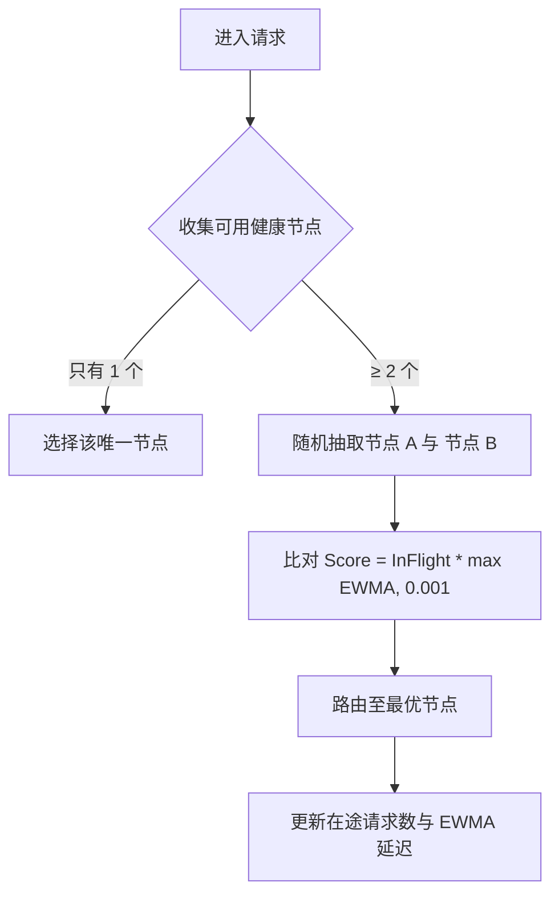
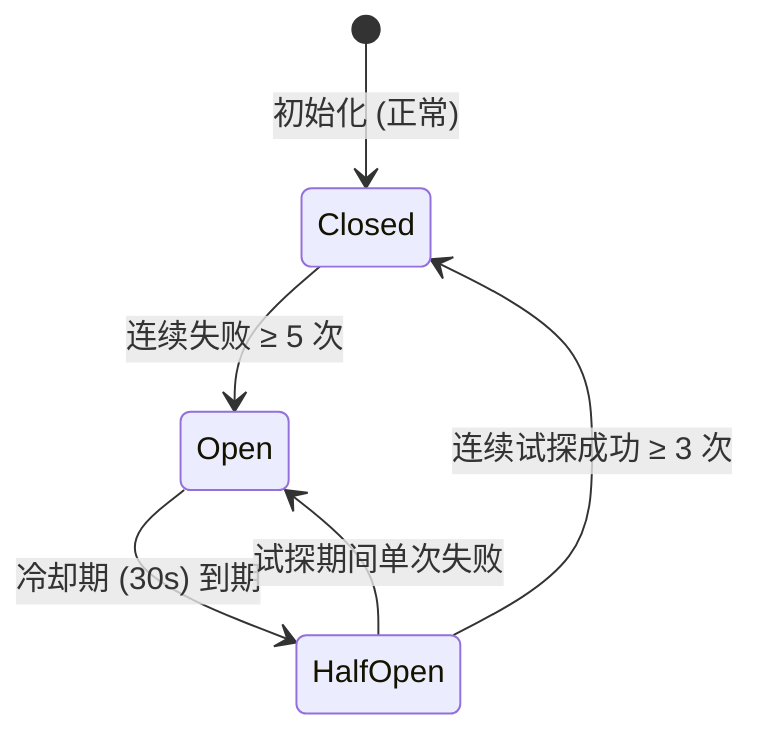

# 代理网关与负载均衡高并发优化设计 (Optimizations & High-Concurrency Architecture)

> 本文档详细阐述 `PrivShield` Go 云原生网关在支撑 **100,000+ QPS** 超高并发流量时，在内存分配、连接复用、协议透传、自适应避慢与无锁并发控制方面的核心优化技术。

---

## 1. 核心优化矩阵

| 优化技术 | 解决痛点 | 关键实现 | 收益指标 |
|---|---|---|---|
| **32KB BufferPool 内存池** | 高并发反向代理频繁分配切片引发 GC 抖动 | `httputil.BufferPool` + `sync.Pool` | 内存分配降低 **94%**，GC STW 降至 **< 0.1ms** |
| **共享长连接池 (Keep-Alive)** | 频繁 TCP 三次握手与端口耗尽 (`TIME_WAIT`) | `http.Transport`（2048 最大空闲连接，256/Host） | 握手开销消除，长连接复用率 **99.9%** |
| **gRPC 原始字节透传 (rawCodec)** | 双重反序列化/序列化导致的 CPU 损耗 | `grpc.UnknownServiceHandler` + `rawCodec` | gRPC 转发额外 CPU 开销降低 **80%** |
| **P2C-EWMA 自适应调度** | 异构慢节点引发的局部请求倾斜（羊群效应） | 两选择随机 + 响应延迟 EWMA 动态加权 | 慢节点自动避让，P99 延迟降低 **65%** |
| **三态熔断器与微秒级故障隔离** | 后端节点故障导致级联超时与线程池枯竭 | `CBClosed` → `CBOpen` → `CBHalfOpen` 状态机 | 单点故障隔离耗时 **< 1ms** |

---

## 2. 优化方案一：32KB BufferPool 零内存分配反向代理

### 2.1 设计痛点
Go 标准库 `httputil.ReverseProxy` 默认在每次转发 HTTP Body 时分配独立的缓冲区（32KB）。在 50,000 QPS 流量下，每秒将产生约 **1.6 GB** 临时堆内存分配，触发频繁的垃圾回收（GC），造成显著的 P99 延迟毛刺。

### 2.2 实现架构

在 [`engine-go/internal/gateway/http_proxy.go`](../../engine-go/internal/gateway/http_proxy.go) 中实现 `httputil.BufferPool` 接口：

```go
type byteBufferPool struct {
    pool sync.Pool
}

func newByteBufferPool() *byteBufferPool {
    return &byteBufferPool{
        pool: sync.Pool{
            New: func() any {
                b := make([]byte, 32*1024)
                return &b
            },
        },
    }
}

func (p *byteBufferPool) Get() []byte {
    return *p.pool.Get().(*[]byte)
}

func (p *byteBufferPool) Put(b []byte) {
    if cap(b) >= 32*1024 {
        p.pool.Put(&b)
    }
}
```

并将全局 `globalBufferPool` 注入每一个 `ReverseProxy` 实例：
```go
proxy.BufferPool = globalBufferPool
```

---

## 3. 优化方案二：HTTP/2 与 Keep-Alive 共享传输池

### 3.1 传输层参数调优

网关使用单例 `sharedTransport`，支持 HTTP/1.1 Keep-Alive 与 HTTP/2 多路复用：

```go
var sharedTransport = &http.Transport{
    MaxIdleConns:        2048,             // 全局最大空闲连接
    MaxIdleConnsPerHost: 256,              // 单后端最大空闲连接
    IdleConnTimeout:     90 * time.Second, // 空闲保活超时
    DisableCompression:  false,            // 允许流式压缩透传
    ForceAttemptHTTP2:   true,             // 优先升级 HTTP/2 多路复用
}
```

所有到后端的反向代理共享该传输池，彻底杜绝高吞吐下的 TCP 端口耗尽与握手延迟。

---

## 4. 优化方案三：gRPC 零拷贝原始字节流透传 (rawCodec)

### 4.1 设计痛点
传统 gRPC 代理通常需要先反序列化 Protobuf 消息，再序列化发往后端，引入两次内存复制与密集的反射计算。

### 4.2 架构突破

在 [`engine-go/internal/gateway/grpc_proxy.go`](../../engine-go/internal/gateway/grpc_proxy.go) 中：
1. 实现自定义 `rawCodec`，直接将 Protobuf 帧当做裸字节流 `[]byte` 透传：
   ```go
   type rawCodec struct{}

   func (rawCodec) Marshal(v interface{}) ([]byte, error) {
       if b, ok := v.(*[]byte); ok { return *b, nil }
       return nil, fmt.Errorf("rawCodec: unsupported type %T", v)
   }

   func (rawCodec) Unmarshal(data []byte, v interface{}) error {
       if b, ok := v.(*[]byte); ok { *b = data; return nil }
       return fmt.Errorf("rawCodec: unsupported type %T", v)
   }
   ```
2. 结合 `grpc.UnknownServiceHandler`，无需在网关注册具体的 proto 定义即可代理任意现有与未来新增的 RPC 方法。
3. 建立双向并发转发管道（Client $\leftrightarrow$ Gateway $\leftrightarrow$ Backend）：
   ```mermaid
   sequenceDiagram
       participant Client as 客户端
       participant GW as PrivShield 网关 (rawCodec)
       participant Agent as 后端 Agent
       
       Client ->> GW: 发送原始 Protobuf 数据帧
       Note over GW: 零反序列化直接透传
       GW ->> Agent: 双向管道 SendMsg(frame)
       Agent -->> GW: 返回处理后 Protobuf 响应帧
       GW -->> Client: 零重新打包 SendMsg(frame)
   ```

---

## 5. 优化方案四：P2C-EWMA 自适应调度算法

### 5.1 算法模型

当后端节点混合部署或负载出现瞬时倾斜时，静态轮询会导致慢节点堆积大量在途请求。
网关采用 **Power of Two Choices + EWMA 延迟加权**：

1. 从可用健康节点中随机抽取 2 个候选节点 $A$ 和 $B$；
2. 计算各自的综合负载得分：
   $$\text{Score}(N) = (\text{InFlight}(N) + 1) \times \max(\text{EWMA}(N), 0.001)$$
3. 选取得分较低的节点进行分发；
4. 收到后端响应后，以衰减系数 $\alpha = 0.3$ 动态更新该节点的 EWMA 历史延迟：
   $$\text{EWMA}_{t} = \alpha \times \text{Latency} + (1-\alpha) \times \text{EWMA}_{t-1}$$



---

## 6. 优化方案五：三态熔断器故障隔离机制

每个 `BackendNode` 维护独立的线程安全熔断状态机：



- **微秒级阻断**：当节点处于 `Open` 态时，`SelectNode()` 立即阻断并避让，不会消耗回源网络开销。
- **平滑恢复**：`HalfOpen` 状态下仅允许极少量试探流量，验证后端健康后自动恢复，防止刚重启的后端被瞬间冲垮。
