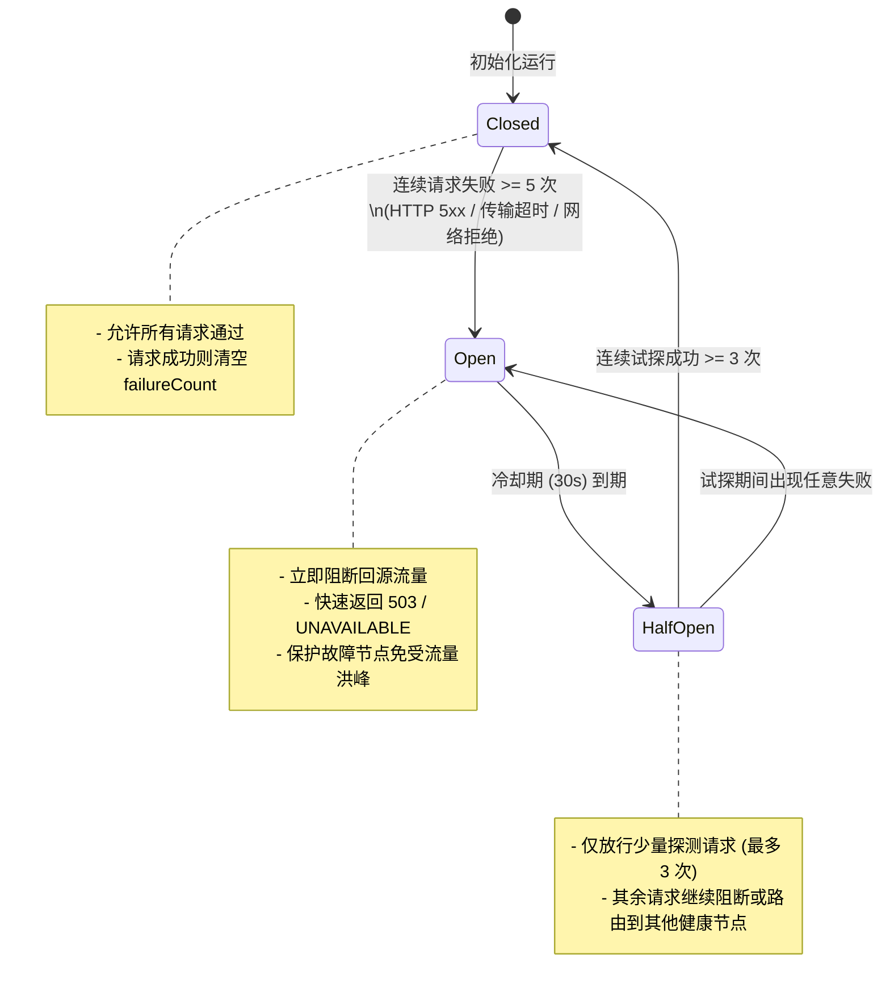
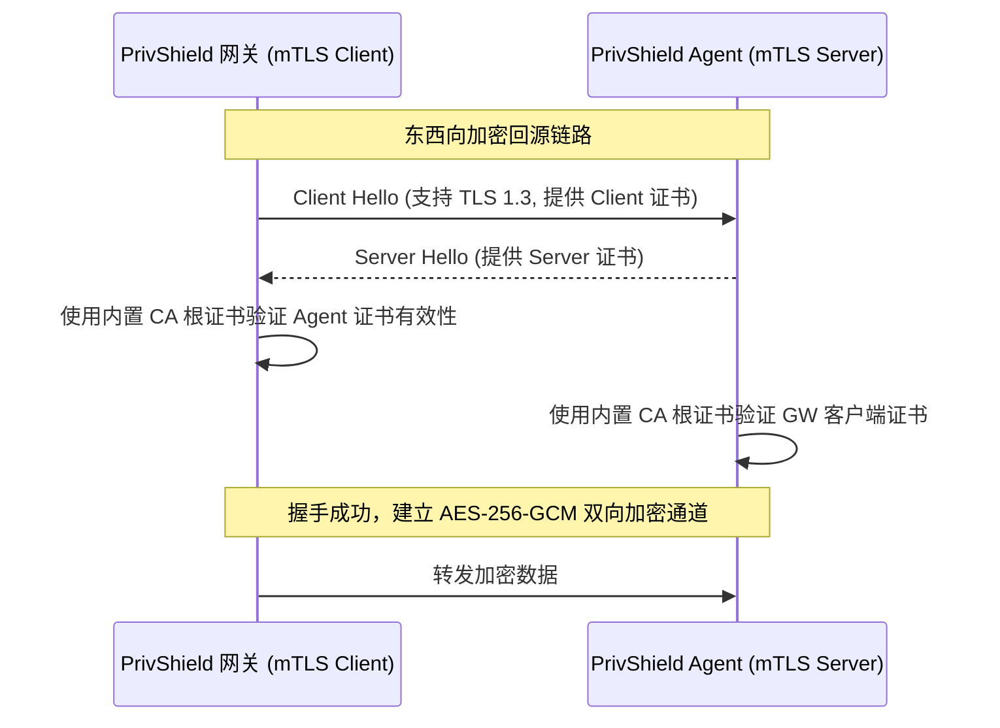

# 代理网关与负载均衡可靠性架构说明 (Reliability & Fault-Tolerance Architecture)

> 本文档深入剖析 `PrivShield` Go 云原生网关在崩溃恢复、故障自愈、三态熔断、自适应避慢、优雅停机与东西向安全通信方面的可靠性设计与工程实现。

---

## 1. 可靠性能力矩阵

| 可靠性维度 | 支持状态 | 核心实现与机制 |
|---|---|---|
| **无状态崩溃恢复** | ✅ 原生支持 | 网关本身纯无状态设计，支持多实例水平扩展，任意实例故障不影响全局调度 |
| **三态熔断保护** | ✅ 原生支持 | 节点独立三态熔断器（`Closed` → `Open` → `HalfOpen`），连续 5 次失败自动熔断 |
| **半开试探自愈** | ✅ 原生支持 | 30s 冷却后进入 `HalfOpen`，允许 3 次试探请求，达标后自动恢复正常分流 |
| **P2C-EWMA 自适应避慢** | ✅ 原生支持 | 动态跟踪在途请求与历史响应延迟，以 $O(1)$ 复杂度自动避让慢节点与过载节点 |
| **连接池耗尽防御** | ✅ 原生支持 | 2048 共享长连接池 + 32KB BufferPool，杜绝高并发下 TCP 端口耗尽与内存溢出 |
| **零信任 mTLS 回源** | ✅ 原生支持 | 东西向私有 CA 证书双向加密（默认 TLS 1.3），保障内网链路不可窃听与篡改 |
| **优雅停机与排空** | ✅ 原生支持 | 捕获 `SIGINT`/`SIGTERM`，HTTP 15s 超时安全收尾，gRPC `GracefulStop` 安全关闭 |
| **Prometheus 实时告警** | ✅ 原生支持 | 暴露 InFlight、EWMA 延迟、熔断器状态与状态码统计，支持对接 Grafana / Alertmanager |

---

## 2. 三态熔断器与自愈状态机

### 2.1 状态转移模型

每个 `BackendNode` 拥有独立的 `CircuitBreaker` 实例，状态转移逻辑如下：



### 2.2 触发条件与判定规则

| 事件类型 | 触发源 | 熔断器反馈方法 | 影响说明 |
|---|---|---|---|
| **HTTP 成功响应** | 响应状态码 `< 500` | `node.CB.RecordSuccess()` | `Closed` 清零失败数；`HalfOpen` 递增成功计数（达到 3 次复位为 `Closed`） |
| **HTTP 错误响应** | 响应状态码 `≥ 500` (如 502/503/504) | `node.CB.RecordFailure()` | 累计失败计数；达到阈值跃迁为 `Open` |
| **网络层异常** | TCP 连接拒绝、连接重置、超时 | `node.CB.RecordFailure()` | 记录失败并更新 `lastFailure` 故障时间戳 |
| **gRPC 传输异常** | `clientStream` 或 `serverStream` 读写错误 | `node.CB.RecordFailure()` | 累计失败并触发熔断判断 |
| **gRPC 正常完成** | 流正常关闭 (`io.EOF`) | `node.CB.RecordSuccess()` | 记录成功并辅助半开自愈 |

---

## 3. P2C-EWMA 自适应避慢机制

在异构节点池中，部分节点可能因 GC 停顿、CPU 争抢或硬件性能差异出现“隐性变慢”。传统轮询（Round-Robin）仍会向其盲目灌入等量流量，导致请求堆积与超时。

### 3.1 调度评分公式

网关在每次调度时，从可用健康节点中随机抽取 2 个候选节点 $A$ 与 $B$，计算综合负荷得分：

$$\text{Score}(N) = (\text{InFlight}(N) + 1) \times \max(\text{EWMA}(N), 0.001)$$

- **$\text{InFlight}(N)$**：节点当前正在处理的在途并发请求数；
- **$\text{EWMA}(N)$**：节点历史响应延迟（秒）；
- **$\max(\cdot, 0.001)$**：设置 1ms 保底延迟基线，防止新建节点因历史数据为空被过度倾斜。

### 3.2 EWMA 动态衰减

收到后端响应后，以权重因子 $\alpha = 0.3$ 动态更新该节点的 EWMA 历史延迟：

$$\text{EWMA}_{t} = 0.3 \times \text{Latency}_{\text{current}} + 0.7 \times \text{EWMA}_{t-1}$$

该衰减系数既能对突发延迟保持敏感（快速避让），又不会因偶发单次长尾请求产生过度反应。

---

## 4. 东西向零信任 mTLS 回源加密

在跨主机或跨机房场景中，网关到后端 Agent 之间的网络通信面临内网监听与中间人篡改风险。

### 4.1 证书体系与握手流程



### 4.2 配置与防护

在 [`engine-go/internal/gateway/backend_tls.go`](../../engine-go/internal/gateway/backend_tls.go) 中：
- 严格强制 **TLS 1.3** 为默认安全基线（可通过 `BuildBackendTLSConfigWithMinVersion` 兼容 TLS 1.2）；
- 证书解析失败时实行 **Fail-Fast** 机制，启动阶段立即退出并记录审计日志。

---

## 5. 优雅停机与资源回收

网关在接收到操作系统的终止信号时，执行两阶段优雅停机：

```go
// engine-go/cmd/privshield-gateway/main.go
quit := make(chan os.Signal, 1)
signal.Notify(quit, syscall.SIGINT, syscall.SIGTERM)
<-quit

// 1. HTTP 反向代理优雅停机（15s 超时安全等待在途请求收尾）
ctx, cancel := context.WithTimeout(context.Background(), 15*time.Second)
defer cancel()
httpServer.Shutdown(ctx)

// 2. gRPC 透明代理服务器安全关闭
grpcProxyServer.GracefulStop()
```

- **HTTP 优雅关闭**：停止接受新连接，等待已接收的在途 HTTP 事务执行完成；
- **gRPC 优雅停机**：通知所有活动 stream 完成最后的双向报文传输，安全关闭后端 `ClientConn` 连接池。

---

## 6. SRE 运维监控与告警指标

网关通过 `/metrics` 端点导出以下 Prometheus 标准监控指标：

| Prometheus 指标名 | 类型 | 告警建议阈值 | 说明 |
|---|---|---|---|
| `gateway_requests_total{status=~"5.."}` | Counter | 5 分钟内错误率 > 1% | 后端出现集中故障或熔断 |
| `gateway_circuit_breaker_state` | Gauge | `value == 1 (open)` 持续 > 1m | 后端特定节点已触发熔断 |
| `gateway_backend_inflight_requests` | Gauge | 单节点持续 > 500 | 后端 Agent 处理能力饱和 |
| `gateway_backend_ewma_latency_seconds` | Gauge | P99 > 1.0s | 后端出现性能劣化或慢查询 |
