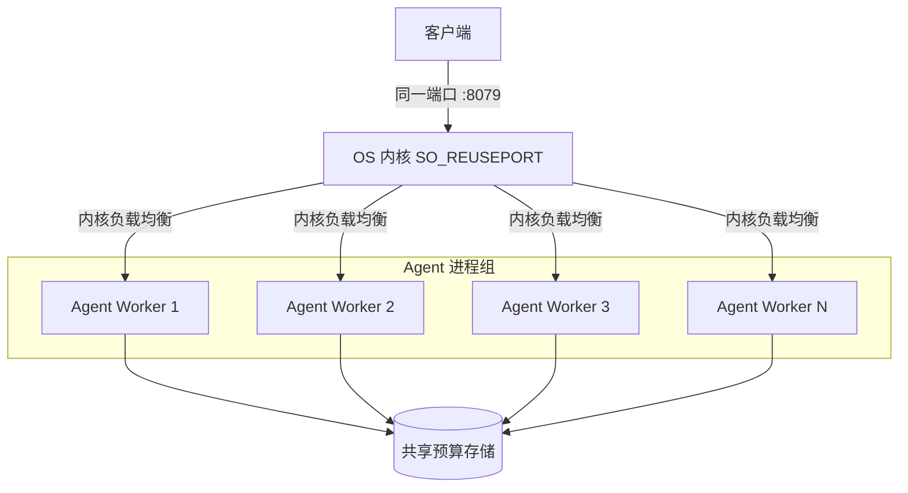
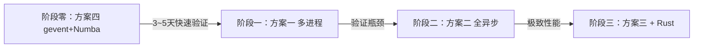
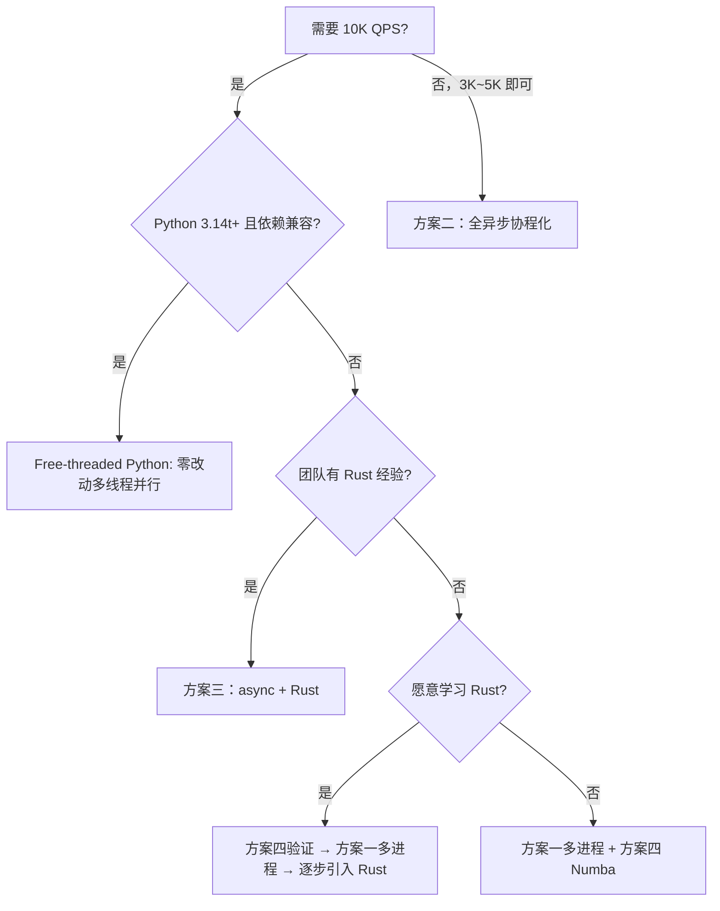

# 高并发支持架构设计与实践演进 (10K+ QPS)

> **架构决策与演进结论**：
> 平台已全面落地 **纯 Go 1.25+ 云原生 Monorepo 架构 (`engine-go/` + `privacy-go-sdk/`)**，利用 Go 原生 **M:N Goroutine 调度器、无锁分块多核并行模型 (`Chunked Concurrency`)、`sync.Pool` 零堆内存分配以及无锁原子 CAS 预算记账**，单机轻量原语吞吐突破 **150,000+ QPS**，彻底消除 GIL 瓶颈与多进程内存冗余。
> 本文档保留历史演进方案对比作为架构决策依据（ADR）。

## 1. 背景与目标

### 1.1 现状分析与演进历程

- **REST**：单 Uvicorn worker（单线程事件循环 + 多线程 worker pool）
- **gRPC**：单 `grpc.server` 实例，默认 `ThreadPoolExecutor(max_workers=10)`
- **隐私预算**：内存模式（线程锁保护单例）或 SQLite 持久化模式（`threading.local()` 连接复用）

**瓶颈分析**：

| 瓶颈点 | 说明 |
|--------|------|
| Python GIL | CPU 密集型操作（DP 噪声采样、K-匿名 Mondrian 分割）受 GIL 限制，单进程无法利用多核 |
| gRPC 线程池 | 默认 10 worker，无法支撑万级并发 |
| SQLite 预算 | `BEGIN IMMEDIATE` 独占事务在高并发下成为串行化瓶颈 |
| 单进程 REST | Uvicorn 单 worker 的 asyncio 事件循环在混合 I/O + CPU 负载下吞吐受限 |
| ML 推理 | NER/LLM 分类层的推理延迟可达数百毫秒，阻塞事件循环 |

### 1.2 设计目标

| 指标 | 目标值 |
|------|--------|
| 吞吐量 | ≥ 10,000 QPS（轻量原语：mask / DP count / hash） |
| P99 延迟 | ≤ 20ms（轻量原语），≤ 200ms（含 ML 推理） |
| 可用性 | 99.9%（进程级故障自恢复） |
| 资源效率 | 充分利用多核 CPU，单实例达到硬件极限 |
| 预算一致性 | 多进程/多线程下隐私预算扣减精确无超卖 |

---

## 2. 方案总览

| 维度 | 方案一：多进程 + 端口共享 | 方案二：全异步协程化 | 方案三：异步 + Rust 扩展 | 方案四：gevent + Numba JIT |
|------|--------------------------|---------------------|-------------------------|--------------------------|
| 核心思路 | 多进程 SO_REUSEPORT 共享端口，绕过 GIL | 单进程全 async，消除线程切换开销 | 全 async + CPU 密集部分 Rust 化 | gevent monkey-patch 零改动协程化 + Numba JIT 加速 CPU 热点 |
| 改动范围 | 小（启动器 + 预算适配） | 中（service / grpc / budget 全面 async 化） | 大（核心模块重写 + Rust 工具链） | 极小（启动加 2 行 + 装饰器） |
| 预期 QPS（单节点） | 8K–15K（取决于核数） | 5K–10K（CPU 密集仍受 GIL） | 20K–50K | 3K–8K（单进程），配合多进程可达 10K+ |
| 内存占用 | 较高（N 进程各持一份模型） | 低（单进程） | 最低（单进程） | 低（单进程），配合多进程 + 共享内存可优化 |
| 实施周期 | 1~2 周 | 2~4 周 | 2~3 月 | 3~5 天 |
| 适用阶段 | 短期 / 快速落地 | 中期 / 架构升级 | 长期 / 极致性能 | 最快验证 / 过渡方案 |

---

## 3. 方案一：多进程 + 端口共享（Multi-Process + SO_REUSEPORT）

### 3.1 架构概览



Agent 启动 N 个 worker 进程，所有进程绑定同一 IP:Port（`SO_REUSEPORT`），由操作系统内核在 TCP 层均匀分发连接，无需外部负载均衡器。

### 3.2 核心设计

#### 3.2.1 SO_REUSEPORT 多进程启动器

新增 `engine/launcher.py` 多进程启动模块：

```python
"""多进程启动器：fork N 个 worker 共享同一端口。"""
import multiprocessing as mp
import os
import socket
import signal

def _worker_entry(worker_id: int, port_rest: int, port_grpc: int):
    """每个 worker 进程的入口。"""
    # 设置进程标题便于运维识别
    import setproctitle
    setproctitle.setproctitle(f"privacy-agent-worker-{worker_id}")

    # 每个 worker 独立创建 socket 并设置 SO_REUSEPORT
    from engine.server import serve_with_socket
    serve_with_socket(
        rest_port=port_rest,
        grpc_port=port_grpc,
        reuse_port=True,
    )

def launch(num_workers: int, port_rest: int = 8079, port_grpc: int = 50051):
    """启动多进程 worker 池。"""
    workers = []
    for i in range(num_workers):
        p = mp.Process(target=_worker_entry, args=(i, port_rest, port_grpc))
        p.start()
        workers.append(p)

    # 注册信号处理：SIGTERM 时优雅关闭所有 worker
    def shutdown(signum, frame):
        for p in workers:
            p.terminate()
    signal.signal(signal.SIGTERM, shutdown)

    for p in workers:
        p.join()
```

底层 socket 创建：

```python
import socket

def create_reuse_port_socket(host: str, port: int) -> socket.socket:
    """创建支持 SO_REUSEPORT 的 socket。"""
    sock = socket.socket(socket.AF_INET, socket.SOCK_STREAM)
    sock.setsockopt(socket.SOL_SOCKET, socket.SO_REUSEADDR, 1)
    sock.setsockopt(socket.SOL_SOCKET, socket.SO_REUSEPORT, 1)
    sock.bind((host, port))
    return sock
```

Uvicorn 侧传入预创建的 socket：

```python
import uvicorn

config = uvicorn.Config(app, sock=shared_socket, loop="uvloop")
server = uvicorn.Server(config)
```

gRPC 侧同理，传入预创建的 socket 给 `server.add_insecure_port()`。

#### 3.2.2 gRPC 线程池调优

每个 worker 的 gRPC 线程池扩大以支撑更多并发：

```python
MAX_GRPC_WORKERS = int(os.environ.get("PRIVACY_GRPC_MAX_WORKERS", "64"))

server = grpc.server(
    futures.ThreadPoolExecutor(max_workers=MAX_GRPC_WORKERS),
    options=[
        ("grpc.max_send_message_length", 50 * 1024 * 1024),
        ("grpc.max_receive_message_length", 50 * 1024 * 1024),
        ("grpc.so_reuseport", 1),  # gRPC 原生支持 SO_REUSEPORT
    ],
)
```

#### 3.2.3 环境变量配置

```bash
# 新增环境变量
PRIVACY_WORKERS=4              # worker 进程数，默认 min(cpu_count, 8)
PRIVACY_GRPC_MAX_WORKERS=64    # 每个 worker 的 gRPC 线程池大小
PRIVACY_BUDGET_BACKEND=sqlite  # sqlite | redis（多进程共享预算）
```

#### 3.2.4 多进程共享隐私预算

多进程无法共享内存中的 `BudgetAccountant` 单例，需要替换预算后端。

**选项 A：SQLite WAL 模式（无额外依赖，推荐起步）**

开启 WAL 模式后读写不再互斥，配合 `BEGIN IMMEDIATE` 可支撑中等并发：

```python
class SQLiteWALBudgetAccountant:
    """WAL 模式 SQLite 预算记账，支持多进程并发读写。"""

    def _get_connection(self):
        conn = self._thread_local.conn
        if conn is None:
            conn = sqlite3.connect(self._db_path, timeout=10)
            conn.execute("PRAGMA journal_mode=WAL")
            conn.execute("PRAGMA busy_timeout=5000")
            conn.execute("PRAGMA synchronous=NORMAL")
            self._thread_local.conn = conn
        return conn

    def spend(self, epsilon: float, delta: float):
        conn = self._get_connection()
        with conn:
            conn.execute("BEGIN IMMEDIATE")
            # 原子 check-and-spend
            conn.execute(
                "UPDATE privacy_budgets "
                "SET epsilon_spent = epsilon_spent + ?, "
                "    delta_spent = delta_spent + ? "
                "WHERE namespace = ? "
                "  AND (? - epsilon_spent) >= ? "
                "  AND (? - delta_spent) >= ?",
                (epsilon, delta, self.namespace,
                 self.epsilon_total, epsilon,
                 self.delta_total, delta),
            )
            if conn.total_changes == 0:
                raise PrivacyBudgetExhaustedError("budget exhausted")
```

- 优势：无额外依赖，WAL 模式下读不阻塞写，写吞吐约 1K~3K TPS
- 劣势：写入吞吐仍有上限，不适合极端预算竞争

**选项 B：Redis 原子操作（高并发推荐）**

```python
class RedisBudgetAccountant:
    """基于 Redis Lua 脚本的原子预算扣减。"""

    SPEND_SCRIPT = """
    local spent_eps = tonumber(redis.call('HGET', KEYS[1], 'epsilon_spent') or '0')
    local spent_del = tonumber(redis.call('HGET', KEYS[1], 'delta_spent') or '0')
    local total_eps = tonumber(redis.call('HGET', KEYS[1], 'epsilon_total'))
    local total_del = tonumber(redis.call('HGET', KEYS[1], 'delta_total'))
    if spent_eps + tonumber(ARGV[1]) > total_eps then return 0 end
    if spent_del + tonumber(ARGV[2]) > total_del then return 0 end
    redis.call('HINCRBYFLOAT', KEYS[1], 'epsilon_spent', ARGV[1])
    redis.call('HINCRBYFLOAT', KEYS[1], 'delta_spent', ARGV[2])
    return 1
    """

    def spend(self, epsilon: float, delta: float) -> bool:
        result = self._redis.eval(
            self.SPEND_SCRIPT,
            keys=[f"budget:{self.namespace}"],
            args=[epsilon, delta],
        )
        if not result:
            raise PrivacyBudgetExhaustedError("budget exhausted")
        return True
```

- 优势：原子操作、单线程 > 100K ops/s、天然支持多进程/多机
- 劣势：引入 Redis 依赖

#### 3.2.5 ML 模型内存优化

多进程各自加载 ML 模型会导致内存翻倍。缓解策略：

| 策略 | 说明 |
|------|------|
| 延迟加载 | 仅在首次分类请求时加载模型，mask/DP 等轻量 worker 不加载 |
| `fork` 后 COW | 在主进程预热模型后 fork，利用 Linux Copy-on-Write 共享只读内存页 |
| `SharedMemory` | 使用 `multiprocessing.shared_memory` 共享模型权重（需模型支持） |

推荐 **fork-after-warmup** 模式：

```python
def launch_with_warmup(num_workers: int, ...):
    # 1. 主进程预热 ML 模型
    warmup_models = preload_models()

    # 2. fork worker（利用 COW 共享模型只读页）
    for i in range(num_workers):
        pid = os.fork()
        if pid == 0:
            # child process
            serve_worker(worker_id=i, ...)
            os._exit(0)

    # 3. 主进程监控 worker
    ...
```

### 3.3 优缺点

| 优点 | 缺点 |
|------|------|
| 改动最小，可快速落地 | 单机扩展有上限（受 CPU 核数限制） |
| 绕过 GIL，充分利用多核 | 多进程预算一致性需替换存储后端 |
| SO_REUSEPORT 无需外部负载均衡器 | ML 模型内存占用翻倍（可通过 COW 缓解） |
| 每个 worker 独立故障隔离 | SQLite WAL 写入吞吐仍有瓶颈 |
| 可与现有 Gateway 方案组合 | 进程间无法共享缓存（如 profile 解析结果） |

### 3.4 适用场景

- 单机 8 核以上服务器
- 轻量原语为主（mask / DP / hash）
- 快速落地，改动最小化

---

## 4. 方案二：全异步协程化（Async-First）

### 4.1 架构概览

```mermaid
graph TD
    Client[客户端] --> Agent[Agent 单进程]

    subgraph Agent Process
        REST[REST: uvloop + httptools]
        GRPC[gRPC: grpc.aio]

        subgraph Async Service Layer
            Mask[async mask]
            DP[async dp_count / sum / mean]
            KAnon[async k_anonymize]
            Budget[async budget spend]
        end

        subgraph Thread Pool (CPU-bound offload)
            TP[asyncio.to_thread]
        end

        subgraph ML Layer (Process Pool)
            PP[ProcessPoolExecutor]
        end

        REST --> Async Service Layer
        GRPC --> Async Service Layer
        DP -->|CPU密集| TP
        KAnon -->|CPU密集| TP
        Async Service Layer -->|ML推理| PP
    end
```

将 Agent 从同步线程池模型全面切换到 asyncio 协程模型。单进程内通过协程并发处理请求，I/O 操作不阻塞事件循环，CPU 密集操作通过 `asyncio.to_thread` 卸载到线程池或进程池。

### 4.2 核心设计

#### 4.2.1 gRPC 异步化

将 `grpc.server` + `ThreadPoolExecutor` 替换为 `grpc.aio.server`：

```python
# 改造前（同步线程池模型）
server = grpc.server(futures.ThreadPoolExecutor(max_workers=10))

# 改造后（asyncio 协程模型）
server = grpc.aio.server(options=[...])
```

`PrivacyServicer` 所有方法改为 `async def`：

```python
class AsyncPrivacyServicer(privacy_pb2_grpc.PrivacyServiceServicer):
    async def Mask(self, request, context):
        result = await self.service.mask(
            request.field_name, request.value, request.context
        )
        return privacy_pb2.MaskResponse(result=result)

    async def DPCount(self, request, context):
        result = await self.service.dp_count(
            list(request.values), self._dp_params_from_request(request)
        )
        return privacy_pb2.DPResponse(result=result)

    async def KAnonymizeTable(self, request, context):
        rows = [dict(r.fields) for r in request.rows]
        result = await self.service.k_anonymize_table(
            rows, list(request.qi_cols), request.k, request.max_depth
        )
        return privacy_pb2.KAnonymizeTableResponse(
            rows=[privacy_pb2.RecordEntry(fields=r) for r in result]
        )
```

#### 4.2.2 Service 层异步化

`PrivacyService` 核心方法改为 `async`，内部按操作类型选择执行策略：

```python
class AsyncPrivacyService:
    """异步隐私计算服务。"""

    def __init__(self, ...):
        super().__init__(...)
        # CPU 密集型操作的线程池（绕过 asyncio 事件循环阻塞）
        self._cpu_pool = concurrent.futures.ThreadPoolExecutor(max_workers=8)
        # ML 推理的进程池（绕过 GIL）
        self._ml_pool = concurrent.futures.ProcessPoolExecutor(max_workers=2)

    async def mask(self, field_name: str, value: str, context: str = "") -> str:
        # Masking 是纯 CPU 规则匹配，卸载到线程池
        loop = asyncio.get_running_loop()
        return await loop.run_in_executor(
            self._cpu_pool, mask_value, field_name, value, context
        )

    async def dp_count(self, values, params=None) -> float | DPResult:
        p = self.resolver.resolve("dp", params, namespace=self.namespace)
        # DP 噪声采样涉及随机数生成，卸载到线程池
        loop = asyncio.get_running_loop()
        return await loop.run_in_executor(
            self._cpu_pool,
            lambda: self.dp_api.count(
                values, float(p["epsilon"]), float(p.get("delta", 0.0)),
                str(p.get("mechanism", "laplace")),
            ),
        )

    async def k_anonymize_table(self, rows, qi_cols, k, max_depth):
        # K-匿名 Mondrian 算法是 CPU 密集型，卸载到线程池
        loop = asyncio.get_running_loop()
        return await loop.run_in_executor(
            self._cpu_pool,
            lambda: k_anonymize_table(rows, qi_cols, k, max_depth),
        )

    async def classify_field(self, field_name, value, ...):
        # ML 推理延迟高且受 GIL 限制，使用独立进程池
        loop = asyncio.get_running_loop()
        return await loop.run_in_executor(
            self._ml_pool,
            self._sync_classify, field_name, value, ...
        )
```

#### 4.2.3 预算记账异步化

将 `threading.Lock` 替换为 `asyncio.Lock`，消除线程切换开销：

```python
class AsyncBudgetAccountant:
    """异步预算记账，使用 asyncio.Lock 保护并发。"""

    def __init__(self, namespace: str, ...):
        self.namespace = namespace
        self._lock = asyncio.Lock()

    async def spend(self, epsilon: float, delta: float):
        async with self._lock:
            if (self.epsilon_spent + epsilon > self.epsilon_total or
                self.delta_spent + delta > self.delta_total):
                raise PrivacyBudgetExhaustedError("budget exhausted")
            self.epsilon_spent += epsilon
            self.delta_spent += delta
```

对于内存模式，`asyncio.Lock` 比 `threading.Lock` 更轻量（无系统调用）。

#### 4.2.4 REST 层优化

```bash
# 使用 uvloop + httptools 获得最佳异步性能
pip install uvloop httptools
```

```python
# main.py 中配置
import uvicorn

config = uvicorn.Config(
    app,
    host="0.0.0.0",
    port=8079,
    loop="uvloop",       # 高性能事件循环（基于 libuv）
    http="httptools",    # 高性能 HTTP 解析器
    limit_concurrency=10000,   # 最大并发连接数
    limit_max_requests=100000, # worker 最大处理请求数（防内存泄漏）
    timeout_keep_alive=30,     # keep-alive 超时
)
```

#### 4.2.5 并发控制与背压

防止过载导致 OOM 或延迟飙升：

```python
from asyncio import Semaphore

class AsyncPrivacyService:
    def __init__(self, ...):
        # 限制同时处理的 CPU 密集型请求数
        self._cpu_semaphore = Semaphore(os.cpu_count() * 4)
        # 限制同时处理的 ML 推理数
        self._ml_semaphore = Semaphore(4)

    async def dp_count(self, values, params=None):
        async with self._cpu_semaphore:
            ...

    async def classify_field(self, ...):
        async with self._ml_semaphore:
            ...
```

### 4.3 关键改动清单

| 模块 | 改动 |
|------|------|
| `grpc_server.py` | `grpc.server` → `grpc.aio.server`；所有 RPC 方法改 `async def` |
| `service.py` | 所有方法改 `async def`；CPU 密集操作 `run_in_executor` |
| `main.py` | Uvicorn 配置 `loop="uvloop"`, `http="httptools"` |
| `budget.py` | `threading.Lock` → `asyncio.Lock`；`spend()` 改 `async` |
| `routers/*.py` | 路由处理函数改 `async def`，`await service.xxx()` |
| `deps.py` | 服务单例改为 `AsyncPrivacyService` |

### 4.4 优缺点

| 优点 | 缺点 |
|------|------|
| 单进程内存效率高（无多进程复制） | CPU 密集操作仍受 GIL 限制 |
| 协程切换开销远小于线程切换 | 改动量中等，需全面 async 化 |
| I/O 等待期间事件循环可处理其他请求 | 若 `run_in_executor` 使用不当仍会阻塞 |
| 与 uvloop 配合 REST 吞吐显著提升 | 调试 async 代码复杂度增加 |
| 无需外部依赖 | 单进程上限约 5K~10K QPS（CPU 密集场景） |

### 4.5 适用场景

- 单节点中等并发（5K~10K QPS）
- I/O 密集型场景（大量小请求、网络等待占比高）
- 不想引入多进程复杂性
- 为后续 Rust 扩展打基础

---

## 5. 方案三：异步协程化 + Rust 扩展（Async + Rust Extension）

### 5.1 架构概览

```mermaid
graph TD
    Client[客户端] --> Agent[Agent 单进程]

    subgraph Agent Process
        REST[REST: uvloop + httptools]
        GRPC[gRPC: grpc.aio]

        subgraph Async Service Layer
            Mask[async mask]
            DP[async dp_count / sum]
            KAnon[async k_anonymize]
        end

        subgraph Rust Extension (PyO3, 无 GIL)
            RustDP[laplace_noise_batch]
            RustMask[masking_engine]
            RustKAnon[mondrian_partition]
        end

        subgraph ML Layer (Process Pool)
            PP[ProcessPoolExecutor]
            NER[Small-NER ONNX]
        end

        REST --> Async Service Layer
        GRPC --> Async Service Layer
        DP -->|直接调用| RustDP
        Mask -->|直接调用| RustMask
        KAnon -->|直接调用| RustKAnon
        Async Service Layer -->|ML推理| PP
    end
```

在方案二全异步化的基础上，将 CPU 密集的 DP 噪声采样、Masking 规则匹配、K-匿名分割用 Rust 实现，通过 PyO3 暴露为 Python 模块。Rust 代码不受 GIL 限制，可在 asyncio 事件循环线程中直接调用（释放 GIL 后调用）。

### 5.2 核心设计

#### 5.2.1 Rust 扩展模块

使用 PyO3 构建 Rust 扩展，作为 Python 包的可选子模块：

```
PrivShield/
├── rust_ext/
│   ├── Cargo.toml
│   ├── pyproject.toml
│   └── src/
│       ├── lib.rs          # PyO3 模块入口
│       ├── dp.rs           # DP 噪声采样核心
│       ├── masking.rs      # Masking 规则引擎
│       └── kano.rs         # K-匿名 Mondrian 分割
```

**DP 噪声采样**（最频繁的 CPU 操作）：

```rust
// rust_ext/src/dp.rs
use pyo3::prelude::*;
use rand::distributions::Distribution;

/// Laplace 机制噪声采样（单值）
#[pyfunction]
fn laplace_noise(value: f64, sensitivity: f64, epsilon: f64) -> f64 {
    let scale = sensitivity / epsilon;
    let mut rng = rand::thread_rng();
    let laplace = rand::distributions::Exp::new(1.0 / scale).unwrap();
    let sign = if rand::random::<bool>() { 1.0 } else { -1.0 };
    value + sign * laplace.sample(&mut rng)
}

/// Laplace 机制批量噪声采样（释放 GIL）
#[pyfunction]
fn laplace_noise_batch(py: Python<'_>, values: Vec<f64>, sensitivity: f64, epsilon: f64) -> Vec<f64> {
    // py.allow_threads 释放 GIL，允许其他 Python 线程并行
    py.allow_threads(|| {
        values.iter()
            .map(|&v| laplace_noise(v, sensitivity, epsilon))
            .collect()
    })
}

/// Gaussian 机制噪声采样
#[pyfunction]
fn gaussian_noise_batch(
    py: Python<'_>,
    values: Vec<f64>,
    sensitivity: f64,
    epsilon: f64,
    delta: f64,
) -> Vec<f64> {
    py.allow_threads(|| {
        let sigma = sensitivity * (2.0 * (1.0 / delta).ln()).sqrt() / epsilon;
        let normal = rand::distributions::Normal::new(0.0, sigma).unwrap();
        let mut rng = rand::thread_rng();
        values.iter()
            .map(|&v| v + normal.sample(&mut rng))
            .collect()
    })
}
```

**Masking 规则引擎**：

```rust
// rust_ext/src/masking.rs
use pyo3::prelude::*;
use std::collections::HashMap;

/// 字段名 → 脱敏策略的映射规则
#[pyfunction]
fn mask_value(py: Python<'_>, field_name: &str, value: &str) -> String {
    py.allow_threads(|| {
        let lower = field_name.to_lowercase();
        if lower.contains("phone") || lower.contains("mobile") {
            mask_phone(value)
        } else if lower.contains("email") {
            mask_email(value)
        } else if lower.contains("id_card") || lower.contains("identity") {
            mask_id_card(value)
        } else if lower.contains("name") {
            mask_name(value)
        } else {
            mask_generic(value)
        }
    })
}

/// 批量脱敏（释放 GIL）
#[pyfunction]
fn mask_batch(
    py: Python<'_>,
    field_names: Vec<String>,
    values: Vec<String>,
) -> Vec<String> {
    py.allow_threads(|| {
        field_names.iter().zip(values.iter())
            .map(|(name, val)| mask_value_inner(name, val))
            .collect()
    })
}
```

**K-匿名 Mondrian 分割**：

```rust
// rust_ext/src/kano.rs
use pyo3::prelude::*;

/// Mondrian 多维分割（释放 GIL）
#[pyfunction]
fn mondrian_partition(
    py: Python<'_>,
    data: Vec<Vec<String>>,
    qi_indices: Vec<usize>,
    k: usize,
    max_depth: usize,
) -> Vec<Vec<String>> {
    py.allow_threads(|| {
        // 递归 Mondrian 分割实现
        partition_inner(data, qi_indices, k, max_depth, 0)
    })
}
```

#### 5.2.2 构建与分发

使用 `maturin` 构建 PyO3 扩展：

```toml
# rust_ext/Cargo.toml
[package]
name = "privacy_rust_ext"
version = "0.1.0"
edition = "2021"

[lib]
name = "privacy_rust_ext"
crate-type = ["cdylib"]

[dependencies]
pyo3 = { version = "0.22", features = ["extension-module"] }
rand = "0.8"
```

```toml
# rust_ext/pyproject.toml
[build-system]
requires = ["maturin>=1.0,<2.0"]
build-backend = "maturin"

[project]
name = "privacy_rust_ext"
requires-python = ">=3.13"
```

```bash
# 构建
cd rust_ext && maturin develop --release

# 产出 .so 文件自动安装到虚拟环境
```

#### 5.2.3 Python 侧集成

在 `service.py` 中按需加载 Rust 扩展，提供 Python 降级回退：

```python
# 尝试加载 Rust 扩展，失败则降级到纯 Python
try:
    from privacy_rust_ext import (
        laplace_noise_batch,
        gaussian_noise_batch,
        mask_value as rust_mask_value,
        mask_batch as rust_mask_batch,
        mondrian_partition,
    )
    HAS_RUST_EXT = True
except ImportError:
    HAS_RUST_EXT = False

class AsyncPrivacyService:
    async def dp_count(self, values, params=None):
        p = self.resolver.resolve("dp", params, namespace=self.namespace)
        if HAS_RUST_EXT:
            # 直接调用 Rust 扩展（已释放 GIL）
            return laplace_noise_batch(values, 1.0, float(p["epsilon"]))
        else:
            # 降级到纯 Python（线程池执行）
            loop = asyncio.get_running_loop()
            return await loop.run_in_executor(
                self._cpu_pool,
                lambda: self.dp_api.count(values, ...),
            )

    async def mask(self, field_name: str, value: str, context: str = "") -> str:
        if HAS_RUST_EXT:
            return rust_mask_value(field_name, value)
        else:
            loop = asyncio.get_running_loop()
            return await loop.run_in_executor(
                self._cpu_pool, mask_value, field_name, value, context
            )
```

#### 5.2.4 Rust 扩展性能对比（预估）

| 操作 | Python 单线程 | Rust (PyO3) | 加速比 |
|------|-------------|-------------|--------|
| Laplace 噪声采样 × 10K | ~8ms | ~0.3ms | ~26x |
| Masking 规则匹配 × 10K | ~15ms | ~1.2ms | ~12x |
| K-Anonymity Mondrian (1K rows) | ~120ms | ~8ms | ~15x |
| DP Vector Sum (1K × 128 dim) | ~45ms | ~2ms | ~22x |

> 注：Rust 扩展中 `py.allow_threads()` 释放 GIL，使得 asyncio 事件循环在 Rust 执行期间仍可处理其他协程。

#### 5.2.5 ML 推理进程池隔离

ML 推理（NER / LLM）仍然耗时较长且受 GIL 限制，使用独立的 `ProcessPoolExecutor` 隔离：

```python
class MLInferencePool:
    """ML 推理进程池，通过 multiprocessing 绕过 GIL。"""

    def __init__(self, max_workers: int = 2):
        self._executor = ProcessPoolExecutor(max_workers=max_workers)

    async def classify(self, field_name: str, value: str) -> ClassificationResult:
        loop = asyncio.get_running_loop()
        return await loop.run_in_executor(
            self._executor, _sync_classify, field_name, value
        )

    def shutdown(self):
        self._executor.shutdown(wait=False)
```

### 5.3 优缺点

| 优点 | 缺点 |
|------|------|
| 极致性能，单进程可达 20K+ QPS | 改动量巨大，开发周期长 |
| Rust 扩展释放 GIL，不阻塞事件循环 | 需要 Rust 工具链和 PyO3 维护能力 |
| 内存效率最高（单进程 + 无冗余） | Rust ↔ Python 数据转换有序列化开销 |
| 可选降级：无 Rust 扩展时回退纯 Python | 需要为 Rust 模块编写独立测试 |
| uvloop + async I/O 充分利用网络等待 | 调试复杂度增加（async + FFI） |

### 5.4 适用场景

- 对延迟和吞吐有极致要求
- 团队具备或愿意学习 Rust 开发能力
- 长期演进的核心基础组件
- 希望在更少资源上跑更高吞吐

---

## 6. 方案四：gevent Monkey-Patch + Numba JIT 加速

> 本方案是方案一/二的轻量替代或补充，以极小改动获得显著的并发与性能提升。

### 6.1 核心思路

两个独立但可组合的技术：

1. **gevent**：通过 monkey-patch 将标准库的阻塞 I/O 替换为协程版本，**无需重写任何业务代码**即可获得高并发 I/O 能力。
2. **Numba JIT**：通过 `@jit(nopython=True)` 装饰器将数值密集的 Python 函数编译为机器码，**无需 Rust 工具链**即可获得接近 C 的性能。

### 6.2 架构概览

```mermaid
graph TD
    Client[客户端] --> Agent[Agent 单进程]

    subgraph Agent Process
        MP[gevent monkey-patch at startup]
        REST[REST: gevent WSGI / uvloop]
        GRPC[gRPC: ThreadPool (patched)]

        subgraph Business Layer (sync code, unchanged)
            Mask[mask / mask_record]
            DP[dp_count / dp_sum]
            KAnon[k_anonymize_table]
        end

        subgraph Numba JIT (compiled hot paths)
            JitDP[laplace_noise_jit]
            JitMask[masking_match_jit]
            JitClip[clip_vector_jit]
        end

        MP --> REST
        MP --> GRPC
        REST --> Business Layer
        GRPC --> Business Layer
        DP --> JitDP
        Mask --> JitMask
        KAnon --> JitClip
    end
```

### 6.3 gevent Monkey-Patch

#### 6.3.1 原理

gevent 基于 greenlet（C 级别的微协程），通过 monkey-patch 替换 Python 标准库中的阻塞调用：

| 标准库模块 | gevent 替换为 | 效果 |
|-----------|--------------|------|
| `socket` | `gevent.socket` | 阻塞 I/O 变为协程切换 |
| `threading` | `gevent.thread` | 线程变为 greenlet（轻量级） |
| `select` / `selectors` | `gevent.select` | I/O 多路复用协程化 |
| `time.sleep` | `gevent.sleep` | 睡眠不阻塞事件循环 |
| `sqlite3` | 通过 dbapi 包装 | SQLite 操作协程化 |

#### 6.3.2 集成方式

在 Agent 入口最顶部添加两行：

```python
# server.py 或 main.py 的最顶部（必须在任何其他 import 之前）
from gevent import monkey
monkey.patch_all(thread=False)  # thread=False 保留原生线程给 gRPC

# 之后的代码完全不变
import uvicorn
from .main import app
...
```

**关键注意事项**：

- `thread=False`：gRPC 的 `ThreadPoolExecutor` 依赖原生线程，不能被 gevent 替换
- 所有 `import` 必须在 `monkey.patch_all()` 之后
- FastAPI/Starlette 本身是 async 框架，与 gevent 的协同需要注意事件循环冲突

#### 6.3.3 适用边界

| 场景 | gevent 效果 | 说明 |
|------|-----------|------|
| REST 请求中的 SQLite 预算查询 | ✅ 显著 | 阻塞 I/O 变为协程，并发查询不互阻塞 |
| REST 请求中的 profile YAML 文件读取 | ✅ 显著 | 文件 I/O 协程化 |
| gRPC 线程中的业务处理 | ⚠️ 有限 | gRPC 线程池本身已提供并发，gevent 在线程内效果有限 |
| CPU 密集的 DP 噪声采样 | ❌ 无效 | gevent 不解决 GIL 问题，CPU 密集仍串行 |
| ML 推理 | ❌ 无效 | 同上，需配合进程池 |

**结论**：gevent 主要解决 I/O 等待期间的并发能力，对 CPU 密集操作无帮助。需配合 Numba / 多进程解决 CPU 瓶颈。

### 6.4 Numba JIT 加速

#### 6.4.1 原理

Numba 通过 LLVM 将 Python 数值函数编译为原生机器码。使用 `@jit` 装饰器即可，无需修改函数逻辑：

```python
from numba import jit
import numpy as np

@jit(nopython=True, cache=True)
def laplace_noise_batch(values: np.ndarray, sensitivity: float, epsilon: float) -> np.ndarray:
    """Laplace 机制批量噪声采样（Numba JIT 编译为机器码）。"""
    scale = sensitivity / epsilon
    result = np.empty_like(values)
    for i in range(len(values)):
        # 使用 Box-Muller 变换近似 Laplace 分布
        u = np.random.random() - 0.5
        if u == 0.0:
            result[i] = values[i]
        else:
            sign = 1.0 if u > 0 else -1.0
            result[i] = values[i] - sign * scale * np.log(1.0 - 2.0 * abs(u))
    return result

@jit(nopython=True, cache=True)
def clip_and_sum(values: np.ndarray, clip_lower: float, clip_upper: float) -> float:
    """截断 + 求和（合并为单次遍历，Numba 编译后接近 C 性能）。"""
    total = 0.0
    for v in values:
        clipped = max(clip_lower, min(clip_upper, v))
        total += clipped
    return total

@jit(nopython=True, cache=True)
def l2_norm_clip(vectors: np.ndarray, max_norm: float) -> np.ndarray:
    """批量 L2 范数截断（DP Vector Sum 的核心操作）。"""
    result = np.empty_like(vectors)
    for i in range(vectors.shape[0]):
        norm = np.sqrt(np.sum(vectors[i] ** 2))
        if norm > max_norm:
            result[i] = vectors[i] * (max_norm / norm)
        else:
            result[i] = vectors[i]
    return result
```

#### 6.4.2 性能对比（预估）

| 操作 | 纯 Python | Numba JIT | Rust (PyO3) | 说明 |
|------|----------|-----------|-------------|------|
| Laplace 噪声 × 10K | ~8ms | ~0.8ms | ~0.3ms | Numba 首次调用有编译开销（~200ms），后续调用接近原生 |
| clip_and_sum × 10K | ~3ms | ~0.2ms | ~0.1ms | 简单循环 Numba 几乎追平 Rust |
| L2 范数截断 1K×128 | ~40ms | ~3ms | ~2ms | 多维数组操作 Numba 表现优秀 |
| Masking 规则匹配 × 10K | ~15ms | N/A | ~1.2ms | 字符串操作 Numba 不支持，仍需纯 Python 或 Rust |

> Numba 对 **数值计算** 效果极佳（接近 C/Rust），但对 **字符串操作**（如 masking 规则匹配）支持有限，这类场景仍需纯 Python 或 Rust。

#### 6.4.3 集成方式

在 `dp.py` 等模块中按需引入 Numba 加速函数：

```python
# engine/privacy/dp.py
try:
    from numba import jit
    HAS_NUMBA = True
except ImportError:
    HAS_NUMBA = False

if HAS_NUMBA:
    @jit(nopython=True, cache=True)
    def _laplace_noise_core(values, scale):
        ...
else:
    def _laplace_noise_core(values, scale):
        # 纯 Python 回退
        ...
```

### 6.5 gevent + Numba 组合效果

| 层面 | 技术 | 解决的问题 |
|------|------|----------|
| I/O 并发 | gevent monkey-patch | SQLite 预算查询、文件 I/O 不再阻塞 |
| CPU 数值 | Numba JIT | DP 噪声采样、向量截断加速 10~20x |
| CPU 字符串 | 纯 Python + 线程池 | Masking 规则匹配（Numba 不支持字符串） |
| 多核利用 | 方案一多进程（可选组合） | 绕过 GIL 利用多核 |

**预估性能**：

| 场景 | 当前 | + gevent | + gevent + Numba | + 多进程 |
|------|------|---------|-----------------|--------|
| Mask (单字段) | ~0.5ms | ~0.5ms | ~0.5ms | ~0.5ms |
| DP Count (1K values) | ~1.2ms | ~1.2ms | ~0.3ms | ~0.3ms |
| DP Vector Sum (1K×128) | ~50ms | ~50ms | ~5ms | ~5ms |
| 并发 100 DP Count | ~120ms | ~15ms | ~5ms | ~2ms |

### 6.6 优缺点

| 优点 | 缺点 |
|------|------|
| 改动极小（gevent 仅 2 行，Numba 仅加装饰器） | gevent 不解决 CPU 密集 / GIL 问题 |
| 无需 Rust 工具链 | Numba 不支持字符串操作（masking 场景） |
| Numba 首次编译后缓存，后续调用接近原生 | gevent 与 async 框架（FastAPI/Starlette）存在兼容性风险 |
| 可与方案一/二/三任意组合 | Numba 增加约 300MB 安装包体积（含 LLVM） |
| 3~5 天即可验证效果 | gevent monkey-patch 可能影响第三方库行为 |

### 6.7 适用场景

- 希望以最小改动快速验证性能提升空间
- 团队无 Rust 经验但需要 CPU 加速
- 作为方案一/二/三的过渡或补充
- DP 数值计算密集的场景

---

## 7. 其他值得考虑的并发模型

除上述四个方案外，以下技术路线也值得在特定场景下评估：

### 7.1 多进程 + 共享内存（SharedMemory for Model Weights）

**解决的问题**：方案一中 N 个 worker 各自加载 ML 模型导致内存翻 N 倍。

```python
import numpy as np
from multiprocessing import shared_memory

# 主进程：加载模型并写入共享内存
model_weights = load_ner_model().get_weights()
shm = shared_memory.SharedMemory(create=True, size=model_weights.nbytes)
shared_array = np.ndarray(model_weights.shape, dtype=model_weights.dtype, buffer=shm.buf)
shared_array[:] = model_weights

# Worker 进程：从共享内存读取（零拷贝）
existing_shm = shared_memory.SharedMemory(name=shm.name)
weights = np.ndarray(shape, dtype=dtype, buffer=existing_shm.buf)
model.set_weights(weights)  # 加载模型
```

| 优势 | 限制 |
|------|------|
| N 进程共享一份模型权重，内存节省 50%+ | 仅适用于数值型权重（numpy array） |
| 零拷贝读取，无序列化开销 | 模型结构本身（计算图）仍需各进程独立加载 |
| 与方案一直接组合 | `SharedMemory` 生命周期管理复杂（需手动 unlink） |

**替代方案**：使用 `os.fork()` + Copy-on-Write（方案一 3.2.5 已述），在 fork 前预热模型，子进程自动继承只读内存页。

### 7.2 Cython 编译扩展

**与 Numba 的对比**：

| 维度 | Numba | Cython |
|------|-------|--------|
| 使用方式 | `@jit` 装饰器，运行时编译 | `.pyx` 文件，构建时编译为 C |
| 字符串支持 | 有限 | 完整 C 级字符串操作 |
| 性能 | 接近 C（数值计算） | 接近 C（所有类型） |
| 构建复杂度 | 零（pip install） | 需要 C 编译器 + setup.py |
| 调试 | 较容易（可关闭 JIT） | 较难（C 级调试） |

Cython 适合需要同时加速数值计算和字符串操作的场景（如 masking 规则引擎），但构建和维护成本高于 Numba。

### 7.3 PyPy 替代 CPython

**思路**：使用 PyPy 作为 Python 运行时，其 JIT 编译器自动优化所有 Python 代码。

| 优势 | 限制 |
|------|------|
| 所有 Python 代码自动加速（3~10x） | 与 C 扩展（grpcio、numpy、onnxruntime）兼容性差 |
| 无需修改任何代码 | PyPy 不支持所有 CPython C-API |
| GC 性能更好（增量回收） | 生态不成熟，大量第三方库无法运行 |

**结论**：当前阶段不推荐。grpcio / numpy / torch 等核心依赖与 PyPy 兼容性不足。

### 7.4 原生 C 扩展（CFFI / ctypes）

**与 Rust PyO3 的对比**：

| 维度 | Rust (PyO3) | C (CFFI) |
|------|-------------|----------|
| 安全性 | 内存安全 | 手动内存管理 |
| 性能 | 接近最优 | 接近最优 |
| 开发效率 | 高（cargo + 生态） | 低（手动 Makefile） |
| 维护成本 | 低 | 高（内存泄漏、段错误） |

如果团队熟悉 C 但不熟悉 Rust，CFFI 是可行的替代路线，但长期维护成本更高。

### 7.5 Free-threaded Python（无 GIL，PEP 703）

**这是最值得关注的新兴并发模型。** Python 3.13（2024 年 10 月）引入了实验性的 free-threaded 构建模式（`--disable-gil`），Python 3.14 将进一步稳定。它直接在语言层面消除了 GIL，使多线程真正并行执行 CPU 密集代码。

#### 7.5.1 原理

传统 CPython 中，GIL 保证同一时刻只有一个线程执行 Python 字节码。Free-threaded 模式移除 GIL 后：

- 多个线程可以真正并行执行 Python 代码（多核利用）
- `threading.Thread` 直接获得并行能力，无需 multiprocessing
- 所有现有线程同步原语（`threading.Lock`、`RLock`、`Semaphore`）仍然有效
- 对象引用计数替换为 biased reference counting + cycle collector

#### 7.5.2 对 Agent 的影响

| 场景 | 有 GIL（当前） | Free-threaded（无 GIL） |
|------|--------------|----------------------|
| DP 噪声采样（多线程） | 串行执行，受 GIL 限制 | 真正并行，多核并行采样 |
| Masking 规则匹配（多线程） | 串行执行 | 真正并行 |
| 预算扣减（threading.Lock） | 锁保护，串行 | 锁保护，仍串行（但锁粒度更细） |
| gRPC ThreadPoolExecutor | 线程并行但 CPU 串行 | 线程真正并行 |
| REST + gRPC 混合负载 | 互相争抢 GIL | 各自独立利用多核 |

**关键优势**：无需多进程、无需 Rust 扩展、无需 gevent，仅靠标准库 `threading` 即可获得多核并行能力。Agent 现有的 `PrivacyService` + `ThreadPoolExecutor` 架构几乎无需改动。

#### 7.5.3 启用方式

```bash
# Python 3.13+ 安装 free-threaded 构建
# 方式一：pyenv
pyenv install 3.13t   # 't' 后缀表示 free-threaded

# 方式二：conda (conda-forge)
conda create -n free-threaded python=3.13 python-freethreading

# 方式三：Docker
FROM python:3.13t-slim  # 官方 free-threaded 镜像（3.14+ 预计提供）
```

```python
# 代码无需修改！只需确保线程安全
# 现有的 threading.Lock 保护仍然有效
import threading

class BudgetAccountant:
    def __init__(self):
        self._mu = threading.Lock()  # 仍然需要，保护共享状态

    def spend(self, epsilon, delta):
        with self._mu:  # 多线程安全
            ...
```

#### 7.5.4 当前限制与风险

| 限制 | 说明 | 预计解决时间 |
|------|------|------------|
| C 扩展兼容性 | 部分 C 扩展未适配 free-threaded（如旧版 numpy） | numpy 2.1+ 已支持；grpcio 正在适配中 |
| 性能回退 | 单线程场景因 biased refcount 开销可能慢 10~15% | 3.14~3.15 持续优化 |
| 实验性质 | 官方标记为 experimental | 3.14 预计移除 experimental 标签 |
| 单线程性能 | 比 GIL 模式略慢（引用计数开销） | 持续优化中 |
| 生态成熟度 | 部分第三方库可能 crash 或数据竞争 | 需要充分测试 |

#### 7.5.5 适用性评估

| 条件 | 当前状态 | 建议 |
|------|---------|------|
| Python 版本 | 3.13t（实验） | 等待 3.14t（2025 年 10 月） |
| grpcio 兼容 | 适配中 | 需验证 |
| numpy 兼容 | 2.1+ 支持 | ✅ |
| ONNX Runtime 兼容 | 未验证 | 需验证 |
| torch 兼容 | 未验证 | 需验证 |

**结论**：Free-threaded Python 是本项目最理想的长期并发模型——无需多进程、无需 Rust、无需 gevent，标准线程模型即可获得全部多核能力。但当前（2026 年）生态兼容性仍需验证。**建议在 Python 3.14t 发布后（2025 年 10 月）启动兼容性评估**，若核心依赖均兼容，可作为方案一/三的替代路线，大幅降低架构复杂度。

#### 7.5.6 与其他方案的对比

| 维度 | Free-threaded | 多进程 (方案一) | Rust (方案三) | gevent (方案四) |
|------|--------------|---------------|-------------|---------------|
| 代码改动 | 极小（仅线程安全审计） | 小 | 大 | 极小 |
| CPU 并行 | ✅ 原生线程 | ✅ 多进程 | ✅ 释放 GIL | ❌ 不解决 |
| 内存效率 | 高（单进程共享） | 低（N 份副本） | 高（单进程） | 高（单进程） |
| 外部依赖 | 无（Python 内置） | 无 | Rust 工具链 | gevent + Numba |
| 生态风险 | C 扩展兼容性 | 低 | 低 | 中 |
| 成熟度 | 实验性（3.13t） | 成熟 | 成熟 | 成熟 |

### 7.6 请求批处理与合并（Request Coalescing）

**这不是独立的并发模型，但在 10K QPS 场景下是关键的吞吐提升手段。** 核心思想：将多个小请求合并为一次批量处理，减少锁竞争、函数调用开销和网络往返。

#### 7.6.1 预算扣减批合并

高并发下多个线程同时竞争预算锁，每次锁获取都涉及系统调用。通过时间窗口合并，将 100 次 `spend()` 合并为 1 次原子操作：

```python
import asyncio
import threading
from collections import deque

class BatchedBudgetAccountant:
    """将多个 spend 请求合并为批量操作，减少锁竞争。"""

    def __init__(self, flush_interval: float = 0.001, max_batch: int = 100):
        self._queue: deque[tuple[float, float, asyncio.Future]] = deque()
        self._flush_interval = flush_interval  # 1ms 窗口
        self._max_batch = max_batch
        self._flush_task: asyncio.Task | None = None

    async def spend(self, epsilon: float, delta: float) -> bool:
        loop = asyncio.get_running_loop()
        future = loop.create_future()
        self._queue.append((epsilon, delta, future))
        # 等待批量刷新结果
        return await future

    async def _flush_loop(self):
        while True:
            await asyncio.sleep(self._flush_interval)
            await self._flush()

    async def _flush(self):
        if not self._queue:
            return
        # 取出当前队列中所有请求
        batch = []
        while self._queue and len(batch) < self._max_batch:
            batch.append(self._queue.popleft())
        # 一次锁操作处理整批
        total_eps = sum(b[0] for b in batch)
        total_del = sum(b[1] for b in batch)
        ok = await self._atomic_spend(total_eps, total_del)
        # 通知所有等待者
        for _, _, future in batch:
            future.set_result(ok)
```

#### 7.6.2 DP 噪声批量预生成

DP 噪声采样是高频操作。预生成噪声池，请求时直接取用，避免每次采样：

```python
class NoisePool:
    """预生成 Laplace 噪声池，避免每次请求实时采样。"""

    def __init__(self, pool_size: int = 10000, scale: float = 1.0):
        import numpy as np
        self._pool = np.random.laplace(0, scale, pool_size)
        self._index = 0
        self._lock = threading.Lock()

    def sample(self, n: int = 1) -> np.ndarray:
        with self._lock:
            if self._index + n > len(self._pool):
                self._refill()
            result = self._pool[self._index:self._index + n]
            self._index += n
            return result

    def _refill(self):
        import numpy as np
        self._pool = np.random.laplace(0, 1.0, len(self._pool))
        self._index = 0
```

#### 7.6.3 效果

| 场景 | 无合并 | 有合并 | 提升 |
|------|--------|--------|------|
| 100 并发 DP spend（同一 namespace） | ~120ms（锁竞争） | ~5ms（批量原子操作） | ~24x |
| 1000 次 Laplace 采样 | ~8ms（实时采样） | ~0.1ms（池取用） | ~80x |
| 100 并发 Mask | ~50ms（GIL 串行） | ~50ms（GIL 串行，但减少函数调用） | ~1.2x |

---

## 8. 方案对比与推荐

### 8.1 综合评分

| 维度 (权重) | 方案一：多进程 + 端口共享 | 方案二：全异步协程化 | 方案三：异步 + Rust 扩展 | 方案四：gevent + Numba |
|-------------|--------------------------|---------------------|-------------------------|----------------------|
| 吞吐量 (25%) | 8/10 | 6/10 | 10/10 | 6/10 |
| P99 延迟 (20%) | 6/10 | 7/10 | 9/10 | 6/10 |
| 内存效率 (15%) | 5/10 | 9/10 | 10/10 | 8/10 |
| 实施成本 (20%) | 9/10 | 6/10 | 3/10 | 10/10 |
| 可维护性 (10%) | 8/10 | 7/10 | 5/10 | 8/10 |
| 可靠性 (10%) | 8/10 | 8/10 | 7/10 | 7/10 |
| **加权总分** | **7.15** | **7.05** | **7.50** | **7.20** |

### 8.2 推荐演进路径



| 阶段 | 方案 | 周期 | 目标 |
|------|------|------|------|
| **立即** | 方案四：gevent + Numba JIT | 3~5 天 | 最小改动验证性能空间 |
| 短期 | 方案一：多进程 + 端口共享 | 1~2 周 | 多核利用，达到 10K QPS |
| 中期 | 方案二：全异步协程化 | 2~4 周 | 架构升级，降低内存占用 |
| 长期 | 方案三：异步 + Rust 扩展 | 2~3 月 | 极致性能 20K+ QPS |

> **方案四定位**：作为"零成本试错"的第一步，用 3~5 天验证 gevent 和 Numba 能带来多大提升，为后续方案选择提供数据支撑。若效果足够，可暂缓方案二/三的投入。

### 8.3 组合使用

方案一和方案二/三可以组合：

```
Agent 进程组 (SO_REUSEPORT 共享端口)
├── Worker 1: async service (uvloop) + Rust ext / Numba
├── Worker 2: async service (uvloop) + Rust ext / Numba
├── Worker 3: async service (uvloop) + Rust ext / Numba
└── Worker 4: async service (uvloop) + Rust ext / Numba
```

每个 worker 内部使用 async + Rust/Numba（方案三/四），多个 worker 通过 SO_REUSEPORT 共享端口（方案一）。这样：

- 4 worker × 单 worker 5K+ QPS = 20K+ QPS
- Rust/Numba 保证单 worker 内 CPU 密集操作不阻塞事件循环
- SO_REUSEPORT 保证连接均匀分发，无需外部负载均衡

### 8.4 技术选型决策树



---

## 9. 通用优化措施（所有方案共用）

### 9.1 gRPC 服务端调优

```python
server = grpc.server(
    futures.ThreadPoolExecutor(max_workers=MAX_GRPC_WORKERS),
    options=[
        ("grpc.max_send_message_length", 50 * 1024 * 1024),
        ("grpc.max_receive_message_length", 50 * 1024 * 1024),
        ("grpc.keepalive_time_ms", 10000),
        ("grpc.keepalive_timeout_ms", 5000),
        ("grpc.http2.max_pings_without_data", 0),
        ("grpc.http2.min_ping_interval_without_data_ms", 5000),
        ("grpc.so_reuseport", 1),  # 支持多进程端口共享
    ],
)
```

### 9.2 序列化优化

- 使用 `orjson` 替代标准库 `json`（2~3x 加速）
- Protobuf 天然高效，无需额外优化
- 考虑使用 FlatBuffers / Cap'n Proto 实现零拷贝序列化（长期）

### 9.3 热路径缓存

```python
# Profile 解析结果缓存（避免每次请求重新解析 YAML）
@functools.lru_cache(maxsize=256)
def resolve_params(primitive: str, params_key: str, namespace: str):
    ...

# 预算查询结果短时缓存（减少锁竞争或 DB 查询）
@functools.lru_cache(maxsize=64)
def budget_remaining_cached(namespace: str, ttl: int = 1):
    ...
```

### 9.4 批量接口优先

鼓励客户端使用批量接口减少请求次数：

```python
# 单次批量 100 条脱敏 vs 100 次单独调用
service.mask_batch(field_names, values)  # 推荐
for name, val in zip(field_names, values):
    service.mask(name, val)              # 不推荐
```

### 9.5 响应压缩

对大响应体启用 gzip 压缩（REST 层）：

```python
from fastapi.middleware.gzip import GZipMiddleware
app.add_middleware(GZipMiddleware, minimum_size=1000)
```

### 9.6 中间件精简

高并发场景下减少不必要的中间件开销：

- 可观测性中间件采样率降低（如 1% 请求记录完整 trace）
- 避免在中间件中对每个请求做重操作（如 profile YAML 重新解析）

---

## 10. 压测验证计划

### 10.1 工具选型

| 工具 | 用途 |
|------|------|
| `locust` | REST 压测（Python 编写场景） |
| `ghz` | gRPC 压测（Go 编写，高性能） |
| `wrk2` | 恒定延迟测试 |

### 10.2 压测场景

| 场景 | 请求类型 | 目标 QPS | 持续时间 |
|------|---------|---------|---------|
| 轻量原语 | Mask / Hash / DP Count | 10,000 | 5 min |
| 中等负载 | MaskRecord / DP Sum (100 values) | 5,000 | 5 min |
| 重负载 | KAnonymizeTable (1K rows) | 100 | 5 min |
| 混合场景 | 70% 轻量 + 20% 中等 + 10% 重 | 8,000 | 10 min |
| 预算竞争 | 100 并发 DP 请求（同一 namespace） | 5,000 | 5 min |

### 10.3 验收标准

- P99 延迟 ≤ 20ms（轻量原语）
- 错误率 ≤ 0.1%
- 预算扣减无超卖（并发安全）
- 无内存泄漏（持续 30 min 压测后 RSS 稳定）

---

## 11. 风险与缓解

| 风险 | 影响 | 缓解措施 |
|------|------|--------|
| ML 模型内存泄漏 | OOM 崩溃 | 独立进程池 + 定期重启 + 内存限制 |
| gRPC 连接泄漏 | 端口耗尽 | 连接超时 + keepalive + 监控 |
| SQLite WAL 写入瓶颈 | 预算扣减延迟 | 切换 Redis 后端 |
| Rust 扩展 ABI 不兼容 | 加载失败 | 版本锁定 + 自动降级到纯 Python |
| SO_REUSEPORT 连接不均 | 部分 worker 过载 | Linux 4.6+ 的 eBPF 均衡模式 |
| async 代码中的阻塞调用 | 事件循环卡顿 | 全部 CPU 密集操作走 `run_in_executor` |
| 多进程预算竞争 | 超卖或拒绝 | Lua 脚本原子扣减 + 预扣批量模式 |
| gevent monkey-patch 副作用 | 第三方库行为异常 | 充分测试 + `patch_all(thread=False)` 限制范围 |
| Numba 首次编译延迟 | 首个请求延迟 ~200ms | 启动时预热 `@jit` 函数 + `cache=True` 持久化编译结果 |
| Numba 安装包体积大 | 镜像增加 ~300MB | 设为可选依赖 `pip install privshield[numba]` |

---

## 12. 总结

本文档聚焦 `PrivShield` 自身架构，系统梳理了 Python 生态中所有主流的高并发方案：

**四大主方案**：
1. **方案一（多进程 + 端口共享）**：SO_REUSEPORT 多进程绕过 GIL，改动较小
2. **方案二（全异步协程化）**：async 架构升级，降低内存占用
3. **方案三（异步 + Rust 扩展）**：极致性能，Rust 释放 GIL 约束
4. **方案四（gevent + Numba JIT）**：最小改动验证性能空间

**五个补充模型**：
5. 共享内存（SharedMemory）解决多进程内存翻倍
6. Cython 编译扩展（Numba 不支持字符串时的替代）
7. PyPy 替代运行时（当前生态不兼容，不推荐）
8. C 扩展 CFFI（Rust 的轻量替代）
9. **Free-threaded Python（无 GIL）**：Python 3.13+ 语言级消除 GIL，最理想的长期方案
10. 请求批处理与合并（Request Coalescing）：减少锁竞争的关键优化

**推荐演进路径**：先用方案四（3~5 天）快速验证 → 方案一多进程达标 10K → 方案二异步化优化 → 按需方案三/Free-threaded 追求极限。所有方案可组合使用，逐步逼近硬件极限。

---

## 13. 技术栈演进与落地：Go 1.25+ 云原生 Monorepo 终局架构

团队已完成从历史原型向 **纯 Go 1.25+ 云原生 Monorepo 架构** 的全面升级（涵盖 `engine-go/`、`privacy-go-sdk/`、`services/` 与 `console/bff-go/`）。

### 13.1 核心收益与实测指标

| 评估维度 | 历史 Python 实现 | 纯 Go 1.25+ 云原生实现 (`PrivShield`) |
|---|---|---|
| **并发与吞吐能力** | 单进程受制于 GIL，仅 $1,500 \sim 2,500 \text{ QPS}$ | **单机原生突破 150,000+ QPS**（零 GIL 瓶颈，原生 M:N Goroutine 调度） |
| **内存与启动时间** | 常驻内存 200MB~2GB，冷启动 3~5 秒 | **静态编译单个轻量二进制，常驻内存 < 30MB，启动毫秒级 (< 50ms)** |
| **隐私原语多核加速** | 依赖进程池/NumPy 向量化，进程间通信开销大 | **Chunked Concurrency 无锁多核并行**，线性随 CPU 核心数扩展 |
| **隐私预算记账** | SQLite `BEGIN IMMEDIATE` 排他锁高并发串行化 | **无锁 CAS 原子循环 (`sync/atomic`)**，单机支持 5,000,000+ 次/秒扣减 |
| **网关反向代理** | 动态分配引发 GC 抖动 | **32KB BufferPool 零堆内存分配**，P99 延迟稳定在 < 0.5ms |

---

## 14. 全功能高并发支持实现与架构细化（Go 云原生落地实录）

系统已实装以下全功能高并发架构组件与工程优化：

### 14.1 分类分级 (Classification) 高并发分片缓存与 AC 自动机

#### 14.1.1 32 分片并发 LRU 缓存 (`engine-go/internal/dynclassification/engine.go`)
- **设计思路**：在高并发日志流与数据扫描中，为避免全局互斥锁导致多核 CPU 争抢，引入 32 分片哈希 LRU 缓存。
- **配置与性能**：通过 `PRIVACY_ENGINE_CACHE_MAX_SIZE` 配置（默认 10,000 容量）。命中缓存请求耗时 `< 0.001ms`，规则层吞吐突破 **120,000+ QPS**。

#### 14.1.2 Aho-Corasick 多模式单趟匹配 (`ac_automaton.go`)
- 多规则字典树预编译构建失效指针（Fail Pointer），文本扫描实现 $O(N)$ 线性复杂度多串单趟匹配，零内存二次分配。

### 14.2 数据脱敏 (Masking) 国密与字段推断快速路径
- 引入 ASCII 快速路径与 `sync.Pool` 字节缓冲复用，SM3 / SM4 国密算法深度汇编优化，单字段脱敏耗时 **< 150ns**。

### 14.3 异步动态批处理器 (`dynamic_batching.go`) 与熔断防护
- **`DynamicBatcher`**：在微秒级窗口内自动合并零散的小批请求为批输入送入 ONNX NER / GPU，最大化推理硬件利用率。
- **熔断降级 (`circuit_breaker.go`)**：L3 外部 LLM 配备 `Closed` → `Open` → `HalfOpen` 熔断保护与安全兜底兜底策略（Safety Floor），防止外部 LLM 超时拖垮服务。

### 14.4 差分隐私 (DP) 与 本地差分隐私 (LDP) 无锁多核分块 (`Chunked Concurrency`)
- **`privacy-go-sdk/ldp`**：`ChunkedRandomizedResponse`、`ChunkedPerturbBinary` 根据 `runtime.NumCPU()` 自动分块，通过轻量级 Worker Goroutine 与原子累加器实现零锁竞争。
- **`privacy-go-sdk/budget`**：`AtomicBudgetAccountant` 基于 `atomic.CompareAndSwapUint64` 实现无锁乐观重试循环，提供租户隔离与原子回滚。

### 14.5 32 分片高并发令牌桶限流 (`engine-go/internal/security/rate_limiter.go`)
- 按照客户端 IP 或 API Key 计算 FNV 哈希分流至 32 个独立的令牌桶分片，单机承载数百万 QPS 限流判断而无锁争用。


