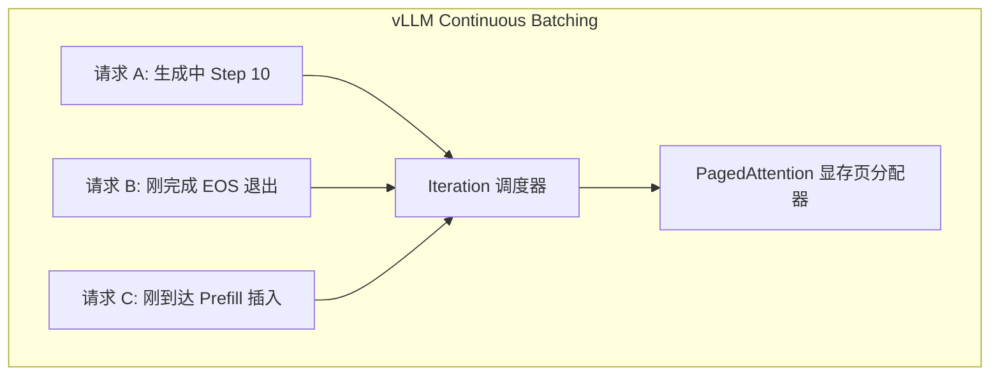

# LLM 训练与推理数据 Batching 机制、数学原理与工程实践全景指南

> 本文档为 `llmlora` 项目的核心技术指南，全面深挖大语言模型（LLM）在**训练（SFT Training）**与**推理（Inference）**阶段的数据批处理（Batching）物理本质、GPU 显存/算力 Roofline 模型、张量对齐、Mask 掩码数学推导、KV Cache 内存管理以及生产级代码实现。
>
> **本版新增/完善**：Roofline 数学模型与拐点推导、训练侧联合掩码与 Labels 位移机制、Sequence Packing 与长度分组采样、梯度累积损失归一化陷阱、训练显存账本、Prefill/Decode 两阶段画像、KV Cache 显存测算、推理性能指标体系、常见陷阱排错速查与公式附录。

---

## 目录

- [1. LLM 计算特质与 Batching 的物理本质](#1-llm-计算特质与-batching-的物理本质)
- [2. 训练阶段 Batching 机制、数据对齐与 Loss Masking](#2-训练阶段-batching-机制数据对齐与-loss-masking)
- [3. 推理阶段 Batching 机制、Left Padding 与 KV Cache 管理](#3-推理阶段-batching-机制left-padding-与-kv-cache-管理)
- [4. `llmlora` 项目生产级工程实践代码深度解剖](#4-llmlora-项目生产级工程实践代码深度解剖)
- [5. 训练与推理 Batching 综合调参表](#5-训练与推理-batching-综合调参表)
- [6. 常见陷阱与排错速查表](#6-常见陷阱与排错速查表)
- [7. 附录：核心公式速查](#7-附录核心公式速查)

---

## 1. LLM 计算特质与 Batching 的物理本质

### 1.1 GPU 硬件 Roofline 模型与 Memory-Bound 瓶颈

在 GPU 上运行大语言模型（Causal LM）时，计算任务主要分为两类模式：**显存带宽限制型（Memory-Bound）**与**计算密集型（Compute-Bound）**。

#### Roofline 数学模型

判定一个算子属于哪种模式，需要用 **Roofline 模型** 量化。定义**算力强度（Arithmetic Intensity，亦称计算密度）**：

$$\text{AI} = \frac{\text{FLOPs（浮点运算次数）}}{\text{Bytes（显存搬运字节数）}} \quad \left[\frac{\text{FLOP}}{\text{Byte}}\right]$$

硬件可达性能上界为算力屋顶与带宽屋顶的较小值：

$$P_{\text{attain}} = \min\left(P_{\text{peak}},\ \beta \times \text{AI}\right)$$

其中 $P_{\text{peak}}$ 为 GPU 峰值算力（FLOP/s），$\beta$ 为显存带宽（Byte/s）。两条屋顶线的交点称为**拐点（Ridge Point）**：

$$\text{AI}^{*} = \frac{P_{\text{peak}}}{\beta}$$

- 当算子的 $\text{AI} < \text{AI}^{*}$：落在带宽屋顶之下，**Memory-Bound**；
- 当算子的 $\text{AI} > \text{AI}^{*}$：落在算力屋顶之下，**Compute-Bound**。

> 量级感受：消费级 GPU（如 RTX 50 系）显存带宽约 450 GB/s，FP16/BF16 Tensor Core 峰值算力约 $10^{14}$ FLOP/s 量级，故拐点 $\text{AI}^{*}$ 大致在 **100 ~ 300 FLOP/Byte** 区间。任何算力强度低于该值的计算都在"等数据"，而非"算数据"。

#### 单样本推理的内存瓶颈

当 Batch Size = 1 时，每预测一个 Token，GPU 都必须将整套模型权重参数（如 Qwen3.5-0.8B 约 1.6GB）从 **VRAM（显存）** 读取并加载到 **SRAM（片上高速缓存）** 中进行一次矩阵向量乘法（GEMV）。

此时单 Token 生成的算力强度可精确推导：BF16/FP16 权重每个参数占 2 字节，每个参数参与一次乘加运算（2 FLOPs）：

$$\text{AI}_{\text{decode}} = \frac{2\ \text{FLOPs/param}}{2\ \text{Bytes/param}} = 1\ \text{FLOP/Byte} \ll \text{AI}^{*}$$

$1 \ll 100\text{+}$，故单样本 Decode 处于**深度 Memory-Bound** 区间：

- **显存带宽利用率（Memory Bandwidth）**：> 90%
- **CUDA / Tensor Core 计算单元利用率**：< 5%

此时，GPU 的成千上万个计算核心绝大多数时间处于**空转等待显存数据传输**的状态。

由此还可推出单请求 Decode 的**理论吞吐上限**：

$$\text{Tokens/s}_{\max} \approx \frac{\beta}{2 \times N_{\text{params}}}$$

例如 0.8B 参数 BF16 模型（约 1.6 GB/Token），在 450 GB/s 带宽下理论上限约 **280 Tokens/s**（未计 KV Cache 读取与 Kernel 调度开销，实测通常为该值的 40% ~ 70%）。

### 1.2 Batching 的数学提升

通过将 $N$ 个样本的输入 Prompt 张量在 Batch 维度拼接为二维矩阵 $X \in \mathbb{R}^{B \times L \times D}$，矩阵乘法从 GEMV 转化为 GEMM（矩阵乘矩阵）：

$$\text{FLOPs per Weight Byte} = \frac{2 \times B \times L \times D_{\text{in}} \times D_{\text{out}}}{2 \times D_{\text{in}} \times D_{\text{out}}} = B \times L$$

随着 **Batch Size ($B$)** 的增大，**每字节显存传输所能支撑的浮点计算次数（算力强度）呈线性增加**——关键在于：权重只从 VRAM 读取**一次**，却被 $B \times L$ 个 Token 位置**复用**。当 $B \times L$ 越过拐点 $\text{AI}^{*}$ 后，GPU 正式从 Memory-Bound 跨入 Compute-Bound 状态，实现了 5x ~ 10x 的吞吐量（Tokens/s）飞跃。

> **推论**：Batching 的本质不是"算得更快"，而是"**搬运一次、计算多次**"——用带宽的浪费率换取算力的利用率。这也是训练阶段 Prefill 天然高效、而 Decode 必须靠大 Batch 救场的根本原因（详见 §3.1）。

---

## 2. 训练阶段 Batching 机制、数据对齐与 Loss Masking

### 2.1 训练 Batching 原理与图解

在 SFT（监督微调）训练阶段，模型接收完整序列（Prompt + Response），采用 **Right Padding（右侧填充）** 进行张量长度对齐。

```text
原始样本 1: [SOS, "今天", "天气", "真好", EOS]                       (长度 5)
原始样本 2: [SOS, "请", "分析", "患者", "病历", "记录", "信息", EOS]  (长度 8)

Right Padding 对齐后 (Batch Size = 2, Max Length = 8):
样本 1: [SOS, "今天", "天气", "真好", EOS,  <pad>, <pad>, <pad>]
样本 2: [SOS, "请",   "分析", "患者", "病历", "记录", "信息", EOS  ]
```

> 训练用 Right Padding、推理用 Left Padding，根本区别在于：**训练是一次性并行前向，"答案位置"由 labels 指定；推理是逐步自回归，"下一个位置"永远在张量最右端**（详见 §3.2）。

### 2.2 Labels Masking (`-100`) 数学与工程原理

在 SFT 训练中，损失函数为自回归交叉熵损失（Cross-Entropy Loss）：

$$\mathcal{L} = -\frac{1}{\sum_{i=1}^{N} \sum_{t=1}^{T} M_{i,t}} \sum_{i=1}^{N} \sum_{t=1}^{T} M_{i,t} \cdot \log P\!\bigl(y_{i,t} \mid y_{i,<t}, X_i\bigr)$$

其中 **Loss Mask** 定义为：

$$M_{i,t} = \underbrace{\mathbb{1}\bigl[t \in \text{Response}_i\bigr]}_{\text{只计算 Assistant 回复}} \times \underbrace{\mathbb{1}\bigl[y_{i,t} \neq \text{[PAD]}\bigr]}_{\text{排除 Padding}}$$
我们需要确保：

1. **User 输入 / System Prompt 不计入 Loss**：避免模型背诵提问词，只学习回答概率。
2. **Right Padding `<pad>` 位置不计入 Loss**：避免模型将填充字符当成真实文本拟合。

#### PyTorch `ignore_index = -100` 实现机制

PyTorch 的 `torch.nn.CrossEntropyLoss` 默认将 `ignore_index` 设为 `-100`。在 GPU CUDA Kernel 层面，凡是 `target == -100` 的位置：

- 损失值被直接设为 `0.0`；
- 对应的梯度反向传播被直接跳过（Gradient = `0.0`）。

```text
input_ids: [SOS,  "问:",  "发烧", "答:", "用", "阿司匹林", EOS, <pad>]
labels:    [-100, -100,  -100,  -100,  "用", "阿司匹林", EOS, -100]
                                       ↑       ↑        ↑
                                    仅此 3 个 Token 产生梯度
```

#### Causal LM 的 Labels 位移（Shift）机制 —— 高频踩坑点

自回归预测要求"用位置 $t$ 的隐状态预测位置 $t+1$ 的 Token"。HuggingFace 的 `*ForCausalLM` 在 `forward()` **内部**自动完成该位移：

```python
# transformers 模型内部逻辑（以 Qwen/Llama 系为例，无需手动实现）
shift_logits = logits[..., :-1, :].contiguous()   # 去掉最后一个位置的预测
shift_labels = labels[..., 1:].contiguous()       # 去掉第一个位置的标签
loss = CrossEntropyLoss(ignore_index=-100)(
    shift_logits.view(-1, vocab_size), shift_labels.view(-1)
)
```

> ⚠️ **工程铁律：Collator / Dataset 中严禁手动对 labels 左移一位。** labels 应与 input_ids **等长、逐位对齐**（ labels[i] 就是 input_ids[i] 处的真值 Token），shift 交给模型内部做。若在数据侧预先 shift，再经模型内部 shift，整体错位两位，表现为 loss 卡在高位、模型学会"复读上一个字"。

### 2.3 训练侧联合掩码：Causal Mask × Padding Mask

训练阶段注意力层实际生效的是**两个掩码的合取**：

$$M_{\text{final}}[i, j] = \begin{cases} 0, & j \le i\ \ \text{且}\ \ j\ \text{为真实 Token} \\ -\infty, & \text{其他（未来位置或 Padding 位置）} \end{cases}$$

- **因果掩码 $M_{\text{causal}}$**：下三角结构，禁止看到未来（Right Padding 训练时，未来位置恰好也是 pad，二者在右侧区域重叠）；
- **填充掩码 $M_{\text{pad}}$**：由 `attention_mask` 生成，屏蔽 `<pad>` 列。

在现代实现中，二者被拆分处理：因果部分由 `is_causal=True`（PyTorch SDPA）或 FlashAttention 内建的 causal 选项**隐式承担**，填充部分经 `attention_mask` 显式传入；而 FlashAttention-2 的 varlen 路径（见 §2.5）更进一步，直接以变长序列输入，**物理上不存在 Padding Token**，连填充掩码都省掉了。

### 2.4 动态 Batching 与 Data Collator 显存优化

传统静态 Batching 会把所有 Batch 补齐到全局固定最大长度（如 `max_length = 1024`），导致短文本存在海量无用 `<pad>` 填充，极易引发显存爆 OOM。

`llmlora` 项目采用了 **动态 Data Collator**，每次仅将当前 Batch 内部补齐到**该 Batch 内部的最长样本长度**（或补齐到 8 的整数倍，适配 Tensor Core 硬件对齐）：

```python
# llmlora/src/dataset/collator.py 生产级 Collator 实现

import torch
from dataclasses import dataclass
from typing import Dict, List, Any

@dataclass
class DataCollatorForSFT:
    tokenizer: Any
    pad_to_multiple_of: int = 8

    def __call__(self, features: List[Dict[str, Any]]) -> Dict[str, torch.Tensor]:
        # 1. 动态探查当前 Batch 内部的最大长度
        batch_max_len = max(len(f["input_ids"]) for f in features)
        
        # 2. 硬件对齐：对齐到 pad_to_multiple_of（如 8）以触发 Tensor Core 硬件加速
        if self.pad_to_multiple_of > 0:
            batch_max_len = (
                (batch_max_len + self.pad_to_multiple_of - 1) // self.pad_to_multiple_of
            ) * self.pad_to_multiple_of

        batch_input_ids, batch_attention_mask, batch_labels = [], [], []

        for f in features:
            input_ids = f["input_ids"]
            labels = f["labels"]
            pad_len = batch_max_len - len(input_ids)

            # 3. 执行 Right Padding 右侧填充
            padded_input_ids = input_ids + [self.tokenizer.pad_token_id] * pad_len
            padded_attn_mask = [1] * len(input_ids) + [0] * pad_len
            padded_labels = labels + [-100] * pad_len

            batch_input_ids.append(padded_input_ids)
            batch_attention_mask.append(padded_attn_mask)
            batch_labels.append(padded_labels)

        return {
            "input_ids": torch.tensor(batch_input_ids, dtype=torch.long),
            "attention_mask": torch.tensor(batch_attention_mask, dtype=torch.long),
            "labels": torch.tensor(batch_labels, dtype=torch.long),
        }
```

> 💡 **为什么要对齐到 8 的倍数**：NVIDIA Tensor Core 的矩阵分块（Tile）以 8/16 为粒度（如 BF16 MMA 指令维度 $16\times8\times16$）。张量维度不对齐时，Kernel 退化为非 Tensor Core 路径或需要额外边界处理，吞吐可损失 10% ~ 30%。`pad_to_multiple_of=8` 用极少量的 Padding 换来确定的硬件加速路径。

### 2.5 序列打包（Sequence Packing）与长度分组采样

动态 Padding 把浪费限制在"Batch 内最长样本"级别，但 Batch 内部长度方差大时浪费仍然可观。两条进阶路线可进一步压缩：

#### 路线 A：长度分组采样（Length Grouping）

HuggingFace Trainer 开启 `group_by_length=True` 后，`LengthGroupedSampler` 会按样本长度对全数据集分桶，使**同一 Batch 内的样本长度尽量接近**，Padding 比例通常可从 30% ~ 50% 压到 5% 以内。代价是打乱了全局随机性（桶内仍随机），对 SFT 影响可忽略。

#### 路线 B：序列打包（Sequence Packing）

彻底消灭 Padding：将多条样本首尾拼接成一条接近 `max_len` 的长序列：

```text
Pack 后: [样本A TOKENS, EOS, 样本B TOKENS, EOS, 样本C TOKENS, EOS]  (恰好 ≈ max_len)
labels:  [-100×len(A prompt), A 答案..., -100, ...各段独立设置...]
position_ids: [0,1,...,lenA-1, 0,1,...,lenB-1, 0,1,...,lenC-1]   ← 每段起点重置为 0
```

两个关键配套：

1. **position_ids 段内重置**：否则 RoPE 会把拼接处的两个样本当成"相距很远"的同一文档；
2. **块对角注意力掩码（防串扰）**：样本 B 不得 attend 到样本 A。FlashAttention-2 的 varlen 接口通过 `cu_seqlens`（累计长度数组）天然实现块对角掩码；HuggingFace 可直接使用 `DataCollatorWithFlattening`（需 `attn_implementation="flash_attention_2"`）。

> ⚠️ 若只做拼接、不做块对角掩码，会发生**跨样本注意力污染（cross-contamination）**：模型学会从前一条无关样本中抄答案，SFT 指标虚高、线上表现崩塌。SDPA 等普通路径下必须显式构造 4D 块对角掩码。

### 2.6 梯度累积 (Gradient Accumulation) 数学推导与归一化陷阱

当显存限制无法将 `per_device_train_batch_size` 设得很大时，使用梯度累积可以精确等效大 Batch 训练：

```python
# 梯度累积伪代码逻辑
optimizer.zero_grad()
for i, batch in enumerate(dataloader):
    loss = model(batch) / grad_accum_steps  # 缩放 Loss
    loss.backward()                         # 累加梯度
    
    if (i + 1) % grad_accum_steps == 0:
        optimizer.step()                     # 更新权重
        optimizer.zero_grad()
```

此时的**等效 Batch Size (Effective Batch Size)** 计算公式为：

$$B_{\text{effective}} = B_{\text{per\_device}} \times N_{\text{grad\_accum}} \times N_{\text{gpus}}$$

例如在 `llmlora/.env` 配置中：
`LLMLORA_BATCH_SIZE=16`，`LLMLORA_GRAD_ACCUM_STEPS=2` $\Rightarrow$ **单卡等效 Batch Size = 32**。

#### ⚠️ "mean of means" 归一化陷阱

上面的伪代码隐含一个假设：**每个 micro-batch 的目标 Token 数相同**。SFT 场景下各样本 Response 长短不一，逐 micro-batch 先求均值、再对 $N$ 个均值求平均，会让"目标 Token 少的 micro-batch"获得偏大的权重，等价于短答案样本被过采样，长答案样本梯度被稀释：

$$\mathcal{L}_{\text{naive}} = \frac{1}{N}\sum_{k=1}^{N}\frac{\sum_{t \in T_k}\ell_t}{|T_k|} \quad\neq\quad \mathcal{L}_{\text{true}} = \frac{\sum_{k=1}^{N}\sum_{t \in T_k}\ell_t}{\sum_{k=1}^{N}|T_k|}$$

修正方案（任选其一）：

1. **使用新版 Transformers（≥ 4.46）的 Trainer**：其内部通过 `num_items_in_batch` 统计整个累积窗口的目标 Token 总数，按真均值归一化，已自动修复；
2. **手写训练循环时**：改用 `reduction="sum"` 累加各 micro-batch 的 Loss 总和，在 `optimizer.step()` 前除以窗口内目标 Token 总数。

### 2.7 训练显存账本与梯度检查点

能否塞进 Batch，最终是一道显存算术题。混合精度 + AdamW 的**全量微调**单卡静态显存约为：

$$M_{\text{static}} \approx \underbrace{4N}_{\text{fp32 主权重}} + \underbrace{2N}_{\text{bf16 前向权重}} + \underbrace{2N}_{\text{梯度}} + \underbrace{8N}_{\text{Adam } m/v} = 16N\ \text{Bytes}$$

0.8B 模型全量微调仅静态部分即约 **12.8 GB**，尚未计入激活值——这是消费级显卡无法全量微调的根本原因。

**LoRA 的显存账本**则完全不同：基座冻结，仅 LoRA 参数 $\tilde{N}$（通常为 $N$ 的 0.1% ~ 2%）产生梯度与优化器状态：

$$M_{\text{LoRA}} \approx \underbrace{2N}_{\text{冻结基座 bf16}} + \underbrace{(2+4+8)\tilde{N}}_{\text{LoRA 梯度+fp32+Adam}} + \underbrace{M_{\text{act}}}_{\text{激活值（大头！）}}$$

注意：LoRA **不省激活值显存**。激活值随 $B \times S \times D \times n_{\text{layers}}$ 增长（FlashAttention 下与 $S$ 线性相关），Batch 开大后 $M_{\text{act}}$ 会反超参数部分成为瓶颈，此时启用**梯度检查点（Gradient Checkpointing）**：

- **原理**：前向时只保存各层输入（checkpoint），反向时按段重算段内激活；
- **收益**：激活显存通常下降 5x ~ 10x；
- **代价**：约 30% ~ 40% 的额外前向重算时间（一次 forward 变 ~1.3 次）。

工程上等价于"**用 30% 的时间换 2x ~ 4x 的可用 Batch Size**"，在 Memory-Bound 不严重的训练场景几乎总是划算。

---

## 3. 推理阶段 Batching 机制、Left Padding 与 KV Cache 管理

### 3.1 Prefill 与 Decode 的两阶段 Roofline 画像

推理并非单一过程，而是两个算力特征截然相反的阶段：

| 阶段                   | 计算模式                                | 有效"批量"                                  | Roofline 位置     | 主导指标              |
| ---------------------- | --------------------------------------- | ------------------------------------------- | ----------------- | --------------------- |
| **Prefill（预填充）**  | 一次性并行处理全部 Prompt Token（GEMM） | $B \times L_{\text{prompt}}$，通常数百~数千 | **Compute-Bound** | TTFT（首 Token 延迟） |
| **Decode（逐字解码）** | 每步每序列仅生成 1 Token（GEMV）        | $B \times 1 = B$                            | **Memory-Bound**  | TPOT（每 Token 耗时） |

这正是 §1.2 公式的直接应用：Prefill 阶段 $B \times L$ 轻松越过拐点 $\text{AI}^{*}$，Tensor Core 满负荷；Decode 阶段 $L=1$，只能靠增大 $B$ 拉高算力强度。**Batching 对推理的价值几乎全部体现在 Decode 阶段**——把 $N$ 个请求的 Decode 步合并，权重一次搬运、$N$ 路复用。

工程推论：

- 长 Prompt 场景（RAG、病历分析）：优化重点是 Prefill 算力（FlashAttention、Chunked Prefill）；
- 长输出场景（报告生成）：优化重点是 Decode 带宽（大 Batch、KV Cache 量化、投机解码）。

### 3.2 为什么推理阶段绝对不能使用 Right Padding？

在自回归生成（Causal Generation）过程中，模型必须基于上一个 Step 的末尾 Token 来预测下一个 Token。

如果推理使用了 **Right Padding（右侧填充）**，短样本的矩阵尾部包含 `<pad>` Token：

```text
错误示范 (Right Padding 推理):
Row 1: [ "诊", "断", "结果", <pad>, <pad> ]
Row 2: [ "患", "者", "发烧", "头痛", "咳嗽" ]
```

在计算第 1 行生成时，PyTorch 的 `generate()` 接口会将最右侧的位置（即 `<pad>`）当作上一个生成的上下文，导致：

1. **生成结果乱码**：模型开始基于 `<pad>` 进行推理；
2. **提前误触发终止**：模型的 logits 预测出 `<eos>`，导致短样本提前异常结束；
3. **位置编码（RoPE）错位**：旋转位置编码计算的相对位置偏差。

因此，**推理阶段必须统一采用 Left Padding（左侧填充）**！

```text
正确示范 (Left Padding 推理):
Row 1: [ <pad>, <pad>, "诊", "断", "结果" ]  --> 末尾是真正上下文，生成紧随其后！
Row 2: [ "患",  "者",  "发烧", "头痛", "咳嗽" ]
```

#### Left Padding 的 position_ids 修正

Left Padding 后，真实 Token 的绝对位置不再从 0 开始，必须显式修正 `position_ids`，否则 RoPE 会按"含 pad 的位置"计算旋转角：

```python
# 正确的 position_ids 构造（attention_mask 中真实 Token 为 1）
position_ids = attention_mask.long().cumsum(dim=-1) - 1
position_ids.masked_fill_(attention_mask == 0, 1)
# Row 1: [1, 1, 0, 1, 2]  →  真实 Token 位置从 0 开始递增
```

> 好消息：HuggingFace `generate()` 在 `prepare_inputs_for_generation` 中会自动执行上述修正。**手动拼装 Batch 张量直接调 `model()` 时**才需要自己处理——这是手写推理循环最常见的隐性 Bug 之一。

### 3.3 Attention Mask 掩码矩阵与 Softmax 屏蔽数学推导

Transformer 的 Scaled Dot-Product Attention 数学公式为：

$$\text{Attention}(Q, K, V) = \text{softmax}\left(\frac{Q K^T}{\sqrt{d_k}} + M\right) V$$

其中掩码矩阵 $M$ 的取值规则如下：

- 当 $M_{i,j} = 0$（真实 Token）时，加上 0 不影响原点积数值；
- 当 $M_{i,j} = -\infty$（Padding Token）时，点积数值变为 $-\infty$。

在 Softmax 计算时：

$$\text{softmax}(z_i) = \frac{e^{z_i}}{\sum_j e^{z_j}}$$

因为 $e^{-\infty} \to 0$，所有左侧 Padding 位置的注意力权重自动归零，**使得 Padding 字符在注意力计算中完全不产生任何影响**。

> 工程实现上并不真的写入 $-\infty$（会引发 NaN 传播风险），而是写入一个足够大的负数（如 `torch.finfo(dtype).min`，BF16 下约 $-3.39\times10^{38}$），Softmax 后数值上严格等于 0。

### 3.4 KV Cache 内存结构、显存测算与 Batch 维度广播

推理开启 `use_cache = True` 时，模型会将历史层中的 Key 和 Value 向量缓存起来，避免重算。没有 KV Cache 时，第 $t$ 步需对长度为 $t$ 的整段序列重算注意力，总复杂度 $O(L^3)$；有 KV Cache 后每步只算新 Token 的 Q 与全部历史 K/V 的注意力，总复杂度降为 $O(L^2)$——**KV Cache 本质上是用显存换计算，把 Decode 从"反复重算"变为"增量追加"**。

KV Cache 的张量维度为：

$$\text{K/V Shape} = \left(\text{Batch Size},\ \text{Num KV Heads},\ \text{Sequence Length},\ \text{Head Dim}\right)$$

其显存占用公式（GQA/MQA 架构注意使用 **KV Head 数**而非 Attention Head 数）：

$$M_{\text{KV}} = \underbrace{2}_{K,V} \times n_{\text{layers}} \times n_{\text{kv\_heads}} \times d_{\text{head}} \times S \times b_{\text{dtype}} \times B$$

**算例**（以 Qwen3.5-0.8B 级别 GQA 架构估算：28 层、8 个 KV Head、$d_{\text{head}}=128$、BF16 即 $b_{\text{dtype}}=2$）：

- 每 Token KV Cache：$2 \times 28 \times 8 \times 128 \times 2 \approx 112\ \text{KB}$；
- $B=4,\ S=4096$：$112\ \text{KB} \times 4096 \times 4 \approx 1.75\ \text{GB}$。

可见长上下文 + 大 Batch 下 KV Cache 会迅速逼近甚至超过权重体积（1.6 GB），这就是 vLLM 需要专门的分页管理（§3.5）、以及 `max_model_len` 必须显式限制（§3.7）的原因。进一步压缩手段：**KV Cache 量化（FP8/INT8，显存减半）**、**GQA/MQA（结构上减少 KV Head 数）**。

采用 Left Padding 时，由于 Padding Token 在序列左侧：

- 动态追加新 Token 时，新 Token 始终追加在 `Sequence Length` 的最右侧末尾；
- KV Cache 可以保持连续的右侧扩展追加，无需重新整理内存；
- Batch 内各序列的 KV Cache 同构对齐，可直接沿 Batch 维度广播参与 GEMM。

### 3.5 静态 Batching vs 动态连续批处理 (Continuous Batching & PagedAttention)

| 特性 / 维度            | 静态 Batching (PyTorch Native) | 连续批处理 Continuous Batching (vLLM)          |
| ---------------------- | ------------------------------ | ---------------------------------------------- |
| **内存分配**           | 预先分配矩形 2D Tensor         | 动态分页分配 (PagedAttention)                  |
| **Padding 开销**       | 存在 Left Padding 显存开销     | **0% Padding 浪费**（块页映射）                |
| **KV Cache 布局**      | 按 `max_model_len` 连续预分配  | 按 16 Token/Block 按需申请，逻辑块表映射物理页 |
| **请求调度**           | 同进同出（最慢样本拖累全队）   | 迭代级动态插拔（Iteration-Level）              |
| **Prefill 长请求阻塞** | 整队等待                       | **Chunked Prefill** 切片与 Decode 混排         |
| **吞吐量**             | 中等（适合低并发/Sidecar）     | **极高（5x ~ 10x 高并发高吞吐）**              |



两个关键机制补充：

- **PagedAttention**：借鉴操作系统虚拟内存思想，把 KV Cache 切成固定大小的 Block（默认 16 Token/Block），逻辑序列通过 Block Table 映射到非连续物理页。请求结束时仅释放其占用的页，彻底消除静态分配的内部碎片与"按最大长度预占"的浪费。
- **Chunked Prefill**：将超长 Prefill 切成若干 Token 块（受 `max_num_batched_tokens` 预算约束），与在途请求的 Decode 步混排在同一迭代中执行。既避免单个长 Prompt 阻塞整队 Decode（TTFT 抖动下降），又让每个迭代的算力强度保持在拐点之上（vLLM V1 架构默认开启）。

### 3.6 推理性能指标体系

评测 Batching 策略优劣，需要区分以下指标，避免"吞吐高但延迟差"的误读：

| 指标                                                         | 定义                                   | 由什么决定                          | 优化杠杆                                     |
| ------------------------------------------------------------ | -------------------------------------- | ----------------------------------- | -------------------------------------------- |
| **TTFT**（Time To First Token）                              | 请求到达到首个 Token 输出的时间        | 排队时长 + Prefill 算力             | 提高算力利用率、Chunked Prefill、缩短 Prompt |
| **TPOT / ITL**（Time Per Output Token / Inter-Token Latency） | Decode 阶段相邻 Token 的平均间隔       | 显存带宽 + Batch 内 KV Cache 读取量 | 增大 Batch、KV 量化、投机解码                |
| **E2E Latency**                                              | TTFT + 输出长度 × TPOT                 | 上两者叠加                          | 综合优化                                     |
| **Throughput**                                               | 全系统输出 Tokens/s                    | Decode Batch 规模 × TPOT⁻¹          | Continuous Batching、更大并发                |
| **Goodput**                                                  | 满足 SLO（如 TTFT < 2s）的最大请求速率 | 延迟-吞吐帕累托前沿                 | 调度策略、配额控制                           |

> **核心权衡**：Throughput 与 Latency 存在帕累托冲突——Batch 越大吞吐越高，但单请求的 TPOT 也随之变长（KV Cache 读取总量上升、调度排队）。生产选型应先定 SLO（如"TPOT < 100ms"），再在 SLO 约束下最大化并发。

### 3.7 vLLM 加载 Qwen3.5-0.8B 的关键工程修复 (vLLM Integration Fixes)

在实际工程落地中，将合并模型嵌入 vLLM 引擎时，需完成以下 4 项关键修复：

1. **Config 路由修补**：将基座完整 `config.json`（包含 `vision_config` 与 `text_config` 嵌套）复制到导出目录，满足 vLLM `Qwen3_5ForConditionalGeneration` 类型的架构探查。
2. **视觉权重提取与补全**：提取基座 safetensors 中的 `visual.*` 权重并打上 `model.visual.` 前缀保存至合并模型文件（共 153 个张量），补齐多模态结构定义。
3. **KV Cache 空间控制**：设置 `max_model_len = 4096`（防止 `max_position_embeddings=262144` 预分配过大显存空间导致 OOM）。
4. **JIT 编译依赖注入**：安装 `ninja` 并将虚拟环境 bin 路径加入 `PATH`，确保 FlashInfer 热编译成功。

修复后的最小可用加载示例：

```python
from vllm import LLM, SamplingParams

llm = LLM(
    model="/path/to/merged_qwen3.5_0.8b",
    max_model_len=4096,              # 修复 3：限制 KV Cache 预分配
    gpu_memory_utilization=0.85,     # 显存池占用比例（含权重+KV+激活）
    enable_chunked_prefill=True,     # §3.5：长 Prefill 切片混排
    dtype="bfloat16",
)

params = SamplingParams(temperature=0.7, top_p=0.8, max_tokens=512)
outputs = llm.generate(prompts, params)   # Continuous Batching 由引擎内部自动完成
```

> `gpu_memory_utilization` 是 vLLM 最重要的显存旋钮：它指定引擎允许占用的**总显存比例**，扣除权重与激活后，剩余全部划为 KV Cache Block 池——直接决定可同时服务的最大并发数。

---

## 4. `llmlora` 项目生产级工程实践代码深度解剖

### 4.1 训练流水线代码链条

在 `llmlora` 中，训练 Batching 经由以下代码链条流动：

```text
llmlora/.env (配置 LLMLORA_BATCH_SIZE=16, LLMLORA_GRAD_ACCUM_STEPS=2)
  └── llmlora/src/utils/config.py (Config dataclass)
        └── llmlora/src/dataset/loader.py (SFTDataset 预处理与 Tokenize)
              └── llmlora/src/dataset/collator.py (DataCollatorForSFT 动态 Right Padding)
                    └── llmlora/src/models/trainer.py (LoRATrainingRunner + HuggingFace Trainer)
```

数据在链条末端的完整形态对照（对应 §2 全部机制）：

```text
input_ids      → 右对齐填充，pad_to_multiple_of=8      (§2.1, §2.4)
attention_mask → 真实=1 / pad=0，供联合掩码使用         (§2.3)
labels         → prompt 与 pad 位置 = -100，等长不位移   (§2.2)
grad_accum     → 等效 Batch = 16 × 2 = 32               (§2.6)
```

### 4.2 推理性能对比测试代码链条

推理测试代码库在 `llmlora/test/` 下实现了高效的子进程隔离测试：

- **`llmlora/test/benchmark_pytorch.py`**：
  使用 `AutoTokenizer(..., padding_side="left")`，在 `batch_sizes=[1, 4]` 下实测 Batch 推理。
- **`llmlora/test/run_benchmark_comparison.py`**：
  采用 Python `subprocess` 隔离运行 PyTorch 和 vLLM，完全消除了 CUDA 句柄残留与显存泄漏问题，自动导出 Markdown Benchmark 报告至 `llmlora/test/benchmark_report.md`。

#### 为什么必须用子进程隔离做 Benchmark？

CUDA 上下文一旦在进程内初始化，显存池、JIT 编译缓存、cuBLAS 工作区都会驻留至进程退出。若在同一进程内先后加载 PyTorch 与 vLLM 两套引擎：

1. 第二套引擎看到的"可用显存"是被第一套污染后的残值，测出的吞吐系统性偏低；
2. `torch.cuda.empty_cache()` 只能归还**未引用**的缓存块，无法释放 CUDA Context 本身（通常 300MB ~ 1GB）；
3. 子进程隔离保证每次测量都是**冷启动 + 独占显存**，结果可复现、可横向对比。

#### Benchmark 报告的最小可信字段（对应 §3.6 指标体系）

| 字段                                   | 说明                                           |
| -------------------------------------- | ---------------------------------------------- |
| `engine / batch_size / max_new_tokens` | 测试条件                                       |
| `prefill_tokens / decode_tokens`       | 工作量（区分两阶段）                           |
| `ttft_ms / tpot_ms`                    | 延迟（分阶段）                                 |
| `throughput_tokens_per_s`              | 吞吐                                           |
| `peak_vram_mb`                         | `torch.cuda.max_memory_allocated()` 实测峰值   |
| `warmup_runs / measure_runs`           | 预热与计数次数（预热 ≥ 2 次排除 JIT 编译干扰） |

---

## 5. 训练与推理 Batching 综合调参表

| 场景                         | 推荐 Batch Size 配置         | 推荐 Grad Accum        | 推荐 Padding 方向 | 关键配置项                                                   |
| ---------------------------- | ---------------------------- | ---------------------- | ----------------- | ------------------------------------------------------------ |
| **RTX 5060 (8GB/12GB) 训练** | `per_device_batch_size = 16` | `grad_accum_steps = 2` | **Right Padding** | `pad_to_multiple_of = 8`                                     |
| **显存受限 (4GB/6GB) 训练**  | `per_device_batch_size = 4`  | `grad_accum_steps = 8` | **Right Padding** | `gradient_checkpointing = true`（§2.7）                      |
| **长短样本混杂严重的训练集** | `per_device_batch_size = 8`  | `grad_accum_steps = 4` | **Right Padding** | `group_by_length = true` 或 Sequence Packing（§2.5）         |
| **Sidecar 边侧单条同步推理** | `batch_size = 1`             | N/A                    | **Left Padding**  | `max_new_tokens = 64`                                        |
| **Sidecar 批处理高吞吐推理** | `batch_size = 4`             | N/A                    | **Left Padding**  | `padding_side = "left"`                                      |
| **vLLM 高并发在线服务**      | 引擎自动调度                 | N/A                    | 无需手动 Padding  | `max_model_len=4096`，`gpu_memory_utilization=0.85`，`enable_chunked_prefill=true` |

**调参决策顺序**（自上而下，先保证能跑，再追求跑快）：

1. **能装下**：单样本前向不 OOM（先开 `gradient_checkpointing` / 降 `max_model_len`）；
2. **批得起**：逐步增大 `per_device_batch_size` 直至显存水位 85% ~ 90%（留碎片余量）；
3. **够等效**：用 `grad_accum_steps` 把等效 Batch 补到目标值（SFT 常用 32 ~ 128）；
4. **消浪费**：`group_by_length` / Packing / `pad_to_multiple_of` 压榨 Padding 开销；
5. **盯指标**：训练看 tokens/s 与 loss 曲线平滑度；推理按 §3.6 分阶段指标定位瓶颈。

---

## 6. 常见陷阱与排错速查表

| 症状                                    | 根因                                                         | 定位方法                                           | 解法                                                         |
| --------------------------------------- | ------------------------------------------------------------ | -------------------------------------------------- | ------------------------------------------------------------ |
| 训练 loss 卡在 3~4 不降，生成内容"复读" | labels 被数据侧手动 shift，与模型内部 shift 叠加错位（§2.2） | 打印一个 Batch 的 `input_ids` 与 `labels` 逐位对照 | labels 与 input_ids 等长对齐，删掉手动位移                   |
| 训练 loss 正常但验证集/线上崩坏         | Packing 未做块对角掩码，跨样本注意力污染（§2.5）             | 检查 attention 实现与 collator                     | 改用 FA2 varlen / `DataCollatorWithFlattening`               |
| Batch 推理输出乱码、短样本秒结束        | 推理误用 Right Padding（§3.2）                               | 检查 tokenizer 配置                                | `padding_side="left"`                                        |
| Left Padding 后输出语义漂移             | 手写推理循环未修正 `position_ids`（§3.2）                    | 对比 `generate()` 与手动 `model()` 输出            | `cumsum` 构造 position_ids 或直接走 `generate()`             |
| 梯度累积后 loss 系统性偏高              | "mean of means" 归一化偏差（§2.6）                           | 对比 `grad_accum=1` 的 loss 曲线                   | 升级 Transformers ≥ 4.46 / 手动 sum 归一                     |
| 训练一加大 Batch 就 OOM                 | 激活值爆炸（LoRA 不省激活，§2.7）                            | `max_memory_allocated` 分段打点                    | 开 `gradient_checkpointing`、降 Batch 升累积                 |
| vLLM 启动即 OOM（模型才 1.6GB）         | `max_position_embeddings=262144` 被当作 KV 预分配长度（§3.7） | 看启动日志 KV Cache 申请量                         | `max_model_len=4096`                                         |
| vLLM 报架构不识别                       | `config.json` 缺 `vision_config`/`text_config` 嵌套（§3.7）  | 对比基座与导出目录 config                          | 复制完整 config、补 `model.visual.*` 权重                    |
| Benchmark 结果忽高忽低不可复现          | 同进程串行测双引擎，CUDA 上下文污染（§4.2）                  | 检查测试 harness                                   | `subprocess` 隔离 + 预热 ≥ 2 次                              |
| vLLM 吞吐高但 TTFT 抖动大               | 长 Prefill 阻塞整队 Decode（§3.5）                           | 观察 TTFT 分布长尾                                 | 开 `enable_chunked_prefill`、调 `max_num_batched_tokens`     |
| `<pad>` 与 `<eos>` 同 ID 引发告警       | 模型词表无专用 pad token，复用 eos 所致                      | 查 `tokenizer.pad_token_id`                        | 属正常现象，靠 `attention_mask` 区分；训练侧 labels 置 -100 即可 |

---

## 7. 附录：核心公式速查

| 主题                   | 公式                                                         | 出处 |
| ---------------------- | ------------------------------------------------------------ | ---- |
| 算力强度               | $\text{AI} = \text{FLOPs} / \text{Bytes}$                    | §1.1 |
| 可达性能上界           | $P_{\text{attain}} = \min(P_{\text{peak}},\ \beta \cdot \text{AI})$ | §1.1 |
| Roofline 拐点          | $\text{AI}^{*} = P_{\text{peak}} / \beta$                    | §1.1 |
| 单样本 Decode 算力强度 | $\text{AI}_{\text{decode}} = 1\ \text{FLOP/Byte}$（BF16）    | §1.1 |
| Decode 理论吞吐上限    | $\text{Tokens/s}_{\max} \approx \beta / (2 N_{\text{params}})$ | §1.1 |
| Batching 复用增益      | $\text{FLOPs per Weight Byte} = B \times L$                  | §1.2 |
| 注意力与掩码           | $\text{softmax}\left(QK^T/\sqrt{d_k} + M\right) V$，pad 位 $M=-\infty$ | §3.3 |
| 训练联合掩码           | $M_{\text{final}} = M_{\text{causal}} \land M_{\text{pad}}$  | §2.3 |
| 等效 Batch             | $B_{\text{eff}} = B_{\text{per\_dev}} \times N_{\text{accum}} \times N_{\text{gpus}}$ | §2.6 |
| 梯度累积真均值         | $\mathcal{L} = \sum_k\sum_{t\in T_k}\ell_t \big/ \sum_k \lvert T_k\rvert$ | §2.6 |
| 全量微调静态显存       | $M_{\text{static}} \approx 16N$ Bytes（混合精度 + AdamW）    | §2.7 |
| KV Cache 显存          | $M_{\text{KV}} = 2 \cdot n_{\text{layers}} \cdot n_{\text{kv}} \cdot d_h \cdot S \cdot b \cdot B$ | §3.4 |

---

> 📖 **延伸阅读与关联文档**：
>
> - [架构设计与工作流设计文档](design_and_workflow.md)
> - [推理性能 Benchmark 实测报告](../test/benchmark_report.md)
> - [单次推理性能优化方案](inference_optimization.md)
> - [训练数据集生成规约](../../docs/medical_pipeline/医疗健康数据分类分级与隐私脱敏算法标准规范.md)