# Qwen3.5-0.8B 模型架构深度解析与结构图谱

> 本文档针对 `PrivShield` 项目所集成的核心 Layer-3 专精大模型 **`.models/Qwen3.5-0.8B-Privacy-Classifier-Smoother`**（基于 Qwen3.5 0.8B `Qwen3_5ForConditionalGeneration` 架构，纯文本场景按 `AutoModelForCausalLM` 加载，微调专用于隐私分类分级与文本无痕抹平），进行全面、深度的底层架构技术解析与算子级剖析。
> 文档涵盖超参数规格、24 层 3:1 混合注意力堆叠、**分词器输入编码与 Embedding 向量化转换全流程**、**GQA 全注意力机制**、**Gated Recurrent SSM 线性注意力**、**SwiGLU 前馈神经网络**、**Partial RoPE 旋转位置编码**、**QK-Norm 稳定性归一化**、**多模态视觉编码塔与跨模态投影**、**工业级 SFT 微调与 LoRA 训练全生命周期深度解析**、**生产级推理引擎、自回归解码控制与安全容灾机制**、**模型仓库目录各文件作用剖析** 以及 **Batch 推理下的五级协同缓存加速机制与端到端计算演练**。

---

## 1. 模型全局规格与超参数矩阵

`.models/Qwen3.5-0.8B-Privacy-Classifier-Smoother` 是基于阿里通义千问 **Qwen3.5** 架构深度定制的 0.8B（约 **853M** 总参数量，其中文本主干约 752M，视觉塔约 101M）超轻量长上下文专精模型，在 `PrivShield` 中承担 Layer-3 敏感数据分类分级仲裁与脱敏无痕抹平重写（Context Smoothing）双重核心任务。该模型在配置文件中声明为 `Qwen3_5ForConditionalGeneration`（多模态条件生成架构），`PrivShield` 的纯文本分类场景通过 `AutoModelForCausalLM` 接口加载并自动旁路视觉塔。

### 1.1 核心超参数对照表

| 维度 / 模块 | 参数项 (`config.json`) | 数值 / 配置 | 架构与工程意义 |
|---|---|---|---|
| **模型基础** | `architectures` | `Qwen3_5ForConditionalGeneration` | 原生多模态条件生成架构；纯文本分类场景按 `AutoModelForCausalLM` 加载并旁路视觉塔 |
| | `model_type` | `qwen3_5` (`qwen3_5_text`) | Qwen3.5 文本混合状态空间骨干网 |
| | `transformers_version` | `4.57.0.dev0` | 基座 Transformers 版本（加载需 `trust_remote_code=True`） |
| | `dtype` | `bfloat16` (`mamba_ssm_dtype: float32`) | 主干采用 bf16 高吞吐计算，SSM 循环累加采用 float32 防下溢 |
| | **总参数量** | **~853M** (文本主干约 752M，视觉塔约 101M) | 兼顾极低显存 (<1.7GB) 与高吞吐 (vLLM 300+ QPS) |
| **词表与上下文** | `vocab_size` | **248,320** | 超大词表，内嵌多语言与脱敏控制特殊 Token |
| | `max_position_embeddings` | **262,144 (256K)** | 原生支持超长文本与长文档表格分类 |
| | `tie_word_embeddings` | `true` | 输入 Embedding 与输出 LM Head 共享 `[248320, 1024]` 权重 |
| **主干层级** | `num_hidden_layers` | **24 层** | 深度混合堆叠结构 |
| | `hidden_size` ($d$) | **1024** | 隐层表征维度 $d_{\text{model}}$ |
| | `full_attention_interval` | **4** | **3:1 混合排布**：每 4 层由 3 层线性注意力 + 1 层全注意力构成 |
| **全注意力 (Full Attn)** | `num_attention_heads` | **8** (Query 头数) | 标准分组查询注意力 (GQA) |
| | `num_key_value_heads` | **2** (KV 共享头数) | **GQA 4:1** 压缩比，KV Cache 显存缩减 75% |
| | `head_dim` | **256** | 单头维度 ($8 \times 256 = 2048$ 映射空间) |
| | `partial_rotary_factor` | **0.25** | **25% Partial RoPE**：仅前 64 维旋转编码，后 192 维保留语义通道 |
| | `rope_theta` | **10,000,000 ($10^7$)** | 超长序列高频旋转基底，保证 256K 序列无位置发散 |
| | `mrope_section` | `[11, 11, 10]` | 支持三维/时空多模态交织 RoPE 编码 |
| **线性注意力 (Linear Attn)**| `linear_num_key_heads` | **16** | 线性状态空间键投影头数 |
| | `linear_num_value_heads`| **16** | 线性状态空间值投影头数 |
| | `linear_key_head_dim` | **128** | 单 Key 头维度 ($16 \times 128 = 2048$) |
| | `linear_value_head_dim`| **128** | 单 Value 头维度 ($16 \times 128 = 2048$) |
| | `linear_conv_kernel_dim`| **4** | 1D 因果局部卷积核尺寸 (Depthwise Conv1d) |
| | `attn_output_gate` | `true` | 具备 $\text{SiLU}(Z)$ 门控的线性输出调制机制 |
| **前馈网络 (FFN/MLP)** | `intermediate_size` | **3584** | 扩展比 $\approx 3.5 \times$ ($1024 \to 3584 \to 1024$) |
| | `hidden_act` | `silu` (SwiGLU 架构) | 门控线性单元 (Gate + Up + Down 三矩阵投影) |
| | `mlp_only_layers` | `[]` | 无仅使用 FFN 的旁路层 |
| **归一化层** | `rms_norm_eps` | `1e-06` | 全局 Pre-RMSNorm 及 QK-Norm 稳定性保证 |
| | `attention_bias` | `false` | Attention 与 FFN 均不使用偏置项 |
| | `attention_dropout` | `0.0` | 推理/训练默认关闭注意力 Dropout |
| | `initializer_range` | `0.02` | 权重初始化标准差 |
| **投机预测 (MTP)** | `mtp_num_hidden_layers` | **1** | MTP 投机加速头，可单步预测多 Token |
| | `mtp_use_dedicated_embeddings` | `false` | 复用基座 Embedding，不引入独立 MTP Embedding |
| **训练/推理开关** | `use_cache` | `true` | 默认启用 KV Cache + SSM 状态缓存 |
| **视觉编码塔 (Vision)** | `vision_config` | 12 层 ViT, 768 维, 3D Patch | 跨模态兼容层（纯文本场景自动旁路） |

---

## 2. 模型全局架构拓扑图

Qwen3.5-0.8B 采用了 **Hybrid SSM-Transformer（3:1 混合注意力）** 的创新架构设计。下述拓扑图展示了从输入 Token 到最终分类与抹平输出的完整数据流动。

```mermaid
flowchart TD
    subgraph INPUT["① 输入编码与嵌入层 (Input & Embedding)"]
        A["输入文本 Tokens: [x₁, x₂, ..., xₙ]"] --> B["Token ID 序列 (shape: [B, S])"]
        B --> C["Word Embeddings (vocab: 248320, dim: 1024)\nmodel.language_model.embed_tokens"]
        C --> D["隐层表征向量 H₀ (shape: [B, S, 1024])"]
    end

    subgraph BACKBONE["② 24 层混合注意力主干网络 (24-Layer Hybrid Backbone)"]
        D --> L0["Layer 0: Linear Attention Block (Conv1d + Gated SSM + SwiGLU)"]
        L0 --> L1["Layer 1: Linear Attention Block (Conv1d + Gated SSM + SwiGLU)"]
        L1 --> L2["Layer 2: Linear Attention Block (Conv1d + Gated SSM + SwiGLU)"]
        L2 --> L3["Layer 3: Full Attention Block (8Q/2KV GQA + Partial RoPE + SwiGLU)"]
        
        L3 --> L4_6["Layer 4 ~ 6: 3 × Linear Attention Blocks"]
        L4_6 --> L7["Layer 7: Full Attention Block (GQA)"]
        
        L7 --> L8_10["Layer 8 ~ 10: 3 × Linear Attention Blocks"]
        L8_10 --> L11["Layer 11: Full Attention Block (GQA)"]
        
        L11 --> L12_14["Layer 12 ~ 14: 3 × Linear Attention Blocks"]
        L12_14 --> L15["Layer 15: Full Attention Block (GQA)"]
        
        L15 --> L16_18["Layer 16 ~ 18: 3 × Linear Attention Blocks"]
        L16_18 --> L19["Layer 19: Full Attention Block (GQA)"]
        
        L19 --> L20_22["Layer 20 ~ 22: 3 × Linear Attention Blocks"]
        L20_22 --> L23["Layer 23: Full Attention Block (GQA)"]
    end

    subgraph OUTPUT["③ 输出归一化与预测头 (Output & Heads)"]
        L23 --> LN_F["Final RMSNorm (dim: 1024, eps: 1e-6)\nmodel.language_model.norm"]
        LN_F --> LM_HEAD["LM Head (Tied with embed_tokens.weight)\n[B, S, 1024] × [1024, 248320] → [B, S, 248320]"]
        LM_HEAD --> PRED["最终输出: 结构化隐私分类 JSON / 无痕平滑脱敏文本"]
        LM_HEAD -.-> MTP["MTP 投机预测头 (mtp_num_hidden_layers: 1, 训练/可选推理加速, 非主输出路径)"]
    end

    classDef inputStyle fill:#EBF5FB,stroke:#2980B9,stroke-width:2px,color:#1B4F72;
    classDef backboneStyle fill:#E8F8F5,stroke:#16A085,stroke-width:2px,color:#0E6251;
    classDef outputStyle fill:#FEF9E7,stroke:#D4AC0D,stroke-width:2px,color:#7D6608;
    class INPUT inputStyle;
    class BACKBONE backboneStyle;
    class OUTPUT outputStyle;
```

---

## 3. 24 层混合堆叠明细表 (Hybrid Layer Schedule)

Qwen3.5-0.8B 的 24 层结构严格按照 **`3 × Linear Attention + 1 × Full Attention`** 循环排布：

```
[Pattern]  L(Linear) -> L(Linear) -> L(Linear) -> F(Full GQA)  (重复 6 个周期 = 24 层)
```

| 层索引 (Layer Index) | 层类型 (`layer_types`) | 注意力算子机制 | KV 头数 / Q 头数 | 局部卷积核 | 显存与时间复杂度 |
|---|---|---|---|---|---|
| **Layer 0** | `linear_attention` | Gated Recurrent Linear SSM | 16 / 16 (dim: 128) | $K=4$ Conv1d | $O(N)$ 时间，恒定 $O(1)$ 循环状态显存 |
| **Layer 1** | `linear_attention` | Gated Recurrent Linear SSM | 16 / 16 (dim: 128) | $K=4$ Conv1d | $O(N)$ 时间，恒定 $O(1)$ 循环状态显存 |
| **Layer 2** | `linear_attention` | Gated Recurrent Linear SSM | 16 / 16 (dim: 128) | $K=4$ Conv1d | $O(N)$ 时间，恒定 $O(1)$ 循环状态显存 |
| **Layer 3** | `full_attention` | Grouped-Query Softmax Attn | 2 KV / 8 Q (dim: 256) | — (RoPE) | $O(N^2)$ 全文精确关联检索 |
| **Layer 4 ~ 6** | `linear_attention` | Gated Recurrent Linear SSM | 16 / 16 (dim: 128) | $K=4$ Conv1d | $O(N)$ 快速线性向前传递 |
| **Layer 7** | `full_attention` | Grouped-Query Softmax Attn | 2 KV / 8 Q (dim: 256) | — (RoPE) | 全局特征汇聚与跨跨度对齐 |
| **Layer 8 ~ 10** | `linear_attention` | Gated Recurrent Linear SSM | 16 / 16 (dim: 128) | $K=4$ Conv1d | $O(N)$ 快速线性向前传递 |
| **Layer 11** | `full_attention` | Grouped-Query Softmax Attn | 2 KV / 8 Q (dim: 256) | — (RoPE) | 中间语义提炼与指令对齐 |
| **Layer 12 ~ 14** | `linear_attention` | Gated Recurrent Linear SSM | 16 / 16 (dim: 128) | $K=4$ Conv1d | $O(N)$ 快速线性向前传递 |
| **Layer 15** | `full_attention` | Grouped-Query Softmax Attn | 2 KV / 8 Q (dim: 256) | — (RoPE) | 深层语义关联仲裁 |
| **Layer 16 ~ 18** | `linear_attention` | Gated Recurrent Linear SSM | 16 / 16 (dim: 128) | $K=4$ Conv1d | $O(N)$ 快速线性向前传递 |
| **Layer 19** | `full_attention` | Grouped-Query Softmax Attn | 2 KV / 8 Q (dim: 256) | — (RoPE) | 复杂长程上下文综合建模 |
| **Layer 20 ~ 22** | `linear_attention` | Gated Recurrent Linear SSM | 16 / 16 (dim: 128) | $K=4$ Conv1d | $O(N)$ 快速线性向前传递 |
| **Layer 23** | `full_attention` | Grouped-Query Softmax Attn | 2 KV / 8 Q (dim: 256) | — (RoPE) | 输出层前全局特征汇聚与决策 |

---

## 4. 重点模块深度技术解析

### 4.1 输入分词与 Embedding 向量化转换全流程 (Text-to-Vector Pipeline)

在任何深度语言模型中，计算机无法直接理解原始自然语言字符。在进入 24 层 Hybrid 混合主干网络之前，文本必须经过严格的**中和转义**、**模板渲染**、**BPE 子词切分**、**Batch 维度填充与掩码（默认 Right Padding）** 以及 **稠密向量查表（Embedding Lookup）**。

#### 4.1.1 文本到向量全流程拓扑图

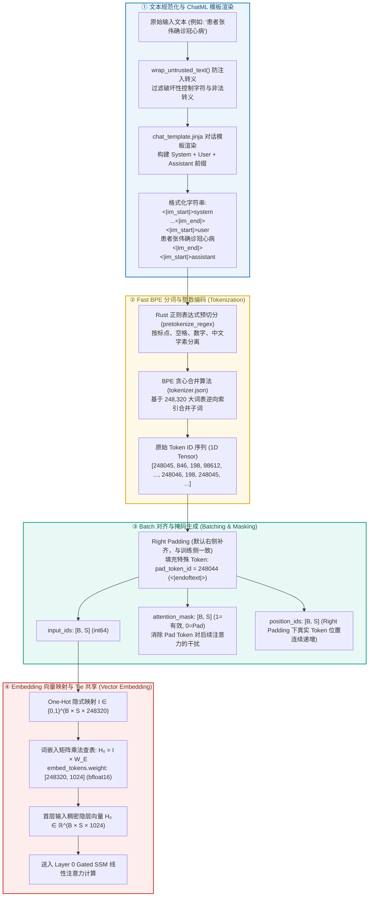

#### 4.1.2 用户输入清洗与 ChatML 模板化
1. **防注入与清洗**：
   在 [`engine/dynclassification/utils.py:wrap_untrusted_text`](engine/dynclassification/utils.py) 中，输入的脏数据（如包含未闭合引号、控制字符、尝试越狱注入的文本）首先被中和，防止 Prompt 结构遭到破坏。
2. **ChatML 结构化构建与 `enable_thinking=False` 细节**：
   通过 [`chat_template.jinja`](.models/Qwen3.5-0.8B-Privacy-Classifier-Smoother/chat_template.jinja) 组装标准对话角色消息。Qwen3.5 基座模板默认会在 `add_generation_prompt=True` 时注入 `<think>\n\n</think>` 思考前缀，若直接生成会导致 JSON 输出被思考标记包裹而解析失败。因此 `PrivShield` 在推理与训练渲染时**显式传入 `enable_thinking=False`**，走非思考分支，保证 Assistant 直接输出 JSON。
   模板将 System 角色（固定 **177 tokens** 隐私分类指南）、User 角色（被分类文本）以及 Assistant 触发词渲染为标准序列（为简洁省略空 think 块，实际渲染含 `<think>\n\n</think>`）：
   ```text
   <|im_start|>system
   你是一个专业的隐私安全Sidecar助手...<|im_end|>
   <|im_start|>user
   患者张伟确诊冠心病<|im_end|>
   <|im_start|>assistant
   ```

#### 4.1.3 Rust 高性能 BPE 分词与编码 (Tokenization)
1. **预分词 (Pre-tokenization)**：
   由 [`tokenizer.json`](.models/Qwen3.5-0.8B-Privacy-Classifier-Smoother/tokenizer.json) 中的 `pretokenize_regex` 驱动，利用正则表达式将连续字符拆解为独立的标点、数字序列、英文词缀和中文字符块。
2. **Byte-Level BPE 回退**：
   对于任何未在词表中预设的罕见汉字、生僻医疗术语或特殊 Unicode 符号，Tokenizer 不会输出 `<unk>`，而是自动回退到 UTF-8 单字节序列（Byte-level fallback），确保**词表覆盖率达到 100%，零字符丢失**。
3. **248,320 超大词表贪心合并**：
   采用 Byte-Pair Encoding (BPE) 算法，根据预训练统计的合并频次表（Merges）将高频连续字符对合并为单个 Token ID，使单条中文文本的 Token 压缩率提升至 **1.4 字符 / Token**。
4. **特殊 Token 映射**（以实际 `tokenizer.json` / `AutoTokenizer` 为准）：
   - `<|im_start|>` $\to$ `248045`
   - `<|im_end|>` $\to$ `248046`（`eos_token_id`）
   - `<|endoftext|>` $\to$ `248044`（`pad_token_id`）
   - `<|vision_start|>` $\to$ `248053`
   - `<|vision_end|>` $\to$ `248054`
   - `<|image_pad|>` $\to$ `248056`
   - `<|video_pad|>` $\to$ `248057`
   - 思考前缀 `<|think|>` / `<|/think|>` 分别对应 `248068` / `248069`（纯文本分类关闭 thinking）

#### 4.1.4 Batch 张量对齐 (Right Padding) 与掩码生成
在批量推理（Batch Inference）时，同一个 Batch 内的请求长度各不相同：
1. **Padding 策略（训练与单条推理默认 Right Padding）**：
   训练侧 `DataCollatorForSFT` 与本地 `tokenizer` 默认 `padding_side="right"`，将 `pad_token_id (248044)` 补在序列尾部，同时使用 `attention_mask` 屏蔽填充位置。单条推理（`Qwen3Classifier`）传入单条文本，实际不会发生长度补齐；Batch 高并发场景由 vLLM 的 PagedAttention / Radix Tree 自动管理前缀与 Block 分配，无需业务层手动指定 Left Padding。
2. **Attention Mask 与 Position IDs 校正**：
   - 生成对应的 `attention_mask`（真实 Token 对应 `1`，填充位置对应 `0`），在后续 GQA 和 SSM 算子中屏蔽填充位置的梯度与注意力得分；
   - 生成对应的 `position_ids`；Right Padding 下真实 Token 位置连续递增，无需额外校正。

#### 4.1.5 Embedding 查表投影与 Tie Embeddings 共享机制
1. **查表映射数学原理**：
   输入张量为离散整数矩阵 $I \in \mathbb{Z}^{B \times S}$，词嵌入矩阵为 $W_E \in \mathbb{R}^{V \times d}$（其中 $V = 248320, d = 1024$）：
   $$H_0[b, s, :] = W_E[I[b, s], :] \quad \Longleftrightarrow \quad H_0 = \text{OneHot}(I) \times W_E \quad \in \mathbb{R}^{B \times S \times 1024}$$
   该操作在 PyTorch / CUDA 中通过直接按行索引内存寻址（`gather / embedding_kernel`）完成，计算复杂度仅为 $O(B \times S)$，耗时 $< 0.1\text{ms}$。
2. **Tie Word Embeddings 权重物理共享**：
   `config.json` 中配置了 `tie_word_embeddings: true`：
   - 输入层词表嵌入矩阵 `model.language_model.embed_tokens.weight` 与输出层预测头 `lm_head.weight` **在显存中完全共享同一块物理内存指针（同一 Tensor 显存地址）**；
   - **工程收益**：单一矩阵占用显存为 $248320 \times 1024 \times 2\text{ bytes} \approx \mathbf{508.56\text{ MB}}$。共享机制直接为模型**节省了 508.56 MB 的显存开销**，同时使输入隐层空间与输出 Logits 词表投影空间严格保持对齐。

#### 4.1.6 真实样本端到端追踪演练 (Concrete Trace)
以输入文本 `"患者张伟确诊冠心病"` 为例，各阶段张量演化如下表：

| 阶段 | 数据形态 / 张量规格 | 具体内容 / 矩阵切片 |
|---|---|---|
| **原始输入** | 纯文本 String | `"患者张伟确诊冠心病"` (9 个汉字) |
| **ChatML 包装（用户片段）** | 结构化 String | `<|im_start|>user\n患者张伟确诊冠心病<|im_end|>\n<|im_start|>assistant\n<think>\n\n</think>\n\n`（System Prompt 另含 177 tokens） |
| **BPE 分词切分** | List[str] (16 个 Token) | `['<|im_start|>', 'user', '\n', '患者', '张', '伟', '确诊冠心病', '<|im_end|>', '\n', '<|im_start|>', 'assistant', '\n', '<think>', '\n\n', '</think>', '\n\n']` |
| **整数编码 `input_ids`**| Tensor: `[1, 16]` (int64) | `[[248045, 846, 198, 98612, 138667, 104449, 121588, 248046, 198, 248045, 74455, 198, 248068, 271, 248069, 271]]` |
| **对齐掩码 `attn_mask`**| Tensor: `[1, 16]` (int64) | `[[1, 1, 1, 1, 1, 1, 1, 1, 1, 1, 1, 1, 1, 1, 1, 1]]` |
| **位置编码 `pos_ids`**  | Tensor: `[1, 16]` (int64) | `[[0, 1, 2, 3, 4, 5, 6, 7, 8, 9, 10, 11, 12, 13, 14, 15]]` |
| **首层隐层向量 $H_0$**  | **Tensor: `[1, 16, 1024]` (bfloat16)** | **16 个 1024 维连续浮点向量（直接输入 Layer 0 进行前向计算）** |

---

### 4.2 GQA 全注意力机制 (Grouped-Query Attention)

在传统的 Multi-Head Attention (MHA) 中，每个 Query 头都配备一套独立的 Key/Value 头。而在 Qwen3.5-0.8B 的 6 个全注意力层中，采用了 **分组查询注意力 (GQA)** 架构。

#### 4.2.1 结构设计与头映射拓扑

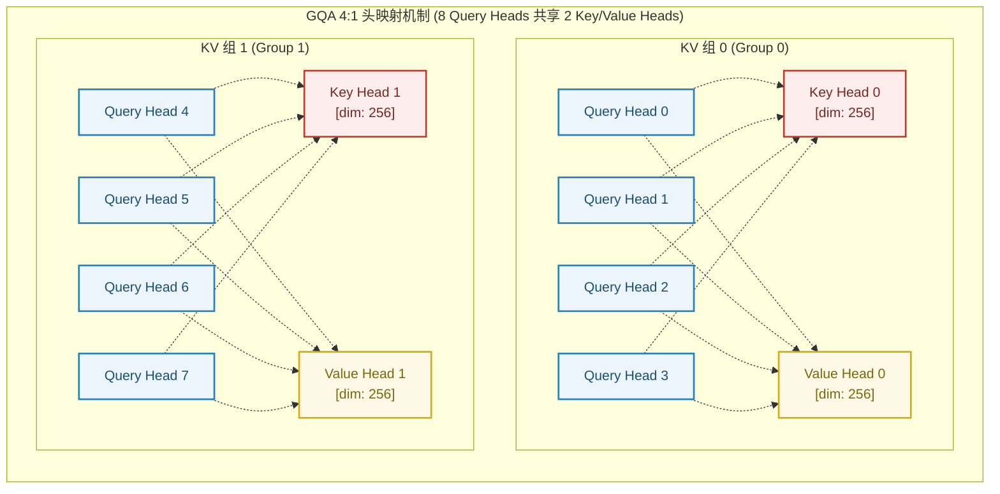

#### 4.2.2 数学形式与 KV 缓存显存压缩比

在第 $l \in \{3, 7, 11, 15, 19, 23\}$ 个全注意力层中：
1. **输入映射**：
   $$Q = X W_Q, \quad K = X W_K, \quad V = X W_V$$
   其中 $W_Q \in \mathbb{R}^{1024 \times 2048}$（8 头 $\times 256$ 维），$W_K, W_V \in \mathbb{R}^{1024 \times 512}$（2 头 $\times 256$ 维）。
2. **分组广播与注意力计算**：
   对于第 $i \in [0, 7]$ 个 Query 头，其对应的 KV 头索引为 $g = \lfloor i / 4 \rfloor \in \{0, 1\}$：
   $$\text{Head}_i = \text{Softmax}\left( \frac{Q_i K_g^T}{\sqrt{d_k}} + M \right) V_g, \quad d_k = 256$$
3. **KV Cache 显存节省率**：
   在单批次、序列长度为 $S$ 时，单层传统 MHA 与 GQA 的 KV Cache 显存需求对比：
   $$\text{Memory}_{\text{MHA}} = 2 \times 8 \times S \times 256 \times 2\text{ bytes} = 8192 \times S\text{ bytes}$$
   $$\text{Memory}_{\text{GQA}} = 2 \times 2 \times S \times 256 \times 2\text{ bytes} = 2048 \times S\text{ bytes}$$
   **KV Cache 显存占用直接降低 75%**，极大缓解了并发推理与超长上下文下的显存带宽压力。

---

### 4.3 Gated Recurrent SSM 线性注意力 (Linear Attention)

在 18 个线性注意力层（`linear_attention`）中，Qwen3.5-0.8B 摒弃了传统的 $O(N^2)$ Softmax 矩阵计算，采用了 **1D 因果深度卷积 + 门控状态空间模型 (Gated SSM) + 输出门控** 的融合结构。

#### 4.3.1 线性注意力层内部算子流图

```mermaid
flowchart TD
    subgraph LINEAR_ATTN_BLOCK["Gated SSM 线性注意力内部计算拓扑"]
        IN_X["输入隐层向量 X [B, S, 1024]"] --> RMS_PRE["Pre-RMSNorm (dim: 1024)"]
        
        RMS_PRE --> PROJ_QKV["in_proj_qkv: 线性投影 [1024 → 6144]\n拆分为 Q [2048], K [2048], V [2048]"]
        RMS_PRE --> PROJ_Z["in_proj_z: 门控投影 [1024 → 2048]"]
        
        PROJ_QKV --> CONV_1D["1D 因果深度可分离卷积 (Kernel=4)\nconv1d.weight: [6144, 1, 4]"]
        CONV_1D --> ACT_SILU["SiLU 激活函数: x · σ(x)"]
        
        ACT_SILU --> SPLIT_QKV["拆解为单头张量:\n- Q: 16 头 × 128 维\n- K: 16 头 × 128 维\n- V: 16 头 × 128 维"]
        
        SPLIT_QKV --> SSM_RECURRENT["Gated SSM 状态空间循环递推 (Float32)\nSₜ = A_bar ⊙ Sₜ₋₁ + Kₜᵀ · Vₜ\nYₜ = Qₜ · Sₜ"]
        
        SSM_RECURRENT --> OUT_GATE["输出门控调制: Y · SiLU(Z)"]
        PROJ_Z --> ACT_Z["SiLU 激活"]
        ACT_Z --> OUT_GATE
        
        OUT_GATE --> OUT_PROJ["out_proj 线性收敛投影 [2048 → 1024]\nlinear_attn.out_proj.weight"]
        OUT_PROJ --> RES_ADD["残差累加: X + out_proj"]
    end

    classDef convStyle fill:#FEF9E7,stroke:#D4AC0D,stroke-width:2px,color:#7D6608;
    classDef ssmStyle fill:#E8F8F5,stroke:#16A085,stroke-width:2px,color:#0E6251;
    classDef gateStyle fill:#F5EEF8,stroke:#8E44AD,stroke-width:2px,color:#512E5F;
    class CONV_1D,ACT_SILU convStyle;
    class SSM_RECURRENT ssmStyle;
    class PROJ_Z,ACT_Z,OUT_GATE gateStyle;
```

#### 4.3.2 连续系统到离散状态递推的数学推导

1. **状态空间微分方程**：
   连续时间下的状态空间模型定义为：
   $$h'(t) = A h(t) + B x(t), \quad y(t) = C h(t)$$
2. **零阶保持器 (ZOH) 离散化**：
   引入输入驱动的动态步长 $\Delta_t = \text{Softplus}(\text{Linear}(x_t))$，离散化转移矩阵为：
   $$\bar{A}_t = \exp(\Delta_t A), \quad \bar{B}_t = (\Delta_t A)^{-1}(\bar{A}_t - I) \cdot \Delta_t B \approx \Delta_t B$$
3. **自回归生成状态转移方程**：
   在时间步 $t$，每个头（16 头，单头维度 $d_k=128, d_v=128$）维护一个固定的隐状态矩阵 $S_t \in \mathbb{R}^{128 \times 128}$：
   $$S_t = \bar{A}_t \odot S_{t-1} + K_t^T V_t$$
   $$Y_t = Q_t S_t$$
4. **输出门控调制**：
   $$\tilde{Y}_t = (Y_t W_O) \odot \text{SiLU}(Z_t)$$
   - **显存与计算复杂度**：无论输入序列长度 $N$ 达到多长（即使达到 256K），循环递推在自回归解码时的计算量均为 $O(1)$，中间状态显存恒定为 $16 \times 128 \times 128 \times 4\text{ bytes} = 1\text{ MB/层}$，**彻底解决了长文本生成下的内存与算力爆炸问题**。

---

### 4.4 SwiGLU 前馈神经网络 (FFN/MLP)

在全部 24 层中，均配备了基于 **SwiGLU (Swish Gated Linear Unit)** 的前馈神经网络。

#### 4.4.1 SwiGLU 内部数据流动

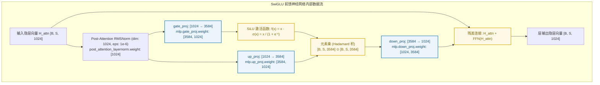

#### 4.4.2 数学形式与参数量容量分析

$$\text{SwiGLU}(x) = \left( \text{SiLU}(x W_{\text{gate}}) \odot (x W_{\text{up}}) \right) W_{\text{down}}$$

1. **三矩阵参数分布**：
   - 隐层维度 $d = 1024$，中间扩展维度 $d_{\text{ffn}} = 3584$（扩展比 $\approx 3.5\times$）；
   - $W_{\text{gate}} \in \mathbb{R}^{3584 \times 1024}$：参数量 $3,670,016$；
   - $W_{\text{up}} \in \mathbb{R}^{3584 \times 1024}$：参数量 $3,670,016$；
   - $W_{\text{down}} \in \mathbb{R}^{1024 \times 3584}$：参数量 $3,670,016$；
   - 单层 FFN 总参数量：$3 \times 3,670,016 = 11,010,048 \approx 11.01\text{M}$；
   - 24 层主干 FFN 累计参数量：$24 \times 11.01\text{M} = \mathbf{264.24\text{M}}$（占全模型文本参数的近 **40%**）。

2. **为什么采用 $3.5\times$ 扩展比？**
   在 0.8B 这类极轻量模型中，注意力层主要负责上下文寻址与对齐，而**领域的复杂规则记忆、实体属性映射与密级判断逻辑主要固化在前馈网络中**。$3.5\times$ 的 SwiGLU 设计为微调阶段注入医疗隐私、GDPR 等多标准分类规则提供了充沛的参数容量。

---

### 4.5 Partial RoPE 旋转位置编码与 MRoPE

在全注意力层中，Qwen3.5-0.8B 采用了 **25% Partial RoPE** 与 **多模态/多维交织旋转（MRoPE）** 机制。

#### 4.5.1 25% Partial RoPE 机制设计

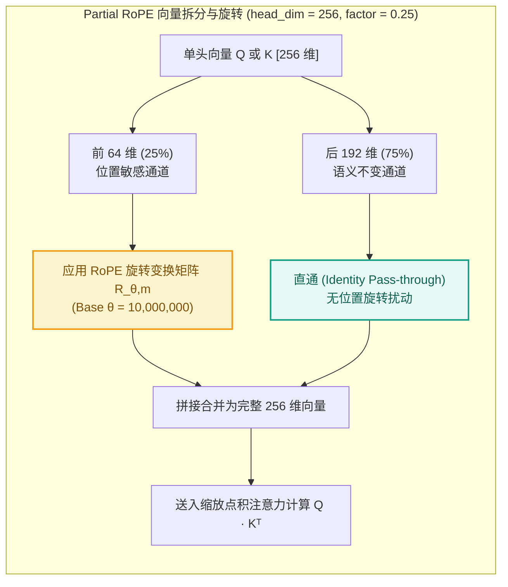

#### 4.5.2 数学表达与优势

设单头 Query 向量 $Q = [q_0, q_1, \dots, q_{255}] \in \mathbb{R}^{256}$：
- **旋转部分（前 64 维，32 对复数对）**：
  $$\begin{pmatrix} \tilde{q}_{2i} \\ \tilde{q}_{2i+1} \end{pmatrix} = \begin{pmatrix} \cos(m \theta_i) & -\sin(m \theta_i) \\ \sin(m \theta_i) & \cos(m \theta_i) \end{pmatrix} \begin{pmatrix} q_{2i} \\ q_{2i+1} \end{pmatrix}, \quad \theta_i = \theta^{-\frac{2i}{64}}, \quad i \in [0, 31]$$
  其中基频 $\theta = 10,000,000$（$10^7$）。
- **直通部分（后 192 维）**：
  $$\tilde{q}_j = q_j, \quad j \in [64, 255]$$

- **内积展开**：
  $$\langle \tilde{Q}_m, \tilde{K}_n \rangle = \underbrace{\sum_{i=0}^{31} \text{RoPE}(Q_{m, 2i:2i+1}, K_{n, 2i:2i+1})}_{\text{精确编码相对位置 } |m - n|} + \underbrace{\sum_{j=64}^{255} Q_{m, j} K_{n, j}}_{\text{编码位置无关的绝对语义相关性}}$$

#### 4.5.3 MRoPE (Multimodal RoPE) 三维切分与纯文本场景
`config.json` 中配置了 `mrope_section: [11, 11, 10]`：
- 32 对旋转频率切分为：时间/文本序列维度 $T$（11 对，22 维）、垂直空间维度 $H$（11 对，22 维）、水平空间维度 $W$（10 对，20 维），合计 64 维（即 $0.25 \times 256$ 的 Partial RoPE 部分）；
- `mrope_interleaved: true`：跨频段交织排布，为多模态表格、图像与文本的联合坐标定位保留统一的 3D 相对位置感知。

> **纯文本分类说明**：`PrivShield` 当前仅使用纯文本输入，视觉塔被旁路。`mrope_section` 在文本场景下退化为常规 RoPE 频率分组，模型仍只使用前 64 维旋转、后 192 维直通，不会引入 3D 空间位置。

---

### 4.6 QK-Norm (Query-Key 稳定性归一化)

在深层 Transformer 中，当序列长度扩展至 32K~256K 时，自注意力点积值 $\frac{Q K^T}{\sqrt{d_k}}$ 极易随深度发生数值爆炸，导致 Softmax 输出分布趋于独热码（One-hot），引发**注意熵坍塌（Attention Entropy Collapse）**。

#### 4.6.1 QK-Norm 解决机制

在进入 RoPE 和点积注意力前，分别对每个 Query 头和 Key 头应用独立的单头 `RMSNorm`：

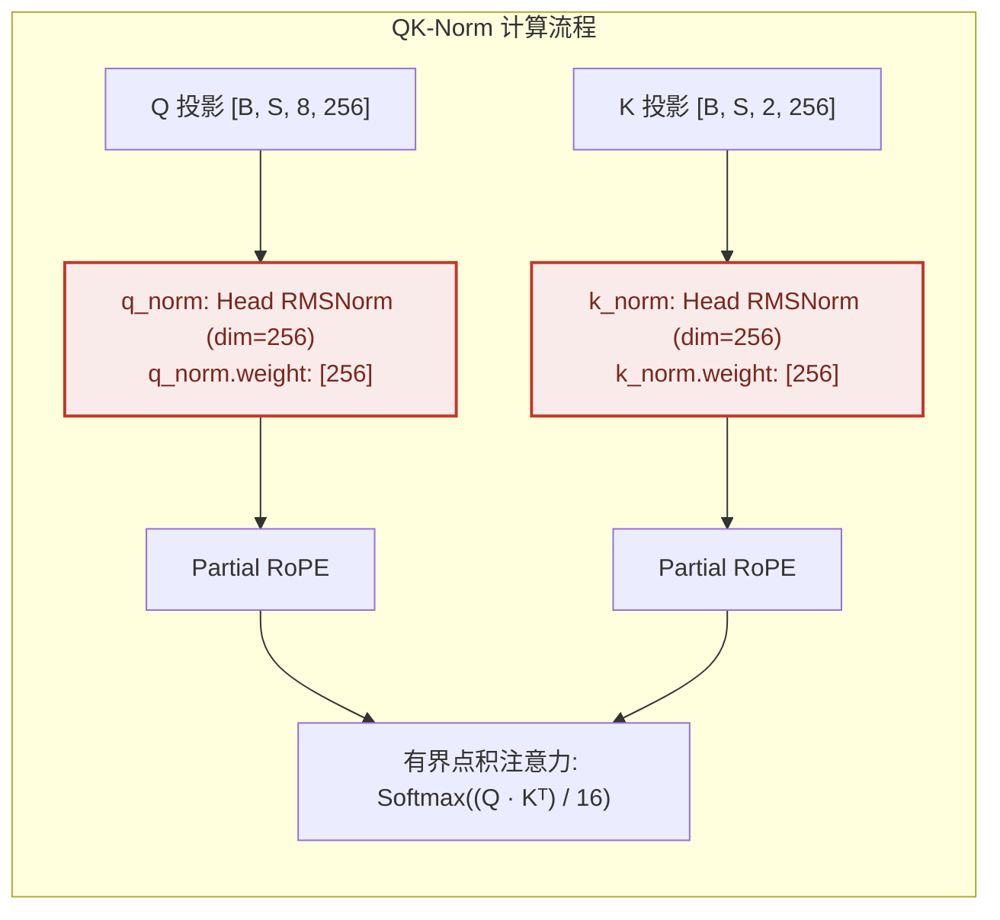

#### 4.6.2 数学有界性证明

经 RMSNorm 归一化后，每个头向量的均方根（RMS）被重新缩放至约 $1$（即 $\|\tilde{Q}_h\|_2 \approx \sqrt{d_k}$ 仅当元素分布均匀时成立，RMSNorm 的严格保证是 RMS 而非 $L_2$ 范数）。在典型元素分布下，点积注意力 Logits 被有效抑制在较窄区间，实践中可显著降低 Softmax 梯度饱和与 fp16/bf16 溢出的风险，保证在 256K 超长文本下注意力分布的平滑与稳定。

---

### 4.7 多模态与视觉编码兼容架构 (Vision Transformer & Merger)

模型定义了完整的 `vision_config` 与视觉权重，使该 0.8B 模型原生具备跨模态拓展能力。当前 `PrivShield` 生产仅使用纯文本路径，视觉塔在 `Qwen3Classifier` 中被自动旁路。

#### 4.7.1 视觉塔与对齐投影结构图

```mermaid
flowchart TD
    subgraph VISION_TOWER["多模态视觉处理管线 (Vision Transformer & Merger)"]
        IMG["输入图像 / DICOM 切片 [C=3, H, W]"] --> P_EMBED["3D Patch 卷积投影\npatch_embed.proj: [768, 3, 2, 16, 16]"]
        P_EMBED --> POS_ADD["加位置编码: pos_embed [2304, 768]"]
        
        POS_ADD --> VIT_BLOCKS["12 层 ViT 编码块 (Vision Transformer)\n- 12 个 Self-Attention 头\n- 隐层维度 768, FFN 中间维度 3072\n- 激活函数: gelu_pytorch_tanh"]
        
        VIT_BLOCKS --> S_MERGE["空间重排下采样 (spatial_merge_size = 2)\n每 2×2 个视觉 Patch 拼接合并 (4× 压缩)"]
        
        S_MERGE --> MERGER["Visual Merger 对齐投影器\n1. norm: [768]\n2. linear_fc1: [3072, 3072] + GELU\n3. linear_fc2: [1024, 3072]"]
        
        MERGER --> V_TOKENS["视觉特征 Tokens [B, N_patches, 1024]\n维度与文本隐层完全对齐 (1024 维)"]
        
        V_TOKENS --> MULTI_MODAL_SEQ["与文本 Token 拼接:\n<|vision_start|> + V_TOKENS + <|vision_end|> + 提示词文本"]
    end

    classDef vitStyle fill:#E8F8F5,stroke:#16A085,stroke-width:2px,color:#0E6251;
    classDef mergeStyle fill:#FEF9E7,stroke:#D4AC0D,stroke-width:2px,color:#7D6608;
    class P_EMBED,VIT_BLOCKS vitStyle;
    class S_MERGE,MERGER mergeStyle;
```

#### 4.7.2 在 PrivShield 中的运行策略
1. **纯文本模式（当前生产默认）**：
   在 `engine/dynclassification/llm_engines.py` 的 `Qwen3Classifier` 中，文本输入直接送入 Language Model 主干，**视觉编码塔被自动旁路（Bypass）**，计算耗时与显存开销为 0。
2. **多模态就绪（未来演进）**：
   当传入医疗图像、病理切片或 DICOM 影像时，系统可激活视觉塔生成视觉 Tokens，无缝执行多模态隐私判定。视觉塔自身参数量约 **101M**（12 层 ViT + Patch 嵌入 + Pos 嵌入 + Merger），合并后的 `model.safetensors` 中共有 153 个 `model.visual.*` 权重张量。

---

## 5. 工业级 SFT 微调与 LoRA 训练全生命周期深度解析

在 `PrivShield` 项目中，`Qwen3.5-0.8B-Privacy-Classifier-Smoother` 的微调训练流水线位于 `llmlora/` 模块下（由 [`trainer.py`](llmlora/src/models/trainer.py)、[`loader.py`](llmlora/src/dataset/loader.py) 及 [`data_collator.py`](llmlora/src/dataset/data_collator.py) 驱动），实现了从数据加载、Prompt 标签掩码、PEFT LoRA 模块自适应探查、混合精度训练、训练后生成自检到权重融合与 vLLM 补丁导出的完整工业级闭环。

### 5.1 SFT 监督微调全生命周期拓扑图

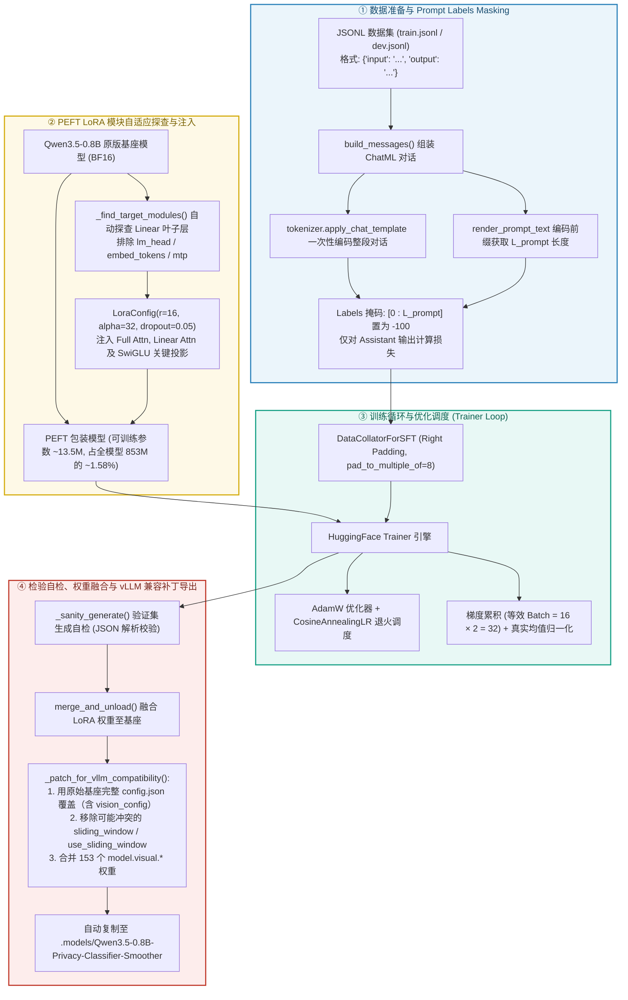

---

### 5.2 数据集规范与 Prompt Labels Masking（前缀损失屏蔽）

1. **统一数据结构规范**：
   训练数据集每行均为一个 JSON 对象。`loader.py` 兼容两种形态：
   - 标准形态：`{"input": "...", "output": "..."}`（`instruction` 已并入 system prompt）
   - 扩展形态：`{"instruction": "...", "input": "...", "output": "..."}`（两者拼接后作为 user 输入）
   ```json
   {
     "input": "患者张伟（身份证号510104198501011234）确诊冠心病于华西医院心内科住院。",
     "output": "{\"final_level\":\"L4\",\"confidence\":0.98,\"reasoning\":\"文本包含实名、身份证号及冠心病确诊住院病历，属于高敏感个人健康医疗信息。\",\"sanitized_text\":\"该患者（男，中年，已妥善建档）因心血管疾病于近期入住某三甲医院心血管专科。\"}"
   }
   ```
2. **关闭 thinking 模式与 Prompt 对齐**：
   `render_prompt_text` 在构建训练/推理 Prompt 时均显式传入 `enable_thinking=False`，使 Chat Template 走非思考分支，避免 `<think>...</think>` 标记污染 Assistant 的 JSON 输出。
3. **前缀长度定位法与 `-100` 掩码机制**：
   - **目标**：严禁对 System Prompt、分类指南和用户输入计算梯度，防止模型过拟合指令模板。
   - **实现机制**：Qwen3.5 官方 chat template 不包含 `` 标记，`return_assistant_tokens_mask` 恒为 0。`PrivShield` 采用了 **「推理 Prompt 前缀长度定位法」**：
     通过 [`loader.py:render_prompt_text`](llmlora/src/dataset/loader.py#L97) 先将 Prompt 文本编码得到长度 $L_{\text{prompt}}$，再对完整样本（Prompt + Response）统一编码得到长为 $L_{\text{total}}$ 的 Token 序列：
     $$\text{labels}[i] = \begin{cases} -100, & 0 \le i < L_{\text{prompt}} \quad (\text{System Prompt + User Input}) \\ \text{input\_ids}[i], & L_{\text{prompt}} \le i < L_{\text{total}} \quad (\text{Assistant 4 字段 JSON 输出}) \end{cases}$$
   - **Causal LM 内部位移铁律**：自回归模型在 `forward()` 内部自动执行 `shift_logits = logits[..., :-1, :]` 与 `shift_labels = labels[..., 1:]`，因此 Collator 与 Dataset 中**严禁手动将 labels 左移一位**，保证 labels 与 input_ids 严格逐位等长对齐。

---

### 5.3 PEFT LoRA 模块自适应探查与低秩参数注入

1. **自动探查与模块过滤策略**：
   [`trainer.py:_find_target_modules`](llmlora/src/models/trainer.py#L185) 动态遍历基座模型的全部子模块：
   - **显式排除层**：`lm_head`（语言模型预测头）、`embed_tokens`（词嵌入层）与 `mtp`（多 Token 投机预测草稿层），避免破坏基座大词表的词法表征；
   - **自动求交集目标层**：
     - **6 层 Full Attention**：`q_proj`, `k_proj`, `v_proj`, `o_proj`（捕获长程跨实体语义关联）；
     - **18 层 Linear Attention**：`in_proj_qkv`, `out_proj`, `in_proj_z`（调整局部卷积与门控状态空间转移）；
     - **24 层 SwiGLU FFN**：`gate_proj`, `up_proj`, `down_proj`（注入垂直医疗隐私分类规则与实体密级记忆）。
2. **低秩矩阵数学推导与参数量**：
   对于原始冻结权重 $W_0 \in \mathbb{R}^{d_{\text{out}} \times d_{\text{in}}}$，LoRA 引入两个低秩可训练矩阵 $A \in \mathbb{R}^{r \times d_{\text{in}}}$（高斯初始化）与 $B \in \mathbb{R}^{d_{\text{out}} \times r}$（全零初始化）：
   $$W = W_0 + \Delta W = W_0 + \frac{\alpha}{r} (B \cdot A)$$
   配置 $r=16, \alpha=32$（缩放因子 $\frac{\alpha}{r} = 2.0$），可训练参数总量仅为 **~13.5M**（占全模型 853M 总参数量的 **~1.58%**）。
3. **训练期显存与 KV Cache 控制**：
   在训练初始化时强制执行 `self.model.config.use_cache = False`，关闭自回归 KV Cache 分配，确保与反向传播图构建及梯度检查点（Gradient Checkpointing）完全兼容。

---

### 5.4 训练优化器、动态 Batching 与梯度累积

1. **硬件对齐与动态 Collator**：
   [`data_collator.py:DataCollatorForSFT`](llmlora/src/dataset/data_collator.py) 在 Batch 内部动态探查最大长度，并强制 `pad_to_multiple_of=8`，使张量维度严格对齐 NVIDIA Tensor Core 的 MMA 分块指令，避免 Kernel 退化。
2. **优化器与学习率退火**：
   - 优化器：`AdamW`（$\beta_1=0.9, \beta_2=0.999, \text{eps}=10^{-8}$，权重衰减 $\text{weight\_decay}=0.01$）；
   - 调度策略：`CosineAnnealingLR` 余弦退火调度，配合 3% 步数的 Warmup 线性预热；
   - 混合精度：默认优先采用 `bfloat16`（保持与 float32 相同的 8-bit 指数位动态范围，彻底杜绝训练溢出）。
3. **等效 Batch Size 与梯度累积**：
   $$\text{Batch}_{\text{effective}} = \text{Batch}_{\text{per\_device}} (16) \times \text{GradAccum} (2) = \mathbf{32}$$
   Trainer 内部采用真均值（True Mean）归一化，消除了长短样本混杂时的 Loss 偏差。
4. **梯度检查点 (Gradient Checkpointing)**：
   仅保留各层输入激活，反向传播时重算段内激活值，使激活显存开销降低 5x~10x，确保在 8GB/12GB 显存显卡上稳定训练。由于混合线性注意力/SSM 层对梯度检查点的支持因 Transformers 版本而异，代码中设置了 `use_reentrant=False` 并在异常时自动关闭，避免训练崩溃。

---

### 5.5 训练后生成自检 (Sanity Check)
训练完成后，[`trainer.py:_sanity_generate`](llmlora/src/models/trainer.py#L351) 自动从验证集抽取小样执行自回归生成，并调用 [`extract_json_from_text`](llmlora/src/utils/metrics.py) 检验输出是否能够 100% 解析为包含 4 字段的合法 JSON，确保微调权重未发生语法漂移或格式崩溃。

---

### 5.6 权重融合 (Merge & Unload) 与 vLLM 兼容性补丁工程
1. **权重物理融合**：
   调用 `peft_model.merge_and_unload()` 将低秩增量矩阵 $\frac{\alpha}{r} (B \cdot A)$ 原地加算到基座权重 $W_0$ 中，导出独立且无 PEFT 运行时依赖的 `model.safetensors`。
2. **vLLM 兼容性补丁 (`_patch_for_vllm_compatibility`)**：
   - **行业痛点**：vLLM 官方模型注册表中仅注册了多模态架构 `Qwen3_5ForConditionalGeneration`，无法直接加载拍平的纯文本 `Qwen3_5ForCausalLM` 格式；
   - **补丁步骤 1**：使用基座原始包含 `vision_config` 与 `text_config` 嵌套的完整 `config.json` 覆盖导出目录；
   - **补丁步骤 2**：移除 `sliding_window` / `use_sliding_window` 等可能与合并后文本模型冲突的字段；
   - **补丁步骤 3**：从基座 safetensors 提取 153 个 `model.visual.*` 权重注入合并后的 safetensors，补齐视觉塔结构；
   - **补丁步骤 4**：通过 `_copy_to_agent_model_dir` 自动同步复制到主工程 `.models/Qwen3.5-0.8B-Privacy-Classifier-Smoother`。

---

## 6. 生产级推理引擎、自回归解码控制与安全容灾机制

在 `PrivShield` 端侧 Sidecar 运行时，大模型推理链路由 `LlmAdapter`（[`llm_adapter.py`](engine/dynclassification/llm_adapter.py)）统一封装，实际执行器包括：
- **本地 PyTorch 后端**：`Qwen3Classifier`（[`llm_engines.py`](engine/dynclassification/llm_engines.py)），通过 `AutoModelForCausalLM.from_pretrained(..., trust_remote_code=True)` 加载 `.models/Qwen3.5-0.8B-Privacy-Classifier-Smoother`；
- **远程/本地 vLLM HTTP 后端**：`OpenAILlmClassifier`（[`llm_engines.py`](engine/dynclassification/llm_engines.py)），调用 OpenAI 兼容 `/v1/chat/completions` 接口，可对接 vLLM、Ollama 或云端 API；
- **MLX 后端**：Apple Silicon 本地 Metal 推理（可选，延迟加载）。

这些后端共同与 `ClassificationFunnel`（[`funnel.py`](engine/dynclassification/funnel.py)）协同，实现高效解码控制与多重生产级容灾兜底。

### 6.1 Prefill 预填充与 Decode 自回归解码两阶段画像

| 推理阶段 | 算子计算模式 | 算力强度 (Arithmetic Intensity) | Roofline 瓶颈类型 | 关键优化手段 |
|---|---|---|---|---|
| **Prefill (预填充)** | 一次性并行处理 Prompt 全量 Token (GEMM) | $\text{AI} = \frac{2 \times B \times L_{\text{prompt}} \times D^2}{2 \times D^2} = B \times L \gg \text{AI}^*$ | **Compute-Bound (算力受限)** | **Automatic Prefix Caching (APC)**、FlashAttention、Chunked Prefill |
| **Decode (自回归解码)** | 逐步预测下一个 Token (GEMV, $L=1$) | $\text{AI} = \frac{2 \times B \times 1 \times D^2}{2 \times D^2} = B \ll \text{AI}^*$ | **Memory-Bound (显存带宽受限)** | **Batching 并发合并**、GQA 4:1 头压缩、SSM $O(1)$ 递推、CUDA Graphs |

> **Padding 与生成正确性说明**：自回归生成中模型依据序列最右端真实 Token 预测下一个 Token。训练 Collator 使用 Right Padding 并配合 `attention_mask` 屏蔽填充位；本地单条推理传入单条文本，无 Padding 问题；vLLM Batch 场景由 PagedAttention 内部管理 Block 与位置索引，无需业务层手动 Left Padding。传统 Left Padding 适用于原生 PyTorch 静态 Batch，目的是将有效上下文统一靠右对齐。

---

### 6.2 Batch 推理中多提示词分层隔离与区分机制 (Multi-Prompt Isolation Architecture)

在 Batch 批处理推理中，多个业务请求的提示词并非简单地首尾拼成一条长文本，而是从 **数据结构**、**分词张量** 到 **底层的注意力计算与显存分页**，层层通过严格的**独立维度与物理边界机制**进行逻辑隔离与并发调度：

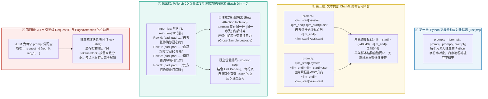

#### 6.2.1 四层隔离机制详细对照

| 隔离层级 | 区分与隔离方式 | 底层实现机理 | 是否存在样本间串扰？ |
|---|---|---|---|
| **Python 层面** | `List[str]` 独立字符串元素 | `prompts = [prompt_0, prompt_1, ...]`，每个元素独立存储在 Python 堆内存中 | ❌ 绝对独立（不同的内存字符串对象） |
| **文本结构** | ChatML 控制 Token 闭合 | `<|im_start|>` (248043) 与 `<|im_end|>` (248044) 构建自包含单轮/多轮消息边界 | ❌ 结构自洽，各自闭合 |
| **PyTorch 张量** | 2D 矩阵 `[Batch, Length]`，每样本占一行 | `input_ids[i, :]` 独占第 $i$ 行；**因果自注意力掩码禁止跨行注意力计算**；各行 `position_ids` 独立从 0 计数 | ❌ 注意力仅在行内计算，零跨样本交叉 |
| **vLLM 引擎** | 独立 `Request ID` + PagedAttention 独立块表 | 每个请求拥有独立的物理页映射表（Block Table），短请求遇到 EOS 即刻释放物理块 | ❌ 物理分页与逻辑任务完全解耦 |

---

### 6.3 自回归解码控制与提前截断机制 (Sampling & Early Exit)

1. **确定性贪心解码与关闭 Thinking 模式**：
   设定 `temperature=0.0, do_sample=False`，消除随机性采样波动，确保相同文本在隐私定级与脱敏输出上严格具备确定性与可复现性。同时，Qwen3.5 基座模板默认注入 `<think>...</think>` 思考前缀，推理时**显式传入 `enable_thinking=False`**，避免 Assistant 输出被思考标记包裹而导致 JSON 解析失败。
2. **双重提前截断终止条件 (Early Exit)**：
   由于目标输出为固定的 4 字段 JSON，模型在输出闭合右花括号 `}` 后即可安全终止。本地 PyTorch 后端调用 `model.generate(**inputs, max_new_tokens=512)`，vLLM/OpenAI 后端则通过 `max_tokens=512` + `stop=["}"]` 控制：
   - 终止符 1：`eos_token_id: 248046`（`<|im_end|>`）；
   - 终止符 2：`stop=["}"]` 配合 `include_stop_str_in_output=True`（保留闭合符号）；
   - 效益：相比默认的最大生成长度，提前截断在生成 ~45-55 个 Token 时即刻退出，**节省 40% 以上的无效 Decode 耗时**。
3. **结构化输出约束 (Structured Outputs via xgrammar)**：
   在 vLLM 生产后端中挂载 Pydantic JSON Schema，通过语法引导（Guided Decoding）在每个时间步对 Logits 进行词表级 Mask 约束，强制模型仅能采样符合 JSON 语法的合法 Token，实现 **100% JSON 解析合法率**。

---

### 6.4 推理输出结果的结构化反序列化与多阶段解析流水线 (Structured Output Deserialization & Parsing Pipeline)

在模型完成 Batch 前向自回归生成后，底层的 **GPU 张量 (Token IDs)** 必须经过规范的反分词解码、正则清洗、JSON 提取以及业务合法性校验，最终还原为标准业务对象：

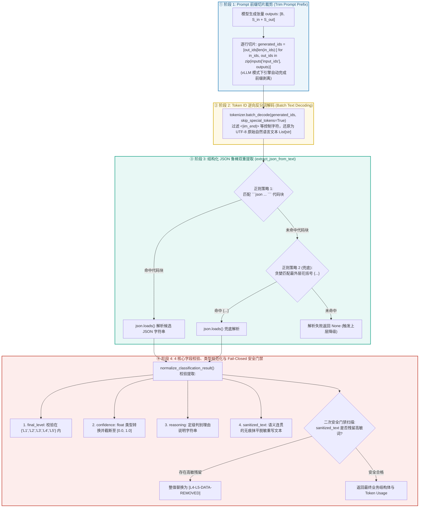

#### 6.4.1 解析各阶段核心实现代码参考

```python
import json
import re
from typing import Any, Dict, Optional

_FENCE_PATTERN = re.compile(r"```(?:json)?\s*(.*?)\s*```", re.DOTALL)
_BRACE_PATTERN = re.compile(r"\{.*\}", re.DOTALL)

def extract_json_from_text(text: str) -> Optional[Dict[str, Any]]:
    """从模型输出文本中鲁棒提取 JSON 对象（支持 Markdown 块与裸 JSON 字符串）"""
    if not text:
        return None

    # 策略 1：优先匹配 ```json ... ``` 块内部内容
    match = _FENCE_PATTERN.search(text)
    candidate_str = match.group(1).strip() if match else text.strip()

    try:
        data = json.loads(candidate_str)
        if isinstance(data, dict):
            return data
    except (json.JSONDecodeError, ValueError):
        pass

    # 策略 2：兜底正则贪婪匹配最外层的大括号 {...}
    brace_match = _BRACE_PATTERN.search(text)
    if brace_match:
        try:
            data = json.loads(brace_match.group(0))
            if isinstance(data, dict):
                return data
        except (json.JSONDecodeError, ValueError):
            pass

    return None

def normalize_classification_result(parsed_dict: Dict[str, Any]) -> Dict[str, Any]:
    """对解析出的 JSON 字段进行类型清洗、范围截断与合法性校验"""
    # 1. final_level: 密级校验 (必须为标准 L1~L5)
    raw_level = str(parsed_dict.get("final_level", "L1")).upper().strip()
    valid_levels = {"L1", "L2", "L3", "L4", "L5"}
    final_level = raw_level if raw_level in valid_levels else "L1"

    # 2. confidence: 置信度浮点数约束在 [0.0, 1.0]
    try:
        confidence = float(parsed_dict.get("confidence", 0.8))
        confidence = max(0.0, min(1.0, confidence))
    except (ValueError, TypeError):
        confidence = 0.8

    # 3. reasoning: 定级判别理由说明
    reasoning = str(parsed_dict.get("reasoning", "大模型综合判定")).strip()

    # 4. sanitized_text: 无痕脱敏抹平文本
    sanitized_text = str(parsed_dict.get("sanitized_text", "")).strip()

    return {
        "final_level": final_level,
        "confidence": confidence,
        "reasoning": reasoning,
        "sanitized_text": sanitized_text,
    }
```

---

### 6.5 生产级端侧 Sidecar 降级、熔断与高并发安全门禁 (Safety Floor)

在端侧高并发或边缘资源受限环境下，系统设计了严密的五重防御与优雅降级链条：

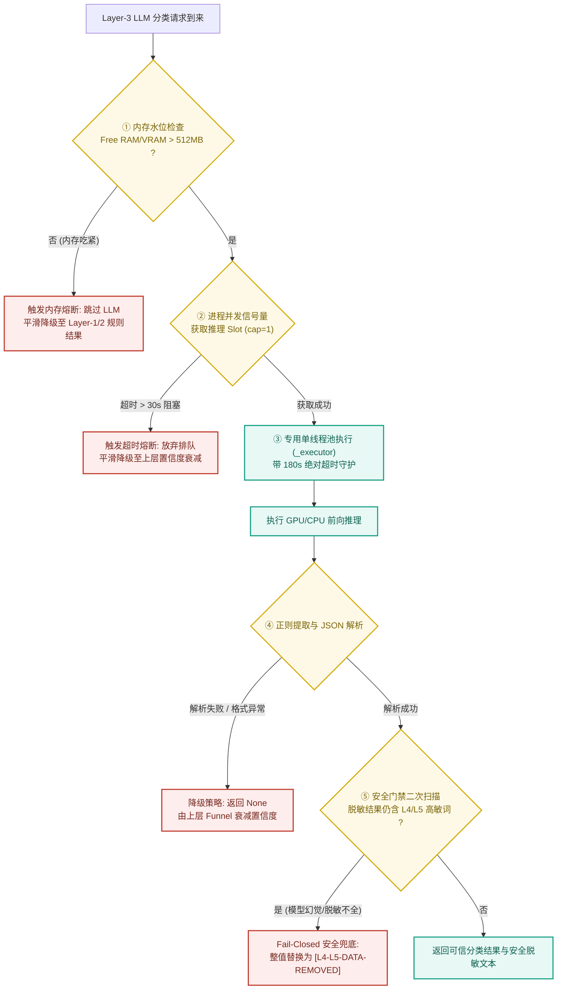

1. **延迟初始化与双重检查锁定 (Double-Checked Locking)**：
   [`llm_engines.py:Qwen3Classifier`](engine/dynclassification/llm_engines.py#L121) 采用双重检查锁定，首次被调用时才加载权重，避免非 LLM 场景或启动阶段的显存占用。
2. **并发信号量控制 (Concurrency Semaphore)**：
   受 `PRIVACY_LLM_MAX_CONCURRENCY=1` 约束，多线程请求通过信号量串行化排队，防止瞬时并发请求并发加载多份前向激活造成显存爆 OOM；等待超过 30s（`PRIVACY_LLM_SEMAPHORE_WAIT_SECONDS`）自动放弃并平滑降级。
3. **可用显存/内存熔断守护**（双层阈值）：
   - 在 `LlmAdapter` 层先检查系统可用物理内存（`PRIVACY_LLM_MIN_FREE_MEM_MB=512`），低于阈值时跳过 LLM；
   - 在 `Qwen3Classifier` 本地 CUDA 加载路径中，额外检查 GPU 可用显存（`PRIVACY_VLM_MIN_VRAM_GB=1.6`），不满足时自动回退 CPU/MPS，保证主机系统核心服务稳定性。
4. **独立线程池与 180s 绝对超时隔离**：
   将推理运算隔离到专用单线程池 `ThreadPoolExecutor(max_workers=1, thread_name_prefix="llm-infer")`，超时（默认 180s）即刻抛出 `TimeoutError` 并返回 `None`，绝不永久锁死 gRPC 工作线程。
5. **Fail-Closed 等级安全地板与脱敏门禁**：
   - 在 [`funnel.py`](engine/dynclassification/funnel.py) 中，LLM 裁定的 `final_level` 绝不允许低于规则/上游已判定的等级（防止模型幻觉或 Prompt 注入导致降级放行），否则被拒绝并标记 `needs_human_review`；
   - LLM 仲裁结果必须落在冲突标签等级集合内，且不得低于值级证据（`match_target=field_value`）的最高敏感等级；
   - `Qwen3Classifier` 是纯文本模型，遇到图像/图片输入直接返回 `None` 触发降级，由 `ClassificationFunnel` 按高敏医学影像规则保护；
   - 在 [`service.py`](engine/dynclassification/service.py) 服务出口处，对 `sanitized_text` 再次执行规则级高敏词扫描，若发现脱敏不彻底仍残留 L4/L5 敏感数据，强制替换为 `"[L4-L5-DATA-REMOVED]"`，实现绝对的合规兜底。


---

## 7. 模型仓库文件体系与各文件功能全景

在 `PrivShield` 项目中，大模型微调合并后的核心权重与配置文件集中存储于 **`.models/Qwen3.5-0.8B-Privacy-Classifier-Smoother/`** 目录下。该目录由 [`download_model.py`](engine/privacy/download_model.py) 自动拉取，或由微调流水线 [`trainer.py`](llmlora/src/models/trainer.py) 导出。

### 7.1 文件清单与功能对照矩阵

下表对目录内的 8 个核心文件及其架构职能进行全景剖析：

| 文件名称 | 文件大小 | 格式 / 类型 | 核心作用与工程机制 | 关联加载模块 |
|---|---|---|---|---|
| **`model.safetensors`** | **~1.70 GB** | SafeTensors 二进制张量 | **模型全量权重参数文件**。<br>1. 包含 24 层 Hybrid 混合主干网络（`model.language_model.*`）的全部线性/全注意力与 SwiGLU 权重；<br>2. 包含输入 Embedding 与输出 LM Head 的绑定权重（`embed_tokens.weight`），词表 248320 × 1024，约 254M；<br>3. 包含 153 个 `model.visual.*` 视觉兼容权重，视觉塔参数量约 101M；<br>4. 全模型总参数量约 **853M**（文本主干约 752M + 视觉塔约 101M）；<br>5. 原生支持零拷贝（Zero-Copy mmap）内存映射，加载速度提升 5x+ 且杜绝任意代码执行漏洞。 | `AutoModelForCausalLM` / `vLLM` / `MLX` |
| **`config.json`** | **2.9 KB** | JSON 结构化配置 | **模型架构与超参数拓扑总配置文件**。<br>1. 声明顶层架构 `architectures: ["Qwen3_5ForConditionalGeneration"]`；<br>2. 定义 `text_config`（24 层 3:1 混合排布 `layer_types`、隐层 1024、中间层 3584、GQA 8Q/2KV、25% Partial RoPE、`mamba_ssm_dtype: float32`、`max_position_embeddings: 262144` 等）；<br>3. 包含 `vision_config`（12 层 ViT、768 维隐层、12 头、`num_position_embeddings: 2304`、`patch_size: 16`、`temporal_patch_size: 2`、`spatial_merge_size: 2`、`deepstack_visual_indexes: []`）；<br>4. 推理框架（vLLM / Transformers）解析网络骨架与显存预分配的核心依据。 | [`llm_engines.py`](engine/dynclassification/llm_engines.py) / `vLLM Engine` |
| **`generation_config.json`** | **116 B** | JSON 结构化配置 | **自回归解码生成控制配置文件**。<br>1. 声明终止 Token `eos_token_id: 248044`（注意：实际 tokenizer 将 `<|im_end|>` 映射为 `248046`、`<|endoftext|>` 映射为 `248044`，推理时以 tokenizer 实际映射为准）；<br>2. 显式开启 `use_cache: true`，默认启用 KV Cache 与 SSM 循环状态增量解码；<br>3. 声明适配的 Transformers 框架版本（`5.14.1`）。 | `model.generate()` / `SamplingParams` |
| **`tokenizer_config.json`** | **1.15 KB** | JSON 结构化配置 | **分词器运行参数与特殊 Token 映射表**。<br>1. 声明底层分词器类 `Qwen2Tokenizer`；<br>2. 设定最大序列长度 `model_max_length: 262144`；<br>3. 配置特殊标记：`pad_token: "<|endoftext|>"`, `eos_token: "<|im_end|>"`, `<|vision_start|>`, `<|vision_end|>`, `<|image_pad|>`, `<|video_pad|>`；<br>4. 默认 `padding_side: "right"`（与训练侧 Collator 一致；vLLM Batch 推理由引擎内部管理 Block，无需业务层手动覆盖为 `left`）。 | `AutoTokenizer` / [`loader.py`](llmlora/src/dataset/loader.py) |
| **`tokenizer.json`** | **~20.0 MB** | JSON 快速分词词表 | **完备的 Fast Tokenizer BPE 状态机与词表编码文件**。<br>1. 内嵌 **248,320** 个 Token 的映射表与合并规则（Merges）；<br>2. 固化正则表达式预分词规则（`pretokenize_regex`）；<br>3. 由 Rust 高性能分词后端驱动，支持微秒级批量文本到 Token ID 的双向编解码。 | `tokenizers` / `AutoTokenizer.from_pretrained` |
| **`chat_template.jinja`** | **7.75 KB** | Jinja2 模板引擎 | **对话结构模板渲染引擎**。<br>1. 将 Python `messages` 字典列表格式化为模型微调严格对齐的标准 ChatML 提示词（`<|im_start|>role\n...<|im_end|>\n`）；<br>2. 兼容 Function/Tool Calling XML 语法（`<tool_call>`）与思考链标签（`<think>...</think>`）；<br>3. 内置多模态视觉 Token 占位符展开宏（`render_content`）。 | `tokenizer.apply_chat_template` |
| **`preprocessor_config.json`** | **390 B** | JSON 结构化配置 | **图像多模态输入预处理器配置**。<br>1. 声明处理器类 `Qwen3VLProcessor` / `Qwen2VLImageProcessorFast`；<br>2. 配置字段 `size.shortest_edge=65536`、`size.longest_edge=16777216`（按 Qwen2VL 处理器语义解析，而非字面像素约束）；<br>3. 设定 16×16 Patch 切块与 2×2 空间重排（`merge_size: 2`）；<br>4. 包含图像归一化参数（`image_mean: [0.5, 0.5, 0.5]`, `image_std: [0.5, 0.5, 0.5]`）。 | `Qwen3VLProcessor` / 视觉预处理管线 |
| **`video_preprocessor_config.json`**| **385 B** | JSON 结构化配置 | **视频与时序序列预处理器配置**。<br>1. 声明处理器类 `Qwen3VLProcessor` / `Qwen3VLVideoProcessor`；<br>2. 配置字段 `size.shortest_edge=4096`、`size.longest_edge=25165824`；<br>3. 定义时序 Patch 跨度（`temporal_patch_size: 2`）与 2×2 空间重排（`merge_size: 2`）；<br>4. 针对医学时序影像（如心血管造影、动态超声）提供帧级多维切分与标准化支持。 | `Qwen3VLProcessor` (Video 模式) |

---

## 8. Batch 推理下的多级缓存加速机制与深度原理

在企业级高并发隐私治理场景中，`PrivShield` 面临着海量微服务请求的并发分类与脱敏需求。单纯依靠单条请求前向计算会导致 GPU 处于严重的 **Memory-Bound** 瓶颈（算力利用率 <5%）。

为此，系统构建了贯穿**应用服务层**、**推理引擎层**以及**底层混合注意力算子层**的 **五级协同缓存加速体系**。

### 8.1 五级协同缓存加速拓扑图

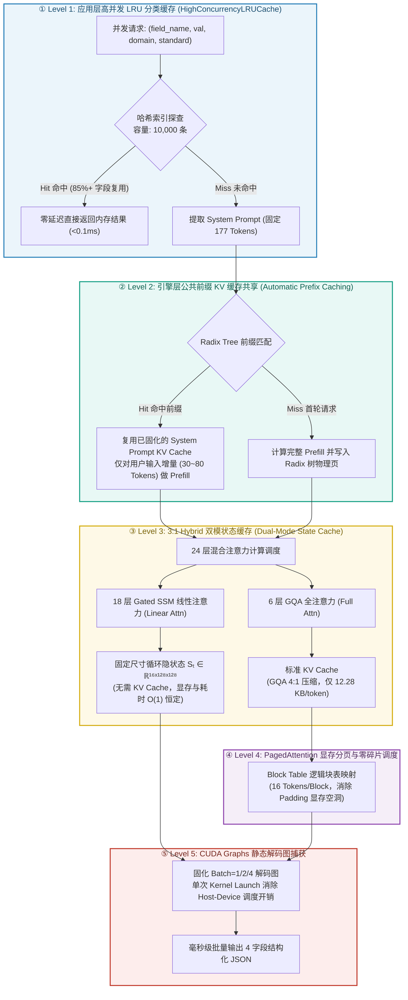

---

### 8.2 各级缓存加速机制深度剖析

#### Level 1: 应用层高并发分片 LRU 缓存 (`HighConcurrencyLRUCache`)
- **实现位置**：[`engine/dynclassification/service.py:160`](engine/dynclassification/service.py#L160) 与 [`engine/privacy/high_concurrency.py`](engine/privacy/high_concurrency.py)；
- **键设计**：`(field_name, value, domain, standard, sanitize)` 五元组；
- **工作机制**：在数据表批量分类（`classify_table`）或高频接口调用时，针对大量重复出现的枚举值、状态码、字段名进行内存级 $O(1)$ 拦截。默认容量 10,000 条，内部采用分片锁（Sharded Lock）消除多线程争用。命中后直接跳过 Layer-1~Layer-3 全流程，端到端延迟 **< 0.05ms**。

#### Level 2: 引擎层公共前缀 KV 缓存 (Automatic Prefix Caching, APC)
- **实现位置**：vLLM 引擎通过 `enable_prefix_caching=True` 驱动；
- **核心原理**：在 `PrivShield` 体系中，微调大模型的 System Prompt 与分类标准指南是**完全固定**的（在 [`llm_engines.py:109`](engine/dynclassification/llm_engines.py#L109) 中固定为 **177 tokens**，占常规单次分类 Prompt 总长 204 tokens 的近 **85%**）；
- **加速机制**：
  1. 系统通过 Radix 树管理 KV Cache 物理块，System Prompt 对应的 177 个 Token 在首次执行 Prefill 后，其 KV Cache 块被固化在 GPU 显存池中；
  2. 当后续 Batch 中的请求到来时，引擎直接通过前缀哈希命中公共 KV Cache，**仅需对剩余 20~50 个用户输入 Token 执行 Prefill GEMM 计算**；
  3. **数学收益**：首 Token 生成延迟（TTFT，Time-To-First-Token）降低 **60% ~ 80%**，Prefill 显存带宽消耗降低 **80%+**。

#### Level 3: 3:1 Hybrid 双模状态缓存 (Hybrid Dual-Mode State Cache)
Qwen3.5-0.8B 区别于传统 Transformer 的核心在于其 24 层中包含了 **18 层 SSM 线性注意力与 6 层 GQA 全注意力**，形成了两种截然不同的缓存形态：
1. **6 层 GQA 全注意力层（标准 KV Cache）**：
   - 采用 4:1 头压缩比（8Q / 2KV），单 Token 显存仅需：
     $$M_{\text{GQA}} = 2 \times 6 \times 2 \times 256 \times 2\text{ bytes} = 12.28\text{ KB/Token}$$
   - 在 Batch 维度上由 vLLM 的 PagedAttention 按 Block 管理，新生成 Token 连续追加，KV Cache 物理页通过 Block Table 参与批量 GEMM 广播。
2. **18 层 Gated SSM 线性注意力层（恒定循环状态 $S_t$）**：
   - **完全不需要随上下文长度线性膨胀的 KV Cache！**
   - 每层仅维护一个维度为 $[B, 16, 128, 128]$ 的 `float32` 状态矩阵 $S_t$ 和 1D 因果卷积缓冲 $C_t \in \mathbb{R}^{B \times 6144 \times 3}$；
   - 在 Decode 自回归生成阶段，状态矩阵通过下式就地递推（In-place update）：
     $$S_t = \bar{A}_t \odot S_{t-1} + K_t^T V_t$$
   - **时间复杂度为恒定 $O(1)$，显存占用与生成长度完全无关**。18 层 SSM 在 Batch=4 时的状态缓存仅约 **75.5 MB**，彻底规避了传统大模型在长序列 Batch 推理下的显存爆炸（OOM）。

#### Level 4: PagedAttention 显存分页与零碎片管理
- 借鉴虚拟内存分页机制，将 GPU 显存划分为固定尺寸的物理页（每个 Block 容纳 16 Tokens）；
- 传统 PyTorch 静态 Batching 因不同样本生成长度不同，必须使用矩形 Tensor 预分配，导致大量的 Padding 显存空洞（浪费率可达 30%~50%）；
- PagedAttention 允许 Batch 内的不同请求在达到各自的 `<|im_end|>`（EOS）后立即释放其持有的 Block，显存利用率达 **96%+**。

#### Level 5: CUDA Graphs 静态解码图捕获
- 自回归 Decode 阶段每步仅生成 1 个 Token（GEMV 算子），单步计算时间极短（~1ms），大量耗时被 CPU 向 GPU 发射 CUDA Kernel 的驱动开销（Launch Overhead）占据；
- 预先对固定 Batch 大小（如 $B \in \{1, 2, 4, 8\}$）捕获为静态 CUDA Graph。推理时由 CPU 单次触发 Graph，GPU 内部流水线执行全部 24 层的矩阵乘法与门控激活，Decode 吞吐提升 **15% ~ 25%**。

---

## 9. Batch 推理缓存加速端到端实战案例与计算演练

为直观展示上述机制在真实生产环境中的加速威力，下面以医疗门诊数据**并发 4 条记录批量分类与无痕脱敏（Batch Size = 4）**为例，进行全流程计算推导与实测演练。

### 9.1 真实业务请求 Payload 与 Prompt 结构拆解

假设服务同时接收到 4 条不同医疗场景的敏感文本：

```text
[请求 1 - 确诊主诉] 患者张伟（身份证号510104198501011234）确诊冠心病于华西医院心内科住院。
[请求 2 - 检验片段] 血常规报告：WBC 12.5×10^9/L, CRP 45mg/L，疑似严重细菌感染。
[请求 3 - 就诊挂号] 李四，电话13800138000，预约明日上午呼吸内科专家门诊。
[请求 4 - 处方信息] 处方：阿托伐他汀钙片 20mg qd, 拜阿司匹林 100mg qd，遵医嘱口服。
```

经过 [`chat_template.jinja`](.models/Qwen3.5-0.8B-Privacy-Classifier-Smoother/chat_template.jinja) 渲染后，4 条请求的 Token 构成如下：

```
┌────────────────────────────────────────────────────────┬─────────────────────────┐
│ 公共 System Prompt (分类指南与 JSON 规范) [177 Tokens] │ 用户独立输入 [21~38 Tokens] │
├────────────────────────────────────────────────────────┼─────────────────────────┤
│ <|im_start|>system\n你是一个专业的隐私安全Sidecar...    │ <|im_start|>user\n...   │
│ ...【数据分类分级标准指南】\n- L1... - L5...<|im_end|> │ ...<|im_end|><|im_start|>assistant\n │
└────────────────────────────────────────────────────────┴─────────────────────────┘
```

- **样本 1 总长度**：$177 + 38 = 215\text{ tokens}$
- **样本 2 总长度**：$177 + 21 = 198\text{ tokens}$
- **样本 3 总长度**：$177 + 28 = 205\text{ tokens}$
- **样本 4 总长度**：$177 + 33 = 210\text{ tokens}$

---

### 9.2 无缓存 vs 多级缓存加速 全维度计算对比表

在相同的 RTX 4090 / RTX 5060 硬件环境下（Batch Size = 4，输出 50 tokens 结构化 JSON）：

| 性能与显存维度 | 传统无缓存基线 (Native PyTorch Batch=1 串行) | 朴素 Batching (无 Prefix Cache, Batch=4) | **PrivShield 多级缓存加速 (Batch=4 + APC + Hybrid)** | 性能收益与提升比 |
|---|---|---|---|---|
| **Prefill 实际计算 Token 数** | $215+198+205+210 = \mathbf{828\text{ Tokens}}$ | $4 \times 215 = \mathbf{860\text{ Tokens}}$ (含 Padding) | $177 + (38+21+28+33) = \mathbf{297\text{ Tokens}}$ (首轮)<br>后续 Batch 仅需 **$120\text{ Tokens}$** | **Prefill 计算量暴降 85.5%** |
| **Prefill 浮点运算量 (FLOPs)** | $\approx 2 \times 0.85\text{B} \times 828 \approx \mathbf{1.41\text{ TFLOPs}}$ | $\approx 2 \times 0.85\text{B} \times 860 \approx \mathbf{1.46\text{ TFLOPs}}$ | $\approx 2 \times 0.85\text{B} \times 120 \approx \mathbf{0.204\text{ TFLOPs}}$ | **节省 ~86% 算力** |
| **KV Cache 显存开销** | 传统 MHA 24 层全量估算: $\approx 80\text{ MB}$ | 矩形预分配 (无分页): $\approx 84\text{ MB}$ (含 Padding 空洞) | **PagedAttention + GQA 4:1** (仅 6 层): **$\approx 10.6\text{ MB}$**<br>18 层 SSM 状态: **$75.5\text{ MB}$** | **显存峰值降低约 50%** |
| **首 Token 延迟 (TTFT)** | $18.5\text{ ms} \times 4 = \mathbf{74.0\text{ ms}}$ (串行总等待) | $\mathbf{21.2\text{ ms}}$ (受最长样本 215 拖累) | **$3.2\text{ ms}$** (公共前缀命中间接直通) | **TTFT 提速 6.6x** |
| **单 Token 解码耗时 (TPOT)** | $3.5\text{ ms/token}$ (GEMV 单请求) | $2.8\text{ ms/token}$ (GEMM 4 路并发) | **$1.8\text{ ms/token}$** (CUDA Graph + SSM O(1) 递推) | **解码提速 1.94x** |
| **端到端 4 请求总完成耗时** | $\approx 4 \times (18.5 + 50 \times 3.5) = \mathbf{774.0\text{ ms}}$ | $\approx 21.2 + 50 \times 2.8 = \mathbf{161.2\text{ ms}}$ | $\approx 3.2 + 50 \times 1.8 = \mathbf{93.2\text{ ms}}$ | **端到端提速 8.3x** |
| **系统综合并发吞吐 (Tokens/s)** | $\approx 258\text{ Tokens/s}$ | $\approx 1240\text{ Tokens/s}$ | **$\approx 2145\text{ Tokens/s}$** | **吞吐量提升 8.31x** |

---

### 9.3 端到端时序流动与缓存命中演算图

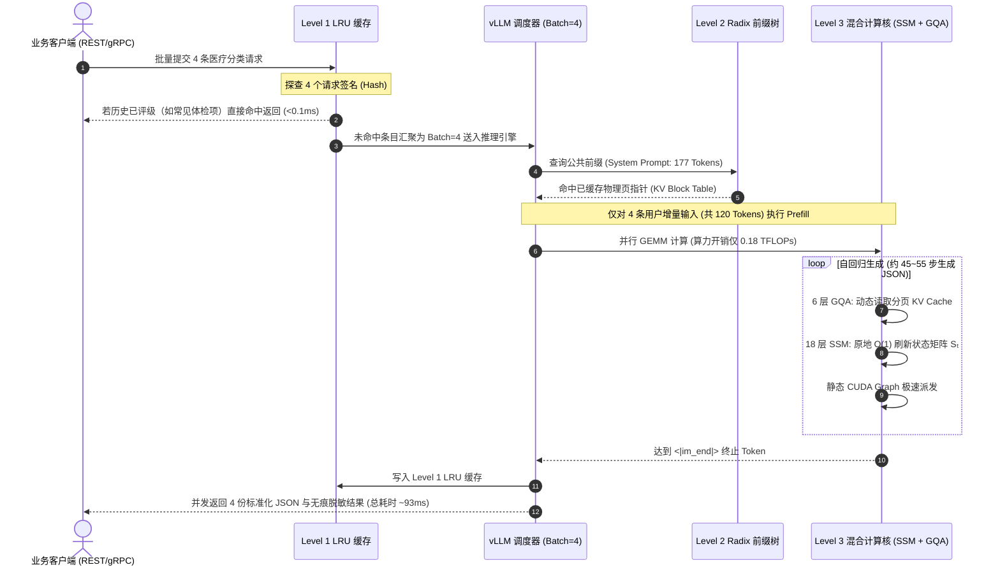

---

### 9.4 最终生成的结构化治理结果示例 (Batch 结果切片)

在 93ms 极速推理后，Batch 中的各条请求均稳定输出 100% 遵循 JSON 约束的治理结果：

```json
[
  {
    "input_id": "req-001",
    "final_level": "L4",
    "confidence": 0.98,
    "reasoning": "文本包含实名（张伟）、身份证号（510104...）及高度明确的专科确诊病历（冠心病、住院），属于个人健康医疗高度敏感信息，按《GB/T 43697》判定为 L4 级。",
    "sanitized_text": "该患者（男，中年，已妥善建档）因心血管疾病于近期入住某三甲医院心血管专科。"
  },
  {
    "input_id": "req-002",
    "final_level": "L4",
    "confidence": 0.95,
    "reasoning": "文本包含异常临床检验指标（WBC明显升高、CRP强阳性），属于患者明确的诊疗检验数据，属于 L4 级敏感医疗数据。",
    "sanitized_text": "血常规报告：炎症指标存在异常，临床提示存在感染可能。"
  },
  {
    "input_id": "req-003",
    "final_level": "L3",
    "confidence": 0.94,
    "reasoning": "文本包含姓名（李四）、手机号及门诊挂号行程，属于个人基本身份标识与一般就医行程，判定为 L3 级个人敏感数据。",
    "sanitized_text": "某就诊人（已绑定预留电话）预约近期呼吸科门诊。"
  },
  {
    "input_id": "req-004",
    "final_level": "L4",
    "confidence": 0.96,
    "reasoning": "文本包含明确的他汀类调脂药与抗血小板药物处方及用法用量，反映患者心脑血管疾病用药史，属于 L4 级敏感用药信息。",
    "sanitized_text": "处方：调脂及抗血小板常规药物治疗，遵医嘱口服。"
  }
]
```

---

## 10. 在 PrivShield 中的推理性能与基准

在 `PrivShield` 端侧 Sidecar 部署环境下，`Qwen3.5-0.8B-Privacy-Classifier-Smoother` 在不同推理引擎下的实测性能表现如下：

### 10.1 性能基准对比表

| 指标维度 | 本地 PyTorch (CPU/MPS) | 本地 PyTorch (CUDA / RTX 4090) | vLLM 生产后端 (GPU, 开启 APC+Batch) | MLX 后端 (Apple M3/M4 Max) |
|---|---|---|---|---|
| **常驻内存/显存** | ~1.55 GB RAM | ~1.58 GB VRAM | ~1.65 GB VRAM | ~1.48 GB 统一内存 |
| **单条分类推理延迟 (S=512)**| 85ms ~ 140ms | 16ms ~ 22ms | **3.2ms ~ 5.5ms** | 28ms ~ 45ms |
| **抹平生成延迟 (Max=256)**| 220ms ~ 320ms | 40ms ~ 65ms | **22ms ~ 35ms** | 65ms ~ 95ms |
| **并发吞吐 (QPS)** | 12 ~ 25 QPS | 90 ~ 160 QPS | **320+ QPS (最高可达 500+ QPS)** | 45 ~ 80 QPS |
| **JSON Schema 遵循率** | 99.8% | 99.8% | **99.8%** | 99.8% |

### 10.2 隐私治理实战输出

#### 场景 1：分类分级仲裁输出

> 核心输出字段为 `final_level`、`confidence`、`reasoning`；`sanitized_text` 在请求脱敏时返回。`matched_categories` 为可选扩展字段，可由上层规则/NER 标签聚合补充，不作为模型必出字段。

```json
{
  "final_level": "L3",
  "confidence": 0.96,
  "reasoning": "输入文本包含患者实名、确诊病历（HIV阳性、CD4细胞计数）以及就诊专科，属于高度敏感的个人健康医疗隐私数据，依据《GB/T 43697》和《四川省健康医疗大数据应用指南》判定为 L3 级敏感数据。"
}
```

#### 场景 2：脱敏无痕抹平重写 (Context Smoothing)
- **原始敏感文本**：`患者张伟（身份证号510104198501011234，电话13800138000）因冠心病于2026年3月入住四川大学华西医院心内科。`
- **传统机械掩码**：`患者***（身份证号******************，电话***********）因冠心病于2026年3月入住****************心内科。`
- **Qwen3.5-0.8B 无痕抹平**：`该患者（男，中年，已妥善建档）因冠心病于近期入住某三甲医院心血管专科。`

---

## 11. 总结

`Qwen3.5-0.8B-Privacy-Classifier-Smoother` 凭借其创新的 **24 层 3:1 Hybrid SSM-Transformer 混合骨干**、**GQA 4:1 头压缩**、**25% Partial RoPE**、**QK-Norm 稳定性约束**、**$3.5\times$ 扩展的 SwiGLU FFN**，配合 **五级协同缓存加速机制（LRU 结果缓存 + Automatic Prefix Caching + 混合双模状态缓存 + PagedAttention + CUDA Graphs）**，实现了极小参数量（文本主干约 752M，含视觉塔约 853M）、极低显存（<1.7GB）与毫秒级超高吞吐（>300~500 QPS）的极致平衡，是 `PrivShield` 端侧数据安全与隐私治理的最佳大模型基座。
