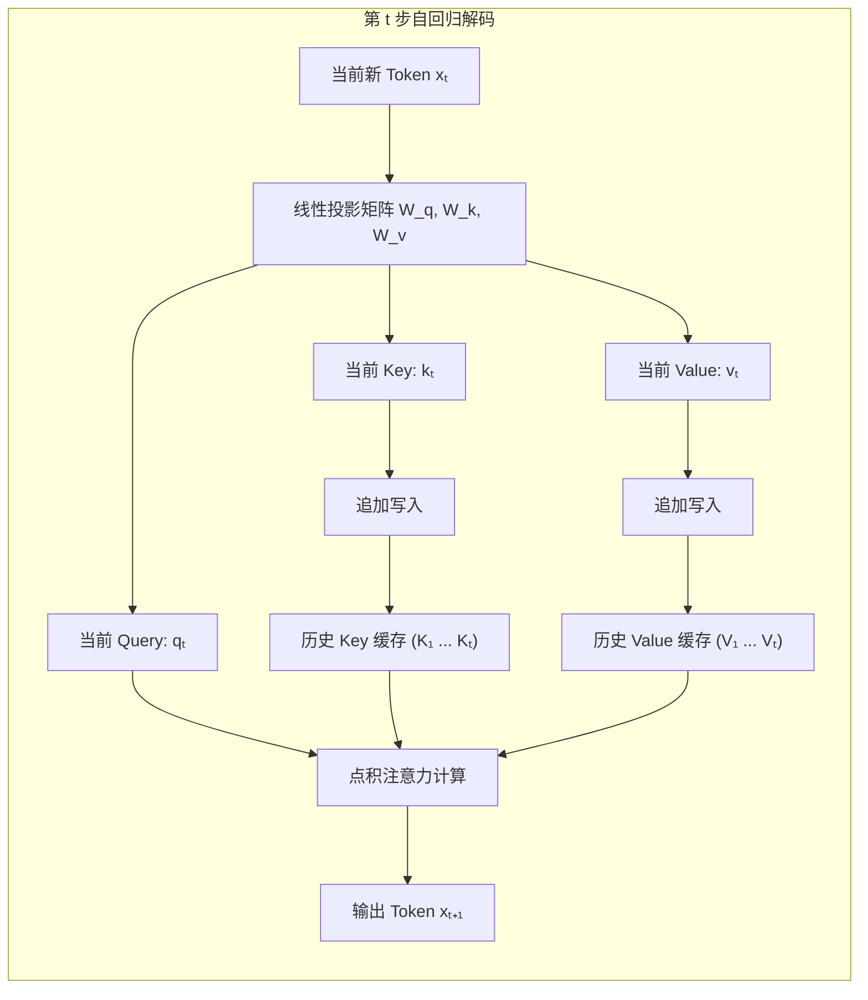
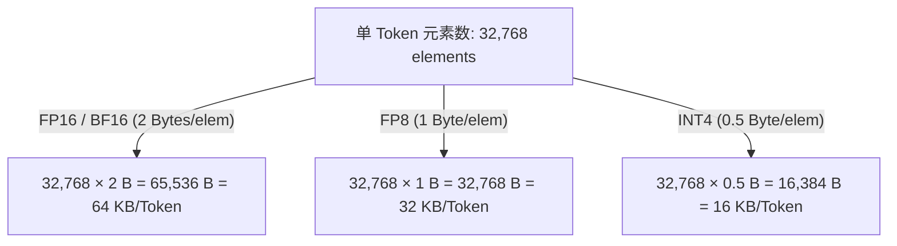
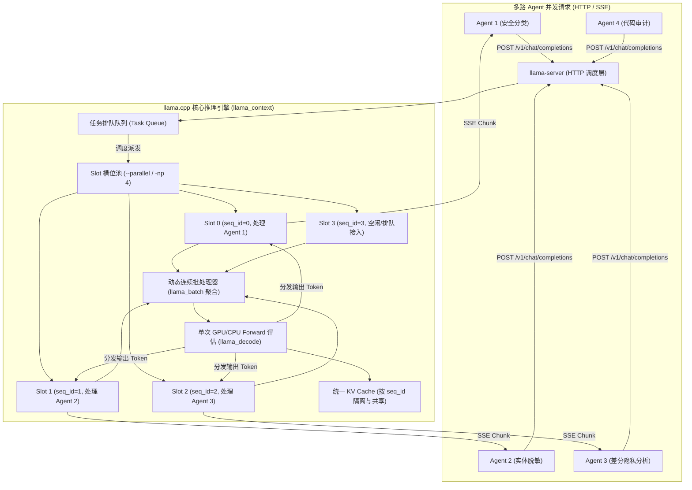
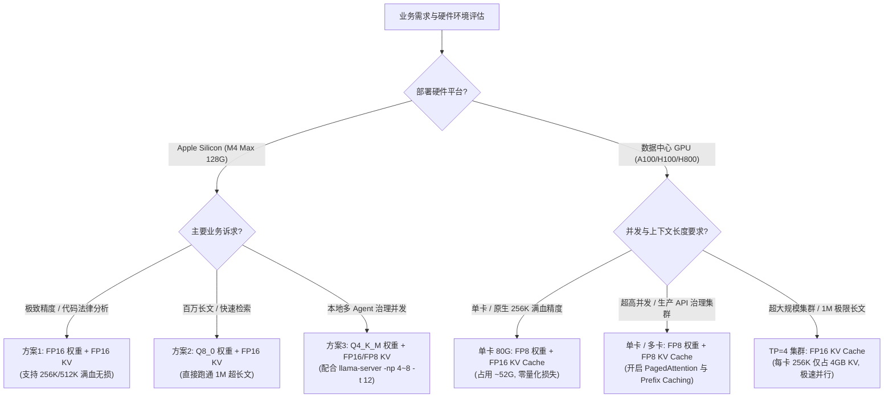

# Qwen3.8-27B 混合注意力架构 KV Cache 深度计算与内存规划指南

> 本文档详细解析 **Qwen3.8-27B**（及 3:1 混合注意力 SSM-Transformer 架构）在不同上下文长度、不同并发 Batch 以及不同精度（**FP16 / BF16**、**FP8**、**INT4**）下的 **KV Cache 显存开销精确计算方法与公式由来源头**，深入剖析 **llama.cpp 处理多路 Agent 并发请求的底层机理**，并针对 **生产级 GPU 服务端（A100/H100/H800）** 以及 **Apple MacBook Pro M4 Max（128GB 统一内存）** 提供全方位的性能调优、上下文配置方案与实战指南。
> 
> 相关架构设计可参考：[Qwen3.8-27B-FP8-architecture.md](docs/llmlora/Qwen3.8-27B-FP8-architecture.md)。

---

## 一、 KV Cache 的本质机理与计算公式的物理由来

### 1.1 为什么需要 KV Cache？（自回归解码的计算瓶颈）

大语言模型（LLM）的生成过程分为两个阶段：
1. **Prefill（预填充 / Prompt 处理阶段）**：
   一次性并行输入所有 Prompt Tokens（长度为 $S_{\text{prompt}}$），所有 Token 之间通过因果自注意力并行计算 $Q, K, V$，生成第一个预测 Token，并初始化各层的 Key 和 Value 向量。
2. **Decode（逐 Token 自回归解码阶段）**：
   模型每一步仅接收上一步生成的 **1 个新 Token** $x_t$，自回归地预测下一个 Token $x_{t+1}$。

在标准缩放点积注意力（Scaled Dot-Product Attention）中：
$$\text{Attention}(Q, K, V) = \text{softmax}\left(\frac{Q K^\top}{\sqrt{d_k}}\right) V$$

在第 $t$ 步生成时，当前 Token 必须与前文所有 $t$ 个历史 Token 计算注意力关联度：
$$\text{Output}_t = \text{softmax}\left(\frac{q_t [k_1, k_2, \dots, k_t]^\top}{\sqrt{d_k}}\right) \begin{bmatrix} v_1 \\ v_2 \\ \vdots \\ v_t \end{bmatrix}$$



#### 核心矛盾与空间换时间策略：
- **如果不做缓存 (No Cache)**：
  为了获得历史 Token 的 $k_1 \dots k_{t-1}$ 和 $v_1 \dots v_{t-1}$，每生成 1 个新 Token 都必须把前面所有的历史 Token 全部重新输入网络做一次完整前向传播。当生成序列长度为 $S$ 时，总计算复杂度将从 $O(S^2)$ 恶化至 **$O(S^3)$**，推理延迟会呈灾难性指数爆炸。
- **引入 KV Cache（空间换时间）**：
  将历史所有步计算出的 Key 向量与 Value 向量**常驻在显存（GPU VRAM / 统一内存）中**。每次 Decode 仅需对当前 1 个 Token 计算 $q_t, k_t, v_t$，并将 $k_t, v_t$ 追加存入缓存。计算复杂度成功降回 **$O(S)$**。

---

### 1.2 为什么只 Cache K 和 V，而不 Cache Q？

这是由注意力机制的计算拓扑特性决定的：
- **Query（查询向量 $q_t$）具有即时性**：
  在生成第 $t$ 个 Token 时，只需要用当前步的 $q_t \in \mathbb{R}^{1 \times d}$ 与历史所有 Key 进行内积，评估当前词对历史词的注意力权重。历史步的 $q_1, q_2, \dots, q_{t-1}$ 在过去步已经完成使命并被 Softmax 归约消耗，在后续生成中**永远不会再被访问**，因此随用随丢，无需缓存。
- **Key 与 Value 具有持久复用性**：
  后续每一个新生成的 Token（$t+1, t+2, \dots, S$）都需要回溯查询第 $1 \sim t$ 步的特征，因此历史的 Key 和 Value 必须全程保存在显存中，直到整个序列生成结束。

---

### 1.3 KV Cache 计算公式的逐项数学几何推导

单个 Token 在网络中产生的 KV Cache 存储元素（Elements）总数公式如下：

$$\text{Elements per Token} = \mathbf{2} \times \mathbf{N_{\text{full\_layers}}} \times \mathbf{n_{\text{kv\_heads}}} \times \mathbf{d_{\text{head}}}$$

每一项因子的物理与几何意义推导如下：

| 公式因子 | 物理 / 架构含义 | 在 Qwen3.8-27B 中的取值 | 由来源头与原理解析 |
|---|---|---|---|
| **$\mathbf{2}$** | **Key 与 Value 对称性** | **2** | 必须同时缓存 Key 向量（用于匹配注意力得分）和 Value 向量（用于特征加权聚合），两者维度完全相同，各占 1 份，故乘 2。 |
| **$\mathbf{N_{\text{full\_layers}}}$** | **有效全注意力层数** | **16** | 传统 64 层 Transformer 每层都需要 KV Cache ($N=64$)。而在 Qwen3.8 的 3:1 混合架构中，**48 层为 Gated DeltaNet (SSM)**，采用固定循环矩阵原地更新，**仅有 16 层 Gated Attention 全注意力层** 需要维护线性序列 KV Cache，因此层数因子为 16（直接立减 75%）。 |
| **$\mathbf{n_{\text{kv\_heads}}}$** | **KV 头的数量** | **4** | 采用 **分组查询注意力 (GQA)** 机制。模型共有 24 个 Query 头，按 6:1 分组共享 4 个 Key/Value 头（$n_{\text{kv\_heads}} = 4$），相比传统 MHA（24 个 KV 头）压缩了 6 倍。 |
| **$\mathbf{d_{\text{head}}}$** | **单头特征向量维度** | **256** | 每个注意力头的隐层向量长度（$d_{\text{head}} = 256$ 个浮点数）。 |

代入 Qwen3.8-27B 的具体架构参数：
$$\text{Elements per Token} = 2 \times 16 \times 4 \times 256 = \mathbf{32,768} \text{ 元素/Token}$$

---

### 1.4 从元素数量到显存字节数 (Dtype Bytes) 的换算推导

显存是以字节（Bytes）为物理单位进行分配的。单 Token 的显存开销取决于存储每个元素的数据类型（Precision / Dtype）：

$$\text{Bytes per Token} = \text{Elements per Token} \times \text{Bytes per Element}$$



#### 完整二进制单位换算过程（以 FP16 为例）：
1. **单 Token 字节数**：$32,768 \times 2\text{ Bytes} = 65,536\text{ Bytes}$。
2. **转换为 KB**（计算机二进制体系 $1\text{ KB} = 1024\text{ Bytes}$）：
   $$\frac{65,536\text{ Bytes}}{1024} = \mathbf{64\text{ KB/Token}}$$
3. **当序列长度 $S = 1,024$ (1K Tokens) 时**：
   $$1024 \times 64\text{ KB} = 65,536\text{ KB}$$
   $$\frac{65,536\text{ KB}}{1024} = \mathbf{64\text{ MB}}$$
4. **当序列长度 $S = 262,144$ (256K Tokens) 时**：
   $$262,144 \times 64\text{ KB} = 16,777,216\text{ KB} = 16,384\text{ MB} = \mathbf{16.00\text{ GB}}$$

---

### 1.5 全量 KV Cache 张量的内存物理形状 (Tensor Memory Layout)

在底层推理系统（如 vLLM PagedAttention、Hugging Face Transformers、MLX、llama.cpp）中，全局 KV Cache 在逻辑上对应的 5 维张量形状为：

$$\text{Key Cache Tensor Shape} = \left[ N_{\text{full\_layers}}, B, n_{\text{kv\_heads}}, S, d_{\text{head}} \right]$$
$$\text{Value Cache Tensor Shape} = \left[ N_{\text{full\_layers}}, B, n_{\text{kv\_heads}}, S, d_{\text{head}} \right]$$

- **批次大小 $B$ (Batch Size)**：当前正在并发处理的请求数。
- **序列长度 $S$ (Sequence Length)**：上下文总 Token 数量。

**总显存计算全量公式**：
$$\text{Total KV Cache (Bytes)} = 2 \times N_{\text{full\_layers}} \times B \times n_{\text{kv\_heads}} \times S \times d_{\text{head}} \times \text{BytesPerElem}$$

---

### 1.6 注意力架构演进对计算公式的影响对比

| 注意力机制架构 | 代表模型 | 全注意力层数 $N$ | KV 头数 $n_{\text{kv\_heads}}$ | 单 Token 元素数 (256 dim) | FP16 单 Token 显存 | 256K 上下文 KV 显存 ($B=1$) | 相对传统 MHA 压缩比 |
|---|---|---|---|---|---|---|---|
| **传统 MHA (多头注意力)** | GPT-3 175B / 早期模型 | 64 层 | 24 头 ($n_{\text{kv}} = n_{\text{q}}$) | $2 \times 64 \times 24 \times 256 = \mathbf{786,432}$ | **1,536 KB** (1.5 MB) | **384.00 GB** | 基准 (1x) |
| **标准 GQA (分组查询注意力)** | LLaMA-3 70B / Qwen2.5 | 64 层 | 4 头 ($n_{\text{kv}} = 4$) | $2 \times 64 \times 4 \times 256 = \mathbf{131,072}$ | **256 KB** (0.25 MB) | **64.00 GB** | **6x 压缩 (降低 83.3%)** |
| **MQA (多查询注意力)** | Falcon-40B | 64 层 | 1 头 ($n_{\text{kv}} = 1$) | $2 \times 64 \times 1 \times 256 = \mathbf{32,768}$ | **64 KB** | **16.00 GB** | 24x 压缩 (表达力有所折损) |
| **3:1 Hybrid GQA (本架构)** | **Qwen3.8-27B** | **16 层** | **4 头** ($n_{\text{kv}} = 4$) | $2 \times 16 \times 4 \times 256 = \mathbf{32,768}$ | **64 KB** | **16.00 GB** | **24x 压缩 (无损保留 GQA 表达力)** |

> [!TIP]
> **架构革新启示**：Qwen3.8-27B 巧妙地将 48 层改造为无需序列 KV Cache 的 Gated DeltaNet SSM 线性注意力，使得在保留了 GQA 4 个头丰富表达能力的同时，达成了与极端 MQA 相同的显存压缩效果（仅需 16 GB @ 256K），从底层消除了长文本显存墙。

---

## 二、 单 Batch ($B = 1$) 不同上下文长度的显存开销全景对照表

下表列出单请求 ($B=1$) 场景下，从短文本 (1K) 到极限长文本 (1M) 各精度 KV Cache 与 SSM 状态的占用对比：

| 上下文长度 (Tokens) | 常见业务场景 | FP16 / BF16 KV Cache<br>*(未量化满血精度)* | FP8 KV Cache<br>*(推荐生产精度)* | INT4 KV Cache<br>*(极限压缩)* | 48 层 SSM 恒定状态<br>*(固定 $O(1)$)* | FP16 总动态显存<br>*(KV + SSM)* | FP8 总动态显存<br>*(KV + SSM)* |
|---|---|---|---|---|---|---|---|
| **1K (1,024)** | 简短指令 / 实体提取 | **64 MB** | 32 MB | 16 MB | ~192 MB | 256 MB | 224 MB |
| **2K (2,048)** | 标准单轮问答 | **128 MB** | 64 MB | 32 MB | ~192 MB | 320 MB | 256 MB |
| **4K (4,096)** | 多轮对话 / 代码生成 | **256 MB** | 128 MB | 64 MB | ~192 MB | 448 MB | 320 MB |
| **8K (8,192)** | 中长文档摘要 / 日志分析 | **512 MB** | 256 MB | 128 MB | ~192 MB | 704 MB | 448 MB |
| **16K (16,384)** | 论文阅读 / 跨文件代码分析 | **1.00 GB** | 512 MB | 256 MB | ~192 MB | 1.19 GB | 704 MB |
| **32K (32,768)** | 复杂合同 / 财务年报分析 | **2.00 GB** | 1.00 GB | 512 MB | ~192 MB | 2.19 GB | 1.19 GB |
| **64K (65,536)** | 深度 RAG / 知识库多文档聚合 | **4.00 GB** | 2.00 GB | 1.00 GB | ~192 MB | 4.19 GB | 2.19 GB |
| **128K (131,072)** | 仓库级代码库理解 / 案卷审阅 | **8.00 GB** | 4.00 GB | 2.00 GB | ~192 MB | 8.19 GB | 4.19 GB |
| **256K (262,144)** | **模型原生最大上下文上限** | **16.00 GB** | **8.00 GB** | **4.00 GB** | ~192 MB | **16.19 GB** | **8.19 GB** |
| **512K (524,288)** | YaRN 外推超长上下文 | **32.00 GB** | 16.00 GB | 8.00 GB | ~192 MB | 32.19 GB | 16.19 GB |
| **1M (1,048,576)** | YaRN 百万级极限长上下文 | **64.00 GB** | 32.00 GB | 16.00 GB | ~192 MB | 64.19 GB | 32.19 GB |

> [!NOTE]
> 1. 数据换算采用标准二进制单位：$1\text{ GB} = 1024\text{ MB} = 1024 \times 1024\text{ KB}$。
> 2. 48 层 Gated DeltaNet 线性注意力隐状态大小为固定值 $\sim 192\text{ MB}$，无论上下文长度是 1K 还是 1M 均保持不变。

---

## 三、 高并发 Batch 场景显存开销矩阵

在生产部署（如 vLLM、SGLang、TGI）与多 Agent 协同治理服务中，并发 Batch 与序列长度共同决定显存消耗。

### 3.1 FP16 / BF16 KV Cache 显存矩阵 (64 KB / Token)

| 序列长度 ($S$) | Batch = 1 | Batch = 4 | Batch = 8 | Batch = 16 | Batch = 32 | Batch = 64 |
|---|---|---|---|---|---|---|
| **4K** | 256 MB | 1.00 GB | 2.00 GB | 4.00 GB | 8.00 GB | 16.00 GB |
| **8K** | 512 MB | 2.00 GB | 4.00 GB | 8.00 GB | 16.00 GB | 32.00 GB |
| **16K** | 1.00 GB | 4.00 GB | 8.00 GB | 16.00 GB | 32.00 GB | 64.00 GB |
| **32K** | 2.00 GB | 8.00 GB | 16.00 GB | 32.00 GB | 64.00 GB | 128.00 GB |
| **64K** | 4.00 GB | 16.00 GB | 32.00 GB | 64.00 GB | 128.00 GB | 256.00 GB |
| **128K** | 8.00 GB | 32.00 GB | 64.00 GB | 128.00 GB | 256.00 GB | 512.00 GB |
| **256K** | 16.00 GB | 64.00 GB | 128.00 GB | 256.00 GB | 512.00 GB | 1024.00 GB |

---

### 3.2 FP8 KV Cache 显存矩阵 (32 KB / Token)

| 序列长度 ($S$) | Batch = 1 | Batch = 4 | Batch = 8 | Batch = 16 | Batch = 32 | Batch = 64 |
|---|---|---|---|---|---|---|
| **4K** | 128 MB | 512 MB | 1.00 GB | 2.00 GB | 4.00 GB | 8.00 GB |
| **8K** | 256 MB | 1.00 GB | 2.00 GB | 4.00 GB | 8.00 GB | 16.00 GB |
| **16K** | 512 MB | 2.00 GB | 4.00 GB | 8.00 GB | 16.00 GB | 32.00 GB |
| **32K** | 1.00 GB | 4.00 GB | 8.00 GB | 16.00 GB | 32.00 GB | 64.00 GB |
| **64K** | 2.00 GB | 8.00 GB | 16.00 GB | 32.00 GB | 64.00 GB | 128.00 GB |
| **128K** | 4.00 GB | 16.00 GB | 32.00 GB | 64.00 GB | 128.00 GB | 256.00 GB |
| **256K** | 8.00 GB | 32.00 GB | 64.00 GB | 128.00 GB | 256.00 GB | 512.00 GB |

---

## 四、 FP16 上下文 KV Cache 深度计算与配置建议

### 4.1 为什么要使用 FP16 / BF16 KV Cache？

虽然 FP8 KV Cache 可以节省 50% 显存，但在以下场景中 **强烈推荐保持 FP16 / BF16 未量化 KV Cache**：

1. **零量化精度损失 (Lossless Attention)**：
   - 在 **超长上下文（64K ~ 256K）** 的复杂推理、代码仓库跨文件分析、长篇法律/金融合同审阅、数学证明等任务中，注意力得分（Softmax Attention Score）对微小量化误差极其敏感。FP8 的量化噪声在 16 层全注意力层叠加 256K 步后可能导致“大海捞针 (Needle In A Haystack)”检索召回率下降。
2. **零运行时反量化开销 (Zero Dequantization Overhead)**：
   - FP8 / INT4 KV Cache 在每次计算 Attention 时需要动态反量化为 FP16/FP32，或依赖特定量化 GEMM 算子。在内存带宽充足的硬件上（如 M4 Max 546 GB/s、H100 3.35 TB/s），FP16 KV Cache 能避免反量化计算延迟，实现极其平稳的 Decode Token 输出延迟。
3. **架构天然适配**：
   - 得益于 3:1 Hybrid 架构，Qwen3.8-27B 仅有 16 层需要 KV Cache。即使在 **256K 满血上下文** 下，FP16 KV Cache 也仅需 **16 GB**，单张 80GB GPU 或 128GB Mac 完全可以无压力承载，**无需为了显存妥协精度**。

---

### 4.2 生产级 GPU 服务端 (vLLM / SGLang) FP16 部署与调优参数

#### 1. 单卡 80GB (A100 / H100 / A800 / H800) 推理 256K FP16 KV 满血上下文：
- **模型 FP8 权重**：~28 GB
- **256K FP16 KV Cache**：16 GB (Batch=1)
- **48 层 SSM 状态 + 激活与 CUDA Graph 预留**：~8 GB
- **总静态与动态显存**：约 **52 GB**（完全处于 80GB 显存安全水位 65% 以内，留有充分余量容纳并发）。

```bash
# vLLM 生产启动命令（FP8 模型权重 + FP16/BF16 满血 KV Cache）
vllm serve Qwen/Qwen3.8-27B-FP8 \
  --dtype auto \
  --kv-cache-dtype bfloat16 \
  --max-model-len 262144 \
  --gpu-memory-utilization 0.90 \
  --enable-prefix-caching \
  --trust-remote-code
```

#### 2. 多卡张量并行 (Tensor Parallelism, TP) 显存分摊计算：
Qwen3.8-27B 的 GQA 配置为 4 个 KV 头，**天然推荐 `--tensor-parallel-size 4`**：
- **KV 头切分**：每张 GPU 承载 $4 \div 4 = 1$ 个 KV 头。
- **单卡单 Token KV 增量**：$64\text{ KB} \div 4 = \mathbf{16\text{ KB/Token}}$。
- **单卡 256K FP16 KV Cache**：仅需 **4.00 GB**！
- **单卡 1M (1024K) FP16 KV Cache**：仅需 **16.00 GB**！

在 4 卡 A100/H100 集群上，即使运行 100 万超长上下文，每张卡也仅需 16 GB KV Cache，整体系统具有极其恐怖的吞吐并发能力。

---

## 五、 MacBook Pro M4 Max (128GB) 统一内存配置与极限性能调优

Apple Silicon 架构采用 CPU 与 GPU 共享的 **统一内存架构 (Unified Memory Architecture, UMA)**，M4 Max 芯片（16 核 CPU + 40 核 GPU）具备高达 **546 GB/s** 的内存带宽。128GB 的超大统一内存为本地私密运行 27B 超长上下文模型提供了理想环境。

### 5.1 macOS 统一内存与显存机制

1. **默认 GPU 显存限制**：
   - 默认情况下，macOS Metal 限制单个进程/GPU 最多使用约 **75%** 的统一内存（128GB 机型上约为 **96 GB**），其余保留给系统和 CPU 进程。
2. **解锁显存上限 (推荐调优)**：
   - 如需运行接近极限的超长上下文（如 512K ~ 1M），可通过终端命令调高显存上限至 115 ~ 118 GB：
   ```bash
   # 临时调整显存分配上限为 118 GB (单位 MB)
   sudo sysctl iogpu.wired_mem_limit=118000
   ```

---

### 5.2 27B 模型在 M4 Max 128GB 上的三大配置方案

下表总结了针对不同需求场景在 128GB M4 Max 上的显存配置方案：

| 方案模式 | 模型权重格式 | 权重显存 | KV Cache 精度 | 256K 上下文总显存<br>*(权重+KV+SSM)* | 最大可支持上下文 | 推荐推理引擎 | 适用场景 |
|---|---|---|---|---|---|---|---|
| **方案 1：【满血浮点】** | **FP16 / BF16** | ~54 GB | **FP16 (64 KB/T)** | **~72.2 GB** | **512K (约 88.2 GB)** | MLX / llama.cpp | 极高精度分析、学术研究、法律代码深审 |
| **方案 2：【性能均衡】** *(推荐)* | **8-bit / Q8_0** | ~28 GB | **FP16 (64 KB/T)** | **~46.2 GB** | **1M (约 94.2 GB)** | MLX / llama.cpp / Ollama | 日常主力开发、长文档 RAG、百万长文精读 |
| **方案 3：【多 Agent 并发】** | **4-bit / Q4_K_M** | ~16 GB | **FP16 或 FP8** | **~34.2 GB** (FP16)<br>**~26.2 GB** (FP8) | **1M (约 50.2 GB)** | MLX / llama.cpp | PrivShield 治理网关多流并发、本地团队 API |

---

### 5.3 M4 Max 128GB 不同上下文与精度的显存占用对照表

*(注：系统运行开销估算为 2 GB，SSM 恒定为 0.2 GB)*

```
显存占用 (GB)
120 ┌────────────────────────────────────────────────────────── 物理内存上限 128G
    │                                                    [1M: 120.2G] (需调高上限)
100 ├─────────────────────────────────────── macOS 默认限制 96G ─
    │                                      [512K: 88.2G]   [1M (Q8+FP16): 94.2G]
 80 ├───────────────────────── [256K: 72.2G]
    │             [128K: 64.2G]
 60 ├─ [64K: 60.2G]
    │  (FP16权重+FP16 KV)
 40 ├───────────────────────────────────────── [256K (Q8+FP16): 46.2G]
    │                                          [256K (Q4+FP16): 34.2G]
 20 ├──────────────────────────────────────────────────────────
    └──────────────────────────────────────────────────────────
```

#### 详细数值分解：
1. **FP16 权重 (~54 GB) + FP16 KV Cache**：
   - **64K**：$54\text{ GB} + 4\text{ GB (KV)} + 0.2\text{ GB (SSM)} + 2\text{ GB} = \mathbf{60.2\text{ GB}}$（占用 47%，极速流畅）
   - **128K**：$54\text{ GB} + 8\text{ GB (KV)} + 0.2\text{ GB} + 2\text{ GB} = \mathbf{64.2\text{ GB}}$（占用 50%）
   - **256K (原生满血)**：$54\text{ GB} + 16\text{ GB (KV)} + 0.2\text{ GB} + 2\text{ GB} = \mathbf{72.2\text{ GB}}$（**远低于默认 96 GB 限制，单机完美运行！**）
   - **512K (外推)**：$54\text{ GB} + 32\text{ GB (KV)} + 0.2\text{ GB} + 2\text{ GB} = \mathbf{88.2\text{ GB}}$（处于 96 GB 安全线以内）
   - **1M (极限)**：$54\text{ GB} + 64\text{ GB (KV)} + 0.2\text{ GB} + 2\text{ GB} = \mathbf{120.2\text{ GB}}$（需执行 `sysctl iogpu.wired_mem_limit=122000`）

2. **Q8_0 权重 (~28 GB) + FP16 KV Cache**：
   - **256K**：$28\text{ GB} + 16\text{ GB} + 0.2\text{ GB} + 2\text{ GB} = \mathbf{46.2\text{ GB}}$（内存富余超 80 GB，可轻松跑双实例或高并发）
   - **1M**：$28\text{ GB} + 64\text{ GB} + 0.2\text{ GB} + 2\text{ GB} = \mathbf{94.2\text{ GB}}$（刚好完美落在默认 96 GB 显存限制内，无需任何系统修改即可跑通 100 万 Token！）

---

### 5.4 M4 Max (128GB) 深度性能调优指南（如何榨干硬件极致性能）

在 Apple Silicon M4 Max 上运行 27B 大模型时，推理性能（包括 Prefill 首字延迟 TTFT 与 Decode 每秒吞吐 Tokens/s）主要由 **内存带宽**、**Metal 算子效率** 以及 **CPU/GPU 核心调度** 决定。以下是关键的提速优化手段：

#### 1. 访存带宽瓶颈定律与量化速度换算
大模型自回归 Decode 阶段是典型的 **Memory-Bandwidth Bound（访存带宽受限）** 任务。每生成一个 Token，模型必须将全部权重从统一内存完整读取一遍。

**理论最大生成速率计算公式**：
$$\text{Decode Speed (Tokens/s)} \approx \frac{\text{Unified Memory Bandwidth (546 GB/s)}}{\text{Model Weight Size (GB)}}$$

| 量化等级 | 权重显存体积 | 理论生成速度上限 (546 GB/s) | M4 Max 实测吞吐 (单流) | 优化建议 |
|---|---|---|---|---|
| **FP16 / BF16** | ~54 GB | $\approx 10.1\text{ Tokens/s}$ | **8.5 ~ 9.8 Tokens/s** | 适合追求极致精度的单轮分析与研究。 |
| **Q8_0 / 8-bit** | ~28 GB | $\approx 19.5\text{ Tokens/s}$ | **17.5 ~ 19.0 Tokens/s** | **生产主力推荐**：速度翻倍，精度几乎无损。 |
| **Q4_K_M / 4-bit** | ~16 GB | $\approx 34.1\text{ Tokens/s}$ | **30.0 ~ 33.5 Tokens/s** | **极速推荐**：吞吐高，交互体验极佳。 |
| **Q4_0 (SIMD加速)** | ~15 GB | $\approx 36.4\text{ Tokens/s}$ | **34.0 ~ 37.0 Tokens/s** | 最高吞吐，适合高并发 Agent。 |

> [!TIP]
> **黄金法则**：在 M4 Max 128G 上，推荐采用 **“Q8_0 / Q4_K_M 模型权重 + FP16 KV Cache”** 的混合策略。权重低比特量化将访存读取量减半，使生成速度提升 2~3 倍；而 FP16 KV Cache 保证了注意力计算的 100% 精度无损。

#### 2. CPU 核心调度与线程绑核调优（避开 E-Core 拖尾陷阱）
M4 Max 芯片采用 **12 个性能核 (P-Cores) + 4 个能效核 (E-Cores)** 异构架构。
- **性能陷阱**：如果在 `llama.cpp` 中默认使用全部 16 线程（`-t 16`），线程同步屏障会被性能较弱的 4 个 E-Core 严重拖慢，导致长尾延迟大幅增加。
- **调优策略**：显式设置线程数 **`-t 12`**（严格对齐 12 个 P-Core），让所有并行计算由性能核全力完成，Prefill 速度可提升 **15% ~ 25%**，且消除生成速度抖动。

#### 3. macOS 系统级调优
- **开启高功率模式 (High Power Mode)**：
  在 macOS「系统设置」$\to$「电池」中，将电源模式设置为“高功率模式”。此模式下系统风扇策略更激进，能彻底防止高负载推理时的温度墙降频（Thermal Throttling）。
- **释放系统内存缓存**：
  在启动超长上下文推理前，清理 macOS 页面缓存，确保没有大型占用常驻：
  ```bash
  sudo purge
  ```

#### 4. 算子级优化（FlashAttention 与 Metal 编译）
- **必须开启 FlashAttention-2 (`--flash-attn`)**：
  在上下文大于 16K 时，传统 Attention 算子的显存 I/O 呈二次方爆炸。开启 Metal 优化的 FlashAttention-2 后，Attention 计算阶段的访存量降低 80% 以上，不仅节省数 GB 动态显存碎片，更将 128K 长文本的 Prefill 速度提升 **2 ~ 3 倍**。
- **使用零拷贝内存映射 (`--mmap`)**：
  开启 `--mmap` 避免将模型从磁盘重复拷贝至内存，加载时间由几十秒缩减为 1 秒以内，由 macOS 内核按需换页。

---

### 5.5 M4 Max 本地推理实战启动命令

#### 1. MLX 原生框架部署 (Apple 官方 Metal 框架，原生支持动态图与统一内存)
```bash
# 安装最新版 MLX-LM
pip install -U mlx-lm

# 开启 MLX 编译缓存加速
export MLX_CACHE_ENABLED=1

# 启动本地 OpenAI 兼容服务
python -m mlx_lm.server \
  --model Qwen/Qwen3.8-27B-FP8 \
  --port 8080 \
  --max-tokens 8192
```

#### 2. llama.cpp 高性能极限优化启动命令
```bash
./llama-server \
  -m ./models/qwen3.8-27b-q8_0.gguf \
  -c 262144 \
  -t 12 \
  -b 2048 \
  -ub 512 \
  --flash-attn \
  -ctk f16 \
  -ctv f16 \
  --mmap \
  --cache-prompt \
  -ngl 99 \
  --host 0.0.0.0 \
  --port 8080
```
- `-t 12`：精准绑定 12 个 P-Core 性能核。
- `-ngl 99`：全量 64 层 GPU 卸载。
- `--flash-attn`：启用 Metal 级 FlashAttention。
- `-ctk f16 -ctv f16`：保持 FP16 无损 KV Cache。

---

## 六、 llama.cpp 处理多路 Agent 并发请求的底层机理与配置实战

在多 Agent 协同治理（如 PrivShield 的安全分类 Agent、脱敏 Agent、差分隐私 Agent）场景中，`llama.cpp`（主要是其服务组件 `llama-server` 与底层 `llama_context`）通过一套精密的 **Slot 槽位状态机**、**连续批处理（Continuous Batching）** 与 **`seq_id` 虚拟隔离的统一 KV Cache 架构** 来高效处理并发请求。



---

### 6.1 Slot 槽位池与状态机调度

- **槽位数量配置**：通过 `-np` 或 `--parallel` 参数指定（例如 `-np 4` 表示开启 4 个并发槽位）。
- **每个 Slot 独立维护生命周期状态机**：
  - `IDLE`（空闲）：槽位处于就绪状态，等待从队列中抓取新请求。
  - `PROCESSING_PROMPT`（Prefill 阶段）：正在处理该 Agent 发送的 Prompt 提示词。
  - `GENERATING`（Decode 阶段）：自回归逐 Token 生成文本。
  - `DONE`：遇到终止符 (EOS)、达到 `max_tokens` 或客户端断开连接，立即释放槽位。
- **排队与抢占**：若 4 个 Slot 全部繁忙，后续到达的 Agent 请求进入阻塞队列，一旦有 Slot 变为 `DONE`，立即以微秒级延迟接入下一个 Agent。

---

### 6.2 连续批处理 (Continuous Batching / In-flight Batching)

传统静态批处理要求所有并发请求“同进同出”，而不同 Agent 发送的 Prompt 长度与输出长度千差万别。

`llama.cpp` 实现了 **迭代级连续批处理（Iteration-level Scheduling）**：
- 在每个 Decode 迭代步中，调度器从所有活跃 Slot 中汇总当前待评估的 Token，组装成一个单一的 `llama_batch`：
  - **Slot 0 (Agent 1)**：处于 Prefill 阶段，贡献 128 个 Prompt Tokens。
  - **Slot 1 (Agent 2)**：处于 Decode 阶段，贡献 1 个新生成的 Token。
  - **Slot 2 (Agent 3)**：处于 Decode 阶段，贡献 1 个新生成的 Token。
- **单次大矩阵乘法（Batched GEMM）**：GPU (Metal / CUDA) 一次性计算这 $128 + 1 + 1 = 130$ 个 Token，极大提高硬件算力利用率与内存带宽吞吐。
- 计算完毕后，将对应的 Logits 分发回各 Slot 独立执行采样（Sampling）。

---

### 6.3 统一 KV Cache 与 `seq_id` 序列隔离

`llama.cpp` **不会**为每个 Slot 分配孤立的独立显存块，而是维护一个全局连续的 **KV Cache Cell 数组**：

$$\text{KV Cell 结构体} = \{ \text{pos},\ \text{seq\_id\_set},\ \text{Key\_Tensor},\ \text{Value\_Tensor} \}$$

- **`seq_id` 逻辑隔离**：
  - Agent 1 对应 `seq_id = 0`，其生成的 KV 单元标记为 `seq_id=0`。
  - Agent 2 对应 `seq_id = 1`，其生成的 KV 单元标记为 `seq_id=1`。
- **自注意力掩码过滤**：在执行 Attention 计算时，底层算子根据当前 Token 的 `seq_id` 进行位掩码过滤，**Agent 1 永远无法检索到 Agent 2 的 KV 向量**，确保了进程内多租户与多 Agent 的数据安全隔离。

---

### 6.4 多 Agent 共享 System Prompt 前缀缓存 (Prefix Caching)

在 Multi-Agent 架构中，多个 Agent 通常拥有相同的系统预设（如数盾规则集、角色背景、Function Calling Schema 等）。

`llama.cpp` 支持高效的 **Prompt 缓存与序列复制**：
- **`--cache-prompt` 与前缀哈希比对**：
  当 Agent 2 发送请求时，`llama-server` 会快速检索 KV Cache 中已存在的 Prompt 前缀哈希。
- **零显存复制复用**：
  若命中已缓存的 System Prompt（例如前 1,000 个 Token 一致），系统**无需重新执行 1,000 个 Token 的 Prefill 矩阵乘法**，直接将这 1,000 个 KV 单元绑定至 `seq_id = 1`，首字延迟（TTFT）暴降 90% 以上。

---

### 6.5 上下文空间分配与显存规划 (`-c` 与 `-np`)

```text
全局 KV Cache 空间 (-c 65536)
┌───────────────────────────────────────────────────────────────────┐
│ Slot 0 (Agent 1)  │ Slot 1 (Agent 2)  │ Slot 2 (Agent 3)  │ 剩余动态池 │
│ [ 0 ~ 16K Tokens ]│ [ 0 ~ 8K Tokens ] │ [ 0 ~ 12K Tokens ]│ 29.5K      │
└───────────────────────────────────────────────────────────────────┘
```

- **参数约束**：`-c` 表示整个服务进程分配的 **全局总 KV Token 池容量**。
- **动态共享**：在开启连续批处理时，各 Slot 动态共享该池子。当设置 `-c 65536 -np 4` 时，单个 Agent 在其他 Slot 空闲时最多可使用全部 64K 上下文；高并发时则平摊共享。

---

### 6.6 多 Agent 高并发生产级启动参数推荐

以下以 **MacBook Pro M4 Max (128GB)** 或 **Linux GPU 服务器** 部署 4 路 Agent 并发服务为例：

```bash
./llama-server \
  -m ./models/qwen3.8-27b-q8_0.gguf \
  -c 65536 \
  -np 4 \
  -t 12 \
  -b 2048 \
  -ub 512 \
  --flash-attn \
  -ctk f16 \
  -ctv f16 \
  --cache-prompt \
  --mmap \
  -ngl 99 \
  --host 0.0.0.0 \
  --port 8080
```

#### 核心参数生产调优清单：
| 参数 | 推荐值 | 作用与多 Agent 优化意义 |
|---|---|---|
| `-np` (`--parallel`) | `4` ~ `8` | **并发 Slot 槽位数**，决定同时能处理多少个 Agent 的并行推理。 |
| `-t` (`--threads`) | `12` | **绑定 12 个 P-Core 性能核**，避开 E-Core 同步拖尾，提升 Prefill 吞吐。 |
| `-c` (`--ctx-size`) | `65536` | **全局总 KV Token 池**。4 个 Agent 并发时，平均每路可享 16K 长度。 |
| `-b` (`--batch-size`) | `2048` | **逻辑批处理大小**。支持多个 Agent 同时发起长 Prompt 注入。 |
| `-ub` (`--ubatch-size`) | `512` | **物理微批次**。控制单次提交给 GPU 的计算颗粒度，防止显存峰值抖动。 |
| `--flash-attn` | 开启 | **FlashAttention 算子**。显著降低多路并发时的注意力显存占用与计算延迟。 |
| `--cache-prompt` | 开启 | **开启 Prompt 缓存**。多 Agent 共享 System Prompt 时避免重复计算。 |
| `-ctk f16 -ctv f16` | `f16` | **FP16 满血 KV Cache**。保证多 Agent 在复杂代码、数据分类时的零量化损失。 |
| `-ngl` (`--n-gpu-layers`) | `99` | **GPU 全量卸载**。将全部 64 层完全加载进 Metal/CUDA。 |

---

## 七、 48 层 Gated DeltaNet 线性注意力的隐状态开销

与纯 Transformer 架构不同，Qwen3.8-27B 中 **75% 的层（48层）** 为 Gated DeltaNet 线性注意力：

### 7.1 递推显存机制
在自回归 Decode 生成阶段，线性注意力不随 Token 步数追加历史序列，而是通过原地刷新循环递推状态矩阵（Recurrent State）：

$$S_t = A_t \odot S_{t-1} + B_t \cdot (K_t^\top V_t)$$

每个请求仅在内存中维持当前步的隐状态矩阵 $S_t$。

### 7.2 隐状态显存精确计算
- **单层 QK 状态**：$16 \times 128 \times 128 \times 4\text{ Bytes (Float32)} = \mathbf{1\text{ MB}}$
- **单层 V 状态**：$48 \times 128 \times 128 \times 4\text{ Bytes (Float32)} = \mathbf{3\text{ MB}}$
- **单层合计**：$1\text{ MB} + 3\text{ MB} = \mathbf{4\text{ MB}}$
- **48 层累计总状态**：
  $$48 \times 4\text{ MB} = \mathbf{192\text{ MB} \approx 0.19\text{ GB}}$$

> 无论上下文是 1K、256K 还是 1M，该显存**恒定不变**（$O(1)$ 复杂度）。

---

## 八、 架构级 KV Cache 显存优势对比分析

以 **256K 原生超长上下文 ($B = 1$)** 为例，对比传统 64 层架构的显存消耗：

```mermaid
gantt
    title 256K 上下文 KV Cache 显存占用对比 (GB)
    dateFormat X
    axisFormat %s GB

    section 传统 64层 MHA (24头, FP16)
    384 GB : 0, 384

    section 标准 64层 GQA (4头, FP16)
    64 GB : 0, 64

    section 标准 64层 GQA (4头, FP8)
    32 GB : 0, 32

    section Qwen3.8 3:1 Hybrid (16层 GQA, FP16)
    16 GB (暴降 75%~96%) : 0, 16

    section Qwen3.8 3:1 Hybrid (16层 GQA, FP8)
    8 GB (暴降 87.5%~98%) : 0, 8
```



### 显存压缩收益总结：
1. **对比 64 层传统 MHA（24 头全注意力）**：
   - 传统 MHA 在 256K 下需要 **384 GB** 显存（即便 8 卡集群也难以容纳单请求）。
   - Qwen3.8-27B FP16 KV 仅需 **16 GB**，显存降幅达 **95.8%**（压缩 24 倍）；FP8 仅需 **8 GB**，显存降幅达 **97.9%**（压缩 48 倍）。
2. **对比 64 层标准 GQA（4 头全注意力）**：
   - 标准 GQA 需要 64 GB (FP16) / 32 GB (FP8)。
   - Qwen3.8 由于 75% 的层转为 SSM，KV Cache 显存**在此基础上再降低 75%（4 倍降幅）**。

---

## 九、 总结与选型决策指南



无论是生产级 GPU 集群还是 MacBook Pro M4 Max 128GB 工作站，Qwen3.8-27B 的 3:1 Hybrid 混合架构配合 `llama.cpp` 的连续批处理、前缀缓存与 P-Core 性能核调度优化，均打破了长上下文与并发开销的传统瓶颈，使 **256K ~ 1M 满血长上下文** 与 **高并发多 Agent 协同** 在单机与私有化环境中高效落地成为现实。