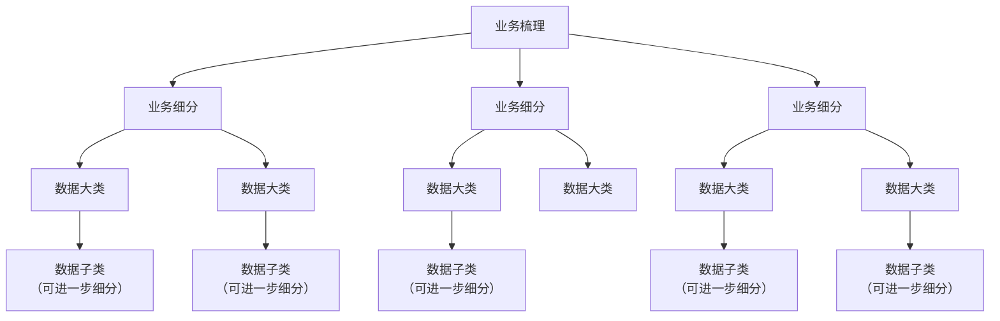
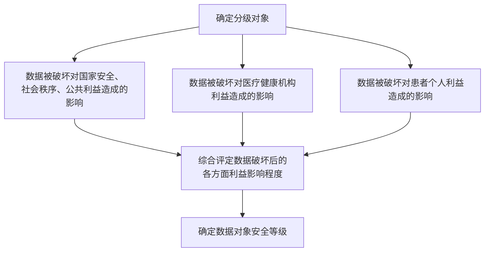

# 广东省健康医疗数据安全分类分级管理技术规范

> **标准编号**：T/GDWJ 013—2022  
> **英文名称**：Technical specification for categorization and classification of health data security  
> **发布日期**：2022-07-15 | **实施日期**：2022-07-15  
> **发布单位**：广东省卫生经济学会  

---

## 前言

本文件按照 GB/T 1.1—2020《标准化工作导则 第1部分：标准化文件的结构和起草规则》的规定起草。

请注意本文件的其他内容可能涉及专利，本文件的发布机构不承担识别这些专利的责任。

本文件由广东省卫生经济学会提出并归口。

本文件主要起草单位：东莞市卫生信息统计中心、中山大学附属口腔医院、深圳市中医院、东莞市人民医院、中山大学附属第三医院、广州医科大学附属口腔医院、广州医科大学附属第二医院、南方医科大学第三附属医院、广州市第十二人民医院、暨南大学附属顺德医院、连州市医疗总院、广州市急救医疗指挥中心、东莞市第六人民医院、广东网安科技有限公司、北京中安星云软件技术有限公司、工业和信息化部电子第五研究所、中国电信股份有限公司广东分公司、北京天融信网络安全技术有限公司、深圳昂楷科技有限公司、北京嘉和美康信息技术有限公司、杭州美创科技有限公司、上海柯林布瑞信息技术有限公司、上海米健信息技术有限公司。

本文件主要起草人：熊劲光、郑金、陈惠城、魏书山、陆慧菁、高峰、李永强、曾睿、林建权、范伟、唐雄伟、张晓东、邝允成、吴庆斌、邓意恒、查正清、陈炳坤、张家庆、陈涛、刘永波、柳遵梁、王景保。

---

## 1 范围

本文件给出了健康医疗数据控制者在保护健康医疗数据时可采取的管理和技术措施。

本文件适用于指导健康医疗数据控制者对健康医疗数据进行安全保护，也可供医疗健康管理机构、网络安全相关主管部门以及第三方评估机构等组织开展健康医疗数据的安全监督管理与评估等工作时参考。

## 2 规范性引用文件

下列文件对于本标准的应用是必不可少的。凡是标注日期的引用文件，仅标注日期的版本适用于本标准。凡是不标注日期的引用文件，其最新版本（包括所有的修改单）适用于本标准。

- GB/T 25069—2010 信息技术 安全技术 术语
- GB/T 35273—2017 信息安全技术 个人信息安全规范
- GB/T 37964—2019 信息安全技术 个人信息去标识化指南
- GB/T 39725—2020 信息安全技术 健康医疗数据安全指南
- GB/T 10113—2003 分类与编码通用术语
- YD/T 3813—2020 基础电信企业数据分类分级方法

## 3 术语和定义

GB/T 25069—2010 中界定的以及下列术语和定义适用于本标准。

### 3.1 个人健康医疗信息 personal health information

能够单独或者与其他信息结合识别特定自然人或者反映特定自然人生理或心理健康相关信息，涉及个人过去、现在或将来的身体或精神健康状况、接受的医疗保健服务和支付的医疗保健服务费用等。

注：个人健康医疗信息可能包括：

a) 提供健康医疗服务时登记的个人信息；  
b) 出于健康医疗目的，例如治疗、支付或保健护理等，分配给个人的唯一标识号码或符号等；  
c) 在向个人提供健康医疗服务过程中收集的有关个人的任何信息，例如既往病史、社会史、家族史、症状和生活方式等各类病历记载的信息，也包括基因信息以及测序的信息；  
d) 来自身体部位或身体物质，例如组织、体液、血、尿、便、气体、生物大分子、DNA、RNA 等检查或检验的结果信息；  
e) 可穿戴设备采集的与个人健康相关的信息，并且该种信息：  
   1) 本身或者明显为健康医疗相关信息；  
   2) 或是由传感器采集的，并且可以单独或者与其他数据结合用来对可穿戴设备的用户的健康状况或者疾病风险进行判断的信息；  
   3) 或是可穿戴设备采集的信息并且为对用户的健康状况或者疾病风险进行判断后的结论；  
   4) 或是通过可穿戴设备相连的 APP 或者系统进行传送的，并非可穿戴设备使用者另行提供的；  
f) 接受的健康医疗服务相关信息，例如检验检查医嘱、诊断、操作、药物、医疗效果等；  
g) 为个人提供健康医疗服务的服务者身份信息；  
h) 关于个人的支付或医保相关信息。

### 3.2 健康医疗信息 health information

包括个人健康医疗信息以及由个人健康医疗信息加工处理之后得到的健康医疗相关信息。

示例：人口健康信息。

### 3.3 个人健康医疗信息主体 personal health information subject

个人健康医疗信息所标识的个人。

### 3.4 公共卫生数据 public health data

是指关系到国家或地区大众健康的公共事业相关数据。公共卫生数据由于涉及众多个人健康数据的整合，而可能会被归入健康医疗领域的重要数据，甚至不排除特定情况下会构成国家核心数据。

### 3.5 健康医疗信息控制者 health information controller

能决定健康医疗信息处理目的、方式等的组织或个人，包括提供健康医疗服务的组织、医保机构或公司、政府机构、健康医疗科学研究机构等，其以电子形式传输或处理健康医疗信息。

### 3.6 缩略语

下列缩略语适用于本文件。

- **ACL**：访问控制列表（Access Control Lists）
- **EDC**：电子数据采集（Electronic Data Collect）
- **GCP**：临床试验规范标准（Good Clinical Practice）
- **HIS**：医院信息系统（Hospital Information Systems）
- **HIV**：艾滋病病毒（Human Immunodeficiency Virus）
- **ICD10**：国际疾病分类（International Classification Of Disease 10）
- **ID**：身份证件（Identity）
- **IP**：互联网协议（Internet Protocol）
- **IPSEC**：网际协议安全（Internet Protocol Security）
- **IT**：信息技术（Information Technology）
- **LDS**：受限制数据集（Limited Data Set Files）
- **PC**：个人电脑（Personal Computer）
- **PDCA**：规划-实施-检查-改进（plan-do-check-action cycle）
- **PIN**：个人识别号码（Personal Identity Number）
- **PKI**：公钥基础设施（Public Key Infrastructure）
- **PUF**：公用数据集（Public Use Files）
- **RFID**：射频识别（Radio Frequency Identification）
- **RIF**：可识别数据集（Research Identifiable Files）
- **TLS**：传输层安全（Transport Layer Security）
- **USB**：通用串行总线（Universal Serial Bus）
- **VPN**：虚拟私人网络（Virtual Private Network）

## 4 数据分类分级原则

数据分类分级宜遵循以下原则：

a) **合法性合规性原则**：数据分类分级应满足国家法律法规及行业主管部门相关规定；  
b) **综合性原则**：执行数据分类分级时，应结合数据的应用场景、组合、取值、数据量的大小等，力求数据分类分级准确合理；  
c) **规范性原则**：所采用的数据类目名称能够确切表达该数据分类的实际内容范围，内涵、外延情况；在表达相同的概念时，保证用语一致性；在不影响数据类目涵义表达的情况下，保证用语简洁性。在医疗健康行业已有统一数据用语的情况下，使用统一数据用语；  
d) **可执行性原则**：数据分类分级规则制定宜避免过于复杂，保证可执行性；  
e) **稳定性原则**：宜选择分类对象最稳定的特性作为数据分类的基础和依据；  
f) **明确性原则**：数据类目间应界限分明。当数据类目不能明确各自界限时，可以用注释来加以明确；  
g) **时效性原则**：数据的分级具有一定的有效期，由于数据项或数据项集合与业务应用场景有关，因此在不同应用场景下，数据的级别也会发生变化；  
h) **自主性原则**：组织可根据自身的数据管理需要，例如业务需要、对风险的接受程度等，按照数据分类原则进行分类之后，按照数据分级方法自主确定更多的数据层级，但不宜将高敏感度数据定为低敏感度级别；  
i) **就高不就低原则**：不同级别的数据被同时处理、应用时且无法精细化管控时，应按照其中级别最高的要求来实施保护；  
j) **关联叠加效应原则**：对于非敏感数据关联后可能产生敏感数据的场景，关联后的数据级别应高于原始数据。

## 5 分类分级流程

### 5.1 建立数据分类分级组织保障

数据分类分级工作的开展需要有组织保障，应明确：

a) 应明确数据分类分级的决策机构和最高责任人。决策机构负统筹和决策职责，决策数据分类分级工作的目标、内容、标准规范等。决策机构的最高责任人对数据分类分级工作负全面领导责任。  
b) 应明确数据分类分级的牵头部门。牵头部门负责牵头推动数据分类分级工作的开展，牵头部门负责按照决策机构议定的工作目标和要求开展数据分类分级工作，牵头制定企业数据分类分级管理办法、制度、流程、标准规范，协调解决分类分级工作中的问题，牵头进行数据分类分级工作的评价。  
c) 应明确数据分类分级的实施部门，实施部门负责本部门数据分类分级的具体实施工作，具体包括：按照牵头部门制定的制度、流程、规范等梳理本部门的数据资源，并提交给牵头部门。实施部门包括医院各业务科室和信息技术部门，业务科室包括行政、急诊、门诊、住院、药房、技生、体检中心、理疗中心、采购、财务等支撑医院运转的部门。

### 5.2 建立数据分类分级制度保障

数据分类分级工作的开展需要有制度保障，应明确：

a) 数据分类分级的总体要求；  
b) 数据分类分级的相关制度、规范、标准、工作流程等的制定、发布、维护和更新的机制以及评审和修订周期；  
c) 数据分类分级管理相关绩效考评和评价机制；  
d) 数据资产分类分级清单的确立、审核、修订周期和原则；  
e) 数据分类分级保护的总体原则和目标；  
f) 操作人员的操作规程。

### 5.3 数据资源梳理

牵头部门应牵头全面梳理医疗健康机构内部的所有数据资源，业务部门和技术部门配合数据梳理工作，梳理的内容包括以物理或电子形式记录的数据表、数据项、数据文件等，明确数据梳理的要求，包括数据内容描述、数据量、保存位置、保存期限、数据处理情况（数据处理目的、数据处理所涉及的信息系统）、数据对外提供情况（共享转让、公开披露、数据出境）、数据生命周期各环节安全措施配套情况等内容。

a) 应对重要医疗支撑信息系统的业务流程进行分析，绘制业务流程图。  
b) 应根据业务流程，梳理每个业务节点所产生的数据资源。  
c) 应明确业务节点的数据资源的访问对象、访问权限、处理单元、存储单元、传输单元等。  
d) 应对每个部门的所有数据资源进行逻辑汇聚，对所有部门的数据集合，进行合并然后统一列表，形成数据资源列表。

### 5.4 建立数据资源目录

对每个部门的所有数据资源进行逻辑汇聚，对所有部门的数据集合，进行合并然后统一列表，形成数据资源列表。

### 5.5 对数据资源分类

根据健康医疗数据自身管理特点，按照树形结构，建立数据资源分类目录树。并将整理后的数据资源列表对应到目录树，确定数据资源列表中每个数据项在目录树中所在的位置，即确定该数据项的数据类型。

### 5.6 对数据资源分级

根据健康医疗数据重要程度和敏感程度，确定数据资源的安全等级。

### 5.7 数据分类分级标识

应根据数据分类分级方法，采用人工与技术手段相结合的方法，实现数据资源的梳理与分类分级，并进行数据分类分级标识。

### 5.8 建立数据分类分级清单

应根据数据分类分级情况对数据资源进行分类分级标识后，输出企业的数据分类分级清单。清单内容至少包括所属部门、所在系统、数据类型、安全等级、内容描述、数据量、保存位置、保存期限、数据处理情况（数据处理目的、数据处理所涉及的信息系统）、数据对外提供情况（共享转让、公开披露、数据出境）、数据生命周期各环节安全措施配套情况等。且应建设必要的网络数据资源清单管理技术手段，确保网络数据资源清单内容覆盖全面、信息真实完整。

## 6 数据分类分级方法

### 6.1 数据分类方法

数据分类按照 GB/T 10113 中的线分类法为基础结合业务信息，根据医疗健康机构业务运营特点和内部管理方法，收集机构内所有部门的数据资源，梳理所有数据资源。按照线分类法，按照业务属性（或特征），将健康医疗数据分为若干数据大类，然后按照大类内部的数据隶属逻辑关系，将每个大类的数据分为若干层级，每个层级分为若干子类，同一分支的同层级子类之间构成并列关系，不同层级子类之间构成隶属关系。所有数据类及数据子类构成数据资源目录树，如图下所示。目录树的所有叶子节点是最小数据类。最小数据类是指属性（或特征）相同或相似的一组数据。

*图 1 数据分类方法*

附录 A 给出了健康医疗数据安全分类示例。

### 6.2 数据分级方法

在数据分类基础上，根据健康医疗数据重要程度以及泄露后对国家安全、社会秩序、医疗机构经营管理和公众利益造成的影响和危害程度，对健康医疗数据资源进行分级。数据分级的步骤和方法宜采用下图：

*图 2 数据分级的步骤和方法*

a) **确定数据分级对象**  
   数据分级对象可以是最小数据类，也可以是最小数据类之下的具体数据字段。

b) **确定数据安全受到破坏时造成影响的客体**  
   数据的安全属性（机密性、完整性、可用性）遭到破坏时造成的影响的客体包括：国家安全、社会公共利益、健康医疗机构利益和个人健康医疗信息主体利益。

   1) **对国家安全和社会公共利益的影响**：应考虑数据一旦未经授权披露、丢失、滥用、篡改、销毁，可能造成的后果对国家安全和社会公共利益的影响程度。  
   2) **对健康医疗机构利益的影响**：应考虑如下 3 个方面：  
      - **业务影响**：应考虑数据安全事件发生后对生产业务造成的影响。  
      - **财务影响**：应考虑数据安全事件发生后导致的财务损失。包括：直接损失（收入受损、缴纳罚款、赔偿金或其他资源损失等）和恢复成本（比如恢复数据、恢复业务、消除影响等涉及的资金或人工成本等）。  
      - **声誉影响**：应考虑数据安全事件发生后被外界所知所造成的声誉受损。  
   3) **对个人健康医疗信息主体利益的影响**：应考虑个人健康医疗信息一旦发生安全事件后，对个人财产、声誉、生活状态以及生理和心理等方面产生的影响。

**表 1 数据分级影响程度参照表**

| 影响类别 | 影响程度判定原则 | 影响程度 |
| :--- | :--- | :---: |
| **对国家安全和社会公共利益的影响** | 对国家安全和社会公共利益构成特别严重威胁。数据涵盖范围涉及全国。 | 严重 |
| | 对国家安全和社会公共利益构成严重威胁。数据涵盖范围涉及多省市。 | 高 |
| | 对国家安全和社会公共利益造成较严重威胁。数据涵盖省市。 | 中 |
| | 对国家安全和社会公共利益造成一定影响。 | 低 |
| **对医疗健康机构利益影响** | 导致全部业务无法开展，造成特别严重经济损失，或对全国大量用户产生负面影响；对企业利益和声誉构成特别严重威胁、对用户信任度造成特别严重影响。 | 严重 |
| | 导致部分业务无法开展，造成严重经济损失，或对多省用户产生负面影响；对企业利益和声誉构成严重威胁、对用户信任度造成严重影响。 | 高 |
| | 导致个别业务短时无法开展，造成一定程度的经济损失，或对某地市用户产生负面影响。对企业利益和声誉构成一定程度威胁、造成一定程度影响，对用户信任度造成一定程度影响。 | 中 |
| | 造成轻微经济损失，不影响业务稳定。 | 低 |
| **对患者个人利益的影响** | 患者可能会遭受重大的，不可消除的，可能无法克服的影响。如遭受无法承担的债务、失去工作能力、导致长期的心理或生理疾病、导致死亡等。 | 严重 |
| | 患者可能遭受重大影响，克服难度高，消除影响代价大。如遭受诈骗、资金被盗用、被银行列入黑名单、信用评分受损、名誉受损、造成歧视、被解雇、被法院传唤、健康状况恶化等。 | 高 |
| | 患者可能会遭受较严重的困扰，且克服困扰存在一定的难度。如付出额外成本、无法使用应提供的服务、造成误解、产生害怕和紧张的情绪、导致较小的生理疾病等。 | 中 |
| | 患者可能会遭受一定程度的困扰，但尚可以克服。如被占用额外的时间、被打扰、产生厌烦和恼怒情绪等。 | 低 |

c) **评定对影响客体的影响程度**  
   将分级对象对照数据分级影响程度参照表进行映射，判断分级对象发生丢失、泄露、被篡改、被损毁等安全事件时对影响客体的侵害程度。

d) **确定数据分级对象的安全等级**  
   根据数据对象对客体的影响程度，取影响程度中的最高影响等级为该数据对象的重要敏感程度。

附录 B 给出了健康医疗数据安全分级示例。

## 7 数据分级安全保护要求

### 7.1 总体要求

根据数据资源的分类分级情况，在数据生命周期的各个环节配套差异化的安全保护措施，应遵循如下管控要点：

a) 根据数据分类分级管理制度对数据进行分类分级标识。对于在数据库中存储的高安全级别数据（如第4级、第3级数据），标记应细化至数据库表的字段级，其他级别数据采用的标记宜细化到数据库表的字段级。若出现任何没有分级标识的数据，其默认安全控制等级为最高安全等级。  
b) 原则上未经过脱敏处理的数据不可降级使用，若确有需要，应执行严格的授权审批流程，并对降级使用数据进行全过程审计。数据使用完毕后，恢复至原安全级别。  
c) 数据传输过程中，若涉及高安全级别数据（如第4级、第3级数据）应对数据报文进行加密，并采取措施（如数字签名、MAC 等），以保证数据传输的机密性和完整性。  
d) 在使用数据或披露前，涉及高安全级别数据的，应采用数据脱敏技术，确保数据使用、对外披露等场景的脱敏。  
e) 对于个人敏感信息的安全管控，还应满足 GB/T 35273 中对个人敏感信息的安全管控要求。

### 7.2 数据分级安全保护具体要求

数据安全保护要求分为通用要求、技术要求和管理要求三部分，其中通用要求规定了概括性、整体性的数据安全保护要求，技术要求规定了数据全生命周期的安全保护技术要求，管理要求规定了数据安全相关的组织机构、人员以及活动的安全保护管理要求。

各部分具体要求应符合附录 D 的规定。

---

## 附录 A（资料性附录）数据分类示例

| 数据大类 | 子类 | 内容 |
| :--- | :--- | :--- |
| **个人属性数据** | 人口统计信息 | 姓名、出生日期、性别、民族、国籍、职业、住址、工作单位、家庭成员信息、联系人信息、收入、婚姻状态等 |
| | 个人身份信息 | 姓名、身份证、工作证、居住证、社保卡、可识别个人的影像图像、健康卡号、住院号、各类检查检验相关单号等 |
| | 个人通讯信息 | 个人电话号码、邮箱、账号及关联信息等 |
| | 个人生物识别信息 | 基因、指纹、声纹、掌纹、耳廓、虹膜、面部特征等 |
| | 个人信用记录信息 | 个人信用档案、个人信用评分、个人信用报告等 |
| **个人健康状况数据** | — | 主诉、现病史、既往病史、体格检查（体征）、家族史、症状、检验检查数据、遗传咨询数据、可穿戴设备采集的健康相关数据、生活方式、基因测序、转录产物测序、蛋白质分析测定、代谢小分子检测、人体微生物检测等。 |
| **医疗应用数据** | — | 门（急）诊病历、住院医嘱、检查检验报告、用药信息、病程记录、手术记录、麻醉记录、输血记录、护理记录、入院记录、出院小结、转诊（院）记录、知情告知信息等 |
| **医疗资金和支付数据** | 医疗交易信息 | 支付信息、消费金额、交易记录等 |
| | 保险信息 | 保险账号、保险状态、保险金额等 |
| **卫生资源数据** | 医院基本数据 | 医疗机构名称、医疗机构类别、医院学科门类、床位数、医院地址、电话等 |
| | 医院运营数据 | 人力资源、财务数据、物资数据、后勤数据、基础运行数据等 |
| **公共卫生数据** | 传染病疫情数据 | 病名、发病人数、发病率、死亡人数、死亡率、发病数据排名、死亡数据排名等 |
| | 疾病监测数据 | 传染病监测、非传染病流行病学监测等 |
| | 疾病预防数据 | 疫苗、应接种人数、实接种人数等 |
| | 出生死亡数据 | 出生人数、出生率、死亡人数、死亡率、自然增长数、自然增长率等 |

## 附录 B（资料性附录）数据分级示例

| 数据大类 | 子类 | 内容 | 数据级别 |
| :--- | :--- | :--- | :---: |
| **个人属性数据** | 人口统计信息 | 姓名、出生日期、性别、民族、国籍、职业、住址、工作单位、家庭成员信息、联系人信息、收入、婚姻状态等 | 4 |
| | 个人身份信息 | 姓名、身份证、工作证、居住证、社保卡、可识别个人的影像图像、健康卡号、住院号、各类检查检验相关单号等 | 4 |
| | 个人通讯信息 | 个人电话号码、邮箱、账号及关联信息等 | 4 |
| | 个人生物识别信息 | 基因、指纹、声纹、掌纹、耳廓、虹膜、面部特征等 | 4 |
| | 个人信用记录信息 | 个人信用档案、个人信用评分、个人信用报告等 | 4 |
| **个人健康状况数据** | 主诉 | 主诉、症状代码编码体系名称、症状代码、症状开始日期时间、症状停止日期时间、症状描述、症状急性程度代码、严重程度代码、初诊标志等 | 4 |
| | 现病史 | 起病时间、起病节气归属代码、起病情况描述、症状开始原因/诱因、症状特点、伴随症状、本疾病既往诊疗经过、起病后一般情况、基础疾病诊疗情况 | 4 |
| | 既往病史 | 既往观察-项目名称、既往观察-项目分类代码、既往观察-项目代码名称、既往观察-项目代码、既往观察-方法代码、既往观察-结果、既往史观察项目类目名称、既往史观察结果等 | 4 |
| | 家族史 | 家族史观察项目类目名称、家族史观察结果等 | 4 |
| | 过敏史 | 过敏史、过敏原、过敏症状、过敏症状代码、过敏原代码、过敏药物名称、过敏病情状态代码、过敏严重性代码、过敏史代码等 | 4 |
| | … | … | — |
| **医疗应用数据** | 门（急）诊病历 | 医疗机构组织机构代码、门（急）诊号、科室名称、患者姓名、性别、出生日期、年龄、过敏史标志、过敏史、就诊日期时间、初诊标志、主诉、现病史、既往史、体格检查等 | 4 |
| | 住院医嘱 | 住院号、患者姓名、性别、年龄、体重、病区名称、科室名称、病床号、病房号、医嘱类别代码、医嘱开立者签名、医嘱计划开始时间、医嘱计划结束时间、医嘱项目类型、医嘱项目、电子申请单编号、收费项目等 | 3 |
| | 检查检验报告 | 检查记录：门（急）诊号、住院号、检查报告单编号、电子申请单编号、患者姓名、性别、年龄、联系人电话号码、科室名称、病区名称、病床号、病房号、主诉、症状开始日期时间、症状停止日期时间、症状描述、操作标志、操作代码等；检验记录：门（急）诊号、住院号、检验报告单编号、电子申请单编号、患者姓名、患者类型、性别、年龄、科室名称、病区名称、病房号、病床号、检验申请机构、检验申请科室、检验方法名称、检验项目名称、检验类别、检验项目代码、检验结果代码、检验定量结果等 | 3 |
| | 用药信息 | 药物用法、药物使用-频率、药物使用-剂量单位、药物使用-次剂量、药物使用-总剂量、药物使用-途径代码、药物名称、药物剂型代码、中药类别代码、药物类型、药物名称代码、中药煎煮法代码等 | 2 |
| | 病程记录 | 病程记录类别、病程记录内容、治疗类别代码等 | 3 |
| | 手术记录 | 门（急）诊号、住院号、电子申请单编号、科室名称、病区名称、病房号、病床号、手术间编号、患者姓名、性别、年龄、术前诊断、术后诊断、手术开始日期时间、手术结束日期时间、手术/操作代码、手术名称、手术级别、手术目标部位名称、手术日期时间、介入物名称、手术体位代码、手术过程描述、手术标志、手术切口描述等 | 3 |
| | … | … | — |
| **医疗资金和支付数据** | 医疗交易信息 | 支付信息、消费金额、交易记录等 | 3 |
| | 保险信息 | 保险账号、保险状态、保险金额等 | 4 |
| **卫生资源数据** | 医院基本数据 | 医疗机构名称、医疗机构类别、医院学科门类、床位数、医院地址、电话等 | 1 |
| | 医院运营数据 | 人力资源、财务数据、物资数据、后勤数据、基础运行数据等 | 3 |
| **公共卫生数据** | 传染病疫情数据 | 病名、发病人数、发病率、死亡人数、死亡率、发病数据排名、死亡数据排名等 | 1 |
| | 疾病监测数据 | 传染病监测：(1)人口学资料；(2)传染病发病和死亡及其分布；(3)病原体型别、毒力、耐药性变异情况；(4)人群免疫水平的测定；(5)动物宿主和媒介昆虫种群分布及病原体携带状况；(6)传播动力学及其影响因素的调查；(7)防治措施效果的评价；(8)疫情预测；(9)专题调查（如暴发调查、漏报调查等）等。 | 4 |
| | | 非传染病流行病学监测：(1)人口学资料；(2)非传染病发病和死亡及其分布；(3)人群生活方式和行为危险因素监测；(4)地理、环境和社会人文（包括经济）因素的监测；(5)饮食、营养因素的调查；(6)基因型及遗传背景因素的监测；(7)高危人群的确定；(8)预防和干预措施效果的评价。 | 4 |
| | 疾病预防数据 | 疫苗、应接种人数、实接种人数等 | 1 |
| | 出生死亡数据 | 出生人数、出生率、死亡人数、死亡率、自然增长数、自然增长率等 | 1 |

## 附录 C（资料性附录）数据分类分级标识方法

| 类型 | 标记方法 | 描述 | 使用场景 |
| :--- | :--- | :--- | :--- |
| **嵌入式（不可分离）标识符** | 加密 | 分级标签与信息融合加密 | 推广研究阶段，使用范围有限 |
| | 信息隐藏 | 包括隐写术、数字水印、可视密码等，将分级信息写入到原始数据中。 | 主要用于非结构化文件 |
| | 指纹 | 一种用于应用系统文件标识方法，指纹一般为哈希值。 | 常见办公文件溯源 |
| **可分离标识符** | 标签 | 业务系统/应用系统内对数据内容或对其他进行标记的标签信息 | Salesforce 等应用 |
| | 数据库扩展数据结构 | 增加分级属性到数据库内的数据结构 | 主要用于结构化数据分级 |
| | 元数据增加数据项 | 增加分级属性到元数据项中 | 主要用于数据中台数据标记 |
| | 索引 | 建立含有分级标识的索引 | 主要用于结构化数据分级 |

## 附录 D（规范性）数据分级安全保护管理要求

健康医疗数据安全保护应遵循国家监管部门和行业部门指导和监管的原则，落实数据保护的主体责任和监管职责。应遵循国家网络安全等级保护、大数据安全相关法律法规及标准规范要求。根据数据级别采取相应的管理措施和技术手段对数据采集、汇聚、传输、存储、加工、共享、开放、使用、销毁等环节进行有针对性的保护，个人信息、敏感数据和重要数据要加强安全管控措施。

| 管控域 | 安全要求项 | 一级 | 二级 | 三级 | 四级 |
| :--- | :--- | :---: | :---: | :---: | :---: |
| **C1 安全策略** | a) 应建立健康医疗数据安全管理策略，对健康医疗数据全生命周期的操作规范、保护措施、管理人员职责等进行规定，包括但不限于数据存储策略、数据加解密策略、数据脱敏策略、数据溯源策略、数据导入导出策略、数据共享开放策略、数据销毁策略等。 | ○ | ○ | ○ | ○ |
| | b) 应制定并执行数据分级保护策略，针对不同级别的数据制定不同的安全保护措施。 | ○ | ○ | ○ | ○ |
| | c) 应在数据分级的基础上，划分个人信息、敏感数据和重要数据范围，明确进行脱敏或去标识的使用场景和业务处理流程。 | | ○ | ○ | ○ |
| | d) 应定期评审数据的类别和级别，如需要变更数据的类别或级别，应依据变更审批流程执行变更。 | | | ○ | ○ |
| **C2 安全机构** | a) 应设立数据安全管理的职能部门，设立数据管理员等负责人岗位，明确部门职能和岗位职责。 | ○ | ○ | ○ | ○ |
| | b) 应成立指导和管理数据安全工作的委员会或领导小组，其最高领导由单位主管领导担任或授权。 | | ○ | ○ | ○ |
| | c) 应设立数据审计员、数据安全员等负责人岗位，明确部门职能和岗位职责。 | | ○ | ○ | ○ |
| | d) 应设立数据保护官，负责对个人信息、敏感数据和重要数据进行保护。 | | ○ | ○ | ○ |
| | e) 应配备专职的数据安全员，不可兼任。 | | | | ○ |
| | f) 应明确内部涉及个人信息处理的各岗位安全责任，当发生安全事件时能够进行相应的处罚。 | | | | ○ |
| **C3 安全人员** | a) 应定期开展针对各岗位人员的数据安全相关的安全知识和技能培训，并进行考核。 | ○ | ○ | ○ | ○ |
| | b) 应定期开展针对各岗位人员的数据安全相关管理规范、流程、制度培训，并进行考核。 | | ○ | ○ | ○ |
| | c) 应加强对外部单位技术人员和外协人员的安全管理，必要时应签署保密协议，不得进行非授权操作，不得泄露、篡改、丢失和滥用数据。 | | ○ | ○ | ○ |
| **C4 安全审核** | a) 应建立数据安全审核制度，明确数据安全审核的目的、内容和流程。应明确并建立对数据安全策略、访问控制变更、数据分级变更、通道安全配置、密码算法配置、秘钥管理等保护措施的管理流程和审核机制。 | ○ | ○ | ○ | ○ |
| | b) 应明确并建立对数据汇聚、共享、开放、使用、备份、存档、销毁等相关操作的安全管理流程和审核机制。 | | ○ | ○ | ○ |
| | c) 应定期对接触个人信息、敏感数据和重要数据的人员进行安全审查、背景审查，对其操作日志进行分析，一旦发现违规行为，应根据严重程度采取相应的惩戒措施。 | | | | ○ |
| | d) 应对个人信息的重要操作（如进行批量修改、拷贝、下载等重要操作）进行安全审查，确保个人信息使用的安全性。 | | ○ | ○ | ○ |
| | e) 应对数据导出操作进行安全审查，确保导出过程的规范性和安全性。 | | | ○ | ○ |
| **C5 分级和备案** | a) 应以书面的形式说明数据的安全级别及确定级别的方法和理由。 | ○ | ○ | ○ | ○ |
| | b) 应组织相关部门的有关安全技术专家对数据分级结果的合理性和正确性进行论证和审定。 | ○ | ○ | ○ | ○ |
| | c) 应将数据分级备案材料报主管部门备案。 | ○ | ○ | ○ | ○ |
| | d) 应将数据共享、开放备案材料报主管部门备案。 | | ○ | ○ | ○ |
| | e) 应将数据不共享、不开放备案材料报主管部门备案。 | | | | ○ |
| **C6 检查和考核** | a) 应定期进行常规安全检查，检查内容包括但不限于平台日常运行、管理员日常操作、平台漏洞和数据备份等。 | ○ | ○ | ○ | ○ |
| | b) 应制定安全检查表格实施安全检查，汇总安全检查数据，形成安全检查报告，并对安全检查结果进行通报。 | | ○ | ○ | ○ |
| | c) 应定期对数据安全管理各方面的内容进行全面安全检查，检查内容包括但不限于制度体系建设情况、安全策略执行情况、数据安全防护状况等内容。 | | | ○ | ○ |
| | d) 应将安全检查结果纳入部门年度考核范围。 | | | ○ | ○ |
| **C7 安全评估** | a) 应对汇聚的数据进行安全评估，确保数据来源合法、质量可靠、不涉及国家秘密。 | ○ | ○ | ○ | ○ |
| | b) 应对数据的加工、分析、共享、开放、使用、备份、存档、销毁等过程进行安全评估，确保过程的规范性和安全性，防止个人信息、敏感数据和重要数据的泄露、篡改、丢失和滥用。 | | ○ | ○ | ○ |
| | c) 应定期对信息系统安全状况和数据安全保护情况进行评估，发现安全问题及时整改。 | ○ | ○ | ○ | ○ |
| | d) 应在信息系统发生重大变更时对当前的数据安全保护情况进行评估，对不符合或不适用情况进行整改。 | | | ○ | ○ |
| | e) 应在数据级别发生变化时对当前的数据安全保护情况进行评估，对不符合或不适用情况进行整改。 | | ○ | ○ | ○ |
| | f) 涉及数据跨境传输的，应对其合规性和安全性进行评估，评估通过后才可进行相应操作。 | | ○ | ○ | ○ |
| | g) 涉及在中华人民共和国境内运营中收集和产生的个人信息向境外提供的，应符合国家网信部门会同国务院有关部门制定的办法和相关标准的要求。 | | | ○ | ○ |
| | h) 应在管理制度中明确数据的对外共享和开放，定期进行安全评估，及时发现和制止违规行为。 | | ○ | ○ | ○ |
| | i) 应对多人操作行为进行安全评估，确保单人无法独立完成整个操作活动。 | | | | ○ |
| | j) 应对高风险操作可能对平台和数据造成的影响进行评估，评估通过后才可进行相应操作。 | | | | ○ |
| **C8 应急处置** | a) 应明确数据相关安全事件的上报和处置流程。 | ○ | ○ | ○ | ○ |
| | b) 应制定专门的应急预案，明确应急流程和人员分工，并定期开展应急演练。 | | ○ | ○ | ○ |
| | c) 应制定个人信息安全事件应急预案，明确应急流程和人员分工，并定期开展应急演练。 | | | | ○ |
| | d) 应采取技术措施实现实时安全预警，并及时处理发现的攻击事件或安全问题。 | | | ○ | ○ |
| | e) 应采用态势感知等相关技术，实现对平台或系统潜在安全风险尤其是 APT 等攻击行为的识别、分析和预警。 | | | | ○ |
| **C9 安全监管** | a1) 应对数据安全相关的制度、策略、流程的落实情况进行监督，对发现的问题进行督促整改。 | ○ | | | |
| | a2) 应建立数据安全监督管理机制，对本机构数据安全相关的制度、策略、流程的落实情况进行监督和管理，对发现的问题进行督促整改，对落实不力的情况进行惩戒。 | | ○ | ○ | ○ |
| | b) 应积极接受并主动配合上级主管部门定期对本机构数据安全落实情况以及本机构数据安全保护情况进行监督和管理，并对发现的问题进行整改。 | | ○ | ○ | ○ |

## 附录 E（规范性）数据分级安全保护通用要求

| 维度 | 安全要求项 | 一级 | 二级 | 三级 | 四级 |
| :--- | :--- | :---: | :---: | :---: | :---: |
| **1、平台安全** | a1) 承载健康医疗数据的信息系统和网络设施以及云平台等应不低于等级保护一级的要求。 | ○ | | | |
| | a2) 承载健康医疗数据的信息系统和网络设施以及云平台等应不低于等级保护二级的要求。 | | ○ | | |
| | a3) 承载健康医疗数据的信息系统和网络设施以及云平台等应不低于等级保护三级的要求。 | | | ○ | ○ |
| **2、数据资产管理** | a) 应通过技术工具执行数据资产的登记，建立便于查询的数据资产清单，并能够及时更新数据资产相关信息。 | ○ | ○ | ○ | ○ |
| | b) 应通过技术工具自动梳理数据目录清单，建立便于查询的数据目录清单，并能够及时更新数据资产表、字段、数据量等相关信息。 | | ○ | ○ | ○ |
| | c) 应能在数据采集、存储、共享、使用等过程中识别数据的标识。 | | ○ | ○ | ○ |
| **3、身份认证** | a1) 对登录信息系统的用户，应采用“口令认证”等认证方式，进行身份鉴别；对线下访问操作数据的人员，应核验其身份信息。 | ○ | | | |
| | a2) 对登录信息系统的用户，应采用“口令认证”和“动态口令”、“口令认证”和“数据证书认证”、“口令认证”和“人脸识别等生物特征认证”等组合认证方式，进行身份鉴别；对线下访问操作数据的人员，应核验其身份及其证件信息并进行登记。 | | ○ | | |
| | a3) 对登录信息系统的用户，应采用“口令认证”和“数字证书实名认证”、“口令认证”和“人脸识别等生物特征认证”等组合认证方式，进行身份鉴别；对线下访问操作数据的人员，应核验其身份及证件信息，对证件信息进行复印件留存和登记。 | | | ○ | ○ |
| | b) 应建立统一的身份认证机制，对系统用户实现统一身份管理。 | | ○ | ○ | ○ |
| **4、授权控制** | a1) 应建立基于主体角色的授权机制。 | ○ | | | |
| | a2) 应建立基于主体角色的授权机制，并在此基础上建立基于客体属性的授权机制。 | | ○ | ○ | ○ |
| | b) 应建立统一的权限管理机制，实现系统用户的统一授权。 | | ○ | ○ | ○ |
| | c) 应赋予操作主体最小操作权限和最小数据集。 | | | ○ | ○ |
| **5、访问控制** | a1) 应建立基于主体角色授权的访问控制。 | ○ | | | |
| | a2) 应建立基于主体角色授权的访问控制，并在此基础上建立基于客体属性授权的访问控制。 | | ○ | ○ | ○ |
| | b) 应针对个人信息、敏感数据、重要数据的访问建立零信任保护机制，实现权限的动态访问控制。 | | ○ | ○ | ○ |
| **6、安全审计** | a) 应对数据采集、存储、使用、共享等处理环节的操作行为建立日志，日志的内容包括但不限于：时间、IP 地址、用户 ID、操作内容、操作对象等。 | ○ | ○ | ○ | ○ |
| | b) 日志保存期限应不少于 6 个月。 | ○ | ○ | ○ | ○ |
| | c) 应采取备份等措施对审计日志进行保护，避免未预期的删除、修改或破坏。 | | ○ | ○ | ○ |
| | d) 应采取技术措施对日志进行审计，对操作异常行为进行识别分析并及时督促整改。 | | ○ | ○ | ○ |
| **7、监测溯源** | a1) 应采取技术措施对数据采集、传输、存储、共享、使用等处理环节进行监测，确保数据的正当使用。 | ○ | | | |
| | a2) 应采取技术手段实时监控数据采集、传输、存储、共享、使用等过程，及时发现和告警异常行为，防止个人信息、敏感数据和重要数据的泄露、篡改、丢失和滥用。 | | ○ | ○ | ○ |
| | b) 应对异常或高风险数据操作行为进行自动化识别和实时预警。 | | | ○ | ○ |
| | c) 应建立数据追踪溯源机制，实现对数据异常流量的实时监测，确保数据在使用过程中来源清晰、去向明确，一旦数据发生泄露、篡改、丢失或滥用，可以通过溯源分析，进行问题溯源追踪。 | | ○ | ○ | ○ |
| **8、终端安全** | a) 组织内入网的终端设备均应按统一的要求部署防护工具，如防病毒、终端入侵检测等软件，并定期进行软件更新。 | | ○ | ○ | ○ |
| | b) 组织应部署终端数据防泄密方案，通过技术工具对终端设备上数据以及数据的操作进行风险监控。 | | | ○ | ○ |

## 附录 F（规范性）数据分级安全保护技术要求

| 维度 | 安全要求项 | 一级 | 二级 | 三级 | 四级 |
| :--- | :--- | :---: | :---: | :---: | :---: |
| **1、采集安全** | a) 应明确数据采集源、采集范围、采集方式、采集周期和频率，确保数据采集的合法性、必要性、正当性。 | ○ | ○ | ○ | ○ |
| | b) 应对数据采集终端、数据导入服务组件等的使用进行身份鉴别。 | ○ | ○ | ○ | ○ |
| | c) 应依据最小化原则实现采集账号认证及权限分配。 | | ○ | ○ | ○ |
| | d) 应采取技术手段和管理措施，防止数据采集过程中个人信息、敏感数据和重要数据的泄露、篡改、丢失。 | | ○ | ○ | ○ |
| | e) 采集个人信息、个人敏感信息时，应采取最小范围收集。 | | ○ | ○ | ○ |
| | f) 利用信息系统、网站或 APP 采集个人信息时，应通过制定隐私政策等方式明确采集个人信息的目的、类型、安全保护措施等内容，并向个人信息主体提供撤回收集、使用其个人信息的授权同意的方法。 | | ○ | ○ | ○ |
| | g) 应建立数据分类分级打标工具，实现对数据的分类分级。 | | ○ | ○ | ○ |
| **2、传输安全** | a1) 应采用校验技术保证通信过程中数据的完整性、一致性。 | ○ | ○ | | |
| | a2) 应采用密码技术保证通信过程中数据的完整性、一致性。 | | | ○ | ○ |
| **3、存储安全** | a) 应提供数据的本地数据备份与恢复功能。 | ○ | ○ | ○ | ○ |
| | b) 应建立开放可伸缩的存储架构，满足数据量持续增长的需求。 | ○ | ○ | ○ | ○ |
| | c1) 应采用国家密码管理部门核准的密码技术保证敏感数据在存储过程中的保密性。 | | ○ | ○ | |
| | c2) 应采用国家密码管理部门核准的密码技术保证数据在存储过程中的保密性。 | | | | ○ |
| | d) 应对不同安全等级的数据进行隔离存储，并在各自存储区域之间设置严格的访问控制规则。 | | ○ | ○ | ○ |
| | e1) 应提供异地数据备份功能，利用通信网络将数据定时批量传输至备份场地。 | | ○ | ○ | |
| | e2) 应提供异地实时备份功能，利用通信网络将数据实时传输至备份场地。 | | | | ○ |
| | f) 应设置个人信息的存储期限，确保存储期限为实现个人信息使用目的所必须的最短时间。 | | ○ | ○ | ○ |
| **4、使用安全** | a) 针对数据应用的访问，应进行应用认证和授权处理。 | ○ | ○ | ○ | ○ |
| | b) 应针对不同等级的数据设置不同的访问权限，不同用户只能访问与自己权限对应的数据。 | | ○ | ○ | ○ |
| | c) 针对个人信息、敏感数据和重要数据的访问、使用和展示，应根据业务需要进行必要的去标识化或脱敏处理，确实需要直接对其进行非脱敏的访问、使用和展示时，应获得信息主体的授权同意，经审核批准后予以访问、使用和展示。 | | ○ | ○ | ○ |
| | d) 针对开发测试、数据分析等从生产环境导出的数据，应使用去标识技术来保护数据。 | | | ○ | ○ |
| | e) 针对运维人员，应使用堡垒机进行运维操作。 | | ○ | ○ | ○ |
| **5、共享安全** | a) 应根据共享方式（包括但不限于：库表交换、导入导出、接口调用、文件提供等），设置数据共享规则，并按照规则执行相应操作。 | ○ | ○ | ○ | ○ |
| | b1) 应能识别出敏感数据或个人敏感信息，并对其进行脱敏后再共享，确实需要直接对其进行非脱敏的共享时，应获得信息主体的授权同意，经审核批准后予以共享；或进行可用不可见的共享。 | | ○ | ○ | |
| | b2) 只允许进行可用不可见的共享。 | | | | ○ |
| | c) 应设置严格的访问控制策略，依据权限合理调配数据。 | | ○ | ○ | ○ |
| | d) 应采取技术手段和管理措施，保证数据在共享过程中的安全，防止个人信息、敏感数据和重要数据的泄露、篡改、丢失及滥用。 | | ○ | ○ | ○ |
| | e) 应采取技术措施对异常或高风险数据共享行为进行自动化识别和实时预警。 | | | ○ | ○ |
| | f) 对于共享数据第三方泄密需要有技术手段实现溯源。 | | | ○ | ○ |
| | g) 个人信息共享时，应充分重视风险，事先开展个人信息安全影响评估，并采取有效的保护个人信息主体的措施。 | ○ | ○ | ○ | ○ |
| | h) 应采取技术措施保证个人生物识别信息、基因信息的完整性和保密性，严格限制对其进行的共享操作。 | | | | ○ |
| **6、销毁安全** | a) 应使用规范的工具或产品执行数据销毁工作。 | ○ | ○ | ○ | ○ |
| | b) 应确保以不可逆方式销毁数据及其副本内容。 | | ○ | ○ | ○ |
| | c) 应采用可靠技术手段销毁个人信息、敏感数据和重要数据，确保信息不可还原。 | | ○ | ○ | ○ |
| | d1) 对于数据存储介质的销毁，应使用国家权威机构认证的设备对存储介质进行物理销毁。 | | | ○ | |
| | d2) 对于数据存储介质的销毁，应选择具有国家认定资质的销毁服务提供商执行存储介质的销毁工作。 | | | | ○ |

---

## 参考文献

[1] 国家卫生健康委员会, 国家中医药管理局. [关于印发互联网诊疗管理办法（试行）等3个文件的通知](http://www.nhfpc.gov.cn/yzygj/s3594q/201809/c6c9dab0b00c4902a5e0561bbf0581f1.shtml). 2018年7月17日.

[2] 国家卫生健康委员会. [国家健康医疗大数据标准、安全和服务管理办法（试行）](http://www.nhfpc.gov.cn/guihuaxxs/s10741/201809/758ec2f510c74683b9c4ab4ffbe46557.shtml). 2018年7月12日.

[3] 国务院办公厅. [国务院办公厅关于促进“互联网+医疗健康”发展的意见](http://www.gov.cn/zhengce/content/2018-04/28/content_5286645.htm). 2018年04月28日.

[4] 国务院办公厅. [科学数据管理办法](http://www.gov.cn/zhengce/content/2018-04/02/content_5279272.htm). 2018年3月17日.

[5] 何晓琳. 健康医疗可穿戴设备数据安全与隐私保护问题研究[D]. 北京协和医学院, 2017.

[6] 赵新蓉. 在健康数据助推健康产业发展环境下医疗数据安全开放应用框架研究[D]. 北京协和医学院, 2017.

[7] 国家卫生计生委办公厅, 国家中医药管理局办公室. [电子病历应用管理规范（试行）](http://www.nhfpc.gov.cn/yzygj/s3593/201702/22bb2525318f496f846e8566754876a1.shtml). 2017年2月15日.

[8] 国家卫生计生委. [“十三五”全国人口健康信息化发展规划](http://www.nhfpc.gov.cn/guihuaxxs/s10741/201702/ef9ba6fbe2ef46a49c333de32275074f.shtml). 2017年1月24日.

[9] 中华人民共和国全国人民代表大会常务委员会. 中华人民共和国网络安全法. 2016年11月7日.

[10] 中共中央, 国务院. [中共中央 国务院印发《“健康中国2030”规划纲要》](http://www.gov.cn/zhengce/2016-10/25/content_5124174.htm). 2016年10月25日.

[11] 国务院办公厅. [国务院办公厅关于促进和规范健康医疗大数据应用发展的指导意见](http://www.gov.cn/zhengce/content/2016-06/24/content_5085091.htm). 2016年06月24日.

[12] GB/T 22081—2016 信息技术 安全技术 信息安全控制实践指南.

[13] ISO 27799:2016 Health informatics -- Information security management in health using ISO/IEC 27002.

[14] 国家卫生计生委, 国家中医药管理局. [关于加强医疗卫生机构统方管理的规定](http://www.nhfpc.gov.cn/yzygj/ylzlfwpj/201501/fcdc30086246451ba5f36e6f7052300c.shtml). 2014年11月20日.

[15] 国家卫生计生委. [国家卫生计生委关于推进医疗机构远程医疗服务的意见](http://www.moh.gov.cn/yzygj/s3593g/201408/f7cbfe331e78410fb43d9b4c61c4e4bd.shtml). 2014年8月21日.

[16] 国家卫生计生委. [人口健康信息管理办法（试行）](http://www.nhfpc.gov.cn/guihuaxxs/s10741/201405/783ec8adebc6422bbebdf79db3868d0b.shtml). 2014年5月5日.

[17] 国家卫生计生委, 国家中医药管理局. [医疗机构病历管理规定](http://www.nhfpc.gov.cn/yzygj/s3593/201312/a84f3666d1be49f7a959d7912a978db7.shtml). 2013年11月20日.

[18] U.S. Department of Health & Human Services. [Security Rule Guidance Material](https://www.hhs.gov/hipaa/for-professionals/security/guidance/index.html).

[19] NIST SP 800-66 Rev. 1. An Introductory Resource Guide for Implementing the Health Insurance Portability and Accountability Act (HIPAA) Security Rule.

[20] Office of the National Coordinator for Health Information Technology (ONC). [Guide to Privacy and Security of Electronic Health Information](https://www.healthit.gov/sites/default/files/pdf/privacy/privacy-and-security-guide.pdf).

[21] General Data Protection Regulation (GDPR).

[22] Article 29 Working Party. [Letter on the scope of the definition of health data in connection with lifestyle and wellbeing apps](https://ec.europa.eu/justice/article-29/documentation/other-document/files/2015/20150205_letter_art29wp_ec_health_data_after_plenary_annex_en.pdf). 2015年2月5日.

[23] European Commission. [Data in the EU: Commission steps up efforts to increase availability and healthcare data sharing](http://europa.eu/rapid/press-release_IP-18-3364_en.htm). 2018年4月25日.
