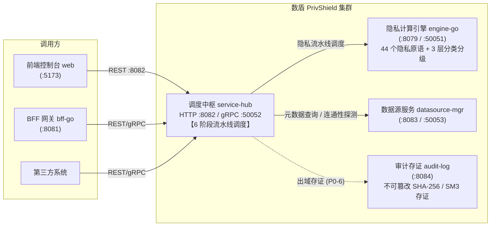
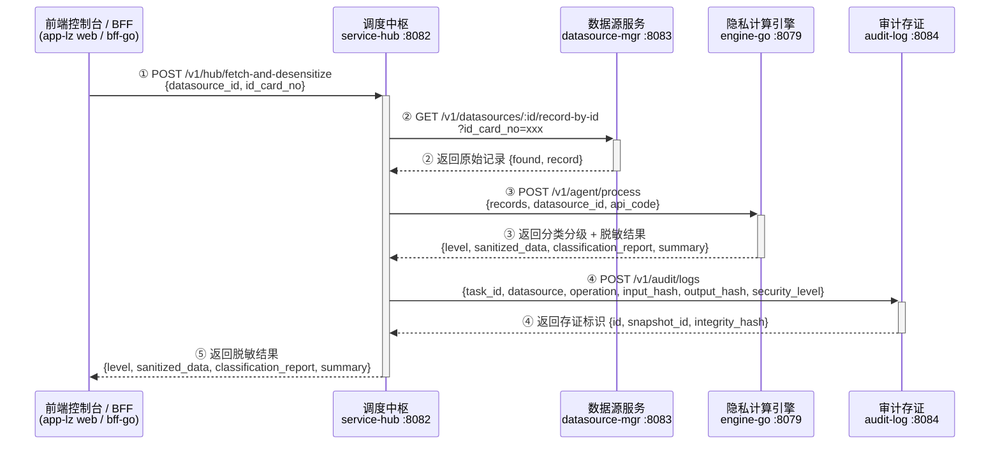

# 数据服务调度中枢 (service-hub) — 接口规范与运维对接指南

> **版本**：v2.5.0 (新增按身份证号端到端查询+脱敏同步 API FetchAndDesensitize)  
> **文档定位**：本规范为 **数联天下 · 数盾 (`PrivShield`)** 体系中「数据服务调度中枢（Service Hub）」的标准化通信与数据交互规约。  
> **面向对象**：**前端控制台研发团队、BFF 网关开发团队、运维 SRE 团队、第三方系统对接方**。  
> **重要说明**：`service-hub` 是 PrivShield 隐私计算治理平台的**核心调度中枢**，负责串联上游隐私计算引擎 (`engine-go`)、下游数据源服务 (`datasource-mgr`) 与独立审计存证节点 (`audit-log`)，提供 **REST (Gin :8082) + gRPC (mTLS :50052)** 双协议接入能力，支持多副本 PostgreSQL 租约并发争抢与 SQLite WAL 自愈降级。

---

## 目录

- [1. 系统架构与对接概览](#1-系统架构与对接概览)
  - [1.1 业务定位与交互拓扑](#11-业务定位与交互拓扑)
  - [1.2 通信协议与端口规划](#12-通信协议与端口规划)
  - [1.3 6 阶段数据安全流通流水线](#13-6-阶段数据安全流通流水线)
- [2. 通信协议与安全基线规约](#2-通信协议与安全基线规约)
  - [2.1 传输层安全 (TLS 1.3 / 国密 SM2 / mTLS)](#21-传输层安全-tls-13--国密-sm2--mtls)
  - [2.2 身份鉴权与访问控制 (API Key / Scope-based / CN Whitelist)](#22-身份鉴权与访问控制-api-key--scope-based--cn-whitelist)
  - [2.3 分布式全链路追踪规范 (Trace & Request ID)](#23-分布式全链路追踪规范-trace--request-id)
- [3. HTTP RESTful API 详细规范](#3-http-restful-api-详细规范)
  - [3.1 探针与监控端点](#31-探针与监控端点)
    - [3.1.1 存活健康检查 (GET /health & GET /health)](#311-存活健康检查-get-health--get-apihealth)
    - [3.1.2 服务就绪探针 (GET /readyz)](#312-服务就绪探针-get-readyz)
    - [3.1.3 调度中枢运行概况 (GET /v1/hub/status)](#313-调度中枢运行概况-get-apihubstatus)
    - [3.1.4 Prometheus 监控指标 (GET /metrics)](#314-prometheus-监控指标-get-metrics)
  - [3.2 任务生命周期管理端点](#32-任务生命周期管理端点)
    - [3.2.1 分页查询任务列表 (GET /v1/hub/tasks)](#321-分页查询任务列表-get-apihubtasks)
    - [3.2.2 查询单个任务详情 (GET /v1/hub/tasks/:id)](#322-查询单个任务详情-get-apihubtasksid)
  - [3.3 任务分发与流水线调度端点](#33-任务分发与流水线调度端点)
    - [3.3.1 手动分发任务 (POST /v1/hub/dispatch)](#331-手动分发任务-post-apihubdispatch)
    - [3.3.2 流水线监控遥测 (GET /v1/hub/pipeline)](#332-流水线监控遥测-get-apihubpipeline)
  - [3.4 按身份证号查询并脱敏端点 (POST /v1/hub/fetch-and-desensitize)](#34-按身份证号查询并脱敏端点-post-apihubfetch-and-desensitize)
  - [3.5 跨服务完整调用链路：按身份证分级脱敏全链路 API 时序](#35-跨服务完整调用链路按身份证分级脱敏全链路-api-时序)
  - [3.6 外部系统统一编排代理端点 (External Orchestration Endpoints)](#36-外部系统统一编排代理端点-external-orchestration-endpoints)
    - [3.6.1 集群拓扑健康探针 (GET /v1/hub/topology)](#361-集群拓扑健康探针-get-apihubtopology)
    - [3.6.2 数据源目录查询 (GET /v1/hub/datasources)](#362-数据源目录查询-get-apihubdatasources)
    - [3.6.3 审计存证查询 (GET /v1/hub/audit/logs)](#363-审计存证查询-get-apihubauditlogs)
    - [3.6.4 审计存证写入 (POST /v1/hub/audit/logs)](#364-审计存证写入-post-apihubauditlogs)
    - [3.6.5 Merkle 完整性防篡改验真 (POST /v1/hub/audit/verify)](#365-merkle-完整性防篡改验真-post-apihubauditverify)
- [4. gRPC API 规范与 Protobuf 定义](#4-grpc-api-规范与-protobuf-定义)
  - [4.1 Protobuf 契约文件 (servicehub.proto)](#41-protobuf-契约文件-servicehubproto)
  - [4.2 gRPC 服务接口与方法规约](#42-grpc-服务接口与方法规约)
  - [4.3 gRPC 消息结构体字段详细定义](#43-grpc-消息结构体字段详细定义)
  - [4.4 gRPC Metadata 上下文传递约定](#44-grpc-metadata-上下文传递约定)
- [5. 统一错误码与异常处理规范](#5-统一错误码与异常处理规范)
  - [5.1 REST 统一 5 字段错误信封](#51-rest-统一-5-字段错误信封)
  - [5.2 HTTP 状态码与业务错误码对照表](#52-http-状态码与业务错误码对照表)
  - [5.3 gRPC 状态码映射标准](#53-grpc-状态码映射标准)
- [6. 6 阶段流水线与算子语义](#6-6-阶段流水线与算子语义)
  - [6.1 流水线阶段详解](#61-流水线阶段详解)
  - [6.2 算子强度请求语义 (P1-1)](#62-算子强度请求语义-p1-1)
- [7. 非功能性需求与运维验收标准](#7-非功能性需求与运维验收标准)
  - [7.1 性能与高并发 SLA 指标](#71-性能与高并发-sla-指标)
  - [7.2 推荐环境变量配置表](#72-推荐环境变量配置表)
  - [7.3 联调自测命令与验收清单](#73-联调自测命令与验收清单)

---

## 1. 系统架构与对接概览

### 1.1 业务定位与交互拓扑

在 PrivShield 数据要素流通与隐私治理体系中，`service-hub` 扮演 **调度中枢（Scheduling Hub）** 角色。它接收来自前端控制台、BFF 网关或外部系统的任务请求，通过 6 阶段数据安全流通流水线串联上游隐私计算引擎、下游数据源服务与独立审计存证节点，实现从数据接入到脱敏治理再到审计存证的全链路自动化调度。

**生产调用关系说明**：
- **唯一调度入口**：`service-hub` 是所有隐私治理任务的**唯一调度入口**，前端控制台 (`web`) 与 BFF 网关 (`bff-go`) 通过 REST/gRPC 向其提交任务；
- **上游依赖**：隐私计算引擎 (`engine-go` / `PrivShield Agent`，REST :8079) 提供 44 个隐私原语与 3 层分类分级能力；
- **下游依赖**：数据源服务 (`datasource-mgr`，REST :8083 / gRPC :50053) 提供数据源元数据查询与连通性探测；
- **存证依赖**：审计存证节点 (`audit-log`，:8084) 提供不可篡改的出域存证，出域动作与存证代码级强绑定（P0-6）。



### 1.2 通信协议与端口规划

调度中枢对外暴露以下端口，供前端控制台、BFF 网关与内部微服务互通：

| 协议类型 | 默认监听端口 | 适用调用方 | 传输安全与认证机制 | 业务用途 |
|---|---|---|---|---|
| **HTTP/HTTPS REST** | `8082` | 前端控制台 (`web`)、BFF 网关 (`bff-go`)、运维调试 | TLS 1.3 / 国密 SM2 双向 mTLS + Scope-based API Key / Bearer Token | 任务提交、任务查询、流水线监控、健康探针 |
| **gRPC (HTTP/2)** | `50052` | BFF 网关、内部微服务高性能互通 | TLS 1.3 / 国密 SM2 双向 mTLS + 证书 CN 白名单 | 高吞吐任务编排、分类分级分发、流水线状态查询 |
| **Prometheus Metrics** | `8082` (`/metrics`) | 运维监控 Prometheus 集群 | 内网隔离 / 鉴权 | 暴露流水线各阶段状态、延迟、熔断器、任务计数指标 |

### 1.3 6 阶段数据安全流通流水线

`service-hub` 核心调度逻辑基于 6 阶段自动化流水线，每个任务从接入到存证经历以下阶段：

```
① 请求接入 (ingest) ──▶ ② 数据拉取 (fetch) ──▶ ③ 分类+脱敏 (classify)
       │                          │                         │
       ▼                          ▼                         ▼
④ 脱敏治理 (desensitize) ──▶ ⑤ 结果返回 (return) ──▶ ⑥ 审计存证 (audit)
```

| 阶段编号 | 阶段名称 | 核心动作 |
|---|---|---|
| ① | `ingest` | 更新任务状态为 `running`，初始化任务元数据与并发信号量 |
| ② | `fetch` | 数据拉取阶段保留（分页抽取接口已移除，需由调用方在提交任务时显式携带载荷） |
| ③ | `classify` | 一次调用 engine `POST /v1/agent/process`（404 时回退 `POST /v1/medical/process`），同时完成 3-Layer 分类分级 + 高敏文本剥离 + PII 掩码 |
| ④ | `desensitize` | 已由 ③ 合并完成，快速通过（保留阶段状态追踪） |
| ⑤ | `return` | 组装脱敏后的数据对象 |
| ⑥ | `audit` | 向独立存证节点 `audit-log` 提交出域存证；提交失败一律任务失败（P0-6 fail-closed） |

---

## 2. 通信协议与安全基线规约

### 2.1 传输层安全 (TLS 1.3 / 国密 SM2 / mTLS)

在生产环境中，调度中枢承载高敏隐私数据流转，**必须启用双向传输加密与身份验证（mTLS）**：

1. **最低协议版本**：强制使用 **TLS 1.3**（禁止回退至 TLS 1.0/1.1/1.2，防范协议降级攻击）；
2. **国密算法支持**：生产推荐配置支持国密 **SM2 签名/验签 + SM3 摘要 + SM4-GCM 对称加密**，或国际标准套件 `TLS_AES_256_GCM_SHA384`；
3. **REST HTTPS**：启用 `SERVICE_HUB_TLS_ENABLED=true` 并配置证书/私钥/CA 三件套；
4. **gRPC mTLS**：
   - 服务端必须启用 `RequireAndVerifyClientCert` 模式；
   - 必须配置受信任的根 CA 证书 (`SERVICE_HUB_TLS_CA_FILE`)；
   - 支持公钥指纹固定 (`SERVICE_HUB_TLS_PINNED_PUBKEY_FILE`)，防御 CA 劫持与伪造攻击。

### 2.2 身份鉴权与访问控制 (API Key / Scope-based / CN Whitelist)

调度中枢支持三种鉴权模式，按优先级依次递减：

1. **Scope-based API Key 鉴权**（推荐）：
   - 通过 `SERVICE_HUB_API_KEYS` 环境变量或 `SERVICE_HUB_API_KEYS_FILE` 文件配置多 Key 映射；
   - 每个 Key 携带 `Name` 与 `Scopes`，按路径映射所需权限进行细粒度校验；
   - 支持 KeyStore 热轮转，同名 token 以 KeyStore 为准；
   - 过期 Key 自动拒绝，防止过期凭证长期有效。
2. **单 API Key 向后兼容模式**：
   - 通过 `SERVICE_HUB_API_KEY` 配置单一 Bearer Token；
   - 服务端采用**常量时间比对（Constant-Time Compare）**校验，防止时序攻击。
3. **gRPC CN 白名单鉴权**：
   - gRPC 服务端在 TLS 握手完成后，从对端 X.509 证书提取 Subject Common Name (CN)；
   - 仅放行在 `PRIVACY_AUTH_MTLS_WHITELIST_FILE` 白名单中的客户端 CN，不在白名单中的连接直接中断。

> **健康探针免鉴权**：`/health`、`/readyz`、`/health` 三个探针端点不受鉴权中间件保护，确保 K8s 探针可无 Token 访问。

### 2.3 分布式全链路追踪规范 (Trace & Request ID)

为了实现从前端控制台到调度中枢再到引擎/数据源/审计的全链路审计与性能追踪：

1. **HTTP REST 请求头注入与透传**：
   - 中间件自动注入 `X-Request-ID` 与 `X-Trace-ID`（若不存在则自动生成 UUIDv4）；
   - 在所有 HTTP 响应头中原样注入回传。
2. **gRPC Metadata 透传**：
   - 从 incoming metadata 中读取 `x-request-id`；
   - 在 outgoing header/trailer 中附带回传。
3. **跨服务透传**：调度中枢在调用上游 Agent 和下游 audit-log 时，通过 Context 携带 `requestID` 与幂等键 (`idempotencyKey`)。

---

## 3. HTTP RESTful API 详细规范

### 3.1 探针与监控端点

#### 3.1.1 存活健康检查 (GET /health & GET /health)

- **功能说明**：K8s Liveness 探针或负载均衡器健康检查端点。服务进程启动并能响应 HTTP 即返回 200。
- **请求方法**：`GET`
- **请求路径**：`/health`（规范路径）或 `/health`（兼容别名）
- **鉴权要求**：无（免 Token 访问）
- **请求参数**：无
- **成功响应**：`HTTP 200 OK`
  ```json
  {
    "status": "ok",
    "via": "service-hub"
  }
  ```
- **字段说明**：

  | 字段名 | 类型 | 必填 | 说明 |
  |---|---|---|---|
  | `status` | string | 是 | 服务运行状态，固定为 `"ok"` |
  | `via` | string | 是 | 响应节点标识符，固定为 `"service-hub"` |

---

#### 3.1.2 服务就绪探针 (GET /readyz)

- **功能说明**：K8s Readiness 探针。深度探测上游 `PrivShield Agent` 与下游 `datasource-mgr` 的网络连通性。上游 Agent 不可用时返回 `503 Service Unavailable`，以便 K8s Ingress / Service Mesh 识别并暂停流量导入。
- **请求方法**：`GET`
- **请求路径**：`/readyz`
- **鉴权要求**：无（免 Token 访问）
- **成功响应**：`HTTP 200 OK`（就绪）
  ```json
  {
    "status": "ready",
    "backend": "ok",
    "agent": {
      "status": "ok",
      "namespace": "default"
    },
    "agent_url": "http://127.0.0.1:8079",
    "datasource": "ok",
    "datasource_url": "http://127.0.0.1:8083",
    "latency_ms": 3,
    "via": "service-hub"
  }
  ```
- **失败响应**：`HTTP 503 Service Unavailable`（上游 Agent 不可达）
  ```json
  {
    "status": "not_ready",
    "backend": "ok",
    "agent": "unreachable",
    "agent_url": "http://127.0.0.1:8079",
    "datasource": "ok",
    "datasource_url": "http://127.0.0.1:8083",
    "latency_ms": 10001,
    "error": "context deadline exceeded",
    "via": "service-hub"
  }
  ```
- **字段说明**：

  | 字段名 | 类型 | 必填 | 说明 |
  |---|---|---|---|
  | `status` | string | 是 | 就绪状态（`"ready"` / `"not_ready"`） |
  | `backend` | string | 是 | 后端自检状态，固定为 `"ok"` |
  | `agent` | object \| string | 是 | 上游 Agent 健康数据（就绪时）或 `"unreachable"` |
  | `agent_url` | string | 是 | 上游 Agent 连接地址 |
  | `datasource` | any | 是 | 下游数据源服务状态（`"ok"` / `"unreachable"`） |
  | `datasource_url` | string | 是 | 下游数据源服务连接地址 |
  | `latency_ms` | integer | 是 | 深度探测总耗时（毫秒） |
  | `error` | string | 否 | Agent 不可达时的错误详情 |
  | `via` | string | 是 | 响应节点标识符 |

---

#### 3.1.3 调度中枢运行概况 (GET /v1/hub/status)

- **功能说明**：查询调度中枢当前运行概况，包括 Uptime、任务队列深度与累计统计。
- **请求方法**：`GET`
- **请求路径**：`/v1/hub/status`
- **鉴权要求**：需要有效 Bearer Token
- **成功响应**：`HTTP 200 OK`
  ```json
  {
    "status": "running",
    "uptime": "2h30m15s",
    "active_tasks": 3,
    "queued_tasks": 12,
    "completed_total": 1580,
    "failed_total": 23,
    "agent_url": "http://127.0.0.1:8079",
    "datasource_url": "http://127.0.0.1:8083"
  }
  ```
- **字段说明**：

  | 字段名 | 类型 | 必填 | 说明 |
  |---|---|---|---|
  | `status` | string | 是 | 运行状态标识，固定为 `"running"` |
  | `uptime` | string | 是 | 服务启动至今的可读运行时长 |
  | `active_tasks` | integer | 是 | 当前正在执行 (`running`) 的任务数 |
  | `queued_tasks` | integer | 是 | 排队等待 (`pending`) 的任务数 |
  | `completed_total` | integer | 是 | 累计已完成任务总数 |
  | `failed_total` | integer | 是 | 累计已失败任务总数 |
  | `agent_url` | string | 是 | 上游 Agent 连接地址 |
  | `datasource_url` | string | 是 | 下游数据源服务连接地址 |

---

#### 3.1.4 Prometheus 监控指标 (GET /metrics)

- **功能说明**：暴露 Prometheus 标准文本格式的运行指标，供监控系统周期性采集。
- **请求方法**：`GET`
- **请求路径**：`/metrics`
- **成功响应**：`HTTP 200 OK`，`Content-Type: text/plain; version=0.0.4; charset=utf-8`
- **核心指标规范**：
  - `http_requests_total{method, path, status}`：HTTP 请求计数器
  - `http_request_duration_seconds{method, path}`：请求耗时直方图
  - `task_transitions_total{from_status, to_status, result}`：任务状态转换计数
  - `task_claim_latency_seconds`：多副本任务认领延迟
  - `orphaned_tasks_recovered_total`：崩溃孤立任务回收计数
  - `tasks_retried_total{result}`：失败任务重试计数
  - `circuit_breaker_state`：Agent 客户端熔断器状态（`closed` / `open` / `half_open`）
  - `privshield_datasource_requests_total{datasource_id, api_code, status}`：数据源流水线终态计数

---

### 3.2 任务生命周期管理端点

#### 3.2.1 分页查询任务列表 (GET /v1/hub/tasks)

- **功能说明**：分页获取任务列表，支持按状态过滤。服务端强制执行分页安全边界。
- **请求方法**：`GET`
- **请求路径**：`/v1/hub/tasks`
- **鉴权要求**：需要有效 Bearer Token（`hub:read` 权限）
- **Query 参数**：

  | 参数名 | 类型 | 必填 | 默认值 | 说明 |
  |---|---|---|---|---|
  | `status` | string | 否 | — | 按状态过滤，支持枚举值：`pending` / `running` / `completed` / `failed` |
  | `limit` | integer | 否 | `100` | 单页数量，最大 `1000` |
  | `offset` | integer | 否 | `0` | 分页偏移量 |

- **成功响应**：`HTTP 200 OK`
  ```json
  {
    "total": 1580,
    "limit": 100,
    "offset": 0,
    "tasks": [
      {
        "id": "task-1787554500-eabf3934",
        "api_code": "api1_yibao",
        "datasource_id": "ds_yibao",
        "status": "completed",
        "stage": "done",
        "source": "ds_yibao",
        "operation": "mask",
        "priority": 50,
        "created_at": "2026-09-03T10:00:00Z",
        "started_at": "2026-09-03T10:00:01Z",
        "completed_at": "2026-09-03T10:00:03Z",
        "duration_ms": 2345,
        "retry_count": 0,
        "version": 3,
        "max_retries": 3
      }
    ],
    "via": "service-hub"
  }
  ```
- **字段说明**：

  | 字段名 | 类型 | 必填 | 说明 |
  |---|---|---|---|
  | `total` | integer | 是 | 符合过滤条件的任务总数 |
  | `limit` | integer | 是 | 当前分页大小 |
  | `offset` | integer | 是 | 当前偏移量 |
  | `tasks` | array[object] | 是 | 任务实体对象列表 |
  | `tasks[].id` | string | 是 | 唯一任务 ID |
  | `tasks[].api_code` | string | 是 | 业务 API 代码（如 `api1_yibao`） |
  | `tasks[].datasource_id` | string | 是 | 规范数据源标识（如 `ds_yibao`） |
  | `tasks[].status` | string | 是 | 任务状态（`pending` / `running` / `completed` / `failed`） |
  | `tasks[].stage` | string | 是 | 当前流水线阶段（`ingest` ~ `audit` / `done` / `queued`） |
  | `tasks[].source` | string | 是 | 数据源名称 |
  | `tasks[].operation` | string | 是 | 生效的脱敏操作类型 |
  | `tasks[].priority` | integer | 是 | 执行优先级 |
  | `tasks[].created_at` | string | 是 | 创建时间（RFC3339） |
  | `tasks[].started_at` | string | 否 | 开始执行时间（RFC3339） |
  | `tasks[].completed_at` | string | 否 | 完成时间（RFC3339） |
  | `tasks[].duration_ms` | integer | 否 | 端到端耗时（毫秒） |
  | `tasks[].retry_count` | integer | 是 | 当前已发生的重试尝试次数（无 `omitempty`，始终序列化） |
  | `tasks[].version` | integer | 是 | 乐观并发控制版本计数器（无 `omitempty`，始终序列化） |
  | `tasks[].max_retries` | integer | 是 | 允许的最大重试次数（默认 3，无 `omitempty`，始终序列化） |
  | `tasks[].error` | string | 否 | 失败时的错误信息详情（`omitempty`） |
  | `tasks[].error_class` | string | 否 | 失败分类枚举（P2-7，`omitempty`） |
  | `tasks[].retry_after` | string | 否 | 下次允许重试的最早时间戳（RFC3339，`omitempty`） |
  | `tasks[].trace_id` | string | 否 | 全链路分布式追踪 ID（`omitempty`） |
  | `tasks[].lease_owner` | string | 否 | Phase B 多副本租约持有者实例标识（`omitempty`） |
  | `tasks[].lease_token` | string | 否 | 租约唯一随机令牌（`omitempty`） |
  | `tasks[].lease_expires_at` | string | 否 | 租约绝对过期时间（RFC3339，`omitempty`） |
  | `via` | string | 是 | 响应节点标识符 |

- **错误响应**：`HTTP 400 Bad Request`（`status` 值不在有效枚举内）

---

#### 3.2.2 查询单个任务详情 (GET /v1/hub/tasks/:id)

- **功能说明**：根据任务唯一 ID 查询单个任务的详细状态与执行结果。
- **请求方法**：`GET`
- **请求路径**：`/v1/hub/tasks/:id`（例如：`/v1/hub/tasks/task-1787554500-eabf3934`）
- **路径参数**：
  - `id` (string, 必填)：任务唯一标识符。
- **鉴权要求**：需要有效 Bearer Token（`hub:read` 权限）
- **成功响应**：`HTTP 200 OK`
  ```json
  {
    "task": {
      "id": "task-1787554500-eabf3934",
      "api_code": "api1_yibao",
      "datasource_id": "ds_yibao",
      "status": "completed",
      "stage": "done",
      "source": "ds_yibao",
      "operation": "mask",
      "priority": 50,
      "created_at": "2026-09-03T10:00:00Z",
      "started_at": "2026-09-03T10:00:01Z",
      "completed_at": "2026-09-03T10:00:03Z",
      "duration_ms": 2345,
      "retry_count": 0,
      "version": 3,
      "max_retries": 3
    },
    "via": "service-hub"
  }
  ```
- **错误响应**：`HTTP 404 Not Found`（任务不存在）
  ```json
  {
    "code": "NOT_FOUND",
    "message": "task task-unknown not found",
    "detail": null,
    "trace_id": "req-20260903-err-001",
    "timestamp": "2026-09-03T10:00:00.123456789Z"
  }
  ```

---

### 3.3 任务分发与流水线调度端点

#### 3.3.1 手动分发任务 (POST /v1/hub/dispatch)

- **功能说明**：手动分发任务到 6 阶段数据安全流通流水线。调用方提交数据源标识、可选操作类型与原始载荷，调度中枢生成唯一 TaskID 并异步驱动流水线执行。
- **请求方法**：`POST`
- **请求路径**：`/v1/hub/dispatch`
- **兼容别名**：`POST /v1/hub/classify`（向后兼容）
- **鉴权要求**：需要有效 Bearer Token（`hub:dispatch` 权限）
- **请求体**：
  ```json
  {
    "datasource_id": "ds_yibao",
    "operation": "mask",
    "payload": {
      "name": "李明",
      "id_card": "510101198503151234",
      "phone": "13800138000"
    },
    "priority": 50
  }
  ```
- **请求体字段说明**：

  | 字段名 | 类型 | 必填 | 说明 |
  |---|---|---|---|
  | `datasource_id` | string | 三选一 | 规范数据源标识（`ds_yibao` / `ds_kangyang` 等），支持别名归一化 |
  | `api_code` | string | 三选一 | 业务 API 代码（`api1_yibao` / `api2_kangyang` 等） |
  | `source` | string | 三选一 | 兼容历史字段，同 `datasource_id` |
  | `operation` | string | 否 | 算子「强度请求」：`mask` / `k_anon` / `dp` / `classify` / `none`；缺省由服务端定级推导 |
  | `payload` | any | 是 | 原始记录数据（JSON 对象或数组） |
  | `priority` | integer | 否 | 执行优先级（越高越优先，默认 0） |

- **成功响应**：`HTTP 202 Accepted`
  ```json
  {
    "task_id": "task-1787554500-eabf3934",
    "api_code": "api1_yibao",
    "datasource_id": "ds_yibao",
    "status": "accepted",
    "via": "service-hub"
  }
  ```
- **响应字段说明**：

  | 字段名 | 类型 | 必填 | 说明 |
  |---|---|---|---|
  | `task_id` | string | 是 | 分配的全局唯一任务 ID |
  | `api_code` | string | 是 | 归一化后的业务 API 代码 |
  | `datasource_id` | string | 是 | 归一化后的规范数据源标识 |
  | `status` | string | 是 | 接收状态，固定为 `"accepted"` |
  | `via` | string | 是 | 响应节点标识符 |

- **错误响应**：
  - `HTTP 400 Bad Request`：`source` / `datasource_id` / `api_code` 均缺失或无法归一化
  - `HTTP 400 Bad Request`：`operation` 值不在有效算子词表内
  - `HTTP 409 Conflict`：尝试访问已登记但未上线的预留数据源

---

#### 3.3.2 流水线监控遥测 (GET /v1/hub/pipeline)

- **功能说明**：返回 6 个流水线阶段（`ingest` ➔ `fetch` ➔ `classify` ➔ `desensitize` ➔ `return` ➔ `audit`）的实时活跃任务统计与上游 Agent 连通性。
- **请求方法**：`GET`
- **请求路径**：`/v1/hub/pipeline`
- **鉴权要求**：需要有效 Bearer Token
- **成功响应**：`HTTP 200 OK`
  ```json
  {
    "stages": [
      {"name": "ingest", "status": "idle", "active_count": 0},
      {"name": "fetch", "status": "idle", "active_count": 0},
      {"name": "classify", "status": "processing", "active_count": 2},
      {"name": "desensitize", "status": "idle", "active_count": 0},
      {"name": "return", "status": "idle", "active_count": 0},
      {"name": "audit", "status": "idle", "active_count": 0}
    ],
    "agent_ok": true
  }
  ```
- **字段说明**：

  | 字段名 | 类型 | 必填 | 说明 |
  |---|---|---|---|
  | `stages` | array[object] | 是 | 6 个流水线阶段状态列表 |
  | `stages[].name` | string | 是 | 阶段名称 |
  | `stages[].status` | string | 是 | 阶段状态（`"idle"` / `"processing"` / `"error"`） |
  | `stages[].active_count` | integer | 是 | 当前阶段活跃任务数 |
  | `agent_ok` | boolean | 是 | 上游 Agent 是否可达 |

---

### 3.4 按身份证号查询并脱敏端点 (POST /v1/hub/fetch-and-desensitize)

- **功能说明**：端到端同步 API。调用方只需提供数据源标识与 18 位公民身份证号，调度中枢自动完成以下全链路：
  1. 向下游 `datasource-mgr` 按身份证号精确拉取单条记录；
  2. 调用上游 `engine-go` 隐私计算引擎执行 3-Layer 分类分级 + PII 掩码脱敏；
  3. 同步返回脱敏后数据、分类级别与分类报告。
- **请求方法**：`POST`
- **请求路径**：`/v1/hub/fetch-and-desensitize`
- **鉴权要求**：需要有效 Bearer Token（`hub:dispatch` 权限）
- **请求体**：
  ```json
  {
    "datasource_id": "ds_yibao",
    "id_card_no": "510101198503151234"
  }
  ```
- **请求体字段说明**：

  | 字段名 | 类型 | 必填 | 说明 |
  |---|---|---|---|
  | `datasource_id` | string | 是 | 规范数据源标识（`ds_yibao` / `ds_kangyang` 等），支持别名归一化 |
  | `id_card_no` | string | 是 | 18 位公民身份证号码（严格校验长度必须为 18） |

- **成功响应**：`HTTP 200 OK`
  ```json
  {
    "datasource_id": "ds_yibao",
    "id_card_no": "510101198503151234",
    "found": true,
    "level": "L4",
    "sanitized_data": {
      "name": "李*",
      "id_card": "5101***********234",
      "phone": "138****8000",
      "diagnosis": "J18.9"
    },
    "classification_report": {
      "layer1_rule_hits": ["PII::ID_CARD", "PII::PHONE"],
      "layer2_ner_entities": ["PER", "TEL"],
      "layer3_llm_fields": ["diagnosis"],
      "max_sensitivity": "L4"
    },
    "summary": {
      "total_fields": 4,
      "sanitized_fields": 3,
      "entities_detected": 5
    },
    "via": "service-hub"
  }
  ```
- **响应字段说明**：

  | 字段名 | 类型 | 必填 | 说明 |
  |---|---|---|---|
  | `datasource_id` | string | 是 | 归一化后的规范数据源标识 |
  | `id_card_no` | string | 是 | 查询的身份证号（原样回传） |
  | `found` | boolean | 是 | 是否在数据源中找到匹配记录，固定为 `true` |
  | `level` | string | 是 | 分类分级结果（`L1` ~ `L5`），由引擎 3-Layer 漏斗定级 |
  | `sanitized_data` | object | 是 | 脱敏后的数据对象（PII 字段已掩码） |
  | `classification_report` | object | 是 | 3-Layer 分类分级报告（规则命中、NER 实体、LLM 字段） |
  | `summary` | object | 是 | 处理摘要（总字段数、脱敏字段数、检出实体数） |
  | `via` | string | 是 | 响应节点标识符 |

- **错误响应**：
  - `HTTP 400 Bad Request` (`INVALID_ARGUMENT`)：`datasource_id` 或 `id_card_no` 缺失，或身份证号长度不为 18
  - `HTTP 400 Bad Request` (`INVALID_DATASOURCE_ID`)：`datasource_id` 无法归一化识别
  - `HTTP 404 Not Found` (`RECORD_NOT_FOUND`)：数据源中未找到该身份证号对应的记录
  - `HTTP 409 Conflict` (`RESERVED_DATASOURCE`)：尝试访问已登记但未上线的预留数据源
  - `HTTP 502 Bad Gateway` (`UPSTREAM_UNAVAILABLE`)：上游 `datasource-mgr` 拉取失败或 `engine-go` 处理失败

- **完整 curl 端到端示例**：
  ```bash
  # 按身份证号从医保数据源查询记录并自动执行分类分级+脱敏
  curl -s -X POST \
    -H "Authorization: Bearer <API_KEY>" \
    -H "Content-Type: application/json" \
    -d '{"datasource_id":"ds_yibao","id_card_no":"510101198503151234"}' \
    http://127.0.0.1:8082/v1/hub/fetch-and-desensitize | jq .
  ```

---

### 3.5 跨服务完整调用链路：按身份证分级脱敏全链路 API 时序

本节描述「前端控制台 / BFF 网关 → 调度中枢 → 数据源服务 → 隐私计算引擎 → 审计存证」的**完整跨服务 API 调用链路**，以「按身份证号查询并分级脱敏」为例，逐步拆解每一跳的精确端点、请求体与响应体。

#### 3.5.1 全链路时序图



#### 3.5.2 逐跳 API 详细规范

##### ① 前端 / BFF → 调度中枢 (service-hub)

调用方通过调度中枢的同步端到端入口发起请求，只需提供数据源标识与身份证号，后续拉取、分级、脱敏、存证全部由调度中枢内部编排。

- **端点**：`POST http://service-hub:8082/v1/hub/fetch-and-desensitize`
- **鉴权**：`Authorization: Bearer <SERVICE_HUB_API_KEY>`
- **请求体**：
  ```json
  {
    "datasource_id": "ds_yibao",
    "id_card_no": "510101198503151234"
  }
  ```
- **响应体**（`HTTP 200 OK`）：
  ```json
  {
    "datasource_id": "ds_yibao",
    "id_card_no": "510101198503151234",
    "found": true,
    "level": "L4",
    "sanitized_data": {"name": "李*", "id_card": "5101***********234", "phone": "138****8000"},
    "classification_report": {"layer1_rule_hits": ["PII::ID_CARD"], "max_sensitivity": "L4"},
    "summary": {"total_fields": 4, "sanitized_fields": 3, "input_hash": "sm3:abc...", "output_hash": "sm3:def..."},
    "audit_task_id": "fad-ds_yibao-510101198503151234-1725345600000000000",
    "via": "service-hub"
  }
  ```

> **说明**：此端点是 service-hub 内部编排 ②③④ 三步的统一入口，调用方无需感知内部链路。`audit_task_id` 为本次出域存证的唯一标识，可用于后续审计日志查询与 Merkle 验真。

---

##### ② 调度中枢 → 数据源服务 (datasource-mgr)：拉取原始记录

调度中枢收到请求后，首先归一化 `datasource_id`（支持别名如 `yibao` → `ds_yibao`），然后向 `datasource-mgr` 发起按身份证号精确查询。

- **端点**：`GET http://datasource-mgr:8083/v1/datasources/{datasource_id}/record-by-id?id_card_no={id_card_no}`
- **鉴权**：`Authorization: Bearer <DATASOURCE_MGR_API_KEY>`（内部 mTLS 环境下可省略）
- **请求头**：`X-Request-ID: <trace-id>`（链路追踪透传）
- **响应体**（`HTTP 200 OK`）：
  ```json
  {
    "datasource_id": "ds_yibao",
    "record": {
      "name": "李明",
      "id_card_no": "510101198503151234",
      "phone": "13800138000",
      "diagnosis": "J18.9 社区获得性肺炎"
    },
    "found": true,
    "via": "datasource-mgr"
  }
  ```
- **错误场景**：
  - `found=false`：数据源中无该身份证号匹配记录 → 调度中枢返回 `HTTP 404 RECORD_NOT_FOUND`
  - `HTTP 400 INVALID_ARGUMENT`：`id_card_no` 缺失或长度不为 18

> **gRPC 替代路径**：调度中枢也可通过 gRPC 调用 `datasourcemgr.DataSourceManagerService/GetRecordByIDCard`，消息结构见 `datasource-mgr/proto/datasourcemgr.proto`。

---

##### ③ 调度中枢 → 隐私计算引擎 (engine-go)：分类分级 + 脱敏

拿到原始记录后，调度中枢将其发送至 `engine-go` 的通用处理流水线，**一次 HTTP 调用同时完成 3-Layer 分类分级 + L4/L5 高敏文本剥离 + PII 强掩码 + 诊断残留清除**。

- **端点**：`POST http://engine-go:8079/v1/agent/process`
- **回退别名**：若返回 404 则自动回退至 `POST /v1/medical/process`
- **鉴权**：`Authorization: Bearer <PRIVACY_AGENT_API_KEY>`
- **请求头**：
  - `X-Request-ID: <trace-id>`
  - `X-Idempotency-Key: hub-fad-{datasource_id}-{id_card_no}`（幂等键，防止重试导致重复脱敏）
- **请求体**：
  ```json
  {
    "records": [
      {
        "name": "李明",
        "id_card_no": "510101198503151234",
        "phone": "13800138000",
        "diagnosis": "J18.9 社区获得性肺炎"
      }
    ],
    "datasource_id": "ds_yibao",
    "api_code": "api1_yibao"
  }
  ```
- **响应体**（`HTTP 200 OK`）：
  ```json
  {
    "level": "L4",
    "classification_report": [
      {
        "name": {"level": "L3", "category": "PII", "rule": "PERSON_NAME"},
        "id_card_no": {"level": "L4", "category": "PII", "rule": "PII::ID_CARD"},
        "phone": {"level": "L3", "category": "PII", "rule": "PII::PHONE"},
        "diagnosis": {"level": "L4", "category": "Healthcare", "rule": "ICD10::J18"}
      }
    ],
    "sanitized_data": [
      {
        "name": "李*",
        "id_card_no": "5101***********234",
        "phone": "138****8000",
        "diagnosis": "J18.9"
      }
    ],
    "summary": {
      "total_records": 1,
      "api_code": "api1_yibao",
      "datasource_id": "ds_yibao",
      "engine": "go",
      "overall_level": "L4",
      "input_hash": "sm3:a1b2c3...",
      "output_hash": "sm3:d4e5f6..."
    }
  }
  ```
- **关键字段语义**：
  - `level` / `summary.overall_level`：3-Layer 漏斗给出的最高敏感级别（`L1`~`L5`），调度中枢据此决定脱敏算子（P1-1 只允许上调不允许下调）
  - `summary.input_hash` / `output_hash`：国密 SM3 指纹，供后续 ④ 审计存证对账
  - `sanitized_data`：脱敏后数据，PII 字段已按字段名 + 数据源领域规格掩码

---

##### ④ 调度中枢 → 审计存证 (audit-log)：写入不可篡改存证

脱敏完成后，调度中枢向独立审计存证节点提交一条出域存证记录，将本次数据流出与不可篡改哈希链绑定（P0-6 fail-closed：提交失败则整个请求失败）。

- **端点**：`POST http://audit-log:8084/v1/audit/logs`
- **鉴权**：`Authorization: Bearer <AUDIT_LOG_API_KEY>`
- **请求头**：
  - `X-Request-ID: <trace-id>`
  - `X-Idempotency-Key: hub-{task_id}-audit-{retry_count}`
- **请求体**：
  ```json
  {
    "task_id": "task-1787554500-eabf3934",
    "datasource_id": "ds_yibao",
    "datasource": "ds_yibao",
    "api_code": "api1_yibao",
    "operation": "mask",
    "security_level": "L4",
    "input_hash": "sm3:a1b2c3...",
    "output_hash": "sm3:d4e5f6...",
    "algorithm": "three_layer_funnel",
    "parameters": {
      "service": "service-hub",
      "stage": "audit",
      "protocol": "rest",
      "hub_operation": "mask",
      "trace_id": "req-20260903-abc123"
    },
    "input_rows": 1,
    "output_rows": 1,
    "duration_ms": 2345,
    "user": "service-hub",
    "status": "success",
    "timestamp": "2026-09-03T10:00:03.123456789Z"
  }
  ```
- **响应体**（`HTTP 201 Created`）：
  ```json
  {
    "id": "audit-log-20260903-001",
    "snapshot_id": "snap-20260903-001",
    "integrity_hash": "sha256:7f8a9b...",
    "prev_hash": "sha256:3c4d5e...",
    "via": "audit-log"
  }
  ```
- **关键安全约束**：
  - `prev_hash` 由 `audit-log` 服务端存储层唯一指派（客户端禁止传入，否则 400）
  - `input_hash` / `output_hash` 优先取引擎侧 SM3 指纹，缺失时由调度中枢本地 SM3 兜底计算
  - 存证提交失败（网络不可达 / 4xx / 5xx）→ 整个请求返回失败（P0-6 fail-closed）

---

##### ⑤ 调度中枢 → 前端 / BFF：返回脱敏结果

全部内部链路成功后，调度中枢将最终结果同步返回给调用方。

- **响应体**（`HTTP 200 OK`）：
  ```json
  {
    "datasource_id": "ds_yibao",
    "id_card_no": "510101198503151234",
    "found": true,
    "level": "L4",
    "sanitized_data": {
      "name": "李*",
      "id_card": "5101***********234",
      "phone": "138****8000",
      "diagnosis": "J18.9"
    },
    "classification_report": {
      "layer1_rule_hits": ["PII::ID_CARD", "PII::PHONE"],
      "layer2_ner_entities": ["PER", "TEL"],
      "layer3_llm_fields": ["diagnosis"],
      "max_sensitivity": "L4"
    },
    "summary": {
      "total_fields": 4,
      "sanitized_fields": 3,
      "entities_detected": 5,
      "input_hash": "sm3:a1b2c3...",
      "output_hash": "sm3:d4e5f6..."
    },
    "audit_task_id": "fad-ds_yibao-510101198503151234-1725345600000000000",
    "via": "service-hub"
  }
  ```
- **关键字段说明**：
  - `audit_task_id`：本次出域存证的唯一标识（格式 `fad-{datasource_id}-{id_card_no}-{nanotime}`），可用于查询审计日志与 Merkle 验真

#### 3.5.3 全链路 curl 端到端示例

```bash
# 完整端到端：前端/BFF → service-hub → datasource-mgr → engine-go → audit-log → 返回脱敏结果
curl -s -X POST \
  -H "Authorization: Bearer <SERVICE_HUB_API_KEY>" \
  -H "Content-Type: application/json" \
  -d '{"datasource_id":"ds_yibao","id_card_no":"510101198503151234"}' \
  http://127.0.0.1:8082/v1/hub/fetch-and-desensitize | jq .
```

> 一条 curl 即可触发完整的 5 步跨服务链路：① 接入 → ② 拉取原始数据 → ③ 分类分级+脱敏 → ④ 审计存证 → ⑤ 返回结果。

#### 3.5.4 全链路错误传播矩阵

| 失败环节 | 调度中枢返回 | 错误码 | 说明 |
|---|---|---|---|
| ① 参数校验失败 | `400 Bad Request` | `INVALID_ARGUMENT` | `datasource_id` 或 `id_card_no` 缺失/非法 |
| ① 数据源无法识别 | `400 Bad Request` | `INVALID_DATASOURCE_ID` | `datasource_id` 无法归一化 |
| ② datasource-mgr 不可达 | `502 Bad Gateway` | `UPSTREAM_UNAVAILABLE` | 熔断器打开或网络超时 |
| ② 记录未找到 | `404 Not Found` | `RECORD_NOT_FOUND` | 数据源中无该身份证号匹配记录 |
| ③ engine-go 不可达 | `502 Bad Gateway` | `UPSTREAM_UNAVAILABLE` | 引擎熔断或超时（15 秒） |
| ③ 引擎未返回级别 | `502 Bad Gateway` | `UPSTREAM_UNAVAILABLE` | 3-Layer 漏斗未产出任何级别（P1-1 fail-closed） |
| ④ audit-log 不可达 | `502 Bad Gateway` | `UPSTREAM_UNAVAILABLE` | 存证提交失败，P0-6 fail-closed |
| ④ audit-log 拒绝 | `502 Bad Gateway` | `UPSTREAM_UNAVAILABLE` | 4xx 契约级拒绝，重试无意义 |

---

### 3.6 外部系统统一编排代理端点 (External Orchestration Endpoints)

> **核心架构原则**：`app-lz BFF` 作为模拟的外部业务程序，运行在受保护网络边界外，**除了访问 `service-hub` (:8082)，并没有直接访问内部微服务（`datasource-mgr` / `engine-go` / `audit-log`）的权限**。  
> `service-hub` 承担唯一编排调度中枢职能，对外统一暴露以下代理编排端点。

#### 3.6.1 集群拓扑健康探针 (GET /v1/hub/topology)

由调度中枢统一探测自身及所有下游微服务节点（`engine`、`datasource-mgr`、`audit-log`）的健康状态与微秒级往返延迟，以固定顺序返回完整网格拓扑。

- **端点**：`GET /v1/hub/topology?protocol=rest|grpc`
- **鉴权**：`hub:read`
- **响应体**（`HTTP 200 OK`）：
  ```json
  {
    "status": "healthy",
    "active_protocol": "rest",
    "timestamp": "2026-09-03T11:00:00Z",
    "services": [
      {
        "id": "service-hub",
        "name": "调度中枢 (Service Hub)",
        "http_url": "http://127.0.0.1:8082",
        "status": "ready",
        "rest_status": "ready",
        "grpc_status": "ready",
        "rest_rtt_ms": 1.2,
        "version": "1.8.0"
      },
      {
        "id": "engine",
        "name": "隐私与分类引擎 (PrivShield Agent)",
        "status": "ready",
        "rest_status": "ready",
        "rest_rtt_ms": 3.4
      },
      {
        "id": "datasource-mgr",
        "name": "数据源管理 (Datasource Mgr)",
        "status": "ready",
        "rest_status": "ready",
        "rest_rtt_ms": 2.1
      },
      {
        "id": "audit-log",
        "name": "脱敏审计日志 (Audit Log)",
        "status": "ready",
        "rest_status": "ready",
        "rest_rtt_ms": 1.8
      }
    ]
  }
  ```

#### 3.6.2 数据源目录查询 (GET /v1/hub/datasources)

代理查询内部 `datasource-mgr` 中已注册的数据源资产目录。

- **端点**：`GET /v1/hub/datasources`
- **鉴权**：`hub:read`
- **响应体**（`HTTP 200 OK`）：
  ```json
  {
    "total": 2,
    "datasources": [
      {
        "datasource_id": "ds_yibao",
        "name": "医保结算数据",
        "category": "medical"
      },
      {
        "datasource_id": "ds_kangyang",
        "name": "智慧康养数据",
        "category": "healthcare"
      }
    ],
    "via": "service-hub"
  }
  ```

#### 3.6.3 审计存证查询 (GET /v1/hub/audit/logs)

代理向 `audit-log` 发起复合过滤查询审计存证记录。

- **端点**：`GET /v1/hub/audit/logs?limit=10&offset=0&datasource=ds_yibao&task_id=...&api_code=...`
- **鉴权**：`hub:read`
- **响应体**（`HTTP 200 OK`）：
  ```json
  {
    "total": 1,
    "logs": [
      {
        "id": "audit-log-001",
        "datasource_id": "ds_yibao",
        "operation": "mask",
        "status": "success",
        "timestamp": "2026-09-03T10:00:03Z"
      }
    ],
    "via": "service-hub"
  }
  ```

#### 3.6.4 审计存证写入 (POST /v1/hub/audit/logs)

代理向 `audit-log` 提交并存储一条新的不可篡改出域存证。

- **端点**：`POST /v1/hub/audit/logs`
- **鉴权**：`hub:dispatch`
- **请求体**：
  ```json
  {
    "task_id": "task-12345",
    "datasource": "ds_yibao",
    "api_code": "api1_yibao",
    "operation": "mask",
    "status": "success"
  }
  ```
- **响应体**（`HTTP 201 Created`）：
  ```json
  {
    "id": "audit-12345",
    "snapshot_id": "snap-12345",
    "integrity_hash": "sha256:7f8a9b...",
    "via": "service-hub"
  }
  ```

#### 3.6.5 Merkle 完整性防篡改验真 (POST /v1/hub/audit/verify)

代理向 `audit-log` 发起 Merkle Tree 链式防篡改验真并返回重算结果。

- **端点**：`POST /v1/hub/audit/verify`
- **鉴权**：`hub:dispatch`
- **响应体**（`HTTP 200 OK`）：
  ```json
  {
    "snapshot_id": "snap-12345",
    "merkle_valid": true,
    "root_hash": "sha256:7f8a9b...",
    "expected_hash": "sha256:7f8a9b...",
    "total_entries": 100,
    "source": "service-hub",
    "timestamp": "2026-09-03T11:00:00Z"
  }
  ```

---

## 4. gRPC API 规范与 Protobuf 定义

### 4.1 Protobuf 契约文件 (servicehub.proto)

调度中枢的 gRPC 服务端完全兼容以下 Protobuf 语法定义（`proto3`），保持 Package 名与字段 Tag 严格一致：

```protobuf
syntax = "proto3";

package servicehub;

option go_package = "github.com/fengzhizi319/PrivShield-go/services/service-hub/proto";

// ServiceHubService 数据服务调度中枢 gRPC 服务
// 对外提供任务分发、分类分级、任务查询与流水线状态监控
service ServiceHubService {
  // Health 健康检查（自检 + 上游 Agent 连通性）
  rpc Health(HealthRequest) returns (HealthResponse);

  // HubStatus 调度中枢状态概览
  rpc HubStatus(HubStatusRequest) returns (HubStatusResponse);

  // Dispatch 分发脱敏/分类任务到流水线
  rpc Dispatch(DispatchRequest) returns (DispatchResponse);

  // ClassifyAndDispatch 先分类分级，再根据敏感度自动分发脱敏策略
  rpc ClassifyAndDispatch(ClassifyAndDispatchRequest) returns (ClassifyAndDispatchResponse);

  // GetTask 查询单个任务状态
  rpc GetTask(GetTaskRequest) returns (TaskProto);

  // ListTasks 列出全部任务（可选按状态过滤）
  rpc ListTasks(ListTasksRequest) returns (ListTasksResponse);

  // PipelineStatus 流水线各阶段状态
  rpc PipelineStatus(PipelineStatusRequest) returns (PipelineStatusResponse);

  // FetchAndDesensitize 按身份证号同步拉取数据并执行分类分级+脱敏（端到端）
  rpc FetchAndDesensitize(FetchAndDesensitizeRequest) returns (FetchAndDesensitizeResponse);
}

// ─────────────────────────────────────────────────────────────
// Health / 健康检查
// ─────────────────────────────────────────────────────────────

message HealthRequest {}

message HealthResponse {
  string backend = 1;      // "ok"
  string agent = 2;        // Agent 状态或 "unreachable"
  string agent_url = 3;    // 上游 Agent 地址
  int64  latency_ms = 4;   // 健康检查耗时（毫秒）
  string error = 5;        // Agent 不可达时的错误信息
  string via = 6;          // 模块标识 "service-hub"
}

// ─────────────────────────────────────────────────────────────
// HubStatus / 调度中枢状态
// ─────────────────────────────────────────────────────────────

message HubStatusRequest {}

message HubStatusResponse {
  string status = 1;           // "running" | "degraded" | "stopped"
  string uptime = 2;           // 可读运行时长
  int32  active_tasks = 3;     // 当前运行任务数
  int32  queued_tasks = 4;     // 排队等待任务数
  int32  completed_total = 5;  // 已完成任务总数
  int32  failed_total = 6;     // 已失败任务总数
  string agent_url = 7;        // 上游 Agent 地址
}

// ─────────────────────────────────────────────────────────────
// Dispatch / 分发任务
// ─────────────────────────────────────────────────────────────

message DispatchRequest {
  string source = 1;           // 数据源名称
  string operation = 2;        // 操作类型: mask / k_anon / dp / classify
  string payload_json = 3;     // 任务数据（JSON 序列化）
  int32  priority = 4;         // 优先级（越高越优先）
}

message DispatchResponse {
  string task_id = 1;          // 分配的任务 ID
  string status = 2;           // "accepted" | "queued" | "rejected"
  string via = 3;              // 模块标识
}

// ─────────────────────────────────────────────────────────────
// ClassifyAndDispatch / 分类分级 + 自动分发
// ─────────────────────────────────────────────────────────────

message ClassifyAndDispatchRequest {
  string source = 1;           // 数据源名称
  string payload_json = 2;     // 待分类数据（JSON 序列化）
}

message ClassifyAndDispatchResponse {
  string task_id = 1;              // 分配的任务 ID
  string level = 2;                // 分类等级 L1-L5
  string auto_operation = 3;       // 自动选择的脱敏操作
  string classify_result_json = 4; // 分类结果详情（JSON 序列化）
  string via = 5;                  // 模块标识
}

// ─────────────────────────────────────────────────────────────
// GetTask / ListTasks / 任务查询
// ─────────────────────────────────────────────────────────────

message GetTaskRequest {
  string task_id = 1;          // 任务 ID
}

message ListTasksRequest {
  string status_filter = 1;    // 可选状态过滤: pending/running/completed/failed
}

message ListTasksResponse {
  int32 total = 1;             // 任务总数
  repeated TaskProto tasks = 2; // 任务列表
  string via = 3;              // 模块标识
}

// ─────────────────────────────────────────────────────────────
// TaskProto / 任务数据结构
// ─────────────────────────────────────────────────────────────

message TaskProto {
  string id = 1;               // 唯一任务 ID
  string status = 2;           // pending | running | completed | failed
  string stage = 3;            // 当前流水线阶段
  string source = 4;           // 数据源名称
  string operation = 5;        // 操作类型
  string created_at = 6;       // 创建时间（RFC3339）
  string started_at = 7;       // 开始时间（RFC3339，可为空）
  string completed_at = 8;     // 完成时间（RFC3339，可为空）
  int64  duration_ms = 9;      // 耗时（毫秒）
  string error = 10;           // 失败时的错误信息
}

// ─────────────────────────────────────────────────────────────
// PipelineStatus / 流水线状态
// ─────────────────────────────────────────────────────────────

message PipelineStatusRequest {}

message PipelineStatusResponse {
  repeated PipelineStageProto stages = 1; // 流水线各阶段
  bool agent_ok = 2;                      // 上游 Agent 是否可达
}

message PipelineStageProto {
  string name = 1;           // 阶段名称
  string status = 2;         // "idle" | "processing" | "error"
  int32  active_count = 3;   // 当前阶段活跃任务数
}

// ─────────────────────────────────────────────────────────────
// FetchAndDesensitize / 按身份证号端到端查询+脱敏
// ─────────────────────────────────────────────────────────────

message FetchAndDesensitizeRequest {
  string datasource_id = 1;    // 规范数据源标识（如 ds_yibao, ds_kangyang）
  string id_card_no = 2;       // 18 位公民身份证号
}

message FetchAndDesensitizeResponse {
  string datasource_id = 1;              // 规范数据源标识符
  string id_card_no = 2;                 // 查询的身份证号
  bool found = 3;                        // 是否找到匹配记录
  string level = 4;                      // 分类分级结果（L1-L5）
  string sanitized_data_json = 5;        // 脱敏后数据（JSON 序列化）
  string classification_report_json = 6; // 分类分级报告（JSON 序列化）
  string summary_json = 7;              // 处理摘要（JSON 序列化）
  string via = 8;                        // 模块标识
}
```

### 4.2 gRPC 服务接口与方法规约

| RPC 方法名 | 请求消息 | 响应消息 | 建议调用方 | 说明 |
|---|---|---|---|---|
| `Health` | `HealthRequest` | `HealthResponse` | BFF 网关探活、K8s gRPC 探针 | 检查自身及上游 Agent 连通性 |
| `HubStatus` | `HubStatusRequest` | `HubStatusResponse` | BFF 网关、运维控制台 | 查询调度中枢运行概况与任务队列深度 |
| `Dispatch` | `DispatchRequest` | `DispatchResponse` | BFF 网关、前端控制台 | 分发指定算子的隐私处理任务到流水线 |
| `ClassifyAndDispatch` | `ClassifyAndDispatchRequest` | `ClassifyAndDispatchResponse` | BFF 网关 | 先评估敏感度，再按等级自动选择操作并分发 |
| `GetTask` | `GetTaskRequest` | `TaskProto` | BFF 网关、前端控制台 | 查询单个任务状态与执行结果 |
| `ListTasks` | `ListTasksRequest` | `ListTasksResponse` | BFF 网关、前端控制台 | 列出全部任务（可选按状态过滤） |
| `PipelineStatus` | `PipelineStatusRequest` | `PipelineStatusResponse` | 运维控制台 | 流水线各阶段实时活跃任务统计 |
| `FetchAndDesensitize` | `FetchAndDesensitizeRequest` | `FetchAndDesensitizeResponse` | BFF 网关、前端控制台 | 按身份证号同步拉取数据并执行分类分级+脱敏（端到端） |

### 4.3 gRPC 消息结构体字段详细定义

以核心的 `DispatchResponse` 为例：
- `task_id` 为全局唯一的任务标识符，格式为 `task-{timestamp}-{random}`；
- `status` 取值枚举：`"accepted"`（已接收进入流水线）、`"queued"`（PostgreSQL 模式等待租约消费）、`"rejected"`（参数校验失败被拒绝）。

`TaskProto` 消息结构：
- `status` 取值枚举：`"pending"` / `"running"` / `"completed"` / `"failed"`；
- `stage` 取值枚举：`"ingest"` / `"fetch"` / `"classify"` / `"desensitize"` / `"return"` / `"audit"` / `"done"` / `"queued"`；
- 时间字段均为 RFC3339 格式字符串，未发生的时间点为空字符串。

### 4.4 gRPC Metadata 上下文传递约定

1. **Incoming Metadata**：服务端在处理每一个 RPC 时，从 incoming metadata 中读取 `x-request-id`（不存在则自动生成）；
2. **跨服务透传**：调度中枢在调用上游 Agent 和下游 audit-log 时，通过 Context 携带 `requestID` 与幂等键；
3. **Outgoing Metadata**：在返回响应前，通过 `grpc.SetHeader(ctx, md)` 将追踪 ID 原样回传。

---

## 5. 统一错误码与异常处理规范

为了实现跨系统与跨语言的错误统一解析，调度中枢在遇到异常时，**返回 PrivShield 跨模块标准的统一错误信封**。

### 5.1 REST 统一 5 字段错误信封

当发生 HTTP 4xx 或 5xx 异常时，响应 Body 为以下标准 JSON 格式：

```json
{
  "code": "INVALID_ARGUMENT",
  "message": "invalid request: EOF",
  "detail": null,
  "trace_id": "req-20260903-err-8f7d9a",
  "timestamp": "2026-09-03T10:00:00.123456789Z"
}
```

- **字段说明**：

  | 字段名 | 类型 | 必填 | 说明 |
  |---|---|---|---|
  | `code` | string | 是 | 机器可读的大写下划线错误码枚举 |
  | `message` | string | 是 | 面向开发或运维人员的人类可读错误摘要 |
  | `detail` | any | 否 | 结构化补充详情（如校验失败的字段列表或上游原始错误） |
  | `trace_id` | string | 是 | 分布式追踪 ID（与请求头 `X-Request-ID` / `X-Trace-ID` 保持一致） |
  | `timestamp` | string | 是 | RFC3339 格式的 UTC 时间戳（精确到纳秒） |

---

### 5.2 HTTP 状态码与业务错误码对照表

| HTTP 状态码 | 业务错误代码 (`code`) | 触发场景说明 |
|---|---|---|
| `400 Bad Request` | `INVALID_ARGUMENT` | 请求体 JSON 格式错误、缺少必填字段、`status` 过滤值非法、`operation` 不在有效词表内 |
| `400 Bad Request` | `INVALID_DATASOURCE_ID` | 请求的 `datasource_id` / `api_code` / `source` 格式错误或无法归一化识别 |
| `401 Unauthorized` | `UNAUTHENTICATED` | 未携带 `Authorization` 头或 API Key / Bearer 校验失败 |
| `403 Forbidden` | `FORBIDDEN` | Token 有效但权限不足（缺少对应路径所需的 Scope） |
| `404 Not Found` | `NOT_FOUND` | 指定的 `task_id` 不存在于任务存储中 |
| `409 Conflict` | `RESERVED_DATASOURCE` | 尝试访问已登记但未实现上线的预留数据源 |
| `413 Payload Too Large`| `PAYLOAD_TOO_LARGE` | 请求体超过 32 MiB 单包保护限制 |
| `429 Too Many Requests`| `RATE_LIMITED` | 客户端 IP 请求速率触发令牌桶限流阈值 |
| `500 Internal Error` | `INTERNAL_ERROR` | 调度中枢内部 TaskStore 读写异常、Agent 调用失败或未知崩溃 |
| `503 Unavailable` | `UPSTREAM_UNAVAILABLE` | 上游 Agent 不可达、下游 datasource-mgr 连接失败或并发排队超限 |

---

### 5.3 gRPC 状态码映射标准

调度中枢 gRPC 服务端在遇到异常时，通过 `status.Errorf(codes.Code, format, ...)` 返回规范的 gRPC Code：

| 错误场景 | 对应的 gRPC Code | 错误信息示例 |
|---|---|---|
| 入参 `source` 为空或非法 | `codes.InvalidArgument` | `"source / datasource_id / api_code is required"` |
| 请求的任务 ID 不存在 | `codes.NotFound` | `"task task-unknown not found"` |
| 客户端 mTLS 证书校验失败 | `codes.Unauthenticated` | `"client did not present a valid certificate"` |
| 客户端 Scope 无权执行该 RPC | `codes.PermissionDenied` | `"insufficient scope: need \"hub:dispatch\""` |
| 上游 Agent 调用超时 | `codes.DeadlineExceeded` | `"medical pipeline timed out after 15000ms"` |
| 调度中枢并发超载 | `codes.ResourceExhausted` | `"task semaphore full (max 10 concurrent)"` |
| 内部 TaskStore 或未知错误 | `codes.Internal` | `"failed to save task: sqlite database is locked"` |

---

## 6. 6 阶段流水线与算子语义

### 6.1 流水线阶段详解

| 阶段 | 核心动作 | 超时配置 | 失败处理 |
|---|---|---|---|
| ① `ingest` | 状态置为 `running`，初始化元数据，获取并发信号量 | 即时 | 信号量满时阻塞等待 |
| ② `fetch` | 数据拉取阶段保留（分页接口已移除，需调用方携带载荷） | — | — |
| ③ `classify` | 调用 engine `POST /v1/agent/process`（404 时回退 `POST /v1/medical/process`），完成分类分级 + PII 掩码 + ICD-10 脱敏 | 15 秒 | 任务标记 `failed`，记录错误分类 |
| ④ `desensitize` | 已由 ③ 合并完成，快速通过 | — | — |
| ⑤ `return` | 组装脱敏后数据对象 | 即时 | — |
| ⑥ `audit` | 向 `audit-log` 提交出域存证（含 task_id / api_code / 输入输出指纹） | 可配置（默认 10 秒） | **提交失败即任务失败**（P0-6 fail-closed），支持重试（默认 3 次） |

### 6.2 算子强度请求语义 (P1-1)

`dispatch` 请求中的 `operation` 字段为调用方的**强度请求**，而非执行授权：

- **允许缺省**：完全由服务端 ③ `classify` 阶段引擎定级结果推导；
- **只允许上调**：调用方请求 `mask`，但引擎定级为 L5 时，实际执行 `dp`（上调保护强度）；
- **严禁下调**：调用方请求 `none` 不会绕过脱敏，定级缺失即任务失败；
- **有效算子词表**：`mask` / `k_anon` / `dp` / `classify` / `none`。

---

## 7. 非功能性需求与运维验收标准

### 7.1 性能与高并发 SLA 指标

调度中枢作为隐私治理流水线的核心调度节点，应满足以下性能指标：

1. **任务分发延迟**：`POST /v1/hub/dispatch` 接口 **P95 延迟 < 10ms**（不含流水线执行时间）；
2. **任务查询延迟**：`GET /v1/hub/tasks/:id` **P95 延迟 < 5ms**；
3. **健康探针延迟**：`/health` **P99 延迟 < 1ms**；`/readyz` **P99 延迟 < 10s**（含上游探测）；
4. **并发能力**：单实例支持最大 **10 个并发流水线任务**异步执行（信号量限流），HTTP 层支持 **1000** 个并发在途请求；
5. **任务恢复**：SQLite/内存模式下，服务崩溃重启后 **500ms** 内自动恢复孤立 pending 任务。

### 7.2 推荐环境变量配置表

| 环境变量名 | 默认值 | 说明 |
|---|---|---|
| `SERVICE_HUB_HOST` | `127.0.0.1` | HTTP/REST 监听绑定地址 |
| `SERVICE_HUB_PORT` | `8082` | HTTP/REST 监听端口 |
| `SERVICE_HUB_GRPC_HOST` | `127.0.0.1` | gRPC 服务监听绑定地址 |
| `SERVICE_HUB_GRPC_PORT` | `50052` | gRPC 服务监听端口 |
| `SERVICE_HUB_TLS_ENABLED` | `false` | 是否启用 TLS 1.3 / 国密 SM2 双向 mTLS |
| `SERVICE_HUB_TLS_CERT_FILE` | `""` | 服务端 X.509 证书路径 |
| `SERVICE_HUB_TLS_KEY_FILE` | `""` | 服务端私钥路径 |
| `SERVICE_HUB_TLS_CA_FILE` | `""` | 客户端认证根 CA 证书路径 |
| `SERVICE_HUB_TLS_CLIENT_AUTH` | `""` | 客户端证书模式 (`require` / `verify`) |
| `SERVICE_HUB_API_KEY` | `""` | 单 API Key 入站鉴权口令（为空则免 Token） |
| `SERVICE_HUB_API_KEYS` | `""` | Scope-based 多 Key 映射（JSON 格式） |
| `SERVICE_HUB_API_KEYS_FILE` | `""` | API Key 文件路径（启用热轮转） |
| `SERVICE_HUB_REQUIRE_TLS` | `false` | 生产零信任模式：强制要求 TLS 启用 |
| `SERVICE_HUB_CORS_ORIGINS` | `""` | 允许跨域访问的 Origin 白名单（逗号分隔） |
| `SERVICE_HUB_DB_PATH` | `""` | SQLite 任务数据库文件路径（为空使用内存） |
| `SERVICE_HUB_PG_DSN` | `""` | PostgreSQL 连接字符串（多副本租约模式） |
| `SERVICE_HUB_PG_MAX_CONNS` | `10` | PostgreSQL 最大连接池大小 |
| `SERVICE_HUB_LEASE_TTL` | `60` | 任务租约 TTL 秒数 |
| `SERVICE_HUB_STRICT_STORAGE` | `true` | 严格存储模式：PG 配置但连接失败时拒绝启动 |
| `SERVICE_HUB_RETENTION_DAYS` | `30` | 终态任务自动清理保留天数 |
| `SERVICE_HUB_SHUTDOWN_TIMEOUT` | `5` | HTTP 优雅关闭超时秒数 |
| `SERVICE_HUB_RATE_LIMIT_RPS` | `100` | 每客户端 IP 令牌桶每秒请求数（0 = 不限流） |
| `SERVICE_HUB_RATE_LIMIT_BURST` | `200` | 令牌桶突发容量 |
| `SERVICE_HUB_LOG_FORMAT` | `json` | 日志输出格式（`json` / `text`） |
| `SERVICE_HUB_LOG_LEVEL` | `info` | 日志级别（`debug` / `info` / `warn` / `error`） |
| `SERVICE_HUB_AUDIT_LOG_URLS` | `""` | audit-log REST 基础地址列表（逗号分隔多副本） |
| `SERVICE_HUB_AUDIT_LOG_TIMEOUT` | `10` | 单次存证提交超时秒数 |
| `SERVICE_HUB_AUDIT_LOG_MAX_RETRIES` | `3` | 存证网络错误/5xx 重试次数 |
| `PRIVACY_REST_PORT` | `8079` | 上游 Agent REST 端口 |
| `PRIVACY_AGENT_REST_HOST` | `127.0.0.1` | 上游 Agent REST 主机地址 |
| `PRIVACY_AGENT_API_KEY` | `""` | 访问上游 Agent 的 API Key |
| `DATASOURCE_MGR_HOST` | `127.0.0.1` | 下游数据源服务 REST 主机地址 |
| `DATASOURCE_MGR_PORT` | `8083` | 下游数据源服务 REST 端口 |
| `DATASOURCE_MGR_GRPC_HOST` | `127.0.0.1` | 下游数据源服务 gRPC 主机地址 |
| `DATASOURCE_MGR_GRPC_PORT` | `50053` | 下游数据源服务 gRPC 端口 |
| `PRIVACY_AUTH_MTLS_WHITELIST_FILE` | `""` | gRPC CN 白名单 YAML 文件路径 |

---

### 7.3 联调自测命令与验收清单

#### 1. HTTP REST 接口自测命令

```bash
# 1. 存活探针检查
curl -s http://127.0.0.1:8082/health | jq .

# 2. 就绪探针检查（含上游 Agent 与下游 datasource-mgr 连通性）
curl -s http://127.0.0.1:8082/readyz | jq .

# 3. 查询调度中枢运行概况
curl -s -H "Authorization: Bearer <API_KEY>" http://127.0.0.1:8082/v1/hub/status | jq .

# 4. 分发任务到流水线
curl -s -X POST \
  -H "Authorization: Bearer <API_KEY>" \
  -H "Content-Type: application/json" \
  -d '{"datasource_id":"ds_yibao","operation":"mask","payload":{"name":"李明","id_card":"510101198503151234"}}' \
  http://127.0.0.1:8082/v1/hub/dispatch | jq .

# 5. 查询任务列表（按状态过滤 + 分页）
curl -s -H "Authorization: Bearer <API_KEY>" "http://127.0.0.1:8082/v1/hub/tasks?status=completed&limit=10&offset=0" | jq .

# 6. 查询单个任务详情
curl -s -H "Authorization: Bearer <API_KEY>" http://127.0.0.1:8082/v1/hub/tasks/task-1787554500-eabf3934 | jq .

# 7. 流水线各阶段实时监控
curl -s -H "Authorization: Bearer <API_KEY>" http://127.0.0.1:8082/v1/hub/pipeline | jq .

# 8. 按身份证号查询并脱敏（端到端同步 API）
curl -s -X POST \
  -H "Authorization: Bearer <API_KEY>" \
  -H "Content-Type: application/json" \
  -d '{"datasource_id":"ds_yibao","id_card_no":"510101198503151234"}' \
  http://127.0.0.1:8082/v1/hub/fetch-and-desensitize | jq .

# 9. 异常测试：缺少数据源标识（应返回 400 及标准 5 字段信封）
curl -s -i -X POST \
  -H "Authorization: Bearer <API_KEY>" \
  -H "Content-Type: application/json" \
  -d '{"payload":{"name":"test"}}' \
  http://127.0.0.1:8082/v1/hub/dispatch
```

#### 2. gRPC 接口自测命令 (使用 `grpcurl`)

```bash
# 1. gRPC 服务存活性探测
grpcurl -plaintext 127.0.0.1:50052 servicehub.ServiceHubService/Health

# 2. gRPC 查询调度中枢状态
grpcurl -plaintext 127.0.0.1:50052 servicehub.ServiceHubService/HubStatus

# 3. gRPC 分发任务
grpcurl -plaintext -d '{"source":"ds_yibao","operation":"mask","payload_json":"{\"name\":\"李明\"}"}' \
  127.0.0.1:50052 servicehub.ServiceHubService/Dispatch

# 4. gRPC 查询单个任务
grpcurl -plaintext -d '{"task_id":"task-1787554500-eabf3934"}' \
  127.0.0.1:50052 servicehub.ServiceHubService/GetTask

# 5. gRPC 列出全部任务
grpcurl -plaintext -d '{"status_filter":"completed"}' \
  127.0.0.1:50052 servicehub.ServiceHubService/ListTasks

# 6. gRPC 流水线各阶段状态
grpcurl -plaintext 127.0.0.1:50052 servicehub.ServiceHubService/PipelineStatus

# 7. gRPC 按身份证号查询并脱敏（端到端同步）
grpcurl -plaintext -d '{"datasource_id":"ds_yibao","id_card_no":"510101198503151234"}' \
  127.0.0.1:50052 servicehub.ServiceHubService/FetchAndDesensitize
```

#### 3. 交付验收清单 (Delivery Checklist)

- [ ] **双协议支持**：HTTP REST (:8082) 与 gRPC (:50052) 均能正常连通与响应；
- [ ] **健康探针**：`/health` 返回 200，`/readyz` 在上游 Agent 不可达时正确返回 503；
- [ ] **6 阶段流水线**：任务从 `ingest` 到 `audit` 全阶段正常流转，`audit` 阶段存证失败时任务正确标记 `failed`（P0-6）；
- [ ] **算子强度语义**：`operation` 字段只允许上调保护强度，不允许下调或绕过脱敏（P1-1）；
- [ ] **统一错误信封**：所有 HTTP 4xx/5xx 错误均返回包含 `code`, `message`, `detail`, `trace_id`, `timestamp` 的标准 JSON；
- [ ] **全链路追踪**：成功透传并返回 `X-Request-ID` 与 `X-Trace-ID` 响应头；
- [ ] **安全加固**：生产环境 TLS 1.3 / 国密 SM2 双向 mTLS、Scope-based 鉴权、CN 白名单均正常工作；
- [ ] **多副本模式**：PostgreSQL 租约模式下，多副本不会重复领取同一任务；
- [ ] **崩溃恢复**：SQLite/内存模式下，服务重启后 500ms 内自动恢复孤立 pending 任务。
